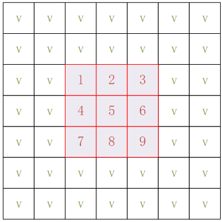
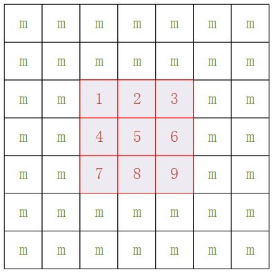
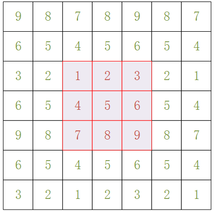
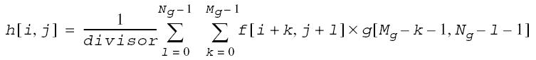
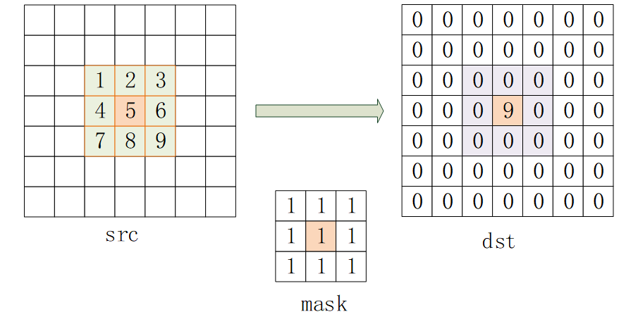
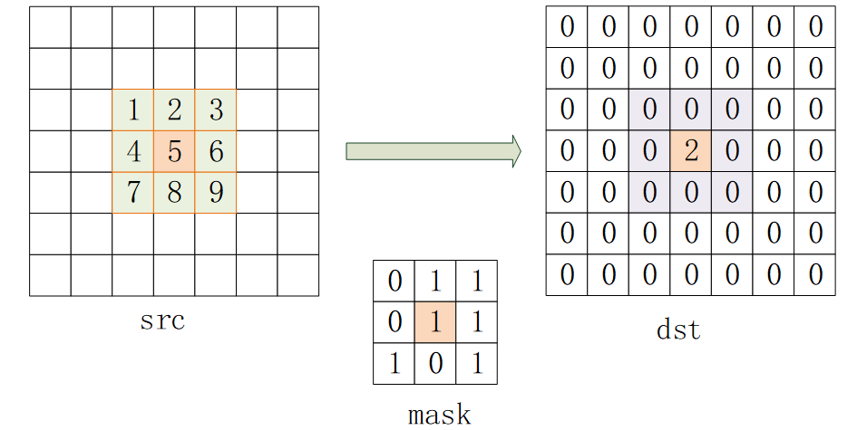
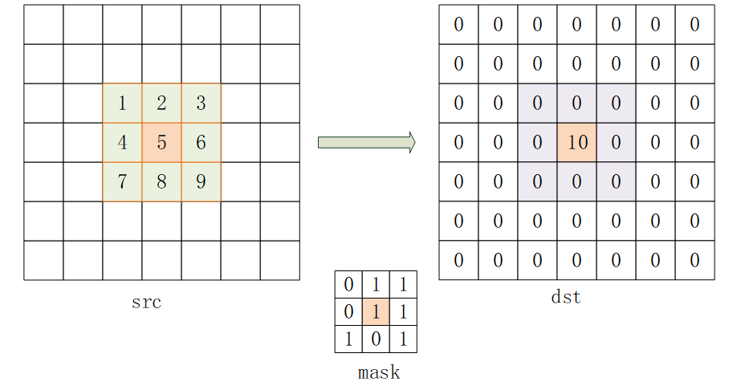
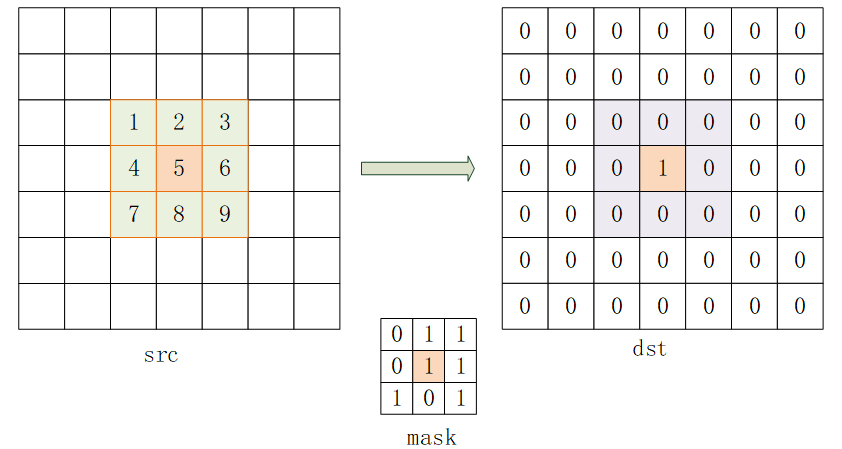

# HMPP API Reference

This document provides the HMPP API reference and describes how to query HMPP APIs.

## HMPP Structure

### Description of HMPP Header Files

The following table describes the header file of each HMPP module.

|File Name|Description|
|--|--|
|hmpp.h|Defines the version of the function library.|
|hmpp_core.h|Defines the public byte alignment, memory allocation, and memory release functions of the function library.|
|hmpps.h|Declaration file of the signal library.|
|hmppi.h|Declaration file of the image library.|
|hmpp_type.h|Defines the structures, enumeration types, and error codes used by the function library.|
|hmpp_typebase.h|Defines the basic data types of the function library.|

### Naming Rules

#### Function Naming

Names of functions in the HMPP function library are in the following format: [HMPPS|HMPPI|HMPPA]_<name\>\_<datatype\>[\_<descriptor\>]\(<parameters\>)

Example: `HmppResult HMPPS_MulC_64f64s_IS(double val, int64_t *srcDst, uint32_t len, int32_t scale);`

In the preceding example:

1. The prefix can be `HMPP` (basic functions), `HMPPI` (image library), or `HMPPS` (signal library).

2. `MulC` is the name of a function that multiplies a vector by a constant.

3. `64f64s` indicates the data types of the two input parameters of the function, which are `64f` (double) and `64s` (long long).

4. Extended description `_IS`:

    `I` indicates that the function is an in-place function. The function obtains values from the input vector in sequence, performs a series of operations, and saves the result in the source vector.

    `S` indicates that the function scales the output using the metric factor of the input parameter. The actual result can be restored by calculating the output vector with the metric factor to maintain precision.

5. The parameters passed to the interface are enclosed in parentheses.

**Function Name <name\>**

The name of a function indicates what the function does. The format is <name\>=<operation\>\[\_modifier\]. Where:

- *operation* consists of one or more words, acronyms, or abbreviations that describe the basic operation of a function.
- *modifier* consists of a word or abbreviation that denotes the extended capabilities of a function. It is used in some functions. For example, in functions like Norm and NormDiff that calculate vector norms, a modifier indicates whether the function calculates the 1-norm (\_L1), 2-norm (\_L2), or infinity norm (\_Inf). Similar functions include Threshold and FFT.

**Data Type <datatype\>**

The *<datatype>* element indicates the data type to be processed by the function, which is usually the data type of the function parameters. For details about the data types used in HMPP, see [Basic Data Types](#basic-data-types).

The format is \<bit depth\>\<bit interpretation\>. Where:

- *bit depth* indicates the bit width, which can be 8 bits, 16 bits, 32 bits, or 64 bits.
- *bit interpretation* indicates the data type, which can be unsigned integer (`u`), signed integer (`s`), floating point (`f`), or complex (`c`).

For functions that perform operations on a single data type, the <datatype\> field contains only one of the values listed above. If a function operates on source and destination vectors that have different data types, the respective data type identifiers are presented in the function name and follow a fixed sequence: <datatype\>=<src1Datatype\>\[src2Datatype\]\[dstDatatype\].

For example, the `HMPPS_DotProd_32f32fc` function calculates the dot product of two source vectors, which are a 32-bit floating-point vector and a 32-bit floating-point complex vector, respectively. The result is stored in a 32-bit floating-point complex destination vector.

**Descriptor <descriptor\>**

A descriptor consists of one or more letters, showing more details about a function and further describing the function's operation.

The following table lists the main descriptors.

|Value|Description|Example|
|--|--|--|
|I|The function performs an in-place operation, that is, the source vector and the destination vector are the same vector (the default is a non-in-place operation). For example, the formula for an in-place addition is: srcDst = srcDst + src|HMPPS_Add_16s_I|
|S|The function result is saturated and the scaling mode is fixed (the default is saturated with no scaling).|HMPPS_Add_16s_S|
|A*xx*|This descriptor provides rounding to *xx* valid binary digits.|HMPPS_Powx_32f_A11|

> **NOTE**
>
>- If a function has two or more descriptors, the descriptors are presented in alphabetical order in the function name (for example, `HMPPS_Add_16s_IS`).
>- For a function without a descriptor, the function name does not contain this field.

**Function Parameters <parameters\>**

The <parameters\> element specifies all parameters of a function.

The parameters are arranged in the following sequence:

1. Source operand, which is usually a vector or constant of a certain length.
2. Destination operand.
3. Other parameters that contain specific operations.

Parameter names comply with the following conventions:

1. Each parameter name specifies its functionality.
2. Input parameters are named `src`. In specific scenarios, numbers or words are added to further describe the meanings of input parameters, for example, `src2` and `srcLen`.
3. Output parameters are named `dst`. In specific scenarios, numbers or words are added to further describe the meanings of output parameters, for example, `dst2` and `dstLen`.
4. For functions that perform in-place operations, input and output parameters are named `srcDst`.

#### Return Values

Return values are error codes, which are defined in the enumeration type `HmppResult`. A return value indicates the function execution status.

There is no buffer to store the final error status. The caller needs to determine whether to check the error code when the function returns.

The following table describes the error codes.

|Value|Description|
|--|--|
|0|`HMPP_STS_NO_ERR`: No error occurs.|
|1 to 199|Common errors in the image and signal libraries, for example, null pointer or incorrect size.|
|200 to 299|Common alarms for the image and signal libraries, for example, unsupported mode or operation length overflow.|
|300 to 399|Common alarms for the image and signal libraries, for example, division by zero or taking the square root of a negative number, without altering the code execution flow.|
|400 to 599|Signal library error.|
|600 to 799|Image library error.|

> **NOTICE**
>A non-zero error code does not indicate that the function execution is not complete. Determine the situation according to the function processing logic.
>
>- Take `HMPPS_Div_32f` as an example:
> When the constant 0 is used as a divisor for calculation, the function execution is not interrupted. The result of the division is set to the maximum value of the data type of the source vector, that is, `FLT_MAX`. The function returns the status code `HMPP_STS_DIV_BY_ZERO`.
>- Take `HMPPS_DivC_64fc` as an example:
> When the constant 0 is used as a divisor for calculation, the function execution is interrupted and the error code `HMPP_STS_DIV_BY_ZERO_ERR` is returned immediately.

#### Function Prefixes

A function name prefix must be in uppercase.

The following table describes the function name prefixes.

|Prefix|Description|
|--|--|
|HMPP|Basic functions|
|HMPPI|Image library functions|
|HMPPS|Signal library functions|

#### Operations

Naming rule of function operations: upper camel case + acronyms

The following table describes the operations of functions and their naming rules.

|Operation|Description|Naming Rule|
|--|--|--|
|Add|Performs addition.|Upper camel case.|
|AddC|Adds a constant.|Upper camel case. C is the acronym for constant.|
|LShiftC|Shifts left by a constant.|Upper camel case. L and C are the acronyms for left and constant respectively.|
|FFTInv|Applies an inverse FFT.|Upper camel case. FFT is short for fast Fourier transform.|

#### Descriptors

Descriptors are capitalized. Multiple descriptors can be used together.

The following table describes the descriptors.

|Descriptor|Description|
|--|--|
|I|In-place operation. The operation result is written back to the data source.|
|S|Scaling operation. A floating-point scale factor `scale` is added to the function as a function parameter. The scale factor must be 2<sup>n</sup> and cannot be positive infinity or NaN. Scaling of a computation result is done by dividing the output vector by `scale` before the function returns. This helps retain the output data range or precision.|
|P|The operation can be performed only on a specified number of vectors.|
|A|Image data contains an alpha channel as the last channel and requires C4. The alpha channel is not processed.|
|A0|Image data contains an alpha channel as the first channel and requires C4. The alpha channel is not processed.|
|C|Channel of interest (COI) is used in the operation.|
|R|A function operates on a defined region of interest (ROI) for each source image.|
|V|A function operates on a defined volume of interest (VOI) for each source image.|
|C1|Image data is in pixel order and consists of one discrete interleaved channel.|
|C2|Image data is in pixel order and consists of two discrete interleaved channels.|
|C3|Image data is in pixel order and consists of three discrete interleaved channels.|
|C4|Image data is in pixel order and consists of four discrete interleaved channels.|
|M|The operation uses a mask to determine the pixels to be processed.|
|P2|Image data is in planar order and made up of two non-interleaved channels, with a separate pointer for each plane.|
|P3|Image data is in planar order and made up of three discrete planar (non-interleaved) channels, with a separate pointer for each plane.|
|P4|Image data is in planar order and made up of four discrete planar (non-interleaved) channels, with a separate pointer for each plane.|

#### Input Parameters

The format of input parameters of a function is as follows: <parameter_type\> <formal_parameter_name\>

<parameter_type\> includes basic data types (see [Basic Data Types](#basic-data-types)), structures, and enumeration types (see [Structures and Enumeration Types](#structures-and-enumeration-types)).

<formal_parameter_name\> is in lower camel case, for example, `src`, `value`, and `srcStep`.

### Basic Data Types

#### Data Types and Ranges in the Standard Library

The following table lists the macro definitions and ranges for data type thresholds defined by the C standard library in the AArch64 system.

|Type|Data Type|Minimum Value (Macro)|Minimum Value (Value)|Maximum Value (Macro)|Maximum Value (Value)|
|--|--|--|--|--|--|
|8u|uint8_t|-|0|UINT8_MAX|255, that is, 2<sup>8</sup>-1|
|8s|int8_t|INT8_MIN|-INT8_MAX - 1, that is, -2<sup>7</sup>|INT8_MAX|127, that is, 2<sup>7</sup>-1|
|16u|uint16_t|-|0|UINT16_MAX|65535, that is, 2<sup>16</sup>-1|
|16s|int16_t|INT16_MIN|-INT16_MAX - 1, that is, -2<sup>15</sup>|INT16_MAX|32767, that is, 2<sup>15</sup>-1|
|16f|float16_t|FLT16_MIN|6.10351562500000000000000000000000000e-5F16|FLT16_MAX|6.55040000000000000000000000000000000e+4F16|
|32u|uint32_t|-|0|UINT32_MAX|4294967295U, that is, 2<sup>32</sup>-1|
|32s|int32_t|INT32_MIN|-INT32_MAX - 1, that is, -2<sup>31</sup>|INT32_MAX|2147483647, that is, 2<sup>31</sup>-1|
|32f|float|FLT_MIN|1.17549435082228750796873653722224568e-38F|FLT_MAX|3.40282346638528859811704183484516925e+38F|
|64s|int64_t|INT64_MIN|-INT64_MAX - 1, that is, -2<sup>63</sup>|INT64_MAX|9223372036854775807L, that is, 2<sup>63</sup>-1|
|64f|double|DBL_MIN|2.22507385850720138309023271733240406e-308L|DBL_MAX|1.79769313486231570814527423731704357e+308L|

#### User-defined Data Types and Ranges

**Complex Types**

A complex number in HMPP is described by a structure consisting of two members of basic data types, which represent the real and imaginary parts of the complex number.

The format is defined as follows:

```c
typedef struct {
    <data_type>  re;
    <data_type>  im;
} Hmpp<type>c;
```

> **NOTE**
>For details about the mapping between <type> and <data_type> in the format, see [Data Types and Ranges in the Standard Library](#data-types-and-ranges-in-the-standard-library).

The complex types used in HMPP are defined in `hmpp_typebase.h`, including Hmpp16sc, Hmpp16uc, Hmpp32sc, Hmpp32fc, Hmpp64sc, Hmpp64fc, and Hmpp8sc.

**Bool Type**

It is defined in the form of enumeration (defined in `hmpp_typebase.h`) as follows:

```c
typedef enum {
    HMPP_FALSE = 0,
    HMPP_TRUE = 1
} HmppBool;
```

**Special Data Types**

Some data types (such as 24s) are not supported by HMPP. You can use the `Convert` function to convert the data types to those supported by HMPP for subsequent processing.

For 24-bit signed data, each vector element consists of three consecutive 8-bit unsigned character bytes (uint8\_t) and is stored in little-endian byte order. Specifically, the lowest 8 bits of the vector element are stored at the lowest address, and the most significant bit (MSB) of the highest 8 bits serves as the sign bit. These data can be converted to 32-bit signed integer (32s) or 32-bit floating-point (32f) type by using the `Convert` function in HMPP.

The following table describes the user-defined data ranges in HMPP.

|Macro Definition|Maximum Value|Description|
|--|--|--|
|UINT24_MAX|16777215|The corresponding data type is not defined and is stored in the variable of the uint32_t type.|
|INT24_MAX|8388607|The corresponding data type is not defined and is stored in the variable of the int32_t type.|
|INT24_MIN|-8388608|The corresponding data type is not defined and is stored in the variable of the int32_t type.|

### Structures and Enumeration Types

#### Description of Structures and Enumeration Types

There are complex data structures and function context structures.

Enumeration types include return value and bool types.

The following table describes the naming rules and formats of structures.

|Structure Type|Naming Rule|Format|
|--|--|--|
|Type name|Upper camel case, with "Hmpp" as the prefix|Example: `HmppLibraryVersion`|
|Member variable name|Lower camel case|Example: `major`, `buildDate`|

The following table describes the naming rules and formats of enumeration types.

|Enumeration Type|Naming Rule|Format|
|--|--|--|
|Type name|Upper camel case, with "Hmpp" as the prefix|Example: `HmppResult`|
|Member variable name|All capitalized, separated with underscores (_)|Example: `HMPP_STS_NO_ERR`|

#### Structures

**Complex Data Structures**

For details, see the complex types in [User-defined Data Types and Ranges](#user-defined-data-types-and-ranges).

**Function Context Structures**

HMPP defines some special structures to store the context information of specific functions. For example, the `HmppFFTSpec` structure stores twiddle factors and bit-reversal indexes that are required in the fast Fourier transform. Depending on their state after being referenced by a function, context structures are classified into two types:

- If a function references the structure without modifying its member variables, the structure name contains the prefix _Spec_.
- If a function references the structure and modifies its member variables, the structure name contains the prefix _State_.

The function context interpretation is processor-dependent. Therefore, context structures are not defined in the public headers, and their fields are not accessible. HMPP provides no option of modifying these structures or creating a function context as an automatic variable.

#### Enumeration Types

The constant `HmppResult` enumerates the status values returned by HMPP functions, indicating whether an error occurs in the operation.

For details about the valid status values and error information of signal processing functions, see [Return Values](#return-values).

- The enumeration type `HmppAlgMode` defines the algorithm types used by some functions:

    ```c
    typedef enum {
        HMPP_ALG_AUTO,      // Automatic algorithm selection based on the data scale.
        HMPP_ALG_DEFAULT,   // Direct calculation based on definition.
        HMPP_ALG_FFT,       // Use FFT to accelerate computing.
    } HmppAlgMode;
    ```

- The enumeration type `HmppNormMode` defines the algorithm types used by some functions:

    ```c
    typedef enum {
        HMPP_NORM_NORMAL,
        HMPP_NORM_BIASED,
        HMPP_NORM_UNBIASED,
    } HmppNormMode;
    ```

- The enumeration type `HmppCmpOp` defines the relational operator types in the `Threshold` function:

    ```c
    typedef enum {
        HMPP_CMP_LESS,    // When src[i] < level, assign the value of level to dst[i]. Otherwise, assign the value of src[i] to dst[i].
        HMPP_CMP_GREATER  // When src[i] > level, assign the value of level to dst[i]. Otherwise, assign the value of src[i] to dst[i].
    } HmppCmpOp;
    ```

- The enumeration type `HmppRoundMode` defines the rounding modes used in the conversion function:

    ```c
    typedef enum {
        HMPP_RND_ZERO,        // Round to zero. A floating-point input is forcibly converted to integer output.
        HMPP_RND_NEAR,        // Round to the nearest even number (convergent rounding).
        HMPP_RND_FINANCIAL    // Round off.
    } HmppRoundMode;
    ```

- The enumeration type `HmppHintAlgorithm` defines the computation modes used in some functions. Specifically, it allows a choice between faster computation with some loss of accuracy, or guaranteed accuracy at the expense of computation speed:

    ```c
    typedef enum {
        HMPP_ALGHINT_NONE,        // Same as HmppAlgHintAccurate. The accuracy is ensured, but the computation speed is slow.
        HMPP_ALGHINT_FAST,        // Fast but less accurate computation
        HMPP_ALGHINT_ACCURATE     // Accurate but slow computation
    } HmppHintAlgorithm;
    ```

- The enumeration type `HmppZCType` defines the calculation methods used in the zero-crossing count function `ZeroCrossing`:

    ```c
    typedef enum {
        HMPP_ZCR,
        HMPP_ZCX_OR,
        HMPP_ZCC
    } HmppZCType;
    ```

- The enumeration type `HmppiBorderType` defines the border padding methods used in image processing:

    ```c
    typedef enum {
        HMPPI_BORDER_REPL = 1,
        HMPPI_BORDER_WRAP = 2,
        HMPPI_BORDER_MIRROR = 3,
        HMPPI_BORDER_MIRROR_R = 4,
        HMPPI_BORDER_DEFAULT = 5,
        HMPPI_BORDER_CONST = 6,
        HMPPI_BORDER_TRANSP = 7,
        HMPPI_BORDER_IN_MEM_TOP = 0x0010,
        HMPPI_BORDER_IN_MEM_BOTTOM = 0x0020,
        HMPPI_BORDER_IN_MEM_LEFT = 0x0040,
        HMPPI_BORDER_IN_MEM_RIGHT = 0x0080,
        HMPPI_BORDER_IN_MEM = HMPPI_BORDER_IN_MEM_LEFT | HMPPI_BORDER_IN_MEM_TOP | \
                              HMPPI_BORDER_IN_MEM_RIGHT | HMPPI_BORDER_IN_MEM_BOTTOM, // 0xF0
    } HmppiBorderType;
    ```

    The border padding methods are described as follows:

    - **HMPP\_BORDER\_CONST**

        The values for border pixels are set to a specified constant value. When a constant border is used, the values of all border pixels are set to the constant value you specify for parameter `borderValue`. In the figure below, the constant value is demoted as **V**. The squares marked in red correspond to the pixels copied from the source image ROI.

        

    - **HMPP\_BORDER\_DEFAULT**

        Uses the `HMPP_BORDER_CONST` border type. The `borderValue` is set according to the selected basic operation. For example, `borderValue` in the dilation function interface is set to `MIN_VALUE` (minimum value of the source data type); and `borderValue` in the erosion function interface is set to `MAX_VALUE` (maximum value of the source data type). In the figure below, **m** indicates the fixed value of the source image's data type.

        

    - **HMPP\_BORDER\_REPL**

        The values for border pixels are replicated from the boundary pixels of the source image. When a replicated border is used, the values of border pixels are obtained from the source image's boundary pixels, as shown below.

        

    - **HMPP\_BORDER\_IN\_MEM**

        The values for border pixels are obtained from the source image pixels in memory. Use this border type if the ROI does not cover the internal border pixels of the source image. In this case, the values for border pixels are obtained from the source image pixels in memory. In the figure below, the squares marked in red correspond to the pixels copied from the source image ROI. The squares marked in black correspond to the source image pixels in memory.

        

    - **HMPP\_BORDER\_MIRROR**

        The values for border pixels are mirrored from the boundary pixels of the source image. When a mirrored border is used, the values for border pixels are obtained from the source image's boundary pixels. The squares marked in red correspond to the pixels copied from the source image ROI. The squares with green values correspond to border pixels that are mirrored from source image pixels.

        

- The enumeration type `HmppAmrnbMode` defines the encoding rates of the AMRNB standard.

    ```c
    typedef enum {
        HMPP_AMRNB_MR475,   // 4.75 kbit/s bit rate
        HMPP_AMRNB_MR515,   // 5.15 kbit/s bit rate
        HMPP_AMRNB_MR59,    // 5.9 kbit/s bit rate
        HMPP_AMRNB_MR67,    // 6.7 kbit/s bit rate
        HMPP_AMRNB_MR74,    // 7.4 kbit/s bit rate
        HMPP_AMRNB_MR795,   // 7.95 kbit/s bit rate
        HMPP_AMRNB_MR102,   // 10.2 kbit/s bit rate
        HMPP_AMRNB_MR122    // 12.2 kbit/s bit rate
    } HmppAmrnbMode;
    ```

- The enumeration type `HmppAmrwbMode` defines the encoding rates of the AMRWB standard.

    ```c
    typedef enum {
        HMPP_AMRWB_6600,    // 6.6 kbit/s bit rate
        HMPP_AMRWB_8850,    // 8.85 kbit/s bit rate
        HMPP_AMRWB_12650,   // 12.65 kbit/s bit rate
        HMPP_AMRWB_14250,   // 14.25 kbit/s bit rate
        HMPP_AMRWB_15850,   // 15.85 kbit/s bit rate
        HMPP_AMRWB_18250,   // 18.25 kbit/s bit rate
        HMPP_AMRWB_19850,   // 19.85 kbit/s bit rate
        HMPP_AMRWB_23050,   // 23.05 kbit/s bit rate
        HMPP_AMRWB_23850,   // 23.85 kbit/s bit rate
    } HmppAmrwbMode;
    ```

### Integer Scaling

Because some signal processing functions improve precision during internal computations, a scale factor is added as a function parameter when these functions are called, and the called function scales the internal computation result by using an integer scale factor. The scale factor must be 2<sup>n</sup> and cannot be positive infinity or NaN. These signal processing functions have the "S" descriptor in their names.

Scaling of a computation result is done by multiplying the output vector by `scale` before the function returns. This helps retain the output data range or precision.

For example, when squaring a 16-bit signed integer with a value of 300, the mathematical result of 90000 overflows, causing the actual stored value to saturate at 32767. If the scaling factor (`scale`) is set to 0.25 (2<sup>-2</sup>), the stored calculation result becomes 22500, which avoids overflow. The actual result can be restored by multiplying 22500 by 4.

For scenarios where precision needs to be partially retained, for example, the root extraction of integer 3, the `HMPPS_Sqrt` function calls the library function `sqrt` for calculation. Without passing a scale parameter, the program outputs a result of 2 instead of 1.732. However, if a scale parameter of 8 (2<sup>3</sup>) is passed to the program, the program scales the calculation result and outputs the result 14. The caller can use the output result 14 and the scale parameter 0.125 (2<sup>-3</sup>) to obtain a more accurate result: 14 x 2<sup>-3</sup> = 1.75.

## HMPP Interface Functions

### Basic Functions

#### Function Description

This module implements 63 basic functions, including functions for performing byte alignment, memory allocation, memory release, and multi-threading, obtaining status code description, thread information, CPU cache, clock frequency, CPU timestamp, HMPP version, and instruction information, and toggling the FlushToZero mode.

> **NOTE**
>Example code of the interfaces provided below references the HMPP header file `hmpp.h`.

#### AlignPtr

**Aligns the input address to the specified byte boundary:**

void\* HMPP\_AlignPtr\(void \*ptr, int32\_t align\);

**Parameters**

|Parameter|Description|Value Range|Input/Output|
|--|--|--|--|
|ptr|Source address.|Not null|Input|
|align|Alignment boundary.|Integer power of 2|Input|

**Returns**

- Success: The alignment boundary is an integer power of 2, and the returned address is aligned by `align`.
- Failure: The alignment boundary is not an integer power of 2, and the returned address may not be aligned by `align`.

**Error Codes**

None

**Note**

- The user is responsible for ensuring the correctness of the input parameters for this function, as no error codes will be returned. Check the return value after calling this function. The operation results may not align with expectations.
- The interface does not provide bounds checking. The upper-layer code must ensure that no out-of-bounds (OOB) memory access occurs.

**Example**

```c
#define BUFFER_SIZE 100
#define ALIGN_BYTE 64
void AlignPtr_Example() {
    void *ptr = malloc(BUFFER_SIZE);
    if (ptr != NULL) {
        void *alignPtr = HMPP_AlignPtr(ptr, ALIGN_BYTE);
        if ((uint64_t)alignPtr % ALIGN_BYTE == 0) {
            printf("%d byte align\n", ALIGN_BYTE);
        } else {
            printf("not byte align\n");
        }
    }
}
```

Output:

```text
64 byte align
```

#### Malloc and Free

- **Allocates memory of a specified size in bytes:**

    void\* HMPP\_Malloc\(int32\_t len\);

- **Releases memory:**

    void HMPP\_Free\(void\* ptr\);

**Parameters**

|Parameter|Description|Value Range|Input/Output|
|--|--|--|--|
|len|Byte length (`HMPP_Malloc`). Array length (`HMPPS_Malloc_xxx`).|> 0|Input|
|ptr|Address of the memory to be released (`Free`).|Not null|Input|

**Returns**

`HMPP_Malloc`:

- Success: The start address of the allocated memory is returned.
- Failure: NULL

**Note**

The input parameter of `Free` must be the return of `Malloc`.

**Example**

```c
#define BUFFER_SIZE 100
void Malloc_Free_Example() {
    void *ptr = HMPP_Malloc(BUFFER_SIZE);
    int suc = (ptr != NULL);
    HMPP_Free(ptr);
    uint8_t *ptrs = HMPPS_Malloc_8u(BUFFER_SIZE);
    suc = suc & (ptrs != NULL);
    HMPPS_Free(ptrs);
    printf("%d", suc);
}
```

Output:

```text
1
```

#### GetStatusString

**Obtains the status code description:**

const char\* HMPP\_GetStatusString\(HmppResult result\);

**Parameters**

|Parameter|Description|Value Range|Input/Output|
|--|--|--|--|
|result|Status code.|Enumeration types in `HMPPResult`|Input|

**Returns**

- Success: The description of the status code is returned.
- Failure: Not Found This Error Description

**Error Codes**

None

**Note**

Do not release the memory pointed to by the returned pointer.

**Example**

```c
void  HMPP_GetStatusString_Example()
{
    printf("%s\n", HMPP_GetStatusString(HMPP_STS_NO_ERR));
    printf("%s\n", HMPP_GetStatusString(HMPP_STS_NULL_PTR_ERR));
    printf("%s\n", HMPP_GetStatusString(HMPP_STS_SIZE_ERR));
    printf("%s\n", HMPP_GetStatusString(HMPP_STS_NOT_SUPPORT));
}
```

Output:

```text
No Error
Null Pointer Error
Vector size <= 0 Error
This system does not support this function
```

#### Thread

- **Sets the maximum number of threads:**

    HmppResult HMPP\_SetNumberThreads \(int32\_t numberThreads\);

- **Obtains the current number of threads:**

    HmppResult HMPP\_GetNumberThreads \(int32\_t\* numberThreads\);

- **Obtains the current thread ID:**

    HmppResult HMPP\_GetThreadIdx \(int32\_t\* threadIdx\);

- **Obtains the current multi-threaded mode:**

    HmppResult HMPP\_GetThreadType \(HmppThreadType\* threadType\);

**Parameters**

|Parameter|Description|Value Range|Input/Output|
|--|--|--|--|
|numberThreads|Maximum number of threads (`SetNumberThreads`).|> 0|Input|
|numberThreads|Pointer to the number of threads (`GetNumberThreads`).|Not null|Output|
|threadIdx|Pointer to the current thread ID.|Not null|Output|
|threadType|Pointer to the current thread mode.|Not null|Output|

**Returns**

- Success: HMPP\_STS\_NO\_ERR
- Failure: An error code is returned.

**Error Codes**

|Error Code|Description|
|--|--|
|HMPP_STS_NULL_PTR_ERR|The input pointer is null.|
|HMPP_STS_SIZE_ERR|The value of `len` is less than or equal to 0.|

**Example**

```c
#define NUMBER_THREAD_LIM 4
void  Thread_Example()
{
    HmppResult result = HMPP_SetNumberThreads(NUMBER_THREAD_LIM);
    printf("%s\n", HMPP_GetStatusString(result));

    HmppThreadType testThrType;
    result = HMPP_GetThreadType(&testThrType);
    printf("%s\n", HMPP_GetStatusString(result));

    if (testThrType == OMP) {
        printf("thread mode is omp\n");
        #pragma omp parallel for
        for (int32_t i = 0; i < NUMBER_THREAD_LIM; ++i) {
            int32_t testNumThr, testThrIdx;
            HMPP_GetNumberThreads(&testNumThr);
            HMPP_GetThreadIdx(&testThrIdx);
            printf("testNumThr = %d, testThrIdx = %d\n", testNumThr, testThrIdx);
        }
    } else {
        printf("no thread mode\n");
        int32_t testNumThr, testThrIdx;
        HMPP_GetNumberThreads(&testNumThr);
        HMPP_GetThreadIdx(&testThrIdx);
        printf("testNumThr = %d, testThrIdx = %d\n", testNumThr, testThrIdx);
    }
}
```

Output:

- Case 1: The multi-threaded mode is not enabled for HMPP.

    ```text
    No Error
    No Error
    no thread mode
    testNumThr = 1, testThrIdx = 0
    ```

- Case 2: The multi-threaded mode is enabled for HMPP.

    ```text
    No Error
    No Error
    thread mode is omp
    testNumThr = 4, testThrIdx = 1
    testNumThr = 4, testThrIdx = 3
    testNumThr = 4, testThrIdx = 2
    testNumThr = 4, testThrIdx = 0
    ```

> **NOTE**
>
>- Only binary packages are released for HMPP, and the OMP compilation option is not enabled. Therefore, multi-threading functionality is not supported yet.
>- If multi-threading functionality is supported, the print order among multiple threads might differ from the example output shown above.

#### GetCacheInfo

- **Obtains the L2 cache size:**

    HmppResult HMPP\_GetL2CacheSize \(int32\_t \*size\);

- **Obtains the larger value between the L2 cache and L3 cache:**

    HmppResult HMPP\_GetMaxCacheSizeB \(int32\_t \*size\);

- **Obtains cache parameters of each level, such as the cache type, level, and size:**

    HmppResult HMPP\_GetCacheParams \(HmppCache \*\*cacheInfo\);

**Parameters**

|Parameter|Description|Value Range|Input/Output|
|--|--|--|--|
|size|Pointer to the buffer size.|Not null|Output|
|cacheInfo|Pointer to the pointer to the `HmppCache` array.|Not null|Output|

**Returns**

- Success: HMPP\_STS\_NO\_ERR
- Failure: An error code is returned.

**Error Codes**

|Error Code|Description|
|--|--|
|HMPP_STS_NULL_PTR_ERR|`size` or `cacheInfo` is a null pointer.|
|HMPP_STS_NOT_SUPPORT|Failed to obtain cache information.|

**Example**

```c
void  GetCacheInfo_Example()
{
    int32_t l2CacheSize = 0;
    HmppResult result = HMPP_GetL2CacheSize(&l2CacheSize);
    printf("%s\n", HMPP_GetStatusString(result));
    printf("l2CacheSize = %d Byte\n\n", l2CacheSize);

    int32_t maxCacheSize = 0;
    result = HMPP_GetMaxCacheSizeB(&maxCacheSize);
    printf("%s\n", HMPP_GetStatusString(result));
    printf("maxCacheSize = %d Byte\n\n", maxCacheSize);

    HmppCache *pCacheSize;
    result = HMPP_GetCacheParams(&pCacheSize);
    printf("%s\n", HMPP_GetStatusString(result));
    int32_t i = 0;
    while (pCacheSize[i].type) {
        printf("type = %d\n", pCacheSize[i].type);
        printf("type = %d\n", pCacheSize[i].level);
        printf("type = %d Byte\n\n", pCacheSize[i].size);
        ++i;
    }
}
```

Output:

```text
No Error
l2CacheSize = 524288 Byte

No Error
maxCacheSize = 33554432 Byte

No Error
type = 1
type = 1
type = 65536 Byte

type = 2
type = 1
type = 65536 Byte

type = 3
type = 2
type = 524288 Byte

type = 3
type = 3
type = 33554432 Byte
```

> **NOTE**
>The actual output may be different. You can call `lscpu` to compare the outputs.

#### GetCpuFreq

**Obtains the CPU frequency:**

HmppResult HMPP\_GetCpuFreqMhz \(int32\_t \*mhz\);

**Parameters**

|Parameter|Description|Value Range|Input/Output|
|--|--|--|--|
|mhz|Pointer to the CPU frequency.|Not null|Output|

**Returns**

- Success: HMPP\_STS\_NO\_ERR
- Failure: An error code is returned.

**Error Codes**

|Error Code|Description|
|--|--|
|HMPP_STS_NULL_PTR_ERR|`mhz` is a null pointer.|
|HMPP_STS_NOT_SUPPORT|Failed to obtain information.|

**Example**

```c
void  GetCpuFreq_Example()
{
    int32_t mhz;
    HmppResult result = HMPP_GetCpuFreqMhz(&mhz);
    printf("%s\n", HMPP_GetStatusString(result));
    printf("cpu frequency = %d Mhz\n", mhz);
}
```

Output:

```text
No Error
cpu frequency = 2600 Mhz
```

> **NOTE**
>
>- The correct value can be returned only when this interface is called by the `root` user.
>- The actual output may be different. You can call `dmidecode -t processor | grep "Current"` to compare the outputs.

#### GetCpuClock

**Obtains the timestamp, that is, the number of clock cycles after the device is reset:**

uint64\_t HMPP\_GetCpuClock \(\);

**Returns**

Current timestamp

**Error Codes**

None

**Example**

```c
void  GetCpuClock()
{
    printf("clock = %llu\n", HMPP_GetCpuClock());
}
```

Output:

```text
clock = 259338746414838
```

> **NOTE**
>The actual value of `clock` varies.

#### GetLibVersion

**Obtains the HMPP version information:**

const HmppLibraryVersion\* HMPP\_GetLibVersion \(\);

**Returns**

Returns the start address that points to the `HmppLibraryVersion` variable that stores version information.

**Error Codes**

None

> **NOTE**
>
>1. Do not release the memory pointed to by the pointer.
>2. This API is deprecated. For related functions, you are advised to use `GetProductVersion` instead.

**Example**

```c
void  HMPP_GetLibVersion_Example()
{
    const HmppLibraryVersion *libVersion = HMPP_GetLibVersion();
    printf("HMPP_VERSION_MAJOR = %d\n", libVersion->major);
    printf("HMPP_VERSION_MINOR = %d\n", libVersion->minor);
    printf("HMPP_VERSION_PATCH = %d\n", libVersion->patch);
    printf("HMPP_VERSION_BUILDDATE = %s\n", libVersion->buildDate);
}
```

Output:

```text
HMPP_VERSION_MAJOR = 1
HMPP_VERSION_MINOR = 0
HMPP_VERSION_PATCH = 0
HMPP_VERSION_BUILDDATE = 2020.04.27
```

#### GetProductVersion

Obtains information about the installed HMPP, including the software name, software version, product version, and product build time.

The function interface is declared as follows:

HmppResult HMPP\_GetProductVersion\(HmppProVersion \*packageInfo\);

**Returns**

- Success: HMPP\_STS\_NO\_ERR
- Failure: An error code is returned.

**Parameters**

|Parameter|Description|Value Range|Input/Output|
|--|--|--|--|
|packageInfo|Destination structure, which stores the output HMPP product information.|Not null|Output|

**Error Codes**

|Error Code|Description|
|--|--|
|HMPP_STS_NULL_PTR_ERR|`HmppProVersion` is a null pointer.|

**Example**

```c
void  HMPP_GetProductVersion_Example()
{
    HmppProVersion versionGet;
    HmppResult result = HMPP_GetProductVersion(&versionGet);
    HmppProVersion *version = &versionGet;
    if (result == HMPP_STS_NO_ERR) {
        printf("Product Name: %s\n", version->productName);
        printf("Product Version: %s\n", version->productVersion);
        printf("Component Name: %s\n", version->componentName);
        printf("Component Version: %s\n", version->componentVersion);
        printf("Component AppendInfo: %s\n", version->componentAppendInfo);
        printf("Software Name: %s\n", version->softwareName);
        printf("Software Version: %s\n", version->softwareVersion);
    }
}
```

Output:

```text
Product Name: Kunpeng BoostKit
Product Version: 26.0.0
Component Name: BoostMedia-HMPP
Component Version: 2.6.1.beta1
Component AppendInfo: gcc
Software Name: boostmedia-hmpp
Software Version: 2.6.1.beta1
```

> **NOTE**
>The version number and build time in the example above are for reference only.

#### CpuFeature

- **Sets the instruction set supported by HMPP:**

    HmppResult HMPP\_SetCpuFeatures \(uint64\_t cpuFeatures\);

- **Obtains the instruction set supported by the CPU:**

    HmppResult HMPP\_GetCpuFeatures \(uint64\_t\* cpuFeatures\);

- **Obtains the instruction set supported by HMPP:**

    uint64\_t HMPP\_GetEnabledCpuFeatures\(\)

**Parameters**

|Parameter|Description|Value Range|Input/Output|
|--|--|--|--|
|cpuFeatures|Instruction set supported by HMPP to be set (`SetCpuFeatures`).|Macros with the suffix "_FM" in the `hmpp_core.h` header file|Input|
|cpuFeatures|Pointer to the address storing the bitmask of instruction set features supported by the CPU (`GetCpuFeatures`). |Not null|Output|

**Returns**

HMPP\_SetCpuFeatures

- Success: HMPP\_STS\_NO\_ERR
- Failure: HMPP\_STS\_UNKNOWN\_FEATURE

HMPP\_GetCpuFeatures

- Success: HMPP\_STS\_NO\_ERR
- Failure: HMPP\_STS\_NULL\_PTR\_ERR

HMPP\_GetEnabledCpuFeatures

- Bitmask of instruction set features supported by HMPP

**Error Codes**

|Error Code|Description|
|--|--|
|HMPP_STS_NULL_PTR_ERR|`cpuFeatures` is a null pointer.|
|HMPP_STS_UNKNOWN_FEATURE|The instruction set to be set is not supported.|

**Note**

Only the NEON\_FM mode (defined in `hmppcore.h`) is supported.

**Example**

```c
void  CpuFeature()
{
    uint64_t cpuFeatures;
    HmppResult result = HMPP_GetCpuFeatures(&cpuFeatures);
    printf("%s\n", HMPP_GetStatusString(result));
    printf("cpuFeatures = %016x\n", cpuFeatures);

    result = HMPP_SetCpuFeatures(NEON_FM);
    printf("%s\n", HMPP_GetStatusString(result));

    printf("enabledCpuFeatures = %016x\n", HMPP_GetEnabledCpuFeatures());
}
```

Output:

```text
No Error
cpuFeatures = 0000000000000001
No Error
enabledCpuFeatures = 0000000000000001
```

#### SetDenormAreZeros

**Enables or disables the flush-to-zero (FTZ) mode:**

HmppResult HMPP\_SetDenormAreZeros \(int32\_t value\);

**Parameters**

|Parameter|Description|Value Range|Input/Output|
|--|--|--|--|
|value|`0`: disabled; other values: enabled|int32_t|Input|

**Returns**

- Success: HMPP\_STS\_NO\_ERR
- Failure: An error code is returned.

**Error Codes**

|Error Code|Description|
|--|--|
|HMPP_STS_NOT_SUPPORT|The current system does not use the AArch64 architecture and does not support this function.|

**Example**

```c
#define LEN 4
void  SetDenormAreZeros_Example()
{
    HmppResult result = HMPP_SetDenormAreZeros(1);
    cout << HMPP_GetStatusString(result) << endl;
    const float a[LEN] = {0.99 * pow(2, -126), 1.0 * pow(2, -126),
                          1.5 * pow(2, -126), 1.5 * pow(2, -126)};
    const float b[LEN] = {0.99 * pow(2, -126), 0.99 * pow(2, -126),
                          1.4 * pow(2, -126), -1.4 * pow(2, -126)};

    for (int32_t i = 0; i < LEN; ++i) {
        cout << a[i] + b[i] << endl;
    }

    result = HMPP_SetDenormAreZeros(0);
    cout << HMPP_GetStatusString(result) << endl;

    for (int32_t i = 0; i < LEN; ++i) {
        cout << a[i] + b[i] << endl;
    }
}
```

Output:

```text
No Error
0
1.17549e-38
3.40893e-38
0
No Error
2.32748e-38
2.33923e-38
3.40893e-38
1.17549e-39
```

#### Init

**Performs initialization:**

HmppResult HMPP\_Init\(\);

> **NOTE**
>This function calls `HMPP_GetL2CacheSize`, `HMPP_GetMaxCacheSizeB`, and `HMPP_GetCacheParams`.

**Returns**

HMPP\_STS\_NO\_ERR

**Error Codes**

None

#### ParallelFor

**Performs parallel iterations:**

HmppResult HMPP\_ParallelFor \(int32\_t numTasks, void \*arg, function func\);

> **NOTE**
>Multiple tasks to be executed can be encapsulated in `HmppResult(*function)(int32_t i, void *arg)`. For details, see the example.

**Parameters**

|Parameter|Description|Value Range|Input/Output|
|--|--|--|--|
|numTasks|Number of tasks.|> 0 (If the value is less than 0, no exceptions are reported and such a value indicates that no tasks are created.)|Input|
|arg|Pointer to the value of `func`.|Not null|Input|
|func|Pointer to the function (task) to be executed.|Not null|Input|

**Returns**

- Success: HMPP\_STS\_NO\_ERR
- Failure: An error code is returned.

**Error Codes**

|Error Code|Description|
|--|--|
|HMPP_STS_NULL_PTR_ERR|`arg` or `func` is a null pointer.|

> **NOTE**
>An error code will be returned if the multi-threaded mode is enabled. The caller can set the error code in the user-defined function.

**Example**

```c
#define LEN 20
 
void  ParallelFor_Example()
{
    typedef struct {
        int32_t val[LEN];
        int32_t rangeLen;
    }Arg;
    // Operation of this function: obtaining the absolute value of a segment in an array
    auto func = [] (int32_t i, void *arg) -> HmppResult {
        Arg *args = (Arg *)arg;
        int32_t st = i * args->rangeLen;
        int32_t ed = st + args->rangeLen;
        for (int32_t k = st; k < ed; ++k) {
            args->val[k] = abs(args->val[k]);
        }
        return HMPP_STS_NO_ERR;
    };

    Arg arg;
    arg.rangeLen = 5;
    for (int32_t i = 0; i < LEN; ++i) {
        arg.val[i] = -(i + 1);
    }

    HmppResult result = HMPP_ParallelFor(LEN / arg.rangeLen, (void*)&arg, func);

    for (int32_t i = 0; i < LEN; ++i) {
        printf("%d\n", arg.val[i]);
    }
}
```

Output:

```text
1
2
3
4
5
6
7
8
9
10
11
12
13
14
15
16
17
18
19
20
```

### Signal Library (HMPPS)

#### Function Description

This module implements the following functions:

- Basic vector operations: logical shift, vector conversion, vector statistics, sampling function, and initialization function
- Signal conversion: FFT, CZT, power spectrum, Hilbert transform, and wavelet transform
- Filtering: convolution, FIR filtering, IIR filtering, resampling, median filtering, and autocorrelation
- Window functions: Blackman, Hann, Kaiser, Hamming, and Bartlett
- Mathematical operations: arithmetic operation, triangle operation, and power, root, and exponential operations

    > **NOTE**
    >Example code of the interfaces provided below references the HMPP header file `hmpp.h`.

#### Basic and Common Calculations

##### Abs

Calculates the absolute values of vector elements.

The function interface is declared as follows:

- **Operations on integers:**

    HmppResult HMPPS\_Abs\_16s\(const int16\_t\* src, int16\_t\* dst, int32\_t len\);

    HmppResult HMPPS\_Abs\_32s\(const int32\_t\* src, int32\_t\* dst, int32\_t len\);

- **Operations on floating-point numbers:**

    HmppResult HMPPS\_Abs\_32f\(const float\* src, float\* dst, int32\_t len\);

    HmppResult HMPPS\_Abs\_64f\(const double\* src, double\* dst, int32\_t len\);

- **In-place operations on integers:**

    HmppResult HMPPS\_Abs\_16s\_I\(int16\_s\* srcDst, int32\_t len\);

    HmppResult HMPPS\_Abs\_32s\_I\(int32\_s\* srcDst, int32\_t len\);

- **In-place operations on floating-point numbers:**

    HmppResult HMPPS\_Abs\_32f\_I\(float\* srcDst, int32\_t len\);

    HmppResult HMPPS\_Abs\_64f\_I\(double\* srcDst, int32\_t len\);

**Parameters**

|Parameter|Description|Value Range|Input/Output|
|--|--|--|--|
|src|Pointer to the source vector.|Not null|Input|
|dst|Pointer to the destination vector.|Not null|Output|
|srcDst|Pointer to the in-place operation vector.|Not null|Input/Output|
|len|Vector length.|(0, INT_MAX]|Input|

**Returns**

- Success: HMPP\_STS\_NO\_ERR
- Failure: An error code is returned.

**Error Codes**

|Error Code|Description|
|--|--|
|HMPP_STS_NULL_PTR_ERR|`src`, `dst`, or `srcDst` is a null pointer.|
|HMPP_STS_SIZE_ERR|The value of `len` is less than or equal to 0.|

**Example**

```c
#define BUFFER_SIZE_T 10
void AbsExample(void)
{
    float src[BUFFER_SIZE_T] = {1.64, 1.63, -1.09, 0.71, -3.20, -0.43, 0.41, -4.83, 5.36, -4.40};
    float dst[BUFFER_SIZE_T];
    (void)HMPPS_Zero_32f(dst, BUFFER_SIZE_T); // Initializes all elements of dst to 0.

    HmppResult result = HMPPS_Abs_32f(src, dst, BUFFER_SIZE_T);
    printf("result = %d\n", result);
    if (result != HMPP_STS_NO_ERR) {
        return;
    }

    printf("dst =");
    for (int i = 0; i < BUFFER_SIZE_T; i++) {
        printf(" %.2f", dst[i]);
    }
    printf("\n");
}
```

Output:

```text
result = 0
dst = 1.64 1.63 1.09 0.71 3.20 0.43 0.41 4.83 5.36 4.40
```

##### Add

Adds two vectors.

The function interface is declared as follows:

- **Operations on integers:**

    HmppResult HMPPS\_Add\_8u16u\(const uint8\_t \*src1, const uint8\_t \*src2, uint16\_t \*dst, int32\_t len\);

    HmppResult HMPPS\_Add\_16u\(const uint16\_t \*src1, const uint16\_t \*src2, uint16\_t \*dst, int32\_t len\);

    HmppResult HMPPS\_Add\_32u\(const uint32\_t \*src1, const uint32\_t \*src2, uint32\_t \*dst, int32\_t len\);

    HmppResult HMPPS\_Add\_16s\(const int16\_t \*src1, const int16\_t \*src2, int16\_t \*dst, int32\_t len\);

- **Operation on integers and floating-point numbers:**

    HmppResult HMPPS\_Add\_16s32f\(const int16\_t \*src1, const int16\_t \*src2, float \*dst, int32\_t len\);

- **Operations on floating-point numbers:**

    HmppResult HMPPS\_Add\_32f\(const float \*src1, const float \*src2, float \*dst, int32\_t len\);

    HmppResult HMPPS\_Add\_64f\(const double \*src1, const double \*src2, double \*dst, int32\_t len\);

    HmppResult HMPPS\_Add\_32fc\(const Hmpp32fc \*src1, const Hmpp32fc \*src2, Hmpp32fc \*dst, int32\_t len\);

    HmppResult HMPPS\_Add\_64fc\(const Hmpp64fc \*src1, const Hmpp64fc \*src2, Hmpp64fc \*dst, int32\_t len\);

- **Operations on integers with scaling:**

    HmppResult HMPPS\_Add\_8u\_S\(const uint8\_t \*src1, const uint8\_t \*src2, uint8\_t \*dst, int32\_t len, double scale\);

    HmppResult HMPPS\_Add\_16u\_S\(const uint16\_t \*src1, const uint16\_t \*src2, uint16\_t \*dst, int32\_t len, double scale\);

    HmppResult HMPPS\_Add\_16s\_S\(const int16\_t \*src1, const int16\_t \*src2, int16\_t \*dst, int32\_t len, double scale\);

    HmppResult HMPPS\_Add\_32s\_S\(const int32\_t \*src1, const int32\_t \*src2, int32\_t \*dst, int32\_t len, double scale\);

    HmppResult HMPPS\_Add\_64s\_S\(const int64\_t \*src1, const int64\_t \*src2, int64\_t \*dst, int32\_t len, double scale\);

    HmppResult HMPPS\_Add\_16sc\_S\(const Hmpp16sc \*src1, const Hmpp16sc \*src2, Hmpp16sc \*dst, int32\_t len, double scale\);

    HmppResult HMPPS\_Add\_32sc\_S\(const Hmpp32sc \*src1, const Hmpp32sc \*src2, Hmpp32sc \*dst, int32\_t len, double scale\);

- **In-place operations on integers:**

    HmppResult HMPPS\_Add\_32u\_I\(const uint32\_t \*src, uint32\_t \*srcDst, int32\_t len\);

    HmppResult HMPPS\_Add\_16s\_I\(const int16\_t \*src, int16\_t \*srcDst, int32\_t len\);

    HmppResult HMPPS\_Add\_16s32s\_I\(const int16\_t \*src, int32\_t \*srcDst, int32\_t len\);

- **In-place operations on floating-point numbers:**

    HmppResult HMPPS\_Add\_32f\_I\(const float \*src, float \*srcDst, int32\_t len\);

    HmppResult HMPPS\_Add\_64f\_I\(const double \*src, double \*srcDst, int32\_t len\);

    HmppResult HMPPS\_Add\_32fc\_I\(const Hmpp32fc \*src, Hmpp32fc \*srcDst, int32\_t len\);

    HmppResult HMPPS\_Add\_64fc\_I\(const Hmpp64fc \*src, Hmpp64fc \*srcDst, int32\_t len\);

- **In-place operations on integers with scaling:**

    HmppResult HMPPS\_Add\_8u\_IS\(const uint8\_t \*src, uint8\_t \*srcDst, int32\_t len, double scale\);

    HmppResult HMPPS\_Add\_16u\_IS\(const uint16\_t \*src, uint16\_t \*srcDst, int32\_t len, double scale\);

    HmppResult HMPPS\_Add\_16s\_IS\(const int16\_t \*src, int16\_t \*srcDst, int32\_t len, double scale\);

    HmppResult HMPPS\_Add\_32s\_IS\(const int32\_t \*src, int32\_t \*srcDst, int32\_t len, double scale\);

    HmppResult HMPPS\_Add\_16sc\_IS\(const Hmpp16sc \*src, Hmpp16sc \*srcDst, int32\_t len, double scale\);

    HmppResult HMPPS\_Add\_32sc\_IS\(const Hmpp32sc \*src, Hmpp32sc \*srcDst, int32\_t len, double scale\);

**Parameters**

|Parameter|Description|Value Range|Input/Output|
|--|--|--|--|
|src1|Pointer to the first source vector.|Not null|Input|
|src2|Pointer to the second source vector.|Not null|Input|
|dst|Pointer to the destination vector.|Not null|Output|
|srcDst|Pointer to the in-place operation vector.|Not null|Input/Output|
|len|Vector length.|(0, INT_MAX]|Input|
|scale|Scale factor.|2<sup>n</sup> in (0, INF)|Input|

**Returns**

- Success: HMPP\_STS\_NO\_ERR
- Failure: An error code is returned.

**Error Codes**

|Error Code|Description|
|--|--|
|HMPP_STS_NULL_PTR_ERR|`src1`, `src2`, `dst`, `src`, or `srcDst` is a null pointer.|
|HMPP_STS_SIZE_ERR|The value of `len` is less than or equal to 0.|
|HMPP_STS_SCALE_ERR|The value of `scale` is not within the range (0, INF) or is NaN.|

**Example**

```c
#define BUFFER_SIZE_T 9
void AddExample(void)
{
    uint32_t src1[BUFFER_SIZE_T] = {1598181665, 1446829146, 2752624014, 2171200733, 2676378769, 1078554841, 1318511000, 2592925506, 2518880388};
    uint32_t src2[BUFFER_SIZE_T] = {422526272, 1563791282, 1664517688, 1278844750, 1984585164, 1554125489, 1115993496, 1182866132, 2965039412};
    uint32_t dst[BUFFER_SIZE_T] = {0};
 
    HmppResult result = HMPPS_Add_32u(src1, src2, dst, BUFFER_SIZE_T);
    printf("result = %d\n", result);
    if (result != HMPP_STS_NO_ERR) {
        return;
    }

    printf("\ndst = ");
    for (int32_t i = 0; i < BUFFER_SIZE_T; i++) {
        printf("%d ", dst[i]);
    }
}
```

Output:

```text
result = 0
dst = 2020707937 -1284346868 -1 -844921813 -1 -1662286966 -1860462800 -519175658 -1
```

##### AddC

Adds a constant to each element of a vector.

The function interface is declared as follows:

- **Operations on floating-point numbers:**

    HmppResult HMPPS\_AddC\_32f\(const float \*src, float val, float \*dst, int32\_t len\);

    HmppResult HMPPS\_AddC\_64f\(const double \*src, double val, double \*dst, int32\_t len\);

    HmppResult HMPPS\_AddC\_32fc\(const Hmpp32fc \*src, Hmpp32fc val, Hmpp32fc \*dst, int32\_t len\);

    HmppResult HMPPS\_AddC\_64fc\(const Hmpp64fc \*src, Hmpp64fc val, Hmpp64fc \*dst, int32\_t len\);

- **Operations on integers with scaling:**

    HmppResult HMPPS\_AddC\_8u\_S\(const uint8\_t \*src, uint8\_t val, uint8\_t \*dst, int32\_t len, double scale\);

    HmppResult HMPPS\_AddC\_16u\_S\(const uint16\_t \*src, uint16\_t val, uint16\_t \*dst, int32\_t len, double scale\);

    HmppResult HMPPS\_AddC\_16s\_S\(const int16\_t \*src, int16\_t val, int16\_t \*dst, int32\_t len, double scale\);

    HmppResult HMPPS\_AddC\_32s\_S\(const int32\_t \*src, int32\_t val, int32\_t \*dst, int32\_t len, double scale\);

    HmppResult HMPPS\_AddC\_64s\_S\(const int64\_t \*src, int64\_t val, int64\_t \*dst, int32\_t len, double scale, HmppRoundMode rndMode\);

    HmppResult HMPPS\_AddC\_16sc\_S\(const Hmpp16sc \*src, Hmpp16sc val, Hmpp16sc \*dst, int32\_t len, double scale\);

    HmppResult HMPPS\_AddC\_32sc\_S\(const Hmpp32sc \*src, Hmpp32sc val, Hmpp32sc \*dst, int32\_t len, double scale\);

    HmppResult HMPPS\_AddC\_64u\_S\(const uint64\_t \*src, uint64\_t val, uint64\_t \*dst, int32\_t len, double scale, HmppRoundMode rndMode\);

- **In-place operation on integers:**

    HmppResult HMPPS\_AddC\_16s\_I\(int16\_t val, int16\_t \*srcDst, int32\_t len\);

- **In-place operations on floating-point numbers:**

    HmppResult HMPPS\_AddC\_32f\_I\(float val, float \*srcDst, int32\_t len\);

    HmppResult HMPPS\_AddC\_64f\_I\(double val, double \*srcDst, int32\_t len\);

    HmppResult HMPPS\_AddC\_32fc\_I\(Hmpp32fc val, Hmpp32fc \*srcDst, int32\_t len\);

    HmppResult HMPPS\_AddC\_64fc\_I\(Hmpp64fc val, Hmpp64fc \*srcDst, int32\_t len\);

- **In-place operations on integers with scaling:**

    HmppResult HMPPS\_AddC\_8u\_IS\(uint8\_t val, uint8\_t \*srcDst, int32\_t len, double scale\);

    HmppResult HMPPS\_AddC\_16u\_IS\(uint16\_t val, uint16\_t \*srcDst, int32\_t len, double scale\);

    HmppResult HMPPS\_AddC\_16s\_IS\(int16\_t val, int16\_t \*srcDst, int32\_t len, double scale\);

    HmppResult HMPPS\_AddC\_32s\_IS\(int32\_t val, int32\_t \*srcDst, int32\_t len, double scale\);

    HmppResult HMPPS\_AddC\_16sc\_IS\(Hmpp16sc val, Hmpp16sc \*srcDst, int32\_t len, double scale\);

    HmppResult HMPPS\_AddC\_32sc\_IS\(Hmpp32sc val, Hmpp32sc \*srcDst, int32\_t len, double scale\);

**Parameters**

|Parameter|Description|Value Range|Input/Output|
|--|--|--|--|
|src|Pointer to the source vector.|Not null|Input|
|val|Fixed value.|Not limited, depending on the data type|Input|
|dst|Pointer to the destination vector.|Not null|Output|
|srcDst|Pointer to the in-place operation vector.|Not null|Input/Output|
|len|Vector length.|(0, INT_MAX]|Input|
|scale|Scale factor.|2<sup>n</sup> in (0, INF)|Input|
|rndMode|Round mode. It is defined in the enumeration type `HmppRoundMode`. For details, see [Enumeration Types](#enumeration-types).|`HmppRoundMode` elements, including `HMPP_RND_ZERO`, `HMPP_RND_NEAR`, and `HMPP_RND_FINANCIAL`|Input|

**Returns**

- Success: HMPP\_STS\_NO\_ERR
- Failure: An error code is returned.

**Error Codes**

|Error Code|Description|
|--|--|
|HMPP_STS_NULL_PTR_ERR|`src`, `dst`, or `srcDst` is a null pointer.|
|HMPP_STS_SIZE_ERR|The value of `len` is less than or equal to 0.|
|HMPP_STS_SCALE_ERR|The value of `scale` is not within the range (0, INF) or is NaN.|

**Example**

```c
#define BUFFER_SIZE_T 10
void AddCExample(void)
{
    uint8_t src[BUFFER_SIZE_T] = {0, 1, 3, 5, 7, 10, 254, 255, 20, 50};
    uint8_t dst[BUFFER_SIZE_T] = {0, 0, 0, 0, 0, 0, 0, 0, 0, 0};
    uint8_t val = 1;
    double scale = 2.0;
    int32_t i;

    HmppResult result = HMPPS_AddC_8u_S(src, val, dst, BUFFER_SIZE_T, scale);
    printf("result = %d \n", result);
    if (result != HMPP_STS_NO_ERR) {
        return;
    }

    printf("dst =");
    for (i = 0; i < BUFFER_SIZE_T; i++) {
        printf(" %d ", dst[i]);
    }
    printf("\n");
}
```

Output:

```text
result = 0
dst = 0  1  2  3  4  6  128  128  10  26
```

##### AddProduct

Adds the product of two vectors to the destination vector.

The calculation formula is: _srcDst\[n\] = srcDst\[n\] + src1\[n\] \* src2\[n\]_, where *n* falls within \[0, len\).

The function interface is declared as follows:

- **Operations on floating-point numbers:**

    HmppResult HMPPS\_AddProduct\_32f\(const float \*src1, const float \*src2, float \*srcDst, int32\_t len\);

    HmppResult HMPPS\_AddProduct\_64f\(const double \*src1, const double \*src2, double \*srcDst, int32\_t len\);

    HmppResult HMPPS\_AddProduct\_32fc\(const Hmpp32fc \*src1, const Hmpp32fc \*src2, Hmpp32fc \*srcDst, int32\_t len\);

    HmppResult HMPPS\_AddProduct\_64fc\(const Hmpp64fc \*src1, const Hmpp64fc \*src2, Hmpp64fc \*srcDst, int32\_t len\);

- **Operations on integers with scaling:**

    HmppResult HMPPS\_AddProduct\_16s\_S\(const int16\_t \*src1, const int16\_t \*src2, int16\_t \*srcDst, int32\_t len, double scale\);

    HmppResult HMPPS\_AddProduct\_16s32s\_S\(const int16\_t \*src1, const int16\_t \*src2, int32\_t \*srcDst, int32\_t len, double scale\);

    HmppResult HMPPS\_AddProduct\_32s\_S\(const int32\_t \*src1, const int32\_t \*src2, int32\_t \*srcDst, int32\_t len, double scale\);

**Parameters**

|Parameter|Description|Value Range|Input/Output|
|--|--|--|--|
|src1|Pointer to the first source vector.|Not null|Input|
|src2|Pointer to the second source vector.|Not null|Input|
|srcDst|Pointer to the destination vector.|Not null|Input/Output|
|len|Vector length.|(0, INT_MAX]|Input|
|scale|Scale factor.|2<sup>n</sup> in (0, INF)|Input|

**Returns**

- Success: HMPP\_STS\_NO\_ERR
- Failure: An error code is returned.

**Error Codes**

|Error Code|Description|
|--|--|
|HMPP_STS_NULL_PTR_ERR|`src1`, `src2`, or `srcDst` is a null pointer.|
|HMPP_STS_SIZE_ERR|The value of `len` is less than or equal to 0.|
|HMPP_STS_SCALE_ERR|The value of `scale` is not within the range (0, INF) or is NaN.|

**Example**

```c
#define BUFFER_SIZE_T 10
void AddProductExample(void)
{
    Hmpp64fc src1[BUFFER_SIZE_T] = {
        12130, -6322,  19151, -18246, 26700,  -6189, 10090, -5686, -17433, -29849,
        -1064, -12397, 9846,  -18348, -27613, 9270,  12561, 24201, -8793,  -3989
    };
    Hmpp64fc src2[BUFFER_SIZE_T] = {
        -26409, -11074, -16480, -2962, 8889,   15810, -25568, -16638, 15040,  13349,
        23212,  -27356, 6691,   26146, -17678, 15252, -20052, 25113,  -16404, 24897
    };
    Hmpp64fc srcDst[BUFFER_SIZE_T] = {
        -26409, -11074, -16480, -2962, 8889,   15810, -25568, -16638, 15040,  13349,
        23212,  -27356, 6691,   26146, -17678, 15252, -20052, 25113,  -16404, 24897
    };
    int32_t i;

    HmppResult result = HMPPS_AddProduct_64fc(src1, src2, srcDst, BUFFER_SIZE_T);
    printf("result = %d \n dst =", result);
    if (result != HMPP_STS_NO_ERR) {
        return;
    }

    for (i = 0; i < BUFFER_SIZE_T; i++) {
        printf(" %f ", srcDst[i]);
    }
}
```

Output:

```text
result = 0
 dst = -390377407.000000  -369669612.000000  335193279.000000  -352610356.000000  136277021.000000  -363806688.000000  545613085.000000  346738896.000000  -859652937.000000  243538101.000000
```

##### AddProductC

Adds the product of the source vector and a constant to the destination vector.

Calculation formula: 

The function interface is declared as follows:

**Operations on floating-point numbers:**

HmppResult HMPPS\_AddProductC\_32f\(const float \*src, float val, float \*srcDst, int32\_t len\);

HmppResult HMPPS\_AddProductC\_64f\(const double \*src, const double val, double \*srcDst, int32\_t len\);

**Parameters**

|Parameter|Description|Value Range|Input/Output|
|--|--|--|--|
|src|Pointer to the source vector.|Not null|Input|
|val|Fixed value.|Not limited, depending on the type|Input|
|srcDst|Pointer to the destination vector.|Not null|Input/Output|
|len|Vector length.|(0, INT_MAX]|Input|

**Returns**

- Success: HMPP\_STS\_NO\_ERR
- Failure: An error code is returned.

**Error Codes**

|Error Code|Description|
|--|--|
|HMPP_STS_NULL_PTR_ERR|`src` or `srcDst` is a null pointer.|
|HMPP_STS_SIZE_ERR|The value of `len` is less than or equal to 0.|

**Example**

```c
#define BUFFER_SIZE_T 10

void AddProductCExample(void)
{
    double src[BUFFER_SIZE_T] = {2.2672e-08, -2.2672e-08, -18246, 26700, -6189, 10090, -5686, -17433, -29849, -1064};
    double dst[BUFFER_SIZE_T] = {3.2672e-08, -6.2672e-08, 18246, 26700, -7189, 20090, -6686, -16433, -23849, -1864};
    double val = -3;
    int32_t i;
    
    HmppResult result = HMPPS_AddProductC_64f(src, val, dst, BUFFER_SIZE_T);
    printf("result = %d \ndst =", result);
    if (result != HMPP_STS_NO_ERR) {
        return;
    }

    for (i = 0; i < BUFFER_SIZE_T; i++) {
        printf(" %f ", dst[i]);
    }
}
```

Output:

```text
result = 0
dst =  -0.000000  0.000000  72984.000000  -53400.000000  11378.000000  -10180.000000  10372.000000  35866.000000  65698.000000  1328.000000 
```

##### And

Performs bitwise AND between two vectors.

The function interface is declared as follows:

- **Operations on integers:**

    HmppResult HMPPS\_And\_8u\(const uint8\_t\* src1, const uint8\_t\* src2,uint8\_t\* dst, int32\_t len\);

    HmppResult HMPPS\_And\_16u\(const uint16\_t\* src1, const uint16\_t\* src2, uint16\_t\* dst, int32\_t len\);

    HmppResult HMPPS\_And\_32u\(const uint32\_t\* src1, const uint32\_t\* src2,uint32\_t\* dst, int32\_t len\);

- **In-place operations on integers:**

    HmppResult HMPPS\_And\_8u\_I\(const uint8\_t\* src, uint8\_t\* srcDst, int32\_t len\);

    HmppResult HMPPS\_And\_16u\_I\(const uint16\_t\* src, uint16\_t\* srcDst, int32\_t len\);

    HmppResult HMPPS\_And\_32u\_I\(const uint32\_t\* src, uint32\_t\* srcDst, int32\_t len\);

**Parameters**

|Parameter|Description|Value Range|Input/Output|
|--|--|--|--|
|src1|Pointer to the first source vector.|Not null|Input|
|src2|Pointer to the second source vector.|Not null|Input|
|dst|Pointer to the destination vector.|Not null|Output|
|srcDst|Pointer to the in-place operation vector.|Not null|Input/Output|
|len|Vector length.|(0, INT_MAX]|Input|

**Returns**

- Success: HMPP\_STS\_NO\_ERR
- Failure: An error code is returned.

**Error Codes**

|Error Code|Description|
|--|--|
|HMPP_STS_NULL_PTR_ERR|`src1`, `src2`, `dst`, or `srcDst` is a null pointer.|
|HMPP_STS_SIZE_ERR|The value of `len` is less than or equal to 0.|

**Example**

```c
#define BUFFER_SIZE_T 9

void AndExample(void)
{
    uint8_t src1[BUFFER_SIZE_T] = {1, 0,  45, 255,  214, 22, 11 ,112, 45};
    uint8_t src2[BUFFER_SIZE_T] = {0, 45,  55,  214, 22, 11 ,112, 45, 66};
    uint8_t dst[BUFFER_SIZE_T] = {0};
    int32_t i, result;

    result = HMPPS_And_8u(src1, src2, dst, BUFFER_SIZE_T);
    if (result != HMPP_STS_NO_ERR) {
        return;
    }
    printf("result = %d \n dst = ", result);
    for (i = 0; i < BUFFER_SIZE_T; i++) {
        printf("%d ", dst[i]);
    }
}
```

Output:

```text
result = 0
dst = 0 0 45 214 22 2 0 32 0
```

##### AndC

Performs bitwise AND between a constant and each element of a vector.

The function interface is declared as follows:

- **Operations on integers:**

    HmppResult HMPPS\_AndC\_8u\(const uint8\_t\* src, uint8\_t val, uint8\_t\* dst, int32\_t len\);

    HmppResult HMPPS\_AndC\_16u\(const uint16\_t\* src, uint16\_t val, uint16\_t\* dst, int32\_t len\);

    HmppResult HMPPS\_AndC\_32u\(const uint32\_t\* src, uint32\_t val, uint32\_t\* dst, int32\_t len\);

- **In-place operations on integers:**

    HmppResult HMPPS\_AndC\_8u\_I\(uint8\_t val, uint8\_t\* srcDst, int32\_t len\);

    HmppResult HMPPS\_AndC\_16u\_I\(uint16\_t val, uint16\_t\* srcDst, int32\_t len\);

    HmppResult HMPPS\_AndC\_32u\_I\(uint32\_t val, uint32\_t\* srcDst, int32\_t len\)

**Parameters**

|Parameter|Description|Value Range|Input/Output|
|--|--|--|--|
|src|Pointer to the source vector.|Not null|Input|
|val|Fixed value.|Not limited, depending on the type|Input|
|dst|Pointer to the destination vector.|Not null|Output|
|srcDst|Pointer to the in-place operation vector.|Not null|Input/Output|
|len|Vector length.|(0, INT_MAX]|Input|

**Returns**

- Success: HMPP\_STS\_NO\_ERR
- Failure: An error code is returned.

**Error Codes**

|Error Code|Description|
|--|--|
|HMPP_STS_NULL_PTR_ERR|`src1`, `src2`, `dst`, or `srcDst` is a null pointer.|
|HMPP_STS_SIZE_ERR|The value of `len` is less than or equal to 0.|

**Example**

```c
#define BUFFER_SIZE_T 10

void AndCExample(void)
{
    uint16_t src[BUFFER_SIZE_T] = {55102, 65510, 45878, 34567, 55102, 65510, 45878, 34567, 55102, 65510};
    uint16_t dst[BUFFER_SIZE_T] = {};
    uint16_t val = 32574;
    int32_t i, result;
    result = HMPPS_AndC_16u(src, val, dst, BUFFER_SIZE_T);
    if (result != HMPP_STS_NO_ERR) {
        return;
    }
    printf("result = %d \n dst =", result);
    for (i = 0; i < BUFFER_SIZE_T; i++) {
        printf(" %d ", dst[i]);
    }
}
```

Output:

```text
result = 0
dst = 22334 32550 13110 1798 22334 32550 13110 1798 22334 32550
```

##### Arctan

Calculates the arctangent of each element in a vector.

The calculation formula is _pDst\[n\]=tan<sup>-1</sup>\(pSrc\[n\]\)_, where *n* falls within \[0, len\).

The function interface is declared as follows:

- **Operations on floating-point numbers:**

    HmppResult HMPPS\_Arctan\_32f\(const float\* src, float\* dst, int32\_t len\);

    HmppResult HMPPS\_Arctan\_64f\(const double\* src, double\* dst, int32\_t len\);

- **In-place operations on floating-point numbers:**

    HmppResult HMPPS\_Arctan\_32f\_I\(float\* srcDst, int32\_t len\);

    HmppResult HMPPS\_Arctan\_64f\_I\(double\* srcDst, int32\_t len\);

**Parameters**

|Parameter|Description|Value Range|Input/Output|
|--|--|--|--|
|src|Pointer to the source vector.|Not null|Input|
|dst|Pointer to the destination vector.|Not null|Output|
|srcDst|Pointer to the in-place operation vector.|Not null|Input/Output|
|len|Vector length.|(0, INT_MAX]|Input|

**Returns**

- Success: HMPP\_STS\_NO\_ERR
- Failure: An error code is returned.

**Error Codes**

|Error Code|Description|
|--|--|
|HMPP_STS_NULL_PTR_ERR|`src`, `dst`, or `srcDst` is a null pointer.|
|HMPP_STS_SIZE_ERR|The value of `len` is less than or equal to 0.|

**Example**

```c
#define BUFFER_SIZE_T 10

void ArctanExample(void)
{
    float src[BUFFER_SIZE_T] = {4.52, 5.92, 5.16, 6.15, 8.17, 9.93, 6.04, 11.17, 2.79, 3.58};
    float dst[BUFFER_SIZE_T];
    (void)HMPPS_Zero_32f(dst, BUFFER_SIZE_T); // Initializes all elements of dst to 0.
    HmppResult result = HMPPS_Arctan_32f(src, dst, BUFFER_SIZE_T);
    printf("result = %d\n", result);
    if (result != HMPP_STS_NO_ERR) {
        return;
    }

    printf("dst =");
    for (int i = 0; i < BUFFER_SIZE_T; i++) {
        printf(" %.2f", dst[i]);
    }
    printf("\n");
}
```

Output:

```text
result = 0
dst = 1.35 1.40 1.38 1.41 1.45 1.47 1.41 1.48 1.23 1.30
```

##### Arctan2

Calculates the four-quadrant arctangent of two vectors.

The calculation formula is _Dst\[n\]=tan<sup>-1</sup>\(Src\[n\]\)_, where *n* falls within \[0, len\).

The function interface is declared as follows:

**Operations on floating-point numbers:**

HmppResult HMPPS\_Arctan2\_32f\(const float \*src1, const float \*src2, float \*dst, const int32\_tlen\);

HmppResult HMPPS\_Arctan2\_64f\(const double \*src1, const double \*src2, double \*dst, const int32\_t len\);

**Parameters**

|Parameter|Description|Value Range|Input/Output|
|--|--|--|--|
|src1|Pointer to the first source vector.|Not null|Input|
|src2|Pointer to the second source vector.|Not null|Input|
|dst|Pointer to the destination vector.|Not null|Output|
|len|Vector length.|(0, INT_MAX]|Input|

**Returns**

- Success: HMPP\_STS\_NO\_ERR
- Failure: An error code is returned.

**Error Codes**

|Error Code|Description|
|--|--|
|HMPP_STS_NULL_PTR_ERR|`src1`, `src2`, or `dst` is a null pointer.|
|HMPP_STS_SIZE_ERR|The value of `len` is less than or equal to 0.|

**Example**

```c
#define BUFFER_SIZE_T 10

void Arctan2Example(void)
{
    float src1[BUFFER_SIZE_T] = {4.52, 5.92, 5.16, 6.15, 8.17, 9.93, 6.04, 11.17, 2.79, 3.58};
    float src2[BUFFER_SIZE_T] = {11.17, 2.79, 3.58, 4.52, 5.92, 5.16, 6.15, 8.17, 9.93, 6.04};
    float dst[BUFFER_SIZE_T];
    (void)HMPPS_Zero_32f(dst, BUFFER_SIZE_T);
    HmppResult result = HMPPS_Arctan2_32f(src1, src2, dst, BUFFER_SIZE_T);
    printf("result = %d\n", result);
    if (result != HMPP_STS_NO_ERR) {
        return;
    }
    printf("dst =");
    for (int i = 0; i < BUFFER_SIZE_T; i++) {
        printf(" %.2f", dst[i]);
    }
    printf("\n");
}
```

Output:

```text
result = 0
dst = 0.38 1.13 0.96 0.94 0.94 1.09 0.78 0.94 0.27 0.54
```

##### Arg

Calculates the argument of two vectors.

The function interface is declared as follows:

**Main function:**

HmppResult HMPPS\_Arg\_32fc\(const Hmpp32fc\* pSrc, float\* pDst, int32\_t len\);

**Parameters**

|Parameter|Description|Value Range|Input/Output|
|--|--|--|--|
|pSrc|Pointer to the source vector.|Not null|Input|
|pDst|Pointer to the destination vector.|Not null|Output|
|len|Length of the source vector and destination vector.|(0, INT_MAX]|Input|

**Returns**

- Success: HMPP\_STS\_NO\_ERR
- Failure: An error code is returned.

**Error Codes**

|Error Code|Description|
|--|--|
|HMPP_STS_NO_ERR|No error occurs.|
|HMPP_STS_NULL_PTR_ERR|Any of the specified pointers is null.|
|HMPP_STS_SIZE_ERR|The value of `srcLen` or `dstLen` is less than or equal to 0.|

**Example**

```c
#define BUFFER_SIZE_T 10
void ArgExample(void)
{
    Hmpp32fc src[BUFFER_SIZE_T] = {1.64, 1.63, -1.09, 0.71, -3.20, -0.43, 0.41, -4.83, 5.36, -4.40};
    float dst[BUFFER_SIZE_T];
    (void)HMPPS_Zero_32f(dst, BUFFER_SIZE_T); // Initializes all elements of dst to 0.
    HmppResult result = HMPPS_Arg_32fc(src, dst, BUFFER_SIZE_T / 2);
    printf("result = %d\n", result);
    if (result != HMPP_STS_NO_ERR) {
        return;
    }
    printf("dst =");
    for (int i = 0; i < BUFFER_SIZE_T; i++) {
        printf(" %.2f", dst[i]);
    }
    printf("\n");
}
int main() {
    ArgExample();
    return 0;
}
```

Output:

```text
result = 0
dst = 0.78 2.56 -3.01 -1.49 -0.69 0.00 0.00 0.00 0.00 0.00
```

##### Asin

Calculates the arcsine of each element in the source vector.

The function interface is declared as follows:

HmppResult HMPPS_Asin_32f_A24(const float*pSrc, float* pDst, int len);

**Parameters**

| Parameter| Description                | Value Range   | Input/Output|
| ------ | -------------------- | ----------- | --------- |
| src    | Pointer to the source vector.  | Not null       | Input     |
| dst    | Pointer to the destination vector.| Not null       | Output     |
| len    | Vector length.          | (0, INT_MAX]| Input     |

**Returns**

- Success: HMPP_STS_NO_ERR
- Failure: An error code is returned.

**Error Codes**

| Error Code               | Description                |
| --------------------- | -------------------- |
| HMPP_STS_NULL_PTR_ERR | `src` or `dst` is a pointer.|
| HMPP_STS_SIZE_ERR     | The value of `len` is less than or equal to 0.    |

**Example**

```c
#include <stdio.h>
#include <hmpp.h>

#define BUFFER_SIZE_T 10

void AsinExample(void)
{
    float src[BUFFER_SIZE_T] = {0.52, 0.92, 0.16, 0.15, 0.17, 0.93, 0.04, 0.17, 0.79, 0.58};
    float dst[BUFFER_SIZE_T];
    (void)HMPPS_Zero_32f(dst, BUFFER_SIZE_T);
    HmppResult result = HMPPS_Asin_32f_A24(src, dst, BUFFER_SIZE_T);
    printf("result = %d\n", result);
    if (result != HMPP_STS_NO_ERR) {
        return;
    }
    printf("dst =");
    for (int i = 0; i < BUFFER_SIZE_T; i++) {
        printf(" %.2f", dst[i]);
    }
    printf("\n");
}

int main()
{
    AsinExample();
    return 0;
}
```

Output:

```text
result = 0
dst = 0.55 1.17 0.16 0.15 0.17 1.19 0.04 0.17 0.91 0.62
```

##### AutoCorrNorm

Calculates the normalized autocorrelation of the `src` vector whose length is `srcLen` and stores the result in the `dst` vector. Normalization supports normal, biased, and unbiased autocorrelation modes. The calculation formulas are as follows:


The function calling process is as follows:

1. Initialize the `HmppsCorrPolicy_32f` structure by calling `Init`.
2. Call the main function.
3. Call `Release` to release the memory allocated to the `HmppsCorrPolicy_32f` function.

The function interface is declared as follows:

- **Initialization:**

    HmppResult HMPPS\_AutoCorrInit\_32f\(int32\_t srcLen, int32\_t dstLen, HmppAlgMode calcMode, HmppsCorrPolicy\_32f \*\*policy\);

    HmppResult HMPPS\_AutoCorrInit\_64f\(int32\_t srcLen, int32\_t dstLen, HmppAlgMode calcMode, HmppsCorrPolicy\_64f \*\*policy\);

    HmppResult HMPPS\_AutoCorrInit\_32fc\(int32\_t srcLen, int32\_t dstLen, HmppAlgMode calcMode, HmppsCorrPolicy\_32fc \*\*policy\);

    HmppResult HMPPS\_AutoCorrInit\_64fc\(int32\_t srcLen, int32\_t dstLen, HmppAlgMode calcMode, HmppsCorrPolicy\_64fc \*\*policy\);

- **Main functions:**

    HmppResult HMPPS\_AutoCorrNorm\_32f\(const float \*src, int32\_t srcLen, float \*dst, int32\_t dstLen, HmppNormMode normMode, HmppsCorrPolicy\_32f \*policy\);

    HmppResult HMPPS\_AutoCorrNorm\_64f\(const double \*src, int32\_t srcLen, double \*dst, int32\_t dstLen, HmppNormMode normMode, HmppsCorrPolicy\_64f \*policy\);

    HmppResult HMPPS\_AutoCorrNorm\_32fc\(const Hmpp32fc \*src, int32\_t srcLen, Hmpp32fc \*dst, int32\_t dstLen, HmppNormMode normMode, HmppsCorrPolicy\_32fc \*policy\);

    HmppResult HMPPS\_AutoCorrNorm\_64fc\(const Hmpp64fc \*src, int32\_t srcLen, Hmpp64fc \*dst, int32\_t dstLen, HmppNormMode normMode, HmppsCorrPolicy\_64fc \*policy\);

- **Memory release:**

    HmppResult HMPPS\_CorrRelease\_32f\(HmppsCorrPolicy\_32f \*policy\);

    HmppResult HMPPS\_CorrRelease\_64f\(HmppsCorrPolicy\_64f \*policy\);

    HmppResult HMPPS\_CorrRelease\_32fc\(HmppsCorrPolicy\_32fc \*policy\);

    HmppResult HMPPS\_CorrRelease\_64fc\(HmppsCorrPolicy\_64fc \*policy\);

**Parameters**

|Parameter|Description|Value Range|Input/Output|
|--|--|--|--|
|src|Pointer to the source vector.|Not null|Input|
|srcLen|Length of the source vector.|(0, INT_MAX]|Input|
|dst|Pointer to the destination vector.|Not null|Output|
|dstLen|Length of the destination vector.|Not null|Input|
|algMode|Algorithm mode used for the calculation. It is defined in the enumeration type `HmppAlgMode`. For details, see [Enumeration Types](#enumeration-types).|`HmppAlgMode` elements, including `HMPP_ALG_AUTO`, `HMPP_ALG_DEFAULT`, and `HMPP_ALG_FFT`|Input|
|normMode|Data normalization mode. It is defined in the enumeration type `HmppNormMode`. For details, see [Enumeration Types](#enumeration-types).|`HmppNormMode` elements, including `HMPP_NORM_NORMAL`, `HMPP_NORM_BIASED`, and `HMPP_NORM_UNBIASED`|Input|
|policy (in the `Init` function)|Pointer to the memory that stores `CorrPolicy`.|Not null|Output|
|policy (in the main and `Release` functions)|Pointer to the `CorrPolicy` structure.|Not null|Input|

**Returns**

- Success: HMPP\_STS\_NO\_ERR
- Failure: An error code is returned.

**Error Codes**

|Error Code|Description|
|--|--|
|HMPP_STS_NO_ERR|No error occurs.|
|HMPP_STS_NULL_PTR_ERR|Any of the specified pointers is null.|
|HMPP_STS_SIZE_ERR|The value of `srcLen` or `dstLen` is less than or equal to 0.|
|HMPP_STS_MISMATCH|The problem size allocated in the `Init` function does not match the actual calculation size in the main function.|
|HMPP_STS_OVERFLOW_ERR|The problem size for the FFT acceleration mode is too large.|
|HMPP_STS_MALLOC_FAILED|The `Init` function failed to allocate the memory required by the algorithm mode.|

**Note**

- Before this interface is called for calculation, the `Init` interface must be called to initialize the `HmppsCorrPolicy_32f` standard structure.
- The initialization of the `HmppsCorrPolicy_32f` structure needs to be applied for in the `Init` function. You cannot apply for or define this structure by yourself.
- `src` and `dst` cannot be the same array. Otherwise, the result may be incorrect.
- When the `HMPP_ALG_AUTO` or `HMPP_ALG_FFT` mode is used, the "OVERFLOW" error occurs if the values of `srcLen` and `dstLen` are large.

**Example**

```c
void AutoCorrNorm_Example()
{
    const int len = 10;
    float src[len];
    float dst[len];
    int32_t srcLen = len;
    int32_t dstLen = len;

    for (int i = 0; i < srcLen; ++i) {
        src[i] = 1;
    }
    HmppsCorrPolicy_32f *policy = NULL;
    HmppResult result = HMPPS_AutoCorrInit_32f(srcLen, dstLen, HMPP_ALG_AUTO, &policy);
    if (result != HMPP_STS_NO_ERR) {
        printf("Init failed");
        return;
    }
    result = HMPPS_AutoCorrNorm_32f(src, srcLen, dst, dstLen, HMPP_NORM_NORMAL, policy);
    if (result != HMPP_STS_NO_ERR) {
        printf("AutoCorr failed");
        return;
    }
    for (int i = 0; i < dstLen; ++i) {
        printf("%.2f ", dst[i]);
    }
    HMPPS_CorrRelease_32f(policy);
}
```

Output:

```text
10 9 8 7 6 5 4 3 2 1
```

##### CartToPolar

Converts Cartesian (rectangular) coordinates to polar coordinates.

The formula for calculating the phase is as follows:


The formula for calculating the magnitude is as follows:


The function interface is declared as follows:

- **Operations on integers:**

    HmppResult HMPPS\_CartToPolar\_16sc\_S\(const Hmpp16sc \*src, int16\_t \*dstMagn, int16\_t \*dstPhase, int32\_t len, double magnScale, double phaseScale\);

- **Operations on floating-point numbers:**

    HmppResult HMPPS\_CartToPolar\_32f\(const float \*srcRe, const float \*srcIm, float \*dstMagn, float \*dstPhase, int32\_t len\);

    HmppResult HMPPS\_CartToPolar\_64f\(const double \*srcRe, const double \*srcIm, double \*dstMagn, double \*dstPhase, int32\_t len\);

    HmppResult HMPPS\_CartToPolar\_32fc\(const Hmpp32fc \*src, float \*dstMagn, float \*dstPhase, int32\_t len\);

    HmppResult HMPPS\_CartToPolar\_64fc\(const Hmpp64fc \*src, double \*dstMagn, double \*dstPhase, int32\_t len\);

**Parameters**

|Parameter|Description|Value Range|Input/Output|
|--|--|--|--|
|src|Pointer to the complex source vector.|Not null|Input|
|srcRe|Pointer to the source vector holding the real parts of the complex numbers.|Not null|Input|
|srcIm|Pointer to the source vector holding the imaginary parts of the complex numbers.|Not null|Input|
|len|Vector length.|(0, INT_MAX]|Input|
|dstMagn|Pointer to the destination vector holding the polar magnitudes.|Not null|Output|
|dstPhase|Pointer to the destination vector holding the polar phases.|Not null, with values in the range (-π, π]|Output|
|magnScale|Scale factor for the magnitude.|2<sup>n</sup> in (0, INF)|Input|
|phaseScale|Scale factor for the phase.|2<sup>n</sup> in (0, INF)|Input|

**Returns**

- Success: HMPP\_STS\_NO\_ERR
- Failure: An error code is returned.

**Error Codes**

|Error Code|Description|
|--|--|
|HMPP_STS_NULL_PTR_ERR|Any of the specified pointers is null.|
|HMPP_STS_SIZE_ERR|The value of `len` is less than or equal to 0.|
|HMPP_STS_SCALE_ERR|The value of `magnScale` or `phaseScale` is not within the range (0, INF) or is NaN.|
|HMPP_STS_MALLOC_FAILED|The `Init` function failed to allocate the memory required by the algorithm mode.|

**Example**

```c
#define SRC_LEN 8
void CartToPolarExample(void)
{
    int32_t len = SRC_LEN;
    float srcRe[SRC_LEN] = { 59.960567, 7.2509279, 1.7840941, 155.84264, 0.0020125117, 0.73378527, 4497.1704, 630.54828 };
    float srcIm[SRC_LEN] = { 2.0548565, 0.00067954202, 0.028709119, 0.0001744011, 0.0054633785, 0.00063873257, 2293.6162, 7.3549595 };
    float dstMagn[SRC_LEN] = { 0.0f };
    float dstPhase[SRC_LEN] = { 0.0f };

    HmppResult result = HMPPS_CartToPolar_32f(srcRe, srcIm, dstMagn, dstPhase, len);
    printf("HMPPS_CartToPolar_32f result = %d\n", result);
    if (result != HMPP_STS_NO_ERR) {
        return;
    }

    int32_t i;
    printf("len = %d\ndstMagn =", len);
    for(i = 0; i < len; ++i){
        printf(" %f", dstMagn[i]);
    }
    printf("\ndstPhase =");
    for(i = 0; i < len; ++i){
        printf(" %f", dstPhase[i]);
    }
    printf("\n");
}
```

Output:

```text
HMPPS_CartToPolar_32f result = 0
len = 8
dstMagn = 59.995770 7.250928 1.784325 155.842636 0.005822 0.733786 5048.288574 630.591187
dstPhase = 0.034257 0.000094 0.016090 0.000001 1.217856 0.000870 0.471626 0.011664
```

##### Convert

Converts the data type of each element in the source vector and stores the results in the destination vector.

The functions with the "\_S" suffix scale the results based on the value of `scale`. If a converted result exceeds the output data range, it is saturated.

The HMPP\_RND\_FINANCIAL rounding mode is not supported when converting float16\_t data.

The function interface is declared as follows:

- **Operations converting an integer to another integer:**

    HmppResult HMPPS\_Convert\_24u32u\(const uint8\_t \*src, uint32\_t \*dst, int32\_t len\);

    HmppResult HMPPS\_Convert\_8s8u\(const int8\_t \*src, uint8\_t \*dst, int32\_t len\);

    HmppResult HMPPS\_Convert\_8s16s\(const int8\_t \*src, int16\_t \*dst, int32\_t len\);

    HmppResult HMPPS\_Convert\_16s32s\(const int16\_t \*src, int32\_t \*dst, int32\_t len\);

    HmppResult HMPPS\_Convert\_24s32s\(const uint8\_t \*src, int32\_t \*dst, int32\_t len\);

    HmppResult HMPPS\_Convert\_32s16s\(const int32\_t \*src, int16\_t \*dst, int32\_t len\);

- **Operations converting an integer to a floating-point number:**

    HmppResult HMPPS\_Convert\_24u32f\(const uint8\_t \*src, float \*dst, int32\_t len\);

    HmppResult HMPPS\_Convert\_16s16f\(const int16\_t \*src, float16\_t \*dst, int32\_t len, HmppRoundMode roundMode\);

    HmppResult HMPPS\_Convert\_8u32f\(const uint8\_t \*src, float \*dst, int32\_t len\);

    HmppResult HMPPS\_Convert\_8s32f\(const int8\_t \*src, float \*dst, int32\_t len\);

    HmppResult HMPPS\_Convert\_16u32f\(const uint16\_t \*src, float \*dst, int32\_t len\);

    HmppResult HMPPS\_Convert\_16s32f\(const int16\_t \*src, float \*dst, int32\_t len\);

    HmppResult HMPPS\_Convert\_24s32f\(const uint8\_t \*src, float \*dst, int32\_t len\);

    HmppResult HMPPS\_Convert\_32s32f\(const int32\_t \*src, float \*dst, int32\_t len\);

    HmppResult HMPPS\_Convert\_32s64f\(const int32\_t \*src, double \*dst, int32\_t len\);

    HmppResult HMPPS\_Convert\_64s64f\(const int64\_t \*src, double \*dst, int32\_t len\);

- **Operations converting a floating-point number to another floating-point number:**

    HmppResult HMPPS\_Convert\_32f16f\(const float \*src, float16\_t \*dst, int32\_t len, HmppRoundMode rndMode\);

    HmppResult HMPPS\_Convert\_32f64f\(const float \*src, double \*dst, int32\_t len\);

    HmppResult HMPPS\_Convert\_16f32f\(const float16\_t \*src, float \*dst, int32\_t len\);

    HmppResult HMPPS\_Convert\_64f32f\(const double \*src, float \*dst, int32\_t len\);

- **Operations converting an integer to another integer with scaling:**

    HmppResult HMPPS\_Convert\_8u8s\_S\(const uint8\_t \*src, int8\_t \*dst, int32\_t len, HmppRoundMode rndMode, double scale\)

    HmppResult HMPPS\_Convert\_16s8s\_S\(const int16\_t \*src, int8\_t \*dst, int32\_t len, HmppRoundMode rndMode, double scale\);

    HmppResult HMPPS\_Convert\_32u24u\_S\(const uint32\_t \*src, uint8\_t \*dst, int32\_t len, double scale\);

    HmppResult HMPPS\_Convert\_32s16s\_S\(const int32\_t \*src, int16\_t \*dst, int32\_t len, double scale\);

    HmppResult HMPPS\_Convert\_32s24s\_S\(const int32\_t \*src, uint8\_t \*dst, int32\_t len, double scale\);

    HmppResult HMPPS\_Convert\_64s32s\_S\(const int64\_t \*src, int32\_t \*dst, int32\_t len, HmppRoundMode rndMode, double scale\);

- **Operations converting an integer to a floating-point number with scaling:**

    HmppResult HMPPS\_Convert\_16s32f\_S\(const int16\_t \*src, float \*dst, int32\_t len, double scale\);

    HmppResult HMPPS\_Convert\_16s64f\_S\(const int16\_t \*src, double \*dst, int32\_t len, double scale\);

    HmppResult HMPPS\_Convert\_32s32f\_S\(const int32\_t \*src, float \*dst, int32\_t len, double scale\);

    HmppResult HMPPS\_Convert\_32s64f\_S\(const int32\_t \*src, double \*dst, int32\_t len, double scale\);

- **Operations converting a floating-point number to an integer with scaling:**

    HmppResult HMPPS\_Convert\_32f8u\_S\(const float \*src, uint8\_t \*dst, int32\_t len, HmppRoundMode rndMode, double scale\);

    HmppResult HMPPS\_Convert\_32f8s\_S\(const float \*src, int8\_t \*dst, int32\_t len, HmppRoundMode rndMode, double scale\);

    HmppResult HMPPS\_Convert\_32f16u\_S\(const float \*src, uint16\_t \*dst, int32\_t len,HmppRoundMode rndMode, double scale\);

    HmppResult HMPPS\_Convert\_32f16s\_S\(const float \*src, int16\_t \*dst, int32\_t len, HmppRoundMode rndMode, double scale\);

    HmppResult HMPPS\_Convert\_32f32s\_S\(const float \*src, int32\_t \*dst, int32\_t len, HmppRoundMode rndMode, double scale\);

    HmppResult HMPPS\_Convert\_64f8u\_S\(const double \*src, uint8\_t \*dst, int32\_t len, HmppRoundMode rndMode, double scale\);

    HmppResult HMPPS\_Convert\_64f8s\_S\(const double \*src, int8\_t \*dst, int32\_t len, HmppRoundMode rndMode, double scale\);

    HmppResult HMPPS\_Convert\_64f16u\_S\(const double \*src, uint16\_t \*dst, int32\_t len, HmppRoundMode rndMode, double scale\);

    HmppResult HMPPS\_Convert\_64f16s\_S\(const double \*src, int16\_t \*dst, int32\_t len, HmppRoundMode rndMode, double scale\);

    HmppResult HMPPS\_Convert\_64f32s\_S\(const double \*src, int32\_t \*dst, int32\_t len, HmppRoundMode rndMode, double scale\);

    HmppResult HMPPS\_Convert\_64f64s\_S\(const double \*src, int64\_t \*dst, int32\_t len, HmppRoundMode rndMode, double scale\);

    HmppResult HMPPS\_Convert\_16f16s\_S\(const float16\_t \*src, int16\_t \*dst, int32\_t len, HmppRoundMode rndMode, double scale\);

    HmppResult HMPPS\_Convert\_32f24u\_S\(const float \*src, uint8\_t \*dst, int32\_t len, double scale\);

    HmppResult HMPPS\_Convert\_32f24s\_S\(const float \*src, uint8\_t \*dst, int32\_t len, double scale\);

**Parameters**

|Parameter|Description|Value Range|Input/Output|
|--|--|--|--|
|src|Pointer to the source vector.|Not null|Input|
|dst|Pointer to the destination vector.|Not null|Output|
|len|Length of the source vector.|(0, INT_MAX] or [3, INT_MAX]|Input|
|scale|Scale factor.|2<sup>n</sup> in (0, INF)|Input|
|rndMode|Round mode. It is defined in the enumeration type `HmppRoundMode`. For details, see [Enumeration Types](#enumeration-types).|`HmppRoundMode` elements, including `HMPP_RND_ZERO`, `HMPP_RND_NEAR`, and `HMPP_RND_FINANCIAL`|Input|

**Returns**

- Success: HMPP\_STS\_NO\_ERR
- Failure: An error code is returned.

**Error Codes**

|Error Code|Description|
|--|--|
|HMPP_STS_NULL_PTR_ERR|`src` or `dst` is a null pointer.|
|HMPP_STS_SIZE_ERR|The value of `len` is less than or equal to 0 or less than 3.|
|HMPP_STS_NOT_SUPPORT|The current data type conversion does not support the input rounding mode.|
|HMPP_STS_SCALE_ERR|The value of `scale` is not within the range (0, INF) or is NaN.|

**Example**

```c
void ConvertExample()
{
    const int8_t src[BUFFER_SIZE_S] = { 123, 32, 0, -123, 3, -128, 32, -127, 64 };
    uint8_t dst[BUFFER_SIZE_S] = {0};
    int32_t i;
    HmppResult result = HMPPS_Convert_8s8u(src, dst, BUFFER_SIZE_S);
    printf("result = %d \ndst =", result);
    for(i = 0; i < BUFFER_SIZE_S; i++){
        printf(" %u ", dst[i]);
    }
    printf("\n");
}

```

Output:

```text
result = 0 
dst = 123  32  0  0  3  0  32  0  64
```

##### Convolve

Calculates the linear convolution of the `src1` vector (whose length is `src1Len`) and `src2` vector (whose length is `src2Len`), and stores the results in the `dst` vector. The formula is as follows:


The function calling process is as follows:

1. Initialize the `HmppsCorrPolicy_32f` structure by calling `Init`.
2. Call the main function.
3. Call `Release` to release the memory allocated to the `HmppsCorrPolicy_32f` function.

The function interface is declared as follows:

- **Initialization:**

    HmppResult HMPPS\_ConvInit\_32f\(int32\_t src1Len, int32\_t src2Len, HmppCalcMode calcMode, HmppsConvPolicy\_32f \*\*policy\);

    HmppResult HMPPS\_ConvInit\_64f\(int32\_t src1Len, int32\_t src2Len, HmppCalcMode calcMode, HmppsConvPolicy\_64f \*\*policy\);

- **Main functions:**

    HmppResult HMPPS\_Convolve\_32f\(const float \*src1, int32\_t src1Len, const float \*src2, int32\_t src2Len, float \*dst, HmppsConvPolicy\_32f \*policy\);

    HmppResult HMPPS\_Convolve\_64f\(const double \*src1, int32\_t src1Len, const double \*src2, int32\_t src2Len, double \*dst, HmppsConvPolicy\_64f \*policy\);

- **Memory release:**

    HmppResult HMPPS\_ConvRelease\_32f\(HmppsConvPolicy\_32f \*policy\);

    HmppResult HMPPS\_ConvRelease\_64f\(HmppsConvPolicy\_64f \*policy\);

**Parameters**

|Parameter|Description|Value Range|Input/Output|
|--|--|--|--|
|src1|Pointer to the first source vector.|Not null|Input|
|src1Len|Length of the first source vector.|(0, INT_MAX]|Input|
|src2|Pointer to the second source vector.|Not null|Input|
|src2Len|Length of the second source vector.|(0, INT_MAX]|Input|
|dst|Pointer to the destination vector.|Not null|Output|
|algMode|Algorithm mode used for the calculation. It is defined in the enumeration type `HmppAlgMode`. For details, see [Enumeration Types](#enumeration-types).|`HmppAlgMode` elements, including `HMPP_ALG_AUTO`, `HMPP_ALG_DEFAULT`, and `HMPP_ALG_FFT`|Input|
|policy (in the `Init` function)|Pointer to the memory that stores `ConvPolicy`.|Not null|Output|
|policy (in the main and `Release` functions)|Pointer to the `ConvPolicy` structure.|Not null|Input|

**Returns**

- Success: HMPP\_STS\_NO\_ERR
- Failure: An error code is returned.

**Error Codes**

|Error Code|Description|
|--|--|
|HMPP_STS_NO_ERR|No error occurs.|
|HMPP_STS_NULL_PTR_ERR|Any of the specified pointers is null.|
|HMPP_STS_SIZE_ERR|The value of `src1Len` or `src2Len` is less than or equal to 0.|
|HMPP_STS_MISMATCH|The problem size allocated in the `Init` function does not match the actual calculation size in the main function.|
|HMPP_STS_OVERFLOW_ERR|The problem size for the FFT acceleration mode is too large.|
|HMPP_STS_MALLOC_FAILED|The `Init` function failed to allocate the memory required by the algorithm mode.|

**Note**

- Before this interface is called for calculation, the `Init` interface must be called to initialize the `HmppsConvPolicy_32f` standard structure.
- The initialization of the `HmppsConvPolicy_32f` structure needs to be applied for in the `Init` function. You cannot apply for or define this structure by yourself.
- `src1` and `src2` must not be the same array as `dst`. Otherwise, the result may be incorrect.
- When the `HMPP_ALG_AUTO` or `HMPP_ALG_FFT` mode is used, the "OVERFLOW" error occurs if the values of `src1Len` and `src2Len` are large.

**Example**

```c
void Convolve_Example()
{
    const int src1Len = 10;
    const int src2Len = 10;
    float src1[src1Len];
    float src2[src2Len];
    float dst[src1Len + src2Len - 1];
    for (int i = 0; i < src1Len; ++i) src1[i] = 1;
    for (int i = 0; i < src2Len; ++i) src2[i] = 1;

    HmppsConvPolicy_32f *policy = NULL;
    HmppResult result = HMPPS_ConvInit_32f(src1Len, src2Len, HMPP_ALG_FFT, &policy);
    if (result != HMPP_STS_NO_ERR) {
        printf("Init failed");
        return;
    }
    result = HMPPS_Convolve_32f(src1, src1Len, src2, src2Len, dst, policy);
    if (result != HMPP_STS_NO_ERR) {
        printf("Convolve failed");
        return;
    }
    for (int i = 0; i < src1Len + src2Len - 1; ++i) {
        printf("%.2f ", dst[i]);
    }
    HMPPS_ConvRelease_32f(policy);

}
```

Output:

```text
1 2 3 4 5 6 7 8 9 10 9 8 7 6 5 4 3 2 1
```

##### CountInRange

Counts the number of elements in a specific range in a vector.

If a vector element satisfies the condition _lowerBound < src\[n \] < upperBound_, pCounts = pCounts + 1.

The function interface is declared as follows:

HmppResult HMPPS\_CountInRange\_32s\(const int32\_t \*src, int32\_t len, int32\_t \*counts, int32\_t lowerBound, int32\_t upperBound\);

**Parameters**

|Parameter|Description|Value Range|Input/Output|
|--|--|--|--|
|src|Pointer to the source vector.|Not null|Input|
|len|Vector length.|(0, INT_MAX]|Input|
|counts|Pointer to the statistical result.|Not null|Output|
|lowerBound|Lower bound of the range.|[INT_MIN, INT_MAX]|Input|
|upperBound|Upper bound of the range.|[INT_MIN, INT_MAX]|Input|

**Returns**

- Success: HMPP\_STS\_NO\_ERR
- Failure: An error code is returned.

**Error Codes**

|Error Code|Description|
|--|--|
|HMPP_STS_NULL_PTR_ERR|`src` or `counts` is a null pointer.|
|HMPP_STS_SIZE_ERR|The value of `len` is less than or equal to 0.|

**Example**

```c
#define BUFFER_SIZE_T 10

void CountInRangeExample(void)
{
    int32_t src[BUFFER_SIZE_T] = {3, 5, 9, 9, 11, 10, 0, -7, -3, 1};
    int32_t lower =0;
    int32_t upper =10;
    int32_t count;

    HmppResult result = HMPPS_CountInRange_32s(src, BUFFER_SIZE_T, &count, lower, upper);
    printf("result = %d  ", result);
    if (result != HMPP_STS_NO_ERR) {
        return;
    }
    printf("countInRange = %d\n", count);
}
```

Output:

```text
result = 0  countInRange = 5
```

##### ConvBiased

Calculates the linear convolution of the `src1` vector (whose length is `src1Len`) and the `src2` vector (whose length is `src2Len`). `bias` is used as the left offset to specify the starting element of `src2`. The calculated sequence `dst` is shifted by the same offset, with the empty bits padded with zeros. The formula is as follows:

, 

Assume that the original array of `src2` is `x`, with a length of `xLen`.

, 

The function interface is declared as follows:

**Main function:**

HmppResult HMPPS\_ConvBiased\_32f \(const float\* src1, int32\_t src1Len, const float\* src2, int32\_t src2Len, float\* dst, int32\_t dstLen, int32\_t bias\);

**Parameters**

|Parameter|Description|Value Range|Input/Output|
|--|--|--|--|
|src1|Pointer to the first source vector.|Not null|Input|
|src1Len|Length of the first source vector.|(0, INT_MAX]|Input|
|src2|Pointer to the second source vector.|Not null|Input|
|src2Len|Length of the second source vector.|(0, INT_MAX]|Input|
|dst|Pointer to the destination vector.|Not null|Output|
|dstLen|Length of the destination vector.|(0, INT_MAX]|Input|
|bias|Specifies the starting element for convolution.|[INT_MIN, INT_MAX]|Input|

**Returns**

- Success: HMPP\_STS\_NO\_ERR
- Failure: An error code is returned.

**Error Codes**

|Error Code|Description|
|--|--|
|HMPP_STS_NO_ERR|No error occurs.|
|HMPP_STS_NULL_PTR_ERR|Any of the specified pointers is null.|
|HMPP_STS_SIZE_ERR|The value of `srcLen` or `dstLen` is less than or equal to 0.|

**Note**

`src1` and `src2` must not be the same array as `dst`. Otherwise, the result may be incorrect.

**Example**

```c
void Hilbert_Example()
{
    const int src1Len = 5;
    const int src2Len = 4;
    const int dstLen = 10;
    const int bias = 1;
    float src1[src1Len] = {2.1, -1.5, 3.5, 4.2, 1.7};
    float src2[src2Len] = {0.6, 1.3, -1.7, 2.1};
    float dst[dstLen];
    HMPPS_ConvBiased_32f(src1, src1Len, src2, src2Len, dst, dstLen, bias);
    for (int i = 0; i < dstLen; ++i) {
        printf("%.2f ", dst[i]);
    }
}
```

Output:

```text
1.26 1.83 -3.42 9.62 0.529999 -4.93 -2.89 0 0 0
```

##### Conj

Calculates the complex conjugate of the input complex number.

The function interface is declared as follows:

- **Operation on integers:**

    HmppResult HMPPS\_Conj\_16sc\(const Hmpp16sc\* src, Hmpp16sc\* dst, int32\_t len\);

- **Operations on floating-point numbers:**

    HmppResult HMPPS\_Conj\_32fc\(const Hmpp32fc\* src, Hmpp32fc\* dst, int32\_t len\);

    HmppResult HMPPS\_Conj\_64fc\(const Hmpp64fc\* src, Hmpp64fc\* dst, int32\_t len\);

- **In-place operation on integers:**

    HmppResult HMPPS\_Conj\_16sc\_I\(Hmpp16sc\* srcDst, int32\_t len\);

- **In-place operations on floating-point numbers:**

    HmppResult HMPPS\_Conj\_32fc\_I\(Hmpp32fc\* srcDst, int32\_t len\);

    HmppResult HMPPS\_Conj\_64fc\_I\(Hmpp64fc\* srcDst, int32\_t len\);

**Parameters**

|Parameter|Description|Value Range|Input/Output|
|--|--|--|--|
|src|Pointer to the source vector.|Not null|Input|
|dst|Pointer to the destination vector.|Not null|Output|
|len|Vector length.|(0, INT_MAX]|Input|

**Returns**

- Success: HMPP\_STS\_NO\_ERR
- Failure: An error code is returned.

**Error Codes**

|Error Code|Description|
|--|--|
|HMPP_STS_NULL_PTR_ERR|`src`, `dst`, or `srcDst` is a null pointer.|
|HMPP_STS_SIZE_ERR|The value of `len` is less than or equal to 0.|

**Example**

```c
#define BUFFER_SIZE_T 5
void ConjExample(void)
{
    Hmpp16sc src[BUFFER_SIZE_T] = {1, 63, 9, 71, 3, 43, 41, 255, 0, 127};
    Hmpp16sc dst[BUFFER_SIZE_T];
    int32_t i;
    HmppResult result = HMPPS_Conj_16sc(src, dst, BUFFER_SIZE_T);
    printf("result = %d \n", result);
    if (result != HMPP_STS_NO_ERR) {
        return;
    }

    printf("dst =");
    for (i = 0; i < BUFFER_SIZE_T; i++) {
        printf(" %d   %d   ", dst[i].re, dst[i].im);
    }
    printf("\n");
}
```

Output:

```text
result = 0
dst = 1      -63     9     -71      3      -43       41      -255      0     -127
```

##### ConjPack

Restores the Pack-format spectrum to a conjugate-symmetric complex spectrum in place.

The function interface is declared as follows:

    HmppResult HMPPS\_ConjPack\_32fc\_I\(Hmpp32fc\* srcDst, int32\_t lenDst\);

**Parameters**

|Parameter|Description|Value Range|Input/Output|
|--|--|--|--|
|srcDst|Pointer to the in-place operation vector.|Not null|Input/Output|
|lenDst|Length of the ConjPack destination vector.|(0, INT_MAX]|Input|

**Returns**

- Success: HMPP\_STS\_NO\_ERR
- Failure: An error code is returned.

**Error Codes**

|Error Code|Description|
|--|--|
|HMPP_STS_NULL_PTR_ERR|`srcDst` is a null pointer.|
|HMPP_STS_SIZE_ERR|The value of `lenDst` is less than or equal to 0.|

**Example**

```c
#include "hmpps.h"
#include <stdio.h>

int main(void)
{
    Hmpp32fc srcDst[6] = {
        {10.0f, 0.0f},
        {1.0f, 2.0f},
        {3.0f, 4.0f},
        {0.0f, 0.0f},
        {0.0f, 0.0f},
        {20.0f, 0.0f}
    };
    HmppResult ret = HMPPS_ConjPack_32fc_I(srcDst, 6);
    printf("ret=%d\n", ret);
    for (int i = 0; i < 6; ++i) {
        printf("(%.6f, %.6f) ", srcDst[i].re, srcDst[i].im);
    }
    printf("\n");
    return 0;
}
```

Output:

```text
ret=0
(10.000000, 0.000000) (0.000000, 1.000000) (2.000000, 3.000000) (4.000000, 0.000000) (2.000000, -3.000000) (0.000000, -1.000000)
```

##### Copy

Copies data from the source vector to the destination vector.

The function interface is declared as follows:

- **Operations on integers:**

    HmppResult HMPPS\_Copy\_8u\(const uint8\_t\* src, uint8\_t\* dst, int32\_t len\);

    HmppResult HMPPS\_Copy\_16s\(const int16\_t \*src, int16\_t \*dst, int32\_t len\);

    HmppResult HMPPS\_Copy\_32s\(const int32\_t \*src, int32\_t \*dst, int32\_t len\);

    HmppResult HMPPS\_Copy\_64s\(const int64\_t\* src, int64\_t\* dst, int32\_t len\);

    HmppResult HMPPS\_Copy\_16sc\(const Hmpp16sc\* src, Hmpp16sc\* dst, int32\_t len\);

    HmppResult HMPPS\_Copy\_32sc\(const Hmpp32sc\* src, Hmpp32sc\* dst, int32\_t len\);

    HmppResult HMPPS\_Copy\_64sc\(const Hmpp64sc\* src, Hmpp64sc\* dst, int32\_t len\);

- **Operations on floating-point numbers:**

    HmppResult HMPPS\_Copy\_32f\(const float \*src, float \*dst, int32\_t len\);

    HmppResult HMPPS\_Copy\_64f\(const double \*src, double \*dst, int32\_t len\);

    HmppResult HMPPS\_Copy\_32fc\(const Hmpp32fc \*src, Hmpp32fc \*dst, int32\_t len\);

    HmppResult HMPPS\_Copy\_64fc\(const Hmpp64fc\* src, Hmpp64fc\* dst, int32\_t len\);

**Parameters**

|Parameter|Description|Value Range|Input/Output|
|--|--|--|--|
|src|Pointer to the source vector.|Not null|Input|
|dst|Pointer to the destination vector.|Not null|Output|
|len|Vector length.|(0, INT_MAX]|Input|

**Returns**

- Success: HMPP\_STS\_NO\_ERR
- Failure: An error code is returned.

**Error Codes**

|Error Code|Description|
|--|--|
|HMPP_STS_NULL_PTR_ERR|`src` or `dst` is a null pointer.|
|HMPP_STS_SIZE_ERR|The value of `len` is less than or equal to 0.|

**Example**

```c
#define BUFFER_SIZE_T 10

int main()
{
    float src[BUFFER_SIZE_T] = {1.64, 1.63, -1.09, 0.71, -3.20, -0.43, 0.41, -4.83, 5.36, -4.40};
    float dst[BUFFER_SIZE_T];
    int32_t i;

    HmppResult result = HMPPS_Copy_32f(src, dst, BUFFER_SIZE_T);
    printf("result = %d \ndst =", result);
    for (i = 0; i < BUFFER_SIZE_T; i++) {
        printf("%.2f    ", dst[i]);
    }

    return 0;
}
```

Output:

```text
result = 0
dst = 1.64      1.63      -1.09      0.71      -3.20      -0.43      0.41      -4.83      5.36       -4.40
```

##### Cos

Calculates the cosine of each element in the source vector.

The function interface is declared as follows:

HmppResult HMPPS\_Cos\_32f\(const float\* src, float\* dst, int32\_t len\);

HmppResult HMPPS\_Cos\_64f\(const double\* src, double\* dst, int32\_t len\);

HmppResult HMPPS\_Cos\_32fc\(const Hmpp32fc\* src, Hmpp32fc\* dst, int32\_t len\);

HmppResult HMPPS\_Cos\_64fc\(const Hmpp64fc\* src, Hmpp64fc\* dst, int32\_t len\);

**Parameters**

|Parameter|Description|Value Range|Input/Output|
|--|--|--|--|
|src|Pointer to the source vector.|Not null|Input|
|dst|Pointer to the destination vector.|Not null|Output|
|len|Vector length.|(0, INT_MAX]|Input|

**Returns**

- Success: HMPP\_STS\_NO\_ERR
- Failure: An error code is returned.

**Error Codes**

|Error Code|Description|
|--|--|
|HMPP_STS_NULL_PTR_ERR|`src` or `dst` is a null pointer.|
|HMPP_STS_SIZE_ERR|The value of `len` is less than or equal to 0.|

**Example**

```c
#define  BUFFER_SIZE_T 5
void CosExample()
{
    float src[BUFFER_SIZE_T] = {1, 2.5, 3.3, 1, 5};
    float dst[BUFFER_SIZE_T];
    HMPPS_Zero_32f(dst, BUFFER_SIZE_T); // Initializes all elements of dst to 0.
    HmppResult result = HMPPS_Cos_32f(src, dst, BUFFER_SIZE_T);
    if (result == HMPP_STS_NO_ERR) {
        printf("dst = ");
        for (int32_t i = 0; i < BUFFER_SIZE_T; i++) {
            printf("%.2f ", dst[i]);
        }
        printf("\n");
    }
}
```

Output:

```text
dst = 0.54 -0.80 -0.99 0.54 0.28
```

##### CplxToReal

Extracts the real and imaginary parts from the input complex numbers.

The function interface is declared as follows:

- **Operations on integers:**

    HmppResult HMPPS\_CplxToReal\_16sc\(const Hmpp16sc\* src, int16\_t\* dstRe, int16\_t\* dstIm, int32\_t len\);

- **Operations on floating-point numbers:**

    HmppResult HMPPS\_CplxToReal\_32fc\(const Hmpp32fc\* src, float\* dstRe, float\* dstIm, int32\_t len\);

    HmppResult HMPPS\_CplxToReal\_64fc\(const Hmpp64fc\* src, double\* dstRe, double\* dstIm, int32\_t len\);

**Parameters**

|Parameter|Description|Value Range|Input/Output|
|--|--|--|--|
|src|Pointer to the source vector.|Not null|Input|
|dstRe|Pointer to the destination vector holding real parts.|Not null|Input|
|dstIm|Pointer to the destination vector holding imaginary parts.|Not null|Output|
|len|Vector length.|(0, INT_MAX]|Input|

**Returns**

- Success: HMPP\_STS\_NO\_ERR
- Failure: An error code is returned.

**Error Codes**

|Error Code|Description|
|--|--|
|HMPP_STS_NULL_PTR_ERR|`src`, `dstRe`, or `dstIm` is a null pointer.|
|HMPP_STS_SIZE_ERR|The value of `len` is less than or equal to 0.|

**Example**

```c
#define BUFFER_SIZE_T 5
void CplxToRealExample(void)
{
    Hmpp16sc src[BUFFER_SIZE_T] = {1, 63, 9, 71, 3, 43, 41, 255, 0, 127};
    int16_t dstRe[BUFFER_SIZE_T];
    int16_t dstIm[BUFFER_SIZE_T];
    int32_t i;
    HmppResult result = HMPPS_CplxToReal_16sc(src, dstRe, dstIm, BUFFER_SIZE_T);
    printf("result = %d \n", result);
    if (result != HMPP_STS_NO_ERR) {
        return;
    }
    printf("dst =");
    for (i = 0; i < BUFFER_SIZE_T; i++) {
        printf(" %d   %d   ", dstRe[i], dstIm[i]);
    }
    printf("\n");
}
```

Output:

```text
result = 0
dst = 1   63    9   71    3   43    41   255    0   127 
```

##### CrossCorrNorm

Calculates the normalized cross-correlation of the `src1` vector whose length is `src1Len` and the `src2` vector whose length is `src2Len`, and stores the results in the `dst` vector. Normalization supports normal, biased, and unbiased autocorrelation modes. The calculation formulas are as follows:


The function calling process is as follows:

1. Initialize the `HmppsCorrPolicy_32f` structure by calling `Init`.
2. Call the main function.
3. Call `Release` to release the memory allocated to the `HmppsCorrPolicy_32f` function.

The function interface is declared as follows:

- **Initialization:**

    HmppResult HMPPS\_CrossCorrInit\_32f\(int32\_t src1Len, int32\_t src2Len, int32\_t dstLen, int32\_t lowLag, HmppCalcMode calcMode, HmppsCorrPolicy\_32f \*\*policy\);

    HmppResult HMPPS\_CrossCorrInit\_64f\(int32\_t src1Len, int32\_t src2Len, int32\_t dstLen, int32\_t lowLag, HmppCalcMode calcMode, HmppsCorrPolicy\_64f \*\*policy\);

    HmppResult HMPPS\_CrossCorrInit\_32fc\(int32\_t src1Len, int32\_t src2Len, int32\_t dstLen, int32\_t lowLag, HmppCalcMode calcMode, HmppsCorrPolicy\_32fc \*\*policy\);

    HmppResult HMPPS\_CrossCorrInit\_64fc\(int32\_t src1Len, int32\_t src2Len, int32\_t dstLen, int32\_t lowLag, HmppCalcMode calcMode, HmppsCorrPolicy\_64fc \*\*policy\);

- **Main functions:**

    HmppResult HMPPS\_CrossCorrNorm\_32f\(const float \*src1, int32\_t src1Len, const float \*src2, int32\_t src2Len, float \*dst, int32\_t dstLen, int32\_t lowLag, HmppNormMode normMode, HmppsCorrPolicy\_32f \*policy\);

    HmppResult HMPPS\_CrossCorrNorm\_64f\(const double \*src1, int32\_t src1Len, const double \*src2, int32\_t src2Len, double \*dst, int32\_t dstLen, int32\_t lowLag, HmppNormMode normMode, HmppsCorrPolicy\_64f \*policy\);

    HmppResult HMPPS\_CrossCorrNorm\_32fc\(const Hmpp32fc \*src1, int32\_t src1Len, const Hmpp32fc \*src2, int32\_t src2Len, Hmpp32fc \*dst, int32\_t dstLen, int32\_t lowLag, HmppNormMode normMode, HmppsCorrPolicy\_32fc \*policy\);

    HmppResult HMPPS\_CrossCorrNorm\_64fc\(const Hmpp64fc \*src1, int32\_t src1Len, const Hmpp64fc \*src2, int32\_t src2Len, Hmpp64fc \*dst, int32\_t dstLen, int32\_t lowLag, HmppNormMode normMode, HmppsCorrPolicy\_64fc \*policy\);

- **Memory release:**

    HmppResult HMPPS\_CorrRelease\_32f\(HmppsCorrPolicy\_32f \*policy\);

    HmppResult HMPPS\_CorrRelease\_64f\(HmppsCorrPolicy\_64f \*policy\);

    HmppResult HMPPS\_CorrRelease\_32fc\(HmppsCorrPolicy\_32fc \*policy\);

    HmppResult HMPPS\_CorrRelease\_64fc\(HmppsCorrPolicy\_64fc \*policy\);

**Parameters**

|Parameter|Description|Value Range|Input/Output|
|--|--|--|--|
|src1|Pointer to the first source vector.|Not null|Input|
|src1Len|Length of the first source vector.|(0, INT_MAX]|Input|
|src2|Pointer to the second source vector.|Not null|Input|
|src2Len|Length of the second source vector.|(0, INT_MAX]|Input|
|dst|Pointer to the destination vector.|Not null|Output|
|dstLen|Length of the destination vector.|(0, INT_MAX]|Input|
|lowLag|Minimum lag for cross-correlation.|[INT_MIN, INT_MAX]|Input|
|algMode|Algorithm mode used for the calculation. It is defined in the enumeration type `HmppAlgMode`. For details, see [Enumeration Types](#enumeration-types).|`HmppAlgMode` elements, including `HMPP_ALG_AUTO`, `HMPP_ALG_DEFAULT`, and `HMPP_ALG_FFT`|Input|
|normMode|Data normalization mode. It is defined in the enumeration type `HmppNormMode`. For details, see [Enumeration Types](#enumeration-types).|`HmppNormMode` elements, including `HMPP_NORM_NORMAL`, `HMPP_NORM_BIASED`, and `HMPP_NORM_UNBIASED`|Input|
|policy (in the `Init` function)|Pointer to the memory that stores `CorrPolicy`.|Not null|Output|
|policy (in the main and `Release` functions)|Pointer to the `CorrPolicy` structure.|Not null|Input|

**Returns**

- Success: HMPP\_STS\_NO\_ERR
- Failure: An error code is returned.

**Error Codes**

|Error Code|Description|
|--|--|
|HMPP_STS_NO_ERR|No error occurs.|
|HMPP_STS_NULL_PTR_ERR|Any of the specified pointers is null.|
|HMPP_STS_SIZE_ERR|The value of `src1Len`, `src2Len`, or `dstLen` is less than or equal to 0.|
|HMPP_STS_MISMATCH|The problem size allocated in the `Init` function does not match the actual calculation size in the main function.|
|HMPP_STS_OVERFLOW_ERR|The problem size for the FFT acceleration mode is too large.|
|HMPP_STS_MALLOC_FAILED|The `Init` function failed to allocate the memory required by the algorithm mode.|

**Note**

- Before this interface is called for calculation, the `Init` interface must be called to initialize the `HmppsCorrPolicy_32f` standard structure.
- The initialization of the `HmppsCorrPolicy_32f` structure needs to be applied for in the `Init` function. You cannot apply for or define this structure by yourself.
- `src1` and `src2` must not be the same array as `dst`. Otherwise, the result may be incorrect.
- When the `HMPP_ALG_AUTO` or `HMPP_ALG_FFT` mode is used, the "OVERFLOW" error occurs if the values of `src1Len`, `src2Len`, and `dstLen` are large.

**Example**

```c
void CrossCorrNorm_Example()
{
    const int src1Len = 10;
    const int src2Len = 5;
    const int dstLen = 10;
    float src1[src1Len];
    float src2[src2Len];
    float dst[dstLen];

    HmppsCorrPolicy_32f *policy = NULL;
    for (int i = 0; i < src1Len; ++i) src1[i] = 1;
    for (int i = 0; i < src2Len; ++i) src2[i] = 1;
    int lowLag = -1;

    HmppResult result = HMPPS_CrossCorrInit_32f(src1Len, src2Len, dstLen, lowLag, HMPP_ALG_AUTO, &policy);
    if (result != HMPP_STS_NO_ERR) {
        printf("Init failed");
        return;
    }
    result = HMPPS_CrossCorrNorm_32f(src1, src1Len, src2, src2Len, dst, dstLen, lowLag, HMPP_NORM_NORMAL, policy);
    if (result != HMPP_STS_NO_ERR) {
        printf("CrossCorr failed");
        return;
    }
    for (int i = 0; i < dstLen; ++i) {
        printf("%.2f ", dst[i]);
    }
    HMPPS_CorrRelease_32f(policy);

}
```

Output:

```text
5 5 4 3 2 1 0 0 0 0
```

##### Cubrt

Calculates the cubic root of each element. The formula is: 

For the calculation interface that contains the `scale` parameter, the formula is: 

The function interface is declared as follows:

HmppResult HMPPS\_Cubrt\_32f\(const float \*src, float \*dst, int32\_t len\);

HmppResult HMPPS\_Cubrt\_32s16s\_S\(const int32\_t \*src, int16\_t \*dst, int32\_t len, double scale\);

**Parameters**

|Parameter|Description|Value Range|Input/Output|
|--|--|--|--|
|src|Pointer to the source vector.|Not null|Input|
|dst|Pointer to the calculation result.|Not null|Output|
|len|Vector length.|(0, INT_MAX]|Input|
|scale|Scale factor.|2<sup>n</sup> in (0, INF)|Input|

**Returns**

- Success: HMPP\_STS\_NO\_ERR
- Failure: An error code is returned.

**Error Codes**

|Error Code|Description|
|--|--|
|HMPP_STS_NULL_PTR_ERR|`src` or `dst` is a null pointer.|
|HMPP_STS_SIZE_ERR|The value of `len` is less than or equal to 0.|
|HMPP_STS_SCALE_ERR|The value of `scale` is not within the range (0, INF) or is NaN.|

**Note**

The value of `scale` must be within the range of -16 to 16. Otherwise, the calculation results are undefined.

**Example**

```c
#define BUFFER_SIZE_T 10

int main()
{
    float src[BUFFER_SIZE_T] = {1.28, 4.53, 8.79, 4.23, 2.18, 9.69, 5.34, 8.03, 1.90, 8.76};
    float dst[BUFFER_SIZE_T];
    (void)HMPPS_Zero_32f(dst, BUFFER_SIZE_T); // Initializes all elements of dst to 0.

    HmppResult result = HMPPS_Cubrt_32f(src, dst, BUFFER_SIZE_T);
    printf("result = %d\n", result);
    if (result != HMPP_STS_NO_ERR) {
        return;    
    }

    printf("dst =");
    for (int32_t i = 0; i < BUFFER_SIZE_T; i++) {
        printf(" %.2f", dst[i]);    
    }
    printf("\n");

    return 0;
}
```

Output:

```text
result = 0
dst = 1.09 1.65 2.06 1.62 1.30 2.13 1.75 2.00 1.24 2.06
```

##### Div

Divides a vector by another vector.

The function interface is declared as follows:

- **Operations on integers with scaling:**

    HmppResult HMPPS\_Div\_8u\_S\(const uint8\_t\* src1, const uint8\_t\* src2, uint8\_t\* dst, int32\_t len, double scale\);

    HmppResult HMPPS\_Div\_16u\_S\(const uint16\* src1, const uint16\_t src2, uint16\_t dst, int32\_t len, double scale\);

    HmppResult HMPPS\_Div\_16s\_S\(const int16\_t\* src1, const int16\_t\* src2, int16\_t\* dst, int32\_t len, double scale\);

    HmppResult HMPPS\_Div\_32s\_S\(const int32\_t\* src1, const int32\_t\* src2, int32\_t\* dst, int32\_t len, double scale\);

    HmppResult HMPPS\_Div\_16sc\_S\(const Hmpp16sc\* src1, const Hmpp16sc\* src2, Hmpp16sc\* dst, int32\_t len, double scale\);

    HmppResult HMPPS\_Div\_32s16s\_S\(const int16\_t\* src1, const int32\_t\* src2, int16\_t\* dst, int32\_t len, double scale\);

- **Operations on floating-point numbers:**

    HmppResult HMPPS\_Div\_32f\(const float\* src1, const float\* src2,float\* dst, int32\_t len\);

    HmppResult HMPPS\_Div\_64f\(const double\* src1, const double\* src2,double\* dst, int32\_t len\);

    HmppResult HMPPS\_Div\_32fc\(const Hmpp32fc\* src1, const Hmpp32fc\* src2,Hmpp32fc\* dst, int32\_t len\);

    HmppResult HMPPS\_Div\_64fc\(const Hmpp64fc\* src1, const Hmpp64fc\* src2,Hmpp64fc\* dst, int32\_t len\);

- **In-place operations on integers with scaling:**

    HmppResult HMPPS\_Div\_8u\_IS\(const uint8\_t\* src, uint8\_t\* srcDst, int32\_t len, double scale\);

    HmppResult HMPPS\_Div\_16u\_IS\(const uint16\_t\* src, uint16\_t\* srcDst, int32\_t len, double scale\);

    HmppResult HMPPS\_Div\_16s\_IS\(const int16\_t\* src, int16\_t\* srcDst, int32\_t len, double scale\);

    HmppResult HMPPS\_Div\_16sc\_IS\(const Hmpp16sc\* src, Hmpp16sc\* srcDst, int32\_t len, double scale\);

    HmppResult HMPPS\_Div\_32s\_IS\(const int32\_t\* src, int32\_t\* srcDst, int32\_t len, double scale\);

- **In-place operations on floating-point numbers:**

    HmppResult HMPPS\_Div\_32f\_I\(const float\* src, float\* srcDst, int32\_t len\);

    HmppResult HMPPS\_Div\_64f\_I\(const double\* src, double\* srcDst, int32\_t len\);

    HmppResult HMPPS\_Div\_32fc\_I\(const Hmpp32fc\* src, Hmpp32fc\* srcDst, int32\_t len\);

    HmppResult HMPPS\_Div\_64fc\_I\(const Hmpp64fc\* src, Hmpp64fc\* srcDst, int32\_t len\);

**Parameters**

|Parameter|Description|Value Range|Input/Output|
|--|--|--|--|
|src1|Pointer to the divisor vector.|Not null|Input|
|src2|Pointer to the dividend vector.|Not null|Input|
|dst|Pointer to the destination vector.|Not null|Output|
|srcDst|Pointer to the in-place operation vector.|Not null|Input/Output|
|len|Vector length.|(0, INT_MAX]|Input|
|scale|Scale factor.|2<sup>n</sup> in (0, INF)|Input|

**Returns**

- Success: HMPP\_STS\_NO\_ERR
- Failure: An error code is returned.

**Error Codes**

|Error Code|Description|
|--|--|
|HMPP_STS_NULL_PTR_ERR|`src1`, `src2`, `dst`, `src`, or `srcDst` is a null pointer.|
|HMPP_STS_SIZE_ERR|The value of `len` is less than or equal to 0.|
|HMPP_STS_DIV_BY_ZERO_ERR|Division-by-zero error.|
|HMPP_STS_SCALE_ERR|The value of `scale` is not within the range (0, INF) or is NaN.|

**Example**

```c
#define BUFFER_SIZE_T 10
void DivExample(void)
{
    float src1[BUFFER_SIZE_T] = { -1.64, -1.63, -1.09, 0.71, 3.20, -0.43, -0.41, 4.83, 5.36, 4.40};
    float src2[BUFFER_SIZE_T] = { 5.20, 9.12, 0.86, 10.13, 5.94, -0.62, 9.19, 11.44, -0.07, 10.23};
    float dst[BUFFER_SIZE_T] = {0.00};
    int32_t i, result;
    result = HMPPS_Div_32f(src1, src2, dst, BUFFER_SIZE_T);
    printf("result = %d\n", result);
    if (result != HMPP_STS_NO_ERR) {
        return;
    }
    printf("dst =");
    for (i = 0; i < BUFFER_SIZE_T; i++) {
        printf(" %.2f", dst[i]);
    }
    printf("\n");
}
```

Output:

```text
result = 0.
dst = -3.17  -5.60  -0.79  14.27  1.86  1.44  -22.41  2.37  -0.01  2.32
```

##### DivC

Divides each element in a vector by a constant.

The function interface is declared as follows:

- **Operations on floating-point numbers:**

    HmppResult HMPPS\_DivC\_32f\(const float \*src, float val, float \*dst, int32\_t len\);

    HmppResult HMPPS\_DivC\_64f\(const double \*src, double val, double \*dst, int32\_t len\);

    HmppResult HMPPS\_DivC\_32fc\(const Hmpp32fc \*src, Hmpp32fc val, Hmpp32fc \*dst, int32\_t len\);

    HmppResult HMPPS\_DivC\_64fc\(const Hmpp64fc\* src, Hmpp64fc val, Hmpp64fc\* dst, int32\_t len\);

- **Operations on integers with scaling:**

    HmppResult HMPPS\_DivC\_8u\_S\(const uint8\_t \*src, const uint8\_t val, uint8\_t \*dst, int32\_t len, double scale\);

    HmppResult HMPPS\_DivC\_16u\_S\(const uint16\_t \*src, const uint16\_t val, uint16\_t \*dst, int32\_t len, double scale\);

    HmppResult HMPPS\_DivC\_16s\_S\(const int16\_t \*src, int16\_t val, int16\_t \*dst, int32\_t len, double scale\);

    HmppResult HMPPS\_DivC\_16sc\_S\(const Hmpp16sc \*src, Hmpp16sc val, Hmpp16sc \*dst, int32\_t len, double scale\);

- **In-place operations on floating-point numbers:**

    HmppResult HMPPS\_DivC\_32f\_I\(float val, float \*srcDst, int32\_t len\);

    HmppResult HMPPS\_DivC\_64f\_I\(double val, double \*srcDst, int32\_t len\);

    HmppResult HMPPS\_DivC\_32fc\_I\(Hmpp32fc val, Hmpp32fc \*srcDst, int32\_t len\);

    HmppResult HMPPS\_DivC\_64fc\_I\(Hmpp64fc val, Hmpp64fc\* srcDst, int32\_t len\);

- **In-place operations on integers with scaling:**

    HmppResult HMPPS\_DivC\_8u\_IS\(const uint8\_t val, uint8\_t \*srcDst, int32\_t len, double scale\);

    HmppResult HMPPS\_DivC\_16u\_IS\(const uint16\_t val, uint16\_t \*srcDst, int32\_t len, double scale\);

    HmppResult HMPPS\_DivC\_16sc\_IS\(const Hmpp16sc val, Hmpp16sc\* srcDst, int32\_t len, double scale\);

    HmppResult HMPPS\_DivC\_16s\_IS\(int16\_t val, int16\_t \*srcDst, int32\_t len, double scale\);

    HmppResult HMPPS\_DivC\_64s\_IS\(int64\_t val, int64\_t \*srcDst, int32\_t len, double scale\);

**Parameters**

|Parameter|Description|Value Range|Input/Output|
|--|--|--|--|
|src|Pointer to the source vector.|Not null|Input|
|val|Fixed value, the divisor.|Not 0|Input|
|dst|Pointer to the destination vector.|Not null|Output|
|srcDst|Acts as both the source and destination vector, with the operation performed directly on the vector.|Not null|Input/Output|
|len|Vector length.|(0, INT_MAX]|Input|
|scale|Scale factor.|2<sup>n</sup> in (0, INF)|Input|

**Returns**

- Success: HMPP\_STS\_NO\_ERR
- Failure: An error code is returned.

**Error Codes**

|Error Code|Description|
|--|--|
|HMPP_STS_NULL_PTR_ERR|`src`, `dst`, or `srcDst` is a null pointer.|
|HMPP_STS_SIZE_ERR|The value of `len` is less than or equal to 0.|
|HMPP_STS_DIV_BY_ZERO_ERR|The divisor is 0.|
|HMPP_STS_SCALE_ERR|The value of `scale` is not within the range (0, INF) or is NaN.|

**Example**

```c
#define BUFFER_SIZE_T 10
void DivCExample(void)
{
    float src[BUFFER_SIZE_T] = {10.42, 8.64, 3.22, 10.90, 10.11, 4.27, 0.53, 4.00, 4.73, -1.23};
    float dst[BUFFER_SIZE_T] = {0.00, 0.00, 0.00, 0.00, 0.00, 0.00, 0.00, 0.00, 0.00, 0.00};
    float val = 8.51;
    int32_t i, result;
    result = HMPPS_DivC_32f(src, val, dst, BUFFER_SIZE_T);
    printf("result = %d\n", result);
    if (result != HMPP_STS_NO_ERR) {
        return;
    }
    printf("dst =");
    for (i = 0; i < BUFFER_SIZE_T; i++) {
        printf(" %.2f", dst[i]);
    }
    printf("\n");
}
```

Output:

```text
result = 0
dst = 1.22  1.02  0.38  1.28  1.19  0.50  0.06  0.47  0.56 -0.14
```

##### DivCRev

Divides a constant by each element in a vector.

The function interface is declared as follows:

- **Operation on unsigned integers:**

    HmppResult HMPPS\_DivCRev\_16u\(const uint16\_t\* src, uint16\_t val, uint16\_t\* dst, int32\_t len\);

- **Operation on floating-point numbers:**

    HmppResult HMPPS\_DivCRev\_32f\(const float\* src, float val, float\* dst, int32\_t len\);

- **In-place operation on unsigned integers:**

    HmppResult HMPPS\_DivCRev\_16u\_I\(uint16\_t val, uint16\_t\* srcDst, int32\_t len\);

- **In-place operation on floating-point numbers:**

    HmppResult HMPPS\_DivCRev\_32f\_I\(float val, float\* srcDst, int32\_t len\);

**Parameters**

|Parameter|Description|Value Range|Input/Output|
|--|--|--|--|
|src|Pointer to the source vector.|Not null|Input|
|val|Dividend.|Not limited, depending on the type|Input|
|dst|Pointer to the destination vector.|Not null|Output|
|srcDst|Pointer to the in-place operation vector.|Not null|Input/Output|
|len|Vector length.|(0, INT_MAX]|Input|

**Returns**

- Success: HMPP\_STS\_NO\_ERR
- Failure: An error code is returned.

**Error Codes**

|Error Code|Description|
|--|--|
|HMPP_STS_NULL_PTR_ERR|`src`, `dst`, or `srcDst` is a null pointer.|
|HMPP_STS_SIZE_ERR|The value of `len` is less than or equal to 0.|
|HMPP_STS_DIV_BY_ZERO|The divisor is 0.|

**Example**

```c
#define BUFFER_SIZE_T 10
void DivCRevExample(void)
{
    float src[BUFFER_SIZE_T] = {6.44, 8.88, 0.78, 5.33, 10.29, 2.46, 10.88, 3.51, 10.72, 10.46};
    float dst[BUFFER_SIZE_T] = {0.00, 0.00, 0.00, 0.00, 0.00, 0.00, 0.00, 0.00, 0.00, 0.00};
    float val = 8.51;
    int32_t i, result;
    result = HMPPS_DivCRev_32f(src, val, dst, BUFFER_SIZE_T);
    printf("result = %d\n", result);
    if (result != HMPP_STS_NO_ERR) {
        return;
    }
    printf("dst =");
    for (i = 0; i < BUFFER_SIZE_T; i++) {
        printf(" %.2f", dst[i]);
    }
    printf("\n");
}
```

Output:

```text
result = 0
dst = 1.32 0.96 10.91 1.60 0.83 3.46 0.78 2.42 0.79 0.81
```

##### DivRound

Divides a vector by another vector with rounding.

The function interface is declared as follows:

- **Operations on integers with scaling:**

    HmppResult HMPPS\_Div\_Round\_8u\_S\(const uint8\_t\* src1, const uint8\_t\* src2, uint8\_t\* dst, int32\_t len, HmppRoundMode rndMode, double scale\);

    HmppResult HMPPS\_Div\_Round\_16u\_S\(const uint16\_t\* src1, const uint16\_t\* src2, uint16\_t\* dst, int32\_t len, HmppRoundMode rndMode, double scale\);

    HmppResult HMPPS\_Div\_Round\_16s\_S\(const int16\_t\* src1, const int16\_t\* src2, int16\_t\* dst, int32\_t len, HmppRoundMode rndMode, double scale\);

- **In-place operations on integers with scaling:**

    HmppResult HMPPS\_Div\_Round\_8u\_IS\(const uint8\_t\* src, uint8\_t\* srcDst, int32\_t len, HmppRoundMode rndMode, double scale\);

    HmppResult HMPPS\_Div\_Round\_16u\_IS\(const uint16\_t\* src, uint16\_t\* srcDst, int32\_t len, HmppRoundMode rndMode, double scale\);

    HmppResult HMPPS\_Div\_Round\_16s\_IS\(const int16\_t\* src, int16\_t\* srcDst, int32\_t len, HmppRoundMode rndMode, double scale\);

**Parameters**

|Parameter|Description|Value Range|Input/Output|
|--|--|--|--|
|src1|Pointer to the divisor vector.|Not null|Input|
|src2|Pointer to the dividend vector.|Not null|Input|
|dst|Pointer to the destination vector.|Not null|Output|
|src|Pointer to the divisor vector in the in-place operation.|Not null|Input|
|srcDst|Pointer to the dividend vector in the in-place operation.|Not null|Input/Output|
|len|Vector length.|(0, INT_MAX]|Input|
|rndMode|Round mode. It is defined in the enumeration type `HmppRoundMode`. For details, see [Enumeration Types](#enumeration-types).|`HmppRoundMode` elements, including `HMPP_RND_ZERO`, `HMPP_RND_NEAR`, and `HMPP_RND_FINANCIAL`|Input|
|scale|Scale factor.|2<sup>n</sup> in (0, INF)|Input|

**Returns**

- Success: HMPP\_STS\_NO\_ERR
- Failure: An error code is returned.

**Error Codes**

|Error Code|Description|
|--|--|
|HMPP_STS_NULL_PTR_ERR|`src1`, `src2`, `dst`, `src`, or `srcDst` is a null pointer.|
|HMPP_STS_SIZE_ERR|The value of `len` is less than or equal to 0.|
|HMPP_STS_DIV_BY_ZERO|Division-by-zero error.|
|HMPP_STS_ROUND_MODEL_NOT_SUPPORTED_ERR|The rounding mode is not supported.|
|HMPP_STS_SCALE_ERR|The value of `scale` is not within the range (0, INF) or is NaN.|

**Example**

```c
#define BUFFER_SIZE_T 10
void DivRoundExample(void)
{
    int16_t src1[BUFFER_SIZE_T] = {5, 8, 1, 8, 4, 1, 4, 8, 11, 8};
    int16_t src2[BUFFER_SIZE_T] = {4, 9, 1, 9, -1, 10, 7, 8, 1, 6};
    int16_t dst[BUFFER_SIZE_T] = {0, 0, 0, 0, 0, 0, 0, 0, 0, 0};
    int16_t i, result;
    result = HMPPS_Div_Round_16s_S(src1, src2, dst, BUFFER_SIZE_T, HMPP_RND_ZERO, 0.5);
    printf("result = %d\n", result);
    if (result != HMPP_STS_NO_ERR) {
        return;
    }
    printf("dst =");
    for (i = 0; i < BUFFER_SIZE_T; i++) {
        printf(" %.2f", dst[i]);
    }
    printf("\n");
}
```

Output:

```text
result = 0
dst = 1 2 2 2 0 20 3 2 0 1
```

##### DotProd

Calculates the dot product of two vectors.

The function interface is declared as follows:

- **Operations on floating-point numbers:**

    HmppResult HMPPS\_DotProd\_32f\(const float \*src1, const float \*src2, int32\_t len, float \*dp\);

    HmppResult HMPPS\_DotProd\_32fc\(const Hmpp32fc \*src1, const Hmpp32fc \*src2, int32\_t len, Hmpp32fc \*dp\);

    HmppResult HMPPS\_DotProd\_64f\(const double \*src1, const double \*src2, int32\_t len, double \*dp\);

    HmppResult HMPPS\_DotProd\_64fc\(const Hmpp64fc \*src1, const Hmpp64fc \*src2, int32\_t len, Hmpp64fc \*dp\);

    HmppResult HMPPS\_DotProd\_32f32fc\(const float \*src1, const Hmpp32fc \*src2, int32\_t len, Hmpp32fc \*dp\);

    HmppResult HMPPS\_DotProd\_32f64f\(const float \*src1, const float \*src2, int32\_t len, double \*dp\);

    HmppResult HMPPS\_DotProd\_32fc64fc\(const Hmpp32fc \*src1, const Hmpp32fc \*src2, int32\_t len, Hmpp64fc \*dp\);

    HmppResult HMPPS\_DotProd\_32f32fc64fc\(const float \*src1, const Hmpp32fc \*src2, int32\_t len, Hmpp64fc \*dp\);

    HmppResult HMPPS\_DotProd\_64f64fc\(const double \*src1, const Hmpp64fc \*src2, int32\_t len, Hmpp64fc \*dp\);

- **Operations on integers:**

    HmppResult HMPPS\_DotProd\_16s64s\(const int16\_t \*src1, const int16\_t \*src2, int32\_t len, int64\_t \*dp\);

    HmppResult HMPPS\_DotProd\_16s32f\(const int16\_t \*src1, const int16\_t \*src2, int32\_t len, float \*dp\);

    HmppResult HMPPS\_DotProd\_16sc64sc\(const Hmpp16sc \*src1, const Hmpp16sc \*src2, int32\_t len, Hmpp64sc \*dp\);

    HmppResult HMPPS\_DotProd\_16s16sc64sc\(const int16\_t \*src1, const Hmpp16sc \*src2, int32\_t len, Hmpp64sc \*dp\);

- **Operations on integers with scaling:**

    HmppResult HMPPS\_DotProd\_32s\_S\(const int32\_t \*src1, const int32\_t \*src2, int32\_t len, int32\_t \*dp, double scale\);

    HmppResult HMPPS\_DotProd\_16s32s\_S\(const int16\_t \*src1, const int16\_t \*src2, int32\_t len, int32\_t \*dp, double scale\);

    HmppResult HMPPS\_DotProd\_16s32s32s\_S\(const int16\_t \*src1, const int32\_t \*src2, int32\_t len, int32\_t \*dp, double scale\);

**Parameters**

|Parameter|Description|Value Range|Input/Output|
|--|--|--|--|
|src1|Pointer to the first source vector.|Not null|Input|
|src2|Pointer to the second source vector.|Not null|Input|
|len|Vector length.|(0, INT_MAX]|Input|
|dp|Pointer to the result vector.|Not null|Output|
|scale|Scale factor.|2<sup>n</sup> in (0, INF)|Input|

**Returns**

- Success: HMPP\_STS\_NO\_ERR
- Failure: An error code is returned.

**Error Codes**

|Error Code|Description|
|--|--|
|HMPP_STS_NULL_PTR_ERR|`src1`, `src2`, or `dp` is a null pointer.|
|HMPP_STS_SIZE_ERR|The value of `len` is less than or equal to 0.|
|HMPP_STS_SCALE_ERR|The value of `scale` is not within the range (0, INF) or is NaN.|

**Example**

```c
#define BUFFER_SIZE_T 10

void DotProdExample(void)
{
    float src1[BUFFER_SIZE_T] = {2.85, 5.44, 7.68, 11.25, 8.56, 8.34, -0.43, 9.70, 0.68, -1.38};
    float src2[BUFFER_SIZE_T] = {3.93, 2.30, 3.38, 3.92, 0.20, 3.42, 2.34, -1.36, 1.53, -1.15};
    float dst;

    HmppResult result = HMPPS_DotProd_32f(src1, src2, BUFFER_SIZE_T, &dst);
    printf("result = %d  ", result);
    if (result != HMPP_STS_NO_ERR) {
        return;
    }
    printf("dotProd = %.2f\n", dst);
}
```

Output:

```text
result = 0  dotProd = 112.43
```

##### Exp

Calculates the base-e exponential for each element in a vector.

The function interface is declared as follows:

- **Operations on floating-point numbers:**

    HmppResult HMPPS\_Exp\_32f\(const float\* src, float\* dst, int32\_t len\);

    HmppResult HMPPS\_Exp\_64f\(const double\* src, double\* dst, int32\_t len\);

- **Operation on floating-point complex numbers:**

    HmppResult HMPPS\_Exp\_32fc\_A24\(const Hmpp32fc\* src, Hmpp32fc\* dst, int32\_t len\);

- **In-place operations on floating-point numbers:**

    HmppResult HMPPS\_Exp\_32f\_I\(float\* srcDst, int32\_t len\);

    HmppResult HMPPS\_Exp\_64f\_I\(double\* srcDst, int32\_t len\);

- **Operations on integers with scaling:**

    HmppResult HMPPS\_Exp\_16s\_S\(const int16\_t\* src, int16\_t\* dst, int32\_t len, double scale\);

    HmppResult HMPPS\_Exp\_32s\_S\(const int32\_t\* src, int32\_t\* dst, int32\_t len, double scale\);

- **In-place operations on integers with scaling:**

    HmppResult HMPPS\_Exp\_16s\_IS\(int16\_t\* srcDst, int32\_t len, double scale\);

    HmppResult HMPPS\_Exp\_32s\_IS\(int32\_t\* srcDst, int32\_t len, double scale\);

**Parameters**

|Parameter|Description|Value Range|Input/Output|
|--|--|--|--|
|src|Pointer to the source vector.|Not null|Input|
|dst|Pointer to the destination vector.|Not null|Output|
|srcDst|Pointer to the in-place operation vector.|Not null|Input/Output|
|len|Vector length.|(0, INT_MAX]|Input|
|scale|Scale factor.|2<sup>n</sup> in (0, INF)|Input|

**Returns**

- Success: HMPP\_STS\_NO\_ERR
- Failure: An error code is returned.

**Error Codes**

|Error Code|Description|
|--|--|
|HMPP_STS_NULL_PTR_ERR|`src`, `dst`, or `srcDst` is a null pointer.|
|HMPP_STS_SIZE_ERR|The value of `len` is less than or equal to 0.|
|HMPP_STS_SCALE_ERR|The value of `scale` is not within the range (0, INF) or is NaN.|
|HMPP_STS_OVERFLOW|The calculation results of `HMPPS_Exp_32f`, `HMPPS_Exp_64f`, and `HMPPS_Exp_32fc_A24` exceed the maximum positive normal number.|
|HMPP_STS_UNDERFLOW|The calculation results of `HMPPS_Exp_32f`, `HMPPS_Exp_64f`, and `HMPPS_Exp_32fc_A24` are less than the minimum positive normal number.|

**Example**

```c
#define BUFFER_SIZE_T 10

void ExpExample(void)  
{
    float src[BUFFER_SIZE_T] = {1.30, 5.34, 4.93, 10.08, 8.64, -0.86, -0.05, 5.63, 2.90, 4.43};
    float dst[BUFFER_SIZE_T];
    (void)HMPPS_Zero_32f(dst, BUFFER_SIZE_T); // Initializes all elements of dst to 0.
    HmppResult result = HMPPS_Exp_32f(src, dst, BUFFER_SIZE_T);
    printf("result = %d\n", result);
    if (result != HMPP_STS_NO_ERR) {
        return;
    }

    printf("dst =");
    for (int32_t i = 0; i < BUFFER_SIZE_T; i++) {
        printf(" %.2f", dst[i]);
    }
    printf("\n");
} 
```

Output:

```text
result = 0
dst = 3.67 208.51 138.38 23860.98 5653.33 0.42 0.95 278.66 18.17 83.93
```

##### FindNearest

Finds the set of elements in a table that are nearest to the elements of the specified vector. Each found element and its index are stored in `outVals` and `outIndexes`, respectively.

The elements in the table must meet the condition: table\[n\] ≤ table\[n+1\]. The nearest element is defined as: min\(|inVals\[k\] -table\[n\]|\).

The function interface is declared as follows:

HmppResult HMPPS\_FindNearest\_16u\(const uint16\_t \*inVals, uint16\_t \*outVals, int32\_t \*outIndexes, int32\_t len, const uint16\_t \*table, int32\_t tblLen\);

**Parameters**

|Parameter|Description|Value Range|Input/Output|
|--|--|--|--|
|inVals|Pointer to the vector containing reference elements.|Not null|Input|
|outVals|Pointer to the vector containing result elements.|Not null|Output|
|outIndexes|Pointer to the vector containing indexes of result elements.|Not null|Output|
|len|Length of the `inVals` vector.|(0, INT_MAX]|Input|
|table|Pointer to the monotonic non-decreasing vector table.|Not null|Input|
|tblLen|Length of the vector table.|(0, INT_MAX]|Input|

**Returns**

- Success: HMPP\_STS\_NO\_ERR
- Failure: An error code is returned.

**Error Codes**

|Error Code|Description|
|--|--|
|HMPP_STS_NULL_PTR_ERR|`table`, `inVals`, `outVals`, or `outIndexes` is a null pointer.|
|HMPP_STS_SIZE_ERR|The value of `tblLen` or `len` is less than or equal to 0.|

**Example**

```c
#define  TABLE_SIZE_T 13
#define  BUFFER_SIZE_T 11
void FindNearestExample()
{
    uint16_t table[TABLE_SIZE_T] = {32, 434, 486, 545, 766, 976, 1222, 1534, 1687, 3452, 8556, 32452, 56422};
    uint16_t inVals[BUFFER_SIZE_T] = {32, 545, 766, 876, 1222, 1334, 1687, 3452, 4556, 32452, 45422};
    uint16_t outVals[BUFFER_SIZE_T];
    int32_t outIndexes[BUFFER_SIZE_T];
    HmppResult result = HMPPS_FindNearest_16u(inVals, outVals, outIndexes, BUFFER_SIZE_T, table, TABLE_SIZE_T);
    if (result == HMPP_STS_NO_ERR) {
        printf("outVals :");
        for (int i = 0; i < BUFFER_SIZE_T; i++) {
            printf(" %d", outVals[i]);
        }
        printf("\n");
        printf("outIndexes:");
        for (int i = 0; i < BUFFER_SIZE_T; i++) {
            printf(" %d", outIndexes[i]);
        }
        printf("\n");
    }
}
```

Output:

```text
outVals : 32 545 766 976 1222 1222 1687 3452 3452 32452 56422
outIndexes: 0 3 4 5 6 6 8 9 9 11 12
```

##### FindNearestOne

Finds the element in a table that is nearest to the specified value. The found element and its index are stored in `outVal` and `outIndex`, respectively.

The elements in the table must meet the condition: table\[n\] ≤ table\[n+1\]. The nearest element is defined as: min\(|inVal -table\[n\]|\).

The function interface is declared as follows:

HmppResult HMPPS\_FindNearestOne\_16u\(uint16\_t inVal, uint16\_t \*outVal, int32\_t \*outIndex, const uint16\_t \*table, int32\_t tblLen\);

**Parameters**

|Parameter|Description|Value Range|Input/Output|
|--|--|--|--|
|inVal|Reference element.|(0, UINT16_MAX]|Input|
|outVal|Result element.|(0, UINT16_MAX]|Output|
|outIndex|Index of the result element.|[0, tblLen - 1]|Output|
|table|Pointer to the monotonic non-decreasing vector table.|Not null|Input|
|tblLen|Length of the vector table.|(0, INT_MAX]|Input|

**Returns**

- Success: HMPP\_STS\_NO\_ERR
- Failure: An error code is returned.

**Error Codes**

|Error Code|Description|
|--|--|
|HMPP_STS_NULL_PTR_ERR|`table` is a null pointer.|
|HMPP_STS_SIZE_ERR|The value of `tblLen` is less than or equal to 0.|

**Example**

```c
#define  BUFFER_SIZE_T 11
void FindNearestOneExample()
{
    uint16_t table[BUFFER_SIZE_T] = {32, 545, 766, 876, 1222, 1334, 1687, 3452, 4556, 32452, 45422};
    uint16_t inVal = 4559;
    uint16_t outVal;
    int32_t outIndex;
    HmppResult result = HMPPS_FindNearestOne_16u(inVal, &outVal, &outIndex, table, BUFFER_SIZE_T );
    if (result == HMPP_STS_NO_ERR) {
        printf("outVal = %d\n", outVal);
        printf("outIndex = %d\n", outIndex);
    }
}
```

Output:

```text
outVal = 4556
outIndex = 8
```

##### Flip

Reverses a vector.

The function interface is declared as follows:

- **Operations on integers:**

    HmppResult HMPPS\_Flip\_8u\(const uint8\_t\* src, uint8\_t\* dst, int32\_t len\);

    HmppResult HMPPS\_Flip\_16u\(const uint16\_t\* src, uint16\_t\* dst, int32\_t len\);

- **Operations on floating-point numbers:**

    HmppResult HMPPS\_Flip\_32f\(const float\* src, float\* dst, int32\_t len\);

    HmppResult HMPPS\_Flip\_64f\(const double\* src, double\* dst, int32\_t len\);

    HmppResult HMPPS\_Flip\_32fc\(const Hmpp32fc\* src, Hmpp32fc\* dst, int32\_t len\);

    HmppResult HMPPS\_Flip\_64fc\(const Hmpp64fc\* src, Hmpp64fc\* dst, int32\_t len\);

- **In-place operations on integers:**

    HmppResult HMPPS\_Flip\_8u\_I\(uint8\_t\* srcDst, int32\_t len\);

    HmppResult HMPPS\_Flip\_16u\_I\(uint16\_t\* srcDst, int32\_t len\);

- **In-place operations on floating-point numbers:**

    HmppResult HMPPS\_Flip\_32f\_I\(float\* srcDst, int32\_t len\);

    HmppResult HMPPS\_Flip\_64f\_I\(double\* srcDst, int32\_t len\);

    HmppResult HMPPS\_Flip\_32fc\_I\(Hmpp32fc\* srcDst, int32\_t len\);

    HmppResult HMPPS\_Flip\_64fc\_I\(Hmpp64fc\* srcDst, int32\_t len\);

**Parameters**

|Parameter|Description|Value Range|Input/Output|
|--|--|--|--|
|src|Pointer to the source vector.|Not null|Input|
|dst|Pointer to the destination vector.|Not null|Output|
|srcDst|Pointer to the in-place operation vector.|Not null|Input/Output|
|len|Vector length.|(0, INT_MAX]|Input|

**Returns**

- Success: HMPP\_STS\_NO\_ERR
- Failure: An error code is returned.

**Error Codes**

|Error Code|Description|
|--|--|
|HMPP_STS_NULL_PTR_ERR|`dst`, `src`, or `srcDst` is a null pointer.|
|HMPP_STS_SIZE_ERR|The value of `len` is less than or equal to 0.|

**Example**

```c
#define BUFFER_SIZE_T 9
void FlipExample()
{
    uint8_t src[BUFFER_SIZE_T] = {0, 1, 2, 3, 4, 5, 6, 7, 255};
    uint8_t dst[BUFFER_SIZE_T] = {};
    int32_t i;
    HmppResult result = HMPPS_Flip_8u(src, dst, BUFFER_SIZE_T);
    if (result == HMPP_STS_NO_ERR) {
        for (i = 0; i < BUFFER_SIZE_T; i++) {
            printf("%d ", dst[i]);
        }
        printf("\n");
    }
}
```

Output:

```text
dst = 255 7 6 5 4 3 2 1 0
```

##### GetLibVersion

The function interface is declared as follows:

**Obtains the HMPP version information:**

const HmppLibraryVersion\* HMPPS\_GetLibVersion \(\);

**Returns**

Returns the start address that points to the `HmppLibraryVersion` variable that stores version information.

**Error Codes**

None

**Note**

Do not release the memory pointed to by the pointer.

**Example**

```c
 void  GetLibVersionExample()
{
    const HmppLibraryVersion *libVersion = HMPPS_GetLibVersion();
    printf("HMPP_VERSION_MAJOR = %d\n", libVersion->major);
    printf("HMPP_VERSION_MINOR = %d\n", libVersion->minor);
    printf("HMPP_VERSION_PATCH = %d\n", libVersion->patch);
    printf("HMPP_VERSION_BUILDDATE = %s\n", libVersion->buildDate);
}
```

Output:

```text
HMPP_VERSION_MAJOR = 1
HMPP_VERSION_MINOR = 0
HMPP_VERSION_PATCH = 0
HMPP_VERSION_BUILDDATE = 2020.04.27
```

> **NOTE**
>For details, see the definition in the `hmpp.h` header file.

##### GetStatusString

**Obtains the status code description:**

const char\* HMPPS\_GetStatusString\(HmppResult result\);

**Parameters**

|Parameter|Description|Value Range|Input/Output|
|--|--|--|--|
|result|Status code.|Enumeration types in `HMPPResult`|Input|

**Returns**

- Success: The description of the status code is returned.
- Failure: Not Found This Error Description

**Error Codes**

None

**Note**

Do not release the memory pointed to by the returned pointer.

**Example**

```c
void  GetStatusStringExample()
{
    printf("%s\n", HMPPS_GetStatusString(HMPP_STS_NO_ERR));
    printf("%s\n", HMPPS_GetStatusString(HMPP_STS_NULL_PTR_ERR));
    printf("%s\n", HMPPS_GetStatusString(HMPP_STS_SIZE_ERR));
    printf("%s\n", HMPPS_GetStatusString(HMPP_STS_NOT_SUPPORT));
}
```

Output:

```text
No Error
Null Pointer Error
Vector size <= 0 Error
This system does not support this function
```

##### Imag

Obtains the imaginary part of a complex number.

The function interface is declared as follows:

- **Operation on integers:**

    HmppResult HMPPS\_Imag\_16sc\(const Hmpp16sc\* src, int16\_t\* dstIm, int32\_t len\);

- **Operations on floating-point numbers:**

    HmppResult HMPPS\_Imag\_32fc\(const Hmpp32fc\* src, float\* dstIm, int32\_t len\);

    HmppResult HMPPS\_Imag\_64fc\(const Hmpp64fc\* src, double\* dstIm, int32\_t len\);

**Parameters**

|Parameter|Description|Value Range|Input/Output|
|--|--|--|--|
|src|Pointer to the source vector.|Not null|Input|
|dstlm|Pointer to the destination vector.|Not null|Output|
|len|Vector length.|(0, INT_MAX]|Input|

**Returns**

- Success: HMPP\_STS\_NO\_ERR
- Failure: An error code is returned.

**Error Codes**

|Error Code|Description|
|--|--|
|HMPP_STS_NULL_PTR_ERR|`src` or `dstIm` is a null pointer.|
|HMPP_STS_SIZE_ERR|The value of `len` is less than or equal to 0.|

**Example**

```c
#define BUFFER_SIZE_T 5
void ImagExample(void)
{
    Hmpp16sc src[BUFFER_SIZE_T] = {1, 63, 9, 71, 3, 43, 41, 255, 0, 127};
    int16_t dst[BUFFER_SIZE_T];
    int32_t i;
    HmppResult result = HMPPS_Imag_16sc(src, dst, BUFFER_SIZE_T);
    printf("result = %d \n", result);
    if (result != HMPP_STS_NO_ERR) {
        return;
    }
    printf("dst =");
    for (i = 0; i < BUFFER_SIZE_T; i++) {
        printf(" %d  ", dst[i]);
    }
    printf("\n");
}
```

Output:

```text
result = 0
dst = 63     71      43      255     127
```

##### Inv

Performs element-wise inversion for a vector.

The function interface is declared as follows:

HmppResult HMPPS\_Inv\_32f\(const float \*src, float \*dst, int32\_t len\);

**Parameters**

|Parameter|Description|Value Range|Input/Output|
|--|--|--|--|
|src|Pointer to the source vector.|Not null|Input|
|dst|Pointer to the destination vector.|Not null|Output|
|len|Vector length.|(0, INT_MAX]|Input|

**Returns**

- Success: HMPP\_STS\_NO\_ERR
- Failure: An error code is returned.

**Error Codes**

|Error Code|Description|
|--|--|
|HMPP_STS_NULL_PTR_ERR|`src` or `dst` is a null pointer.|
|HMPP_STS_SIZE_ERR|The value of `len` is less than or equal to 0.|

**Example**

```c
#define BUFFER_SIZE_T 10
void InvExample(void)
{
    float src[BUFFER_SIZE_T] = {1.64, 1.63, -1.09, 0.71, -3.20, -0.43, 0.41, -4.83, 5.36, -4.40};
    float dst[BUFFER_SIZE_T];
    (void)HMPPS_Zero_32f(dst, BUFFER_SIZE_T); // Initializes all elements of dst to 0.
    HmppResult result = HMPPS_Inv_32f(src, dst, BUFFER_SIZE_T);
    printf("result = %d\n", result);
    if (result != HMPP_STS_NO_ERR) {
        return;
    }
    printf("dst =");
    for (int i = 0; i < BUFFER_SIZE_T; i++) {
        printf(" %.2f", dst[i]);
    }
    printf("\n");
}
int main() {
    InvExample();
    return 0;
}
```

Output:

```text
result = 0
dst = 0.61 0.61 -0.92 1.41 -0.31 -2.33 2.44 -0.21 0.19 -0.23
```

##### Ln

Calculates the natural logarithm of each element in a vector.

The function interface is declared as follows:

- **Operations on floating-point numbers:**

    HmppResult HMPPS\_Ln\_32f\(const float\* src, float\* dst, int32\_t len\);

    HmppResult HMPPS\_Ln\_64f\(const double\* src, double\* dst, int32\_t len\);

- **In-place operations on floating-point numbers:**

    HmppResult HMPPS\_Ln\_32f\_I\(float\* srcDst, int32\_t len\);

    HmppResult HMPPS\_Ln\_64f\_I\(double\* srcDst, int32\_t len\);

- **Operations on integers with scaling:**

    HmppResult HMPPS\_Ln\_16s\_S\(const int16\_t\* src, int16\_t\* dst, int32\_t len, double scale\);

    HmppResult HMPPS\_Ln\_32s\_S\(const int32\_t\* src, int32\_t\* dst, int32\_t len, double scale\);

- **In-place operations on integers with scaling:**

    HmppResult HMPPS\_Ln\_16s\_IS\(int16\_t\* srcDst, int32\_t len, double scale\);

    HmppResult HMPPS\_Ln\_32s\_IS\(int32\_t\* srcDst, int32\_t len, double scale\);

**Parameters**

|Parameter|Description|Value Range|Input/Output|
|--|--|--|--|
|src|Pointer to the source vector.|Not null|Input|
|dst|Pointer to the destination vector.|Not null|Output|
|srcDst|Pointer to the in-place operation vector.|Not null|Input/Output|
|len|Vector length.|(0, INT_MAX]|Input|
|scale|Scale factor.|2<sup>n</sup> in (0, INF)|Input|

**Returns**

- Success: HMPP\_STS\_NO\_ERR
- Failure: An error code is returned.

**Error Codes**

|Error Code|Description|
|--|--|
|HMPP_STS_NULL_PTR_ERR|`src`, `dst`, or `srcDst` is a null pointer.|
|HMPP_STS_SIZE_ERR|The value of `len` is less than or equal to 0.|
|HMPP_STS_LN_NEG_ARG|The argument is negative.|
|HMPP_STS_LN_ZERO_ARG|The argument is zero.|
|HMPP_STS_SCALE_ERR|The value of `scale` is not within the range (0, INF) or is NaN.|
|HMPP_STS_SINGULARITY|At least one element in `src` is equal to 0.|
|HMPP_STS_DOMAIN|At least one element in `src` is less than 0.|

**Example**

```c
#define BUFFER_SIZE_T 10

void LnExample(void)   
{ 
    float src[BUFFER_SIZE_T] = {6.17, 6.13, 0.70, 9.23, 3.71, 6.13, 0.90, 10.21, 0.70, 1.12};
    float dst[BUFFER_SIZE_T];
    (void)HMPPS_Zero_32f(dst, BUFFER_SIZE_T); // Initializes all elements of dst to 0.

    HmppResult result = HMPPS_Ln_32f(src, dst, BUFFER_SIZE_T);
    printf("result = %d\n", result);
    if (result != HMPP_STS_NO_ERR) {
        return;
    }

    printf("dst =");
    for (int32_t i = 0; i < BUFFER_SIZE_T; i++) {
        printf(" %.2f", dst[i]);
    }
    printf("\n"); 
} 
```

Output:

```text
result = 0
dst = 1.82 1.81 -0.36 2.22 1.31 1.81 -0.11 2.32 -0.36 0.11
```

##### Log10

Calculates the base-10 logarithm of each element in `src` and stores the results in `dst`.

Real number formula: _dst\[n\] = log10\(src\[n\]\)_, 0 ≤ n < len

Complex number formula: _dst\[n\] = log10\(src\[n\].re \* src\[n\].re + src\[n\].im \* src\[n\].im\) / 2 + arctan\(b / a\)i_, 0 ≤ n < len

The function interface is declared as follows:

**Main functions:**

HmppResult HMPPS\_Log10\_32f\(const float\* src, float\* dst, int32\_t len\);

HmppResult HMPPS\_Log10\_64f\(const double\* src, double\* dst, int32\_t len\);

HmppResult HMPPS\_Log10\_32fc\(const Hmpp32fc\* src, Hmpp32fc\* dst, int32\_t len\);

HmppResult HMPPS\_Log10\_64fc\(const Hmpp64fc\* src, Hmpp64fc\* dst, int32\_t len\);

**Parameters**

|Parameter|Description|Value Range|Input/Output|
|--|--|--|--|
|src|Pointer to the source vector.|Not null|Input|
|dst|Pointer to the destination vector.|Not null|Output|
|len|Vector length.|(0, INT_MAX]|Input|

**Returns**

- Success: HMPP\_STS\_NO\_ERR
- Warning: HMPP\_STS\_DOMAIN or HMPP\_STS\_SINGULARITY
- Failure: An error code is returned.

**Error Codes**

|Error Code|Description|
|--|--|
|HMPP_STS_NULL_PTR_ERR|`src` or `dst` is a null pointer.|
|HMPP_STS_SIZE_ERR|The value of `len`, `overLap`, `window`, or `nfft` is not within the valid range.|
|HMPP_STS_DOMAIN|Warning: At least one element in the vector is less than 0.|
|HMPP_STS_SINGULARITY|Warning: At least one element in the vector is equal to 0.|

**Example**

```c
#define  BUFFER_SIZE_T 5
void Log10Example()
{
    float src[BUFFER_SIZE_T] = {1, 2.5, 3.3, 1, 5};
    float dst[BUFFER_SIZE_T];
    HMPPS_Zero_32f(dst, BUFFER_SIZE_T); // Initializes all elements of dst to 0.
    HmppResult result = HMPPS_Log10_32f(src, dst, BUFFER_SIZE_T);
    if (result == HMPP_STS_NO_ERR) {
        printf("dst = ");
        for (int32_t i = 0; i < BUFFER_SIZE_T; i++) {
            printf("%.2f ", dst[i]);
        }
        printf("\n");
    }
}
```

Output:

```text
dst = 0.00 0.40 0.52 0.00 0.70
```

##### LShiftC

Performs non-saturating left shift on a vector. Supported data types include 8u, 16u, 16s, and 32s. In this function, saturation is not performed on the shifted data, and the sign bits are not retained for signed numbers.

The function interface is declared as follows:

**Left shift operations on integers:**

HmppResult HMPPS\_LShiftC\_8u\(const uint8\_t\* src, int32\_t val, uint8\_t\* dst, int32\_t len\);

HmppResult HMPPS\_LShiftC\_16u\(const uint16\_t\* src, int32\_t val, uint16\_t\* dst, int32\_t len\);

HmppResult HMPPS\_LShiftC\_16s\(const int16\_t\* src, int32\_t val, int16\_t\* dst, int32\_t len\);

HmppResult HMPPS\_LShiftC\_32s\(const int32\_t\* src, int32\_t val, int32\_t\* dst, int32\_t len\);

HmppResult HMPPS\_LShiftC\_8u\_I\(int32\_t val, uint8\_t\* srcDst, int32\_t len\);

HmppResult HMPPS\_LShiftC\_16u\_I\(int32\_t val, uint16\_t\* srcDst, int32\_t len\);

HmppResult HMPPS\_LShiftC\_16s\_I\(int32\_t val, int16\_t\* srcDst, int32\_t len\);

HmppResult HMPPS\_LShiftC\_32s\_I\(int32\_t val, int32\_t\* srcDst, int32\_t len\);

**Parameters**

|Parameter|Description|Value Range|Input/Output|
|--|--|--|--|
|src|Pointer to the input vector.|Not null|Input|
|dst|Pointer to the output vector after left shift.|Not null|Output|
|srcDst|Pointer to the in-place operation vector.|Not null|Input/Output|
|val|Number of bits to shift left.|Non-negative|Input|
|len|Vector length.|(0, INT_MAX]|Input|

**Returns**

- Success: HMPP\_STS\_NO\_ERR
- Failure: An error code is returned.

**Error Codes**

|Error Code|Description|
|--|--|
|HMPP_STS_NULL_PTR_ERR|`src`, `dst`, or `srcDst` is a null pointer.|
|HMPP_STS_SIZE_ERR|The value of `len` is less than or equal to 0.|
|HMPP_STS_SHIFT_ERR|The value of `val` is less than 0.|

**Example**

```c
#define BUFFER_SIZE_T 9

void LShiftCExample()
{
    uint8_t src[BUFFER_SIZE_T] = {0, 1, 2, 3, 4, 5, 6, 7, 255};
    uint8_t dst[BUFFER_SIZE_T] = {0};
    int32_t i;

    HmppResult result = HMPPS_LShiftC_8u(src, 1, dst, BUFFER_SIZE_T);
    printf("result = %d \ndst =", result);
    if (result != HMPP_STS_NO_ERR) {
        return;
    }

    for (i = 0; i < BUFFER_SIZE_T; i++) {
        printf("%d ", dst[i]);
    }
}
```

Output:

```text
result = 0
dst = 0 2 4 6 8 10 12 14 254
```

##### Malloc and Free

The function interface is declared as follows:

- **Allocating the memory required by the array of the specified type and length:**

    uint8\_t \*HMPPS\_Malloc\_8u\(int32\_t len\);

    uint16\_t \*HMPPS\_Malloc\_16u\(int32\_t len\);

    uint32\_t \*HMPPS\_Malloc\_32u\(int32\_t len\);

    uint64\_t \*HMPPS\_Malloc\_64u\(int32\_t len\);

    int8\_t \*HMPPS\_Malloc\_8s\(int32\_t len\);

    int16\_t \*HMPPS\_Malloc\_16s\(int32\_t len\);

    int32\_t \*HMPPS\_Malloc\_32s\(int32\_t len\);

    int64\_t \*HMPPS\_Malloc\_64s\(int32\_t len\);

    float \*HMPPS\_Malloc\_32f\(int32\_t len\);

    double \*HMPPS\_Malloc\_64f\(int32\_t len\);

    Hmpp8sc \*HMPPS\_Malloc\_8sc\(int32\_t len\);

    Hmpp16sc \*HMPPS\_Malloc\_16sc\(int32\_t len\);

    Hmpp32sc \*HMPPS\_Malloc\_32sc\(int32\_t len\);

    Hmpp64sc \*HMPPS\_Malloc\_64sc\(int32\_t len\);

    Hmpp32fc \*HMPPS\_Malloc\_32fc\(int32\_t len\);

    Hmpp64fc \*HMPPS\_Malloc\_64fc\(int32\_t len\);

- **Releases memory:**

    void HMPPS\_Free\(void\* ptr\);

##### Magnitude

Calculates the magnitude of a complex vector.

Calculation formula: 

The function interface is declared as follows:

- **Operations on floating-point numbers:**

    HmppResult HMPPS\_Magnitude\_16s32f\(const int16\_t \*srcRe, const int16\_t \*srcIm, float \*dst, int32\_t len\);

    HmppResult HMPPS\_Magnitude\_16sc32f\(const Hmpp16sc\* src, float\* dst, int32\_t len\);

    HmppResult HMPPS\_Magnitude\_32f\(const float\* srcRe, const float\* srcIm, float\* dst, int32\_t len\);

    HmppResult HMPPS\_Magnitude\_64f\(const double\* srcRe, const double\* srcIm, double\* dst, int32\_t len\);

    HmppResult HMPPS\_Magnitude\_32fc\(const Hmpp32fc\* src, float\* dst, int32\_t len\);

    HmppResult HMPPS\_Magnitude\_64fc\(const Hmpp64fc\* src, double\* dst, int32\_t len\);

- **Operations on integers with scaling:**

    HmppResult HMPPS\_Magnitude\_16sc\_S\(const Hmpp16sc\* src, int16\_t\* dst, int32\_t len, double scale\);

    HmppResult HMPPS\_Magnitude\_32sc\_S\(const Hmpp32sc\* src, int32\_t\* dst, int32\_t len, double scale\);

    HmppResult HMPPS\_Magnitude\_16s\_S\(const int16\_t \*srcRe, const int16\_t \*srcIm, int16\_t \*dst, int32\_t len, double scale\);

**Parameters**

|Parameter|Description|Value Range|Input/Output|
|--|--|--|--|
|src|Pointer to the source vector.|Not null|Input|
|srcRe|Pointer to the source vector holding the real parts of the complex numbers.|Not null|Input|
|srcIm|Pointer to the source vector holding the imaginary parts of the complex numbers.|Not null|Input|
|dst|Pointer to the destination vector.|Not null|Output|
|len|Vector length.|2<sup>n</sup> in (0, INF)|Input|
|scale|Scale factor.|[INT_MIN, INT_MAX]|Input|

**Returns**

- Success: HMPP\_STS\_NO\_ERR
- Failure: An error code is returned.

**Error Codes**

|Error Code|Description|
|--|--|
|HMPP_STS_NULL_PTR_ERR|`src` or `dst` is a null pointer.|
|HMPP_STS_SIZE_ERR|The value of `len` is less than or equal to 0.|
|HMPP_STS_SCALE_ERR|The value of `scale` is not within the range (0, INF) or is NaN.|

**Example**

```c
#define BUFFER_SIZE_T 10
void MagnitudeExample(void) {
    float srcRe[BUFFER_SIZE_T] = {-0.10, 0.47, 11.54, 7.41, 9.14,
                                  6.89,  2.73, 8.15,  9.29, 7.94};
    float srcIm[BUFFER_SIZE_T] = {7.10, 3.12, 6.47,  3.87, 9.18,
                                  8.64, 2.00, -1.04, 6.34, 5.19};
    float dst[BUFFER_SIZE_T];
    int32_t i;
    HmppResult result = HMPPS_Magnitude_32f(srcRe, srcIm, dst, BUFFER_SIZE_T);
    printf("result = %d \n", result);
    if (result != HMPP_STS_NO_ERR) {
        return;
    }

    printf("dst =");
    for (i = 0; i < BUFFER_SIZE_T; i++) {
        printf(" %.2f ", dst[i]);
    }
}
```

Output:

```text
result = 0
dst = 7.10      3.16     13.23      8.36     12.95     11.05      3.38      8.22     11.25      9.49
```

##### Max

Obtains the maximum value in a vector.

The function interface is declared as follows:

- **Operations on integers:**

    HmppResult HMPPS\_Max\_16s\(const int16\_t \*src, int32\_t len, int16\_t \*max\);

    HmppResult HMPPS\_Max\_32s\(const int32\_t \*src, int32\_t len, int32\_t \*max\);

- **Operations on floating-point numbers:**

    HmppResult HMPPS\_Max\_32f\(const float \*src, int32\_t len, float \*max\);

    HmppResult HMPPS\_Max\_64f\(const double \*src, int32\_t len, double \*max\);

**Parameters**

|Parameter|Description|Value Range|Input/Output|
|--|--|--|--|
|src|Pointer to the source vector.|Not null|Input|
|len|Vector length.|(0, INT_MAX]|Input|
|max|Pointer to the maximum value.|Not null|Output|

**Returns**

- Success: HMPP\_STS\_NO\_ERR
- Failure: An error code is returned.

**Error Codes**

|Error Code|Description|
|--|--|
|HMPP_STS_NULL_PTR_ERR|`src` or `max` is a null pointer.|
|HMPP_STS_SIZE_ERR|The value of `len` is less than or equal to 0.|

**Example**

```c
#define BUFFER_SIZE_T 10

void MaxExample(void)
{
    int16_t src[BUFFER_SIZE_T] = {3, 6, 2, 8, 3, 15, 56, 31, 1, 23};
    int16_t max;
    HmppResult result = HMPPS_Max_16s(src, BUFFER_SIZE_T, &max);
    printf("result = %d  ", result);
    if (result != HMPP_STS_NO_ERR) {
        return;
    }
    printf("max = %d\n", max);
}
```

Output:

```text
result = 0  max = 56
```

##### MaxAbs

Obtains the maximum absolute value in a vector.

The function interface is declared as follows:

- **Operations on integers:**

    HmppResult HMPPS\_MaxAbs\_16s\(const int16\_t \*src, int32\_t len, int16\_t \*maxAbs\);

    HmppResult HMPPS\_MaxAbs\_32s\(const int32\_t \*src, int32\_t len, int32\_t \*maxAbs\);

- **Operations on floating-point numbers:**

    HmppResult HMPPS\_MaxAbs\_32f\(const float \*src, int32\_t len, float \*maxAbs\);

    HmppResult HMPPS\_MaxAbs\_64f\(const double \*src, int32\_t len, double \*maxAbs\);

**Parameters**

|Parameter|Description|Value Range|Input/Output|
|--|--|--|--|
|src|Pointer to the source vector.|Not null|Input|
|len|Vector length.|(0, INT_MAX]|Input|
|maxAbs|Pointer to the maximum absolute value.|Not null|Output|

**Returns**

- Success: HMPP\_STS\_NO\_ERR
- Failure: An error code is returned.

**Error Codes**

|Error Code|Description|
|--|--|
|HMPP_STS_NULL_PTR_ERR|`src` or `maxAbs` is a null pointer.|
|HMPP_STS_SIZE_ERR|The value of `len` is less than or equal to 0.|

**Example**

```c
#define BUFFER_SIZE_T 10

void MaxAbsExample(void)
{
    int16_t src[BUFFER_SIZE_T] = {3, 0, 2, -8, 3, 15, 26, -31, 1, 23};
    int16_t maxAbs;

    HmppResult result = HMPPS_MaxAbs_16s(src, BUFFER_SIZE_T, &maxAbs);
    printf("result = %d  ", result);
    if (result != HMPP_STS_NO_ERR) {
        return;
    }
    printf("maxAbs = %d\n", maxAbs);
}
```

Output:

```text
result = 0  maxAbs = 31
```

##### MaxAbsIndx

Obtains the maximum absolute value and its index in a vector.

The function interface is declared as follows:

HmppResult HMPPS\_MaxAbsIndx\_16s\(const int16\_t \*src int32\_t len, int16\_t \*maxAbs, int32\_t \*indx\);

HmppResult HMPPS\_MaxAbsIndx\_32s\(const int32\_t \*src, int32\_t len, int32\_t \*maxAbs, int32\_t \*indx\);

**Parameters**

|Parameter|Description|Value Range|Input/Output|
|--|--|--|--|
|src|Pointer to the source vector.|Not null|Input|
|len|Vector length.|(0, INT_MAX]|Input|
|maxAbs|Pointer to the maximum absolute value.|Not null|Output|
|indx|Pointer to the index.|Not null|Output|

**Returns**

- Success: HMPP\_STS\_NO\_ERR
- Failure: An error code is returned.

**Error Codes**

|Error Code|Description|
|--|--|
|HMPP_STS_NULL_PTR_ERR|`src`, `maxAbs`, or `indx` is a null pointer.|
|HMPP_STS_SIZE_ERR|The value of `len` is less than or equal to 0.|

**Example**

```c
#define BUFFER_SIZE_T 10

void MaxAbsIndxExample(void)
{
    int16_t src[BUFFER_SIZE_T] = {3, 0, 2, -8, 3, 15, 26, -31, 1, 23};
    int16_t maxAbs;
    int32_t maxIndex;

    HmppResult result = HMPPS_MaxAbsIndx_16s(src, BUFFER_SIZE_T, &maxAbs, &maxIndex);
    printf("result = %d\n", result);
    if (result != HMPP_STS_NO_ERR) {
        return;
    }
    printf("maxAbs = %d, index of maxAbs is %d\n", maxAbs, maxIndex);
}
```

Output:

```text
result = 0
maxAbs = 31, index of maxAbs is 7
```

##### MaxEvery

Obtains the maximum value for each pair of elements in two vectors.

The function interface is declared as follows:

- **Operations on floating-point numbers:**

    HmppResult HMPPS\_MaxEvery\_32f\(const float \*src1, const float \*src2, float \*dst, int32\_t len\);

    HmppResult HMPPS\_MaxEvery\_64f\(const double \*src1, const double \*src2, double \*dst, int32\_t len\);

- **In-place operations on floating-point numbers:**

    HmppResult HMPPS\_MaxEvery\_32f\_I\(const float \*src, float \*srcDst, int32\_t len\);

    HmppResult HMPPS\_MaxEvery\_64f\_I\(const double \*src, double \*srcDst, int32\_t len\);

- **In-place operations on integers:**

    HmppResult HMPPS\_MaxEvery\_16s\_I\(const int16\_t \*src, int16\_t \*srcDst, int32\_t len\);

    HmppResult HMPPS\_MaxEvery\_32s\_I\(const int32\_t \*src, int32\_t \*srcDst, int32\_t len\);

**Parameters**

|Parameter|Description|Value Range|Input/Output|
|--|--|--|--|
|src1|Pointer to the first source vector.|Not null|Input|
|src2|Pointer to the second source vector.|Not null|Input|
|dst|Pointer to the destination vector.|Not null|Output|
|src|Pointer to the source vector in the in-place operation.|Not null|Input|
|srcDst|Pointer to the destination vector in the in-place operation.|Not null|Input/Output|
|len|Vector length.|(0, INT_MAX]|Input|

**Returns**

- Success: HMPP\_STS\_NO\_ERR
- Failure: An error code is returned.

**Error Codes**

|Error Code|Description|
|--|--|
|HMPP_STS_NULL_PTR_ERR|`src1`, `src2`, `dst`, `src`, or `srcDst` is a null pointer.|
|HMPP_STS_SIZE_ERR|The value of `len` is less than or equal to 0.|

**Note**

The input parameter `len` is unsigned. Passing a negative value will cause `len` to become a large number, leading to undefined errors.

**Example**

```c
#define BUFFER_SIZE_T 10

void MaxEveryExample(void)
{
    float src1[BUFFER_SIZE_T] = {3.25, 0.45, 2.23, -8.11, 3.10, 15.56, 26.53, -31.13, 1.44, 23.18};
    float src2[BUFFER_SIZE_T] = {0.32, 0.56, -12.45, 45.67, 12.10, -2.11, -7.60, 6.78, 8.88, 1.24};
    float dst[BUFFER_SIZE_T];
    (void)HMPPS_Zero_32f(dst, BUFFER_SIZE_T); // Initializes all elements of dst to 0.

    HmppResult result = HMPPS_MaxEvery_32f(src1, src2, dst, BUFFER_SIZE_T);
    printf("result = %d\n", result);
    if (result != HMPP_STS_NO_ERR) {
        return;
    }
    printf("The max vector is:");
    for (int i = 0; i < BUFFER_SIZE_T; i++) {
        printf("  %.2f", dst[i]);
    }
    printf("\n");
}
```

Output:

```text
result = 0
The max vector is: 3.25  0.56  2.23  45.67  12.10  15.56  26.53  6.78  8.88  23.18
```

##### MaxIndx

Obtains the maximum value and its index in a vector.

The function interface is declared as follows:

- **Operations on integers:**

    HmppResult HMPPS\_MaxIndx\_16s\(const int16\_t \*src, int32\_t len, int16\_t \*max, int32\_t \*indx\);

    HmppResult HMPPS\_MaxIndx\_32s\(const int32\_t \*src, int32\_t len, int32\_t \*max, int32\_t \*indx\);

- **Operations on floating-point numbers:**

    HmppResult HMPPS\_MaxIndx\_32f\(const float \*src, int32\_t len, float \*max, int32\_t \*indx\);

    HmppResult HMPPS\_MaxIndx\_64f\(const double \*src, int32\_t len, double \*max, int32\_t \*indx\);

**Parameters**

|Parameter|Description|Value Range|Input/Output|
|--|--|--|--|
|src|Pointer to the source vector.|Not null|Input|
|len|Vector length.|(0, INT_MAX]|Input|
|max|Pointer to the maximum value.|Not null|Output|
|indx|Pointer to the index.|Not null|Output|

**Returns**

- Success: HMPP\_STS\_NO\_ERR
- Failure: An error code is returned.

**Error Codes**

|Error Code|Description|
|--|--|
|HMPP_STS_NULL_PTR_ERR|`src`, `max`, or `indx` is a null pointer.|
|HMPP_STS_SIZE_ERR|The value of `len` is less than or equal to 0.|

**Example**

```c
#define BUFFER_SIZE_T 10

void MaxIndxExample(void)
{
    int16_t src[BUFFER_SIZE_T] = {3, 0, 2, -8, 3, 15, 26, -31, 1, 23};
    int16_t max;
    int32_t maxIndex;

    HmppResult result = HMPPS_MaxIndx_16s(src, BUFFER_SIZE_T, &max, &maxIndex);
    printf("result = %d\n", result);
    if (result != HMPP_STS_NO_ERR) {
        return;
    }
    printf("max = %d, index of max is %d\n", max, maxIndex);
}
```

Output:

```text
result = 0
max = 26, index of max is 6
```

##### Mean

Calculates the mean value of a vector.

The function interface is declared as follows:

- **Operations on floating-point numbers:**

    HmppResult HMPPS\_Mean\_32f\(const float \*src, int32\_t len, float \*mean, HmppHintAlgorithm hint\);

    HmppResult HMPPS\_Mean\_64f\(const double \*src, int32\_t len, double \*mean\);

    HmppResult HMPPS\_Mean\_32fc\(const Hmpp32fc \*src, int32\_t len, Hmpp32fc \*mean, HmppHintAlgorithm hint\);

    HmppResult HMPPS\_Mean\_64fc\(const Hmpp64fc \*src, int32\_t len, Hmpp64fc \*mean\);

- **Operations on integers with scaling:**

    HmppResult HMPPS\_Mean\_16s\_S\(const int16\_t \*src, int32\_t len, int16\_t \*mean, double scale\);

    HmppResult HMPPS\_Mean\_32s\_S\(const int32\_t \*src, int32\_t len, int32\_t \*mean, double scale\);

    HmppResult HMPPS\_Mean\_16sc\_S\(const Hmpp16sc \*src, int32\_t len, Hmpp16sc \*mean, double scale\);

**Parameters**

|Parameter|Description|Value Range|Input/Output|
|--|--|--|--|
|src|Pointer to the source vector.|Not null|Input|
|len|Vector length.|(0, INT_MAX]|Input|
|mean|Pointer to the mean value.|Not null|Output|
|hint|Algorithm implementation. It is defined in the enumeration type `HmppHintAlgorithm`. For details, see [Enumeration Types](#enumeration-types).|`HmppHintAlgorithm` elements, including `HMPP_ALGHINT_NONE`, `HMPP_ALGHINT_FAST`, and `HMPP_ALGHINT_ACCURATE`|Input|
|scale|Scale factor.|2<sup>n</sup> in (0, INF)|Input|

**Returns**

- Success: HMPP\_STS\_NO\_ERR
- Failure: An error code is returned.

**Error Codes**

|Error Code|Description|
|--|--|
|HMPP_STS_NULL_PTR_ERR|`src` or `mean` is a null pointer.|
|HMPP_STS_SIZE_ERR|The value of `len` is less than or equal to 0.|
|HMPP_STS_SCALE_ERR|The value of `scale` is not within the range (0, INF) or is NaN.|

**Example**

```c
#define BUFFER_SIZE_T 10

void MeanExample(void)
{
    float src[BUFFER_SIZE_T] = {3.45, 0.12, 7.77, 4.45, 2.44, 3.67, 2.78, 8.88, 1.83, 5.57};
    float mean;
    HmppHintAlgorithm hint = HMPP_ALGHINT_FAST;

    HmppResult result = HMPPS_Mean_32f(src, BUFFER_SIZE_T, &mean, hint);
    printf("result = %d  ", result);
    if (result != HMPP_STS_NO_ERR) {
        return;
    }
    printf("mean = %.3f\n", mean);
}
```

Output:

```text
result = 0  mean = 4.096
```

##### MeanStdDev

Calculates the mean value and standard deviation of a vector. The formulas are as follows:

- Mean value

    

- Standard deviation

    

The function interface is declared as follows:

- **Operations on floating-point numbers:**

    HmppResult HMPPS\_MeanStdDev\_32f\(const float \*src, int32\_t len, float \*mean, float \*stdDev, HmppHintAlgorithm hint\);

    HmppResult HMPPS\_MeanStdDev\_64f\(const double \*src, int32\_t len, double \*mean, double \*stdDev\);

- **Operations on integers with scaling:**

    HmppResult HMPPS\_MeanStdDev\_16s\_S\(const int16\_t \*src, int32\_t len, int16\_t \*mean, int16\_t \*stdDev, double scale\);

    HmppResult HMPPS\_MeanStdDev\_16s32s\_S\(const int16\_t \*src, int32\_t len, int32\_t \*mean, int32\_t \*stdDev, double scale\);

**Parameters**

|Parameter|Description|Value Range|Input/Output|
|--|--|--|--|
|src|Pointer to the source vector.|Not null|Input|
|len|Vector length.|[2,INT_MAX]|Input|
|mean|Pointer to the mean value.|Not null|Output|
|stdDev|Pointer to the standard deviation.|Not null|Output|
|hint|Algorithm implementation. It is defined in the enumeration type `HmppHintAlgorithm`. For details, see [Enumeration Types](#enumeration-types).|`HmppHintAlgorithm` elements, including `HMPP_ALGHINT_NONE`, `HMPP_ALGHINT_FAST`, and `HMPP_ALGHINT_ACCURATE`|Input|
|scale|Scale factor.|2<sup>n</sup> in (0, INF)|Input|

**Returns**

- Success: HMPP\_STS\_NO\_ERR
- Failure: An error code is returned.

**Error Codes**

|Error Code|Description|
|--|--|
|HMPP_STS_NULL_PTR_ERR|`src`, `mean`, or `stdDev` is a null pointer.|
|HMPP_STS_SIZE_ERR|The value of `len` is less than or equal to 0.|
|HMPP_STS_SCALE_ERR|The value of `scale` is not within the range (0, INF) or is NaN.|

**Example**

```c
#define BUFFER_SIZE_T 10

void MeanStdDevExample(void)
{
    float src[BUFFER_SIZE_T] = {3.45, 0.12, 7.77, 4.45, 2.44, 3.67, 2.78, 8.88, 1.83, 5.57};
    float mean;
    float stdDev;
    HmppHintAlgorithm hint = HMPP_ALGHINT_FAST;

    HmppResult result = HMPPS_MeanStdDev_32f(src, BUFFER_SIZE_T, &mean, &stdDev, hint);
    printf("result = %d\n", result);
    if (result != HMPP_STS_NO_ERR) {
        return;
    }
    printf("mean = %.3f, stdDev = %.3f\n", mean, stdDev);
}
```

Output:

```text
result = 0
mean = 4.096, stdDev = 2.681
```

##### Min

Obtains the minimum value in a vector.

The function interface is declared as follows:

- **Operations on integers:**

    HmppResult HMPPS\_Min\_16s\(const int16\_t \*src, int32\_t len, int16\_t \*min\);

    HmppResult HMPPS\_Min\_32s\(const int32\_t \*src, int32\_t len, int32\_t \*min\);

- **Operations on floating-point numbers:**

    HmppResult HMPPS\_Min\_32f\(const float \*src, int32\_t len, float \*min\);

    HmppResult HMPPS\_Min\_64f\(const double \*src, int32\_t len, double \*min\);

**Parameters**

|Parameter|Description|Value Range|Input/Output|
|--|--|--|--|
|src|Pointer to the source vector.|Not null|Input|
|len|Vector length.|(0, INT_MAX]|Input|
|min|Pointer to the minimum value.|Not null|Output|

**Returns**

- Success: HMPP\_STS\_NO\_ERR
- Failure: An error code is returned.

**Error Codes**

|Error Code|Description|
|--|--|
|HMPP_STS_NULL_PTR_ERR|`src` or `min` is a null pointer.|
|HMPP_STS_SIZE_ERR|The value of `len` is less than or equal to 0.|

**Example**

```c
#define BUFFER_SIZE_T 10

void MinExample(void)
{
    int16_t src[BUFFER_SIZE_T] = {3, 6, 2, 8, 3, 15, 56, 31, 1, 23};
    int16_t min;

    HmppResult result = HMPPS_Min_16s(src, BUFFER_SIZE_T, &min);
    printf("result = %d  ", result);
    if (result != HMPP_STS_NO_ERR) {
        return;
    }
    printf("min = %d\n", min);
}
```

Output:

```text
result = 0  min = 1
```

##### MinAbs

Obtains the minimum absolute value in a vector.

The function interface is declared as follows:

- **Operations on integers:**

    HmppResult HMPPS\_MinAbs\_16s\(const int16\_t \*src, int32\_t len, int16\_t \*minAbs\);

    HmppResult HMPPS\_MinAbs\_32s\(const int32\_t \*src, int32\_t len, int32\_t \*minAbs\);

- **Operations on floating-point numbers:**

    HmppResult HMPPS\_MinAbs\_32f\(const float \*src, int32\_t len, float \*minAbs\);

    HmppResult HMPPS\_MinAbs\_64f\(const double \*src, int32\_t len, double \*minAbs\);

**Parameters**

|Parameter|Description|Value Range|Input/Output|
|--|--|--|--|
|src|Pointer to the source vector.|Not null|Input|
|len|Vector length.|(0, INT_MAX]|Input|
|minAbs|Pointer to the minimum absolute value.|Not null|Output|

**Returns**

- Success: HMPP\_STS\_NO\_ERR
- Failure: An error code is returned.

**Error Codes**

|Error Code|Description|
|--|--|
|HMPP_STS_NULL_PTR_ERR|`src` or `minAbs` is a null pointer.|
|HMPP_STS_SIZE_ERR|The value of `len` is less than or equal to 0.|

**Example**

```c
#define BUFFER_SIZE_T 10

void MinAbsExample(void)
{
    int16_t src[BUFFER_SIZE_T] = {3, 0, 2, -8, 3, 15, 26, -31, 1, 23};
    int16_t minAbs;

    HmppResult result = HMPPS_MinAbs_16s(src, BUFFER_SIZE_T, &minAbs);
    printf("result = %d  ", result);
    if (result != HMPP_STS_NO_ERR) {
        return;
    }
    printf("minAbs = %d\n", minAbs);
}
```

Output:

```text
result = 0  minAbs = 0
```

##### MinAbsIndx

Obtains the minimum absolute value and its index in a vector.

The function interface is declared as follows:

HmppResult HMPPS\_MinAbsIndx\_16s\(const int16\_t \*src, int32\_t len, int16\_t \*min, int32\_t \*indx\);

HmppResult HMPPS\_MinAbsIndx\_32s\(const int32\_t \*src, int32\_t len, int32\_t \*min, int32\_t \*indx\);

**Parameters**

|Parameter|Description|Value Range|Input/Output|
|--|--|--|--|
|src|Pointer to the source vector.|Not null|Input|
|len|Vector length.|(0, INT_MAX]|Input|
|min|Pointer to the minimum absolute value.|Not null|Output|
|indx|Pointer to the index.|Not null|Output|

**Returns**

- Success: HMPP\_STS\_NO\_ERR
- Failure: An error code is returned.

**Error Codes**

|Error Code|Description|
|--|--|
|HMPP_STS_NULL_PTR_ERR|`src`, `min`, or `indx` is a null pointer.|
|HMPP_STS_SIZE_ERR|The value of `len` is less than or equal to 0.|

**Example**

```c
#define BUFFER_SIZE_T 10

void MinAbsIndxExample(void)
{
    int16_t src[BUFFER_SIZE_T] = {3, 0, 2, -8, 3, 15, 26, -31, 1, 23};
    int16_t minAbs;
    int32_t minIndex;

    HmppResult result = HMPPS_MinAbsIndx_16s(src, BUFFER_SIZE_T, &minAbs, &minIndex);
    printf("result = %d\n", result);
    if (result != HMPP_STS_NO_ERR) {
        return;
    }
    printf("minAbs = %d, index of minAbs is %d\n", minAbs, minIndex);
}
```

Output:

```text
result = 0
minAbs = 0, index of minAbs is 1
```

##### MinEvery

Obtains the minimum value for each pair of elements in two vectors.

The function interface is declared as follows:

- **Operations on floating-point numbers:**

    HmppResult HMPPS\_MinEvery\_32f\(const float \*src1, const float \*src2, float \*dst, int32\_t len\);

    HmppResult HMPPS\_MinEvery\_64f\(const double \*src1, const double \*src2, double \*dst, int32\_t len\);

- **In-place operations on integers:**

    HmppResult HMPPS\_MinEvery\_16s\_I\(const int16\_t \*src, int16\_t \*srcDst, int32\_t len\);

    HmppResult HMPPS\_MinEvery\_32s\_I\(const int32\_t \*src, int32\_t \*srcDst, int32\_t len\);

- **In-place operations on floating-point numbers:**

    HmppResult HMPPS\_MinEvery\_32f\_I\(const float \*src, float \*srcDst, int32\_t len\);

    HmppResult HMPPS\_MinEvery\_64f\_I\(const double \*src, double \*srcDst, int32\_t len\);

**Parameters**

|Parameter|Description|Value Range|Input/Output|
|--|--|--|--|
|src1|Pointer to the first source vector.|Not null|Input|
|src2|Pointer to the second source vector.|Not null|Input|
|dst|Pointer to the destination vector.|Not null|Output|
|src|Pointer to the source vector in the in-place operation.|Not null|Input|
|srcDst|Pointer to the destination vector in the in-place operation.|Not null|Input/Output|
|len|Vector length.|(0, INT_MAX]|Input|

**Returns**

- Success: HMPP\_STS\_NO\_ERR
- Failure: An error code is returned.

**Error Codes**

|Error Code|Description|
|--|--|
|HMPP_STS_NULL_PTR_ERR|`src1`, `src2`, `dst`, `src`, or `srcDst` is a null pointer.|
|HMPP_STS_SIZE_ERR|The value of `len` is less than or equal to 0.|

**Note**

The input parameter `len` is unsigned. Passing a negative value will cause `len` to become a large number, leading to undefined errors.

**Example**

```c
#define BUFFER_SIZE_T 10

void MinEveryExample(void)
{
    float src1[BUFFER_SIZE_T] = {3.25, 0.45, 2.23, -8.11, 3.10, 15.56, 26.53, -31.13, 1.44, 23.18};
    float src2[BUFFER_SIZE_T] = {0.32, 0.56, -12.45, 45.67, 12.10, -2.11, -7.60, 6.78, 8.88, 1.24};
    float dst[BUFFER_SIZE_T];
    (void)HMPPS_Zero_32f(dst, BUFFER_SIZE_T); // Initializes all elements of dst to 0.
    HmppResult result = HMPPS_MinEvery_32f(src1, src2, dst, BUFFER_SIZE_T);
    printf("result = %d\n", result);
    if (result != HMPP_STS_NO_ERR) {
        return;
    }
    printf("The min vector is:");
    for (int i = 0; i < BUFFER_SIZE_T; i++) {
        printf("  %.2f", dst[i]);
    }
    printf("\n");
}
```

Output:

```text
result = 0
The min vector is:  0.32  0.45  -12.45  -8.11  3.10  -2.11  -7.60  -31.13  1.44  1.24
```

##### MinIndx

Obtains the minimum value and its index in a vector.

The function interface is declared as follows:

- **Operations on integers:**

    HmppResult HMPPS\_MinIndx\_16s\(const int16\_t \*src, int32\_t len, int16\_t \*min, int32\_t \*indx\);

    HmppResult HMPPS\_MinIndx\_32s\(const int32\_t \*src, int32\_t len, int32\_t \*min, int32\_t \*indx\);

- **Operations on floating-point numbers:**

    HmppResult HMPPS\_MinIndx\_32f\(const float \*src, int32\_t len, float \*min, int32\_t \*indx\);

    HmppResult HMPPS\_MinIndx\_64f\(const double \*src, int32\_t len, double \*min, int32\_t \*indx\);

**Parameters**

|Parameter|Description|Value Range|Input/Output|
|--|--|--|--|
|src|Source vector.|Not null|Input|
|len|Vector length.|(0, INT_MAX]|Input|
|min|Minimum element value in the vector.|Not null|Output|
|indx|Index of the minimum element in the vector.|Not null|Output|

**Returns**

- Success: HMPP\_STS\_NO\_ERR
- Failure: An error code is returned.

**Error Codes**

|Error Code|Description|
|--|--|
|HMPP_STS_NULL_PTR_ERR|`src`, `min`, or `indx` is a null pointer.|
|HMPP_STS_SIZE_ERR|The value of `len` is less than or equal to 0.|

**Example**

```c
#define BUFFER_SIZE_T 10

void MinIndxExample(void)
{
    int16_t src[BUFFER_SIZE_T] = {3, 0, 2, -8, 3, 15, 26, -31, 1, 23};
    int16_t min;
    int32_t minIndex;

    HmppResult result = HMPPS_MinIndx_16s(src, BUFFER_SIZE_T, &min, &minIndex);
    printf("result = %d\n", result);
    if (result != HMPP_STS_NO_ERR) {
        return;
    }
    printf("min = %d, index of min is %d\n", min, minIndex);
}
```

Output:

```text
result = 0
min = -31, index of min is 7
```

##### MinMax

Obtains the maximum and minimum values of a vector.

The function interface is declared as follows:

- **Operations on integers:**

    HmppResult HMPPS\_MinMax\_16s\(const int16\_t\* src, int32\_t len, int16\_t\* min, int16\_t\* max\);

    HmppResult HMPPS\_MinMax\_32s\(const int32\_t\* src, int32\_t len, int32\_t\* min, int32\_t\* max\);

    HmppResult HMPPS\_MinMax\_8u\(const uint8\_t\* src, int32\_t len, uint8\_t\* min, uint8\_t\* max\);

    HmppResult HMPPS\_MinMax\_16u\(const uint16\_t\* src, int32\_t len, uint16\_t\* min, uint16\_t\* max\);

    HmppResult HMPPS\_MinMax\_32u\(const uint32\_t\* src, int32\_t len, uint32\_t\* min, uint32\_t\* max\);

- **Operations on floating-point numbers:**

    HmppResult HMPPS\_MinMax\_32f\(const float\* src, int32\_t len, float\* min, float\* max\);

    HmppResult HMPPS\_MinMax\_64f\(const double\* src, int32\_t len, double\* min, double\* max\);

**Parameters**

|Parameter|Description|Value Range|Input/Output|
|--|--|--|--|
|src|Pointer to the source vector.|Not null|Input|
|len|Vector length.|(0, INT_MAX]|Input|
|min|Pointer to the minimum value.|Not null|Output|
|max|Pointer to the maximum value.|Not null|Output|

**Returns**

- Success: HMPP\_STS\_NO\_ERR
- Failure: An error code is returned.

**Error Codes**

|Error Code|Description|
|--|--|
|HMPP_STS_NULL_PTR_ERR|`src`, `min`, or `max` is a null pointer.|
|HMPP_STS_SIZE_ERR|The value of `len` is less than or equal to 0.|

**Example**

```c
#define BUFFER_SIZE_T 10

void MinMaxExample(void)
{
    int16_t src[BUFFER_SIZE_T] = {3, 0, 2, -8, 3, 15, 26, -31, 1, 23};
    int16_t min;
    int16_t max;

    HmppResult result = HMPPS_MinMax_16s(src, BUFFER_SIZE_T, &min, &max);
    printf("result = %d\n", result);
    if (result != HMPP_STS_NO_ERR) {
        return;
    }
    printf("min = %d, max = %d\n", min, max);
}
```

Output:

```text
result = 0
min = -31, max = 26
```

##### MinMaxIndx

Obtains the maximum value, minimum value, and their indexes in a vector.

The function interface is declared as follows:

- **Operations on integers:**

    HmppResult HMPPS\_MinMaxIndx\_8u\(const uint8\_t \*src, int32\_t len, uint8\_t \*min, int32\_t \*minIndx, uint8\_t \*max,int32\_t \*maxIndx\);

    HmppResult HMPPS\_MinMaxIndx\_16u\(const uint16\_t \*src, int32\_t len, uint16\_t \*min, int32\_t \*minIndx,uint16\_t \*max, int32\_t \*maxIndx\);

    HmppResult HMPPS\_MinMaxIndx\_32u\(const uint32\_t \*src, int32\_t len, uint32\_t \*min, int32\_t \*minIndx,uint32\_t \*max, int32\_t \*maxIndx\);

    HmppResult HMPPS\_MinMaxIndx\_16s\(const int16\_t \*src, int32\_t len, int16\_t \*min, int32\_t \*minIndx, int16\_t \*max,int32\_t \*maxIndx\);

    HmppResult HMPPS\_MinMaxIndx\_32s\(const int32\_t \*src, int32\_t len, int32\_t \*min, int32\_t \*minIndx, int32\_t \*max,int32\_t \*maxIndx\);

- **Operations on floating-point numbers:**

    HmppResult HMPPS\_MinMaxIndx\_32f\(const float \*src, int32\_t len, float \*min, int32\_t \*minIndx, float \*max,int32\_t \*maxIndx\);

    HmppResult HMPPS\_MinMaxIndx\_64f\(const double \*src, int32\_t len, double \*min, int32\_t \*minIndx, double \*max,int32\_t\* maxIndx\);

**Parameters**

|Parameter|Description|Value Range|Input/Output|
|--|--|--|--|
|src|Pointer to the source vector.|Not null|Input|
|len|Vector length.|(0, INT_MAX]|Input|
|min|Pointer to the minimum value.|Not null|Output|
|minIndx|Pointer to the index of the minimum value.|Not null|Output|
|max|Pointer to the maximum value.|Not null|Output|
|maxIndx|Pointer to the index of the maximum value.|Not null|Output|

**Returns**

- Success: HMPP\_STS\_NO\_ERR
- Failure: An error code is returned.

**Error Codes**

|Error Code|Description|
|--|--|
|HMPP_STS_NULL_PTR_ERR|`src`, `min`, `minIndx`, `max`, or `maxIndx` is a null pointer.|
|HMPP_STS_SIZE_ERR|The value of `len` is less than or equal to 0.|

**Example**

```c
#define BUFFER_SIZE_T 10

void MinMaxIndxExample(void)
{
    int16_t src[BUFFER_SIZE_T] = {3, 0, 2, -8, 3, 15, 26, -31, 1, 23};
    int16_t min;
    int32_t minIndex;
    int16_t max;
    int32_t maxIndex;

    HmppResult result = HMPPS_MinMaxIndx_16s(src, BUFFER_SIZE_T, &min, &minIndex, &max, &maxIndex);
    printf("result = %d\n", result);
    if (result != HMPP_STS_NO_ERR) {
        return;
    }
    printf("min = %d, index of min is %d\n", min, minIndex);
    printf("max = %d, index of max is %d\n", max, maxIndex);
}
```

Output:

```text
result = 0
min = -31, index of min is 7
max = 26, index of max is 6
```

##### MMul

Performs matrix multiplication.


op\(A\) is an m x k matrix, op\(B\) is a k x n matrix, and C is an m x n matrix.

The function interface is declared as follows:

HmppResult HMPPS\_MMul\_32f\(const float\* src1, const float \*src2, float dst, int32\_t mlen, int32\_t nlen, int32\_t klen\);

HmppResult HMPPS\_MMul\_64f\(const double\* src1, const double \*src2, double dst, int32\_t mlen, int32\_t nlen, int32\_t klen\);

HmppResult HMPPS\_MMul\_32fc\(const Hmpp32fc \* src1, const Hmpp32fc \*src2, Hmpp32fc dst, int32\_t mlen, int32\_t nlen, int32\_t klen\);

HmppResult HMPPS\_MMul\_64fc\(const Hmpp64fc \* src1, const Hmpp64fc \*src2, Hmpp64fc dst, int32\_t mlen, int32\_t nlen, int32\_t klen\);

**Parameters**

|Parameter|Description|Value Range|Input/Output|
|--|--|--|--|
|src1|Matrix A.|Not null|Input|
|src2|Matrix B.|Not null|Input|
|dst|Destination matrix C.|Not null|Output|
|mlen|Number of rows in matrix A and matrix C.|> 0|Input|
|nlen|Number of columns in matrix B and matrix C.|> 0|Input|
|klen|Number of rows in matrix B/Number of columns in matrix A.|> 0|Input|

**Returns**

- Success: HMPP\_STS\_NO\_ERR
- Failure: An error code is returned.

**Error Codes**

|Error Code|Description|
|--|--|
|HMPP_STS_NULL_PTR_ERR|`src1`, `src2`, or `dst` is a null pointer.|
|HMPP_STS_SIZE_ERR|The value of `mlen`, `nlen`, or `klen` is less than or equal to 0.|
|HMPP_STS_NO_ERR|No error occurs.|

**Note**

This interface operates on row-major matrices.

**Example**

```c
#define BUFFER_SIZE1_T 12
#define BUFFER_SIZE2_T 16
void MMulExample(void)
{
    float src1[BUFFER_SIZE1_T] = {0.340188, -0.105617, 0.283099, 
                                    0.298440, 0.411647, -0.302449, 
                                   -0.164777, 0.268230, -0.222225, 
                                    0.053970, -0.022603, 0.128871};
    float src2[BUFFER_SIZE1_T] = {-0.135216, 0.013401, 0.452230, 0.416195, 
                                     0.135712, 0.217297, -0.358397, 0.106969, 
                                    -0.483699, -0.257113, -0.362768, 0.304177};
    float  dst[BUFFER_SIZE2_T];
    (void)HMPPS_Zero_32f(dst, BUFFER_SIZE2_T); // Initializes all elements of dst to 0.

    HmppResult result = HMPPS_MMul_32f(src1, src2, dst, 4, 4, 3);
    printf("result = %d\n", result);
    if (result != HMPP_STS_NO_ERR) {
        return;
    }

    printf("dst =");
    for (int i = 0; i < BUFFER_SIZE2_T; i++) {
        printf(" %f", dst[i]);
    }
    printf("\n");
}
```

Output:

```text
result = 0
dst = -0.197267 -0.091180 0.088997 0.216399 0.161806 0.171213 0.097149 0.076245 0.166173 0.113214 -0.090034 -0.107483 -0.072700 -0.037323 -0.014243 0.059244
```

##### Move

Moves data from the source vector to the destination vector.

The function interface is declared as follows:

- **Operations on integers:**

    HmppResult HMPPS\_Move\_8u\(const uint8\_t\* src, uint8\_t\* dst, int32\_t len\);

    HmppResult HMPPS\_Move\_16s\(const int16\_t \*src, int16\_t \*dst, int32\_t len\);

    HmppResult HMPPS\_Move\_32s\(const int32\_t \*src, int32\_t \*dst, int32\_t len\);

    HmppResult HMPPS\_Move\_64s\(const int64\_t\* src, int64\_t\* dst, int32\_t len\);

    HmppResult HMPPS\_Move\_16sc\(const Hmpp16sc\* src, Hmpp16sc\* dst, int32\_t len\);

    HmppResult HMPPS\_Move\_32sc\(const Hmpp32sc\* src, Hmpp32sc\* dst, int32\_t len\);

    HmppResult HMPPS\_Move\_64sc\(const Hmpp64sc\* src, Hmpp64sc\* dst, int32\_t len\);

- **Operations on floating-point numbers:**

    HmppResult HMPPS\_Move\_32f\(const float \*src, float \*dst, int32\_t len\);

    HmppResult HMPPS\_Move\_64f\(const double\* src, double\* dst, int32\_t len\);

    HmppResult HMPPS\_Move\_32fc\(const Hmpp32fc \*src, Hmpp32fc \*dst, int32\_t len\);

    HmppResult HMPPS\_Move\_64fc\(const Hmpp64fc\* src, Hmpp64fc\* dst, int32\_t len\);

**Parameters**

|Parameter|Description|Value Range|Input/Output|
|--|--|--|--|
|src|Pointer to the source vector.|Not null|Input|
|dst|Pointer to the destination vector.|Not null|Output|
|len|Vector length.|(0, INT_MAX]|Input|

**Returns**

- Success: HMPP\_STS\_NO\_ERR
- Failure: An error code is returned.

**Error Codes**

|Error Code|Description|
|--|--|
|HMPP_STS_NULL_PTR_ERR|`src` or `dst` is a null pointer.|
|HMPP_STS_SIZE_ERR|The value of `len` is less than or equal to 0.|

**Example**

```c
#define BUFFER_SIZE_T 10

int main()
{
    uint8_t src[BUFFER_SIZE_T] = {1, 63, 9, 71, 3, 43, 41, 255, 0, 127};
    uint8_t dst[BUFFER_SIZE_T];
    int32_t i;

    HmppResult result = HMPPS_Move_8u(src, dst, BUFFER_SIZE_T);
    printf("result = %d \ndst =", result);
    for (i = 0; i < BUFFER_SIZE_T; i++) {
        printf(" %d    ", dst[i]);
    }

    return 0;
}
```

Output:

```text
result = 0
dst = 1    63    9    71    3    43    41    255    0    127
```

##### Mul

Multiplies a vector by another vector.

The function interface is declared as follows:

- **Operations on integers without scaling:**

    HmppResult HMPPS\_Mul\_8u16u\(const uint8\_t \*src1, const uint8\_t \*src2, uint16\_t \*dst, int32\_t len\);

    HmppResult HMPPS\_Mul\_16s\(const int16\_t \*src1, const int16\_t \*src2, int16\_t \*dst, int32\_t len\);

- **Operations on floating-point numbers without scaling:**

    HmppResult HMPPS\_Mul\_16s32f\(const int16\_t \*src1, const int16\_t \*src2, float \*dst, int32\_t len\);

    HmppResult HMPPS\_Mul\_32f\(const float \*src1, const float \*src2, float \*dst, int32\_t len\);

    HmppResult HMPPS\_Mul\_32f32fc\(const float \*src1, const Hmpp32fc \*src2, Hmpp32fc \*dst, int32\_t len\);

    HmppResult HMPPS\_Mul\_64f\(const double \*src1, const double \*src2, double \*dst, int32\_t len\);

    HmppResult HMPPS\_Mul\_32fc\(const Hmpp32fc \*src1, const Hmpp32fc \*src2, Hmpp32fc \*dst, int32\_t len\);

    HmppResult HMPPS\_Mul\_64fc\(const Hmpp64fc \*src1, const Hmpp64fc \*src2, Hmpp64fc \*dst, int32\_t len\);

- **Operations on integers with scaling:**

    HmppResult HMPPS\_Mul\_8u\_S\(const uint8\_t \*src1, const uint8\_t \*src2, uint8\_t \*dst, int32\_t len, double scale\);

    HmppResult HMPPS\_Mul\_16u\_S\(const uint16\_t \*src1, const uint16\_t \*src2, uint16\_t \*dst, int32\_t len, double scale\);

    HmppResult HMPPS\_Mul\_16s\_S\(const int16\_t \*src1, const int16\_t \*src2, int16\_t \*dst, int32\_t len, double scale\);

    HmppResult HMPPS\_Mul\_16s32s\_S\(const int16\_t \*src1, const int16\_t \*src2, int32\_t \*dst, int32\_t len, double scale\);

    HmppResult HMPPS\_Mul\_32s\_S\(const int32\_t \*src1, const int32\_t \*src2, int32\_t \*dst, int32\_t len, double scale\);

    HmppResult HMPPS\_Mul\_16sc\_S\(const Hmpp16sc \*src1, const Hmpp16sc \*src2, Hmpp16sc \*dst, int32\_t len, double scale\);

    HmppResult HMPPS\_Mul\_32sc\_S\(const Hmpp32sc \*src1, const Hmpp32sc \*src2, Hmpp32sc \*dst, int32\_t len, double scale\);

    HmppResult HMPPS\_Mul\_16u16s\_S\(const uint16\_t \*src1, const int16\_t \*src2, int16\_t \*dst, int32\_t len, double scale\);

- **In-place operation on integers without scaling:**

    HmppResult HMPPS\_Mul\_16s\_I\(const int16\_t \*src, int16\_t \*srcDst, int32\_t len\);

- **In-place operations on floating-point numbers without scaling:**

    HmppResult HMPPS\_Mul\_32f\_I\(const float \*src, float \*srcDst, int32\_t len\);

    HmppResult HMPPS\_Mul\_64f\_I\(const double \*src, double \*srcDst, int32\_t len\);

    HmppResult HMPPS\_Mul\_32fc\_I\(const Hmpp32fc \*src, Hmpp32fc \*srcDst, int32\_t len\);

    HmppResult HMPPS\_Mul\_32f32fc\_I\(const float \*src, Hmpp32fc \*srcDst, int32\_t len\);

    HmppResult HMPPS\_Mul\_64fc\_I\(const Hmpp64fc \*src, Hmpp64fc \*srcDst, int32\_t len\);

- **In-place operations on integers with scaling:**

    HmppResult HMPPS\_Mul\_8u\_IS\(const uint8\_t \*src, uint8\_t \*srcDst, int32\_t len, double scale\);

    HmppResult HMPPS\_Mul\_16u\_IS\(const uint16\_t \*src, uint16\_t \*srcDst, int32\_t len, double scale\);

    HmppResult HMPPS\_Mul\_16s\_IS\(const int16\_t \*src, int16\_t \*srcDst, int32\_t len, double scale\);

    HmppResult HMPPS\_Mul\_32s\_IS\(const int32\_t \*src, int32\_t \*srcDst, int32\_t len, double scale\);

    HmppResult HMPPS\_Mul\_16sc\_IS\(const Hmpp16sc \*src, Hmpp16sc \*srcDst, int32\_t len, double scale\);

    HmppResult HMPPS\_Mul\_32sc\_IS\(const Hmpp32sc \*src, Hmpp32sc \*srcDst, int32\_t len, double scale\);

**Parameters**

|Parameter|Description|Value Range|Input/Output|
|--|--|--|--|
|src1|Pointer to the first source vector.|Not null|Input|
|src2|Pointer to the second source vector.|Not null|Input|
|src|Pointer to the source vector.|Not null|Input|
|dst|Pointer to the destination vector.|Not null|Output|
|srcDst|Pointer to the in-place operation vector.|Not null|Input/Output|
|len|Vector length.|(0, INT_MAX]|Input|
|scale|Scale factor.|2<sup>n</sup> in (0, INF)|Input|

**Returns**

- Success: HMPP\_STS\_NO\_ERR
- Failure: An error code is returned.

**Error Codes**

|Error Code|Description|
|--|--|
|HMPP_STS_NULL_PTR_ERR|`src1`, `src2`, `src`, `dst`, or `srcDst` is a null pointer.|
|HMPP_STS_SIZE_ERR|The value of `len` is less than or equal to 0.|
|HMPP_STS_SCALE_ERR|The value of `scale` is not within the range (0, INF) or is NaN.|

**Example**

```c
#define BUFFER_SIZE_T 10
void MulExample(void)
{
    uint8_t src1[BUFFER_SIZE_T] = {255, 0, 254, 0, 253, 1, 252, 2, 251, 3};
    uint8_t src2[BUFFER_SIZE_T] = {2, 3, 1, 2, 6, 2, 2, 12, 2, 8};
    uint8_t dst[BUFFER_SIZE_T];
    (void)HMPPS_Zero_8u(dst, BUFFER_SIZE_T); // Initializes all elements of dst to 0.

    HmppResult result = HMPPS_Mul_8u_S(src1, src2, dst, BUFFER_SIZE_T, 8.0);
    printf("result = %d\n", result);
    if (result != HMPP_STS_NO_ERR) {
        return;
    }

    printf("dst =");
    for (int i = 0; i < BUFFER_SIZE_T; i++) {
        printf(" %d", dst[i]);
    }
    printf("\n");
}
```

Output:

```text
result = 0
dst = 64 0 32 0 190 0 63 3 63 3
```

##### MulC

Multiplies a vector by a constant.

The function interface is declared as follows:

- **Operations on floating-point numbers with scaling:**

    HmppResult HMPPS\_MulC\_32f\(const float \*src, float val, float \*dst, int32\_t len\);

    HmppResult HMPPS\_MulC\_64f\(const double \*src, double val, double\*dst, int32\_t len\);

    HmppResult HMPPS\_MulC\_32fc\(const Hmpp32fc \*src, Hmpp32fc val, Hmpp32fc \*dst, int32\_t len\);

    HmppResult HMPPS\_MulC\_64fc\(const Hmpp64fc \*src, Hmpp64fc val, Hmpp64fc \*dst, int32\_t len\);

    HmppResult HMPPS\_MulC\_Low\_32f16s\(const float \*src, float val, int16\_t \*dst, int32\_t len\);

- **Operations on integers with scaling:**

    HmppResult HMPPS\_MulC\_8u\_S\(const uint8\_t \*src, uint8\_t val, uint8\_t \*dst, int32\_t len, double scale\);

    HmppResult HMPPS\_MulC\_16u\_S\(const uint16\_t \*src, uint16\_t val, uint16\_t \*dst, int32\_t len, double scale\);

    HmppResult HMPPS\_MulC\_16s\_S\(const int16\_t \*src, int16\_t val, int16\_t \*dst, int32\_t len, double scale\);

    HmppResult HMPPS\_MulC\_32s\_S\(const int32\_t \*src, int32\_t val, int32\_t \*dst, int32\_t len, double scale\);

    HmppResult HMPPS\_MulC\_32f16s\_S\(const float \*src, float val, int16\_t \*dst, int32\_t len, double scale\);

    HmppResult HMPPS\_MulC\_16sc\_S\(const Hmpp16sc \*src, Hmpp16sc val, Hmpp16sc \*dst, int32\_t len, double scale\);

    HmppResult HMPPS\_MulC\_32sc\_S\(const Hmpp32sc \*src, Hmpp32sc val, Hmpp32sc \*dst, int32\_t len, double scale\);

- **In-place operations on integers:**

    HmppResult HMPPS\_MulC\_8u\_IS\(uint8\_t val, uint8\_t \*srcDst, int32\_t len, double scale\);

    HmppResult HMPPS\_MulC\_16u\_IS\(uint16\_t val, uint16\_t \*srcDst, int32\_t len, double scale\);

- **In-place operations on floating-point numbers:**

    HmppResult HMPPS\_MulC\_16s\_I\(int16\_t val, int16\_t \*srcDst, int32\_t len\);

    HmppResult HMPPS\_MulC\_32f\_I\(float val, float \*srcDst, int32\_t len\);

    HmppResult HMPPS\_MulC\_64f\_I\(double val, double \*srcDst, int32\_t len\);

    HmppResult HMPPS\_MulC\_32fc\_I\(Hmpp32fc val, Hmpp32fc \*srcDst, int32\_t len\);

    HmppResult HMPPS\_MulC\_64fc\_I\(Hmpp64fc val, Hmpp64fc \*srcDst, int32\_t len\);

- **In-place operations on integers with scaling:**

    HmppResult HMPPS\_MulC\_16s\_IS\(int16\_t val, int16\_t \*srcDst, int32\_t len, double scale\);

    HmppResult HMPPS\_MulC\_32s\_IS\(int32\_t val, int32\_t \*srcDst, int32\_t len, double scale\);

    HmppResult HMPPS\_MulC\_64s\_IS\(int64\_t val, int64\_t \*srcDst, int32\_t len, double scale\);

    HmppResult HMPPS\_MulC\_64f64s\_IS\(double val, int64\_t \*srcDst, int32\_t len, double scale\);

    HmppResult HMPPS\_MulC\_16sc\_IS\(Hmpp16sc val, Hmpp16sc \*srcDst, int32\_t len, double scale\);

    HmppResult HMPPS\_MulC\_32sc\_IS\(Hmpp32sc val, Hmpp32sc \*srcDst, int32\_t len, double scale\);

**Parameters**

|Parameter|Description|Value Range|Input/Output|
|--|--|--|--|
|src|Pointer to the source vector.|Not null|Input|
|val|Constant.|Not limited, depending on the type|Input|
|dst|Pointer to the destination vector.|Not null|Output|
|srcDst|Pointer to the in-place operation vector.|Not null|Input/Output|
|len|Vector length.|(0, INT_MAX]|Input|
|scale|Scale factor.|2<sup>n</sup> in (0, INF)|Input|

**Returns**

- Success: HMPP\_STS\_NO\_ERR
- Failure: An error code is returned.

**Error Codes**

|Error Code|Description|
|--|--|
|HMPP_STS_NULL_PTR_ERR|`src`, `dst`, or `srcDst` is a null pointer.|
|HMPP_STS_SIZE_ERR|The value of `len` is less than or equal to 0.|
|HMPP_STS_SCALE_ERR|The value of `scale` is not within the range (0, INF) or is NaN.|

**Example**

```c
#define BUFFER_SIZE_T 10

void MulCExample(void)
{
    uint8_t srcDst[BUFFER_SIZE_T] = {255, 0, 254, 0, 253, 1, 252, 2, 251, 3};
    uint8_t val = 54;
    HmppResult result = HMPPS_MulC_8u_IS(val, srcDst, BUFFER_SIZE_T, 8.0);
    printf("result = %d\n", result);
    if (result != HMPP_STS_NO_ERR) {
        return;
    }
    printf("srcDst =");
    for (int i = 0; i < BUFFER_SIZE_T; i++) {
        printf(" %d", srcDst[i]);
    }
    printf("\n");
}
```

Output:

```text
result = 0
srcDst = 255 0 255 0 255 7 255 14 255 20
```

##### Norm

Calculates the L1 norm, L2 norm, or ∞ (infinity) norm of a vector. The formulas are as follows:

- L1 norm

    

- L2 norm

    

- Infinity norm

    

The function interface is declared as follows:

- **L1 norm:**

    HmppResult HMPPS\_Norm\_L1\_32f\(const float\* src, int32\_t len, float\* norm\);

    HmppResult HMPPS\_Norm\_L1\_64f\(const double\* src, int32\_t len, double\* norm\);

    HmppResult HMPPS\_Norm\_L1\_16s32f\(const int16\_t\* src, int32\_t len, float\* norm\);

    HmppResult HMPPS\_Norm\_L1\_32fc64f\(const Hmpp32fc\* src, int32\_t len, double\* norm\);

    HmppResult HMPPS\_Norm\_L1\_64fc64f\(const Hmpp64fc\* src, int32\_t len, double\* norm\);

- **L1 norm with scaling:**

    HmppResult HMPPS\_Norm\_L1\_16s32s\_S\(const int16\_t\* src, int32\_t len, int32\_t\* norm, double scale\);

    HmppResult HMPPS\_Norm\_L1\_16s64s\_S\(const int16\_t\* src, int32\_t len, int64\_t\* norm, double scale\);

- **L2 norm:**

    HmppResult HMPPS\_Norm\_L2\_32f\(const float\* src, int32\_t len, float\* norm\);

    HmppResult HMPPS\_Norm\_L2\_64f\(const double\* src, int32\_t len, double\* norm\);

    HmppResult HMPPS\_Norm\_L2\_16s32f\(const int16\_t\* src, int32\_t len, float\* norm\);

    HmppResult HMPPS\_Norm\_L2\_32fc64f\(const Hmpp32fc\* src, int32\_t len, double\* norm\);

    HmppResult HMPPS\_Norm\_L2\_64fc64f\(const Hmpp64fc\* src, int32\_t len, double\* norm\);

- **L2 norm with scaling:**

    HmppResult HMPPS\_Norm\_L2\_16s32s\_S\(const int16\_t\* src, int32\_t len, int32\_t\* norm, double scale\);

- **L2Sqr norm:**

    HmppResult HMPPS\_Norm\_L2Sqr\_16s64s\_S\(const int16\_t\* src, int32\_t len, int64\_t\* norm, double scale\);

- **Infinity norm:**

    HmppResult HMPPS\_Norm\_Inf\_32f\(const float\* src, int32\_t len, float\* norm\);

    HmppResult HMPPS\_Norm\_Inf\_64f\(const double\* src, int32\_t len, double\* norm\);

    HmppResult HMPPS\_Norm\_Inf\_16s32f\(const int16\_t\* src, int32\_t len, float\* norm\);

    HmppResult HMPPS\_Norm\_Inf\_32fc32f\(const Hmpp32fc\* src, int32\_t len, float\* norm\);

    HmppResult HMPPS\_Norm\_Inf\_64fc64f\(const Hmpp64fc\* src, int32\_t len, double\* norm\);

- **Infinity norm with scaling:**

    HmppResult HMPPS\_Norm\_Inf\_16s32s\_S\(const int16\_t\* src, int32\_t len, int32\_t\* norm, double scale\);

**Parameters**

|Parameter|Description|Value Range|Input/Output|
|--|--|--|--|
|src|Pointer to the source vector.|Not null|Input|
|len|Vector length.|(0, INT_MAX]|Input|
|norm|Pointer to the norm.|Not null|Output|
|scale|Scale factor.|2<sup>n</sup> in (0, INF)|Input|

**Returns**

- Success: HMPP\_STS\_NO\_ERR
- Failure: An error code is returned.

**Error Codes**

|Error Code|Description|
|--|--|
|HMPP_STS_NULL_PTR_ERR|`src` or `norm` is a null pointer.|
|HMPP_STS_SIZE_ERR|The value of `len` is less than or equal to 0.|
|HMPP_STS_SCALE_ERR|The value of `scale` is not within the range (0, INF) or is NaN.|

**Example**

```c
#define BUFFER_SIZE_T 10

void NormExample(void)
{
    float[BUFFER_SIZE_T] = {3, 0, 2, -8, 3, 1, 7, 5, -2, 1};
    float norm1[1];
    float norm2[1];
    float norm3[1];
    HmppResult sign1, sign2, sign3;
    sign1 = HMPPS_Norm_Inf_32f(src, BUFFER_SIZE_T, norm1);
    printf("NormInf: result = %d\n", sign1);
    if (sign1 != HMPP_STS_NO_ERR) {
        return;
    }
    printf("Inf = %.2f\n", norm1[0]);
    sign2 = HMPPS_Norm_L1_32f(src, BUFFER_SIZE_T, norm2);
    printf("NormL1: result = %d\n", sign2);
    if (sign2 != HMPP_STS_NO_ERR) {
        return;
    }
    printf("L1 = %.2f\n", norm2[0]);
    sign3 = HMPPS_Norm_L2_32f(src, BUFFER_SIZE_T, norm3);
    printf("NormL2: result = %d\n", sign3);
    if (sign3 != HMPP_STS_NO_ERR) {
        return;
    }
    printf("L2 = %.2f\n", norm3[0]);
    printf("\n");
}
```

Output:

```text
NormInf: result = 0
Inf = 8.00
NormL1: result = 0
L1 = 32.00
NormL2: result = 0
L2 = 12.88
```

##### Normalize

Normalizes the elements of a real or complex vector using offset and division operations. This function performs linear normalization by shifting and scaling the vector values into a specified range.

For vector normalization, the calculation formula is: 

For an in-place operation, the calculation formula is: 

The function interface is declared as follows:

- **Operations on floating-point numbers:**

    HmppResult HMPPS\_Normalize\_32f\(const float \*src, float \*dst, int32\_t len, float sub, float div\);

    HmppResult HMPPS\_Normalize\_64f\(const double \*src, double \*dst, int32\_t len, double sub, double div\);

    HmppResult HMPPS\_Normalize\_32fc\(const Hmpp32fc \*src, Hmpp32fc \*dst, int32\_t len, Hmpp32fc sub, float div\);

    HmppResult HMPPS\_Normalize\_64fc\(const Hmpp64fc \*src, Hmpp64fc \*dst, int32\_t len, Hmpp64fc sub, double div\);

- **In-place operations on floating-point numbers:**

    HmppResult HMPPS\_Normalize\_32f\_I\(float \*srcDst, int32\_t len, float sub, float div\);

    HmppResult HMPPS\_Normalize\_64f\_I\(double \*srcDst, int32\_t len, double sub, double div\);

    HmppResult HMPPS\_Normalize\_32fc\_I\(Hmpp32fc \*srcDst, int32\_t len, Hmpp32fc sub, float div\);

    HmppResult HMPPS\_Normalize\_64fc\_I\(Hmpp64fc \*srcDst, int32\_t len, Hmpp64fc sub, double div\);

- **Operations on integers with scaling:**

    HmppResult HMPPS\_Normalize\_16s\_S\(const int16\_t \*src, int16\_t \*dst, int32\_t len, int16\_t sub, int32\_t div, double scale\);

    HmppResult HMPPS\_Normalize\_16sc\_S\(const Hmpp16sc \*src, Hmpp16sc \*dst, int32\_t len, Hmpp16sc sub, int32\_t div, double scale\);

- **In-place operations on integers with scaling:**

    HmppResult HMPPS\_Normalize\_16s\_IS\(int16\_t \*srcDst, int32\_t len, int16\_t sub, int32\_t div, double scale\);

    HmppResult HMPPS\_Normalize\_16sc\_IS\(Hmpp16sc \*srcDst, int32\_t len, Hmpp16sc sub, int32\_t div, double scale\);

**Parameters**

|Parameter|Description|Value Range|Input/Output|
|--|--|--|--|
|src|Pointer to the source vector.|Not null|Input|
|dst|Pointer to the destination vector.|Not null|Output|
|srcDst|Pointer to the in-place operation vector.|Not null|Input/Output|
|len|Vector length.|(0, INT_MAX]|Input|
|sub|Offset factor (subtrahend).|Depending on the type|Input|
|div|Divisor factor.|Not 0|Input|
|scale|Scale factor.|2<sup>n</sup> in (0, INF)|Input|

**Returns**

- Success: HMPP\_STS\_NO\_ERR
- Failure: An error code is returned.

**Error Codes**

|Error Code|Description|
|--|--|
|HMPP_STS_NULL_PTR_ERR|`src`, `dst`, or `srcDst` is a null pointer.|
|HMPP_STS_SIZE_ERR|The value of `len` is less than or equal to 0.|
|HMPP_STS_DIV_BY_ZERO_ERR|The value of `div` is 0.|
|HMPP_STS_SCALE_ERR|The value of `scale` is not within the range (0, INF) or is NaN.|

**Example**

```c
#define BUFFER_SIZE_T 10

void NormalizeExample(void)
{
    float src[BUFFER_SIZE_T] = {3, 0, 2, -8, 3, 1, 7, 5, -2, 1};
    float dst[BUFFER_SIZE_T];
    float sub = 3;
    float div = 5;
    HmppResult result;
    result = HMPPS_Normalize_32f(src, dst, BUFFER_SIZE_T, sub, div);
    printf("result = %d\n", result);
    if (result != HMPP_STS_NO_ERR) {
        return;
    }
    printf("dst =");
    for (int i = 0; i < BUFFER_SIZE_T; i++) {
        printf(" %.1f", dst[i]);
    }
    printf("\n");
}
```

Output:

```text
result = 0
dst = 0.0 -0.6 -0.2 -2.2 0.0 -0.4 0.8 0.4 -1.0 -0.4
```

##### NormDiff

Calculates the L1 norm, L2 norm, or ∞ (infinity) norm of the difference between two vectors. The formulas are as follows:

- L1 norm

    

- L2 norm

    

- Infinity norm

    

The function interface is declared as follows:

- **L1 norm:**

    HmppResult HMPPS\_NormDiff\_L1\_32f\(const float\* src1, const float\* src2, int32\_t len, float\* norm\);

    HmppResult HMPPS\_NormDiff\_L1\_64f\(const double\* src1, const double\* src2, int32\_t len, double\* norm\);

    HmppResult HMPPS\_NormDiff\_L1\_16s32f\(const int16\_t\* src1, const int16\_t\* src2, int32\_t len, float\* norm\);

    HmppResult HMPPS\_NormDiff\_L1\_32fc64f\(const Hmpp32fc\* src1, const Hmpp32fc\* src2, int32\_t len, double\* norm\);

    HmppResult HMPPS\_NormDiff\_L1\_64fc64f\(const Hmpp64fc\* src1, const Hmpp64fc\* src2, int32\_t len, double\* norm\);

- **L1 norm with scaling:**

    HmppResult HMPPS\_NormDiff\_L1\_16s32s\_S\(const int16\_t\* src1, const int16\_t\* src2, int32\_t len, int32\_t\* norm, double scale\);

    HmppResult HMPPS\_NormDiff\_L1\_16s64s\_S\(const int16\_t\* src1, const int16\_t\* src2, int32\_t len, int64\_t\* norm, double scale\);

- **L2 norm:**

    HmppResult HMPPS\_NormDiff\_L2\_32f\(const float\* src1, const float\* src2, int32\_t len, float\* norm\);

    HmppResult HMPPS\_NormDiff\_L2\_64f\(const double\* src1, const double\* src2, int32\_t len, double\* norm\);

    HmppResult HMPPS\_NormDiff\_L2\_16s32f\(const int16\_t\* src1, const int16\_t\* src2, int32\_t len, float\* norm\);

    HmppResult HMPPS\_NormDiff\_L2\_32fc64f\(const Hmpp32fc\* src1, const Hmpp32fc\* src2, int32\_t len, double\* norm\);

    HmppResult HMPPS\_NormDiff\_L2\_64fc64f\(const Hmpp64fc\* src1, const Hmpp64fc\* src2, int32\_t len, double\* norm\);

- **L2 norm with scaling:**

    HmppResult HMPPS\_NormDiff\_L2\_16s32s\_S\(const int16\_t\* src1, const int16\_t\* src2, int32\_t len, int32\_t\* norm, double scale\);

- **L2Sqr norm with scaling**

    HmppResult HMPPS\_NormDiff\_L2Sqr\_16s64s\_S\(const int16\_t\* src1, const int16\_t\* src2, int32\_t len, int64\_t\* norm, double scale\);

- **Infinity norm:**

    HmppResult HMPPS\_NormDiff\_Inf\_32f\(const float\* src1, const float\* src2, int32\_t len, float\* norm\);

    HmppResult HMPPS\_NormDiff\_Inf\_64f\(const double\* src1, const double\* src2, int32\_t len, double\* norm\);

    HmppResult HMPPS\_NormDiff\_Inf\_16s32f\(const int16\_t\* src1, const int16\_t\* src2, int32\_t len, float\* norm\);

    HmppResult HMPPS\_NormDiff\_Inf\_32fc32f\(const Hmpp32fc\* src1, const Hmpp32fc\* src2, int32\_t len, float\* norm\);

    HmppResult HMPPS\_NormDiff\_Inf\_64fc64f\(const Hmpp64fc\* src1, const Hmpp64fc\* src2, int32\_t len, double\* norm\);

- **Infinity norm with scaling:**

    HmppResult HMPPS\_NormDiff\_Inf\_16s32s\_S\(const int16\_t\* src1, const int16\_t\* src2, int32\_t len, int32\_t\* norm, double scale\);

**Parameters**

|Parameter|Description|Value Range|Input/Output|
|--|--|--|--|
|src1|Pointer to the minuend.|Not null|Input|
|src2|Pointer to the subtrahend.|Not null|Input|
|len|Vector length.|(0, INT_MAX]|Input|
|norm|Pointer to the norm.|Not null|Output|
|scale|Scale factor.|2<sup>n</sup> in (0, INF)|Input|

**Returns**

- Success: HMPP\_STS\_NO\_ERR
- Failure: An error code is returned.

**Error Codes**

|Error Code|Description|
|--|--|
|HMPP_STS_NULL_PTR_ERR|`src1`, `src2`, or `norm` is a null pointer.|
|HMPP_STS_SIZE_ERR|The value of `len` is less than or equal to 0.|
|HMPP_STS_SCALE_ERR|The value of `scale` is not within the range (0, INF) or is NaN.|

**Example**

```c
#define BUFFER_SIZE_T 10
void NormDiffExample(void) {
  float src1[BUFFER_SIZE_T] = {3, 0, 2, -8, 3, 1, 7, 5, -2, 1};
  float src2[BUFFER_SIZE_T] = {1, -7, 3, 7, 8, 2, 4, -8, 5, 5};
  float norm1[1];
  float norm2[1];
  float norm3[1];
  HmppResult sign1, sign2, sign3;

  sign1 = HMPPS_NormDiff_Inf_32f(src1, src2, BUFFER_SIZE_T, norm1);
  printf("NormDiffInf: result = %d\n", sign1);
  if (sign1 != HMPP_STS_NO_ERR) {
    return;
  }
  printf("Inf = %.2f\n", norm1[0]);

  sign2 = HMPPS_NormDiff_L1_32f(src1, src2, BUFFER_SIZE_T, norm2);
  printf("NormDiffL1: result = %d\n", sign2);
  if (sign2 != HMPP_STS_NO_ERR) {
    return;
  }
  printf("L1 = %.2f\n", norm2[0]);

  sign3 = HMPPS_NormDiff_L2_32f(src1, src2, BUFFER_SIZE_T, norm3);
  printf("NormDiffL2: result = %d\n", sign3);
  if (sign3 != HMPP_STS_NO_ERR) {
    return;
  }
  printf("L2 = %.2f\n", norm3[0]);
  printf("\n");
}
```

Output:

```text
NormDiffInf: result = 0
Inf = 15.00
NormDiffL1: result = 0
L1 = 58.00
NormDiffL2: result = 0
L2 = 23.41
```

##### Not

Performs bitwise NOT on each element of a vector.

The function interface is declared as follows:

- **Operations on integers:**

    HmppResult HMPPS\_Not\_8u\(const uint8\_t \*src, uint8\_t \*dst, int32\_t len\);

    HmppResult HMPPS\_Not\_16u\(const uint16\_t \*src, uint16\_t \*dst, int32\_t len\);

    HmppResult HMPPS\_Not\_32u\(const uint32\_t \*src, uint32\_t \*dst, int32\_t len\);

- **In-place operations on integers:**

    HmppResult HMPPS\_Not\_8u\_I\(uint8\_t \*srcDst, int32\_t len\);

**Parameters**

|Parameter|Description|Value Range|Input/Output|
|--|--|--|--|
|src|Pointer to the first source vector.|Not null|Input|
|dst|Pointer to the destination vector.|Not null|Output|
|srcDst|Pointer to the in-place operation vector.|Not null|Input/Output|
|len|Vector length.|(0, INT_MAX]|Input|

**Returns**

- Success: HMPP\_STS\_NO\_ERR
- Failure: An error code is returned.

**Error Codes**

|Error Code|Description|
|--|--|
|HMPP_STS_NULL_PTR_ERR|`src`, `dst`, or `srcDst` is a null pointer.|
|HMPP_STS_SIZE_ERR|The value of `len` is less than or equal to 0.|

**Example**

```c
#define BUFFER_SIZE_T 9

void NotExample()
{
    uint8_t src[BUFFER_SIZE_T] = {198, 170, 22, 15, 13, 46, 221, 245, 156};
    uint8_t dst[BUFFER_SIZE_T] = {};
    int32_t i;

    HmppResult result = HMPPS_Not_8u(src, dst, BUFFER_SIZE_T);
    printf("result = %d \ndst = ", result);
    if (result != HMPP_STS_NO_ERR) {
        return;
    }

    for (i = 0; i < BUFFER_SIZE_T; i++) {
        printf("%d ", dst[i]);
    }
}
```

Output:

```text
result = 0
dst = 57 85 233 240 242 209 34 10 99
```

##### Or

Performs element-wise bitwise OR on two vectors.

The function interface is declared as follows:

- **Operations on integers:**

    HmppResult HMPPS\_Or\_8u\(const uint8\_t \*src1, const uint8\_t \*src2, uint8\_t \*dst, int32\_t len\);

    HmppResult HMPPS\_Or\_16u\(const uint16\_t \*src1, const uint16\_t \*src2, uint16\_t \*dst, int32\_t len\);

    HmppResult HMPPS\_Or\_32u\(const uint32\_t \*src1, const uint32\_t \*src2, uint32\_t \*dst, int32\_t len\);

- **In-place operations on integers:**

    HmppResult HMPPS\_Or\_8u\_I\(const uint8\_t \*src, uint8\_t \*srcDst, int32\_t len\);

    HmppResult HMPPS\_Or\_16u\_I\(const uint16\_t \*src, uint16\_t \*srcDst, int32\_t len\);

    HmppResult HMPPS\_Or\_32u\_I\(const uint32\_t \*src, uint32\_t \*srcDst, int32\_t len\);

**Parameters**

|Parameter|Description|Value Range|Input/Output|
|--|--|--|--|
|src1|Pointer to the first source vector.|Not null|Input|
|src2|Pointer to the second source vector.|Not null|Input|
|dst|Pointer to the destination vector.|Not null|Output|
|srcDst|Pointer to the in-place operation vector.|Not null|Input/Output|
|len|Vector length.|(0, INT_MAX]|Input|

**Returns**

- Success: HMPP\_STS\_NO\_ERR
- Failure: An error code is returned.

**Error Codes**

|Error Code|Description|
|--|--|
|HMPP_STS_NULL_PTR_ERR|`src1`, `src2`, `dst`, or `srcDst` is a null pointer.|
|HMPP_STS_SIZE_ERR|The value of `len` is less than or equal to 0.|

**Example**

```c
#define BUFFER_SIZE_T 9
void OrExample()
{
    uint8_t src1[BUFFER_SIZE_T] = {123, 145, 210, 99, 123, 145, 255, 132, 156};
    uint8_t src2[BUFFER_SIZE_T] = {101, 125, 33, 201, 101, 125, 214, 135, 120};
    uint8_t dst[BUFFER_SIZE_T] = {0};
    int32_t i;
    
    HmppResult result = HMPPS_Or_8u(src1, src2, dst, BUFFER_SIZE_T);
    printf("result = %d \ndst =", result);
    if (result != HMPP_STS_NO_ERR) {
        return;
    }

    for (i = 0; i < BUFFER_SIZE_T; i++) {
        printf("%d ", dst[i]);
    }
}
```

Output:

```text
result = 0
dst = 127 253 243 235 127 253 255 135 252
```

##### Orc

Performs bitwise OR between a constant and each element of a vector.

The function interface is declared as follows:

- **Operations on integers:**

    HmppResult HMPPS\_OrC\_8u\(const uint8\_t \*src, uint8\_t val, uint8\_t \*dst, int32\_t len\);

    HmppResult HMPPS\_OrC\_16u\(const uint16\_t \*src, uint16\_t val, uint16\_t \*dst, int32\_t len\);

    HmppResult HMPPS\_OrC\_32u\(const uint32\_t \*src, uint32\_t val, uint32\_t \*dst, int32\_t len\);

- **In-place operations on integers:**

    HmppResult HMPPS\_OrC\_8u\_I\(const uint8\_t val, uint8\_t \*srcDst, int32\_t len\);

    HmppResult HMPPS\_OrC\_16u\_I\(const uint16\_t val, uint16\_t \*srcDst, int32\_t len\);

    HmppResult HMPPS\_OrC\_32u\_I\(const uint32\_t val, uint32\_t \*srcDst, int32\_t len\);

**Parameters**

|Parameter|Description|Value Range|Input/Output|
|--|--|--|--|
|src|Pointer to the source vector.|Not null|Input|
|val|Fixed value.|Not limited, depending on the type|Input|
|dst|Pointer to the destination vector.|Not null|Output|
|srcDst|Pointer to the in-place operation vector.|Not null|Input/Output|
|len|Vector length.|(0, INT_MAX]|Input|

**Returns**

- Success: HMPP\_STS\_NO\_ERR
- Failure: An error code is returned.

**Error Codes**

|Error Code|Description|
|--|--|
|HMPP_STS_NULL_PTR_ERR|`src`, `dst`, or `srcDst` is a null pointer.|
|HMPP_STS_SIZE_ERR|The value of `len` is less than or equal to 0.|

**Example**

```c
#define BUFFER_SIZE_T 9
void OrCExample()
{
    uint8_t src[BUFFER_SIZE_T] = {123, 145, 210, 99, 123, 145, 255, 132, 156};
    uint8_t dst[BUFFER_SIZE_T] = {};
    uint8_t val = 255;
    int32_t i;
    
    HmppResult result = HMPPS_OrC_8u(src, val, dst, BUFFER_SIZE_T);
    printf("result = %d \ndst =", result);
    if (result != HMPP_STS_NO_ERR) {
        return;
    }

    for (i = 0; i < BUFFER_SIZE_T; i++) {
        printf("%d ", dst[i]);
    }
}
```

Output:

```text
result = 0
dst = 255 255 255 255 255 255 255 255 255
```

##### PolarToCart

Converts polar coordinates to Cartesian coordinates.

The formulas are as follows:


The function interface is declared as follows:

- **Operation on integers:**

    HmppResultHMPPS\_PolarToCart\_16sc\_S\(constint16\_t\*srcMagn, constint16\_t\*srcPhase, Hmpp16sc\*dst, int32\_tlen, doublemagnScale, double phaseScale\);

- **Operations on floating-point numbers:**

    HmppResultHMPPS\_PolarToCart\_32f\(constfloat\*srcMagn, constfloat\*srcPhase, float\*dstRe, float\*dstIm, int32\_tlen\);

    HmppResultHMPPS\_PolarToCart\_64f\(constdouble\*srcMagn, constdouble\*srcPhase, double\*dstRe, double\*dstIm, int32\_tlen\);

    HmppResultHMPPS\_PolarToCart\_32fc\(constfloat\*srcMagn, constfloat\*srcPhase, Hmpp32fc\*dst, int32\_tlen\);

    HmppResultHMPPS\_PolarToCart\_64fc\(constdouble\*srcMagn, constdouble\*srcPhase, Hmpp64fc\*dst, int32\_tlen\);

**Parameters**

|Parameter|Description|Value Range|Input/Output|
|--|--|--|--|
|srcMagn|Pointer to the source vector holding magnitudes.|Not null|Input|
|srcPhase|Pointer to the source vector holding phases.|Not null|Input|
|len|Vector length.|(0, INT_MAX]|Input|
|dst|Pointer to the destination complex vector.|Not null|Output|
|dstRe|Pointer to the destination vector holding the real parts of complex numbers.|Not null|Output|
|dstIm|Pointer to the destination vector holding the imaginary parts of complex numbers.|Not null|Output|
|magnScale|Scale factor for the magnitude.|2<sup>n</sup> in (0, INF)|Input|
|phaseScale|Scale factor for the phase.|2<sup>n</sup> in (0, INF)|Input|

**Returns**

- Success: HMPP\_STS\_NO\_ERR
- Failure: An error code is returned.

**Error Codes**

|Error Code|Description|
|--|--|
|HMPP_STS_NULL_PTR_ERR|Any of the specified pointers is null.|
|HMPP_STS_SIZE_ERR|The value of `len` is less than or equal to 0.|
|HMPP_STS_SCALE_ERR|The value of `magnScale` or `phaseScale` is not within the range (0, INF) or is NaN.|
|HMPP_STS_MALLOC_FAILED|The `Init` function failed to allocate the memory required by the algorithm mode.|

**Example**

```c
#define SRC_LEN 8
void PolarToCartExample(void)
{
    int32_t len = SRC_LEN;
    float srcMagn[SRC_LEN] = { 4.94, -2.39, -6.89, 54602.84, 8.17, 9.61, -7.003, 8.9 };
    float srcPhase[SRC_LEN] = { 4.0, 2.67, -1.02, -1.23, -6.84, -5.73, 3.89, 9.54 };
    float dstRe[SRC_LEN] = { 0.0f };
    float dstIm[SRC_LEN] = { 0.0f };

    HmppResult result = HMPPS_PolarToCart_32f(srcMagn, srcPhase, dstRe, dstIm, len);
    printf("HMPPS_PolarToCart_32f result = %d\n", result);
    if (result != HMPP_STS_NO_ERR) {
        return;
    }

    int32_t i;
    printf("len = %d\ndstRe =", len);
    for(i = 0; i < len; ++i){
        printf(" %f", dstRe[i]);
    }
    printf("\ndstIm =");
    for(i = 0; i < len; ++i){
        printf(" %f", dstIm[i]);
    }
    printf("\n");
}
```

Output:

```text
HMPPS_PolarToCart_32f result = 0
len = 8
dstRe = -3.228999 2.129122 -3.605992 18250.328125 6.935862 8.176719 5.131613 -8.840986
dstIm = -3.738604 -1.085790 5.871024 -51462.562500 -4.317721 5.049095 4.765349 -1.023208
```

##### Pow

Calculates the power of each element in `src1` raised to the corresponding element in `src2` and stores the results in `dst`.

Calculation formula: 

The function interface is declared as follows:

**Operations on floating-point numbers:**

HmppResult HMPPS\_Pow\_32f\(const float \*src1, const float \*src2, float \*dst, int32\_t len\);

HmppResult HMPPS\_Pow\_64f\(const double \*src1, const double \*src2, double \*dst, int32\_t len\);

**Parameters**

|Parameter|Description|Value Range|Input/Output|
|--|--|--|--|
|src1|Pointer to the first source vector.|Not null|Input|
|src2|Pointer to the second source vector.|Not null|Input|
|dst|Pointer to the destination vector.|Not null|Output|
|len|Vector length.|(0, INT_MAX]|Input|

**Returns**

- Success: HMPP\_STS\_NO\_ERR
- Failure: An error code is returned.

**Error Codes**

|Error Code|Description|
|--|--|
|HMPP_STS_NULL_PTR_ERR|`src1`, `src2`, or `dst` is a null pointer.|
|HMPP_STS_SIZE_ERR|The value of `len` is less than or equal to 0.|
|HMPP_STS_DOMAIN|At least one element in the `src` vector is less than 0.|

**Example**

```c
#define BUFFER_SIZE_T 10

void PowExample(void)
{
    float src1[BUFFER_SIZE_T] = {4.52, 5.92, 5.16, 6.15, 8.17, 9.93, 6.04, 11.17, 2.79, 3.58};
    float src2[BUFFER_SIZE_T] = {11.17, 2.79, 3.58, 4.52, 5.92, 5.16, 6.15, 8.17, 9.93, 6.04};
    float dst[BUFFER_SIZE_T];
    (void)HMPPS_Zero_32f(dst, BUFFER_SIZE_T);
    HmppResult result = HMPPS_Pow_32f(src1, src2, dst, BUFFER_SIZE_T);
    printf("result = %d\n", result);
    if (result != HMPP_STS_NO_ERR) {
        return;
    }
    printf("dst =");
    for (int i = 0; i < BUFFER_SIZE_T; i++) {
        printf(" %.2f", dst[i]);
    }
    printf("\n");
}
```

Output:

```text
result = 0
dst = 20792004.00 142.82 355.87 3678.88 251393.86 139398.48 63588.30 365253632.00 26598.05 2215.41
```

##### Powx

Calculates a constant power of each element in the source vector.

The function interface is declared as follows:

HmppResult HMPPS\_Powx\_32f\_A11\(const float \*src, const float constValue, float \*dst, int32\_t len\);

HmppResult HMPPS\_Powx\_32f\_A21\(const float \*src, const float constValue, float \*dst, int32\_t len\);

HmppResult HMPPS\_Powx\_32f\_A24\(const float \*src, const float constValue, float \*dst, int32\_t len\);

HmppResult HMPPS\_Powx\_64f\_A26\(const double \*src, const double constValue, double \*dst, int32\_t len\);

HmppResult HMPPS\_Powx\_64f\_A50\(const double \*src, const double constValue, double \*dst, int32\_t len\);

HmppResult HMPPS\_Powx\_64f\_A53\(const double \*src, const double constValue, double \*dst, int32\_t len\);

HmppResult HMPPS\_Powx\_32fc\_A11\(const Hmpp32fc \*src, const Hmpp32fc constValue, Hmpp32fc \*dst, int32\_t len\);

HmppResult HMPPS\_Powx\_32fc\_A21\(const Hmpp32fc \*src, const Hmpp32fc constValue, Hmpp32fc \*dst, int32\_t len\);

HmppResult HMPPS\_Powx\_32fc\_A24\(const Hmpp32fc \*src, const Hmpp32fc constValue, Hmpp32fc \*dst, int32\_t len\);

**Parameters**

|Parameter|Description|Value Range|Input/Output|
|--|--|--|--|
|src|Pointer to the source vector.|Not null|Input|
|dst|Pointer to the destination vector.|Not null|Output|
|len|Vector length.|(0, INT_MAX]|Input|
|constValue|Exponent of the power operation.|Not limited, depending on the type|Input|

**Returns**

- Success: HMPP\_STS\_NO\_ERR
- Warning: HMPP\_STS\_DOMAIN or HMPP\_STS\_SINGULARITY
- Failure: An error code is returned.

**Error Codes**

|Error Code|Description|
|--|--|
|HMPP_STS_NULL_PTR_ERR|`src` or `dst` is a null pointer.|
|HMPP_STS_SIZE_ERR|The value of `len` is less than or equal to 0.|
|HMPP_STS_DOMAIN|Warning: The vector contains elements less than 0, and the exponent `constValue` is a fraction.|
|HMPP_STS_SINGULARITY|Warning: The vector contains elements equal to 0, and the exponent `constValue` is negative.|

**Example**

```c
#define  BUFFER_SIZE_T 5
void PowxExample()
{
    float src[BUFFER_SIZE_T] = {1, 2.5, 3.3, 1, 5};
    float constValue = 2;
    float dst[BUFFER_SIZE_T];
    HMPPS_Zero_32f(dst, BUFFER_SIZE_T); // Initializes all elements of dst to 0.
    HmppResult result = HMPPS_Powx_32f_A11(src, constValue, dst, BUFFER_SIZE_T);
    if (result == HMPP_STS_NO_ERR) {
        printf("dst = ");
        for (int32_t i = 0; i < BUFFER_SIZE_T; i++) {
            printf("%.2f ", dst[i]);
        }
        printf("\n");
    }
}
```

Output:

```text
dst = 1.00 6.25 10.89 1.00 25.00
```

##### PowerSpectr

Calculates the power spectrum of a complex vector. Calculation formula: 

The function interface is declared as follows:

- **Operations on integers:**

    HmppResult HMPPS\_PowerSpectr\_16s32f\(const int16\_t\* srcRe, const int16\_t\* srcIm, float\* dst, int32\_t len\);

    HmppResult HMPPS\_PowerSpectr\_16sc32f\(const Hmpp16sc\* src, float\* dst, int32\_t len\);

- **Operations on floating-point numbers:**

    HmppResult HMPPS\_PowerSpectr\_32f\(const float\* srcRe, const float\* srcIm, float\* dst, int32\_t len\);

    HmppResult HMPPS\_PowerSpectr\_64f\(const double\* srcRe, const double\* srcIm, double\* dst, int32\_t len\);

    HmppResult HMPPS\_PowerSpectr\_32fc\(const Hmpp32fc\* src, float\* dst, int32\_t len\);

    HmppResult HMPPS\_PowerSpectr\_64fc\(const Hmpp64fc\* src, double\* dst, int32\_t len\);

- **Operations on integers with scaling:**

    HmppResult HMPPS\_PowerSpectr\_16s\_S\(const int16\_t\* srcRe, const int16\_t\* srcIm, int16\_t\* dst, int32\_t len, double scale\);

    HmppResult HMPPS\_PowerSpectr\_16sc\_S\(const Hmpp16sc\* src, int16\_t\* dst, int32\_t len, double scale\);

**Parameters**

|Parameter|Description|Value Range|Input/Output|
|--|--|--|--|
|srcRe|Pointer to the input vector holding the real parts.|Not null|Input|
|srcIm|Pointer to the input vector holding the imaginary parts.|Not null|Input|
|src|Pointer to the input complex vector.|Not null|Input|
|dst|Pointer to the destination vector holding power spectral densities.|Not null|Output|
|scale|Scale factor.|2<sup>n</sup> in (0, INF)|Input|
|len|Vector length.|(0, INT_MAX]|Input|

**Returns**

- Success: HMPP\_STS\_NO\_ERR
- Failure: An error code is returned.

**Error Codes**

|Error Code|Description|
|--|--|
|HMPP_STS_NULL_PTR_ERR|`srcRe`, `srcIm`, or `src` is a null pointer.|
|HMPP_STS_SIZE_ERR|The value of `len` is less than or equal to 0.|
|HMPP_STS_SCALE_ERR|The value of `scale` is not within the range (0, INF) or is NaN.|

**Example**

```c
#define BUFFER_SIZE_T 5
void PowerSpectrExample(void)
{
    float srcRe[BUFFER_SIZE_T] = {0.0, 1.0, 2.0, 4.5, 150.0};
    float srcIm[BUFFER_SIZE_T] = {0.5, 1.5, 2.5, 4.0, 150.0};
    float dst[BUFFER_SIZE_T];   
    int32_t i;
    HmppResult result = HMPPS_PowerSpectr_32f(srcRe, srcIm, dst, BUFFER_SIZE_T);
    printf("result = %d \n", result);
    if (result != HMPP_STS_NO_ERR) {
        return;
    }
    printf("dst =");
    for (int i = 0; i < BUFFER_SIZE_T; i++) {
        printf(" %f  ", dst[i]);
    }
    printf("\n");
}
```

Output:

```text
result = 0
dst = 0.250000  3.250000  10.250000  36.250000  45000.000000
```

##### Pwelch

Welch's method estimates the power spectral density of a modified periodogram. It windows data, calculates the power spectral density of the data in the windows, and then averages the obtained values.

The function interface is declared as follows:

HmppResult HMPPS\_Pwelch\_32f\(const float\* src, const float\* window, float\* dst, int32\_t len, double overLap, int32\_t nfft, int32\_t windowLen\);

HmppResult HMPPS\_Pwelch\_64f\(const double\* src, const double\* window, double\* dst, int32\_t len, double overLap, int32\_t nfft, int32\_t windowLen\);

HmppResult HMPPS\_Pwelch\_32fc\(const Hmpp32fc\* src, const float\* window, float\* dst, int32\_t len, double overLap, int32\_t nfft, int32\_t windowLen\);

HmppResult HMPPS\_Pwelch\_64fc\(const Hmpp64fc\* src, const double\* window, double\* dst, int32\_t len, double overLap, int32\_t nfft, int32\_t windowLen\);

**Parameters**

|Parameter|Description|Value Range|Input/Output|
|--|--|--|--|
|src|Pointer to the array holding the source signal vector.|Not null|Input|
|window|Pointer to the array holding the window vector.|Can be null. If null, it defaults to an array of all 1s with a length of `windowLen`.|Input|
|dst|Pointer to the array holding the estimated power spectral densities.|Not null|Output|
|overlap|Ratio of the overlap between two adjacent data segments to the window length.|(0, 0.95]|Input|
|nfft|Number of FFT points.|[INT_MIN, windowLen]. If the value is less than 0, the value defaults to `windowLen`.|Input|
|len|Length of the source signal vector.|(0, INT_MAX]|Input|
|windowLen|Length of the window vector.|(0, len]|Input|

**Returns**

- Success: HMPP\_STS\_NO\_ERR
- Failure: An error code is returned.

**Error Codes**

|Error Code|Description|
|--|--|
|HMPP_STS_NULL_PTR_ERR|`src` or `dst` is a null pointer.|
|HMPP_STS_SIZE_ERR|The value of `len` is less than or equal to 0.|
|HMPP_SYS_MALLOC_FAILED|A `malloc` failure occurred during function execution.|

**Example**

```c
#define  BUFFER_SIZE_T 5
#define  NFFT 2
#define  WINDOWLEN 2
#define  OVERLAP 0.5
void PwelchExample()
{
    float src[BUFFER_SIZE_T] = {1, 2.5, 3.3, 1, 5};
    float window[2] = {1,1};
    float dst[BUFFER_SIZE_T];
    HMPPS_Zero_32f(dst, BUFFER_SIZE_T); // Initializes all elements of dst to 0.
    HmppResult result = HMPPS_Pwelch_32f(src, window, dst, BUFFER_SIZE_T, OVERLAP, WINDOWLEN, NFFT);
    if (result == HMPP_STS_NO_ERR) {
        printf("dst = ");
        for (int32_t i = 0; i < (NFFT + 1) / 2; i++) {
            printf("%.2f ", dst[i]);
        }
        printf("\n");
    }
}
```

Output:

```text
dst = 0.97 0.18
```

##### RandGauss

Generates a normally distributed random sequence with a given mean value and standard deviation.

The function interface is declared as follows:

- **Initialization:**

    HmppResult HMPPS\_RandGaussInit\_8u\(HmppsRandGaussPolicy\_8u \*\*policy, uint8\_t mean, uint8\_t stdDev, uint32\_t seed\);

    HmppResult HMPPS\_RandGaussInit\_16s\(HmppsRandGaussPolicy\_16s \*\*policy, int16\_t mean, int16\_t stdDev, uint32\_t seed\);

    HmppResult HMPPS\_RandGaussInit\_32f\(HmppsRandGaussPolicy\_32f \*\*policy, float mean, float stdDev, uint32\_t seed\);

    HmppResult HMPPS\_RandGaussInit\_64f\(HmppsRandGaussPolicy\_64f \*\*policy, double mean, double stdDev, uint32\_t seed\);

- **Main functions:**

    HmppResult HMPPS\_RandGauss\_8u\(uint8\_t \*dst, int32\_t len, HmppsRandGaussPolicy\_8u \*policy\);

    HmppResult HMPPS\_RandGauss\_16s\(int16\_t \*dst, int32\_t len, HmppsRandGaussPolicy\_16s \*policy\);

    HmppResult HMPPS\_RandGauss\_32f\(float \*dst, int32\_t len, HmppsRandGaussPolicy\_32f \*policy\);

    HmppResult HMPPS\_RandGauss\_64f\(double \*dst, int32\_t len, HmppsRandGaussPolicy\_64f \*policy\);

- **Memory release:**

    HmppResult HMPPS\_RandGaussRelease\_8u\(HmppsRandGaussPolicy\_8u \*policy\);

    HmppResult HMPPS\_RandGaussRelease\_16s\(HmppsRandGaussPolicy\_16s \*policy\);

    HmppResult HMPPS\_RandGaussRelease\_32f\(HmppsRandGaussPolicy\_32f \*policy\);

    HmppResult HMPPS\_RandGaussRelease\_64f\(HmppsRandGaussPolicy\_64f \*policy\);

**Parameters**

|Parameter|Description|Value Range|Input/Output|
|--|--|--|--|
|dst|Pointer to the destination vector.|Not null|Output|
|len|Vector length.|(0, INT_MAX]|Input|
|mean|Mean value.|Depending on the type|Input|
|stdDev|Standard deviation.|Depending on the type|Input|
|seed|Random number seed.|Depending on the type|Input|
|policy|Parameter structure for generating a random sequence.|Not null|Input/Output|

**Returns**

- Success: HMPP\_STS\_NO\_ERR
- Failure: An error code is returned.

**Error Codes**

|Error Code|Description|
|--|--|
|HMPP_STS_NULL_PTR_ERR|`dst` is a null pointer.|
|HMPP_STS_SIZE_ERR|The value of `len` is less than or equal to 0.|
|HMPP_STS_MALLOC_FAILED|Failed to allocate the required extra memory.|

**Example**

```c
#define BUFFER_SIZE_T 10

int main()
{
    float dst[BUFFER_SIZE_T];
    int32_t i;
    float mean = 1;
    float stdDev = 1;
    float seed = 0;
    HmppsRandGaussPolicy_32f *policy = NULL;

    HmppResult result;
    result = HMPPS_RandGaussInit_32f(&policy, mean, stdDev, seed);
    if (result != HMPP_STS_NO_ERR)
    {
        return;
    }
    result = HMPPS_RandGauss_32f(dst, BUFFER_SIZE_T, policy);
    printf("result = %d \ndst =", result);
    for (i = 0; i < BUFFER_SIZE_T; i++) {
        printf(" %f    ", dst[i]);
    }

    HMPPS_RandGaussRelease_32f(policy);

    return 0;
}
```

Output:

```text
result = 0
dst = 0.839658  0.516040  0.405604  0.981364  2.000319  -0.703950  0.667630  1.412678  1.724619  1.078169 
```

##### RandUniform

Generates a uniformly distributed random sequence with a given mean value and standard deviation.

The function interface is declared as follows:

- **Initialization:**

    HmppResult HMPPS\_RandUniformInit\_8u\(HmppsRandUniformPolicy\_8u\*\* policy, uint8\_t low, uint8\_t high, uint32\_t seed\);

    HmppResult HMPPS\_RandUniformInit\_16s\(HmppsRandUniformPolicy\_16s\*\* policy, int16\_t low, int16\_t high, uint32\_t seed\);

    HmppResult HMPPS\_RandUniformInit\_32f\(HmppsRandUniformPolicy\_32f\*\* policy, float low, float high, uint32\_t seed\);

    HmppResult HMPPS\_RandUniformInit\_64f\(HmppsRandUniformPolicy\_64f\*\* policy, double low, double high, uint32\_t seed\);

- **Main functions:**

    HmppResult HMPPS\_RandUniform\_8u\(uint8\_t\* dst, int32\_t len, HmppsRandUniformPolicy\_8u\* policy\);

    HmppResult HMPPS\_RandUniform\_16s\(int16\_t\* dst, int32\_t len, HmppsRandUniformPolicy\_16s\* policy\);

    HmppResult HMPPS\_RandUniform\_32f\(float\* dst, int32\_t len, HmppsRandUniformPolicy\_32f\* policy\);

    HmppResult HMPPS\_RandUniform\_64f\(double\* dst, int32\_t len, HmppsRandUniformPolicy\_64f\* policy\);

- **Memory release:**

    HmppResult HMPPS\_RandUniformRelease\_8u\(HmppsRandUniformPolicy\_8u\* policy\);

    HmppResult HMPPS\_RandUniformRelease\_16s\(HmppsRandUniformPolicy\_16s\* policy\);

    HmppResult HMPPS\_RandUniformRelease\_32f\(HmppsRandUniformPolicy\_32f\* policy\);

    HmppResult HMPPS\_RandUniformRelease\_64f\(HmppsRandUniformPolicy\_64f\* policy\);

**Parameters**

|Parameter|Description|Value Range|Input/Output|
|--|--|--|--|
|dst|Pointer to the destination vector.|Not null|Output|
|len|Vector length.|(0, INT_MAX]|Input|
|low|Minimum value.|Depending on the type|Input|
|high|Maximum value.|Depending on the type|Input|
|seed|Random number seed.|Depending on the type|Input|
|policy|Parameter structure for generating a random sequence.|Not null|Input/Output|

**Returns**

- Success: HMPP\_STS\_NO\_ERR
- Failure: An error code is returned.

**Error Codes**

|Error Code|Description|
|--|--|
|HMPP_STS_NULL_PTR_ERR|`dst` is a null pointer.|
|HMPP_STS_SIZE_ERR|The value of `len` is less than or equal to 0.|
|HMPP_STS_MALLOC_FAILED|Failed to allocate the required extra memory.|

**Example**

```c
#define BUFFER_SIZE_T 10

int main()
{
    float dst[BUFFER_SIZE_T];
    int32_t i;
    float low = 1.0;
    float high = 1000.0;
    float seed = 0;
    HmppsRandUniformPolicy_32f *policy = NULL;

    HmppResult result;
    result = HMPPS_RandUniformInit_32f(&policy, low, high, seed);
    if (result != HMPP_STS_NO_ERR)
    {
        return;
    }
    result = HMPPS_RandUniform_32f(dst, BUFFER_SIZE_T, policy);
    printf("result = %d \ndst =", result);
    for (i = 0; i < BUFFER_SIZE_T; i++) {
        printf(" %f  ", dst[i]);
    }

    HMPPS_RandUniformRelease_32f(policy);

    return 0;
}
```

Output:

```text
result = 0
dst = 171.657196   750.152100   97.275284   870.594727   577.726196   786.013489   692.501953   369.397522   874.030151   745.349976 
```

##### Real

Obtains the real parts of complex numbers.

The function interface is declared as follows:

- **Operation on integers:**

    HmppResult HMPPS\_Real\_16sc\(const Hmpp16sc\* src, int16\_t\* dstRe, int32\_t len\);

- **Operations on floating-point numbers:**

    HmppResult HMPPS\_Real\_32fc\(const Hmpp32fc\* src, float\* dstRe, int32\_t len\);

    HmppResult HMPPS\_Real\_64fc\(const Hmpp64fc\* src, double\* dstRe, int32\_t len\);

**Parameters**

|Parameter|Description|Value Range|Input/Output|
|--|--|--|--|
|src|Pointer to the source vector.|Not null|Input|
|dstRe|Pointer to the destination vector.|Not null|Output|
|len|Vector length.|(0, INT_MAX]|Input|

**Returns**

- Success: HMPP\_STS\_NO\_ERR
- Failure: An error code is returned.

**Error Codes**

|Error Code|Description|
|--|--|
|HMPP_STS_NULL_PTR_ERR|`src` or `dstRe` is a null pointer.|
|HMPP_STS_SIZE_ERR|The value of `len` is less than or equal to 0.|

**Example**

```c
#define BUFFER_SIZE_T 5
void RealExample(void)
{
    Hmpp16sc src[BUFFER_SIZE_T] = {1, 63, 9, 71, 3, 43, 41, 255, 0, 127};
    int16_t dst[BUFFER_SIZE_T];
    int32_t i;
    HmppResult result = HMPPS_Real_16sc(src, dst, BUFFER_SIZE_T);
    printf("result = %d \n", result);
    if (result != HMPP_STS_NO_ERR) {
        return;
    }
    printf("dst =");
    for (i = 0; i < BUFFER_SIZE_T; i++) {
        printf(" %d  ", dst[i]);
    }
    printf("\n");
}
```

Output:

```text
result = 0
dst = 1   9    3    41     0
```

##### RealToCplx

Combines the input real and imaginary parts into complex numbers.

The function interface is declared as follows:

- **Operations on integers:**

    HmppResult HMPPS\_RealToCplx\_16s\(const int16\_t\* srcRe, const int16\_t\* srcIm, Hmpp16sc\* dst, int32\_t len\);

- **Operations on floating-point numbers:**

    HmppResult HMPPS\_RealToCplx\_32f\(const float\* srcRe, const float\* srcIm, Hmpp32fc\* dst, int32\_t len\);

    HmppResult HMPPS\_RealToCplx\_64f\(const double\* srcRe, const double\* srcIm, Hmpp64fc\* dst, int32\_t len\);

**Parameters**

|Parameter|Description|Value Range|Input/Output|
|--|--|--|--|
|srcRe|Pointer to the source vector holding the real parts of the complex numbers.|Not null|Input|
|srcIm|Pointer to the source vector holding the imaginary parts of the complex numbers.|Not null|Input|
|dst|Pointer to the destination vector.|Not null|Output|
|len|Vector length.|(0, INT_MAX]|Input|

**Returns**

- Success: HMPP\_STS\_NO\_ERR
- Failure: An error code is returned.

**Error Codes**

|Error Code|Description|
|--|--|
|HMPP_STS_NULL_PTR_ERR|`srcRe`, `srcIm`, or `dst` is a null pointer.|
|HMPP_STS_SIZE_ERR|The value of `len` is less than or equal to 0.|

**Example**

```c
#define BUFFER_SIZE_T 5
void RealToCplxExample(void)
{
    int16_t srcRe[BUFFER_SIZE_T] = {1, 63, 9, 71, 3};
    int16_t srcIm[BUFFER_SIZE_T] = {43, 41, 255, 0, 127};
    Hmpp16sc dst[BUFFER_SIZE_T];
    int32_t i;
    HmppResult result = HMPPS_RealToCplx_16s(srcRe, srcIm, dst, BUFFER_SIZE_T);
    printf("result = %d \ndst =", result);
    if (result != HMPP_STS_NO_ERR) {
        return;
    }
    for (i = 0; i < BUFFER_SIZE_T; i++) {
        printf(" %d   %d   ", dst[i].re, dst[i].im);
    } 
    printf("\n");
}
```

Output:

```text
result = 0
dst = 1       43       63     41      9        255       71       0       3       127
```

##### ReplaceNAN

Finds NaN values in a vector and replaces them with a specified value.

The function interface is declared as follows:

HmppResult HMPPS\_ReplaceNAN\_32f\_I\(float \*srcDst, int32\_t len, float value\);

HmppResult HMPPS\_ReplaceNAN\_64f\_I\(double \*srcDst, int32\_t len, double value\);

**Parameters**

|Parameter|Description|Value Range|Input/Output|
|--|--|--|--|
|srcDst|Pointer to the in-place operation vector.|Not null|Input/Output|
|len|Vector length.|(0, INT_MAX]|Input|
|value|Specified value.|Not limited, depending on the type|Input|

**Returns**

- Success: HMPP\_STS\_NO\_ERR
- Failure: An error code is returned.

**Error Codes**

|Error Code|Description|
|--|--|
|HMPP_STS_NULL_PTR_ERR|`srcDst` is a null pointer.|
|HMPP_STS_SIZE_ERR|The value of `len` is less than or equal to 0.|

**Example**

```c
#define BUFFER_SIZE_T 10

void ReplaceNANExample(void)
{
    const float nan = 0.0/0.0;
    float src[BUFFER_SIZE_T] = {3.28, nan, 2.05, -8.41, nan, 1.69, 7.91, nan, nan, 1.55};
    float repVal = 3.14;

    HmppResult result = HMPPS_ReplaceNAN_32f_I(src, BUFFER_SIZE_T, repVal);
    printf("ReplaceNAN: result = %d.\n", result);
    if (result != HMPP_STS_NO_ERR) {
        return;
    }
    printf("dst =");
    for (int i = 0; i < BUFFER_SIZE_T; i++) {
        printf("   %.2f", src[i]);
    }
    printf("\n");
}
```

Output:

```text
ReplaceNAN: result = 0
dst =   3.28   3.14   2.05   -8.41   3.14   1.69   7.91   3.14   3.14   1.55
```

##### Phase

Calculates the phase angles of a given complex vector.

The function interface is declared as follows:

- **Operations on integers:**

    HmppResult HMPPS\_Phase\_16s32f\(const int16\_t\* srcRe, const int16\_t\* srcIm, float\* dst, int32\_t len\);

    HmppResult HMPPS\_Phase\_16sc32f\(const Hmpp16sc\* src, float\* dst, int32\_t len\);

    HmppResult HMPPS\_Phase\_16s\_S\(const int16\_t\* srcRe, const int16\_t\* srcIm, int16\_t\* dst, int32\_t len, double scale\);

    HmppResult HMPPS\_Phase\_16sc\_S\(const Hmpp16sc\* src, int16\_t\* dst, int32\_t len, double scale\);

- **Operations on floating-point numbers:**

    HmppResult HMPPS\_Phase\_32f\(const float\* srcRe, const float\* srcIm, float\* dst, int32\_t len\);

    HmppResult HMPPS\_Phase\_64f\(const double\* srcRe, const double\* srcIm, double\* dst, int32\_t len\);

    HmppResult HMPPS\_Phase\_32fc\(const Hmpp32fc\* src, float\* dst, int32\_t len\);

    HmppResult HMPPS\_Phase\_64fc\(const Hmpp64fc\* src, double\* dst, int32\_t len\);

**Parameters**

|Parameter|Description|Value Range|Input/Output|
|--|--|--|--|
|dst|Pointer to the destination vector.|Not null|Output|
|len|Vector length.|(0, INT_MAX]|Input|
|src|Pointer to the complex vector sequence.|Depending on the type|Input|
|srcRe|Pointer to the real-part vector sequence of the complex numbers.|Depending on the type|Input|
|srcIm|Pointer to the imaginary-part vector sequence of the complex numbers.|Depending on the type|Input|
|scale|Scale factor.|2<sup>n</sup> in (0, INF)|Input|

**Returns**

- Success: HMPP\_STS\_NO\_ERR
- Failure: An error code is returned.

**Error Codes**

|Error Code|Description|
|--|--|
|HMPP_STS_NULL_PTR_ERR|`dst` is a null pointer.|
|HMPP_STS_SIZE_ERR|The value of `len` is less than or equal to 0.|
|HMPP_STS_SCALE_ERR|The value of `scale` is not within the range (0, INF) or is NaN.|

**Example**

```c
#define BUFFER_SIZE_T 10

int main()
{
    double dst[BUFFER_SIZE_T];
    int32_t i;
    double src1[BUFFER_SIZE_T] = {0, 1, 2, 3, 4, 5, 6, 7, 8, 9};
    double src2[BUFFER_SIZE_T] = {41.7918, 171.61, 55.8247, 85.8605, 93.5198, 275.385, 229.065, 302.278, 64.373, 309.137};

    HmppResult result = HMPPS_Phase_64f(src1, src2, dst, BUFFER_SIZE_T);
    printf("result = %d \ndst =", result);
    for (i = 0; i < BUFFER_SIZE_T; i++) {
        printf(" %f    ", dst[i]);
    }

    return 0;
} 
```

Output:

```text
result = 0
dst = 1.570796     1.564969     1.534985     1.535870     1.528051     1.552642     1.544609     1.547643     1.447155     1.541691
```

##### RShiftC

Performs right shift on a vector. Supported data types include 8u, 16u, 16s, and 32s. For signed integers, the sign bit is preserved and filled from the left.

The function interface is declared as follows:

**Right shift operations on integers:**

HmppResult HMPPS\_RShiftC\_8u\(const uint8\_t\* src, int32\_t val, uint8\_t\* dst, int32\_t len\);

HmppResult HMPPS\_RShiftC\_16u\(const uint16\_t\* src, int32\_t val, uint16\_t\* dst, int32\_t len\);

HmppResult HMPPS\_RShiftC\_16s\(const int16\_t\* src, int32\_t val, int16\_t\* dst, int32\_t len\);

HmppResult HMPPS\_RShiftC\_32s\(const int32\_t\* src, int32\_t val, int32\_t\* dst, int32\_t len\);

HmppResult HMPPS\_RShiftC\_8u\_I\(int32\_t val, uint8\_t\* srcDst, int32\_t len\);

HmppResult HMPPS\_RShiftC\_16u\_I\(int32\_t val, uint16\_t\* srcDst, int32\_t len\);

HmppResult HMPPS\_RShiftC\_16s\_I\(int32\_t val, int16\_t\* srcDst, int32\_t len\);

HmppResult HMPPS\_RShiftC\_32s\_I\(int32\_t val, int32\_t\* srcDst, int32\_t len\);

**Parameters**

|Parameter|Description|Value Range|Input/Output|
|--|--|--|--|
|src|Pointer to the input vector.|Not null|Input|
|dst|Pointer to the output vector after left shift.|Not null|Output|
|srcDst|Pointer to the in-place operation vector.|Not null|Input/Output|
|val|Number of bits to shift left.|Non-negative|Input|
|len|Vector length.|(0, INT_MAX]|Input|

**Returns**

- Success: HMPP\_STS\_NO\_ERR
- Failure: An error code is returned.

**Error Codes**

|Error Code|Description|
|--|--|
|HMPP_STS_NULL_PTR_ERR|`src`, `dst`, or `srcDst` is a null pointer.|
|HMPP_STS_SIZE_ERR|The value of `len` is less than or equal to 0.|
|HMPP_STS_SHIFT_ERR|The value of `val` is less than 0.|

**Example**

```c
#define BUFFER_SIZE_T 9

void RShiftCExample()
{
    uint8_t src[BUFFER_SIZE_T] = {0, 1, 2, 3, 4, 5, 6, 7, 255};
    uint8_t dst[BUFFER_SIZE_T] = {};
    int32_t i;

    HmppResult result = HMPPS_LShiftC_8u(src, 1, dst, BUFFER_SIZE_T);
    printf("result = %d \ndst =", result);
    if (result != HMPP_STS_NO_ERR) {
        return;
    }

    for (i = 0; i < BUFFER_SIZE_T; i++) {
        printf("%d ", dst[i]);
    }
}
```

Output:

```text
result = 0
dst = 0 2 4 6 8 10 12 14 254
```

##### SampleDown

Performs signal downsampling to reduce the sampling rate using a sampling factor.

Specifically, downsampling means that the source sampling sequence `src` is sequentially divided into several blocks, and each block contains `factor` numbers of sampling points. `factor-1` sampling points are discarded, and the remaining one is stored in `dst`. `phase` is the phase of the source sampling sequence. It determines the position of the sampling point to be reserved in each block. The value of `phase` must be within the range \[0, factor-1\]. The length of the sampling result sequence is stored in the location pointed to by `dstLen`.

The processing manner may be described with the following formulas:


The function interface is declared as follows:

- **Operations on integers:**

    HmppResult HMPPS\_SampleDown\_16s\(const int16\_t \*src, int32\_t srcLen, int16\_t \*dst, int32\_t \*dstLen, int32\_t factor,int32\_t \*phase\);

    HmppResult HMPPS\_SampleDown\_16sc\(const Hmpp16sc \*src, int32\_t srcLen, Hmpp16sc \*dst, int32\_t \*dstLen, int32\_t factor,int32\_t \*phase\);

- **Operations on floating-point numbers:**

    HmppResult HMPPS\_SampleDown\_32f\(const float \*src, int32\_t srcLen, float \*dst, int32\_t \*dstLen, int32\_t factor, int32\_t \*phase\);

    HmppResult HMPPS\_SampleDown\_64f\(const double \*src, int32\_t srcLen, double \*dst, int32\_t \*dstLen, int32\_t factor, int32\_t \*phase\);

    HmppResult HMPPS\_SampleDown\_32fc\(const Hmpp32fc \*src, int32\_t srcLen, Hmpp32fc \*dst, int32\_t \*dstLen, int32\_t factor, int32\_t \*phase\);

    HmppResult HMPPS\_SampleDown\_64fc\(const Hmpp64fc \*src, int32\_t srcLen, Hmpp64fc \*dst, int32\_t \*dstLen, int32\_t factor, int32\_t \*phase\);

**Parameters**

|Parameter|Description|Value Range|Input/Output|
|--|--|--|--|
|src|Pointer to the source vector.|Not null|Input|
|srcLen|Length of the source vector.|(0, INT_MAX]|Input|
|dst|Pointer to the destination vector.|Not null|Output|
|dstLen|Pointer to the length of the destination vector.|Not null|Output|
|factor|Sampling factor.|(0, INT_MAX]|Input|
|phase|Pointer to the sampling phase.|Not null and in [0, factor)|Input|

**Returns**

- Success: HMPP\_STS\_NO\_ERR
- Failure: An error code is returned.

**Error Codes**

|Error Code|Description|
|--|--|
|HMPP_STS_NULL_PTR_ERR|`src`, `dst`, `dstLen`, or `phase` is a null pointer.|
|HMPP_STS_SIZE_ERR|The value of `srcLen` is less than or equal to 0.|
|HMPP_STS_SAMPLE_FACTOR_ERR|The sampling factor is less than or equal to 0.|
|HMPP_STS_SAMPLE_PHASE_ERR|The sampling phase is less than 0 or greater than or equal to `factor`.|

**Example**

```c
#define BUFFER_SIZE_S 9
void SampleDownExample(void)
{
    Hmpp16sc src1[BUFFER_SIZE_S] = { 14761, -14761, -9981, 9381, 286, -7115, -15360, -7959, -26648, -13094,
                                    -29344, -999, -12922, 8793, -21146, 12262, 1568, -6382 };
    Hmpp16sc src2[BUFFER_SIZE_S] = { 30000, -30000, -9976, 9976, -848, -2080, -22268, -32406, 29451, 8620,
                                    19416, -30118, -31166, -28113, -11331, -8179, -30595, 14322 };
    Hmpp16sc dst[65] = { 0 };
    int32_t dstLen1 = 0;
    int32_t dstLen2 = 0;
    int32_t factor = 4;
    int32_t phase = 2;

    HmppResult result;
    result = HMPPS_SampleDown_16sc(src1, BUFFER_SIZE_S, dst, &dstLen1, factor, &phase);
    result |= HMPPS_SampleDown_16sc(src2, BUFFER_SIZE_S, dst + dstLen1, &dstLen2, factor, &phase);
    printf("result = %d\n", result);
    if (result != HMPP_STS_NO_ERR) {
        return;
    }

    int32_t i = 0;
    printf("dstLen1 = %d\ndst1 =", dstLen1);
    for(; i < dstLen1; ++i){
        printf(" %d %d   ", dst[i].re, dst[i].im);
    }
    printf("\ndstLen2 = %d\ndst2 =", dstLen1);
    for(; i < dstLen1 + dstLen2; ++i){
        printf(" %d %d   ", dst[i].re, dst[i].im);
    }
    printf("\n");
}
```

Output:

```text
result = 0
dstLen1 = 2
dst1 = 286 -7115    -12922 8793
dstLen2 = 2
dst2 = -9976 9976    19416 -30118
```

##### SampleUp

Performs signal upsampling to increase the sampling rate using a sampling factor.

Specifically, upsampling inserts `factor-1` zeros between elements in the source sampling sequence `src`. Therefore, in the sampling result sequence, every `factor` number of elements form a block. `phase` indicates the sampling phase. It determines the position of the source sequence elements in the result sequence. The value of `phase` must be within the range \[0, factor-1\].

The processing manner may be described with the following formulas:


The function interface is declared as follows:

- **Operations on integers:**

    HmppResultHMPPS\_SampleUp\_16s\(const int16\_t \*src, int32\_t srcLen, int16\_t \*dst, int32\_t \*dstLen, int32\_t factor,int32\_t \*phase\);

    HmppResult HMPPS\_SampleUp\_16sc\(const Hmpp16sc \*src, int32\_t srcLen, Hmpp16sc \*dst, int32\_t \*dstLen, int32\_t factor, int32\_t \*phase\);

- **Operations on floating-point numbers:**

    HmppResult HMPPS\_SampleUp\_32f\(const float \*src, int32\_t srcLen, float \*dst, int32\_t \*dstLen, int32\_t factor, int32\_t \*phase\);

    HmppResult HMPPS\_SampleUp\_64f\(const double \*src, int32\_t srcLen, double \*dst, int32\_t \*dstLen, int32\_t factor, int32\_t \*phase\);

    HmppResult HMPPS\_SampleUp\_32fc\(const Hmpp32fc \*src, int32\_t srcLen, Hmpp32fc \*dst, int32\_t \*dstLen, int32\_t factor, int32\_t \*phase\);

    HmppResult HMPPS\_SampleUp\_64fc\(const Hmpp64fc \*src, int32\_t srcLen, Hmpp64fc \*dst, int32\_t \*dstLen, int32\_t factor, int32\_t \*phase\);

**Parameters**

|Parameter|Description|Value Range|Input/Output|
|--|--|--|--|
|src|Pointer to the source vector.|Not null|Input|
|srcLen|Sample size.|(0, INT_MAX]|Input|
|dst|Pointer to the destination vector.|Not null|Output|
|dstLen|Destination sampling width.|Not null|Output|
|factor|Sampling factor.|(0, INT_MAX]|Input|
|phase|Pointer to the sampling phase.|Not null and in [0, factor)|Input|

**Returns**

- Success: HMPP\_STS\_NO\_ERR
- Failure: An error code is returned.

**Error Codes**

|Error Code|Description|
|--|--|
|HMPP_STS_NULL_PTR_ERR|`src`, `dst`, `dstLen`, or `phase` is a null pointer.|
|HMPP_STS_SIZE_ERR|The value of `len` is less than or equal to 0.|
|HMPP_STS_SAMPLE_FACTOR_ERR|The sampling factor is less than or equal to 0.|
|HMPP_STS_SAMPLE_PHASE_ERR|The sampling phase is less than 0 or greater than or equal to `factor`.|

**Example**

```c
#define BUFFER_SIZE_S 9
void SampleUpExample(void)
{
    Hmpp16sc src1[BUFFER_SIZE_S] = { 14761, -14761, -9981, 9381, 286, -7115, -15360, -7959, -26648, -13094,
                                    -29344, -999, -12922, 8793, -21146, 12262, 1568, -6382 };
    Hmpp16sc src2[BUFFER_SIZE_S] = { 30000, -30000, -9976, 9976, -848, -2080, -22268, -32406, 29451, 8620,
                                    19416, -30118, -31166, -28113, -11331, -8179, -30595, 14322 };
    Hmpp16sc dst[65] = { 0 };
    int32_t dstLen1 = 0;
    int32_t dstLen2 = 0;
    int32_t factor = 4;
    int32_t phase = 2;

    HmppResult result;
    result = HMPPS_SampleUp_16sc(src1, BUFFER_SIZE_S, dst, &dstLen1, factor, &phase);
    result |= HMPPS_SampleUp_16sc(src2, BUFFER_SIZE_S, dst + dstLen1, &dstLen2, factor, &phase);
    printf("result = %d\n", result);
    if (result != HMPP_STS_NO_ERR) {
        return;
    }

    int32_t i = 0;
    printf("dstLen1 = %d\ndst1 =", dstLen1);
    for(; i < dstLen1; ++i){
        printf(" %d %d   ", dst[i].re, dst[i].im);
    }
    printf("\ndstLen2 = %d\ndst2 =", dstLen1);
    for(; i < dstLen1 + dstLen2; ++i){
        printf(" %d %d   ", dst[i].re, dst[i].im);
    }
    printf("\n");
}
```

Output:

```text
result = 0
dstLen1 = 36
dst1 = 0 0    0 0    14761 -14761    0 0    0 0    0 0    -9981 9381    0 0    0 0    0 0    286 -7115    0 0    0 0    0 0    -15360 -7959    0 0    0 0    0 0    -26648 -13094    0 0    0 0    0 0    -29344 -999    0 0    0 0    0 0    -12922 8793    0 0    0 0    0 0    -21146 12262    0 0    0 0    0 0    1568 -6382    0 0
dstLen2 = 36
dst2 = 0 0    0 0    0 0    0 0    0 0    0 0    0 0    0 0    0 0    0 0    0 0    0 0    0 0    0 0    0 0    0 0    0 0    0 0    0 0    0 0    0 0    0 0    0 0    0 0    0 0    0 0    -31166 -28113    0 0    0 0    0 0    -11331 -8179    0 0    0 0    0 0    -30595 14322    0 0
```

##### Set

Sets a constant to the destination vector.

The function interface is declared as follows:

- **Operations on integers:**

    HmppResult HMPPS\_Set\_8u\(uint8\_t val,uint8\_t\* dst,int32\_t len\);

    HmppResult HMPPS\_Set\_16s\(int16\_t val, int16\_t \*dst, int32\_t len\);

    HmppResult HMPPS\_Set\_32s\(int32\_t val, int32\_t \*dst, int32\_t len\);

    HmppResult HMPPS\_Set\_64s\(int64\_t val,int64\_t\* dst,int32\_t len\);

    HmppResult HMPPS\_Set\_16sc\(Hmpp16sc val,Hmpp16sc\* dst,int32\_t len\);

    HmppResult HMPPS\_Set\_32sc\(Hmpp32sc val, Hmpp32sc\* dst,int32\_t len\);

    HmppResult HMPPS\_Set\_64sc\(Hmpp64sc val, Hmpp64sc\* dst,int32\_t len\);

- **Operations on floating-point numbers:**

    HmppResult HMPPS\_Set\_32f\(float val, float \*dst, int32\_t len\);

    HmppResult HMPPS\_Set\_64f\(double val, double \*dst, int32\_t len\);

    HmppResult HMPPS\_Set\_32fc\(Hmpp32fc val, Hmpp32fc \*dst, int32\_t len\);

    HmppResult HMPPS\_Set\_64fc\(Hmpp64fc val, Hmpp64fc\* dst,int32\_t len\);

**Parameters**

|Parameter|Description|Value Range|Input/Output|
|--|--|--|--|
|val|Fixed value.|Not limited, depending on the type|Input|
|dst|Pointer to the destination vector.|Not null|Output|
|len|Vector length.|(0, INT_MAX]|Input|

**Returns**

- Success: HMPP\_STS\_NO\_ERR
- Failure: An error code is returned.

**Error Codes**

|Error Code|Description|
|--|--|
|HMPP_STS_NULL_PTR_ERR|`dst` is a null pointer.|
|HMPP_STS_SIZE_ERR|The value of `len` is less than or equal to 0.|

**Example**

```c
#define BUFFER_SIZE_T 10

int main()
{
    uint8_t val = 127;
    uint8_t dst[BUFFER_SIZE_T];
    int32_t i;

    HmppResult result = HMPPS_Set_8u(val, dst, BUFFER_SIZE_T);
    printf("result = %d \ndst =", result);
    for (i = 0; i < BUFFER_SIZE_T; i++) {
        printf("%d    ", dst[i]);
    }

    return 0;
}
```

Output:

```text
result = 0
dst = 127    127    127    127    127    127    127    127    127    127
```

##### Sin

Calculates the sine of each element in the source vector.

The function interface is declared as follows:

HmppResult HMPPS\_Sin\_32f\(const float\* src, float\* dst, int32\_t len\);

HmppResult HMPPS\_Sin\_64f\(const double\* src, double\* dst, int32\_t len\);

HmppResult HMPPS_Sin_64f_A50(const double*pSrc, double* pDst, int len);

HmppResult HMPPS\_Sin\_32fc\(const Hmpp32fc\* src, Hmpp32fc\* dst, int32\_t len\);

HmppResult HMPPS\_Sin\_64fc\(const Hmpp64fc\* src, Hmpp64fc\* dst, int32\_t len\);

**Parameters**

|Parameter|Description|Value Range|Input/Output|
|--|--|--|--|
|src|Pointer to the source vector.|Not null|Input|
|dst|Pointer to the destination vector.|Not null|Output|
|len|Vector length.|(0, INT_MAX]|Input|

**Returns**

- Success: HMPP\_STS\_NO\_ERR
- Failure: An error code is returned.

**Error Codes**

|Error Code|Description|
|--|--|
|HMPP_STS_NULL_PTR_ERR|`src` or `dst` is a null pointer.|
|HMPP_STS_SIZE_ERR|The value of `len` is less than or equal to 0.|

**Example**

```c
#include <stdio.h>
#include <hmpp.h>

#define BUFFER_SIZE_T 5
void SinExample()
{
    float src[BUFFER_SIZE_T] = {1, 2.5, 3.3, 1, 5};
    float dst[BUFFER_SIZE_T];
    HMPPS_Zero_32f(dst, BUFFER_SIZE_T);  // Initializes all elements of dst to 0.
    HmppResult result = HMPPS_Sin_32f(src, dst, BUFFER_SIZE_T);
    if (result == HMPP_STS_NO_ERR) {
        printf("dst = ");
        for (int32_t i = 0; i < BUFFER_SIZE_T; i++) {
            printf("%.2f ", dst[i]);
        }
        printf("\n");
    }
}

int main()
{
    SinExample();
    return 0;
}
```

Output:

```text
dst = 0.84 0.60 -0.16 0.84 -0.96
```

##### Sort

Sorts a vector in ascending or descending order.

The function interface is declared as follows:

- **Sorting of integers in ascending order:**

    HmppResult HMPPS\_SortAscend\_8u\_I\(uint8\_t\* srcDst, int32\_t len\);

    HmppResult HMPPS\_SortAscend\_16u\_I\(uint16\_t\* srcDst, int32\_t len\);

    HmppResult HMPPS\_SortAscend\_16s\_I\(int16\_t\* srcDst, int32\_t len\);

    HmppResult HMPPS\_SortAscend\_32s\_I\(int32\_t\* srcDst, int32\_t len\);

- **Sorting of floating-point numbers in ascending order:**

    HmppResult HMPPS\_SortAscend\_32f\_I\(float\* srcDst, int32\_t len\);

    HmppResult HMPPS\_SortAscend\_64f\_I\(double\* srcDst, int32\_t len\);

- **Sorting of integers in descending order:**

    HmppResult HMPPS\_SortDescend\_8u\_I\(uint8\_t\* srcDst, int32\_t len\);

    HmppResult HMPPS\_SortDescend\_16u\_I\(uint16\_t\* srcDst, int32\_t len\);

    HmppResult HMPPS\_SortDescend\_16s\_I\(int16\_t\* srcDst, int32\_t len\);

    HmppResult HMPPS\_SortDescend\_32s\_I\(int32\_t\* srcDst, int32\_t len\);

- **Sorting of floating-point numbers in descending order:**

    HmppResult HMPPS\_SortDescend\_32f\_I\(float\* srcDst, int32\_t len\);

    HmppResult HMPPS\_SortDescend\_64f\_I\(double\* srcDst, int32\_t len\);

**Parameters**

|Parameter|Description|Value Range|Input/Output|
|--|--|--|--|
|srcDst|Pointer to the in-place operation vector.|Not null|Input/Output|
|len|Vector length.|(0, INT_MAX]|Input|

**Returns**

- Success: HMPP\_STS\_NO\_ERR
- Failure: An error code is returned.

**Error Codes**

|Error Code|Description|
|--|--|
|HMPP_STS_NULL_PTR_ERR|`srcDst` is a null pointer.|
|HMPP_STS_SIZE_ERR|The value of `len` is less than or equal to 0.|

**Example**

```c
#define BUFFER_SIZE_T 9
void Sort_Example() {
    uint8_t src[BUFFER_SIZE_T] = {255, 0, 254, 0, 253, 1, 252, 2, 251};
    int32_t i;
    HmppResult result = HMPPS_SortAscend_8u_I(src, BUFFER_SIZE_T);
    if (result == HMPP_STS_NO_ERR) {
        printf("result = %d\n", result);
        printf("dst = ");
        for (i = 0; i < BUFFER_SIZE_T; i++) {
            printf("%d ", src[i]);
        }
        printf("\n");
    }
}
```

Output:

```text
result = 0
dst = 0 0 1 2 251 252 253 254 255
```

##### SortIndex

Sorts a vector in ascending or descending order and returns the sorted indexes. If the vector contains duplicate values, indexes corresponding to those values are not sorted. That is, the sorting algorithm is unstable. For those identical values, the index sequence after the sorting is different from that before the sorting.

The function interface is declared as follows:

- **Sorting of integers in ascending order:**

    HmppResult HMPPS\_SortIndexAscend\_8u\_I\(uint8\_t\* srcDst, int32\_t dstIdx, int32\_t len\);

    HmppResult HMPPS\_SortIndexAscend\_16u\_I\(uint16\_t\* srcDst, int32\_t dstIdx, int32\_t len\);

    HmppResult HMPPS\_SortIndexAscend\_16s\_I\(int16\_t\* srcDst, int32\_t dstIdx, int32\_t len\);

    HmppResult HMPPS\_SortIndexAscend\_32s\_I\(int32\_t\* srcDst, int32\_t dstIdx, int32\_t len\);

- **Sorting of floating-point numbers in ascending order:**

    HmppResult HMPPS\_SortIndexAscend\_32f\_I\(float\* srcDst, int32\_t dstIdx, int32\_t len\);

    HmppResult HMPPS\_SortIndexAscend\_64f\_I\(double\* srcDst, int32\_t dstIdx, int32\_t len\);

- **Sorting of integers in descending order:**

    HmppResult HMPPS\_SortIndexDescend\_8u\_I\(uint8\_t\* srcDst, int32\_t dstIdx, int32\_t len\);

    HmppResult HMPPS\_SortIndexDescend\_16u\_I\(uint16\_t\* srcDst, int32\_t dstIdx, int32\_t len\);

    HmppResult HMPPS\_SortIndexDescend\_16s\_I\(int16\_t\* srcDst, int32\_t dstIdx, int32\_t len\);

    HmppResult HMPPS\_SortIndexDescend\_32s\_I\(int32\_t\* srcDst, int32\_t dstIdx, int32\_t len\);

- **Sorting of floating-point numbers in descending order:**

    HmppResult HMPPS\_SortIndexDescend\_32f\_I\(float\* srcDst, int32\_t dstIdx, int32\_t len\);

    HmppResult HMPPS\_SortIndexDescend\_64f\_I\(double\* srcDst, int32\_t dstIdx, int32\_t len\);

**Parameters**

|Parameter|Description|Value Range|Input/Output|
|--|--|--|--|
|srcDst|Pointer to the in-place operation vector.|Not null|Input/Output|
|dstIdx|Pointer to the sorted indexes.|Not null|Output|
|len|Vector length.|(0, INT_MAX]|Input|

**Returns**

- Success: HMPP\_STS\_NO\_ERR
- Failure: An error code is returned.

**Error Codes**

|Error Code|Description|
|--|--|
|HMPP_STS_NULL_PTR_ERR|`srcDst` is a null pointer.|
|HMPP_STS_SIZE_ERR|The value of `len` is less than or equal to 0.|

**Example**

```c
#define BUFFER_SIZE_T 9
void Sort_Example() {
    uint8_t src[BUFFER_SIZE_T] = {255, 5, 254, 0, 253, 1, 252, 2, 251};
    int32_t *dstIdx = HMPPS_Malloc_32s(BUFFER_SIZE_T);
    int32_t i;
    HmppResult result = HMPPS_SortAscend_8u_I(src, dstIdx ,BUFFER_SIZE_T);
    if (result == HMPP_STS_NO_ERR) {
        printf("result = %d\n", result);
        printf("dst = ");
        for (i = 0; i < BUFFER_SIZE_T; i++) {
            printf("%d ", src[i]);
        }
        printf("\n");
        printf("dstIdx = ");
        for (i = 0; i < BUFFER_SIZE_T; i++) {
            printf("%d ", dstIdx[i]);
        }
        printf("\n");
    }
    HMPPS_Free(dstIdx);
}
```

Output:

```text
result = 0
dst = 0 1 2 5 251 252 253 254 255
dstIdx = 3 5 7 1 8 6 4 2 0
```

##### SortRadix

Performs a radix sort on a vector in ascending or descending order.

The function interface is declared as follows:

- **Auxiliary functions:**

    HmppResult HMPPS\_SortRadixInit\(int32\_t len, HmppDataType dataType, uint8\_t \*\*buffer\);

    HmppResult HMPPS\_SortRadixRelease\(uint8\_t\* buffer\);

- **Sorting of integers in ascending order:**

    HmppResult HMPPS\_SortRadixAscend\_8u\_I\(uint8\_t \*srcDst, int32\_t len, uint8\_t\* buffer\);

    HmppResult HMPPS\_SortRadixAscend\_16u\_I\(uint16\_t \*srcDst, int32\_t len, uint8\_t\* buffer\);

    HmppResult HMPPS\_SortRadixAscend\_16s\_I\(int16\_t \*srcDst, int32\_t len, uint8\_t\* buffer\);

    HmppResult HMPPS\_SortRadixAscend\_32u\_I\(uint32\_t \*srcDst, int32\_t len, uint8\_t\* buffer\);

    HmppResult HMPPS\_SortRadixAscend\_32s\_I\(int32\_t \*srcDst, int32\_t len, uint8\_t\* buffer\);

    HmppResult HMPPS\_SortRadixAscend\_64u\_I\(uint64\_t \*srcDst, int32\_t len, uint8\_t\* buffer\);

    HmppResult HMPPS\_SortRadixAscend\_64s\_I\(int64\_t \*srcDst, int32\_t len, uint8\_t\* buffer\);

- **Sorting of floating-point numbers in ascending order:**

    HmppResult HMPPS\_SortRadixAscend\_32f\_I\(float \*srcDst, int32\_t len, uint8\_t\* buffer\);

    HmppResult HMPPS\_SortRadixAscend\_64f\_I\(double \*srcDst, int32\_t len, uint8\_t\* buffer\);

- **Sorting of integers in descending order:**

    HmppResult HMPPS\_SortRadixDescend\_8u\_I\(uint8\_t \*srcDst, int32\_t len, uint8\_t\* buffer\);

    HmppResult HMPPS\_SortRadixDescend\_16u\_I\(uint16\_t \*srcDst, int32\_t len, uint8\_t\* buffer\);

    HmppResult HMPPS\_SortRadixDescend\_16s\_I\(int16\_t \*srcDst, int32\_t len, uint8\_t\* buffer\);

    HmppResult HMPPS\_SortRadixDescend\_32u\_I\(uint32\_t \*srcDst, int32\_t len, uint8\_t\* buffer\);

    HmppResult HMPPS\_SortRadixDescend\_32s\_I\(int32\_t \*srcDst, int32\_t len, uint8\_t\* buffer\);

    HmppResult HMPPS\_SortRadixDescend\_64u\_I\(uint64\_t \*srcDst, int32\_t len, uint8\_t\* buffer\);

    HmppResult HMPPS\_SortRadixDescend\_64s\_I\(int64\_t \*srcDst, int32\_t len, uint8\_t\* buffer\);

- **Sorting of floating-point numbers in descending order:**

    HmppResult HMPPS\_SortRadixDescend\_32f\_I\(float \*srcDst, int32\_t len, uint8\_t\* buffer\);

    HmppResult HMPPS\_SortRadixDescend\_64f\_I\(double \*srcDst, int32\_t len, uint8\_t\* buffer\);

**Parameters**

|Parameter|Description|Value Range|Input/Output|
|--|--|--|--|
|srcDst|Pointer to the in-place operation vector.|Not null|Input/Output|
|len|Vector length.|(0, INT_MAX]|Input|
|buffer|Pointer to the allocated space.|Not null|Input|
|dataType|Data type.|`HmppDataType` elements|Input|

**Returns**

- Success: HMPP\_STS\_NO\_ERR
- Failure: An error code is returned.

**Error Codes**

|Error Code|Description|
|--|--|
|HMPP_STS_NULL_PTR_ERR|`srcDst` or `buffer` is a null pointer.|
|HMPP_STS_SIZE_ERR|The value of `len` is less than or equal to 0.|
|HMPP_STS_DATA_TYPE_ERR|Incorrect data type.|
|HMPP_STS_MALLOC_FAILED|Memory allocation failed.|

**Example**

```c
#define BUFFER_SIZE_T 9
void Sort_Example() {
    uint8_t src[BUFFER_SIZE_T] = {255, 0, 254, 0, 253, 1, 252, 2, 251};
    int32_t i;
    uint8_t *buffer;
    HMPPS_SortRadixInit(BUFFER_SIZE_T, HMPP8U, &buffer);
    HmppResult result = HMPPS_SortRadixAscend_8u_I(src, BUFFER_SIZE_T, buffer);
    if (result == HMPP_STS_NO_ERR) {
        printf("result = %d\n", result);
        printf("dst = ");
        for (i = 0; i < BUFFER_SIZE_T; i++) {
            printf("%d ", src[i]);
        }
        printf("\n");
    }
    HMPPS_SortRadixRelease(buffer);
}
```

Output:

```text
result = 0
dst = 0 0 1 2 251 252 253 254 255
```

##### SortRadixIndex

Performs a radix sort on a vector in ascending or descending order and returns the sorted indexes.

The function interface is declared as follows:

- **Auxiliary functions:**

    HmppResult HMPPS\_SortRadixIndexInit\(int32\_t len, HmppDataType dataType, uint8\_t \*\*buffer\);

    HmppResult HMPPS\_SortRadixIndexRelease\(uint8\_t\* buffer\);

- **Sorting of integers in ascending order:**

    HmppResult HMPPS\_SortRadixIndexAscend\_8u\(const uint8\_t \*src, int32\_t srcStrideBytes, int32\_t \*dstIdx, int32\_t len, uint8\_t\* buffer\);

    HmppResult HMPPS\_SortRadixIndexAscend\_16u\(const uint16\_t \*src, int32\_t srcStrideBytes, int32\_t \*dstIdx, int32\_t len, uint8\_t\* buffer\);

    HmppResult HMPPS\_SortRadixIndexAscend\_16s\(const int16\_t \*src, int32\_t srcStrideBytes, int32\_t \*dstIdx, int32\_t len, uint8\_t\* buffer\);

    HmppResult HMPPS\_SortRadixIndexAscend\_32u\(const uint32\_t \*src, int32\_t srcStrideBytes, int32\_t \*dstIdx, int32\_t len, uint8\_t\* buffer\);

    HmppResult HMPPS\_SortRadixIndexAscend\_32s\(const int32\_t \*src, int32\_t srcStrideBytes, int32\_t \*dstIdx, int32\_t len, uint8\_t\* buffer\);

    HmppResult HMPPS\_SortRadixIndexAscend\_64u\(const uint64\_t \*src, int32\_t srcStrideBytes, int32\_t \*dstIdx, int32\_t len, uint8\_t\* buffer\);

    HmppResult HMPPS\_SortRadixIndexAscend\_64s\(const int64\_t \*src, int32\_t srcStrideBytes, int32\_t \*dstIdx, int32\_t len, uint8\_t\* buffer\);

- **Sorting of floating-point numbers in ascending order:**

    HmppResult HMPPS\_SortRadixIndexAscend\_32f\(const float \*src, int32\_t srcStrideBytes, int32\_t \*dstIdx, int32\_t len, uint8\_t\* buffer\);

    HmppResult HMPPS\_SortRadixIndexAscend\_64f\(const double \*src, int32\_t srcStrideBytes, int32\_t \*dstIdx, int32\_t len, uint8\_t\* buffer\);

- **Sorting of integers in descending order:**

    HmppResult HMPPS\_SortRadixIndexDescend\_8u\(const uint8\_t \*src, int32\_t srcStrideBytes, int32\_t \*dstIdx, int32\_t len, uint8\_t\* buffer\);

    HmppResult HMPPS\_SortRadixIndexDescend\_16u\(const uint16\_t \*src, int32\_t srcStrideBytes, int32\_t \*dstIdx, int32\_t len, uint8\_t\* buffer\);

    HmppResult HMPPS\_SortRadixIndexDescend\_16s\(const int16\_t \*src, int32\_t srcStrideBytes, int32\_t \*dstIdx, int32\_t len, uint8\_t\* buffer\);

    HmppResult HMPPS\_SortRadixIndexDescend\_32u\(const uint32\_t \*src, int32\_t srcStrideBytes, int32\_t \*dstIdx, int32\_t len, uint8\_t\* buffer\);

    HmppResult HMPPS\_SortRadixIndexDescend\_32s\(const int32\_t \*src, int32\_t srcStrideBytes, int32\_t \*dstIdx, int32\_t len, uint8\_t\* buffer\);

    HmppResult HMPPS\_SortRadixIndexDescend\_64u\(const uint64\_t \*src, int32\_t srcStrideBytes, int32\_t \*dstIdx, int32\_t len, uint8\_t\* buffer\);

    HmppResult HMPPS\_SortRadixIndexDescend\_64s\(const int64\_t \*src, int32\_t srcStrideBytes, int32\_t \*dstIdx, int32\_t len, uint8\_t\* buffer\);

- **Sorting of floating-point numbers in descending order:**

    HmppResult HMPPS\_SortRadixIndexDescend\_32f\(const float \*src, int32\_t srcStrideBytes, int32\_t \*dstIdx, int32\_t len, uint8\_t\* buffer\);

    HmppResult HMPPS\_SortRadixIndexDescend\_64f\(const double \*src, int32\_t srcStrideBytes, int32\_t \*dstIdx, int32\_t len, uint8\_t\* buffer\);

**Parameters**

|Parameter|Description|Value Range|Input/Output|
|--|--|--|--|
|srcDst|Pointer to the in-place operation vector.|Not null|Input/Output|
|srcStrideBytes|Distance between two source vectors, in bytes.|≥ `sizeof(T)` (T indicates the data type.)|Input|
|len|Vector length.|(0, INT_MAX]|Input|
|buffer|Pointer to the allocated space.|Not null|Input|
|dataType|Data type.|`HmppDataType` elements|Input|

**Returns**

- Success: HMPP\_STS\_NO\_ERR
- Failure: An error code is returned.

**Error Codes**

|Error Code|Description|
|--|--|
|HMPP_STS_NULL_PTR_ERR|`srcDst` or `buffer` is a null pointer.|
|HMPP_STS_SIZE_ERR|The value of `len` is less than or equal to 0.|
|HMPP_STS_DATA_TYPE_ERR|Incorrect data type.|
|HMPP_STS_MALLOC_FAILED|Memory allocation failed.|

**Example**

```c
#define BUFFER_SIZE_T 4
struct C{
     uint8_t key1;
     uint8_t key2;
     float data;
}C;
void Sort_Example() {
    struct C c_array[BUFFER_SIZE_T] = {{0,2,1.0f}, {1,3,2.0f}, {1,4,3.0f}, {8,2,10.0f}};
    uint8_t *buffer1,*buffer2;
    int32_t idx1[BUFFER_SIZE_T], idx2[BUFFER_SIZE_T];
    int32_t i;

    HMPPS_SortRadixIndexInit(BUFFER_SIZE_T, HMPP8U, &buffer1);
    HmppResult result1 = HMPPS_SortRadixIndexDescend_8u(&c_array[0].key1, sizeof(C), idx1, BUFFER_SIZE_T, buffer1);
    if (result1 == HMPP_STS_NO_ERR) {
        printf("result1 = %d\n", result1);
        printf("idx1 = ");
        for (i = 0; i < BUFFER_SIZE_T; i++) {
            printf("%d ", idx1[i]);
        }
        printf("\n");
    }
    HMPPS_SortRadixIndexRelease(buffer1);
    HMPPS_SortRadixIndexInit(BUFFER_SIZE_T, HMPP32F, &buffer2);
    HmppResult result2 = HMPPS_SortRadixIndexAscend_32f(&c_array[0].data, sizeof(C), idx2, BUFFER_SIZE_T, buffer2);
    if (result2 == HMPP_STS_NO_ERR) {
        printf("result2 = %d\n", result2);
        printf("idx2 = ");
        for (i = 0; i < BUFFER_SIZE_T; i++) {
            printf("%d ", idx2[i]);
        }
        printf("\n");
    }
    HMPPS_SortRadixIndexRelease(buffer2);
}
```

Output:

```text
result1 = 0
idx1 = 3 1 2 0
result2 = 0
idx2 = 0 1 2 3
```

##### Sqr

Calculates the square of each element pointed to by `src` and stores the results in the memory pointed to by `dst`. Calculation formula: 

When performing an in-place operation, the function retrieves data from `srcDst` for calculation and writes the results back to the memory pointed to by `srcDst`. Calculation formula: 

When calculating the square of an integer, the result may overflow the range of the corresponding data type and saturate. In this case, a scale factor is required to obtain more accurate results.

The function interface is declared as follows:

- **Scaling on integers:**

    HmppResult HMPPS\_Sqr\_8u\_S\(const uint8\_t\* src, uint8\_t \* dst, int32\_t len, double scale\);

    HmppResult HMPPS\_Sqr\_8u\_IS\(uint8\_t \* srcDst, int32\_t len, double scale\);

    HmppResult HMPPS\_Sqr\_16u\_S\(const uint16\_t\* src, uint16\_t \* dst, int32\_t len, double scale\);

    HmppResult HMPPS\_Sqr\_16u\_IS\(uint16\_t \*srcDst, int32\_t len, double scale\);

    HmppResult HMPPS\_Sqr\_16sc\_S\(const Hmpp16sc \* src, Hmpp16sc \* dst, int32\_t len, double scale\);

    HmppResult HMPPS\_Sqr\_16sc\_IS\(Hmpp16sc \* srcDst, int32\_t len, double scale\);

    HmppResult HMPPS\_Sqr\_16s\_S\(const int16\_t \*src, int16\_t \*dst, int32\_t len, double scale\);

    HmppResult HMPPS\_Sqr\_16s\_IS\(int16\_t \*srcDst, int32\_t len, double scale\);

- **Scaling on floating-point numbers:**

    HmppResult HMPPS\_Sqr\_32f\(const float \*src, float \*dst, int32\_t len\);

    HmppResult HMPPS\_Sqr\_64f\(const double \*src, double \*dst, int32\_t len\);

    HmppResult HMPPS\_Sqr\_32fc\(const Hmpp32fc \*src, Hmpp32fc \*dst, int32\_t len\);

    HmppResult HMPPS\_Sqr\_64fc\(const Hmpp64fc \*src, Hmpp64fc \*dst, int32\_t len\);

- **In-place operations on floating-point numbers:**

    HmppResult HMPPS\_Sqr\_32f\_I\(float \*srcDst, int32\_t len\);

    HmppResult HMPPS\_Sqr\_32fc\_I\(Hmpp32fc \*srcDst, int32\_t len\);

    HmppResult HMPPS\_Sqr\_64f\_I\(double \*srcDst, int32\_t len\);

    HmppResult HMPPS\_Sqr\_64fc\_I\(Hmpp64fc \*srcDst, int32\_t len\);

**Parameters**

|Parameter|Description|Value Range|Input/Output|
|--|--|--|--|
|dst|Pointer to the destination vector.|Not null|Input|
|src|Pointer to the source vector.|Not null|Input|
|srcDst|Pointer to the destination address of the source data.|Not null|Input/Output|
|len|Vector length.|(0, INT_MAX]|Input|
|scale|Scale factor.|2<sup>n</sup> in (0, INF)|Input|

**Returns**

- Success: HMPP\_STS\_NO\_ERR
- Failure: An error code is returned.

**Error Codes**

|Error Code|Description|
|--|--|
|HMPP_STS_NULL_PTR_ERR|`src`, `dst`, or `srcDst` is a null pointer.|
|HMPP_STS_SIZE_ERR|The value of `len` is less than or equal to 0.|
|HMPP_STS_SCALE_ERR|The value of `scale` is not within the range (0, INF) or is NaN.|

**Example**

```c
#define BUFFER_SIZE_T 10

void SqrExample(void)
{
    float src[BUFFER_SIZE_T] = {1.64, 1.63, -1.09, 0.71, -3.20, -0.43, 0.41, -4.83, 5.36, -4.40};
    float dst[BUFFER_SIZE_T];
    (void)HMPPS_Zero_32f(dst, BUFFER_SIZE_T); // Initializes all elements of dst to 0.

    HmppResult result = HMPPS_Sqr_32f(src, dst, BUFFER_SIZE_T);
    printf("result = %d\n", result);
    if (result != HMPP_STS_NO_ERR) {
        return;
    }

    printf("dst =");
    for (int i = 0; i < BUFFER_SIZE_T; i++) {
        printf(" %f", dst[i]);
    }
    printf("\n");
}
```

Output:

```text
result = 0
dst = 2.689600 2.656900 1.188100 0.504100 10.240001 0.184900 0.168100 23.328899 28.729601 19.360001
```

##### Sqrt

Calculates the square root of each element in a vector.

Calculation formula: 

For an in-place operation, the calculation formula is: 

The formula for calculating the square root of a complex number is as follows:


The function interface is declared as follows:

- **Operations on floating-point numbers:**

    HmppResult HMPPS\_Sqrt\_32f\(const float \*src, float \*dst, int32\_t len\);

    HmppResult HMPPS\_Sqrt\_64f\(const double \*src, double \*dst, int32\_t len\);

    HmppResult HMPPS\_Sqrt\_32fc\(const Hmpp32fc \*src, Hmpp32fc \*dst, int32\_t len\);

    HmppResult HMPPS\_Sqrt\_64fc\(const Hmpp64fc \*src, Hmpp64fc \*dst, int32\_t len\);

- **Scaling on integers:**

    HmppResult HMPPS\_Sqrt\_8u\_S\(const uint8\_t \*src, uint16\_t \*dst, int32\_t len, double scale\);

    HmppResult HMPPS\_Sqrt\_16u\_S\(const uint16\_t \*src, uint16\_t \*dst, int32\_t len, double scale\);

    HmppResult HMPPS\_Sqrt\_16s\_S\(const int16\_t \*src, int16\_t \*dst, int32\_t len, double scale\);

    HmppResult HMPPS\_Sqrt\_32s16s\_S\(const int32\_t \*src, int16\_t \*dst, int32\_t len, double scale\);

    HmppResult HMPPS\_Sqrt\_16sc\_S\(const Hmpp16sc \*src, Hmpp16sc \*dst, int32\_t len, double scale\);

- **In-place operations on floating-point numbers:**

    HmppResult HMPPS\_Sqrt\_32f\_I\(float \*srcDst, int32\_t len\);

    HmppResult HMPPS\_Sqrt\_64f\_I\(double \*srcDst, int32\_t len\);

    HmppResult HMPPS\_Sqrt\_32fc\_I\(Hmpp32fc \*srcDst, int32\_t len\);

    HmppResult HMPPS\_Sqrt\_64fc\_I\(Hmpp64fc \*srcDst, int32\_t len\);

- **In-place scaling on integers:**

    HmppResult HMPPS\_Sqrt\_8u\_IS\(uint8\_t \*srcDst, int32\_t len, double scale\);

    HmppResult HMPPS\_Sqrt\_16u\_IS\(uint16\_t \*srcDst, int32\_t len, double scale\);

    HmppResult HMPPS\_Sqrt\_16s\_IS\(int16\_t \*srcDst, int32\_t len, double scale\);

    HmppResult HMPPS\_Sqrt\_16sc\_IS\(Hmpp16sc \*srcDst, int32\_t len, double scale\);

**Parameters**

|Parameter|Description|Value Range|Input/Output|
|--|--|--|--|
|src|Pointer to the source vector.|Not null|Input|
|dst|Pointer to the destination vector.|Not null|Output|
|srcDst|Pointer to the in-place operation vector.|Not null|Input/Output|
|len|Vector length.|(0, INT_MAX]|Input|
|scale|Scale factor.|2<sup>n</sup> in (0, INF)|Input|

**Returns**

- Success: HMPP\_STS\_NO\_ERR
- Failure: An error code is returned.

**Error Codes**

|Error Code|Description|
|--|--|
|HMPP_STS_NULL_PTR_ERR|`src`, `dst`, or `srcDst` is a null pointer.|
|HMPP_STS_SIZE_ERR|The value of `len` is less than or equal to 0.|
|HMPP_STS_SQRT_NEG_ARG|The argument for the square root operation is negative.|
|HMPP_STS_SCALE_ERR|The value of `scale` is not within the range (0, INF) or is NaN.|

**Example**

```c
#define  BUFFER_SIZE 10
void SqrtExample(void)
{
    float src[BUFFER_SIZE] = { 1.28, 4.53, 8.79, 4.23, 2.18, 9.69, 5.34, 8.03, 1.90, 8.76};
    float dst[BUFFER_SIZE] = { 0.00 };
    HmppResult result;
    int32_t i = 0;
    result = HMPPS_Sqrt_32f(src, dst, BUFFER_SIZE);
    printf("result = %d\n", result);
    if (result != HMPP_STS_NO_ERR) {
        return;
    }

    printf("dst = ");
    for(; i < BUFFER_SIZE; ++i){
        printf(" %.2f", dst[i]);
    }
    printf("\n");
}
```

Output:

```text
result = 0
dst = 1.13 2.13 2.96 2.06 1.48 3.11 2.31 2.83 1.38 2.96
```

##### StdDev

Calculates the standard deviation of a vector.

Formula:


The function interface is declared as follows:

- **Operations on floating-point numbers:**

    HmppResult HMPPS\_StdDev\_32f\(const float \*src, int32\_t len, float \*stdDev, HmppHintAlgorithm hint\);

    HmppResult HMPPS\_StdDev\_64f\(const double \*src, int32\_t len, double \*stdDev\);

- **Scaling on integers:**

    HmppResult HMPPS\_StdDev\_16s\_S\(const int16\_t \*src, int32\_t len, int16\_t \*stdDev, double scale\);

    HmppResult HMPPS\_StdDev\_16s32s\_S\(const int16\_t \*src, int32\_t len, int32\_t \*stdDev, double scale\);

**Parameters**

|Parameter|Description|Value Range|Input/Output|
|--|--|--|--|
|src|Pointer to the source vector.|Not null|Input|
|len|Vector length.|(0, INT_MAX]|Input|
|stdDev|Pointer to the standard deviation.|Not null|Output|
|hint|Algorithm implementation. It is defined in the enumeration type `HmppHintAlgorithm`. For details, see [Enumeration Types](#enumeration-types).|`HmppHintAlgorithm` elements, including `HMPP_ALGHINT_NONE`, `HMPP_ALGHINT_FAST`, and `HMPP_ALGHINT_ACCURATE`|Input|
|scale|Scale factor.|2<sup>n</sup> in (0, INF)|Input|

**Returns**

- Success: HMPP\_STS\_NO\_ERR
- Failure: An error code is returned.

**Error Codes**

|Error Code|Description|
|--|--|
|HMPP_STS_NULL_PTR_ERR|`src` or `stdDev` is a null pointer.|
|HMPP_STS_SIZE_ERR|The value of `len` is less than or equal to 0.|
|HMPP_STS_SCALE_ERR|The value of `scale` is not within the range (0, INF) or is NaN.|

**Example**

```c
#define BUFFER_SIZE_T 10

void StdDevExample(void)
{
    float src[BUFFER_SIZE_T] = {4.58, 0.98, 4.30, 8.03, 11.19, 8.41, 4.55, 9.90, 0.14, 9.59};
    float dst;
    HmppHintAlgorithm hint = HMPP_ALGHINT_NONE;

    HmppResult result = HMPPS_StdDev_32f(src, BUFFER_SIZE_T, &dst, hint);
    printf("stdDev: result = %d ", result);
    if (result != HMPP_STS_NO_ERR) {
        return;
    }
    printf("stdDev = %.2f\n", dst);
}
```

Output:

```text
stdDev: result = 0 stdDev = 3.82
```

##### Sub

Subtracts a vector from another vector.

The function interface is declared as follows:

- **Operation on integers:**

    HmppResult HMPPS\_Sub\_16s\(const int16\_t \*src1, const int16\_t \*src2, int16\_t \*dst, int32\_t len\);

- **Operations on floating-point numbers:**

    HmppResult HMPPS\_Sub\_32f\(const float \*src1, const float \*src2, float \*dst, int32\_t len\);

    HmppResult HMPPS\_Sub\_64f\(const double \*src1, const double \*src2, double \*dst, int32\_t len\);

    HmppResult HMPPS\_Sub\_32fc\(const Hmpp32fc \*src1, const Hmpp32fc \*src2, Hmpp32fc \*dst, int32\_t len\);

    HmppResult HMPPS\_Sub\_16s32f\(const int16\_t \*src1, const int16\_t \*src2, float \*dst, int32\_t len\);

    HmppResult HMPPS\_Sub\_64fc\(const Hmpp64fc \*src1, const Hmpp64fc \*src2, Hmpp64fc \*dst, int32\_t len\);

- **Operations on integers with scaling:**

    HmppResult HMPPS\_Sub\_16s\_S\(const int16\_t \*src1, const int16\_t \*src2, int16\_t \*dst, int32\_t len, double scale\);

    HmppResult HMPPS\_Sub\_32s\_S\(const int32\_t \*src1, const int32\_t \*src2, int32\_t \*dst, int32\_t len, double scale\);

    HmppResult HMPPS\_Sub\_8u\_S\(const uint8\_t \*src1, const uint8\_t \*src2, uint8\_t \*dst, int32\_t len, double scale\);

    HmppResult HMPPS\_Sub\_16u\_S\(const uint16\_t \*src1, const uint16\_t \*src2, uint16\_t \*dst, int32\_t len, double scale\);

    HmppResult HMPPS\_Sub\_16sc\_S\(const Hmpp16sc \*src1, const Hmpp16sc \*src2, Hmpp16sc \*dst, int32\_t len, double scale\);

    HmppResult HMPPS\_Sub\_32sc\_S\(const Hmpp32sc \*src1, const Hmpp32sc \*src2, Hmpp32sc \*dst, int32\_t len, int32\_t scale\);

- **In-place operation on integers:**

    HmppResult HMPPS\_Sub\_16s\_I\(const int16\_t \*src, int16\_t \*srcDst, int32\_t len\);

- **In-place operations on floating-point numbers:**

    HmppResult HMPPS\_Sub\_32f\_I\(const float \*src, float \*srcDst, int32\_t len\);

    HmppResult HMPPS\_Sub\_64f\_I\(const double \*src, double \*srcDst, int32\_t len\);

    HmppResult HMPPS\_Sub\_32fc\_I\(const Hmpp32fc \*src, Hmpp32fc \*srcDst, int32\_t len\);

    HmppResult HMPPS\_Sub\_64fc\_I\(const Hmpp64fc \*src, Hmpp64fc \*srcDst, int32\_t len\);

- **In-place operations on integers with scaling:**

    HmppResult HMPPS\_Sub\_16s\_IS\(const int16\_t \*src1, int16\_t \*srcDst, int32\_t len, double scale\);

    HmppResult HMPPS\_Sub\_32s\_IS\(const int32\_t \*src1, int32\_t \*srcDst, int32\_t len, double scale\);

    HmppResult HMPPS\_Sub\_8u\_IS\(const uint8\_t \*src, uint8\_t \*srcDst, int32\_t len, double scale\);

    HmppResult HMPPS\_Sub\_16u\_IS\(const uint16\_t \*src, uint16\_t \*srcDst, int32\_t len, double scale\);

    HmppResult HMPPS\_Sub\_16sc\_IS\(const Hmpp16sc \*src, Hmpp16sc \*srcDst, int32\_t len, double scale\);

    HmppResult HMPPS\_Sub\_32sc\_IS\(const Hmpp32sc \*src, Hmpp32sc \*srcDst, int32\_t len, double scale\);

**Parameters**

|Parameter|Description|Value Range|Input/Output|
|--|--|--|--|
|src1|Pointer to the subtrahend.|Not null|Input|
|src2|Pointer to the minuend.|Not null|Input|
|dst|Pointer to the destination vector.|Not null|Output|
|src|Pointer to the subtrahend in an in-place operation.|Not null|Input|
|srcDst|Pointer to the minuend in an in-place operation.|Not null|Input/Output|
|len|Vector length.|(0, INT_MAX]|Input|
|scale|Scale factor.|2<sup>n</sup> in (0, INF)|Input|

**Returns**

- Success: HMPP\_STS\_NO\_ERR
- Failure: An error code is returned.

**Error Codes**

|Error Code|Description|
|--|--|
|HMPP_STS_NULL_PTR_ERR|`src1`, `src2`, `dst`, `src`, or `srcDst` is a null pointer.|
|HMPP_STS_SIZE_ERR|The value of `len` is less than or equal to 0.|
|HMPP_STS_SCALE_ERR|The value of `scale` is not within the range (0, INF) or is NaN.|

**Example**

```c
#define BUFFER_SIZE_T 10
void SubExample(void)
{
    float src1[BUFFER_SIZE_T] = { -1.40, 10.85, 7.26, 8.98, 0.26, 6.47, 10.42, 8.64, 3.22, 10.90};    
    float src2[BUFFER_SIZE_T] = { 10.11, 4.27, 0.53, 4.00, 4.73, -1.23, 6.44, 8.88, 0.78, 5.33};    
    float dst[BUFFER_SIZE_T];
    (void)HMPPS_Zero_32f(dst, BUFFER_SIZE_T);
    HmppResult result = HMPPS_Sub_32f(src1, src2, dst, BUFFER_SIZE_T);
    printf("result = %d\n", result);
    if (result != HMPP_STS_NO_ERR) {
        return;
    }
    printf("dst =");
    for (int i = 0; i < BUFFER_SIZE_T; i++) {
        printf(" %.2f", dst[i]);
    }
    printf("\n");
}
```

Output:

```text
sub: result = 0.
dst = 11.51    -6.58    -6.73    -4.98    4.47    -7.70    -3.98    0.24    -2.44    -5.57
```

##### SubC

Subtracts a constant from each element of a vector.

The function interface is declared as follows:

- **Operations on floating-point numbers:**

    HmppResult HMPPS\_SubC\_32f\(const float \*src, float val, float \*dst, int32\_t len\);

    HmppResult HMPPS\_SubC\_64f\(const double \*src, double val, double \*dst, int32\_t len\);

    HmppResult HMPPS\_SubC\_32fc\(const Hmpp32fc \*src, Hmpp32fc val, Hmpp32fc \*dst, int32\_t len\);

    HmppResult HMPPS\_SubC\_64fc\(const Hmpp64fc \*src, Hmpp64fc val, Hmpp64fc \*dst, int32\_t len\);

- **Scaling on integers:**

    HmppResult HMPPS\_SubC\_16s\_S\(const int16\_t \*src, int16\_t val, int16\_t \*dst, int32\_t len, double scale\);

    HmppResult HMPPS\_SubC\_32s\_S\(const int32\_t \*src, int32\_t val, int32\_t \*dst, int32\_t len, double scale\);

    HmppResult HMPPS\_SubC\_8u\_S\(const uint8\_t \*src, uint8\_t val, uint8\_t \*dst, int32\_t len, double scale\);

    HmppResult HMPPS\_SubC\_16u\_S\(const uint16\_t \*src, uint16\_t val, uint16\_t \*dst, int32\_t len, double scale\);

    HmppResult HMPPS\_SubC\_16sc\_S\(const Hmpp16sc \*src, Hmpp16sc val, Hmpp16sc \*dst, int32\_t len, double scale\);

    HmppResult HMPPS\_SubC\_32sc\_S\(const Hmpp32sc \*src, Hmpp32sc val, Hmpp32sc \*dst, int32\_t len, double scale\);

- **In-place operations on integers:**

    HmppResult HMPPS\_SubC\_16s\_I\(int16\_t val, int16\_t \*srcDst, int32\_t len\);

- **In-place operations on floating-point numbers:**

    HmppResult HMPPS\_SubC\_32f\_I\(float val, float \*srcDst, int32\_t len\);

    HmppResult HMPPS\_SubC\_64f\_I\(double val, double \*srcDst, int32\_t len\);

    HmppResult HMPPS\_SubC\_32fc\_I\(Hmpp32fc val, Hmpp32fc \*srcDst, int32\_t len\);

    HmppResult HMPPS\_SubC\_64fc\_I\(Hmpp64fc val, Hmpp64fc \*srcDst, int32\_t len\);

- **In-place scaling on integers:**

    HmppResult HMPPS\_SubC\_16s\_IS\(int16\_t val, int16\_t \*srcDst, int32\_t len, double scale\);

    HmppResult HMPPS\_SubC\_32s\_IS\(int32\_t val, int32\_t \*srcDst, int32\_t len, double scale\);

    HmppResult HMPPS\_SubC\_8u\_IS\(uint8\_t val, uint8\_t \*srcDst, int32\_t len, double scale\)

    HmppResult HMPPS\_SubC\_16u\_IS\(uint16\_t val, uint16\_t \*srcDst, int32\_t len, double scale\);

    HmppResult HMPPS\_SubC\_16sc\_IS\(Hmpp16sc val, Hmpp16sc \*srcDst, int32\_t len, double scale\);

    HmppResult HMPPS\_SubC\_32sc\_IS\(Hmpp32sc val, Hmpp32sc \*srcDst, int32\_t len, double scale\);

**Parameters**

|Parameter|Description|Value Range|Input/Output|
|--|--|--|--|
|src|Pointer to the minuend.|Not null|Input|
|val|Given constant.|Not limited, depending on the type|Input|
|dst|Pointer to the destination vector.|Not null|Output|
|srcDst|Pointer to the in-place operation vector.|Not null|Input/Output|
|len|Vector length.|(0, INT_MAX]|Input|
|scale|Scale factor.|2<sup>n</sup> in (0, INF)|Input|

**Returns**

- Success: HMPP\_STS\_NO\_ERR
- Failure: An error code is returned.

**Error Codes**

|Error Code|Description|
|--|--|
|HMPP_STS_NULL_PTR_ERR|`src`, `dst`, or `srcDst` is a null pointer.|
|HMPP_STS_SIZE_ERR|The value of `len` is less than or equal to 0.|
|HMPP_STS_SCALE_ERR|The value of `scale` is not within the range (0, INF) or is NaN.|

**Example**

```c
#define BUFFER_SIZE_T 10
void SubCExample(void)
{
    float src[BUFFER_SIZE_T] = {10.29, 2.46, 10.88, 3.51, 10.72, 10.46, 2.85, 5.44, 7.68, 11.25};
    float valTest = 8.51;
    float dst[BUFFER_SIZE_T] = {0.00};
    (void)HMPPS_Zero_32f(dst, BUFFER_SIZE_T);
    HmppResult result = HMPPS_SubC_32f(src, valTest, dst, BUFFER_SIZE_T);
    printf("result = %d\n", result);
    if (result != HMPP_STS_NO_ERR) {
        return;
    }
    printf("dst =");
    for (int i = 0; i < BUFFER_SIZE_T; i++) {
        printf(" %.2f", dst[i]);
    }
    printf("\n");
}
```

Output:

```text
subC: result = 0.
dst = 1.78    -6.05    2.37    -5.00    2.21    1.95    -5.66    -3.07    -0.83    2.74
```

##### SubCRev

Subtracts each element of a vector from a constant.

The function interface is declared as follows:

- **Operations on floating-point numbers:**

    HmppResult HMPPS\_SubCRev\_32f\(const float \*src, float val, float \*dst, int32\_t len\);

    HmppResult HMPPS\_SubCRev\_64f\(const double \*src, double val, double \*dst, int32\_t len\);

    HmppResult HMPPS\_SubCRev\_32fc\(const Hmpp32fc \*src, Hmpp32fc val, Hmpp32fc \*dst, int32\_t len\);

    HmppResult HMPPS\_SubCRev\_64fc\(const Hmpp64fc \*src, Hmpp64fc val, Hmpp64fc \*dst, int32\_t len\);

- **Scaling on integers:**

    HmppResult HMPPS\_SubCRev\_16s\_S\(const int16\_t \*src, int16\_t val, int16\_t \*dst, int32\_t len, int32\_t scale\);

    HmppResult HMPPS\_SubCRev\_32s\_S\(const int32\_t \*src, int32\_t val, int32\_t \*dst, int32\_t len, int32\_t scale\);

    HmppResult HMPPS\_SubCRev\_8u\_S\(const uint8\_t \*src, uint8\_t val, uint8\_t \*dst, int32\_t len, int32\_t scale\);

    HmppResult HMPPS\_SubCRev\_16u\_S\(const uint16\_t \*src, uint16\_t val, uint16\_t \*dst, int32\_t len, int32\_t scale\);

    HmppResult HMPPS\_SubCRev\_16sc\_S\(const Hmpp16sc \*src, Hmpp16sc val, Hmpp16sc \*dst, int32\_t len, int32\_t scale\);

    HmppResult HMPPS\_SubCRev\_32sc\_S\(const Hmpp32sc \*src, Hmpp32sc val, Hmpp32sc \*dst, int32\_t len, int32\_t scale\);

- **In-place operations on floating-point numbers:**

    HmppResult HMPPS\_SubCRev\_32f\_I\(float val, float \*srcDst, int32\_t len\);

    HmppResult HMPPS\_SubCRev\_64f\_I\(double val, double \*srcDst, int32\_t len\);

    HmppResult HMPPS\_SubCRev\_32fc\_I\(Hmpp32fc val, Hmpp32fc \*srcDst, int32\_t len\);

    HmppResult HMPPS\_SubCRev\_64fc\_I\(Hmpp64fc val, Hmpp64fc \*srcDst, int32\_t len\);

- **In-place scaling on integers:**

    HmppResult HMPPS\_SubCRev\_16s\_IS\(int16\_t val, int16\_t \*srcDst, int32\_t len ,int32\_t scale\);

    HmppResult HMPPS\_SubCRev\_32s\_IS\(int32\_t val, int32\_t \*srcDst, int32\_t len ,int32\_t scale\);

    HmppResult HMPPS\_SubCRev\_8u\_IS\(uint8\_t val, uint8\_t \*srcDst, int32\_t len, int32\_t scale\);

    HmppResult HMPPS\_SubCRev\_16u\_IS\(uint16\_t val, uint16\_t \*srcDst, int32\_t len, int32\_t scale\);

    HmppResult HMPPS\_SubCRev\_16sc\_IS\(Hmpp16sc val, Hmpp16sc \*srcDst, int32\_t len, int32\_t scale\);

    HmppResult HMPPS\_SubCRev\_32sc\_IS\(Hmpp32sc val, Hmpp32sc \*srcDst, int32\_t len, int32\_t scale\);

**Parameters**

|Parameter|Description|Value Range|Input/Output|
|--|--|--|--|
|src|Pointer to the subtrahend.|Not null|Input|
|val|Given constant.|Not limited, depending on the type|Input|
|dst|Pointer to the destination vector.|Not null|Output|
|srcDst|Pointer to the in-place operation vector.|Not null|Input/Output|
|len|Vector length.|(0, INT_MAX]|Input|
|scale|Scale factor.|[INT_MIN, INT_MAX]|Input|

**Returns**

- Success: HMPP\_STS\_NO\_ERR
- Failure: An error code is returned.

**Error Codes**

|Error Code|Description|
|--|--|
|HMPP_STS_NULL_PTR_ERR|`src`, `dst`, or `srcDst` is a null pointer.|
|HMPP_STS_SIZE_ERR|The value of `len` is less than or equal to 0.|

**Example**

```c
#define  BUFFER_SIZE 10

void SubCRevExample(void)
{
    float src[BUFFER_SIZE_T] = {1.46,  9.40, 10.73, 5.90, 5.74, -0.96, 8.55, -1.39, 1.71, 2.32}; 
    float valTest = 8.51;
    float dst[BUFFER_SIZE_T] = {0.00};
    (void)HMPPS_Zero_32f(dst, BUFFER_SIZE_T);

    HmppResult result =  HMPPS_SubCRev_32f(src, valTest, dst, BUFFER_SIZE_T);

    printf("result = %d\n", result);
    if (result != HMPP_STS_NO_ERR) {
        return;
    }
    printf("dst =");
    for (int i = 0; i < BUFFER_SIZE_T; i++) {
        printf(" %.2f", dst[i]);
    }
    printf("\n");
}
```

Output:

```text
subCRev: result = 0.
dst = 7.05    -0.89    -2.22    2.61    2.77    9.47    -0.04    9.90    6.80    6.19
```

##### Sum

Calculates the sum of all elements in a vector. Calculation formula: 

The function interface is declared as follows:

- **Operations on floating-point numbers:**

    HmppResult HMPPS\_Sum\_32f\(const float \*src, int32\_t len, float \*sum, HmppHintAlgorithm hint\);

    HmppResult HMPPS\_Sum\_64f\(const double \*src, int32\_t len, double \*sum\);

    HmppResult HMPPS\_Sum\_32fc\(const Hmpp32fc \*src, int32\_t len, Hmpp32fc \*sum, HmppHintAlgorithm hint\);

    HmppResult HMPPS\_Sum\_64fc\(const Hmpp64fc \*src, int32\_t len, Hmpp64fc \*sum\);

- **Scaling on integers:**

    HmppResult HMPPS\_Sum\_16s\_S\(const int16\_t \*src, int32\_t len, int16\_t \*sum, double scale\);

    HmppResult HMPPS\_Sum\_32s\_S\(const int32\_t \*src, int32\_t len, int32\_t \*sum, double scale\);

    HmppResult HMPPS\_Sum\_16s32s\_S\(const int16\_t \*src, int32\_t len, int32\_t \*sum, double scale\);

    HmppResult HMPPS\_Sum\_16sc\_S\(const Hmpp16sc \*src, int32\_t len, Hmpp16sc \*sum, double scale\);

    HmppResult HMPPS\_Sum\_16sc32sc\_S\(const Hmpp16sc \*src, int32\_t len, Hmpp32sc \*sum, double scale\);

**Parameters**

|Parameter|Description|Value Range|Input/Output|
|--|--|--|--|
|src|Pointer to the source vector.|Not null|Input|
|len|Vector length.|(0, INT_MAX]|Input|
|sum|Pointer to the sum.|Not null|Output|
|scale|Scale factor.|2<sup>n</sup> in (0, INF)|Input|
|hint|Algorithm implementation. It is defined in the enumeration type `HmppHintAlgorithm`. For details, see [Enumeration Types](#enumeration-types).|`HmppHintAlgorithm` elements, including `HMPP_ALGHINT_NONE`, `HMPP_ALGHINT_FAST`, and `HMPP_ALGHINT_ACCURATE`|Input|

**Returns**

- Success: HMPP\_STS\_NO\_ERR
- Failure: An error code is returned.

**Error Codes**

|Error Code|Description|
|--|--|
|HMPP_STS_NULL_PTR_ERR|`src` or `sum` is a null pointer.|
|HMPP_STS_SIZE_ERR|The value of `len` is less than or equal to 0.|
|HMPP_STS_SCALE_ERR|The value of `scale` is not within the range (0, INF) or is NaN.|

**Example**

```c
#define BUFFER_SIZE_T 10

void SumExample(void)
{
    float src[BUFFER_SIZE_T] = {9.99, 5.42, 10.58, 5.20, 9.12, 0.86, 10.13, 5.94, -0.62, 9.19};
    float sum;
    HmppHintAlgorithm hint = HMPP_ALGHINT_NONE;

    HmppResult result = HMPPS_Sum_32f(src, BUFFER_SIZE_T, &sum, hint);
    printf("sum: result = %d ", result);
    if (result != HMPP_STS_NO_ERR) {
        return;
    }
    printf("sum = %.2f\n", sum);
}
```

Output:

```text
sum: result = 0 sum = 65.81
```

##### SumLn

Calculates the sum of natural logarithms of all elements in a vector.

Calculation formula: 

The function interface is declared as follows:

- **Operations on floating-point numbers:**

    HmppResult HMPPS\_SumLn\_32f\(const float\* src, int32\_t len, float\* sum\);

    HmppResult HMPPS\_SumLn\_64f\(const double\* src, int32\_t len, double\* sum\);

- **Variable-length operation on floating-point numbers:**

    HmppResult HMPPS\_SumLn\_32f64f\(const float\* src, int32\_t len, double\* sum\);

- **Integer-to-floating-point conversion:**

    HmppResult HMPPS\_SumLn\_16s32f\(const int16\_t\* src, int32\_t len, float\* sum\);

**Parameters**

|Parameter|Description|Value Range|Input/Output|
|--|--|--|--|
|src|Pointer to the source vector.|Not null|Input|
|len|Vector length.|(0, INT_MAX]|Input|
|sum|Pointer to the result.|Not null|Output|

**Returns**

- Success: HMPP\_STS\_NO\_ERR
- Failure: An error code is returned.

**Error Codes**

|Error Code|Description|
|--|--|
|HMPP_STS_NULL_PTR_ERR|`src` or `sum` is a null pointer.|
|HMPP_STS_SIZE_ERR|The value of `len` is less than or equal to 0.|

**Example**

```c
#define  BUFFER_SIZE_T 10

void SumLnExample(void)
{
    float src[BUFFER_SIZE_T] = {11.44, 0.07, 10.23, 8.78, 0.30, 1.72, 1.37, 3.39, 7.37, 7.40};
    float dst = 0.00;  

    HmppResult result = HMPPS_SumLn_32f(src, BUFFER_SIZE_T, &dst);
    printf("result = %d\n", result);
    if (result != HMPP_STS_NO_ERR) {
        return;
    }
    printf("dst = %.2f \n", dst);
} 
```

Output:

```text
result = 0
dst = 5954088960.00
```

##### SwapBytes

Reverses the byte order of data. This can be used for endianness conversion.

The function interface is declared as follows:

**Operations on integers:**

HmppResult HMPPS\_SwapBytes\_16u\(const uint16\_t \*src, uint16\_t \*dst, int32\_t len\);

HmppResult HMPPS\_SwapBytes\_24u\(const uint8\_t \*src, uint8\_t \*dst, int32\_t len\);

HmppResult HMPPS\_SwapBytes\_32u\(const uint32\_t \*src, uint32\_t \*dst, int32\_t len\);

HmppResult HMPPS\_SwapBytes\_64u\(const uint64\_t \*src, uint64\_t \*dst, int32\_t len\);

HmppResult HMPPS\_SwapBytes\_16u\_I\(uint16\_t \*srcDst, int32\_t len\);

HmppResult HMPPS\_SwapBytes\_24u\_I\(uint8\_t \*srcDst, int32\_t len\);

HmppResult HMPPS\_SwapBytes\_32u\_I\(uint32\_t \*srcDst, int32\_t len\);

HmppResult HMPPS\_SwapBytes\_64u\_I\(uint64\_t \*srcDst, int32\_t len\);

**Parameters**

|Parameter|Description|Value Range|Input/Output|
|--|--|--|--|
|src|Pointer to the source vector.|Not null|Input|
|dst|Pointer to the destination vector.|Not null|Output|
|srcDst|Pointer to the in-place operation vector.|Not null|Input/Output|
|len|Vector length.|(0, INT_MAX]|Input|

**Returns**

- Success: HMPP\_STS\_NO\_ERR
- Failure: An error code is returned.

**Error Codes**

|Error Code|Description|
|--|--|
|HMPP_STS_NULL_PTR_ERR|Any of the specified pointers is null.|
|HMPP_STS_SIZE_ERR|The value of `len` is less than or equal to 0.|

**Example**

```c
#define SRC_LEN 8
void SwapBytesExample(void)
{
    int32_t len = SRC_LEN;
    uint32_t src[SRC_LEN] = { 3158544435, 4294967295, 1961184808, 1746231054, 1674436114, 0, 3016018637, 938407021 };
    uint32_t dst[SRC_LEN] = { 0 };

    HmppResult result = HMPPS_SwapBytes_32u(src, dst, len);
    printf("HMPPS_SwapBytes_16u result = %d\n", result);
    if (result != HMPP_STS_NO_ERR) {
        return;
    }

    int32_t i;
    printf("len = %d\ndst =", len);
    for(i = 0; i < len; ++i){
        printf(" %u", dst[i]);
    }
    printf("\n");
}
```

Output:

```text
HMPPS_SwapBytes_16u result = 0
len = 8
dst = 865092540 4294967295 676259188 241112424 316591459 0 3452617907 1844768311
```

##### Tan

Calculates the tangent of each element in a vector.

Calculation formula: 

The function interface is declared as follows:

**Operations on floating-point numbers:**

HmppResult HMPPS\_Tan\_32f\(const float \*src, float \*dst, int32\_t len\);

HmppResult HMPPS\_Tan\_64f\(const double \*src, double \*dst, int32\_t len\);

HmppResult HMPPS_Tan_64f_A50(const double *src, double*dst, int32_t len);

**Parameters**

|Parameter|Description|Value Range|Input/Output|
|--|--|--|--|
|src|Pointer to the source vector.|Not null|Input|
|dst|Pointer to the destination vector.|Not null|Output|
|len|Vector length.|(0, INT_MAX]|Input|

**Returns**

- Success: HMPP\_STS\_NO\_ERR
- Failure: An error code is returned.

**Error Codes**

|Error Code|Description|
|--|--|
|HMPP_STS_NULL_PTR_ERR|`src` or `dst` is a null pointer.|
|HMPP_STS_SIZE_ERR|The value of `len` is less than or equal to 0.|

**Example**

```c
#include <stdio.h>
#include <hmpp.h>

#define BUFFER_SIZE_T 10

void TanExample(void)
{
    float src[BUFFER_SIZE_T] = {4.52, 5.92, 5.16, 6.15, 8.17, 9.93, 6.04, 11.17, 2.79, 3.58};
    float dst[BUFFER_SIZE_T];
    (void)HMPPS_Zero_32f(dst, BUFFER_SIZE_T);
    HmppResult result = HMPPS_Tan_32f(src, dst, BUFFER_SIZE_T);
    printf("result = %d\n", result);
    if (result != HMPP_STS_NO_ERR) {
        return;
    }
    printf("dst =");
    for (int i = 0; i < BUFFER_SIZE_T; i++) {
        printf(" %.2f", dst[i]);
    }
    printf("\n");
}

int main()
{
    TanExample();
    return 0;
}
```

Output:

```text
result = 0
dst = 5.13 -0.38 -2.08 -0.13 -3.06 0.55 -0.25 -5.67 -0.37 0.47
```

##### Threshold

Performs a thresholding operation on each element of a vector using a specified constant.

The interface includes the `relOp` parameter, which specifies the comparison mode. Valid values for `relOp` are `HMPP_CMP_LT` (less than) and `HMPP_CMP_GT` (greater than).

The formulas are as follows:

- If `src` is a real number sequence and relOp = HMPP\_CMP\_LT, then:

    

- If `src` is a real number sequence and relOp = HMPP\_CMP\_GT, then:

    

- If `src` is a complex number sequence and relOp = HMPP\_CMP\_LT, then:

    

- If `src` is a complex number sequence and relOp = HMPP\_CMP\_GT, then:

    

The function interface is declared as follows:

- **Operations on integers:**

    HmppResult HMPPS\_Threshold\_16s\(const int16\_t\* src, int16\_t\* dst, int32\_t len, int16\_t level, HmppCmpOp relOp\);

- **Operations on floating-point numbers:**

    HmppResult HMPPS\_Threshold\_32f\(const float\* src, float\* dst, int32\_t len, float level, HmppCmpOp relOp\);

    HmppResult HMPPS\_Threshold\_64f\(const double\* src, double\* dst, int32\_t len, double level, HmppCmpOp relOp\);

    HmppResult HMPPS\_Threshold\_32fc\(const Hmpp32fc\* src, Hmpp32fc\* dst, int32\_t len, float level, HmppCmpOp relOp\);

- **In-place operations on integers:**

    HmppResult HMPPS\_Threshold\_16s\_I\(int16\_t\* srcDst, int32\_t len, int16\_t level, HmppCmpOp relOp\);

- **In-place operations on floating-point numbers:**

    HmppResult HMPPS\_Threshold\_32f\_I\(float\* srcDst, int32\_t len, float level, HmppCmpOp relOp\);

    HmppResult HMPPS\_Threshold\_64f\_I\(double\* srcDst, int32\_t len, double level, HmppCmpOp relOp\);

    HmppResult HMPPS\_Threshold\_32fc\_I\(Hmpp32fc\* srcDst, int32\_t len, float level, HmppCmpOp relOp\);

**Parameters**

|Parameter|Description|Value Range|Input/Output|
|--|--|--|--|
|src|Pointer to the source vector.|Not null|Input|
|dst|Pointer to the destination vector.|Not null|Output|
|srcDst|Pointer to the in-place operation vector.|Not null|Input/Output|
|len|Vector length.|(0, INT_MAX]|Input|
|level|Threshold.|Not limited, depending on the type|Input|
|relOp|Operation mode.|`HMPP_CMP_LT` or `HMPP_CMP_GT`|Input|

**Returns**

- Success: HMPP\_STS\_NO\_ERR
- Failure: An error code is returned.

**Error Codes**

|Error Code|Description|
|--|--|
|HMPP_STS_NULL_PTR_ERR|`src`, `dst`, or `srcDst` is a null pointer.|
|HMPP_STS_SIZE_ERR|The value of `len` is less than or equal to 0.|
|HMPP_STS_BAD_ARG_ERR|The operation mode is incorrect.|

**Example**

```c
#define BUFFER_SIZE_T 10
void ThresholdExample(void) {
  float src[BUFFER_SIZE_T] = {-1.64, -1.63, -1.09, 0.71, 3.20,
                              -0.43, -0.41, 4.83,  5.36, 4.40};
  float dst1[BUFFER_SIZE_T] = {0.00};
  float dst2[BUFFER_SIZE_T] = {0.00};
  HmppResult result;

  result = HMPPS_Threshold_32f(src, dst1, BUFFER_SIZE_T, 3.14, HMPP_CMP_LT);
  printf("Threshold1: result = %d\n", result);
  if (result != HMPP_STS_NO_ERR) {
    return;
  }
  printf("dst1 =");
  for (int i = 0; i < BUFFER_SIZE_T; i++) {
    printf(" %.2f", dst1[i]);
  }

  result = HMPPS_Threshold_32f(src, dst2, BUFFER_SIZE_T, 3.14, HMPP_CMP_GT);
  printf("\nThreshold2: result = %d\n", result);
  if (result != HMPP_STS_NO_ERR) {
    return;
  }
  printf("dst2 =");
  for (int i = 0; i < BUFFER_SIZE_T; i++) {
    printf(" %.2f", dst2[i]);
  }
  printf("\n");
}
```

Output:

```text
Threshold1: result = 0
dst1 = 3.14 3.14 3.14 3.14 3.20 3.14 3.14 4.83 5.36 4.40
Threshold2: result = 0
dst2 = -1.64 -1.63 -1.09 0.71 3.14 -0.43 -0.41 3.14 3.14 3.14
```

##### ThresholdNorm

Performs a thresholding operation on each element of a vector using a specified constant. Different from the `Threshold` interface, this interface does not include the `relOp` parameter. The comparison mode is directly specified by the interface function name. There are two comparison modes:

- HMPPS\_Threshold\_LT

    Less-than operation, that is, `level` is the lower boundary of the source vector. Formula:

    

    If src\[n\] is a complex number sequence, then:

    

- HMPPS\_Threshold\_GT

    Greater-than operation, that is, `level` is the upper boundary of the source vector. Formula:

    

    If src\[n\] is a complex number sequence, then:

    

The function interface is declared as follows:

- **Operations on integers:**

    HmppResult HMPPS\_Threshold\_LT\_16s\(const int16\_t\* src, int16\_t\* dst, int32\_t len, int16\_t level\);

    HmppResult HMPPS\_Threshold\_LT\_32s\(const int32\_t\* src, int32\_t\* dst, int32\_t len, int32\_t level\);

    HmppResult HMPPS\_Threshold\_GT\_16s\(const int16\_t\* src, int16\_t\* dst, int32\_t len, int16\_t level\);

    HmppResult HMPPS\_Threshold\_GT\_32s\(const int32\_t\* src, int32\_t\* dst, int32\_t len, int32\_t level\);

- **Operations on floating-point numbers:**

    HmppResult HMPPS\_Threshold\_LT\_32f\(const float\* src, float\* dst, int32\_t len, float level\);

    HmppResult HMPPS\_Threshold\_LT\_64f\(const double\* src, double\* dst, int32\_t len, double level\);

    HmppResult HMPPS\_Threshold\_LT\_32fc\(const Hmpp32fc\* src, Hmpp32fc\* dst, int32\_t len, float level\);

    HmppResult HMPPS\_Threshold\_GT\_32f\(const float\* src, float\* dst, int32\_t len, float level\);

    HmppResult HMPPS\_Threshold\_GT\_64f\(const double\* src, double\* dst, int32\_t len, double level\);

    HmppResult HMPPS\_Threshold\_GT\_32fc\(const Hmpp32fc\* src, Hmpp32fc\* dst, int32\_t len, float level\);

- **In-place operations on integers:**

    HmppResult HMPPS\_Threshold\_LT\_16s\_I\(int16\_t\* srcDst, int32\_t len, int16\_t level\);

    HmppResult HMPPS\_Threshold\_LT\_32s\_I\(int32\_t\* srcDst, int32\_t len, int32\_t level\);

    HmppResult HMPPS\_Threshold\_GT\_16s\_I\(int16\_t\* srcDst, int32\_t len, int16\_t level\);

    HmppResult HMPPS\_Threshold\_GT\_32s\_I\(int32\_t\* srcDst, int32\_t len, int32\_t level\);

- **In-place operations on floating-point numbers:**

    HmppResult HMPPS\_Threshold\_LT\_32f\_I\(float\* srcDst, int32\_t len, float level\);

    HmppResult HMPPS\_Threshold\_LT\_64f\_I\(double\* srcDst, int32\_t len, double level\);

    HmppResult HMPPS\_Threshold\_LT\_32fc\_I\(Hmpp32fc\* srcDst, int32\_t len, float level\);

    HmppResult HMPPS\_Threshold\_GT\_32f\_I\(float\* srcDst, int32\_t len, float level\);

    HmppResult HMPPS\_Threshold\_GT\_64f\_I\(double\* srcDst, int32\_t len, double level\);

    HmppResult HMPPS\_Threshold\_GT\_32fc\_I\(Hmpp32fc\* srcDst, int32\_t len, float level\);

**Parameters**

|Parameter|Description|Value Range|Input/Output|
|--|--|--|--|
|src|Pointer to the source vector.|Not null|Input|
|dst|Pointer to the destination vector.|Not null|Output|
|srcDst|Pointer to the in-place operation vector.|Not null|Input/Output|
|len|Vector length.|(0, INT_MAX]|Input|
|level|Threshold.|Not limited, depending on the type|Input|

**Returns**

- Success: HMPP\_STS\_NO\_ERR
- Failure: An error code is returned.

**Error Codes**

|Error Code|Description|
|--|--|
|HMPP_STS_NULL_PTR_ERR|`src`, `dst`, or `srcDst` is a null pointer.|
|HMPP_STS_SIZE_ERR|The value of `len` is less than or equal to 0.|
|HMPP_STS_THRESH_NEG_LEVEL_ERR|The threshold is less than 0.|

**Example**

```c
#define BUFFER_SIZE_T 20

void ThresholdNormExample(void)
{
    float src[BUFFER_SIZE_T] = {4.52,  5.92, 6.15, 8.17,  9.93,  6.04, 11.17, 2.79, 3.58, 0.71,
                                -0.15, 9.68, 9.13, 11.04, 10.37, 0.21, 7.47,  0.05, 2.33, -1.58};
    float dst1[BUFFER_SIZE_T] = {0.00};
    float dst2[BUFFER_SIZE_T] = {0.00};
    HmppResult result;
    result = HMPPS_Threshold_LT_32f(src, dst1, BUFFER_SIZE_T, 3.14);
    printf("Threshold1: result = %d\n", result);
    if (result != HMPP_STS_NO_ERR) {
        return;
    }
    printf("dst1 =");
    for (int i = 0; i < BUFFER_SIZE_T; i++) {
        printf(" %.2f", dst1[i]);
    }
    result = HMPPS_Threshold_GT_32f(src, dst2, BUFFER_SIZE_T, 3.14);
    printf("\nThreshold2: result = %d\n", result);
    if (result != HMPP_STS_NO_ERR) {
        return;
    }
    printf("dst2 =");
    for (int i = 0; i < BUFFER_SIZE_T; i++) {
        printf(" %.2f", dst2[i]);
    }
    printf("\n");
}
```

Output:

```text
Threshold1: result = 0
dst1 = 4.52 5.92 6.15 8.17 9.93 6.04 11.17 3.14 3.58 3.14 3.14 9.68 9.13 11.04 10.37 3.14 7.47 3.14 3.14 3.14
Threshold2: result = 0
dst2 = 3.14 3.14 3.14 3.14 3.14 3.14 3.14 2.79 3.14 0.71 -0.15 3.14 3.14 3.14 3.14 0.21 3.14 0.05 2.33 -1.58
```

##### ThresholdAbs

Performs a thresholding operation on the absolute value of each element in a vector. The comparison operation is specified by the interface function name, including:

- HMPPS\_Threshold\_LTAbs

    Less-than operation, that is, `level` is the lower boundary of the vector.

    

- HMPPS\_Threshold\_GTAbs

    Greater-than operation, that is, `level` is the upper boundary of the vector.

    

The function interface is declared as follows:

- **Operations on integers:**

    HmppResult HMPPS\_Threshold\_LTAbs\_16s\(const int16\_t\* src, int16\_t\* dst, int32\_t len, int16\_t level\);

    HmppResult HMPPS\_Threshold\_LTAbs\_32s\(const int32\_t\* src, int32\_t\* dst, int32\_t len, int32\_t level\);

    HmppResult HMPPS\_Threshold\_GTAbs\_16s\(const int16\_t\* src, int16\_t\* dst, int32\_t len, int16\_t level\);

    HmppResult HMPPS\_Threshold\_GTAbs\_32s\(const int32\_t\* src, int32\_t\* dst, int32\_t len, int32\_t level\);

- **Operations on floating-point numbers:**

    HmppResult HMPPS\_Threshold\_LTAbs\_32f\(const float\* src, float\* dst, int32\_t len, float level\);

    HmppResult HMPPS\_Threshold\_LTAbs\_64f\(const double\* src, double\* dst, int32\_t len, double level\);

    HmppResult HMPPS\_Threshold\_GTAbs\_32f\(const float\* src, float\* dst, int32\_t len, float level\);

    HmppResult HMPPS\_Threshold\_GTAbs\_64f\(const double\* src, double\* dst, int32\_t len, double level\);

- **In-place operations on integers:**

    HmppResult HMPPS\_Threshold\_LTAbs\_16s\_I\(int16\_t\* srcDst, int32\_t len, int16\_t level\);

    HmppResult HMPPS\_Threshold\_LTAbs\_32s\_I\(int32\_t\* srcDst, int32\_t len, int32\_t level\);

    HmppResult HMPPS\_Threshold\_GTAbs\_16s\_I\(int16\_t\* srcDst, int32\_t len, int16\_t level\);

    HmppResult HMPPS\_Threshold\_GTAbs\_32s\_I\(int32\_t\* srcDst, int32\_t len, int32\_t level\);

- **In-place operations on floating-point numbers:**

    HmppResult HMPPS\_Threshold\_LTAbs\_32f\_I\(float\* srcDst, int32\_t len, float level\);

    HmppResult HMPPS\_Threshold\_LTAbs\_64f\_I\(double\* srcDst, int32\_t len, double level\);

    HmppResult HMPPS\_Threshold\_GTAbs\_32f\_I\(float\* srcDst, int32\_t len, float level\);

    HmppResult HMPPS\_Threshold\_GTAbs\_64f\_I\(double\* srcDst, int32\_t len, double level\)

**Parameters**

|Parameter|Description|Value Range|Input/Output|
|--|--|--|--|
|src|Pointer to the source vector.|Not null|Input|
|dst|Pointer to the destination vector.|Not null|Output|
|srcDst|Pointer to the in-place operation vector.|Not null|Input/Output|
|len|Vector length.|(0, INT_MAX]|Input|
|level|Threshold.|Not limited, depending on the type|Input|

**Returns**

- Success: HMPP\_STS\_NO\_ERR
- Failure: An error code is returned.

**Error Codes**

|Error Code|Description|
|--|--|
|HMPP_STS_NULL_PTR_ERR|`src`, `dst`, or `srcDst` is a null pointer.|
|HMPP_STS_SIZE_ERR|The value of `len` is less than or equal to 0.|
|HMPP_STS_THRESH_NEG_LEVEL_ERR|The threshold is less than 0.|

**Example**

```c
#define  BUFFER_SIZE_T 20

void ThresholdAbsExample(void)
{
    float src[BUFFER_SIZE_T] = {1.46, 9.40, 10.73, 5.90, 5.74, -0.96, 8.55,  -1.39, 1.71,  2.32, 9.99, 5.42, 10.58, 5.20, 9.12, 0.86,  10.13, 5.94,  -0.62, 9.19};
    float dst[BUFFER_SIZE_T] = {0.00};
    HmppResult result;
    int32_t i;
    result = HMPPS_Threshold_LTAbs_32f(src, dst, BUFFER_SIZE_T, 3.14);
    printf("Threshold1: result = %d.\ndst1 = ", result);
    if (result != HMPP_STS_NO_ERR) {
        return;
    }
    for (i = 0; i < BUFFER_SIZE_T; i++) {
        printf(" %.2f   ", dst[i]);
    }
    HMPPS_Zero_32f(dst, BUFFER_SIZE_T);
    result = HMPPS_Threshold_GTAbs_32f(src, dst, BUFFER_SIZE_T, 3.14);
    if (result != HMPP_STS_NO_ERR) {
        return;
    }
    printf("\nThreshold2: result = %d.\ndst2 = ", result);
    for (i = 0; i < BUFFER_SIZE_T; i++) {
        printf(" %.2f   ", dst[i]);
    }
}
```

Output:

```text
Threshold1: result = 0.
dst1 = 3.14    9.40    10.73    5.90    5.74    -3.14    8.55    -3.14    3.14    3.14    9.99    5.42    10.58    5.20    9.12    3.14    10.13    5.94    -3.14    9.19
Threshold2: result = 0.
dst2 = 1.46    3.14    3.14    3.14    3.14    -0.96    3.14    -1.39    1.71    2.32    3.14    3.14    3.14    3.14    3.14    0.86    3.14    3.14    -0.62    3.14
```

##### ThresholdVal

Performs a thresholding operation on each element of a vector using a specified constant. Different from the `Threshold` interface, vector elements outside the threshold range are set to a specified value.

The comparison operations are divided into three categories and specified by the interface function name, including:

- HMPPS\_Threshold\_LTVal

    Less-than operation. Formula:

    

    If the source vector `src` is a complex number sequence, the parameter `level` must be a real number. The calculation formula is as follows:

    

- HMPPS\_Threshold\_GTVal

    Greater-than operation. Formula:

    

    If the source vector `src` is a complex number sequence, the parameter `level` must be a real number. The calculation formula is as follows:

    

- HMPPS\_Threshold\_LTValGTVal

    This mode requires that elements of the source vector simultaneously satisfy the conditions of being greater than the lower boundary and less than the upper boundary. The `levelLT` parameter represents the lower boundary, and `levelGT` represents the upper boundary. Elements less than `levelLT` are set to `valueLT`, and elements greater than `levelGT` are set to `valueGT`. The value of `levelLT` must be less than or equal to the value of `levelGT`. The formula is as follows:

    

The function interface is declared as follows:

- **Operations on integers:**

    HmppResult HMPPS\_Threshold\_LTVal\_16s\(const int16\_t\* src, int16\_t\* dst, int32\_t len, int16\_t level, int16\_t value\);

    HmppResult HMPPS\_Threshold\_GTVal\_16s\(const int16\_t\* src, int16\_t\* dst, int32\_t len, int16\_t level, int16\_t value\);

    HmppResult HMPPS\_Threshold\_LTValGTVal\_16s\(const int16\_t\* src, int16\_t\* dst, int32\_t len, int16\_t levelLT, int16\_t valueLT, int16\_t levelGT, int16\_t valueGT\);

    HmppResult HMPPS\_Threshold\_LTValGTVal\_32s\(const int32\_t\* src, int32\_t\* dst, int32\_t len, int32\_t levelLT, int32\_t valueLT, int32\_t levelGT, int32\_t valueGT\);

- **Operations on floating-point numbers:**

    HmppResult HMPPS\_Threshold\_LTVal\_32f\(const float\* src, float\* dst, int32\_t len, float level, float value\);

    HmppResult HMPPS\_Threshold\_LTVal\_32s\(const int32\_t \*src, int32\_t \*dst, int32\_t len, int32\_t level, int32\_t value\);

    HmppResult HMPPS\_Threshold\_LTVal\_64f\(const double\* src, double\* dst, int32\_t len, double level, double value\);

    HmppResult HMPPS\_Threshold\_LTVal\_32fc\(const Hmpp32fc\* src, Hmpp32fc\* dst, int32\_t len, float level, Hmpp32fc value\);

    HmppResult HMPPS\_Threshold\_GTVal\_32f\(const float\* src, float\* dst, int32\_t len, float level, float value\);

    HmppResult HMPPS\_Threshold\_GTVal\_32s\(const int32\_t \*src, int32\_t \*dst, int32\_t len, int32\_t level, int32\_t value\);

    HmppResult HMPPS\_Threshold\_GTVal\_64f\(const double\* src, double\* dst, int32\_t len, double level, double value\);

    HmppResult HMPPS\_Threshold\_GTVal\_32fc\(const Hmpp32fc\* src, Hmpp32fc\* dst, int32\_t len, float level, Hmpp32fc value\);

    HmppResult HMPPS\_Threshold\_LTValGTVal\_32f\(const float\* src, float\* dst, int32\_t len, float levelLT, float valueLT, float levelGT, float valueGT\);

    HmppResult HMPPS\_Threshold\_LTValGTVal\_64f\(const double\* src, double\* dst, int32\_t len, double levelLT, double valueLT, double levelGT, double valueGT\);

- **In-place operations on integers:**

    HmppResult HMPPS\_Threshold\_LTVal\_16s\_I\(int16\_t\* srcDst, int32\_t len, int16\_t level, int16\_t value\);

    HmppResult HMPPS\_Threshold\_GTVal\_16s\_I\(int16\_t\* srcDst, int32\_t len, int16\_t level, int16\_t value\);

    HmppResult HMPPS\_Threshold\_LTValGTVal\_16s\_I\(int16\_t\* srcDst, int32\_t len, int16\_t levelLT, int16\_t valueLT, int16\_t levelGT, int16\_t valueGT\);

    HmppResult HMPPS\_Threshold\_LTValGTVal\_32s\_I\(int32\_t\* srcDst, int32\_t len, int32\_t levelLT, int32\_t valueLT, int32\_t levelGT, int32\_t valueGT\);

- **In-place operations on floating-point numbers:**

    HmppResult HMPPS\_Threshold\_LTVal\_32f\_I\(float\* srcDst, int32\_t len, float level, float value\);

    HmppResult HMPPS\_Threshold\_LTVal\_64f\_I\(double\* srcDst, int32\_t len, double level, double value\);

    HmppResult HMPPS\_Threshold\_LTVal\_32fc\_I\(Hmpp32fc\* srcDst, int32\_t len, float level, Hmpp32fc value\);

    HmppResult HMPPS\_Threshold\_GTVal\_32f\_I\(float\* srcDst, int32\_t len, float level, float value\);

    HmppResult HMPPS\_Threshold\_GTVal\_64f\_I\(double\* srcDst, int32\_t len, double level, double value\);

    HmppResult HMPPS\_Threshold\_GTVal\_32fc\_I\(Hmpp32fc\* srcDst, int32\_t len, float level, Hmpp32fc value\);

    HmppResult HMPPS\_Threshold\_LTValGTVal\_32f\_I\(float\* srcDst, int32\_t len, float levelLT, float valueLT, float levelGT, float valueGT\);

    HmppResult HMPPS\_Threshold\_LTValGTVal\_64f\_I\(double\* srcDst, int32\_t len, double levelLT, double valueLT, double levelGT, double valueGT\);

**Parameters**

|Parameter|Description|Value Range|Input/Output|
|--|--|--|--|
|src|Pointer to the source vector.|Not null|Input|
|dst|Pointer to the destination vector.|Not null|Output|
|srcDst|Pointer to the in-place operation vector.|Not null|Input/Output|
|len|Vector length.|(0, INT_MAX]|Input|
|level|Threshold.|Not limited, depending on the type|Input|
|value|Specified value.|Not limited, depending on the type|Input|
|levelLT|Lower boundary.|≤ `levelGT`|Input|
|levelGT|Upper boundary.|> `levelLT`|Input|
|valueLT|Replacement value for the lower boundary.|Not limited, depending on the type|Input|
|valueGT|Replacement value for the upper boundary.|Not limited, depending on the type|Input|

**Returns**

- Success: HMPP\_STS\_NO\_ERR
- Failure: An error code is returned.

**Error Codes**

|Error Code|Description|
|--|--|
|HMPP_STS_NULL_PTR_ERR|`src`, `dst`, or `srcDst` is a null pointer.|
|HMPP_STS_SIZE_ERR|The value of `len` is less than or equal to 0.|
|HMPP_STS_THRESHOLD_ERR|The lower boundary is greater than the upper boundary.|
|HMPP_STS_THRESH_NEG_LEVEL_ERR|The threshold is less than 0.|

> **NOTE**
>In operations on complex numbers, `level` must be a positive number.

**Example**

```c
#define  BUFFER_SIZE_T 20

void ThresholdValExample(void)
{
    float src[BUFFER_SIZE_T] = {-1.63, 0.92, 6.15, 3.34, -1.28, 4.53, 8.79, 4.23, 2.18,  9.69,
                              5.34,  8.03, 1.90, 8.76, 4.58,  0.98, 4.30, 8.03, 11.19, 8.41};
    float dst[BUFFER_SIZE_T] = {0.00};

    int32_t i;
    HmppResult result = HMPPS_Threshold_LTVal_32f(src, dst, BUFFER_SIZE_T, 3.14, -2.71);
    if (result != HMPP_STS_NO_ERR) {
        return;
    }
    printf("Threshold1: result = %d.\ndst1 = ", result);
    for (i = 0; i < BUFFER_SIZE_T; i++) {
        printf(" %.2f   ", dst[i]);
    }
    HMPPS_Zero_32f(dst, BUFFER_SIZE_T);
    result = HMPPS_Threshold_GTVal_32f(src, dst, BUFFER_SIZE_T, 8.51, 2.71);
    if (result != HMPP_STS_NO_ERR) {
        return;
    }
    printf("\nThreshold2: result = %d.\ndst2 = ", result);
    for (i = 0; i < BUFFER_SIZE_T; i++) {
        printf(" %.2f   ", dst[i]);
    }
    HMPPS_Zero_32f(dst, BUFFER_SIZE_T);
    result = HMPPS_Threshold_LTValGTVal_32f(src, dst, BUFFER_SIZE_T, 3.14, 2.71, 8.51, -2.71);
    if (result != HMPP_STS_NO_ERR) {
        return;
    }
    printf("\nThreshold3: result = %d.\ndst3 = ", result);
    for (i = 0; i < BUFFER_SIZE_T; i++) {
        printf(" %.2f   ", dst[i]);
    }
}
```

Output:

```text
Threshold1: result = 0.
dst1 = -2.71    -2.71    6.15    3.34    -2.71    4.53    8.79    4.23    -2.71    9.69    5.34    8.03    -2.71    8.76    4.58    -2.71    4.30    8.03    11.19    8.41
Threshold2: result = 0.
dst2 = -1.63    0.92    6.15    3.34    -1.28    4.53    2.71    4.23    2.18    2.71    5.34    8.03    1.90    2.71    4.58    0.98    4.30    8.03    2.71    8.41
Threshold3: result = 0.
dst3 = 2.71    2.71    6.15    3.34    2.71    4.53    -2.71    4.23    2.71    -2.71    5.34    8.03    2.71    -2.71    4.58    2.71    4.30    8.03    -2.71    8.41
```

##### ThresholdAbsVal

Performs a thresholding operation on the absolute value of each element in a vector using a specified constant. Different from the `ThresholdAbs` interface, vector elements outside the threshold range are set to a specified value.

The function interface is declared as follows:

- **Operations on integers:**

    HmppResult HMPPS\_Threshold\_LTAbsVal\_16s\(const int16\_t\* src, int16\_t\* dst, int32\_t len, int16\_t level, int16\_t value\);

    HmppResult HMPPS\_Threshold\_LTAbsVal\_32s\(const int32\_t\* src, int32\_t\* dst, int32\_t len, int32\_t level, int32\_t value\);

- **Operations on floating-point numbers:**

    HmppResult HMPPS\_Threshold\_LTAbsVal\_32f\(const float\* src, float\* dst, int32\_t len, float level, float value\);

    HmppResult HMPPS\_Threshold\_LTAbsVal\_64f\(const double\* src, double\* dst, int32\_t len, double level, double value\);

- **In-place operations on integers:**

    HmppResult HMPPS\_Threshold\_LTAbsVal\_16s\_I\(int16\_t\* srcDst, int32\_t len, int16\_t level, int16\_t value\);

    HmppResult HMPPS\_Threshold\_LTAbsVal\_32s\_I\(int32\_t\* srcDst, int32\_t len, int32\_t level, int32\_t value\);

- **In-place operations on floating-point numbers:**

    HmppResult HMPPS\_Threshold\_LTAbsVal\_32f\_I\(float\* srcDst, int32\_t len, float level, float value\);

    HmppResult HMPPS\_Threshold\_LTAbsVal\_64f\_I\(double\* srcDst, int32\_t len, double level, double value\);

**Parameters**

|Parameter|Description|Value Range|Input/Output|
|--|--|--|--|
|src|Pointer to the source vector.|Not null|Input|
|dst|Pointer to the destination vector.|Not null|Output|
|srcDst|Pointer to the in-place operation vector.|Not null|Input/Output|
|len|Vector length.|(0, INT_MAX]|Input|
|level|Threshold.|Not limited, depending on the type|Input|
|value|Specified constant.|Not limited, depending on the type|Input|

**Returns**

- Success: HMPP\_STS\_NO\_ERR
- Failure: An error code is returned.

**Error Codes**

|Error Code|Description|
|--|--|
|HMPP_STS_NULL_PTR_ERR|`src`, `dst`, or `srcDst` is a null pointer.|
|HMPP_STS_SIZE_ERR|The value of `len` is less than or equal to 0.|

**Example**

```c
#define  BUFFER_SIZE_T 20

void ThresholdAbsValExample(void)
{
    float src[BUFFER_SIZE_T] = {11.44, -0.07, 10.23, 8.78, -0.30, 1.72, -1.37, 3.39, 7.37, 7.40,
                              8.36,  -1.56, 6.65,  0.04, 6.56,  8.60, 0.84,  4.96, 5.13, 2.56};
    float dst[BUFFER_SIZE_T] = {0.00};
    HmppResult result;
    int32_t i = 0;
    result = HMPPS_Threshold_LTAbsVal_32f(src, dst, BUFFER_SIZE_T, 3.14, 8.51);
    if (result != HMPP_STS_NO_ERR) {
        return;
    }
    printf("ThresholdAbsVal: result = %d.\ndst = ", result);
    for (; i < BUFFER_SIZE_T; i++) {
        printf(" %.2f   ", dst[i]);
    }
}
```

Output:

```text
ThresholdAbsVal: result = 0.
dst = 11.44    8.51    10.23    8.78    8.51    8.51    8.51    3.39    7.37    7.40    8.36    8.51    6.65    8.51    6.56    8.60     8.51    4.96    5.13    8.51
```

##### ThresholdInv

Performs a thresholding operation on the magnitude of each element in a vector using a specified lower boundary, and calculates the reciprocal of each element.

`level` represents the magnitude of the elements and must be a positive real number. Formula:


If a vector element is 0 and `level` is also 0, the calculation formula is as follows:


The function interface is declared as follows:

- **Operations on floating-point numbers:**

    HmppResult HMPPS\_Threshold\_LTInv\_32f\(const float \*src, float \*dst, int32\_t len, float level\);

    HmppResult HMPPS\_Threshold\_LTInv\_64f\(const double \*src, double \*dst, int32\_t len, double level\);

    HmppResult HMPPS\_Threshold\_LTInv\_32fc\(const Hmpp32fc \*src, Hmpp32fc \*dst, int32\_t len, float level\);

- **In-place operations on floating-point numbers:**

    HmppResult HMPPS\_Threshold\_LTInv\_32f\_I\(float \*srcDst, int32\_t len, float level\);

    HmppResult HMPPS\_Threshold\_LTInv\_64f\_I\(double \*srcDst, int32\_t len, double level\);

    HmppResult HMPPS\_Threshold\_LTInv\_32fc\_I\(Hmpp32fc \*srcDst, int32\_t len, float level\);

**Parameters**

|Parameter|Description|Value Range|Input/Output|
|--|--|--|--|
|src|Pointer to the source vector.|Not null|Input|
|dst|Pointer to the destination vector.|Not null|Output|
|srcDst|Pointer to the in-place operation vector.|Not null|Input/Output|
|len|Vector length.|(0, INT_MAX]|Input|
|level|Threshold.|Non-negative|Input|

**Returns**

- Success: HMPP\_STS\_NO\_ERR
- Failure: An error code is returned.

**Error Codes**

|Error Code|Description|
|--|--|
|HMPP_STS_NULL_PTR_ERR|`src`, `dst`, or `srcDst` is a null pointer.|
|HMPP_STS_SIZE_ERR|The value of `len` is less than or equal to 0.|
|HMPP_STS_THRESH_NEG_LEVEL_ERR|The threshold is less than 0.|
|HMPP_STS_INV_ZERO|This warning is generated when `level` is 0 or a vector element is 0. Program execution continues, and the corresponding destination vector element is set to Inf(∞).|

**Example**

```c
#define  BUFFER_SIZE_T 20

void ThresholdInvExample(void)
{
    float src[BUFFER_SIZE_T] = { 7.68, 3.24, 10.00, 3.29, 5.34, 4.04, 5.57, 7.23, 0.63, 9.39, 9.80, 8.57, -0.94, 11.20, 2.80, -0.55, 1.95, -0.65, 7.34, 9.12};
    float dst[BUFFER_SIZE_T] = {0.00};
    HmppResult result;
    int32_t i = 0;
    result = HMPPS_Threshold_LTInv_32f(src, dst, BUFFER_SIZE_T, 3.14);
    if(result != HMPP_STS_NO_ERR){
        return;
    }
    printf("ThresholdInv: result = %d.\ndst = ", result);
    for(;i < BUFFER_SIZE_T;i++){
        printf(" %.2f   ", dst[i]);
    }
}
```

Output:

```text
ThresholdInv: result = 0.
dst = 0.13    0.31    0.10    0.30    0.19    0.25    0.18    0.14    0.32    0.11    0.10    0.12    -0.32    0.09    0.32    -0.32    0.32    -0.32    0.14    0.11
```

##### Tone

Generates a tone that has a given frequency, phase, and magnitude.

The function interface is declared as follows:

- **Operations on integers:**

    HmppResult HMPPS\_Tone\_16s\(int16\_t \*dst, int32\_t len, int16\_t magn, float freq, float \*phase\);

    HmppResult HMPPS\_Tone\_16sc\(Hmpp16sc \*dst, int32\_t len, int16\_t magn, float freq, float \*phase\);

- **Operations on floating-point numbers:**

    HmppResult HMPPS\_Tone\_32f\(float \*dst, int32\_t len, float magn, float freq, float \*phase\);

    HmppResult HMPPS\_Tone\_64f\(double \*dst, int32\_t len, double magn, double freq, double \*phase\);

    HmppResult HMPPS\_Tone\_32fc\(Hmpp32fc \*dst, int32\_t len, float magn, float freq, float \*phase\);

    HmppResult HMPPS\_Tone\_64fc\(Hmpp64fc \*dst, int32\_t len, double magn, double freq, double \*phase\);

**Parameters**

|Parameter|Description|Value Range|Input/Output|
|--|--|--|--|
|dst|Pointer to the destination vector.|Not null|Output|
|len|Vector length.|(0, INT_MAX]|Input|
|phase|Pointer to the phase.|[0.0, 2π)|Input|
|magn|Magnitude.|Depending on the type|Input|
|freq|Frequency.|Real number: [0.0, 0.5); complex number: [0.0, 1.0)|Input|

**Returns**

- Success: HMPP\_STS\_NO\_ERR
- Failure: An error code is returned.

**Error Codes**

|Error Code|Description|
|--|--|
|HMPP_STS_NULL_PTR_ERR|`dst` is a null pointer.|
|HMPP_STS_SIZE_ERR|The value of `len` is less than or equal to 0.|
|HMPP_STS_PARAMETER_ERR|The magnitude is less than 0, or the frequency or phase is out of range.|

**Example**

```c
#define BUFFER_SIZE_T 10

int main()
{
    int16_t dst[BUFFER_SIZE_T];
    int32_t i;
    int16_t magn = 25;
    float freq = 0.4;
    float phase = 5.1415901;

    HmppResult result = HMPPS_Tone_16s(dst, BUFFER_SIZE_T, magn, freq, &phase);
    printf("result = %d \ndst =", result);
    for (i = 0; i < BUFFER_SIZE_T; i++) {
        printf(" %d    ", dst[i]);
    }

    return 0;
}
```

Output:

```text
result = 0
dst = 10    4    -18    24    -21    10    4    -18    24    -21
```

##### TopK

Outputs the K largest values and their indexes in the source vector. If identical values exist in the source vector, non-HMPP\_TOPK\_RADIX algorithms do not sort the indexes corresponding to these identical values. That is, non-HMPP\_TOPK\_RADIX algorithms are unstable, and the index sequence after TopK calculation may differ from the sequence before calculation.

The function calling process is as follows:

1. Initialize the buffer by calling `Init`.
2. Call the main function.
3. Release the buffer by calling `Release`.

The function interface is declared as follows:

- **Initialization:**

    HmppResult HMPPS\_TopKInit\_32s\(int32\_t srcLen, int32\_t \*dstValue, int32\_t \*dstIndex, int32\_t dstLen, HmppTopKMode hint, uint8\_t \*\*buffer\);

    HmppResult HMPPS\_TopKInit\_32f\(int32\_t srcLen, float \*dstValue, int32\_t \*dstIndex, int32\_t dstLen, HmppTopKMode hint, uint8\_t \*\*buffer\);

- **Main functions:**

    HmppResult HMPPS\_TopK\_32s\(const int32\_t \*src, int32\_t srcIndex, int32\_t srcStride, int32\_t srcLen, int32\_t \*dstValue, int32\_t \*dstIndex, int32\_t dstLen, HmppTopKMode hint, uint8\_t \*buffer\);

    HmppResult HMPPS\_TopK\_32f\(const float \*src, int32\_t srcIndex, int32\_t srcStride, int32\_t srcLen, float \*dstValue, int32\_t \*dstIndex, int32\_t dstLen, HmppTopKMode hint, uint8\_t \*buffer\);

- **Memory release:**

    HmppResult HMPPS\_TopKRelease\(uint8\_t \*buffer\);

**Parameters**

|Parameter|Description|Value Range|Input/Output|
|--|--|--|--|
|src|Pointer to the source vector.|Not null|Input|
|srcIndex|Start index (index of `pSrc[0]`).|[0, INT_MAX - srcLen)|Input|
|srcStride|Stride between elements in the source vector.|(0, INT_MAX]|Input|
|srcLen|Length of elements in the source vector.|(0, INT_MAX]|Input|
|dstValue|Pointer to the destination value vector.|Not null|Output|
|dstIndex|Pointer to the destination index vector.|Not null|Output|
|dstLen|Number of elements in the destination vector.|(0, INT_MAX]|Input|
|hint|Algorithm mode used for the calculation.|`HMPP_TOPK_AUTO`, `HMPP_TOPK_DIRECT`, or `HMPP_TOPK_RADIX`|Input|
|buffer (in the `Init` function)|Pointer to the pointer to the buffer required for calculation.|Not null|Output|
|buffer (in the main and `Release` functions)|Pointer to the buffer required for calculation.|Not null|Input|

**Returns**

- Success: HMPP\_STS\_NO\_ERR
- Failure: An error code is returned.

**Error Codes**

|Error Code|Description|
|--|--|
|HMPP_STS_NO_ERR|No error occurs.|
|HMPP_STS_NULL_PTR_ERR|Any of the specified pointers is null.|
|HMPP_STS_SIZE_ERR|The value of `srcLen` or `dstLen` is less than or equal to 0.|
|HMPP_STS_BAD_ARG_ERR|The value of `hint` is not supported.|
|HMPP_STS_OVERFLOW|A calculation overflow occurs.|
|HMPP_STS_MALLOC_FAILED|The `Init` function failed to allocate the memory required by the algorithm mode.|

**Note**

Before calling this interface, call the `Init` interface to initialize the buffer memory, the destination value vector, and the destination index vector.

**Example**

```c
#define SRC_LEN_S 7
void TopKExample(void){
    int32_t srcLen = SRC_LEN_S;
    int32_t srcIndex = 0;
    int32_t srcStride = 4;
    int32_t dstLen = SRC_LEN_S;
    HmppTopKMode hint = HMPP_TOPK_AUTO;
    int32_t src[SRC_LEN_S] = { 7, 1, 11, 0, 2, 5, 16 };
    int32_t dstValue[SRC_LEN_S] = { 0 };
    int32_t dstIndex[SRC_LEN_S] = { 0 };
    uint8_t *buffer = NULL;
    HmppResult result;
    result = HMPPS_TopKInit_32s(srcLen, dstValue, dstIndex, dstLen, hint, &buffer);
    printf("HMPPS_TopKInit_32s result = %d\n", result);
    if (result != HMPP_STS_NO_ERR) {
        return;
    }
    result = HMPPS_TopK_32s(src, srcIndex, srcStride, srcLen, dstValue, dstIndex, dstLen, hint, buffer);
    printf("HMPPS_TopK_32s result = %d\n", result);
    HMPPS_TopKRelease(buffer);
    if (result != HMPP_STS_NO_ERR) {
        return;
    }
    int32_t i;
    printf("dstLen = %d\ndstValue =", dstLen);
    for(i = 0; i < dstLen; ++i) {
        printf(" %d", dstValue[i]);
    }
    printf("\ndstIndex =");
    for(i = 0; i < dstLen; ++i){
        printf(" %d", dstIndex[i]);
    }
    printf("\n");
}
```

Output:

```text
HMPPS_TopKInit_32s result = 0
HMPPS_TopK_32s result = 0
dstLen = 7
dstValue = 16 11 7 5 2 1 0
dstIndex = 6 2 0 5 4 1 3
```

##### Triangle

Generates a triangle wave.

The formulas are as follows:

Real number: x\[n\] = magn \* cth\(2π\* rFreq\*n + phase\), n = 0, 1, 2,...

Complex number: x\[n\] = magn \* \[cth\(2π\* rFreq\*n + phase\) + j \* sth\(2π\* rFreq\*n + phase\)\], n = 0, 1, 2,...

The function interface is declared as follows:

- **Operations on integers:**

    HmppResult HMPPS\_Triangle\_16s\(int16\_t \*dst, int32\_t len, int16\_t magn, float freq, float sym, float \*phase\);

    HmppResult HMPPS\_Triangle\_16sc\(Hmpp16sc \*dst, int32\_t len, int16\_t magn, float freq, float sym, float \*phase\);

- **Operations on floating-point numbers:**

    HmppResult HMPPS\_Triangle\_32f\(float \*dst, int32\_t len, float magn, float freq, float sym, float \*phase\);

    HmppResult HMPPS\_Triangle\_64f\(double \*dst, int32\_t len, double magn, double freq, double sym, double \*phase\);

    HmppResult HMPPS\_Triangle\_32fc\(Hmpp32fc \*dst, int32\_t len, float magn, float freq, float sym, float \*phase\);

    HmppResult HMPPS\_Triangle\_64fc\(Hmpp64fc \*dst, int32\_t len, double magn, double freq, double sym, double \*phase\);

**Parameters**

|Parameter|Description|Value Range|Input/Output|
|--|--|--|--|
|dst|Pointer to the destination vector.|Not null|Output|
|len|Vector length.|(0, INT_MAX]|Input|
|phase|Pointer to the phase.|[0.0, 2π)|Input|
|magn|Magnitude.|Depending on the type|Input|
|freq|Frequency.|[0.0, 0.5)|Input|
|sym|Symmetry.|(-π, π)|Input|

**Returns**

- Success: HMPP\_STS\_NO\_ERR
- Failure: An error code is returned.

**Error Codes**

|Error Code|Description|
|--|--|
|HMPP_STS_NULL_PTR_ERR|`dst` is a null pointer.|
|HMPP_STS_SIZE_ERR|The value of `len` is less than or equal to 0.|
|HMPP_STS_PARAMETER_ERR|The magnitude is less than 0, or the frequency or phase is out of range.|

**Example**

```c
#define BUFFER_SIZE_T 10

int main()
{
    int16_t dst[BUFFER_SIZE_T];
    int32_t i;
    int16_t magn = 25;
    float freq = 0.4;
    float phase = 5.1415901;
    float sym = 1.3;

    HmppResult result = HMPPS_Triangle_16s(dst, BUFFER_SIZE_T, magn, freq, sym, &phase);
    printf("result = %d \ndst =", result);
    for (i = 0; i < BUFFER_SIZE_T; i++) {
        printf(" %d    ", dst[i]);
    }

    return 0;
}
```

Output:

```text
result = 0
dst = -5     9     -18     23     -4     -5     9     -18     23     -4 
```

##### VectorJaehne

Generates a special vector that can be used to test signals to examine the effects of applying different signal processing functions.

The function interface is declared as follows:

- **Operations on integers:**

    HmppResult HMPPS\_VectorJaehne\_8u\(uint8\_t \*dst, int32\_t len, uint8\_t magn\);

    HmppResult HMPPS\_VectorJaehne\_16u\(uint16\_t \*dst, int32\_t len, uint16\_t magn\);

    HmppResult HMPPS\_VectorJaehne\_16s\(int16\_t \*dst, int32\_t len, int16\_t magn\);

    HmppResult HMPPS\_VectorJaehne\_32s\(int32\_t \*dst, int32\_t len, int32\_t magn\);

- **Operations on floating-point numbers:**

    HmppResult HMPPS\_VectorJaehne\_32f\(float \*dst, int32\_t len, float magn\);

    HmppResult HMPPS\_VectorJaehne\_64f\(double \*dst, int32\_t len, double magn\);

**Parameters**

|Parameter|Description|Value Range|Input/Output|
|--|--|--|--|
|dst|Pointer to the destination vector.|Not null|Output|
|len|Vector length.|(0, INT_MAX]|Input|
|magn|Magnitude.|Depending on the type|Input|

**Returns**

- Success: HMPP\_STS\_NO\_ERR
- Failure: An error code is returned.

**Error Codes**

|Error Code|Description|
|--|--|
|HMPP_STS_NULL_PTR_ERR|`dst` is a null pointer.|
|HMPP_STS_SIZE_ERR|The value of `len` is less than or equal to 0.|
|HMPP_STS_PARAMETER_ERR|The magnitude is less than 0.|

**Example**

```c
#define BUFFER_SIZE_T 10

int main()
{
    int16_t dst[BUFFER_SIZE_T];
    int32_t i;
    int16_t magn = 25;

    HmppResult result = HMPPS_Vectorjaehne_8u(dst, BUFFER_SIZE_T, magn);
    printf("result = %d \ndst =", result);
    for (i = 0; i < BUFFER_SIZE_T; i++) {
        printf(" %d    ", dst[i]);
    }

    return 0;
}
```

Output:

```text
result = 0
dst = 25     29     40     50     40     7     10     50     10     29     
```

##### VectorSlope

Creates a slope vector array. The formula is as follows:

dst\[n\] = offset + slope \* n, n = 1, 2, 3, ...

The function interface is declared as follows:

- **Operations on integers:**

    HmppResult HMPPS\_VectorSlope\_8u\(uint8\_t \*dst, int32\_t len, float offset, float slope\);

    HmppResult HMPPS\_VectorSlope\_16u\(uint16\_t \*dst, int32\_t len, float offset, float slope\);

    HmppResult HMPPS\_VectorSlope\_16s\(int16\_t \*dst, int32\_t len, float offset, float slope\);

    HmppResult HMPPS\_VectorSlope\_32u\(uint32\_t \*dst, int32\_t len, double offset, double slope\);

    HmppResult HMPPS\_VectorSlope\_32s\(int32\_t \*dst, int32\_t len, double offset, double slope\);

- **Operations on floating-point numbers:**

    HmppResult HMPPS\_VectorSlope\_32f\(float \*dst, int32\_t len, float offset, float slope\);

    HmppResult HMPPS\_VectorSlope\_64f\(double \*dst, int32\_t len, double offset, double slope\);

**Parameters**

|Parameter|Description|Value Range|Input/Output|
|--|--|--|--|
|dst|Pointer to the slope vector array.|Not null|Output|
|len|Number of elements in the slope vector array.|(0, INT_MAX]|Input|
|offset|Offset.|Not null|Input|
|slope|Slope.|Not null|Input|

**Returns**

- Success: HMPP\_STS\_NO\_ERR
- Failure: An error code is returned.

**Error Codes**

|Error Code|Description|
|--|--|
|HMPP_STS_NULL_PTR_ERR|`dst` is a null pointer.|
|HMPP_STS_SIZE_ERR|Incorrect length.|

**Example**

```c
void VectorSlopeExample()
{
    int16_t dst[BUFFER_SIZE_T];
    int32_t i;
    float offset =1.5;
    float slope =0.5;
    
    HmppResult result =HMPPS_VectorSlope_16s(dst, BUFFER_SIZE_T, offset, slope);
    printf("result = %d\n", result);
    if (result != HMPP_STS_NO_ERR) {
        return;
    }

    for (i =0; i < BUFFER_SIZE_T; i++) {
        printf("%d ", dst[i]);
    }
    printf("\n");
}
```

Output:

```text
result = 0
2 2 2 3 4 4 4 5 6 6 6 7 8 8 8
```

##### WinHamming

Multiplies a vector by a Hamming window. The Hamming window formula is defined as follows: 

The function interface is declared as follows:

- **Operations on integers:**

    HmppResult HMPPS\_WinHamming\_16s\(const int16\_t \*src, int16\_t \*dst, int32\_t len\);

    HmppResult HMPPS\_WinHamming\_16sc\(const Hmpp16sc \*src, Hmpp16sc \*dst, int32\_t len\);

- **Operations on floating-point numbers:**

    HmppResult HMPPS\_WinHamming\_32f\(const float \*src, float \*dst, int32\_t len\);

    HmppResult HMPPS\_WinHamming\_64f\(const double \*src, double \*dst, int32\_t len\);

    HmppResult HMPPS\_WinHamming\_32fc\(const Hmpp32fc \*src, Hmpp32fc \*dst, int32\_t len\);

    HmppResult HMPPS\_WinHamming\_64fc\(const Hmpp64fc \*src, Hmpp64fc \*dst, int32\_t len\);

- **In-place operations on integers:**

    HmppResult HMPPS\_WinHamming\_16s\_I\(int16\_t \*srcDst, int32\_t len\);

    HmppResult HMPPS\_WinHamming\_16sc\_I\(Hmpp16sc \*srcDst, int32\_t len\);

- **In-place operations on floating-point numbers:**

    HmppResult HMPPS\_WinHamming\_32f\_I\(float \*srcDst, int32\_t len\);

    HmppResult HMPPS\_WinHamming\_64f\_I\(double \*srcDst, int32\_t len\);

    HmppResult HMPPS\_WinHamming\_32fc\_I\(Hmpp32fc \*srcDst, int32\_t len\);

    HmppResult HMPPS\_WinHamming\_64fc\_I\(Hmpp64fc \*srcDst, int32\_t len\);

**Parameters**

|Parameter|Description|Value Range|Input/Output|
|--|--|--|--|
|src|Pointer to the source vector.|Not null|Input|
|dst|Pointer to the destination vector.|Not null|Output|
|srcDst|Pointer to the in-place operation vector.|Not null|Input/Output|
|len|Vector length.|[3,INT_MAX]|Input|

**Returns**

- Success: HMPP\_STS\_NO\_ERR
- Failure: An error code is returned.

**Error Codes**

|Error Code|Description|
|--|--|
|HMPP_STS_NULL_PTR_ERR|`src`, `dst`, or `srcDst` is a null pointer.|
|HMPP_STS_SIZE_ERR|The value of `len` is less than 3.|

**Example**

```c
#define BUFFER_SIZE_T 10
void WinHammingExample(void)
{
    float src[BUFFER_SIZE_T] = {1.64, 1.63, -1.09, 0.71, -3.20, -0.43, 0.41, -4.83, 5.36, -4.40};
    float dst[BUFFER_SIZE_T];
    (void)HMPPS_Zero_32f(dst, BUFFER_SIZE_T); // Initializes all elements of dst to 0.

    HmppResult result = HMPPS_WinHamming_32f(src, dst, BUFFER_SIZE_T);
    printf("result = %d\n", result);
    if (result != HMPP_STS_NO_ERR) {
        return;
    }

    printf("dst =");
    for (int i = 0; i < BUFFER_SIZE_T; i++) {
        printf(" %f", dst[i]);
    }
    printf("\n");
}
```

Output:

```text
result = 0
dst = 0.131200 0.305820 -0.501533 0.546700 -3.111228 -0.418071 0.315700 -2.222389 1.005641 -0.352000
```

##### WinBlackman

Multiplies a vector by a Blackman window. The formula is as follows:


Wherein:

- For a `WinBlackman` interface, the `alpha` value is passed through an interface parameter.
- For a `WinBlackmanStd` interface, `alpha` = -0.16.
- For a `WinBlackmanOpt` interface, the formula for calculating `alpha` is as follows:

    

The function interface is declared as follows:

- **Common data operations:**

    HmppResult HMPPS\_WinBlackman\_16s\(const int16\_t\* src, int16\_t\* dst, int32\_t len, float alpha\);

    HmppResult HMPPS\_WinBlackman\_32f\(const float\* src, float\* dst, int32\_t len, float alpha\);

    HmppResult HMPPS\_WinBlackman\_64f\(const double\* src, double\* dst, int32\_t len, double alpha\);

    HmppResult HMPPS\_WinBlackman\_16sc\(const Hmpp16sc\* src, Hmpp16sc\* dst, int32\_t len, float alpha\);

    HmppResult HMPPS\_WinBlackman\_32fc\(const Hmpp32fc\* src, Hmpp32fc\* dst, int32\_t len, float alpha\);

    HmppResult HMPPS\_WinBlackman\_64fc\(const Hmpp64fc\* src, Hmpp64fc\* dst, int32\_t len, double alpha\);

    HmppResult HMPPS\_WinBlackmanStd\_16s\(const int16\_t\* src, int16\_t\* dst, int32\_t len\);

    HmppResult HMPPS\_WinBlackmanStd\_32f\(const float\* src, float\* dst, int32\_t len\);

    HmppResult HMPPS\_WinBlackmanStd\_64f\(const double\* src, double\* dst, int32\_t len\);

    HmppResult HMPPS\_WinBlackmanStd\_16sc\(const Hmpp16sc\* src, Hmpp16sc\* dst, int32\_t len\);

    HmppResult HMPPS\_WinBlackmanStd\_32fc\(const Hmpp32fc\* src, Hmpp32fc\* dst, int32\_t len\);

    HmppResult HMPPS\_WinBlackmanStd\_64fc\(const Hmpp64fc\* src, Hmpp64fc\* dst, int32\_t len\);

    HmppResult HMPPS\_WinBlackmanOpt\_16s\(const int16\_t\* src, int16\_t\* dst, int32\_t len\);

    HmppResult HMPPS\_WinBlackmanOpt\_32f\(const float\* src, float\* dst, int32\_t len\);

    HmppResult HMPPS\_WinBlackmanOpt\_64f\(const double\* src, double\* dst, int32\_t len\);

    HmppResult HMPPS\_WinBlackmanOpt\_16sc\(const Hmpp16sc\* src, Hmpp16sc\* dst, int32\_t len\);

    HmppResult HMPPS\_WinBlackmanOpt\_32fc\(const Hmpp32fc\* src, Hmpp32fc\* dst, int32\_t len\);

    HmppResult HMPPS\_WinBlackmanOpt\_64fc\(const Hmpp64fc\* src, Hmpp64fc\* dst, int32\_t len\);

- **In-place operations on data:**

    HmppResult HMPPS\_WinBlackman\_16s\_I\(int16\_t\* srcDst, int32\_t len, float alpha\);

    HmppResult HMPPS\_WinBlackman\_32f\_I\(float\* srcDst, int32\_t len, float alpha\);

    HmppResult HMPPS\_WinBlackman\_64f\_I\(double\* srcDst, int32\_t len, double alpha\);

    HmppResult HMPPS\_WinBlackman\_16sc\_I\(Hmpp16sc\* srcDst, int32\_t len, float alpha\);

    HmppResult HMPPS\_WinBlackman\_32fc\_I\(Hmpp32fc\* srcDst, int32\_t len, float alpha\);

    HmppResult HMPPS\_WinBlackman\_64fc\_I\(Hmpp64fc\* srcDst, int32\_t len, double alpha\);

    HmppResult HMPPS\_WinBlackmanStd\_16s\_I\(int16\_t\* srcDst, int32\_t len\);

    HmppResult HMPPS\_WinBlackmanStd\_32f\_I\(float\* srcDst, int32\_t len\);

    HmppResult HMPPS\_WinBlackmanStd\_64f\_I\(double\* srcDst, int32\_t len\);

    HmppResult HMPPS\_WinBlackmanStd\_16sc\_I\(Hmpp16sc\* srcDst, int32\_t len\);

    HmppResult HMPPS\_WinBlackmanStd\_32fc\_I\(Hmpp32fc\* srcDst, int32\_t len\);

    HmppResult HMPPS\_WinBlackmanStd\_64fc\_I\(Hmpp64fc\* srcDst, int32\_t len\);

    HmppResult HMPPS\_WinBlackmanOpt\_16s\_I\(int16\_t\* srcDst, int32\_t len\);

    HmppResult HMPPS\_WinBlackmanOpt\_32f\_I\(float\* srcDst, int32\_t len\);

    HmppResult HMPPS\_WinBlackmanOpt\_64f\_I\(double\* srcDst, int32\_t len\);

    HmppResult HMPPS\_WinBlackmanOpt\_16sc\_I\(Hmpp16sc\* srcDst, int32\_t len\);

    HmppResult HMPPS\_WinBlackmanOpt\_32fc\_I\(Hmpp32fc\* srcDst, int32\_t len\);

    HmppResult HMPPS\_WinBlackmanOpt\_64fc\_I\(Hmpp64fc\* srcDst, int32\_t len\);

**Parameters**

|Parameter|Description|Value Range|Input/Output|
|--|--|--|--|
|dst|Pointer to the destination vector.|Not null|Output|
|len|Vector length.|(0, INT_MAX]|Input|
|src|Pointer to the source vector sequence.|Not null|Input|
|srcDst|Pointer to the source and destination vector for in-place operations.|Not null|Input/Output|
|alpha|An adjustment parameter related to `WinBlackman`.|Depending on the type|Input|

**Returns**

- Success: HMPP\_STS\_NO\_ERR
- Failure: An error code is returned.

**Error Codes**

|Error Code|Description|
|--|--|
|HMPP_STS_NULL_PTR_ERR|`src`, `dst`, or `srcDst` is a null pointer.|
|HMPP_STS_SIZE_ERR|For the `WinBlackmanOpt` interface, the value of `len` is less than 4. For other interfaces, the value of `len` is less than 3.|

**Example**

```c
#define BUFFER_SIZE_T 10

int WinBlackmanExample()
{
    int32_t i;
    float dst[BUFFER_SIZE_T] = {0.0};
    float alpha = 2.3399999;
    float src[BUFFER_SIZE_T] = {32.4324, 65.655998, -645.26532, 34534.34, 76547.547, 32.4324, -54353.234, -534.53448, 868.12323, 9.3542995};
    HmppResult result = HMPPS_WinBlackman_32f(src, dst, BUFFER_SIZE_T, alpha);
    printf("result = %d \ndst =", result);
    for (i = 0; i < BUFFER_SIZE_T; i++) {
        printf(" %f  ", dst[i]);
    }
    return 0;
}
```

Output:

```text
result = 0
dst = 0.000000   71.158592   -1730.999023   86508.515625   95192.570312   40.332100   -136154.843750   -1433.950806   940.880188   0.000000
```

##### WinBartlett

Multiplies a specified vector by a Bartlett window. The formula is as follows:


The function interface is declared as follows:

- **Common data operations:**

    HmppResult HMPPS\_WinBartlett\_16s\(const int16\_t \*src, int16\_t \*dst, int32\_t len\);

    HmppResult HMPPS\_WinBartlett\_32f\(const float\* src, float\* dst, int32\_t len\);

    HmppResult HMPPS\_WinBartlett\_64f\(const double\* src, double\* dst, int32\_t len\);

    HmppResult HMPPS\_WinBartlett\_16sc\(const Hmpp16sc\* src, Hmpp16sc\* dst, int32\_t len\);

    HmppResult HMPPS\_WinBartlett\_32fc\(const Hmpp32fc\* src, Hmpp32fc\* dst, int32\_t len\);

    HmppResult HMPPS\_WinBartlett\_64fc\(const Hmpp64fc\* src, Hmpp64fc\* dst, int32\_t len\);

- **In-place operations on data:**

    HmppResult HMPPS\_WinBartlett\_16s\_I\(int16\_t\* srcDst, int32\_t len\);

    HmppResult HMPPS\_WinBartlett\_32f\_I\(float\* srcDst, int32\_t len\);

    HmppResult HMPPS\_WinBartlett\_64f\_I\(double\* srcDst, int32\_t len\);

    HmppResult HMPPS\_WinBartlett\_16sc\_I\(Hmpp16sc\* srcDst, int32\_t len\);

    HmppResult HMPPS\_WinBartlett\_32fc\_I\(Hmpp32fc\* srcDst, int32\_t len\);

    HmppResult HMPPS\_WinBartlett\_64fc\_I\(Hmpp64fc\* srcDst, int32\_t len\);

**Parameters**

|Parameter|Description|Value Range|Input/Output|
|--|--|--|--|
|dst|Pointer to the destination vector.|Not null|Output|
|len|Vector length.|(0, INT_MAX]|Input|
|src|Pointer to the source vector sequence.|Not null|Input|
|srcDst|Pointer to the source and destination vector for in-place operations.|Not null|Input/Output|

**Returns**

- Success: HMPP\_STS\_NO\_ERR
- Failure: An error code is returned.

**Error Codes**

|Error Code|Description|
|--|--|
|HMPP_STS_NULL_PTR_ERR|`dst` is a null pointer.|
|HMPP_STS_SIZE_ERR|The value of `len` is less than 3.|

**Example**

```c
#define BUFFER_SIZE_T 10

int WinBartlettExample()
{
    int32_t i;
    int16_t dst[BUFFER_SIZE_T] = {0};
    int16_t src[BUFFER_SIZE_T] = {0, 25863, 20143, -32768, -4362, 10220, -22644, 13540, -29236, 187};
    HmppResult result = HMPPS_WinBartlett_16s(src, dst, BUFFER_SIZE_T);
    printf("result = %d \ndst =", result);
    for (i = 0; i < BUFFER_SIZE_T; i++) {
        printf(" %d  ", dst[i]);
    }
    return 0;
}
```

Output:

```text
result = 0
dst = 0  5747  8952  -21845  -3877  9084  -15096  6018  -6497  0
```

##### WinHann

Multiplies a specified vector by a Hann window. Calculation formula: 

The function interface is declared as follows:

- **Operations on integers:**

    HmppResult HMPPS\_WinHann\_16s\(const int16\_t\* src, int16\_t\* dst, int32\_t len\);

    HmppResult HMPPS\_WinHann\_16sc\(const Hmpp16sc\* src, Hmpp16sc\* dst, int32\_t len\);

- **Operations on floating-point numbers:**

    HmppResult HMPPS\_WinHann\_32f\(const float\* src, float\* dst, int32\_t len\);

    HmppResult HMPPS\_WinHann\_64f\(const double\* src, double\* dst, int32\_t len\);

    HmppResult HMPPS\_WinHann\_32fc\(const Hmpp32fc\* src, Hmpp32fc\* dst, int32\_t len\);

    HmppResult HMPPS\_WinHann\_64fc\(const Hmpp64fc\* src, Hmpp64fc\* dst, int32\_t len\);

- **In-place operations on integers:**

    HmppResult HMPPS\_WinHann\_16s\_I\(int16\_t\* srcDst, int32\_t len\);

    HmppResult HMPPS\_WinHann\_16sc\_I\(Hmpp16sc\* srcDst, int32\_t len\);

- **In-place operations on floating-point numbers:**

    HmppResult HMPPS\_WinHann\_32f\_I\(float\* srcDst, int32\_t len\);

    HmppResult HMPPS\_WinHann\_64f\_I\(double\* srcDst, int32\_t len\);

    HmppResult HMPPS\_WinHann\_32fc\_I\(Hmpp32fc\* srcDst, int32\_t len\);

    HmppResult HMPPS\_WinHann\_64fc\_I\(Hmpp64fc\* srcDst, int32\_t len\);

**Parameters**

|Parameter|Description|Value Range|Input/Output|
|--|--|--|--|
|src|Pointer to the source vector.|Not null|Input|
|dst|Pointer to the destination vector.|Not null|Output|
|srcDst|Pointer to the in-place operation vector.|Not null|Input/Output|
|len|Vector length.|(0, INT_MAX]|Input|

**Returns**

- Success: HMPP\_STS\_NO\_ERR
- Failure: An error code is returned.

**Error Codes**

|Error Code|Description|
|--|--|
|HMPP_STS_NULL_PTR_ERR|`src`, `dst`, or `srcDst` is a null pointer.|
|HMPP_STS_SIZE_ERR|The value of `len` is less than 3.|

**Example**

```c
#define BUFFER_SIZE_T 10

int main()
{
    int16_t src[BUFFER_SIZE_T] = {0, 1, 2, 3, 4, 5, 6, 7, 8, 9};
    int16_t dst[BUFFER_SIZE_T];
    (void)HMPPS_Zero_16s(dst, BUFFER_SIZE_T); // Initializes all elements of dst to 0.

    HmppResult result = HMPPS_WinHann_16s(src, dst, BUFFER_SIZE_T);
    printf("result = %d\n", result);
    if (result != HMPP_STS_NO_ERR) {
        return -1;    
    }

    printf("dst =");
    for (int32_t i = 0; i < BUFFER_SIZE_T; i++) {
        printf(" %d", dst[i]);   
    }

    return 0;
} 
```

Output:

```text
result = 0
dst = 0 0 1 2 4 5 4 3 1 0       
```

##### WinKaiser

Multiplies a specified vector by a Kaiser window. The formula is as follows:


I<sub>0</sub>\(\) represents the modified Bessel function of the first kind of order zero. The calculation formula is as follows:


The function interface is declared as follows:

- **Operations on integers:**

    HmppResult HMPPS\_WinKaiser\_16s\(const int16\_t\* src, int16\_t\* dst, int32\_t len, float alpha\);

    HmppResult HMPPS\_WinKaiser\_16sc\(const Hmpp16sc\* src, Hmpp16sc\* dst, int32\_t len, float alpha\);

- **Operations on floating-point numbers:**

    HmppResult HMPPS\_WinKaiser\_32f\(const float\* src, float\* dst, int32\_t len, float alpha\);

    HmppResult HMPPS\_WinKaiser\_64f\(const double\* src, double\* dst, int32\_t len, double alpha\);

    HmppResult HMPPS\_WinKaiser\_32fc\(const Hmpp32fc\* src, Hmpp32fc\* dst, int32\_t len, float alpha\);

    HmppResult HMPPS\_WinKaiser\_64fc\(const Hmpp64fc\* src, Hmpp64fc\* dst, int32\_t len, double alpha\);

- **In-place operations on integers:**

    HmppResult HMPPS\_WinKaiser\_16s\_I\(int16\_t\* srcDst, int32\_t len, float alpha\);

    HmppResult HMPPS\_WinKaiser\_16sc\_I\(Hmpp16sc\* srcDst, int32\_t len, float alpha\);

- **In-place operations on floating-point numbers:**

    HmppResult HMPPS\_WinKaiser\_32f\_I\(float\* srcDst, int32\_t len, float alpha\);

    HmppResult HMPPS\_WinKaiser\_64f\_I\(double\* srcDst, int32\_t len, double alpha\);

    HmppResult HMPPS\_WinKaiser\_32fc\_I\(Hmpp32fc\* srcDst, int32\_t len, float alpha\);

    HmppResult HMPPS\_WinKaiser\_64fc\_I\(Hmpp64fc\* srcDst, int32\_t len, double alpha\);

**Parameters**

|Parameter|Description|Value Range|Input/Output|
|--|--|--|--|
|src|Pointer to the source vector.|Not null|Input|
|dst|Pointer to the destination vector.|Not null|Output|
|srcDst|Pointer to the in-place operation vector.|Not null|Input/Output|
|len|Vector length.|(0, INT_MAX]|Input|
|alpha|An adjustable parameter related to the Kaiser window equation.|If `alpha` is of the double type, the condition fabs(alpha) x (len - 1)/2 ≤ 308 must be met. If `alpha` is of the float type, the condition fabs(alpha) x (len - 1)/2 ≤ 38 must be met.|Input|

**Returns**

- Success: HMPP\_STS\_NO\_ERR
- Failure: An error code is returned.

**Error Codes**

|Error Code|Description|
|--|--|
|HMPP_STS_NULL_PTR_ERR|`src`, `dst`, or `srcDst` is a null pointer.|
|HMPP_STS_SIZE_ERR|The value of `len` is less than 1.|
|HMPP_STS_HUGEWIN_ERR|The value of the Kaiser window is too large. When `alpha` is of the double type, fabs(alpha) x (len - 1)/2 > 308. When `alpha` is of the float type, fabs(alpha) x (len - 1)/2 > 38.|

**Example**

```c
#define BUFFER_SIZE_T 10

int main()
{
    int16_t src[BUFFER_SIZE_T] = {10, 11, 12, 13, 14, 15, 16, 17, 18, 19};
    float alpha = 0.5;  
    int16_t dst[BUFFER_SIZE_T];
    (void)HMPPS_Zero_16s(dst, BUFFER_SIZE_T); // Initializes all elements of dst to 0.

    HmppResult result = HMPPS_WinKaiser_16s(src, dst, BUFFER_SIZE_T, alpha);
    printf("result = %d\n", result);
    if (result != HMPP_STS_NO_ERR) {
        return -1;    
    }

    printf("dst =");
    for (int32_t i = 0; i < BUFFER_SIZE_T; i++) {
        printf(" %d", dst[i]);   
    }
    printf("\n");

    return 0;
} 
```

Output:

```text
result = 0
dst = 4 6 9 12 14 15 15 13 10 7    
```

##### Xor

Performs element-wise bitwise XOR on two vectors.

The function interface is declared as follows:

- **Operations on integers:**

    HmppResult HMPPS\_Xor\_8u\(const uint8\_t \*src1, const uint8\_t \*src2, uint8\_t \*dst, int32\_t len\);

    HmppResult HMPPS\_Xor\_16u\(const uint16\_t \*src1, const uint16\_t \*src2, uint16\_t \*dst, int32\_t len\);

    HmppResult HMPPS\_Xor\_32u\(const uint32\_t \*src1, const uint32\_t \*src2, uint32\_t \*dst, int32\_t len\);

- **In-place operations on integers:**

    HmppResult HMPPS\_Xor\_8u\_I\(const uint8\_t \*src, uint8\_t \*srcDst, int32\_t len\);

    HmppResult HMPPS\_Xor\_16u\_I\(const uint16\_t \*src, uint16\_t \*srcDst, int32\_t len\);

    HmppResult HMPPS\_Xor\_32u\_I\(const uint32\_t \*src, uint32\_t \*srcDst, int32\_t len\);

**Parameters**

|Parameter|Description|Value Range|Input/Output|
|--|--|--|--|
|src1|Pointer to the first source vector.|Not null|Input|
|src2|Pointer to the second source vector.|Not null|Input|
|dst|Pointer to the destination vector.|Not null|Output|
|srcDst|Pointer to the in-place operation vector.|Not null|Input/Output|
|len|Vector length.|(0, INT_MAX]|Input|

**Returns**

- Success: HMPP\_STS\_NO\_ERR
- Failure: An error code is returned.

**Error Codes**

|Error Code|Description|
|--|--|
|HMPP_STS_NULL_PTR_ERR|`src1`, `src2`, `dst`, or `srcDst` is a null pointer.|
|HMPP_STS_SIZE_ERR|The value of `len` is less than or equal to 0.|

**Example**

```c
#define BUFFER_SIZE_T 9

void XorExample()
{
    uint8_t src1[BUFFER_SIZE_T] = {55, 63, 123, 145, 210, 99, 123, 145, 210};
    uint8_t src2[BUFFER_SIZE_T] = {123, 145, 210, 99, 123, 145, 210, 99, 123};
    uint8_t dst[BUFFER_SIZE_T] = {0};
    int32_t i;
    
    HmppResult result = HMPPS_Xor_8u(src1, src2, dst, BUFFER_SIZE_T);
    printf("result = %d \ndst =", result);
    if (result != HMPP_STS_NO_ERR) {
        return;
    }

    for (i = 0; i < BUFFER_SIZE_T; i++) {
        printf("%d ", dst[i]);
    }
}
```

Output:

```text
result = 0
dst = 76 174 169 242 169 242 169 242 169
```

##### XorC

Performs bitwise XOR between a constant and each element of a vector.

The function interface is declared as follows:

- **Operations on integers:**

    HmppResult HMPPS\_XorC\_8u\(const uint8\_t \*src, uint8\_t val, uint8\_t \*dst, int32\_t len\);

    HmppResult HMPPS\_XorC\_16u\(const uint16\_t \*src, uint16\_t val, uint16\_t \*dst, int32\_t len\);

    HmppResult HMPPS\_XorC\_32u\(const uint32\_t \*src, uint32\_t val, uint32\_t \*dst, int32\_t len\);

- **In-place operations on integers:**

    HmppResult HMPPS\_XorC\_8u\_I\(const uint8\_t val, uint8\_t \*srcDst, int32\_t len\);

    HmppResult HMPPS\_XorC\_16u\_I\(const uint16\_t val, uint16\_t \*srcDst, int32\_t len\);

    HmppResult HMPPS\_XorC\_32u\_I\(const uint32\_t val, uint32\_t \*srcDst, int32\_t len\);

**Parameters**

|Parameter|Description|Value Range|Input/Output|
|--|--|--|--|
|src|Pointer to the source vector.|Not null|Input|
|val|Fixed value.|Not limited, depending on the type|Input|
|dst|Pointer to the destination vector.|Not null|Output|
|srcDst|Pointer to the in-place operation vector.|Not null|Input/Output|
|len|Vector length.|(0, INT_MAX]|Input|

**Returns**

- Success: HMPP\_STS\_NO\_ERR
- Failure: An error code is returned.

**Error Codes**

|Error Code|Description|
|--|--|
|HMPP_STS_NULL_PTR_ERR|`src`, `dst`, or `srcDst` is a null pointer.|
|HMPP_STS_SIZE_ERR|The value of `len` is less than or equal to 0.|

**Example**

```c
#define BUFFER_SIZE_T 9

void XorCExample()
{
    uint16_t src[BUFFER_SIZE_T] = {40580, 58192, 61183, 49861, 23520, 27185, 25177, 65534, 40580};
    uint16_t dst[BUFFER_SIZE_T] = {};
    uint16_t val = 20328;
    int32_t i;
    
    HmppResult result = HMPPS_OrC_16u(src, val, dst, BUFFER_SIZE_T);
    printf("result = %d \ndst =", result);
    if (result != HMPP_STS_NO_ERR) {
        return;
    }

    for (i = 0; i < BUFFER_SIZE_T; i++) {
        printf("%d ", dst[i]);
    }
}
```

Output:

```text
result = 0
dst = 57324 61304 61439 53229 24552 28537 28537 65534 57324
```

##### ZeroCrossing

Calculates the number of zero crossings in a vector.

The calculation mode is specified by the `zcType` parameter. The calculation result is stored in the address pointed to by `pValZC`. The calculation modes are as follows:

- When `ZCType` = `HMPPZCR`, the calculation formula is:

    

- When `ZCType` = `HMPPZCXor`, the calculation formula is:

    

- When `ZCType` = `HMPPZCC`, the calculation formula is:

    

The function interface is declared as follows:

HmppResult HMPPS\_ZeroCrossing\_16s32f\(const int16\_t \*src, uint32\_t len, float \*valZcr, HmppZCType zcType\);

HmppResult HMPPS\_ZeroCrossing\_32f\(const float \*src, uint32\_t len, float \*valZcr, HmppZCType zcType\);

**Parameters**

|Parameter|Description|Value Range|Input/Output|
|--|--|--|--|
|src|Pointer to the source vector.|Not null|Input|
|valZcr|Pointer to the calculation result.|Not null|Output|
|zcType|Mode of calculating zero crossings. It is defined in the enumeration type `HmppZCType`. For details, see [Enumeration Types](#enumeration-types).|`HmppZCType` elements, including `HMPPZCR`, `HMPPZCXor`, and `HMPPZCC`|Input|
|len|Vector length.|Positive number|Input|

**Returns**

- Success: HMPP\_STS\_NO\_ERR
- Failure: An error code is returned.

**Error Codes**

|Error Code|Description|
|--|--|
|HMPP_STS_NULL_PTR_ERR|`src` or `valZCR` is a null pointer.|
|HMPP_STS_SIZE_ERR|The value of `len` is 0.|
|HMPP_STS_RANGE_ERR|The value of `zcType` is invalid.|

**Note**

When calling a function, ensure that the value type of `len` is unsigned and not a negative number.

**Example**

```c
#define BUFFER_SIZE_T 10

void ZeroCrossingExample(void)
{
    float src[BUFFER_SIZE_T] = {1.64, 1.63, -1.09, 0.71, -3.20, -0.43, 0.41, -4.83, 5.36, -4.40};
    float valZCR[BUFFER_SIZE_T];
    (void)HMPPS_Zero_32f(valZCR, BUFFER_SIZE_T); // Initializes all elements of valZCR to 0.
    HmppZCType HmppZCR = HMPP_ZCR;

    HmppResult result = HMPPS_ZeroCrossing_32f(src, 10, valZCR, HmppZCR);
    printf("result = %d.\n", result);
    if (result != HMPP_STS_NO_ERR) {
        return;
    }
    printf("valZCR =");
    for (int i = 0; i < BUFFER_SIZE_T; i++) {
        printf(" %.2f", valZCR[i]);
    }
    printf("\n");
}
```

Output:

```text
result = 0.
valZCR = 7.00 0.00 0.00 0.00 0.00 0.00 0.00 0.00 0.00 0.00
```

##### Zero

Fills the memory data in the destination address with zeros.

The function interface is declared as follows:

- **Operations on integers:**

    HmppResult HMPPS\_Zero\_8u\(uint8\_t\* dst, int32\_t len\);

    HmppResult HMPPS\_Zero\_16s\(int16\_t \*dst, int32\_t len\);

    HmppResult HMPPS\_Zero\_32s\(int32\_t \*dst, int32\_t len\);

    HmppResult HMPPS\_Zero\_64s\(int64\_t\* dst, int32\_t len\);

    HmppResult HMPPS\_Zero\_16sc\(Hmpp16sc\* dst, int32\_t len\);

    HmppResult HMPPS\_Zero\_32sc\(Hmpp32sc\* dst, int32\_t len\);

    HmppResult HMPPS\_Zero\_64sc\(Hmpp64sc\* dst, int32\_t len\);

- **Operations on floating-point numbers:**

    HmppResult HMPPS\_Zero\_32f\(float \*dst, int32\_t len\);

    HmppResult HMPPS\_Zero\_64f\(double \*dst, int32\_t len\);

    HmppResult HMPPS\_Zero\_32fc\(Hmpp32fc \*dst, int32\_t len\);

    HmppResult HMPPS\_Zero\_64fc\(Hmpp64fc\* dst, int32\_t len\);

**Parameters**

|Parameter|Description|Value Range|Input/Output|
|--|--|--|--|
|dst|Pointer to the destination vector.|Not null|Output|
|len|Vector length.|(0, INT_MAX]|Input|

**Returns**

- Success: HMPP\_STS\_NO\_ERR
- Failure: An error code is returned.

**Error Codes**

|Error Code|Description|
|--|--|
|HMPP_STS_NULL_PTR_ERR|`dst` is a null pointer.|
|HMPP_STS_SIZE_ERR|The value of `len` is less than or equal to 0.|

**Example**

```c
#define BUFFER_SIZE_T 10

int main()
{
    uint8_t dst[BUFFER_SIZE_T];
    int32_t i;

    HmppResult result = HMPPS_Zero_8u(dst, BUFFER_SIZE_T);
    printf("result = %d \ndst =", result);
    for (i = 0; i < BUFFER_SIZE_T; i++) {
        printf(" %d    ", dst[i]);
    }

    return 0;
}
```

Output:

```text
result = 0
dst = 0    0    0    0    0    0    0    0    0    0
```

#### Transform Algorithms

##### CZT

This algorithm is applicable to the scenario where the reciprocal of the product of the sampling frequency interval and sampling time interval is not equal to the time-frequency distribution area of the signal.

Calculation formula: , 

The preceding formula is equivalent to FFT.

The function interface is declared as follows:

**Main functions:**

HmppResult HMPPS\_CZT\_32f\(const float \*src, int32\_t srcLen, Hmpp32fc \*dst, int32\_t dstLen, Hmpp32fc w, Hmpp32fc a\);

HmppResult HMPPS\_CZT\_64f\(const double \*src, int32\_t srcLen, Hmpp64fc \*dst, int32\_t dstLen, Hmpp64fc w, Hmpp64fc a\);

HmppResult HMPPS\_CZT\_32fc\(const Hmpp32fc \*src, int32\_t srcLen, Hmpp32fc \*dst, int32\_t dstLen, Hmpp32fc w, Hmpp32fc a\);

HmppResult HMPPS\_CZT\_64fc\(const Hmpp64fc \*src, int32\_t srcLen, Hmpp64fc \*dst, int32\_t dstLen, Hmpp64fc w, Hmpp64fc a\);

**Parameters**

|Parameter|Description|Value Range|Input/Output|
|--|--|--|--|
|src|Pointer to the source vector.|Not null|Input|
|srcLen|Number of elements in the source vector.|(0, INT_MAX]|Input|
|dst|Pointer to the destination vector.|Not null|Input|
|dstLen|Number of elements in the destination vector.|(0, INT_MAX]|Output|
|w|Ratio between points on the spiral in the z-plane.|The magnitude is typically 1.|Input|
|a|Start point of the spiral in the z-plane.|The magnitude is typically 1.|Input|

**Returns**

- Success: HMPP\_STS\_NO\_ERR
- Failure: An error code is returned.

**Error Codes**

|Error Code|Description|
|--|--|
|HMPP_STS_NO_ERR|No error occurs.|
|HMPP_STS_NULL_PTR_ERR|Any of the specified pointers is null.|
|HMPP_STS_SIZE_ERR|The value of `srcLen` or `dstLen` is less than or equal to 0.|
|HMPP_STS_OVERFLOW_ERR|The data size (specified by `srcLen` and `dstLen`) is too large.|
|HMPP_STS_MALLOC_FAILED|Memory allocation failed.|

**Example**

```c
void Convolve_Example()
{
    const int srcLen = 10;
    const int dstLen = 20;
    float src[srcLen] = {9.244539, 0.686178, 4.528434, 7.181965, 6.123716, 5.890331, 2.779223, 1.576141, 3.751002, 8.829503};
    Hmpp32fc dst[dstLen];
    Hmpp32fc a = {0.306101, 0.951999};
    Hmpp32fc w = {-0.562033, -0.827115};
    HMPPS_CZT_32f(src, srcLen, dst, dstLen, w, a);
    for (int i = 0; i < dstLen; ++i) {
        printf("%.5f + %.5fi ", dst[i].re, dst[i].im);
    }
}
```

Output:

```text
7.35142 + 13.7323i, 14.6336 + 4.04731i, 6.05243 + 4.48011i, 17.1773 + -1.37873i, 10.6023 + -5.12952i, -3.68937 + 11.8929i, 2.38356 + -4.45827i, 5.83655 + 2.65852i, 17.3432 + 32.6026i, 5.83083 + 9.56965i, 16.495 + 1.73368i, 49.9786 + 6.41107i, 17.4045 + 2.00529i, 10.1817 + -10.0219i, 28.4027 + -31.2852i, 8.1634 + -4.72801i, 0.304818 + 0.486745i, -2.72213 + -18.6895i, 7.71386 + 4.53396i, 14.2174 + 5.30225i,
```

##### DFT

Computes the forward or inverse Fourier transform of real or complex sequences of any length.

Forward transform: 

Inverse transform: 


The discrete Fourier transform (DFT) function calling process is as follows:

1. Initialize the `HmppsDFTPolicy` structure by calling `Init`.
2. Call the main functions such as CToC, RToC, and CToR.
3. Call `Release` to release the memory allocated to `HmppsDFTPolicy`.

The function interface is declared as follows:

- **Initialization:**

    HmppResult HMPPS\_DFTCToCInit\_32f\(int32\_t len, int32\_t direction, int32\_t flag, HmppsDFTPolicy\_32f \*\*policy\);

    HmppResult HMPPS\_DFTCToCInit\_64f\(int32\_t len, int32\_t direction, int32\_t flag, HmppsDFTPolicy\_64f \*\*policy\);

    HmppResult HMPPS\_DFTCToCInit\_32fc\(int32\_t len, int32\_t direction, int32\_t flag, HmppsDFTPolicy\_32fc \*\*policy\);

    HmppResult HMPPS\_DFTCToCInit\_64fc\(int32\_t len, int32\_t direction, int32\_t flag, HmppsDFTPolicy\_64fc \*\*policy\);

    HmppResult HMPPS\_DFTRToCInit\_32f\(int32\_t len, int32\_t flag, HmppsDFTPolicy\_32f \*\*policy\);

    HmppResult HMPPS\_DFTRToCInit\_64f\(int32\_t len, int32\_t flag, HmppsDFTPolicy\_64f \*\*policy\);

    HmppResult HMPPS\_DFTCToRInit\_32f\(int32\_t len, int32\_t flag, HmppsDFTPolicy\_32f \*\*policy\);

    HmppResult HMPPS\_DFTCToRInit\_64f\(int32\_t len, int32\_t flag, HmppsDFTPolicy\_64f \*\*policy\);

- **Main functions:**

    HmppResult HMPPS\_DFTCToC\_32f\(float \*srcRe, float \*srcIm, float \*dstRe, float \*dstIm, HmppsFFTPolicy\_32f \*policy\);

    HmppResult HMPPS\_DFTCToC\_64f\(double \*srcRe, double \*srcIm, double \*dstRe, double \*dstIm, HmppsFFTPolicy\_64f \*policy\);

    HmppResult HMPPS\_DFTCToC\_32fc\(Hmpp32fc \*src, Hmpp32fc \*dst, HmppsFFTPolicy\_32fc \*policy\);

    HmppResult HMPPS\_DFTCToC\_64fc\(Hmpp64fc \*src, Hmpp64fc \*dst, HmppsFFTPolicy\_64fc \*policy\);

    HmppResult HMPPS\_DFTRToC\_32f\(float \*src, Hmpp32fc \*dst, HmppsDFTPolicy\_32f \*policy\);

    HmppResult HMPPS\_DFTRToC\_64f\(double \*src, Hmpp64fc \*dst, HmppsDFTPolicy\_64f \*policy\);

    HmppResult HMPPS\_DFTCToR\_32f\(Hmpp32fc \*src, float \*dst, HmppsDFTPolicy\_32f \*policy\);

    HmppResult HMPPS\_DFTCToR\_64f\(Hmpp64fc \*src, double \*dst, HmppsDFTPolicy\_64f \*policy\);

- **Memory release:**

    HmppResult HMPPS\_DFTCToCRelease\_32f\(HmppsDFTPolicy\_32f \*policy\);

    HmppResult HMPPS\_DFTCToCRelease\_64f\(HmppsDFTPolicy\_64f \*policy\);

    HmppResult HMPPS\_DFTCToCRelease\_32fc\(HmppsDFTPolicy\_32fc \*policy\);

    HmppResult HMPPS\_DFTCToCRelease\_64fc\(HmppsDFTPolicy\_64fc \*policy\);

    HmppResult HMPPS\_DFTRToCRelease\_32f\(HmppsDFTPolicy\_32f \*policy\);

    HmppResult HMPPS\_DFTRToCRelease\_64f\(HmppsDFTPolicy\_64f \*policy\);

    HmppResult HMPPS\_DFTCToRRelease\_32f\(HmppsDFTPolicy\_32f \*policy\);

    HmppResult HMPPS\_DFTCToRRelease\_64f\(HmppsDFTPolicy\_64f \*policy\);

**Parameters**

|Parameter|Description|Value Range|Input/Output|
|--|--|--|--|
|len|Input signal length of the FFT sequence.|(0, 227]|Input|
|direction|Value `1` indicates forward FFT. Value `-1` indicates inverse FFT (Used for the CToC mode).|±1|Input|
|flag|Result normalization mode.|HMPP_FFT_DIV_FWD_BY_N, HMPP_FFT_DIV_BWD_BY_N, HMPP_FFT_DIV_BY_SQRTN, HMPP_FFT_NODIV_BY_ANY|Input|
|policy (in the `Init` function)|Double pointer to the `HmppsDFTPolicy` structure. The structure contains information required for DFT calculation and the start address of the buffer block.|Not null|Output|
|policy (in the main and release functions)|Pointer to the `HmppsDFTPolicy` structure.|Not null|Input|
|src|Pointer to the source sequence.|Not null|Input|
|dst|Pointer to the destination sequence.|Not null|Output|
|srcDst|Pointer to the in-place operation sequence.|Not null|Input/Output|

Values of the `flag` parameter

|Value|Description|
|--|--|
|HMPP_FFT_DIV_FWD_BY_N|Forward FFT with 1/N normalization|
|HMPP_FFT_DIV_BWD_BY_N|Inverse FFT with 1/N normalization|
|HMPP_FFT_DIV_BY_SQRTN|Forward or inverse FFT with 1/N<sup>1/2</sup> normalization.|
|HMPP_FFT_NODIV_BY_ANY|Forward or inverse FFT without normalization|

**Returns**

- Success: HMPP\_STS\_NO\_ERR
- Failure: An error code is returned.

**Error Codes**

|Error Code|Description|
|--|--|
|HMPP_STS_NULL_PTR_ERR|Any of the specified pointers is null.|
|HMPP_STS_SIZE_ERR|The value of `len` is less than 0.|
|HMPP_STS_MALLOC_FAILED|Failed to allocate the required extra memory.|
|HMPP_STS_FFT_FLAG_ERR|The value of `flag` is not in the range [1, 4].|

**Note**

- Before this interface is called for DFT calculation, the `HMPPS_DFTInit` interface must be called to initialize the `HmppsDFTPolicy` standard structure.
- The initialization of the `HmppsDFTPolicy` structure needs to be applied for in the `Init` function. You cannot apply for or define this structure by yourself.

**Example**

- DFTCToC calling example:

    ```c
    #define PI 3.14159265358979323846
    
    void DFTCToC_Example()
    {
        Hmpp32fc src[8], dst[8];
        for (int32_t i = 0; i < 8; i++) {
            src[i].re = cos(2 * PI * i * 16 / 64);
            src[i].im = 1;
        }
        HmppResult result;
        HmppsDFTPolicy_32fc *policy = NULL;
        
        result = HMPPS_DFTCToCInit_32fc(8, 1, HMPP_FFT_NODIV_BY_ANY, &policy);// Forward FFT
        if (result != HMPP_STS_NO_ERR) {
            printf("Create Policy Error!\n");
            return;
        }
        result = HMPPS_DFTCToC_32fc(src, dst, policy);
        if (result != HMPP_STS_NO_ERR) {
            printf("DFT Error!\n");
            return;
        }
        HMPPS_DFTCToCRelease_32fc(policy);
        printf("dstRe =");
        for (int32_t i = 0; i < 8; i++) {
            printf("    %.2f", dst[i].re);
        }
        printf("\ndstIm =");
        for (int32_t i = 0; i < 8; i++) {
            printf("    %.2f", dst[i].im);
        }
        printf("\n");
    }
    ```

    Output:

    ```text
    dstRe =    -0.00    -0.00    4.00    0.00    0.00    0.00    4.00    -0.00
    dstIm =    8.00    -0.00    -0.00    -0.00    0.00    0.00    0.00    0.00
    ```

- DFTRToC/CToR calling example:

    ```c
    void DFT_R_Example()
    {
        float src[8];
        Hmpp32fc rtoc_dst[5];
        float ctor_dst[8] = {0};
        for (int32_t i = 0; i < 8; i++) {
            src[i] = i + 1;
        }
        HmppResult result;
        HmppsDFTPolicy_32f *policy = NULL;
    
        result = HMPPS_DFTRToCInit_32f(8, HMPP_FFT_NODIV_BY_ANY, &policy);
        if (result != HMPP_STS_NO_ERR) {
            printf("DFTRToC Create Policy Error!\n");
            return;
        }
        result = HMPPS_DFTRToC_32f(src, rtoc_dst, policy);
        if (result != HMPP_STS_NO_ERR) {
            printf("DFTRToC Error!\n");
            return;
        }
        HMPPS_DFTRToCRelease_32f(policy);
        printf("rtoc_dstRe =");
        for (int32_t i = 0; i < 8; i++) {
            printf("    %.2f", rtoc_dst[i].re);
        }
        printf("\nrtoc_dstIm =");
        for (int32_t i = 0; i < 8; i++) {
            printf("    %.2f", rtoc_dst[i].im);
        }
        printf("\n");
    
        result = HMPPS_DFTCToRInit_32f(8, HMPP_FFT_NODIV_BY_ANY, &policy);
        if (result != HMPP_STS_NO_ERR) {
            printf("DFTCToR Create Policy Error!\n");
            return;
        }
        result = HMPPS_DFTCToR_32f(rtoc_dst, ctor_dst, policy);
        if (result != HMPP_STS_NO_ERR) {
            printf("DFTCToR Error!\n");
            return;
        }
        HMPPS_DFTCToRRelease_32f(policy);
        printf("ctor_dst =");
        for (int32_t i = 0; i < 8; i++) {
            printf("    %.2f", ctor_dst[i]);
        }
        printf("\n");
    }
    ```

    Output:

    ```text
    rtoc_dstRe =    36.00    -4.00    -4.00    -4.00    -4.00    1.00    3.00    5.00
    rtoc_dstIm =    0.00    9.66    4.00    1.66    0.00    2.00    4.00    6.00
    ctor_dst =    8.00    16.00    24.00    32.00    40.00    48.00    56.00    64.00
    ```

##### FFT

Computes the forward or inverse FFT of a real-number sequence or complex sequence whose length is a power of 2.

Forward transform: 

Inverse transform: 


The FFT function calling process is as follows:

1. Initialize the `HmppsFFTPolicy` structure by calling `Init`.
2. Call the main functions such as CToC, RToC, and CToR.
3. Call `Release` to release the memory allocated to `HmppsFFTPolicy`.

The function interface is declared as follows:

- **Initialization:**

    HmppResult HMPPS\_FFTCToCInit\_32f\(int32\_t power, int32\_t direction, int32\_t flag, HmppsFFTPolicy\_32f \*\*policy\);

    HmppResult HMPPS\_FFTCToCInit\_64f\(int32\_t power, int32\_t direction, int32\_t flag, HmppsFFTPolicy\_64f \*\*policy\);

    HmppResult HMPPS\_FFTCToCInit\_32fc\(int32\_t power, int32\_t direction, int32\_t flag, HmppsFFTPolicy\_32fc \*\*policy\);

    HmppResult HMPPS\_FFTCToCInit\_64fc\(int32\_t power, int32\_t direction, int32\_t flag, HmppsFFTPolicy\_64fc \*\*policy\);

    HmppResult HMPPS\_FFTRToCInit\_32f\(int32\_t power, int32\_t flag, HmppsFFTPolicy\_32f \*\*policy\);

    HmppResult HMPPS\_FFTRToCInit\_64f\(int32\_t power, int32\_t flag, HmppsFFTPolicy\_64f \*\*policy\);

    HmppResult HMPPS\_FFTCToRInit\_32f\(int32\_t power, int32\_t flag, HmppsFFTPolicy\_32f \*\*policy\);

    HmppResult HMPPS\_FFTCToRInit\_64f\(int32\_t power, int32\_t flag, HmppsFFTPolicy\_64f \*\*policy\);

- **Main functions:**

    HmppResult HMPPS\_FFTCToC\_32f\(float \*srcRe, float \*srcIm, float \*dstRe, float \*dstIm, HmppsFFTPolicy\_32f \*policy\);

    HmppResult HMPPS\_FFTCToC\_64f\(double \*srcRe, double \*srcIm, double \*dstRe, double \*dstIm, HmppsFFTPolicy\_64f \*policy\)

    HmppResult HMPPS\_FFTCToC\_32fc\(Hmpp32fc \*src, Hmpp32fc \*dst, HmppsFFTPolicy\_32fc \*policy\);

    HmppResult HMPPS\_FFTCToC\_64fc\(Hmpp64fc \*src, Hmpp64fc \*dst, HmppsFFTPolicy\_64fc \*policy\)

    HmppResult HMPPS\_FFTCToC\_32fc\_I\(Hmpp32fc \*srcDst, HmppsFFTPolicy\_32fc \*policy\);

    HmppResult HMPPS\_FFTCToC\_64fc\_I\(Hmpp64fc \*srcDst, HmppsFFTPolicy\_64fc \*policy\);

    HmppResult HMPPS\_FFTRToC\_32f\(float \*src, Hmpp32fc \*dst, HmppsFFTPolicy\_32f \*policy\)

    HmppResult HMPPS\_FFTRToC\_64f\(double \*src, Hmpp64fc \*dst, HmppsFFTPolicy\_64f \*policy\);

    HmppResult HMPPS\_FFTCToR\_32f\(Hmpp32fc \*src, float \*dst, HmppsFFTPolicy\_32f \*policy\);

    HmppResult HMPPS\_FFTCToR\_64f\(Hmpp64fc \*src, double \*dst, HmppsFFTPolicy\_64f \*policy\);

- **Memory release:**

    HmppResult HMPPS\_FFTCToCRelease\_32f\(HmppsFFTPolicy\_32f \*policy\);

    HmppResult HMPPS\_FFTCToCRelease\_64f\(HmppsFFTPolicy\_64f \*policy\);

    HmppResult HMPPS\_FFTCToCRelease\_32fc\(HmppsFFTPolicy\_32fc \*policy\);

    HmppResult HMPPS\_FFTCToCRelease\_64fc\(HmppsFFTPolicy\_64fc \*policy\);

    HmppResult HMPPS\_FFTRToCRelease\_32f\(HmppsFFTPolicy\_32f \*policy\);

    HmppResult HMPPS\_FFTRToCRelease\_64f\(HmppsFFTPolicy\_64f \*policy\);

    HmppResult HMPPS\_FFTCToRRelease\_32f\(HmppsFFTPolicy\_32f \*policy\);

    HmppResult HMPPS\_FFTCToRRelease\_64f\(HmppsFFTPolicy\_64f \*policy\);

**Parameters**

|Parameter|Description|Value Range|Input/Output|
|--|--|--|--|
|power|The input signal length for the FFT sequence is: |[0, 27]|Input|
|direction|Value `1` indicates forward FFT. Value `-1` indicates inverse FFT (Used for the CToC mode).|±1|Input|
|flag|Result normalization mode.|HMPP_FFT_DIV_FWD_BY_N, HMPP_FFT_DIV_BWD_BY_N, HMPP_FFT_DIV_BY_SQRTN, HMPP_FFT_NODIV_BY_ANY|Input|
|policy (in the `Init` function)|Double pointer to the `HmppsFFTPolicy` structure. The structure contains information required for FFT calculation and the start address of the buffer block.|Not null|Output|
|policy (in the main and release functions)|Pointer to the `HmppsFFTPolicy` structure.|Not null|Input|
|src|Pointer to the source sequence.|Not null|Input|
|dst|Pointer to the destination sequence.|Not null|Output|
|srcDst|Pointer to the in-place operation sequence.|Not null|Input/Output|

Values of the `flag` parameter

|Value|Description|
|--|--|
|HMPP_FFT_DIV_FWD_BY_N|Forward FFT with 1/N normalization|
|HMPP_FFT_DIV_BWD_BY_N|Inverse FFT with 1/N normalization|
|HMPP_FFT_DIV_BY_SQRTN|Forward or inverse FFT with 1/N<sup>1/2</sup> normalization.|
|HMPP_FFT_NODIV_BY_ANY|Forward or inverse FFT without normalization|

**Returns**

- Success: HMPP\_STS\_NO\_ERR
- Failure: An error code is returned.

**Error Codes**

|Error Code|Description|
|--|--|
|HMPP_STS_NULL_PTR_ERR|Any of the specified pointers is null.|
|HMPP_STS_FFT_POWER_ERR|The value of `power` is less than 0 or greater than 27.|
|HMPP_STS_MALLOC_FAILED|Failed to allocate the required extra memory.|
|HMPP_STS_FFT_FLAG_ERR|The value of `flag` is not in the range [1, 4].|

**Note**

- Before this interface is called for FFT calculation, the `HMPPS_FFTCToCInit` interface must be called to initialize the `HmppsFFTPolicy` standard structure.
- The initialization of the `HmppsFFTPolicy` structure needs to be applied for in the `Init` function. You cannot apply for or define this structure by yourself.

**Example**

- FFTCToC calling example:

    ```c
    #define PI 3.14159265358979323846
    
    void FFTCToC_Example()
    {
        Hmpp32fc src[8], dst[8];
        for (int32_t i = 0; i < 8; i++) {
            src[i].re = cos(2 * PI * i * 16 / 64);
            src[i].im = 1;
        }
        HmppResult result;
        HmppsFFTPolicy_32fc *policy = NULL;
        
        result = HMPPS_FFTCToCInit_32fc(3, 1, HMPP_FFT_NODIV_BY_ANY, &policy);// Forward FFT
        if (result != HMPP_STS_NO_ERR) {
            printf("Create Policy Error!\n");
            return;
        }
        result = HMPPS_FFTCToC_32fc(src, dst, policy);
        if (result != HMPP_STS_NO_ERR) {
            printf("FFT Error!\n");
            return;
        }
        HMPPS_FFTCToCRelease_32fc(policy);
        printf("dstRe =");
        for (int32_t i = 0; i < 8; i++) {
            printf("    %.2f", dst[i].re);
        }
        printf("\ndstIm =");
        for (int32_t i = 0; i < 8; i++) {
            printf("    %.2f", dst[i].im);
        }
        printf("\n");
    }
    ```

    Output:

    ```c
    dstRe =    -0.00    -0.00    4.00    0.00    0.00    0.00    4.00    -0.00
    dstIm =    8.00    -0.00    -0.00    -0.00    0.00    0.00    0.00    0.00
    ```

- FFTRToC/CToR calling example:

    ```c
    void FFT_R_Example()
    {
        float src[8];
        Hmpp32fc rtoc_dst[5];
        float ctor_dst[8] = {0};
        for (int32_t i = 0; i < 8; i++) {
            src[i] = i + 1;
        }
        HmppResult result;
        HmppsFFTPolicy_32f *policy = NULL;
    
        result = HMPPS_FFTRToCInit_32f(3, HMPP_FFT_NODIV_BY_ANY, &policy);
        if (result != HMPP_STS_NO_ERR) {
            printf("RToC Create Policy Error!\n");
            return;
        }
        result = HMPPS_FFTRToC_32f(src, rtoc_dst, policy);
        if (result != HMPP_STS_NO_ERR) {
            printf("FFTRToC Error!\n");
            return;
        }
        HMPPS_FFTRToCRelease_32f(policy);
        printf("rtoc_dstRe =");
        for (int32_t i = 0; i < 8; i++) {
            printf("    %.2f", rtoc_dst[i].re);
        }
        printf("\nrtoc_dstIm =");
        for (int32_t i = 0; i < 8; i++) {
            printf("    %.2f", rtoc_dst[i].im);
        }
        printf("\n");
    
        result = HMPPS_FFTCToRInit_32f(3, HMPP_FFT_NODIV_BY_ANY, &policy);
        if (result != HMPP_STS_NO_ERR) {
            printf("CToR Create Policy Error!\n");
            return;
        }
        result = HMPPS_FFTCToR_32f(rtoc_dst, ctor_dst, policy);
        if (result != HMPP_STS_NO_ERR) {
            printf("FFTCToR Error!\n");
            return;
        }
        HMPPS_FFTCToRRelease_32f(policy);
        printf("ctor_dst =");
        for (int32_t i = 0; i < 8; i++) {
            printf("    %.2f", ctor_dst[i]);
        }
        printf("\n");
    }
    ```

    Output:

    ```c
    rtoc_dstRe =    36.00    -4.00    -4.00    -4.00    -4.00    1.00    3.00    5.00
    rtoc_dstIm =    0.00    9.66    4.00    1.66    0.00    2.00    4.00    6.00
    ctor_dst =    8.00    16.00    24.00    32.00    40.00    48.00    56.00    64.00
    ```

##### FFTShift

Shifts the zero-frequency component to the center of the spectrum. For a one-dimensional signal, this operation swaps the left and right halves of the input array.

The function interface is declared as follows:

**Operations on floating-point numbers:**

HmppResult HMPPS\_FFTShift\_32f\(const float \*src, float \*dst, int32\_t len\);

HmppResult HMPPS\_FFTShift\_64f\(const double \*src, double \*dst, int32\_t len\);

HmppResult HMPPS\_FFTShift\_32fc\(const Hmpp32fc \*src, Hmpp32fc \*dst, int32\_t len\);

HmppResult HMPPS\_FFTShift\_64fc\(const Hmpp64fc\* src, Hmpp64fc\* dst, int32\_t len\);

**Parameters**

|Parameter|Description|Value Range|Input/Output|
|--|--|--|--|
|src|Pointer to the source vector.|Not null|Input|
|dst|Pointer to the destination vector.|Not null|Output|
|len|Vector length.|(0, INT_MAX]|Input|

**Returns**

- Success: HMPP\_STS\_NO\_ERR
- Failure: An error code is returned.

**Error Codes**

|Error Code|Description|
|--|--|
|HMPP_STS_NULL_PTR_ERR|`src` or `dst` is a null pointer.|
|HMPP_STS_SIZE_ERR|The value of `len` is less than or equal to 0.|

**Example**

```c
#define BUFFER_SIZE_T 10
void FFTShift_Example(void)
{
    float src[BUFFER_SIZE_T] = {1.64, 1.63, -1.09, 0.71, -3.20, -0.43, 0.41, -4.83, 5.36, -4.40};
    float dst[BUFFER_SIZE_T];
    int32_t i;

    HmppResult result = HMPPS_FFTShift_32f(src, dst, BUFFER_SIZE_T);
    printf("result = %d \ndst =", result);
    for (i = 0; i < BUFFER_SIZE_T; i++) {
        printf("%.2f    ", dst[i]);
    }

}
```

Output:

```text
result = 0
dst = -0.43      0.41      -4.83      5.36       -4.40      1.64      1.63      -1.09      0.71      -3.20
```

##### FFTThread

- **Sets the maximum number of threads:**

    HmppResult HMPPS\_SetFFTNumberThreads\(int32\_t fftNumberThreads\);

- **Obtains the current number of threads:**

    HmppResult HMPPS\_GetFFTNumberThreads\(int32\_t\* fftNumberThreads\);

**Parameters**

|Parameter|Description|Value Range|Input/Output|
|--|--|--|--|
|fftNumberThreads|Maximum number of threads (`SetFFTNumberThreads`).|> 0|Input|
|fftNumberThreads|Pointer to the number of threads (`GetFFTNumberThreads`).|Not null|Output|

**Returns**

- Success: HMPP\_STS\_NO\_ERR
- Failure: An error code is returned.

**Error Codes**

|Error Code|Description|
|--|--|
|HMPP_STS_NULL_PTR_ERR|The input pointer is null.|
|HMPP_STS_BAD_ARG_ERR|The value of `fftNumberThreads` is invalid.|

**Example**

```c
#define NUMBER_THREAD_FFT 4
void FFT_Thread_Example()
{
    int curNum = 0;
    HMPP_GetNumberThreads(&curNum);
    printf("curNum = %d\n", curNum);

    HMPP_SetFFTNumberThreads(NUMBER_THREAD_FFT);
    int num = 0;
    HMPP_GetNumberThreads(&num);
    printf("num = %d\n", num);
}
```

Output:

```text
curNum = 8
num = 4
```

> **NOTE**
>
>- By default, the number of FFT threads in HMPP is 8. You can use the `HMPP_SetFFTNumberThreads` function described in this section to set the number of FFT threads used for current task execution. The setting is not permanently valid.
>- In addition, you can set the number of FFT threads through the `HMPP_FFT_THREAD_NUM` environment variable.

##### Goertz

Computes the discrete Fourier transform for a given frequency for a single signal.


The function interface is declared as follows:

**Operations on floating-point numbers:**

HmppResult HMPPS\_Goertz\_32f\(const float \*src, int32\_t len, Hmpp32fc \*res, float freq\)

HmppResult HMPPS\_Goertz\_64f\(const double \*src, int32\_t len, Hmpp64fc \*res, double freq\);

HmppResult HMPPS\_Goertz\_32fc\(const Hmpp32fc \*src, int32\_t len, Hmpp32fc \*res, float freq\);

HmppResult HMPPS\_Goertz\_64fc\(const Hmpp64fc \*src, int32\_t len, Hmpp64fc \*res, double freq\);

**Parameters**

|Parameter|Description|Value Range|Input/Output|
|--|--|--|--|
|src|Pointer to the source vector.|Not null|Input|
|len|Length of the source vector.|(0, INT_MAX]|Input|
|res|Pointer to the result value.|Not null|Output|
|freq|Fourier transform frequency.|[0.0, 1.0)|Input|

**Returns**

- Success: HMPP\_STS\_NO\_ERR
- Failure: An error code is returned.

**Error Codes**

|Error Code|Description|
|--|--|
|HMPP_STS_NULL_PTR_ERR|`src` or `res` is a null pointer.|
|HMPP_STS_SIZE_ERR|The value of `len` is less than or equal to 0.|
|HMPP_STS_REL_FREQ_ERR|The value of `freq` is not in the range [0.0, 1.0).|

**Example**

```c
void Goertz_Example(void)
{
    float src[7] = {1, 2, 3, 4, 5, 6, 7};
    Hmpp32fc res;
    int32_t i;

    HmppResult result = HMPPS_Goertz_32f(src, 7, &res, 1.0 / 7);
    printf("re = %f, im = %f\n", res.re, res.im);
}
```

Output:

```text
re = -3.499998, im = 7.267825
```

##### Hilbert

Computes a complex analytic signal `dst`, which contains the original real signal `src` as its real part and computed Hilbert transform as its imaginary part. The Hilbert transform is executed based on the specification parameters `len` (number of samples) and `hint`. The input data will be zero-padded or truncated to the size of `len`.

The Hilbert function calling process is as follows:

1. Initialize the `HmppsHilbertPolicy_32f` structure by calling `Init`.
2. Call the main function.
3. Call `Release` to release the memory allocated to the `HmppsHilbertPolicy_32f` function.

The function interface is declared as follows:

- **Initialization:**

    HmppResult HMPPS\_HilbertInit\_32f32fc\(int32\_t len, HmppsHilbertPolicy\_32f32fc \*\*policy\);

- **Main functions:**

    HmppResult HMPPS\_Hilbert\_32f32fc\(const float \*src, Hmpp32fc \*dst, int32\_t len, HmppsHilbertPolicy\_32f32fc \*policy\);

- **Memory release:**

    HmppResult HMPPS\_HilbertRelease\_32f32fc\(HmppsHilbertPolicy\_32f32fc \*policy\);

**Parameters**

|Parameter|Description|Value Range|Input/Output|
|--|--|--|--|
|src|Source vector.|Not null|Input|
|dst|Destination vector.|Not null|Output|
|len|Vector length.|(0, INT_MAX]|Input|
|policy (in the `Init` function)|Double pointer to `HmppsHilbertPolicy`.|Not null|Output|
|policy (in the main and `Release` functions)|Pointer to the `HmppsHilbertPolicy` structure.|Not null|Input|

**Returns**

- Success: HMPP\_STS\_NO\_ERR
- Failure: An error code is returned.

**Error Codes**

|Error Code|Description|
|--|--|
|HMPP_STS_NO_ERR|No error occurs.|
|HMPP_STS_NULL_PTR_ERR|Any of the specified pointers is null.|
|HMPP_STS_SIZE_ERR|The value of `len` is less than or equal to 0.|
|HMPP_STS_MALLOC_FAILED|The `Init` function failed to allocate the memory required by the algorithm mode.|
|HMPP_STS_MISMATCH|The problem size allocated in the `Init` function does not match the actual calculation size in the main function.|

**Note**

- Before this interface is called for calculation, the `Init` interface must be called to initialize the `HmppsHilbertPolicy_32f` standard structure.
- The initialization of the `HmppsHilbertPolicy_32f` structure needs to be applied for in the `Init` function. You cannot apply for or define this structure by yourself.

**Example**

```c
void Hilbert_Example()
{
    const int len = 10;
    float src[len];
    Hmpp32fc dst[len];
    HmppsHilbertPolicy_32f32fc *policy = NULL;

    for (int i = 0; i < 10; ++i){
        src[i] = i / 10.0;
    }
    HmppResult result = HMPPS_HilbertInit_32f32fc(len, &policy);
    if (result != HMPP_STS_NO_ERR) {
        return;
    }
    result = HMPPS_Hilbert_32f32fc(src, dst, len, policy);
    if (result != HMPP_STS_NO_ERR) {
        return;
    }
    result = HMPPS_HilbertRelease_32f32fc(policy);
    if (result != HMPP_STS_NO_ERR) {
        return;
    }
    for (int i = 0; i < len; ++i) {
        printf("%.2f + %.6fi ", dst[i].re, dst[i].im);
    }

}
```

Output:

```text
0 + 0.550553i, 0.1 + -0.0649839i, 0.2 + -0.0649839i, 0.3 + -0.210292i, 0.4 + -0.210292i, 0.5 + -0.210292i, 0.6 + -0.210292i, 0.7 + -0.0649839i, 0.8 + -0.0649839i, 0.9 + 0.550553i,
```

##### WT

Performs forward/inverse wavelet transform initialization, sets and gets the delay lines of the forward/inverse wavelet transform, and performs forward/inverse wavelet transform.

The function calling process is as follows:

1. Call `Init` to initialize the wavelet transform state structure.
2. Call the main function.
3. Call `Release` to release the wavelet transform state structure.

The function interface is declared as follows:

- **Initialization:**

    HmppResult HMPPS\_WTFwdInit\_32f\(HmppsWTFwdState\_32f\*\* state, const float\* tapsLow, int32\_t lenLow, int32\_t offsLow, const float\* tapsHigh, int32\_t lenHigh, int32\_t offsHigh\);

    HmppResult HMPPS\_WTInvInit\_32f \(HmppsWTInvState\_32f\*\* state, const float\* tapsLow, int32\_t lenLow, int32\_t offsLow, const float\* tapsHigh, int32\_t lenHigh, int32\_t offsHigh\);

- **Main functions:**

    HmppResult HMPPS\_WTFwdSetDlyLine\_32f\(HmppsWTFwdState\_32f\* state, const float\* dlyLow, const float\* dlyHigh\);

    HmppResult HMPPS\_WTInvSetDlyLine\_32f\(HmppsWTInvState\_32f\* state, const float\* dlyLow, const float\* dlyHigh\);

    HmppResult  HMPPS\_WTFwdGetDlyLine\_32f \(HmppsWTFwdState\_32f\* state, float\* dlyLow, float\* dlyHigh\);

    HmppResult  HMPPS\_WTInvGetDlyLine\_32f\(HmppsWTInvState\_32f\* state, float\* dlyLow, float\* dlyHigh\);

    HmppResult  HMPPS\_WTFwd\_32f\(const float\* src, float\* dstLow, float\* dstHigh, int32\_t dstLen, HmppsWTFwdState\_32f\* state\);

    HmppResult HMPPS\_WTInv\_32f\(const float\* srcLow, const float\* srcHigh, int32\_t srcLen, float\* dst, HmppsWTInvState\_32f\* state\);

- **Memory release:**

    void HMPPS\_WTFwdRelease\_32f\(HmppsWTFwdState\_32f \*state\);

    void HMPPS\_WTInvRelease\_32f\(HmppsWTInvState\_32f \*state\);

**Parameters**

|Parameter|Description|Value Range|Input/Output|
|--|--|--|--|
|state|In the `Init` function: pointer to the pointer to the initialized forward wavelet transform state structure. In the main function: pointer to the state structure.|Non-null pointer|Input/Output|
|tapsLow|Pointer to the tap vector of the low-pass filter.|Non-null pointer|Input|
|lenLow|Number of taps for the low-pass filter.|Positive integer|Input|
|offsLow|Input delay (offset) for the low-pass filter.|≥ -1|Input|
|tapsHigh|Pointer to the tap vector of the high-pass filter.|Non-null pointer|Input|
|lenHigh|Number of taps for the high-pass filter.|Positive integer|Input|
|offsHigh|Input delay (offset) for the high-pass filter.|≥ -1|Input|
|dlyLow|Pointer to the vector holding the delay lines for low-frequency components.|Non-null pointer|Input|
|dlyHigh|Pointer to the vector holding the delay lines for high-frequency components.|Non-null pointer|Input|
|src|Pointer to the vector holding the input signal for decomposition.|Non-null pointer|Input|
|dstLow|Pointer to the vector holding output coarse low-frequency components.|Non-null pointer|Input/Output|
|dstHigh|Pointer to the vector holding output detailed high-frequency components.|Non-null pointer|Input/Output|
|dstLen|Number of elements in the `dstHigh` and `dstLow` vectors.|Positive integer|Input|
|srcLow|Pointer to the vector holding input coarse low-frequency components.|Non-null pointer|Input|
|srcHigh|Pointer to the vector holding detail high-frequency components.|Non-null pointer|Input|
|srcLen|Number of elements in the `srcHigh` and `srcLow` vectors.|Positive integer|Input|
|dst|Pointer to the vector holding the output reconstructed signal.|Non-null pointer|Input/Output|

**Returns**

- Success: HMPP\_STS\_NO\_ERR
- Failure: An error code is returned.

**Error Codes**

|Error Code|Description|
|--|--|
|HMPP_STS_SIZE_ERR|The value of `lenHigh`, `lenLow`, `dstLen`, or `srcLen` is less than or equal to 0.|
|HMPP_STS_WT_OFFSET_ERR|The value of `offsLow` or `offsHigh` is less than -1.|
|HMPP_STS_NULL_PTR_ERR|Any of the specified pointers is null.|
|HMPP_STS_CONTEXT_MATCH_ERR|The elements of the state structure are empty or do not meet the requirements.|

**HMPPS\_WTFwd\_32f Example**

```c
#include <stdio.h>
#include <stdint.h>
#include "hmpps.h"

#define LEN 12

int main()
{
    float src[LEN] = {1,2,3,4,5,6,7,8,9,10,11,12};
    float tapsLow[4] = {1,2,3,4};
    float tapsHigh[4] = {1,2,3,4};
    float dstLow[LEN/2];
    float dstHigh[LEN/2];
    int32_t offsetLow = -1;
    int32_t offsetHigh = -1;
    int32_t lenLow = 4;
    int32_t lenHigh = 4;
    HmppsWTFwdState_32f* state;
    HMPPS_WTFwdInit_32f(&state,tapsLow,lenLow,offsetLow,tapsHigh,lenHigh,offsetHigh);
    HMPPS_WTFwdSetDlyLine_32f(state,&src[0],&src[0]);
    HmppResult result = HMPPS_WTFwd_32f(src,dstLow,dstHigh,6,state);
    printf("result = %d\n",result);
    if (result != HMPP_STS_NO_ERR){
       return 0;
    }
    printf("dstLow =");
    for(int i = 0;i<LEN/2;i++){
       printf("%.2f",dstLow[i]);
    }
    printf("\n");
    for(int i = 0;i<LEN/2;i++){
       printf("%.2f",dstHigh[i]);
    }
    printf("\n");
    return 0;
}
```

Output:

```text
result = 0
dstLow =14.00 20.00 40.00 60.00 80.00 100.00 
dstHigh = 14.00 20.00 40.00 60.00 80.00 100.00
```

**HMPPS\_WTInv\_32f Example**

```c
#include <stdio.h>
#include <stdint.h>
#include "hmpps.h"

#define LEN 12

int main()
{
    float srcLow[LEN/2] = {80,20,40,60,80,100};
    float srcHigh[LEN/2] = {84,20,40,60,80,100};
    float tapsLow[4] = {1,2,3,4};
    float tapsHigh[4] = {1,2,3,4};
    float dst[LEN];
    int32_t offsetLow = 0;
    int32_t offsetHigh = 0;
    int32_t lenLow = 4;
    int32_t lenHigh = 4;
    HmppsWTInvState_32f* state;
    HMPPS_WTInvInit_32f(&state,tapsLow,lenLow,offsetLow,tapsHigh,lenHigh,offsetHigh);
    HMPPS_WTInvSetDlyLine_32f(state,srcLow,srcHigh);
    HmppResult result = HMPPS_WTInv_32f(srcLow,srcHigh,6,dst,state);
    printf("result = %d\n",result);
    if (result != HMPP_STS_NO_ERR){
       return 0;
    }
    printf("dst =");
    for(int i =0;i<LEN;i++){
       printf(" %.2f",dst[i]);
    }
    printf("\n");
}
```

Output:

```text
result = 0
dst =656.00 984.00 532.00 736.00 200.00 320.00 360.00 560.00 520.00 800.00 680.00 1040.00
```

##### WTHaar

Performs forward and inverse Haar wavelet transforms.

**Forward Haar wavelet transform:**

This function performs forward single-level discrete Haar transform on the `src` signal vector whose length is `len`, stores coarse low-frequency components obtained after decomposition in `dstLow`, and stores detail high-frequency components in `dstHigh`.

HmppResult HMPPS\_WTHaarFwd\_32f\(const float\* src, int32\_t len, float\* dstLow, float\* dstHigh\);

HmppResult HMPPS\_WTHaarFwd\_64f\(const double\* src, int32\_t len, double\* dstLow, double\* dstHigh\);

**Inverse Haar wavelet transform:**

This function performs inverse single-level discrete Haar transform on the coarse low-frequency components stored in `srcLow` and the detail high-frequency components stored in `srcHigh`, and stores the reconstructed signal in the `dst` vector whose length is `len`.

HmppResult HMPPS\_WTHaarInv\_32f\(const float\* srcLow, const float\* srcHigh, float\* dst, int32\_t len\);

HmppResult HMPPS\_WTHaarInv\_64f\(const double\* srcLow, const double\* srcHigh, double\* dst, int32\_t len\);

**Parameters**

|Parameter|Description|Value Range|Input/Output|
|--|--|--|--|
|src|Pointer to the source vector for Haar transform.|Non-null pointer|Input|
|srcLow|Pointer to the array holding input coarse low-frequency components for inverse transform.|Non-null pointer|Input|
|srcHigh|Pointer to the array holding input detail high-frequency components for inverse transform.|Non-null pointer|Input|
|len|Forward transform: number of elements in the source vector. Inverse transform: number of elements in the destination vector.|Positive integer|Input|
|dstLow|Pointer to the array holding output coarse low-frequency components for forward transform.|Non-null pointer|Output|
|dstHigh|Pointer to the array holding output detail high-frequency components for forward transform.|Non-null pointer|Output|
|dst|Pointer to the array holding the output signal for inverse transform.|Non-null pointer|Output|

**Returns**

- Success: HMPP\_STS\_NO\_ERR
- Failure: An error code is returned.

**Error Codes**

|Error Code|Description|
|--|--|
|HMPP_STS_SIZE_ERR|The length of the source vector for Haar transform is less than 0.|
|HMPP_STS_NULL_PTR_ERR|Any of the specified pointers is null.|

**HMPPS\_WTHaarFwd\_32f Example**

```c
#include <stdio.h>
#include <stdint.h>
#include "hmpps.h"

#define LEN 10

int main()
{
    float src[LEN] = {0.43,1.56,2.34,-4.56,0.76,1.89,-3.41,0.58,0.61,1.92};
    float dstLow[LEN / 2];
    float dstHigh[LEN / 2];
    HmppResult result = HMPPS_WTHaarFwd_32f(src, LEN, dstLow, dstHigh);
    printf("result = %d\n", result);
    if (result != HMPP_STS_NO_ERR){
        return 0;
    }
    printf("dstLow =");
    for(int i = 0;i < LEN / 2;i++){
        printf("%.2f ", dstLow[i]);
    }
    printf("\n");
    printf("dstHigh =");
    for(int i = 0; i < LEN / 2; i++){
        printf("%.2f ", dstHigh[i]);
    }
    printf("\n");


    return 0;
}
```

Output:

```text
result = 0
dstLow =0.99 -1.11 1.33 -1.42 1.26 
dstHigh =0.56 -3.45 0.56 2.00 0.65
```

**HMPPS\_WTHaarInv\_32f Example**

```c
#include <stdio.h>
#include <stdint.h>
#include "hmpps.h"

#define LEN 10

int main()
{
    float srcHigh[LEN/2]={1.64,1.63,-1.09,0.71,-3.20};
    float srcLow[LEN/2]={-0.43,0.41,-4.83,5.36,-4.40};
    float dst[LEN];
    HmppResult result = HMPPS_WTHaarInv_32f(srcLow, srcHigh, dst, LEN);
    printf("result = %d\n", result);
    if (result != HMPP_STS_NO_ERR){
       return 0;
    }
    printf("dst =");
    for (int i = 0; i<LEN; i++) {
       printf(" %.2f", dst[i]);
    }
    printf("\n");


    return 0;
}
```

Output:

```text
result = 0
dst = -2.07 1.21 -1.22 2.04 -3.74 -5.92 4.65 6.07 -1.20 -7.60
```

#### Filtering Algorithms

##### FIRSparse

A filter is a circuit that passes certain frequencies or rejects all others. It is widely used in the communication system and signal processing system. From the functional point of view, a digital filter processes the digital code of input discrete signals to filter the signals that are out of the frequency band. Sparse filtering targets filters with a large number of zero values, recording only non-zero taps to perform signal processing.

The destination vector dst\(y\) is obtained by performing a convolution operation between the filter coefficient array nzTaps\(b\) and the sampled signal *x* in the src\(x\) vector.

The formula is as follows:


The `dlyLine` vector supports null values: If `dlyLine` is null, the function uses an all-zero delay line.

The `FIRSparse` function calling process is as follows:

1. Call `FIRSparseInit` to perform initialization.
2. Call `FIRSparse` to perform filtering.
3. Call `FIRSparseGetDlyLine` or `FIRSparseSetDlyLine` to retrieve and set the delay line.
4. Call `FIRSparseRelease` to release the memory requested by `FIRSparseInit`.

The function interface is declared as follows:

- **Initialization:**

    HmppResult HMPPS\_FIRSparseInit\_32f\(const float \*nzTaps, const int32\_t \*nzTapsPos, int32\_t nzTapsLen, const float \*dlyLine, HmppsFIRSparsePolicy\_32f \*\*policy\);

- **Obtaining the delay line:**

    HmppResult HMPPS\_FIRSparseGetDlyLine\_32f\(const HmppsFIRSparsePolicy\_32f \*policy, float \*dlyLine\);;

- **Setting the delay line:**

    HmppResult HMPPS\_FIRSparseSetDlyLine\_32f\(HmppsFIRSparsePolicy\_32f \*policy, const float \*dlyLine\);

- **Main functions:**

    HmppResult HMPPS\_FIRSparse\_32f\(const float \*src, float \*dst, int32\_t len, HmppsFIRSparsePolicy\_32f \*policy\);

- **Memory release:**

    HmppResult HMPPS\_FIRSparseRelease\_32f\(HmppsFIRSparsePolicy\_32f \*policy\);

**Parameters**

|Parameter|Description|Value Range|Input/Output|
|--|--|--|--|
|nzTaps|Pointer to non-zero taps.|Not null|Input|
|nzTapPos|Pointer to the position (counted from 0) that contains non-zero taps.|Not null. The data values in the array must be in the range [0, INT_MAX] and in ascending order.|Input|
|nzTapsLen|Number of elements with non-zero taps in the array.|(0, INT_MAX]|Input|
|dlyLine (in the `Init` and `setDly` functions)|Pointer to the array that contains the delay line values.|The number of elements in the array is nzTapPos[nzTapsLen - 1]. When `dlyLine` is null, it is padded with zeros.|Input|
|dlyLine (in the `getDly` function)|Pointer to the delay line values.|Not null|Output|
|src|Pointer to the source vector.|Not null|Input|
|len|Length of elements in the source vector.|(0, INT_MAX]|Input|
|dst|Pointer to the destination vector.|Not null|Output|
|policy (in the `Init` function)|Pointer to the memory that stores the pointer to `FIRSparsePolicy`.|Not null|Output|
|policy (in the `setDly` function)|Pointer to `FIRSparsePolicy`.|Not null|Output|
|policy (in the main, `getDly`, and `Release` functions)|Pointer to the `FIRSparsePolicy` structure.|Not null|Input|

**Returns**

- Success: HMPP\_STS\_NO\_ERR
- Failure: An error code is returned.

**Error Codes**

|Error Code|Description|
|--|--|
|HMPP_STS_NO_ERR|No error occurs.|
|HMPP_STS_NULL_PTR_ERR|Any of the specified pointers is null.|
|HMPP_STS_SIZE_ERR|The value of `nzTapsLen` or `len` is less than or equal to 0.|
|HMPP_STS_SPARSE_ERR|The values in the array pointed to by the `nzTapPos` pointer are not sorted in ascending order, or there are negative or duplicate values.|
|HMPP_STS_OVERFLOW|A calculation overflow occurs.|
|HMPP_STS_MALLOC_FAILED|The `Init` function failed to allocate the memory required by the algorithm mode.|

**Note**

- Before this interface is called for calculation, the `Init` interface must be called to initialize the `FIRSparsePolicy` standard structure.
- The initialization of the `FIRSparsePolicy` structure needs to be applied for in the `Init` function. You cannot apply for or define this structure by yourself.
- After the `FIRSparsePolicy` structure has been initialized, if a main function fails to be executed, the `Release` function must be used to release the structure.
- `src` and `dst` cannot be the same array. Otherwise, the result may be incorrect.

**Example**

```c
#define TPAS_LEN_S 5
#define DLYLINE_LEN_S 8
#define SRC_LEN_S 7
void FIRSparseExample(void)
{
    int32_t nzTapsLen = TPAS_LEN_S;
    float nzTaps[TPAS_LEN_S] = { 0.1, 0.2, 0.3, 0.4, 0.5 };
    int32_t nzTapsPos[TPAS_LEN_S] = { 1, 3, 4, 6, DLYLINE_LEN_S };
    float *dlyLine1 = NULL;
    float dlyLine2[DLYLINE_LEN_S] = { 0.01, 0.02, 0.03, 0.04, 0.05, 0.06, 0.07, 0.08 };
    float dlyDst[DLYLINE_LEN_S] = { 0.0f };
    int32_t len = SRC_LEN_S;
    float src[SRC_LEN_S] = { 0.2107, -40.6842, 17.1776, -15.6654, -2.407, -0.8981, 0.2883 };
    float dst[SRC_LEN_S] = { 0.0f };

    HmppsFIRSparsePolicy_32f *policy = NULL;
    HmppResult result;

    result = HMPPS_FIRSparseInit_32f(nzTaps, nzTapsPos, nzTapsLen, dlyLine1, &policy);
    printf("HMPPS_FIRSparseInit_32f result = %d\n", result);
    if (result != HMPP_STS_NO_ERR) {
        return;
    }
    result = HMPPS_FIRSparseSetDlyLine_32f(policy, dlyLine2);
    printf("HMPPS_FIRSparseSetDlyLine_32f result = %d\n", result);
    if (result != HMPP_STS_NO_ERR) {
        HMPPS_FIRSparseRelease_32f(policy);
        return;
    }
    result = HMPPS_FIRSparse_32f(src, dst, len, policy);
    printf("HMPPS_FIRSparse_32f result = %d\n", result);
    if (result != HMPP_STS_NO_ERR) {
        HMPPS_FIRSparseRelease_32f(policy);
        return;
    }
    result = HMPPS_FIRSparseGetDlyLine_32f(policy, dlyDst);
    printf("HMPPS_FIRSparseGetDlyLine_32f result = %d\n", result);
    HMPPS_FIRSparseRelease_32f(policy);
    policy = NULL;
    if (result != HMPP_STS_NO_ERR) {
        return;
    }

    int32_t i;
    printf("len = %d\ndst =", len);
    for(i = 0; i < len; ++i){
        printf(" %f", dst[i]);
    }
    printf("\ndlyDstLen = %d\ndlyDst =", DLYLINE_LEN_S);
    for(i = 0; i < DLYLINE_LEN_S; ++i){
        printf(" %f", dlyDst[i]);
    }
    printf("\n");
}
```

Output:

```text
HMPPS_FIRSparseInit_32f result = 0
HMPPS_FIRSparseSetDlyLine_32f result = 0
HMPPS_FIRSparse_32f result = 0
HMPPS_FIRSparseGetDlyLine_32f result = 0
len = 7
dst = 0.083000 0.089070 -4.014420 1.799900 -9.612170 -8.991440 2.024671
dlyDstLen = 8
dlyDst = 0.288300 -0.898100 -2.407000 -15.665400 17.177601 -40.684200 0.210700 0.010000
```

##### FIRSR

Performs single-rate finite impulse response (FIR) filtering on a source vector. The single-rate basic FIR filter IP core is a single-rate FIR filter (input sampling rate = output sampling rate).

Calculates the linear dot product of the `taps` vector (length `tapsLen`), the `src` vector (length `len`), and the `dlySrc` vector (length `tapsLen - 1`). The destination vector is stored in `dst`, and the delay line vector is stored in `dlyDst`.

Calculation formula: 

x\(0\)...x\(numIters\) are the source vector elements, and h\(0\)...h\(tapsLen -1\) are the FIR filter coefficients. To compute the destination vector y\(0\)...y\(tapsLen -1\), this function uses the `dly` vector of the delay line.

The following is an example:

y\(0\)= h\(tapsLen-1\)\* d\(0\)+h\(tapsLen-2\)\* d\(1\)+...+h\(1\)\*d\(tapsLen -2\)+h\(0\)\*x\(0\)

y\(1\)= h\(tapsLen-1\)\* d\(1\)+h\(tapsLen-2\)\* d\(2\)+... +h\(2\)\*d\(tapsLen -2\)+h\(1\)\*x\(0\)+h\(0\)\*x\(1\)

y\(tapsLen-1\)= h\(tapsLen-1\)\* x\(0\)+...+h\(1\)\* x\(tapsLen-2\)+h\(0\)\* x\(tapsLen-1\)

Wherein:

- d\(0\), d\(1\), d\(2\), and d\(tapsLen -2\) are elements of the `dlySrc` vector.
- The `dlySrc` and `dlyDst` vectors support null values:
    - If `dlySrc` is null, this function uses an all-zero delay line.
    - If `dlyDst` is null, this function does not copy any data to the destination delay line.

The function calling process is as follows:

1. Initialize the `FIRPolicy` structure by calling `Init`.
2. Call the main function.
3. Call `Release` to release the memory allocated to `FIRPolicy`. (For 16s and 16sc, use 32f and 32fc for initialization and release).

The function interface is declared as follows:

- **Initialization:**

    HmppResult HMPPS\_FIRSRInit\_32f\(const float \*taps, int32\_t tapsLen, int32\_t len, HmppAlgMode algType, HmppsFIRPolicy\_32f \*\*policy\);

    HmppResult HMPPS\_FIRSRInit\_64f\(const double \*taps, int32\_t tapsLen, int32\_t len, HmppAlgMode algType, HmppsFIRPolicy\_64f \*\*policy\);

    HmppResult HMPPS\_FIRSRInit\_32fc\(const Hmpp32fc \*taps, int32\_t tapsLen, int32\_t len, HmppAlgMode algType, HmppsFIRPolicy\_32fc \*\*policy\);

    HmppResult HMPPS\_FIRSRInit\_64fc\(const Hmpp64fc \*taps, int32\_t tapsLen, int32\_t len, HmppAlgMode algType, HmppsFIRPolicy\_64fc \*\*policy\);

    HmppResult HMPPS\_FIRSRInit32f\_32fc\(const float \*taps, int32\_t tapsLen, int32\_t len, HmppAlgMode algType, HmppsFIRPolicy\_32f \*\*policy\);

- **Main functions:**

    HmppResult HMPPS\_FIRSR\_16s\(const int16\_t \*src, int16\_t \*dst, int32\_t len, HmppsFIRPolicy\_32f \*policy, const int16\_t \*dlySrc, int16\_t \*dlyDst\);

    HmppResult HMPPS\_FIRSR\_32f\(const float \*src, float \*dst, int32\_t len, HmppsFIRPolicy\_32f \*policy, const float \*dlySrc, float \*dlyDst\);

    HmppResult HMPPS\_FIRSR\_64f\(const double \*src, double \*dst, int32\_t len, HmppsFIRPolicy\_64f \*policy, const double \*dlySrc, double \*dlyDst\);

    HmppResult HMPPS\_FIRSR\_16sc\(const Hmpp16sc \*src, Hmpp16sc \*dst, int32\_t len, HmppsFIRPolicy\_32fc \*policy, const Hmpp16sc \*dlySrc, Hmpp16sc \*dlyDst\);

    HmppResult HMPPS\_FIRSR\_32fc\(const Hmpp32fc \*src, Hmpp32fc \*dst, int32\_t len, HmppsFIRPolicy\_32fc \*policy, const Hmpp32fc \*dlySrc, Hmpp32fc \*dlyDst\);

    HmppResult HMPPS\_FIRSR\_64fc\(const Hmpp64fc \*src, Hmpp64fc \*dst, int32\_t len, HmppsFIRPolicy\_64fc \*policy, const Hmpp64fc \*dlySrc, Hmpp64fc \*dlyDst\);

    HmppResult HMPPS\_FIRSR32f\_32fc\(const Hmpp32fc \*src, Hmpp32fc \*dst, int32\_t len, HmppsFIRPolicy\_32f \*policy, const Hmpp32fc \*dlySrc, Hmpp32fc \*dlyDst\);

- **Memory release:**

    HmppResult HMPPS\_FIRSRRelease\_32f\(HmppsFIRPolicy\_32f \*policy\);

    HmppResult HMPPS\_FIRSRRelease\_64f\(HmppsFIRPolicy\_64f \*policy\);

    HmppResult HMPPS\_FIRSRRelease\_32fc\(HmppsFIRPolicy\_32fc \*policy\);

    HmppResult HMPPS\_FIRSRRelease\_64fc\(HmppsFIRPolicy\_64fc \*policy\);

    HmppResult HMPPS\_FIRSRRelease32f\_32fc\(HmppsFIRPolicy\_32f \*policy\);

**Parameters**

|Parameter|Description|Value Range|Input/Output|
|--|--|--|--|
|taps|Pointer to filter taps.|Not null|Input|
|tapsLen|Length of the filter taps.|(0, INT_MAX]|Input|
|src|Pointer to the source vector.|Not null|Input|
|len|Length of elements in the source vector.|(0, INT_MAX]|Input|
|dst|Pointer to the destination vector.|Not null|Output|
|algMode|Algorithm mode used for calculation.|HMPP_ALG_AUTO, HMPP_ALG_DEFAULT, and HMPP_ALG_FFT|Input|
|dlySrc|Pointer to the vector that contains the source delay line values.|The vector can be null. If the vector is not null, the array length is `tapsLen - 1`.|Input|
|dlyDst|Pointer to the vector that contains the destination delay line values.|The vector can be null. If the vector is not null, the array length is `tapsLen - 1`.|Output|
|policy (in the `Init` function)|Pointer to the memory that stores the pointer to `FIRPolicy`.|Not null|Output|
|policy (in the main and `Release` functions)|Pointer to the `FIRPolicy` structure.|Not null|Input|

**Returns**

- Success: HMPP\_STS\_NO\_ERR
- Failure: An error code is returned.

**Error Codes**

|Error Code|Description|
|--|--|
|HMPP_STS_NO_ERR|No error occurs.|
|HMPP_STS_NULL_PTR_ERR|Any of the specified pointers is null.|
|HMPP_STS_SIZE_ERR|The value of `tapsLen` or `len` is less than or equal to 0.|
|HMPP_STS_ALG_TYPE_ERR|The value of `algMode` is not supported.|
|HMPP_STS_OVERFLOW|A calculation overflow occurs.|
|HMPP_STS_MALLOC_FAILED|The `Init` function failed to allocate the memory required by the algorithm mode.|

**Note**

- Before this interface is called for calculation, the `Init` interface must be called to initialize the `FIRPolicy` standard structure.
- The initialization of the `FIRPolicy` structure needs to be applied for in the `Init` function. You cannot apply for or define this structure by yourself.
- After the `FIRPolicy` structure has been initialized, if a main function fails to be executed, the `Release` function must be used to release the structure.
- `src` and `dst` cannot be the same array. Otherwise, the result may be incorrect.

**Example**

```c
#define TPAS_SIZE_S 8
#define SRC_SIZE_S 7
void FIRSRExample(void)
{
    float taps[TPAS_SIZE_S] = { -0.023, -3.1463, 35.5304, -0.0622, 0.2213, 0.0127, 0.0183, 59.8159 };
    float src[SRC_SIZE_S] = { 0.3065, -1.8737, -58.7455, 155.8426, -0.0294, 4.3917, -195.6575 };
    float dlySrc[TPAS_SIZE_S - 1] = { 0.2107, -40.6842, 17.1776, -15.6654, -2.407, -0.8981, 0.2883 };
    float dst[SRC_SIZE_S] = { 0.0f };
    float dlyDst[TPAS_SIZE_S - 1] = { 0.0f };
    int32_t tapsLen = TPAS_SIZE_S;
    int32_t len = SRC_SIZE_S;
    HmppAlgMode algType = HMPP_ALG_AUTO;
    HmppsFIRPolicy_32f *policy = NULL;
    HmppResult result;

    result = HMPPS_FIRSRInit_32f(taps, tapsLen, len, HMPP_ALG_AUTO, &policy);
    printf("HMPPS_FIRSRInit_32f result = %d\n", result);
    if (result != HMPP_STS_NO_ERR) {
        return;
    }
    result = HMPPS_FIRSR_32f(src, dst, len, policy, dlySrc, dlyDst);
    printf("HMPPS_FIRSR_32f result = %d\n", result);
    HMPPS_FIRSRRelease_32f(policy);
    policy = NULL;
    if (result != HMPP_STS_NO_ERR) {
        return;
    }
    int32_t i;
    printf("dstLen = %d\ndst =", len);
    for(i = 0; i < len; ++i){
        printf(" %f", dst[i]);
    }
    printf("\ndlyDstLen = %d\ndst2 =", TPAS_SIZE_S - 1);
    for(i = 0; i < TPAS_SIZE_S - 1; ++i){
        printf(" %f", dlyDst[i]);
    }
    printf("\n");
}
```

Output:

```text
HMPPS_FIRSRInit_32f result = 0
HMPPS_FIRSR_32f result = 0
dstLen = 7
dst = -24.064171 -2424.601318 1045.096069 -822.377380 -2721.383057 5486.669434 -15.829129
dlyDstLen = 7
dst2 = 0.306500 -1.873700 -58.745499 155.842606 -0.029400 4.391700 -195.657501
```

##### FIRMR

Performs multi-rate FIR filtering on a source vector.

Calculates the relevant linear dot product of the `taps` vector (length `tapsLen`), the `src` vector (length `numIters x downFactor`), and the `dlySrc` vector (length `(tapsLen + upFactor - 1)/upFactor). The destination vector is stored in `dst`, and the destination delay line vector is stored in `dlyDst`.

The formulas are developed from the formula for FIRSR and defined as follows:


Wherein:

- `src` is the combination of the delay line vector and the source vector.
- `tapsN` is a two-dimensional array of a specific sequence formed by FIR filter taps.
- `upFactor` is the factor by which the filtered signal is internally upsampled. That is, `upFactor - 1` zeros are inserted between each sample of the input signal.
- `upPhase` is the offset phase of non-zero samples within a block of length `upFactor` in the upsampled input signal.
- `downFactor` is the factor for downsampling inside the FIR response. That is, `downFactor - 1` output samples are discarded from each block of length `downFactor` in the upsampled filter response.
- `downPhase` is the offset phase of non-discarded samples within the block of the upsampled filter response.

    The `dlySrc` and `dlyDst` vectors support null values:

    - If `dlySrc` is null, this function uses an all-zero delay line.
    - If `dlyDst` is null, this function does not copy any data to the destination delay line.

The `FIRMR` function calling process is as follows:

1. Initialize the `FIRPolicy` structure by calling `Init`.
2. Call the main function.
3. Call `Release` to release the memory allocated to `FIRPolicy`. (For 16s and 16sc, use 32f and 32fc for initialization and release).

The function interface is declared as follows:

- **Initialization:**

    HmppResult HMPPS\_FIRMRInit\_32f\(const float \*taps, int32\_t tapsLen, int32\_t upFactor, int32\_t upPhase, int32\_t downFactor, int32\_t downPhase, HmppsFIRPolicy\_32f \*\*policy\);

    HmppResult HMPPS\_FIRMRInit\_64f\(const double \*taps, int32\_t tapsLen, int32\_t upFactor, int32\_t upPhase, int32\_t downFactor, int32\_t downPhase, HmppsFIRPolicy\_64f \*\*policy\);

    HmppResult HMPPS\_FIRMRInit\_32fc\(const Hmpp32fc \*taps, int32\_t tapsLen, int32\_t upFactor, int32\_t upPhase, int32\_t downFactor, int32\_t downPhase, HmppsFIRPolicy\_32fc \*\*policy\);

    HmppResult HMPPS\_FIRMRInit\_64fc\(const Hmpp64fc \*taps, int32\_t tapsLen, int32\_t upFactor, int32\_t upPhase, int32\_t downFactor, int32\_t downPhase, HmppsFIRPolicy\_64fc \*\*policy\);

    HmppResult HMPPS\_FIRMRInit32f\_32fc\(const float \*taps, int32\_t tapsLen, int32\_t upFactor, int32\_t upPhase, int32\_t downFactor, int32\_t downPhase, HmppsFIRPolicy\_32f \*\*policy\);

- **Main functions:**

    HmppResult HMPPS\_FIRMR\_16s\(const int16\_t \*src, int16\_t \*dst, int32\_t numIters, HmppsFIRPolicy\_32f \*policy, const int16\_t \*dlySrc, int16\_t \*dlyDst\);

    HmppResult HMPPS\_FIRMR\_32f\(const float \*src, float \*dst, int32\_t numIters, HmppsFIRPolicy\_32f \*policy, const float \*dlySrc, float \*dlyDst\);

    HmppResult HMPPS\_FIRMR\_64f\(const double \*src, double \*dst, int32\_t numIters, HmppsFIRPolicy\_64f \*policy, const double \*dlySrc, double \*dlyDst\);

    HmppResult HMPPS\_FIRMR\_16sc\(const Hmpp16sc \*src, Hmpp16sc \*dst, int32\_t numIters, HmppsFIRPolicy\_32fc \*policy, const Hmpp16sc \*dlySrc, Hmpp16sc \*dlyDst\);

    HmppResult HMPPS\_FIRMR\_32fc\(const Hmpp32fc \*src, Hmpp32fc \*dst, int32\_t numIters, HmppsFIRPolicy\_32fc \*policy, const Hmpp32fc \*dlySrc, Hmpp32fc \*dlyDst\);

    HmppResult HMPPS\_FIRMR\_64fc\(const Hmpp64fc \*src, Hmpp64fc \*dst, int32\_t numIters, HmppsFIRPolicy\_64fc \*policy, const Hmpp64fc \*dlySrc, Hmpp64fc \*dlyDst\);

    HmppResult HMPPS\_FIRMR32f\_32fc\(const Hmpp32fc \*src, Hmpp32fc \*dst, int32\_t numIters, HmppsFIRPolicy\_32f \*policy, const Hmpp32fc \*dlySrc, Hmpp32fc \*dlyDst\);

- **Memory release:**

    HmppResult HMPPS\_FIRMRRelease\_32f\(HmppsFIRPolicy\_32f \*policy\);

    HmppResult HMPPS\_FIRMRRelease\_64f\(HmppsFIRPolicy\_64f \*policy\);

    HmppResult HMPPS\_FIRMRRelease\_32fc\(HmppsFIRPolicy\_32fc \*policy\);

    HmppResult HMPPS\_FIRMRRelease\_64fc\(HmppsFIRPolicy\_64fc \*policy\);

    HmppResult HMPPS\_FIRMRRelease32f\_32fc\(HmppsFIRPolicy\_32f \*policy\);

**Parameters**

|Parameter|Description|Value Range|Input/Output|
|--|--|--|--|
|taps|Pointer to filter taps.|Not null|Input|
|tapsLen|Length of the filter taps.|(0, INT_MAX]|Input|
|upFactor|Multi-rate upsampling factor.|(0, INT_MAX]|Input|
|upPhase|Phase of the upsampled signal.|[0, upFactor]|Input|
|downFactor|Multi-rate downsampling factor.|(0, INT_MAX]|Input|
|downPhase|Phase of the downsampled signal.|[0, downFactor]|Input|
|src|Pointer to the source vector.|Not null|Input|
|numIters|Number of iterations associated with the number of samples filtered by the function. Source vector elements of length `numIters x downFactor` are filtered, and the resulting `numIters x upFactor` samples are stored in the destination array.|(0, INT_MAX]|Input|
|dst|Pointer to the destination vector.|Not null|Output|
|dlySrc|Pointer to the vector that contains the source delay line values.|The vector can be null. If the vector is not null, the array length is `(tapsLen + upFactor - 1)/upFactor`.|Input|
|dlyDst|Pointer to the vector that contains the destination delay line values.|The vector can be null. If the vector is not null, the array length is `(tapsLen + upFactor - 1)/upFactor`.|Output|
|policy (in the `Init` function)|Pointer to the memory that stores the pointer to `FIRPolicy`.|Not null|Output|
|policy (in the main and `Release` functions)|Pointer to the `FIRPolicy` structure.|Not null|Input|

**Returns**

- Success: HMPP\_STS\_NO\_ERR
- Failure: An error code is returned.

**Error Codes**

|Error Code|Description|
|--|--|
|HMPP_STS_NO_ERR|No error occurs.|
|HMPP_STS_NULL_PTR_ERR|Any of the specified pointers is null.|
|HMPP_STS_SIZE_ERR|The value of `tapsLen` or `numIters` is less than or equal to 0.|
|HMPP_STS_OVERFLOW_ERR|A calculation overflow occurs.|
|HMPP_STS_FIRMR_FACTOR_ERR|The sampling factor is less than or equal to 0.|
|HMPP_STS_FIRMR_PHASE_ERR|The phase is less than 0, or the sampling factor is less than the phase.|
|HMPP_STS_MALLOC_FAILED|The `Init` function failed to allocate the memory required by the algorithm mode.|

**Note**

- Before this interface is called for calculation, the `Init` interface must be called to initialize the `FIRPolicy` standard structure.
- The initialization of the `FIRPolicy` structure needs to be applied for in the `Init` function. You cannot apply for or define this structure by yourself.
- After the `FIRPolicy` structure has been initialized, if a main function fails to be executed, the `Release` function must be used to release the structure.
- `src` and `dst` cannot be the same array. Otherwise, the result may be incorrect.

**Example**

```c
#define TPAS_SIZE_S 8
#define UP_FACTOR_SIZE_S 5
#define UP_PHASE_SIZE_S 4
#define DOWN_FACTOR_SIZE_S 3
#define DOWN_PHASE_SIZE_S 2
#define NUM_ITERS_SIZE_S 2
void FIRMRExample(void)
{
    int32_t tapsLen = TPAS_SIZE_S;
    int32_t upFactor = UP_FACTOR_SIZE_S;
    int32_t upPhase = UP_PHASE_SIZE_S;
    int32_t downFactor = DOWN_FACTOR_SIZE_S;
    int32_t downPhase = DOWN_PHASE_SIZE_S;
    int32_t numIters = NUM_ITERS_SIZE_S;
    float taps[TPAS_SIZE_S] = { -0.023, -3.1463, 35.5304, -0.0622, 0.2213, 0.0127, 0.0183, 59.8159 };
    float src[NUM_ITERS_SIZE_S * DOWN_FACTOR_SIZE_S] = { 0.3065, -1.8737, -58.7455, 155.8426, -0.0294, 4.3917 };
    float dlySrc[(TPAS_SIZE_S + UP_FACTOR_SIZE_S - 1) / UP_FACTOR_SIZE_S] = { 0.2107, -40.6842};
    float dst[NUM_ITERS_SIZE_S * UP_FACTOR_SIZE_S] = { 0.0f };
    float dlyDst[TPAS_SIZE_S - 1] = { 0.0f };

    HmppsFIRPolicy_32f *policy = NULL;
    HmppResult result;

    result = HMPPS_FIRMRInit_32f(taps, tapsLen, upFactor, upPhase, downFactor, downPhase, &policy);
    printf("HMPPS_FIRMRInit_32f result = %d\n", result);
    if (result != HMPP_STS_NO_ERR) {
        return;
    }
    result = HMPPS_FIRMR_32f(src, dst, numIters, policy, dlySrc, dlyDst);
    printf("HMPPS_FIRMR_32f result = %d\n", result);
    HMPPS_FIRMRRelease_32f(policy);
    policy = NULL;
    if (result != HMPP_STS_NO_ERR) {
        return;
    }
    int32_t i;
    int32_t dstLen = numIters * upFactor;
    int32_t dlyLen = (tapsLen + upFactor - 1) / upFactor;
    printf("dstLen = %d\ndst =", dstLen);
    for(i = 0; i < dstLen; ++i){
        printf(" %f", dst[i]);
    }
    printf("\ndlyDstLen = %d\ndst2 =", dlyLen);
    for(i = 0; i < dlyLen; ++i){
        printf(" %f", dlyDst[i]);
    }
    printf("\n");
}
```

Output:

```text
HMPPS_FIRMRInit_32f result = 0
HMPPS_FIRMR_32f result = 0
dstLen = 10
dst = 2.530557 -1.708862 0.067828 -48.239738 1.327350 3.653970 -491.402649 34.487968 9320.820312 -0.101382
dlyDstLen = 2
dst2 = -0.029400 4.391700
```

##### FIRGen

Generates finite filter coefficients by windowing infinite filter coefficients. The low-pass, high-pass, band-pass, and band-stop filter coefficients are supported. The supported windows include Bartlett, Blackman, Hamming, and Hann windows.

Filter coefficient generation is performed by applying a window function window\(n\) to the ideal infinite filter coefficients hd\(n\) to convert them into finite filter coefficients h\(n\). It calculates `len` number of coefficients h\(n\) for an FIR filter with a cutoff frequency of freq\(F\).

The main formula is as follows: 

For details about windowing, see the HMPP windowing functions.


The formula for the low-pass time domain is as follows:


The formula for the high-pass time domain is as follows:


The formula for the band-pass time domain is as follows:


The formula for the band-stop time domain is as follows:


The normalization formula for the low-pass time domain is as follows:


The normalization formula for the high-pass time domain is as follows:


The normalization formula for the band-pass time domain is as follows:


The normalization formula for the band-stop time domain is as follows:


The `FIRGen` function calling process is as follows:

1. Initialize the buffer by calling `Init`.
2. Call the main function.
3. Release the buffer by calling `Release`.

The function interface is declared as follows:

- **Initialization:**

    HmppResult HMPPS\_FIRGenInit\_64f\(int32\_t tapsLen, uint8\_t \*\*buffer\);

- **Main functions:**

    HmppResult HMPPS\_FIRGenLowpass\_64f\(double freq, double \*taps, int32\_t tapsLen, HmppWinType winType, HmppBool doNormal, uint8\_t \*buffer\);

    HmppResult HMPPS\_FIRGenHighpass\_64f\(double freq, double \*taps, int32\_t tapsLen, HmppWinType winType, HmppBool doNormal, uint8\_t \*buffer\);

    HmppResult HMPPS\_FIRGenBandpass\_64f\(double freqLow, double freqHigh, double \*taps, int32\_t tapsLen, HmppWinType winType, HmppBool doNormal, uint8\_t \*buffer\);

    HmppResult HMPPS\_FIRGenBandstop\_64f\(double freqLow, double freqHigh, double \*taps, int32\_t tapsLen, HmppWinType winType, HmppBool doNormal, uint8\_t \*buffer\);

- **Memory release:**

    HmppResult HMPPS\_FIRGenRelease\(uint8\_t \*buffer\);

**Parameters**

|Parameter|Description|Value Range|Input/Output|
|--|--|--|--|
|tapsLen|Length of the finite filter taps.|[5, INT_MAX]|Input|
|freq|Cutoff frequency.|(0, 0.5)|Input|
|freqLow|Low cutoff frequency.|(0, 0.5) and less than `freqHigh`|Input|
|freqHigh|High cutoff frequency.|(0, 0.5) and greater than `freqLow`|Input|
|taps|Pointer to the vector storing the calculated filter taps.|Not null|Output|
|winType|Window type used in the computation.|HMPP_WIN_BARTLETT, HMPP_WIN_BLACKMAN, HMPP_WIN_HAMMING, or HMPP_WIN_HANN|Input|
|doNormal|Whether to normalize filter coefficients.|HMPP_TRUE or HMPP_FALSE|Input|
|buffer (in the `Init` function)|Pointer to the memory that stores the pointer to the buffer.|Not null|Output|
|buffer (in the main and `Release` functions)|Pointer to the buffer.|Not null|Input|

**Returns**

- Success: HMPP\_STS\_NO\_ERR
- Failure: An error code is returned.

**Error Codes**

|Error Code|Description|
|--|--|
|HMPP_STS_NO_ERR|No error occurs.|
|HMPP_STS_NULL_PTR_ERR|Any of the specified pointers is null.|
|HMPP_STS_SIZE_ERR|This error occurs when `tapsLen` < 5, `freq` ≤ 0 or ≥ 0.5, `freqLow`/`freqHigh` ≤ 0 or ≥ 0.5, or `freqLow` ≥ `freqHigh`.|
|HMPP_STS_WIN_TYPE_ERR|The window type is incorrect.|
|HMPP_STS_OVERFLOW|A calculation overflow occurs.|
|HMPP_STS_MALLOC_FAILED|The `Init` function failed to allocate the memory required by the algorithm mode.|

**Note**

- Before this interface is called for calculation, the `Init` interface must be called to initialize the buffer standard structure.
- After the buffer structure has been initialized, if a main function fails to be executed, the `Release` function must be used to release the buffer structure.

**Example**

```c
#define TPAS_LEN_S 8
void FIRGenBandpassExample(void)
{
    int32_t tapsLen = TPAS_LEN_S;
    double freqLow = 0.05;
    double freqHigh = 0.48;
    HmppWinType winType = HMPP_WIN_BARTLETT;
    HmppBool doNormal = HMPP_TRUE;
    double taps[TPAS_LEN_S] = { 0.0 };

    uint8_t *buffer = NULL;
    HmppResult result;

    result = HMPPS_FIRGenInit_64f(tapsLen, &buffer);
    printf("HMPPS_FIRGenInit_64f result = %d\n", result);
    if (result != HMPP_STS_NO_ERR) {
        return;
    }
    result = HMPPS_FIRGenBandpass_64f(freqLow, freqHigh, taps, tapsLen, winType, doNormal, buffer);
    printf("HMPPS_FIRGenBandpass_64f result = %d\n", result);
    HMPPS_FIRGenRelease(buffer);
    buffer = NULL;
    if (result != HMPP_STS_NO_ERR) {
        return;
    }

    int32_t i;
    printf("tapsLen = %d\ntaps =", tapsLen);
    for(i = 0; i < tapsLen; ++i){
        printf(" %f", taps[i]);
    }
    printf("\n");
}
```

Output:

```text
HMPPS_FIRGenInit_64f result = 0
HMPPS_FIRGenBandpass_64f result = 0
tapsLen = 8
taps = -0.000000 0.010000 -0.196259 0.517494 0.517494 -0.196259 0.010000 -0.000000
```

##### FIRLMS

Solves for a filter, using the mean square error (MSE) to correct the filter coefficients. The calculation of the main function involves two main procedures:

1. Obtain the result of `dst`. The formula is as follows:

    

    The `dlyLine` is added before `src[0]`. The following is an example:

    Assume that the length of the `src` array is 4 and the length of the `taps` array is 3. Then, the length of the delay line array `dlyLine` is `tapsLen`, and the value range of `dlyIndex` is \[0, tapsLen - 1\].

    - If `dlyIndex=0`, the actual `src` array can be regarded as dlyLine\[1\], dlyLine\[2\], src\[0\], src\[1\], src\[2\], and src\[3\].
    - If `dlyIndex=1`, the actual `src` array can be regarded as dlyLine\[2\], dlyLine\[0\], src\[0\], src\[1\], src\[2\], and src\[3\].
    - If `dlyIndex=2`, the actual `src` array can be regarded as dlyLine\[0\], dlyLine\[1\], src\[0\], src\[1\], src\[2\], and src\[3\].

2. Correct the `taps` array, which means correcting the filter coefficients. The formulas are as follows:

    

    

    Each time a dst\[n\] value is calculated, the value is used to update the `taps` array.

The function calling process is as follows:

1. Initialize the `FIRLMSPolicy` structure by calling `Init`.
2. Call the main function.
3. Call `GetTaps` to obtain the corrected filter taps array.
4. Call `Release` to release the memory allocated to `FIRPolicy`. (For 16s and 16sc, use 32f and 32fc for initialization and release).

The function interface is declared as follows:

- **Obtaining the filter taps array:**

    HmppResult HMPPS\_FIRLMSGetTaps\_32f\(const HmppsFIRLMSPolicy\_32f\* policy, float \*outTaps\);

    HmppResult HMPPS\_FIRLMSGetTaps32f\_16s\(const HmppsFIRLMSPolicy32f\_16s\* policy, float \*outTaps\);

- **Setting the delay line array and offset:**

    HmppResult HMPPS\_FIRLMSSetDlyLine\_32f\(HmppsFIRLMSPolicy\_32f\* policy, const float \*dlyLine, int32\_t dlyLineIndex\);

    HmppResult HMPPS\_FIRLMSSetDlyLine32f\_16s\(HmppsFIRLMSPolicy32f\_16s\* policy, const int16\_t \*dlyLine, int32\_t dlyLineIndex\);

- **Obtaining the delay line array and offset:**

    HmppResult HMPPS\_FIRLMSGetDlyLine\_32f\(const HmppsFIRLMSPolicy\_32f\* policy, float \*dlyLine, int32\_t \*dlyLineIndex\);

    HmppResult HMPPS\_FIRLMSGetDlyLine32f\_16s\(const HmppsFIRLMSPolicy32f\_16s\* policy, int16\_t \*dlyLine, int32\_t \*dlyLineIndex\);

- **Initialization:**

    HmppResult HMPPS\_FIRLMSInit\_32f\(HmppsFIRLMSPolicy\_32f \*\*policy, const float \*taps, int32\_t tapsLen, const float \*dlyLine, int dlyLineIndex\);

    HmppResult HMPPS\_FIRLMSInit32f\_16s\(HmppsFIRLMSPolicy32f\_16s \*\*policy, const float \*taps, int32\_t tapsLen, const int16\_t \*dlyLine, int dlyLineIndex\);

- **Main functions:**

    HmppResult HMPPS\_FIRLMS\_32f\(HmppsFIRLMSPolicy\_32f \*policy, const float \*src, const float \*ref, float \*dst, int32\_t len, float mu\);

    HmppResult HMPPS\_FIRLMS32f\_16s\(HmppsFIRLMSPolicy32f\_16s \*policy, const int16\_t \*src, const int16\_t \*ref, int16\_t \*dst, int32\_t len, float mu\);

- **Memory release:**

    HmppResult HMPPS\_FIRLMSRelease\_32f\(HmppsFIRLMSPolicy\_32f \*policy\);

    HmppResult HMPPS\_FIRLMSRelease32f\_16s\(HmppsFIRLMSPolicy32f\_16s \*policy\);

**Parameters**

|Parameter|Description|Value Range|Input/Output|
|--|--|--|--|
|src|Pointer to the source vector.|Not null|Input|
|ref|Pointer to the reference vector.|Not null|Input|
|dst|Pointer to the destination vector.|Not null|Output|
|len|Length of the source vector, reference vector, and destination vector.|(0, INT_MAX]|Input|
|taps|Pointer to the filter taps vector.|It can be null in the `Init` function.|Input|
|tapsLen|Length of the filter taps vector.|(0, INT_MAX]|Input|
|dlyLine|Pointer to the delay line vector.|It cannot be null in the `SetDIyLine` function but can be null in the `Init` function.|Input|
|dlyLineIndex|Offset of the start element in the delay line.|[INT_MIN, INT_MAX], which will be mapped to [0, tapsLen).|Input|
|policy (in the `Init` function)|Pointer to the memory that stores the pointer to `FIRLMSPolicy`.|Not null|Output|
|policy (in the main and `Release` functions)|Pointer to the `DFTPolicy` structure.|Not null|Input/Output|
|mu|Filter adaptation step.|Float type. The value needs to be adjusted based on the actual data.|Input|

**Returns**

- Success: HMPP\_STS\_NO\_ERR
- Failure: An error code is returned.

**Error Codes**

|Error Code|Description|
|--|--|
|HMPP_STS_NO_ERR|No error occurs.|
|HMPP_STS_NULL_PTR_ERR|Any of the specified pointers is null.|
|HMPP_STS_SIZE_ERR|The value of `len` is less than or equal to 0.|
|HMPP_STS_FIR_LEN_ERR|The value of `tapsLen` is less than or equal to 0.|
|HMPPS_STS_POLICY_STATE_ERR|The state flag of the policy structure is incorrect.|
|HMPP_STS_MALLOC_FAILED|Memory allocation failed.|

**Note**

- Before this interface is called for calculation, the `Init` interface must be called to initialize the `FIRLMSPolicy` standard structure.
- The initialization of the `FIRLMSPolicy` structure needs to be applied for in the `Init` function. You cannot apply for or define this structure by yourself.
- After the `FIRLMSPolicy` structure has been initialized, if a main function fails to be executed, the `Release` function must be used to release the structure.
- After the main function is successfully called, the `GetTaps` function needs to be called to obtain the latest filter taps array from the policy.
- `src` and `dst` cannot be the same array. Otherwise, the result may be incorrect.

**Example**

```c
void FIRLMSExample(void)
{
    const int tapsLen = 7;
    const int len = 32;
    float src[len] = { 0.15275501, 0.143135, 0.31686401, 0.26976699, 0.72030699, 0.50592899, 0.486655, 0.706716, 0.68356198, 0.77510101, 
                              0.94214898, 1.05799, 1.29482, 1.14037, 1.43979, 1.44664, 1.55493, 1.57329, 1.68367, 1.70401, 1.85473, 1.86356, 
                              2.2176099, 2.1915801, 2.24248, 2.1015699, 2.25688, 2.26349, 2.5790999, 2.6948299, 2.4193299, 2.69561 };
    float ref[len];
    float dst[len];
    float taps[tapsLen];
    float mu = 0.0005;
    for (int i = 0; i < tapsLen; ++i) {
        taps[i] = 1.0 / tapsLen;
    }
    HmppsFIRLMSPolicy_32f *policy = NULL;

    HmppResult result = HMPPS_FIRLMSInit_32f(&policy, taps, tapsLen, NULL, 0);
    if (result != HMPP_STS_NO_ERR) {
        printf("HMPPS_FIRLMSInit_32f result = %d\n", result);
        return;
    }
    result = HMPPS_FIRLMS_32f(policy, src, ref, dst, len, mu);
    if (result != HMPP_STS_NO_ERR) {
        printf("HMPPS_FIRLMS_32f result = %d\n", result);
        return;
    }
    printf("Dst: ");
    for (int i = 0; i < len; ++i) {
        printf("%f ", dst[i]);
    }
    printf("\n");
    result = HMPPS_FIRLMSGetTaps_32f(policy, taps);
    if (result != HMPP_STS_NO_ERR) {
        printf("HMPPS_FIRLMSGetTaps_32f result = %d\n", result);
        return;
    }
    printf("Taps: ");
    for (int i = 0; i < tapsLen; ++i) {
        printf("%f ", taps[i]);
    }
    printf("\n");
    HMPPS_FIRLMSRelease_32f(policy);
}
```

Output:

```text
Dst: 0.021822 0.042269 0.087532 0.126056 0.228895 0.297082 0.365800 0.443564 0.519442 0.570626 0.661690 0.704063 0.808335 0.893767 0.985927 1.080792 1.174086 1.177286 1.238281 1.184714 1.245834 1.165491 1.215122 1.248639 1.280253 1.287248 1.300077 1.297933 1.313811 1.096912 1.071277 0.833319
Taps: 0.031206 0.038017 0.041954 0.050642 0.050239 0.060425 0.061261
```

##### FilterMedian

Computes the median value of elements in the source vector.

A median filter is a non-linear sorting filter that uses a mask. It replaces elements in the source vector with median values in adjacent areas. Median filters are often used in image and signal processing to filter out impulse noise. Generally, the mask length is set to an odd number, which simplifies calculation and reduces the offset of the output signal. HMPP also enables delay lines. During calculation, the delay line array `dlySrc` is added to the left of the source vector. If `dlySrc` is null, `maskSize - 1` src\[0\] elements are added.

The function interface is declared as follows:

- **Initialization:**

    HmppResult HMPPS\_FilterMedianInit\(int32\_t maskSize, HmppDataType dataType, uint8\_t \*\*buffer\);

- **Main functions:**

    HmppResult HMPPS\_FilterMedian\_8u\(const uint8\_t \*src, uint8\_t \*dst, int32\_t len, int32\_t maskSize, const uint8\_t \*dlySrc, uint8\_t \*dlyDst, uint8\_t \*buffer\);

    HmppResult HMPPS\_FilterMedian\_16s\(const int16\_t \*src, int16\_t \*dst, int32\_t len, int32\_t maskSize, const int16\_t \*dlySrc, int16\_t \*dlyDst, uint8\_t \*buffer\);

    HmppResult HMPPS\_FilterMedian\_32s\(const int32\_t \*src, int32\_t \*dst, int32\_t len, int32\_t maskSize, const int32\_t \*dlySrc, int32\_t \*dlyDst, uint8\_t \*buffer\);

    HmppResult HMPPS\_FilterMedian\_32f\(const float \*src, float \*dst, int32\_t len, int32\_t maskSize, const float \*dlySrc, float \*dlyDst, uint8\_t \*buffer\);

    HmppResult HMPPS\_FilterMedian\_64f\(const double \*src, double \*dst, int32\_t len, int32\_t maskSize, const double \*dlySrc, double \*dlyDst, uint8\_t \*buffer\);

    HmppResult HMPPS\_FilterMedian\_8u\_I\(uint8\_t \*srcDst, int32\_t len, int32\_t maskSize, const uint8\_t \*dlySrc, uint8\_t \*dlyDst, uint8\_t \*buffer\);

    HmppResult HMPPS\_FilterMedian\_16s\_I\(int16\_t \*srcDst, int32\_t len, int32\_t maskSize, const int16\_t \*dlySrc, int16\_t \*dlyDst, uint8\_t \*buffer\);

    HmppResult HMPPS\_FilterMedian\_32s\_I\(int32\_t \*srcDst, int32\_t len, int32\_t maskSize, const int32\_t \*dlySrc, int32\_t \*dlyDst, uint8\_t \*buffer\);

    HmppResult HMPPS\_FilterMedian\_32f\_I\(float \*srcDst, int32\_t len, int32\_t maskSize, const float \*dlySrc, float \*dlyDst, uint8\_t \*buffer\);

    HmppResult HMPPS\_FilterMedian\_64f\_I\(double \*srcDst, int32\_t len, int32\_t maskSize, const double \*dlySrc, double \*dlyDst, uint8\_t \*buffer\);

- **Memory release:**

    HmppResult HMPPS\_FilterMedianRelease\(uint8\_t \*buffer\);

**Parameters**

|Parameter|Description|Value Range|Input/Output|
|--|--|--|--|
|srcDst|Pointer to the in-place operation vector.|Not null|Input/Output|
|src|Pointer to the source vector.|Not null|Input|
|dst|Pointer to the destination vector.|Not null|Output|
|len|Vector length.|(0, INT_MAX]|Input|
|maskSize|Median mask size. If the value is an even number, the function subtracts 1 and uses the odd value for median filtering.|(0, len]|Input|
|dlySrc|Data address of the source delay line.|None|Input|
|dlyDst|Data address of the destination delay line.|None|Output|
|buffer|Pointer to the work buffer.|Not null|Input|
|bufferSize|Size of the work buffer.|Not null|Output|
|dataType|Data type supported by median filtering. Possible values are 8u, 16s, 32s, 32f, and 64f.|Not null|Input|

**Returns**

- Success: HMPP\_STS\_NO\_ERR
- Warning: HMPP\_STS\_EVEN\_MEDIAN\_MASK\_SIZE
- Failure: An error code is returned.

**Error Codes**

|Error Code|Description|
|--|--|
|HMPP_STS_NULL_PTR_ERR|`srcDst`, `src`, `dst`, or `buffer` is a null pointer.|
|HMPP_STS_SIZE_ERR|The value of `len` is less than or equal to 0.|
|HMPP_STS_MASK_SIZE_ERR|The median mask is less than or equal to 0, or greater than the value of `len`.|
|HMPP_STS_EVEN_MEDIAN_MASK_SIZE|An alarm indicating that the median mask is an even number.|

**Note**

The mask length is generally an odd number. You can set the mask length to an even number, but the mask length will be converted to an odd number through subtraction.

**Example**

```c
#define DATA_SIZE 10
#define MASK_SIZE 3
void FilterMedianExample(void)
{

    int16_t src[DATA_SIZE] = { 1, 3, 3, 1, 5, 6, 3, 8, 19, 10 };
    int16_t dst[DATA_SIZE] = { 0 };
    uint8_t *buffer = NULL;
    int16_t dlySrc[MASK_SIZE-1] = { 2, 4 };
    int16_t dlyDst[MASK_SIZE-1] = { 0 };

    HmppResult retVal;
    retVal = HMPPS_FilterMedianInit(MASK_SIZE, HMPP16S, &buffer);
    if (retVal != HMPP_STS_EVEN_MEDIAN_MASK_SIZE && retVal != HMPP_STS_NO_ERR) {
        return;
    }
 
    retVal = HMPPS_FilterMedian_16s(src, dst, DATA_SIZE, MASK_SIZE, dlySrc, dlyDst, buffer);
    printf("result = %d\n", retVal);
    if (retVal != HMPP_STS_NO_ERR) {
        return;
    }
    HMPPS_FilterMedianRelease(buffer);
    int32_t i;
    printf("dst =");
    for (i = 0; i < DATA_SIZE; ++i) {
        printf(" %d", dst[i]);
    }
    printf("\ndlyDst =");
    for (i = 0; i < MASK_SIZE - 1; ++i) {
        printf(" %d", dlyDst[i]);
    }
    printf("\n");
}
```

Output:

```text
result = 0
dst = 2 3 3 3 3 5 5 6 8 10
dlyDst = 19 10
```

##### IIR

Initializes an infinite impulse response (IIR) filter and performs filtering.

HMPP supports two types of IIR filters: arbitrary-order filter and biquad filter. The input vector X\[n\] is stored in `src`, and the output vector y\[n\] is stored in `dst`.

Figure 1 shows the structure of an arbitrary-order filter.

**Figure 1** Structure of an arbitrary-order filter 


X\[n\] is the input, y\[n\] is the output, `order` is the filter order, and `a` and `b` are filter taps. The calculation formula is as follows:


Wherein,  and . `order` indicates the length of the initial filter tap vector arranged in the following sequence: 

`src` and `dst` can be the same array to support in-place operations. IIR receives a delay line whose length is `order`. The delay line can be null. If the delay line is null, it is padded with 0s. After the filtering operation is complete, the delay line is updated.

The biquad filter is a cascade of second-order IIR filters. Figure 2 shows a biquad filter formed by *k* second-order filters.

**Figure 2** Biquad filter containing *k* second-order filters 


HMPP supports only delay lines in Direct Form 2 (DF2). The delay lines returned or set by the `HMPPS_IIRGetDlyLine` and `HMPPS_IIRSetDlyLine` functions are also in the form of DF2. Compared with DF1, a DF2 delay line has only half of the number of elements in the corresponding DF1 delay line. A delay line in DF2 contains values calculated based on the corresponding DF1 delay line. To obtain the DF1 delay line, copy the `src` array and the last `order` elements in the `dst` array after calculation.

The function calling process is as follows:

1. Call `IIRInit` to perform initialization.
2. Call `IIR` to perform filtering.
3. Call `IIRGetDlyLine` or `IIRSetDlyLine` to retrieve or set the delay line.
4. Call `IIRRelease` to release the memory requested by `IIRInit`.

The function interface is declared as follows:

- **Initialization:**

    HmppResult HMPPS\_IIRInit\_32f\(HmppsIIRPolicy\_32f \*\*policy, const float \*taps, int order, const float \*dlyLine\);

    HmppResult HMPPS\_IIRInit\_64f\(HmppsIIRPolicy\_64f \*\*policy, const double \*taps, int order, const double \*dlyLine\);

    HmppResult HMPPS\_IIRInit\_32fc\(HmppsIIRPolicy\_32fc \*\*policy, const Hmpp32fc \*taps, int order, const Hmpp32fc \*dlyLine\);

    HmppResult HMPPS\_IIRInit\_64fc\(HmppsIIRPolicy\_64fc \*\*policy, const Hmpp64fc \*taps, int order, const Hmpp64fc \*dlyLine\);

    HmppResult HMPPS\_IIRInit\_BiQuad\_32f\(HmppsIIRPolicy\_32f \*\*policy, const float \*taps, int numBq, const float \*dlyLine\);

    HmppResult HMPPS\_IIRInit\_BiQuad\_64f\(HmppsIIRPolicy\_64f \*\*policy, const double \*taps, int numBq, const double \*dlyLine\);

    HmppResult HMPPS\_IIRInit\_BiQuad\_32fc\(HmppsIIRPolicy\_32fc \*\*policy, const Hmpp32fc \*taps, int numBq, const Hmpp32fc \*dlyLine\);

    HmppResult HMPPS\_IIRInit\_BiQuad\_64fc\(HmppsIIRPolicy\_64fc \*\*policy, const Hmpp64fc \*taps, int numBq, const Hmpp64fc \*dlyLine\);

- **Obtaining the delay line:**

    HmppResult HMPPS\_IIRGetDlyLine\_32f\(const HmppsIIRPolicy\_32f \*policy, float \*dlyLine\);

    HmppResult HMPPS\_IIRGetDlyLine\_64f\(const HmppsIIRPolicy\_64f \*policy, double \*dlyLine\);

    HmppResult HMPPS\_IIRGetDlyLine\_32fc\(const HmppsIIRPolicy\_32fc \*policy, Hmpp32fc \*dlyLine\);

    HmppResult HMPPS\_IIRGetDlyLine\_64fc\(const HmppsIIRPolicy\_64fc \*policy, Hmpp64fc \*dlyLine\);

- **Setting the delay line:**

    HmppResult HMPPS\_IIRSetDlyLine\_32f\(HmppsIIRPolicy\_32f \*policy, const float \*dlyLine\);

    HmppResult HMPPS\_IIRSetDlyLine\_64f\(HmppsIIRPolicy\_64f \*policy, const double \*dlyLine\);

    HmppResult HMPPS\_IIRSetDlyLine\_32fc\(HmppsIIRPolicy\_32fc \*policy, const Hmpp32fc \*dlyLine\);

    HmppResult HMPPS\_IIRSetDlyLine\_64fc\(HmppsIIRPolicy\_64fc \*policy, const Hmpp64fc \*dlyLine\);

- **Filtering:**

    HmppResult HMPPS\_IIR\_32f\(const float \*src, float \*dst, int len, HmppsIIRPolicy\_32f \*policy\);

    HmppResult HMPPS\_IIR\_64f\(const double \*src, double \*dst, int len, HmppsIIRPolicy\_64f \*policy\);

    HmppResult HMPPS\_IIR\_32fc\(const Hmpp32fc \*src, Hmpp32fc \*dst, int len, HmppsIIRPolicy\_32fc \*policy\);

    HmppResult HMPPS\_IIR\_64fc\(const Hmpp64fc \*src, Hmpp64fc \*dst, int len, HmppsIIRPolicy\_64fc \*policy\);

- **Memory release:**

    HmppResult HMPPS\_IIRRelease\_32f\(HmppsIIRPolicy\_32f \*policy\);

    HmppResult HMPPS\_IIRRelease\_64f\(HmppsIIRPolicy\_64f \*policy\);

    HmppResult HMPPS\_IIRRelease\_32fc\(HmppsIIRPolicy\_32fc \*policy\);

    HmppResult HMPPS\_IIRRelease\_64fc\(HmppsIIRPolicy\_64fc \*policy\);

    HmppResult HMPPS\_IIRRelease\_BiQuad\_32f\(HmppsIIRPolicy\_32f \*policy\);

    HmppResult HMPPS\_IIRRelease\_BiQuad\_64f\(HmppsIIRPolicy\_64f \*policy\);

    HmppResult HMPPS\_IIRRelease\_BiQuad\_32fc\(HmppsIIRPolicy\_32fc \*policy\);

    HmppResult HMPPS\_IIRRelease\_BiQuad\_64fc\(HmppsIIRPolicy\_64fc \*policy\);

**Parameters**

|Parameter|Description|Value Range|Input/Output|
|--|--|--|--|
|taps|Pointer to filter taps.|Not null|Input|
|order|Order of the IIR filter.|(0, INT_MAX]|Input|
|src|Pointer to the source vector.|Not null|Input|
|dst|Pointer to the destination vector.|Not null|Output|
|len|Length of the source vector and destination vector.|(0, INT_MAX]|Input|
|numBq|Number of cascading levels of the biquad filter.|(0, INT_MAX]|Input|
|dlyLine (in the `Init` and `setDly` functions)|Pointer to the delay line vector.|The vector can be null. If it is null, the delay line is padded with 0s.|Input|
|dlyLine (in the `getDly` function)|Pointer to the delay line values.|Not null|Output|
|policy (in the `Init` function)|Pointer to the memory that stores the pointer to `IIRPolicy`.|Not null|Output|
|policy (in the `setDly` function)|Pointer to the `IIRPolicy` structure.|Not null|Input|
|policy (in the filter and release functions)|Pointer to the `IIRPolicy` structure.|Not null|Input|

**Returns**

- Success: HMPP\_STS\_NO\_ERR
- Failure: An error code is returned.

**Error Codes**

|Error Code|Description|
|--|--|
|HMPP_STS_NO_ERR|No error occurs.|
|HMPP_STS_NULL_PTR_ERR|Any of the specified pointers is null.|
|HMPP_STS_SIZE_ERR|The value of `len` is less than or equal to 0.|
|HMPP_STS_DIV_BY_ZERO_ERR|Division-by-zero error.  cannot be 0.|
|HMPP_STS_CONTEXT_MATCH_ERR|The policy state is incorrect (an incorrect `Init` function is used).|
|HMPP_STS_MALLOC_FAILED|The `Init` function failed to allocate the memory required by the algorithm mode.|

> **NOTE**
>
>- Before this interface is called for calculation, the `Init` interface must be called to initialize the `IIRPolicy` standard structure.
>- The initialization of the `IIRPolicy` structure needs to be applied for in the `Init` function. You cannot apply for or define this structure by yourself.
>- After the `IIRPolicy` structure has been initialized, if a main function fails to be executed, the `Release` function must be used to release the structure.
>- `src` and `dst` can be the same array, allowing for in-place operations.
>- The initialization functions of IIR and IIR BiQuad are different. Other operations share the same set of functions.

**IIR Example**

```c
#define ORDER 4
#define TAPS_LEN ( (ORDER + 1) * 2)
#define SRC_LEN 10
#define DLY_LEN ORDER
 
void IIRExample(void) {
    float taps[TAPS_LEN] = {0.0390, -0.1560, 0.2340, -0.1560, 0.0390, 1.0000, 0.9532, 0.7746, 0.2338, 0.0366};
    float src[SRC_LEN] = {186, 431, 689, 206, 716, 90, 695, -153};
    float dlySrc[DLY_LEN] = {123, 312, 781, 249};
    float dlyDst[DLY_LEN];
    float dst[SRC_LEN];
    HmppsIIRPolicy_32f *policy = NULL;
    HmppResult result;
 
    result = HMPPS_IIRInit_32f(&policy, taps, ORDER, dlySrc);
    printf("HMPPS_IIRInit_32f result = %d\n", result);
    if (result != HMPP_STS_NO_ERR) {
        return;
    }
    result = HMPPS_IIR_32f(src, dst, SRC_LEN, policy);
    printf("HMPPS_IIR_32f result = %d\n", result);
    if (result != HMPP_STS_NO_ERR) {
        return;
    }
    int32_t i;
    printf("dstLen = %d\ndst =", SRC_LEN);
    for (i = 0; i < SRC_LEN; ++i) {
        printf(" %f", dst[i]);
    }
    HMPPS_IIRGetDlyLine_32f(policy, dlyDst);
    printf("\ndlyDstLen = %d\ndlyDst =", DLY_LEN);
    for (i = 0; i < DLY_LEN; ++i) {
        printf(" %f", dlyDst[i]);
    }
    printf("\n");
    HMPPS_IIRRelease_32f(policy);
    policy = NULL;
}
```

Output:

```text
HMPPS_IIRInit_32f result = 0
HMPPS_IIR_32f result = 0
dstLen = 10
dst = 130.253998 175.634888 515.849060 -436.819489 68.000931 -4.148865 209.873474 -393.737732 411.605988 -276.982147
dlyDstLen = 4
dlyDst = 80.536873 126.760712 49.693642 10.137547
```

**IIR BiQuad Example**

```c
#define NUM_BQ 2
#define TAPS_LEN (NUM_BQ * 6)
#define SRC_LEN 8
#define DLY_LEN (NUM_BQ * 2)

void BiQuadExample(void) {
    float taps[TAPS_LEN] = {0.1980326, -0.39606521, 0.1980326, 1., 0.40919919, 0.2013296, 0.197444, -0.394888,  0.197444, 1., 0.41195841, 0.20173442};
    float src[SRC_LEN] = {186, 431, 689, 206, 716, 90, 695, -153};
    float dlySrc[DLY_LEN] = {694.24421981, -100.19274855, -681.3183156 , -324.66495805};
    float dlyDst[DLY_LEN];
    float dst[SRC_LEN];
    HmppsIIRPolicy_32f *policy = NULL;
    HmppResult result;
 
    result = HMPPS_IIRInit_BiQuad_32f(&policy, taps, NUM_BQ, dlySrc);
    printf("HMPPS_IIRInit_BiQuad_32f result = %d\n", result);
    if (result != HMPP_STS_NO_ERR) {
        return;
    }
    result = HMPPS_IIR_32f(src, dst, SRC_LEN, policy);
    printf("HMPPS_IIR_32f result = %d\n", result);
    if (result != HMPP_STS_NO_ERR) {
        return;
    }
    int32_t i;
    printf("dstLen = %d\ndst =", SRC_LEN);
    for (i = 0; i < SRC_LEN; ++i) {
        printf(" %f", dst[i]);
    }
    HMPPS_IIRGetDlyLine_32f(policy, dlyDst);
    printf("\ndlyDstLen = %d\ndlyDst =", DLY_LEN);
    for (i = 0; i < DLY_LEN; ++i) {
        printf(" %f", dlyDst[i]);
    }
    printf("\n");
    HMPPS_IIRRelease_32f(policy);
    policy = NULL;
}
```

Output:

```text
HMPPS_IIRInit_BiQuad_32f result = 0
HMPPS_IIR_32f result = 0
dstLen = 8
dst = -536.971313 -468.691376 601.606384 -250.059616 58.091927 -136.327194 271.481598 -341.952698
dlyDstLen = 4
dlyDst = 280.199768 41.936638 291.383179 -1.857876
```

##### IIRGen

Generates a low-pass or high-pass IIR filter.

HMPP can generate filters of the Butterworth and Chebyshev1 types. The Butterworth filter has a frequency response that is as flat as possible in the passband, and the Chebyshev1 filter has ripples in the passband.

The function interface is declared as follows:

HmppResult HMPPS\_IIRGenLowpass\_64f\(double rFreq, double ripple, int order, double \*pTaps, HmppsIIRFilterType filterType\);

HmppResult HMPPS\_IIRGenHighpass\_64f\(double rFreq, double ripple, int order, double \*pTaps, HmppsIIRFilterType filterType\);

**Parameters**

|Parameter|Description|Value Range|Input/Output|
|--|--|--|--|
|rFreq|Cutoff frequency.|(0,0.5)|Input|
|ripple|Ripple when the filter type is HmppChebyshev1.|(0, INT_MAX]. If the filter type is HmppChebyshev1, the value range is (0, 28].|Input|
|order|Order of the generated filter.|[1, 12]|Input|
|filterType|Type of the generated filter.|`HmppButterworth`: Butterworth filter. `HmppChebyshev1`: Chebyshev1 filter|Input|
|pTaps|Taps of the generated filter.|Not null|Output|

**Returns**

- Success: HMPP\_STS\_NO\_ERR
- Failure: An error code is returned.

**Error Codes**

|Error Code|Description|
|--|--|
|HMPP_STS_NO_ERR|No error occurs.|
|HMPP_STS_NULL_PTR_ERR|Any of the specified pointers is null.|
|HMPP_STS_GEN_ORDER_ERR|The generated order is beyond the range of [1, 12].|
|HMPP_STS_FILTER_FREQUENCY_ERR|The cutoff frequency is not within the range of (0, 0.5).|

> **NOTE**
>
>- The filter type can only be `HmppButterworth` or `HmppChebyshev1`. Do not use other values. Otherwise, the result may be incorrect.
>- The convergence of an IIR filter is sensitive to the quantization error of tap `a`. Therefore, when using taps of the double type for single-precision computing, you need to confirm that the filter is converged.

**Example**

The following is the sample code for generating a high-pass filter and a low-pass filter using HMPP.

The high-pass filter is of the Butterworth type, order 9, 1000 Hz sampling frequency, and 400 Hz cutoff frequency. Equivalent code in MATLAB: **\[b,a\] = butter\(9,400/500,'high'\);**

The low-pass filter is of the Chebyshev1 type, order 9, 1000 Hz sampling frequency, 400 Hz cutoff frequency, and 0.4 dB passband ripple. Equivalent code in MATLAB: **\[b,a\] = cheby1\(9, 0.4, 400/500\);**

```c
#define ORDER 9
#define TAPS_LEN ((ORDER + 1) * 2)
void IIRGenExample() {
    HmppResult ret;
    double taps[TAPS_LEN];
    ret = HMPPS_IIRGenHighpass_64f(400.0 / 1000.0, 0, ORDER, taps, HmppButterworth);
    printf("IIRGenHighpass ret=%d\n", ret);
    for (int i = 0; i < TAPS_LEN; ++i) {
        printf("%lf ", taps[i]);
    }
    printf("\n");
 
    ret = HMPPS_IIRGenLowpass_64f(400.0 / 1000.0, 0.4, ORDER, taps, HmppChebyshev1);
    printf("IIRGenLowpass ret=%d\n", ret);
    for (int i = 0; i < TAPS_LEN; ++i) {
        printf("%lf ", taps[i]);
    }
    printf("\n");
}
```

Output:

```text
IIRGenHighpass ret=0
0.000006 -0.000057 0.000229 -0.000534 0.000800 -0.000800 0.000534 -0.000229 0.000057 -0.000006 1.000000 5.386221 13.378550 19.961682 19.623982 13.137028 5.973215 1.775180 0.312381 0.024765 
IIRGenLowpass ret=0
0.080020 0.720182 2.880728 6.721698 10.082547 10.082547 6.721698 2.880728 0.720182 0.080020 1.000000 4.135535 8.510626 10.746179 9.121897 5.230419 1.958336 0.349120 -0.039936 -0.041825
```

##### IIRIIR

Initializes an IIR filter and performs zero-phase digital filtering on the input.

The filtering process is classified into forward filtering and inverse filtering. x\(n\) is stored in `src`, and the output y\(n\) is stored in `dst`. The following briefly explains zero-phase digital filtering.

Time-domain representation of a digital signal:


h\(n\) is the impulse response of a digital filter. The output sequence is obtained by removing *L* head signals and *L* tail signals from y<sub>4</sub>\(n\).

Frequency-domain representation:


Therefore, it can be deduced that:


That is, there is no phase offset between the output sequence and the input sequence.

`order` specifies the order of the forward filter and inverse filter. The length of the tap vector is 2 x (order + 1), and the elements are arranged as follows:


`IIRIIRInit` receives a delay line vector whose length is `order`. The vector can be null. If it is null, an initial condition is generated for padding the delay line.

The function calling process is as follows:

1. Call `IIRIIRInit` to perform initialization.
2. Call `IIRIIR` to perform filtering.
3. Call `IIRIIRGetDlyLine` or `IIRIIRSetDlyLine` to retrieve or set the delay line.
4. Call `IIRIIRRelease` to release the memory requested by `IIRIIRInit`.

The function interface is declared as follows:

- **Initialization:**

HmppResult HMPPS\_IIRIIRInit\_32f\(HmppsIIRPolicy\_32f \*\*policy, const float \*taps, int order, const float \*dlyLine\);

HmppResult HMPPS\_IIRIIRInit\_64f\(HmppsIIRPolicy\_64f \*\*policy, const double \*taps, int order, const double \*dlyLine\);

- **Obtaining the delay line:**

HmppResult HMPPS\_IIRIIRGetDlyLine\_32f\(const HmppsIIRPolicy\_32f \*policy, float \*dlyLine\);

HmppResult HMPPS\_IIRIIRGetDlyLine\_64f\(const HmppsIIRPolicy\_64f \*policy, double \*dlyLine\);

- **Setting the delay line:**

HmppResult HMPPS\_IIRIIRSetDlyLine\_32f\(HmppsIIRPolicy\_32f \*policy, const float \*dlyLine\);

HmppResult HMPPS\_IIRIIRSetDlyLine\_64f\(HmppsIIRPolicy\_64f \*policy, const double \*dlyLine\);

- **Filtering:**

HmppResult HMPPS\_IIRIIR\_32f\(const float \*src, float \*dst, int len, HmppsIIRPolicy\_32f \*policy\);

HmppResult HMPPS\_IIRIIR\_64f\(const double \*src, double \*dst, int len, HmppsIIRPolicy\_64f \*policy\);

- **Memory release:**

HmppResult HMPPS\_IIRIIRRelease\_32f\(HmppsIIRPolicy\_32f \*policy\);

HmppResult HMPPS\_IIRIIRRelease\_64f\(HmppsIIRPolicy\_64f \*policy\);

**Parameters**

|Parameter|Description|Value Range|Input/Output|
|--|--|--|--|
|taps|Pointer to filter taps.|Not null|Input|
|order|Order of the IIR filter.|(0, INT_MAX]|Input|
|src|Pointer to the source vector.|Not null|Input|
|dst|Pointer to the destination vector.|Not null|Output|
|len|Length of the source vector and destination vector.|[3 x order, INT_MAX]|Input|
|dlyLine (in the `Init` and `setDly` functions)|Pointer to the delay line vector.|The vector can be null. If it is null, an initial condition is generated for padding the delay line.|Input|
|dlyLine (in the `getDly` function)|Pointer to the delay line values.|Not null|Output|
|policy (in the `Init` function)|Pointer to the memory that stores the pointer to `IIRIIRPolicy`.|Not null|Output|
|policy (in the `setDly` function)|Pointer to the `IIRIIRPolicy` structure.|Not null|Input|
|policy (in the filter and release functions)|Pointer to the `IIRIIRPolicy` structure.|Not null|Input|

**Returns**

- Success: HMPP\_STS\_NO\_ERR
- Failure: An error code is returned.

**Error Codes**

|Error Code|Description|
|--|--|
|HMPP_STS_NO_ERR|No error occurs.|
|HMPP_STS_NULL_PTR_ERR|Any of the specified pointers is null.|
|HMPP_STS_LENGTh_ERR|`len` ≤ 0 or `len` < 3 x `order`|
|HMPP_STS_DIV_BY_ZERO_ERR|Division-by-zero error.  cannot be 0.|
|HMPP_STS_CONTEXT_MATCH_ERR|The policy state is incorrect (an incorrect `Init` function is used).|
|HMPP_STS_MALLOC_FAILED|The `Init` function failed to allocate the memory required by the algorithm mode.|

> **NOTE**
>
>- Before this interface is called for calculation, the `Init` interface must be called to initialize the `IIRIIRPolicy` standard structure.
>- The initialization of the `IIRIIRPolicy` structure needs to be applied for in the `Init` function. You cannot apply for or define this structure by yourself.
>- After the `IIRIIRPolicy` structure has been initialized, if the filtering operation fails, the `Release` function must be used to release the structure.
>- `IIRIIR` requires the input data length of the filter be greater than or equal to 3 x `order`.

**Example**

```c
#define ORDER 4
#define TAPS_LEN ( (ORDER + 1) * 2)
#define SRC_LEN 12
#define DLY_LEN ORDER

void IIRIIRExample(void) {
    float taps[TAPS_LEN] = {0.0390, -0.1560, 0.2340, -0.1560, 0.0390, 1.0000, 0.9532, 0.7746, 0.2338, 0.0366};
    float src[SRC_LEN] = {186, 431, 689, 206, 716, 90, 695, -153, 289, 291, 482, -21};
    float dlySrc[DLY_LEN] = {123, 312, 781, 249};
    float dlyDst[DLY_LEN];
    float dst[SRC_LEN];
    HmppsIIRPolicy_32f *policy = NULL;
    HmppResult result;
 
    result = HMPPS_IIRIIRInit_32f(&policy, taps, ORDER, dlySrc);
    printf("HMPPS_IIRIIRInit_32f result = %d\n", result);
    if (result != HMPP_STS_NO_ERR) {
        return;
    }
    result = HMPPS_IIRIIR_32f(src, dst, SRC_LEN, policy);
    printf("HMPPS_IIRIIR_32f result = %d\n", result);
    if (result != HMPP_STS_NO_ERR) {
        return;
    }
    int32_t i;
    printf("dstLen = %d\ndst =", SRC_LEN);
    for (i = 0; i < SRC_LEN; ++i) {
        printf(" %f", dst[i]);
    }
    HMPPS_IIRIIRGetDlyLine_32f(policy, dlyDst);
    printf("\ndlyDstLen = %d\ndlyDst =", DLY_LEN);
    for (i = 0; i < DLY_LEN; ++i) {
        printf(" %f", dlyDst[i]);
    }
    printf("\n");
    HMPPS_IIRIIRRelease_32f(policy);
    policy = NULL;
}
```

Output:

```text
HMPPS_IIRIIRInit_32f result = 0
HMPPS_IIRIIR_32f result = 0
dstLen = 12
dst = 1265.131836 330.548798 -677.644104 32.452599 557.080872 -618.195129 370.672546 -161.901367 103.654419 -112.175522 88.226212 -16.978725
dlyDstLen = 4
dlyDst = -0.039000 0.117000 -0.117000 0.039000
```

##### IIRSparse

Initializes an arbitrary-order sparse IIR filter and performs filtering.

The sparse filter processes only positions of non-zero taps. It is applicable to high-order situations with a small quantity of non-zero elements. The input vector x\(n\) is stored in `src`, and the output vector y\(n\) is stored in `dst`.

The formula is as follows:


During initialization, a non-zero tap vector whose length is `nzTapsLen1` + `nzTapsLen2`, a non-zero tap position vector, and a delay line vector are received, and the tap vector is arranged as follows: 

The tap position vector is arranged as follows:


After the calculation is complete, the delay line stored in `policy` is updated.

The function calling process is as follows:

1. Call `IIRSparseInit` to perform initialization.
2. Call `FIRSparse` to perform filtering.
3. Call `FIRSparseGetDlyLine` or `FirSparseSetDlyLine` to retrieve and set the delay line.
4. Call `IIRSparseRelease` to release the memory requested by `IIRSparseInit`.

The function interface is declared as follows:

- **Initialization:**

    HmppResult HMPPS\_IIRSparseInit\_32f\(HmppsIIRSparsePolicy\_32f \*\*policy, const float \*nzTaps, const int32\_t \*nzTapPos, int32\_t nzTapsLen1, int32\_t nzTapsLen2, const float \*dlyLine\);

- **Filtering:**

    HmppResult HMPPS\_IIRSparse\_32f\(const float \*src, float \*dst, int len, HmppsIIRSparsePolicy\_32f \*policy\);

- **Memory release:**

    HmppResult HMPPS\_IIRSparseRelease\_32f\(HmppsIIRSparsePolicy\_32f \*policy\);

**Returns**

- Success: HMPP\_STS\_NO\_ERR
- Failure: An error code is returned.

**Parameters**

|Parameter|Description|Value Range|Input/Output|
|--|--|--|--|
|nzTapsLen1|Length of tap vector A.|(0, INT_MAX]|Input|
|nzTapsLen2|Length of tap vector B.|(0, INT_MAX]|Input|
|nzTaps|Pointer to the tap vector.|Not null. Elements in this vector cannot be 0.|Input|
|nzTapsPos|Pointer to the tap position vector.|Not null and arranged in ascending order. Elements in this vector cannot be 0.|Input|
|src|Pointer to the source vector.|Not null|Input|
|dst|Pointer to the destination vector.|Not null|Output|
|dlyLine|Pointer to the delay line vector.|The vector can be null. If it is null, the delay line is padded with 0s.|Input|
|len|Length of the source vector and destination vector.|(0, INT_MAX]|Input|
|policy (in the `Init` function)|Pointer to the memory that stores the pointer to `IIRSparsePolicy`.|Not null|Output|
|policy (in the filter and release functions)|Pointer to the `IIRSparsePolicy` structure.|Not null|Input|

**Error Codes**

|Error Code|Description|
|--|--|
|HMPP_STS_NO_ERR|No error occurs.|
|HMPP_STS_NULL_PTR_ERR|Any of the specified pointers is null.|
|HMPP_STS_SIZE_ERR|The value of `len` is less than or equal to 0.|
|HMPP_STS_SPARSE_ERR|Division-by-zero error.  cannot be 0.|
|HMPP_STS_IIR_ORDER_ERR|The tap position array is not in ascending order, or `pNZTapPos[nzTapsLen1]` is 0.|
|HMPP_STS_MALLOC_FAILED|The `Init` function failed to allocate the memory required by the algorithm mode.|

> **NOTE**
>
>- Before this interface is called for calculation, the `Init` interface must be called to initialize the `IIRSparsePolicy` standard structure.
>- The initialization of the `IIRSparsePolicy` structure needs to be applied for in the `Init` function. You cannot apply for or define this structure by yourself.
>- After the `IIRSparsePolicy` structure has been initialized, if a main function fails to be executed, the `Release` function must be used to release the structure.
>- `IIRSparsePolicy` stores the current delay line, and the user cannot obtain or set it.

**Example**

```c
#define TAPS_LEN1 3
#define TAPS_LEN2 2
#define SRC_LEN 5

void IIRSparseExample(void) {
    float nzTaps[TAPS_LEN1 + TAPS_LEN2] = {0.11381195, -0.22762391,  0.11381195, -0.8457246 , -0.30097242};
    int nzTapsPos[TAPS_LEN1 + TAPS_LEN2] = {0, 1, 2, 1, 2};
    float src[SRC_LEN] = {-609.13320264, -797.90780797, -654.27805165, -108.74137918, 24.2107372};
    float dly[TAPS_LEN1 + TAPS_LEN2] = {-578.53248547, 282.88755714, 861.85222751, 342.84958675, 769.01355443};
    float dst[SRC_LEN];
    HmppsIIRSparsePolicy_32f *policy = NULL;
    HmppResult result;

    result = HMPPS_IIRSparseInit_32f(&policy, nzTaps, nzTapsPos, TAPS_LEN1, TAPS_LEN2, dly);
    printf("HMPPS_IIRSparseInit_32f result = %d\n", result);
    if (result != HMPP_STS_NO_ERR) {
        return;
    }
    result = HMPPS_IIRSparse_32f(src, dst, SRC_LEN, policy);
    printf("HMPPS_IIR_32f result = %d\n", result);
    if (result != HMPP_STS_NO_ERR) {
        return;
    }
    int32_t i;
    printf("\ndstLen = %d\ndst =", SRC_LEN);
    for (i = 0; i < SRC_LEN; ++i) {
        printf(" %f", dst[i]);
    }
    printf("\n");
    HMPPS_IIRSparseRelease_32f(policy);
    policy = NULL;
}
```

Output:

```text
HMPPS_IIRSparseInit_32f result = 0
HMPPS_IIR_32f result = 0

dstLen = 5
dst = -737.520752 346.343597 -33.106266 -30.499273 -11.198996
```

##### Resample

Resamples data by using Kaiser-windowed polyphase filters on ideal low-pass filters. This function is suitable for data with a variable resampling rate.

The function calling process is as follows:

1. Initialize the structure by calling `Init`.
2. Call the main function for resampling.
3. Call `Release` to release the memory allocated to the structure.

The leftmost and rightmost sides of the input data `src` to be resampled must contain the extension line data required for filtering. The relationship between `filterLen`, `factor`, `step`, and `window` is as follows:

filterLen / 2 = window \* 0.5 + 1;  factor \> 1.0

filterLen / 2 = window \* 0.5 / factor + 1.0 / \(factor \* step\); factor < 1.0

Number of data segments in the left extension line of `src`: `(filterLen/2) - time`

Number of data segments in the right extension line of `src`: `time + (filterLen/2)`

That is, the `src` length should be the sum of `len` and `filterLen`.

The function interface is declared as follows:

- **Initialization:**

    HmppResult HMPPS\_ResamplePolyphaseInit\_32f\(float window, int32\_t step, float rollf, float alpha, HmppHintAlgorithm hint, HmppsResamplingPolyphase\_32f \*\*policy\);

    HmppResult HMPPS\_ResamplePolyphaseInit\_16s\(float window, int32\_t step, float rollf, float alpha, HmppHintAlgorithm hint, HmppsResamplingPolyphase\_16s \*\*policy\);

- **Resampling:**

    HmppResult HMPPS\_ResamplePolyphase\_32f\(const float \*src, int32\_t len, float \*dst, double factor, float norm, double \*time,int32\_t \*outLen, const HmppsResamplingPolyphase\_32f \*policy\);

    HmppResult HMPPS\_ResamplePolyphase\_16s\(const int16\_t \*src, int32\_t len, int16\_t \*dst, double factor, float norm, double \*time,int32\_t \*outLen, const HmppsResamplingPolyphase\_16s \*policy\);

- **Memory release:**

    HmppResult HMPPS\_ResamplePolyphaseRelease\_32f\(HmppsResamplingPolyphase\_32f \*policy\);

    HmppResult HMPPS\_ResamplePolyphaseRelease\_16s\(HmppsResamplingPolyphase\_16s \*policy\);

**Parameters**

|Parameter|Description|Value Range|Input/Output|
|--|--|--|--|
|window|Size of the ideal low-pass filter window.|(0, (INT_MAX - 0x90)/4/step)|Input|
|step|Polyphase filter step size.|(0, (INT_MAX - 0x90)/4/window)|Input|
|rollf|Rolloff frequency of the filter.|(0, 1.0]|Input|
|alpha|Tunable parameter of the Kaiser window.|(1.0, FLT_MAX]|Input|
|policy|Pointer to the resampling policy structure, or pointer to the pointer to the resampling policy structure.|Not null|Input/Output|
|hint|Resampling mode.|HMPP_ALGHINT_NONE, HMPP_ALGHINT_FAST, or HMPP_ALGHINT_ACCURATE|Input|
|src|Pointer to the input data to be resampled and the delay line.|Not null|Input|
|dst|Pointer to the output resampled data.|Not null|Input/Output|
|len|Length of the data to be resampled.|When `factor` ≥ 1.0: (0, INT_MAX/factor); when `factor` < 1.0: (0, INT_MAX)|Input|
|factor|Resampling factor.|(0, DBL_MAX]|Input|
|norm|Normalization coefficient for resampled data.|Any value of the float type|Input|
|time|Start time and end time of resampling.|Not null|Input/Output|
|outLen|Length of the output resampled data.|Not null|Input/Output|

**Returns**

- Success: HMPP\_STS\_NO\_ERR
- Failure: An error code is returned.

**Error Codes**

|Error Code|Description|
|--|--|
|HMPP_STS_NULL_PTR_ERR|`src`, `dst`, `policy`, `time`, or `outLen` is a null pointer.|
|HMPP_STS_SIZE_ERR|The value of `len` is less than or equal to 0.|
|HMPP_STS_BAD_ARG_ERR|The value of `rollf` is less than or equal to 0, or greater than 1. The value of `alpha` is less than 1. The value of `window` is less than `2/step`. The value of `factor` is less than or equal to 0.|
|HMPP_STS_MALLOC_FAILED|Memory allocation failed.|
|HMPP_STS_OVER_FLOW|The size of the required internal buffer exceeds INT_MAX.|

**Example**

```c
#include <stdio.h>
#include <stdint.h>
#include "hmpps.h"
#include "hmpp_core.h"

#define BUFFER_SIZE_T 10

int main()
{
    float src[4 + BUFFER_SIZE_T + 4] = {0, 0, 0, 0, 1.0, 1.1, 1.2, 1.3, 1.4, 1.5, 1.6, 1.7, 1.8, 1.9, 0, 0, 0, 0};
    float window = 6.0;
    int32_t step = 2;
    float rollf = 0.95;
    float alpha = 9.0f;
    double factor = 0.5;
    float norm = 1.0;
    double time = 4.0;
    int32_t outLen;
    float dst[BUFFER_SIZE_T/2];
    HmppsResamplingPolyphase_32f *policy;

    HmppResult result = HMPPS_ResamplePolyphaseInit_32f(window, step, rollf, alpha, HMPP_ALGHINT_FAST, &policy);
    if (result != HMPP_STS_NO_ERR) {
        return -1;    
    }
    result = HMPPS_ResamplePolyphase_32f(src, BUFFER_SIZE_T, dst, factor, norm, &time, &outLen, policy);
    printf("result = %d, outLen = %d\n", result, outLen);
    if (result != HMPP_STS_NO_ERR) {
        return -1;    
    }

    printf("dst =");
    for (int32_t i = 0; i < outLen; i++) {
        printf(" %f", dst[i]);  
    }
    printf("\n");
    
    HMPPS_ResamplePolyphaseRelease_32f(policy);

    return 0;
} 
```

Output:

```text
result = 0, outLen = 5
dst = 0.761617 1.231306 1.398704 1.602798 1.842311
```

##### ResampleFixed

Resamples data by using Kaiser-windowed polyphase filters on ideal low-pass filters. This function is suitable for scenarios where the input and output sampling rates are fixed rational numbers and provides better performance than the general `Resample` interface.

The function calling process is as follows:

1. Initialize the structure by calling `Init`.
2. Call the main function for resampling.
3. Call `Release` to release the memory allocated to the structure.

The function interface is declared as follows:

- **Initialization:**

    HmppResult HMPPS\_ResamplePolyphaseFixedInit\_32f\(int32\_t inRate, int32\_t outRate, int32\_t len, float rollf, float alpha,HmppHintAlgorithm hint, int32\_t \*fLen, int32\_t \*fHeight,HmppsResamplingPolyphaseFixed\_32f \*\*policy\);

    HmppResult HMPPS\_ResamplePolyphaseFixedInit\_16s\(int32\_t inRate, int32\_t outRate, int32\_t len, float rollf, float alpha,HmppHintAlgorithm hint, int32\_t \*fLen, int32\_t \*fHeight,HmppsResamplingPolyphaseFixed\_16s \*\*policy\);

- **Setting filter coefficients:**

    HmppResult HMPPS\_ResamplePolyphaseSetFixedFilter\_32f\(const float \*src, int32\_t step, int32\_t height,HmppsResamplingPolyphaseFixed\_32f \*policy\);

    HmppResult HMPPS\_ResamplePolyphaseSetFixedFilter\_16s\(const int16\_t \*src, int32\_t step, int32\_t height,HmppsResamplingPolyphaseFixed\_16s \*policy\);

- **Obtaining filter coefficients:**

    HmppResult HMPPS\_ResamplePolyphaseGetFixedFilter\_32f\(float \*dst, int32\_t step, int32\_t height,const HmppsResamplingPolyphaseFixed\_32f \*policy\);

    HmppResult HMPPS\_ResamplePolyphaseGetFixedFilter\_16s\(int16\_t \*dst, int32\_t step, int32\_t height,const HmppsResamplingPolyphaseFixed\_16s \*policy\);

- **Resampling:**

    HmppResult HMPPS\_ResamplePolyphaseFixed\_32f\(const float \*src, int32\_t len, float \*dst, float norm, double \*time,int32\_t \*outLen, const HmppsResamplingPolyphaseFixed\_32f \*policy\);

    HmppResult HMPPS\_ResamplePolyphaseFixed\_16s\(const int16\_t \*src, int32\_t len, int16\_t \*dst, float norm, double \*time,int32\_t \*outLen, const HmppsResamplingPolyphaseFixed\_16s \*policy\);

- **Memory release:**

    HmppResult HMPPS\_ResamplePolyphaseFixedRelease\_32f\(HmppsResamplingPolyphaseFixed\_32f \*policy\);

    HmppResult HMPPS\_ResamplePolyphaseFixedRelease\_16s\(HmppsResamplingPolyphaseFixed\_16s \*policy\);

**Parameters**

|Parameter|Description|Value Range|Input/Output|
|--|--|--|--|
|inRate|Input rate for fixed-factor resampling.|(0, INT_MAX]|Input|
|outRate|Output rate for fixed-factor resampling.|(0, INT_MAX]|Input|
|len|Filter length for fixed-factor resampling, or length of the input data to be resampled.|Filter length: (0, (INT_MAX - 0x4)/4). The `Init` function checks the value validity, which is related to `inRate` and `outRate`. Length of the data to be resampled: (0, INT_MAX x inRate/outRate)|Input|
|rollf|Rolloff frequency of the filter.|(0, 1.0]|Input|
|alpha|Tunable parameter of the Kaiser window.|[1,FLT_MAX]|Input|
|policy|Pointer to the resampling policy structure, or pointer to the pointer to the resampling policy structure.|Not null|Input/Output|
|hint|Resampling mode.|HMPP_ALGHINT_NONE, HMPP_ALGHINT_FAST, or HMPP_ALGHINT_ACCURATE|Input|
|fLen|Actual polyphase filter length.|Not null|Input/Output|
|fHeight|Number of polyphase filters.|Not null|Input/Output|
|step|Filter step.|(0, fLen)|Input|
|height|Number of filters.|(0, fHeight)|Input|
|src|Pointer to the input filter coefficients or to the input data to be resampled.|Not null|Input/Output|
|dst|Pointer to the output filter coefficients or to the output resampled data.|Not null|Input/Output|
|norm|Normalization coefficient for resampled data.|Any value of the float type|Input|
|time|Start time and end time of resampling.|Not null|Input/Output|
|outLen|Length of the output resampled data.|Not null|Input/Output|

**Returns**

- Success: HMPP\_STS\_NO\_ERR
- Failure: An error code is returned.

**Error Codes**

|Error Code|Description|
|--|--|
|HMPP_STS_NULL_PTR_ERR|`src`, `dst`, `policy`, `fLen`, `fHeight`, `time`, or `outLen` is a null pointer.|
|HMPP_STS_SIZE_ERR|The value of `len`, `step`, or `height` is less than or equal to 0.|
|HMPP_STS_BAD_ARG_ERR|The value of `rollf` is less than or equal to 0, or greater than 1. The value of `alpha` is less than 1. The value of `height` is greater than the number of filters in the structure.|
|HMPP_STS_MALLOC_FAILED|Memory allocation failed.|
|HMPP_STS_OVER_FLOW|The size of the required internal buffer exceeds INT_MAX.|

**Example**

```c
#include <stdio.h>
#include <stdint.h>
#include "hmpps.h"
#include "hmpp_core.h"

#define BUFFER_SIZE_T 10

int main()
{
    float src[4 + BUFFER_SIZE_T + 4] = {0, 0, 0, 0, 1.0, 1.1, 1.2, 1.3, 1.4, 1.5, 1.6, 1.7, 1.8, 1.9, 0, 0, 0, 0};
    int32_t inRate = 16000;
    int32_t outRate = 8000;
    int32_t inFilterLen = 6;
    float rollf = 0.95;
    float alpha = 9.0f;
    int32_t fLen;
    int32_t fHeight;
    float norm = 1.0;
    double time = 4.0;
    int32_t outLen;
    float dst[BUFFER_SIZE_T / 2];
    HmppsResamplingPolyphaseFixed_32f *policy;

    HmppResult result = HMPPS_ResamplePolyphaseFixedInit_32f(inRate, outRate, inFilterLen, rollf, alpha, 
                                                             HMPP_ALGHINT_FAST, &fLen, &fHeight, &policy);
    if (result != HMPP_STS_NO_ERR) {
        return -1;    
    }
    float *filter = (float *)HMPPS_Malloc_8u(fLen * fHeight * sizeof(float));
    if (filter == NULL) {
        return -1;
    }
    result = HMPPS_ResamplePolyphaseGetFixedFilter_32f(filter, fLen, fHeight, policy);
    if (result != HMPP_STS_NO_ERR) {
        return -1;    
    }
    printf("filter =");
    for (int32_t i = 0; i < fHeight; i++) {
       for (int32_t j = 0; j < fLen; j++) {
          printf(" %f", *(filter + i * fLen + j));
       }
       printf("\n");
    }
    result = HMPPS_ResamplePolyphaseFixed_32f(src, BUFFER_SIZE_T, dst, norm, &time, &outLen, policy);
    printf("result = %d\n", result);
    if (result != HMPP_STS_NO_ERR) {
        return -1;    
    }

    printf("dst =");
    for (int32_t i = 0; i < outLen; i++) {
        printf(" %f", dst[i]);  
    }
    printf("\n");
    
    HMPPS_ResamplePolyphaseFixedRelease_32f(policy);
    HMPPS_Free(filter);

    return 0;
} 
```

Output:

```text
filter = -0.000046 -0.012375 0.016357 0.493774 0.967378 0.493774 0.016357 -0.012375
result = 0
dst = 0.757003 1.183266 1.373958 1.570284 1.763205    
```

#### Aggregate and Hash Algorithms

##### Function Description

This module contains aggregate and hash functions. In addition to basic HMPP data types, two new data types are defined in this module:

- varchar

    ```c
    typedef uint8_t varchar;
    ```

    Character type. `varchar*` indicates a character string.

    You can also use `varchar*` to represent a string array, which is a compact storage data type. `offset*` is used together with `varchar*` to represent the start position of each substring in the array. For example, if `varchar*` points to the "wearegoodfriend" character string, and `offset[4]={0, 2, 5, 9}`, then the target string array is `{"we", "are", "good", "friend"}`.

- HmppDecimal128

    ```c
    typedef struct {
        uint64_t low;
        int64_t high;
    } HmppDecimal128;
    ```

    128-bit integer, consisting of a higher 64-bit half and a lower 64-bit half. The most significant bit of the higher half is the sign bit, and the remaining 127 bits indicate an absolute value.

##### CombineHash

The function interface is declared as follows:

HmppResult HMPPS\_CombineHash\(const int64\_t \*src1, const int64\_t \*src2, int32\_t len, int64\_t \*dst\);

**Parameters**

|Parameter|Description|Value Range|Input/Output|
|--|--|--|--|
|src1|Pointer to the source vector.|Not null|Input|
|src2|Pointer to the source vector.|Not null|Input|
|len|Vector length.|(0, INT_MAX]|Input|
|dst|Pointer to the result.|Not null|Output|

**Returns**

- Success: HMPP\_STS\_NO\_ERR
- Failure: An error code is returned.

**Error Codes**

|Error Code|Description|
|--|--|
|HMPP_STS_NULL_PTR_ERR|`src1`, `src2`, or `dst` is a null pointer.|
|HMPP_STS_SIZE_ERR|The value of `len` is less than or equal to 0.|

**Example**

```c
#include <stdio.h>
#include "hmpp.h"
#define BUFFER_SIZE_T 10

int main() {
    int64_t src1[BUFFER_SIZE_T] = {3, 6, 2, 8, 3, 15, 56, 31, 1, 23};
    int64_t dst[BUFFER_SIZE_T] = {0};
    int64_t src2[BUFFER_SIZE_T] = {33, 612, 224, 80, 3234, 150, 562, 311, 11, 232};
    HmppResult result = HMPPS_CombineHash(src1, src2, BUFFER_SIZE_T, dst);
    printf("result = %d\n", result);
    if (result != HMPP_STS_NO_ERR) {
        return 0;
    }
    for (int i = 0; i < BUFFER_SIZE_T; i++) {
 printf("%d, ", dst[i]);
    }
    printf("\n");
}
```

Output:

```text
result = 0
126, 798, 286, 328, 3327, 615, 2298, 1272, 42, 945,
```

##### Hash

The function interface is declared as follows:

HmppResult HMPPS\_Hash\_16s\(const int16\_t \*src, int32\_t len, const int8\_t \*nullAddr, int64\_t \*dst\);

HmppResult HMPPS\_Hash\_32s\(const int32\_t \*src, int32\_t len, const int8\_t \*nullAddr, int64\_t \*dst\);

HmppResult HMPPS\_Hash\_64s\(const int64\_t \*src, int32\_t len, const int8\_t \*nullAddr, int64\_t \*dst\);

HmppResult HMPPS\_Hash\_64f\(const double \*src, int32\_t len, const int8\_t \*nullAddr, int64\_t \*dst\);

HmppResult HMPPS\_Hash\_bool\(const bool \*src, int32\_t len, const int8\_t \*nullAddr, int64\_t \*dst\);

HmppResult HMPPS\_Hash\_decimal64\(const int64\_t \*src, int32\_t len, const int8\_t \*nullAddr, int64\_t \*dst\);

HmppResult HMPPS\_Hash\_decimal128\(const HmppDecimal128 \*src, int32\_t len, const int8\_t \*nullAddr, int64\_t \*dst\);

HmppResult HMPPS\_Hash\_varchar\(const varchar \*src, const int32\_t \*offset, int32\_t len, const int8\_t \*nullAddr, int64\_t \*dst\);

**Parameters**

|Parameter|Description|Value Range|Input/Output|
|--|--|--|--|
|src|Pointer to the source vector.|Not null|Input|
|offset|Pointer to the offset address of the substring.|Not null|Input|
|len|Vector length.|(0, INT_MAX]|Input|
|nullAddr|Pointer to a null address. If `nullAddr` is a null pointer, all elements in `src` are involved in the calculation. Otherwise, when `nullAddr[i]=0`, `src[i]` are used for the calculation (`i` indicates the index).|Any value including null|Input|
|dst|Pointer to the result.|Not null|Output|

**Returns**

- Success: HMPP\_STS\_NO\_ERR
- Failure: An error code is returned.

**Error Codes**

|Error Code|Description|
|--|--|
|HMPP_STS_NULL_PTR_ERR|`src`, `offset`, or `dst` is a null pointer.|
|HMPP_STS_SIZE_ERR|The value of `len` is less than or equal to 0.|

**Example**

```c
#include <stdio.h>
#include "hmpp.h"
#define BUFFER_SIZE_T 10

int main() {
    int64_t src[BUFFER_SIZE_T] = {3, 6, 2, 8, 3, 15, 56, 31, 1, 23};
    int64_t dst[BUFFER_SIZE_T] = {0};
 int8_t nullAddr[BUFFER_SIZE_T] = {0, 0, 1, 1, 0, 1, 0, 0, 0, 0};
    HmppResult result = HMPPS_Hash_64s(src, BUFFER_SIZE_T, nullAddr, dst);
    printf("result = %d\n", result);
    if (result != HMPP_STS_NO_ERR) {
        return 0;
    }
    for (int i = 0; i < BUFFER_SIZE_T; i++) {
 printf("%d, ", dst[i]);
    }
    printf("\n");
}
```

Output:

```text
result = 0
806985981, -434172799, 0, 0, 806985981, 0, 2071699152, -304648091, -479945518, -1157406791,
```

##### Max

The function interface is declared as follows:

HmppResult HMPPS\_AggMax\_bool\(const bool \*src, int32\_t len, int8\_t \*nullAddr, bool \*max\);

HmppResult HMPPS\_AggMax\_varchar\(const varchar \*src, const int32\_t \*offset, int32\_t len, varchar \*max, int32\_t \*maxLen\);

HmppResult HMPPS\_AggMax\_16s\(const int16\_t \*src, int32\_t len, int8\_t \*nullAddr, int16\_t \*max\);

HmppResult HMPPS\_AggMax\_32s\(const int32\_t \*src, int32\_t len, int8\_t \*nullAddr, int32\_t \*max\);

HmppResult HMPPS\_AggMax\_64s\(const int64\_t \*src, int32\_t len, int8\_t \*nullAddr, int64\_t \*max\);

HmppResult HMPPS\_AggMax\_64f\(const double \*src, int32\_t len, int8\_t \*nullAddr, double \*max\);

HmppResult HMPPS\_AggMax\_decimal128\(const HmppDecimal128 \*src, int32\_t len, int8\_t \*nullAddr, HmppDecimal128 \*max\);

**Parameters**

|Parameter|Description|Value Range|Input/Output|
|--|--|--|--|
|src|Pointer to the source vector.|Not null|Input|
|len|Vector length.|(0, INT_MAX]|Input|
|nullAddr|Pointer to a null address. If `nullAddr` is a null pointer, all elements in `src` are involved in the calculation. Otherwise, when `nullAddr[i]=0`, `src[i]` are used for the calculation (`i` indicates the index).|Any value including null|Input|
|offset|Pointer to the offset address of the substring.|Not null|Input|
|max|Pointer to the result.|Not null|Output|
|maxlen|Pointer to the length of the result string.|Not null|Output|

> **NOTE**
>When using the `HMPPS_AggMax_varchar` function, ensure sufficient memory for `max` to prevent segmentation faults. You are advised to allocate the same memory size for `max` as that for `src`.

**Returns**

- Success: HMPP\_STS\_NO\_ERR
- Failure: An error code is returned.

**Error Codes**

|Error Code|Description|
|--|--|
|HMPP_STS_NULL_PTR_ERR|`src`, `max`, `maxlen`, or `offset` is a null pointer.|
|HMPP_STS_SIZE_ERR|The value of `len` is less than or equal to 0.|

**Example**

```c
#include <stdio.h>
#include "hmpp.h"
#define BUFFER_SIZE_T 10

int main() {
    int64_t src[BUFFER_SIZE_T] = {3, 6, 2, 8, 3, 15, 56, 31, 1, 23};
    int8_t nullAddr[BUFFER_SIZE_T] = {0, 1, 0, 0, 0, 0, 1, 0, 0, 0};
    int64_t max;
    HmppResult result = HMPPS_AggMax_64s(src, BUFFER_SIZE_T, nullAddr, &max);
    printf("result = %d  ", result);
    if (result != HMPP_STS_NO_ERR) {
        return 0;
    }
    printf("max = %ld\n", max);

```

Output:

```text
result = 0  max = 31
```

##### Mean

The function interface is declared as follows:

HmppResult HMPPS\_AggMean\_16s\(const int16\_t \*src, int32\_t len, int8\_t \*nullAddr, bool \*overflow, double \*sum, int64\_t \*count\);

HmppResult HMPPS\_AggMean\_32s\(const int32\_t \*src, int32\_t len, int8\_t \*nullAddr, bool \*overflow, double \*sum, int64\_t \*count\);

HmppResult HMPPS\_AggMean\_64s\(const int64\_t \*src, int32\_t len, int8\_t \*nullAddr, bool \*overflow, double \*sum, int64\_t \*count\);

HmppResult HMPPS\_AggMean\_64f\(const double \*src, int32\_t len, int8\_t \*nullAddr, bool \*overflow, double \*sum, int64\_t \*count\);

HmppResult HMPPS\_AggMean\_decimal64\(const int64\_t \*src, int32\_t len, int8\_t \*nullAddr, bool \*overflow, HmppDecimal128 \*sum, int64\_t \*count\);

HmppResult HMPPS\_AggMean\_decimal128\(const HmppDecimal128 \*src, int32\_t len, int8\_t \*nullAddr, bool \*overflow, HmppDecimal128 \*sum, int64\_t \*count\);

**Parameters**

|Parameter|Description|Value Range|Input/Output|
|--|--|--|--|
|src|Pointer to the source vector.|Not null|Input|
|len|Vector length.|(0, INT_MAX]|Input|
|nullAddr|Pointer to a null address. If `nullAddr` is a null pointer, all elements in `src` are involved in the calculation. Otherwise, when `nullAddr[i]=0`, `src[i]` are used for the calculation (`i` indicates the index).|Any value including null|Input|
|overflow|Pointer to the overflow flag bit.|Not null|Output|
|sum|Pointer to the sum result.|Not null|Output|
|count|Pointer to the count result. It stores the count of valid elements used in the calculation. The final mean value is calculated as `sum/count`.|Not null|Output|

**Returns**

- Success: HMPP\_STS\_NO\_ERR
- Failure: An error code is returned.

**Error Codes**

|Error Code|Description|
|--|--|
|HMPP_STS_NULL_PTR_ERR|`src`, `nullAddr`, `sum`, `count`, or `overflow` is a null pointer.|
|HMPP_STS_SIZE_ERR|The value of `len` is less than or equal to 0.|

**Example**

```c
#include <stdio.h>
#include <stdint.h>
#include "hmpp.h"
#define BUFFER_SIZE_T 10

int main()
{
    int64_t src[BUFFER_SIZE_T] = {1, 2, 3, 4, 5, 6, 7, 8, 9, 10};
    int8_t nullAddr[BUFFER_SIZE_T] = {0, 0, 1, 1, 0, 1, 0, 0, 0, 0};
    double sum;
    int64_t count;
    bool overflow;
    HmppResult result = HMPPS_AggMean_64s(src, BUFFER_SIZE_T, nullAddr, &overflow, &sum, &count);
    printf("result = %d  ", result);
    if (result != HMPP_STS_NO_ERR) {
        return 0;
    }
    printf("sum = %lf, count = %d, overflow = %d\n", sum, count, overflow);
}

```

Output:

```text
result = 0  sum = 42.000000, count = 7, overflow = 0
```

##### Min

The function interface is declared as follows:

HmppResult HMPPS\_AggMin\_bool\(const bool \*src, int32\_t len, int8\_t \*nullAddr, bool \*min\);

HmppResult HMPPS\_AggMin\_varchar\(const varchar \*src, const int32\_t \*offset, int32\_t len, varchar \*min, int32\_t \*minLen\);

HmppResult HMPPS\_AggMin\_16s\(const int16\_t \*src, int32\_t len, int8\_t \*nullAddr, int16\_t \*min\);

HmppResult HMPPS\_AggMin\_32s\(const int32\_t \*src, int32\_t len, int8\_t \*nullAddr, int32\_t \*min\);

HmppResult HMPPS\_AggMin\_64s\(const int64\_t \*src, int32\_t len, int8\_t \*nullAddr, int64\_t \*min\);

HmppResult HMPPS\_AggMin\_64f\(const double \*src, int32\_t len, int8\_t \*nullAddr, double \*min\);

HmppResult HMPPS\_AggMin\_decimal128\(const HmppDecimal128 \*src, int32\_t len, int8\_t \*nullAddr, HmppDecimal128 \*min\);

**Parameters**

|Parameter|Description|Value Range|Input/Output|
|--|--|--|--|
|src|Pointer to the source vector.|Not null|Input|
|len|Vector length.|(0, INT_MAX]|Input|
|nullAddr|Pointer to a null address. If `nullAddr` is a null pointer, all elements in `src` are involved in the calculation. Otherwise, when `nullAddr[i]=0`, `src[i]` are used for the calculation (`i` indicates the index).|Any value including null|Input|
|offset|Pointer to the offset address of the substring.|Not null|Input|
|min|Pointer to the result.|Not null|Output|
|minlen|Pointer to the length of the result string.|Not null|Output|

> **NOTE**
>When using the `HMPPS_AggMin_varchar` function, ensure sufficient memory for `min` to prevent segmentation faults. You are advised to allocate the same memory size for `min` as that for `src`.

**Returns**

- Success: HMPP\_STS\_NO\_ERR
- Failure: An error code is returned.

**Error Codes**

|Error Code|Description|
|--|--|
|HMPP_STS_NULL_PTR_ERR|`src`, `min`, `minlen`, or `offset` is a null pointer.|
|HMPP_STS_SIZE_ERR|The value of `len` is less than or equal to 0.|

**Example**

```c
#include <stdio.h>
#include "hmpp.h"
#define BUFFER_SIZE_T 10

int main() {
    int64_t src[BUFFER_SIZE_T] = {3, 6, 2, 8, 3, 15, 56, 31, 1, 23};
    int8_t nullAddr[BUFFER_SIZE_T] = {0, 0, 0, 0, 0, 0, 0, 0, 1, 23};
    int64_t min;
    HmppResult result = HMPPS_AggMin_64s(src, BUFFER_SIZE_T, nullAddr, &min);
    printf("result = %d  ", result);
    if (result != HMPP_STS_NO_ERR) {
        return 0;
    }
    printf("min = %ld\n", min);
}
```

Output:

```text
result = 0  min = 2
```

##### Sum

The function interface is declared as follows:

HmppResult HMPPS\_AggSum\_16s\(const int16\_t \*src, int32\_t len, int8\_t \*nullAddr, bool \*overflow, int64\_t \*sum\);

HmppResult HMPPS\_AggSum\_32s\(const int32\_t \*src, int32\_t len, int8\_t \*nullAddr, bool \*overflow, int64\_t \*sum\);

HmppResult HMPPS\_AggSum\_64s\(const int64\_t \*src, int32\_t len, int8\_t \*nullAddr, bool \*overflow, int64\_t \*sum\);

HmppResult HMPPS\_AggSum\_64f\(const double \*src, int32\_t len, int8\_t \*nullAddr, bool \*overflow, double \*sum\);

HmppResult HMPPS\_AggSum\_decimal64\(const int64\_t \*src, int32\_t len, int8\_t \*nullAddr, bool \*overflow, HmppDecimal128 \*sum\);

HmppResult HMPPS\_AggSum\_decimal128\(const HmppDecimal128 \*src, int32\_t len, int8\_t \*nullAddr, bool \*overflow, HmppDecimal128 \*sum\);

**Parameters**

|Parameter|Description|Value Range|Input/Output|
|--|--|--|--|
|src|Pointer to the source vector.|Not null|Input|
|len|Vector length.|(0, INT_MAX]|Input|
|nullAddr|Pointer to a null address. If `nullAddr` is a null pointer, all elements in `src` are involved in the calculation. Otherwise, when `nullAddr[i]=0`, `src[i]` are used for the calculation (`i` indicates the index).|Any value including null|Input|
|overflow|Pointer to the overflow flag bit.|Not null|Output|
|sum|Pointer to the sum result.|Not null|Output|

**Returns**

- Success: HMPP\_STS\_NO\_ERR
- Failure: An error code is returned.

**Error Codes**

|Error Code|Description|
|--|--|
|HMPP_STS_NULL_PTR_ERR|`src`, `sum`, or `overflow` is a null pointer.|
|HMPP_STS_SIZE_ERR|The value of `len` is less than or equal to 0.|

**Example**

```c
#include <stdio.h>
#include "hmpp.h"
#define BUFFER_SIZE_T 10

int main()
{
    int64_t src[BUFFER_SIZE_T] = {1, 2, 3, 4, 5, 6, 7, 8, 9, 10};
    int8_t nullAddr[BUFFER_SIZE_T] = {0, 0, 1, 1, 0, 1, 0, 0, 0, 0};
    int64_t sum;
    bool overflow;
    HmppResult result = HMPPS_AggSum_64s(src, BUFFER_SIZE_T, nullAddr, &overflow, &sum);
    printf("result = %d  ", result);
    if (result != HMPP_STS_NO_ERR) {
        return 0;
    }
    printf("sum = %ld, overflow = %d\n", sum, overflow);
}
```

Output:

```text
result = 0  sum = 42, overflow = 0
```

### Image Library (HMPPI)

#### Function Description

This module implements functions such as image color model conversion, thresholding, arithmetic and logical operations, and image geometric transformations.

> **NOTE**
>Example code of the interfaces provided below references the HMPP header file `hmpp.h`.

#### Basic Operations

##### Add

Adds two images.

The function interface is declared as follows:

HmppResult HMPPI\_Add\_32f\_C1R\(const float\* pSrc1, int src1Step, const float\* pSrc2, int src2Step, float\* pDst, int dstStep, HmppiSize roiSize\);

HmppResult HMPPI\_Add\_32f\_C3R\(const float\* pSrc1, int src1Step, const float\* pSrc2, int src2Step, float\* pDst, int dstStep, HmppiSize roiSize\);

**Parameters**

|Parameter|Description|Value Range|Input/Output|
|--|--|--|--|
|pSrc1|Pointer to the ROI of source image 1.|Not null|Input|
|src1Step|Distance between starts of consecutive lines in source image 1, in bytes.|Non-negative integer|Input|
|pSrc2|Pointer to the ROI of source image 2.|Not null|Input|
|src2Step|Distance between starts of consecutive lines in source image 2, in bytes.|Non-negative integer|Input|
|pDst|Pointer to the destination image.|Not null|Output|
|dstStep|Distance between starts of consecutive lines in the destination image, in bytes.|Non-negative integer|Input|
|roiSize|Size of the ROI of the source and destination images, in pixels.|roiSize.width ∈ (0, INT_MAX], roiSize.height ∈ (0, INT_MAX]|Input|

**Returns**

- Success: HMPP\_STS\_NO\_ERR
- Failure: An error code is returned.

**Error Codes**

|Error Code|Description|
|--|--|
|HMPP_STS_NULL_PTR_ERR|`src` or `max` is a null pointer.|
|HMPP_STS_STEP_ERR|The value of `srcStep` is less than or equal to 0.|
|HMPP_STS_SIZE_ERR|The value of `roiSize.width` or `roiSize.height` is less than or equal to 0.|

**Example**

```c
#define BUFFER_SIZE_T 10
void AddExample(void)
{
    float src1[BUFFER_SIZE_T] = {1.64, 1.63, -1.09, 0.71, -3.20, -0.43, 0.41, -4.83, 5.36, -4.40};
    float src2[BUFFER_SIZE_T] = {9.54, 3.77, 2.1, -3.77, 1.59, 2.9, -3.77, 8.91, 0.19, -0.11};
    float dst[BUFFER_SIZE_T];
    (void)HMPPS_Zero_32f(dst, BUFFER_SIZE_T); // Initializes all elements of dst to 0.
    HmppiSize roiSize = {2, 5};
    HmppResult result = HMPPI_Add_32f_C1R(src1, 2 * sizeof(float), src2, 2 * sizeof(float),
        dst, 2 * sizeof(float), roiSize);
    printf("result = %d\n", result);
    if (result != HMPP_STS_NO_ERR) {
        return;
    }
    printf("dst =");
    for (int i = 0; i < BUFFER_SIZE_T; i++) {
        printf(" %.2f", dst[i]);
    }
    printf("\n");
}
int main() {
    AddExample();
    return 0;
}
```

Output:

```text
result = 0
dst = 11.18 5.40 1.01 -3.06 -1.61 2.47 -3.36 4.08 5.55 -4.51
```

##### ComputeThreshold\_Otsu

Computes the value of the Otsu threshold. The calculation formulas are as follows:


`w0`: ratio between the foreground pixels and the pixels of the entire image

`w1`: ratio between the background pixels and the pixels of the entire image, which is \(1 - w0\)

`u0`: mean grayscale value of the foreground pixels

`u1`: mean grayscale value of the background pixels

`u`: mean value of the entire image

The function interface is declared as follows:

**Thresholding for single-channel data:**

HmppResult HMPPI\_ComputeThreshold\_Otsu\_8u\_C1R\(const uint8\_t\* src, int32\_t srcStep, HmppiSize roiSize, uint8\_t\* threshold\);

**Parameters**

|Parameter|Description|Value Range|Input/Output|
|--|--|--|--|
|src|Pointer to the source image ROI.|Not null|Input|
|srcStep|Distance between starts of consecutive lines in the source image, in bytes.|Not null|Input|
|roiSize|Size of the ROI of the source and destination images, in pixels.|roiSize.width ∈ (0, INT_MAX], roiSize.height ∈ (0, INT_MAX]|Input|
|threshold|Pointer to the Otsu threshold value.|Range of the input data type|Output|

**Returns**

- Success: HMPP\_STS\_NO\_ERR
- Failure: An error code is returned.

**Error Codes**

|Error Code|Description|
|--|--|
|HMPP_STS_NULL_PTR_ERR|`src`, `dst`, or `srcDst` is a null pointer.|
|HMPP_STS_SIZE_ERR|The width or height of `roiSize` is 0 or negative.|
|HMPP_STS_STEP_ERR|The value of `srcStep`, `dstStep`, or `srcDstStep` is 0 or negative.|
|HMPP_STS_ROI_ERR|The value of `roiSize.width` is greater than the step.|

**Example**

```c
#define BUFFER_SIZE 36
int ComputeThreshold_Ostu()
{
    HmppiSize roi = { 9, 4 };
    const uint8_t src[BUFFER_SIZE] = { 1, 2, 4, 8, 16, 8, 4, 2, 1,
                                       1, 2, 4, 8, 16, 8, 4, 2, 1,
                                       1, 2, 4, 8, 16, 8, 4, 2, 1,
                                       1, 2, 4, 8, 16, 8, 4, 2, 1};
    uint8_t threshold;
    int32_t srcStep = 9 * sizeof(uint8_t);
    HmppResult result = HMPPI_ComputeThreshold_Otsu_8u_C1R(src, srcStep, roi, &threshold);

    printf("result = %d \n dst = ", result);
    if (result != HMPP_STS_NO_ERR) {
        printf("result error: %d\n", result);
    }
    printf("%d\n", threshold);
    return 0;
}
```

Output:

```text
result = 0
dst = 4
```

##### CompareC

Compares each pixel value of an image with a fixed value using a specific comparison method.

The function interface is declared as follows:

HmppResult HMPPI\_CompareC\_8u\_C1R\(const uint8\_t\* pSrc, int srcStep, uint8\_t value, uint8\_t\* pDst, int dstStep, HmppiSize roiSize, HmppCmpOp cmpOp\);

**Parameters**

|Parameter|Description|Value Range|Input/Output|
|--|--|--|--|
|pSrc|Pointer to the source vector.|Not null|Input|
|srcStep|Distance between starts of consecutive lines in the source image, in bytes.|(0, INT_MAX]|Input|
|value|Fixed value used for comparison.|[-UINT8_MAX, UINT8_MAX]|Input|
|pDst|Pointer to the destination vector.|Not null|Output|
|dstStep|Distance between starts of consecutive lines in the destination image, in bytes.|(0, INT_MAX]|Input|
|roiSize|Size of the ROI of the source and destination images, in pixels.|roiSize.width ∈ (0, INT_MAX], roiSize.height ∈ (0, INT_MAX]|Input|
|cmpOp|Enumeration, specifying the comparison method.|`HMPP_CMP_EQ`: Compares whether a pixel is equal to the fixed value. `HMPP_CMP_GE`: Compares whether a pixel is greater than or equal to the fixed value. `HMPP_CMP_LE`: Compares whether a pixel is less than or equal to the fixed value. `HMPP_CMP_GT`: Compares whether a pixel is greater than the fixed value. `HMPP_CMP_LT`: Compares whether a pixel is less than the fixed value.|Input|

**Returns**

- Success: HMPP\_STS\_NO\_ERR
- Failure: An error code is returned.

**Error Codes**

|Error Code|Description|
|--|--|
|HMPP_STS_NULL_PTR_ERR|`src` or `max` is a null pointer.|
|HMPP_STS_STEP_ERR|The value of `srcStep` is less than or equal to 0.|
|HMPP_STS_SIZE_ERR|The value of `roiSize.width` or `roiSize.height` is less than or equal to 0.|
|HMPP_STS_ROI_ERR|The value of `roiSize.width` is greater than the step.|

**Example**

```c
#include <stdio.h>
#include "hmppi.h"
#include "hmpp_type.h"
void CompareCExample()
{
    HmppiSize roi = {5, 7};
    uint8_t src[45] = {1, 2, 3, 4, 5,
                       1, 2, 3, 4, 5,
                       1, 2, 3, 4, 5,
                       1, 2, 3, 4, 5,
                       1, 2, 3, 4, 5,
                       1, 2, 3, 4, 5,
                       1, 2, 3, 4, 5,
                       1, 2, 3, 4, 5,
                       1, 2, 3, 4, 5
                      };
    uint8_t dst[49] = {0};
    int32_t srcStep = 5 * sizeof(uint8_t);
    int32_t dstStep = 7 * sizeof(uint8_t);
    int32_t value = 3;
    HmppCmpOp cmpop = HMPP_CMP_GE;
    (void)HMPPI_CompareC_8u_C1R(src, srcStep, value, dst, dstStep, roi, cmpop);
    for (int i = 0; i < 7; i++) {
        for (int j = 0; j < 7; j++) {
            printf("%d ", dst[i * 7 + j]);
        }
        printf("\n");
    }
}
int main()
{
    CompareCExample();
    return 0;
}
```

Output:

```text
0 0 255 255 255 0 0 
0 0 255 255 255 0 0 
0 0 255 255 255 0 0 
0 0 255 255 255 0 0 
0 0 255 255 255 0 0 
0 0 255 255 255 0 0 
0 0 255 255 255 0 0
```

##### Convert

Converts image pixel values from one data type to another.

The function interface is declared as follows:

- **Converting an unsigned integer type to another unsigned integer type:**

    HmppResult HMPPI\_Convert\_8u16u\_C1R\(const uint8\_t \*src, int32\_t srcStep, uint16\_t \*dst, int32\_t dstStep, HmppiSize roiSize\);

    HmppResult HMPPI\_Convert\_8u16u\_C3R\(const uint8\_t \*src, int32\_t srcStep, uint16\_t \*dst, int32\_t dstStep, HmppiSize roiSize\);

    HmppResult HMPPI\_Convert\_8u16u\_C4R\(const uint8\_t \*src, int32\_t srcStep, uint16\_t \*dst, int32\_t dstStep, HmppiSize roiSize\);

    HmppResult HMPPI\_Convert\_8u16u\_AC4R\(const uint8\_t \*src, int32\_t srcStep, uint16\_t \*dst, int32\_t dstStep, HmppiSize roiSize\);

    HmppResult HMPPI\_Convert\_16u8u\_C1R\(const uint16\_t \*src, int32\_t srcStep, uint8\_t \*dst, int32\_t dstStep, HmppiSize roiSize\);

    HmppResult HMPPI\_Convert\_16u8u\_C3R\(const uint16\_t \*src, int32\_t srcStep, uint8\_t \*dst, int32\_t dstStep, HmppiSize roiSize\);

    HmppResult HMPPI\_Convert\_16u8u\_C4R\(const uint16\_t \*src, int32\_t srcStep, uint8\_t \*dst, int32\_t dstStep, HmppiSize roiSize\);

    HmppResult HMPPI\_Convert\_16u8u\_AC4R\(const uint16\_t \*src, int32\_t srcStep, uint8\_t \*dst, int32\_t dstStep, HmppiSize roiSize\);

    HmppResult HMPPI\_Convert\_16u32u\_C1R\(const uint16\_t \*src, int32\_t srcStep, uint32\_t \*dst, int32\_t dstStep, HmppiSize roiSize\);

- **Converting an unsigned integer type to a signed integer type:**

    HmppResult HMPPI\_Convert\_8u16s\_C1R\(const uint8\_t \*src, int32\_t srcStep, int16\_t \*dst, int32\_t dstStep, HmppiSize roiSize\);

    HmppResult HMPPI\_Convert\_8u16s\_C3R\(const uint8\_t \*src, int32\_t srcStep, int16\_t \*dst, int32\_t dstStep, HmppiSize roiSize\);

    HmppResult HMPPI\_Convert\_8u16s\_C4R\(const uint8\_t \*src, int32\_t srcStep, int16\_t \*dst, int32\_t dstStep, HmppiSize roiSize\);

    HmppResult HMPPI\_Convert\_8u16s\_AC4R\(const uint8\_t \*src, int32\_t srcStep, int16\_t \*dst, int32\_t dstStep, HmppiSize roiSize\);

    HmppResult HMPPI\_Convert\_8u32s\_C1R\(const uint8\_t \*src, int32\_t srcStep, int32\_t \*dst, int32\_t dstStep, HmppiSize roiSize\);

    HmppResult HMPPI\_Convert\_8u32s\_C3R\(const uint8\_t \*src, int32\_t srcStep, int32\_t \*dst, int32\_t dstStep, HmppiSize roiSize\);

    HmppResult HMPPI\_Convert\_8u32s\_C4R\(const uint8\_t \*src, int32\_t srcStep, int32\_t \*dst, int32\_t dstStep, HmppiSize roiSize\);

    HmppResult HMPPI\_Convert\_8u32s\_AC4R\(const uint8\_t \*src, int32\_t srcStep, int32\_t \*dst, int32\_t dstStep, HmppiSize roiSize\);

    HmppResult HMPPI\_Convert\_16u32s\_C1R\(const uint16\_t \*src, int32\_t srcStep, int32\_t \*dst, int32\_t dstStep, HmppiSize roiSize\);

    HmppResult HMPPI\_Convert\_16u32s\_C3R\(const uint16\_t \*src, int32\_t srcStep, int32\_t \*dst, int32\_t dstStep, HmppiSize roiSize\);

    HmppResult HMPPI\_Convert\_16u32s\_C4R\(const uint16\_t \*src, int32\_t srcStep, int32\_t \*dst, int32\_t dstStep, HmppiSize roiSize\);

    HmppResult HMPPI\_Convert\_16u32s\_AC4R\(const uint16\_t \*src, int32\_t srcStep, int32\_t \*dst, int32\_t dstStep, HmppiSize roiSize\);

- **Converting an unsigned integer type to a floating-point type:**

    HmppResult HMPPI\_Convert\_8u32f\_C1R\(const uint8\_t \*src, int32\_t srcStep, float\* dst, int32\_t dstStep, HmppiSize roiSize\);

    HmppResult HMPPI\_Convert\_8u32f\_C3R\(const uint8\_t \*src, int32\_t srcStep, float\* dst, int32\_t dstStep, HmppiSize roiSize\);

    HmppResult HMPPI\_Convert\_8u32f\_C4R\(const uint8\_t \*src, int32\_t srcStep, float\* dst, int32\_t dstStep, HmppiSize roiSize\);

    HmppResult HMPPI\_Convert\_8u32f\_AC4R\(const uint8\_t \*src, int32\_t srcStep, float\* dst, int32\_t dstStep, HmppiSize roiSize\);

    HmppResult HMPPI\_Convert\_16u32f\_C1R\(const uint16\_t \*src, int32\_t srcStep, float \*dst, int32\_t dstStep, HmppiSize roiSize\);

    HmppResult HMPPI\_Convert\_16u32f\_C3R\(const uint16\_t \*src, int32\_t srcStep, float \*dst, int32\_t dstStep, HmppiSize roiSize\);

    HmppResult HMPPI\_Convert\_16u32f\_AC4R\(const uint16\_t \*src, int32\_t srcStep, float \*dst, int32\_t dstStep, HmppiSize roiSize\);

    HmppResult HMPPI\_Convert\_16u32f\_C4R\(const uint16\_t \*src, int32\_t srcStep, float \*dst, int32\_t dstStep, HmppiSize roiSize\);

    HmppResult HMPPI\_Convert\_32u32f\_C1R\(const uint32\_t \*src, int32\_t srcStep, float \*dst, int32\_t dstStep, HmppiSize roiSize\);

- **Converting a signed integer type to an unsigned integer type:**

    HmppResult HMPPI\_Convert\_8s8u\_C1Rs\(const int8\_t \*src, int32\_t srcStep, uint8\_t \*dst, int32\_t dstStep, HmppiSize roiSize\);

    HmppResult HMPPI\_Convert\_8s16u\_C1Rs\(const int8\_t \*src, int32\_t srcStep, uint16\_t \*dst, int32\_t dstStep, HmppiSize roiSize\);

    HmppResult HMPPI\_Convert\_8s32u\_C1Rs\(const int8\_t \*src, int32\_t srcStep, uint32\_t \*dst, int32\_t dstStep, HmppiSize roiSize\);

    HmppResult HMPPI\_Convert\_16s8u\_C1R\(const int16\_t \*src, int32\_t srcStep, uint8\_t \*dst, int32\_t dstStep, HmppiSize roiSize\);

    HmppResult HMPPI\_Convert\_16s8u\_C3R\(const int16\_t \*src, int32\_t srcStep, uint8\_t \*dst, int32\_t dstStep, HmppiSize roiSize\);

    HmppResult HMPPI\_Convert\_16s8u\_C4R\(const int16\_t \*src, int32\_t srcStep, uint8\_t \*dst, int32\_t dstStep, HmppiSize roiSize\);

    HmppResult HMPPI\_Convert\_16s8u\_AC4R\(const int16\_t \*src, int32\_t srcStep, uint8\_t \*dst, int32\_t dstStep, HmppiSize roiSize\);

    HmppResult HMPPI\_Convert\_16s16u\_C1Rs\(const int16\_t \*src, int32\_t srcStep, uint16\_t \*dst, int32\_t dstStep, HmppiSize roiSize\);

    HmppResult HMPPI\_Convert\_16s32u\_C1Rs\(const int16\_t \*src, int32\_t srcStep, uint32\_t \*dst, int32\_t dstStep, HmppiSize roiSize\);

    HmppResult HMPPI\_Convert\_32s8u\_C1R\(const int32\_t \*src, int32\_t srcStep, uint8\_t \*dst, int32\_t dstStep, HmppiSize roiSize\);

    HmppResult HMPPI\_Convert\_32s8u\_C3R\(const int32\_t \*src, int32\_t srcStep, uint8\_t \*dst, int32\_t dstStep, HmppiSize roiSize\);

    HmppResult HMPPI\_Convert\_32s8u\_AC4R\(const int32\_t \*src, int32\_t srcStep, uint8\_t \*dst, int32\_t dstStep, HmppiSize roiSize\);

    HmppResult HMPPI\_Convert\_32s8u\_C4R\(const int32\_t \*src, int32\_t srcStep, uint8\_t \*dst, int32\_t dstStep, HmppiSize roiSize\);

    HmppResult HMPPI\_Convert\_32s32u\_C1Rs\(const int32\_t \*src, int32\_t srcStep, uint32\_t \*dst, int32\_t dstStep, HmppiSize roiSize\);

- **Converting a signed integer type to another signed integer type:**

    HmppResult HMPPI\_Convert\_8s16s\_C1R\(const int8\_t \*src, int32\_t srcStep, int16\_t \*dst, int32\_t dstStep, HmppiSize roiSize\);

    HmppResult HMPPI\_Convert\_8s32s\_C1R\(const int8\_t \*src, int32\_t srcStep, int32\_t \*dst, int32\_t dstStep, HmppiSize roiSize\);

    HmppResult HMPPI\_Convert\_8s32s\_C3R\(const int8\_t \*src, int32\_t srcStep, int32\_t \*dst, int32\_t dstStep, HmppiSize roiSize\);

    HmppResult HMPPI\_Convert\_8s32s\_C4R\(const int8\_t \*src, int32\_t srcStep, int32\_t \*dst, int32\_t dstStep, HmppiSize roiSize\);

    HmppResult HMPPI\_Convert\_8s32s\_AC4R\(const int8\_t \*src, int32\_t srcStep, int32\_t \*dst, int32\_t dstStep, HmppiSize roiSize\);

    HmppResult HMPPI\_Convert\_16s32s\_C1R\(const int16\_t \*src, int32\_t srcStep, int32\_t \*dst, int32\_t dstStep, HmppiSize roiSize\);

    HmppResult HMPPI\_Convert\_16s32s\_C3R\(const int16\_t \*src, int32\_t srcStep, int32\_t \*dst, int32\_t dstStep, HmppiSize roiSize\);

    HmppResult HMPPI\_Convert\_16s32s\_AC4R\(const int16\_t \*src, int32\_t srcStep, int32\_t \*dst, int32\_t dstStep, HmppiSize roiSize\);

    HmppResult HMPPI\_Convert\_16s32s\_C4R\(const int16\_t \*src, int32\_t srcStep, int32\_t \*dst, int32\_t dstStep, HmppiSize roiSize\);

    HmppResult HMPPI\_Convert\_32s8s\_C1R\(const int32\_t \*src, int32\_t srcStep, int8\_t \*dst, int32\_t dstStep, HmppiSize roiSize\);

    HmppResult HMPPI\_Convert\_32s8s\_C3R\(const int32\_t \*src, int32\_t srcStep, int8\_t \*dst, int32\_t dstStep, HmppiSize roiSize\);

    HmppResult HMPPI\_Convert\_32s8s\_AC4R\(const int32\_t \*src, int32\_t srcStep, int8\_t \*dst, int32\_t dstStep, HmppiSize roiSize\);

    HmppResult HMPPI\_Convert\_32s8s\_C4R\(const int32\_t \*src, int32\_t srcStep, int8\_t \*dst, int32\_t dstStep, HmppiSize roiSize\);

- **Converting a signed integer type to a floating-point type:**

    HmppResult HMPPI\_Convert\_8s32f\_C1R\(const int8\_t \*src, int32\_t srcStep, float\* dst, int32\_t dstStep, HmppiSize roiSize\);

    HmppResult HMPPI\_Convert\_8s64f\_C1R\(const int8\_t \*src, int32\_tsrcStep, double \*dst, int32\_t dstStep, HmppiSize roiSize\);

    HmppResult HMPPI\_Convert\_8s32f\_C3R\(const int8\_t \*src, int32\_t srcStep, float\* dst, int32\_t dstStep, HmppiSize roiSize\);

    HmppResult HMPPI\_Convert\_8s32f\_C4R\(const int8\_t \*src, int32\_t srcStep, float\* dst, int32\_t dstStep, HmppiSize roiSize\);

    HmppResult HMPPI\_Convert\_8s32f\_AC4R\(const int8\_t \*src, int32\_t srcStep, float\* dst, int32\_t dstStep, HmppiSize roiSize\);

    HmppResult HMPPI\_Convert\_16s32f\_C1R\(const int16\_t \*src, int32\_t srcStep, float \*dst, int32\_t dstStep, HmppiSize roiSize\);

    HmppResult HMPPI\_Convert\_16s32f\_C3R\(const int16\_t \*src, int32\_t srcStep, float \*dst, int32\_t dstStep, HmppiSize roiSize\);

    HmppResult HMPPI\_Convert\_16s32f\_AC4R\(const int16\_t \*src, int32\_t srcStep, float \*dst, int32\_t dstStep, HmppiSize roiSize\);

    HmppResult HMPPI\_Convert\_16s32f\_C4R\(const int16\_t \*src, int32\_t srcStep, float \*dst, int32\_t dstStep, HmppiSize roiSize\);

    HmppResult HMPPI\_Convert\_32s32f\_C1R\(const int32\_t \*src, int32\_t srcStep, float \*dst, int32\_t dstStep, HmppiSize roiSize\);

- **Converting a floating-point type to an unsigned integer type:**

    HmppResult HMPPI\_Convert\_32f8u\_C1R\(const float \*src, int32\_t srcStep, uint8\_t \*dst, int32\_t dstStep, HmppiSize roiSize, HmppRoundMode roundMode\);

    HmppResult HMPPI\_Convert\_32f8u\_C3R\(const float \*src, int32\_t srcStep, uint8\_t \*dst, int32\_t dstStep, HmppiSize roiSize, HmppRoundMode roundMode\);

    HmppResult HMPPI\_Convert\_32f8u\_AC4R\(const float \*src, int32\_t srcStep, uint8\_t \*dst, int32\_t dstStep, HmppiSize roiSize, HmppRoundMode roundMode\);

    HmppResult HMPPI\_Convert\_32f8u\_C4R\(const float \*src, int32\_t srcStep, uint8\_t \*dst, int32\_t dstStep, HmppiSize roiSize, HmppRoundMode roundMode\);

    HmppResult HMPPI\_Convert\_32f16u\_C1R\(const float \*src, int32\_t srcStep, uint16\_t \*dst, int32\_t dstStep, HmppiSize roiSize, HmppRoundMode roundMode\);

    HmppResult HMPPI\_Convert\_32f16u\_C3R\(const float \*src, int32\_t srcStep, uint16\_t \*dst, int32\_t dstStep, HmppiSize roiSize, HmppRoundMode roundMode\);

    HmppResult HMPPI\_Convert\_32f16u\_AC4R\(const float \*src, int32\_t srcStep, uint16\_t \*dst, int32\_t dstStep, HmppiSize roiSize, HmppRoundMode roundMode\);

    HmppResult HMPPI\_Convert\_32f16u\_C4R\(const float \*src, int32\_t srcStep, uint16\_t \*dst, int32\_t dstStep, HmppiSize roiSize, HmppRoundMode roundMode\);

- **Converting a floating-point type to a signed integer type:**

    HmppResult HMPPI\_Convert\_32f8s\_C1R\(const float \*src, int32\_t srcStep, int8\_t \*dst, int32\_t dstStep, HmppiSize roiSize, HmppRoundMode roundMode\);

    HmppResult HMPPI\_Convert\_32f8s\_C3R\(const float \*src, int32\_t srcStep, int8\_t \*dst, int32\_t dstStep, HmppiSize roiSize, HmppRoundMode roundMode\);

    HmppResult HMPPI\_Convert\_32f8s\_AC4R\(const float \*src, int32\_t srcStep, int8\_t \*dst, int32\_t dstStep, HmppiSize roiSize, HmppRoundMode roundMode\);

    HmppResult HMPPI\_Convert\_32f8s\_C4R\(const float \*src, int32\_t srcStep, int8\_t \*dst, int32\_t dstStep, HmppiSize roiSize, HmppRoundMode roundMode\);

    HmppResult HMPPI\_Convert\_32f16s\_C1R\(const float \*src, int32\_t srcStep, int16\_t \*dst, int32\_t dstStep, HmppiSize roiSize, HmppRoundMode roundMode\);

    HmppResult HMPPI\_Convert\_32f16s\_C3R\(const float \*src, int32\_t srcStep, int16\_t \*dst, int32\_t dstStep, HmppiSize roiSize, HmppRoundMode roundMode\);

    HmppResult HMPPI\_Convert\_32f16s\_AC4R\(const float \*src, int32\_t srcStep, int16\_t \*dst, int32\_t dstStep, HmppiSize roiSize, HmppRoundMode roundMode\);

    HmppResult HMPPI\_Convert\_32f16s\_C4R\(const float \*src, int32\_t srcStep, int16\_t \*dst, int32\_t dstStep, HmppiSize roiSize, HmppRoundMode roundMode\);

- **Conversion between signed integers with scaling:**

    HmppResult HMPPI\_Convert\_16s8s\_C1R\_S\(const int16\_t \*src, int32\_t srcStep, int8\_t\* dst, int32\_t dstStep, HmppiSize roiSize, HmppRoundMode roundMode, double scale\);

    HmppResult HMPPI\_Convert\_32s16s\_C1R\_S\(const int32\_t \*src, int32\_t srcStep, int16\_t \*dst, int32\_t dstStep, HmppiSize roiSize, HmppRoundMode roundMode, double scale\);

- **Conversion between unsigned integers with scaling:**

    HmppResult HMPPI\_Convert\_32u8u\_C1R\_S\(const uint32\_t \*src, int32\_t srcStep, uint8\_t \*dst, int32\_t dstStep, HmppiSize roiSize, HmppRoundMode roundMode, double scale\);

    HmppResult HMPPI\_Convert\_32u16u\_C1R\_S\(const uint32\_t \*src, int32\_t srcStep, uint16\_t \*dst, int32\_t dstStep, HmppiSize roiSize, HmppRoundMode roundMode, double scale\);

- **Converting signed integer data to unsigned integer data with scaling:**

    HmppResult HMPPI\_Convert\_32s16u\_C1R\_S\(const int32\_t \*src, int32\_t srcStep, uint16\_t \*dst, int32\_t dstStep, HmppiSize roiSize, HmppRoundMode roundMode, double scale\);

- **Converting unsigned integer data to signed integer data with scaling:**

    HmppResult HMPPI\_Convert\_8u8s\_C1R\_S\(const uint8\_t \*src, int32\_t srcStep, int8\_t \*dst, int32\_t dstStep, HmppiSize roiSize, HmppRoundMode roundMode, double scale\);

    HmppResult HMPPI\_Convert\_16u8s\_C1R\_S\(const uint16\_t \*src, int32\_t srcStep, int8\_t \*dst, int32\_t dstStep, HmppiSize roiSize, HmppRoundMode roundMode, double scale\);

    HmppResult HMPPI\_Convert\_16u16s\_C1R\_S\(const uint16\_t \*src, int32\_t srcStep, int16\_t \*dst, int32\_t dstStep, HmppiSize roiSize, HmppRoundMode roundMode, double scale\);

    HmppResult HMPPI\_Convert\_32u8s\_C1R\_S\(const uint32\_t \*src, int32\_t srcStep, int8\_t \*dst, int32\_t dstStep, HmppiSize roiSize, HmppRoundMode roundMode, double scale\);

    HmppResult HMPPI\_Convert\_32u16s\_C1R\_S\(const uint32\_t \*src, int32\_t srcStep, int16\_t \*dst, int32\_t dstStep, HmppiSize roiSize, HmppRoundMode roundMode, double scale\);

    HmppResult HMPPI\_Convert\_32u32s\_C1R\_S\(const uint32\_t \*src, int32\_t srcStep, int32\_t \*dst, int32\_t dstStep, HmppiSize roiSize, HmppRoundMode roundMode, double scale\);

- **Conversion between floating-point and integer types with scaling:**

    HmppResult HMPPI\_Convert\_32f8u\_C1R\_S\(const float \*src, int32\_t srcStep, uint8\_t \*dst, int32\_t dstStep, HmppiSize roiSize, HmppRoundMode roundMode, double scale\);

    HmppResult HMPPI\_Convert\_32f8s\_C1R\_S\(const float \*src, int32\_t srcStep, int8\_t \*dst, int32\_t dstStep, HmppiSize roiSize, HmppRoundMode roundMode, double scale\);

    HmppResult HMPPI\_Convert\_32f16u\_C1R\_S\(const float \*src, int32\_t srcStep, uint16\_t \*dst, int32\_t dstStep, HmppiSize roiSize, HmppRoundMode roundMode, double scale\);

    HmppResult HMPPI\_Convert\_32f16s\_C1R\_S\(const float \*src, int32\_t srcStep, int16\_t \*dst, int32\_t dstStep, HmppiSize roiSize, HmppRoundMode roundMode, double scale\);

    HmppResult HMPPI\_Convert\_32f32u\_C1R\_S\(const float \*src, int32\_t srcStep, uint32\_t \*dst, int32\_t dstStep, HmppiSize roiSize, HmppRoundMode roundMode, double scale\);

    HmppResult HMPPI\_Convert\_32f32s\_C1R\_S\(const float \*src, int32\_t srcStep, int32\_t \*dst, int32\_t dstStep, HmppiSize roiSize, HmppRoundMode roundMode, double scale\);

    HmppResult HMPPI\_Convert\_64f8u\_C1R\_S\(const double \*src, int32\_t srcStep, uint8\_t \*dst, int32\_t dstStep, HmppiSize roiSize, HmppRoundMode roundMode, double scale\);

    HmppResult HMPPI\_Convert\_64f8s\_C1R\_S\(const double \*src, int32\_t srcStep, int8\_t \*dst, int32\_t dstStep, HmppiSize roiSize, HmppRoundMode roundMode, double scale\);

    HmppResult HMPPI\_Convert\_64f16u\_C1R\_S\(const double \*src, int32\_t srcStep, uint16\_t \*dst, int32\_t dstStep, HmppiSize roiSize, HmppRoundMode roundMode, double scale\);

    HmppResult HMPPI\_Convert\_64f16s\_C1R\_S\(const double \*src, int32\_t srcStep, int16\_t \*dst, int32\_t dstStep, HmppiSize roiSize, HmppRoundMode roundMode, double scale\);

- **In-place conversion between floating-point and unsigned integer types with scaling:**

    HmppResult HMPPI\_Convert\_32f32u\_C1IR\_S\(uint32\_t \*srcDst, int32\_t srcDstStep, HmppiSize roiSize, HmppRoundMode roundMode, double scale\);

**Parameters**

|Parameter|Description|Value Range|Input/Output|
|--|--|--|--|
|src|Pointer to the source vector.|Not null|Input|
|srcStep|Distance between starts of consecutive lines in the source image, in bytes.|(0, INT_MAX]|Input|
|dst|Pointer to the destination vector.|Not null|Output|
|srcDst|Pointer to the source image ROI.|Not null|Input/Output|
|dstStep|Distance between starts of consecutive lines in the destination image, in bytes.|(0, INT_MAX]|Input|
|srcDstStep|Distance between starts of consecutive lines in the source image, in bytes.|Non-negative integer|Input|
|roiSize|Size of the ROI of the source and destination images, in pixels.|roiSize.width ∈ (0, INT_MAX], roiSize.height ∈ (0, INT_MAX]|Input|
|scale|Scale factor.|[INT_MIN, INT_MAX]|Input|
|roundMode|`HMPP_RND_ZERO`: specifies truncating floating-point values toward zero.|0|Input|
||`HMPP_RND_NEAR`: specifies that floating-point values are rounded to the nearest even integer if the fractional part equals 0.5. Otherwise, values are rounded to the nearest integer.|1|Input|
||`HMPP_RND_FINANCIAL`: specifies that floating-point values are rounded down to the nearest integer if the fractional part is less than 0.5. If the fractional part is greater than or equal to 0.5, values are rounded up to the nearest integer.|2|Input|

**Returns**

- Success: HMPP\_STS\_NO\_ERR
- Failure: An error code is returned.

**Error Codes**

|Error Code|Description|
|--|--|
|HMPP_STS_NULL_PTR_ERR|`src` or `dst` is a null pointer.|
|HMPP_STS_SIZE_ERR|The value of `roiSize` is 0 or negative.|
|HMPP_STS_STEP_ERR|The value of `srcStep` or `dstStep` is 0 or negative.|
|HMPP_STS_NOT_EVEN_STEP_ERR|The value of `srcStep` or `dstStep` cannot be exactly divided by the byte length of the data type to which `src` or `dst` belongs.|
|HMPP_STS_NOT_SUPPORTED_MODE_ERR|The input rounding mode is not supported.|
|HMPP_STS_ROI_ERR|The value of `roiSize.width` is greater than the step.|

**Example**

```c
#define SRC_BUFFER_SIZE_T 28
#define DST_BUFFER_SIZE_T 28

int ConvertExample(){
    int32_t i;
    HmppiSize roi = {5,4};
    float dst[DST_BUFFER_SIZE_T] = {0.0f};
    uint8_t src[SRC_BUFFER_SIZE_T] = { 1, 2, 4, 8, 16, 8, 4, 
                                       1, 2, 4, 8, 16, 8, 4, 
                                       1, 2, 4, 8, 16, 8, 4, 
                                       1, 2, 4, 8, 16, 8, 4,};
    int32_t srcStep = 7 * sizeof(uint8_t);
    int32_t dstStep = 7 * sizeof(float);
    HmppResult result = HMPPI_Convert_8u32f_C1R(src, srcStep, dst, dstStep, roi);
    printf("result = %d \ndst =", result);
    for (i = 0; i < DST_BUFFER_SIZE_T; i++) {
        printf(" %f  ", dst[i]);
    }
    return 0;
}
```

Output:

```text
result = 0
dst = 1.000000  2.000000  4.000000  8.000000  16.000000  0.000000  0.000000  1.000000  2.000000  4.000000  8.000000  16.000000  0.000000  0.000000 1.000000  2.000000  4.000000  8.000000  16.000000  0.000000  0.000000 1.000000  2.000000  4.000000  8.000000  16.000000  0.000000  0.000000  
```

##### Copy

Copies pixel values from the source image buffer to the destination image buffer.

The function interface is declared as follows:

- **Copying all pixels of all color channels:**

    HmppResult HMPPI\_Copy\_8u\_C1R\(const uint8\_t \*src, int32\_t srcStep, uint8\_t \*dst, int32\_t dstStep, HmppiSize roiSize\);

    HmppResult HMPPI\_Copy\_16u\_C1R\(const uint16\_t \*src, int32\_t srcStep, uint16\_t \*dst, int32\_t dstStep, HmppiSize roiSize\);

    HmppResult HMPPI\_Copy\_16s\_C1R\(const int16\_t \*src, int32\_t srcStep, int16\_t \*dst, int32\_t dstStep, HmppiSize roiSize\);

    HmppResult HMPPI\_Copy\_32s\_C1R\(const int32\_t \*src, int32\_t srcStep, int32\_t \*dst, int32\_t dstStep, HmppiSize roiSize\);

    HmppResult HMPPI\_Copy\_32f\_C1R\(const float \*src, int32\_t srcStep, float \*dst, int32\_t dstStep, HmppiSize roiSize\);

    HmppResult HMPPI\_Copy\_8u\_C3R\(const uint8\_t \*src, int32\_t srcStep, uint8\_t \*dst, int32\_t dstStep, HmppiSize roiSize\);

    HmppResult HMPPI\_Copy\_16u\_C3R\(const uint16\_t \*src, int32\_t srcStep, uint16\_t \*dst, int32\_t dstStep, HmppiSize roiSize\);

    HmppResult HMPPI\_Copy\_16s\_C3R\(const int16\_t \*src, int32\_t srcStep, int16\_t \*dst, int32\_t dstStep, HmppiSize roiSize\);

    HmppResult HMPPI\_Copy\_32s\_C3R\(const int32\_t \*src, int32\_t srcStep, int32\_t \*dst, int32\_t dstStep, HmppiSize roiSize\);

    HmppResult HMPPI\_Copy\_32f\_C3R\(const float \*src, int32\_t srcStep, float \*dst, int32\_t dstStep, HmppiSize roiSize\);

    HmppResult HMPPI\_Copy\_8u\_C4R\(const uint8\_t \*src, int32\_t srcStep, uint8\_t \*dst, int32\_t dstStep, HmppiSize roiSize\);

    HmppResult HMPPI\_Copy\_16u\_C4R\(const uint16\_t \*src, int32\_t srcStep, uint16\_t \*dst, int32\_t dstStep, HmppiSize roiSize\);

    HmppResult HMPPI\_Copy\_16s\_C4R\(const int16\_t \*src, int32\_t srcStep, int16\_t \*dst, int32\_t dstStep, HmppiSize roiSize\);

    HmppResult HMPPI\_Copy\_32s\_C4R\(const int32\_t \*src, int32\_t srcStep, int32\_t \*dst, int32\_t dstStep, HmppiSize roiSize\);

    HmppResult HMPPI\_Copy\_32f\_C4R\(const float \*src, int32\_t srcStep, float \*dst, int32\_t dstStep, HmppiSize roiSize\);

    HmppResult HMPPI\_Copy\_8u\_AC4R\(const uint8\_t \*src, int32\_t srcStep, uint8\_t \*dst, int32\_t dstStep, HmppiSize roiSize\);

    HmppResult HMPPI\_Copy\_16u\_AC4R\(const uint16\_t \*src, int32\_t srcStep, uint16\_t \*dst, int32\_t dstStep, HmppiSize roiSize\);

    HmppResult HMPPI\_Copy\_16s\_AC4R\(const int16\_t \*src, int32\_t srcStep, int16\_t \*dst, int32\_t dstStep, HmppiSize roiSize\);

    HmppResult HMPPI\_Copy\_32s\_AC4R\(const int32\_t \*src, int32\_t srcStep, int32\_t \*dst, int32\_t dstStep, HmppiSize roiSize\);

    HmppResult HMPPI\_Copy\_32f\_AC4R\(const float \*src, int32\_t srcStep, float \*dst, int32\_t dstStep, HmppiSize roiSize\);

    HmppResult HMPPI\_Copy\_8u\_C3AC4R\(const uint8\_t \*src, int32\_t srcStep, uint8\_t \*dst, int32\_t dstStep, HmppiSize roiSize\);

    HmppResult HMPPI\_Copy\_16u\_C3AC4R\(const uint16\_t \*src, int32\_t srcStep, uint16\_t \*dst, int32\_t dstStep, HmppiSize roiSize\);

    HmppResult HMPPI\_Copy\_16s\_C3AC4R\(const int16\_t \*src, int32\_t srcStep, int16\_t \*dst, int32\_t dstStep, HmppiSize roiSize\);

    HmppResult HMPPI\_Copy\_32s\_C3AC4R\(const int32\_t \*src, int32\_t srcStep, int32\_t \*dst, int32\_t dstStep, HmppiSize roiSize\);

    HmppResult HMPPI\_Copy\_32f\_C3AC4R\(const float \*src, int32\_t srcStep, float \*dst, int32\_t dstStep, HmppiSize roiSize\);

    HmppResult HMPPI\_Copy\_8u\_AC4C3R\(const uint8\_t \*src, int32\_t srcStep, uint8\_t \*dst, int32\_t dstStep, HmppiSize roiSize\);

    HmppResult HMPPI\_Copy\_16u\_AC4C3R\(const uint16\_t \*src, int32\_t srcStep, uint16\_t \*dst, int32\_t dstStep, HmppiSize roiSize\);

    HmppResult HMPPI\_Copy\_16s\_AC4C3R\(const int16\_t \*src, int32\_t srcStep, int16\_t \*dst, int32\_t dstStep, HmppiSize roiSize\);

    HmppResult HMPPI\_Copy\_32s\_AC4C3R\(const int32\_t \*src, int32\_t srcStep, int32\_t \*dst, int32\_t dstStep, HmppiSize roiSize\);

    HmppResult HMPPI\_Copy\_32f\_AC4C3R\(const float \*src, int32\_t srcStep, float \*dst, int32\_t dstStep, HmppiSize roiSize\);

- **Copying pixels from each channel marked by the mask:**

    HmppResult HMPPI\_Copy\_8u\_C1MR\(const uint8\_t \*src, int32\_t srcStep, uint8\_t \*dst, int32\_t dstStep, HmppiSize roiSize, const uint8\_t \*mask, int32\_t maskStep\);

    HmppResult HMPPI\_Copy\_16u\_C1MR\(const uint16\_t \*src, int32\_t srcStep, uint16\_t \*dst, int32\_t dstStep, HmppiSize roiSize, const uint8\_t \*mask, int32\_t maskStep\);

    HmppResult HMPPI\_Copy\_16s\_C1MR\(const int16\_t \*src, int32\_t srcStep, int16\_t \*dst, int32\_t dstStep, HmppiSize roiSize, const uint8\_t \*mask, int32\_t maskStep\);

    HmppResult HMPPI\_Copy\_32s\_C1MR\(const int32\_t \*src, int32\_t srcStep, int32\_t \*dst, int32\_t dstStep, HmppiSize roiSize, const uint8\_t \*mask, int32\_t maskStep\);

    HmppResult HMPPI\_Copy\_32f\_C1MR\(const float \*src, int32\_t srcStep, float \*dst, int32\_t dstStep, HmppiSize roiSize, const uint8\_t \*mask, int32\_t maskStep\);

    HmppResult HMPPI\_Copy\_8u\_C3MR\(const uint8\_t \*src, int32\_t srcStep, uint8\_t \*dst, int32\_t dstStep, HmppiSize roiSize, const uint8\_t \*mask, int32\_t maskStep\);

    HmppResult HMPPI\_Copy\_16u\_C3MR\(const uint16\_t \*src, int32\_t srcStep, uint16\_t \*dst, int32\_t dstStep, HmppiSize roiSize, const uint8\_t \*mask, int32\_t maskStep\);

    HmppResult HMPPI\_Copy\_16s\_C3MR\(const int16\_t \*src, int32\_t srcStep, int16\_t \*dst, int32\_t dstStep, HmppiSize roiSize, const uint8\_t \*mask, int32\_t maskStep\);

    HmppResult HMPPI\_Copy\_32s\_C3MR\(const int32\_t \*src, int32\_t srcStep, int32\_t \*dst, int32\_t dstStep, HmppiSize roiSize, const uint8\_t \*mask, int32\_t maskStep\);

    HmppResult HMPPI\_Copy\_32f\_C3MR\(const float \*src, int32\_t srcStep, float \*dst, int32\_t dstStep, HmppiSize roiSize, const uint8\_t \*mask, int32\_t maskStep\);

    HmppResult HMPPI\_Copy\_8u\_C4MR\(const uint8\_t \*src, int32\_t srcStep, uint8\_t \*dst, int32\_t dstStep, HmppiSize roiSize, const uint8\_t \*mask, int32\_t maskStep\);

    HmppResult HMPPI\_Copy\_16u\_C4MR\(const uint16\_t \*src, int32\_t srcStep, uint16\_t \*dst, int32\_t dstStep, HmppiSize roiSize, const uint8\_t \*mask, int32\_t maskStep\);

    HmppResult HMPPI\_Copy\_16s\_C4MR\(const int16\_t \*src, int32\_t srcStep, int16\_t \*dst, int32\_t dstStep, HmppiSize roiSize, const uint8\_t \*mask, int32\_t maskStep\);

    HmppResult HMPPI\_Copy\_32s\_C4MR\(const int32\_t \*src, int32\_t srcStep, int32\_t \*dst, int32\_t dstStep, HmppiSize roiSize, const uint8\_t \*mask, int32\_t maskStep\);

    HmppResult HMPPI\_Copy\_32f\_C4MR\(const float \*src, int32\_t srcStep, float \*dst, int32\_t dstStep, HmppiSize roiSize, const uint8\_t \*mask, int32\_t maskStep\);

    HmppResult HMPPI\_Copy\_8u\_AC4MR\(const uint8\_t \*src, int32\_t srcStep, uint8\_t \*dst, int32\_t dstStep, HmppiSize roiSize, const uint8\_t \*mask, int32\_t maskStep\);

    HmppResult HMPPI\_Copy\_16u\_AC4MR\(const uint16\_t \*src, int32\_t srcStep, uint16\_t \*dst, int32\_t dstStep, HmppiSize roiSize, const uint8\_t \*mask, int32\_t maskStep\);

    HmppResult HMPPI\_Copy\_16s\_AC4MR\(const int16\_t \*src, int32\_t srcStep, int16\_t \*dst, int32\_t dstStep, HmppiSize roiSize, const uint8\_t \*mask, int32\_t maskStep\);

    HmppResult HMPPI\_Copy\_32s\_AC4MR\(const int32\_t \*src, int32\_t srcStep, int32\_t \*dst, int32\_t dstStep, HmppiSize roiSize, const uint8\_t \*mask, int32\_t maskStep\);

    HmppResult HMPPI\_Copy\_32f\_AC4MR\(const float \*src, int32\_t srcStep, float \*dst, int32\_t dstStep, HmppiSize roiSize, const uint8\_t \*mask, int32\_t maskStep\);

- **Copying pixels from a selected channel in a multi-channel image:**

    HmppResult HMPPI\_Copy\_8u\_C3CR\(const uint8\_t \*src, int32\_t srcStep, uint8\_t \*dst, int32\_t dstStep, HmppiSize roiSize\);

    HmppResult HMPPI\_Copy\_16u\_C3CR\(const uint16\_t \*src, int32\_t srcStep, uint16\_t \*dst, int32\_t dstStep, HmppiSize roiSize\);

    HmppResult HMPPI\_Copy\_16s\_C3CR\(const int16\_t \*src, int32\_t srcStep, int16\_t \*dst, int32\_t dstStep, HmppiSize roiSize\);

    HmppResult HMPPI\_Copy\_32s\_C3CR\(const int32\_t \*src, int32\_t srcStep, int32\_t \*dst, int32\_t dstStep, HmppiSize roiSize\);

    HmppResult HMPPI\_Copy\_32f\_C3CR\(const float \*src, int32\_t srcStep, float \*dst, int32\_t dstStep, HmppiSize roiSize\);

    HmppResult HMPPI\_Copy\_8u\_C4CR\(const uint8\_t \*src, int32\_t srcStep, uint8\_t \*dst, int32\_t dstStep, HmppiSize roiSize\);

    HmppResult HMPPI\_Copy\_16u\_C4CR\(const uint16\_t \*src, int32\_t srcStep, uint16\_t \*dst, int32\_t dstStep, HmppiSize roiSize\);

    HmppResult HMPPI\_Copy\_16s\_C4CR\(const int16\_t \*src, int32\_t srcStep, int16\_t \*dst, int32\_t dstStep, HmppiSize roiSize\);

    HmppResult HMPPI\_Copy\_32s\_C4CR\(const int32\_t \*src, int32\_t srcStep, int32\_t \*dst, int32\_t dstStep, HmppiSize roiSize\);

    HmppResult HMPPI\_Copy\_32f\_C4CR\(const float \*src, int32\_t srcStep, float \*dst, int32\_t dstStep, HmppiSize roiSize\);

- **Copying pixels from a selected channel to a single-channel image:**

    HmppResult HMPPI\_Copy\_8u\_C3C1R\(const uint8\_t \*src, int32\_t srcStep, uint8\_t \*dst, int32\_t dstStep, HmppiSize roiSize\);

    HmppResult HMPPI\_Copy\_16u\_C3C1R\(const uint16\_t \*src, int32\_t srcStep, uint16\_t \*dst, int32\_t dstStep, HmppiSize roiSize\);

    HmppResult HMPPI\_Copy\_16s\_C3C1R\(const int16\_t \*src, int32\_t srcStep, int16\_t \*dst, int32\_t dstStep, HmppiSize roiSize\);

    HmppResult HMPPI\_Copy\_32s\_C3C1R\(const int32\_t \*src, int32\_t srcStep, int32\_t \*dst, int32\_t dstStep, HmppiSize roiSize\);

    HmppResult HMPPI\_Copy\_32f\_C3C1R\(const float \*src, int32\_t srcStep, float \*dst, int32\_t dstStep, HmppiSize roiSize\);

    HmppResult HMPPI\_Copy\_8u\_C4C1R\(const uint8\_t \*src, int32\_t srcStep, uint8\_t \*dst, int32\_t dstStep, HmppiSize roiSize\);

    HmppResult HMPPI\_Copy\_16u\_C4C1R\(const uint16\_t \*src, int32\_t srcStep, uint16\_t \*dst, int32\_t dstStep, HmppiSize roiSize\);

    HmppResult HMPPI\_Copy\_16s\_C4C1R\(const int16\_t \*src, int32\_t srcStep, int16\_t \*dst, int32\_t dstStep, HmppiSize roiSize\);

    HmppResult HMPPI\_Copy\_32s\_C4C1R\(const int32\_t \*src, int32\_t srcStep, int32\_t \*dst, int32\_t dstStep, HmppiSize roiSize\);

    HmppResult HMPPI\_Copy\_32f\_C4C1R\(const float \*src, int32\_t srcStep, float \*dst, int32\_t dstStep, HmppiSize roiSize\);

- **Copying pixels from a single-channel image to a multi-channel image:**

    HmppResult HMPPI\_Copy\_8u\_C1C3R\(const uint8\_t \*src, int32\_t srcStep, uint8\_t \*dst, int32\_t dstStep, HmppiSize roiSize\);

    HmppResult HMPPI\_Copy\_16u\_C1C3R\(const uint16\_t \*src, int32\_t srcStep, uint16\_t \*dst, int32\_t dstStep, HmppiSize roiSize\);

    HmppResult HMPPI\_Copy\_16s\_C1C3R\(const int16\_t \*src, int32\_t srcStep, int16\_t \*dst, int32\_t dstStep, HmppiSize roiSize\);

    HmppResult HMPPI\_Copy\_32s\_C1C3R\(const int32\_t \*src, int32\_t srcStep, int32\_t \*dst, int32\_t dstStep, HmppiSize roiSize\);

    HmppResult HMPPI\_Copy\_32f\_C1C3R\(const float \*src, int32\_t srcStep, float \*dst, int32\_t dstStep, HmppiSize roiSize\);

    HmppResult HMPPI\_Copy\_8u\_C1C4R\(const uint8\_t \*src, int32\_t srcStep, uint8\_t \*dst, int32\_t dstStep, HmppiSize roiSize\);

    HmppResult HMPPI\_Copy\_16u\_C1C4R\(const uint16\_t \*src, int32\_t srcStep, uint16\_t \*dst, int32\_t dstStep, HmppiSize roiSize\);

    HmppResult HMPPI\_Copy\_16s\_C1C4R\(const int16\_t \*src, int32\_t srcStep, int16\_t \*dst, int32\_t dstStep, HmppiSize roiSize\);

    HmppResult HMPPI\_Copy\_32s\_C1C4R\(const int32\_t \*src, int32\_t srcStep, int32\_t \*dst, int32\_t dstStep, HmppiSize roiSize\);

    HmppResult HMPPI\_Copy\_32f\_C1C4R\(const float \*src, int32\_t srcStep, float \*dst, int32\_t dstStep, HmppiSize roiSize\);

- **Splitting a multi-channel image into separate images:**

    HmppResult HMPPI\_Copy\_8u\_C3P3R\(const uint8\_t \*src, int32\_t srcStep, uint8\_t \* const dst\[3\], int32\_t dstStep, HmppiSize roiSize\);

    HmppResult HMPPI\_Copy\_16u\_C3P3R\(const uint16\_t \*src, int32\_t srcStep, uint16\_t \* const dst\[3\], int32\_t dstStep, HmppiSize roiSize\);

    HmppResult HMPPI\_Copy\_16s\_C3P3R\(const int16\_t \*src, int32\_t srcStep, int16\_t \* const dst\[3\], int32\_t dstStep, HmppiSize roiSize\);

    HmppResult HMPPI\_Copy\_32s\_C3P3R\(const int32\_t \*src, int32\_t srcStep, int32\_t \* const dst\[3\], int32\_t dstStep, HmppiSize roiSize\);

    HmppResult HMPPI\_Copy\_32f\_C3P3R\(const float \*src, int32\_t srcStep, float \* const dst\[3\], int32\_t dstStep, HmppiSize roiSize\);

    HmppResult HMPPI\_Copy\_8u\_C4P4R\(const uint8\_t \*src, int32\_t srcStep, uint8\_t \* const dst\[4\], int32\_t dstStep, HmppiSize roiSize\);

    HmppResult HMPPI\_Copy\_16u\_C4P4R\(const uint16\_t \*src, int32\_t srcStep, uint16\_t \* const dst\[4\], int32\_t dstStep, HmppiSize roiSize\);

    HmppResult HMPPI\_Copy\_16s\_C4P4R\(const int16\_t \*src, int32\_t srcStep, int16\_t \* const dst\[4\], int32\_t dstStep, HmppiSize roiSize\);

    HmppResult HMPPI\_Copy\_32s\_C4P4R\(const int32\_t \*src, int32\_t srcStep, int32\_t \* const dst\[4\], int32\_t dstStep, HmppiSize roiSize\);

    HmppResult HMPPI\_Copy\_32f\_C4P4R\(const float \*src, int32\_t srcStep, float \* const dst\[4\], int32\_t dstStep, HmppiSize roiSize\);

- **Composing a multi-channel image from separate images:**

    HmppResult HMPPI\_Copy\_8u\_P3C3R\(const uint8\_t \* const src\[3\], int32\_t srcStep, uint8\_t \* const dst, int32\_t dstStep, HmppiSize roiSize\);

    HmppResult HMPPI\_Copy\_16u\_P3C3R\(const uint16\_t \* const src\[3\], int32\_t srcStep, uint16\_t \* const dst, int32\_t dstStep, HmppiSize roiSize\);

    HmppResult HMPPI\_Copy\_16s\_P3C3R\(const int16\_t \* const src\[3\], int32\_t srcStep, int16\_t \* const dst, int32\_t dstStep, HmppiSize roiSize\);

    HmppResult HMPPI\_Copy\_32s\_P3C3R\(const int32\_t \* const src\[3\], int32\_t srcStep, int32\_t \* const dst, int32\_t dstStep, HmppiSize roiSize\);

    HmppResult HMPPI\_Copy\_32f\_P3C3R\(const float \* const src\[3\], int32\_t srcStep, float \* const dst, int32\_t dstStep, HmppiSize roiSize\);

    HmppResult HMPPI\_Copy\_8u\_P4C4R\(const uint8\_t \* const src\[4\], int32\_t srcStep, uint8\_t \* const dst, int32\_t dstStep, HmppiSize roiSize\);

    HmppResult HMPPI\_Copy\_16u\_P4C4R\(const uint16\_t \* const src\[4\], int32\_t srcStep, uint16\_t \* const dst, int32\_t dstStep, HmppiSize roiSize\);

    HmppResult HMPPI\_Copy\_16s\_P4C4R\(const int16\_t \* const src\[4\], int32\_t srcStep, int16\_t \* const dst, int32\_t dstStep, HmppiSize roiSize\);

    HmppResult HMPPI\_Copy\_32s\_P4C4R\(const int32\_t \* const src\[4\], int32\_t srcStep, int32\_t \* const dst, int32\_t dstStep, HmppiSize roiSize\);

    HmppResult HMPPI\_Copy\_32f\_P4C4R\(const float \* const src\[4\], int32\_t srcStep, float \* const dst, int32\_t dstStep, HmppiSize roiSize\);

**Parameters**

|Parameter|Description|Value Range|Input/Output|
|--|--|--|--|
|src|Pointer to the source image ROI.|Not null|Input|
|srcStep|Distance between starts of consecutive lines in the source image, in bytes.|Non-negative integer|Input|
|dst|Pointer to the destination image ROI.|Not null|Output|
|dstStep|Distance between starts of consecutive lines in the destination image, in bytes.|Non-negative integer|Input|
|roiSize|Size of the ROI of the source and destination images, in pixels.|roiSize.width ∈ (0, INT_MAX], roiSize.height ∈ (0, INT_MAX]|Input/Output|
|mask|Pointer to the mask image buffer.|Not null|Input|
|maskStep|Distance between consecutive starts in the mask image buffer, in bytes.|Non-negative integer|Input|

**Returns**

- Success: HMPP\_STS\_NO\_ERR
- Failure: An error code is returned.

**Error Codes**

|Error Code|Description|
|--|--|
|HMPP_STS_NULL_PTR_ERR|`src` or `dst` is a null pointer.|
|HMPP_STS_SIZE_ERR|The value of `roiSize` is 0 or negative.|
|HMPP_STS_STEP_ERR|The value of `srcStep` or `dstStep` is 0 or negative.|
|HMPP_STS_NOT_EVEN_STEP_ERR|The value of `srcStep` or `dstStep` cannot be exactly divided by the byte length of the data type to which `src` or `dst` belongs.|
|HMPP_STS_ROI_ERR|The value of `roiSize.width` is greater than the step.|

**Example**

```c
#define SRC_BUFFER_SIZE_T 90
#define DST_BUFFER_SIZE_T 90

int CopyExample()
{
    HmppiSize roi = { 4, 5 };
    const uint8_t src[SRC_BUFFER_SIZE_T] = {
        11, 22, 33, 44, 55, 66, 77, 88, 22, 88, 77, 66, 55, 44, 33, 
        11, 22, 33, 44, 55, 66, 77, 88, 22, 88, 77, 66, 55, 44, 33, 
        11, 22, 33, 44, 55, 66, 77, 88, 22, 88, 77, 66, 55, 44, 33, 
        11, 22, 33, 44, 55, 66, 77, 88, 22, 88, 77, 66, 55, 44, 33, 
        11, 22, 33, 44, 55, 66, 77, 88, 22, 88, 77, 66, 55, 44, 33, 
        11, 22, 33, 44, 55, 66, 77, 88, 22, 88, 77, 66, 55, 44, 33
    };
    uint8_t dst[DST_BUFFER_SIZE_T] = {0};
    int32_t srcStep = 15 * sizeof(uint8_t);
    int32_t dstStep = 18 * sizeof(uint8_t);
    HmppResult result = HMPPI_Copy_8u_C3AC4R(src, srcStep, dst, dstStep, roi);

    printf("result = %d \ndst = ", result);
    if (result != HMPP_STS_NO_ERR) {
        printf("result error: %d\n", result);
    }
    int32_t dstWidth = dstStep / sizeof(uint8_t);
    for (int32_t i = 0; i < DST_BUFFER_SIZE_T; i++) {
        if( i % dstWidth == 0 ){
            printf("\n");
        }
        printf("%3d ",dst[i]);       
    }
    printf("\n");
    return 0;
}
```

Output:

```text
result = 0
dst = 
 11  22  33   0  44  55  66   0  77  88  22   0  88  77  66   0   0   0 
 11  22  33   0  44  55  66   0  77  88  22   0  88  77  66   0   0   0 
 11  22  33   0  44  55  66   0  77  88  22   0  88  77  66   0   0   0 
 11  22  33   0  44  55  66   0  77  88  22   0  88  77  66   0   0   0 
 11  22  33   0  44  55  66   0  77  88  22   0  88  77  66   0   0   0 
  0   0   0   0   0   0   0   0   0   0
```

##### CopyConstBorder

Copies pixel values between two images and adds border pixels with a fixed value.

The function interface is declared as follows:

HmppResult HMPPI\_CopyConstBorder\_32f\_C1R\(const float \*src, int32\_t srcStep, HmppiSize srcRoiSize, float \*dst, int32\_t dstStep, HmppiSize dstRoiSize, int32\_t topBorderHeight, int32\_t leftBorderWidth, float value\);

HmppResult HMPPI\_CopyConstBorder\_8u\_C1R\(const uint8\_t \*src, int32\_t srcStep, HmppiSize srcRoiSize, uint8\_t \*dst, int32\_t dstStep, HmppiSize dstRoiSize, int32\_t topBorderHeight, int32\_t leftBorderWidth, uint8\_t value\);

**Parameters**

|Parameter|Description|Value Range|Input/Output|
|--|--|--|--|
|src|Pointer to the source image ROI.|Not null|Input|
|srcStep|Distance between starts of consecutive lines in the source image, in bytes.|Non-negative integer|Input|
|dst|Pointer to the destination image ROI.|Not null|Output|
|dstStep|Distance between starts of consecutive lines in the destination image, in bytes.|Non-negative integer|Input|
|srcDst|Pointer to the ROI of the source and destination image (for in-place operations).|Not null|Input/Output|
|srcDstStep|Distance between starts of consecutive lines in the source and destination image (in-place operation), in bytes.|Non-negative integer|Input|
|srcRoiSize|Size of the source ROI, in pixels.|srcRoiSize.width ∈ (0, INT_MAX], srcRoiSize.height ∈ (0, INT_MAX]|Input|
|dstRoiSize|Size of the destination ROI, in pixels.|dstRoiSize.width ∈ (0, INT_MAX], dstRoiSize.height ∈ (0, INT_MAX]|Input/Output|
|topBorderHeight|Height of the top border, in pixels.|Non-negative integer|Input|
|leftBorderWidth|Width of the left border, in pixels.|Non-negative integer|Input|
|value|Value of border pixels.|Range of the input data type|Input|

**Returns**

- Success: HMPP\_STS\_NO\_ERR
- Failure: An error code is returned.

**Error Codes**

|Error Code|Description|
|--|--|
|HMPP_STS_NULL_PTR_ERR|`src` or `dst` is a null pointer.|
|HMPP_STS_SIZE_ERR|The value of `srcRoiSize` or `dstRoiSize` is 0 or negative.|
|HMPP_STS_STEP_ERR|The value of `srcStep` or `dstStep` is 0 or negative.|
|HMPP_STS_NOT_EVEN_STEP_ERR|The value of `srcStep` or `dstStep` cannot be exactly divided by the byte length of the data type to which `src` or `dst` belongs.|
|HMPP_STS_ROI_ERR|The value of `srcRoiSize.width` or `dstRoiSize.width` is greater than the step.|

**Example**

```c
#include <stdio.h>
#include "hmppi.h"
#include "hmpp_type.h"
#define SRC_BUFFER_SIZE_T 12
#define DST_BUFFER_SIZE_T 132
int CopyConstBorderExample()
{
    HmppiSize roiSrc = {3,4};
    uint8_t src[SRC_BUFFER_SIZE_T] = { 1, 2, 3,  
                                      2, 3, 4, 
                                      3, 4, 5,  
                                      4, 5, 6 };
    uint8_t dst[DST_BUFFER_SIZE_T] = {0};
    int32_t srcStep = 3 * sizeof(uint8_t);
    int32_t dstStep = 11 * sizeof(uint8_t);
    HmppiSize roiDst = {11,12};
    int32_t topBorderHeight = 4;
    int32_t leftBorderWidth = 4;
    uint8_t value = 255;
    HmppResult result = HMPPI_CopyConstBorder_8u_C1R(src, srcStep, roiSrc, dst, dstStep, roiDst, topBorderHeight, leftBorderWidth, value);
    printf("result = %d \ndst = \n", result);
    if (result != HMPP_STS_NO_ERR) {
        printf("result error: %d\n", result);
    }
    int32_t dstWidth = dstStep / sizeof(uint8_t);
    for (int32_t i = 0; i < 12; i++){
        for (int32_t j = 0; j < 11; j++){
            printf("%3d ",dst[i*11+j]);
        }
        printf("\n");
    }
    return 0;
}
int main() {
    CopyConstBorderExample();
    return 0;
}
```

Output:

```text
result = 0 
dst = 
255 255 255 255 255 255 255 255 255 255 255 
255 255 255 255 255 255 255 255 255 255 255 
255 255 255 255 255 255 255 255 255 255 255 
255 255 255 255 255 255 255 255 255 255 255 
255 255 255 255   1   2   3 255 255 255 255 
255 255 255 255   2   3   4 255 255 255 255 
255 255 255 255   3   4   5 255 255 255 255 
255 255 255 255   4   5   6 255 255 255 255 
255 255 255 255 255 255 255 255 255 255 255 
255 255 255 255 255 255 255 255 255 255 255 
255 255 255 255 255 255 255 255 255 255 255 
255 255 255 255 255 255 255 255 255 255 255
```

##### CopyReplicateBorder

Copies pixel values between two images and replicates the source image boundaries to append border pixels.

The function interface is declared as follows:

HmppResult HMPPI\_CopyReplicateBorder\_32f\_C1R\(const float \*src, int32\_t srcStep, HmppiSize srcRoiSize, float \*dst, int32\_t dstStep, HmppiSize dstRoiSize, int32\_t topBorderHeight, int32\_t leftBorderWidth\);

HmppResult HMPPI\_CopyReplicateBorder\_16s\_C1R\(const int16\_t \*src, int32\_t srcStep, HmppiSize srcRoiSize, int16\_t \*dst, int32\_t dstStep, HmppiSize dstRoiSize, int32\_t topBorderHeight, int32\_t leftBorderWidth\);

HmppResult HMPPI\_CopyReplicateBorder\_8u\_C1R\(const uint8\_t \*src, int32\_t srcStep, HmppiSize srcRoiSize, uint8\_t \*dst, int32\_t dstStep, HmppiSize dstRoiSize, int32\_t topBorderHeight, int32\_t leftBorderWidth\);

**Parameters**

|Parameter|Description|Value Range|Input/Output|
|--|--|--|--|
|src|Pointer to the source image ROI.|Not null|Input|
|srcStep|Distance between starts of consecutive lines in the source image, in bytes.|Non-negative integer|Input|
|dst|Pointer to the destination image ROI.|Not null|Output|
|dstStep|Distance between starts of consecutive lines in the destination image, in bytes.|Non-negative integer|Input|
|srcDst|Pointer to the ROI of the source and destination image (for in-place operations).|Not null|Input/Output|
|srcDstStep|Distance between starts of consecutive lines in the source and destination image (in-place operation), in bytes.|Non-negative integer|Input|
|srcRoiSize|Size of the source ROI, in pixels.|srcRoiSize.width ∈ (0, INT_MAX], srcRoiSize.height ∈ (0, INT_MAX]|Input|
|dstRoiSize|Size of the destination ROI, in pixels.|dstRoiSize.width ∈ (0, INT_MAX], dstRoiSize.height ∈ (0, INT_MAX]|Input/Output|
|topBorderHeight|Height of the top border, in pixels.|Non-negative integer|Input|
|leftBorderWidth|Width of the left border, in pixels.|Non-negative integer|Input|

**Returns**

- Success: HMPP\_STS\_NO\_ERR
- Failure: An error code is returned.

**Error Codes**

|Error Code|Description|
|--|--|
|HMPP_STS_NULL_PTR_ERR|`src` or `dst` is a null pointer.|
|HMPP_STS_SIZE_ERR|The value of `srcRoiSize` or `dstRoiSize` is 0 or negative.|
|HMPP_STS_STEP_ERR|The value of `srcStep` or `dstStep` is 0 or negative.|
|HMPP_STS_NOT_EVEN_STEP_ERR|The value of `srcStep` or `dstStep` cannot be exactly divided by the byte length of the data type to which `src` or `dst` belongs.|
|HMPP_STS_ROI_ERR|The value of `srcRoiSize.width` or `dstRoiSize.width` is greater than the step.|

**Example**

```c
#include <stdio.h>
#include "hmppi.h"
#include "hmpp_type.h"
#define SRC_BUFFER_SIZE_T 12
#define DST_BUFFER_SIZE_T 132
int CopyReplicateBorderExample()
{
    HmppiSize roiSrc = {3,4};
    uint8_t src[SRC_BUFFER_SIZE_T] = { 1, 2, 3,  
                                      2, 3, 4, 
                                      3, 4, 5,  
                                      4, 5, 6 };
    uint8_t dst[DST_BUFFER_SIZE_T] = {0};
    int32_t srcStep = 3 * sizeof(uint8_t);
    int32_t dstStep = 11 * sizeof(uint8_t);
    HmppiSize roiDst = {11,12};
    int32_t topBorderHeight = 4;
    int32_t leftBorderWidth = 4;
    HmppResult result = HMPPI_CopyReplicateBorder_8u_C1R(src, srcStep, roiSrc, dst, dstStep, roiDst, topBorderHeight, leftBorderWidth);
    printf("result = %d \ndst = \n", result);
    if (result != HMPP_STS_NO_ERR) {
        printf("result error: %d\n", result);
    }
    int32_t dstWidth = dstStep / sizeof(uint8_t);
    for (int32_t i = 0; i < 12; i++){
        for (int32_t j = 0; j < 11; j++){
            printf("%3d ",dst[i*11+j]);
        }
        printf("\n");
    }
    return 0;
}
int main() {
    CopyReplicateBorderExample();
    return 0;
}
```

Output:

```text
result = 0 
dst = 
  1   1   1   1   1   2   3   3   3   3   3 
  1   1   1   1   1   2   3   3   3   3   3 
  1   1   1   1   1   2   3   3   3   3   3 
  1   1   1   1   1   2   3   3   3   3   3 
  1   1   1   1   1   2   3   3   3   3   3 
  2   2   2   2   2   3   4   4   4   4   4 
  3   3   3   3   3   4   5   5   5   5   5 
  4   4   4   4   4   5   6   6   6   6   6 
  4   4   4   4   4   5   6   6   6   6   6 
  4   4   4   4   4   5   6   6   6   6   6 
  4   4   4   4   4   5   6   6   6   6   6 
  4   4   4   4   4   5   6   6   6   6   6
```

##### CopyWrapBorder

Copies pixel values between two images and adds border pixels.

The function interface is declared as follows:

- **Non-in-place operation:**

    HmppResult HMPPI\_CopyWrapBorder\_32s\_C1R\(const int32\_t \*src, int32\_t srcStep, HmppiSize srcRoiSize, int32\_t \*dst, int32\_t dstStep,HmppiSize dstRoiSize, int32\_t topBorderHeight, int32\_t leftBorderWidth\);

    HmppResult HMPPI\_CopyWrapBorder\_32f\_C1R\(const float \*src, int32\_t srcStep, HmppiSize srcRoiSize, float \*dst, int32\_t dstStep,HmppiSize dstRoiSize, int32\_t topBorderHeight, int32\_t leftBorderWidth\);

- **In-place operation:**

    HmppResult HMPPI\_CopyWrapBorder\_32s\_C1IR\(const int32\_t \*src, int32\_t srcDstStep, HmppiSize srcRoiSize, HmppiSize dstRoiSize,int32\_t topBorderHeight, int32\_t leftBorderwidth\);

    HmppResult HMPPI\_CopyWrapBorder\_32f\_C1IR\(const float \*src, int32\_t srcDstStep, HmppiSize srcRoiSize, HmppiSize dstRoiSize,int32\_t topBorderHeight, int32\_t leftBorderwidth\);

**Parameters**

|Parameter|Description|Value Range|Input/Output|
|--|--|--|--|
|src|Pointer to the source image ROI.|Not null|Input|
|srcStep|Distance between starts of consecutive lines in the source image, in bytes.|Non-negative integer|Input|
|dst|Pointer to the destination image ROI.|Not null|Output|
|dstStep|Distance between starts of consecutive lines in the destination image, in bytes.|Non-negative integer|Input|
|srcDst|Pointer to the ROI of the source and destination image (for in-place operations).|Not null|Input/Output|
|srcDstStep|Distance between starts of consecutive lines in the source and destination image (in-place operation), in bytes.|Non-negative integer|Input|
|srcRoiSize|Size of the source ROI, in pixels.|srcRoiSize.width ∈ (0, INT_MAX], srcRoiSize.height ∈ (0, INT_MAX]|Input|
|dstRoiSize|Size of the destination ROI, in pixels.|dstRoiSize.width ∈ (0, INT_MAX], dstRoiSize.height ∈ (0, INT_MAX]|Input/Output|
|topBorderHeight|Height of the top border, in pixels.|Non-negative integer|Input|
|leftBorderWidth|Width of the left border, in pixels.|Non-negative integer|Input|

**Returns**

- Success: HMPP\_STS\_NO\_ERR
- Failure: An error code is returned.

**Error Codes**

|Error Code|Description|
|--|--|
|HMPP_STS_NULL_PTR_ERR|`src` or `dst` is a null pointer.|
|HMPP_STS_SIZE_ERR|The value of `srcRoiSize` or `dstRoiSize` is 0 or negative.|
|HMPP_STS_STEP_ERR|The value of `srcStep` or `dstStep` is 0 or negative.|
|HMPP_STS_NOT_EVEN_STEP_ERR|The value of `srcStep` or `dstStep` cannot be exactly divided by the byte length of the data type to which `src` or `dst` belongs.|
|HMPP_STS_ROI_ERR|The value of `srcRoiSize.width` or `dstRoiSize.width` is greater than the step.|

**Example**

```c
#define SRC_BUFFER_SIZE_T 12
#define DST_BUFFER_SIZE_T 132

int CopyWrapBorderExample()
{
    HmppiSize roiSrc = {3,4};
    int32_t src[SRC_BUFFER_SIZE_T] = { 1, 2, 3,  
                                      2, 3, 4, 
                                      3, 4, 5,  
                                      4, 5, 6 };
    int32_t dst[DST_BUFFER_SIZE_T] = {0};
    int32_t srcStep = 3 * sizeof(int32_t);
    int32_t dstStep = 11 * sizeof(int32_t);
    HmppiSize roiDst = {11,12};
    int32_t topBorderHeight = 4;
    int32_t leftBorderWidth = 4;
    HmppResult result = HMPPI_CopyWrapBorder_32s_C1R(src, srcStep, roiSrc, dst, dstStep, roiDst, topBorderHeight, leftBorderWidth);
    printf("result = %d \ndst = \n", result);
    if (result != HMPP_STS_NO_ERR) {
        printf("result error: %d\n", result);
    }
    int32_t dstWidth = dstStep / sizeof(uint8_t);
    for (int32_t i = 0; i < 12; i++){
        for (int32_t j = 0; j < 11; j++){
            printf("%3d",dst[i*11+j]);
        }
        printf("\n");
    }
    return 0;
}
```

Output:

```text
result = 0
dst = 
   3   1   2   3   1   2   3   1   2   3   1
   4   2   3   4   2   3   4   2   3   4   2
   5   3   4   5   3   4   5   3   4   5   3
   6   4   5   6   4   5   6   4   5   6   4
   3   1   2   3   1   2   3   1   2   3   1
   4   2   3   4   2   3   4   2   3   4   2
   5   3   4   5   3   4   5   3   4   5   3
   6   4   5   6   4   5   6   4   5   6   4
   3   1   2   3   1   2   3   1   2   3   1
   4   2   3   4   2   3   4   2   3   4   2
   5   3   4   5   3   4   5   3   4   5   3
   6   4   5   6   4   5   6   4   5   6   4
```

##### FloodFill

Performs a flood fill operation on an image.

The function interface is declared as follows:

HmppResult HMPPI\_FloodFill\_4Con\_8u\_C1IR\(uint8\_t \*srcDst, int srcDstStep, HmppiSize roiSize, HmppiPoint seed, uint8\_t newVal, HmppiConnectedComp \*pRegion\);

HmppResult HMPPI\_FloodFill\_8Con\_32f\_C1IR\(float \*srcDst, int srcDstStep, HmppiSize roiSize, HmppiPoint seed, float newVal, HmppiConnectedComp \*pRegion\);

HmppResult HMPPI\_FloodFill\_8Con\_8u\_C1IR\(uint8\_t \*srcDst, int srcDstStep, HmppiSize roiSize, HmppiPoint seed, uint8\_t newVal, HmppiConnectedComp \*pRegion\);

**Parameters**

|Parameter|Description|Value Range|Input/Output|
|--|--|--|--|
|srcDst|Pointer to the source and destination buffer.|Not null|Input/Output|
|srcDstStep|Distance between starts of consecutive lines in the source and destination image.|Non-negative integer|Input|
|roiSize|Size of the ROI of the source and destination images, in pixels.|Non-negative integer|Input|
|seed|Start point (seed) for the flood fill operation within the source image.|seed.x ∈ (0, INT_MAX], seed.y ∈ (0, INT_MAX]|Input|
|newVal|New value for the flood fill operation.|Range of the input data type|Input|
|pRegion|Pointer to the connected component structure.|Not null|Output|

**Returns**

- Success: HMPP\_STS\_NO\_ERR
- Failure: An error code is returned.

**Error Codes**

|Error Code|Description|
|--|--|
|HMPP_STS_NULL_PTR_ERR|`srcDst` or `pRegion` is a null pointer.|
|HMPP_STS_SIZE_ERR|The value of `roiSize` is 0 or negative.|
|HMPP_STS_STEP_ERR|The value of `srcDstStep` is 0 or negative.|
|HMPP_STS_ROI_ERR|The result of `roiSize.width` x Number of channels x Number of bytes occupied by the data type is greater than the step.|
|HMPP_STS_NOT_EVEN_STEP_ERR|The value of `srcDstStep` cannot be exactly divided by the byte length of the data type to which `srcDst` belongs.|

**Example**

```c
#include <stdio.h>
#include "hmppi.h"
#include "hmpp_type.h"
void FloodFillExample()
{
    HmppiSize roi = {7, 7};
    uint8_t srcDst[50] = { 1, 1, 1, 1, 1, 1, 1,
                        0, 0, 1, 0, 0, 0, 1,
                        0, 1, 1, 1, 0, 1, 1,
                        0, 0, 0, 0, 1, 1, 1,
                        0, 0, 1, 0, 0, 1, 1,
                        0, 0, 0, 0, 1, 0, 1,
                        1, 1, 1, 1, 1, 1, 1
                      };
    int32_t srcDstStep = 7 * sizeof(uint8_t);
    HmppiPoint seed = {3, 3};
    uint8_t newVal = 2;
    HmppiConnectedComp pRegion;
    HmppResult res = HMPPI_FloodFill_4Con_8u_C1IR(srcDst, srcDstStep, roi, seed, newVal, &pRegion);
    printf("result: %d\n", (int)res);
    for (int i = 0; i < 7; i++) {
        for (int j = 0; j < 7; j++) {
            printf("%d ", srcDst[i * 7 + j]);
        }
        printf("\n");
    }
}
int main()
{
    FloodFillExample();
    return 0;
}
```

Output:

```text
result: 0
1 1 1 1 1 1 1 
2 2 1 0 0 0 1 
2 1 1 1 0 1 1 
2 2 2 2 1 1 1 
2 2 1 2 2 1 1 
2 2 2 2 1 0 1 
1 1 1 1 1 1 1
```

##### Not

Performs bitwise NOT on the pixels of an image.

The function interface is declared as follows:

HmppResult HMPPI_Not_8u_C1IR(uint8_t *pSrcDst, int srcDstStep, HmppiSize roiSize);

**Parameters**

|Parameter|Description|Value Range|Input/Output|
|--|--|--|--|
|pSrcDst|Pointer to the ROI of the source and destination image (for in-place operations).|Not null|Input/Output|
|srcDstStep|Distance between starts of consecutive lines in the source and destination image, in bytes.|Positive integer|Input|
|roiSize|Size of the ROI, in pixels.|roiSize.width ∈ (0, INT_MAX], roiSize.height ∈ (0, INT_MAX]|Input|

**Returns**

- Success: HMPP\_STS\_NO\_ERR
- Failure: An error code is returned.

**Error Codes**

|Error Code|Description|
|--|--|
|HMPP_STS_NULL_PTR_ERR|`pSrcDst` is a null pointer.|
|HMPP_STS_STEP_ERR|The value of `srcDstStep` is less than or equal to 0.|
|HMPP_STS_SIZE_ERR|The value of `roiSize.width` or `roiSize.height` is less than or equal to 0.|

**Example**

```c
#include "hmppi.h"
#include <stdint.h>
#include <stdio.h>

int main(void)
{
    uint8_t srcDst[8] = {0x00, 0x0F, 0xF0, 0xAA, 0x55, 0x80, 0x7F, 0x33};
    HmppResult ret = HMPPI_Not_8u_C1IR(srcDst, 4, (HmppiSize){4, 2});
    printf("ret=%d\n", ret);
    for (int i = 0; i < 8; ++i) {
        printf("%02X ", srcDst[i]);
    }
    printf("\n");
    return 0;
}
```

Output:

```text
ret=0
FF F0 0F 55 AA 7F 80 CC
```

##### Or

Performs bitwise OR on two images.

The function interface is declared as follows:

HmppResult HMPPI_Or_8u_C1R(const uint8_t *pSrc1, int src1Step, const uint8_t *pSrc2, int src2Step, uint8_t *pDst, int dstStep, HmppiSize roiSize);

HmppResult HMPPI_Or_8u_C1IR(const uint8_t *pSrc, int srcStep, uint8_t *pSrcDst, int srcDstStep, HmppiSize roiSize);

**Parameters**

| Parameter  | Description                                            | Value Range                                               | Input/Output|
| -------- | ------------------------------------------------ | ------------------------------------------------------- | --------- |
| pSrc1    | Pointer to the ROI of source image 1.                   | Not null                                                   | Input     |
| src1Step | Distance between starts of consecutive lines in source image 1, in bytes. | Non-negative integer                                               | Input     |
| pSrc2    | Pointer to the ROI of source image 2.                   | Not null                                                   | Input     |
| src2Step | Distance between starts of consecutive lines in source image 2, in bytes. | Non-negative integer                                               | Input     |
| pDst     | Pointer to the destination image.                            | Not null                                                   | Output     |
| dstStep  | Distance between starts of consecutive lines in the destination image, in bytes.| Non-negative integer                                               | Input     |
| pSrc     | Pointer to the source image ROI.               | Not null                                                   | Input     |
| srcStep  | Distance between starts of consecutive lines in the source image, in bytes.| Positive integer                                            | Input     |
| pSrcDst  | Pointer to the ROI of the source and destination image (in-place operations).   | Not null                                                   | Input/Output|
| srcDstStep | Distance between starts of consecutive lines in the source and destination image, in bytes.| Positive integer                                     | Input     |
| roiSize  | Size of the ROI of the source and destination images, in pixels.  | roiSize.width ∈ (0, INT_MAX], roiSize.height ∈ (0, INT_MAX]| Output     |

**Returns**

- Success: HMPP_STS_NO_ERR
- Failure: An error code is returned.

**Error Codes**

| Error Code               | Description                                      |
| --------------------- | ------------------------------------------ |
| HMPP_STS_NULL_PTR_ERR | `pSrc1`, `pSrc2`, `pDst`, `pSrc`, or `pSrcDst` is a null pointer.|
| HMPP_STS_STEP_ERR     | The value of `src1Step`, `src2Step`, `dstStep`, `srcStep`, or `srcDstStep` is less than or equal to 0.|
| HMPP_STS_SIZE_ERR     | The value of `roiSize.width` or `roiSize.height` is less than or equal to 0.|

**Example**

```c
#include <hmpp.h>
#include <stdio.h>
#define BUFFER_SIZE_T 12
void OrExample()
{
    uint8_t src1[BUFFER_SIZE_T] = {72, 27, 3, 0, 128, 255, 5, 4, 32, 101, 169, 77};
    uint8_t src2[BUFFER_SIZE_T] = {27, 72, 54, 77, 1, 37, 59, 9, 77, 91, 19, 11};
    uint8_t dst[BUFFER_SIZE_T];
    HmppiSize roiSize = {3, 4};
    for (int i = 0; i < BUFFER_SIZE_T; i++) {
     dst[i] = 0;
    }
    HmppResult result = HMPPI_Or_8u_C1R(src1, 3 * sizeof(uint8_t), src2, 3 * sizeof(uint8_t),
        dst, 3 * sizeof(uint8_t), roiSize);
    printf("result = %d\n", result);
    if (result != HMPP_STS_NO_ERR) {
        return;
    }
    printf("dst =");
    for (int i = 0; i < BUFFER_SIZE_T; i++) {
        printf(" %d", dst[i]);
    }
    printf("\n");
}

int main()
{
    OrExample();
    return 0;
}
```

Output:

```text
result = 0
dst = 91 91 55 77 129 255 63 13 109 127 187 79
```

##### Scale

Scales pixel values of an image and converts them to another bit depth.

The function interface is declared as follows:

- **Scaling for single-channel data:**

    HmppResult HMPPI\_Scale\_8u16u\_C1R\(const uint8\_t \*src, int32\_t srcStep, uint16\_t \*dst, int32\_t dstStep, HmppiSize roiSize\);

    HmppResult HMPPI\_Scale\_8u16s\_C1R\(const uint8\_t \*src, int32\_t srcStep, int16\_t \*dst, int32\_t dstStep, HmppiSize roiSize\);

    HmppResult HMPPI\_Scale\_8u32s\_C1R\(const uint8\_t \*src, int32\_t srcStep, int32\_t \*dst, int32\_t dstStep, HmppiSize roiSize\);

    HmppResult HMPPI\_Scale\_8u32f\_C1R\(const uint8\_t \*src, int32\_t srcStep, float \*dst, int32\_t dstStep, HmppiSize roiSize, float vMin, float vMax\);

    HmppResult HMPPI\_Scale\_16u8u\_C1R\(const uint16\_t \*src, int32\_t srcStep, uint8\_t \*dst, int32\_t dstStep, HmppiSize roiSize, HmppHintAlgorithm hint\);

    HmppResult HMPPI\_Scale\_16s8u\_C1R\(const int16\_t \*src, int32\_t srcStep, uint8\_t \*dst, int32\_t dstStep, HmppiSize roiSize, HmppHintAlgorithm hint\);

    HmppResult HMPPI\_Scale\_32s8u\_C1R\(const int32\_t \*src, int32\_t srcStep, uint8\_t \*dst, int32\_t dstStep, HmppiSize roiSize, HmppHintAlgorithm hint\);

    HmppResult HMPPI\_Scale\_32f8u\_C1R\(const float \*src, int32\_t srcStep, uint8\_t \*dst, int32\_t dstStep, HmppiSize roiSize, float vMin, float vMax\);

- **Scaling for multi-channel data:**

    HmppResult HMPPI\_Scale\_8u16u\_C3R\(const uint8\_t \*src, int32\_t srcStep, uint16\_t \*dst, int32\_t dstStep, HmppiSize roiSize\);

    HmppResult HMPPI\_Scale\_8u16s\_C3R\(const uint8\_t \*src, int32\_t srcStep, int16\_t \*dst, int32\_t dstStep, HmppiSize roiSize\);

    HmppResult HMPPI\_Scale\_8u32s\_C3R\(const uint8\_t \*src, int32\_t srcStep, int32\_t \*dst, int32\_t dstStep, HmppiSize roiSize\);

    HmppResult HMPPI\_Scale\_8u32f\_C3R\(const uint8\_t \*src, int32\_t srcStep, float \*dst, int32\_t dstStep, HmppiSize roiSize, float vMin, float vMax\);

    HmppResult HMPPI\_Scale\_16u8u\_C3R\(const uint16\_t \*src, int32\_t srcStep, uint8\_t \*dst, int32\_t dstStep, HmppiSize roiSize, HmppHintAlgorithm hint\);

    HmppResult HMPPI\_Scale\_16s8u\_C3R\(const int16\_t \*src, int32\_t srcStep, uint8\_t \*dst, int32\_t dstStep, HmppiSize roiSize, HmppHintAlgorithm hint\);

    HmppResult HMPPI\_Scale\_32s8u\_C3R\(const int32\_t \*src, int32\_t srcStep, uint8\_t \*dst, int32\_t dstStep, HmppiSize roiSize, HmppHintAlgorithm hint\);

    HmppResult HMPPI\_Scale\_32f8u\_C3R\(const float \*src, int32\_t srcStep, uint8\_t \*dst, int32\_t dstStep, HmppiSize roiSize, float vMin, float vMax\);

    HmppResult HMPPI\_Scale\_8u16u\_C4R\(const uint8\_t \*src, int32\_t srcStep, uint16\_t \*dst, int32\_t dstStep, HmppiSize roiSize\);

    HmppResult HMPPI\_Scale\_8u16s\_C4R\(const uint8\_t \*src, int32\_t srcStep, int16\_t \*dst, int32\_t dstStep, HmppiSize roiSize\);

    HmppResult HMPPI\_Scale\_8u32s\_C4R\(const uint8\_t \*src, int32\_t srcStep, int32\_t \*dst, int32\_t dstStep, HmppiSize roiSize\);

    HmppResult HMPPI\_Scale\_8u32f\_C4R\(const uint8\_t \*src, int32\_t srcStep, float \*dst, int32\_t dstStep, HmppiSize roiSize, float vMin, float vMax\);

    HmppResult HMPPI\_Scale\_16u8u\_C4R\(const uint16\_t \*src, int32\_t srcStep, uint8\_t \*dst, int32\_t dstStep, HmppiSize roiSize, HmppHintAlgorithm hint\);

    HmppResult HMPPI\_Scale\_16s8u\_C4R\(const int16\_t \*src, int32\_t srcStep, uint8\_t \*dst, int32\_t dstStep, HmppiSize roiSize, HmppHintAlgorithm hint\);

    HmppResult HMPPI\_Scale\_32s8u\_C4R\(const int32\_t \*src, int32\_t srcStep, uint8\_t \*dst, int32\_t dstStep, HmppiSize roiSize, HmppHintAlgorithm hint\);

    HmppResult HMPPI\_Scale\_32f8u\_C4R\(const float \*src, int32\_t srcStep, uint8\_t \*dst, int32\_t dstStep, HmppiSize roiSize, float vMin, float vMax\);

    HmppResult HMPPI\_Scale\_8u16u\_AC4R\(const uint8\_t \*src, int32\_t srcStep, uint16\_t \*dst, int32\_t dstStep, HmppiSize roiSize\);

    HmppResult HMPPI\_Scale\_8u16s\_AC4R\(const uint8\_t \*src, int32\_t srcStep, int16\_t \*dst, int32\_t dstStep, HmppiSize roiSize\);

    HmppResult HMPPI\_Scale\_8u32s\_AC4R\(const uint8\_t \*src, int32\_t srcStep, int32\_t \*dst, int32\_t dstStep, HmppiSize roiSize\);

    HmppResult HMPPI\_Scale\_16u8u\_AC4R\(const uint16\_t \*src, int32\_t srcStep, uint8\_t \*dst, int32\_t dstStep, HmppiSize roiSize, HmppHintAlgorithm hint\);

    HmppResult HMPPI\_Scale\_16s8u\_AC4R\(const int16\_t \*src, int32\_t srcStep, uint8\_t \*dst, int32\_t dstStep, HmppiSize roiSize, HmppHintAlgorithm hint\);

    HmppResult HMPPI\_Scale\_32s8u\_AC4R\(const int32\_t \*src, int32\_t srcStep, uint8\_t \*dst, int32\_t dstStep, HmppiSize roiSize, HmppHintAlgorithm hint\);

**Parameters**

|Parameter|Description|Value Range|Input/Output|
|--|--|--|--|
|src|Pointer to the source image ROI.|Not null|Input|
|srcStep|Distance between starts of consecutive lines in the source image, in bytes.|Non-negative integer|Input|
|dst|Pointer to the destination image ROI.|Not null|Input/Output|
|dstStep|Distance between starts of consecutive lines in the destination image, in bytes.|Non-negative integer|Input|
|vMin|Minimum value in the input data.|You can obtain this value by calling `HMPPI_Min_*` APIs.|Input|
|vMax|Maximum value in the input data.|You can obtain this value by calling `HMPPI_Max_*` APIs.|Input|
|hint|Algorithmic implementation mode of the function.|Any of the enumerated values of `HmppHintAlgorithm`|Input|
|roiSize|Size of the ROI of the source and destination images, in pixels.|roiSize.width ∈ (0, INT_MAX], roiSize.height ∈ (0, INT_MAX]|Input|
|cmpOp|Operation used to compare pixel values and the threshold. You can use "greater than" or "less than" for comparison.|HMPP_CMP_LT, HMPP_CMP_GT|Input|

**Returns**

- Success: HMPP\_STS\_NO\_ERR
- Failure: An error code is returned.

**Error Codes**

|Error Code|Description|
|--|--|
|HMPP_STS_NULL_PTR_ERR|`src` is a null pointer.|
|HMPP_STS_SIZE_ERR|The value of `roiSize` is 0 or negative.|
|HMPP_STS_STEP_ERR|The value of `srcStep` is 0 or negative.|
|HMPP_STS_ROI_ERR|The result of `roiSize.width` x Number of channels x Number of bytes occupied by the data type is greater than the step.|
|HMPP_STS_NOT_EVEN_STEP_ERR|The value of `srcStep` cannot be exactly divided by the byte length of the data type to which `src` belongs.|
|HMPP_STS_SCALE_RANGE_ERR|The value of `vMin` is greater than that of `vMax`.|
|HMPP_STS_NOT_SUPPORTED_MODE_ERR|The comparison mode is not supported.|
|HMPP_STS_NO_ERR|No error occurs.|

**Example**

```c
void ScaleExample()
{
    HmppiSize roi = {5,4};
    uint8_t src[60] = {1,2,3,4,5,6,7,8,9,10,11,12,13,14,15,
                       1,2,3,4,5,6,7,8,9,10,11,12,13,14,15,
                        1,2,3,4,5,6,7,8,9,10,11,12,13,14,15,
                        1,2,3,4,5,6,7,8,9,10,11,12,13,14,15
                               };
    int16_t dst[72] = {0};
    int32_t srcStep=15*sizeof(uint8_t);
    int32_t dstStep=18*sizeof(int16_t);
    HMPPI_Scale_8u16s_C3R(src, srcStep, dst, dstStep, roi);
 
    for(int i=0; i< 4; ++i){
        for(int j=0;j<18;++j){
          printf( "%d ", dst[i*18 + j]);
        }
        printf("\n");
    }
}

int main(){
    ScaleExample();
    return 0;
}
```

Output:

```text
-32511 -32254 -31997 -31740 -31483 -31226 -30969 -30712 -30455 -30198 -29941 -29684 -29427 -29170 -28913 0 0 0
-32511 -32254 -31997 -31740 -31483 -31226 -30969 -30712 -30455 -30198 -29941 -29684 -29427 -29170 -28913 0 0 0
-32511 -32254 -31997 -31740 -31483 -31226 -30969 -30712 -30455 -30198 -29941 -29684 -29427 -29170 -28913 0 0 0
-32511 -32254 -31997 -31740 -31483 -31226 -30969 -30712 -30455 -30198 -29941 -29684 -29427 -29170 -28913 0 0 0
```

##### ScaleC

Scales pixel values of an image and converts them to another bit depth.

The function interface is declared as follows:

HmppResult HMPPI\_ScaleC\_8u\_C1R\(const uint8\_t \*src, int32\_t srcStep, double mVal, double aVal, uint8\_t \*dst, int32\_t dstStep, HmppiSize roiSize, HmppHintAlgorithm hint\);

HmppResult HMPPI\_ScaleC\_8u8s\_C1R\(const uint8\_t \*src, int32\_t srcStep, double mVal, double aVal, int8\_t \*dst, int32\_t dstStep, HmppiSize roiSize, HmppHintAlgorithm hint\);

HmppResult HMPPI\_ScaleC\_8u16u\_C1R\(const uint8\_t \*src, int32\_t srcStep, double mVal, double aVal, uint16\_t \*dst, int32\_t dstStep, HmppiSize roiSize, HmppHintAlgorithm hint\);

HmppResult HMPPI\_ScaleC\_8u16s\_C1R\(const uint8\_t \*src, int32\_t srcStep, double mVal, double aVal, int16\_t \*dst, int32\_t dstStep, HmppiSize roiSize, HmppHintAlgorithm hint\);

HmppResult HMPPI\_ScaleC\_8u32s\_C1R\(const uint8\_t \*src, int32\_t srcStep, double mVal, double aVal, int32\_t \*dst, int32\_t dstStep, HmppiSize roiSize, HmppHintAlgorithm hint\);

HmppResult HMPPI\_ScaleC\_8u32f\_C1R\(const uint8\_t \*src, int32\_t srcStep, double mVal, double aVal, float \*dst, int32\_t dstStep, HmppiSize roiSize, HmppHintAlgorithm hint\);

HmppResult HMPPI\_ScaleC\_8u64f\_C1R\(const uint8\_t \*src, int32\_t srcStep, double mVal, double aVal, double \*dst, int32\_t dstStep, HmppiSize roiSize, HmppHintAlgorithm hint\);

HmppResult HMPPI\_ScaleC\_8s8u\_C1R\(const int8\_t \*src, int32\_t srcStep, double mVal, double aVal, uint8\_t \*dst, int32\_t dstStep, HmppiSize roiSize, HmppHintAlgorithm hint\);

HmppResult HMPPI\_ScaleC\_8s\_C1R\(const int8\_t \*src, int32\_t srcStep, double mVal, double aVal, int8\_t \*dst, int32\_t dstStep, HmppiSize roiSize, HmppHintAlgorithm hint\);

HmppResult HMPPI\_ScaleC\_8s16u\_C1R\(const int8\_t \*src, int32\_t srcStep, double mVal, double aVal, uint16\_t \*dst, int32\_t dstStep, HmppiSize roiSize, HmppHintAlgorithm hint\);

HmppResult HMPPI\_ScaleC\_8s16s\_C1R\(const int8\_t \*src, int32\_t srcStep, double mVal, double aVal, int16\_t \*dst, int32\_t dstStep, HmppiSize roiSize, HmppHintAlgorithm hint\);

HmppResult HMPPI\_ScaleC\_8s32s\_C1R\(const int8\_t \*src, int32\_t srcStep, double mVal, double aVal, int32\_t \*dst, int32\_t dstStep, HmppiSize roiSize, HmppHintAlgorithm hint\);

HmppResult HMPPI\_ScaleC\_8s32f\_C1R\(const int8\_t \*src, int32\_t srcStep, double mVal, double aVal, float \*dst, int32\_t dstStep, HmppiSize roiSize, HmppHintAlgorithm hint\);

HmppResult HMPPI\_ScaleC\_8s64f\_C1R\(const int8\_t \*src, int32\_t srcStep, double mVal, double aVal, double \*dst, int32\_t dstStep, HmppiSize roiSize, HmppHintAlgorithm hint\);

HmppResult HMPPI\_ScaleC\_16u8u\_C1R\(const uint16\_t \*src, int32\_t srcStep, double mVal, double aVal, uint8\_t \*dst, int32\_t dstStep, HmppiSize roiSize, HmppHintAlgorithm hint\);

HmppResult HMPPI\_ScaleC\_16u8s\_C1R\(const uint16\_t \*src, int32\_t srcStep, double mVal, double aVal, int8\_t \*dst, int32\_t dstStep, HmppiSize roiSize, HmppHintAlgorithm hint\);

HmppResult HMPPI\_ScaleC\_16u\_C1R\(const uint16\_t \*src, int32\_t srcStep, double mVal, double aVal, uint16\_t \*dst, int32\_t dstStep, HmppiSize roiSize, HmppHintAlgorithm hint\);

HmppResult HMPPI\_ScaleC\_16u16s\_C1R\(const uint16\_t \*src, int32\_t srcStep, double mVal, double aVal, int16\_t \*dst, int32\_t dstStep, HmppiSize roiSize, HmppHintAlgorithm hint\);

HmppResult HMPPI\_ScaleC\_16u32s\_C1R\(const uint16\_t \*src, int32\_t srcStep, double mVal, double aVal, int32\_t \*dst, int32\_t dstStep, HmppiSize roiSize, HmppHintAlgorithm hint\);

HmppResult HMPPI\_ScaleC\_16u32f\_C1R\(const uint16\_t \*src, int32\_t srcStep, double mVal, double aVal, float \*dst, int32\_t dstStep, HmppiSize roiSize, HmppHintAlgorithm hint\);

HmppResult HMPPI\_ScaleC\_16u64f\_C1R\(const uint16\_t \*src, int32\_t srcStep, double mVal, double aVal, double \*dst, int32\_t dstStep, HmppiSize roiSize, HmppHintAlgorithm hint\);

HmppResult HMPPI\_ScaleC\_16s8u\_C1R\(const int16\_t \*src, int32\_t srcStep, double mVal, double aVal, uint8\_t \*dst, int32\_t dstStep, HmppiSize roiSize, HmppHintAlgorithm hint\);

HmppResult HMPPI\_ScaleC\_16s8s\_C1R\(const int16\_t \*src, int32\_t srcStep, double mVal, double aVal, int8\_t \*dst, int32\_t dstStep, HmppiSize roiSize, HmppHintAlgorithm hint\);

HmppResult HMPPI\_ScaleC\_16s16u\_C1R\(const int16\_t \*src, int32\_t srcStep, double mVal, double aVal, uint16\_t \*dst, int32\_t dstStep, HmppiSize roiSize, HmppHintAlgorithm hint\);

HmppResult HMPPI\_ScaleC\_16s\_C1R\(const int16\_t \*src, int32\_t srcStep, double mVal, double aVal, int16\_t \*dst, int32\_t dstStep, HmppiSize roiSize, HmppHintAlgorithm hint\);

HmppResult HMPPI\_ScaleC\_16s32s\_C1R\(const int16\_t \*src, int32\_t srcStep, double mVal, double aVal, int32\_t \*dst, int32\_t dstStep, HmppiSize roiSize, HmppHintAlgorithm hint\);

HmppResult HMPPI\_ScaleC\_16s32f\_C1R\(const int16\_t \*src, int32\_t srcStep, double mVal, double aVal, float \*dst, int32\_t dstStep, HmppiSize roiSize, HmppHintAlgorithm hint\);

HmppResult HMPPI\_ScaleC\_16s64f\_C1R\(const int16\_t \*src, int32\_t srcStep, double mVal, double aVal, double \*dst, int32\_t dstStep, HmppiSize roiSize, HmppHintAlgorithm hint\);

HmppResult HMPPI\_ScaleC\_32s8u\_C1R\(const int32\_t \*src, int32\_t srcStep, double mVal, double aVal, uint8\_t \*dst, int32\_t dstStep, HmppiSize roiSize, HmppHintAlgorithm hint\);

HmppResult HMPPI\_ScaleC\_32s8s\_C1R\(const int32\_t \*src, int32\_t srcStep, double mVal, double aVal, int8\_t \*dst, int32\_t dstStep, HmppiSize roiSize, HmppHintAlgorithm hint\);

HmppResult HMPPI\_ScaleC\_32s16u\_C1R\(const int32\_t \*src, int32\_t srcStep, double mVal, double aVal, uint16\_t \*dst, int32\_t dstStep, HmppiSize roiSize, HmppHintAlgorithm hint\);

HmppResult HMPPI\_ScaleC\_32s16s\_C1R\(const int32\_t \*src, int32\_t srcStep, double mVal, double aVal, int16\_t \*dst, int32\_t dstStep, HmppiSize roiSize, HmppHintAlgorithm hint\);

HmppResult HMPPI\_ScaleC\_32s\_C1R\(const int32\_t \*src, int32\_t srcStep, double mVal, double aVal, int32\_t \*dst, int32\_t dstStep, HmppiSize roiSize, HmppHintAlgorithm hint\);

HmppResult HMPPI\_ScaleC\_32s32f\_C1R\(const int32\_t \*src, int32\_t srcStep, double mVal, double aVal, float \*dst, int32\_t dstStep, HmppiSize roiSize, HmppHintAlgorithm hint\);

HmppResult HMPPI\_ScaleC\_32s64f\_C1R\(const int32\_t \*src, int32\_t srcStep, double mVal, double aVal, double \*dst, int32\_t dstStep, HmppiSize roiSize, HmppHintAlgorithm hint\);

HmppResult HMPPI\_ScaleC\_32f8u\_C1R\(const float \*src, int32\_t srcStep, double mVal, double aVal, uint8\_t \*dst, int32\_t dstStep, HmppiSize roiSize, HmppHintAlgorithm hint\);

HmppResult HMPPI\_ScaleC\_32f8s\_C1R\(const float \*src, int32\_t srcStep, double mVal, double aVal, int8\_t \*dst, int32\_t dstStep, HmppiSize roiSize, HmppHintAlgorithm hint\);

HmppResult HMPPI\_ScaleC\_32f16u\_C1R\(const float \*src, int32\_t srcStep, double mVal, double aVal, uint16\_t \*dst, int32\_t dstStep, HmppiSize roiSize, HmppHintAlgorithm hint\);

HmppResult HMPPI\_ScaleC\_32f16s\_C1R\(const float \*src, int32\_t srcStep, double mVal, double aVal, int16\_t \*dst, int32\_t dstStep, HmppiSize roiSize, HmppHintAlgorithm hint\);

HmppResult HMPPI\_ScaleC\_32f32s\_C1R\(const float \*src, int32\_t srcStep, double mVal, double aVal, int32\_t \*dst, int32\_t dstStep, HmppiSize roiSize, HmppHintAlgorithm hint\);

HmppResult HMPPI\_ScaleC\_32f\_C1R\(const float \*src, int32\_t srcStep, double mVal, double aVal, float \*dst, int32\_t dstStep, HmppiSize roiSize, HmppHintAlgorithm hint\);

HmppResult HMPPI\_ScaleC\_32f64f\_C1R\(const float \*src, int32\_t srcStep, double mVal, double aVal, double \*dst, int32\_t dstStep, HmppiSize roiSize, HmppHintAlgorithm hint\);

HmppResult HMPPI\_ScaleC\_64f8u\_C1R\(const double \*src, int32\_t srcStep, double mVal, double aVal, uint8\_t \*dst, int32\_t dstStep, HmppiSize roiSize, HmppHintAlgorithm hint\);

HmppResult HMPPI\_ScaleC\_64f8s\_C1R\(const double \*src, int32\_t srcStep, double mVal, double aVal, int8\_t \*dst, int32\_t dstStep, HmppiSize roiSize, HmppHintAlgorithm hint\);

HmppResult HMPPI\_ScaleC\_64f16u\_C1R\(const double \*src, int32\_t srcStep, double mVal, double aVal, uint16\_t \*dst, int32\_t dstStep, HmppiSize roiSize, HmppHintAlgorithm hint\);

HmppResult HMPPI\_ScaleC\_64f16s\_C1R\(const double \*src, int32\_t srcStep, double mVal, double aVal, int16\_t \*dst, int32\_t dstStep, HmppiSize roiSize, HmppHintAlgorithm hint\);

HmppResult HMPPI\_ScaleC\_64f32s\_C1R\(const double \*src, int32\_t srcStep, double mVal, double aVal, int32\_t \*dst, int32\_t dstStep, HmppiSize roiSize, HmppHintAlgorithm hint\);

HmppResult HMPPI\_ScaleC\_64f32f\_C1R\(const double \*src, int32\_t srcStep, double mVal, double aVal, float \*dst, int32\_t dstStep, HmppiSize roiSize, HmppHintAlgorithm hint\);

HmppResult HMPPI\_ScaleC\_64f\_C1R\(const double \*src, int32\_t srcStep, double mVal, double aVal, double \*dst, int32\_t dstStep, HmppiSize roiSize, HmppHintAlgorithm hint\);

HmppResult HMPPI\_ScaleC\_8u\_C1IR\(uint8\_t \*srcDst, int32\_t srcDstStep, double mVal, double aVal, HmppiSize roiSize, HmppHintAlgorithm hint\);

HmppResult HMPPI\_ScaleC\_8s\_C1IR\(int8\_t \*srcDst, int32\_t srcDstStep, double mVal, double aVal, HmppiSize roiSize, HmppHintAlgorithm hint\);

HmppResult HMPPI\_ScaleC\_16u\_C1IR\(uint16\_t \*srcDst, int32\_t srcDstStep, double mVal, double aVal, HmppiSize roiSize, HmppHintAlgorithm hint\);

HmppResult HMPPI\_ScaleC\_16s\_C1IR\(int16\_t \*srcDst, int32\_t srcDstStep, double mVal, double aVal, HmppiSize roiSize, HmppHintAlgorithm hint\);

HmppResult HMPPI\_ScaleC\_32s\_C1IR\(int32\_t \*srcDst, int32\_t srcDstStep, double mVal, double aVal, HmppiSize roiSize, HmppHintAlgorithm hint\);

HmppResult HMPPI\_ScaleC\_32f\_C1IR\(float \*srcDst, int32\_t srcDstStep, double mVal, double aVal, HmppiSize roiSize, HmppHintAlgorithm hint\);

HmppResult HMPPI\_ScaleC\_64f\_C1IR\(double \*srcDst, int32\_t srcDstStep, double mVal, double aVal, HmppiSize roiSize, HmppHintAlgorithm hint\);

**Parameters**

|Parameter|Description|Value Range|Input/Output|
|--|--|--|--|
|src|Pointer to the source image ROI.|Not null|Input|
|srcStep|Distance between starts of consecutive lines in the source image, in bytes.|Non-negative integer|Input|
|dst|Pointer to the destination image ROI.|Not null|Input/Output|
|dstStep|Distance between starts of consecutive lines in the destination image, in bytes.|Non-negative integer|Input|
|srcDst|Pointer to the source and destination buffer.|Not null|Input/Output|
|srcDstStep|Distance between starts of consecutive lines in the source and destination image.|Non-negative integer|Input|
|mVal|Multiplier value for scaling.|Double precision|Input|
|aVal|Scaling offset.|Double precision|Input|
|hint|Algorithmic implementation mode of the function.|0 or 2|Input|
|roiSize|Size of the ROI of the source and destination images, in pixels.|Non-negative integer|Input|

**Returns**

- Success: HMPP\_STS\_NO\_ERR
- Failure: An error code is returned.

**Error Codes**

|Error Code|Description|
|--|--|
|HMPP_STS_NULL_PTR_ERR|`src` or `dst` is a null pointer.|
|HMPP_STS_SIZE_ERR|The value of `roiSize` is 0 or negative.|
|HMPP_STS_STEP_ERR|The value of `srcStep` or `dstStep` is 0 or negative.|
|HMPP_STS_ROI_ERR|The result of `roiSize.width` x Number of channels x Number of bytes occupied by the data type is greater than the step.|
|HMPP_STS_NOT_EVEN_STEP_ERR|The value of `srcStep` or `dstStep` cannot be exactly divided by the byte length of the data type to which `src` or `dst` belongs.|
|HMPP_STS_BAD_ARG_ERR|This error code is returned when `hint != 0` and `hint != 2`, indicating that the input algorithm mode is invalid.|
|HMPP_STS_NO_ERR|No error occurs.|

**Example**

```c
#include <stdio.h>
#include "hmppi.h"
#include "hmpp_type.h"

void ScaleCExample()
{
    HmppiSize roi = {5, 7};

    uint8_t src[45] = {1, 2, 3, 4, 5,
                       1, 2, 3, 4, 5,
                       1, 2, 3, 4, 5,
                       1, 2, 3, 4, 5,
                       1, 2, 3, 4, 5,
                       1, 2, 3, 4, 5,
                       1, 2, 3, 4, 5,
                       1, 2, 3, 4, 5,
                       1, 2, 3, 4, 5
                      };
    uint8_t dst[49] = {0};
    int32_t srcStep = 5 * sizeof(uint8_t);
    int32_t dstStep = 7 * sizeof(uint8_t);
    double aVal = 0.5;
    double mVal = 0.5;
    HmppHintAlgorithm hint = HMPP_ALGHINT_ACCURATE;

    (void)HMPPI_ScaleC_8u_C1R(src, srcStep, mVal, aVal, dst, dstStep, roi, hint);

    for (int i = 0; i < 7; i++) {
        for (int j = 0; j < 7; j++) {
            printf("%d ", dst[i * 7 + j]);
        }
        printf("\n");
    }
}

int main()
{
    ScaleCExample();
    return 0;
}
```

Output:

```text
1 2 2 2 3 0 0
1 2 2 2 3 0 0
1 2 2 2 3 0 0
1 2 2 2 3 0 0
1 2 2 2 3 0 0
1 2 2 2 3 0 0
1 2 2 2 3 0 0
```

##### Set

Initializes image pixel values to a specified value.

The function interface is declared as follows:

HmppResult HMPPI_Set_64f_C1R(double value, double *dst, HmppiSize roiSize);

HmppResult HMPPI_Set_8u_C1R(uint8_t value, uint8_t *dst, int32_t dstStep, HmppiSize roiSize);

HmppResult HMPPI_Set_32f_C1R(float value, float *dst, int32_t dstStep, HmppiSize roiSize);

**Parameters**

|Parameter|Description|Value Range|Input/Output|
|--|--|--|--|
|dst|Pointer to the destination image ROI.|Not null|Input/Output|
|value|Pixel value to be initialized.|Value within the data type range|Input|
|dstStep|Distance between starts of consecutive lines in the destination image, in bytes.|Integer|Input|
|roiSize|Size of the destination image ROI.|Positive integer|Input|

**Returns**

- Success: HMPP\_STS\_NO\_ERR
- Failure: An error code is returned.

**Error Codes**

|Error Code|Description|
|--|--|
|HMPP_STS_NULL_PTR_ERR|`dst` is a null pointer.|
|HMPP_STS_SIZE_ERR|The value of `roiSize` is 0 or negative.|

**Example**

```c
#include "hmppi.h"
#include <stdio.h>

int main(void)
{
    float dst[8] = {0};
    HmppResult ret = HMPPI_Set_32f_C1R(1.25f, dst, 4 * (int)sizeof(float), (HmppiSize){4, 2});
    printf("ret=%d\n", ret);
    for (int i = 0; i < 8; ++i) {
        printf("%.2f ", dst[i]);
    }
    printf("\n");
    return 0;
}
```

Output:

```text
ret=0
1.25 1.25 1.25 1.25 1.25 1.25 1.25 1.25
```

##### Sub

Subtracts one image from another.

The function interface is declared as follows:

HmppResult HMPPI\_Sub\_32f\_C1R\(const float\* pSrc1, int src1Step, const float\* pSrc2, int src2Step, float\* pDst, int dstStep, HmppiSize roiSize\);

HmppResult HMPPI\_Sub\_32f\_C3R\(const float\* pSrc1, int src1Step, const float\* pSrc2, int src2Step, float\* pDst, int dstStep, HmppiSize roiSize\);

**Parameters**

|Parameter|Description|Value Range|Input/Output|
|--|--|--|--|
|pSrc1|Pointer to the ROI of source image 1.|Not null|Input|
|src1Step|Distance between starts of consecutive lines in source image 1, in bytes.|Non-negative integer|Input|
|pSrc2|Pointer to the ROI of source image 2.|Not null|Input|
|src2Step|Distance between starts of consecutive lines in source image 2, in bytes.|Non-negative integer|Input|
|pDst|Pointer to the destination image.|Not null|Output|
|dstStep|Distance between starts of consecutive lines in the destination image, in bytes.|Non-negative integer|Input|
|roiSize|Size of the ROI of the source and destination images, in pixels.|roiSize.width ∈ (0, INT_MAX], roiSize.height ∈ (0, INT_MAX]|Input|

**Returns**

- Success: HMPP\_STS\_NO\_ERR
- Failure: An error code is returned.

**Error Codes**

|Error Code|Description|
|--|--|
|HMPP_STS_NULL_PTR_ERR|`src` or `max` is a null pointer.|
|HMPP_STS_STEP_ERR|The value of `srcStep` is less than or equal to 0.|
|HMPP_STS_SIZE_ERR|The value of `roiSize.width` or `roiSize.height` is less than or equal to 0.|

**Example**

```c
#include <hmpp.h>
#include <stdio.h>
#define BUFFER_SIZE_T 10
void SubExample(void)
{
    float src1[BUFFER_SIZE_T] = {1.64, 1.63, -1.09, 0.71, -3.20, -0.43, 0.41, -4.83, 5.36, -4.40};
    float src2[BUFFER_SIZE_T] = {9.54, 3.77, 2.1, -3.77, 1.59, 2.9, -3.77, 8.91, 0.19, -0.11};
    float dst[BUFFER_SIZE_T];
    (void)HMPPS_Zero_32f(dst, BUFFER_SIZE_T); // Initializes all elements of dst to 0.
    HmppiSize roiSize = {2, 5};
    HmppResult result = HMPPI_Sub_32f_C1R(src1, 2 * sizeof(float), src2, 2 * sizeof(float),
        dst, 2 * sizeof(float), roiSize);
    printf("result = %d\n", result);
    if (result != HMPP_STS_NO_ERR) {
        return;
    }
    printf("dst =");
    for (int i = 0; i < BUFFER_SIZE_T; i++) {
        printf(" %.2f", dst[i]);
    }
    printf("\n");
}
int main() {
    SubExample();
    return 0;
}
```

Output:

```text
result = 0
dst = 7.90 2.14 3.19 -4.48 4.79 3.33 -4.18 13.74 -5.17 4.29
```

##### Transpose

Transposes an image.

The function interface is declared as follows:

HmppResult HMPPI_Transpose_16s_C1R(const int16_t *pSrc, int srcStep, int16_t *pDst, int dstStep, HmppiSize roiSize);

HmppResult HMPPI_Transpose_32s_C1R(const int32_t *pSrc, int srcStep, int32_t *pDst, int dstStep, HmppiSize roiSize);

HmppResult HMPPI_Transpose_32f_C1R(const float *pSrc, int srcStep, float *pDst, int dstStep, HmppiSize roiSize);

**Parameters**

|Parameter|Description|Value Range|Input/Output|
|--|--|--|--|
|pSrc|Pointer to the source image ROI.|Not null|Input|
|srcStep|Distance between starts of consecutive lines in the source image, in bytes.|Integer|Input|
|pDst|Pointer to the destination image ROI.|Not null|Output|
|dstStep|Distance between starts of consecutive lines in the destination image, in bytes.|Integer|Input|
|roiSize|Size of the source image ROI, in pixels.|roiSize.width ∈ (0, INT_MAX], roiSize.height ∈ (0, INT_MAX]|Input|

**Returns**

- Success: HMPP\_STS\_NO\_ERR
- Failure: An error code is returned.

**Error Codes**

|Error Code|Description|
|--|--|
|HMPP_STS_NULL_PTR_ERR|`pSrc` or `pDst` is a null pointer.|
|HMPP_STS_SIZE_ERR|The value of `roiSize.width` or `roiSize.height` is less than or equal to 0.|

**Example**

```c
#include "hmppi.h"
#include <stdint.h>
#include <stdio.h>

int main(void)
{
    int32_t src[6] = {10, 20, 30, 40, 50, 60};
    int32_t dst[6] = {0};
    HmppResult ret = HMPPI_Transpose_32s_C1R(src, 3 * (int)sizeof(int32_t), dst, 2 * (int)sizeof(int32_t), (HmppiSize){3, 2});
    printf("ret=%d\n", ret);
    for (int i = 0; i < 6; ++i) {
        printf("%d ", dst[i]);
    }
    printf("\n");
    return 0;
}
```

Output:

```text
ret=0
10 40 20 50 30 60
```

##### Threshold

Performs thresholding on pixels in an image. This function changes pixel values based on a specified value. The type of comparison operation for thresholding is specified by the `HMPPCmpOp` parameter. Comparison for either "greater than" or "less than" can be used. If the comparison condition is met, the corresponding output pixel is set to the specified threshold value. Otherwise, the output pixel value is not changed or set. The calculation formula is as follows:

- If `cmpOp=HMPP_CMPLESS` and the pixel value in `src` is less than `threshold`, the `threshold` value is assigned to `dst`; otherwise, the pixel value in `src` is assigned to `dst`.

    

- If `cmpOp=HMPP_CMPGREATER` and the pixel value in `src` is greater than `threshold`, the `threshold` value is assigned to `dst`; otherwise, the pixel value in `src` is assigned to `dst`.

    

The function interface is declared as follows:

- **Thresholding for single-channel data:**

    HmppResult HMPPI\_Threshold\_8u\_C1R\(const uint8\_t \*src, int32\_t srcStep, uint8\_t \*dst, int32\_t dstStep, HmppiSize roiSize, uint8\_t threshold, HmppCmpOp cmpOp\);

    HmppResult HMPPI\_Threshold\_16u\_C1R\(const uint16\_t \*src, int32\_t srcStep, uint16\_t \*dst, int32\_t dstStep, HmppiSize roiSize, uint16\_t threshold, HmppCmpOp cmpOp\);

    HmppResult HMPPI\_Threshold\_16s\_C1R\(const int16\_t \*src, int32\_t srcStep, int16\_t \*dst, int32\_t dstStep, HmppiSize roiSize, int16\_t threshold, HmppCmpOp cmpOp\);

    HmppResult HMPPI\_Threshold\_32f\_C1R\(const float \*src, int32\_t srcStep, float \*dst, int32\_t dstStep, HmppiSize roiSize, float threshold, HmppCmpOp cmpOp\);

- **Thresholding for multi-channel data:**

    HmppResult HMPPI\_Threshold\_8u\_C3R\(const uint8\_t \*src, int32\_t srcStep, uint8\_t\*dst, int32\_t dstStep, HmppiSize roiSize, const uint8\_t threshold\[3\], HmppCmpOp cmpOp\);

    HmppResult HMPPI\_Threshold\_16u\_C3R\(const uint16\_t \*src, int32\_t srcStep, uint16\_t\*dst, int32\_t dstStep, HmppiSize roiSize, const uint16\_t threshold\[3\], HmppCmpOp cmpOp\);

    HmppResult HMPPI\_Threshold\_16s\_C3R\(const int16\_t \*src, int32\_t srcStep, int16\_t\*dst, int32\_t dstStep, HmppiSize roiSize, const int16\_t threshold\[3\], HmppCmpOp cmpOp\);

    HmppResult HMPPI\_Threshold\_32f\_C3R\(const float \*src, int32\_t srcStep, float\*dst, int32\_t dstStep, HmppiSize roiSize, const float threshold\[3\], HmppCmpOp cmpOp\);

    HmppResult HMPPI\_Threshold\_8u\_AC4R\(const uint8\_t \*src, int32\_t srcStep, uint8\_t\*dst, int32\_t dstStep, HmppiSize roiSize, const uint8\_t threshold\[3\], HmppCmpOp cmpOp\);

    HmppResult HMPPI\_Threshold\_16u\_AC4R\(const uint16\_t \*src, int32\_t srcStep, uint16\_t\*dst, int32\_t dstStep, HmppiSize roiSize, const uint16\_t threshold\[3\], HmppCmpOp cmpOp\);

    HmppResult HMPPI\_Threshold\_16s\_AC4R\(const int16\_t \*src, int32\_t srcStep, int16\_t\*dst, int32\_t dstStep, HmppiSize roiSize, const int16\_t threshold\[3\], HmppCmpOp cmpOp\);

    HmppResult HMPPI\_Threshold\_32f\_AC4R\(const float \*src, int32\_t srcStep, float\*dst, int32\_t dstStep, HmppiSize roiSize, const float threshold\[3\], HmppCmpOp cmpOp\);

- **In-place thresholding for single-channel data:**

    HmppResult HMPPI\_Threshold\_8u\_C1IR\(uint8\_t \*srcDst, int32\_t srcDstStep, HmppiSize roiSize, uint8\_t threshold, HmppCmpOp cmpOp\);

    HmppResult HMPPI\_Threshold\_16u\_C1IR\(uint16\_t \*srcDst, int32\_t srcDstStep, HmppiSize roiSize, uint16\_t threshold, HmppCmpOp cmpOp\);

    HmppResult HMPPI\_Threshold\_16s\_C1IR\(int16\_t \*srcDst, int32\_t srcDstStep, HmppiSize roiSize, int16\_t threshold, HmppCmpOp cmpOp\);

    HmppResult HMPPI\_Threshold\_32f\_C1IR\(float \*srcDst, int32\_t srcDstStep, HmppiSize roiSize, float threshold, HmppCmpOp cmpOp\);

- **In-place thresholding for multi-channel data:**

    HmppResult HMPPI\_Threshold\_8u\_C3IR\(uint8\_t \*srcDst, int32\_t srcDstStep, HmppiSize roiSize, const uint8\_t threshold\[3\], HmppCmpOp cmpOp\);

    HmppResult HMPPI\_Threshold\_16u\_C3IR\(uint16\_t \*srcDst, int32\_t srcDstStep, HmppiSize roiSize, const uint16\_t threshold\[3\], HmppCmpOp cmpOp\);

    HmppResult HMPPI\_Threshold\_16s\_C3IR\(int16\_t \*srcDst, int32\_t srcDstStep, HmppiSize roiSize, const int16\_t threshold\[3\], HmppCmpOp cmpOp\);

    HmppResult HMPPI\_Threshold\_32f\_C3IR\(float \*srcDst, int32\_t srcDstStep, HmppiSize roiSize, const float threshold\[3\], HmppCmpOp cmpOp\);

    HmppResult HMPPI\_Threshold\_8u\_AC4IR\(uint8\_t \*srcDst, int32\_t srcDstStep, HmppiSize roiSize, const uint8\_t threshold\[3\], HmppCmpOp cmpOp\);

    HmppResult HMPPI\_Threshold\_16u\_AC4IR\(uint16\_t \*srcDst, int32\_t srcDstStep, HmppiSize roiSize, const uint16\_t threshold\[3\], HmppCmpOp cmpOp\);

    HmppResult HMPPI\_Threshold\_16s\_AC4IR\(int16\_t \*srcDst, int32\_t srcDstStep, HmppiSize roiSize, const int16\_t threshold\[3\], HmppCmpOp cmpOp\);

    HmppResult HMPPI\_Threshold\_32f\_AC4IR\(float \*srcDst, int32\_t srcDstStep, HmppiSize roiSize, const float threshold\[3\], HmppCmpOp cmpOp\);

**Parameters**

|Parameter|Description|Value Range|Input/Output|
|--|--|--|--|
|src|Pointer to the source image ROI.|Not null|Input|
|srcStep|Distance between starts of consecutive lines in the source image, in bytes.|Non-negative integer|Input|
|dst|Pointer to the destination image ROI.|Not null|Output|
|dstStep|Distance between starts of consecutive lines in the destination image, in bytes.|Non-negative integer|Input|
|srcDst|Pointer to the ROI of the source and destination image (for in-place operations).|Not null|Input/Output|
|srcDstStep|Distance between starts of consecutive lines in the source and destination image (in-place operation), in bytes.|Non-negative integer|Input|
|roiSize|Size of the ROI of the source and destination images, in pixels.|roiSize.width ∈ (0, INT_MAX], roiSize.height ∈ (0, INT_MAX]|Input|
|threshold|Threshold value used by each pixel. In the case of multi-channel data, an array of threshold values for each color channel is used.|Any value|Input|
|cmpOp|Operation used to compare pixel values and the threshold. You can use "greater than" or "less than" for comparison.|HMPP_CMP_LT, HMPP_CMP_GT|Input|

**Returns**

- Success: HMPP\_STS\_NO\_ERR
- Failure: An error code is returned.

**Error Codes**

|Error Code|Description|
|--|--|
|HMPP_STS_NO_ERR|The output is normal.|
|HMPP_STS_NULL_PTR_ERR|`src`, `dst`, or `srcDst` is a null pointer.|
|HMPP_STS_SIZE_ERR|The width or height of `roiSize` is 0 or negative.|
|HMPP_STS_STEP_ERR|The value of `srcStep`, `dstStep`, or `srcDstStep` is 0 or negative.|
|HMPP_STS_NOT_EVEN_STEP_ERR|The value of `srcStep` or `dstStep` cannot be exactly divided by the byte length of the data type to which `src` or `dst` belongs.|
|HMPP_STS_ROI_ERR|The value of `roiSize.width` is greater than the step.|
|HMPP_STS_NOT_SUPPORTED_MODE_ERR|The comparison mode is not supported.|

**Example**

```c
void ThresholdExample()
{
    HmppiSize roi = {3,4};
    uint8_t src[9*4] = { 1, 2, 4, 8, 16, 8, 4, 2, 1, 
                   1, 2, 4, 8, 16, 8, 4, 2, 1, 
                   1, 2, 4, 8, 16, 8, 4, 2, 1, 
                   1, 2, 4, 8, 16, 8, 4, 2, 1};
    uint8_t dst[9*4] = {0};
    uint8_t threshold[3] = {8,8,8};
    int srcStep=9*sizeof(uint8_t);
    int dstStep=9*sizeof(uint8_t);

    HMPPI_Threshold_8u_C3R(src, srcStep, dst, dstStep, roi, threshold, HMPP_CMP_LT);
    for (int i = 0; i < 4; i++){
        for (int j = 0; j < 9; j++){
            printf("%4d ",dst[i*9+j]);
        }
        printf("\n");
    }
}

int main(void)
{
    ThresholdExample();
    return 0;
}
```

Output:

```text
   8    8    8    8   16    8    8    8    8
   8    8    8    8   16    8    8    8    8
   8    8    8    8   16    8    8    8    8
   8    8    8    8   16    8    8    8    8
```

##### Threshold\_GT

Compares pixel values in an image with the specified threshold and changes pixel values greater than the threshold to the threshold.

The level serves as the upper boundary of the source vector. The formula is as follows:


The function interface is declared as follows:

- **Thresholding for single-channel data:**

    HmppResult HMPPI\_Threshold\_GT\_8u\_C1R\(const uint8\_t\* src, int32\_t srcStep, uint8\_t\* dst, int32\_t dstStep, HmppiSize roiSize, uint8\_t threshold\);

    HmppResult HMPPI\_Threshold\_GT\_16u\_C1R\(const uint16\_t\* src, int32\_t srcStep, uint16\_t\* dst, int32\_t dstStep, HmppiSize roiSize, uint16\_t threshold\);

    HmppResult HMPPI\_Threshold\_GT\_16s\_C1R\(const int16\_t\* src, int32\_t srcStep, int16\_t\* dst, int32\_t dstStep, HmppiSize roiSize, int16\_t threshold\);

    HmppResult HMPPI\_Threshold\_GT\_32f\_C1R\(const float\* src, int32\_t srcStep, float\* dst, int32\_t dstStep, HmppiSize roiSize, float threshold\);

- **Thresholding for multi-channel data:**

    HmppResult HMPPI\_Threshold\_GT\_8u\_C3R\(const uint8\_t \*src, int32\_t srcStep, uint8\_t\*dst, int32\_t dstStep, HmppiSize roiSize, const uint8\_t threshold\[3\]\);

    HmppResult HMPPI\_Threshold\_GT\_16u\_C3R\(const uint16\_t \*src, int32\_t srcStep, uint16\_t\*dst, int32\_t dstStep, HmppiSize roiSize, const uint16\_t threshold\[3\]\);

    HmppResult HMPPI\_Threshold\_GT\_16s\_C3R\(const int16\_t \*src, int32\_t srcStep, int16\_t\*dst, int32\_t dstStep, HmppiSize roiSize, const int16\_t threshold\[3\]\);

    HmppResult HMPPI\_Threshold\_GT\_32f\_C3R\(const float \*src, int32\_t srcStep, float\*dst, int32\_t dstStep, HmppiSize roiSize, const float threshold\[3\]\);

    HmppResult HMPPI\_Threshold\_GT\_8u\_AC4R\(const uint8\_t \*src, int32\_t srcStep, uint8\_t\*dst, int32\_t dstStep, HmppiSize roiSize, const uint8\_t threshold\[3\]\);

    HmppResult HMPPI\_Threshold\_GT\_16u\_AC4R\(const uint16\_t \*src, int32\_t srcStep, uint16\_t\*dst, int32\_t dstStep, HmppiSize roiSize, const uint16\_t threshold\[3\]\);

    HmppResult HMPPI\_Threshold\_GT\_16s\_AC4R\(const int16\_t \*src, int32\_t srcStep, int16\_t\*dst, int32\_t dstStep, HmppiSize roiSize, const int16\_t threshold\[3\]\);

    HmppResult HMPPI\_Threshold\_GT\_32f\_AC4R\(const float \*src, int32\_t srcStep, float\*dst, int32\_t dstStep, HmppiSize roiSize, const float threshold\[3\]\);

- **In-place thresholding for single-channel data:**

    HmppResult HMPPI\_Threshold\_GT\_8u\_C1IR\(uint8\_t \*srcDst, int32\_t srcDstStep, HmppiSize roiSize, uint8\_t threshold\);

    HmppResult HMPPI\_Threshold\_GT\_16u\_C1IR\(uint16\_t \*srcDst, int32\_t srcDstStep, HmppiSize roiSize, uint16\_t threshold\);

    HmppResult HMPPI\_Threshold\_GT\_16s\_C1IR\(int16\_t \*srcDst, int32\_t srcDstStep, HmppiSize roiSize, int16\_t threshold\);

    HmppResult HMPPI\_Threshold\_GT\_32f\_C1IR\(float \*srcDst, int32\_t srcDstStep, HmppiSize roiSize, float threshold\);

- **In-place thresholding for multi-channel data:**

    HmppResult HMPPI\_Threshold\_GT\_8u\_C3IR\(uint8\_t \*srcDst, int32\_t srcDstStep, HmppiSize roiSize, const uint8\_t threshold\[3\]\);

    HmppResult HMPPI\_Threshold\_GT\_16u\_C3IR\(uint16\_t \*srcDst, int32\_t srcDstStep, HmppiSize roiSize, const uint16\_t threshold\[3\]\);

    HmppResult HMPPI\_Threshold\_GT\_16s\_C3IR\(int16\_t \*srcDst, int32\_t srcDstStep, HmppiSize roiSize, const int16\_t threshold\[3\]\);

    HmppResult HMPPI\_Threshold\_GT\_32f\_C3IR\(float \*srcDst, int32\_t srcDstStep, HmppiSize roiSize, const float threshold\[3\]\);

    HmppResult HMPPI\_Threshold\_GT\_8u\_AC4IR\(uint8\_t \*srcDst, int32\_t srcDstStep, HmppiSize roiSize, const uint8\_t threshold\[3\]\);

    HmppResult HMPPI\_Threshold\_GT\_16u\_AC4IR\(uint16\_t \*srcDst, int32\_t srcDstStep, HmppiSize roiSize, const uint16\_t threshold\[3\]\);

    HmppResult HMPPI\_Threshold\_GT\_16s\_AC4IR\(int16\_t \*srcDst, int32\_t srcDstStep, HmppiSize roiSize, const int16\_t threshold\[3\]\);

    HmppResult HMPPI\_Threshold\_GT\_32f\_AC4IR\(float \*srcDst, int32\_t srcDstStep, HmppiSize roiSize, const float threshold\[3\]\);

**Parameters**

|Parameter|Description|Value Range|Input/Output|
|--|--|--|--|
|src|Pointer to the source image ROI.|Not null|Input|
|srcStep|Distance between starts of consecutive lines in the source image, in bytes.|Not null|Input|
|dst|Pointer to the destination image ROI.|Not null|Output|
|dstStep|Distance between starts of consecutive lines in the destination image, in bytes.|> 0|Input|
|srcDst|Pointer to the ROI of the source and destination image (for in-place operations).|Not null|Input/Output|
|srcDstStep|Distance between starts of consecutive lines in the source and destination image (in-place operation), in bytes.|> 0|Input|
|roiSize|Size of the ROI of the source and destination images, in pixels.|roiSize.width ∈ (0, INT_MAX], roiSize.height ∈ (0, INT_MAX]|Input|
|threshold|Threshold value used by each pixel. In the case of multi-channel data, an array of threshold values for each color channel is used.|Any value|Input|

**Returns**

- Success: HMPP\_STS\_NO\_ERR
- Failure: An error code is returned.

**Error Codes**

|Error Code|Description|
|--|--|
|HMPP_STS_NULL_PTR_ERR|`src`, `dst`, or `srcDst` is a null pointer.|
|HMPP_STS_SIZE_ERR|The width or height of `roiSize` is 0 or negative.|
|HMPP_STS_STEP_ERR|The value of `srcStep`, `dstStep`, or `srcDstStep` is 0 or negative.|
|HMPP_STS_NOT_EVEN_STEP_ERR|The value of `srcStep` or `dstStep` cannot be exactly divided by the byte length of the data type to which `src` or `dst` belongs.|
|HMPP_STS_ROI_ERR|The value of `roiSize.width` is greater than the step.|

**Example**

```c
#define BUFFER_SIZE_T 52
int ThresholdLTExample()
{
    HmppiSize roi = { 4, 3 };
    uint8_t src[BUFFER_SIZE_T] = {  1, 4, 8, 13, 16, 20, 24, 28, 32, 36, 40, 44, 48,
                                   1, 4, 8, 13, 16, 20, 24, 28, 32, 36, 40, 44, 48,
                                   1, 4, 8, 13, 16, 20, 24, 28, 32, 36, 40, 44, 48,
                                   1, 4, 8, 13, 16, 20, 24, 28, 32, 36, 40, 44, 48};
    uint8_t dst[BUFFER_SIZE_T] = {0};
    uint8_t threshold[3] = { 18, 30, 35 };
    int32_t srcStep = 13 * sizeof(uint8_t);
    int32_t dstStep = 13 * sizeof(uint8_t);
    HmppResult result = HMPPI_Threshold_GT_8u_C3R(src, srcStep, dst, dstStep, roi, threshold);
    printf("result = %d \n dst =", result);
    if (result != HMPP_STS_NO_ERR) {
        printf("result error: %d\n", result);
    }
    for (int i = 0; i < 4; i++) {
        for (int j = 0; j < 13; j++) {
            printf("%4d ", dst[i * 13 + j]);
        }
        printf("\n");
    }
    return 0;
}
```

Output:

```text
result = 0
dst =  1  4  8  13  16  20  18  28  32  18  30  35  0
       1  4  8  13  16  20  18  28  32  18  30  35  0
       1  4  8  13  16  20  18  28  32  18  30  35  0
       0  0  0   0   0   0   0   0   0   0   0   0  0
```

##### Threshold\_LT

Compares pixel values in an image with the specified threshold and changes pixel values less than the threshold to the threshold.

The level serves as the lower boundary of the source vector. The formula is as follows:


The function interface is declared as follows:

- **Thresholding for single-channel data:**

    HmppResult HMPPI\_Threshold\_LT\_8u\_C1R\(const uint8\_t\* src, int32\_t srcStep, uint8\_t\* dst, int32\_t dstStep, HmppiSize roiSize, uint8\_t threshold\);

    HmppResult HMPPI\_Threshold\_LT\_16u\_C1R\(const uint16\_t\* src, int32\_t srcStep, uint16\_t\* dst, int32\_t dstStep, HmppiSize roiSize, uint16\_t threshold\);

    HmppResult HMPPI\_Threshold\_LT\_16s\_C1R\(const int16\_t\* src, int32\_t srcStep, int16\_t\* dst, int32\_t dstStep, HmppiSize roiSize, int16\_t threshold\);

    HmppResult HMPPI\_Threshold\_LT\_32f\_C1R\(const float\* src, int32\_t srcStep, float\* dst, int32\_t dstStep, HmppiSize roiSize, float threshold\);

- **Thresholding for multi-channel data:**

    HmppResult HMPPI\_Threshold\_LT\_8u\_C3R\(const uint8\_t \*src, int32\_t srcStep, uint8\_t\*dst, int32\_t dstStep, HmppiSize roiSize, const uint8\_t threshold\[3\]\);

    HmppResult HMPPI\_Threshold\_LT\_16u\_C3R\(const uint16\_t \*src, int32\_t srcStep, uint16\_t\*dst, int32\_t dstStep, HmppiSize roiSize, const uint16\_t threshold\[3\]\);

    HmppResult HMPPI\_Threshold\_LT\_16s\_C3R\(const int16\_t \*src, int32\_t srcStep, int16\_t\*dst, int32\_t dstStep, HmppiSize roiSize, const int16\_t threshold\[3\]\);

    HmppResult HMPPI\_Threshold\_LT\_32f\_C3R\(const float \*src, int32\_t srcStep, float\*dst, int32\_t dstStep, HmppiSize roiSize, const float threshold\[3\]\);

    HmppResult HMPPI\_Threshold\_LT\_8u\_AC4R\(const uint8\_t \*src, int32\_t srcStep, uint8\_t\*dst, int32\_t dstStep, HmppiSize roiSize, const uint8\_t threshold\[3\]\);

    HmppResult HMPPI\_Threshold\_LT\_16u\_AC4R\(const uint16\_t \*src, int32\_t srcStep, uint16\_t\*dst, int32\_t dstStep, HmppiSize roiSize, const uint16\_t threshold\[3\]\);

    HmppResult HMPPI\_Threshold\_LT\_16s\_AC4R\(const int16\_t \*src, int32\_t srcStep, int16\_t\*dst, int32\_t dstStep, HmppiSize roiSize, const int16\_t threshold\[3\]\);

    HmppResult HMPPI\_Threshold\_LT\_32f\_AC4R\(const float \*src, int32\_t srcStep, float\*dst, int32\_t dstStep, HmppiSize roiSize, const float threshold\[3\]\);

- **In-place thresholding for single-channel data:**

    HmppResult HMPPI\_Threshold\_LT\_8u\_C1IR\(uint8\_t \*srcDst, int32\_t srcDstStep, HmppiSize roiSize, uint8\_t threshold\);

    HmppResult HMPPI\_Threshold\_LT\_16u\_C1IR\(uint16\_t \*srcDst, int32\_t srcDstStep, HmppiSize roiSize, uint16\_t threshold\);

    HmppResult HMPPI\_Threshold\_LT\_16s\_C1IR\(int16\_t \*srcDst, int32\_t srcDstStep, HmppiSize roiSize, int16\_t threshold\);

    HmppResult HMPPI\_Threshold\_LT\_32f\_C1IR\(float \*srcDst, int32\_t srcDstStep, HmppiSize roiSize, float threshold\);

- **In-place thresholding for multi-channel data:**

    HmppResult HMPPI\_Threshold\_LT\_8u\_C3IR\(uint8\_t \*srcDst, int32\_t srcDstStep, HmppiSize roiSize, const uint8\_t threshold\[3\]\);

    HmppResult HMPPI\_Threshold\_LT\_16u\_C3IR\(uint16\_t \*srcDst, int32\_t srcDstStep, HmppiSize roiSize, const uint16\_t threshold\[3\]\);

    HmppResult HMPPI\_Threshold\_LT\_16s\_C3IR\(int16\_t \*srcDst, int32\_t srcDstStep, HmppiSize roiSize, const int16\_t threshold\[3\]\);

    HmppResult HMPPI\_Threshold\_LT\_32f\_C3IR\(float \*srcDst, int32\_t srcDstStep, HmppiSize roiSize, const float threshold\[3\]\);

    HmppResult HMPPI\_Threshold\_LT\_8u\_AC4IR\(uint8\_t \*srcDst, int32\_t srcDstStep, HmppiSize roiSize, const uint8\_t threshold\[3\]\);

    HmppResult HMPPI\_Threshold\_LT\_16u\_AC4IR\(uint16\_t \*srcDst, int32\_t srcDstStep, HmppiSize roiSize, const uint16\_t threshold\[3\]\);

    HmppResult HMPPI\_Threshold\_LT\_16s\_AC4IR\(int16\_t \*srcDst, int32\_t srcDstStep, HmppiSize roiSize, const int16\_t threshold\[3\]\);

    HmppResult HMPPI\_Threshold\_LT\_32f\_AC4IR\(float \*srcDst, int32\_t srcDstStep, HmppiSize roiSize, const float threshold\[3\]\);

**Parameters**

|Parameter|Description|Value Range|Input/Output|
|--|--|--|--|
|src|Pointer to the source image ROI.|Not null|Input|
|srcStep|Distance between starts of consecutive lines in the source image, in bytes.|Not null|Input|
|dst|Pointer to the destination image ROI.|Not null|Output|
|dstStep|Distance between starts of consecutive lines in the destination image, in bytes.|> 0|Input|
|srcDst|Pointer to the ROI of the source and destination image (for in-place operations).|Not null|Input/Output|
|srcDstStep|Distance between starts of consecutive lines in the source and destination image (in-place operation), in bytes.|> 0|Input|
|roiSize|Size of the ROI of the source and destination images, in pixels.|roiSize.width ∈ (0, INT_MAX], roiSize.height ∈ (0, INT_MAX]|Input|
|threshold|Threshold value used by each pixel. In the case of multi-channel data, an array of threshold values for each color channel is used.|Any value|Input|

**Returns**

- Success: HMPP\_STS\_NO\_ERR
- Failure: An error code is returned.

**Error Codes**

|Error Code|Description|
|--|--|
|HMPP_STS_NULL_PTR_ERR|`src`, `dst`, or `srcDst` is a null pointer.|
|HMPP_STS_SIZE_ERR|The width or height of `roiSize` is 0 or negative.|
|HMPP_STS_STEP_ERR|The value of `srcStep`, `dstStep`, or `srcDstStep` is 0 or negative.|
|HMPP_STS_NOT_EVEN_STEP_ERR|The value of `srcStep` or `dstStep` cannot be exactly divided by the byte length of the data type to which `src` or `dst` belongs.|
|HMPP_STS_ROI_ERR|The value of `roiSize.width` is greater than the step.|

**Example**

```c
#define BUFFER_SIZE_T 52

int ThresholdLTExample(){
    HmppiSize roi = {4,3};
    uint8_t src[BUFFER_SIZE_T] = {  1, 4, 8, 13, 16, 20, 24, 28, 32, 36, 40, 44, 48, 
                                    1, 4, 8, 13, 16, 20, 24, 28, 32, 36, 40, 44, 48, 
                                    1, 4, 8, 13, 16, 20, 24, 28, 32, 36, 40, 44, 48, 
                                    1, 4, 8, 13, 16, 20, 24, 28, 32, 36, 40, 44, 48};
    uint8_t dst[BUFFER_SIZE_T] = {0};
    uint8_t threshold[3] = {18,30,35};
    int32_t srcStep=13*sizeof(uint8_t);
    int32_t dstStep=13*sizeof(uint8_t);
    HmppResult result = HMPPI_Threshold_LT_8u_C3R(src, srcStep, dst, dstStep, roi, threshold);
    printf("result = %d \ndst =", result);
    if (result != HMPP_STS_NO_ERR) {
        return;
    }
    for (int i = 0; i < 4; i++){
        for (int j = 0; j < 13; j++){
            printf("%4d ", dst[i * 13 + j]);
        }
        printf("\n");
    }
       return 0;
}
```

Output:

```text
result = 0
dst = 18 30 35 18 30 35 24 30 35 36 40 44 0
      18 30 35 18 30 35 24 30 35 36 40 44 0
      18 30 35 18 30 35 24 30 35 36 40 44 0
       0  0  0  0  0  0  0  0  0  0  0  0 0
```

##### Threshold\_Val

Performs thresholding on pixels in an image. This function changes pixel values based on the threshold value. The type of comparison operation for thresholding is specified by the `HMPPCmpOp` parameter. Comparison for either "greater than" or "less than" can be used. If the comparison condition is met, the corresponding output pixel is set to the value of `value`. Otherwise, the output pixel value is not changed or set. For images with multi-channel data, you need to set comparison conditions for each channel. The calculation formula is as follows:

- If `cmpOp=HMPP_CMPLESS` and the pixel value in `src` is less than `Threshold`, the value of `value` is assigned to `dst`; otherwise, the pixel value in `src` is assigned to `dst`.

    

- If `cmpOp=HMPP_CMPGREATER` and the pixel value in `src` is greater than `Threshold`, the value of `value` is assigned to `dst`; otherwise, the pixel value in `src` is assigned to `dst`.

    

The function interface is declared as follows:

- **Thresholding for single-channel data:**

    HmppResult HMPPI\_Threshold\_Val\_8u\_C1R\(const uint8\_t \*src, int32\_t srcStep, uint8\_t \*dst, int32\_t dstStep, HmppiSize roiSize, uint8\_t threshold, uint8\_t value, HmppCmpOp cmpOp\);

    HmppResult HMPPI\_Threshold\_Val\_16u\_C1R\(const uint16\_t \*src, int32\_t srcStep, uint16\_t \*dst, int32\_t dstStep, HmppiSize roiSize, uint16\_t threshold, uint16\_t value, HmppCmpOp cmpOp\);

    HmppResult HMPPI\_Threshold\_Val\_16s\_C1R\(const int16\_t \*src, int32\_t srcStep, int16\_t \*dst, int32\_t dstStep, HmppiSize roiSize, int16\_t threshold, int16\_t value, HmppCmpOp cmpOp\);

    HmppResult HMPPI\_Threshold\_Val\_32f\_C1R\(const float \*src, int32\_t srcStep, float \*dst, int32\_t dstStep, HmppiSize roiSize, float threshold, float value, HmppCmpOp cmpOp\);

- **Thresholding for multi-channel data:**

    HmppResult HMPPI\_Threshold\_Val\_8u\_C3R\(const uint8\_t \*src, int32\_t srcStep, uint8\_t \*dst, int32\_t dstStep, HmppiSize roiSize, const uint8\_t threshold\[3\], const uint8\_t value\[3\], HmppCmpOp cmpOp\);

    HmppResult HMPPI\_Threshold\_Val\_16u\_C3R\(const uint16\_t \*src, int32\_t srcStep, uint16\_t \*dst, int32\_t dstStep, HmppiSize roiSize, const uint16\_t threshold\[3\], const uint16\_t value\[3\], HmppCmpOp cmpOp\);

    HmppResult HMPPI\_Threshold\_Val\_16s\_C3R\(const int16\_t \*src, int32\_t srcStep, int16\_t \*dst, int32\_t dstStep, HmppiSize roiSize, const int16\_t threshold\[3\], const int16\_t value\[3\], HmppCmpOp cmpOp\);

    HmppResult HMPPI\_Threshold\_Val\_32f\_C3R\(const float \*src, int32\_t srcStep, float \*dst, int32\_t dstStep, HmppiSize roiSize, const float threshold\[3\], const float value\[3\], HmppCmpOp cmpOp\);

    HmppResult HMPPI\_Threshold\_Val\_8u\_AC4R\(const uint8\_t \*src, int32\_t srcStep, uint8\_t \*dst, int32\_t dstStep, HmppiSize roiSize, const uint8\_t threshold\[3\], const uint8\_t value\[3\], HmppCmpOp cmpOp\);

    HmppResult HMPPI\_Threshold\_Val\_16u\_AC4R\(const uint16\_t \*src, int32\_t srcStep, uint16\_t \*dst, int32\_t dstStep, HmppiSize roiSize, const uint16\_t threshold\[3\], const uint16\_t value\[3\], HmppCmpOp cmpOp\);

    HmppResult HMPPI\_Threshold\_Val\_16s\_AC4R\(const int16\_t \*src, int32\_t srcStep, int16\_t \*dst, int32\_t dstStep, HmppiSize roiSize, const int16\_t threshold\[3\], const int16\_t value\[3\], HmppCmpOp cmpOp\);

    HmppResult HMPPI\_Threshold\_Val\_32f\_AC4R\(const float \*src, int32\_t srcStep, float \*dst, int32\_t dstStep, HmppiSize roiSize, const float threshold\[3\], const float value\[3\], HmppCmpOp cmpOp\);

- **In-place thresholding for single-channel data:**

    HmppResult HMPPI\_Threshold\_Val\_8u\_C1IR\(uint8\_t \*srcDst, int32\_t srcDstStep, HmppiSize roiSize, uint8\_t threshold, uint8\_t value, HmppCmpOp cmpOp\);

    HmppResult HMPPI\_Threshold\_Val\_16u\_C1IR\(uint16\_t \*srcDst, int32\_t srcDstStep, HmppiSize roiSize, uint16\_t threshold, uint16\_t value, HmppCmpOp cmpOp\);

    HmppResult HMPPI\_Threshold\_Val\_16s\_C1IR\(int16\_t \*srcDst, int32\_t srcDstStep, HmppiSize roiSize, int16\_t threshold, int16\_t value, HmppCmpOp cmpOp\);

    HmppResult HMPPI\_Threshold\_Val\_32f\_C1IR\(float \*srcDst, int32\_t srcDstStep, HmppiSize roiSize, float threshold, float value, HmppCmpOp cmpOp\);

- **In-place thresholding for multi-channel data:**

    HmppResult HMPPI\_Threshold\_Val\_8u\_C3IR\(uint8\_t \*srcDst, int32\_t srcDstStep, HmppiSize roiSize, const uint8\_t threshold\[3\], const uint8\_t value\[3\], HmppCmpOp cmpOp\);

    HmppResult HMPPI\_Threshold\_Val\_16u\_C3IR\(uint16\_t \*srcDst, int32\_t srcDstStep, HmppiSize roiSize, const uint16\_t threshold\[3\], const uint16\_t value\[3\], HmppCmpOp cmpOp\);

    HmppResult HMPPI\_Threshold\_Val\_16s\_C3IR\(int16\_t \*srcDst, int32\_t srcDstStep, HmppiSize roiSize, const int16\_t threshold\[3\], const int16\_t value\[3\], HmppCmpOp cmpOp\);

    HmppResult HMPPI\_Threshold\_Val\_32f\_C3IR\(float \*srcDst, int32\_t srcDstStep, HmppiSize roiSize, const float threshold\[3\], const float value\[3\], HmppCmpOp cmpOp\);

    HmppResult HMPPI\_Threshold\_Val\_8u\_AC4IR\(uint8\_t \*srcDst, int32\_t srcDstStep, HmppiSize roiSize, const uint8\_t threshold\[3\], const uint8\_t value\[3\], HmppCmpOp cmpOp\);

    HmppResult HMPPI\_Threshold\_Val\_16u\_AC4IR\(uint16\_t \*srcDst, int32\_t srcDstStep, HmppiSize roiSize, const uint16\_t threshold\[3\], const uint16\_t value\[3\], HmppCmpOp cmpOp\);

    HmppResult HMPPI\_Threshold\_Val\_16s\_AC4IR\(int16\_t \*srcDst, int32\_t srcDstStep, HmppiSize roiSize, const int16\_t threshold\[3\], const int16\_t value\[3\], HmppCmpOp cmpOp\);

    HmppResult HMPPI\_Threshold\_Val\_32f\_AC4IR\(float \*srcDst, int32\_t srcDstStep, HmppiSize roiSize, const float threshold\[3\], const float value\[3\], HmppCmpOp cmpOp\);

**Parameters**

|Parameter|Description|Value Range|Input/Output|
|--|--|--|--|
|src|Pointer to the source image ROI.|Not null|Input|
|srcStep|Distance between starts of consecutive lines in the source image, in bytes.|Non-negative integer|Input|
|dst|Pointer to the destination image ROI.|Not null|Input/Output|
|dstStep|Distance between starts of consecutive lines in the destination image, in bytes.|Non-negative integer|Input|
|srcDst|Pointer to the ROI of the source and destination image (for in-place operations).|Not null|Input/Output|
|srcDstStep|Distance between starts of consecutive lines in the source and destination image (in-place operation), in bytes.|Non-negative integer|Input|
|roiSize|Size of the ROI of the source and destination images, in pixels.|roiSize.width ∈ (0, INT_MAX], roiSize.height ∈ (0, INT_MAX]|Input|
|Threshold|Threshold value used by each pixel. In the case of multi-channel data, an array of threshold values for each color channel is used.|Range of the input data type|Input|
|value|Output pixel value for each pixel that satisfies the comparison condition ("greater than" or "less than"). In the case of multi-channel data, an array of values is used.|Range of the input data type|Input|
|cmpOp|Operation used to compare pixel values and the threshold. You can use the "less than" (`HMPP_CMPLESS`) or "greater than" (`HMPP_CMPGREATER`) comparison.|HMPP_CMPLESS or HMPP_CMPGREATER|Input|

**Returns**

- Success: HMPP\_STS\_NO\_ERR
- Failure: An error code is returned.

**Error Codes**

|Error Code|Description|
|--|--|
|HMPP_STS_NULL_PTR_ERR|`src`, `dst`, or `srcDst` is a null pointer.|
|HMPP_STS_SIZE_ERR|The value of `roiSize` is 0 or negative.|
|HMPP_STS_STEP_ERR|The value of `srcStep`, `dstStep`, or `srcDstStep` is 0 or negative.|
|HMPP_STS_NOT_EVEN_STEP_ERR|The value of `srcStep` or `dstStep` cannot be exactly divided by the byte length of the data type to which `src` or `dst` belongs.|
|HMPP_STS_NOT_SUPPORTED_MODE_ERR|The comparison mode is not supported.|
|HMPP_STS_ROI_ERR|The value of `roiSize.width` is greater than the step.|
|HMPP_STS_NO_ERR|No error occurs.|

**Example**

```c
#define BUFFER_SIZE_T 36
int ThresholValExample()
{
    HmppiSize roi = { 3, 4 };
    uint8_t src[BUFFER_SIZE_T] = { 1, 2, 4, 8, 16, 8, 4, 2, 1,
                                   1, 2, 4, 8, 16, 8, 4, 2, 1,
                                   1, 2, 4, 8, 16, 8, 4, 2, 1,
                                   1, 2, 4, 8, 16, 8, 4, 2, 1};
    uint8_t dst[BUFFER_SIZE_T] = {0};
    uint8_t threshold[3] = {8, 8, 8};
    uint8_t value[3] = {7, 7, 7};
    int srcStep = 9 * sizeof(uint8_t);
    int dstStep = 9 * sizeof(uint8_t);

    HmppResult result = HMPPI_Threshold_Val_8u_C3R(src, srcStep, dst, dstStep, roi, threshold, value, HMPP_CMP_LT);

    printf("result = %d \n dst = ", result);
    if (result != HMPP_STS_NO_ERR) {
        printf("result error: %d\n", result);
    }

    for (int i = 0; i < 4; i++) {
        for (int j = 0; j < 9; j++) {
            printf("%4d ", dst[i * 9 + j]);
        }
        printf("\n");
    }

    return 0;
}
```

Output:

```text
result = 0
dst =  1  4  8  13  16  20  18  28  32  18  30  35  0
       1  4  8  13  16  20  18  28  32  18  30  35  0
       1  4  8  13  16  20  18  28  32  18  30  35  0
       0  0  0   0   0   0   0   0   0   0   0   0  0
```

##### Threshold\_GTVal

Performs thresholding on pixels in an image. This function changes pixel values that are greater than the threshold to a specified value. If the comparison condition is met, the corresponding output pixel is set to the value of `value`. Otherwise, the output pixel value is not changed or set. For images with multi-channel data, you need to set comparison conditions for each channel.

The formula is as follows:


The function interface is declared as follows:

- **Thresholding for single-channel data:**

    HmppResult HMPPI\_Threshold\_GTVal\_8u\_C1R\(const uint8\_t \*src, int32\_t srcStep, uint8\_t \*dst, int32\_t dstStep, HmppiSize roiSize, uint8\_t threshold, uint8\_t value\);

    HmppResult HMPPI\_Threshold\_GTVal\_16u\_C1R\(const uint16\_t \*src, int32\_t srcStep, uint16\_t \*dst, int32\_t dstStep, HmppiSize roiSize, uint16\_t threshold, uint16\_t value\);

    HmppResult HMPPI\_Threshold\_GTVal\_16s\_C1R\(const int16\_t \*src, int32\_t srcStep, int16\_t \*dst, int32\_t dstStep, HmppiSize roiSize, int16\_t threshold, int16\_t value\);

    HmppResult HMPPI\_Threshold\_GTVal\_32f\_C1R\(const float \*src, int32\_t srcStep, float \*dst, int32\_t dstStep, HmppiSize roiSize, float threshold, float value\);

- **Thresholding for multi-channel data:**

    HmppResult HMPPI\_Threshold\_GTVal\_8u\_C3R\(const uint8\_t \*src, int32\_t srcStep, uint8\_t \*dst, int32\_t dstStep, HmppiSize roiSize, const uint8\_t threshold\[3\], const uint8\_t value\[3\]\);

    HmppResult HMPPI\_Threshold\_GTVal\_16u\_C3R\(const uint16\_t \*src, int32\_t srcStep, uint16\_t \*dst, int32\_t dstStep, HmppiSize roiSize, const uint16\_t threshold\[3\], const uint16\_t value\[3\]\);

    HmppResult HMPPI\_Threshold\_GTVal\_16s\_C3R\(const int16\_t \*src, int32\_t srcStep, int16\_t \*dst, int32\_t dstStep, HmppiSize roiSize, const int16\_t threshold\[3\], const int16\_t value\[3\]\);

    HmppResult HMPPI\_Threshold\_GTVal\_32f\_C3R\(const float \*src, int32\_t srcStep, float \*dst, int32\_t dstStep, HmppiSize roiSize, const float threshold\[3\], const float value\[3\]\);

    HmppResult HMPPI\_Threshold\_GTVal\_8u\_AC4R\(const uint8\_t \*src, int32\_t srcStep, uint8\_t \*dst, int32\_t dstStep, HmppiSize roiSize, const uint8\_t threshold\[3\], const uint8\_t value\[3\]\);

    HmppResult HMPPI\_Threshold\_GTVal\_16u\_AC4R\(const uint16\_t \*src, int32\_t srcStep, uint16\_t \*dst, int32\_t dstStep, HmppiSize roiSize, const uint16\_t threshold\[3\], const uint16\_t value\[3\]\);

    HmppResult HMPPI\_Threshold\_GTVal\_16s\_AC4R\(const int16\_t \*src, int32\_t srcStep, int16\_t \*dst, int32\_t dstStep, HmppiSize roiSize, const int16\_t threshold\[3\], const int16\_t value\[3\]\);

    HmppResult HMPPI\_Threshold\_GTVal\_32f\_AC4R\(const float \*src, int32\_t srcStep, float \*dst, int32\_t dstStep, HmppiSize roiSize, const float threshold\[3\], const float value\[3\]\);

    HmppResult HMPPI\_Threshold\_GTVal\_8u\_C4R\(const uint8\_t \*src, int32\_t srcStep, uint8\_t \*dst, int32\_t dstStep, HmppiSize roiSize, const uint8\_t threshold\[4\], const uint8\_t value\[4\]\);

    HmppResult HMPPI\_Threshold\_GTVal\_16u\_C4R\(const uint16\_t \*src, int32\_t srcStep, uint16\_t \*dst, int32\_t dstStep, HmppiSize roiSize, const uint16\_t threshold\[4\], const uint16\_t value\[4\]\);

    HmppResult HMPPI\_Threshold\_GTVal\_16s\_C4R\(const int16\_t \*src, int32\_t srcStep, int16\_t \*dst, int32\_t dstStep, HmppiSize roiSize, const int16\_t threshold\[4\], const int16\_t value\[4\]\);

    HmppResult HMPPI\_Threshold\_GTVal\_32f\_C4R\(const float \*src, int32\_t srcStep, float \*dst, int32\_t dstStep, HmppiSize roiSize, const float threshold\[4\], const float value\[4\]\);

- **In-place thresholding for single-channel data:**

    HmppResult HMPPI\_Threshold\_GTVal\_8u\_C1IR\(uint8\_t \*srcDst, int32\_t srcDstStep, HmppiSize roiSize, uint8\_t threshold, uint8\_t value\);

    HmppResult HMPPI\_Threshold\_GTVal\_16u\_C1IR\(uint16\_t \*srcDst, int32\_t srcDstStep, HmppiSize roiSize, uint16\_t threshold, uint16\_t value\);

    HmppResult HMPPI\_Threshold\_GTVal\_16s\_C1IR\(int16\_t \*srcDst, int32\_t srcDstStep, HmppiSize roiSize, int16\_t threshold, int16\_t value\);

    HmppResult HMPPI\_Threshold\_GTVal\_32f\_C1IR\(float \*srcDst, int32\_t srcDstStep, HmppiSize roiSize, float threshold, float value\);

- **In-place thresholding for multi-channel data:**

    HmppResult HMPPI\_Threshold\_GTVal\_8u\_C3IR\(uint8\_t \*srcDst, int32\_t srcDstStep, HmppiSize roiSize, const uint8\_t threshold\[3\], const uint8\_t value\[3\]\);

    HmppResult HMPPI\_Threshold\_GTVal\_16u\_C3IR\(uint16\_t \*srcDst, int32\_t srcDstStep, HmppiSize roiSize, const uint16\_t threshold\[3\], const uint16\_t value\[3\]\);

    HmppResult HMPPI\_Threshold\_GTVal\_16s\_C3IR\(int16\_t \*srcDst, int32\_t srcDstStep, HmppiSize roiSize, const int16\_t threshold\[3\], const int16\_t value\[3\]\);

    HmppResult HMPPI\_Threshold\_GTVal\_32f\_C3IR\(float \*srcDst, int32\_t srcDstStep, HmppiSize roiSize, const float threshold\[3\], const float value\[3\]\);

    HmppResult HMPPI\_Threshold\_GTVal\_8u\_AC4IR\(uint8\_t \*srcDst, int32\_t srcDstStep, HmppiSize roiSize, const uint8\_t threshold\[3\], const uint8\_t value\[3\]\);

    HmppResult HMPPI\_Threshold\_GTVal\_16u\_AC4IR\(uint16\_t \*srcDst, int32\_t srcDstStep, HmppiSize roiSize, const uint16\_t threshold\[3\], const uint16\_t value\[3\]\);

    HmppResult HMPPI\_Threshold\_GTVal\_16s\_AC4IR\(int16\_t \*srcDst, int32\_t srcDstStep, HmppiSize roiSize, const int16\_t threshold\[3\], const int16\_t value\[3\]\);

    HmppResult HMPPI\_Threshold\_GTVal\_32f\_AC4IR\(float \*srcDst, int32\_t srcDstStep, HmppiSize roiSize, const float threshold\[3\], const float value\[3\]\);

    HmppResult HMPPI\_Threshold\_GTVal\_8u\_C4IR\(uint8\_t \*srcDst, int32\_t srcDstStep, HmppiSize roiSize, const uint8\_t threshold\[4\], const uint8\_t value\[4\]\);

    HmppResult HMPPI\_Threshold\_GTVal\_16u\_C4IR\(uint16\_t \*srcDst, int32\_t srcDstStep, HmppiSize roiSize, const uint16\_t threshold\[4\], const uint16\_t value\[4\]\);

    HmppResult HMPPI\_Threshold\_GTVal\_16s\_C4IR\(int16\_t \*srcDst, int32\_t srcDstStep, HmppiSize roiSize, const int16\_t threshold\[4\], const int16\_t value\[4\]\);

    HmppResult HMPPI\_Threshold\_GTVal\_32f\_C4IR\(float \*srcDst, int32\_t srcDstStep, HmppiSize roiSize, const float threshold\[4\], const float value\[4\]\);

**Parameters**

|Parameter|Description|Value Range|Input/Output|
|--|--|--|--|
|src|Pointer to the source image ROI.|Not null|Input|
|srcStep|Distance between starts of consecutive lines in the source image, in bytes.|Non-negative integer|Input|
|dst|Pointer to the destination image ROI.|Not null|Input/Output|
|dstStep|Distance between starts of consecutive lines in the destination image, in bytes.|Non-negative integer|Input|
|srcDst|Pointer to the ROI of the source and destination image (for in-place operations).|Not null|Input/Output|
|srcDstStep|Distance between starts of consecutive lines in the source and destination image (in-place operation), in bytes.|Non-negative integer|Input|
|roiSize|Size of the ROI of the source and destination images, in pixels.|roiSize.width ∈ (0, INT_MAX], roiSize.height ∈ (0, INT_MAX]|Input|
|threshold|Threshold value used by each pixel. In the case of multi-channel data, an array of threshold values for each color channel is used.|Range of the input data type|Input|
|value|Output pixel value for each pixel that satisfies the comparison condition. In the case of multi-channel data, an array of values is used.|Range of the input data type|Input|

**Returns**

- Success: HMPP\_STS\_NO\_ERR
- Failure: An error code is returned.

**Error Codes**

|Error Code|Description|
|--|--|
|HMPP_STS_NULL_PTR_ERR|`src`, `dst`, or `srcDst` is a null pointer.|
|HMPP_STS_SIZE_ERR|The value of `roiSize` is 0 or negative.|
|HMPP_STS_STEP_ERR|The value of `srcStep`, `dstStep`, or `srcDstStep` is 0 or negative.|
|HMPP_STS_NOT_EVEN_STEP_ERR|The value of `srcStep` or `dstStep` cannot be exactly divided by the byte length of the data type to which `src` or `dst` belongs.|
|HMPP_STS_ROI_ERR|The value of `roiSize.width` is greater than the step.|
|HMPP_STS_NO_ERR|No error occurs.|

**Example**

```c
#define BUFFER_SIZE_T 36
int ThresholGTValExample()
{
    HmppiSize roi = { 2, 4 };
    int16_t srcDst[BUFFER_SIZE_T] = { 1, 2, 4, 8, 16, 8, 4, 2, 1,
                            1, 2, 4, 8, 16, 8, 4, 2, 1,
                            1, 2, 4, 8, 16, 8, 4, 2, 1,
                            1, 2, 4, 8, 16, 8, 4, 2, 1};
    int16_t threshold[3] = {8, 8, 8};
    int16_t value[3] = { 6, 6, 6 };
    int srcDstStep = 9 * sizeof(int16_t);
    HmppResult result = HMPPI_Threshold_GTVal_16s_AC4IR(srcDst, srcDstStep, roi, threshold, value);

    printf("result = %d \n dst = ", result);
    if (result != HMPP_STS_NO_ERR) {
        printf("result error: %d\n", result);
    }

    int dstWidth = srcDstStep / sizeof(int16_t);
    for (int i = 0; i < 4; i++) {
        for (int j = 0; j < 9; j++) {
            printf("%4d ", srcDst[i * dstWidth + j]);
        }
        printf("\n");
    }
    return 0;
}
```

Output:

```text
 result = 0
 dst =  1    2    4    8    6    8    4    2    1
        1    2    4    8    6    8    4    2    1
        1    2    4    8    6    8    4    2    1
        1    2    4    8    6    8    4    2    1
```

##### Threshold\_LTVal

Performs thresholding on pixels in an image. This function changes pixel values that are less than the threshold to a specified value. If the comparison condition is met, the corresponding output pixel is set to the value of `value`. Otherwise, the output pixel value is not changed or set. For images with multi-channel data, you need to set comparison conditions for each channel.

The formula is as follows:


The function interface is declared as follows:

- **Thresholding for single-channel data:**

    HmppResult HMPPI\_Threshold\_LTVal\_8u\_C1R\(const uint8\_t \*src, int32\_t srcStep, uint8\_t \*dst, int32\_t dstStep, HmppiSize roiSize, uint8\_t threshold, uint8\_t value\);

    HmppResult HMPPI\_Threshold\_LTVal\_16u\_C1R\(const uint16\_t \*src, int32\_t srcStep, uint16\_t \*dst, int32\_t dstStep, HmppiSize roiSize, uint16\_t threshold, uint16\_t value\);

    HmppResult HMPPI\_Threshold\_LTVal\_16s\_C1R\(const int16\_t \*src, int32\_t srcStep, int16\_t \*dst, int32\_t dstStep, HmppiSize roiSize, int16\_t threshold, int16\_t value\);

    HmppResult HMPPI\_Threshold\_LTVal\_32f\_C1R\(const float \*src, int32\_t srcStep, float \*dst, int32\_t dstStep, HmppiSize roiSize, float threshold, float value\);

- **Thresholding for multi-channel data:**

    HmppResult HMPPI\_Threshold\_LTVal\_8u\_C3R\(const uint8\_t \*src, int32\_t srcStep, uint8\_t \*dst, int32\_t dstStep, HmppiSize roiSize, const uint8\_t threshold\[3\], const uint8\_t value\[3\]\);

    HmppResult HMPPI\_Threshold\_LTVal\_16u\_C3R\(const uint16\_t \*src, int32\_t srcStep, uint16\_t \*dst, int32\_t dstStep, HmppiSize roiSize, const uint16\_t threshold\[3\], const uint16\_t value\[3\]\);

    HmppResult HMPPI\_Threshold\_LTVal\_16s\_C3R\(const int16\_t \*src, int32\_t srcStep, int16\_t \*dst, int32\_t dstStep, HmppiSize roiSize, const int16\_t threshold\[3\], const int16\_t value\[3\]\);

    HmppResult HMPPI\_Threshold\_LTVal\_32f\_C3R\(const float \*src, int32\_t srcStep, float \*dst, int32\_t dstStep, HmppiSize roiSize, const float threshold\[3\], const float value\[3\]\);

    HmppResult HMPPI\_Threshold\_LTVal\_8u\_AC4R\(const uint8\_t \*src, int32\_t srcStep, uint8\_t \*dst, int32\_t dstStep, HmppiSize roiSize, const uint8\_t threshold\[3\], const uint8\_t value\[3\]\);

    HmppResult HMPPI\_Threshold\_LTVal\_16u\_AC4R\(const uint16\_t \*src, int32\_t srcStep, uint16\_t \*dst, int32\_t dstStep, HmppiSize roiSize, const uint16\_t threshold\[3\], const uint16\_t value\[3\]\);

    HmppResult HMPPI\_Threshold\_LTVal\_16s\_AC4R\(const int16\_t \*src, int32\_t srcStep, int16\_t \*dst, int32\_t dstStep, HmppiSize roiSize, const int16\_t threshold\[3\], const int16\_t value\[3\]\);

    HmppResult HMPPI\_Threshold\_LTVal\_32f\_AC4R\(const float \*src, int32\_t srcStep, float \*dst, int32\_t dstStep, HmppiSize roiSize, const float threshold\[3\], const float value\[3\]\);

    HmppResult HMPPI\_Threshold\_LTVal\_8u\_C4R\(const uint8\_t \*src, int32\_t srcStep, uint8\_t \*dst, int32\_t dstStep, HmppiSize roiSize, const uint8\_t threshold\[4\], const uint8\_t value\[4\]\);

    HmppResult HMPPI\_Threshold\_LTVal\_16u\_C4R\(const uint16\_t \*src, int32\_t srcStep, uint16\_t \*dst, int32\_t dstStep, HmppiSize roiSize, const uint16\_t threshold\[4\], const uint16\_t value\[4\]\);

    HmppResult HMPPI\_Threshold\_LTVal\_16s\_C4R\(const int16\_t \*src, int32\_t srcStep, int16\_t \*dst, int32\_t dstStep, HmppiSize roiSize, const int16\_t threshold\[4\], const int16\_t value\[4\]\);

    HmppResult HMPPI\_Threshold\_LTVal\_32f\_C4R\(const float \*src, int32\_t srcStep, float \*dst, int32\_t dstStep, HmppiSize roiSize, const float threshold\[4\], const float value\[4\]\);

- **In-place thresholding for single-channel data:**

    HmppResult HMPPI\_Threshold\_LTVal\_8u\_C1IR\(uint8\_t \*srcDst, int32\_t srcDstStep, HmppiSize roiSize, uint8\_t threshold, uint8\_t value\);

    HmppResult HMPPI\_Threshold\_LTVal\_16u\_C1IR\(uint16\_t \*srcDst, int32\_t srcDstStep, HmppiSize roiSize, uint16\_t threshold, uint16\_t value\);

    HmppResult HMPPI\_Threshold\_LTVal\_16s\_C1IR\(int16\_t \*srcDst, int32\_t srcDstStep, HmppiSize roiSize, int16\_t threshold, int16\_t value\);

    HmppResult HMPPI\_Threshold\_LTVal\_32f\_C1IR\(float \*srcDst, int32\_t srcDstStep, HmppiSize roiSize, float threshold, float value\);

- **In-place thresholding for multi-channel data:**

    HmppResult HMPPI\_Threshold\_LTVal\_8u\_C3IR\(uint8\_t \*srcDst, int32\_t srcDstStep, HmppiSize roiSize, const uint8\_t threshold\[3\], const uint8\_t value\[3\]\);

    HmppResult HMPPI\_Threshold\_LTVal\_16u\_C3IR\(uint16\_t \*srcDst, int32\_t srcDstStep, HmppiSize roiSize, const uint16\_t threshold\[3\], const uint16\_t value\[3\]\);

    HmppResult HMPPI\_Threshold\_LTVal\_16s\_C3IR\(int16\_t \*srcDst, int32\_t srcDstStep, HmppiSize roiSize, const int16\_t threshold\[3\], const int16\_t value\[3\]\);

    HmppResult HMPPI\_Threshold\_LTVal\_32f\_C3IR\(float \*srcDst, int32\_t srcDstStep, HmppiSize roiSize, const float threshold\[3\], const float value\[3\]\);

    HmppResult HMPPI\_Threshold\_LTVal\_8u\_AC4IR\(uint8\_t \*srcDst, int32\_t srcDstStep, HmppiSize roiSize, const uint8\_t threshold\[3\], const uint8\_t value\[3\]\);

    HmppResult HMPPI\_Threshold\_LTVal\_16u\_AC4IR\(uint16\_t \*srcDst, int32\_t srcDstStep, HmppiSize roiSize, const uint16\_t threshold\[3\], const uint16\_t value\[3\]\);

    HmppResult HMPPI\_Threshold\_LTVal\_16s\_AC4IR\(int16\_t \*srcDst, int32\_t srcDstStep, HmppiSize roiSize, const int16\_t threshold\[3\], const int16\_t value\[3\]\);

    HmppResult HMPPI\_Threshold\_LTVal\_32f\_AC4IR\(float \*srcDst, int32\_t srcDstStep, HmppiSize roiSize, const float threshold\[3\], const float value\[3\]\);

    HmppResult HMPPI\_Threshold\_LTVal\_8u\_C4IR\(uint8\_t \*srcDst, int32\_t srcDstStep, HmppiSize roiSize, const uint8\_t threshold\[4\], const uint8\_t value\[4\]\);

    HmppResult HMPPI\_Threshold\_LTVal\_16u\_C4IR\(uint16\_t \*srcDst, int32\_t srcDstStep, HmppiSize roiSize, const uint16\_t threshold\[4\], const uint16\_t value\[4\]\);

    HmppResult HMPPI\_Threshold\_LTVal\_16s\_C4IR\(int16\_t \*srcDst, int32\_t srcDstStep, HmppiSize roiSize, const int16\_t threshold\[4\], const int16\_t value\[4\]\);

    HmppResult HMPPI\_Threshold\_LTVal\_32f\_C4IR\(float \*srcDst, int32\_t srcDstStep, HmppiSize roiSize, const float threshold\[4\], const float value\[4\]\);

**Parameters**

|Parameter|Description|Value Range|Input/Output|
|--|--|--|--|
|src|Pointer to the source image ROI.|Not null|Input|
|srcStep|Distance between starts of consecutive lines in the source image, in bytes.|Non-negative integer|Input|
|dst|Pointer to the destination image ROI.|Not null|Input/Output|
|dstStep|Distance between starts of consecutive lines in the destination image, in bytes.|Non-negative integer|Input|
|srcDst|Pointer to the ROI of the source and destination image (for in-place operations).|Not null|Input/Output|
|srcDstStep|Distance between starts of consecutive lines in the source and destination image (in-place operation), in bytes.|Non-negative integer|Input|
|roiSize|Size of the ROI of the source and destination images, in pixels.|roiSize.width ∈ (0, INT_MAX], roiSize.height ∈ (0, INT_MAX]|Input|
|threshold|Threshold value used by each pixel. In the case of multi-channel data, an array of threshold values for each color channel is used.|Range of the input data type|Input|
|value|Output pixel value for each pixel that satisfies the comparison condition. In the case of multi-channel data, an array of values is used.|Range of the input data type|Input|

**Returns**

- Success: HMPP\_STS\_NO\_ERR
- Failure: An error code is returned.

**Error Codes**

|Error Code|Description|
|--|--|
|HMPP_STS_NULL_PTR_ERR|`src`, `dst`, or `srcDst` is a null pointer.|
|HMPP_STS_SIZE_ERR|The value of `roiSize` is 0 or negative.|
|HMPP_STS_STEP_ERR|The value of `srcStep`, `dstStep`, or `srcDstStep` is 0 or negative.|
|HMPP_STS_NOT_EVEN_STEP_ERR|The value of `srcStep` or `dstStep` cannot be exactly divided by the byte length of the data type to which `src` or `dst` belongs.|
|HMPP_STS_ROI_ERR|The value of `roiSize.width` is greater than the step.|
|HMPP_STS_NO_ERR|No error occurs.|

**Example**

```c
#define BUFFER_SIZE_T 36
int ThresholLTValExample()
{
    HmppiSize roi = { 3, 4 };
    uint8_t src[BUFFER_SIZE_T] = { 1, 2, 4, 8, 16, 8, 4, 2, 1,
                       1, 2, 4, 8, 16, 8, 4, 2, 1,
                       1, 2, 4, 8, 16, 8, 4, 2, 1,
                       1, 2, 4, 8, 16, 8, 4, 2, 1};
    uint8_t dst[BUFFER_SIZE_T] = {0};
    uint8_t threshold[3] = {8, 8, 8};
    uint8_t value[3] = {9, 9, 9};
    int srcStep = 9 * sizeof(uint8_t);
    int dstStep = 9 * sizeof(uint8_t);

    HmppResult result = HMPPI_Threshold_LTVal_8u_C3R(src, srcStep, dst, dstStep, roi, threshold, value);

    printf("result = %d \n dst = ", result);
    if (result != HMPP_STS_NO_ERR) {
        printf("result error: %d\n", result);
    }
    for (int i = 0; i < 4; i++) {
        for (int j = 0; j < 9; j++) {
            printf("%4d ", dst[i * 9 + j]);
        }
        printf("\n");
    }

    return 0;
}
```

Output:

```text
result = 0
dst =   9    9    9    8   16    8    9    9    9
        9    9    9    8   16    8    9    9    9
        9    9    9    8   16    8    9    9    9
        9    9    9    8   16    8    9    9    9
```

##### Threshold\_LTValGTVal

Performs thresholding on pixels in an image using two specified levels `thresholdLT` and `thresholdGT`. Pixel values in the source image are compared to these levels. If a pixel value is less than `thresholdLT`, the corresponding output pixel is set to `valueLT`; if a pixel value is greater than `thresholdGT`, the output pixel is set to `valueGT`. Otherwise, the source pixel value is retained. For images with multi-channel data, you need to set comparison conditions for each channel.

The formula is as follows:


The function interface is declared as follows:

- **Thresholding for single-channel data:**

    HmppResult HMPPI\_Threshold\_LTValGTVal\_8u\_C1R\(const uint8\_t \*src, int32\_t srcStep, uint8\_t \*dst, int32\_t dstStep, HmppiSize roiSize, uint8\_t thresholdLT, uint8\_t valueLT, uint8\_t thresholdGT, uint8\_t valueGT\);

    HmppResult HMPPI\_Threshold\_LTValGTVal\_16u\_C1R\(const uint16\_t \*src, int32\_t srcStep, uint16\_t \*dst, int32\_t dstStep, HmppiSize roiSize, uint16\_t thresholdLT, uint16\_t valueLT, uint16\_t thresholdGT, uint16\_t valueGT\);

    HmppResult HMPPI\_Threshold\_LTValGTVal\_16s\_C1R\(const int16\_t \*src, int32\_t srcStep, int16\_t \*dst, int32\_t dstStep, HmppiSize roiSize, int16\_t thresholdLT, int16\_t valueLT, int16\_t thresholdGT, int16\_t valueGT\);

    HmppResult HMPPI\_Threshold\_LTValGTVal\_32f\_C1R\(const float \*src, int32\_t srcStep, float \*dst, int32\_t dstStep, HmppiSize roiSize, float thresholdLT, float valueLT, float thresholdGT, float valueGT\);

- **Thresholding for multi-channel data:**

    HmppResult HMPPI\_Threshold\_LTValGTVal\_8u\_C3R\(const uint8\_t \*src, int32\_t srcStep, uint8\_t \*dst, int32\_t dstStep, HmppiSize roiSize, const uint8\_t thresholdLT\[3\], const uint8\_t valueLT\[3\], const uint8\_t thresholdGT\[3\], const uint8\_t valueGT\[3\]\);

    HmppResult HMPPI\_Threshold\_LTValGTVal\_16u\_C3R\(const uint16\_t \*src, int32\_t srcStep, uint16\_t \*dst, int32\_t dstStep, HmppiSize roiSize, const uint16\_t thresholdLT\[3\], const uint16\_t valueLT\[3\], const uint16\_t thresholdGT\[3\], const uint16\_t valueGT\[3\]\);

    HmppResult HMPPI\_Threshold\_LTValGTVal\_16s\_C3R\(const int16\_t \*src, int32\_t srcStep, int16\_t \*dst, int32\_t dstStep HmppiSize roiSize, const int16\_t thresholdLT\[3\], const int16\_t valueLT\[3\] const int16\_t thresholdGT\[3\], const int16\_t valueGT\[3\]\);

    HmppResult HMPPI\_Threshold\_LTValGTVal\_32f\_C3R\(const float \*src, int32\_t srcStep, float \*dst, int32\_t dstStep HmppiSize roiSize, const float thresholdLT\[3\], const float valueLT\[3\] const float thresholdGT\[3\], const float valueGT\[3\]\);

    HmppResult HMPPI\_Threshold\_LTValGTVal\_8u\_AC4R\(const uint8\_t \*src, int32\_t srcStep, uint8\_t \*dst, int32\_t dstStep HmppiSize roiSize, const uint8\_t thresholdLT\[3\], const uint8\_t valueLT\[3\] const uint8\_t thresholdGT\[3\], const uint8\_t valueGT\[3\]\);

    HmppResult HMPPI\_Threshold\_LTValGTVal\_16u\_AC4R\(const uint16\_t \*src, int32\_t srcStep, uint16\_t \*dst, int32\_t dstStep HmppiSize roiSize, const uint16\_t thresholdLT\[3\] const uint16\_t valueLT\[3\], const uint16\_t thresholdGT\[3\] const uint16\_t valueGT\[3\]\);

    HmppResult HMPPI\_Threshold\_LTValGTVal\_16s\_AC4R\(const int16\_t \*src, int32\_t srcStep, int16\_t \*dst, int32\_t dstStep HmppiSize roiSize, const int16\_t thresholdLT\[3\] const int16\_t valueLT\[3\], const int16\_t thresholdGT\[3\] const int16\_t valueGT\[3\]\);

    HmppResult HMPPI\_Threshold\_LTValGTVal\_32f\_AC4R\(const float \*src, int32\_t srcStep, float \*dst, int32\_t dstStep HmppiSize roiSize, const float thresholdLT\[3\], const float valueLT\[3\] const float thresholdGT\[3\], const float valueGT\[3\]\);

- **In-place thresholding for single-channel data:**

    HmppResult HMPPI\_Threshold\_LTValGTVal\_8u\_C1IR\(uint8\_t \*srcDst, int32\_t srcDstStep, HmppiSize roiSize uint8\_t thresholdLT, uint8\_t valueLT, uint8\_t thresholdGT uint8\_t valueGT\);

    HmppResult HMPPI\_Threshold\_LTValGTVal\_16u\_C1IR\(uint16\_t \*srcDst, int32\_t srcDstStep, HmppiSize roiSize uint16\_t thresholdLT, uint16\_t valueLT, uint16\_t thresholdGT uint16\_t valueGT\);

    HmppResult HMPPI\_Threshold\_LTValGTVal\_16s\_C1IR\(int16\_t \*srcDst, int32\_t srcDstStep, HmppiSize roiSize int16\_t thresholdLT, int16\_t valueLT, int16\_t thresholdGT int16\_t valueGT\);

    HmppResult HMPPI\_Threshold\_LTValGTVal\_32f\_C1IR\(float \*srcDst, int32\_t srcDstStep, HmppiSize roiSize float thresholdLT, float valueLT, float thresholdGT, float valueGT\);

- **In-place thresholding for multi-channel data:**

    HmppResult HMPPI\_Threshold\_LTValGTVal\_8u\_C3IR\(uint8\_t \*srcDst, int32\_t srcDstStep, HmppiSize roiSize const uint8\_t thresholdLT\[3\], const uint8\_t valueLT\[3\] const uint8\_t thresholdGT\[3\], const uint8\_t valueGT\[3\]\);

    HmppResult HMPPI\_Threshold\_LTValGTVal\_16u\_C3IR\(uint16\_t \*srcDst, int32\_t srcDstStep, HmppiSize roiSize const uint16\_t thresholdLT\[3\], const uint16\_t valueLT\[3\] const uint16\_t thresholdGT\[3\], const uint16\_t valueGT\[3\]\);

    HmppResult HMPPI\_Threshold\_LTValGTVal\_16s\_C3IR\(int16\_t \*srcDst, int32\_t srcDstStep, HmppiSize roiSize const int16\_t thresholdLT\[3\], const int16\_t valueLT\[3\] const int16\_t thresholdGT\[3\], const int16\_t valueGT\[3\]\);

    HmppResult HMPPI\_Threshold\_LTValGTVal\_32f\_C3IR\(float \*srcDst, int32\_t srcDstStep, HmppiSize roiSize const float thresholdLT\[3\], const float valueLT\[3\] const float thresholdGT\[3\], const float valueGT\[3\]\);

    HmppResult HMPPI\_Threshold\_LTValGTVal\_8u\_AC4IR\(uint8\_t \*srcDst, int32\_t srcDstStep, HmppiSize roiSize const uint8\_t thresholdLT\[3\], const uint8\_t valueLT\[3\] const uint8\_t thresholdGT\[3\], const uint8\_t valueGT\[3\]\);

    HmppResult HMPPI\_Threshold\_LTValGTVal\_16u\_AC4IR\(uint16\_t \*srcDst, int32\_t srcDstStep, HmppiSize roiSize const uint16\_t thresholdLT\[3\], const uint16\_t valueLT\[3\] const uint16\_t thresholdGT\[3\], const uint16\_t valueGT\[3\]\);

    HmppResult HMPPI\_Threshold\_LTValGTVal\_16s\_AC4IR\(int16\_t \*srcDst, int32\_t srcDstStep, HmppiSize roiSize const int16\_t thresholdLT\[3\], const int16\_t valueLT\[3\] const int16\_t thresholdGT\[3\], const int16\_t valueGT\[3\]\);

    HmppResult HMPPI\_Threshold\_LTValGTVal\_32f\_AC4IR\(float \*srcDst, int32\_t srcDstStep, HmppiSize roiSize const float thresholdLT\[3\], const float valueLT\[3\] const float thresholdGT\[3\], const float valueGT\[3\]\);

**Parameters**

|Parameter|Description|Value Range|Input/Output|
|--|--|--|--|
|src|Pointer to the source image ROI.|Not null|Input|
|srcStep|Distance between starts of consecutive lines in the source image, in bytes.|Non-negative integer|Input|
|dst|Pointer to the destination image ROI.|Not null|Output|
|dstStep|Distance between starts of consecutive lines in the destination image, in bytes.|Non-negative integer|Input|
|srcDst|Pointer to the ROI of the source and destination image (for in-place operations).|Not null|Input/Output|
|srcDstStep|Distance between starts of consecutive lines in the source and destination image (in-place operation), in bytes.|Non-negative integer|Input|
|roiSize|Size of the ROI of the source and destination images, in pixels.|roiSize.width ∈ (0, INT_MAX], roiSize.height ∈ (0, INT_MAX]|Input|
|thresholdLT|Lower threshold to be used for each pixel.|Range of the input data type|Input|
|valueLT|Lower output value to be set for each pixel if the source pixel value is less than the lower threshold.|Non-negative integer|Input|
|thresholdGT|Upper threshold to be used for each pixel.|Range of the input data type|Input|
|valueGT|Upper output value to be set for each pixel if the source pixel value is greater than the upper threshold.|Non-negative integer|Input|

**Returns**

- Success: HMPP\_STS\_NO\_ERR
- Failure: An error code is returned.

**Error Codes**

|Error Code|Description|
|--|--|
|HMPP_STS_NULL_PTR_ERR|`src`, `dst`, or `srcDst` is a null pointer.|
|HMPP_STS_SIZE_ERR|The value of `roiSize` is 0 or negative.|
|HMPP_STS_STEP_ERR|The value of `srcStep`, `dstStep`, or `srcDstStep` is 0 or negative.|
|HMPP_STS_NOT_EVEN_STEP_ERR|The value of `srcStep` or `dstStep` cannot be exactly divided by the byte length of the data type to which `src` or `dst` belongs.|
|HMPP_STS_ROI_ERR|The value of `roiSize.width` is greater than the step.|
|HMPP_STS_THRESHOLD_ERR|The value of `thresholdGT` is less than that of `thresholdLT`.|
|HMPP_STS_NO_ERR|No error occurs.|

**Example**

```c
#define BUFFER_SIZE_T 36
int ThresholdLTValGTValExample()
{
    HmppiSize roi = { 3, 4 };
    uint16_t src[BUFFER_SIZE_T] = { 1, 2, 4, 8, 16, 8, 4, 2, 1,
                            1, 2, 4, 8, 16, 8, 4, 2, 1,
                            1, 2, 4, 8, 16, 8, 4, 2, 1,
                            1, 2, 4, 8, 16, 8, 4, 2, 1};
    uint16_t dst[BUFFER_SIZE_T] = {0};
    uint16_t thresholdLT[3] = {2, 2, 2};
    uint16_t valueLT[3] = {3, 3, 3};
    uint16_t thresholdGT[3] = {9, 9, 9};
    uint16_t valueGT[3] = {8, 8, 8};
    int srcStep = 9 * sizeof(uint16_t);
    int dstStep = 9 * sizeof(uint16_t);
    HmppResult result = HMPPI_Threshold_LTValGTVal_16u_C3R(src, srcStep, dst, dstStep, roi, thresholdLT, valueLT, thresholdGT, valueGT);
    printf("result = %d \n dst = ", result);
    if (result != HMPP_STS_NO_ERR) {
        printf("result error: %d\n", result);
    }
    for (int i = 0; i < 4; i++) {
        for (int j = 0; j < 9; j++) {
            printf("%4d ", dst[i * 9 + j]);
        }
        printf("\n");
    }
    return 0;
}
```

Output:

```text
result = 0
dst =    3    2    4    8    8    8    4    2    3
         3    2    4    8    8    8    4    2    3
         3    2    4    8    8    8    4    2    3
         3    2    4    8    8    8    4    2    3
```

##### SwapChannels

Copies channel data from a specified region in the source image to a specified region in the destination image in a certain order.

The function interface is declared as follows:

HmppResult HMPPI\_SwapChannels\_8u\_C3R\(const uint8\_t \*src, int32\_t src\_step, uint8\_t \*dst, int32\_t dst\_step, HmppiSize roi\_size, const int32\_t dst\_order\[3\]\);

HmppResult HMPPI\_SwapChannels\_16u\_C3R\(const uint16\_t \*src, int32\_t src\_step, uint16\_t \*dst, int32\_t dst\_step, HmppiSize roi\_size, const int32\_t dst\_order\[3\]\);

HmppResult HMPPI\_SwapChannels\_16s\_C3R\(const int16\_t \*src, int32\_t src\_step, int16\_t \*dst, int32\_t dst\_step, HmppiSize roi\_size, const int32\_t dst\_order\[3\]\);

HmppResult HMPPI\_SwapChannels\_32s\_C3R\(const int32\_t \*src, int32\_t src\_step, int32\_t \*dst, int32\_t dst\_step, HmppiSize roi\_size, const int32\_t dst\_order\[3\]\);

HmppResult HMPPI\_SwapChannels\_32f\_C3R\(const float \*src, int32\_t src\_step, float \*dst, int32\_t dst\_step, HmppiSize roi\_size, const int32\_t dst\_order\[3\]\);

HmppResult HMPPI\_SwapChannels\_8u\_AC4R\(const uint8\_t \*src, int32\_t src\_step, uint8\_t \*dst, int32\_t dst\_step, HmppiSize roi\_size, const int32\_t dst\_order\[3\]\);

HmppResult HMPPI\_SwapChannels\_16u\_AC4R\(const uint16\_t \*src, int32\_t src\_step, uint16\_t \*dst, int32\_t dst\_step, HmppiSize roi\_size, const int32\_t dst\_order\[3\]\);

HmppResult HMPPI\_SwapChannels\_16s\_AC4R\(const int16\_t \*src, int32\_t src\_step, int16\_t \*dst, int32\_t dst\_step, HmppiSize roi\_size, const int32\_t dst\_order\[3\]\);

HmppResult HMPPI\_SwapChannels\_32s\_AC4R\(const int32\_t \*src, int32\_t src\_step, int32\_t \*dst, int32\_t dst\_step, HmppiSize roi\_size, const int32\_t dst\_order\[3\]\);

HmppResult HMPPI\_SwapChannels\_32f\_AC4R\(const float \*src, int32\_t src\_step, float \*dst, int32\_t dst\_step, HmppiSize roi\_size, const int32\_t dst\_order\[3\]\);

HmppResult HMPPI\_SwapChannels\_8u\_C4R\(const uint8\_t \*src, int32\_t src\_step, uint8\_t \*dst, int32\_t dst\_step, HmppiSize roi\_size, const int32\_t dst\_order\[4\]\);

HmppResult HMPPI\_SwapChannels\_16u\_C4R\(const uint16\_t \*src, int32\_t src\_step, uint16\_t \*dst, int32\_t dst\_step, HmppiSize roi\_size, const int32\_t dst\_order\[4\]\);

HmppResult HMPPI\_SwapChannels\_16s\_C4R\(const int16\_t \*src, int32\_t src\_step, int16\_t \*dst, int32\_t dst\_step, HmppiSize roi\_size, const int32\_t dst\_order\[4\]\);

HmppResult HMPPI\_SwapChannels\_32s\_C4R\(const int32\_t \*src, int32\_t src\_step, int32\_t \*dst, int32\_t dst\_step, HmppiSize roi\_size, const int32\_t dst\_order\[4\]\);

HmppResult HMPPI\_SwapChannels\_32f\_C4R\(const float \*src, int32\_t src\_step, float \*dst, int32\_t dst\_step, HmppiSize roi\_size, const int32\_t dst\_order\[4\]\);

HmppResult HMPPI\_SwapChannels\_8u\_C3IR\(uint8\_t \*srcdst, int32\_t srcdst\_step, HmppiSize roi\_size, const int32\_t dst\_order\[3\]\);

HmppResult HMPPI\_SwapChannels\_8u\_C4IR\(uint8\_t \*srcdst, int32\_t srcdst\_step, HmppiSize roi\_size, const int32\_t dst\_order\[4\]\);

HmppResult HMPPI\_SwapChannels\_8u\_C3C4R\(const uint8\_t \*src, int32\_t src\_step, uint8\_t \*dst, int32\_t dst\_step, HmppiSize roi\_size, const int32\_t dst\_order\[4\], uint8\_t val\);

HmppResult HMPPI\_SwapChannels\_16u\_C3C4R\(const uint16\_t \*src, int32\_t src\_step, uint16\_t \*dst, int32\_t dst\_step, HmppiSize roi\_size, const int32\_t dst\_order\[4\], uint16\_t val\);

HmppResult HMPPI\_SwapChannels\_16s\_C3C4R\(const int16\_t \*src, int32\_t src\_step, int16\_t \*dst, int32\_t dst\_step, HmppiSize roi\_size, const int32\_t dst\_order\[4\], int16\_t val\);

HmppResult HMPPI\_SwapChannels\_32s\_C3C4R\(const int32\_t \*src, int32\_t src\_step, int32\_t \*dst, int32\_t dst\_step, HmppiSize roi\_size, const int32\_t dst\_order\[4\], int32\_t val\);

HmppResult HMPPI\_SwapChannels\_32f\_C3C4R\(const float \*src, int32\_t src\_step, float  \*dst, int32\_t dst\_step, HmppiSize roi\_size, const int32\_t dst\_order\[4\], float val\);

HmppResult HMPPI\_SwapChannels\_8u\_C4C3R\(const uint8\_t \*src, int32\_t src\_step, uint8\_t \*dst, int32\_t dst\_step, HmppiSize roi\_size, const int32\_t dst\_order\[3\]\);

HmppResult HMPPI\_SwapChannels\_16u\_C4C3R\(const uint16\_t \*src, int32\_t src\_step, uint16\_t \*dst, int32\_t dst\_step, HmppiSize roi\_size, const int32\_t dst\_order\[3\]\);

HmppResult HMPPI\_SwapChannels\_16s\_C4C3R\(const int16\_t \*src, int32\_t src\_step, int16\_t \*dst, int32\_t dst\_step, HmppiSize roi\_size, const int32\_t dst\_order\[3\]\);

HmppResult HMPPI\_SwapChannels\_32s\_C4C3R\(const int32\_t \*src, int32\_t src\_step, int32\_t \*dst, int32\_t dst\_step, HmppiSize roi\_size, const int32\_t dst\_order\[3\]\);

HmppResult HMPPI\_SwapChannels\_32f\_C4C3R\(const float \*src, int32\_t src\_step, float \*dst, int32\_t dst\_step, HmppiSize roi\_size, const int32\_t dst\_order\[3\]\);

**Parameters**

|Parameter|Description|Value Range|Input/Output|
|--|--|--|--|
|src|Pointer to the source image ROI.|Not null|Input|
|srcStep|Distance between starts of consecutive lines in the source image, in bytes.|Non-negative integer|Input|
|dst|Pointer to the destination image ROI.|Not null|Input/Output|
|dstStep|Distance between starts of consecutive lines in the destination image, in bytes.|Non-negative integer|Input|
|srcDst|Pointer to the source and destination buffer.|Not null|Input/Output|
|srcDstStep|Distance between starts of consecutive lines in the source and destination image.|Non-negative integer|Input|
|roiSize|Size of the ROI of the source and destination images, in pixels.|Non-negative integer|Input|
|dst_order|Order of channels in the destination image.|Random combination of 0, 1, and 2 or random combination of 0, 1, 2, and 3|Input|
|val|Constant value.|Any constant value|Input|

**Returns**

- Success: HMPP\_STS\_NO\_ERR
- Failure: An error code is returned.

**Error Codes**

|Error Code|Description|
|--|--|
|HMPP_STS_NULL_PTR_ERR|`src` or `dst` is a null pointer, or the `dst_order` value is null.|
|HMPP_STS_SIZE_ERR|The value of `roiSize` is 0 or negative.|
|HMPP_STS_STEP_ERR|The value of `srcStep` or `dstStep` is 0 or negative.|
|HMPP_STS_ROI_ERR|The result of `roiSize.width` x Number of channels x Number of bytes occupied by the data type is greater than the step.|
|HMPP_STS_NOT_EVEN_STEP_ERR|The value of `srcStep` or `dstStep` cannot be exactly divided by the byte length of the data type to which `src` or `dst` belongs.|
|HMPP_STS_NO_ERR|No error occurs.|

**Example**

```c
#define SRC_BUFFER_SIZE_T 36
#define DST_BUFFER_SIZE_T 40

void PrintResult(HmppResult result, uint8_t *dst, int32_t dstStep)
{
    printf("result = %d \ndst = ", result);
    if (result != HMPP_STS_NO_ERR) {
        printf("result error: %d\n", result);
    }
    int32_t dstWidth = dstStep / sizeof(uint8_t);
    for (int32_t i = 0; i < DST_BUFFER_SIZE_T; i++) {
        if( i % dstWidth == 0 ){
            printf("\n");
        }
        printf("%3d ",dst[i]);
    }
    printf("\n\n");
}

void TestExample()
{
    HmppiSize roi = { 2, 4 };
    const uint8_t src[SRC_BUFFER_SIZE_T] = {
        53, 111, 2, 61, 6, 12,
        77, 184, 5, 99, 3,  4,
        41, 233, 1, 27, 5,  6,
        62, 157, 6, 80, 7,  8
    };

    int32_t srcStep = 6 * sizeof(uint8_t);
    uint8_t dst[DST_BUFFER_SIZE_T] = { 0 };
    int32_t dstStep = 8 * sizeof(uint8_t);
    const int32_t dst_order[3] = {2, 0, 1};

    HmppResult result = HMPPI_SwapChannels_8u_C3R(src, srcStep, dst, dstStep, roi, dst_order);
    PrintResult(result, dst, dstStep);
}

int main()
{
    TestExample();
    return 0;
}
```

Output:

```text
result = 0 
dst = 
  2  53 111  12  61   6   0   0 
  5  77 184   4  99   3   0   0 
  1  41 233   6  27   5   0   0 
  6  62 157   8  80   7   0   0 
  0   0   0   0   0   0   0   0
```

#### Image Statistics

##### CountInRange

Counts the number of pixels whose values are within a specified range and saves the result to `counts`. In the case of multiple channels, the number of pixels in the specified range is calculated on each channel, and the results are stored in the `counts` array.

The function interface is declared as follows:

- **Single-channel operation:**

    HmppResult HMPPI\_CountInRange\_32f\_C1R\(const float \*src, int32\_t srcStep, HmppiSize roiSize, int32\_t \*counts, float lowerBound, float upperBound\);

    HmppResult HMPPI\_CountInRange\_8u\_C1R\(const uint8\_t \*src, int32\_t srcStep, HmppiSize roiSize, int32\_t \*counts, uint8\_t lowerBound, uint8\_t upperBound\);

- **Multi-channel operation:**

    HmppResult HMPPI\_CountInRange\_8u\_C3R\(const uint8\_t \*src, int32\_t srcStep, HmppiSize roiSize, int32\_t counts\[3\], uint8\_t lowerBound\[3\], uint8\_t upperBound\[3\]\);

    HmppResult HMPPI\_CountInRange\_8u\_AC4R\(const uint8\_t \*src, int32\_t srcStep, HmppiSize roiSize, int32\_t counts\[3\], uint8\_t lowerBound\[3\], uint8\_t upperBound\[3\]\);

    HmppResult HMPPI\_CountInRange\_32f\_C3R\(const float \*src, int32\_t srcStep, HmppiSize roiSize, int32\_t counts\[3\], float lowerBound\[3\], float upperBound\[3\]\);

    HmppResult HMPPI\_CountInRange\_32f\_AC4R\(const float \*src, int32\_t srcStep, HmppiSize roiSize, int32\_t counts\[3\], float lowerBound\[3\], float upperBound\[3\]\);

**Parameters**

|Parameter|Description|Value Range|Input/Output|
|--|--|--|--|
|src|Pointer to the source image ROI.|Not null|Input|
|srcStep|Distance between starts of consecutive lines in the source image, in bytes.|Non-negative integer|Input|
|roiSize|Size of the ROI of the source and destination images, in pixels.|roiSize.width ∈ (0, INT_MAX], roiSize.height ∈ (0, INT_MAX]|Input|
|counts|Pointer to the number of pixels within the specified range (single-channel scenario).|Non-negative integer|Input/Output|
|counts[]|Array that contains the number of pixels of each channel within the specified range (multi-channel scenario).|Non-negative integer|Input/Output|
|lowerBound|Lower bound of the specified intensity range (single-channel scenario).|Range of the input data type|Input|
|lowerBound[]|Array that contains the lower bounds of the specified intensity range for each channel (multi-channel scenario).|Range of the input data type|Input|
|upperBound|Upper bound of the specified intensity range (single-channel scenario).|Range of the input data type|Input|
|upperBound[]|Array that contains the upper bounds of the specified intensity range for each channel (multi-channel scenario).|Range of the input data type|Input|

**Returns**

- Success: HMPP\_STS\_NO\_ERR
- Failure: An error code is returned.

**Error Codes**

|Error Code|Description|
|--|--|
|HMPP_STS_NULL_PTR_ERR|`src` is a null pointer.|
|HMPP_STS_SIZE_ERR|The width or height of `roiSize` is 0 or negative.|
|HMPP_STS_STEP_ERR|The value of `srcStep` is 0 or negative.|
|HMPP_STS_NOT_EVEN_STEP_ERR|The value of `srcStep` cannot be exactly divided by the byte length of the data type to which `src` belongs.|
|HMPP_STS_ROI_ERR|The value of `roiSize.width` is greater than the step.|
|HMPP_STS_RANGE_ERR|The value of `lowerBound` is greater than that of `upperBound`.|

**Example**

```c
void CountInRangeExample()
{
    HmppiSize roi = {3, 4};
    uint8_t src[9 * 4] = {1, 1, 1, 2, 2, 2, 3, 3, 3, 
                          4, 4, 4, 5, 5, 5, 6, 6, 6, 
                          7, 7, 7, 8, 8, 8, 9, 9, 9,
                          10, 10, 10, 11, 11, 11, 12, 12, 12};
    int32_t srcStep =9*sizeof(uint8_t);
    int32_t counts[3] = {0};
    uint8_t lowerBound[3] = {0, 2, 4};
    uint8_t upperBound[3] = {8, 8, 8};
    int32_t i;
    HmppResult result =HMPPI_CountInRange_8u_C3R(src, srcStep, roi, counts, lowerBound, upperBound);
    printf("result = %d\n", result);
    if (result != HMPP_STS_NO_ERR) {
        return;
    }
    for(i =0; i <3; i++) {
        printf("%d ", counts[i]);
    }
    printf("\n");
}
```

Output:

```text
result = 0
8 7 5
```

##### DistanceTransform

Calculates the distance from each non-zero pixel to the nearest zero pixel within the source image.

The function interface is declared as follows:

HmppResult HMPPI\_DistanceTransform\_3x3\_8u32f\_C1R\(const uint8\_t\* pSrc, int srcStep, float\* pDst, int dstStep, HmppiSize roiSize, float\* pMetrics\);

`pMetrics` can be defined as follows:

- **Manhattan distance**

    ```c
    Ipp32f pMetrics[3*3] = {
         1, 1, 1,
         1, 0, 1,
         1, 1, 1 
    };
    ```

- **Euclidean distance**

    ```c
    Ipp32f pMetrics[3*3] = {
         1.4142f, 1.0f, 1.4142f,
         1.0f,    0.0f, 1.0f,
         1.4142f, 1.0f, 1.4142f
     };
    ```

**Parameters**

|Parameter|Description|Value Range|Input/Output|
|--|--|--|--|
|pSrc|Pointer to the source vector.|Not null|Input|
|srcStep|Distance between starts of consecutive lines in the source image, in bytes.|(0, INT_MAX]|Input|
|pDst|Pointer to the destination vector.|Not null|Output|
|dstStep|Distance between starts of consecutive lines in the destination image, in bytes.|(0, INT_MAX]|Input|
|roiSize|Size of the ROI of the source and destination images, in pixels.|roiSize.width ∈ (0, INT_MAX], roiSize.height ∈ (0, INT_MAX]|Input|
|pMetrics|Pointer to a user-defined neighborhood cost table used to customize distance propagation rules.|Not null|Input|

**Returns**

- Success: HMPP\_STS\_NO\_ERR
- Failure: An error code is returned.

**Error Codes**

|Error Code|Description|
|--|--|
|HMPP_STS_NULL_PTR_ERR|`pSrc`, `pDst` or `pMetrics` is a null pointer.|
|HMPP_STS_STEP_ERR|The value of `srcStep` is less than or equal to 0.|
|HMPP_STS_SIZE_ERR|The value of `roiSize.width` or `roiSize.height` is less than or equal to 0.|

**Example**

```c
#include <stdio.h>
#include "hmppi.h"
#include "hmpp_type.h"
void DistanceTransformExample()
{
    HmppiSize roi = {5, 7};
    uint8_t src[45] = {1, 2, 3, 4, 5,
                       1, 2, 3, 4, 5,
                       1, 2, 3, 4, 5,
                       1, 2, 3, 4, 5,
                       1, 2, 3, 4, 5,
                       1, 2, 3, 4, 5,
                       1, 2, 3, 4, 5,
                       1, 2, 3, 4, 5,
                       1, 2, 3, 4, 5
                      };
    float dst[49] = {0};
    int32_t srcStep = 5 * sizeof(uint8_t);
    int32_t dstStep = 7 * sizeof(float);
    float pMetrics[3*3] = {
        1, 1, 1,
        1, 0, 1,
        1, 1, 1 
    };
    HmppResult res = HMPPI_DistanceTransform_3x3_8u32f_C1R(src, srcStep, dst, dstStep, roi, pMetrics);
    printf("result: %d\n", (int)res);
    for (int i = 0; i < 7; i++) {
        for (int j = 0; j < 7; j++) {
            printf("%f ", dst[i * 7 + j]);
        }
        printf("\n");
    }
}
int main()
{
    DistanceTransformExample();
    return 0;
}
```

Output:

```text
result: 0
1.00 2.00 3.00 2.00 2.00 0.00 0.00 
1.00 2.00 3.00 2.00 1.00 0.00 0.00 
1.00 2.00 3.00 2.00 1.00 0.00 0.00 
1.00 2.00 3.00 2.00 1.00 0.00 0.00 
1.00 2.00 3.00 2.00 1.00 0.00 0.00 
1.00 4.00 3.00 2.00 1.00 0.00 0.00 
5.00 4.00 3.00 2.00 1.00 0.00 0.00
```

##### Histogram

Computes the intensity histogram for each channel of the source image and stores the results in the `hist` array. The actual operation is to divide the entire range into several bins, specify the region for image statistics, and count the number of pixels falling into each bin.

- The `levels` array, with a length of `levelsLen`, defines the bins. Each bin is bounded by adjacent values in `levels` in the form of [a, b). The `hist` array stores the counts for these bins, making its length `levelsLen - 1`.
- hist\[k\] represents the count of source pixels src\(x, y\) that meet the condition levels\[k\] ≤ src\(x, y\) < levels\[k + 1\].

The function interface is declared as follows:

- **Performs initialization:**

    HmppResult HMPPI\_HistogramInit\(HmppDataType dataType, const float \*levels\[\], int32\_t levelsLen\[\], int32\_t numChannels,HmppiHistogramPolicy \*\*policy\);

    HmppResult HMPPI\_HistogramUniformInit\(HmppDataType dataType, float lowerLevel\[\], float upperLevel\[\],int32\_t levelsLen\[\], int32\_t numChannels, HmppiHistogramPolicy \*\*policy\);

- **Single-channel main functions:**

    HmppResult HMPPI\_Histogram\_8u\_C1R\(const uint8\_t \*src, int32\_t srcStep, HmppiSize roiSize, uint32\_t \*hist, const HmppiHistogramPolicy \*policy\);

    HmppResult HMPPI\_Histogram\_16u\_C1R\(const uint16\_t \*src, int32\_t srcStep, HmppiSize roiSize, uint32\_t \*hist, const HmppiHistogramPolicy \*policy\);

    HmppResult HMPPI\_Histogram\_16s\_C1R\(const int16\_t \*src, int32\_t srcStep, HmppiSize roiSize, uint32\_t \*hist, const HmppiHistogramPolicy \*policy\);

    HmppResult HMPPI\_Histogram\_32f\_C1R\(const float \*src, int32\_t srcStep, HmppiSize roiSize, uint32\_t \*hist, const HmppiHistogramPolicy \*policy\);

- **Multi-channel main functions:**

    HmppResult HMPPI\_Histogram\_8u\_C3R\(const uint8\_t \*src, int32\_t srcStep, HmppiSize roiSize, uint32\_t \*hist\[3\], const HmppiHistogramPolicy \*policy\);

    HmppResult HMPPI\_Histogram\_16u\_C3R\(const uint16\_t \*src, int32\_t srcStep, HmppiSize roiSize, uint32\_t \*hist\[3\], const HmppiHistogramPolicy \*policy\);

    HmppResult HMPPI\_Histogram\_16s\_C3R\(const int16\_t \*src, int32\_t srcStep, HmppiSize roiSize, uint32\_t \*hist\[3\], const HmppiHistogramPolicy \*policy\);

    HmppResult HMPPI\_Histogram\_32f\_C3R\(const float \*src, int32\_t srcStep, HmppiSize roiSize, uint32\_t \*hist\[3\], const HmppiHistogramPolicy \*policy\);

    HmppResult HMPPI\_Histogram\_8u\_C4R\(const uint8\_t \*src, int32\_t srcStep, HmppiSize roiSize, uint32\_t \*hist\[4\], const HmppiHistogramPolicy \*policy\);

    HmppResult HMPPI\_Histogram\_16u\_C4R\(const uint16\_t \*src, int32\_t srcStep, HmppiSize roiSize, uint32\_t \*hist\[4\], const HmppiHistogramPolicy \*policy\);

    HmppResult HMPPI\_Histogram\_16s\_C4R\(const int16\_t \*src, int32\_t srcStep, HmppiSize roiSize, uint32\_t \*hist\[4\], const HmppiHistogramPolicy \*policy\);

    HmppResult HMPPI\_Histogram\_32f\_C4R\(const float \*src, int32\_t srcStep, HmppiSize roiSize, uint32\_t \*hist\[4\], const HmppiHistogramPolicy \*policy\);

- **Obtaining the bin bounds:**

    HmppResult HMPPI\_HistogramGetLevels\(const HmppiHistogramPolicy \*policy, float \*levels\[\]\);

- **Release function:**

    HmppResult HMPPI\_HistogramRelease\(HmppiHistogramPolicy \*policy\);

**Parameters**

|Parameter|Description|Value Range|Input/Output|
|--|--|--|--|
|src|Pointer to the source image ROI.|Not null|Input|
|srcStep|Distance between starts of consecutive lines in the source image, in bytes.|(0, INT_MAX]|Input|
|roiSize|Size of the source image ROI, in pixels.|roiSize.width ∈ (0, INT_MAX], roiSize.height ∈ (0, INT_MAX]|Input|
|hist|Pointer to the computed histogram. In the case of multi-channel data, `hist` is an array of pointers to the histogram of each channel.|Not null|Output|
|datatype|Data type of the source image.|HMPP8U, HMPP16UHMPP16S, HMPP32F|Input|
|Levels|Pointer to the array of levels.|Not null|Input|
|lowerLevel|Lower bound of the histogram levels for a uniform histogram, specified for each channel.|Not null|Input|
|upperLevel|Upper bound of the histogram levels for a uniform histogram, specified for each channel.|Not null|Input|
|numChannels|Number of channels.|1, 3, 4|Input|
|levelsLen|Length of the `levels` array, specified for each channel.|The total length of the `levels` arrays across all channels must not exceed 50,000,000. Typically, for integer interfaces, the array length will not exceed the number of integers within the minimum and maximum range of that data type. For floating-point interfaces, the length is also far below 50,000,000.|Input|
|policy (in the `Init` function)|Double pointer to the `HistogramPolicy` structure.|Not null|Output|
|policy (in the main and `Release` functions)|Pointer to the `Histogram` structure.|Not null|Input|

**Returns**

- Success: HMPP\_STS\_NO\_ERR
- Failure: An error code is returned.

**Error Codes**

|Error Code|Description|
|--|--|
|HMPP_STS_NULL_PTR_ERR|Any of the specified pointers is null.|
|HMPP_STS_DATETYPE_ERR|The input data type is not HMPP8U, HMPP16U, HMPP16S or HMPP32F.|
|HMPP_STS_HISTOLEVELS_ERR|The length of the `levels` array is less than 2.|
|HMPP_STS_NUMCHANNELS_ERR|The number of channels is not 1, 3, or 4.|
|HMPP_STS_MALLOC_FAILED|Memory allocation failed.|
|HMPP_STS_OVERFLOW|The total length of the `levels` arrays across all channels exceeds 50,000,000.|
|HMPP_STS_POLICY_STATE_ERR|The flag value of the policy structure is incorrect.|
|HMPP_STS_STEP_ERR|The value of `srcStep` is less than or equal to 0.|
|HMPP_STS_ROI_ERR|The result of `roiSize.width` x Number of channels x Number of bytes occupied by the data type is greater than the step.|
|HMPP_STS_SIZE_ERR|The value of `roiSize.width` or `roiSize.height` is less than or equal to 0.|
|HMPP_STS_RANGE_ERR|The `levels` array in Init mode is not a non-decreasing sequence, or the value of `lowerLevel` is greater than that of `upperLevel` in Uniform mode.|

**Example**

```c
void HistogramExample()
{
    const int32_t numChannels = 3;
    HmppiSize roiSize = {2,3};
    uint8_t src[28] = { 1, 2, 3, 4, 5, 6, 7, 
                        102, 103, 104, 105, 106, 107, 108,
                        203, 204, 205, 255, 255, 255, 209,
                        4, 5, 6, 7, 8, 9, 10 };
    int32_t srcStep = 7 * sizeof(uint8_t);
    int32_t levelsLen[3] = {3, 4, 5};
    float p0[3] = {0, 105, 256};
    float p1[4] = {0, 100, 200, 256};
    float p2[5] = {0, 60, 105, 205, 256};
    const float *levels[3] = {p0, p1, p2};
    uint32_t h0[2], h1[3], h2[4];
    uint32_t *hist[3] = {h0, h1, h2};

    HmppiHistogramPolicy *policy = NULL;
    HmppResult result = HMPPI_HistogramInit(HMPP8U, levels, levelsLen, numChannels, &policy);
    if (result != HMPP_STS_NO_ERR) {
        printf("Histogram Init error: %d\n", result);
    }
    result = HMPPI_Histogram_8u_C3R(src, srcStep, roiSize, hist, policy);
    if (result != HMPP_STS_NO_ERR) {
        printf("Histogram error: %d\n", result);
    }
    HMPPI_HistogramRelease(policy);

    printf("hist:\n");
    for (int32_t i = 0; i < 3; i++){
        for (int32_t j = 0; j < levelsLen[i] - 1; j++){
            printf("%d ", hist[i][j]);
        }
        printf("\n");
    }
}

int main()
{
    HistogramExample();
    return 0;
}

```

Output:

```text
hist:
3 3
2 2 2
2 1 1 2
```

##### LabelMarkers

Assigns a numerical label to each connected component within an image.

The function interface is declared as follows:

- **In-place operation**

    HmppResult HMPPI\_LabelMarkers\_8u\_C1IR\(uint8\_t\* pMarker, int markerStep, HmppiSize roiSize, int minLabel, int maxLabel, HmppiNorm norm, int\* pNumber\);

    HmppResult HMPPI\_LabelMarkers\_16u\_C1IR\(uint16\_t\* pMarker, int markerStep, HmppiSize roiSize, int minLabel, int maxLabel, HmppiNorm norm, int\* pNumber\);

- **Non-in-place operation:**

    HmppResult HMPPI\_LabelMarkers\_16u8u\_C1R\(uint16\_t\* pSrc, int srcMarkerStep, uint8\_t\* pMarker, int dstMarkerStep, HmppiSize roiSize, int minLabel, int maxLabel, HmppiNorm norm, int\* pNumber\);

|Parameter|Description|Value Range|Input/Output|
|--|--|--|--|
|pMarker|Pointer to the ROI of the source and destination image (in-place operation).|Not null|Input/Output|
|markerStep|Distance between starts of consecutive lines in the source image, in bytes.|Non-negative integer|Input|
|roiSize|Size of the ROI of the source and destination images, in pixels.|roiSize.width ∈ (0, INT_MAX], roiSize.height ∈ (0, INT_MAX]|Input|
|minLabel|Minimum label value.|minLabel ∈ [1, 255], minLabel ≤ maxLabel|Input|
|maxLabel|Maximum label value.|maxLabel ∈ [1, 255], minLabel ≤ maxLabel|Input|
|pSrcMarker|Pointer to the source image ROI (non-in-place operation).|Not null|Input|
|pMarker|Pointer to the destination image ROI (non-in-place operation).|Not null|Output|
|srcMarkerStep|Distance between starts of consecutive lines in the source image, in bytes.|Non-negative integer|Input|
|dstMarkerStep|Distance between starts of consecutive lines in the destination image, in bytes.|Non-negative integer|Input|
|norm|Norm flag, specifying whether 4-connectivity or 8-connectivity is utilized to calculate connected components.|`HMPP_NORML1`: 4-connectivity; `HMPP_NORMINF`: 8-connectivity|Input|
|pNumber|Pointer to the number of connected components.|Not null|Output|

**Returns**

- Success: HMPP\_STS\_NO\_ERR
- Failure: An error code is returned.

**Error Codes**

|Error Code|Description|
|--|--|
|HMPP_STS_NULL_PTR_ERR|`pMarker` or `pSrcMarker` is a null pointer.|
|HMPP_STS_STEP_ERR|The value of `markerStep` is less than or equal to 0.|
|HMPP_STS_BAD_ARG_ERR|The value of `minLabel` or `maxLabel` is not in the range [1, 255], or the value of `minLabel` is greater than `maxLabel`.|
|HMPP_STS_SIZE_ERR|The value of `roiSize.width` or `roiSize.height` is less than or equal to 0.|
|HMPP_STS_MALLOC_FAILED|The auxiliary buffer fails to be allocated.|

**Example**

```c
#include <stdio.h>
#include "hmppi.h"
#include "hmpp_type.h"
void LabelMarkersExample()
{
    HmppiSize roi = {7, 6};
    uint8_t srcDst[50] = { 0, 0, 0, 0, 1, 1, 0,
                        0, 1, 1, 0, 1, 1, 0,
                        0, 1, 1, 0, 1, 1, 0,
                        0, 0, 0, 0, 1, 1, 0,
                        0, 0, 1, 0, 0, 0, 0,
                        0, 0, 0, 0, 0, 0, 1,
                      };
    int32_t srcDstStep = 7 * sizeof(uint8_t);
    HmppiPoint seed = {3, 3};
    uint8_t minLabel = 1;
    uint8_t maxLabel = 8;
    HmppiNorm norm = HMPP_NORML1;
    int number;
    HmppResult res = HMPPI_LabelMarkers_8u_C1IR(srcDst, srcDstStep, roi, minLabel, maxLabel,norm, &number);
    printf("result: %d\n", (int)res);
    for (int i = 0; i < 7; i++) {
        for (int j = 0; j < 7; j++) {
            printf("%d ", srcDst[i * 7 + j]);
        }
        printf("\n");
    }
}
int main()
{
    LabelMarkersExample();
    return 0;
}
```

Output:

```text
result: 0
0 0 0 0 1 1 0 
0 2 2 0 1 1 0 
0 2 2 0 1 1 0 
0 0 0 0 1 1 0 
0 0 3 0 0 0 0 
0 0 0 0 0 0 4 
0 0 0 0 0 0 0
```

##### Min

Computes the minimum of image pixel values.

The function interface is declared as follows:

- **Operation on single-channel data:**

    HmppResult HMPPI\_Min\_8u\_C1R\(const uint8\_t \*src, int32\_t srcStep, HmppiSize roiSize, uint8\_t \*min\);

    HmppResult HMPPI\_Min\_16u\_C1R\(const uint16\_t \*src, int32\_t srcStep, HmppiSize roiSize, uint16\_t \*min\);

    HmppResult HMPPI\_Min\_16s\_C1R\(const int16\_t \*src, int32\_t srcStep, HmppiSize roiSize, int16\_t \*min\);

    HmppResult HMPPI\_Min\_32f\_C1R\(const float \*src, int32\_t srcStep, HmppiSize roiSize, float \*min\);

- **Operation on multi-channel data:**

    HmppResult HMPPI\_Min\_8u\_C3R\(const uint8\_t \*src, int32\_t srcStep, HmppiSize roiSize, uint8\_t min\[3\]\);

    HmppResult HMPPI\_Min\_16u\_C3R\(const uint16\_t \*src, int32\_t srcStep, HmppiSize roiSize, uint16\_t min\[3\]\);

    HmppResult HMPPI\_Min\_16s\_C3R\(const int16\_t \*src, int32\_t srcStep, HmppiSize roiSize, int16\_t min\[3\]\);

    HmppResult HMPPI\_Min\_32f\_C3R\(const float \*src, int32\_t srcStep, HmppiSize roiSize, float min\[3\]\);

    HmppResult HMPPI\_Min\_8u\_C4R\(const uint8\_t \*src, int32\_t srcStep, HmppiSize roiSize, uint8\_t min\[4\]\);

    HmppResult HMPPI\_Min\_16u\_C4R\(const uint16\_t \*src, int32\_t srcStep, HmppiSize roiSize, uint16\_t min\[4\]\);

    HmppResult HMPPI\_Min\_16s\_C4R\(const int16\_t \*src, int32\_t srcStep, HmppiSize roiSize, int16\_t min\[4\]\);

    HmppResult HMPPI\_Min\_32f\_C4R\(const float \*src, int32\_t srcStep, HmppiSize roiSize, float min\[4\]\);

    HmppResult HMPPI\_Min\_8u\_AC4R\(const uint8\_t \*src, int32\_t srcStep, HmppiSize roiSize, uint8\_t min\[3\]\);

    HmppResult HMPPI\_Min\_16u\_AC4R\(const uint16\_t \*src, int32\_t srcStep, HmppiSize roiSize, uint16\_t min\[3\]\);

    HmppResult HMPPI\_Min\_16s\_AC4R\(const int16\_t \*src, int32\_t srcStep, HmppiSize roiSize, int16\_t min\[3\]\);

    HmppResult HMPPI\_Min\_32f\_AC4R\(const float \*src, int32\_t srcStep, HmppiSize roiSize, float min\[3\]\);

**Parameters**

|Parameter|Description|Value Range|Input/Output|
|--|--|--|--|
|src|Pointer to the source image ROI.|Not null|Input|
|srcStep|Distance between starts of consecutive lines in the source image, in bytes.|Non-negative integer|Input|
|roiSize|Size of the ROI of the source and destination images, in pixels.|roiSize.width ∈ (0, INT_MAX], roiSize.height ∈ (0, INT_MAX]|Input|
|min|Pointer to the minimum pixel value (for single-channel data).|Not null|Input/Output|
|min[]|Array containing the minimum channel values of the pixels in the source buffer (for multi-channel data).|Not null|Input/Output|

**Returns**

- Success: HMPP\_STS\_NO\_ERR
- Failure: An error code is returned.

**Error Codes**

|Error Code|Description|
|--|--|
|HMPP_STS_NULL_PTR_ERR|`src` is a null pointer.|
|HMPP_STS_STEP_ERR|The value of `srcStep` is less than or equal to 0.|
|HMPP_STS_ROI_ERR|The value of `roiSize.width` is greater than the step.|
|HMPP_STS_SIZE_ERR|The value of `roiSize.width` or `roiSize.height` is less than or equal to 0.|
|HMPP_STS_NOT_EVEN_STEP_ERROR|The value of `srcStep` cannot be exactly divided by the byte length of the data type to which `src` belongs.|

**Example**

```c
void ThresholdExample()
{
    HmppiSize roi = {9,3};
    uint8_t src[52] = {  10, 4, 8, 13, 16, 20, 24, 28, 32, 36, 40, 44, 48, 
                     11, 4, 8, 13, 16, 20, 24, 28, 32, 36, 40, 44, 48, 
                     12, 4, 8, 13, 16, 20, 3, 28, 32, 36, 40, 1, 255, 
                     13, 4, 8, 13, 16, 20, 24, 28, 32, 36, 40, 44, 48};
    int32_t srcStep = 13*sizeof(uint8_t);
    uint8_t min;
    HMPPI_Min_8u_C1R(src, srcStep, roi, &min);
    printf("min=%d ", min);
    printf("\n");
}

int main(){
    ThresholdExample();
    return 0;
}
```

Test result:

```text
min = 3
```

##### MinEvery

Calculates the minimum value for each pair of pixels at the same location in two images and stores the result in the destination image.

The function interface is declared as follows:

- **Selecting the minimum pixel value on single-channel data:**

    HmppResult HMPPI\_MinEvery\_32f\_C1R\(const float \*pSrc1, int src1Step, const float \*pSrc2, int src2Step, float \*pDst, int dstStep, HmppiSize roiSize\);

**Parameters**

|Parameter|Description|Value Range|Input/Output|
|--|--|--|--|
|pSrc1|Pointer to the ROI of source image 1.|Not null|Input|
|src1Step|Distance between starts of consecutive lines in source image 1, in bytes.|Non-negative integer|Input|
|pSrc2|Pointer to the ROI of source image 2.|Not null|Input|
|src2Step|Distance between starts of consecutive lines in source image 2, in bytes.|Non-negative integer|Input|
|pDst|Pointer to the destination image.|Not null|Output|
|dstStep|Distance between starts of consecutive lines in the destination image, in bytes.|Non-negative integer|Input|
|roiSize|Size of the ROI of the source and destination images, in pixels.|roiSize.width ∈ (0, INT_MAX], roiSize.height ∈ (0, INT_MAX]|Input|

**Returns**

- Success: HMPP\_STS\_NO\_ERR
- Failure: An error code is returned.

**Error Codes**

|Error Code|Description|
|--|--|
|HMPP_STS_NULL_PTR_ERR|`src` or `max` is a null pointer.|
|HMPP_STS_STEP_ERR|The value of `srcStep` is less than or equal to 0.|
|HMPP_STS_SIZE_ERR|The value of `roiSize.width` or `roiSize.height` is less than or equal to 0.|
|HMPP_STS_NOT_EVEN_STEP_ERROR|The value of `srcStep` cannot be exactly divided by the byte length of the data type to which `src` belongs.|

**Example**

```c
#include <hmpp.h>
#include <stdio.h>
#define BUFFER_SIZE_T 10
void MinEveryExample(void)
{
    float src1[BUFFER_SIZE_T] = {1.64, 1.63, -1.09, 0.71, -3.20, -0.43, 0.41, -4.83, 5.36, -4.40};
    float src2[BUFFER_SIZE_T] = {9.54, 3.77, 2.1, -3.77, 1.59, 2.9, -3.77, 8.91, 0.19, -0.11};
    float dst[BUFFER_SIZE_T];
    (void)HMPPS_Zero_32f(dst, BUFFER_SIZE_T); // Initializes all elements of dst to 0.
    HmppiSize roiSize = {2, 5};
    HmppResult result = HMPPI_MinEvery_32f_C1R(src1, 2 * sizeof(float), src2, 2 * sizeof(float),
        dst, 2 * sizeof(float), roiSize);
    printf("result = %d\n", result);
    if (result != HMPP_STS_NO_ERR) {
        return;
    }
    printf("dst =");
    for (int i = 0; i < BUFFER_SIZE_T; i++) {
        printf(" %.2f", dst[i]);
    }
    printf("\n");
}
int main() {
    MinEveryExample();
    return 0;
}
```

Output:

```text
result = 0
dst = 1.64 1.63 -1.09 -3.77 -3.20 -0.43 -3.77 -4.83 0.19 -4.40
```

##### Max

Computes the maximum pixel value in a specified region of the source image. In the case of a multi-channel image, the maximum value is calculated on each channel and stored in the `max` array.

The function interface is declared as follows:

- **Selecting the maximum pixel value on single-channel data:**

    HmppResult HMPPI\_Max\_8u\_C1R\(const uint8\_t \*src, int32\_t srcStep, HmppiSize roiSize, uint8\_t \*max\);

    HmppResult HMPPI\_Max\_16u\_C1R\(const uint16\_t \*src, int32\_t srcStep, HmppiSize roiSize, uint16\_t \*max\);

    HmppResult HMPPI\_Max\_16s\_C1R\(const int16\_t \*src, int32\_t srcStep, HmppiSize roiSize, int16\_t \*max\);

    HmppResult HMPPI\_Max\_32f\_C1R\(const float \*src, int32\_t srcStep, HmppiSize roiSize, float \*max\);

- **Selecting the maximum pixel value on multi-channel data:**

    HmppResult HMPPI\_Max\_8u\_C3R\(const uint8\_t \*src, int32\_t srcStep, HmppiSize roiSize, uint8\_t max\[3\]\);

    HmppResult HMPPI\_Max\_16u\_C3R\(const uint16\_t \*src, int32\_t srcStep, HmppiSize roiSize, uint16\_t max\[3\]\);

    HmppResult HMPPI\_Max\_16s\_C3R\(const int16\_t \*src, int32\_t srcStep, HmppiSize roiSize, int16\_t max\[3\]\);

    HmppResult HMPPI\_Max\_32f\_C3R\(const float \*src, int32\_t srcStep, HmppiSize roiSize, float max\[3\]\);

    HmppResult HMPPI\_Max\_8u\_AC4R\(const uint8\_t \*src, int32\_t srcStep, HmppiSize roiSize, uint8\_t max\[3\]\);

    HmppResult HMPPI\_Max\_16u\_AC4R\(const uint16\_t \*src, int32\_t srcStep, HmppiSize roiSize, uint16\_t max\[3\]\);

    HmppResult HMPPI\_Max\_16s\_AC4R\(const int16\_t \*src, int32\_t srcStep, HmppiSize roiSize, int16\_t max\[3\]\);

    HmppResult HMPPI\_Max\_32f\_AC4R\(const float \*src, int32\_t srcStep, HmppiSize roiSize, float max\[3\]\);

    HmppResult HMPPI\_Max\_8u\_C4R\(const uint8\_t \*src, int32\_t srcStep, HmppiSize roiSize, uint8\_t max\[4\]\);

    HmppResult HMPPI\_Max\_16u\_C4R\(const uint16\_t \*src, int32\_t srcStep, HmppiSize roiSize, uint16\_t max\[4\]\);

    HmppResult HMPPI\_Max\_16s\_C4R\(const int16\_t \*src, int32\_t srcStep, HmppiSize roiSize, int16\_t max\[4\]\);

    HmppResult HMPPI\_Max\_32f\_C4R\(const float \*src, int32\_t srcStep, HmppiSize roiSize, float max\[4\]\);

**Parameters**

|Parameter|Description|Value Range|Input/Output|
|--|--|--|--|
|src|Pointer to the source image ROI.|Not null|Input|
|srcStep|Distance between starts of consecutive lines in the source image, in bytes.|Non-negative integer|Input|
|roiSize|Size of the ROI of the source and destination images, in pixels.|roiSize.width ∈ (0, INT_MAX], roiSize.height ∈ (0, INT_MAX]|Input|
|max|Pointer to the maximum pixel value (for single-channel data).|Not null|Input/Output|
|max[]|Pointer to the array storing maximum pixel values (for multi-channel data).|Not null|Input/Output|

**Returns**

- Success: HMPP\_STS\_NO\_ERR
- Failure: An error code is returned.

**Error Codes**

|Error Code|Description|
|--|--|
|HMPP_STS_NULL_PTR_ERR|`src` or `max` is a null pointer.|
|HMPP_STS_STEP_ERR|The value of `srcStep` is less than or equal to 0.|
|HMPP_STS_ROI_ERR|The value of `roiSize.width` is greater than the step.|
|HMPP_STS_SIZE_ERR|The value of `roiSize.width` or `roiSize.height` is less than or equal to 0.|
|HMPP_STS_NOT_EVEN_STEP_ERROR|The value of `srcStep` cannot be exactly divided by the byte length of the data type to which `src` belongs.|

**Example**

```c
void MaxExample()
{
    HmppiSize roi = {6, 6};
    const float src[8*8] = {124.5, 913, 13453434, 57.5, 23.75, 63.375, 98.0625, 2343,
                 57.540001, 16.845346, 256.14001, 98.709999, 736.23999, 459.64999, 80.102997, 90.989998, 
                 4013, 4238, 11940, 32200, 15709, 38807, 4239, 11942,
                 95345008, 25438044, 8.5345428e+09, 1.0534482e+08, 0.2, 0.23, 0.36000001, 0.56999999,
                 0.25001001, 0.87011999, 0.99010998, 0.54004002, 0.25999999, 0.33000001, 0.63, 0.75,
                 0.75001001, 0.90012002, 53450.691, 0.34004, 16411.25, 12293.375, 12779.5, 15498.062,
                 16411.211, 12293.377, 12779.52, 15498.062, 65519, 65520, 65519, 65520,
                 65504, 65504, 0.00013, 0.00013, 0, 1, 1, 3.4028235e+38};

    float vMax;
    int32_t srcStep = 8 * sizeof(float);
    HmppResult result = HMPPI_Max_32f_C1R(src, srcStep, roi, &vMax);
    printf("result = %d \n vMax = ", result);
    if (result != HMPP_STS_NO_ERR) {
        printf("result error: %d\n", result);
    }
    printf("%f\n", vMax);
    return 0;
}

int main(void)
{
    MaxExample();
    return 0;
}
```

Output:

```text
result = 0
vMax = 8.5345428e+09
```

##### Mean

Computes the mean of image pixel values. For a multi-channel image, the mean is calculated on each channel and saved in the corresponding channel array.

The function interface is declared as follows:

- **Mean of a single channel:**

    HmppResult HMPPI\_Mean\_8u\_C1R\(const uint8\_t \*src, int32\_t srcStep, HmppiSize roiSize, double \*mean\);

    HmppResult HMPPI\_Mean\_16u\_C1R\(const uint16\_t \*src, int32\_t srcStep, HmppiSize roiSize, double \*mean\);

    HmppResult HMPPI\_Mean\_16s\_C1R\(const int16\_t \*src, int32\_t srcStep, HmppiSize roiSize, double \*mean\);

    HmppResult HMPPI\_Mean\_32f\_C1R\(const float \*src, int32\_t srcStep, HmppiSize roiSize, double \*mean, HmppHintAlgorithm hint\);

- **Mean of a single channel with masks:**

    HmppResult HMPPI\_Mean\_8u\_C1MR\(const uint8\_t \*src, int32\_t srcStep, const uint8\_t \*mask, int32\_t maskStep, HmppiSize roiSize, double \*mean\);

    HmppResult HMPPI\_Mean\_16u\_C1MR\(const uint16\_t \*src, int32\_t srcStep, const uint8\_t \*mask, int32\_t maskStep, HmppiSize roiSize, double \*mean\);

    HmppResult HMPPI\_Mean\_32f\_C1MR\(const float \*src, int32\_t srcStep, const uint8\_t \*mask, int32\_t maskStep, HmppiSize roiSize, double \*mean\);

- **Mean of three channels:**

    HmppResult HMPPI\_Mean\_8u\_C3R\(const uint8\_t \*src, int32\_t srcStep, HmppiSize roiSize, double mean\[3\]\);

    HmppResult HMPPI\_Mean\_16u\_C3R\(const uint16\_t \*src, int32\_t srcStep, HmppiSize roiSize, double mean\[3\]\);

    HmppResult HMPPI\_Mean\_16s\_C3R\(const int16\_t \*src, int32\_t srcStep, HmppiSize roiSize, double mean\[3\]\);

    HmppResult HMPPI\_Mean\_32f\_C3R\(const float \*src, int32\_t srcStep, HmppiSize roiSize, double mean\[3\], HmppHintAlgorithm hint\);

- **Mean of multiple channels with masks and COI:**

    HmppResult HMPPI\_Mean\_8u\_C3CMR\(const uint8\_t \*src, int32\_t srcStep, const uint8\_t \*mask, int32\_t maskStep, HmppiSize roiSize, int32\_t coi, double \*mean\);

    HmppResult HMPPI\_Mean\_16u\_C3CMR\(const uint16\_t \*src, int32\_t srcStep, const uint8\_t \*mask, int32\_t maskStep, HmppiSize roiSize, int32\_t coi, double \*mean\);

    HmppResult HMPPI\_Mean\_32f\_C3CMR\(const float \*src, int32\_t srcStep, const uint8\_t \*mask, int32\_t maskStep, HmppiSize roiSize, int32\_t coi, double \*mean\);

- **Mean of four channels:**

    HmppResult HMPPI\_Mean\_8u\_C4R\(const uint8\_t \*src, int32\_t srcStep, HmppiSize roiSize, double mean\[4\]\);

    HmppResult HMPPI\_Mean\_16u\_C4R\(const uint16\_t \*src, int32\_t srcStep, HmppiSize roiSize, double mean\[4\]\);

    HmppResult HMPPI\_Mean\_16s\_C4R\(const int16\_t \*src, int32\_t srcStep, HmppiSize roiSize, double mean\[4\]\);

    HmppResult HMPPI\_Mean\_32f\_C4R\(const float \*src, int32\_t srcStep, HmppiSize roiSize, double mean\[4\], HmppHintAlgorithm hint\);

**Parameters**

|Parameter|Description|Value Range|Input/Output|
|--|--|--|--|
|src|Pointer to the source image ROI.|Not null|Input|
|srcStep|Distance between starts of consecutive lines in the source image, in bytes.|Non-negative integer|Input|
|roiSize|Size of the ROI of the source and destination images, in pixels.|roiSize.width ∈ (0, INT_MAX], roiSize.height ∈ (0, INT_MAX]|Input|
|mean[]|Array for storing the mean values for channels in the source image (multi-channel scenario).|Value range of the pixel data type of the source image|Input/Output|

**Returns**

- Success: HMPP\_STS\_NO\_ERR
- Failure: An error code is returned.

**Error Codes**

|Error Code|Description|
|--|--|
|HMPP_STS_NULL_PTR_ERR|`src` is a null pointer.|
|HMPP_STS_SIZE_ERR|The width or height of `roiSize` is 0 or negative.|
|HMPP_STS_STEP_ERR|The value of `srcStep` is 0 or negative.|
|HMPP_STS_NOT_EVEN_STEP_ERR|The value of `srcStep` cannot be exactly divided by the byte length of the data type to which `src` belongs.|
|HMPP_STS_ROI_ERR|The value of `roiSize.width` is greater than the step.|
|HMPP_STS_COI_ERR|The value of `coi` is not 1, 2, or 3.|

**Example**

```c
void MeanExample()
{
    HmppiSize roi = {3, 4};
    uint8_t src[9 * 4] = {1, 1, 1, 2, 2, 2, 3, 3, 3, 
                          4, 4, 4, 5, 5, 5, 6, 6, 6, 
                          7, 7, 7, 8, 8, 8, 9, 9, 9,
                          10, 10, 10, 11, 11, 11, 12, 12, 12};
    int32_t srcStep =9*sizeof(uint8_t);
    double mean[3] = {0.0};
    int32_t i;
    HmppResult result =HMPPI_Mean_8u_C3R(src, srcStep, roi, mean);
    printf("result = %d\n", result);
    if (result != HMPP_STS_NO_ERR) {
        return;
    }
    for(i =0; i <3; i++) {
        printf("%lf ", mean[i]);
    }
    printf("\n");
}
```

Output:

```text
result = 0
6.500000 6.500000 6.500000
```

##### Mean\_StdDev

Calculates the mean value and standard deviation of image pixel values.

The function interface is declared as follows:

- **Mean value and standard deviation of a single channel:**

    HmppResult HMPPI\_Mean\_StdDev\_32f\_C1R\(const float\* pSrc, int srcStep, HmppiSize roiSize, double\* pMean, double\* pStdDev\);

**Parameters**

|Parameter|Description|Value Range|Input/Output|
|--|--|--|--|
|pSrc|Pointer to the source image ROI.|Not null|Input|
|srcStep|Distance between starts of consecutive lines in the source image, in bytes.|Non-negative integer|Input|
|roiSize|Size of the ROI of the source and destination images, in pixels.|roiSize.width ∈ (0, INT_MAX], roiSize.height ∈ (0, INT_MAX]|Input|
|pMean|Pointer to the mean value of the pixel values.|Not null|Input/Output|
|pStdDev|Pointer to the standard deviation of the pixel values.|Not null|Input/Output|

**Returns**

- Success: HMPP\_STS\_NO\_ERR
- Failure: An error code is returned.

**Error Codes**

|Error Code|Description|
|--|--|
|HMPP_STS_NULL_PTR_ERR|`src` is a null pointer.|
|HMPP_STS_SIZE_ERR|The width or height of `roiSize` is 0 or negative.|
|HMPP_STS_STEP_ERR|The value of `srcStep` is 0 or negative.|
|HMPP_STS_NOT_EVEN_STEP_ERR|The value of `srcStep` cannot be exactly divided by the byte length of the data type to which `src` belongs.|

**Example**

```c
void Mean_StdDevExample()
{
    HmppiSize roiSize = {3, 3};
    float pSrc[] = {1.0, 2.0, 3.0,
                    4.0, 5.0, 6.0,
                    7.0, 8.0, 9.0};
    double pMean, pStdDev; 
    int srcStep = roiSize.width * sizeof(float);
    HmppResult result = HMPPI_Mean_StdDev_32f_C1R(pSrc, srcStep, roiSize, &pMean, &pStdDev);
    printf("result = %d\n", result);
    if (result != HMPP_STS_NO_ERR) {
        return;
    }
    printf("%lf %lf\n", pMean, pStdDev);
}
```

Output:

```text
result = 0
5.000000 2.581989
```

##### TrueDistanceTransform

Calculates the Euclidean distance from each non-zero pixel to the nearest zero pixel within the source image.

The function interface is declared as follows:

HmppResult HMPPI\_TrueDistanceTransform\_8u32f\_C1R\(const uint8\_t\* pSrc, int srcStep, float\* pDst, int dstStep, HmppiSize roiSize\);

**Parameters**

|Parameter|Description|Value Range|Input/Output|
|--|--|--|--|
|pSrc|Pointer to the source vector.|Not null|Input|
|srcStep|Distance between starts of consecutive lines in the source image, in bytes.|(0, INT_MAX]|Input|
|pDst|Pointer to the destination vector.|Not null|Output|
|dstStep|Distance between starts of consecutive lines in the destination image, in bytes.|(0, INT_MAX]|Input|
|roiSize|Size of the ROI of the source and destination images, in pixels.|roiSize.width ∈ (0, INT_MAX], roiSize.height ∈ (0, INT_MAX]|Input|

**Returns**

- Success: HMPP\_STS\_NO\_ERR
- Failure: An error code is returned.

**Error Codes**

|Error Code|Description|
|--|--|
|HMPP_STS_NULL_PTR_ERR|`pSrc`, `pDst` or `pMetrics` is a null pointer.|
|HMPP_STS_STEP_ERR|The value of `srcStep` is less than or equal to 0.|
|HMPP_STS_SIZE_ERR|The value of `roiSize.width` or `roiSize.height` is less than or equal to 0.|

**Example**

```c
#include <stdio.h>
#include "hmppi.h"
#include "hmpp_type.h"
void TrueDistanceTransformExample()
{
    HmppiSize roi = {5, 7};
    uint8_t src[45] = {1, 0, 3, 4, 5,
                       1, 2, 3, 4, 5,
                       1, 2, 3, 4, 5,
                       1, 2, 0, 4, 5,
                       1, 2, 3, 4, 5,
                       1, 2, 3, 4, 5,
                       1, 2, 3, 4, 5,
                       1, 2, 3, 4, 0,
                       1, 2, 3, 4, 5
                      };
    float dst[49] = {0};
    int32_t srcStep = 5 * sizeof(uint8_t);
    int32_t dstStep = 7 * sizeof(float);
    HmppResult res = HMPPI_TrueDistanceTransform_8u32f_C1R(src, srcStep, dst, dstStep, roi);
    printf("result: %d\n", (int)res);
    for (int i = 0; i < 7; i++) {
        for (int j = 0; j < 7; j++) {
            printf("%.2f ", dst[i * 7 + j]);
        }
        printf("\n");
    }
}
int main()
{
    TrueDistanceTransformExample();
    return 0;
}
```

Output:

```text
result: 0
1.00 0.00 1.00 2.00 3.00 0.00 0.00 
1.41 1.00 1.41 2.24 2.83 0.00 0.00 
2.24 1.41 1.00 1.41 2.24 0.00 0.00 
2.00 1.00 0.00 1.00 2.00 0.00 0.00 
2.24 1.41 1.00 1.41 2.24 0.00 0.00 
2.83 2.24 2.00 2.24 2.83 0.00 0.00 
3.61 3.16 3.00 3.16 3.61 0.00 0.00
```

#### Image Conversion

##### BGRToYCbCr420

Converts a BGR image to a YCbCr image using the 4:2:0 sampling format. According to the sampling mode, the width and height of `roiSize` must be multiples of 2. If not, the system corrects their values to the nearest multiples of 2, performs operation, and returns an error code.

It can be calculated as follows:

Y = 0.257\*R + 0.504\*G + 0.098\*B + 16

Cb = -0.148\*R - 0.291\*G + 0.439\*B + 128

Cr = 0.439\*R - 0.368\*G - 0.071\*B + 128

The function interface is declared as follows:

HmppResult HMPPI\_BGRToYCbCr420\_8u\_C3P3R\(const uint8\_t\* src, int32\_t srcStep, uint8\_t\* dst\[3\], int32\_t dstStep\[3\], HmppiSize roiSize\);

HmppResult HMPPI\_BGRToYCbCr420\_8u\_AC4P3R\(const uint8\_t\* src, int32\_t srcStep, uint8\_t\* dst\[3\], int32\_t dstStep\[3\], HmppiSize roiSize\);

**Parameters**

|Parameter|Description|Value Range|Input/Output|
|--|--|--|--|
|src|Pointer to the source vector.|Not null|Input|
|srcStep|Distance between starts of consecutive lines in the source image, in bytes.|(0, INT_MAX]|Input|
|dst|Pointer to the destination vector.|Not null|Output|
|dstStep|Distance between starts of consecutive lines in the destination image, in bytes.|(0, INT_MAX]|Input|
|roiSize|Size of the ROI of the source and destination images, in pixels.|roiSize.width ∈ (0, INT_MAX], roiSize.height ∈ (0, INT_MAX]|Input|

**Returns**

- Success: HMPP\_STS\_NO\_ERR
- Failure: An error code is returned.

**Error Codes**

|Error Code|Description|
|--|--|
|HMPP_STS_NULL_PTR_ERR|`src` or `dst` is a null pointer.|
|HMPP_STS_SIZE_ERR|The value of `roiSize.width` or `roiSize.height` is less than 2.|
|HMPP_STS_STEP_ERR|The value of `srcStep` or `dstStep` is less than or equal to 0.|
|HMPP_STS_ROI_ERR|The value of `roiSize.width` is greater than the step.|
|HMPP_STS_DOUBLE_SIZE|The value of `roiSize.width` or `roiSize.height` is not a multiple of 2.|

**Example**

```c
#define SRC_BUFFER_SIZE_T 90
#define DST_BUFFER_SIZE_T 12

int CopyExample()
{
    HmppiSize roi = { 4, 4 };
    const uint8_t src[SRC_BUFFER_SIZE_T] = {
        11, 22, 33, 44, 55, 66, 77, 88, 22, 88, 77, 66, 55, 44, 33, 
        11, 22, 33, 44, 55, 66, 77, 88, 22, 88, 77, 66, 55, 44, 33, 
        11, 22, 33, 44, 55, 66, 77, 88, 22, 88, 77, 66, 55, 44, 33, 
        11, 22, 33, 44, 55, 66, 77, 88, 22, 88, 77, 66, 55, 44, 33, 
        11, 22, 33, 44, 55, 66, 77, 88, 22, 88, 77, 66, 55, 44, 33, 
        11, 22, 33, 44, 55, 66, 77, 88, 22, 88, 77, 66, 55, 44, 33
    };
    uint8_t a[DST_BUFFER_SIZE_T], b[DST_BUFFER_SIZE_T], c[DST_BUFFER_SIZE_T];
    uint8_t *dst[3] = {a, b, c};

    int32_t srcStep = 15 * sizeof(uint8_t);
    int32_t dstStep[3] = {12 * sizeof(uint8_t),12 * sizeof(uint8_t),12 * sizeof(uint8_t)};
    HmppResult result = HMPPI_BGRToYCbCr420_8u_C3P3R(src, srcStep, dst, dstStep, roi);

    printf("result = %d \ndst = ", result);
    if (result != HMPP_STS_NO_ERR) {
        printf("result error: %d\n", result);
    }
    for(int32_t i = 0; i < 3; i++){
        int32_t dstWidth = dstStep[i] / sizeof(uint8_t);
        for (int32_t j = 0; j < DST_BUFFER_SIZE_T; j++) {
            if( j % dstWidth == 0 ){
                printf("\n");
            }
            printf("%3d ",dst[i][j]);       
        }
    }
    printf("\n");
    return 0;
}
```

Output:

```text
result = 0
dst =
 37  65  74  80   0   0   0   0   0   0   0   0
121 133   0   0   0   0   0   0   0   0   0   0
133 111   0   0   0   0   0   0   0   0   0   0
```

##### BGRToYUV420

Converts a BGR image into the YUV color model using the 4:2:0 sampling format.

This function converts a gamma-corrected R'G'B' image to a Y'U'V' image with the 4:2:0 sampling format, according to the following formulas:


For digital BGR values in the range \[0, 255\], *Y'* varies in the range \[0, 255\], *U'* varies in the range \[-112, +112\], and *V'* varies in the range \[-157, +157\]. To accommodate the range \[0, 255\], the constant value 128 is added to the calculated *U* and *V*, and then *V* is saturated.

The function interface is declared as follows:

HmppResult HMPPI\_BGRToYUV420\_8u\_AC4P3R\(const uint8\_t \*src, int32\_t srcStep, uint8\_t \*dst\[3\], int32\_t dstStep\[3\], HmppiSize roiSize\);

**Parameters**

|Parameter|Description|Value Range|Input/Output|
|--|--|--|--|
|src|Pointer to the source buffer of pixel-order data. If the input is planar data, this parameter indicates an array of pointers to separate source color planes.|Not null|Input|
|srcStep|Distance between starts of consecutive lines in the source image, in bytes.|Non-negative integer|Input|
|dst|Pointer to the destination buffer of pixel-order data. If the input is planar data, this parameter indicates an array of pointers to separate destination color planes.|Not null|Output|
|dstStep|Distance between starts of consecutive lines in the destination image, in bytes.|Non-negative integer|Output|
|roiSize|Size of the ROI of the source and destination images, in pixels.|roiSize.width ∈ (0, INT_MAX], roiSize.height ∈ (0, INT_MAX]|Input|

**Returns**

- Success: HMPP\_STS\_NO\_ERR
- Failure: An error code is returned.

**Error Codes**

|Error Code|Description|
|--|--|
|HMPP_STS_NULL_PTR_ERR|`src` or `dst` is a null pointer.|
|HMPP_STS_SIZE_ERR|The value of `roiSize` is 0 or negative.|
|HMPP_STS_STEP_ERR|The value of `srcStep` or `dstStep` is 0 or negative.|
|HMPP_STS_ROI_ERR|The result of `roiSize.width` x Number of channels x Number of bytes occupied by the data type is greater than the step.|
|HMPP_STS_DOUBLE_SIZE|The width or height of `roiSize` is not a multiple of 2.|

**Example**

```c
#define SRC_BUFFER_SIZE_T 90
#define DST_BUFFER_SIZE_T 90
void TestExample()
{
    HmppiSize roi = { 4, 4 };
    const uint8_t src[SRC_BUFFER_SIZE_T] = {
        11, 22, 33, 44, 55, 66, 77, 88, 22, 88, 77, 66, 55, 44, 33,
        11, 22, 33, 44, 55, 66, 77, 88, 22, 88, 77, 66, 55, 44, 33,
        11, 22, 33, 44, 55, 66, 77, 88, 22, 88, 77, 66, 55, 44, 33,
        11, 22, 33, 44, 55, 66, 77, 88, 22, 88, 77, 66, 55, 44, 33,
        11, 22, 33, 44, 55, 66, 77, 88, 22, 88, 77, 66, 55, 44, 33,
        11, 22, 33, 44, 55, 66, 77, 88, 22, 88, 77, 66, 55, 44, 33
    };
    uint8_t a[DST_BUFFER_SIZE_T], b[DST_BUFFER_SIZE_T], c[DST_BUFFER_SIZE_T];
    uint8_t *dst[3] = {a, b, c};

    int32_t srcStep = 20 * sizeof(uint8_t);
    int32_t dstStep[3] = {12 * sizeof(uint8_t),12 * sizeof(uint8_t),12 * sizeof(uint8_t)};
    HmppResult result = HMPPI_BGRToYUV420_8u_AC4P3R(src, srcStep, dst, dstStep, roi);

    printf("result = %d \ndst = ", result);
    if (result != HMPP_STS_NO_ERR) {
        printf("result error: %d\n", result);
    }
    for(int32_t i = 0; i < 3; i++){
        int32_t dstWidth = dstStep[i] / sizeof(uint8_t);
        for (int32_t j = 0; j < DST_BUFFER_SIZE_T; j++) {
            if( j % dstWidth == 0 ){
                printf("\n");
            }
            printf("%3d ",dst[i][j]);
        }
    }
    printf("\n");

}

int main()
{
   TestExample();
   return 0;
}
```

Output:

```text
result = 0
dst =
 24  68  77  41   0   0   0   0 104  17 137 186
 79  74  27  46   0   0   0   0   0   0   0   0
 63  16  57  49   0   0   0   0 224  95 137 186
 24  68  77  41 224  30 227 233 255 255   0   0
 46  78  61 246   0   0   0   0  88 161 135 186
255 255   0   0  24   0   0   0   0   0   0   0
255 255 255 255   0   0   0   0   4   0   0   0
  0   0   0   0  56 245
124 123  69 186 255 255   0   0 136  58  69 186
128 126   0   0  80 162  88 186 255 255   0   0
 96 125  69 186 255 255   0   0  80  51 137 186
255 255   0   0   0   0   0   0   0   0   0   0
224  95 137 186 255 255   0   0  80  51 137 186
255 255   0   0 221   4  64   0   0   0   0   0
224   8  70 186 255 255   0   0 224   3  64   0
  0   0   0   0   0   0
132 124   0   0   1   0   0   0   1   0   0   0
131 136   0   0   0   0   0   0   0   0   0   0
  1   0   0   0 255 255   0   0 104  17 137 186
255 255   0   0  96  31 227 233 255 255   0   0
200 214 134 186 255 255   0   0 224 107 137 186
255 255   0   0   0   0   0   0   0   0   0   0
144  30 227 233 255 255   0   0  48 138  72 186
255 255   0   0  28 231
```

##### FFT

Performs fast Fourier transform (FFT) on a two-dimensional image.

> **Note**
>
>Before this interface is called for FFT calculation, the `HMPPS_FFTCToCInit` interface must be called to initialize the `HmppsFFTPolicy` standard structure.

- Initialization function

    HmppResult HMPPI\_FFTCToCInit\_32fc\(int32\_t powerX, int32\_t powerY, int32\_t direction, int32\_t flag, HmppsFFTPolicy\_32fc \*\*policyX, HmppsFFTPolicy\_32fc \*\*policyY\);

    `policyX` and `policyY` need to be initialized by calling `HMPPS_FFTCToCInit_32fc`.

- Main function

    HmppResult HMPPI\_FFTCToC\_32fc\_C1R\(Hmpp32fc \*src, int srcStep, Hmpp32fc \*dst, int dstStep, HmppsFFTPolicy\_32fc \*policyX, HmppsFFTPolicy\_32fc \*policyY\);

- Resource release function

    HmppResult HMPPI\_FFTCToCRelease\_32fc\(HmppsFFTPolicy\_32fc \*policyX, HmppsFFTPolicy\_32fc \*policyY\);

**Parameters**

|Parameter|Description|Value Range|Input/Output|
|--|--|--|--|
|powerX|Signal length in the X axis of the image. The input signal length for the FFT sequence is .|[0, 27]|Input|
|powerY|Signal length in the Y axis of the image. The input signal length for the FFT sequence is .|[0, 27]|Input|
|direction|Value `1` indicates forward FFT. Value `-1` indicates inverse FFT (Used for the CToC mode).|±1|Input|
|flag|Result normalization mode.|`HMPP_FFT_DIV_FWD_BY_N`: forward FFT with 1/N normalization. `HMPP_FFT_DIV_BWD_BY_N`: inverse FFT with 1/N normalization. `HMPP_FFT_DIV_BY_SQRTN`: forward or inverse FFT with 1/N<sup>1/2</sup> normalization. `HMPP_FFT_NODIV_BY_ANY`: forward or inverse FFT without normalization.|Input|
|policyX (in the init function)|Double pointer to the `HmppsFFTPolicy` structure for the X axis. The structure contains the pointers to information and buffer block start address required for FFT calculation.|Not null|Output|
|policyY (in the init function)|Double pointer to the `HmppsFFTPolicy` structure for the Y axis. The structure contains the pointers to information and buffer block start address required for FFT calculation.|Not null|Output|
|policy (in the main and release functions)|Pointer to the `HmppsFFTPolicy` structure.|Not null|Input|
|src|Pointer to the source image ROI.|Not null|Input|
|dst|Pointer to the destination image ROI.|Not null|Input/Output|
|srcStep|Distance between starts of consecutive lines in the source image, in bytes.|Non-negative integer|Input|
|dstStep|Distance between starts of consecutive lines in the destination image, in bytes.|Non-negative integer|Input|

**Returns**

- Success: HMPP\_STS\_NO\_ERR
- Failure: An error code is returned.

**Error Codes**

|Error Code|Description|
|--|--|
|HMPP_STS_NULL_PTR_ERR|Any of the specified pointers is NULL.|
|HMPP_STS_FFT_POWER_ERR|The value of `power` is less than 0 or greater than 27.|
|HMPP_STS_MALLOC_FAILED|Failed to allocate the required extra memory.|
|HMPP_STS_FFT_FLAG_ERR|The value of `flag` is not in the range [1, 4].|

> **Note**
>
>- The initialization of the `HmppsFFTPolicy` structure needs to be applied for in the `Init` function. You cannot apply for or define this structure by yourself.

**Example**

```c
#include <stdio.h>
#include <math.h>
#include "hmppi.h"
#include "hmpp_type.h"
#define PI 3.14159265358979323846
void FFTCToC_Example()
{
    Hmpp32fc src[64], dst[64];
    for (int32_t i = 0; i < 8; i++) {
        for (int32_t j = 0; j < 8; j++) {
            src[i * 8 + j].re = cos(2 * PI * i * 16 / 64);
            src[i * 8 + j].im = 1;
        }
    }
    HmppResult result;
    HmppsFFTPolicy_32fc *policyX = NULL;
    HmppsFFTPolicy_32fc *policyY = NULL;
    int srcStep = 8 * sizeof(Hmpp32fc);
    int dstStep = 8 * sizeof(Hmpp32fc);
    result = HMPPI_FFTCToCInit_32fc(3, 3, 1, HMPP_FFT_NODIV_BY_ANY, &policyX, &policyY);// Forward FFT
    if (result != HMPP_STS_NO_ERR) {
        printf("Create Policy Error!\n");
        return;
    }
    result = HMPPI_FFTCToC_32fc_C1R(src, srcStep, dst, dstStep, policyX, policyY);
    if (result != HMPP_STS_NO_ERR) {
        printf("FFT Error!\n");
        return;
    }
    HMPPI_FFTCToCRelease_32fc(policyX, policyY);
    printf("dstRe =");
    for (int32_t i = 0; i < 8; i++) {
        for (int j = 0; j < 8; j++) {
            printf("    %e", dst[i * 8 + j].re);
        }
    }
    printf("\ndstIm =");
    for (int32_t i = 0; i < 64; i++) {
        for (int j = 0; j < 8; j++) {
            printf("    %e", dst[i * 8 + j].im);
        }
    }
    printf("\n");
}
int main() {
    FFTCToC_Example();
    return 0;
}
```

Output:

```text
dstRe =    -1.959435e-15    0.000000e+00    0.000000e+00    0.000000e+00    0.000000e+00    0.000000e+00    0.000000e+00    0.000000e+00    -2.771059e-15    0.000000e+00    0.000000e+00    0.000000e+00    0.000000e+00    0.000000e+00    0.000000e+00    0.000000e+00    3.200000e+01    0.000000e+00    0.000000e+00    0.000000e+00    0.000000e+00    0.000000e+00    0.000000e+00    0.000000e+00    2.771059e-15    0.000000e+00    0.000000e+00    0.000000e+00    0.000000e+00    0.000000e+00    0.000000e+00    0.000000e+00    1.959435e-15    0.000000e+00    0.000000e+00    0.000000e+00    0.000000e+00    0.000000e+00    0.000000e+00    0.000000e+00    2.771059e-15    0.000000e+00    0.000000e+00    0.000000e+00    0.000000e+00    0.000000e+00    0.000000e+00    0.000000e+00    3.200000e+01    0.000000e+00    0.000000e+00    0.000000e+00    0.000000e+00    0.000000e+00    0.000000e+00    0.000000e+00    -2.771059e-15    0.000000e+00    0.000000e+00    0.000000e+00    0.000000e+00    0.000000e+00    0.000000e+00    0.000000e+00
dstIm =    6.400000e+01    0.000000e+00    0.000000e+00    0.000000e+00    0.000000e+00    0.000000e+00    0.000000e+00    0.000000e+00    0.000000e+00    0.000000e+00    0.000000e+00    0.000000e+00    0.000000e+00    0.000000e+00    0.000000e+00    0.000000e+00    -7.837740e-15    0.000000e+00    0.000000e+00    0.000000e+00    0.000000e+00    0.000000e+00    0.000000e+00    0.000000e+00    0.000000e+00    0.000000e+00    0.000000e+00    0.000000e+00    0.000000e+00    0.000000e+00    0.000000e+00    0.000000e+00    0.000000e+00    0.000000e+00    0.000000e+00    0.000000e+00    0.000000e+00    0.000000e+00    0.000000e+00    0.000000e+00    0.000000e+00    0.000000e+00    0.000000e+00    0.000000e+00    0.000000e+00    0.000000e+00    0.000000e+00    0.000000e+00    7.837740e-15    0.000000e+00    0.000000e+00    0.000000e+00    0.000000e+00    0.000000e+00    0.000000e+00    0.000000e+00    0.000000e+00    0.000000e+00    0.000000e+00    0.000000e+00    0.000000e+00    0.000000e+00    0.000000e+00    0.000000e+00    1.000000e+00    1.000000e+00    1.000000e+00    1.000000e+00    1.000000e+00    1.000000e+00    1.000000e+00    1.000000e+00    1.000000e+00    1.000000e+00    1.000000e+00    1.000000e+00    1.000000e+00    1.000000e+00    1.000000e+00    1.000000e+00    1.000000e+00    1.000000e+00    1.000000e+00    1.000000e+00    1.000000e+00    1.000000e+00    1.000000e+00    1.000000e+00    1.000000e+00    1.000000e+00    1.000000e+00    1.000000e+00    1.000000e+00    1.000000e+00    1.000000e+00    1.000000e+00    1.000000e+00    1.000000e+00    1.000000e+00    1.000000e+00    1.000000e+00    1.000000e+00    1.000000e+00    1.000000e+00    1.000000e+00    1.000000e+00    1.000000e+00    1.000000e+00    1.000000e+00    1.000000e+00    1.000000e+00    1.000000e+00    1.000000e+00    1.000000e+00    1.000000e+00    1.000000e+00    1.000000e+00    1.000000e+00    1.000000e+00    1.000000e+00    1.000000e+00    1.000000e+00    1.000000e+00    1.000000e+00    1.000000e+00    1.000000e+00    1.000000e+00    1.000000e+00    0.000000e+00    8.968310e-44    2.242078e-44    1.121039e-44    1.121039e-44    9.183409e-41    9.183409e-41    0.000000e+00    0.000000e+00    1.401298e-45    9.183409e-41    9.183409e-41    0.000000e+00    0.000000e+00    0.000000e+00    9.183409e-41    0.000000e+00    9.183409e-41    0.000000e+00    0.000000e+00    0.000000e+00    9.183409e-41    -1.973691e+26    9.183409e-41    -1.973691e+26    0.000000e+00    0.000000e+00    0.000000e+00    0.000000e+00    0.000000e+00    0.000000e+00    0.000000e+00    0.000000e+00    9.183409e-41    0.000000e+00    0.000000e+00    0.000000e+00    0.000000e+00    -1.456977e-27    9.183409e-41    9.183409e-41    0.000000e+00    0.000000e+00    0.000000e+00    0.000000e+00    0.000000e+00    0.000000e+00    0.000000e+00    0.000000e+00    0.000000e+00    0.000000e+00    0.000000e+00    0.000000e+00    0.000000e+00    0.000000e+00    0.000000e+00    9.183409e-41    0.000000e+00    9.183409e-41    9.183409e-41    9.183409e-41    9.183409e-41    9.183409e-41    9.183409e-41    9.183409e-41    9.183409e-41    9.183409e-41    9.183409e-41    9.183409e-41    9.183409e-41    9.183409e-41    9.183409e-41    9.183409e-41    9.183409e-41    9.183409e-41    9.183409e-41    9.183409e-41    9.183409e-41    9.183409e-41    9.183409e-41    9.183409e-41    9.183409e-41    9.183409e-41    9.183409e-41    9.183409e-41    0.000000e+00    0.000000e+00    9.183409e-41    0.000000e+00    0.000000e+00    0.000000e+00    0.000000e+00    0.000000e+00    0.000000e+00    0.000000e+00    0.000000e+00    0.000000e+00    0.000000e+00    0.000000e+00    0.000000e+00    0.000000e+00    0.000000e+00    0.000000e+00    9.183409e-41    0.000000e+00    0.000000e+00    0.000000e+00    0.000000e+00    0.000000e+00    0.000000e+00    0.000000e+00    0.000000e+00    0.000000e+00    0.000000e+00    0.000000e+00    0.000000e+00    0.000000e+00    0.000000e+00    0.000000e+00    9.183409e-41    0.000000e+00    0.000000e+00    0.000000e+00    9.183409e-41    0.000000e+00    9.183409e-41    0.000000e+00    0.000000e+00    -1.456977e-27    -1.979496e+26    4.794963e-39    0.000000e+00    0.000000e+00    0.000000e+00    0.000000e+00    0.000000e+00    0.000000e+00    0.000000e+00    0.000000e+00    0.000000e+00    0.000000e+00    0.000000e+00    0.000000e+00    0.000000e+00    0.000000e+00    0.000000e+00    0.000000e+00    0.000000e+00    0.000000e+00    0.000000e+00    0.000000e+00    0.000000e+00    0.000000e+00    0.000000e+00    0.000000e+00    0.000000e+00    0.000000e+00    0.000000e+00    0.000000e+00    0.000000e+00    0.000000e+00    0.000000e+00    0.000000e+00    0.000000e+00    0.000000e+00    0.000000e+00    0.000000e+00    0.000000e+00    0.000000e+00    0.000000e+00    0.000000e+00    0.000000e+00    0.000000e+00    0.000000e+00    0.000000e+00    0.000000e+00    0.000000e+00    0.000000e+00    0.000000e+00    0.000000e+00    0.000000e+00    0.000000e+00    0.000000e+00    0.000000e+00    0.000000e+00    0.000000e+00    0.000000e+00    0.000000e+00    0.000000e+00    0.000000e+00    0.000000e+00    0.000000e+00    0.000000e+00    0.000000e+00    0.000000e+00    0.000000e+00    0.000000e+00    0.000000e+00    0.000000e+00    0.000000e+00    0.000000e+00    0.000000e+00    0.000000e+00    0.000000e+00    0.000000e+00    0.000000e+00    0.000000e+00    0.000000e+00    0.000000e+00    0.000000e+00    0.000000e+00    0.000000e+00    0.000000e+00    0.000000e+00    0.000000e+00    0.000000e+00    0.000000e+00    0.000000e+00    0.000000e+00    0.000000e+00    0.000000e+00    0.000000e+00    0.000000e+00    0.000000e+00    0.000000e+00    0.000000e+00    0.000000e+00    0.000000e+00    0.000000e+00    0.000000e+00    0.000000e+00    0.000000e+00    0.000000e+00    0.000000e+00    0.000000e+00    0.000000e+00    0.000000e+00    0.000000e+00    0.000000e+00    0.000000e+00    0.000000e+00    0.000000e+00    0.000000e+00    0.000000e+00    0.000000e+00    0.000000e+00    0.000000e+00    0.000000e+00    0.000000e+00    0.000000e+00    0.000000e+00    0.000000e+00    0.000000e+00    0.000000e+00    0.000000e+00    0.000000e+00    0.000000e+00    0.000000e+00    0.000000e+00    0.000000e+00    0.000000e+00    0.000000e+00    0.000000e+00    0.000000e+00    0.000000e+00    0.000000e+00    0.000000e+00    0.000000e+00    0.000000e+00    0.000000e+00    0.000000e+00    0.000000e+00    0.000000e+00    0.000000e+00    0.000000e+00    0.000000e+00    0.000000e+00    0.000000e+00    0.000000e+00    0.000000e+00    0.000000e+00    0.000000e+00    0.000000e+00    0.000000e+00    0.000000e+00    0.000000e+00    0.000000e+00    0.000000e+00    0.000000e+00    0.000000e+00    0.000000e+00    0.000000e+00    0.000000e+00    0.000000e+00    0.000000e+00    0.000000e+00    0.000000e+00    0.000000e+00    0.000000e+00    0.000000e+00    0.000000e+00    0.000000e+00    0.000000e+00    0.000000e+00    0.000000e+00    0.000000e+00    0.000000e+00    0.000000e+00    0.000000e+00    0.000000e+00    0.000000e+00    0.000000e+00    0.000000e+00    0.000000e+00    0.000000e+00    0.000000e+00    0.000000e+00    0.000000e+00    0.000000e+00    0.000000e+00    0.000000e+00    0.000000e+00    0.000000e+00    0.000000e+00    0.000000e+00    0.000000e+00    0.000000e+00    0.000000e+00    0.000000e+00    0.000000e+00    0.000000e+00    0.000000e+00    0.000000e+00    0.000000e+00    0.000000e+00    0.000000e+00    0.000000e+00    0.000000e+00    0.000000e+00    0.000000e+00    0.000000e+00    0.000000e+00    0.000000e+00    0.000000e+00    0.000000e+00    0.000000e+00    0.000000e+00    0.000000e+00    0.000000e+00    0.000000e+00    0.000000e+00    0.000000e+00    0.000000e+00    0.000000e+00    0.000000e+00    0.000000e+00    0.000000e+00    0.000000e+00    0.000000e+00    0.000000e+00    0.000000e+00    0.000000e+00    0.000000e+00    0.000000e+00    0.000000e+00    0.000000e+00    0.000000e+00    0.000000e+00    0.000000e+00    0.000000e+00    0.000000e+00    0.000000e+00    0.000000e+00    0.000000e+00    0.000000e+00    0.000000e+00    0.000000e+00    0.000000e+00    0.000000e+00    0.000000e+00    0.000000e+00    0.000000e+00    0.000000e+00    0.000000e+00
```

##### ResizeLinear

Adjusts the size of an image.

Before calling the `ResizeLinear` function, you need to call `Init` for initialization, call the main function of the `ResizeLinear` function, and then call `Release` to release the related space. The image size can be adjusted in the following three ways:

- After the initialization, adjust the size of the entire image, and then release the space.
- After the initialization, adjust the size of each image block, and then release the space.
- Initialize each image block, adjust their size by using the `Resize` main function, and then release the space.

Currently, only the bilinear interpolation algorithm can be used to adjust the image size.

The function interface is declared as follows:

- Initialization functions:

    HmppResult HMPPI\_ResizeLinearInit\_8u\(HmppiSize srcSize, HmppiSize dstSize, HmppiResizePolicy\_32f\*\* policy\);

    HmppResult HMPPI_ResizeLinearInit_16s(HmppiSize srcSize, HmppiSize dstSize, HmppiResizePolicy_32f* pSpec);

    HmppResult HMPPI\_ResizeLinearInit\_32f\(HmppiSize srcSize, HmppiSize dstSize, HmppiResizePolicy\_32f\*\* pSpec\);

- Main functions:

    HmppResult HMPPI\_ResizeLinear\_8u\_C3R\(const uint8\_t \*src, int32\_t srcStep, uint8\_t \*dst, int32\_t dstStep, HmppiPoint dstOffset, HmppiSize dstSize, HmppiBorderType border, const uint8\_t \*borderValue, const HmppResizePolicy\_32f \*policy\);

    HmppResult HMPPI\_ResizeLinear\_8u\_C4R\(const uint8\_t \*src, int32\_t srcStep, uint8\_t \*dst, int32\_t dstStep, HmppiPoint dstOffset, HmppiSize dstSize, HmppiBorderType border, const uint8\_t \*borderValue, const HmppResizePolicy\_32f \*policy\);

    HmppResult HMPPI_ResizeLinear_16s_C1R(const int16_t*pSrc, HMPP32S srcStep, int16_t* pDst, HMPP32S dstStep, HmppiPoint dstOffset, HmppiSize dstSize, HmppiBorderType border, const int16_t*pBorderValue, const HmppiResizePolicy_32f* pSpec);

    HmppResult HMPPI\_ResizeLinear\_32f\_C1R\(const float\* pSrc, int32\_t srcStep, float\* pDst, int32\_t dstStep, HmppiPoint dstOffset, HmppiSize dstSize, HmppiBorderType border, const float\* pBorderValue, const HmppiResizePolicy\_32f\* pSpec\);

- Release functions:

    HmppResult HMPPI\_ResizeLinearRelease\_8u\(HmppResizePolicy\_32f \*policy\);

    HmppResult HMPPI\_ResizeLinearRelease\_32f\(HmppiResizePolicy\_32f \*policy\);

**Parameters**

|Parameter|Description|Value Range|Input/Output|
|--|--|--|--|
|src/pSrc|Pointer to the source image ROI.|Not null|Input|
|srcStep|Distance between starts of consecutive lines in the source image, in bytes.|Non-negative integer|Input|
|srcSize|Size of the source image block.|Positive integer|Input|
|dst/pDst|Pointer to the destination image ROI.|Not null|Input/Output|
|dstStep|Distance between starts of consecutive lines in the destination image, in bytes.|Non-negative integer|Input|
|dstOffset|Offset of the destination image block.|Non-negative integer|Input|
|dstSize|Size of the destination image block.|Positive integer|Input|
|border|Border handling algorithm.|`HMPPI_ResizeLinear_8u_* supports` the following algorithms: `HMPPI_BORDER_REPL`, `HMPPI_BORDER_IN_MEM`, and `HMPPI_BORDER_REPL`.| `HMPPI_BORDER_IN_MEM_BOTTOM`, `HMPPI_BORDER_REPL`| `HMPPI_BORDER_IN_MEM_TOP`, `HMPPI_BORDER_REPL`| `HMPPI_BORDER_IN_MEM_LEFT`, `HMPPI_BORDER_REPL`| `HMPPI_BORDER_IN_MEM_RIGHT`, `HMPPI_BORDER_REPL`| `HMPPI_BORDER_IN_MEM_RIGHT`| `HMPPI_BORDER_IN_MEM_BOTTOM`, `HMPPI_BORDER_REPL`| `HMPPI_BORDER_IN_MEM_RIGHT`| `HMPPI_BORDER_IN_MEM_TOP`, `HMPPI_BORDER_REPL`| `HMPPI_BORDER_IN_MEM_LEFT`| `HMPPI_BORDER_IN_MEM_BOTTOM`, `HMPPI_BORDER_REPL`| `HMPPI_BORDER_IN_MEM_LEFT`| `HMPPI_BORDER_IN_MEM_TOP`, `HMPPI_BORDER_REPL`| `HMPPI_BORDER_IN_MEM_RIGHT`| `HMPPI_BORDER_IN_MEM_BOTTOM`| `HMPPI_BORDER_IN_MEM_LEFT`, `HMPPI_BORDER_REPL`| `HMPPI_BORDER_IN_MEM_RIGHT`| `HMPPI_BORDER_IN_MEM_TOP`| `HMPPI_BORDER_IN_MEM_BOTTOM`, `HMPPI_BORDER_REPL`| `HMPPI_BORDER_IN_MEM_LEFT`| `HMPPI_BORDER_IN_MEM_BOTTOM`| `HMPPI_BORDER_IN_MEM_TOP`, `HMPPI_BORDER_REPL`| `HMPPI_BORDER_IN_MEM_LEFT`| `HMPPI_BORDER_IN_MEM_TOP`| `HMPPI_BORDER_IN_MEM_RIGHT`| `HMPPI_BORDER_IN_MEM` and `HMPPI_ResizeLinear_32f_C1R` support the following algorithms: `HMPPI_BORDER_REPLH`, `MPPI_BORDER_IN_MEM`, `HMPPI_BORDER_MIRROR`, and `HMPPI_BORDER_MIRROR_R`.|Input|
|borderValue|Border value.|Border value when `border` is set to `HMPPI_BORDER_CONST`|Input|
|policy/pSpec|Pointer to the special structure.|Not null|Input/Output|

**Returns**

- Success: HMPP\_STS\_NO\_ERR
- Failure: An error code is returned.

**Error Codes**

|Error Code|Description|
|--|--|
|HMPP_STS_NO_OPERATION|This is an alarm and no operation is performed. The width or height in `srcSize` and `dstSize` is 0.|
|HMPP_STS_NULL_PTR_ERR|A null pointer exists.|
|HMPP_STS_MALLOC_FAILED|Failed to allocate memory during policy initialization.|
|HMPP_STS_SIZE_ERR|The width or height in `srcSize` and `dstSize` is a negative value. Alternatively, the value of `srcSize` is less than 2 x 2.|
|HMPP_STS_BORDER_ERR|The specified border algorithm type is not supported.|
|HMPP_STS_OUT_OF_RANGE_ERR|The offset of the destination image block is greater than the width or height of the destination image block input by the `Init` function.|
|HMPP_STS_SIZE_WRN|The width or height of the destination image block is greater than the width or height of the destination image block input by the `Init` function.|

**Example**

```c
#include <stdio.h>
#include <stdint.h>
#include <stdlib.h>
#include <hmpp.h>

int main ()
{
    HmppiResizePolicy_32f *policy = NULL;
    HmppiSize srcSize = {2, 2};
    HmppiSize dstSize = {4, 4};
    int32_t numChannels = 3;
    HmppiBorderType borderType = HMPPI_BORDER_REPL;
    const uint8_t borderValue = 0;
    HmppResult result = 0;
    HmppiPoint dstOffset = {0, 0};

    uint8_t src[12] = {0, 255, 3, 6, 255, 0,
                       2, 1,   3, 4, 134, 23};
    int32_t dstLen = dstSize.width * dstSize.height * numChannels;
    uint8_t *dst = HMPPS_Malloc_8u(dstLen);

    result = HMPPI_ResizeLinearInit_8u(srcSize, dstSize, &policy);
    printf("result = %d\n", result);
    int32_t srcStep = srcSize.width * numChannels * sizeof(uint8_t);
    int32_t dstStep = dstSize.width * numChannels * sizeof(uint8_t);
    result = HMPPI_ResizeLinear_8u_C3R(src, srcStep, dst, dstStep, dstOffset, dstSize, borderType, &borderValue, policy);
    printf("result = %d\n", result);

    HMPPI_ResizeLinearRelease_8u(policy);
    printf("free policy end\n");
    for (int32_t i = 0; i < dstLen; i++) {
        printf("%d ", dst[i]);
    }
    printf("\n");
    HMPPS_Free(dst);
}
```

Output:

```text
result = 0
result = 0
free policy end
0 255 3 2 255 2 5 255 1 6 255 0 1 192 3 2 200 4 4 216 5 6 225 6 2 65 3 2 89 7 4 139 14 5 164 17 2 1 3 3 34 8 4 101 18 4 134 23
```

##### RGBToYCbCr

Converts an RGB image to the YCbCr color model.

This function converts a gamma-corrected R'G'B' image with values in the range \[0,255\] to a Y'Cb'Cr' image according to the following formulas:


In the YCbCr model, Y' is in the range \[16, 235\], and Cb' and Cr' are in the range \[16, 240\].

The function interface is declared as follows:

- Operation on pixel-order data:

    HmppResult HMPPI\_RGBToYCbCr\_8u\_C3R\(const uint8\_t \*src, int32\_t srcStep, uint8\_t \*dst, int32\_t dstStep, HmppiSize roiSize\);

    HmppResult HMPPI\_RGBToYCbCr\_8u\_AC4R\(const uint8\_t \*src, int32\_t srcStep, uint8\_t \*dst, int32\_t dstStep, HmppiSize roiSize\);

- Operation on planar data:

    HmppResult HMPPI\_RGBToYCbCr\_8u\_P3R\(const uint8\_t \*src\[3\], int32\_t srcStep, uint8\_t \*dst\[3\], int32\_t dstStep, HmppiSize roiSize\);

- Conversion from pixel-order to planar data:

    HmppResult HMPPI\_RGBToYCbCr\_8u\_C3P3R\(const uint8\_t \*src, int32\_t srcStep, uint8\_t \*dst\[3\], int32\_t dstStep, HmppiSize roiSize\);

    HmppResult HMPPI\_RGBToYCbCr\_8u\_AC4P3R\(const uint8\_t \*src, int32\_t srcStep, uint8\_t \*dst\[3\], int32\_t dstStep, HmppiSize roiSize\);

**Parameters**

|Parameter|Description|Value Range|Input/Output|
|--|--|--|--|
|src|Pointer to the source image. This array stores pointers pointing to the color planes of the source planar image.|Not null|Input|
|srcStep|Distance between starts of consecutive lines in the source image, in bytes.|Non-negative integer|Input|
|dst|Pointer to the destination image ROI. This array stores pointers pointing to the color planes of the destination planar image.|Not null|Output|
|dstStep|Distance between starts of consecutive lines in the destination image, in bytes.|Non-negative integer|Input|
|roiSize|Size of the ROI of the source and destination images, in pixels.|roiSize.width ∈ (0, INT_MAX], roiSize.height ∈ (0, INT_MAX]|Input|

**Returns**

- Success: HMPP\_STS\_NO\_ERR
- Failure: An error code is returned.

**Error Codes**

|Error Code|Description|
|--|--|
|HMPP_STS_NULL_PTR_ERR|The value of `src` is NULL.|
|HMPP_STS_SIZE_ERR|The value of `roiSize` is 0 or negative.|
|HMPP_STS_STEP_ERR|The value of `srcStep` is 0 or negative.|
|HMPP_STS_ROI_ERR|The result of `roiSize.width` x Number of channels x Number of bytes occupied by the data type is greater than the step.|

**Example**

```c
#define SRC_BUFFER_SIZE_T 90
#define DST_BUFFER_SIZE_T 90

void TestExample()
{
    HmppiSize roi = { 4, 4 };
    const uint8_t src[SRC_BUFFER_SIZE_T] = {
        11, 22, 33, 44, 55, 66, 77, 88, 22, 88, 77, 66, 55, 44, 33,
        11, 22, 33, 44, 55, 66, 77, 88, 22, 88, 77, 66, 55, 44, 33,
        11, 22, 33, 44, 55, 66, 77, 88, 22, 88, 77, 66, 55, 44, 33,
        11, 22, 33, 44, 55, 66, 77, 88, 22, 88, 77, 66, 55, 44, 33,
        11, 22, 33, 44, 55, 66, 77, 88, 22, 88, 77, 66, 55, 44, 33,
        11, 22, 33, 44, 55, 66, 77, 88, 22, 88, 77, 66, 55, 44, 33
    };
    int32_t srcStep = 20 * sizeof(uint8_t);
    int32_t dstStep = 15 * sizeof(uint8_t);;
    uint8_t dst[DST_BUFFER_SIZE_T] = {0};

    HmppResult result = HMPPI_RGBToYCbCr_8u_C3R(src, srcStep, dst, dstStep, roi);

    printf("result = %d \ndst = ", result);
    if (result != HMPP_STS_NO_ERR) {
        printf("result error: %d\n", result);
    }
    int32_t dstWidth = dstStep / sizeof(uint8_t);
    for(int32_t i = 0; i < DST_BUFFER_SIZE_T; i++){
        if (i % dstWidth == 0) {
            printf("\n");
        }
        printf("%3d ",dst[i]);
    }
    printf("\n");

}

int main()
{
   TestExample();
   return 0;
}
```

Output:

```text
result = 0
dst =
 33 134 122  61 134 122  82 101 128  84 122 134   0   0   0
 80 134 122  74 133 100  65 122 134  32 130 137   0   0   0
 74 122 134  45 117 134  43 134 122  71 134 122   0   0   0
 33 134 122  61 134 122  82 101 128  84 122 134   0   0   0
  0   0   0   0   0   0   0   0   0   0   0   0   0   0   0
  0   0   0   0   0   0   0   0   0   0   0   0   0   0   0
```

##### RGBToYCbCr422

Converts an RGB image into a YCbCr image by using the 4:2:2 sampling format.

This function converts a gamma-corrected R'G'B' image `src` to a Y'Cb'Cr' image `dst` in the 4:2:2 sampling format. The conversion formulas are the same as those of the RGBToYCbCr function.

The bit depth of the converted buffer for pixel-order images is 16 bits per pixel, while the bit depth of the original buffer is 24 bits.

The function interface is declared as follows:

- Operation on pixel-order data:

    HmppResult HMPPI\_RGBToYCbCr422\_8u\_C3C2R\(const uint8\_t \*src, int32\_t srcStep, uint8\_t \*dst, int32\_t dstStep, HmppiSize roiSize\);

- Operation on planar data:

    HmppResult HMPPI\_RGBToYCbCr422\_8u\_C3P3R\(const uint8\_t \*src, int32\_t srcStep, uint8\_t \*dst\[3\], int32\_t dstStep\[3\], HmppiSize roiSize\);

- Conversion from pixel-order to planar data:

    HmppResult HMPPI\_RGBToYCbCr422\_8u\_P3C2R\(const uint8\_t \*src\[3\], int32\_t srcStep, uint8\_t \*dst, int32\_t dstStep, HmppiSize roiSize\);

**Parameters**

|Parameter|Description|Value Range|Input/Output|
|--|--|--|--|
|src|Pointer to the source image. This array stores pointers pointing to the color planes of the source planar image.|Not null|Input|
|srcStep|Distance between starts of consecutive lines in the source image, in bytes.|Non-negative integer|Input|
|dst|Pointer to the destination image ROI. This array stores pointers pointing to the color planes of the destination planar image.|Not null|Output|
|dstStep|Distance between starts of consecutive lines in the destination image, in bytes.|Non-negative integer|Input|
|roiSize|Size of the ROI of the source and destination images, in pixels.|roiSize.width ∈ (0, INT_MAX], roiSize.height ∈ (0, INT_MAX]|Input|

**Returns**

- Success: HMPP\_STS\_NO\_ERR
- Failure: An error code is returned.

**Error Codes**

|Error Code|Description|
|--|--|
|HMPP_STS_NULL_PTR_ERR|The value of `src` is NULL.|
|HMPP_STS_SIZE_ERR|The value of `roiSize` is 0 or negative.|
|HMPP_STS_STEP_ERR|The value of `srcStep` is 0 or negative.|
|HMPP_STS_ROI_ERR|The result of `roiSize.width` x Number of channels x Number of bytes occupied by the data type is greater than the step.|

**Example**

```c
#define SRC_BUFFER_SIZE_T 90
#define DST_BUFFER_SIZE_T 90

void TestExample_RGBToYCbCr422()
{
    HmppiSize roi = { 4, 4 };
    const uint8_t src[SRC_BUFFER_SIZE_T] = {
        11, 22, 33, 44, 55, 66, 77, 88, 22, 88, 77, 66, 55, 44, 33,
        11, 22, 33, 44, 55, 66, 77, 88, 22, 88, 77, 66, 55, 44, 33,
        11, 22, 33, 44, 55, 66, 77, 88, 22, 88, 77, 66, 55, 44, 33,
        11, 22, 33, 44, 55, 66, 77, 88, 22, 88, 77, 66, 55, 44, 33,
        11, 22, 33, 44, 55, 66, 77, 88, 22, 88, 77, 66, 55, 44, 33,
        11, 22, 33, 44, 55, 66, 77, 88, 22, 88, 77, 66, 55, 44, 33
    };
    int32_t srcStep = 20 * sizeof(uint8_t);
    int32_t dstStep = 15 * sizeof(uint8_t);;
    uint8_t dst[DST_BUFFER_SIZE_T] = {0};

    HmppResult result = HMPPI_RGBToYCbCr422_8u_C3C2R(src, srcStep, dst, dstStep, roi);

    printf("result = %d \ndst = ", result);
    if (result != HMPP_STS_NO_ERR) {
        printf("result error: %d\n", result);
    }
    int32_t dstWidth = dstStep / sizeof(uint8_t);
    for(int32_t i = 0; i < DST_BUFFER_SIZE_T; i++){
        if (i % dstWidth == 0) {
            printf("\n");
        }
        printf("%3d ",dst[i]);
    }
    printf("\n");

}

int main()
{
   TestExample_RGBToYCbCr422();
   return 0;
}
```

Output:

```text
result = 0
dst =
 33 134  61 122  82 111  84 131   0   0   0   0   0   0   0
 80 134  74 111  65 126  32 135   0   0   0   0   0   0   0
 74 119  45 134  43 134  71 122   0   0   0   0   0   0   0
 33 134  61 122  82 111  84 131   0   0   0   0   0   0   0
  0   0   0   0   0   0   0   0   0   0   0   0   0   0   0
  0   0   0   0   0   0   0   0   0   0   0   0   0   0   0
```

##### RGBToYCrCb422

Converts a 24-bit per-pixel RGB image to a 16-bit per-pixel YCrCb image. The function converts a gamma-corrected R'G'B' image into a Y'Cb'Cr' image according to the same formula as the function RGBToYCbCr. The difference is that `HMPPI_RGBToYCrCb422` uses the 4:2:2 sampling format for the converted image.

The bit depth of the converted buffer is 16 bits per pixel, while the bit depth of the original buffer is 24 bits.

The function interface is declared as follows:

- Operation on pixel-order data:

    HmppResult HMPPI\_RGBToYCrCb422\_8u\_C3C2R\(const uint8\_t \*src, int32\_t srcStep, uint8\_t \*dst, int32\_t dstStep, HmppiSize roiSize\);

- Conversion from planar data to pixel-order data:

    HmppResult HMPPI\_RGBToYCrCb422\_8u\_P3C2R\(const uint8\_t \*src\[3\], int32\_t srcStep, uint8\_t \*dst, int32\_t dstStep, HmppiSize roiSize\);

**Parameters**

|Parameter|Description|Value Range|Input/Output|
|--|--|--|--|
|src|Pointer to the source image. This array stores pointers pointing to the color planes of the source planar image.|Not null|Input|
|srcStep|Distance between starts of consecutive lines in the source image, in bytes.|Non-negative integer|Input|
|dst|Pointer to the destination image ROI. This array stores pointers pointing to the color planes of the destination planar image.|Not null|Output|
|dstStep|Distance between starts of consecutive lines in the destination image, in bytes.|Non-negative integer|Input|
|roiSize|Size of the ROI of the source and destination images, in pixels.|roiSize.width ∈ (0, INT_MAX], roiSize.height ∈ (0, INT_MAX]|Input|

**Returns**

- Success: HMPP\_STS\_NO\_ERR
- Failure: An error code is returned.

**Error Codes**

|Error Code|Description|
|--|--|
|HMPP_STS_NULL_PTR_ERR|The value of `src` is NULL.|
|HMPP_STS_SIZE_ERR|The value of `roiSize` is 0 or negative.|
|HMPP_STS_STEP_ERR|The value of `srcStep` is 0 or negative.|
|HMPP_STS_ROI_ERR|The result of `roiSize.width` x Number of channels x Number of bytes occupied by the data type is greater than the step.|

**Example**

```c
#define SRC_BUFFER_SIZE_T 90
#define DST_BUFFER_SIZE_T 90

void TestExample_RGBToYCrCb422()
{
    HmppiSize roi = { 4, 4 };
    const uint8_t src[SRC_BUFFER_SIZE_T] = {
        11, 22, 33, 44, 55, 66, 77, 88, 22, 88, 77, 66, 55, 44, 33,
        11, 22, 33, 44, 55, 66, 77, 88, 22, 88, 77, 66, 55, 44, 33,
        11, 22, 33, 44, 55, 66, 77, 88, 22, 88, 77, 66, 55, 44, 33,
        11, 22, 33, 44, 55, 66, 77, 88, 22, 88, 77, 66, 55, 44, 33,
        11, 22, 33, 44, 55, 66, 77, 88, 22, 88, 77, 66, 55, 44, 33,
        11, 22, 33, 44, 55, 66, 77, 88, 22, 88, 77, 66, 55, 44, 33
    };
    int32_t srcStep = 20 * sizeof(uint8_t);
    int32_t dstStep = 15 * sizeof(uint8_t);;
    uint8_t dst[DST_BUFFER_SIZE_T] = {0};

    HmppResult result = HMPPI_RGBToYCbCr422_8u_C3C2R(src, srcStep, dst, dstStep, roi);

    printf("result = %d \ndst = ", result);
    if (result != HMPP_STS_NO_ERR) {
        printf("result error: %d\n", result);
    }
    int32_t dstWidth = dstStep / sizeof(uint8_t);
    for(int32_t i = 0; i < DST_BUFFER_SIZE_T; i++){
        if (i % dstWidth == 0) {
            printf("\n");
        }
        printf("%3d ",dst[i]);
    }
    printf("\n");

}

int main()
{
   TestExample_RGBToYCrCb422();
   return 0;
}
```

Output:

```text
result = 0
dst =
 33 134  61 122  82 111  84 131   0   0   0   0   0   0   0
 80 134  74 111  65 126  32 135   0   0   0   0   0   0   0
 74 119  45 134  43 134  71 122   0   0   0   0   0   0   0
 33 134  61 122  82 111  84 131   0   0   0   0   0   0   0
  0   0   0   0   0   0   0   0   0   0   0   0   0   0   0
  0   0   0   0   0   0   0   0   0   0   0   0   0   0   0
```

##### RGBToYUV

Converts an RGB image to the YUV color model.

This function converts a gamma-corrected R'G'B' image `src`· to a Y'U'V' image `dst` according to the following formulas:

Y' = 0.299\*R' + 0.587\*G' + 0.114\*B'

U' = -0.147\*R' - 0.289\*G' + 0.436\*B' = 0.492\*\(B'-Y'\)

V' = 0.615\*R' - 0.515\*G' - 0.100\*B' = 0.877\*\(R'-Y'\)

For digital RGB values in the range \[0, 255\], *Y'* varies in the range \[0, 255\], *U'* varies in the range \[-112, 112\], and *V'* varies in the range \[-157, 157\]. To accommodate the range \[0, 255\], the constant value 128 is added to the calculated *U* and *V*, and then *V* is saturated.

The function interface is declared as follows:

- Operation on pixel-order data:

    HmppResult HMPPI\_RGBToYUV\_8u\_C3R\(const uint8\_t \*src, int32\_t srcStep, uint8\_t \*dst, int32\_t dstStep, HmppiSize roiSize\);

    HmppResult HMPPI\_RGBToYUV\_8u\_AC4R\(const uint8\_t \*src, int32\_t srcStep, uint8\_t \*dst, int32\_t dstStep, HmppiSize roiSize\);

- Operation on planar data:

    HmppResult HMPPI\_RGBToYUV\_8u\_P3R\(const uint8\_t \*src\[3\], int32\_t srcStep, uint8\_t \*dst\[3\], int32\_t dstStep, HmppiSize roiSize\);

- Conversion from pixel-order to planar data:

    HmppResult HMPPI\_RGBToYUV\_8u\_C3P3R\(const uint8\_t \*src, int32\_t srcStep, uint8\_t \*dst\[3\], int32\_t dstStep, HmppiSize roiSize\);

    HmppResult HMPPI\_RGBToYUV\_8u\_AC4P4R\(const uint8\_t \*src, int32\_t srcStep, uint8\_t \*dst\[4\], int32\_t dstStep, HmppiSize roiSize\);

**Parameters**

|Parameter|Description|Value Range|Input/Output|
|--|--|--|--|
|src|Pointer to the source image. This array stores pointers pointing to the color planes of the source planar image.|Not null|Input|
|srcStep|Distance between starts of consecutive lines in the source image, in bytes.|Non-negative integer|Input|
|dst|Pointer to the destination image ROI. This array stores pointers pointing to the color planes of the destination planar image.|Not null|Output|
|dstStep|Distance between starts of consecutive lines in the destination image, in bytes.|Non-negative integer|Input|
|roiSize|Size of the ROI of the source and destination images, in pixels.|roiSize.width ∈ (0, INT_MAX], roiSize.height ∈ (0, INT_MAX]|Input|

**Returns**

- Success: HMPP\_STS\_NO\_ERR
- Failure: An error code is returned.

**Error Codes**

|Error Code|Description|
|--|--|
|HMPP_STS_NULL_PTR_ERR|The value of `src` is NULL.|
|HMPP_STS_SIZE_ERR|The value of `roiSize` is 0 or negative.|
|HMPP_STS_STEP_ERR|The value of `srcStep` is 0 or negative.|
|HMPP_STS_ROI_ERR|The result of `roiSize.width` x Number of channels x Number of bytes occupied by the data type is greater than the step.|

**Example**

```c
#define SRC_BUFFER_SIZE_T 90
#define DST_BUFFER_SIZE_T 90

#include "hmpp.h"

void TestExample_RGBToYUV()
{
    HmppiSize roi = { 4, 4 };
    const uint8_t src[SRC_BUFFER_SIZE_T] = {
        11, 22, 33, 44, 55, 66, 77, 88, 22, 88, 77, 66, 55, 44, 33,
        11, 22, 33, 44, 55, 66, 77, 88, 22, 88, 77, 66, 55, 44, 33,
        11, 22, 33, 44, 55, 66, 77, 88, 22, 88, 77, 66, 55, 44, 33,
        11, 22, 33, 44, 55, 66, 77, 88, 22, 88, 77, 66, 55, 44, 33,
        11, 22, 33, 44, 55, 66, 77, 88, 22, 88, 77, 66, 55, 44, 33,
        11, 22, 33, 44, 55, 66, 77, 88, 22, 88, 77, 66, 55, 44, 33
    };
    int32_t srcStep = 20 * sizeof(uint8_t);
    int32_t dstStep = 15 * sizeof(uint8_t);;
    uint8_t dst[DST_BUFFER_SIZE_T] = {0};

    HmppResult result = HMPPI_RGBToYUV_8u_C3R(src, srcStep, dst, dstStep, roi);

    printf("result = %d \ndst = ", result);
    if (result != HMPP_STS_NO_ERR) {
        printf("result error: %d\n", result);
    }
    int32_t dstWidth = dstStep / sizeof(uint8_t);
    for(int32_t i = 0; i < DST_BUFFER_SIZE_T; i++){
        if (i % dstWidth == 0) {
            printf("\n");
        }
        printf("%3d ",dst[i]);
    }
    printf("\n");

}

int main()
{
   TestExample_RGBToYUV();
   return 0;
}
```

Output:

```text
result = 0
dst =
 19 134 120  52 134 120  77 100 128  79 121 135   0   0   0
 74 134 120  67 132  88  57 121 135  18 129 140   0   0   0
 68 121 135  33 116 136  30 134 120  63 134 120   0   0   0
 19 134 120  52 134 120  77 100 128  79 121 135   0   0   0
  0   0   0   0   0   0   0   0   0   0   0   0   0   0   0
  0   0   0   0   0   0   0   0   0   0   0   0   0   0   0
```

##### RGBToYUV420

Converts an RGB image into a 4:2:0 YUV image. That is, every four Y components share a group of UV components.

The function interface is declared as follows:

- Operation on pixel-order data:

    HmppResult HMPPI\_RGBToYUV420\_8u\_C3P3R\(const uint8\_t \*src, int32\_t srcStep, uint8\_t \*dst\[3\], int32\_t dstStep, HmppiSize roiSize\);

- Operation on planar data:

    HmppResult HMPPI\_RGBToYUV420\_8u\_P3R\(const uint8\_t \*src\[3\], int32\_t srcStep, uint8\_t \*dst\[3\], int32\_t dstStep, HmppiSize roiSize\);

    HmppResult HMPPI\_RGBToYUV420\_8u\_P3\(const uint8\_t \* src\[3\], uint8\_t \* dst\[3\], HmppiSize imgSize\);

- Conversion from pixel-order to planar data:

    HmppResult HMPPI\_RGBToYUV420\_8u\_C3P3\(const uint8\_t \* src, uint8\_t \* dst\[3\], HmppiSize imgSize\);

**Parameters**

|Parameter|Description|Value Range|Input/Output|
|--|--|--|--|
|src|Pointer to the source buffer of pixel-order data. If the input is planar data, this parameter indicates an array of pointers to separate source color planes.|Not null|Input|
|srcStep|Distance between starts of consecutive lines in the source image, in bytes.|Non-negative integer|Input|
|dst|Pointer to the destination buffer of pixel-order data. If the input is planar data, this parameter indicates an array of pointers to separate destination color planes.|Not null|Output|
|dstStep|Distance between starts of consecutive lines in the destination image, in bytes.|Non-negative integer|Input|
|roiSize|Size of the ROI of the source and destination images, in pixels.|roiSize.width ∈ (0, INT_MAX], roiSize.height ∈ (0, INT_MAX]|Input|
|imgSize|Size of the source and destination images, in pixels.|Non-negative integer|Input|

**Returns**

- Success: HMPP\_STS\_NO\_ERR
- Failure: An error code is returned.

**Error Codes**

|Error Code|Description|
|--|--|
|HMPP_STS_NULL_PTR_ERR|`src` or `dst` is a null pointer.|
|HMPP_STS_SIZE_ERR|The value of `roiSize` or `imgSize` is 0 or negative.|
|HMPP_STS_STEP_ERR|The value of `srcStep` or `dstStep` is 0 or negative.|
|HMPP_STS_ROI_ERR|The result of `roiSize.width` x Number of channels x Number of bytes occupied by the data type is greater than the step.|

**Example**

```c
#define SRC_BUFFER_SIZE_T 90
#define DST_BUFFER_SIZE_T 90
void TestExample()
{
    HmppiSize roi = { 4, 4 };
    const uint8_t src[SRC_BUFFER_SIZE_T] = {
        11, 22, 33, 44, 55, 66, 77, 88, 22, 88, 77, 66, 55, 44, 33,
        11, 22, 33, 44, 55, 66, 77, 88, 22, 88, 77, 66, 55, 44, 33,
        11, 22, 33, 44, 55, 66, 77, 88, 22, 88, 77, 66, 55, 44, 33,
        11, 22, 33, 44, 55, 66, 77, 88, 22, 88, 77, 66, 55, 44, 33,
        11, 22, 33, 44, 55, 66, 77, 88, 22, 88, 77, 66, 55, 44, 33,
        11, 22, 33, 44, 55, 66, 77, 88, 22, 88, 77, 66, 55, 44, 33
    };
    uint8_t a[DST_BUFFER_SIZE_T], b[DST_BUFFER_SIZE_T], c[DST_BUFFER_SIZE_T];
    uint8_t *dst[3] = {a, b, c};

    int32_t srcStep = 20 * sizeof(uint8_t);
    int32_t dstStep[3] = {12 * sizeof(uint8_t),12 * sizeof(uint8_t),12 * sizeof(uint8_t)};
    HmppResult result = HMPPI_RGBToYUV420_8u_C3P3R(src, srcStep, dst, dstStep, roi);

    printf("result = %d \ndst = ", result);
    if (result != HMPP_STS_NO_ERR) {
        printf("result error: %d\n", result);
    }
    for(int32_t i = 0; i < 3; i++){
        int32_t dstWidth = dstStep[i] / sizeof(uint8_t);
        for (int32_t j = 0; j < DST_BUFFER_SIZE_T; j++) {
            if( j % dstWidth == 0 ){
                printf("\n");
            }
            printf("%3d ",dst[i][j]);
        }
    }
    printf("\n");

}

int main()
{
   TestExample();
   return 0;
}

```

Output:

```text
result = 0
dst =
 19  52  77  79 251 255   0   0 112  17 254 204
 74  67  57  18 144  99  21 239 255 255   0   0
 68  33  30  63 251 255   0   0   0   0  66   0
 19  52  77  79  16 115 254 204 251 255   0   0
 16 123 254 204 251 255   0   0   0   0   0   0
  0   0   0   0   0   0   0   0   0   0   0   0
  0   0   0   0   0   0   0   0   0   0   0   0
  0   0   0   0   0   0
134 118  21 239 255 255   0   0  88  99  21 239
126 122   0   0 240   2  64   0   0   0   0   0
 65   5  64   0   0   0   0   0 120  98  21 239
255 255   0   0 116  98  21 239 255 255   0   0
 56 245 216   3   0   0   0   0   0 240 253 204
251 255   0   0 176  98  21 239   0   0   0   0
  0   0   0   0   0   0   0   0   1   0   0   0
251 255   0   0   0   0
112 134 254 204 251 255   0   0 176 101 254 204
128 125   0   0   1   0   0   0   0   0   0   0
  0   0   0   0   0   0   0   0  72  99  21 239
255 255   0   0  88  99  21 239 255 255   0   0
 46  16 138  52   0   0   0   0  14   0   0   0
  0   0   0   0  14   0   0   0   0   0   0   0
  5   0   0   0   0   0   0   0   8 101 254 204
251 255   0   0   0   0
```

##### RGBToYUV422

Converts an RGB image to a YUV422 color model using 4:2:2 sampling. A YUV422 image uses 4:2:2 sampling, that is, Y is sampled twice, and U and V are sampled once for every two pixel blocks.

The function interface is declared as follows:

- Operation on pixel-order data:

    HmppResult HMPPI\_RGBToYUV422\_8u\_C3C2R\(const uint8\_t \*src, int32\_t srcStep, uint8\_t \*dst, int32\_t dstStep, HmppiSize roiSize\);

- Operation on planar data:

    HmppResult HMPPI\_RGBToYUV422\_8u\_P3R\(const uint8\_t \*src\[3\], int32\_t srcStep, uint8\_t \*dst\[3\], int32\_t dstStep\[3\], HmppiSize roiSize\);

    HmppResult HMPPI\_RGBToYUV422\_8u\_C3P3R\(const uint8\_t \*src, int32\_t srcStep, uint8\_t \*dst\[3\], int32\_t dstStep\[3\], HmppiSize roiSize\);

- Operation on planar data (without ROI):

    HmppResult HMPPI\_RGBToYUV422\_8u\_P3\(const uint8\_t \*src\[3\], uint8\_t \*dst\[3\], HmppiSize imgSize\);

- Conversion from pixel-order to planar data (without ROI):

    HmppResult HMPPI\_RGBToYUV422\_8u\_C3P3\(const uint8\_t \*src, uint8\_t \*dst\[3\], HmppiSize imgSize\);

**Parameters**

|Parameter|Description|Value Range|Input/Output|
|--|--|--|--|
|src|Pointer to the source buffer of pixel-order data. If the input is planar data, this parameter indicates an array of pointers to separate source color planes.|Not null|Input|
|srcStep|Distance between starts of consecutive lines in the source image, in bytes.|Non-negative integer|Input|
|dst|Pointer to the destination buffer of pixel-order data. If the input is planar data, this parameter indicates an array of pointers to separate destination color planes.|Not null|Output|
|dstStep|Distance between starts of consecutive lines in the destination image, in bytes.|Non-negative integer|Input|
|roiSize|Size of the ROI of the source and destination images, in pixels.|roiSize.width ∈ (0, INT_MAX], roiSize.height ∈ (0, INT_MAX]|Input|
|imgSize|Size of the source and destination images, in pixels.|Non-negative integer|Input|

**Returns**

- Success: HMPP\_STS\_NO\_ERR
- Failure: An error code is returned.

**Error Codes**

|Error Code|Description|
|--|--|
|HMPP_STS_NULL_PTR_ERR|`src` or `dst` is a null pointer.|
|HMPP_STS_SIZE_ERR|The value of `roiSize` or `imgSize` is 0 or negative.|
|HMPP_STS_STEP_ERR|The value of `srcStep` or `dstStep` is 0 or negative.|
|HMPP_STS_ROI_ERR|The result of `roiSize.width` x Number of channels x Number of bytes occupied by the data type is greater than the step.|
|HMPP_STS_NO_ERR|No error occurs.|

**Example**

```c
#define SRC_BUFFER_SIZE_T 180
#define DST_BUFFER_SIZE_T 120
void TestExample()
{
    HmppiSize roi = { 4, 4 };
    const uint8_t src[SRC_BUFFER_SIZE_T] = {
        11, 22, 33, 44, 55, 66, 77, 88, 22, 88, 77, 66, 55, 44, 33,
        11, 22, 33, 44, 55, 66, 77, 88, 22, 88, 77, 66, 55, 44, 33,
        11, 22, 33, 44, 55, 66, 77, 88, 22, 88, 77, 66, 55, 44, 33,
        11, 22, 33, 44, 55, 66, 77, 88, 22, 88, 77, 66, 55, 44, 33,
        11, 22, 33, 44, 55, 66, 77, 88, 22, 88, 77, 66, 55, 44, 33,
        11, 22, 33, 44, 55, 66, 77, 88, 22, 88, 77, 66, 55, 44, 33,
        11, 22, 33, 44, 55, 66, 77, 88, 22, 88, 77, 66, 55, 44, 33,
        11, 22, 33, 44, 55, 66, 77, 88, 22, 88, 77, 66, 55, 44, 33,
        11, 22, 33, 44, 55, 66, 77, 88, 22, 88, 77, 66, 55, 44, 33,
        11, 22, 33, 44, 55, 66, 77, 88, 22, 88, 77, 66, 55, 44, 33,
        11, 22, 33, 44, 55, 66, 77, 88, 22, 88, 77, 66, 55, 44, 33,
        11, 22, 33, 44, 55, 66, 77, 88, 22, 88, 77, 66, 55, 44, 33
    };
    uint8_t a[DST_BUFFER_SIZE_T] = { 0 };
    uint8_t b[DST_BUFFER_SIZE_T] = { 0 };
    uint8_t c[DST_BUFFER_SIZE_T] = { 0 };
    uint8_t *dst[3] = {a, b, c};

    int32_t srcStep = 12 * sizeof(uint8_t);
    int32_t dstStep[3] = {20 * sizeof(uint8_t), 20 * sizeof(uint8_t), 20 * sizeof(uint8_t)};
    HmppResult result = HMPPI_RGBToYUV422_8u_C3P3R(src, srcStep, dst, dstStep, roi);

    printf("result = %d \ndst = ", result);
    if (result != HMPP_STS_NO_ERR) {
        printf("result error: %d\n", result);
    }
    for(int32_t i = 0; i < 3; i++){
        int32_t dstWidth = dstStep[i] / sizeof(uint8_t);
        for (int32_t j = 0; j < DST_BUFFER_SIZE_T; j++) {
            if( j % dstWidth == 0 ){
                printf("\n");
            }
            printf("%3d ",dst[i][j]);
        }
    }
    printf("\n");
}

int main()
{
   TestExample();
   return 0;
}
```

Output:

```text
result = 0
dst =
 19  52  77  79   0   0   0   0   0   0   0   0   0   0   0   0   0   0   0   0
 46  19  52  77   0   0   0   0   0   0   0   0   0   0   0   0   0   0   0   0
 79  46  19  52   0   0   0   0   0   0   0   0   0   0   0   0   0   0   0   0
 77  79  46  19   0   0   0   0   0   0   0   0   0   0   0   0   0   0   0   0
  0   0   0   0   0   0   0   0   0   0   0   0   0   0   0   0   0   0   0   0
  0   0   0   0   0   0   0   0   0   0   0   0   0   0   0   0   0   0   0   0
134 111   0   0   0   0   0   0   0   0   0   0   0   0   0   0   0   0   0   0
128 117   0   0   0   0   0   0   0   0   0   0   0   0   0   0   0   0   0   0
121 134   0   0   0   0   0   0   0   0   0   0   0   0   0   0   0   0   0   0
111 128   0   0   0   0   0   0   0   0   0   0   0   0   0   0   0   0   0   0
  0   0   0   0   0   0   0   0   0   0   0   0   0   0   0   0   0   0   0   0
  0   0   0   0   0   0   0   0   0   0   0   0   0   0   0   0   0   0   0   0
120 131   0   0   0   0   0   0   0   0   0   0   0   0   0   0   0   0   0   0
128 124   0   0   0   0   0   0   0   0   0   0   0   0   0   0   0   0   0   0
135 120   0   0   0   0   0   0   0   0   0   0   0   0   0   0   0   0   0   0
131 128   0   0   0   0   0   0   0   0   0   0   0   0   0   0   0   0   0   0
  0   0   0   0   0   0   0   0   0   0   0   0   0   0   0   0   0   0   0   0
  0   0   0   0   0   0   0   0   0   0   0   0   0   0   0   0   0   0   0   0
```

##### YCbCrI420ToRGB24

Converts a YCbCrI image to the RGB or BGR format. It can be calculated as follows:


, where `clamp` indicates that the value is limited within \[0, 255\].

The function interface is declared as follows:

- Conversion from YCbCrI420 to RGB24:

    HmppResult HMPPI\_YCbCrI420ToRGB24\_8u\(const uint8\_t \*src, uint8\_t \*dst, int32\_t width, int32\_t height\);

- Conversion from YCbCrI420 to BGR24:

    HmppResult HMPPI\_YCbCrI420ToBGR24\_8u\(const uint8\_t \*src, uint8\_t \*dst, int32\_t width, int32\_t height\);

**Parameters**

|Parameter|Description|Value Range|Input/Output|
|--|--|--|--|
|src|Pointer to the source vector.|Not null|Input|
|dst|Pointer to the destination vector.|Not null|Output|
|width|Image width (in pixels).|(0, INT_MAX]. The value is an integer multiple of 2.|Input|
|height|Image height (in pixels).|(0, INT_MAX]. The value is an integer multiple of 2.|Input|

**Returns**

- Success: HMPP\_STS\_NO\_ERR
- Failure: An error code is returned.

**Error Codes**

|Error Code|Description|
|--|--|
|HMPP_STS_NULL_PTR_ERR|`src` or `dst` is a null pointer.|
|HMPP_STS_SIZE_ERR|The value of `width` or `height` is less than or equal to 0.|
|HMPP_STS_DOUBLE_SIZE_ERR|The value of `width` or `height` is not a multiple of 2.|

**Example**

```c
#define SRC_BUFFER_SIZE_T 6
#define DST_BUFFER_SIZE_T 12

int YcbcrToRgbExample(){
    int32_t i;
    uint8_t dst[DST_BUFFER_SIZE_T] = {0};
    uint8_t src[SRC_BUFFER_SIZE_T] = {0, 255, 5, 34, 122, 78};
    HmppResult result = HMPPI_YCbCrI420ToRGB24_8u(src, dst, 2, 2);
    printf("result = %d \ndst =", result);
    for (i = 0; i < DST_BUFFER_SIZE_T; i++) {
        printf(" %d  ", dst[i]);
    }
    return 0;
}
```

Output:

```text
result = 0
dst = 0   24   0   199   255   255   0   30   0   0   64   9
```

##### YCbCrToBGR

Converts a YCbCr image to the BGR color model.

This function converts a Y'Cb'Cr' image to a 24-bit gamma-corrected B'G'R' image according to the same formula as the function YCbCrToRGB. The output B'G'R' values are saturated to the range \[0, 255\].

The fourth channel is created by setting channel values to the constant value `aval`.

The function interface is declared as follows:

HmppResult HMPPI\_YCbCrToBGR\_8u\_P3C3R\(const uint8\_t \*src\[3\], int32\_t srcStep, uint8\_t \*dst, int32\_t dstStep, HmppiSize roiSize\);

HmppResult HMPPI\_YCbCrToBGR\_8u\_P3C4R\(const uint8\_t \*src\[3\], int32\_t srcStep, uint8\_t \*dst, int32\_t dstStep, HmppiSize roiSize, uint8\_t aVal\);

**Parameters**

|Parameter|Description|Value Range|Input/Output|
|--|--|--|--|
|src|Pointer to the source image. This array stores pointers pointing to the color planes of the source planar image.|Not null|Input|
|srcStep|Distance between starts of consecutive lines in the source image, in bytes.|Non-negative integer|Input|
|dst|Pointer to the destination image ROI. This array stores pointers pointing to the color planes of the destination planar image.|Not null|Output|
|dstStep|Distance between starts of consecutive lines in the destination image, in bytes.|Non-negative integer|Input|
|roiSize|Size of the ROI of the source and destination images, in pixels.|roiSize.width ∈ (0, INT_MAX], roiSize.height ∈ (0, INT_MAX]|Input|
|aVal|Constant value to create the fourth channel.|Non-negative integer|Input|

**Returns**

- Success: HMPP\_STS\_NO\_ERR
- Failure: An error code is returned.

**Error Codes**

|Error Code|Description|
|--|--|
|HMPP_STS_NULL_PTR_ERR|The value of `src` is NULL.|
|HMPP_STS_SIZE_ERR|The value of `roiSize` is 0 or negative.|
|HMPP_STS_STEP_ERR|The value of `srcStep` is 0 or negative.|
|HMPP_STS_ROI_ERR|The result of `roiSize.width` x Number of channels x Number of bytes occupied by the data type is greater than the step.|

**Example**

```c
#define SRC_BUFFER_SIZE_T 90
#define DST_BUFFER_SIZE_T 90

void TestExample_YCbCrToBGR()
{
    HmppiSize roi = { 4, 4 };
    const uint8_t src1[SRC_BUFFER_SIZE_T] = {
        11, 22, 33, 44, 55, 66, 77, 88, 22, 88, 77, 66, 55, 44, 33,
        11, 22, 33, 44, 55, 66, 77, 88, 22, 88, 77, 66, 55, 44, 33,
        11, 22, 33, 44, 55, 66, 77, 88, 22, 88, 77, 66, 55, 44, 33,
        11, 22, 33, 44, 55, 66, 77, 88, 22, 88, 77, 66, 55, 44, 33,
        11, 22, 33, 44, 55, 66, 77, 88, 22, 88, 77, 66, 55, 44, 33,
        11, 22, 33, 44, 55, 66, 77, 88, 22, 88, 77, 66, 55, 44, 33
    };

    const uint8_t src2[SRC_BUFFER_SIZE_T] = {
        11, 22, 33, 44, 55, 66, 77, 88, 22, 88, 77, 66, 55, 44, 33,
        21, 23, 33, 44, 55, 66, 77, 88, 22, 88, 77, 66, 55, 44, 33,
        31, 24, 33, 44, 55, 66, 77, 88, 22, 88, 77, 66, 55, 44, 33,
        41, 25, 33, 44, 55, 66, 77, 88, 22, 88, 77, 66, 55, 44, 33,
        51, 26, 33, 44, 55, 66, 77, 88, 22, 88, 77, 66, 55, 44, 33,
        61, 27, 33, 44, 55, 66, 77, 88, 22, 88, 77, 66, 55, 44, 33
    };

    const uint8_t src3[SRC_BUFFER_SIZE_T] = {
        11, 12, 33, 44, 55, 66, 77, 88, 22, 88, 77, 66, 55, 44, 33,
        12, 22, 33, 44, 55, 66, 77, 88, 22, 88, 77, 66, 55, 44, 33,
        13, 32, 33, 44, 55, 66, 77, 88, 22, 88, 77, 66, 55, 44, 33,
        14, 42, 33, 44, 55, 66, 77, 88, 22, 88, 77, 66, 55, 44, 33,
        15, 52, 33, 44, 55, 66, 77, 88, 22, 88, 77, 66, 55, 44, 33,
        16, 62, 33, 44, 55, 66, 77, 88, 22, 88, 77, 66, 55, 44, 33
    };
    const uint8_t *src[3] = {src1, src2, src3};

    int32_t srcStep = 20 * sizeof(uint8_t);
    int32_t dstStep = 20 * sizeof(uint8_t);;
    uint8_t dst[DST_BUFFER_SIZE_T] = {0};
    uint8_t aval = 25;
    HmppResult result = HMPPI_YCbCrToBGR_8u_P3C4R(src, srcStep, dst, dstStep, roi, aval);

    printf("result = %d \ndst = ", result);
    if (result != HMPP_STS_NO_ERR) {
        printf("result error: %d\n", result);
    }
    int32_t dstWidth = dstStep / sizeof(uint8_t);
    for(int32_t i = 0; i < DST_BUFFER_SIZE_T; i++){
        if (i % dstWidth == 0) {
            printf("\n");
        }
        printf("%3d ",dst[i]);
    }
    printf("\n");

}

int main()
{
   TestExample_YCbCrToBGR();
   return 0;
}
```

Output:

```text
result = 0
dst =
  0 135   0  25   0 143   0  25   0 134   0  25   0 134   0  25   0   0   0   0
  0 133   0  25   0 133   0  25   3 132  20  25   0 135   0  25   0   0   0   0
  0 133   0  25   0 133   0  25   0 133   0  25   0 134   0  25   0   0   0   0
  0 116   0  25   0 109   0  25   0 134   0  25   0 134   0  25   0   0   0   0
  0   0   0   0   0   0   0   0   0   0
```

##### YCbCrToBGR\_709CSC

Converts a YCbCr image to the BGR\(ITU-R BT.709 CSC\) color model.

This function converts a planar Y'Cb'Cr' image into a three-or four-channel gamma-corrected B'G'R' image for digital component video signals compliant with *ITU-R BT.709 Recommendation [ITU709]* for computer system consideration \(CSC\). The conversion is performed according to the following formulas [Jack01]:


The output R'G'B' values are saturated to the range \[0, 255\].

The fourth channel is created by setting channel values to the constant value `aVal`.

The function interface is declared as follows:

HmppResult HMPPI\_YCbCrToBGR\_709CSC\_8u\_P3C3R\(const uint8\_t \*src\[3\], int32\_t srcStep, uint8\_t\* dst, int32\_t dstStep, HmppiSize roiSize\);

HmppResult HMPPI\_YCbCrToBGR\_709CSC\_8u\_P3C4R\(const uint8\_t \*src\[3\], int32\_t srcStep, uint8\_t\* dst, int32\_t dstStep, HmppiSize roiSize, uint8\_t aVal\);

**Parameters**

|Parameter|Description|Value Range|Input/Output|
|--|--|--|--|
|src|Pointer to the source image. This array stores pointers pointing to the color planes of the source planar image.|Not null|Input|
|srcStep|Distance between starts of consecutive lines in the source image, in bytes.|Non-negative integer|Input|
|dst|Pointer to the destination image ROI. This array stores pointers pointing to the color planes of the destination planar image.|Not null|Output|
|dstStep|Distance between starts of consecutive lines in the destination image, in bytes.|Non-negative integer|Input|
|roiSize|Size of the ROI of the source and destination images, in pixels.|roiSize.width ∈ (0, INT_MAX], roiSize.height ∈ (0, INT_MAX]|Input|
|aVal|Constant value to create the fourth channel.|Non-negative integer|Input|

**Returns**

- Success: HMPP\_STS\_NO\_ERR
- Failure: An error code is returned.

**Error Codes**

|Error Code|Description|
|--|--|
|HMPP_STS_NULL_PTR_ERR|The value of `src` is NULL.|
|HMPP_STS_SIZE_ERR|The value of `roiSize` is 0 or negative.|
|HMPP_STS_STEP_ERR|The value of `srcStep` is 0 or negative.|
|HMPP_STS_ROI_ERR|The result of `roiSize.width` x Number of channels x Number of bytes occupied by the data type is greater than the step.|

**Example**

```c
#define SRC_BUFFER_SIZE_T 90
#define DST_BUFFER_SIZE_T 90

void TestExample_YCbCrToBGR_709CSC()
{
    HmppiSize roi = { 4, 4 };
    const uint8_t src1[SRC_BUFFER_SIZE_T] = {
        11, 22, 33, 44, 55, 66, 77, 88, 22, 88, 77, 66, 55, 44, 33,
        11, 22, 33, 44, 55, 66, 77, 88, 22, 88, 77, 66, 55, 44, 33,
        11, 22, 33, 44, 55, 66, 77, 88, 22, 88, 77, 66, 55, 44, 33,
        11, 22, 33, 44, 55, 66, 77, 88, 22, 88, 77, 66, 55, 44, 33,
        11, 22, 33, 44, 55, 66, 77, 88, 22, 88, 77, 66, 55, 44, 33,
        11, 22, 33, 44, 55, 66, 77, 88, 22, 88, 77, 66, 55, 44, 33
    };

    const uint8_t src2[SRC_BUFFER_SIZE_T] = {
        11, 22, 33, 44, 55, 66, 77, 88, 22, 88, 77, 66, 55, 44, 33,
        21, 23, 33, 44, 55, 66, 77, 88, 22, 88, 77, 66, 55, 44, 33,
        31, 24, 33, 44, 55, 66, 77, 88, 22, 88, 77, 66, 55, 44, 33,
        41, 25, 33, 44, 55, 66, 77, 88, 22, 88, 77, 66, 55, 44, 33,
        51, 26, 33, 44, 55, 66, 77, 88, 22, 88, 77, 66, 55, 44, 33,
        61, 27, 33, 44, 55, 66, 77, 88, 22, 88, 77, 66, 55, 44, 33
    };

    const uint8_t src3[SRC_BUFFER_SIZE_T] = {
        11, 12, 33, 44, 55, 66, 77, 88, 22, 88, 77, 66, 55, 44, 33,
        12, 22, 33, 44, 55, 66, 77, 88, 22, 88, 77, 66, 55, 44, 33,
        13, 32, 33, 44, 55, 66, 77, 88, 22, 88, 77, 66, 55, 44, 33,
        14, 42, 33, 44, 55, 66, 77, 88, 22, 88, 77, 66, 55, 44, 33,
        15, 52, 33, 44, 55, 66, 77, 88, 22, 88, 77, 66, 55, 44, 33,
        16, 62, 33, 44, 55, 66, 77, 88, 22, 88, 77, 66, 55, 44, 33
    };
    const uint8_t *src[3] = {src1, src2, src3};

    int32_t srcStep = 20 * sizeof(uint8_t);
    int32_t dstStep = 20 * sizeof(uint8_t);;
    uint8_t dst[DST_BUFFER_SIZE_T] = {0};
    uint8_t aval = 254;
    HmppResult result = HMPPI_YCbCrToBGR_709CSC_8u_P3C4R(src, srcStep, dst, dstStep, roi, aval);

    printf("result = %d \ndst = ", result);
    if (result != HMPP_STS_NO_ERR) {
        printf("result error: %d\n", result);
    }
    int32_t dstWidth = dstStep / sizeof(uint8_t);
    for(int32_t i = 0; i < DST_BUFFER_SIZE_T; i++){
        if (i % dstWidth == 0) {
            printf("\n");
        }
        printf("%3d ",dst[i]);
    }
    printf("\n");

}
int main()
{
   TestExample_YCbCrToBGR_709CSC();
   return 0;
}
```

Output:

```text
result = 0
dst =
  0  82   0 254   0  92   0 254   0  91   0 254   0  95   0 254   0   0   0   0
  0 105   0 254   0 109   0 254   0 114  12 254   0  86   0 254   0   0   0   0
  0 109   0 254   0 105   0 254   0 100   0 254   0  95   0 254   0   0   0   0
  0  71   0 254   0  69   0 254   0  91   0 254   0  95   0 254   0   0   0   0
  0   0   0   0   0   0   0   0   0   0
```

##### YCbCrToRGB

Converts a YCbCr image to the RGB color model.

This function converts a Y'Cb'Cr' image src to a 24-bit gamma-corrected R'G'B' image `dst`. The conversion is performed using the following formulas:

R' = 1.164\*\(Y' - 16\) + 1.596\*\(Cr' - 128\)

G' = 1.164\*\(Y' - 16\) - 0.813\*\(Cr' - 128\) - 0.392\*\(Cb' - 128\)

B' = 1.164\*\(Y' - 16\) + 2.017\*\(Cb' - 128\)

The output R'G'B' values are saturated to the range \[0, 255\].

The fourth channel is created by setting channel values to the constant value `aval`.

The function interface is declared as follows:

- Operation on pixel-order data:

    HmppResult HMPPI\_YCbCrToRGB\_8u\_C3R\(const uint8\_t\* src, int32\_t srcStep, uint8\_t \*dst, int32\_t dstStep, HmppiSize roiSize\);

    HmppResult HMPPI\_YCbCrToRGB\_8u\_AC4R\(const uint8\_t\* src, int32\_t srcStep, uint8\_t \*dst, int32\_t dstStep, HmppiSize roiSize\);

- Operation on planar data:

    HmppResult HMPPI\_YCbCrToRGB\_8u\_P3R\(const uint8\_t\* src\[3\], int32\_t srcStep, uint8\_t \*dst\[3\], int32\_t dstStep, HmppiSize roiSize\);

    HmppResult HMPPI\_YCbCrToRGB\_8u\_P3C3R\(const uint8\_t\* src\[3\], int32\_t srcStep, uint8\_t \*dst, int32\_t dstStep, HmppiSize roiSize\);

- Conversion from planar data to pixel-order data:

    HmppResult HMPPI\_YCbCrToRGB\_8u\_P3C4R\(const uint8\_t\* src\[3\], int32\_t srcStep, uint8\_t \*dst, int32\_t dstStep, HmppiSize roiSize, uint8\_t aval\);

**Parameters**

|Parameter|Description|Value Range|Input/Output|
|--|--|--|--|
|src|Pointer to the source image. This array stores pointers pointing to the color planes of the source planar image.|Not null|Input|
|srcStep|Distance between starts of consecutive lines in the source image, in bytes.|Non-negative integer|Input|
|dst|Pointer to the destination image ROI. This array stores pointers pointing to the color planes of the destination planar image.|Not null|Output|
|dstStep|Distance between starts of consecutive lines in the destination image, in bytes.|Non-negative integer|Input|
|roiSize|Size of the ROI of the source and destination images, in pixels.|roiSize.width ∈ (0, INT_MAX], roiSize.height ∈ (0, INT_MAX]|Input|
|aval|Constant value to create the fourth channel.|Non-negative integer|Input|

**Returns**

- Success: HMPP\_STS\_NO\_ERR
- Failure: An error code is returned.

**Error Codes**

|Error Code|Description|
|--|--|
|HMPP_STS_NULL_PTR_ERR|The value of `src` is NULL.|
|HMPP_STS_SIZE_ERR|The value of `roiSize` is 0 or negative.|
|HMPP_STS_STEP_ERR|The value of `srcStep` is 0 or negative.|
|HMPP_STS_ROI_ERR|The result of `roiSize.width` x Number of channels x Number of bytes occupied by the data type is greater than the step.|

**Example**

```c
#define SRC_BUFFER_SIZE_T 90
#define DST_BUFFER_SIZE_T 90

void TestExample_YCbCrToRGB()
{
    HmppiSize roi = { 4, 4 };
    const uint8_t src[SRC_BUFFER_SIZE_T] = {
        11, 22, 33, 44, 55, 66, 77, 88, 22, 88, 77, 66, 55, 44, 33,
        11, 22, 33, 44, 55, 66, 77, 88, 22, 88, 77, 66, 55, 44, 33,
        11, 22, 33, 44, 55, 66, 77, 88, 22, 88, 77, 66, 55, 44, 33,
        11, 22, 33, 44, 55, 66, 77, 88, 22, 88, 77, 66, 55, 44, 33,
        11, 22, 33, 44, 55, 66, 77, 88, 22, 88, 77, 66, 55, 44, 33,
        11, 22, 33, 44, 55, 66, 77, 88, 22, 88, 77, 66, 55, 44, 33
    };
    int32_t srcStep = 20 * sizeof(uint8_t);
    int32_t dstStep = 15 * sizeof(uint8_t);;
    uint8_t dst[DST_BUFFER_SIZE_T] = {0};

    HmppResult result = HMPPI_YCbCrToRGB_8u_C3R(src, srcStep, dst, dstStep, roi);

    printf("result = %d \ndst = ", result);
    if (result != HMPP_STS_NO_ERR) {
        printf("result error: %d\n", result);
    }
    int32_t dstWidth = dstStep / sizeof(uint8_t);
    for(int32_t i = 0; i < DST_BUFFER_SIZE_T; i++){
        if (i % dstWidth == 0) {
            printf("\n");
        }
        printf("%3d ",dst[i]);
    }
    printf("\n");

}

int main()
{
   TestExample_YCbCrToRGB();
}
```

Output:

```text
result = 0
dst =
  0 113   0   0 112   0   0 173   0   0 154   0   0   0   0
  0 111   0   0  64   0   0 155   0   0 152   0   0   0   0
  0 155   0   0 165   0   0 113   0   0 111   0   0   0   0
  0 113   0   0 112   0   0 173   0   0 154   0   0   0   0
  0   0   0   0   0   0   0   0   0   0   0   0   0   0   0
  0   0   0   0   0   0   0   0   0   0   0   0   0   0   0
```

##### YCbCr422ToRGB

Converts a YCbC422 image to an RGB color model using 4:2:2 sampling. A YCbC422 image uses 4:2:2 sampling, that is, Y is sampled twice, and Cb and Cr are sampled once for every two pixel blocks.

The function interface is declared as follows:

- Operation on pixel-order data:

    HmppResult HMPPI\_YCbCr422ToRGB\_8u\_C2C3R\(const uint8\_t \*src, int32\_t srcStep, uint8\_t \*dst, int32\_t dstStep, HmppiSize roiSize\);

    HmppResult HMPPI\_YCbCr422ToRGB\_8u\_C2C4R\(const uint8\_t \*src, int32\_t srcStep, uint8\_t \*dst, int32\_t dstStep, HmppiSize roiSize, uint8\_t aval\);

- Conversion from pixel-order to planar data:

    HmppResult HMPPI\_YCbCr422ToRGB\_8u\_C2P3R\(const uint8\_t \*src, int32\_t srcStep, uint8\_t \*dst\[3\], int32\_t dstStep, HmppiSize roiSize\);

- Conversion from planar data to pixel-order data:

    HmppResult HMPPI\_YCbCr422ToRGB\_8u\_P3C3R\(const uint8\_t \*src\[3\], int32\_t srcStep\[3\], uint8\_t \*dst, int32\_t dstStep, HmppiSize roiSize\);

**Parameters**

|Parameter|Description|Value Range|Input/Output|
|--|--|--|--|
|src|Pointer to the source buffer of pixel-order data. If the input is planar data, this parameter indicates an array of pointers to separate source color planes.|Not null|Input|
|srcStep|Distance between starts of consecutive lines in the source image, in bytes.|Non-negative integer|Input|
|dst|Pointer to the destination buffer of pixel-order data. If the input is planar data, this parameter indicates an array of pointers to separate destination color planes.|Not null|Output|
|dstStep|Distance between starts of consecutive lines in the destination image, in bytes.|Non-negative integer|Input|
|roiSize|Size of the ROI of the source and destination images, in pixels.|roiSize.width ∈ (0, INT_MAX], roiSize.height ∈ (0, INT_MAX]|Input|
|aval|Constant value used to fill the fourth channel.|None|Input|

**Returns**

- Success: HMPP\_STS\_NO\_ERR
- Failure: An error code is returned.

**Error Codes**

|Error Code|Description|
|--|--|
|HMPP_STS_NULL_PTR_ERR|`src` or `dst` is a null pointer.|
|HMPP_STS_SIZE_ERR|The `roiSize` field is zero or negative. The `roiSize` width of `P3C3R` must be greater than 1.|
|HMPP_STS_STEP_ERR|The value of `srcStep` or `dstStep` is 0 or negative.|
|HMPP_STS_ROI_ERR|The result of `roiSize.width` x Number of channels x Number of bytes occupied by the data type is greater than the step.|
|HMPP_STS_NO_ERR|No error occurs.|

**Example**

```c
#define SRC_BUFFER_SIZE_T 90
#define DST_BUFFER_SIZE_T 120
void TestExample()
{
    HmppiSize roi = { 4, 4 };
    const uint8_t src[SRC_BUFFER_SIZE_T] = {
        11, 22, 33, 44, 55, 66, 77, 88, 22, 88, 77, 66, 55, 44, 33,
        11, 22, 33, 44, 55, 66, 77, 88, 22, 88, 77, 66, 55, 44, 33,
        11, 22, 33, 44, 55, 66, 77, 88, 22, 88, 77, 66, 55, 44, 33,
        11, 22, 33, 44, 55, 66, 77, 88, 22, 88, 77, 66, 55, 44, 33,
        11, 22, 33, 44, 55, 66, 77, 88, 22, 88, 77, 66, 55, 44, 33,
        11, 22, 33, 44, 55, 66, 77, 88, 22, 88, 77, 66, 55, 44, 33
    };
    uint8_t a[DST_BUFFER_SIZE_T] = { 0 };
    uint8_t b[DST_BUFFER_SIZE_T] = { 0 };
    uint8_t c[DST_BUFFER_SIZE_T] = { 0 };
    uint8_t *dst[3] = {a, b, c};

    int32_t srcStep = 12 * sizeof(uint8_t);
    int32_t dstStep = 20 * sizeof(uint8_t);
    HmppResult result = HMPPI_YCbCr422ToRGB_8u_C2P3R(src, srcStep, dst, dstStep, roi);

    printf("result = %d \ndst = ", result);
    if (result != HMPP_STS_NO_ERR) {
        printf("result error: %d\n", result);
    }
    for(int32_t i = 0; i < 3; i++){
        int32_t dstWidth = dstStep / sizeof(uint8_t);
        for (int32_t j = 0; j < DST_BUFFER_SIZE_T; j++) {
            if( j % dstWidth == 0 ){
                printf("\n");
            }
            printf("%3d ",dst[i][j]);
        }
    }
    printf("\n");
}

int main()
{
   TestExample();
   return 0;
}
```

Output:

```text
result = 0
dst =
  0   0   0   7   0   0   0   0   0   0   0   0   0   0   0   0   0   0   0   0
  0   0   0   0   0   0   0   0   0   0   0   0   0   0   0   0   0   0   0   0
  0   0   0   0   0   0   0   0   0   0   0   0   0   0   0   0   0   0   0   0
  7   0   0   0   0   0   0   0   0   0   0   0   0   0   0   0   0   0   0   0
  0   0   0   0   0   0   0   0   0   0   0   0   0   0   0   0   0   0   0   0
  0   0   0   0   0   0   0   0   0   0   0   0   0   0   0   0   0   0   0   0
103 129 102 127   0   0   0   0   0   0   0   0   0   0   0   0   0   0   0   0
173 147 103 129   0   0   0   0   0   0   0   0   0   0   0   0   0   0   0   0
163 137 155 117   0   0   0   0   0   0   0   0   0   0   0   0   0   0   0   0
119  55 163 137   0   0   0   0   0   0   0   0   0   0   0   0   0   0   0   0
  0   0   0   0   0   0   0   0   0   0   0   0   0   0   0   0   0   0   0   0
  0   0   0   0   0   0   0   0   0   0   0   0   0   0   0   0   0   0   0   0
  0   0   0   0   0   0   0   0   0   0   0   0   0   0   0   0   0   0   0   0
  0   0   0   0   0   0   0   0   0   0   0   0   0   0   0   0   0   0   0   0
  0   0   0   0   0   0   0   0   0   0   0   0   0   0   0   0   0   0   0   0
  0   0   0   0   0   0   0   0   0   0   0   0   0   0   0   0   0   0   0   0
  0   0   0   0   0   0   0   0   0   0   0   0   0   0   0   0   0   0   0   0
  0   0   0   0   0   0   0   0   0   0   0   0   0   0   0   0   0   0   0   0
```

##### YUV420ToBGR

Converts a YUV image in 4:2:0 sampling format into a BGR color model.

The function interface is declared as follows:

HmppResult HMPPI\_YUV420ToBGR\_8u\_P3C3R\(const uint8\_t\* src\[3\], int srcStep\[3\], uint8\_t \*dst, int dstStep,HmppiSize roiSize\);

**Parameters**

|Parameter|Description|Value Range|Input/Output|
|--|--|--|--|
|src|Pointer to the source image. This array stores pointers pointing to the color planes of the source planar image.|Not null|Input|
|srcStep|Distance between starts of consecutive lines in the source image, in bytes.|Non-negative integer|Input|
|dst|Pointer to the destination image ROI. This array stores pointers pointing to the color planes of the destination planar image.|Not null|Output|
|dstStep|Distance between starts of consecutive lines in the destination image, in bytes.|Non-negative integer|Input|
|roiSize|Size of the ROI of the source and destination images, in pixels.|roiSize.width ∈ (0, INT_MAX], roiSize.height ∈ (0, INT_MAX]|Input|
|imgSize|Size of the source image and destination image for the operation without ROI.|Non-negative integer|Input|

**Returns**

- Success: HMPP\_STS\_NO\_ERR
- Failure: An error code is returned.

**Error Codes**

|Error Code|Description|
|--|--|
|HMPP_STS_NULL_PTR_ERR|The value of `src` is NULL.|
|HMPP_STS_SIZE_ERR|The value of `roiSize` is 0 or negative.|
|HMPP_STS_STEP_ERR|The value of `srcStep` is 0 or negative.|
|HMPP_STS_ROI_ERR|The result of `roiSize.width` x Number of channels x Number of bytes occupied by the data type is greater than the step.|

**Example**

```c
#define SRC_BUFFER_SIZE_T 90
#define DST_BUFFER_SIZE_T 90

void TestExample_YUV420ToBGR()
{
    HmppiSize roi = { 4, 4 };
    const uint8_t src1[SRC_BUFFER_SIZE_T] = {
        11, 22, 33, 44, 55, 66, 77, 88, 22, 88, 77, 66, 55, 44, 33,
        11, 22, 33, 44, 55, 66, 77, 88, 22, 88, 77, 66, 55, 44, 33,
        11, 22, 33, 44, 55, 66, 77, 88, 22, 88, 77, 66, 55, 44, 33,
        11, 22, 33, 44, 55, 66, 77, 88, 22, 88, 77, 66, 55, 44, 33,
        11, 22, 33, 44, 55, 66, 77, 88, 22, 88, 77, 66, 55, 44, 33,
        11, 22, 33, 44, 55, 66, 77, 88, 22, 88, 77, 66, 55, 44, 33
    };

    const uint8_t src2[SRC_BUFFER_SIZE_T] = {
        11, 22, 33, 44, 55, 66, 77, 88, 22, 88, 77, 66, 55, 44, 33,
        21, 23, 33, 44, 55, 66, 77, 88, 22, 88, 77, 66, 55, 44, 33,
        31, 24, 33, 44, 55, 66, 77, 88, 22, 88, 77, 66, 55, 44, 33,
        41, 25, 33, 44, 55, 66, 77, 88, 22, 88, 77, 66, 55, 44, 33,
        51, 26, 33, 44, 55, 66, 77, 88, 22, 88, 77, 66, 55, 44, 33,
        61, 27, 33, 44, 55, 66, 77, 88, 22, 88, 77, 66, 55, 44, 33
    };

    const uint8_t src3[SRC_BUFFER_SIZE_T] = {
        11, 12, 33, 44, 55, 66, 77, 88, 22, 88, 77, 66, 55, 44, 33,
        12, 22, 33, 44, 55, 66, 77, 88, 22, 88, 77, 66, 55, 44, 33,
        13, 32, 33, 44, 55, 66, 77, 88, 22, 88, 77, 66, 55, 44, 33,
        14, 42, 33, 44, 55, 66, 77, 88, 22, 88, 77, 66, 55, 44, 33,
        15, 52, 33, 44, 55, 66, 77, 88, 22, 88, 77, 66, 55, 44, 33,
        16, 62, 33, 44, 55, 66, 77, 88, 22, 88, 77, 66, 55, 44, 33
    };
    const uint8_t *src[3] = {src1, src2, src3};

    int32_t srcStep[3] = {20 * sizeof(uint8_t), 20 * sizeof(uint8_t), 20 * sizeof(uint8_t)};
    int32_t dstStep = 20 * sizeof(uint8_t);;
    uint8_t dst[DST_BUFFER_SIZE_T] = {0};
    HmppResult result = HMPPI_YUV420ToBGR_8u_P3C3R(src, srcStep, dst, dstStep, roi);

    printf("result = %d \ndst = ", result);
    if (result != HMPP_STS_NO_ERR) {
        printf("result error: %d\n", result);
    }
    int32_t dstWidth = dstStep / sizeof(uint8_t);
    for(int32_t i = 0; i < DST_BUFFER_SIZE_T; i++){
        if (i % dstWidth == 0) {
            printf("\n");
        }
        printf("%3d ",dst[i]);
    }
    printf("\n");
}
int main()
{
   TestExample_YUV420ToBGR();
   return 0;
}
```

Output:

```text
result = 0
dst =
  0 124   0   0 135   0   0 141   0   0 152   0   0   0   0   0   0   0   0   0
  0 179   0   0 190   0   0 196   0   0 130   0   0   0   0   0   0   0   0   0
  0 137   6   0 126   0   0 104   0   0  93   0   0   0   0   0   0   0   0   0
  0  71   0   0  82   0   0  82   0   0  93   0   0   0   0   0   0   0   0   0
  0   0   0   0   0   0   0   0   0   0
```

##### YUVToRGB

Converts a YUV image to the RGB color model.

This function converts a Y'U'V' image `src` to a gamma-corrected R'G'B' image `dst` according to the following formulas:

R' = Y' + 1.140\*V'

G' = Y' - 0.394\*U' - 0.581\*V'

B' = Y' + 2.032\*U'

The function interface is declared as follows:

- Operation on pixel-order data:

    HmppResult HMPPI\_YUVToRGB\_8u\_C3R\(const uint8\_t \*src, int32\_t srcStep, uint8\_t \*dst, int32\_t dstStep, HmppiSize roiSize\);

    HmppResult HMPPI\_YUVToRGB\_8u\_AC4R\(const uint8\_t \*src, int32\_t srcStep, uint8\_t \*dst, int32\_t dstStep, HmppiSize roiSize\);

    HmppResult HMPPI\_YUVToRGB\_8u\_C3C4R\(const uint8\_t \*src, int32\_t srcStep, uint8\_t \*dst, int32\_t dstStep, HmppiSize roiSize, uint8\_t aval\);

- Operation on planar data:

    HmppResult HMPPI\_YUVToRGB\_8u\_P3R\(const uint8\_t \*src\[3\], int32\_t srcStep, uint8\_t \*dst\[3\], int32\_t dstStep, HmppiSize roiSize\);

- Conversion from planar data to pixel-order data:

    HmppResult HMPPI\_YUVToRGB\_8u\_P3C3R\(const uint8\_t \*src\[3\], int32\_t srcStep, uint8\_t \*dst, int32\_t dstStep, HmppiSize roiSize\);

**Parameters**

|Parameter|Description|Value Range|Input/Output|
|--|--|--|--|
|src|Pointer to the source image. This array stores pointers pointing to the color planes of the source planar image.|Not null|Input|
|srcStep|Distance between starts of consecutive lines in the source image, in bytes.|Non-negative integer|Input|
|dst|Pointer to the destination image ROI. This array stores pointers pointing to the color planes of the destination planar image.|Not null|Output|
|dstStep|Distance between starts of consecutive lines in the destination image, in bytes.|Non-negative integer|Input|
|roiSize|Size of the ROI of the source and destination images, in pixels.|roiSize.width ∈ (0, INT_MAX], roiSize.height ∈ (0, INT_MAX]|Input|

**Returns**

- Success: HMPP\_STS\_NO\_ERR
- Failure: An error code is returned.

**Error Codes**

|Error Code|Description|
|--|--|
|HMPP_STS_NULL_PTR_ERR|The value of `src` is NULL.|
|HMPP_STS_SIZE_ERR|The value of `roiSize` is 0 or negative.|
|HMPP_STS_STEP_ERR|The value of `srcStep` is 0 or negative.|
|HMPP_STS_ROI_ERR|The result of `roiSize.width` x Number of channels x Number of bytes occupied by the data type is greater than the step.|

**Example**

```c
#define SRC_BUFFER_SIZE_T 90
#define DST_BUFFER_SIZE_T 90

void TestExample_YUVToRGB()
{
    HmppiSize roi = { 4, 4 };
    const uint8_t src[SRC_BUFFER_SIZE_T] = {
        11, 22, 33, 44, 55, 66, 77, 88, 22, 88, 77, 66, 55, 44, 33,
        11, 22, 33, 44, 55, 66, 77, 88, 22, 88, 77, 66, 55, 44, 33,
        11, 22, 33, 44, 55, 66, 77, 88, 22, 88, 77, 66, 55, 44, 33,
        11, 22, 33, 44, 55, 66, 77, 88, 22, 88, 77, 66, 55, 44, 33,
        11, 22, 33, 44, 55, 66, 77, 88, 22, 88, 77, 66, 55, 44, 33,
        11, 22, 33, 44, 55, 66, 77, 88, 22, 88, 77, 66, 55, 44, 33
    };
    int32_t srcStep = 20 * sizeof(uint8_t);
    int32_t dstStep = 15 * sizeof(uint8_t);;
    uint8_t dst[DST_BUFFER_SIZE_T] = {0};

    HmppResult result = HMPPI_YUVToRGB_8u_C3R(src, srcStep, dst, dstStep, roi);

    printf("result = %d \ndst = ", result);
    if (result != HMPP_STS_NO_ERR) {
        printf("result error: %d\n", result);
    }
    int32_t dstWidth = dstStep / sizeof(uint8_t);
    for(int32_t i = 0; i < DST_BUFFER_SIZE_T; i++){
        if (i % dstWidth == 0) {
            printf("\n");
        }
        printf("%3d ",dst[i]);
    }
    printf("\n");

}

int main()
{
   TestExample_YUVToRGB();
}
```

Output:

```text
result = 0
dst =
  0 107   0   0 108   0   0 154   0  17 144   0   0   0   0
 20 109   0   0  67   0   0 143   0   0 140   0   0   0   0
  0 143   0   0 149   0   0 108   0   0 109   0   0   0   0
  0 107   0   0 108   0   0 154   0  17 144   0   0   0   0
  0   0   0   0   0   0   0   0   0   0   0   0   0   0   0
  0   0   0   0   0   0   0   0   0   0   0   0   0   0   0
```

##### YUV420ToRGB

Converts a YUV image in 4:2:0 sampling format into an RGB color model.

This function converts a Y'U'V' image `src` to a gamma-corrected R'G'B' image `dst` according to the following formulas:

R' = Y' + 1.140\*V'

G' = Y' - 0.394\*U' - 0.581\*V'

B' = Y' + 2.032\*U'

The function interface is declared as follows:

HmppResult HMPPI\_YUV420ToRGB\_8u\_P3C3R\(const uint8\_t\* src\[3\], int srcStep\[3\], uint8\_t \*dst, int dstStep,HmppiSize roiSize\);

HmppResult HMPPI\_YUV420ToRGB\_8u\_P3AC4R\(const uint8\_t \* src\[3\], int srcStep\[3\], uint8\_t \*dst, int dstStep,HmppiSize roiSize\);

HmppResult HMPPI\_YUV420ToRGB\_8u\_P3R\(const uint8\_t \* src\[3\], int srcStep\[3\], uint8\_t \*dst\[3\], int dstStep,HmppiSize roiSize\);

HmppResult HMPPI\_YUV420ToRGB\_8u\_P3C3\(const uint8\_t \* src\[3\], uint8\_t \* dst, HmppiSize imgSize\);

HmppResult HMPPI\_YUV420ToRGB\_8u\_P3\(const uint8\_t \* src\[3\], uint8\_t \* dst\[3\], HmppiSize imgSize\);

**Parameters**

|Parameter|Description|Value Range|Input/Output|
|--|--|--|--|
|src|Pointer to the source image. This array stores pointers pointing to the color planes of the source planar image.|Not null|Input|
|srcStep|Distance between starts of consecutive lines in the source image, in bytes.|Non-negative integer|Input|
|dst|Pointer to the destination image ROI. This array stores pointers pointing to the color planes of the destination planar image.|Not null|Output|
|dstStep|Distance between starts of consecutive lines in the destination image, in bytes.|Non-negative integer|Input|
|roiSize|Size of the ROI of the source and destination images, in pixels.|roiSize.width ∈ (0, INT_MAX], roiSize.height ∈ (0, INT_MAX]|Input|
|imgSize|Size of the source image and destination image for the operation without ROI.|Non-negative integer|Input|

**Returns**

- Success: HMPP\_STS\_NO\_ERR
- Failure: An error code is returned.

**Error Codes**

|Error Code|Description|
|--|--|
|HMPP_STS_NULL_PTR_ERR|The value of `src` is NULL.|
|HMPP_STS_SIZE_ERR|The value of `roiSize` is 0 or negative.|
|HMPP_STS_STEP_ERR|The value of `srcStep` is 0 or negative.|
|HMPP_STS_ROI_ERR|The result of `roiSize.width` x Number of channels x Number of bytes occupied by the data type is greater than the step.|

**Example**

```c
#define SRC_BUFFER_SIZE_T 90
#define DST_BUFFER_SIZE_T 90

void TestExample_YUV420ToRGB()
{
    HmppiSize roi = { 4, 4 };
    const uint8_t src1[SRC_BUFFER_SIZE_T] = {
        11, 22, 33, 44, 55, 66, 77, 88, 22, 88, 77, 66, 55, 44, 33,
        11, 22, 33, 44, 55, 66, 77, 88, 22, 88, 77, 66, 55, 44, 33,
        11, 22, 33, 44, 55, 66, 77, 88, 22, 88, 77, 66, 55, 44, 33,
        11, 22, 33, 44, 55, 66, 77, 88, 22, 88, 77, 66, 55, 44, 33,
        11, 22, 33, 44, 55, 66, 77, 88, 22, 88, 77, 66, 55, 44, 33,
        11, 22, 33, 44, 55, 66, 77, 88, 22, 88, 77, 66, 55, 44, 33
    };

    const uint8_t src2[SRC_BUFFER_SIZE_T] = {
        11, 22, 33, 44, 55, 66, 77, 88, 22, 88, 77, 66, 55, 44, 33,
        21, 23, 33, 44, 55, 66, 77, 88, 22, 88, 77, 66, 55, 44, 33,
        31, 24, 33, 44, 55, 66, 77, 88, 22, 88, 77, 66, 55, 44, 33,
        41, 25, 33, 44, 55, 66, 77, 88, 22, 88, 77, 66, 55, 44, 33,
        51, 26, 33, 44, 55, 66, 77, 88, 22, 88, 77, 66, 55, 44, 33,
        61, 27, 33, 44, 55, 66, 77, 88, 22, 88, 77, 66, 55, 44, 33
    };

    const uint8_t src3[SRC_BUFFER_SIZE_T] = {
        11, 12, 33, 44, 55, 66, 77, 88, 22, 88, 77, 66, 55, 44, 33,
        12, 22, 33, 44, 55, 66, 77, 88, 22, 88, 77, 66, 55, 44, 33,
        13, 32, 33, 44, 55, 66, 77, 88, 22, 88, 77, 66, 55, 44, 33,
        14, 42, 33, 44, 55, 66, 77, 88, 22, 88, 77, 66, 55, 44, 33,
        15, 52, 33, 44, 55, 66, 77, 88, 22, 88, 77, 66, 55, 44, 33,
        16, 62, 33, 44, 55, 66, 77, 88, 22, 88, 77, 66, 55, 44, 33
    };
    const uint8_t *src[3] = {src1, src2, src3};

    int32_t srcStep[3] = {20 * sizeof(uint8_t), 20 * sizeof(uint8_t), 20 * sizeof(uint8_t)};
    int32_t dstStep = 20 * sizeof(uint8_t);;
    uint8_t dst[DST_BUFFER_SIZE_T] = {0};
    HmppResult result = HMPPI_YUV420ToRGB_8u_P3C3R(src, srcStep, dst, dstStep, roi);

    printf("result = %d \ndst = ", result);
    if (result != HMPP_STS_NO_ERR) {
        printf("result error: %d\n", result);
    }
    int32_t dstWidth = dstStep / sizeof(uint8_t);
    for(int32_t i = 0; i < DST_BUFFER_SIZE_T; i++){
        if (i % dstWidth == 0) {
            printf("\n");
        }
        printf("%3d ",dst[i]);
    }
    printf("\n");
}
int main()
{
   TestExample_YUV420ToRGB();
   return 0;
}
```

Output:

```text
result = 0
dst =
  0 124   0   0 135   0   0 141   0   0 152   0   0   0   0   0   0   0   0   0
  0 179   0   0 190   0   0 196   0   0 130   0   0   0   0   0   0   0   0   0
  6 137   0   0 126   0   0 104   0   0  93   0   0   0   0   0   0   0   0   0
  0  71   0   0  82   0   0  82   0   0  93   0   0   0   0   0   0   0   0   0
  0   0   0   0   0   0   0   0   0   0
```

##### YUV422ToRGB

Converts a YUV422 image to an RGB color model using 4:2:2 sampling. A YUV422 image uses 4:2:2 sampling, that is, Y is sampled twice, and U and V are sampled once for every two pixel blocks.

The function interface is declared as follows:

- Operation on pixel-order data:

    HmppResult HMPPI\_YUV422ToRGB\_8u\_C2C3R\(const uint8\_t \*src, int32\_t srcStep, uint8\_t \*dst, int32\_t dstStep, HmppiSize roiSize\);

- Operation on planar data:

    HmppResult HMPPI\_YUV422ToRGB\_8u\_P3R\(const uint8\_t \*src\[3\], int32\_t srcStep\[3\], uint8\_t \*dst\[3\], int32\_t dstStep, HmppiSize roiSize\);

- Operation on planar data (without ROI):

    HmppResult HMPPI\_YUV422ToRGB\_8u\_P3\(const uint8\_t \*src\[3\], uint8\_t \*dst\[3\], HmppiSize imgSize\);

- Conversion from planar data to pixel-order data:

    HmppResult HMPPI\_YUV422ToRGB\_8u\_P3AC4R\(const uint8\_t \*src\[3\], int32\_t srcStep\[3\], uint8\_t \*dst, int32\_t dstStep, HmppiSize roiSize\);

    HmppResult HMPPI\_YUV422ToRGB\_8u\_P3C3R\(const uint8\_t \*src\[3\], int32\_t srcStep\[3\], uint8\_t \*dst, int32\_t dstStep, HmppiSize roiSize\);

- Conversion from planar data to pixel-order data (without ROI):

    HmppResult HMPPI\_YUV422ToRGB\_8u\_P3C3\(const uint8\_t \*src\[3\], uint8\_t \*dst, HmppiSize imgSize\);

**Parameters**

|Parameter|Description|Value Range|Input/Output|
|--|--|--|--|
|src|Pointer to the source buffer of pixel-order data. If the input is planar data, this parameter indicates an array of pointers to separate source color planes.|Not null|Input|
|srcStep|Distance between starts of consecutive lines in the source image, in bytes.|Non-negative integer|Input|
|dst|Pointer to the destination buffer of pixel-order data. If the input is planar data, this parameter indicates an array of pointers to separate destination color planes.|Not null|Output|
|dstStep|Distance between starts of consecutive lines in the destination image, in bytes.|Non-negative integer|Input|
|roiSize|Size of the ROI of the source and destination images, in pixels.|roiSize.width ∈ (0, INT_MAX], roiSize.height ∈ (0, INT_MAX]|Input|
|imgSize|Size of the source and destination images, in pixels.|imgSize.width ∈ (0, INT_MAX], imgSize.height ∈ (0, INT_MAX]|Input|

**Returns**

- Success: HMPP\_STS\_NO\_ERR
- Failure: An error code is returned.

**Error Codes**

|Error Code|Description|
|--|--|
|HMPP_STS_NULL_PTR_ERR|`src` or `dst` is a null pointer.|
|HMPP_STS_SIZE_ERR|The value of `roiSize` is 0 or negative.|
|HMPP_STS_STEP_ERR|The value of `srcStep` or `dstStep` is 0 or negative.|
|HMPP_STS_ROI_ERR|The result of `roiSize.width` x Number of channels x Number of bytes occupied by the data type is greater than the step.|
|HMPP_STS_NO_ERR|No error occurs.|

**Example**

```c
#define SRC_BUFFER_SIZE_T 96
#define DST_BUFFER_SIZE_T 144
void TestExample()
{
    HmppiSize roi = { 4, 4 };
    const uint8_t src[SRC_BUFFER_SIZE_T] = {
        11, 22, 33, 44, 55, 66, 77, 88, 22, 88, 77, 66, 55, 44, 33,
        11, 22, 33, 44, 55, 66, 77, 88, 22, 88, 77, 66, 55, 44, 33,
        11, 22, 33, 44, 55, 66, 77, 88, 22, 88, 77, 66, 55, 44, 33,
        11, 22, 33, 44, 55, 66, 77, 88, 22, 88, 77, 66, 55, 44, 33,
        11, 22, 33, 44, 55, 66, 77, 88, 22, 88, 77, 66, 55, 44, 33,
        11, 22, 33, 44, 55, 66, 77, 88, 22, 88, 77, 66, 55, 44, 33,
        11, 22, 33, 44, 55, 66
    };

    uint8_t dst[DST_BUFFER_SIZE_T] = { 0 };

    int32_t srcStep = 12 * sizeof(uint8_t);
    int32_t dstStep = 18 * sizeof(uint8_t);
    HmppResult result = HMPPI_YUV422ToRGB_8u_C2C3R(src, srcStep, dst, dstStep, roi);

    printf("result = %d \ndst = ", result);
    if (result != HMPP_STS_NO_ERR) {
        printf("result error: %d\n", result);
    }
    int32_t dstWidth = dstStep / sizeof(uint8_t);
    for (int32_t i = 0; i < DST_BUFFER_SIZE_T; i++) {
        if( i % dstWidth == 0 ){
            printf("\n");
        }
        printf("%3d ",dst[i]);
    }
    printf("\n");
}

int main()
{
   TestExample();
   return 0;
}
```

Output:

```text
result = 0
dst =
  0 102   0   0 124   0   9 103   0  31 125   0   0   0   0   0   0   0
  0 156   0   0 134   0   0 102   0   0 124   0   0   0   0   0   0   0
  5 151   0   0 129   0   0 143   0   0 110   0   0   0   0   0   0   0
 31 116   0   0  61   0   0 150   0   0 128   0   0   0   0   0   0   0
  0   0   0   0   0   0   0   0   0   0   0   0   0   0   0   0   0   0
  0   0   0   0   0   0   0   0   0   0   0   0   0   0   0   0   0   0
  0   0   0   0   0   0   0   0   0   0   0   0   0   0   0   0   0   0
  0   0   0   0   0   0   0   0   0   0   0   0   0   0   0   0   0   0
```

##### CbYCr422ToRGB

Converts a CbYCr image in 4:2:2 sampling format to an RGB image. 4:2:2 CbYCr sampling indicates that Y is sampled twice, and Cb and Cr are sampled once for every two pixel blocks.

This function converts the color according to the following formulas:


The function interface is declared as follows:

Operation on pixel-order data:

HmppResult HMPPI\_CbYCr422ToRGB\_8u\_C2C3R\(const uint8\_t\* src, int32\_t srcStep, uint8\_t \*dst, int32\_t dstStep, HmppiSize roiSize\)

**Parameters**

|Parameter|Description|Value Range|Input/Output|
|--|--|--|--|
|src|Pointer to the source image. This array stores the color data of the source planar image.|Not null|Input|
|srcStep|Distance between starts of consecutive lines in the source image, in bytes.|Non-negative integer|Input|
|dst|Pointer to the destination image ROI. This array stores the color data of the destination planar image.|Not null|Output|
|dstStep|Distance between starts of consecutive lines in the destination image, in bytes.|Non-negative integer|Input|
|roiSize|Size of the ROI of the source and destination images, in pixels.|roiSize.width ∈ (0, INT_MAX], roiSize.height ∈ (0, INT_MAX]|Input|

**Returns**

- Success: HMPP\_STS\_NO\_ERR
- Failure: An error code is returned.

**Error Codes**

|Error Code|Description|
|--|--|
|HMPP_STS_NULL_PTR_ERR|`src` or `dst` is a null pointer.|
|HMPP_STS_SIZE_ERR|The value of `roiSize` is 0 or negative.|
|HMPP_STS_STEP_ERR|The value of `srcStep` or `dstStep` is 0 or negative.|
|HMPP_STS_ROI_ERR|The result of `roiSize.width` x Number of channels x Number of bytes occupied by the data type is greater than the step.|
|HMPP_STS_NO_ERR|No error occurs.|

**Example**

```c
#define SRC_BUFFER_SIZE_T 96
#define DST_BUFFER_SIZE_T 144
void TestExample()
{
    HmppiSize roi = { 4, 4 };
    const uint8_t src[SRC_BUFFER_SIZE_T] = {
        11, 22, 33, 44, 55, 66, 77, 88, 22, 88, 77, 66,
        55, 44, 33, 11, 22, 33, 44, 55, 66, 77, 88, 22,
        88, 77, 66, 55, 44, 33, 11, 22, 33, 44, 55, 66,
        77, 88, 22, 88, 77, 66, 55, 44, 33, 11, 22, 33,
        44, 55, 66, 77, 88, 22, 88, 77, 66, 55, 44, 33,
        11, 22, 33, 44, 55, 66, 77, 88, 22, 88, 77, 66,
        55, 44, 33, 11, 22, 33, 44, 55, 66, 77, 88, 22,
        88, 77, 66, 55, 44, 33, 11, 22, 33, 44, 55, 66
    };

    uint8_t dst[DST_BUFFER_SIZE_T] = { 0 };

    int32_t srcStep = 12 * sizeof(uint8_t);
    int32_t dstStep = 18 * sizeof(uint8_t);
    HmppResult result = HMPPI_CbYCr422ToRGB_8u_C2C3R(src, srcStep, dst, dstStep, roi);

    printf("result = %d \ndst = ", result);
    if (result != HMPP_STS_NO_ERR) {
        printf("result error: %d\n", result);
    }
    int32_t dstWidth = dstStep / sizeof(uint8_t);
    for (int32_t i = 0; i < DST_BUFFER_SIZE_T; i++) {
        if( i % dstWidth == 0 ){
            printf("\n");
        }
        printf("%3d ",dst[i]);
    }
    printf("\n");
}

int main()
{
   TestExample();
   return 0;
}
```

Output:

```text
result = 0
dst =
0 130   0   0 156   0   0 128   0   2 154   0   0   0   0   0   0   0 
0 138   0   0 100   0   0 130   0   0 155   0   0   0   0   0   0   0 
0 137   0   0 111   0   0 148   0   0 135   0   0   0   0   0   0   0 
0 190   0   0 190   0   0 138   0   0 112   0   0   0   0   0   0   0 
0   0   0   0   0   0   0   0   0   0   0   0   0   0   0   0   0   0 
0   0   0   0   0   0   0   0   0   0   0   0   0   0   0   0   0   0 
0   0   0   0   0   0   0   0   0   0   0   0   0   0   0   0   0   0 
0   0   0   0   0   0   0   0   0   0   0   0   0   0   0   0   0   0 
```

##### RGBToCbYCr422

Converts an RGB image to a CbYCr image in 4:2:2 sampling format. 4:2:2 CbYCr sampling indicates that Y is sampled twice, and Cb and Cr are sampled once for every two pixel blocks.

This function converts the color according to the following formulas:


The function interface is declared as follows:

Operation on pixel-order data:

HmppResult HMPPI\_RGBToCbYCr422\_8u\_C3C2R\(const uint8\_t\* src, int32\_t srcStep, uint8\_t\* dst, int32\_t dstStep, HmppiSize roiSize\)

HmppResult HMPPI\_RGBToCbYCr422Gamma\_8u\_C3C2R\(const uint8\_t\* src, int32\_t srcStep, uint8\_t\* dst, int32\_t dstStep, HmppiSize roiSize\)

**Parameters**

|Parameter|Description|Value Range|Input/Output|
|--|--|--|--|
|src|Pointer to the source image. This array stores the color data of the source planar image.|Not null|Input|
|srcStep|Distance between starts of consecutive lines in the source image, in bytes.|Non-negative integer|Input|
|dst|Pointer to the destination image ROI. This array stores the color data of the destination planar image.|Not null|Output|
|dstStep|Distance between starts of consecutive lines in the destination image, in bytes.|Non-negative integer|Input|
|roiSize|Size of the ROI of the source and destination images, in pixels.|roiSize.width ∈ (0, INT_MAX], roiSize.height ∈ (0, INT_MAX]|Input|

**Returns**

- Success: HMPP\_STS\_NO\_ERR
- Failure: An error code is returned.

**Error Codes**

|Error Code|Description|
|--|--|
|HMPP_STS_NULL_PTR_ERR|`src` or `dst` is a null pointer.|
|HMPP_STS_SIZE_ERR|The value of `roiSize` is 0 or negative.|
|HMPP_STS_STEP_ERR|The value of `srcStep` or `dstStep` is 0 or negative.|
|HMPP_STS_ROI_ERR|The result of `roiSize.width` x Number of channels x Number of bytes occupied by the data type is greater than the step.|
|HMPP_STS_NO_ERR|No error occurs.|

**Example**

```c
#define SRC_BUFFER_SIZE_T 128
#define DST_BUFFER_SIZE_T 60
void TestExample()
{
    HmppiSize roi = { 4, 4 };
    const uint8_t src[SRC_BUFFER_SIZE_T] = {
        11, 22, 33, 44, 55, 66, 77, 88, 22, 88, 77, 66, 0, 0, 0, 0,
        55, 44, 33, 11, 22, 33, 44, 55, 66, 77, 88, 22, 0, 0, 0, 0,
        88, 77, 66, 55, 44, 33, 11, 22, 33, 44, 55, 66, 0, 0, 0, 0,
        77, 88, 22, 88, 77, 66, 55, 44, 33, 11, 22, 33, 0, 0, 0, 0,
        44, 55, 66, 77, 88, 22, 88, 77, 66, 55, 44, 33, 0, 0, 0, 0,
        11, 22, 33, 44, 55, 66, 77, 88, 22, 88, 77, 66, 0, 0, 0, 0,
        55, 44, 33, 11, 22, 33, 44, 55, 66, 77, 88, 22, 0, 0, 0, 0,
        88, 77, 66, 55, 44, 33, 11, 22, 33, 44, 55, 66, 0, 0, 0, 0
    };

    uint8_t dst[DST_BUFFER_SIZE_T] = { 0 };

    int32_t srcStep = 16 * sizeof(uint8_t);
    int32_t dstStep = 12 * sizeof(uint8_t);
    HmppResult result = HMPPI_RGBToCbYCr422_8u_C3C2R(src, srcStep, dst, dstStep, roi);

    printf("result = %d \ndst = ", result);
    if (result != HMPP_STS_NO_ERR) {
        printf("result error: %d\n", result);
    }
    int32_t dstWidth = dstStep / sizeof(uint8_t);
    for (int32_t i = 0; i < DST_BUFFER_SIZE_T; i++) {
        if( i % dstWidth == 0 ){
            printf("\n");
        }
        printf("%3d ",dst[i]);
    }
    printf("\n");

}

int main()
{
   TestExample();
   return 0;
}
```

Output:

```text
result = 0
dst =
133  33 124  61 114  82 128  84   0   0   0   0 
126  56 129  33 126  61 124  82   0   0   0   0 
123  84 132  56 131  33 125  61   0   0   0   0 
113  82 129  84 125  56 131  33   0   0   0   0 
  0   0   0   0   0   0   0   0   0   0   0   0 
```

##### YCbCr422ToGray

Converts a YCbCr image in 4:2:2 sampling format to a grayscale image. 4:2:2 YCbCr sampling indicates that Y is sampled twice, and Cb and Cr are sampled once for every two pixel blocks.

This function converts the color according to the following formulas:


The function interface is declared as follows:

Operation on pixel-order data:

HmppResult HMPPI\_YCbCr422ToGray\_8u\_C2C1R\(const uint8\_t\* src, int32\_t srcStep, uint8\_t \*dst, int32\_t dstStep, HmppiSize roiSize\)

**Parameters**

|Parameter|Description|Value Range|Input/Output|
|--|--|--|--|
|src|Pointer to the source image. This array stores the color data of the source planar image.|Not null|Input|
|srcStep|Distance between starts of consecutive lines in the source image, in bytes.|Non-negative integer|Input|
|dst|Pointer to the destination image ROI. This array stores the color data of the destination planar image.|Not null|Output|
|dstStep|Distance between starts of consecutive lines in the destination image, in bytes.|Non-negative integer|Input|
|roiSize|Size of the ROI of the source and destination images, in pixels.|roiSize.width ∈ (0, INT_MAX], roiSize.height ∈ (0, INT_MAX]|Input|

**Returns**

- Success: HMPP\_STS\_NO\_ERR
- Failure: An error code is returned.

**Error Codes**

|Error Code|Description|
|--|--|
|HMPP_STS_NULL_PTR_ERR|`src` or `dst` is a null pointer.|
|HMPP_STS_SIZE_ERR|The value of `roiSize` is 0 or negative.|
|HMPP_STS_STEP_ERR|The value of `srcStep` or `dstStep` is 0 or negative.|
|HMPP_STS_ROI_ERR|The result of `roiSize.width` x Number of channels x Number of bytes occupied by the data type is greater than the step.|
|HMPP_STS_NO_ERR|No error occurs.|

**Example**

```c
#define SRC_BUFFER_SIZE_T 128
#define DST_BUFFER_SIZE_T 60
void TestExample()
{
    HmppiSize roi = { 6, 4 };
    const uint8_t src[SRC_BUFFER_SIZE_T] = {
        11, 22, 33, 44, 55, 66, 77, 88, 22, 88, 77, 66, 0, 0, 0, 0,
        55, 44, 33, 11, 22, 33, 44, 55, 66, 77, 88, 22, 0, 0, 0, 0,
        88, 77, 66, 55, 44, 33, 11, 22, 33, 44, 55, 66, 0, 0, 0, 0,
        77, 88, 22, 88, 77, 66, 55, 44, 33, 11, 22, 33, 0, 0, 0, 0,
        44, 55, 66, 77, 88, 22, 88, 77, 66, 55, 44, 33, 0, 0, 0, 0,
        11, 22, 33, 44, 55, 66, 77, 88, 22, 88, 77, 66, 0, 0, 0, 0,
        55, 44, 33, 11, 22, 33, 44, 55, 66, 77, 88, 22, 0, 0, 0, 0,
        88, 77, 66, 55, 44, 33, 11, 22, 33, 44, 55, 66, 0, 0, 0, 0
    };

    uint8_t dst[DST_BUFFER_SIZE_T] = { 0 };

    int32_t srcStep = 16 * sizeof(uint8_t);
    int32_t dstStep = 8 * sizeof(uint8_t);
    HmppResult result = HMPPI_YCbCr422ToGray_8u_C2C1R(src, srcStep, dst, dstStep, roi);

    printf("result = %d \ndst = ", result);
    if (result != HMPP_STS_NO_ERR) {
        printf("result error: %d\n", result);
    }
    int32_t dstWidth = dstStep / sizeof(uint8_t);
    for (int32_t i = 0; i < DST_BUFFER_SIZE_T; i++) {
        if( i % dstWidth == 0 ){
            printf("\n");
        }
        printf("%3d ",dst[i]);
    }
    printf("\n");
}

int main()
{
   TestExample();
   return 0;
}
```

Output:

```text
result = 0 
dst = 
 11  33  55  77  22  77   0   0 
 55  33  22  44  66  88   0   0 
 88  66  44  11  33  55   0   0 
 77  22  77  55  33  22   0   0 
  0   0   0   0   0   0   0   0 
  0   0   0   0   0   0   0   0 
  0   0   0   0   0   0   0   0 
  0   0   0   0
```

##### YCbCr422ToBGR

Converts a YCbCr image in 4:2:2 sampling format to a BGR image. 4:2:2 YCbCr sampling indicates that Y is sampled twice, and Cb and Cr are sampled once for every two pixel blocks.

This function converts the color according to the following formulas:


The function interface is declared as follows:

- Operation on pixel-order data:

    HmppResult HMPPI\_YCbCr422ToBGR\_8u\_C2C3R\(const uint8\_t\* src, int32\_t srcStep, uint8\_t \*dst, int32\_t dstStep, HmppiSize roiSize\)

    HmppResult HMPPI\_YCbCr422ToBGR\_8u\_C2C4R\(const uint8\_t\* src, int32\_t srcStep, uint8\_t \*dst, int32\_t dstStep, HmppiSize roiSize, uint8\_t aVal\)

- Conversion from planar data to pixel-order data:

    HmppResult HMPPI\_YCbCr422ToBGR\_8u\_P3C3R\(const uint8\_t\* src\[0x3\], int32\_t srcStep\[0x3\], uint8\_t \*dst, int32\_t dstStep, HmppiSize roiSize\)

**Parameters**

|Parameter|Description|Value Range|Input/Output|
|--|--|--|--|
|src|Pointer to the source image. This array stores the color data of the source planar image.|Not null|Input|
|srcStep|Distance between starts of consecutive lines in the source image, in bytes.|Non-negative integer|Input|
|dst|Pointer to the destination image ROI. This array stores the color data of the destination planar image.|Not null|Output|
|dstStep|Distance between starts of consecutive lines in the destination image, in bytes.|Non-negative integer|Input|
|roiSize|Size of the ROI of the source and destination images, in pixels.|roiSize.width ∈ (2, INT_MAX], roiSize.height ∈ (0, INT_MAX]|Input|
|aVal|Constant value used to fill the fourth channel.|Non-negative integer|Input|

**Returns**

- Success: HMPP\_STS\_NO\_ERR
- Failure: An error code is returned.

**Error Codes**

|Error Code|Description|
|--|--|
|HMPP_STS_NULL_PTR_ERR|`src` or `dst` is a null pointer.|
|HMPP_STS_SIZE_ERR|The value of `roiSize` is zero or negative, or the value of `roiSize.width` is less than 2.|
|HMPP_STS_STEP_ERR|The value of `srcStep` or `dstStep` is 0 or negative.|
|HMPP_STS_ROI_ERR|The result of `roiSize.width` x Number of channels x Number of bytes occupied by the data type is greater than the step.|
|HMPP_STS_NO_ERR|No error occurs.|

**Example**

```c
#define SRC_BUFFER_SIZE_T 48
#define DST_BUFFER_SIZE_T 60
void TestExample()
{
    HmppiSize roi = { 4, 4 };
    const uint8_t srcY[SRC_BUFFER_SIZE_T] = {
        11, 22, 33, 44, 55, 66, 77, 88, 22, 88, 77, 66,
        55, 44, 33, 11, 22, 33, 44, 55, 66, 77, 88, 22,
        88, 77, 66, 55, 44, 33, 11, 22, 33, 44, 55, 66,
        77, 88, 22, 88, 77, 66, 55, 44, 33, 11, 22, 33
    };

    const uint8_t srcCb[SRC_BUFFER_SIZE_T] = {
        177, 188, 122, 188, 177, 166, 155, 144,
        155, 144, 133, 111, 122, 133, 144, 155,
        188, 177, 166, 155, 144, 133, 111, 122,
        111, 122, 133, 144, 155, 166, 177, 188
    };

    const uint8_t srcCr[SRC_BUFFER_SIZE_T] = {
        255, 244, 233, 111, 212, 233, 244, 255,
        188, 177, 166, 255, 144, 233, 121, 122,
        177, 188, 222, 188, 177, 166, 155, 144,
        211, 222, 233, 244, 155, 166, 177, 188
    };

    const uint8_t *src[3] = {srcY, srcCb, srcCr};
    int32_t srcStep[3] = {12, 8, 8};
    uint8_t dst[DST_BUFFER_SIZE_T] = { 0 };
    int32_t dstStep = 12 * sizeof(uint8_t);

    HmppResult result = HMPPI_YCbCr422ToBGR_8u_P3C3R(src, srcStep, dst, dstStep, roi);
    printf("result = %d \ndst = ", result);
    if (result != HMPP_STS_NO_ERR) {
        printf("result error: %d\n", result);
    }
    int32_t dstWidth = dstStep / sizeof(uint8_t);
    for (int32_t i = 0; i < DST_BUFFER_SIZE_T; i++) {
        if( i % dstWidth == 0 ){
            printf("\n");
        }
        printf("%3d ",dst[i]);
    }
    printf("\n");
}

int main()
{
   TestExample();
   return 0;
}
```

Output:

```text
result = 0 
dst = 
 93   0 196 105   0 209 140   0 204 153   0 217 
 99   0 141  87   0 128  52   0  97  26   0  72 
204  20 162 192   7 149 157   0 153 144   0 141 
 36  10 203  49  22 216   0   0 157  71   9 233 
  0   0   0   0   0   0   0   0   0   0   0   0
```

##### BGRToYCbCr422

Converts a BGR image to a YCbCr image in 4:2:2 sampling format. 4:2:2 YCbCr sampling indicates that Y is sampled twice, and Cb and Cr are sampled once for every two pixel blocks.

This function converts the color according to the following formulas:


The function interface is declared as follows:

Operation on pixel-order data:

HmppResult HMPPI\_BGRToYCbCr422\_8u\_AC4C2R\(const uint8\_t\* src, int32\_t srcStep, uint8\_t\* dst, int32\_t dstStep, HmppiSize roiSize\)

HmppResult HMPPI\_BGRToYCbCr422\_8u\_C3C2R\(const uint8\_t\* src, int32\_t srcStep, uint8\_t\* dst, int32\_t dstStep, HmppiSize roiSize\)

**Parameters**

|Parameter|Description|Value Range|Input/Output|
|--|--|--|--|
|src|Pointer to the source image. This array stores the color data of the source planar image.|Not null|Input|
|srcStep|Distance between starts of consecutive lines in the source image, in bytes.|Non-negative integer|Input|
|dst|Pointer to the destination image ROI. This array stores the color data of the destination planar image.|Not null|Output|
|dstStep|Distance between starts of consecutive lines in the destination image, in bytes.|Non-negative integer|Input|
|roiSize|Size of the ROI of the source and destination images, in pixels.|roiSize.width ∈ (0, INT_MAX], roiSize.height ∈ (0, INT_MAX]|Input|

**Returns**

- Success: HMPP\_STS\_NO\_ERR
- Failure: An error code is returned.

**Error Codes**

|Error Code|Description|
|--|--|
|HMPP_STS_NULL_PTR_ERR|`src` or `dst` is a null pointer.|
|HMPP_STS_SIZE_ERR|The value of `roiSize` is 0 or negative.|
|HMPP_STS_STEP_ERR|The value of `srcStep` or `dstStep` is 0 or negative.|
|HMPP_STS_ROI_ERR|The result of `roiSize.width` x Number of channels x Number of bytes occupied by the data type is greater than the step.|
|HMPP_STS_NO_ERR|No error occurs.|

**Example**

```c
#define SRC_BUFFER_SIZE_T 64
#define DST_BUFFER_SIZE_T 60
void TestExample()
{
    HmppiSize roi = { 4, 4 };
    const uint8_t src[SRC_BUFFER_SIZE_T] = {
        121, 212, 131, 255, 11, 22, 33, 44, 55, 66, 77, 88, 22, 88, 77, 66,
        156, 93,  243, 200, 55, 44, 33, 11, 22, 33, 44, 55, 66, 77, 88, 22,
        4,   233, 109, 27,  88, 77, 66, 55, 44, 33, 11, 22, 33, 44, 55, 66,
        6,   7,   8,   0,   77, 88, 22, 88, 77, 66, 55, 44, 33, 11, 22, 33
    };

    int32_t srcStep = 16 * sizeof(uint8_t);
    uint8_t dst[DST_BUFFER_SIZE_T] = { 0 };
    int32_t dstStep = 12 * sizeof(uint8_t);

    HmppResult result = HMPPI_BGRToYCbCr422_8u_AC4C2R(src, srcStep, dst, dstStep, roi);
    printf("result = %d \ndst = ", result);
    if (result != HMPP_STS_NO_ERR) {
        printf("result error: %d\n", result);
    }
    int32_t dstWidth = dstStep / sizeof(uint8_t);
    for (int32_t i = 0; i < DST_BUFFER_SIZE_T; i++) {
        if( i % dstWidth == 0 ){
            printf("\n");
        }
        printf("%3d ",dst[i]);
    }
    printf("\n");
}

int main()
{
   TestExample();
   return 0;
}
```

Output:

```text
result = 0 
dst = 
168 111  37 116  74 111  82 131   0   0   0   0 
141 134  52 156  46 122  84 134   0   0   0   0 
162  90  80 106  40 129  56 126   0   0   0   0 
 22 130  74 114  71 135  30 127   0   0   0   0 
  0   0   0   0   0   0   0   0   0   0   0   0
```

##### YCrCb422ToBGR

Converts a YCrCb image in 4:2:2 sampling format to a BGR image. 4:2:2 YCrCb sampling indicates that Y is sampled twice, and Cb and Cr are sampled once for every two pixel blocks.

This function converts the color according to the following formulas:


The function interface is declared as follows:

Operation on pixel-order data:

HmppResult HMPPI\_YCrCb422ToBGR\_8u\_C2C3R\(const uint8\_t\* src, int32\_t srcStep, uint8\_t \*dst, int32\_t dstStep, HmppiSize roiSize\)

HmppResult HMPPI\_YCrCb422ToBGR\_8u\_C2C4R\(const uint8\_t\* src, int32\_t srcStep, uint8\_t \*dst, int32\_t dstStep, HmppiSize roiSize, uint8\_t aVal\)

**Parameters**

|Parameter|Description|Value Range|Input/Output|
|--|--|--|--|
|src|Pointer to the source image. This array stores the color data of the source planar image.|Not null|Input|
|srcStep|Distance between starts of consecutive lines in the source image, in bytes.|Non-negative integer|Input|
|dst|Pointer to the destination image ROI. This array stores the color data of the destination planar image.|Not null|Output|
|dstStep|Distance between starts of consecutive lines in the destination image, in bytes.|Non-negative integer|Input|
|roiSize|Size of the ROI of the source and destination images, in pixels.|roiSize.width ∈ (0, INT_MAX], roiSize.height ∈ (0, INT_MAX]|Input|
|aVal|Constant value used to fill the fourth channel.|Non-negative integer|Input|

**Returns**

- Success: HMPP\_STS\_NO\_ERR
- Failure: An error code is returned.

**Error Codes**

|Error Code|Description|
|--|--|
|HMPP_STS_NULL_PTR_ERR|`src` or `dst` is a null pointer.|
|HMPP_STS_SIZE_ERR|The value of `roiSize` is 0 or negative.|
|HMPP_STS_STEP_ERR|The value of `srcStep` or `dstStep` is 0 or negative.|
|HMPP_STS_ROI_ERR|The result of `roiSize.width` x Number of channels x Number of bytes occupied by the data type is greater than the step.|
|HMPP_STS_DOUBLE_SIZE|The value of `roiSize.width` is an odd number. (This is a warning code and does not affect the proper execution of the function.)|
|HMPP_STS_NO_ERR|No error occurs.|

**Example**

```c
#define SRC_BUFFER_SIZE_T 64
#define DST_BUFFER_SIZE_T 64
void TestExample()
{
    HmppiSize roi = { 4, 4 };
    const uint8_t src[SRC_BUFFER_SIZE_T] = {
        121, 212, 131, 255, 11, 22, 33, 44, 55, 66,
        156, 93,  243, 200, 55, 44, 33, 11, 22, 33,
        4,   233, 109, 27,  88, 77, 66, 55, 44, 33,
        6,   7,   8,   0,   77, 88, 22, 88, 77, 66,
        44,  33,  22,  11,  55, 66, 77, 88, 99, 10
    };

    int32_t srcStep = 10 * sizeof(uint8_t);
    uint8_t dst[DST_BUFFER_SIZE_T] = { 0 };
    int32_t dstStep = 16 * sizeof(uint8_t);
    uint8_t aVal = 0x80;

    HmppResult result = HMPPI_YCrCb422ToBGR_8u_C2C4R(src, srcStep, dst, dstStep, roi, aVal);
    printf("result = %d \ndst = ", result);
    if (result != HMPP_STS_NO_ERR) {
        printf("result error: %d\n", result);
    }
    int32_t dstWidth = dstStep / sizeof(uint8_t);
    for (int32_t i = 0; i < DST_BUFFER_SIZE_T; i++) {
        if( i % dstWidth == 0 ){
            printf("\n");
        }
        printf("%3d ",dst[i]);
    }
    printf("\n");
}

int main()
{
   TestExample();
   return 0;
}
```

Output:

```text
result = 0 
dst = 
255   4 255 128 255  16 255 128   0 113   0 128   0 139   0 128 
255 163 107 128 255 255 208 128   0 160   0 128   0 134   0 128 
  0   0 154 128   0  62 255 128   0 154   2 128   0 128   0 128 
  0 137   0 128   0 139   0 128   0 119   7 128   0  55   0 128
```

##### YCrCb422ToRGB

Converts a YCrCb image in 4:2:2 sampling format to an RGB image. 4:2:2 YCrCb sampling indicates that Y is sampled twice, and Cb and Cr are sampled once for every two pixel blocks.

This function converts the color according to the following formulas:


The function interface is declared as follows:

- Operation on pixel-order data:

    HmppResult HMPPI\_YCrCb422ToRGB\_8u\_C2C3R\(const uint8\_t\* src, int32\_t srcStep, uint8\_t \*dst, int32\_t dstStep, HmppiSize roiSize\);

    HmppResult HMPPI\_YCrCb422ToRGB\_8u\_C2C4R\(const uint8\_t\* src, int32\_t srcStep, uint8\_t \*dst, int32\_t dstStep, HmppiSize roiSize, uint8\_t aVal\);

- Conversion from pixel-order to planar data:

    HmppResult HMPPI\_YCrCb422ToRGB\_8u\_C2P3R\(const uint8\_t\* src, int32\_t srcStep, uint8\_t \*dst\[0x3\], int32\_t dstStep, HmppiSize roiSize\);

**Parameters**

|Parameter|Description|Value Range|Input/Output|
|--|--|--|--|
|src|Pointer to the source image. This array stores the color data of the source planar image.|Not null|Input|
|srcStep|Distance between starts of consecutive lines in the source image, in bytes.|Non-negative integer|Input|
|dst|Pointer to the destination image ROI. This array stores the color data of the destination planar image.|Not null|Output|
|dstStep|Distance between starts of consecutive lines in the destination image, in bytes.|Non-negative integer|Input|
|roiSize|Size of the ROI of the source and destination images, in pixels.|roiSize.width ∈ (0, INT_MAX], roiSize.height ∈ (0, INT_MAX]|Input|
|aVal|Constant value used to fill the fourth channel.|Non-negative integer|Input|

**Returns**

- Success: HMPP\_STS\_NO\_ERR
- Failure: An error code is returned.

**Error Codes**

|Error Code|Description|
|--|--|
|HMPP_STS_NULL_PTR_ERR|`src` or `dst` is a null pointer.|
|HMPP_STS_SIZE_ERR|The value of `roiSize` is 0 or negative.|
|HMPP_STS_STEP_ERR|The value of `srcStep` or `dstStep` is 0 or negative.|
|HMPP_STS_ROI_ERR|The result of `roiSize.width` x Number of channels x Number of bytes occupied by the data type is greater than the step.|
|HMPP_STS_DOUBLE_SIZE|The value of `roiSize.width` is an odd number. (This is a warning code and does not affect the proper execution of the function.)|
|HMPP_STS_NO_ERR|No error occurs.|

**Example**

```c
#define SRC_BUFFER_SIZE_T 64
#define DST_BUFFER_SIZE_T 64
void TestExample()
{
    HmppiSize roi = { 4, 4 };
    const uint8_t src[SRC_BUFFER_SIZE_T] = {
        121, 212, 131, 255, 11, 22, 33, 44, 55, 66, 42, 10,
        156, 93,  243, 200, 55, 44, 33, 11, 22, 33, 30, 99,
        4,   233, 109, 27,  88, 77, 66, 55, 44, 33, 5,  22,
        6,   7,   8,   0,   77, 88, 22, 88, 77, 66, 1,   0,
        44,  33,  22,  11,  55, 66, 77, 88, 99, 10, 59, 32
    };

    int32_t srcStep = 12 * sizeof(uint8_t);
    uint8_t dst[DST_BUFFER_SIZE_T] = { 0 };
    int32_t dstStep = 16 * sizeof(uint8_t);
    uint8_t aVal = 0x40;

    HmppResult result = HMPPI_YCrCb422ToRGB_8u_C2C4R(src, srcStep, dst, dstStep, roi, aVal);
    printf("result = %d \ndst = ", result);
    if (result != HMPP_STS_NO_ERR) {
        printf("result error: %d\n", result);
    }
    int32_t dstWidth = dstStep / sizeof(uint8_t);
    for (int32_t i = 0; i < DST_BUFFER_SIZE_T; i++) {
        if( i % dstWidth == 0 ){
            printf("\n");
        }
        printf("%3d ",dst[i]);
    }
    printf("\n");
}

int main()
{
   TestExample();
   return 0;
}
```

Output:

```text
result = 0 
dst = 
255   4 255  64 255  16 255  64   0 113   0  64   0 139   0  64 
107 163 255  64 208 255 255  64   0 160   0  64   0 134   0  64 
154   0   0  64 255  62   0  64   2 154   0  64   0 128   0  64 
  0 137   0  64   0 139   0  64   7 119   0  64   0  55   0  64
```

##### RGBToGray

Converts an RGB image to a grayscale image. This function converts the color according to the following formula:


The function interface is declared as follows:

Operation on pixel-order data:

HmppResult HMPPI\_RGBToGray\_8u\_C3C1R\(const uint8\_t\* src, int32\_t srcStep, uint8\_t\* dst, int32\_t dstStep, HmppiSize roiSize\)

HmppResult HMPPI\_RGBToGray\_8u\_AC4C1R\(const uint8\_t\* src, int32\_t srcStep, uint8\_t\* dst, int32\_t dstStep, HmppiSize roiSize\)

HmppResult HMPPI\_RGBToGray\_16u\_C3C1R\(const uint16\_t\* src, int32\_t srcStep, uint16\_t\* dst, int32\_t dstStep, HmppiSize roiSize\)

HmppResult HMPPI\_RGBToGray\_16u\_AC4C1R\(const uint16\_t\* src, int32\_t srcStep, uint16\_t\* dst, int32\_t dstStep, HmppiSize roiSize\)

HmppResult HMPPI\_RGBToGray\_16s\_C3C1R\(const int16\_t\* src, int32\_t srcStep, int16\_t\* dst, int32\_t dstStep, HmppiSize roiSize\)

HmppResult HMPPI\_RGBToGray\_16s\_AC4C1R\(const int16\_t\* src, int32\_t srcStep, int16\_t\* dst, int32\_t dstStep, HmppiSize roiSize\)

HmppResult HMPPI\_RGBToGray\_32f\_C3C1R\(const float\* src, int32\_t srcStep, float\* dst, int32\_t dstStep, HmppiSize roiSize\)

HmppResult HMPPI\_RGBToGray\_32f\_AC4C1R\(const float\* src, int32\_t srcStep, float\* dst, int32\_t dstStep, HmppiSize roiSize\)

**Parameters**

|Parameter|Description|Value Range|Input/Output|
|--|--|--|--|
|src|Pointer to the source image. This array stores the color data of the source planar image.|Not null|Input|
|srcStep|Distance between starts of consecutive lines in the source image, in bytes.|Non-negative integer|Input|
|dst|Pointer to the destination image ROI. This array stores the color data of the destination planar image.|Not null|Output|
|dstStep|Distance between starts of consecutive lines in the destination image, in bytes.|Non-negative integer|Input|
|roiSize|Size of the ROI of the source and destination images, in pixels.|roiSize.width ∈ (0, INT_MAX], roiSize.height ∈ (0, INT_MAX]|Input|

**Returns**

- Success: HMPP\_STS\_NO\_ERR
- Failure: An error code is returned.

**Error Codes**

|Error Code|Description|
|--|--|
|HMPP_STS_NULL_PTR_ERR|`src` or `dst` is a null pointer.|
|HMPP_STS_SIZE_ERR|The value of `roiSize` is 0 or negative.|
|HMPP_STS_STEP_ERR|The value of `srcStep` or `dstStep` is 0 or negative.|
|HMPP_STS_ROI_ERR|The result of `roiSize.width` x Number of channels x Number of bytes occupied by the data type is greater than the step.|
|HMPP_STS_NOT_EVEN_STEP_ERR|The step is an odd number when the data type is not uint8_t.|
|HMPP_STS_NO_ERR|No error occurs.|

**Example**

```c
#define SRC_BUFFER_SIZE_T 64
#define DST_BUFFER_SIZE_T 32
void TestExample()
{
    HmppiSize roi = { 3, 5 };
    const int16_t src[SRC_BUFFER_SIZE_T] = {
        121, 212, 131, 255, 11, 22, 33, 44, 55, 66, 42, 10,
        156, 93,  243, 200, 55, 44, 33, 11, 22, 33, 30, 99,
        4,   233, 109, 27,  88, 77, 66, 55, 44, 33, 5,  22,
        6,   7,   8,   0,   77, 88, 22, 88, 77, 66, 1,   0,
        44,  33,  22,  11,  55, 66, 77, 88, 99, 10, 59, 32
    };

    int32_t srcStep = 12 * sizeof(int16_t);
    int16_t dst[DST_BUFFER_SIZE_T] = { 0 };
    int32_t dstStep = 6 * sizeof(int16_t);

    HmppResult result = HMPPI_RGBToGray_16s_C3C1R(src, srcStep, dst, dstStep, roi);
    printf("result = %d \ndst = ", result);
    if (result != HMPP_STS_NO_ERR) {
        printf("result error: %d\n", result);
    }
    int32_t dstWidth = dstStep / sizeof(int16_t);
    for (int32_t i = 0; i < DST_BUFFER_SIZE_T; i++) {
        if( i % dstWidth == 0 ){
            printf("\n");
        }
        printf("%3d ",dst[i]);
    }
    printf("\n");
}

int main()
{
   TestExample();
   return 0;
}
```

Output:

```text
result = 0 
dst = 
176  85  42   0   0   0 
129  97  19   0   0   0 
150  69  57   0   0   0 
  7  55  67   0   0   0 
 35  43  86   0   0   0 
  0   0
```

##### GrayToRGB

Converts a grayscale image to an RGB image. This function converts the color according to the following formulas:


The function interface is declared as follows:

Operation on pixel-order data:

HmppResult HMPPI\_GrayToRGB\_8u\_C1C3R\(const uint8\_t\* src, int32\_t srcStep, uint8\_t\* dst, int32\_t dstStep, HmppiSize roiSize\)

HmppResult HMPPI\_GrayToRGB\_8u\_C1C4R\(const uint8\_t\* src, int32\_t srcStep, uint8\_t\* dst, int32\_t dstStep, HmppiSize roiSize, uint8\_t aVal\)

HmppResult HMPPI\_GrayToRGB\_16u\_C1C3R\(const uint16\_t\* src, int32\_t srcStep, uint16\_t\* dst, int32\_t dstStep, HmppiSize roiSize\)

HmppResult HMPPI\_GrayToRGB\_16u\_C1C4R\(const uint16\_t\* src, int32\_t srcStep, uint16\_t\* dst, int32\_t dstStep, HmppiSize roiSize, uint16\_t aVal\)

HmppResult HMPPI\_GrayToRGB\_32f\_C1C3R\(const float\* src, int32\_t srcStep, float\* dst, int32\_t dstStep, HmppiSize roiSize\)

HmppResult HMPPI\_GrayToRGB\_32f\_C1C4R\(const float\* src, int32\_t srcStep, float\* dst, int32\_t dstStep, HmppiSize roiSize, float aVal\)

**Parameters**

|Parameter|Description|Value Range|Input/Output|
|--|--|--|--|
|src|Pointer to the source image. This array stores the color data of the source planar image.|Not null|Input|
|srcStep|Distance between starts of consecutive lines in the source image, in bytes.|Non-negative integer|Input|
|dst|Pointer to the destination image ROI. This array stores the color data of the destination planar image.|Not null|Output|
|dstStep|Distance between starts of consecutive lines in the destination image, in bytes.|Non-negative integer|Input|
|roiSize|Size of the ROI of the source and destination images, in pixels.|roiSize.width ∈ (0, INT_MAX], roiSize.height ∈ (0, INT_MAX]|Input|
|aVal|Constant value used to fill the fourth channel.|Non-negative integer|Input|

**Returns**

- Success: HMPP\_STS\_NO\_ERR
- Failure: An error code is returned.

**Error Codes**

|Error Code|Description|
|--|--|
|HMPP_STS_NULL_PTR_ERR|`src` or `dst` is a null pointer.|
|HMPP_STS_SIZE_ERR|The value of `roiSize` is 0 or negative.|
|HMPP_STS_STEP_ERR|The value of `srcStep` or `dstStep` is 0 or negative.|
|HMPP_STS_ROI_ERR|The result of `roiSize.width` x Number of channels x Number of bytes occupied by the data type is greater than the step.|
|HMPP_STS_NOT_EVEN_STEP_ERR|The step is an odd number when the data type is not uint8_t.|
|HMPP_STS_NO_ERR|No error occurs.|

**Example**

```c
#define SRC_BUFFER_SIZE_T 32
#define DST_BUFFER_SIZE_T 84
void TestExample()
{
    HmppiSize roi = { 3, 4 };
    const uint16_t src[SRC_BUFFER_SIZE_T] = {
        12123, 21243, 13165, 255, 1, 2,
        10256, 11193, 30243, 200, 3, 4,
        4,     233,   109,    27, 5, 6,
        6,     7,     8,       0, 7, 8
    };

    int32_t srcStep = 6 * sizeof(uint16_t);
    uint16_t dst[DST_BUFFER_SIZE_T] = { 0 };
    int32_t dstStep = 14 * sizeof(uint16_t);
    uint16_t aVal = 0x8000;

    HmppResult result = HMPPI_GrayToRGB_16u_C1C4R(src, srcStep, dst, dstStep, roi, aVal);
    printf("result = %d \ndst = ", result);
    if (result != HMPP_STS_NO_ERR) {
        printf("result error: %d\n", result);
    }
    int32_t dstWidth = dstStep / sizeof(uint16_t);
    for (int32_t i = 0; i < DST_BUFFER_SIZE_T; i++) {
        if( i % dstWidth == 0 ){
            printf("\n");
        }
        printf("%5d ",dst[i]);
    }
    printf("\n");
}

int main()
{
   TestExample();
   return 0;
}
```

Output:

```text
result = 0 
dst = 
12123 12123 12123 32768 21243 21243 21243 32768 13165 13165 13165 32768     0     0 
10256 10256 10256 32768 11193 11193 11193 32768 30243 30243 30243 32768     0     0 
    4     4     4 32768   233   233   233 32768   109   109   109 32768     0     0 
    6     6     6 32768     7     7     7 32768     8     8     8 32768     0     0 
    0     0     0     0     0     0     0     0     0     0     0     0     0     0 
    0     0     0     0     0     0     0     0     0     0     0     0     0     0
```

##### Resize

Adjusts the size of a three-dimensional image.

The function interface is declared as follows:

- 3D image resizing:

    HmppResult HMPPI\_RResize\_8u\_C1V\(const uint8\_t \*pSrc, HmpprVolume srcVolume, int srcStep, int srcPlaneStep,

    HmpprCuboid srcVoi, uint8\_t \*pDst, int dstStep, int dstPlaneStep, HmpprCuboid dstVoi, double xFactor,

    double yFactor, double zFactor, double xShift, double yShift, double zShift, int interpolation\);

    HmppResult HMPPI\_RResize\_16u\_C1V\(const uint16\_t \*pSrc, HmpprVolume srcVolume, int srcStep, int srcPlaneStep,

    HmpprCuboid srcVoi, uint16\_t \*pDst, int dstStep, int dstPlaneStep, HmpprCuboid dstVoi, double xFactor,

    double yFactor, double zFactor, double xShift, double yShift, double zShift, int interpolation\);

    HmppResult HMPPI\_RResize\_32f\_C1V\(const float \*pSrc, HmpprVolume srcVolume, int srcStep, int srcPlaneStep,

    HmpprCuboid srcVoi, float \*pDst, int dstStep, int dstPlaneStep, HmpprCuboid dstVoi, double xFactor,

    double yFactor, double zFactor, double xShift, double yShift, double zShift, int interpolation\);

**Parameters**

|Parameter|Description|Value Range|Input/Output|
|--|--|--|--|
|pSrc|Pointer to the origin of the source volume.|Not null|Input|
|srcVolume|Size of the source volume.|Positive integer|Input|
|srcStep|Distance between starts of consecutive lines within each plane of the source volume, in bytes.|Non-negative integer|Input|
|srcPlaneStep|Distance between consecutive planes of the source volume, in bytes.|Non-negative integer|Input|
|srcVoi|Volume of interest (VOI) within the source volume.|Positive integer|Input|
|pDst|Pointer to the origin of the destination volume.|Not null|Input/Output|
|dstStep|Distance between starts of consecutive lines within each plane of the destination volume, in bytes.|Non-negative integer|Input|
|dstPlaneStep|Distance between consecutive planes of the destination volume, in bytes.|Non-negative integer|Input|
|dstVoi|VOI within the destination volume.|Positive integer|Input|
|xFactor|Factor for changing the X dimension of the source VOI.|Positive number|Input|
|yFactor|Factor for changing the Y dimension of the source VOI.|Positive number|Input|
|zFactor|Factor for changing the Z dimension of the source VOI.|Positive number|Input|
|xShift|Offset in the X direction.|Real number|Input|
|yShift|Offset in the Y direction.|Real number|Input|
|zShift|Offset in the Z direction.|Real number|Input|
|interpolation|Interpolation algorithm.|`HMPPI_INTER_NN`|Input|

**Returns**

- Success: HMPP\_STS\_NO\_ERR
- Failure: An error code is returned.

**Error Codes**

|Error Code|Description|
|--|--|
|HMPP_STS_NULL_PTR_ERR|A null pointer exists.|
|HMPP_STS_STEP_ERR|The values of `srcStep`, `srcPlaneStep`, `dstStep`, and `dstPlaneStep` are negative. For example, the value of `srcStep`is less than the value of `srcVolume.width` multiplied by the byte length of the input data type, or the value of `srcPlaneStep` is less than the value of `srcStep` multiplied by `srcVolume.height`.|
|HMPP_STS_SIZE_ERR|The width, height, or depth of `srcVolume`, `srcVoi`, or `dstVoi` is negative.|
|HMPP_STS_INTERPOLAION_ERR|The interpolation algorithm is not supported.|
|HMPP_STS_WRONG_INTERSECT_VOI|The value of *x/y/z* of `srcVoi` is greater than the width/height/depth of `srcVolume`.|
|HMPP_STS_RESIZE_FACTOR_ERR|The value of `xFactor`, `yFactor`, or `zFactor` is negative or 0.|

**Example**

```c
void ResizeExample()
{
    HmpprVolume srcVolume = {2, 2, 2};
    HmpprCuboid srcVoi = {0, 0, 0, 2, 2, 2};
    HmpprCuboid dstVoi = {0, 0, 0, 3, 3, 3};
    int srcStep = 2 * sizeof(uint16_t);
    int dstStep = 3 * sizeof(uint16_t);
    int srcPlaneStep = srcStep * 2;
    int dstPlaneStep = dstStep * 3;
    double xFactor = 1.5;
    double yFactor = 1.5;
    double zFactor = 1.5;
    double xShift = 0.;
    double yShift = 0.;
    double zShift = 0.;
    uint16_t pSrc[] = {1, 2, 3, 4, 5, 6, 7, 8};
    int dstLen = dstVoi.width * dstVoi.height * dstVoi.depth;
    uint16_t *pDst = HMPPS_Malloc_16u(dstLen); 
    HmppResult result = HMPPI_RResize_16u_C1V(pSrc, srcVolume, srcStep, srcPlaneStep, srcVoi, pDst, dstStep, dstPlaneStep,
            dstVoi, xFactor, yFactor, zFactor, xShift, yShift, zShift, HMPPI_INTER_NN);
    printf("result = %d\n", result);
    if (result != HMPP_STS_NO_ERR) {
        return;
    }
        for (int i = 0; i < dstLen; i++){
        printf("%d ", pDst[i]);
    }
    printf("\n");
}
```

Output:

```text
result = 0
1 2 2 3 4 4 3 4 4 5 6 6 7 8 8 7 8 8 5 6 6 7 8 8 7 8 8
```

##### ResizeNearest

Adjusts the image size using the nearest-neighbor interpolation algorithm.

Before calling the `ResizeNearest` function, you need to call `Init` for initialization, call the main function of the `ResizeLinear` function, and then call `Release` to release the related space.

The function interface is declared as follows:

- Initialization functions:

    HmppResult HMPPI_ResizeNearestInit_8u(HmppiSize srcSize, HmppiSize dstSize, HmppiResizePolicy_32f* pSpec);

    HmppResult HMPPI\_ResizeNearestInit\_32f\(HmppiSize srcSize, HmppiSize dstSize, HmppiResizePolicy\_32f \*\*pSpec\);

- Main functions:

    HmppResult HMPPI_ResizeNearest_8u_C1R(const uint8_t*pSrc, int srcStep, uint8_t* pDst, int dstStep, HmppiPoint dstOffset, HmppiSize dstSize, const HmppiResizeSpec_32f* pSpec);

    HmppResult HMPPI\_ResizeNearest\_32f\_C1R\(const float \*pSrc, int srcStep, float \*pDst, int dstStep, HmppiPoint dstOffset, HmppiSize dstSize, const HmppiResizePolicy\_32f \*pSpec\);

- Release function:

    HmppResult HMPPI\_ResizeNearestRelease\_32f\(HmppiResizePolicy\_32f \*policy\);

**Parameters**

|Parameter|Description|Value Range|Input/Output|
|--|--|--|--|
|pSrc|Pointer to the source image ROI.|Not null|Input|
|srcStep|Distance between starts of consecutive lines in the source image, in bytes.|Non-negative integer|Input|
|srcSize|Size of the source image block.|Positive integer|Input|
|pDst|Pointer to the destination image ROI.|Not null|Input/Output|
|dstStep|Distance between starts of consecutive lines in the destination image, in bytes.|Non-negative integer|Input|
|dstOffset|Offset of the destination image block.|Non-negative integer|Input|
|dstSize|Size of the destination image block.|Positive integer|Input|
|pSpec|Pointer to the special structure.|Not null|Input/Output|

**Returns**

- Success: HMPP\_STS\_NO\_ERR
- Failure: An error code is returned.

**Error Codes**

|Error Code|Description|
|--|--|
|HMPP_STS_NO_OPERATION|This is an alarm and no operation is performed. The width or height in `srcSize` and `dstSize` is 0.|
|HMPP_STS_NULL_PTR_ERR|A null pointer exists.|
|HMPP_STS_MALLOC_FAILED|Failed to allocate memory during `pSpec` initialization.|
|HMPP_STS_SIZE_ERR|The width or height in `srcSize` and `dstSize` is a negative value.|
|HMPP_STS_STEP_ERR|`srcStep` or `dstStep` is not an integer multiple of the float byte length. `srcStep` or `dstStep` is less than the product of the float byte length and `srcwidth` or `dstwidth`.|
|HMPP_STS_BORDER_ERR|The specified border algorithm type is not supported.|
|HMPP_STS_OUT_OF_RANGE_ERR|The offset of the destination image block is greater than the width or height of the destination image block input by the `Init` function.|
|HMPP_STS_SIZE_WRN|The width or height of the destination image block is greater than the width or height of the destination image block input by the `Init` function.|

**Example**

```c
#include <stdio.h>
#include <hmpp.h>

void ResizeNearestExample()
{
    HmppiSize srcSize = {3, 3};
    HmppiSize dstSize = {6, 6};
    HmppiPoint dstOffset = {0, 0};
    int srcStep = srcSize.width * sizeof(float);
    int dstStep = dstSize.width * sizeof(float);
    HmppiResizePolicy_32f *pSpec;
    float pSrc[] = {0.0, 255.0, 3.0, 6.0, 255.0, 0.0, 2.0, 1.0, 3.0};
    int dstLen = dstSize.width * dstSize.height;
    float *pDst = HMPPS_Malloc_32f(dstLen);
    HMPPI_ResizeNearestInit_32f(srcSize, dstSize, &pSpec);
    HmppResult result = HMPPI_ResizeNearest_32f_C1R(pSrc, srcStep, pDst, dstStep, dstOffset, dstSize, pSpec);
    printf("result = %d\n", result);
    if (result != HMPP_STS_NO_ERR) {
        return;
    }
    for (int i = 0; i < dstLen; i++) {
        printf("%f ", pDst[i]);
    }
    printf("\n");
    HMPPI_ResizeNearestRelease_32f(pSpec);
}

int main()
{
    ResizeNearestExample();
    return 0;
}
```

Output:

```text
result = 0
0.000000 255.000000 255.000000 3.000000 3.000000 0.000000 6.000000 255.000000 255.000000 0.000000 0.000000 0.000000 6.000000 255.000000 255.000000 0.000000 0.000000 0.000000 2.000000 1.000000 1.000000 3.000000 3.000000 0.000000 2.000000 1.000000 1.000000 3.000000 3.000000 0.000000 0.000000 0.000000 0.000000 0.000000 0.000000 0.000000
```

##### ResizeCubic

Adjusts the image size using the two-parameter cubic interpolation algorithm.

Before calling the `ResizeCubic` function, you need to call `Init` for initialization, call the main function of the `ResizeCubic` function, and then call `Release` to release the related space.

The function interface is declared as follows:

- Initialization function:

    HmppResult HMPPI\_ResizeCubicInit\_32f\(HmppiSize srcSize, HmppiSize dstSize, float B, float C, HmppiResizePolicy\_32f\*\* pSpec\);

- Main function:

    HmppResult HMPPI\_ResizeCubic\_32f\_C1R\(const float\* pSrc, int32\_t srcStep, float\* pDst, int32\_t dstStep, HmppiPoint dstOffset, HmppiSize dstSize, HmppiBorderType border, const float\* pBorderValue, const HmppiResizePolicy\_32f\* pSpec\);

- Release function:

    HmppResult HMPPI\_ResizeCubicRelease\_32f\(HmppiResizePolicy\_32f \*policy\);

**Parameters**

|Parameter|Description|Value Range|Input/Output|
|--|--|--|--|
|pSrc|Pointer to the source image ROI.|Not null|Input|
|srcStep|Distance between starts of consecutive lines in the source image, in bytes.|Non-negative integer|Input|
|srcSize|Size of the source image block.|Positive integer|Input|
|pDst|Pointer to the destination image ROI.|Not null|Input/Output|
|dstStep|Distance between starts of consecutive lines in the destination image, in bytes.|Non-negative integer|Input|
|dstOffset|Offset of the destination image block.|Non-negative integer|Input|
|dstSize|Size of the destination image block.|Positive integer|Input|
|B|First parameter of the cubic filter.|Real number|Input|
|C|Second parameter of the cubic filter.|Real number|Input|
|border|Border handling algorithm.|`HMPPI_BORDER_REPL`, `HMPPI_BORDER_MIRROR`, and `HMPPI_BORDER_MIRROR_R`|Input|
|borderValue|Border value.|Border value when `border` is set to `HMPPI_BORDER_CONST`|Input|
|pSpec|Pointer to the special structure.|Not null|Input/Output|

**Returns**

- Success: HMPP\_STS\_NO\_ERR
- Failure: An error code is returned.

**Error Codes**

|Error Code|Description|
|--|--|
|HMPP_STS_NO_OPERATION|This is an alarm and no operation is performed. The width or height in `srcSize` and `dstSize` is 0.|
|HMPP_STS_NULL_PTR_ERR|A null pointer exists.|
|HMPP_STS_MALLOC_FAILED|Failed to allocate memory during policy initialization.|
|HMPP_STS_SIZE_ERR|The width or height in `srcSize` and `dstSize` is a negative value. Alternatively, the value of `srcSize` is less than 2 x 2.|
|HMPP_STS_BORDER_ERR|The specified border algorithm type is not supported.|
|HMPP_STS_STEP_ERR|`srcStep` or `dstStep` is not an integer multiple of the float byte length. `srcStep` or `dstStep` is less than the product of the float byte length and `srcwidth` or `dstwidth`.|
|HMPP_STS_OUT_OF_RANGE_ERR|The offset of the destination image block is greater than the width or height of the destination image block input by the `Init` function.|
|HMPP_STS_SIZE_WRN|The width or height of the destination image block is greater than the width or height of the destination image block input by the `Init` function.|

**Example**

```c
void ResizeCubicExample()
{
    HmppiSize srcSize = {4, 4};
    HmppiSize dstSize = {6, 6};
    HmppiPoint dstOffset = {0, 0};
    int srcStep = srcSize.width * sizeof(float);
    int dstStep = dstSize.width * sizeof(float);
    HmppiResizePolicy_32f *pSpec; 
    float pSrc[] = {0.0, 255.0, 3.0, 6.0, 255.0, 0.0, 2.0, 1.0, 3.0,
            0.0, 255.0, 3.0, 6.0, 255.0, 0.0, 2.0};
    int dstLen = dstSize.width * dstSize.height;
    float *pDst = HMPPS_Malloc_32f(dstLen);
    double B = 0.5;
    double C = 0.5;
    HmppResult result = HMPPI_ResizeCubicInit_32f(srcSize, dstSize, B, C, &pSpec);
    HmppiBorderType border = HMPPI_BORDER_REPL;
    float borderValue = pSrc[0];
    result = HMPPI_ResizeCubic_32f_C1R(pSrc, srcStep, pDst, dstStep, dstOffset, dstSize, border, &borderValue, pSpec);
 
    printf("result = %d\n", result);
    if (result != HMPP_STS_NO_ERR) {
        return;
    }
    for (int i = 0; i < dstLen; i++){
        printf("%f ", pDst[i]);
    }
    printf("\n");
    HMPPI_ResizeCubicRelease_32f(pSpec);
}
```

Output:

```text
result = 0
-4.966425 140.752594 205.351364 60.469444 -8.723660 6.077533 140.751587 141.259216 97.576118 18.680174 -10.837348 3.531568 205.383133 95.673416 7.140303 43.515594 33.608219 0.835248 60.508411 16.424671 41.026234 159.661621 113.710358 0.589375 -9.937934 58.751194 133.184296 140.705246 72.326935 1.272445 3.603872 145.281662 204.080536 56.064888 -13.772015 2.033274 
```

##### WarpAffineNearest

Performs affine transformation on an image using the nearest-neighbor interpolation algorithm.

Before calling the `WarpAffineNearest` function, you need to call `Init` for initialization and call `Set` to initialize the destination image. Then call the main function of the `WarpAffineNearest` function, and finally call `Release` to release the related space.

The function interface is declared as follows:

- Initialization functions:

    HmppResult HMPPI\_WarpAffineNearestInit\(HmppiSize srcSize, HmppiSize dstSize, double coeffs\[2\]\[3\], double xCenter, double yCenter, double angle, HmppiWarpDirection direction, HmppiBorderType borderType, double borderValue, int smoothEdge, HmppiWarpPolicy\*\* pSpec\);

    HmppResult HMPPI\_Set\_64f\_C1R\(double value, double \*dst, HmppiSize roiSize\);

    HmppResult HMPPI\_Set\_8u\_C1R\(uint8_t value, uint8_t \*dst, int32_t dstStep, HmppiSize roiSize\);

- Main functions:

    HmppResult HMPPI_WarpAffineNearest_64f_C1R(const double *src, int srcStep, double*dst, int dstStep, HmppiPoint dstRoiOffset, HmppiSize dstRoiSize, const HmppiWarpPolicy *pSpec);

    HmppResult HMPPI_WarpAffineNearest_8u_C1R(const uint8_t*pSrc, int srcStep, uint8_t pDst, int dstStep, HmppiPoint dstRoiOffset, HmppiSize dstRoiSize, const HmppiWarpPolicy*pSpec);

- Release function:

    HmppResult HMPPI\_WarpAffineNearestRelease\_32f\(HmppiWarpPolicy \*policy\);

**Parameters**

|Parameter|Description|Value Range|Input/Output|
|--|--|--|--|
|src|Pointer to the source image ROI.|Not null|Input|
|srcStep|Distance between starts of consecutive lines in the source image, in bytes.|Non-negative integer|Input|
|srcSize|Size of the source image block.|srcSize.width ∈ (1, INT_MAX], srcSize.height ∈ (1, INT_MAX]|Input|
|dst|Pointer to the destination image ROI.|Not null|Input/Output|
|dstStep|Distance between starts of consecutive lines in the destination image, in bytes.|Non-negative integer|Input|
|dstRoiOffset|Offset of the destination image block.|Non-negative integer|Input|
|dstRoiSize|Size of the destination image block.|dstRoiSize.width ∈ (1, INT_MAX], dstRoiSize.height ∈ (1, INT_MAX]|Input|
|coeffs|Affine transformation coefficient.|Not null|Input|
|xCenter|X-coordinate of the rotation center.|Within the range of `srcSize`|Input|
|yCenter|Y-coordinate of the rotation center.|Within the range of `srcSize`|Input|
|angle|Rotation angle.|(-180, 180)|Input|
|direction|Transformation direction.|`HMPP_WARP_FORWARD`: forward transformation; `HMPP_WARP_BACKWARD`: backward transformation|Input|
|smoothEdge|Edge smoothing flag.|`0`: Edge smoothing is not supported.|Input|
|borderType|Border type.|Supported: `HMPPI_BORDER_REPL`, `HMPPI_BORDER_IN_MEM`, `HMPPI_BORDER_CONST`, and `HMPPI_BORDER_TRANSP`; or the result of the OR operation between `HMPPI_BORDER_TRANSP` and `HMPPI_BORDER_IN_MEM_TOP`, `HMPPI_BORDER_IN_MEM_BOTTOM`, `HMPPI_BORDER_IN_MEM_LEFT`, or `HMPPI_BORDER_IN_MEM_RIGHT`.|Input|
|borderValue|Border value.|Border value when `border` is set to `HMPPI_BORDER_CONST`|Input|
|pSpec|Pointer to the special structure.|Not null|Input/Output|

**Returns**

- Success: HMPP\_STS\_NO\_ERR
- Failure: An error code is returned.

**Error Codes**

|Error Code|Description|
|--|--|
|HMPP_STS_NO_OPERATION|This is an alarm and no operation is performed. The width or height in `srcSize` and `dstSize` is 0.|
|HMPP_STS_NULL_PTR_ERR|A null pointer exists.|
|HMPP_STS_MALLOC_FAILED|Failed to allocate memory during `pSpec` initialization.|
|HMPP_STS_SIZE_ERR|The width or height in `srcSize` and `dstSize` is less than or equal to 1.|
|HMPP_STS_BORDER_ERR|The border type is not supported.|

**Example**

```c
#include <stdio.h>
#include <hmpp.h>

void WarpAffineNearestExample()
{
    double angle = 45;
    int xCenter = 1;
    int yCenter = 1;
    HmppiSize srcSize = {4, 4};
    HmppiSize dstSize = {6, 6};
    double src[] = {808.744309, 27255.923492, 14949.586917, 64065.764086, 59420.504942, 54345.804493, 2688.871018, 29176.134957, 35684.298050, 52137.708563, 15309.428011, 31545.366991, 9154.513170, 54118.967098, 34390.819908, 57073.143379};
    int dstLen = dstSize.width * dstSize.height;
    double *dst = HMPPS_Malloc_64f(dstLen);
 
    HmppiPoint dstOffset = {0, 0};
    HmppiWarpPolicy *pSpec = NULL;
    double pborder = src[0];
    int smoothEdge = 0;
    double coeffs[2][3];
    HmppiWarpDirection direction = HMPP_WARP_FORWARD;
    HmppiBorderType borderType = HMPPI_BORDER_REPL;
    HmppResult result = HMPPI_WarpAffineNearestInit(srcSize, dstSize, coeffs, xCenter, yCenter, angle, direction, borderType, pborder, smoothEdge, &pSpec);
    printf("result = %d\n", result);
    if (result != HMPP_STS_NO_ERR) {
        return;
    }
    result = HMPPI_Set_64f_C1R(0.0, dst, dstSize);
    printf("result = %d\n", result);
 
    if (result != HMPP_STS_NO_ERR) {
        return;
    }
    result = HMPPI_WarpAffineNearest_64f_C1R(src, srcSize.width, dst, dstSize.width, dstOffset,  dstSize, pSpec);
    printf("result = %d\n", result);
    
    if (result != HMPP_STS_NO_ERR) {
        return;
    }
    for (int i = 0; i < dstLen; i++){
        printf("%f ", dst[i]);
    }
    printf("\n");
    HMPPI_WarpAffineNearestRelease_32f(pSpec);
}

int main()
{
    WarpAffineNearestExample();
    return 0;
}
```

Output:

```text
result = 0
result = 0
result = 0
27255.923492 14949.586917 2688.871018 31545.366991 31545.366991 57073.143379 808.744309 54345.804493 15309.428011 15309.428011 57073.143379 57073.143379 59420.504942 35684.29805 52137.708563 34390.819908 34390.819908 57073.143379 35684.29805 35684.29805 9154.51317 54118.967098 34390.819908 34390.819908 35684.29805 9154.51317 9154.51317 9154.51317 54118.967098 34390.819908 9154.51317 9154.51317 9154.51317 9154.51317 9154.51317 54118.967098
```

#### Image Filtering

##### Conv

Performs 2D convolution on two images.

The function interface is declared as follows:

HmppResult HMPPI_Conv_8u_C1R(const uint8_t *pSrc1, int src1Step, HmppiSize src1Size, const uint8_t*pSrc2, int src2Step, HmppiSize src2Size, uint8_t *pDst, int dstStep, int divisor, int algType);

HmppResult HMPPI_Conv_32f_C1R(const float *pSrc1, int src1Step, HmppiSize src1Size, const float*pSrc2, int src2Step, HmppiSize src2Size, float *pDst, int dstStep, int algType);

- If the `HMPPI_ROI_FULL` flag is set, this function performs a complete 2D finite linear convolution between two source images pointed to by the `pSrc1` and `pSrc2` parameters. The destination image `h[i, j]` is calculated using the following formula:

  

  Wherein:

  - Mh = Mf + Mg - 1

    - `Mf` is the number of rows in the first source image matrix `f`.
    - `Mg` is the number of rows in the second source image matrix `g`.

  - Nh = Nf + Ng - 1

    - `Nf` is the number of columns in the first source image matrix `f`.
    - `Ng` is the number of columns in the second source image matrix `g`.

  - 0 ≤ i < Mh, 0 ≤ j < Nh

  - Calculate all possible `i` and `j` positions of `f` and `g`. If the subscript exceeds the range, use zero padding for calculation.

    

    

- If the `HMPP_ROI_VALID` flag is set, this function performs a finite 2D linear convolution between two source images pointed to by the `pSrc1` and `pSrc2` parameters. The destination image `h[i, j]` generated by the function is calculated using the following formula:

  

  Wherein:
  
  - Mh = |Mf - Mg| + 1
    - `Mf` is the number of rows in the first source image matrix `f`.
    - `Mg` is the number of rows in the second source image matrix `g`.
  - Nh = |Nf - Ng| + 1
    - `Nf` is the number of columns in the first source image matrix `f`.
    - `Ng` is the number of columns in the second source image matrix `g`.
  - 0 ≤ i < Mh, 0 ≤ j < Nh
  
  This case assumes that `Mf ≥ Mg` and `Nf ≥ Ng`. If `Mf < Mg` and `Nf < Ng`, the subscript index `g` in the formula must be replaced with `f`. For any other combination of source image sizes, this function does not perform any operation.

Note: The function style that accepts float-type input data uses the same summation formula but does not scale the result (assuming the divisor is 1).

The following example illustrates the operation of the function. For source images `f` and `g` of size 3 x 5:

```text
f = g = [1 1 1
   1 0 0
   1 1 1
   0 0 1
   1 1 1]
```

For the `HMPPI_ROI_FULL` case, the generated convolution image `h` is of size 5 x 9 and contains the following data:

```text
h = [1 2 3 2 1 
  2 2 2 0 0 
  3 4 6 4 2
  2 2 4 2 2
  3 6 11 6 3
  2 2 4 2 2
  2 4 6 4 2
  0 0 2 2 2
  1 2 3 2 1]
```

For the `HMPPI_ROI_VALID` case, the generated convolution image `h` is of size 1 x 1 and contains the following data:

```text
h = [11]
```

**Parameters**

| Parameter  | Description                                              | Value Range                                                    | Input/Output|
| -------- | -------------------------------------------------- | ------------------------------------------------------------ | --------- |
| pSrc1    | Pointer to the ROI of source image 1.                     | Not null                                                        | Input     |
| src1Step | Distance between starts of consecutive lines in source image 1, in bytes.   | Non-negative integer                                                    | Input     |
| src1Size | Pixel size of source image 1.                               | src1Size.width ∈ (0, INT_MAX], src1Size.height ∈ (0, INT_MAX]     | Input     |
| pSrc2    | Pointer to the ROI of source image 2.                     | Not null                                                        | Input     |
| src2Step | Distance between starts of consecutive lines in source image 2, in bytes.   | Non-negative integer                                                    | Input     |
| src2Size | Pixel size of source image 2.                               | src2Size.width ∈ (0, INT_MAX], src2Size.height ∈ (0, INT_MAX]     | Input     |
| pDst     | Pointer to the destination image ROI.                    | Not null                                                        | Output     |
| dstStep  | Distance between starts of consecutive lines in the destination image, in bytes.  | Non-negative integer                                                    | Input     |
| divisor  | Integer value used to divide the calculation result exactly (required only for integer arithmetic operations).| Non-zero                                                        | Input     |
| algType  | Bit field mask defined by the algorithm type.                          | Valid value are generated by performing the OR operation on `HmppAlgMode` (`HMPP_ALG_AUTO`, `HMPP_ALG_DEFAULT`, or `HMPP_ALG_FFT`) and `HmppiROIShape` (`HMPPI_ROI_FULL` or `HMPPI_ROI_VALID`).| Input     |

**Returns**

- Success: HMPP_STS_NO_ERR
- Failure: An error code is returned.

**Error Codes**

| Error Code               | Description                                   |
| --------------------- | --------------------------------------- |
| HMPP_STS_NULL_PTR_ERR | Any of the specified pointers is NULL.                   |
| HMPP_STS_SIZE_ERR     | The value of `src1Size` or `src2Size` is 0 or negative.   |
| HMPP_STS_STEP_ERR     | The value of `src1Step`, `src2Step`, or `dstStep` is 0 or negative.|
| HMPP_STS_DIV_BY_ZERO  | The value of `divisor` is 0.                          |
| HMPP_STS_ALG_TYPE_ERR | The value of `algType` is invalid.                        |

**Example**

```c
#include <stdio.h>
#include "hmpp.h"

#define SRC1_WIDTH 5
#define SRC1_HEIGHT 5
#define SRC2_WIDTH 3
#define SRC2_HEIGHT 3

void ConvExample()
{
    HmppiSize src1Size = {5, 5};
    HmppiSize src2Size = {3, 3};
    uint8_t src1[5 * 5] = {
        1, 2, 3, 4, 5,
        6, 7, 8, 9, 10,
        11, 12, 13, 14, 15,
        16, 17, 18, 19, 20,
        21, 22, 23, 24, 25
    };
    uint8_t src2[3 * 3] = {
        1, 0, 1,
        0, 1, 0,
        1, 0, 1
    };
    uint8_t dst[7 * 7] = {0}; // 7 = 5 + 3 - 1;
    
 
    int divisor = 2;
    int algType = HMPP_ALG_DEFAULT | HMPPI_ROI_FULL;

    HmppResult res = HMPPI_Conv_8u_C1R(src1, 5 * sizeof(uint8_t), src1Size,
                                       src2, 3 * sizeof(uint8_t), src2Size,
                                       dst, 7 * sizeof(uint8_t), divisor, algType);
    printf("result = %d\n", res);
    printf("dst = \n");
    for (int i = 0; i < 7; i++) {
        for (int j = 0; j < 7; j++) {
            printf("%3d ", dst[7 * i + j]);
        }
        printf("\n");
    }
    
}

int main()
{
    ConvExample();
    return 0;
}
```

Output:

```text
result = 0
dst = 
  0   1   2   3   4   2   2 
  3   4   8   9  11   7   5 
  6  10  17  20  22  14  10 
 11  17  30  32  35  21  15 
 16  25  42  45  47  29  20 
  8  19  28  29  31  22  10 
 10  11  22  23  24  12  12 
```

##### FilterLaplacianBorder

This function applies the Laplacian filter to the source image and stores the result to the destination image. The border pixel value is obtained based on the border type and border value assignment parameters. The filter kernel is a 3x3 or 5x5 matrix mask specified by an input parameter. The kernel has the following values, with the anchor located in the center cell.

2    4     4     4    2

2    0    2                         4    0    -8     0    4

0   -8    0                         4   -8  -24   -8    4

2    0    2                         4    0    -8     0    4

2    4     4     4    2

You need to use `FilterLaplacianInit` to apply for the buffer space required by this function and use the space in main functions.

The function interface is declared as follows:

- Functions for applying for and releasing auxiliary space buffers:

    HmppResult HMPPI\_FilterLaplacianInit\_8u16s\_C1R\(HmppiSize roiSize, HmppiMaskSize mask, uint8\_t \*\*buffer\);

    HmppResult HMPPI\_FilterLaplacianInit\_32f\_C1R\(HmppiSize roiSize, HmppiMaskSize mask, uint8\_t \*\*buffer\);

    HmppResult HMPPI\_FilterLaplacianRelease\(uint8\_t \*buffer\);

- Main functions:

    HmppResult HMPPI\_FilterLaplacianBorder\_8u16s\_C1R\(const uint8\_t \*src, int32\_t srcStep, int16\_t \*dst, int32\_t dstStep, HmppiSize roiSize, HmppiMaskSize maskSize, HmppiBorderType borderType, uint8\_t borderValue, uint8\_t \*buffer\);

    HmppResult HMPPI\_FilterLaplacianBorder\_32f\_C1R\(const float \*src, int32\_t srcStep, float \*dst, int32\_t dstStep,HmppiSize roiSize, HmppiMaskSize maskSize, HmppiBorderType borderType, float borderValue, uint8\_t \*buffer\);

**Parameters**

|Parameter|Description|Value Range|Input/Output|
|--|--|--|--|
|src|Pointer to the source vector.|Not null|Input|
|srcStep|Distance between starts of consecutive lines in the source image, in bytes.|(0, INT_MAX]|Input|
|dst|Pointer to the destination vector.|Not null|Output|
|dstStep|Distance between starts of consecutive lines in the destination image, in bytes.|(0, INT_MAX]|Input|
|roiSize|Size of the ROI of the source and destination images, in pixels.|roiSize.width ∈ (0, INT_MAX], roiSize.height ∈ (0, INT_MAX]|Input|
|maskSize|Predefined mask.|`HmppMskSize3x3` or `HmppMskSize5x5`|Input|
|borderType|Border type.|The value is one of the following enumerated values of `HmppiBorderType`: `HMPPI_BORDER_CONST`, `HMPPI_BORDER_REPL`, and `HMPPI_BORDER_MIRROR`.|Input|
|borderValue|Constant value of the constant border pixel. This parameter is valid only when `borderType` is set to `HMPPI_BORDER_CONST`.|Value within the data type range.|Input|
|buffer|Pointer to the buffer required for calculation. Apply for and initialize space in `init`, release space in `release`, and use the applied space in main functions.|Not null|Input/Output|

**Returns**

- Success: HMPP\_STS\_NO\_ERR
- Failure: An error code is returned.

**Error Codes**

|Error Code|Description|
|--|--|
|HMPP_STS_NULL_PTR_ERR|`src` or `dst` is a null pointer.|
|HMPP_STS_SIZE_ERR|The value of `roiSize.width` or `roiSize.height` is less than or equal to 0.|
|HMPP_STS_STEP_ERR|The value of `srcStep` or `dstStep` is less than or equal to 0.|
|HMPP_STS_ROI_ERR|The result of `roiSize.width` x Number of bytes occupied by the data type is greater than the step.|
|HMPP_STS_NOT_EVEN_STEP_ERR|The value of `srcStep` or `dstStep` cannot be exactly divided by the byte length of the data type to which `src` or `dst` belongs.|
|HMPP_STS_BAD_ARG_ERR|The value of `borderType` or `maskSize` is not supported.|

**Example**

```c
#define SRC_BUFFER_SIZE_T 28
#define DST_BUFFER_SIZE_T 16

int LaplacianBorderExample()
{
    HmppiSize roi = { 2, 4 };
    const float src[SRC_BUFFER_SIZE_T] = { 9.8375815e-16, 4.5484828e-16, 1.4972698e-14, -1.3397389e+25, 1.9061152e+27, -8.8007769e+17, -217025.86, -6.2768196e+14, 4.4335606e+33, 1.0258707e-13, -9.3150633e-11, -5192.7163, 2.536292e+25, 6.0832354e+15, 8.5712402e+29, -0.15451884, -0.2848247, -2.1714717e+10, 2.7212473e+17, -1.3591454e-22, 7.6473188e+21, -2.2729285e-30, 1129877.1, -1.0089557e-05, -1.1054221e+21, -3.8945858e-19, -6.8345717e-34, 60685416};
    float dst[DST_BUFFER_SIZE_T] = {0};

    int32_t srcStep = 4 * sizeof(float);
    int32_t dstStep = 4 * sizeof(float);
    uint8_t *buffer = NULL;
    HmppResult result = HMPPI_FilterLaplacianInit_32f_C1R(roi, HmppMskSize3x3, &buffer);

    if (result == HMPP_STS_NO_ERR) {
        result = HMPPI_FilterLaplacianBorder_32f_C1R(src, srcStep, dst, dstStep, roi, HmppMskSize3x3, HMPPI_BORDER_MIRROR, 0.0f, buffer);
    }
    if (result != HMPP_STS_NO_ERR) {
        printf("result error: %d\n", result);
    }
    printf("dst= ");
    for(int32_t i = 0; i < DST_BUFFER_SIZE_T; i++){
        printf("%f ",dst[i]);
    }
    printf("\n");
    HMPPI_FilterLaplacianRelease(buffer);
    buffer = NULL;
    return 0;
}
```

Output:

```text
result = 0
dst = -7.0406216e+18 1.5248922e+28 -3.9418209e+28 7.7666443e+28 -1.5248922e+28 1.7734242e+34 5.1225988e+27 -2.04904e+27 -3.5468485e+34 7.7259126e+27 -2.2689171e+31 2.2694294e+31 -2.0290336e+26 3.5468485e+34 0 0
```

##### FilterBorder

Applies a mean filter to the source image and stores the result to the destination image. This function processes three-dimensional images, or volumes. The border pixel value is obtained based on the border type and border value assignment parameters.

The filter kernel used by this function is initialized by `HMPPI_CreateKernel3D_32f`. The `pSpec` space size required by this function needs to be calculated using `HMPPI_FilterBorderGetSize`, with subsequent initialization—including the incorporation of the created filter kernel—conducted within `HMPPI_FilterBorderInit_32f`.

The function interface is declared as follows:

- Auxiliary functions:

    HmppResult HMPPI\_CreateKernel3D\_32f\(float\* kernel, HmpprVolume kernelSize\);

    HmppResult HMPPI\_FilterBorderGetSize\(HmpprVolume kernelVolume, HmpprVolume dstRoiVolume, int numChannels, int\* pSpecSize\);

    HmppResult HMPPI\_FilterBorderInit\_32f\(const float\* pKernel, HmpprVolume kernelVolume, int numChannels, HmpprFilterBorderSpec\* pSpec\);

- Main function:

    HmppResult HMPPI\_FilterBorder\_32f\_C1V\(const float\* pSrc, int srcPlaneStep, int srcStep, float\* pDst, int dstPlaneStep, int dstStep, HmpprVolume dstRoiVolume, HmpprBorderType borderType, const float borderValue\[1\], const HmpprFilterBorderSpec\* pSpec\);

- Release function:

    HmppResult HMPPI\_FilterBorderRelease\_32f\(HmpprFilterBorderSpec \*pSpec\);

**Parameters**

|Parameter|Description|Value Range|Input/Output|
|--|--|--|--|
|pSrc|Pointer to the origin of the source volume.|Not null|Input|
|srcStep|Distance between starts of consecutive lines within each plane of the source volume, in bytes.|Non-negative integer|Input|
|srcPlaneStep|Distance between consecutive planes of the source volume, in bytes.|Non-negative integer|Input|
|pDst|Pointer to the origin of the destination volume.|Not null|Input/Output|
|dstStep|Distance between starts of consecutive lines within each plane of the destination volume, in bytes.|Non-negative integer|Input|
|dstPlaneStep|Distance between consecutive planes of the destination volume, in bytes.|Non-negative integer|Input|
|kernel|Pointer to the filter kernel.|Not null|Input/Output|
|kernelSize|Filter kernel size.|Positive odd number|Input|
|kernelVolume|Filter kernel volume.|Positive odd number|Input|
|numChannels|Number of image channels.|1|Input|
|pSpecSize|Space size allocated to `pSpec`.|Not null|Input/Output|
|dstRoiVolume|VOI within the destination volume.|Positive integer|Input|
|borderType|Border type.|The value is one of the following enumerated values of `HmppiBorderType`: `HMPPI_BORDER_CONST`, `HMPPI_BORDER_REPL`, and `HMPPR_BORDER_IN_MEM`.|Input|
|borderValue|Constant value of the constant border pixel. This parameter is valid only when `borderType` is set to `HMPPI_BORDER_CONST`.|Value within the data type range.|Input|
|pSpec|Pointer to the special structure.|Not null|Input/Output|

**Returns**

- Success: HMPP\_STS\_NO\_ERR
- Failure: An error code is returned.

**Error Codes**

|Error Code|Description|
|--|--|
|HMPP_STS_NULL_PTR_ERR|The input parameters contain a null pointer.|
|HMPP_STS_SIZE_ERR|The value of `dstRoiVolume` or `kernelVolume` is less than or equal to 0.|
|HMPP_STS_STEP_ERR|The value of `srcStep`, `srcPlaneStep`, `dstStep`, or `dstPlaneStep` is less than 0.|
|HMPP_STS_CHANNEL_ERR|The number of channels is not 1.|
|HMPP_STS_OVERFLOW|The product of the width, height, and depth of `kernelVolume` overflows.|

**Example**

```c
void FilterBorderExample()
{
    HmpprVolume kernelVolume = {3, 3, 3};
    HmpprVolume dstRoiVolume = {4, 4, 4};
    int pSpecSize;
    HmppResult result;
    HmpprFilterBorderSpec* pSpec;
    float* pKernel;
    float pSrc[] = {38.014484, 82.609879, 82.758270, 81.367149, 89.961128, 86.196541, 2.654759, 8.122633, 20.915607, 39.117149, 48.680553, 74.702560, 89.141975, 0.049839, 96.961235, 40.884659, 0.073048, 82.266838, 43.245163, 39.711945, 92.387321, 63.789082, 39.633656, 33.714893, 68.096214, 25.101330, 62.661972, 17.430357, 60.464512, 33.217445, 37.544556, 51.155441, 67.719810, 20.685936, 32.905922, 57.153358, 6.772291, 86.404984, 17.585430, 27.213909, 25.116919, 17.515392, 53.564182, 66.432114, 18.855532, 49.816486, 59.853039, 70.812675, 32.314438, 2.026977, 9.393250, 76.235771, 65.080223, 0.228351, 62.949459, 85.970299, 26.796694, 24.186850, 55.365528, 86.225479, 58.701576, 92.171112, 37.857521, 25.761415};
    float* pDst;
    HmpprBorderType borderType = HMPPR_BORDER_REPL;
    int srcStep = dstRoiVolume.width * sizeof(float);
    int srcPlaneStep = dstRoiVolume.width * dstRoiVolume.height * sizeof(float);
    int dstStep = srcStep;
    int dstPlaneStep = srcPlaneStep;
    int kernelTotalSize = kernelVolume.width * kernelVolume.height * kernelVolume.depth;
    pKernel = HMPPS_Malloc_32f(kernelTotalSize);
    int dataTotalSize = dstRoiVolume.width * dstRoiVolume.height * dstRoiVolume.depth;
    pDst = HMPPS_Malloc_32f(dataTotalSize);
 
    result = HMPPI_FilterBorderGetSize(kernelVolume, dstRoiVolume, 1, &pSpecSize);
    printf("result = %d\n", result);
    if (result != HMPP_STS_NO_ERR) {
        return;
    }
    
    pSpec = (HmpprFilterBorderSpec*)malloc(pSpecSize);
    result = HMPPI_CreateKernel3D_32f(pKernel, kernelVolume);
    printf("result = %d\n", result);
    
    if (result != HMPP_STS_NO_ERR) {
        return;
    }
    result = HMPPI_FilterBorderInit_32f(pKernel, kernelVolume, 1, pSpec);
    printf("result = %d\n", result);
    
    if (result != HMPP_STS_NO_ERR) {
        return;
    }
    float borderValue = pSrc[0];
    result = HMPPI_FilterBorder_32f_C1V(pSrc, srcPlaneStep, srcStep,
                                       pDst, dstPlaneStep, dstStep,
                                       dstRoiVolume, borderType,
                                       &borderValue, pSpec);
    printf("result = %d\n", result);
    
    if (result != HMPP_STS_NO_ERR) {
        return;
    }
    for (int i = 0; i < dataTotalSize; i++){
        printf("%f ", pDst[i]);
    }
    HMPPI_FilterBorderRelease_32f(pSpec);
}
```

Output:

```text
result = 0
result = 0
result = 0
result = 0
58.525280 59.930946 61.054619 50.821186 55.691948 54.039684 52.591640 46.378212 59.807632 52.972359 42.925503 42.069408 49.808098 51.124119 45.393032 55.123226 52.184692 51.331261 52.249077 45.508347 48.955585 48.016075 47.897266 44.273628 49.801155 47.854038 44.845074 44.447330 42.592846 46.391796 47.622082 56.376503 40.344097 37.633095 42.397793 47.313328 40.404427 40.143230 44.059200 50.277069 45.813835 45.989544 47.561592 50.238838 44.789623 46.495136 49.068993 50.859116 34.800060 29.068176 37.096851 54.951031 32.350891 32.776085 43.875008 61.288776 40.396778 43.783665 51.504829 57.929409 45.802296 48.920952 53.821930 51.945923 
```

##### FilterMedianBorder

Applies a median filter to the source image and stores the result to the destination image. The border pixel value is obtained based on the border type and border value assignment parameters. The kernel size of this filter is defined by input parameters.

The function interface is declared as follows:

HmppResult HMPPI\_FilterMedianBorder\_16s\_C1R\(const int16\_t\* pSrc, int srcStep, int16\_t\* pDst, int dstStep, HmppiSize dstRoiSize, HmppiSize maskSize, HmppiBorderType borderType, int16\_t borderValue\);

**Parameters**

|Parameter|Description|Value Range|Input/Output|
|--|--|--|--|
|pSrc|Pointer to the source vector.|Not null|Input|
|srcStep|Distance between starts of consecutive lines in the source image, in bytes.|(0, INT_MAX]|Input|
|pDst|Pointer to the destination vector.|Not null|Output|
|dstStep|Distance between starts of consecutive lines in the destination image, in bytes.|(0, INT_MAX]|Input|
|roiSize|Size of the ROI of the source and destination images, in pixels.|roiSize.width ∈ (0, INT_MAX], roiSize.height ∈ (0, INT_MAX]|Input|
|maskSize|Mask size.|maskSize.width ≥ 3 (odd number), maskSize.height ≥ 3 (odd number)|Input|
|borderType|Border type.|The value is one of the following enumerated values of `HmppiBorderType`: `HMPPI_BORDER_CONST`, `HMPPI_BORDER_REPL`, and `HMPPI_BORDER_MIRROR`.|Input|
|borderValue|Constant value of the constant border pixel. This parameter is valid only when `borderType` is set to `HMPPI_BORDER_CONST`.|Value within the data type range.|Input|

**Returns**

- Success: HMPP\_STS\_NO\_ERR
- Failure: An error code is returned.

**Error Codes**

|Error Code|Description|
|--|--|
|HMPP_STS_NULL_PTR_ERR|The value of `pSrc` or `pDst` is NULL.|
|HMPP_STS_SIZE_ERR|The value of `roiSize.width` or `roiSize.height` is less than or equal to 0.|
|HMPP_STS_STEP_ERR|The value of `srcStep` or `dstStep` is less than or equal to 0.|
|HMPP_STS_ROI_ERR|The result of `roiSize.width` x Number of bytes occupied by the data type is greater than the step.|
|HMPP_STS_NOT_EVEN_STEP_ERR|The value of `srcStep` or `dstStep` cannot be exactly divided by the byte length of the data type to which `src` or `dst` belongs.|
|HMPP_STS_BAD_ARG_ERR|The value of `borderType` or `maskSize` is not supported.|

**Example**

```c
#include <stdio.h>
#include "hmppi.h"
#include "hmpp_type.h"
#define SRC_BUFFER_SIZE_T 28
#define DST_BUFFER_SIZE_T 16
int MedianBorderExample()
{
    HmppiSize roi = { 4, 4 };
    const int16_t src[SRC_BUFFER_SIZE_T] = { 13, 17, 5, -1, 9, -8, 44, -23, -5, 1, 7, 54, 75, -32, -9, -10, 11, -5, 15, -33, 7, -45, 112, 99, -45, 28, 64, 60};
    int16_t dst[DST_BUFFER_SIZE_T] = {0};
    int32_t srcStep = 4 * sizeof(int16_t);
    int32_t dstStep = 4 * sizeof(int16_t);
    HmppiSize mskSize = {3, 3}; 
    HmppResult result = HMPPI_FilterMedianBorder_16s_C1R(src, srcStep, dst, dstStep, roi, mskSize, HMPPI_BORDER_CONST, -1);
    if (result != HMPP_STS_NO_ERR) {
        printf("result error: %d\n", result);
    } else {
        printf("result: %d\n", (int)result);
    }
    printf("dst= ");
    for(int32_t i = 0; i < DST_BUFFER_SIZE_T; i++){
        printf("%d ",dst[i]);
    }
    printf("\n");
    return 0;
}
int main() {
    MedianBorderExample();
    return 0;
}
```

Output:

```text
result: 0
dst= -1 5 -1 -1 -1 7 5 -1 -1 1 -8 -1 -1 -1 -1 -1
```

##### FilterMinBorder

Applies minimum filtering to 8-bit single-channel images. Boundary processing is supported.

The function interface is declared as follows:

HmppResult HMPPI_FilterMinBorder_8u_C1R(const uint8_t *pSrc, int srcStep, uint8_t*pDst, int dstStep, HmppiSize dstRoiSize, HmppiSize maskSize, HmppiBorderType borderType, uint8_t borderValue);

The center position of the filter kernel is defined as follows:

    x = (markSize.width - 1) / 2

    y = (markSize.height - 1) / 2

**Parameters**

| Parameter     | Description                                            | Value Range                                                    | Input/Output|
| ----------- | ------------------------------------------------ | ------------------------------------------------------------ | --------- |
| pSrc        | Pointer to the source image ROI.                    | Not null                                                        | Input     |
| srcStep     | Distance between starts of consecutive lines in the source image, in bytes.  | Non-negative integer                                                    | Input     |
| pDst        | Pointer to the destination image ROI.                  | Not null                                                        | Output     |
| dstStep     | Distance between starts of consecutive lines in the destination image, in bytes.| Non-negative integer                                                    | Input     |
| dstRoiSize  | Size of the ROI of the destination image, in pixels.             | dstRoiSize.width ∈ (0, INT_MAX], dstRoiSize.height ∈ (0, INT_MAX] | Input     |
| maskSize    | Filter kernel size.                                  | maskSize.width ∈ (0, INT_MAX], maskSize.height ∈ (0, INT_MAX]; positive odd number| Input     |
| borderType  | Border type.                                  | Single border type: `HMPPI_BORDER_CONST`, `HMPPI_BORDER_REPL`, or `HMPPI_BORDER_IN_MEM`;<br>Mixed border type: result of the OR operation between `HMPPI_BORDER_REPL`, `HMPPI_BORDER_CONST`, `HMPPI_BORDER_MIRROR`, and `HMPPI_BORDER_IN_MEM_TOP`, `HMPPI_BORDER_IN_MEM_BOTTOM`, `HMPPI_BORDER_IN_MEM_LEFT`, or `HMPPI_BORDER_IN_MEM_RIGHT`| Input     |
| borderValue | Constant value used when `borderType` is set to `HMPPI_BORDER_CONST`.| 0–255                                                       | Input     |

**Returns**

- Success: HMPP_STS_NO_ERR
- Failure: An error code is returned.

**Error Codes**

| Error Code               | Description                                                        |
| --------------------- | ------------------------------------------------------------ |
| HMPP_STS_NULL_PTR_ERR | The value of `pSrc` or `pDst` is null.                                      |
| HMPP_STS_SIZE_ERR     | The value of `dstRoiSize.width`, `dstRoiSize.height`, `srcStep`, or `dstStep` is less than or equal to 0.|
| HMPP_STS_BORDER_ERR   | The value of `maskSize.width` or `markSize.height` is less than or equal to 0 or is not a positive odd number. The value of `borderType` is invalid.|

**Example**

```c
#include "hmpp.h"
#include <stdio.h>

void FilterMinExample()
{
    uint8_t src[25] = {3,  12, 99, 108, 22,
                       6,  70,  32,  56, 77,
                       101, 23, 211, 85, 15,
                       1,  171, 18, 190, 165,
                       201, 12, 23, 42,  5};
    uint8_t dst[9] = {0};
    uint8_t* srcStart = &src[6];
    HmppiSize dstRoiSize = {3, 3};
    HmppiSize maskSize = {3, 3};
    HmppiBorderType borderType = HMPPI_BORDER_REPL | HMPPI_BORDER_IN_MEM_BOTTOM | HMPPI_BORDER_IN_MEM_RIGHT; 
    uint8_t borderValue = 0;

    HmppResult res = HMPPI_FilterMinBorder_8u_C1R(srcStart, 5, dst, 3, dstRoiSize, maskSize, borderType, borderValue);

    printf("result = %d\n", res);
    printf("dst = \n");

    for (int i = 0; i < 3; ++i) {
        for (int j = 0; j < 3; ++j) {
            printf("%3u ", dst[i * 3 + j]);
        }
        printf("\n");
    }
}

int main()
{
    FilterMinExample();
    return 0;
}
```

Output:

```text
result = 0
dst = 
 23  23  15 
 18  18  15 
 12  12   5
```

##### FilterSobelBorder

Applies the Sobel filter to the source image and stores the result to the destination image. The border pixel value is obtained based on the border type and border value assignment parameters. The filter kernel is a 3x3 or 5x5 matrix mask specified by an input parameter. The kernel has the following values, with the anchor located in the center cell.

1 2 1

0 0 0

-1 -2 -1

1 4 6 4 1

2 8 12 8 2

0 0 0 0 0

-2 -8 -12 -8 -2

-1 -4 -6 -4 -1

The function interface is declared as follows:

HmppResult HMPPI\_FilterSobelHorizBorder\_32f\_C1R\(const float\* pSrc, int srcStep, float\* pDst, int dstStep, HmppiSize roi, HmppiMaskSize maskSize, HmppiBorderType borderType, float borderValue\);

HmppResult HMPPI\_FilterSobelNegVertBorder\_32f\_C1R\(const float\* pSrc, int srcStep, float\* pDst, int dstStep, HmppiSize roi, HmppiMaskSize maskSize, HmppiBorderType borderType, float borderValue\);

**Parameters**

|Parameter|Description|Value Range|Input/Output|
|--|--|--|--|
|pSrc|Pointer to the source vector.|Not null|Input|
|srcStep|Distance between starts of consecutive lines in the source image, in bytes.|(0, INT_MAX]|Input|
|pDst|Pointer to the destination vector.|Not null|Output|
|dstStep|Distance between starts of consecutive lines in the destination image, in bytes.|(0, INT_MAX]|Input|
|roiSize|Size of the ROI of the source and destination images, in pixels.|roiSize.width ∈ (0, INT_MAX], roiSize.height ∈ (0, INT_MAX]|Input|
|maskSize|Predefined mask.|`HmppMskSize3x3` or `HmppMskSize5x5`|Input|
|borderType|Border type.|The value is one of the following enumerated values of `HmppiBorderType`: `HMPPI_BORDER_CONST`, `HMPPI_BORDER_REPL`, and `HMPPI_BORDER_MIRROR`.|Input|
|borderValue|Constant value of the constant border pixel. This parameter is valid only when `borderType` is set to `HMPPI_BORDER_CONST`.|Value within the data type range.|Input|

**Returns**

- Success: HMPP\_STS\_NO\_ERR
- Failure: An error code is returned.

**Error Codes**

|Error Code|Description|
|--|--|
|HMPP_STS_NULL_PTR_ERR|The value of `pSrc` or `pDst` is NULL.|
|HMPP_STS_SIZE_ERR|The value of `roiSize.width` or `roiSize.height` is less than or equal to 0.|
|HMPP_STS_STEP_ERR|The value of `srcStep` or `dstStep` is less than or equal to 0.|
|HMPP_STS_ROI_ERR|The result of `roiSize.width` x Number of bytes occupied by the data type is greater than the step.|
|HMPP_STS_NOT_EVEN_STEP_ERR|The value of `srcStep` or `dstStep` cannot be exactly divided by the byte length of the data type to which `src` or `dst` belongs.|
|HMPP_STS_BAD_ARG_ERR|The value of `borderType` or `maskSize` is not supported.|

**Example**

```c
#include <stdio.h>
#include "hmppi.h"
#include "hmpp_type.h"
#define SRC_BUFFER_SIZE_T 28
#define DST_BUFFER_SIZE_T 16
int SobelBorderExample()
{
    HmppiSize roi = { 2, 4 };
    const float src[SRC_BUFFER_SIZE_T] = { 9.8375815e-16, 4.5484828e-16, 1.4972698e-14, -1.3397389e+25, 1.9061152e+27, -8.8007769e+17, -217025.86, -6.2768196e+14, 4.4335606e+33, 1.0258707e-13, -9.3150633e-11, -5192.7163, 2.536292e+25, 6.0832354e+15, 8.5712402e+29, -0.15451884, -0.2848247, -2.1714717e+10, 2.7212473e+17, -1.3591454e-22, 7.6473188e+21, -2.2729285e-30, 1129877.1, -1.0089557e-05, -1.1054221e+21, -3.8945858e-19, -6.8345717e-34, 60685416};
    float dst[DST_BUFFER_SIZE_T] = {0};
    int32_t srcStep = 4 * sizeof(int16_t);
    int32_t dstStep = 4 * sizeof(int16_t);
    HmppiMaskSize mskSize = HmppMskSize3x3; 
    HmppResult result = HMPPI_FilterSobelHorizBorder_32f_C1R(src, srcStep, dst, dstStep, roi, mskSize, HMPPI_BORDER_CONST, 0);
    if (result != HMPP_STS_NO_ERR) {
        printf("result error: %d\n", result);
    } else {
        printf("result: %d\n", (int)result);
    }
    printf("dst= ");
    for(int32_t i = 0; i < DST_BUFFER_SIZE_T; i++){
        printf("%e ",dst[i]);
    }
    printf("\n");
    return 0;
}
int main() {
    SobelBorderExample();
    return 0;
}
```

Output:

```text
result: 0
dst= -1.339739e+25 -2.679478e+25 3.812230e+27 1.906115e+27 1.339739e+25 2.679478e+25 -3.812230e+27 -1.906115e+27 0.000000e+00 0.000000e+00 0.000000e+00 0.000000e+00 0.000000e+00 0.000000e+00 0.000000e+00 0.000000e+00
```

#### Morphological Operations

##### Dilate3x3

Function description:

Performs a dilation on an image using a 3 x 3 mask. This is a special case of DilateBorder, in which all mask values are non-zero valid by default.

A dilation is to obtain the maximum value of all pixels in the neighborhood. It is represented by  and defined as follows:


The formula indicates that image A is dilated by mask B (3 x 3). This function convolves image A with mask B. It scans all pixels in the image, calculates the maximum pixel value in a region covered by mask B, and replaces the pixel value specified by the anchor point with this maximum value.

The following figure shows the interface input and output.



The function interface is declared as follows:

HmppResult HMPPI\_Dilate3x3\_64f\_C1R\(const double \*src, int32\_t srcStep, double \*dst, int32\_t dstStep, HmppiSize roiSize\);

**Parameters**

|Parameter|Description|Value Range|Input/Output|
|--|--|--|--|
|src|Pointer to the source image.|Not null|Input|
|srcStep|Distance between starts of consecutive lines in the source image, in bytes.|The value must be a non-negative integer multiple of the bytes of `src` data type.|Input|
|dst|Pointer to the destination vector.|Not null|Output|
|dstStep|Distance between starts of consecutive lines in the destination image, in bytes.|The value must be a non-negative integer multiple of the bytes of `dst` data type.|Input|
|roiSize|Size of the ROI of the source and destination images, in pixels.|roiSize.width ∈ (0, INT_MAX], roiSize.height ∈ (0, INT_MAX]|Input|

**Returns**

- Success: HMPP\_STS\_NO\_ERR
- Failure: An error code is returned.

**Error Codes**

|Error Code|Description|
|--|--|
|HMPP_STS_NULL_PTR_ERR|Any of the specified pointers is NULL.|
|HMPP_STS_SIZE_ERR|The value of `roiSize` is 0 or negative.|
|HMPP_STS_STEP_ERR|The value of `srcStep` or `dstStep` is 0 or negative.|
|HMPP_STS_NOT_EVEN_STEP_ERR|The value of `srcStep` or `dstStep` is not an integer multiple of the bytes of the involved image's data type.|
|HMPP_STS_ROI_ERR|The width and height of the source or destination image are smaller than those of `roiSize` plus 2.|

> **Note**
>
>The width and height of the source or destination picture must be two pixels greater than those specified by `roiSize`. Otherwise, `HMPP_STS_ROI_ERR` is returned.

**Example**

```c
#define SRC_BUFFER_SIZE_T 96
#define DST_BUFFER_SIZE_T 64
void Dilate3x3Example()
{
    HmppiSize roi = { 4, 4 };
    const double src[SRC_BUFFER_SIZE_T] = {
        11, 22, 33, 44, 55, 66, 77, 88, 22, 88, 77, 66,
        11, 22, 33, 44, 55, 66, 77, 88, 22, 88, 77, 66,
        11, 22, 33, 44, 55, 66, 77, 88, 22, 88, 77, 66,
        11, 22, 33, 44, 55, 66, 77, 88, 22, 88, 77, 66,
        11, 22, 33, 44, 55, 66, 77, 88, 22, 88, 77, 66,
        11, 22, 33, 44, 55, 66, 77, 88, 22, 88, 77, 66,
        11, 22, 33, 44, 55, 66, 77, 88, 22, 88, 77, 66,
        11, 22, 33, 44, 55, 66, 77, 88, 22, 88, 77, 66
    };

    double dst[DST_BUFFER_SIZE_T] = { 0 };

    const int32_t srcWidth = 12;
    const int32_t dstWidth = 8;
    int32_t srcStep = srcWidth * sizeof(double);
    int32_t dstStep = dstWidth * sizeof(double);
    HmppResult result = HMPPI_Dilate3x3_64f_C1R(src, srcStep, dst, dstStep, roi);

    printf("result = %d \ndst = ", result);
    if (result != HMPP_STS_NO_ERR) {
        printf("result error: %d\n", result);
    }

    for (int32_t i = 0; i < DST_BUFFER_SIZE_T; ++i) {
        if (i % dstWidth == 0) {
            printf("\n");
        }
        printf("%.2lf ", dst[i]);
    }
    printf("\n");
}


int main(void)
{
    Dilate3x3Example();
    return 0;
}
```

Output:

```text
result = 0
dst =
66.00 33.00 44.00 55.00 0.00 0.00 0.00 0.00
66.00 33.00 44.00 55.00 0.00 0.00 0.00 0.00
66.00 33.00 44.00 55.00 0.00 0.00 0.00 0.00
66.00 33.00 44.00 55.00 0.00 0.00 0.00 0.00
0.00 0.00 0.00 0.00 0.00 0.00 0.00 0.00
0.00 0.00 0.00 0.00 0.00 0.00 0.00 0.00
0.00 0.00 0.00 0.00 0.00 0.00 0.00 0.00
0.00 0.00 0.00 0.00 0.00 0.00 0.00 0.00
```

##### DilateBorder

Performs a dilation on an image using a mask.

The maximum value is calculated only for non-zero elements in the mask image.

The following figure shows the interface input and output.


For details about the border types supported by this function, see the description about `HmppiBorderType` in [Enumeration Types](#enumeration-types).

Mixed filling modes are also supported. For example, `HMPP_BORDERREPL**|**HMPP_BORDERINMEM_TOP` indicates that the upper boundary is filled in `HMPP_BORDERINMEM` mode and other boundaries are filled in `HMPP_BORDERREPL` mode.

The function calling process is as follows:

1. Call the `Init` function to initialize the `HmppiMorphPolicy` structure. Otherwise, the main function cannot be called successfully.
2. Call the main function.
3. After the main function is executed, call `Release` to release the memory alloacted to the `HmppiMorphPolicy` function. Otherwise, memory leak occurs.

The function interface is declared as follows:

- Initialization:

    HmppResult HMPPI\_MorphInit\(HmppiSize roiSize, const uint8\_t \*mask, HmppiSize maskSize, HmppDataType dataType, int32\_t numChannels, HmppiMorphPolicy \*\*policy\);

    HmppResult HMPPI\_DilateInit\(HmppiSize roiSize, const uint8\_t \*mask, HmppiSize maskSize, HmppDataType dataType, int32\_t numChannels, HmppiMorphPolicy \*\*policy\);

    HmppResult HMPPI\_MorphologyBorderInit\_1u\_C1R\(HmppiSize roiSize, const uint8\_t \*mask, HmppiSize maskSize, HmppiMorphPolicy \*\*policy\);

    HmppResult HMPPI\_MorphologyBorderInit\_8u\_C1R\(HmppiSize roiSize, const uint8\_t \*mask, HmppiSize maskSize, HmppiMorphPolicy \*\*policy\);

    HmppResult HMPPI\_MorphologyBorderInit\_16u\_C1R\(HmppiSize roiSize, const uint8\_t \*mask, HmppiSize maskSize, HmppiMorphPolicy \*\*policy\);

    HmppResult HMPPI\_MorphologyBorderInit\_16s\_C1R\(HmppiSize roiSize, const uint8\_t \*mask, HmppiSize maskSize, HmppiMorphPolicy \*\*policy\);

    HmppResult HMPPI\_MorphologyBorderInit\_32f\_C1R\(HmppiSize roiSize, const uint8\_t \*mask, HmppiSize maskSize, HmppiMorphPolicy \*\*policy\);

    HmppResult HMPPI\_MorphologyBorderInit\_8u\_C3R\(HmppiSize roiSize, const uint8\_t \*mask, HmppiSize maskSize, HmppiMorphPolicy \*\*policy\);

    HmppResult HMPPI\_MorphologyBorderInit\_32f\_C3R\(HmppiSize roiSize, const uint8\_t \*mask, HmppiSize maskSize, HmppiMorphPolicy \*\*policy\);

    HmppResult HMPPI\_MorphologyBorderInit\_8u\_C4R\(HmppiSize roiSize, const uint8\_t \*mask, HmppiSize maskSize, HmppiMorphPolicy \*\*policy\);

    HmppResult HMPPI\_MorphologyBorderInit\_32f\_C4R\(HmppiSize roiSize, const uint8\_t \*mask, HmppiSize maskSize, HmppiMorphPolicy \*\*policy\);

- Main functions:

    HmppResult HMPPI\_DilateBorder\_1u\_C1R\(const uint8\_t \*src, int32\_t srcStep, int32\_t srcBitOffset, uint8\_t \*dst, int32\_t dstStep, int32\_t dstBitOffset, HmppiSize roiSize, HmppiBorderType borderType, uint8\_t borderValue, const HmppiMorphPolicy \*policy\);

    HmppResult HMPPI\_DilateBorder\_8u\_C1R\(const uint8\_t \*src, int32\_t srcStep, uint8\_t \*dst, int32\_t dstStep, HmppiSize roiSize, HmppiBorderType borderType, uint8\_t borderValue, const HmppiMorphPolicy \*policy\);

    HmppResult HMPPI\_DilateBorder\_16u\_C1R\(const uint16\_t \*src, int32\_t srcStep, uint16\_t \*dst, int32\_t dstStep, HmppiSize roiSize, HmppiBorderType borderType, uint16\_t borderValue, const HmppiMorphPolicy \*policy\);

    HmppResult HMPPI\_DilateBorder\_16s\_C1R\(const int16\_t \*src, int32\_t srcStep, int16\_t \*dst, int32\_t dstStep, HmppiSize roiSize, HmppiBorderType borderType, int16\_t borderValue, const HmppiMorphPolicy \*policy\);

    HmppResult HMPPI\_DilateBorder\_32f\_C1R\(const float \*src, int32\_t srcStep, float \*dst, int32\_t dstStep, HmppiSize roiSize, HmppiBorderType borderType, float borderValue, const HmppiMorphPolicy \*policy\);

    HmppResult HMPPI\_DilateBorder\_8u\_C3R\(const uint8\_t\* src, int32\_t srcStep, uint8\_t\* dst, int32\_t dstStep, HmppiSize roiSize, HmppiBorderType borderType, const uint8\_t borderValue\[3\], const HmppiMorphPolicy\* policy\);

    HmppResult HMPPI\_DilateBorder\_32f\_C3R\(const float \*src, int32\_t srcStep, float \*dst, int32\_t dstStep, HmppiSize roiSize, HmppiBorderType borderType, const float borderValue\[3\], const HmppiMorphPolicy \*policy\);

    HmppResult HMPPI\_DilateBorder\_8u\_C4R\(const uint8\_t\* src, int32\_t srcStep, uint8\_t\* dst, int32\_t dstStep, HmppiSize roiSize, HmppiBorderType borderType, const uint8\_t borderValue\[4\], const HmppiMorphPolicy\* policy\);

    HmppResult HMPPI\_DilateBorder\_32f\_C4R\(const float \*src, int32\_t srcStep, float \*dst, int32\_t dstStep, HmppiSize roiSize, HmppiBorderType borderType, const float borderValue\[4\], const HmppiMorphPolicy \*policy\);

- Memory release:

    HmppResult HMPPI\_MorphRelease\(HmppiMorphPolicy \*policy\);

    HmppResult HMPPI\_DilateRelease\(HmppiMorphPolicy \*policy\);

    HmppResult HMPPI\_MorphologyBorderRelease\_1u\_C1R\(HmppiMorphPolicy \*policy\);

    HmppResult HMPPI\_MorphologyBorderRelease\_8u\_C1R\(HmppiMorphPolicy \*policy\);

    HmppResult HMPPI\_MorphologyBorderRelease\_16u\_C1R\(HmppiMorphPolicy \*policy\);

    HmppResult HMPPI\_MorphologyBorderRelease\_16s\_C1R\(HmppiMorphPolicy \*policy\);

    HmppResult HMPPI\_MorphologyBorderRelease\_32f\_C1R\(HmppiMorphPolicy \*policy\);

    HmppResult HMPPI\_MorphologyBorderRelease\_8u\_C3R\(HmppiMorphPolicy \*policy\);

    HmppResult HMPPI\_MorphologyBorderRelease\_32f\_C3R\(HmppiMorphPolicy \*policy\);

    HmppResult HMPPI\_MorphologyBorderRelease\_8u\_C4R\(HmppiMorphPolicy \*policy\);

    HmppResult HMPPI\_MorphologyBorderRelease\_32f\_C4R\(HmppiMorphPolicy \*policy\);

**Parameters**

|Parameter|Description|Value Range|Input/Output|
|--|--|--|--|
|mask|Pointer to the mask.|Not null|Input|
|maskSize|Size of the mask image, in pixels.|maskSize.width ∈ (0, INT_MAX], maskSize.height ∈ (0, INT_MAX]|Input|
|dataType|Data type of the source image (which is the same as that of the destination image).|Enumeration. Possible values are `HMPP8U`, `HMPP16U`, `HMPP16S`, and `HMPP32F`.|Input|
|numChannels|Number of channels for the source image (which is the same as that for the destination image).|Only 1, 3, and 4 channels are supported.|Input|
|src|Pointer to the source image.|Not null|Input|
|srcStep|Distance between starts of consecutive lines in the source image, in bytes.|The value must be a non-negative integer multiple of the bytes of `src` data type.|Input|
|srcBitOffset|Offset from the first byte of the source image, in bits.|(0, INT_MAX]. The sum of this parameter value and `roiSize.width` must be greater than or equal to `srcStep` x 8.|Input|
|dst|Pointer to the destination vector.|Not null|Output|
|dstStep|Distance between starts of consecutive lines in the destination image, in bytes.|The value must be a non-negative integer multiple of the bytes of `dst` data type.|Input|
|dstBitOffset|Offset from the first byte of the destination image, in bits.|(0, INT_MAX]. The sum of this parameter value and `roiSize.width` must be greater than or equal to `dstStep` x 8.|Input|
|roiSize|Size of the ROI of the source and destination images, in pixels.|roiSize.width ∈ (0, INT_MAX], roiSize.height ∈ (0, INT_MAX]|Input|
|borderType|Border type for border padding.|Enumeration. `HMPP_BORDER_DEFAULT`: Uses the`HMPP_BORDER_CONST` border type, with `borderValue= MIN_VALUE`. `HMPP_BORDER_REPL`: The values for border pixels are copied from the boundary pixels of the source image. `HMPP_BORDER_IN_MEM`: The values for border pixels are obtained from the source image pixels in memory. `HMPP_BORDER_CONST`: The values for border pixels are set to a specified constant value. `HMPP_BORDER_MIRROR`: The values for border pixels are mirrored from the boundary pixels of the source image. Mixed borders are also supported.|Input|
|borderValue|Constant value that is assigned to pixels of the constant border (for the `HMPP_BORDER_CONST` border type)|Value within the data type range.|Input|
|policy (in the Init function)|Pointer to the pointer to the `HmppiMorphPolicy` structure.|Not null|Output|
|policy (in the main and release functions)|Pointer to the `HmppiMorphPolicy` structure|Not null|Input|

**Returns**

- Success: HMPP\_STS\_NO\_ERR
- Failure: An error code is returned.

**Error Codes**

|Error Code|Description|
|--|--|
|HMPP_STS_NULL_PTR_ERR|Any of the specified pointers is NULL.|
|HMPP_STS_SIZE_ERR|The value of `roiSize` or `maskSize` is 0 or negative.|
|HMPP_STS_NOT_SUPPORTED_MODE_ERR|The specified data type is not supported for initialization.|
|HMPP_STS_NUMCHANNELS_ERR|The specified number of channels is not supported for initialization.|
|HMPP_STS_STEP_ERR|The value of `srcStep`, `dstStep`, `srcBitOffset`, or `dstBitOffset` is 0 or negative. Or, the value of `srcBitOffset` or `dstBitOffset` does not meet the requirements of the `roiSize` field.|
|HMPP_STS_MALLOC_FAILED|The `Init` function failed to allocate the memory required by the algorithm mode.|
|HMPP_STS_NOT_EVEN_STEP_ERR|The value of `srcStep` or `dstStep` is not an integer multiple of the bytes of the involved image's data type.|
|HMPP_STS_ROI_ERR|The width and height of the source or destination image are smaller than those specified by `roiSize`.|
|HMPP_STS_BORDER_ERR|The border type is not supported.|

> **Note**
>
>- `src` and `dst` cannot be the same array or have overlapping memories. Otherwise, the result may be incorrect.
>- If the `HMPP_BORDER_IN_MEM` border type is used, ensure that the input source image has sufficient extra data for computation and that the minimum offset from the first byte of the source image is used when calling the main function. Otherwise, the system may crash. The offset must meet the following formula:
> 
> `T` indicates the data type of the source image.
>- **1u\_C1R** interfaces do not support the `HMPP_BORDER_MIRROR` mode. Otherwise, the error code `HMPP_STS_BORDER_ERR` is returned.

**Example**

```c
#define SRC_BUFFER_SIZE_T 96
#define DST_BUFFER_SIZE_T 64
#define MASK_BUFFER_SIZE_T 12
void DilateBorderExample()
{
    HmppiSize roiSize = { 4, 4 };
    const int16_t src[SRC_BUFFER_SIZE_T] = {
        11, 12, 13, 14, 15, 16, 17, 18, 12, 19, 13, 15,
        21, 22, 23, 24, 25, 26, 27, 28, 22, 29, 23, 25,
        31, 32, 33, 34, 35, 36, 37, 38, 32, 39, 33, 35,
        41, 42, 43, 44, 45, 46, 47, 48, 42, 49, 43, 45,
        51, 52, 53, 54, 55, 56, 57, 58, 52, 59, 53, 55,
        61, 62, 63, 64, 65, 66, 67, 68, 62, 69, 63, 65,
        71, 72, 73, 74, 75, 76, 77, 78, 72, 79, 73, 75,
        81, 82, 83, 84, 85, 86, 87, 88, 82, 89, 83, 85
    };

    int16_t dst[DST_BUFFER_SIZE_T] = { 0 };
    HmppiSize maskSize = { 4, 3 };
    uint8_t mask[MASK_BUFFER_SIZE_T] = {
        1, 0, 2, 3,
        5, 1, 1, 0,
        0, 2, 0, 6,
    };

    const int32_t srcWidth = 12;
    const int32_t dstWidth = 8;
    int32_t srcStep = srcWidth * sizeof(int16_t);
    int32_t dstStep = dstWidth * sizeof(int16_t);
    HmppDataType dataType = HMPP16S;
    int32_t numChannels = 1;
    HmppiBorderType borderType = HMPPI_BORDER_REPL;
    int16_t borderValue = 100;
    HmppiMorphPolicy *policy = NULL;
    HmppResult result;

    result = HMPPI_DilateInit(roiSize, mask, maskSize, dataType, numChannels, &policy);
    printf("HMPPI_DilateInit result = %d\n", result);
    if (result != HMPP_STS_NO_ERR) {
        return;
    }
    result = HMPPI_DilateBorder_16s_C1R(src, srcStep, dst, dstStep, roiSize, borderType, borderValue, policy);
    printf("HMPPI_DilateBorder_16s_C1R result = %d\n", result);
    (void)HMPPI_MorphRelease(policy);
    policy = NULL;
    if (result != HMPP_STS_NO_ERR) {
        return;
    }

    printf("result = %d \ndst = ", result);
    if (result != HMPP_STS_NO_ERR) {
        printf("result error: %d\n", result);
    }

    for (int32_t i = 0; i < DST_BUFFER_SIZE_T; ++i) {
        if (i % dstWidth == 0) {
            printf("\n");
        }
        printf("%3d ", dst[i]);
    }
    printf("\n");
}

int main(void)
{
    DilateBorderExample();
    return 0;
}
```

Output:

```text
HMPPI_DilateInit result = 0
HMPPI_DilateBorder_16s_C1R result = 0
result = 0
dst =
 23  24  24  24   0   0   0   0
 33  34  34  34   0   0   0   0
 43  44  44  44   0   0   0   0
 43  44  44  44   0   0   0   0
  0   0   0   0   0   0   0   0
  0   0   0   0   0   0   0   0
  0   0   0   0   0   0   0   0
  0   0   0   0   0   0   0   0
```

##### Erode3x3

Performs an erosion on an image using a 3 x 3 mask. This is a special case of `ErodeBorder`, in which all mask values are non-zero valid by default.

An erosion is to obtain the minimum value of all pixels in the neighborhood. It is represented by  and defined as follows:


The formula indicates that image A is eroded by mask B (3 x 3). This function convolves image A with mask B. It scans all pixels in the image, calculates the minimum pixel value in a region covered by mask B, and replaces the pixel value specified by the anchor point with this minimum value.

The following figure shows the interface input and output.


The function interface is declared as follows:

HmppResult HMPPI\_Erode3x3\_64f\_C1R\(const double \*src, int32\_t srcStep, double \*dst, int32\_t dstStep, HmppiSize roiSize\);

**Parameters**

|Parameter|Description|Value Range|Input/Output|
|--|--|--|--|
|src|Pointer to the source image.|Not null|Input|
|srcStep|Distance between starts of consecutive lines in the source image, in bytes.|The value must be a non-negative integer multiple of the bytes of `src` data type.|Input|
|dst|Pointer to the destination vector.|Not null|Output|
|dstStep|Distance between starts of consecutive lines in the destination image, in bytes.|The value must be a non-negative integer multiple of the bytes of `dst` data type.|Input|
|roiSize|Size of the ROI of the source and destination images, in pixels.|roiSize.width ∈ (0, INT_MAX], roiSize.height ∈ (0, INT_MAX]|Input|

**Returns**

- Success: HMPP\_STS\_NO\_ERR
- Failure: An error code is returned.

**Error Codes**

|Error Code|Description|
|--|--|
|HMPP_STS_NULL_PTR_ERR|Any of the specified pointers is NULL.|
|HMPP_STS_SIZE_ERR|The value of `roiSize` is 0 or negative.|
|HMPP_STS_STEP_ERR|The value of `srcStep` or `dstStep` is 0 or negative.|
|HMPP_STS_NOT_EVEN_STEP_ERR|The value of `srcStep` or `dstStep` is not an integer multiple of the bytes of the involved image's data type.|
|HMPP_STS_ROI_ERR|The width and height of the source or destination image are smaller than those of `roiSize` plus 2.|

> **Note**
>
>The width and height of the source or destination picture must be two pixels greater than those specified by `roiSize`. Otherwise, `HMPP_STS_ROI_ERR` is returned.

**Example**

```c
#define SRC_BUFFER_SIZE_T 96
#define DST_BUFFER_SIZE_T 64
void Erode3x3Example()
{
    HmppiSize roi = { 4, 4 };
    const double src[SRC_BUFFER_SIZE_T] = {
        11, 22, 33, 44, 55, 66, 77, 88, 22, 88, 77, 66,
        11, 22, 33, 44, 55, 66, 77, 88, 22, 88, 77, 66,
        11, 22, 33, 44, 55, 66, 77, 88, 22, 88, 77, 66,
        11, 22, 33, 44, 55, 66, 77, 88, 22, 88, 77, 66,
        11, 22, 33, 44, 55, 66, 77, 88, 22, 88, 77, 66,
        11, 22, 33, 44, 55, 66, 77, 88, 22, 88, 77, 66,
        11, 22, 33, 44, 55, 66, 77, 88, 22, 88, 77, 66,
        11, 22, 33, 44, 55, 66, 77, 88, 22, 88, 77, 66
    };

    double dst[DST_BUFFER_SIZE_T] = { 0 };

    const int32_t srcWidth = 12;
    const int32_t dstWidth = 8;
    int32_t srcStep = srcWidth * sizeof(double);
    int32_t dstStep = dstWidth * sizeof(double);
    HmppResult result = HMPPI_Erode3x3_64f_C1R(src, srcStep, dst, dstStep, roi);

    printf("result = %d \ndst = ", result);
    if (result != HMPP_STS_NO_ERR) {
        printf("result error: %d\n", result);
    }

    for (int32_t i = 0; i < DST_BUFFER_SIZE_T; ++i) {
        if (i % dstWidth == 0) {
            printf("\n");
        }
        printf("%.2lf ", dst[i]);
    }
    printf("\n");
}

int main(void)
{
    Erode3x3Example();
    return 0;
}
```

Output:

```text
result = 0
dst =
11.00 11.00 22.00 33.00 0.00 0.00 0.00 0.00
11.00 11.00 22.00 33.00 0.00 0.00 0.00 0.00
11.00 11.00 22.00 33.00 0.00 0.00 0.00 0.00
11.00 11.00 22.00 33.00 0.00 0.00 0.00 0.00
0.00 0.00 0.00 0.00 0.00 0.00 0.00 0.00
0.00 0.00 0.00 0.00 0.00 0.00 0.00 0.00
0.00 0.00 0.00 0.00 0.00 0.00 0.00 0.00
0.00 0.00 0.00 0.00 0.00 0.00 0.00 0.00
```

##### ErodeBorder

Performs an erosion on an image using a mask.

The minimum value is calculated only for non-zero elements in the mask image.

The following figure shows the interface input and output.



For details about the border types supported by this function, see the description about `HmppiBorderType` in [Enumeration Types](#enumeration-types).

Mixed filling modes are also supported. For example, `HMPP_BORDERREPL**|**HMPP_BORDERINMEM_TOP` indicates that the upper boundary is filled in `HMPP_BORDERINMEM` mode and other boundaries are filled in `HMPP_BORDERREPL` mode.

The function calling process is as follows:

1. Call the `Init` function to initialize the `HmppiMorphPolicy` structure. Otherwise, the main function cannot be called successfully.
2. Call the main function.
3. Call `Release` to release the memory alloacted to the `HmppiMorphPolicy` function. Otherwise, memory leak occurs.

The function interface is declared as follows:

- Initialization:

    HmppResult HMPPI\_MorphInit\(HmppiSize roiSize, const uint8\_t \*mask, HmppiSize maskSize, HmppDataType dataType, int32\_t numChannels, HmppiMorphPolicy \*\*policy\);

    HmppResult HMPPI\_ErodeInit\(HmppiSize roiSize, const uint8\_t \*mask, HmppiSize maskSize, HmppDataType dataType, int32\_t numChannels, HmppiMorphPolicy \*\*policy\);

    HmppResult HMPPI\_MorphologyBorderInit\_1u\_C1R\(HmppiSize roiSize, const uint8\_t \*mask, HmppiSize maskSize, HmppiMorphPolicy \*\*policy\);

    HmppResult HMPPI\_MorphologyBorderInit\_8u\_C1R\(HmppiSize roiSize, const uint8\_t \*mask, HmppiSize maskSize, HmppiMorphPolicy \*\*policy\);

    HmppResult HMPPI\_MorphologyBorderInit\_16u\_C1R\(HmppiSize roiSize, const uint8\_t \*mask, HmppiSize maskSize, HmppiMorphPolicy \*\*policy\);

    HmppResult HMPPI\_MorphologyBorderInit\_16s\_C1R\(HmppiSize roiSize, const uint8\_t \*mask, HmppiSize maskSize, HmppiMorphPolicy \*\*policy\);

    HmppResult HMPPI\_MorphologyBorderInit\_32f\_C1R\(HmppiSize roiSize, const uint8\_t \*mask, HmppiSize maskSize, HmppiMorphPolicy \*\*policy\);

    HmppResult HMPPI\_MorphologyBorderInit\_8u\_C3R\(HmppiSize roiSize, const uint8\_t \*mask, HmppiSize maskSize, HmppiMorphPolicy \*\*policy\);

    HmppResult HMPPI\_MorphologyBorderInit\_32f\_C3R\(HmppiSize roiSize, const uint8\_t \*mask, HmppiSize maskSize, HmppiMorphPolicy \*\*policy\);

    HmppResult HMPPI\_MorphologyBorderInit\_8u\_C4R\(HmppiSize roiSize, const uint8\_t \*mask, HmppiSize maskSize, HmppiMorphPolicy \*\*policy\);

    HmppResult HMPPI\_MorphologyBorderInit\_32f\_C4R\(HmppiSize roiSize, const uint8\_t \*mask, HmppiSize maskSize, HmppiMorphPolicy \*\*policy\);

- Main functions:

    HmppResult HMPPI\_ErodeBorder\_1u\_C1R\(const uint8\_t \*src, int32\_t srcStep, int32\_t srcBitOffset, uint8\_t \*dst, int32\_t dstStep, int32\_t dstBitOffset, HmppiSize roiSize, HmppiBorderType borderType, uint8\_t borderValue, const HmppiMorphPolicy \*policy\);

    HmppResult HMPPI\_ErodeBorder\_8u\_C1R\(const uint8\_t \*src, int32\_t srcStep, uint8\_t \*dst, int32\_t dstStep, HmppiSize roiSize, HmppiBorderType borderType, uint8\_t borderValue, const HmppiMorphPolicy \*policy\);

    HmppResult HMPPI\_ErodeBorder\_16u\_C1R\(const uint16\_t \*src, int32\_t srcStep, uint16\_t \*dst, int32\_t dstStep, HmppiSize roiSize, HmppiBorderType borderType, uint16\_t borderValue, const HmppiMorphPolicy \*policy\);

    HmppResult HMPPI\_ErodeBorder\_16s\_C1R\(const int16\_t \*src, int32\_t srcStep, int16\_t \*dst, int32\_t dstStep, HmppiSize roiSize, HmppiBorderType borderType, int16\_t borderValue, const HmppiMorphPolicy \*policy\);

    HmppResult HMPPI\_ErodeBorder\_32f\_C1R\(const float \*src, int32\_t srcStep, float \*dst, int32\_t dstStep, HmppiSize roiSize, HmppiBorderType borderType, float borderValue, const HmppiMorphPolicy \*policy\);

    HmppResult HMPPI\_ErodeBorder\_8u\_C3R\(const uint8\_t\* src, int32\_t srcStep, uint8\_t\* dst, int32\_t dstStep, HmppiSize roiSize, HmppiBorderType borderType, const uint8\_t borderValue\[3\], const HmppiMorphPolicy\* policy\);

    HmppResult HMPPI\_ErodeBorder\_32f\_C3R\(const float \*src, int32\_t srcStep, float \*dst, int32\_t dstStep, HmppiSize roiSize, HmppiBorderType borderType, const float borderValue\[3\], const HmppiMorphPolicy \*policy\);

    HmppResult HMPPI\_ErodeBorder\_8u\_C4R\(const uint8\_t\* src, int32\_t srcStep, uint8\_t\* dst, int32\_t dstStep, HmppiSize roiSize, HmppiBorderType borderType, const uint8\_t borderValue\[4\], const HmppiMorphPolicy\* policy\);

    HmppResult HMPPI\_ErodeBorder\_32f\_C4R\(const float \*src, int32\_t srcStep, float \*dst, int32\_t dstStep, HmppiSize roiSize, HmppiBorderType borderType, const float borderValue\[4\], const HmppiMorphPolicy \*policy\);

- Memory release:

    HmppResult HMPPI\_MorphRelease\(HmppiMorphPolicy \*policy\);

    HmppResult HMPPI\_ErodeRelease\(HmppiMorphPolicy \*policy\);

    HmppResult HMPPI\_MorphologyBorderRelease\_1u\_C1R\(HmppiMorphPolicy \*policy\);

    HmppResult HMPPI\_MorphologyBorderRelease\_8u\_C1R\(HmppiMorphPolicy \*policy\);

    HmppResult HMPPI\_MorphologyBorderRelease\_16u\_C1R\(HmppiMorphPolicy \*policy\);

    HmppResult HMPPI\_MorphologyBorderRelease\_16s\_C1R\(HmppiMorphPolicy \*policy\);

    HmppResult HMPPI\_MorphologyBorderRelease\_32f\_C1R\(HmppiMorphPolicy \*policy\);

    HmppResult HMPPI\_MorphologyBorderRelease\_8u\_C3R\(HmppiMorphPolicy \*policy\);

    HmppResult HMPPI\_MorphologyBorderRelease\_32f\_C3R\(HmppiMorphPolicy \*policy\);

    HmppResult HMPPI\_MorphologyBorderRelease\_8u\_C4R\(HmppiMorphPolicy \*policy\);

    HmppResult HMPPI\_MorphologyBorderRelease\_32f\_C4R\(HmppiMorphPolicy \*policy\);

**Parameters**

|Parameter|Description|Value Range|Input/Output|
|--|--|--|--|
|mask|Pointer to the mask.|Not null|Input|
|maskSize|Size of the mask image, in pixels.|maskSize.width ∈ (0, INT_MAX], maskSize.height ∈ (0, INT_MAX]|Input|
|dataType|Data type of the source image (which is the same as that of the destination image).|Enumeration. Possible values are `HMPP8U`, `HMPP16U`, `HMPP16S`, and `HMPP32F`.|Input|
|numChannels|Number of channels for the source image (which is the same as that for the destination image).|Only 1, 3, and 4 channels are supported.|Input|
|src|Pointer to the source image.|Not null|Input|
|srcStep|Distance between starts of consecutive lines in the source image, in bytes.|The value must be a non-negative integer multiple of the bytes of `src` data type.|Input|
|srcBitOffset|Offset from the first byte of the source image, in bits.|(0, INT_MAX]. The sum of this parameter value and `roiSize.width` must be greater than or equal to `srcStep` x 8.|Input|
|dst|Pointer to the destination vector.|Not null|Output|
|dstStep|Distance between starts of consecutive lines in the destination image, in bytes.|The value must be a non-negative integer multiple of the bytes of `dst` data type.|Input|
|dstBitOffset|Offset from the first byte of the destination image, in bits.|(0, INT_MAX]. The sum of this parameter value and `roiSize.width` must be greater than or equal to `dstStep` x 8.|Input|
|roiSize|Size of the ROI of the source and destination images, in pixels.|roiSize.width ∈ (0, INT_MAX], roiSize.height ∈ (0, INT_MAX]|Input|
|borderType|Border type for border padding.|The value is an element of `HmppiBorderType`: `HMPP_BORDER_DEFAULT`: Uses the `HMPP_BORDER_CONST` border type, with `borderValue = MAX_VALUE`. `HMPP_BORDER_REPL`: The values for border pixels are copied from the boundary pixels of the source image. `HMPP_BORDER_IN_MEM`: The values for border pixels are obtained from the source image pixels in memory. `HMPP_BORDER_CONST`: The values for border pixels are set to a specified constant value. `HMPP_BORDER_MIRROR`: The values for border pixels are mirrored from the boundary pixels of the source image. Mixed borders are also supported.|Input|
|borderValue|Constant value that is assigned to pixels of the constant border (for the `HMPP_BORDER_CONST` border type)|Value within the data type range.|Input|
|policy (in the Init function)|Pointer to the pointer to the `HmppiMorphPolicy` structure.|Not null|Output|
|policy (in the main and release functions)|Pointer to the `HmppiMorphPolicy` structure|Not null|Input|

**Returns**

- Success: HMPP\_STS\_NO\_ERR
- Failure: An error code is returned.

**Error Codes**

|Error Code|Description|
|--|--|
|HMPP_STS_NULL_PTR_ERR|Any of the specified pointers is NULL.|
|HMPP_STS_SIZE_ERR|The value of `roiSize` or `maskSize` is 0 or negative.|
|HMPP_STS_NOT_SUPPORTED_MODE_ERR|The specified data type is not supported for initialization.|
|HMPP_STS_NUMCHANNELS_ERR|The specified number of channels is not supported for initialization.|
|HMPP_STS_STEP_ERR|The value of `srcStep`, `dstStep`, `srcBitOffset`, or `dstBitOffset` is 0 or negative. Or, the value of `srcBitOffset` or `dstBitOffset` does not meet the requirements of the `roiSize` field.|
|HMPP_STS_MALLOC_FAILED|The `Init` function failed to allocate the memory required by the algorithm mode.|
|HMPP_STS_NOT_EVEN_STEP_ERR|The value of `srcStep` or `dstStep` is not an integer multiple of the bytes of the involved image's data type.|
|HMPP_STS_ROI_ERR|The width and height of the source or destination image are smaller than those specified by `roiSize`.|
|HMPP_STS_BORDER_ERR|The border type is not supported.|

> **Note**
>
>- `src` and `dst` cannot be the same array or have overlapping memories. Otherwise, the result may be incorrect.
>- If the `HMPP_BORDER_IN_MEM` border type is used, ensure that the input source image has sufficient extra data for computation and that the minimum offset from the first byte of the source image is used when calling the main function. Otherwise, the system may crash. The offset must meet the following formula:
> 
> `T` indicates the data type of the source image.
>- **1u\_C1R** interfaces do not support the `HMPP_BORDER_MIRROR` mode. Otherwise, the error code `HMPP_STS_BORDER_ERR` is returned.

**Example**

```c
#define SRC_BUFFER_SIZE_T 96
#define DST_BUFFER_SIZE_T 64
#define MASK_BUFFER_SIZE_T 12
void ErodeBorderExample()
{
    HmppiSize roiSize = { 4, 4 };
    const int16_t src[SRC_BUFFER_SIZE_T] = {
        11, 12, 13, 14, 15, 16, 17, 18, 12, 19, 13, 15,
        21, 22, 23, 24, 25, 26, 27, 28, 22, 29, 23, 25,
        31, 32, 33, 34, 35, 36, 37, 38, 32, 39, 33, 35,
        41, 42, 43, 44, 45, 46, 47, 48, 42, 49, 43, 45,
        51, 52, 53, 54, 55, 56, 57, 58, 52, 59, 53, 55,
        61, 62, 63, 64, 65, 66, 67, 68, 62, 69, 63, 65,
        71, 72, 73, 74, 75, 76, 77, 78, 72, 79, 73, 75,
        81, 82, 83, 84, 85, 86, 87, 88, 82, 89, 83, 85
    };

    int16_t dst[DST_BUFFER_SIZE_T] = { 0 };
    HmppiSize maskSize = { 4, 3 };
    uint8_t mask[MASK_BUFFER_SIZE_T] = {
        1, 0, 2, 3,
        5, 1, 1, 0,
        0, 2, 0, 6,
    };

    const int32_t srcWidth = 12;
    const int32_t dstWidth = 8;
    int32_t srcStep = srcWidth * sizeof(int16_t);
    int32_t dstStep = dstWidth * sizeof(int16_t);
    HmppDataType dataType = HMPP16S;
    int32_t numChannels = 1;
    HmppiBorderType borderType = HMPPI_BORDER_REPL;
    int16_t borderValue = -100;
    HmppiMorphPolicy *policy = NULL;
    HmppResult result;

    result = HMPPI_MorphologyBorderInit_16s_C1R(roiSize, mask, maskSize, &policy);
    printf("HMPPI_MorphologyBorderInit_16s_C1R result = %d\n", result);
    if (result != HMPP_STS_NO_ERR) {
        return;
    }
    result = HMPPI_ErodeBorder_16s_C1R(src, srcStep, dst, dstStep, roiSize, borderType, borderValue, policy);
    printf("HMPPI_ErodeBorder_16s_C1R result = %d\n", result);
    (void)HMPPI_ErodeRelease(policy);
    policy = NULL;
    if (result != HMPP_STS_NO_ERR) {
        return;
    }

    printf("result = %d \ndst = ", result);
    if (result != HMPP_STS_NO_ERR) {
        printf("result error: %d\n", result);
    }

    for (int32_t i = 0; i < DST_BUFFER_SIZE_T; ++i) {
        if (i % dstWidth == 0) {
            printf("\n");
        }
        printf("%3d ", dst[i]);
    }
    printf("\n");
}

int main(void)
{
    ErodeBorderExample();
    return 0;
}
```

Output:

```text
HMPPI_MorphologyBorderInit_16s_C1R result = 0
HMPPI_ErodeBorder_16s_C1R result = 0
result = 0
dst =
 11  11  12  13   0   0   0   0
 11  11  12  13   0   0   0   0
 21  21  22  23   0   0   0   0
 31  31  32  33   0   0   0   0
  0   0   0   0   0   0   0   0
  0   0   0   0   0   0   0   0
  0   0   0   0   0   0   0   0
  0   0   0   0   0   0   0   0
```

##### GrayDilateBorder

Performs a grayscale dilation on an image by using a mask. A grayscale dilation is to obtain the maximum value of the sum of the local source image pixels and mask values. It is represented by  and defined as follows:


The formula indicates that mask B is used to perform grayscale dilation on image A. This function convolves image A with mask B. It scans all pixels in the image, calculates the maximum value of the sum of B-covered image pixels and mask B values, and replaces the pixel value specified by the anchor point with this maximum value.

The following figure shows the interface input and output.



For details about the border types supported by this function, see the description about `HmppiBorderType` in [Enumeration Types](#enumeration-types). Notice that only `HMPP_BORDER_REPL` is supported.

The function calling process is as follows:

1. Call the `Init` function to initialize the `HmppiMorphGrayPolicy` structure. Otherwise, the main function cannot be called successfully.
2. Call the main function.
3. Call `Release` to release the memory allocated to the `HmppiMorphGrayPolicy` function. Otherwise, memory leak occurs.

The function interface is declared as follows:

- Initialization:

    HmppResult HMPPI\_MorphGrayInit\_8u\_C1R\(HmppiMorphGrayPolicy\_8u \*\*policy, HmppiSize roiSize, const int32\_t \*mask, HmppiSize maskSize, HmppiPoint anchor\);

    HmppResult HMPPI\_MorphGrayInit\_32f\_C1R\(HmppiMorphGrayPolicy\_32f \*\*policy, HmppiSize roiSize, const float \*mask, HmppiSize maskSize, HmppiPoint anchor\);

- Main functions:

    HmppResult HMPPI\_GrayDilateBorder\_8u\_C1R\(const uint8\_t \*src, int32\_t srcStep, uint8\_t \*dst, int32\_t dstStep, HmppiSize roiSize, HmppiBorderType borderType, HmppiMorphGrayPolicy\_8u \*policy\);

    HmppResult HMPPI\_GrayDilateBorder\_32f\_C1R\(const float \*src, int32\_t srcStep, float \*dst, int32\_t dstStep, HmppiSize roiSize, HmppiBorderType borderType, HmppiMorphGrayPolicy\_32f \*policy\);

- Memory release:

    HmppResult HMPPI\_MorphGrayRelease\_8u\(HmppiMorphGrayPolicy\_8u \*policy\);

    HmppResult HMPPI\_MorphGrayRelease\_32f\(HmppiMorphGrayPolicy\_32f \*policy\);

**Parameters**

|Parameter|Description|Value Range|Input/Output|
|--|--|--|--|
|mask|Pointer to the mask.|Not null|Input|
|maskSize|Size of the mask image, in pixels.|maskSize.width ∈ (0, INT_MAX], maskSize.height ∈ (0, INT_MAX]|Input|
|anchor|Anchor coordinates.|anchor.x ∈ (0, maskSize.width-1], anchor.y ∈ (0, maskSize.height-1]|Input|
|src|Pointer to the source image.|Not null|Input|
|srcStep|Distance between starts of consecutive lines in the source image, in bytes.|The value must be a non-negative integer multiple of the bytes of `src` data type.|Input|
|dst|Pointer to the destination vector.|Not null|Output|
|dstStep|Distance between starts of consecutive lines in the destination image, in bytes.|The value must be a non-negative integer multiple of the bytes of `dst` data type.|Input|
|roiSize|Size of the ROI of the source and destination images, in pixels.|roiSize.width ∈ (0, INT_MAX], roiSize.height ∈ (0, INT_MAX]|Input|
|borderType|Border type for border padding.|Enumeration. `HMPP_BORDER_REPL`: The values for border pixels are copied from the boundary pixels of the source image.|Input|
|policy (in the Init function)|Pointer to the memory that stores the pointer to `HmppiMorphGrayPolicy`.|Not null|Output|
|policy (in the main and release functions)|Pointer to the `HmppiMorphGrayPolicy` structure.|Not null|Input|

**Returns**

- Success: HMPP\_STS\_NO\_ERR
- Failure: An error code is returned.

**Error Codes**

|Error Code|Description|
|--|--|
|HMPP_STS_NULL_PTR_ERR|Any of the specified pointers is NULL.|
|HMPP_STS_SIZE_ERR|The value of `roiSize` or `maskSize` is 0 or negative.|
|HMPP_STS_ANCHOR_ERR|The value of `anchor` is negative or greater than or equal to the value of `maskSize`.|
|HMPP_STS_STEP_ERR|The value of `srcStep` or `dstStep` is 0 or negative.|
|HMPP_STS_MALLOC_FAILED|The `Init` function failed to allocate the memory required by the algorithm mode.|
|HMPP_STS_NOT_EVEN_STEP_ERR|The value of `srcStep` or `dstStep` is not an integer multiple of the bytes of the involved image's data type.|
|HMPP_STS_ROI_ERR|The width and height of the source or destination image are smaller than those specified by `roiSize`.|
|HMPP_STS_BORDER_ERR|The border type is not supported.|
|HMPP_STS_NOT_SUPPORTED_INPLACE_MODE_ERR|The memory addresses of `src` and `dst` are the same.|

> **Note**
>
>`src` and `dst` cannot be the same array or have overlapping memories. Otherwise, the result may be incorrect.

**Example**

```c
#define SRC_BUFFER_SIZE_T 96
#define DST_BUFFER_SIZE_T 64
#define MASK_BUFFER_SIZE_T 12
void GrayDilateBorderExample()
{
    HmppiSize roiSize = { 4, 4 };
    const uint8_t src[SRC_BUFFER_SIZE_T] = {
        11, 122, 13, 14, 15, 16, 17, 18, 12, 19, 13, 15,
        21, 22, 23, 24, 25, 26, 27, 28, 22, 29, 23, 25,
        31, 32, 33, 34, 35, 36, 37, 38, 32, 39, 33, 35,
        41, 42, 43, 44, 45, 46, 47, 48, 42, 49, 43, 45,
        51, 52, 53, 54, 55, 56, 57, 58, 52, 59, 53, 55,
        61, 62, 63, 64, 65, 66, 67, 68, 62, 69, 63, 65,
        71, 72, 73, 74, 75, 76, 77, 78, 72, 79, 73, 75,
        81, 82, 83, 84, 85, 86, 87, 88, 82, 89, 83, 85
    };

    uint8_t dst[DST_BUFFER_SIZE_T] = { 0 };
    HmppiSize maskSize = { 4, 3 };
    HmppiPoint anchor = { 0, 0 };
    int32_t mask[MASK_BUFFER_SIZE_T] = {
        1, 0, -2, 3,
        5, -1, 1, 0,
        0, 2, 0, -6,
    };

    const int32_t srcWidth = 12;
    const int32_t dstWidth = 8;
    int32_t srcStep = srcWidth * sizeof(uint8_t);
    int32_t dstStep = dstWidth * sizeof(uint8_t);
    HmppiBorderType borderType = HMPPI_BORDER_REPL;
    HmppiMorphGrayPolicy_8u *policy = NULL;
    HmppResult result;

    result = HMPPI_MorphGrayInit_8u_C1R(&policy, roiSize, mask, maskSize, anchor);
    printf("HMPPI_MorphGrayInit_8u_C1R result = %d\n", result);
    if (result != HMPP_STS_NO_ERR) {
        return;
    }
    result = HMPPI_GrayDilateBorder_8u_C1R(src, srcStep, dst, dstStep, roiSize, borderType, policy);
    printf("HMPPI_GrayDilateBorder_8u_C1R result = %d\n", result);
    (void)HMPPI_MorphGrayRelease_8u(policy);
    policy = NULL;
    if (result != HMPP_STS_NO_ERR) {
        return;
    }

    printf("result = %d \ndst = ", result);
    if (result != HMPP_STS_NO_ERR) {
        printf("result error: %d\n", result);
    }

    for (int32_t i = 0; i < DST_BUFFER_SIZE_T; ++i) {
        if (i % dstWidth == 0) {
            printf("\n");
        }
        printf("%3d ", dst[i]);
    }
    printf("\n");
}

int main(void)
{
    GrayDilateBorderExample();
    return 0;
}
```

Output:

```text
HMPPI_MorphGrayInit_8u_C1R result = 0
HMPPI_GrayDilateBorder_8u_C1R result = 0
result = 0
dst =
122 123  36  36   0   0   0   0
 44  45  46  46   0   0   0   0
 46  47  48  49   0   0   0   0
 47  47  48  49   0   0   0   0
  0   0   0   0   0   0   0   0
  0   0   0   0   0   0   0   0
  0   0   0   0   0   0   0   0
  0   0   0   0   0   0   0   0
```

##### GrayErodeBorder

Performs a grayscale erosion on an image by using a mask. A grayscale erosion is to obtain the minimum value of the sum of the local source image pixels and mask values. It is represented by  and defined as follows:


The formula indicates that mask B is used to perform grayscale erosion on image A. This function convolves image A with mask B. It scans all pixels in the image, calculates the minimum value of the sum of B-covered image pixels and mask B values, and replaces the pixel value specified by the anchor point with this minimum value.

The following figure shows the interface input and output.



For details about the border types supported by this function, see the description about `HmppiBorderType` in [Enumeration Types](#enumeration-types). Notice that only `HMPP_BORDER_REPL` is supported.

The function calling process is as follows:

1. Call the `Init` function to initialize the `HmppiMorphGrayPolicy` structure. Otherwise, the main function cannot be called successfully.
2. Call the main function.
3. Call `Release` to release the memory alloacted to the `HmppiMorphGrayPolicy` function. Otherwise, memory leak occurs.

The function interface is declared as follows:

- Initialization:

    HmppResult HMPPI\_MorphGrayInit\_8u\_C1R\(HmppiMorphGrayPolicy\_8u \*\*policy, HmppiSize roiSize, const int32\_t \*mask, HmppiSize maskSize, HmppiPoint anchor\);

    HmppResult HMPPI\_MorphGrayInit\_32f\_C1R\(HmppiMorphGrayPolicy\_32f \*\*policy, HmppiSize roiSize, const float \*mask, HmppiSize maskSize, HmppiPoint anchor\);

- Main functions:

    HmppResult HMPPI\_GrayErodeBorder\_8u\_C1R\(const uint8\_t \*src, int32\_t srcStep, uint8\_t \*dst, int32\_t dstStep, HmppiSize roiSize, HmppiBorderType borderType, HmppiMorphGrayPolicy\_8u \*policy\);

    HmppResult HMPPI\_GrayErodeBorder\_32f\_C1R\(const float \*src, int32\_t srcStep, float \*dst, int32\_t dstStep, HmppiSize roiSize, HmppiBorderType borderType, HmppiMorphGrayPolicy\_32f \*policy\);

- Memory release:

    HmppResult HMPPI\_MorphGrayRelease\_8u\(HmppiMorphGrayPolicy\_8u \*policy\);

    HmppResult HMPPI\_MorphGrayRelease\_32f\(HmppiMorphGrayPolicy\_32f \*policy\);

**Parameters**

|Parameter|Description|Value Range|Input/Output|
|--|--|--|--|
|mask|Pointer to the mask.|Not null|Input|
|maskSize|Size of the mask image, in pixels.|maskSize.width ∈ (0, INT_MAX], maskSize.height ∈ (0, INT_MAX]|Input|
|anchor|Anchor coordinates.|anchor.x ∈ (0, maskSize.width-1], anchor.y ∈ (0, maskSize.height-1]|Input|
|src|Pointer to the source image.|Not null|Input|
|srcStep|Distance between starts of consecutive lines in the source image, in bytes.|The value must be a non-negative integer multiple of the bytes of `src` data type.|Input|
|dst|Pointer to the destination vector.|Not null|Output|
|dstStep|Distance between starts of consecutive lines in the destination image, in bytes.|The value must be a non-negative integer multiple of the bytes of `dst` data type.|Input|
|roiSize|Size of the ROI of the source and destination images, in pixels.|roiSize.width ∈ (0, INT_MAX], roiSize.height ∈ (0, INT_MAX]|Input|
|borderType|Border type for border padding.|Enumeration. `HMPP_BORDER_REPL`: The values for border pixels are copied from the boundary pixels of the source image.|Input|
|policy (in the Init function)|Pointer to the memory that stores the pointer to `HmppiMorphGrayPolicy`.|Not null|Output|
|policy (in the main and release functions)|Pointer to the `HmppiMorphGrayPolicy` structure.|Not null|Input|

**Returns**

- Success: HMPP\_STS\_NO\_ERR
- Failure: An error code is returned.

**Error Codes**

|Error Code|Description|
|--|--|
|HMPP_STS_NULL_PTR_ERR|Any of the specified pointers is NULL.|
|HMPP_STS_SIZE_ERR|The value of `roiSize` or `maskSize` is 0 or negative.|
|HMPP_STS_ANCHOR_ERR|The value of `anchor` is negative or greater than or equal to the value of `maskSize`|
|HMPP_STS_STEP_ERR|The value of `srcStep` or `dstStep` is 0 or negative.|
|HMPP_STS_MALLOC_FAILED|The `Init` function failed to allocate the memory required by the algorithm mode.|
|HMPP_STS_NOT_EVEN_STEP_ERR|The value of `srcStep` or `dstStep` is not an integer multiple of the bytes of the involved image's data type.|
|HMPP_STS_ROI_ERR|The width and height of the source or destination image are smaller than those specified by `roiSize`.|
|HMPP_STS_BORDER_ERR|The border type is not supported.|
|HMPP_STS_NOT_SUPPORTED_INPLACE_MODE_ERR|The memory addresses of `src` and `dst` are the same.|

> **Note**
>
>`src` and `dst` cannot be the same array or have overlapping memories. Otherwise, the result may be incorrect.

**Example**

```c
#define SRC_BUFFER_SIZE_T 96
#define DST_BUFFER_SIZE_T 64
#define MASK_BUFFER_SIZE_T 12
void GrayErodeBorderExample()
{
    HmppiSize roiSize = { 4, 4 };
    const uint8_t src[SRC_BUFFER_SIZE_T] = {
        11, 122, 13, 14, 15, 16, 17, 18, 12, 19, 13, 15,
        21, 22, 23, 24, 25, 26, 27, 28, 22, 29, 23, 25,
        31, 32, 33, 34, 35, 36, 37, 38, 32, 39, 33, 35,
        41, 42, 43, 44, 45, 46, 47, 48, 42, 49, 43, 45,
        51, 52, 53, 54, 55, 56, 57, 58, 52, 59, 53, 55,
        61, 62, 63, 64, 65, 66, 67, 68, 62, 69, 63, 65,
        71, 72, 73, 74, 75, 76, 77, 78, 72, 79, 73, 75,
        81, 82, 83, 84, 85, 86, 87, 88, 82, 89, 83, 85
    };

    uint8_t dst[DST_BUFFER_SIZE_T] = { 0 };
    HmppiSize maskSize = { 4, 3 };
    HmppiPoint anchor = { 0, 0 };
    int32_t mask[MASK_BUFFER_SIZE_T] = {
        -7, 0, -2, 3,
        5, -1, 1, 0,
        0, 2, 0, -6,
    };

    const int32_t srcWidth = 12;
    const int32_t dstWidth = 8;
    int32_t srcStep = srcWidth * sizeof(uint8_t);
    int32_t dstStep = dstWidth * sizeof(uint8_t);
    HmppiBorderType borderType = HMPPI_BORDER_REPL;
    HmppiMorphGrayPolicy_8u *policy = NULL;
    HmppResult result;

    result = HMPPI_MorphGrayInit_8u_C1R(&policy, roiSize, mask, maskSize, anchor);
    printf("HMPPI_MorphGrayInit_8u_C1R result = %d\n", result);
    if (result != HMPP_STS_NO_ERR) {
        return;
    }
    result = HMPPI_GrayErodeBorder_8u_C1R(src, srcStep, dst, dstStep, roiSize, borderType, policy);
    printf("HMPPI_GrayErodeBorder_8u_C1R result = %d\n", result);
    (void)HMPPI_MorphGrayRelease_8u(policy);
    policy = NULL;
    if (result != HMPP_STS_NO_ERR) {
        return;
    }

    printf("result = %d \ndst = ", result);
    if (result != HMPP_STS_NO_ERR) {
        printf("result error: %d\n", result);
    }

    for (int32_t i = 0; i < DST_BUFFER_SIZE_T; ++i) {
        if (i % dstWidth == 0) {
            printf("\n");
        }
        printf("%3d ", dst[i]);
    }
    printf("\n");
}

int main(void)
{
    GrayErodeBorderExample();
    return 0;
}
```

Output:

```text
HMPPI_MorphGrayInit_8u_C1R result = 0
HMPPI_GrayErodeBorder_8u_C1R result = 0
result = 0
dst =
  4  12   6   7   0   0   0   0
 14  15  16  17   0   0   0   0
 24  25  26  27   0   0   0   0
 34  35  36  37   0   0   0   0
  0   0   0   0   0   0   0   0
  0   0   0   0   0   0   0   0
  0   0   0   0   0   0   0   0
  0   0   0   0   0   0   0   0
```

##### MorphBlackhatBorder

Performs a black-hat operation on an image by using a mask. All mask values are non-zero valid by default. It is defined as follows:


The formula represents that mask B is used to perform a black-hat operation on image A. In morphology, a black-hat operation is defined as the difference between the closing (closing image A by mask B) and source image A.

For details about the border types supported by this function, see the description about·`HmppiBorderType` in [Enumeration Types](#enumeration-types).

Mixed filling modes are also supported. For example, `HMPP_BORDERREPL**|**HMPP_BORDERINMEM_TOP` indicates that the upper boundary is filled in `HMPP_BORDERINMEM` mode and other boundaries are filled in `HMPP_BORDERREPL` mode.

The function calling process is as follows:

1. Call the `Init` function to initialize the `HmppiMorphAdvPolicy` structure. Otherwise, the main function cannot be called successfully.
2. Call the main function.
3. Call `Release` to release the memory allocated to the `HmppiMorphAdvPolicy` function. Otherwise, memory leak occurs.

The function interface is declared as follows:

- Initialization:

    HmppResult HMPPI\_MorphAdvInit\_1u\_C1R\(HmppiSize roiSize, const uint8\_t \*mask, HmppiSize maskSize, HmppiMorphAdvPolicy \*\*policy\);

    HmppResult HMPPI\_MorphAdvInit\_8u\_C1R\(HmppiSize roiSize, const uint8\_t \*mask, HmppiSize maskSize, HmppiMorphAdvPolicy \*\*policy\);

    HmppResult HMPPI\_MorphAdvInit\_16u\_C1R\(HmppiSize roiSize, const uint8\_t \*mask, HmppiSize maskSize, HmppiMorphAdvPolicy \*\*policy\);

    HmppResult HMPPI\_MorphAdvInit\_16s\_C1R\(HmppiSize roiSize, const uint8\_t \*mask, HmppiSize maskSize, HmppiMorphAdvPolicy \*\*policy\);

    HmppResult HMPPI\_MorphAdvInit\_32f\_C1R\(HmppiSize roiSize, const uint8\_t \*mask, HmppiSize maskSize, HmppiMorphAdvPolicy \*\*policy\);

    HmppResult HMPPI\_MorphAdvInit\_8u\_C3R\(HmppiSize roiSize, const uint8\_t \*mask, HmppiSize maskSize, HmppiMorphAdvPolicy \*\*policy\);

    HmppResult HMPPI\_MorphAdvInit\_32f\_C3R\(HmppiSize roiSize, const uint8\_t \*mask, HmppiSize maskSize, HmppiMorphAdvPolicy \*\*policy\);

    HmppResult HMPPI\_MorphAdvInit\_8u\_C4R\(HmppiSize roiSize, const uint8\_t \*mask, HmppiSize maskSize, HmppiMorphAdvPolicy \*\*policy\);

    HmppResult HMPPI\_MorphAdvInit\_32f\_C4R\(HmppiSize roiSize, const uint8\_t \*mask, HmppiSize maskSize, HmppiMorphAdvPolicy \*\*policy\);

- Main functions:

    HmppResult HMPPI\_MorphBlackhatBorder\_1u\_C1R\(const uint8\_t \*src, int32\_t srcStep, int32\_t srcBitOffset, uint8\_t \*dst, int32\_t dstStep, int32\_t dstBitOffset, HmppiSize roiSize, HmppiBorderType borderType, uint8\_t borderValue, const HmppiMorphAdvPolicy \*policy\);

    HmppResult HMPPI\_MorphBlackhatBorder\_8u\_C1R\(const uint8\_t \*src, int32\_t srcStep, uint8\_t \*dst, int32\_t dstStep, HmppiSize roiSize, HmppiBorderType borderType, uint8\_t borderValue, const HmppiMorphAdvPolicy \*policy\);

    HmppResult HMPPI\_MorphBlackhatBorder\_16u\_C1R\(const uint16\_t \*src, int32\_t srcStep, uint16\_t \*dst, int32\_t dstStep, HmppiSize roiSize, HmppiBorderType borderType, uint16\_t borderValue, const HmppiMorphAdvPolicy \*policy\);

    HmppResult HMPPI\_MorphBlackhatBorder\_16s\_C1R\(const int16\_t \*src, int32\_t srcStep, int16\_t \*dst, int32\_t dstStep, HmppiSize roiSize, HmppiBorderType borderType, int16\_t borderValue, const HmppiMorphAdvPolicy \*policy\);

    HmppResult HMPPI\_MorphBlackhatBorder\_32f\_C1R\(const float \*src, int32\_t srcStep, float \*dst, int32\_t dstStep, HmppiSize roiSize, HmppiBorderType borderType, float borderValue, const HmppiMorphAdvPolicy \*policy\);

    HmppResult HMPPI\_MorphBlackhatBorder\_8u\_C3R\(const uint8\_t \*src, int32\_t srcStep, uint8\_t \*dst, int32\_t dstStep, HmppiSize roiSize, HmppiBorderType borderType, const uint8\_t borderValue\[3\], const HmppiMorphAdvPolicy \*policy\);

    HmppResult HMPPI\_MorphBlackhatBorder\_32f\_C3R\(const float \*src, int32\_t srcStep, float \*dst, int32\_t dstStep, HmppiSize roiSize, HmppiBorderType borderType, const float borderValue\[3\], const HmppiMorphAdvPolicy \*policy\);

    HmppResult HMPPI\_MorphBlackhatBorder\_8u\_C4R\(const uint8\_t \*src, int32\_t srcStep, uint8\_t \*dst, int32\_t dstStep, HmppiSize roiSize, HmppiBorderType borderType, const uint8\_t borderValue\[4\], const HmppiMorphAdvPolicy \*policy\);

    HmppResult HMPPI\_MorphBlackhatBorder\_32f\_C4R\(const float \*src, int32\_t srcStep, float \*dst, int32\_t dstStep, HmppiSize roiSize, HmppiBorderType borderType, const float borderValue\[4\], const HmppiMorphAdvPolicy \*policy\);

- Memory release:

    HmppResult HMPPI\_MorphAdvRelease\_1u\_C1R\(HmppiMorphAdvPolicy \*policy\);

    HmppResult HMPPI\_MorphAdvRelease\_8u\_C1R\(HmppiMorphAdvPolicy \*policy\);

    HmppResult HMPPI\_MorphAdvRelease\_16u\_C1R\(HmppiMorphAdvPolicy \*policy\);

    HmppResult HMPPI\_MorphAdvRelease\_16s\_C1R\(HmppiMorphAdvPolicy \*policy\);

    HmppResult HMPPI\_MorphAdvRelease\_32f\_C1R\(HmppiMorphAdvPolicy \*policy\);

    HmppResult HMPPI\_MorphAdvRelease\_8u\_C3R\(HmppiMorphAdvPolicy \*policy\);

    HmppResult HMPPI\_MorphAdvRelease\_32f\_C3R\(HmppiMorphAdvPolicy \*policy\);

    HmppResult HMPPI\_MorphAdvRelease\_8u\_C4R\(HmppiMorphAdvPolicy \*policy\);

    HmppResult HMPPI\_MorphAdvRelease\_32f\_C4R\(HmppiMorphAdvPolicy \*policy\);

**Parameters**

|Parameter|Description|Value Range|Input/Output|
|--|--|--|--|
|mask|Pointer to the mask.|Not null|Input|
|maskSize|Size of the mask image, in pixels.|maskSize.width ∈ (0, INT_MAX], maskSize.height ∈ (0, INT_MAX]|Input|
|src|Pointer to the source image.|Not null|Input|
|srcStep|Distance between starts of consecutive lines in the source image, in bytes.|The value must be a non-negative integer multiple of the bytes of `src` data type.|Input|
|dst|Pointer to the destination vector.|Not null|Output|
|dstStep|Distance between starts of consecutive lines in the destination image, in bytes.|The value must be a non-negative integer multiple of the bytes of `dst` data type.|Input|
|roiSize|Size of the ROI of the source and destination images, in pixels.|roiSize.width ∈ (0, INT_MAX], roiSize.height ∈ (0, INT_MAX]|Input|
|borderType|Border type for border padding.|Enumeration. `HMPP_BORDER_DEFAULT`: Uses the `HMPP_BORDER_CONST` border type. `borderValue` is set according to the selected basic operation (dilation or erosion). `HMPP_BORDER_REPL`: The values for border pixels are copied from the boundary pixels of the source image. `HMPP_BORDER_IN_MEM`: The values for border pixels are obtained from the source image pixels in memory. `HMPP_BORDER_CONST`: The values for border pixels are set to a specified constant value. `HMPP_BORDER_MIRROR`: The values for border pixels are mirrored from the boundary pixels of the source image. Mixed borders are also supported.|Input|
|borderValue|Constant value that is assigned to pixels of the constant border (for the `HMPP_BORDER_CONST` border type)|Value within the data type range.|Input|
|policy (in the Init function)|Pointer to the memory that stores the pointer to `HmppiMorphAdvPolicy`.|Not null|Output|
|policy (in the main and release functions)|Pointer to the `HmppiMorphAdvPolicy` structure.|Not null|Input|

**Returns**

- Success: HMPP\_STS\_NO\_ERR
- Failure: An error code is returned.

**Error Codes**

|Error Code|Description|
|--|--|
|HMPP_STS_NULL_PTR_ERR|Any of the specified pointers is NULL.|
|HMPP_STS_SIZE_ERR|The value of `roiSize` or `maskSize` is 0 or negative.|
|HMPP_STS_STEP_ERR|The value of `srcStep` or `dstStep` is 0 or negative.|
|HMPP_STS_MALLOC_FAILED|The `Init` function failed to allocate the memory required by the algorithm mode.|
|HMPP_STS_NOT_EVEN_STEP_ERR|The value of `srcStep` or `dstStep` is not an integer multiple of the bytes of the involved image's data type.|
|HMPP_STS_ROI_ERR|The width and height of the source or destination image are smaller than those specified by `roiSize`.|
|HMPP_STS_BORDER_ERR|The border type is not supported.|

> **Note**
>
>- `src` and `dst` cannot be the same array or have overlapping memories. Otherwise, the result may be incorrect.
>- If the `HMPP_BORDER_IN_MEM` border type is used, ensure that the input source image has sufficient extra data for computation and that the minimum offset from the first byte of the source image is used when calling the main function. Otherwise, the system may crash. The offset must meet the following formula:
> 
> `T` indicates the data type of the source image.
>- **1u\_C1R** interfaces do not support the `HMPP_BORDER_MIRROR` mode. Otherwise, the error code `HMPP_STS_BORDER_ERR` is returned.

**Example**

```c
#define SRC_BUFFER_SIZE_T 96
#define DST_BUFFER_SIZE_T 64
#define MASK_BUFFER_SIZE_T 12
void MorphBlackhatBorderExample()
{
    HmppiSize roiSize = { 4, 4 };
    const int16_t src[SRC_BUFFER_SIZE_T] = {
        11, 12, 13, 14, 15, 16, 17, 18, 12, 19, 13, 15,
        21, 22, 23, 24, 25, 26, 27, 28, 22, 29, 23, 25,
        31, 32, 33, 34, 35, 36, 37, 38, 32, 39, 33, 35,
        41, 42, 43, 44, 45, 46, 47, 48, 42, 49, 43, 45,
        51, 52, 53, 54, 55, 56, 57, 58, 52, 59, 53, 55,
        61, 62, 63, 64, 65, 66, 67, 68, 62, 69, 63, 65,
        71, 72, 73, 74, 75, 76, 77, 78, 72, 79, 73, 75,
        81, 82, 83, 84, 85, 86, 87, 88, 82, 89, 83, 85
    };

    int16_t dst[DST_BUFFER_SIZE_T] = { 0 };
    HmppiSize maskSize = { 4, 3 };
    uint8_t mask[MASK_BUFFER_SIZE_T] = {
        1, 0, 2, 3,
        5, 1, 1, 0,
        0, 2, 0, 6,
    };

    const int32_t srcWidth = 12;
    const int32_t dstWidth = 8;
    int32_t srcStep = srcWidth * sizeof(int16_t);
    int32_t dstStep = dstWidth * sizeof(int16_t);
    HmppDataType dataType = HMPP16S;
    int32_t numChannels = 1;
    HmppiBorderType borderType = HMPPI_BORDER_REPL;
    int16_t borderValue = -100;
    HmppiMorphAdvPolicy *policy = NULL;
    HmppResult result;

    result = HMPPI_MorphAdvInit_16s_C1R(roiSize, mask, maskSize, &policy);
    printf("HMPPI_MorphAdvInit_16s_C1R result = %d\n", result);
    if (result != HMPP_STS_NO_ERR) {
        return;
    }
    result = HMPPI_MorphBlackhatBorder_16s_C1R(src, srcStep, dst, dstStep, roiSize, borderType, borderValue, policy);
    printf("HMPPI_MorphBlackhatBorder_16s_C1R result = %d\n", result);
    (void)HMPPI_MorphAdvRelease_16s_C1R(policy);
    policy = NULL;
    if (result != HMPP_STS_NO_ERR) {
        return;
    }

    printf("result = %d \ndst = ", result);
    if (result != HMPP_STS_NO_ERR) {
        printf("result error: %d\n", result);
    }

    for (int32_t i = 0; i < DST_BUFFER_SIZE_T; ++i) {
        if (i % dstWidth == 0) {
            printf("\n");
        }
        printf("%3d ", dst[i]);
    }
    printf("\n");
}

int main(void)
{
    MorphBlackhatBorderExample();
    return 0;
}
```

Output:

```text
HMPPI_MorphAdvInit_16s_C1R result = 0
HMPPI_MorphBlackhatBorder_16s_C1R result = 0
result = 0
dst =
 12  11  10  10   0   0   0   0
  2   1   0   0   0   0   0   0
  2   1   0   0   0   0   0   0
  2   1   0   0   0   0   0   0
  0   0   0   0   0   0   0   0
  0   0   0   0   0   0   0   0
  0   0   0   0   0   0   0   0
  0   0   0   0   0   0   0   0
```

##### MorphCloseBorder

Closes an image using a mask. All mask values are non-zero valid by default. It is represented by  and is defined as follows:


The formula represents that image A is closed by using mask B. The closing operation in morphology is in essence the erosion of the dilation of image A.

For details about the border types supported by this function, see the description about `HmppiBorderType` in [Enumeration Types](#enumeration-types).

Mixed filling modes are also supported. For example, `HMPP_BORDERREPL**|**HMPP_BORDERINMEM_TOP` indicates that the upper boundary is filled in `HMPP_BORDERINMEM` mode and other boundaries are filled in `HMPP_BORDERREPL` mode.

The function calling process is as follows:

1. Call the `Init` function to initialize the `HmppiMorphAdvPolicy` structure. Otherwise, the main function cannot be called successfully.
2. Call the main function.
3. Call `Release` to release the memory allocated to the `HmppiMorphAdvPolicy` function. Otherwise, memory leak occurs.

The function interface is declared as follows:

- Initialization:

    HmppResult HMPPI\_MorphAdvInit\_1u\_C1R\(HmppiSize roiSize, const uint8\_t \*mask, HmppiSize maskSize, HmppiMorphAdvPolicy \*\*policy\);

    HmppResult HMPPI\_MorphAdvInit\_8u\_C1R\(HmppiSize roiSize, const uint8\_t \*mask, HmppiSize maskSize, HmppiMorphAdvPolicy \*\*policy\);

    HmppResult HMPPI\_MorphAdvInit\_16u\_C1R\(HmppiSize roiSize, const uint8\_t \*mask, HmppiSize maskSize, HmppiMorphAdvPolicy \*\*policy\);

    HmppResult HMPPI\_MorphAdvInit\_16s\_C1R\(HmppiSize roiSize, const uint8\_t \*mask, HmppiSize maskSize, HmppiMorphAdvPolicy \*\*policy\);

    HmppResult HMPPI\_MorphAdvInit\_32f\_C1R\(HmppiSize roiSize, const uint8\_t \*mask, HmppiSize maskSize, HmppiMorphAdvPolicy \*\*policy\);

    HmppResult HMPPI\_MorphAdvInit\_8u\_C3R\(HmppiSize roiSize, const uint8\_t \*mask, HmppiSize maskSize, HmppiMorphAdvPolicy \*\*policy\);

    HmppResult HMPPI\_MorphAdvInit\_32f\_C3R\(HmppiSize roiSize, const uint8\_t \*mask, HmppiSize maskSize, HmppiMorphAdvPolicy \*\*policy\);

    HmppResult HMPPI\_MorphAdvInit\_8u\_C4R\(HmppiSize roiSize, const uint8\_t \*mask, HmppiSize maskSize, HmppiMorphAdvPolicy \*\*policy\);

    HmppResult HMPPI\_MorphAdvInit\_32f\_C4R\(HmppiSize roiSize, const uint8\_t \*mask, HmppiSize maskSize, HmppiMorphAdvPolicy \*\*policy\);

- Main functions:

    HmppResult HMPPI\_MorphCloseBorder\_1u\_C1R\(const uint8\_t \*src, int32\_t srcStep, int32\_t srcBitOffset, uint8\_t \*dst, int32\_t dstStep, int32\_t dstBitOffset, HmppiSize roiSize, HmppiBorderType borderType, uint8\_t borderValue, const HmppiMorphAdvPolicy \*policy\);

    HmppResult HMPPI\_MorphCloseBorder\_8u\_C1R\(const uint8\_t \*src, int32\_t srcStep, uint8\_t \*dst, int32\_t dstStep, HmppiSize roiSize, HmppiBorderType borderType, uint8\_t borderValue, const HmppiMorphAdvPolicy \*policy\);

    HmppResult HMPPI\_MorphCloseBorder\_16u\_C1R\(const uint16\_t \*src, int32\_t srcStep, uint16\_t \*dst, int32\_t dstStep, HmppiSize roiSize, HmppiBorderType borderType, uint16\_t borderValue, const HmppiMorphAdvPolicy \*policy\);

    HmppResult HMPPI\_MorphCloseBorder\_16s\_C1R\(const int16\_t \*src, int32\_t srcStep, int16\_t \*dst, int32\_t dstStep, HmppiSize roiSize, HmppiBorderType borderType, int16\_t borderValue, const HmppiMorphAdvPolicy \*policy\);

    HmppResult HMPPI\_MorphCloseBorder\_32f\_C1R\(const float \*src, int32\_t srcStep, float \*dst, int32\_t dstStep, HmppiSize roiSize, HmppiBorderType borderType, float borderValue, const HmppiMorphAdvPolicy \*policy\);

    HmppResult HMPPI\_MorphCloseBorder\_8u\_C3R\(const uint8\_t \*src, int32\_t srcStep, uint8\_t \*dst, int32\_t dstStep, HmppiSize roiSize, HmppiBorderType borderType, const uint8\_t borderValue\[3\], const HmppiMorphAdvPolicy \*policy\);

    HmppResult HMPPI\_MorphCloseBorder\_32f\_C3R\(const float \*src, int32\_t srcStep, float \*dst, int32\_t dstStep, HmppiSize roiSize, HmppiBorderType borderType, const float borderValue\[3\], const HmppiMorphAdvPolicy \*policy\);

    HmppResult HMPPI\_MorphCloseBorder\_8u\_C4R\(const uint8\_t \*src, int32\_t srcStep, uint8\_t \*dst, int32\_t dstStep, HmppiSize roiSize, HmppiBorderType borderType, const uint8\_t borderValue\[4\], const HmppiMorphAdvPolicy \*policy\);

    HmppResult HMPPI\_MorphCloseBorder\_32f\_C4R\(const float \*src, int32\_t srcStep, float \*dst, int32\_t dstStep, HmppiSize roiSize, HmppiBorderType borderType, const float borderValue\[4\], const HmppiMorphAdvPolicy \*policy\);

- Memory release:

    HmppResult HMPPI\_MorphAdvRelease\_1u\_C1R\(HmppiMorphAdvPolicy \*policy\);

    HmppResult HMPPI\_MorphAdvRelease\_8u\_C1R\(HmppiMorphAdvPolicy \*policy\);

    HmppResult HMPPI\_MorphAdvRelease\_16u\_C1R\(HmppiMorphAdvPolicy \*policy\);

    HmppResult HMPPI\_MorphAdvRelease\_16s\_C1R\(HmppiMorphAdvPolicy \*policy\);

    HmppResult HMPPI\_MorphAdvRelease\_32f\_C1R\(HmppiMorphAdvPolicy \*policy\);

    HmppResult HMPPI\_MorphAdvRelease\_8u\_C3R\(HmppiMorphAdvPolicy \*policy\);

    HmppResult HMPPI\_MorphAdvRelease\_32f\_C3R\(HmppiMorphAdvPolicy \*policy\);

    HmppResult HMPPI\_MorphAdvRelease\_8u\_C4R\(HmppiMorphAdvPolicy \*policy\);

    HmppResult HMPPI\_MorphAdvRelease\_32f\_C4R\(HmppiMorphAdvPolicy \*policy\);

**Parameters**

|Parameter|Description|Value Range|Input/Output|
|--|--|--|--|
|mask|Pointer to the mask.|Not null|Input|
|maskSize|Size of the mask image, in pixels.|maskSize.width ∈ (0, INT_MAX], maskSize.height ∈ (0, INT_MAX]|Input|
|src|Pointer to the source image.|Not null|Input|
|srcStep|Distance between starts of consecutive lines in the source image, in bytes.|The value must be a non-negative integer multiple of the bytes of `src` data type.|Input|
|dst|Pointer to the destination vector.|Not null|Output|
|dstStep|Distance between starts of consecutive lines in the destination image, in bytes.|The value must be a non-negative integer multiple of the bytes of `dst` data type.|Input|
|roiSize|Size of the ROI of the source and destination images, in pixels.|roiSize.width ∈ (0, INT_MAX], roiSize.height ∈ (0, INT_MAX]|Input|
|borderType|Border type for border padding.|Enumeration. `HMPP_BORDER_DEFAULT`: Uses the `HMPP_BORDER_CONST` border type. `borderValue` is set according to the selected basic operation (dilation or erosion). `HMPP_BORDER_REPL`: The values for border pixels are copied from the boundary pixels of the source image. `HMPP_BORDER_IN_MEM`: The values for border pixels are obtained from the source image pixels in memory. `HMPP_BORDER_CONST`: The values for border pixels are set to a specified constant value. `HMPP_BORDER_MIRROR`: The values for border pixels are mirrored from the boundary pixels of the source image. Mixed borders are also supported.|Input|
|borderValue|Constant value that is assigned to pixels of the constant border (for the `HMPP_BORDER_CONST` border type)|Value within the data type range.|Input|
|policy (in the Init function)|Pointer to the memory that stores the pointer to `HmppiMorphAdvPolicy`.|Not null|Output|
|policy (in the main and release functions)|Pointer to the `HmppiMorphAdvPolicy` structure.|Not null|Input|

**Returns**

- Success: HMPP\_STS\_NO\_ERR
- Failure: An error code is returned.

**Error Codes**

|Error Code|Description|
|--|--|
|HMPP_STS_NULL_PTR_ERR|Any of the specified pointers is NULL.|
|HMPP_STS_SIZE_ERR|The value of `roiSize` or `maskSize` is 0 or negative.|
|HMPP_STS_STEP_ERR|The value of `srcStep` or `dstStep` is 0 or negative.|
|HMPP_STS_MALLOC_FAILED|The `Init` function failed to allocate the memory required by the algorithm mode.|
|HMPP_STS_NOT_EVEN_STEP_ERR|The value of `srcStep` or `dstStep` is not an integer multiple of the bytes of the involved image's data type.|
|HMPP_STS_ROI_ERR|The width and height of the source or destination image are smaller than those specified by `roiSize`.|
|HMPP_STS_BORDER_ERR|The border type is not supported.|

> **Note**
>
>- `src` and `dst` cannot be the same array or have overlapping memories. Otherwise, the result may be incorrect.
>- If the `HMPP_BORDER_IN_MEM` border type is used, ensure that the input source image has sufficient extra data for computation and that the minimum offset from the first byte of the source image is used when calling the main function. Otherwise, the system may crash. The offset must meet the following formula:
> 
> `T` indicates the data type of the source image.
>- **1u\_C1R** interfaces do not support the `HMPP_BORDER_MIRROR` mode. Otherwise, the error code `HMPP_STS_BORDER_ERR` is returned.

**Example**

```c
#define SRC_BUFFER_SIZE_T 96
#define DST_BUFFER_SIZE_T 64
#define MASK_BUFFER_SIZE_T 12
void MorphCloseBorderExample()
{
    HmppiSize roiSize = { 4, 4 };
    const int16_t src[SRC_BUFFER_SIZE_T] = {
        11, 12, 13, 14, 15, 16, 17, 18, 12, 19, 13, 15,
        21, 22, 23, 24, 25, 26, 27, 28, 22, 29, 23, 25,
        31, 32, 33, 34, 35, 36, 37, 38, 32, 39, 33, 35,
        41, 42, 43, 44, 45, 46, 47, 48, 42, 49, 43, 45,
        51, 52, 53, 54, 55, 56, 57, 58, 52, 59, 53, 55,
        61, 62, 63, 64, 65, 66, 67, 68, 62, 69, 63, 65,
        71, 72, 73, 74, 75, 76, 77, 78, 72, 79, 73, 75,
        81, 82, 83, 84, 85, 86, 87, 88, 82, 89, 83, 85
    };

    int16_t dst[DST_BUFFER_SIZE_T] = { 0 };
    HmppiSize maskSize = { 4, 3 };
    uint8_t mask[MASK_BUFFER_SIZE_T] = {
        1, 0, 2, 3,
        5, 1, 1, 0,
        0, 2, 0, 6,
    };

    const int32_t srcWidth = 12;
    const int32_t dstWidth = 8;
    int32_t srcStep = srcWidth * sizeof(int16_t);
    int32_t dstStep = dstWidth * sizeof(int16_t);
    HmppDataType dataType = HMPP16S;
    int32_t numChannels = 1;
    HmppiBorderType borderType = HMPPI_BORDER_REPL;
    int16_t borderValue = -100;
    HmppiMorphAdvPolicy *policy = NULL;
    HmppResult result;

    result = HMPPI_MorphAdvInit_16s_C1R(roiSize, mask, maskSize, &policy);
    printf("HMPPI_MorphAdvInit_16s_C1R result = %d\n", result);
    if (result != HMPP_STS_NO_ERR) {
        return;
    }
    result = HMPPI_MorphCloseBorder_16s_C1R(src, srcStep, dst, dstStep, roiSize, borderType, borderValue, policy);
    printf("HMPPI_MorphCloseBorder_16s_C1R result = %d\n", result);
    (void)HMPPI_MorphAdvRelease_16s_C1R(policy);
    policy = NULL;
    if (result != HMPP_STS_NO_ERR) {
        return;
    }

    printf("result = %d \ndst = ", result);
    if (result != HMPP_STS_NO_ERR) {
        printf("result error: %d\n", result);
    }

    for (int32_t i = 0; i < DST_BUFFER_SIZE_T; ++i) {
        if (i % dstWidth == 0) {
            printf("\n");
        }
        printf("%3d ", dst[i]);
    }
    printf("\n");
}

int main(void)
{
    MorphCloseBorderExample();
    return 0;
}
```

Output:

```text
HMPPI_MorphAdvInit_16s_C1R result = 0
HMPPI_MorphCloseBorder_16s_C1R result = 0
result = 0
dst =
 23  23  23  24   0   0   0   0
 23  23  23  24   0   0   0   0
 33  33  33  34   0   0   0   0
 43  43  43  44   0   0   0   0
  0   0   0   0   0   0   0   0
  0   0   0   0   0   0   0   0
  0   0   0   0   0   0   0   0
  0   0   0   0   0   0   0   0
```

##### MorphGradientBorder

Calculates the morphological gradient of an image by using a mask. All mask values are non-zero valid by default. It is defined as follows:


The formula represents that mask B is used to calculate the gradient of image A. A morphological gradient represents the difference between the dilation and erosion of image A.

For details about the border types supported by this function, see the description about·`HmppiBorderType` in [Enumeration Types](#enumeration-types).

Mixed filling modes are also supported. For example, `HMPP_BORDERREPL**|**HMPP_BORDERINMEM_TOP` indicates that the upper boundary is filled in `HMPP_BORDERINMEM` mode and other boundaries are filled in `HMPP_BORDERREPL` mode.

The function calling process is as follows:

1. Call the `Init` function to initialize the `HmppiMorphAdvPolicy` structure. Otherwise, the main function cannot be called successfully.
2. Call the main function.
3. Call `Release` to release the memory alloacted to the `HmppiMorphAdvPolicy` function. Otherwise, memory leak occurs.

The function interface is declared as follows:

- Initialization:

    HmppResult HMPPI\_MorphAdvInit\_1u\_C1R\(HmppiSize roiSize, const uint8\_t \*mask, HmppiSize maskSize, HmppiMorphAdvPolicy \*\*policy\);

    HmppResult HMPPI\_MorphAdvInit\_8u\_C1R\(HmppiSize roiSize, const uint8\_t \*mask, HmppiSize maskSize, HmppiMorphAdvPolicy \*\*policy\);

    HmppResult HMPPI\_MorphAdvInit\_16u\_C1R\(HmppiSize roiSize, const uint8\_t \*mask, HmppiSize maskSize, HmppiMorphAdvPolicy \*\*policy\);

    HmppResult HMPPI\_MorphAdvInit\_16s\_C1R\(HmppiSize roiSize, const uint8\_t \*mask, HmppiSize maskSize, HmppiMorphAdvPolicy \*\*policy\);

    HmppResult HMPPI\_MorphAdvInit\_32f\_C1R\(HmppiSize roiSize, const uint8\_t \*mask, HmppiSize maskSize, HmppiMorphAdvPolicy \*\*policy\);

    HmppResult HMPPI\_MorphAdvInit\_8u\_C3R\(HmppiSize roiSize, const uint8\_t \*mask, HmppiSize maskSize, HmppiMorphAdvPolicy \*\*policy\);

    HmppResult HMPPI\_MorphAdvInit\_32f\_C3R\(HmppiSize roiSize, const uint8\_t \*mask, HmppiSize maskSize, HmppiMorphAdvPolicy \*\*policy\);

    HmppResult HMPPI\_MorphAdvInit\_8u\_C4R\(HmppiSize roiSize, const uint8\_t \*mask, HmppiSize maskSize, HmppiMorphAdvPolicy \*\*policy\);

    HmppResult HMPPI\_MorphAdvInit\_32f\_C4R\(HmppiSize roiSize, const uint8\_t \*mask, HmppiSize maskSize, HmppiMorphAdvPolicy \*\*policy\);

- Main functions:

    HmppResult HMPPI\_MorphGradientBorder\_1u\_C1R\(const uint8\_t \*src, int32\_t srcStep, int32\_t srcBitOffset, uint8\_t \*dst, int32\_t dstStep, int32\_t dstBitOffset, HmppiSize roiSize, HmppiBorderType borderType, uint8\_t borderValue, const HmppiMorphAdvPolicy \*policy\);

    HmppResult HMPPI\_MorphGradientBorder\_8u\_C1R\(const uint8\_t \*src, int32\_t srcStep, uint8\_t \*dst, int32\_t dstStep, HmppiSize roiSize, HmppiBorderType borderType, uint8\_t borderValue, const HmppiMorphAdvPolicy \*policy\);

    HmppResult HMPPI\_MorphGradientBorder\_16u\_C1R\(const uint16\_t \*src, int32\_t srcStep, uint16\_t \*dst, int32\_t dstStep, HmppiSize roiSize, HmppiBorderType borderType, uint16\_t borderValue, const HmppiMorphAdvPolicy \*policy\);

    HmppResult HMPPI\_MorphGradientBorder\_16s\_C1R\(const int16\_t \*src, int32\_t srcStep, int16\_t \*dst, int32\_t dstStep, HmppiSize roiSize, HmppiBorderType borderType, int16\_t borderValue, const HmppiMorphAdvPolicy \*policy\);

    HmppResult HMPPI\_MorphGradientBorder\_32f\_C1R\(const float \*src, int32\_t srcStep, float \*dst, int32\_t dstStep, HmppiSize roiSize, HmppiBorderType borderType, float borderValue, const HmppiMorphAdvPolicy \*policy\);

    HmppResult HMPPI\_MorphGradientBorder\_8u\_C3R\(const uint8\_t \*src, int32\_t srcStep, uint8\_t \*dst, int32\_t dstStep, HmppiSize roiSize, HmppiBorderType borderType, const uint8\_t borderValue\[3\], const HmppiMorphAdvPolicy \*policy\);

    HmppResult HMPPI\_MorphGradientBorder\_32f\_C3R\(const float \*src, int32\_t srcStep, float \*dst, int32\_t dstStep, HmppiSize roiSize, HmppiBorderType borderType, const float borderValue\[3\], const HmppiMorphAdvPolicy \*policy\);

    HmppResult HMPPI\_MorphGradientBorder\_8u\_C4R\(const uint8\_t \*src, int32\_t srcStep, uint8\_t \*dst, int32\_t dstStep, HmppiSize roiSize, HmppiBorderType borderType, const uint8\_t borderValue\[4\], const HmppiMorphAdvPolicy \*policy\);

    HmppResult HMPPI\_MorphGradientBorder\_32f\_C4R\(const float \*src, int32\_t srcStep, float \*dst, int32\_t dstStep, HmppiSize roiSize, HmppiBorderType borderType, const float borderValue\[4\], const HmppiMorphAdvPolicy \*policy\);

- Memory release:

    HmppResult HMPPI\_MorphAdvRelease\_1u\_C1R\(HmppiMorphAdvPolicy \*policy\);

    HmppResult HMPPI\_MorphAdvRelease\_8u\_C1R\(HmppiMorphAdvPolicy \*policy\);

    HmppResult HMPPI\_MorphAdvRelease\_16u\_C1R\(HmppiMorphAdvPolicy \*policy\);

    HmppResult HMPPI\_MorphAdvRelease\_16s\_C1R\(HmppiMorphAdvPolicy \*policy\);

    HmppResult HMPPI\_MorphAdvRelease\_32f\_C1R\(HmppiMorphAdvPolicy \*policy\);

    HmppResult HMPPI\_MorphAdvRelease\_8u\_C3R\(HmppiMorphAdvPolicy \*policy\);

    HmppResult HMPPI\_MorphAdvRelease\_32f\_C3R\(HmppiMorphAdvPolicy \*policy\);

    HmppResult HMPPI\_MorphAdvRelease\_8u\_C4R\(HmppiMorphAdvPolicy \*policy\);

    HmppResult HMPPI\_MorphAdvRelease\_32f\_C4R\(HmppiMorphAdvPolicy \*policy\);

**Parameters**

|Parameter|Description|Value Range|Input/Output|
|--|--|--|--|
|mask|Pointer to the mask.|Not null|Input|
|maskSize|Size of the mask image, in pixels.|maskSize.width ∈ (0, INT_MAX], maskSize.height ∈ (0, INT_MAX]|Input|
|src|Pointer to the source image.|Not null|Input|
|srcStep|Distance between starts of consecutive lines in the source image, in bytes.|The value must be a non-negative integer multiple of the bytes of `src` data type.|Input|
|dst|Pointer to the destination vector.|Not null|Output|
|dstStep|Distance between starts of consecutive lines in the destination image, in bytes.|The value must be a non-negative integer multiple of the bytes of `dst` data type.|Input|
|roiSize|Size of the ROI of the source and destination images, in pixels.|roiSize.width ∈ (0, INT_MAX], roiSize.height ∈ (0, INT_MAX]|Input|
|borderType|Border type for border padding.|Enumeration. `HMPP_BORDER_DEFAULT`: Uses the `HMPP_BORDER_CONST` border type. `borderValue` is set according to the selected basic operation (dilation or erosion). `HMPP_BORDER_REPL`: The values for border pixels are copied from the boundary pixels of the source image. `HMPP_BORDER_IN_MEM`: The values for border pixels are obtained from the source image pixels in memory. `HMPP_BORDER_CONST`: The values for border pixels are set to a specified constant value. `HMPP_BORDER_MIRROR`: The values for border pixels are mirrored from the boundary pixels of the source image. Mixed borders are also supported.|Input|
|borderValue|Constant value that is assigned to pixels of the constant border (for the `HMPP_BORDER_CONST` border type)|Value within the data type range.|Input|
|policy (in the Init function)|Pointer to the memory that stores the pointer to `HmppiMorphAdvPolicy`.|Not null|Output|
|policy (in the main and release functions)|Pointer to the `HmppiMorphAdvPolicy` structure.|Not null|Input|

**Returns**

- Success: HMPP\_STS\_NO\_ERR
- Failure: An error code is returned.

**Error Codes**

|Error Code|Description|
|--|--|
|HMPP_STS_NULL_PTR_ERR|Any of the specified pointers is NULL.|
|HMPP_STS_SIZE_ERR|The value of `roiSize` or `maskSize` is 0 or negative.|
|HMPP_STS_STEP_ERR|The value of `srcStep` or `dstStep` is 0 or negative.|
|HMPP_STS_MALLOC_FAILED|The `Init` function failed to allocate the memory required by the algorithm mode.|
|HMPP_STS_NOT_EVEN_STEP_ERR|The value of `srcStep` or `dstStep` is not an integer multiple of the bytes of the involved image's data type.|
|HMPP_STS_ROI_ERR|The width and height of the source or destination image are smaller than those specified by `roiSize`.|
|HMPP_STS_BORDER_ERR|The border type is not supported.|

> **Note**
>
>- `src` and `dst` cannot be the same array or have overlapping memories. Otherwise, the result may be incorrect.
>- If the `HMPP_BORDER_IN_MEM` border type is used, ensure that the input source image has sufficient extra data for computation and that the minimum offset from the first byte of the source image is used when calling the main function. Otherwise, the system may crash. The offset must meet the following formula:
> 
> `T` indicates the data type of the source image.
>- **1u\_C1R** interfaces do not support the `HMPP_BORDER_MIRROR` mode. Otherwise, the error code `HMPP_STS_BORDER_ERR` is returned.

**Example**

```c
#define SRC_BUFFER_SIZE_T 96
#define DST_BUFFER_SIZE_T 64
#define MASK_BUFFER_SIZE_T 12
void MorphGradientBorderExample()
{
    HmppiSize roiSize = { 4, 4 };
    const int16_t src[SRC_BUFFER_SIZE_T] = {
        11, 12, 13, 14, 15, 16, 17, 18, 12, 19, 13, 15,
        21, 22, 23, 24, 25, 26, 27, 28, 22, 29, 23, 25,
        31, 32, 33, 34, 35, 36, 37, 38, 32, 39, 33, 35,
        41, 42, 43, 44, 45, 46, 47, 48, 42, 49, 43, 45,
        51, 52, 53, 54, 55, 56, 57, 58, 52, 59, 53, 55,
        61, 62, 63, 64, 65, 66, 67, 68, 62, 69, 63, 65,
        71, 72, 73, 74, 75, 76, 77, 78, 72, 79, 73, 75,
        81, 82, 83, 84, 85, 86, 87, 88, 82, 89, 83, 85
    };

    int16_t dst[DST_BUFFER_SIZE_T] = { 0 };
    HmppiSize maskSize = { 4, 3 };
    uint8_t mask[MASK_BUFFER_SIZE_T] = {
        1, 0, 2, 3,
        5, 1, 1, 0,
        0, 2, 0, 6,
    };

    const int32_t srcWidth = 12;
    const int32_t dstWidth = 8;
    int32_t srcStep = srcWidth * sizeof(int16_t);
    int32_t dstStep = dstWidth * sizeof(int16_t);
    HmppDataType dataType = HMPP16S;
    int32_t numChannels = 1;
    HmppiBorderType borderType = HMPPI_BORDER_REPL;
    int16_t borderValue = -100;
    HmppiMorphAdvPolicy *policy = NULL;
    HmppResult result;

    result = HMPPI_MorphAdvInit_16s_C1R(roiSize, mask, maskSize, &policy);
    printf("HMPPI_MorphAdvInit_16s_C1R result = %d\n", result);
    if (result != HMPP_STS_NO_ERR) {
        return;
    }
    result = HMPPI_MorphGradientBorder_16s_C1R(src, srcStep, dst, dstStep, roiSize, borderType, borderValue, policy);
    printf("HMPPI_MorphGradientBorder_16s_C1R result = %d\n", result);
    (void)HMPPI_MorphAdvRelease_16s_C1R(policy);
    policy = NULL;
    if (result != HMPP_STS_NO_ERR) {
        return;
    }

    printf("result = %d \ndst = ", result);
    if (result != HMPP_STS_NO_ERR) {
        printf("result error: %d\n", result);
    }

    for (int32_t i = 0; i < DST_BUFFER_SIZE_T; ++i) {
        if (i % dstWidth == 0) {
            printf("\n");
        }
        printf("%3d ", dst[i]);
    }
    printf("\n");
}

int main(void)
{
    MorphGradientBorderExample();
    return 0;
}
```

Output:

```text
HMPPI_MorphAdvInit_16s_C1R result = 0
HMPPI_MorphGradientBorder_16s_C1R result = 0
result = 0
dst =
 12  13  12  11   0   0   0   0
 22  23  22  21   0   0   0   0
 22  23  22  21   0   0   0   0
 12  13  12  11   0   0   0   0
  0   0   0   0   0   0   0   0
  0   0   0   0   0   0   0   0
  0   0   0   0   0   0   0   0
  0   0   0   0   0   0   0   0
```

##### MorphOpenBorder

Opens an image using a mask. All mask values are non-zero valid by default. It is represented by  and is defined as follows:


The formula represents that image A is opened by using mask B. The opening operation in morphology is in essence the dilation of the erosion of image A.

For details about the border types supported by this function, see the description about `HmppiBorderType` in [Enumeration Types](#enumeration-types).

Mixed filling modes are also supported. For example, `HMPP_BORDERREPL**|**HMPP_BORDERINMEM_TOP` indicates that the upper boundary is filled in `HMPP_BORDERINMEM` mode and other boundaries are filled in `HMPP_BORDERREPL` mode.

The function calling process is as follows:

1. Call the `Init` function to initialize the `HmppiMorphAdvPolicy` structure. Otherwise, the main function cannot be called successfully.
2. Call the main function.
3. Call `Release` to release the memory alloacted to the `HmppiMorphAdvPolicy` function. Otherwise, memory leak occurs.

The function interface is declared as follows:

- Initialization:

    HmppResult HMPPI\_MorphAdvInit\_1u\_C1R\(HmppiSize roiSize, const uint8\_t \*mask, HmppiSize maskSize, HmppiMorphAdvPolicy \*\*policy\);

    HmppResult HMPPI\_MorphAdvInit\_8u\_C1R\(HmppiSize roiSize, const uint8\_t \*mask, HmppiSize maskSize, HmppiMorphAdvPolicy \*\*policy\);

    HmppResult HMPPI\_MorphAdvInit\_16u\_C1R\(HmppiSize roiSize, const uint8\_t \*mask, HmppiSize maskSize, HmppiMorphAdvPolicy \*\*policy\);

    HmppResult HMPPI\_MorphAdvInit\_16s\_C1R\(HmppiSize roiSize, const uint8\_t \*mask, HmppiSize maskSize, HmppiMorphAdvPolicy \*\*policy\);

    HmppResult HMPPI\_MorphAdvInit\_32f\_C1R\(HmppiSize roiSize, const uint8\_t \*mask, HmppiSize maskSize, HmppiMorphAdvPolicy \*\*policy\);

    HmppResult HMPPI\_MorphAdvInit\_8u\_C3R\(HmppiSize roiSize, const uint8\_t \*mask, HmppiSize maskSize, HmppiMorphAdvPolicy \*\*policy\);

    HmppResult HMPPI\_MorphAdvInit\_32f\_C3R\(HmppiSize roiSize, const uint8\_t \*mask, HmppiSize maskSize, HmppiMorphAdvPolicy \*\*policy\);

    HmppResult HMPPI\_MorphAdvInit\_8u\_C4R\(HmppiSize roiSize, const uint8\_t \*mask, HmppiSize maskSize, HmppiMorphAdvPolicy \*\*policy\);

    HmppResult HMPPI\_MorphAdvInit\_32f\_C4R\(HmppiSize roiSize, const uint8\_t \*mask, HmppiSize maskSize, HmppiMorphAdvPolicy \*\*policy\);

- Main functions:

    HmppResult HMPPI\_MorphOpenBorder\_1u\_C1R\(const uint8\_t \*src, int32\_t srcStep, int32\_t srcBitOffset, uint8\_t \*dst, int32\_t dstStep, int32\_t dstBitOffset, HmppiSize roiSize, HmppiBorderType borderType, uint8\_t borderValue,    const HmppiMorphAdvPolicy \*policy\);

    HmppResult HMPPI\_MorphOpenBorder\_8u\_C1R\(const uint8\_t \*src, int32\_t srcStep, uint8\_t \*dst, int32\_t dstStep, HmppiSize roiSize, HmppiBorderType borderType, uint8\_t borderValue, const HmppiMorphAdvPolicy \*policy\);

    HmppResult HMPPI\_MorphOpenBorder\_16u\_C1R\(const uint16\_t \*src, int32\_t srcStep, uint16\_t \*dst, int32\_t dstStep, HmppiSize roiSize, HmppiBorderType borderType, uint16\_t borderValue, const HmppiMorphAdvPolicy \*policy\);

    HmppResult HMPPI\_MorphOpenBorder\_16s\_C1R\(const int16\_t \*src, int32\_t srcStep, int16\_t \*dst, int32\_t dstStep, HmppiSize roiSize, HmppiBorderType borderType, int16\_t borderValue, const HmppiMorphAdvPolicy \*policy\);

    HmppResult HMPPI\_MorphOpenBorder\_32f\_C1R\(const float \*src, int32\_t srcStep, float \*dst, int32\_t dstStep, HmppiSize roiSize, HmppiBorderType borderType, float borderValue, const HmppiMorphAdvPolicy \*policy\);

    HmppResult HMPPI\_MorphOpenBorder\_8u\_C3R\(const uint8\_t \*src, int32\_t srcStep, uint8\_t \*dst, int32\_t dstStep, HmppiSize roiSize, HmppiBorderType borderType, const uint8\_t borderValue\[3\], const HmppiMorphAdvPolicy \*policy\);

    HmppResult HMPPI\_MorphOpenBorder\_32f\_C3R\(const float \*src, int32\_t srcStep, float \*dst, int32\_t dstStep, HmppiSize roiSize, HmppiBorderType borderType, const float borderValue\[3\], const HmppiMorphAdvPolicy \*policy\);

    HmppResult HMPPI\_MorphOpenBorder\_8u\_C4R\(const uint8\_t \*src, int32\_t srcStep, uint8\_t \*dst, int32\_t dstStep, HmppiSize roiSize, HmppiBorderType borderType, const uint8\_t borderValue\[4\], const HmppiMorphAdvPolicy \*policy\);

    HmppResult HMPPI\_MorphOpenBorder\_32f\_C4R\(const float \*src, int32\_t srcStep, float \*dst, int32\_t dstStep, HmppiSize roiSize, HmppiBorderType borderType, const float borderValue\[4\], const HmppiMorphAdvPolicy \*policy\);

- Memory release:

    HmppResult HMPPI\_MorphAdvRelease\_1u\_C1R\(HmppiMorphAdvPolicy \*policy\);

    HmppResult HMPPI\_MorphAdvRelease\_8u\_C1R\(HmppiMorphAdvPolicy \*policy\);

    HmppResult HMPPI\_MorphAdvRelease\_16u\_C1R\(HmppiMorphAdvPolicy \*policy\);

    HmppResult HMPPI\_MorphAdvRelease\_16s\_C1R\(HmppiMorphAdvPolicy \*policy\);

    HmppResult HMPPI\_MorphAdvRelease\_32f\_C1R\(HmppiMorphAdvPolicy \*policy\);

    HmppResult HMPPI\_MorphAdvRelease\_8u\_C3R\(HmppiMorphAdvPolicy \*policy\);

    HmppResult HMPPI\_MorphAdvRelease\_32f\_C3R\(HmppiMorphAdvPolicy \*policy\);

    HmppResult HMPPI\_MorphAdvRelease\_8u\_C4R\(HmppiMorphAdvPolicy \*policy\);

    HmppResult HMPPI\_MorphAdvRelease\_32f\_C4R\(HmppiMorphAdvPolicy \*policy\);

**Parameters**

|Parameter|Description|Value Range|Input/Output|
|--|--|--|--|
|mask|Pointer to the mask.|Not null|Input|
|maskSize|Size of the mask image, in pixels.|maskSize.width ∈ (0, INT_MAX], maskSize.height ∈ (0, INT_MAX]|Input|
|src|Pointer to the source image.|Not null|Input|
|srcStep|Distance between starts of consecutive lines in the source image, in bytes.|The value must be a non-negative integer multiple of the bytes of `src` data type.|Input|
|dst|Pointer to the destination vector.|Not null|Output|
|dstStep|Distance between starts of consecutive lines in the destination image, in bytes.|The value must be a non-negative integer multiple of the bytes of `dst` data type.|Input|
|roiSize|Size of the ROI of the source and destination images, in pixels.|roiSize.width ∈ (0, INT_MAX], roiSize.height ∈ (0, INT_MAX]|Input|
|borderType|Border type for border padding.|Enumeration. `HMPP_BORDER_DEFAULT`: Uses the `HMPP_BORDER_CONST` border type. `borderValue` is set according to the selected basic operation (dilation or erosion). `HMPP_BORDER_REPL`: The values for border pixels are copied from the boundary pixels of the source image. `HMPP_BORDER_IN_MEM`: The values for border pixels are obtained from the source image pixels in memory. `HMPP_BORDER_CONST`: The values for border pixels are set to a specified constant value. `HMPP_BORDER_MIRROR`: The values for border pixels are mirrored from the boundary pixels of the source image. Mixed borders are also supported.|Input|
|borderValue|Constant value that is assigned to pixels of the constant border (for the `HMPP_BORDER_CONST` border type)|Value within the data type range.|Input|
|policy (in the Init function)|Pointer to the memory that stores the pointer to `HmppiMorphAdvPolicy`.|Not null|Output|
|policy (in the main and release functions)|Pointer to the `HmppiMorphAdvPolicy` structure.|Not null|Input|

**Returns**

- Success: HMPP\_STS\_NO\_ERR
- Failure: An error code is returned.

**Error Codes**

|Error Code|Description|
|--|--|
|HMPP_STS_NULL_PTR_ERR|Any of the specified pointers is NULL.|
|HMPP_STS_SIZE_ERR|The value of `roiSize` or `maskSize` is 0 or negative.|
|HMPP_STS_STEP_ERR|The value of `srcStep` or `dstStep` is 0 or negative.|
|HMPP_STS_MALLOC_FAILED|The `Init` function failed to allocate the memory required by the algorithm mode.|
|HMPP_STS_NOT_EVEN_STEP_ERR|The value of `srcStep` or `dstStep` is not an integer multiple of the bytes of the involved image's data type.|
|HMPP_STS_ROI_ERR|The width and height of the source or destination image are smaller than those specified by `roiSize`.|
|HMPP_STS_BORDER_ERR|The border type is not supported.|

> **Note**
>
>- `src` and `dst` cannot be the same array or have overlapping memories. Otherwise, the result may be incorrect.
>- If the `HMPP_BORDER_IN_MEM` border type is used, ensure that the input source image has sufficient extra data for computation and that the minimum offset from the first byte of the source image is used when calling the main function. Otherwise, the system may crash. The offset must meet the following formula:
> 
> `T` indicates the data type of the source image.
>- **1u\_C1R** interfaces do not support the `HMPP_BORDER_MIRROR` mode. Otherwise, the error code `HMPP_STS_BORDER_ERR` is returned.

**Example**

```c
#define SRC_BUFFER_SIZE_T 96
#define DST_BUFFER_SIZE_T 64
#define MASK_BUFFER_SIZE_T 12
void MorphOpenBorderExample()
{
    HmppiSize roiSize = { 4, 4 };
    const int16_t src[SRC_BUFFER_SIZE_T] = {
        11, 12, 13, 14, 15, 16, 17, 18, 12, 19, 13, 15,
        21, 22, 23, 24, 25, 26, 27, 28, 22, 29, 23, 25,
        31, 32, 33, 34, 35, 36, 37, 38, 32, 39, 33, 35,
        41, 42, 43, 44, 45, 46, 47, 48, 42, 49, 43, 45,
        51, 52, 53, 54, 55, 56, 57, 58, 52, 59, 53, 55,
        61, 62, 63, 64, 65, 66, 67, 68, 62, 69, 63, 65,
        71, 72, 73, 74, 75, 76, 77, 78, 72, 79, 73, 75,
        81, 82, 83, 84, 85, 86, 87, 88, 82, 89, 83, 85
    };

    int16_t dst[DST_BUFFER_SIZE_T] = { 0 };
    HmppiSize maskSize = { 4, 3 };
    uint8_t mask[MASK_BUFFER_SIZE_T] = {
        1, 0, 2, 3,
        5, 1, 1, 0,
        0, 2, 0, 6,
    };

    const int32_t srcWidth = 12;
    const int32_t dstWidth = 8;
    int32_t srcStep = srcWidth * sizeof(int16_t);
    int32_t dstStep = dstWidth * sizeof(int16_t);
    HmppDataType dataType = HMPP16S;
    int32_t numChannels = 1;
    HmppiBorderType borderType = HMPPI_BORDER_REPL;
    int16_t borderValue = -100;
    HmppiMorphAdvPolicy *policy = NULL;
    HmppResult result;

    result = HMPPI_MorphAdvInit_16s_C1R(roiSize, mask, maskSize, &policy);
    printf("HMPPI_MorphAdvInit_16s_C1R result = %d\n", result);
    if (result != HMPP_STS_NO_ERR) {
        return;
    }
    result = HMPPI_MorphOpenBorder_16s_C1R(src, srcStep, dst, dstStep, roiSize, borderType, borderValue, policy);
    printf("HMPPI_MorphOpenBorder_16s_C1R result = %d\n", result);
    (void)HMPPI_MorphAdvRelease_16s_C1R(policy);
    policy = NULL;
    if (result != HMPP_STS_NO_ERR) {
        return;
    }

    printf("result = %d \ndst = ", result);
    if (result != HMPP_STS_NO_ERR) {
        printf("result error: %d\n", result);
    }

    for (int32_t i = 0; i < DST_BUFFER_SIZE_T; ++i) {
        if (i % dstWidth == 0) {
            printf("\n");
        }
        printf("%3d ", dst[i]);
    }
    printf("\n");
}

int main(void)
{
    MorphOpenBorderExample();
    return 0;
}
```

Output:

```text
HMPPI_MorphAdvInit_16s_C1R result = 0
HMPPI_MorphOpenBorder_16s_C1R result = 0
result = 0
dst =
 11  12  13  13   0   0   0   0
 21  22  23  23   0   0   0   0
 31  32  33  33   0   0   0   0
 31  32  33  33   0   0   0   0
  0   0   0   0   0   0   0   0
  0   0   0   0   0   0   0   0
  0   0   0   0   0   0   0   0
  0   0   0   0   0   0   0   0
```

##### MorphTophatBorder

Performs a top-hat operation on an image by using a mask. All mask values are non-zero valid by default. It is defined as follows:


The formula represents that mask B is used to perform a top-hat operation on image A. In morphology, a top-hat operation is defined as the difference between the opening (opening image A by mask B) and source image A.

For details about the border types supported by this function, see the description about `HmppiBorderType` in [Enumeration Types](#enumeration-types).

Mixed filling modes are also supported. For example, `HMPP_BORDERREPL**|**HMPP_BORDERINMEM_TOP` indicates that the upper boundary is filled in `HMPP_BORDERINMEM` mode and other boundaries are filled in `HMPP_BORDERREPL` mode.

The function calling process is as follows:

1. Call the `Init` function to initialize the `HmppiMorphAdvPolicy` structure. Otherwise, the main function cannot be called successfully.
2. Call the main function.
3. Call `Release` to release the memory alloacted to the `HmppiMorphAdvPolicy` function. Otherwise, memory leak occurs.

The function interface is declared as follows:

- Initialization:

    HmppResult HMPPI\_MorphAdvInit\_1u\_C1R\(HmppiSize roiSize, const uint8\_t \*mask, HmppiSize maskSize, HmppiMorphAdvPolicy \*\*policy\);

    HmppResult HMPPI\_MorphAdvInit\_8u\_C1R\(HmppiSize roiSize, const uint8\_t \*mask, HmppiSize maskSize, HmppiMorphAdvPolicy \*\*policy\);

    HmppResult HMPPI\_MorphAdvInit\_16u\_C1R\(HmppiSize roiSize, const uint8\_t \*mask, HmppiSize maskSize, HmppiMorphAdvPolicy \*\*policy\);

    HmppResult HMPPI\_MorphAdvInit\_16s\_C1R\(HmppiSize roiSize, const uint8\_t \*mask, HmppiSize maskSize, HmppiMorphAdvPolicy \*\*policy\);

    HmppResult HMPPI\_MorphAdvInit\_32f\_C1R\(HmppiSize roiSize, const uint8\_t \*mask, HmppiSize maskSize, HmppiMorphAdvPolicy \*\*policy\);

    HmppResult HMPPI\_MorphAdvInit\_8u\_C3R\(HmppiSize roiSize, const uint8\_t \*mask, HmppiSize maskSize, HmppiMorphAdvPolicy \*\*policy\);

    HmppResult HMPPI\_MorphAdvInit\_32f\_C3R\(HmppiSize roiSize, const uint8\_t \*mask, HmppiSize maskSize, HmppiMorphAdvPolicy \*\*policy\);

    HmppResult HMPPI\_MorphAdvInit\_8u\_C4R\(HmppiSize roiSize, const uint8\_t \*mask, HmppiSize maskSize, HmppiMorphAdvPolicy \*\*policy\);

    HmppResult HMPPI\_MorphAdvInit\_32f\_C4R\(HmppiSize roiSize, const uint8\_t \*mask, HmppiSize maskSize, HmppiMorphAdvPolicy \*\*policy\);

- Main functions:

    HmppResult HMPPI\_MorphTophatBorder\_1u\_C1R\(const uint8\_t \*src, int32\_t srcStep, int32\_t srcBitOffset, uint8\_t \*dst, int32\_t dstStep, int32\_t dstBitOffset, HmppiSize roiSize, HmppiBorderType borderType, uint8\_t borderValue, const HmppiMorphAdvPolicy \*policy\);

    HmppResult HMPPI\_MorphTophatBorder\_8u\_C1R\(const uint8\_t \*src, int32\_t srcStep, uint8\_t \*dst, int32\_t dstStep, HmppiSize roiSize, HmppiBorderType borderType, uint8\_t borderValue, const HmppiMorphAdvPolicy \*policy\);

    HmppResult HMPPI\_MorphTophatBorder\_16u\_C1R\(const uint16\_t \*src, int32\_t srcStep, uint16\_t \*dst, int32\_t dstStep, HmppiSize roiSize, HmppiBorderType borderType, uint16\_t borderValue, const HmppiMorphAdvPolicy \*policy\);

    HmppResult HMPPI\_MorphTophatBorder\_16s\_C1R\(const int16\_t \*src, int32\_t srcStep, int16\_t \*dst, int32\_t dstStep, HmppiSize roiSize, HmppiBorderType borderType, int16\_t borderValue, const HmppiMorphAdvPolicy \*policy\);

    HmppResult HMPPI\_MorphTophatBorder\_32f\_C1R\(const float \*src, int32\_t srcStep, float \*dst, int32\_t dstStep, HmppiSize roiSize, HmppiBorderType borderType, float borderValue, const HmppiMorphAdvPolicy \*policy\);

    HmppResult HMPPI\_MorphTophatBorder\_8u\_C3R\(const uint8\_t \*src, int32\_t srcStep, uint8\_t \*dst, int32\_t dstStep, HmppiSize roiSize, HmppiBorderType borderType, const uint8\_t borderValue\[3\], const HmppiMorphAdvPolicy \*policy\);

    HmppResult HMPPI\_MorphTophatBorder\_32f\_C3R\(const float \*src, int32\_t srcStep, float \*dst, int32\_t dstStep, HmppiSize roiSize, HmppiBorderType borderType, const float borderValue\[3\], const HmppiMorphAdvPolicy \*policy\);

    HmppResult HMPPI\_MorphTophatBorder\_8u\_C4R\(const uint8\_t \*src, int32\_t srcStep, uint8\_t \*dst, int32\_t dstStep, HmppiSize roiSize, HmppiBorderType borderType, const uint8\_t borderValue\[4\], const HmppiMorphAdvPolicy \*policy\);

    HmppResult HMPPI\_MorphTophatBorder\_32f\_C4R\(const float \*src, int32\_t srcStep, float \*dst, int32\_t dstStep, HmppiSize roiSize, HmppiBorderType borderType, const float borderValue\[4\], const HmppiMorphAdvPolicy \*policy\);

- Memory release:

    HmppResult HMPPI\_MorphAdvRelease\_1u\_C1R\(HmppiMorphAdvPolicy \*policy\);

    HmppResult HMPPI\_MorphAdvRelease\_8u\_C1R\(HmppiMorphAdvPolicy \*policy\);

    HmppResult HMPPI\_MorphAdvRelease\_16u\_C1R\(HmppiMorphAdvPolicy \*policy\);

    HmppResult HMPPI\_MorphAdvRelease\_16s\_C1R\(HmppiMorphAdvPolicy \*policy\);

    HmppResult HMPPI\_MorphAdvRelease\_32f\_C1R\(HmppiMorphAdvPolicy \*policy\);

    HmppResult HMPPI\_MorphAdvRelease\_8u\_C3R\(HmppiMorphAdvPolicy \*policy\);

    HmppResult HMPPI\_MorphAdvRelease\_32f\_C3R\(HmppiMorphAdvPolicy \*policy\);

    HmppResult HMPPI\_MorphAdvRelease\_8u\_C4R\(HmppiMorphAdvPolicy \*policy\);

    HmppResult HMPPI\_MorphAdvRelease\_32f\_C4R\(HmppiMorphAdvPolicy \*policy\);

**Parameters**

|Parameter|Description|Value Range|Input/Output|
|--|--|--|--|
|mask|Pointer to the mask.|Not null|Input|
|maskSize|Size of the mask image, in pixels.|maskSize.width ∈ (0, INT_MAX], maskSize.height ∈ (0, INT_MAX]|Input|
|src|Pointer to the source image.|Not null|Input|
|srcStep|Distance between starts of consecutive lines in the source image, in bytes.|The value must be a non-negative integer multiple of the bytes of `src` data type.|Input|
|dst|Pointer to the destination vector.|Not null|Output|
|dstStep|Distance between starts of consecutive lines in the destination image, in bytes.|The value must be a non-negative integer multiple of the bytes of `dst` data type.|Input|
|roiSize|Size of the ROI of the source and destination images, in pixels.|roiSize.width ∈ (0, INT_MAX], roiSize.height ∈ (0, INT_MAX]|Input|
|borderType|Border type for border padding.|Enumeration. `HMPP_BORDER_DEFAULT`: Uses the `HMPP_BORDER_CONST` border type. `borderValue` is set according to the selected basic operation (dilation or erosion). `HMPP_BORDER_REPL`: The values for border pixels are copied from the boundary pixels of the source image. `HMPP_BORDER_IN_MEM`: The values for border pixels are obtained from the source image pixels in memory. `HMPP_BORDER_CONST`: The values for border pixels are set to a specified constant value. `HMPP_BORDER_MIRROR`: The values for border pixels are mirrored from the boundary pixels of the source image. Mixed borders are also supported.|Input|
|borderValue|Constant value that is assigned to pixels of the constant border (for the `HMPP_BORDER_CONST` border type)|Value within the data type range.|Input|
|policy (in the Init function)|Pointer to the memory that stores the pointer to `HmppiMorphAdvPolicy`.|Not null|Output|
|policy (in the main and release functions)|Pointer to the `HmppiMorphAdvPolicy` structure.|Not null|Input|

**Returns**

- Success: HMPP\_STS\_NO\_ERR
- Failure: An error code is returned.

**Error Codes**

|Error Code|Description|
|--|--|
|HMPP_STS_NULL_PTR_ERR|Any of the specified pointers is NULL.|
|HMPP_STS_SIZE_ERR|The value of `roiSize` or `maskSize` is 0 or negative.|
|HMPP_STS_STEP_ERR|The value of `srcStep` or `dstStep` is 0 or negative.|
|HMPP_STS_MALLOC_FAILED|The `Init` function failed to allocate the memory required by the algorithm mode.|
|HMPP_STS_NOT_EVEN_STEP_ERR|The value of `srcStep` or `dstStep` is not an integer multiple of the bytes of the involved image's data type.|
|HMPP_STS_ROI_ERR|The width and height of the source or destination image are smaller than those specified by `roiSize`.|
|HMPP_STS_BORDER_ERR|The border type is not supported.|

> **Note**
>
>- `src` and `dst` cannot be the same array or have overlapping memories. Otherwise, the result may be incorrect.
>- If the `HMPP_BORDER_IN_MEM` border type is used, ensure that the input source image has sufficient extra data for computation and that the minimum offset from the first byte of the source image is used when calling the main function. Otherwise, the system may crash. The offset must meet the following formula:
> 
> `T` indicates the data type of the source image.
>- **1u\_C1R** interfaces do not support the `HMPP_BORDER_MIRROR` mode. Otherwise, the error code `HMPP_STS_BORDER_ERR` is returned.

**Example**

```c
#define SRC_BUFFER_SIZE_T 96
#define DST_BUFFER_SIZE_T 64
#define MASK_BUFFER_SIZE_T 12
void MorphTophatBorderExample()
{
    HmppiSize roiSize = { 4, 4 };
    const int16_t src[SRC_BUFFER_SIZE_T] = {
        11, 12, 13, 14, 15, 16, 17, 18, 12, 19, 13, 15,
        21, 22, 23, 24, 25, 26, 27, 28, 22, 29, 23, 25,
        31, 32, 33, 34, 35, 36, 37, 38, 32, 39, 33, 35,
        41, 42, 43, 44, 45, 46, 47, 48, 42, 49, 43, 45,
        51, 52, 53, 54, 55, 56, 57, 58, 52, 59, 53, 55,
        61, 62, 63, 64, 65, 66, 67, 68, 62, 69, 63, 65,
        71, 72, 73, 74, 75, 76, 77, 78, 72, 79, 73, 75,
        81, 82, 83, 84, 85, 86, 87, 88, 82, 89, 83, 85
    };

    int16_t dst[DST_BUFFER_SIZE_T] = { 0 };
    HmppiSize maskSize = { 4, 3 };
    uint8_t mask[MASK_BUFFER_SIZE_T] = {
        1, 0, 2, 3,
        5, 1, 1, 0,
        0, 2, 0, 6,
    };

    const int32_t srcWidth = 12;
    const int32_t dstWidth = 8;
    int32_t srcStep = srcWidth * sizeof(int16_t);
    int32_t dstStep = dstWidth * sizeof(int16_t);
    HmppDataType dataType = HMPP16S;
    int32_t numChannels = 1;
    HmppiBorderType borderType = HMPPI_BORDER_REPL;
    int16_t borderValue = -100;
    HmppiMorphAdvPolicy *policy = NULL;
    HmppResult result;

    result = HMPPI_MorphAdvInit_16s_C1R(roiSize, mask, maskSize, &policy);
    printf("HMPPI_MorphAdvInit_16s_C1R result = %d\n", result);
    if (result != HMPP_STS_NO_ERR) {
        return;
    }
    result = HMPPI_MorphTophatBorder_16s_C1R(src, srcStep, dst, dstStep, roiSize, borderType, borderValue, policy);
    printf("HMPPI_MorphTophatBorder_16s_C1R result = %d\n", result);
    (void)HMPPI_MorphAdvRelease_16s_C1R(policy);
    policy = NULL;
    if (result != HMPP_STS_NO_ERR) {
        return;
    }

    printf("result = %d \ndst = ", result);
    if (result != HMPP_STS_NO_ERR) {
        printf("result error: %d\n", result);
    }

    for (int32_t i = 0; i < DST_BUFFER_SIZE_T; ++i) {
        if (i % dstWidth == 0) {
            printf("\n");
        }
        printf("%3d ", dst[i]);
    }
    printf("\n");
}

int main(void)
{
    MorphTophatBorderExample();
    return 0;
}
```

Output:

```text
HMPPI_MorphAdvInit_16s_C1R result = 0
HMPPI_MorphTophatBorder_16s_C1R result = 0
result = 0
dst =
  0   0   0   1   0   0   0   0
  0   0   0   1   0   0   0   0
  0   0   0   1   0   0   0   0
 10  10  10  11   0   0   0   0
  0   0   0   0   0   0   0   0
  0   0   0   0   0   0   0   0
  0   0   0   0   0   0   0   0
  0   0   0   0   0   0   0   0
```

##### MorphReconstructDilate

Reconstructs an image by dilation.

The function calling process is as follows:

1. Call the `Init` function to initialize the buffer required for executing the main function. Otherwise, the main function cannot be called successfully.
2. Call the main function.
3. Release the buffer by calling `Release`.

The function interface is declared as follows:

- Initialization:

    HmppResult HMPPI\_MorphReconstructInit\_32f\(HmppiSize roiSize, HmppDataType dataType, int32\_t numChannels, float \*\*buffer\);

    HmppResult HMPPI\_MorphReconstructInit\_8u\(HmppiSize roiSize, HmppDataType dataType, int32\_t numChannels, uint8\_t \*\*buffer\);

- Main functions:

    HmppResult HMPPI\_MorphReconstructDilate\_8u\_C1IR\(const uint8\_t \*src, int32\_t srcStep, uint8\_t \*dst, int32\_t dstStep, HmppiSize roiSize, uint8\_t \*buffer, HmppiNorm Norm\);

    HmppResult HMPPI\_MorphReconstructDilate\_16u\_C1IR\(const uint16\_t \*src, int32\_t srcStep, uint16\_t \*dst, int32\_t dstStep, HmppiSize roiSize, uint8\_t \*buffer, HmppiNorm Norm\);

    HmppResult HMPPI\_MorphReconstructDilate\_64f\_C1IR\(const double \*src, int32\_t srcStep, double \*dst, int32\_t dstStep, HmppiSize roiSize, uint8\_t \*buffer, HmppiNorm Norm\);

    HmppResult HMPPI\_MorphReconstructDilate\_32f\_C1IR\(const float \*src, int32\_t srcStep, float \*dst, int32\_t dstStep, HmppiSize roiSize, float \*buffer, HmppiNorm Norm\);

- Memory release:

    HmppResult HMPPI\_MorphReconstructRelease\_8u\(uint8\_t \*buffer\);

    HmppResult HMPPI\_MorphReconstructRelease\_32f\(float \*buffer\);

**Parameters**

|Parameter|Description|Value Range|Input/Output|
|--|--|--|--|
|dataType|Data type of the source image (which is the same as that of the destination image).|Enumeration. Possible values are `HMPP8U`, `HMPP16U`, `HMPP32F`, and `HMPP64F`.|Input|
|numChannels|Number of channels for the source image (which is the same as that for the destination image).|Only 1, 3, and 4 channels are supported.|Input|
|src|Pointer to the source image.|Not null|Input|
|srcStep|Distance between starts of consecutive lines in the source image, in bytes.|The value must be a non-negative integer multiple of the bytes of `src` data type.|Input|
|dst|Pointer to the destination vector.|Not null|Output|
|dstStep|Distance between starts of consecutive lines in the destination image, in bytes.|The value must be a non-negative integer multiple of the bytes of `dst` data type.|Input|
|roiSize|Size of the ROI of the source and destination images, in pixels.|roiSize.width ∈ (0, INT_MAX], roiSize.height ∈ (0, INT_MAX]|Input|
|Norm|Type of the norm to form the mask.|`HMPP_NORMINF`: infinity norm (8-connectivity, 3 x 3 rectangular mask) `HMPP_NORML1`: L1 norm (4-connectivity, 3 x 3 cross mask)|Input|
|buffer (in the Init function)|Pointer to the pointer of the auxiliary buffer.|Not null|Output|
|buffer (in the main and release functions)|Pointer to the auxiliary buffer.|Not null|Input|

**Returns**

- Success: HMPP\_STS\_NO\_ERR
- Failure: An error code is returned.

**Error Codes**

|Error Code|Description|
|--|--|
|HMPP_STS_NULL_PTR_ERR|Any of the specified pointers is NULL.|
|HMPP_STS_SIZE_ERR|The value of `roiSize` or `maskSize` is 0 or negative.|
|HMPP_STS_NOT_SUPPORTED_MODE_ERR|The specified data type is not supported for initialization.|
|HMPP_STS_NUMCHANNELS_ERR|The specified number of channels is not supported for initialization.|
|HMPP_STS_STEP_ERR|The value of `srcStep` or `dstStep` is 0 or negative.|
|HMPP_STS_MALLOC_FAILED|The `Init` function failed to allocate the memory required by the algorithm mode.|
|HMPP_STS_NOT_EVEN_STEP_ERR|The value of `srcStep` or `dstStep` is not an integer multiple of the bytes of the involved image's data type.|
|HMPP_STS_ROI_ERR|The width and height of the source or destination image are smaller than those specified by `roiSize`.|
|HMPP_STS_NORM_ERR|The mask norm type is not supported.|

> **Note**
>
>The main functions of the 8u, 16u, and 64f types use the 8u initialization interface, and the main function of the 32f type uses the 32f initialization interface. If other interfaces are used, the system may break down when the main function is called.

**Example**

```c
#define SRC_BUFFER_SIZE_T 96
#define DST_BUFFER_SIZE_T 64
#define MASK_BUFFER_SIZE_T 12
void MorphReconstructDilateExample()
{
    HmppiSize roiSize = { 4, 4 };
    const uint16_t src[SRC_BUFFER_SIZE_T] = {
        11, 12, 13, 14, 15, 16, 17, 18, 12, 19, 13, 15,
        21, 22, 23, 24, 25, 26, 27, 28, 22, 29, 23, 25,
        31, 32, 33, 34, 35, 36, 37, 38, 32, 39, 33, 35,
        41, 42, 43, 44, 45, 46, 47, 48, 42, 49, 43, 45,
        51, 52, 53, 54, 55, 56, 57, 58, 52, 59, 53, 55,
        61, 62, 63, 64, 65, 66, 67, 68, 62, 69, 63, 65,
        71, 72, 73, 74, 75, 76, 77, 78, 72, 79, 73, 75,
        81, 82, 83, 84, 85, 86, 87, 88, 82, 89, 83, 85
    };

    uint16_t dst[DST_BUFFER_SIZE_T] = { 0 };
    HmppiSize maskSize = { 4, 3 };
    uint8_t mask[MASK_BUFFER_SIZE_T] = {
        1, 0, 2, 3,
        5, 1, 1, 0,
        0, 2, 0, 6,
    };

    const int32_t srcWidth = 12;
    const int32_t dstWidth = 8;
    int32_t srcStep = srcWidth * sizeof(int16_t);
    int32_t dstStep = dstWidth * sizeof(int16_t);
    HmppDataType dataType = HMPP16U;
    int32_t numChannels = 1;
    uint8_t *buffer = NULL;
    HmppiNorm Norm = HMPP_NORMINF;
    HmppResult result;

    result = HMPPI_MorphReconstructInit_8u(roiSize, dataType, numChannels, &buffer);
    printf("HMPPI_MorphReconstructInit_8u result = %d\n", result);
    if (result != HMPP_STS_NO_ERR) {
        return;
    }
    result = HMPPI_MorphReconstructDilate_16u_C1IR(src, srcStep, dst, dstStep, roiSize, buffer, Norm);
    printf("HMPPI_MorphReconstructDilate_16u_C1IR result = %d\n", result);
    (void)HMPPI_MorphReconstructRelease_8u(buffer);
    buffer = NULL;
    if (result != HMPP_STS_NO_ERR) {
        return;
    }

    printf("result = %d \ndst = ", result);
    if (result != HMPP_STS_NO_ERR) {
        printf("result error: %d\n", result);
    }

    for (int32_t i = 0; i < DST_BUFFER_SIZE_T; ++i) {
        if (i % dstWidth == 0) {
            printf("\n");
        }
        printf("%3d ", dst[i]);
    }
    printf("\n");
}

int main(void)
{
    MorphReconstructDilateExample();
    return 0;
}
```

Output:

```text
HMPPI_MorphReconstructInit_8u result = 0
HMPPI_MorphReconstructDilate_16u_C1IR result = 0
result = 0
dst =
  0   0   0   0   0   0   0   0
  0   0   0   0   0   0   0   0
  0   0   0   0   0   0   0   0
  0   0   0   0   0   0   0   0
  0   0   0   0   0   0   0   0
  0   0   0   0   0   0   0   0
  0   0   0   0   0   0   0   0
  0   0   0   0   0   0   0   0
```

##### MorphReconstructErode

Reconstructs an image by erosion.

The function calling process is as follows:

1. Call the `Init` function to initialize the buffer required for executing the main function. Otherwise, the main function cannot be called successfully.
2. Call the main function.
3. Release the buffer by calling `Release`.

The function interface is declared as follows:

- Initialization:

    HmppResult HMPPI\_MorphReconstructInit\_32f\(HmppiSize roiSize, HmppDataType dataType, int32\_t numChannels, float \*\*buffer\);

    HmppResult HMPPI\_MorphReconstructInit\_8u\(HmppiSize roiSize, HmppDataType dataType, int32\_t numChannels, uint8\_t \*\*buffer\);

- Main functions:

    HmppResult HMPPI\_MorphReconstructErode\_8u\_C1IR\(const uint8\_t \*src, int32\_t srcStep, uint8\_t \*dst, int32\_t dstStep, HmppiSize roiSize, uint8\_t \*buffer, HmppiNorm Norm\);

    HmppResult HMPPI\_MorphReconstructErode\_16u\_C1IR\(const uint16\_t \*src, int32\_t srcStep, uint16\_t \*dst, int32\_t dstStep, HmppiSize roiSize, uint8\_t \*buffer, HmppiNorm Norm\);

    HmppResult HMPPI\_MorphReconstructErode\_64f\_C1IR\(const double \*src, int32\_t srcStep, double \*dst, int32\_t dstStep, HmppiSize roiSize, uint8\_t \*buffer, HmppiNorm Norm\);

    HmppResult HMPPI\_MorphReconstructErode\_32f\_C1IR\(const float \*src, int32\_t srcStep, float \*dst, int32\_t dstStep, HmppiSize roiSize, float \*buffer, HmppiNorm Norm\);

- Memory release:

    HmppResult HMPPI\_MorphReconstructRelease\_8u\(uint8\_t \*buffer\);

    HmppResult HMPPI\_MorphReconstructRelease\_32f\(float \*buffer\);

**Parameters**

|Parameter|Description|Value Range|Input/Output|
|--|--|--|--|
|dataType|Data type of the source image (which is the same as that of the destination image).|Enumeration. Possible values are `HMPP8U`, `HMPP16U`, `HMPP32F`, and `HMPP64F`.|Input|
|numChannels|Number of channels for the source image (which is the same as that for the destination image).|Only 1, 3, and 4 channels are supported.|Input|
|src|Pointer to the source image.|Not null|Input|
|srcStep|Distance between starts of consecutive lines in the source image, in bytes.|The value must be a non-negative integer multiple of the bytes of `src` data type.|Input|
|dst|Pointer to the destination vector.|Not null|Output|
|dstStep|Distance between starts of consecutive lines in the destination image, in bytes.|The value must be a non-negative integer multiple of the bytes of `dst` data type.|Input|
|roiSize|Size of the ROI of the source and destination images, in pixels.|roiSize.width ∈ (0, INT_MAX], roiSize.height ∈ (0, INT_MAX]|Input|
|Norm|Type of the norm to form the mask.|`HMPP_NORMINF`: infinity norm (8-connectivity, 3 x 3 rectangular mask) `HMPP_NORML1`: L1 norm (4-connectivity, 3 x 3 cross mask)|Input|
|buffer (in the Init function)|Pointer to the pointer of the auxiliary buffer.|Not null|Output|
|buffer (in the main and release functions)|Pointer to the auxiliary buffer.|Not null|Input|

**Returns**

- Success: HMPP\_STS\_NO\_ERR
- Failure: An error code is returned.

**Error Codes**

|Error Code|Description|
|--|--|
|HMPP_STS_NULL_PTR_ERR|Any of the specified pointers is NULL.|
|HMPP_STS_SIZE_ERR|The value of `roiSize` or `maskSize` is 0 or negative.|
|HMPP_STS_NOT_SUPPORTED_MODE_ERR|The specified data type is not supported for initialization.|
|HMPP_STS_NUMCHANNELS_ERR|The specified number of channels is not supported for initialization.|
|HMPP_STS_STEP_ERR|The value of `srcStep` or `dstStep` is 0 or negative.|
|HMPP_STS_MALLOC_FAILED|The `Init` function failed to allocate the memory required by the algorithm mode.|
|HMPP_STS_NOT_EVEN_STEP_ERR|The value of `srcStep` or `dstStep` is not an integer multiple of the bytes of the involved image's data type.|
|HMPP_STS_ROI_ERR|The width and height of the source or destination image are smaller than those specified by `roiSize`.|
|HMPP_STS_NORM_ERR|The mask norm type is not supported.|

> **Note**
>
>The main functions of the 8u, 16u, and 64f types use the 8u initialization interface, and the main function of the 32f type uses the 32f initialization interface. If other interfaces are used, the system may break down when the main function is called.

**Example**

```c
#define SRC_BUFFER_SIZE_T 96
#define DST_BUFFER_SIZE_T 64
#define MASK_BUFFER_SIZE_T 12
void MorphReconstructErodeExample()
{
    HmppiSize roiSize = { 4, 4 };
    const uint16_t src[SRC_BUFFER_SIZE_T] = {
        11, 12, 13, 14, 15, 16, 17, 18, 12, 19, 13, 15,
        21, 22, 23, 24, 25, 26, 27, 28, 22, 29, 23, 25,
        31, 32, 33, 34, 35, 36, 37, 38, 32, 39, 33, 35,
        41, 42, 43, 44, 45, 46, 47, 48, 42, 49, 43, 45,
        51, 52, 53, 54, 55, 56, 57, 58, 52, 59, 53, 55,
        61, 62, 63, 64, 65, 66, 67, 68, 62, 69, 63, 65,
        71, 72, 73, 74, 75, 76, 77, 78, 72, 79, 73, 75,
        81, 82, 83, 84, 85, 86, 87, 88, 82, 89, 83, 85
    };

    uint16_t dst[DST_BUFFER_SIZE_T] = { 0 };
    const int32_t srcWidth = 12;
    const int32_t dstWidth = 8;
    int32_t srcStep = srcWidth * sizeof(uint16_t);
    int32_t dstStep = dstWidth * sizeof(uint16_t);
    HmppDataType dataType = HMPP16U;
    int32_t numChannels = 1;
    uint8_t *buffer = NULL;
    HmppiNorm Norm = HMPP_NORMINF;
    HmppResult result;

    result = HMPPI_MorphReconstructInit_8u(roiSize, dataType, numChannels, &buffer);
    printf("HMPPI_MorphReconstructInit_8u result = %d\n", result);
    if (result != HMPP_STS_NO_ERR) {
        return;
    }
    result = HMPPI_MorphReconstructErode_16u_C1IR(src, srcStep, dst, dstStep, roiSize, buffer, Norm);
    printf("HMPPI_MorphReconstructErode_16u_C1IR result = %d\n", result);
    (void)HMPPI_MorphReconstructRelease_8u(buffer);
    buffer = NULL;
    if (result != HMPP_STS_NO_ERR) {
        return;
    }

    printf("result = %d \ndst = ", result);
    if (result != HMPP_STS_NO_ERR) {
        printf("result error: %d\n", result);
    }

    for (int32_t i = 0; i < DST_BUFFER_SIZE_T; ++i) {
        if (i % dstWidth == 0) {
            printf("\n");
        }
        printf("%3d ", dst[i]);
    }
    printf("\n");
}

int main(void)
{
    MorphReconstructErodeExample();
    return 0;
}
```

Output:

```text
HMPPI_MorphReconstructInit_8u result = 0
HMPPI_MorphReconstructErode_16u_C1IR result = 0
result = 0
dst =
 11  12  13  14   0   0   0   0
 21  22  23  24   0   0   0   0
 31  32  33  34   0   0   0   0
 41  42  43  44   0   0   0   0
  0   0   0   0   0   0   0   0
  0   0   0   0   0   0   0   0
  0   0   0   0   0   0   0   0
  0   0   0   0   0   0   0   0
```

##### MorphSetMode

Sets the mask processing mode for advanced morphological operations.

The function interface is declared as follows:

HmppResult HMPPI\_MorphSetMode\(int32\_t mode, HmppiMorphAdvPolicy\* policy\);

**Parameters**

|Parameter|Description|Value Range|Input/Output|
|--|--|--|--|
|mode|Mask processing mode.|`0`: Sets the pixel threshold greater than 0 before the second black-hat or top-hat operation. `1`: Does not invert the mask. `4`: Does not set a threshold for the black-hat or top-hat operation.|Input|
|policy|Pointer to the `HmppiMorphAdvPolicy` structure.|Not null|Input/Output|

**Returns**

- Success: HMPP\_STS\_NO\_ERR
- Failure: An error code is returned.

**Error Codes**

|Error Code|Description|
|--|--|
|HMPP_STS_NULL_PTR_ERR|Any of the specified pointers is NULL.|
|HMPP_STS_NOT_SUPPORTED_MODE_ERR|The value of `mode` is not `0`, `1`, or `4`.|

#### Image Geometric Transformation

##### Module description

This module implements geometric transformations of images, including adjusting the image size, rotating, distorting and remapping images.

##### Mirror

This function implements geometric transformation of images and can mirror an image around a specified axis. The angle of the axis is determined by the·`flip` parameter.

The function interface is declared as follows:

- Not-in-place operation:

    HmppResult HMPPI\_Mirror\_8u\_C1R\(const uint8\_t \*src, int32\_t srcStep, uint8\_t \*dst, int32\_t dstStep, HmppiSize roiSize, HmppiAxis flip\);

    HmppResult HMPPI\_Mirror\_8u\_C3R\(const uint8\_t \*src, int32\_t srcStep, uint8\_t \*dst, int32\_t dstStep, HmppiSize roiSize, HmppiAxis flip\);

    HmppResult HMPPI\_Mirror\_8u\_C4R\(const uint8\_t \*src, int32\_t srcStep, uint8\_t \*dst, int32\_t dstStep, HmppiSize roiSize, HmppiAxis flip\);

    HmppResult HMPPI\_Mirror\_8u\_AC4R\(const uint8\_t \*src, int32\_t srcStep, uint8\_t \*dst, int32\_t dstStep, HmppiSize roiSize, HmppiAxis flip\);

    HmppResult HMPPI\_Mirror\_16u\_C1R\(const uint16\_t \*src, int32\_t srcStep, uint16\_t \*dst, int32\_t dstStep, HmppiSize roiSize, HmppiAxis flip\);

    HmppResult HMPPI\_Mirror\_16u\_C3R\(const uint16\_t \*src, int32\_t srcStep, uint16\_t \*dst, int32\_t dstStep, HmppiSize roiSize, HmppiAxis flip\);

    HmppResult HMPPI\_Mirror\_16u\_C4R\(const uint16\_t \*src, int32\_t srcStep, uint16\_t \*dst, int32\_t dstStep, HmppiSize roiSize, HmppiAxis flip\);

    HmppResult HMPPI\_Mirror\_16u\_AC4R\(const uint16\_t \*src, int32\_t srcStep, uint16\_t \*dst, int32\_t dstStep, HmppiSize roiSize, HmppiAxis flip\);

    HmppResult HMPPI\_Mirror\_16s\_C1R\(const int16\_t \*src, int32\_t srcStep, int16\_t \*dst, int32\_t dstStep, HmppiSize roiSize, HmppiAxis flip\);

    HmppResult HMPPI\_Mirror\_16s\_C3R\(const int16\_t \*src, int32\_t srcStep, int16\_t \*dst, int32\_t dstStep, HmppiSize roiSize, HmppiAxis flip\);

    HmppResult HMPPI\_Mirror\_16s\_C4R\(const int16\_t \*src, int32\_t srcStep, int16\_t \*dst, int32\_t dstStep, HmppiSize roiSize, HmppiAxis flip\);

    HmppResult HMPPI\_Mirror\_16s\_AC4R\(const int16\_t \*src, int32\_t srcStep, int16\_t \*dst, int32\_t dstStep, HmppiSize roiSize, HmppiAxis flip\);

    HmppResult HMPPI\_Mirror\_32s\_C1R\(const int32\_t \*src, int32\_t srcStep, int32\_t \*dst, int32\_t dstStep, HmppiSize roiSize, HmppiAxis flip\);

    HmppResult HMPPI\_Mirror\_32s\_C3R\(const int32\_t \*src, int32\_t srcStep, int32\_t \*dst, int32\_t dstStep, HmppiSize roiSize, HmppiAxis flip\);

    HmppResult HMPPI\_Mirror\_32s\_C4R\(const int32\_t \*src, int32\_t srcStep, int32\_t \*dst, int32\_t dstStep, HmppiSize roiSize, HmppiAxis flip\);

    HmppResult HMPPI\_Mirror\_32s\_AC4R\(const int32\_t \*src, int32\_t srcStep, int32\_t \*dst, int32\_t dstStep, HmppiSize roiSize, HmppiAxis flip\);

    HmppResult HMPPI\_Mirror\_32f\_C1R\(const float \*src, int32\_t srcStep, float \*dst, int32\_t dstStep, HmppiSize roiSize, HmppiAxis flip\);

    HmppResult HMPPI\_Mirror\_32f\_C3R\(const float \*src, int32\_t srcStep, float \*dst, int32\_t dstStep, HmppiSize roiSize, HmppiAxis flip\);

    HmppResult HMPPI\_Mirror\_32f\_C4R\(const float \*src, int32\_t srcStep, float \*dst, int32\_t dstStep, HmppiSize roiSize, HmppiAxis flip\);

    HmppResult HMPPI\_Mirror\_32f\_AC4R\(const float \*src, int32\_t srcStep, float \*dst, int32\_t dstStep, HmppiSize roiSize, HmppiAxis flip\);

- In-place operation:

    HmppResult HMPPI\_Mirror\_8u\_C1IR\(uint8\_t\* srcDst, int32\_t srcDstStep, HmppiSize roiSize, HmppiAxis flip\);

    HmppResult HMPPI\_Mirror\_8u\_C3IR\(uint8\_t\* srcDst, int32\_t srcDstStep, HmppiSize roiSize, HmppiAxis flip\);

    HmppResult HMPPI\_Mirror\_8u\_C4IR\(uint8\_t\* srcDst, int32\_t srcDstStep, HmppiSize roiSize, HmppiAxis flip\);

    HmppResult HMPPI\_Mirror\_8u\_AC4IR\(uint8\_t\* srcDst, int32\_t srcDstStep, HmppiSize roiSize, HmppiAxis flip\);

    HmppResult HMPPI\_Mirror\_16u\_C1IR\(uint16\_t\* srcDst, int32\_t srcDstStep, HmppiSize roiSize, HmppiAxis flip\);

    HmppResult HMPPI\_Mirror\_16u\_C3IR\(uint16\_t\* srcDst, int32\_t srcDstStep, HmppiSize roiSize, HmppiAxis flip\);

    HmppResult HMPPI\_Mirror\_16u\_C4IR\(uint16\_t\* srcDst, int32\_t srcDstStep, HmppiSize roiSize, HmppiAxis flip\);

    HmppResult HMPPI\_Mirror\_16u\_AC4IR\(uint16\_t\* srcDst, int32\_t srcDstStep, HmppiSize roiSize, HmppiAxis flip\);

    HmppResult HMPPI\_Mirror\_16s\_C1IR\(int16\_t\* srcDst, int32\_t srcDstStep, HmppiSize roiSize, HmppiAxis flip\);

    HmppResult HMPPI\_Mirror\_16s\_C3IR\(int16\_t\* srcDst, int32\_t srcDstStep, HmppiSize roiSize, HmppiAxis flip\);

    HmppResult HMPPI\_Mirror\_16s\_C4IR\(int16\_t\* srcDst, int32\_t srcDstStep, HmppiSize roiSize, HmppiAxis flip\);

    HmppResult HMPPI\_Mirror\_16s\_AC4IR\(int16\_t\* srcDst, int32\_t srcDstStep, HmppiSize roiSize, HmppiAxis flip\);

    HmppResult HMPPI\_Mirror\_32s\_C1IR\(int32\_t\* srcDst, int32\_t srcDstStep, HmppiSize roiSize, HmppiAxis flip\);

    HmppResult HMPPI\_Mirror\_32s\_C3IR\(int32\_t\* srcDst, int32\_t srcDstStep, HmppiSize roiSize, HmppiAxis flip\);

    HmppResult HMPPI\_Mirror\_32s\_C4IR\(int32\_t\* srcDst, int32\_t srcDstStep, HmppiSize roiSize, HmppiAxis flip\);

    HmppResult HMPPI\_Mirror\_32s\_AC4IR\(int32\_t\* srcDst, int32\_t srcDstStep, HmppiSize roiSize, HmppiAxis flip\);

    HmppResult HMPPI\_Mirror\_32f\_C1IR\(float\* srcDst, int32\_t srcDstStep, HmppiSize roiSize, HmppiAxis flip\);

    HmppResult HMPPI\_Mirror\_32f\_C3IR\(float\* srcDst, int32\_t srcDstStep, HmppiSize roiSize, HmppiAxis flip\);

    HmppResult HMPPI\_Mirror\_32f\_C4IR\(float\* srcDst, int32\_t srcDstStep, HmppiSize roiSize, HmppiAxis flip\);

    HmppResult HMPPI\_Mirror\_32f\_AC4IR\(float\* srcDst, int32\_t srcDstStep, HmppiSize roiSize, HmppiAxis flip\);

**Parameters**

|Parameter|Description|Value Range|Input/Output|
|--|--|--|--|
|src|Pointer to the source image. This array stores the color data of the source planar image.|Not null|Input|
|srcStep|Distance between starts of consecutive lines in the source image, in bytes.|Non-negative integer|Input|
|dst|Pointer to the destination image ROI. This array stores the color data of the destination planar image.|Not null|Output|
|dstStep|Distance between starts of consecutive lines in the destination image, in bytes.|Non-negative integer|Input|
|srcDst|Pointer to the source and destination buffer.|Not null|Input/Output|
|srcDstStep|Distance between starts of consecutive lines in the source and destination image, in bytes.|Non-negative integer|Input|
|flip|Specifies the axis to mirror the image along.|`HMPP_AXS_HORIZONTAL` (horizontal axis flipping), `HMPP_AXS_VERTICAL` (vertical axis flipping), `HMPP_AXS_BOTH` (horizontal + vertical axis flipping), `HMPP_AXS_45` (45° axis flipping, applicable only to non-in-place C1R operations), and `HMPP_AXS_135` (135° axis flipping, applicable only to non-in-place C1R operations)|Input|
|roiSize|Size of the ROI of the source and destination images, in pixels.|Non-negative integer|Input|

**Returns**

- Success: HMPP\_STS\_NO\_ERR
- Failure: An error code is returned.

**Error Codes**

|Error Code|Description|
|--|--|
|HMPP_STS_NULL_PTR_ERR|`src` or `dst` is a null pointer.|
|HMPP_STS_SIZE_ERR|The value of `roiSize` is 0 or negative.|
|HMPP_STS_STEP_ERR|The value of `srcStep` or `dstStep` is 0 or negative.|
|HMPP_STS_ROI_ERR|The result of `roiSize.width` x Number of channels x Number of bytes occupied by the data type is greater than the step.|
|HMPP_STS_NOT_EVEN_STEP_ERR|The value of `srcStep` or `dstStep` cannot be exactly divided by the byte length of the data type to which `src` or `dst` belongs.|
|HMPP_STS_MIRROR_FLIP_ERR|The value of `flip` is invalid.|
|HMPP_STS_NO_ERR|No error occurs.|

**Example**

```c
#define SRC_BUFFER_SIZE_T 36
#define DST_BUFFER_SIZE_T 36

void PrintResult(HmppResult result, uint8_t *dst, int32_t dstStep)
{
    printf("result = %d \ndst = ", result);
    if (result != HMPP_STS_NO_ERR) {
        printf("result error: %d\n", result);
    }
    int32_t dstWidth = dstStep / sizeof(uint8_t);
    for (int32_t i = 0; i < DST_BUFFER_SIZE_T; i++) {
        if( i % dstWidth == 0 ){
            printf("\n");
        }
        printf("%3d ",dst[i]);
    }
    printf("\n\n");
}

void TestExample()
{
    HmppiSize roi = { 4, 4 };
    uint8_t data[SRC_BUFFER_SIZE_T] = {
        53, 111, 2, 61, 6, 12,
        77, 184, 5, 99, 3,  4,
        41, 233, 1, 27, 5,  6,
        62, 157, 6, 80, 7,  8
    };

    const uint8_t *src = data;
    int32_t srcStep = 6 * sizeof(uint8_t);
    uint8_t dst[DST_BUFFER_SIZE_T] = { 0 };
    int32_t dstStep = 8 * sizeof(uint8_t);
    HmppResult result1 = HMPPI_Mirror_8u_C1R(src, srcStep, dst, dstStep, roi, HMPP_AXS_45);
    PrintResult(result1, dst, dstStep);

    int32_t srcDstStep = 6 * sizeof(uint8_t);
    HmppResult result2 = HMPPI_Mirror_8u_C1IR(data, srcDstStep, roi, HMPP_AXS_BOTH);
    PrintResult(result2, data, dstStep);
}

int main(void)
{
    TestExample();
    return 0;
}
```

Output:

```text
result = 0 
dst = 
 53  77  41  62   0   0   0   0 
111 184 233 157   0   0   0   0 
  2   5   1   6   0   0   0   0 
 61  99  27  80   0   0   0   0 
  0   0   0   0 

result = 0 
dst = 
 80   6 157  62   6  12 
 27   1 233  41   3   4 
 99   5 184  77   5   6 
 61   2 111  53   7   8 
  0   0   0   0   0   0 
  0   0   0   0   0   0
```
