# HMPP API参考

本文提供HMPP API参考，提供HMPP接口查询。

## HMPP函数库结构

### HMPP头文件说明

HMPP各个模块头文件说明如下表所示：

|文件名|说明|
|--|--|
|hmpp.h|定义函数库版本号。|
|hmpp_core.h|定义函数库公用的字节对齐、内存分配和内存释放函数。|
|hmpps.h|信号库的声明文件。|
|hmppi.h|图像库的声明文件。|
|hmpp_type.h|定义函数库使用的结构体、枚举类型和错误码。|
|hmpp_typebase.h|定义函数库的基本数据类型。|

### 命名规则

#### 函数命名规则

HMPP函数库的函数命名需遵循通用格式：**[HMPPS|HMPPI|HMPPA]_<name\>\_<datatype\>[\_<descriptor\>]\(<parameters\>)**

例如：HmppResult HMPPS_MulC_64f64s_IS(double val, int64_t *srcDst, uint32_t len, int32_t scale);

在上述例子中：

1. 前缀为HMPP（基础函数）、HMPPI（图像库）或HMPPS（信号库）。

2. MulC是函数名，表明该函数实现的功能是向量与常数相乘。

3. 64f64s表示该函数两个入参的数据类型，分别为64f（double）和64s（long long）。

4. 扩充描述_IS：

    I：表明该函数是原地操作函数，函数从输入向量依次取值，经过一系列运算以后将结果保存在源向量中。

    S：表明该函数使用入参的度量因子对输出作了缩放处理，实际结果可通过输出向量与缩放因子经过计算以后复原，保留计算精度。

5. 圆括号里面为该接口传入的参数。

**函数名<name\>**

函数名表明该函数的主要功能，格式为：<name\>=<operation\>\[\_modifier\]。其中：

- **operation**通常由一个或多个单词、首字母缩略词、缩写组成，描述该函数的基本功能。
- **modifier**在部分函数中使用，由单词或者缩写组成，描述该函数的扩展功能。例如计算向量范数的norm、normdiff函数，会有一个标识符表明该函数计算的是1-范数（\_L1）、2-范数（\_L2）还是无穷范数（\_Inf），类似的函数还有threshold、fft。

**数据类型<datatype\>**

数据类型表明该函数处理的数据类型，通常为函数参数的数据类型。HMPP中所使用的数据类型请参见[基本数据类型](#基本数据类型)。

数据类型的格式为\<bit depth\>\<bit interpretation\>。其中：

- **bit depth**表示位宽度，常用的位宽度有8位、16位、32位、64位。
- **bit interpretation**表示数据类型，通常有无符号整型u（unsigned integer）、有符号整型s（signed integer）、浮点类型f（float point）、复数c（complex）。

对于只处理一种类型数据的函数，<datatype\>域只包含上表中列出的一种值。如果函数处理的源向量和目标向量的数据类型不同，源向量和目标向量各自的数据类型都会体现在函数命名中，并且遵循固定的顺序：<datatype\>=<src1Datatype\>\[src2Datatype\]\[dstDatatype\]。

例如，HMPPS\_DotProd\_32f32fc计算两个数据类型分别为32位浮点型和32位浮点型复数的源向量的点积，并将计算结果存储在32位浮点型复数的目标向量中。

**描述符<descriptor\>**

描述符由一个或多个字母组成，显示更多关于函数的细节，进一步描述函数的功能。

主要描述符如下表所示：

|取值|说明|举例|
|--|--|--|
|I|函数执行的是原地操作，即源向量和目标向量是同一个向量（默认是非原地操作）。例如，原地加法操作计算公式为：srcDst = srcDst + src。|HMPPS_Add_16s_I|
|S|函数结果饱和并且缩放模式固定（默认饱和且无缩放）。|HMPPS_Add_16s_S|
|A*xx*|保证*xx*位二进制有效位的舍入。|HMPPS_Powx_32f_A11|

> **说明：** 
>
>- 如果函数有两个或两个以上描述符，描述符在函数名中以字母表顺序依次展现（例如：HMPPS\_Add\_16s\_IS）。
>- 对于无描述符的函数，函数名中不包含该字段。

**函数参数<parameters\>**

<parameters\>元素指定该函数的所有参数。

参数的排列顺序按如下规则：

1. 源操作数，通常是一定长度的向量或常量。
2. 目标操作数。
3. 其他包含特定操作的参数。

参数命名遵守如下约定：

1. 每个参数名指定其功能。
2. 输入参数以src命名，特定情形中加上数字或单词进一步说明其含义（例如src2、srcLen）。
3. 输出参数以dst命名，与输入参数一样，特定情形中加上数字或单词进一步说明其含义（例如dst2、dstLen）。
4. 对于原地操作函数，输入/输出参数以srcDst命名。

#### 函数返回值

返回值：即错误码，定义在枚举类型HmppResult中。反映库函数执行状态。

程序不提供缓冲区来存储最终错误状态，调用者需要自行决定在函数返回时是否检查错误码。

错误码及其说明如下表所示：

|值|说明|
|--|--|
|0|HMPP_STS_NO_ERR，无错误。|
|1~199|图像库和信号库通用错误，例如空指针，大小错误等。|
|200~299|图像库和信号库通用告警，例如不支持的模式，操作长度溢出等。|
|300~399|图像库和信号库通用告警，但不改变代码流程，例如除零操作、负数开根号操作等。|
|400~599|信号库错误。|
|600~799|图像库错误。|

> **须知：** 
>返回非0的错误码并不表示函数没有执行完成。具体依函数处理逻辑而定。
>
>- 以HMPPS\_Div\_32f为例：
> 将常数0作为除数进行计算时，函数执行不会被中断，本次除法运算的结果被置为源向量的数据类型的最大值，即FLT\_MAX，函数返回状态码HMPP\_STS\_DIV\_BY\_ZERO。
>- 以HMPPS\_DivC\_64fc为例：
> 将常数0作为除数进行计算时，函数执行被中断并立即返回错误码HMPP\_STS\_DIV\_BY\_ZERO\_ERR。

#### 函数前缀

函数前缀命名需要遵循的规则：全大写。

函数前缀命名说明如下表所示：

|前缀|说明|
|--|--|
|HMPP|基础函数|
|HMPPI|图像库相关函数|
|HMPPS|信号库相关函数|

#### 函数功能

函数功能命名规则：大驼峰+首字母缩写。

函数功能的说明与命名规则如下表所示：

|函数功能|说明|命名规则|
|--|--|--|
|Add|加计算功能|大驼峰。|
|AddC|加一个常数|大驼峰+Constant首字母缩写，整体遵守大驼峰。|
|LShiftC|左移一个常数|L、C缩写，整体遵守大驼峰。|
|FFTInv|FFT反变换|FFT为缩写，整体遵守大驼峰。|

#### 特殊处理标记

特殊处理标记命名规则：大写，多个标记可共存。

特殊处理标记说明如下表所示：

|特殊处理标记|说明|
|--|--|
|I|In_Place操作，操作结果写回到数据源。|
|S|Scale操作；表征该函数会附加一个浮点数缩放因子scale作为函数参数。缩放因子必须为2<sup>n</sup>，且不能等于正无穷，不能为NaN。带缩放因子的函数在函数返回之前，将输出向量除以scale来实现对计算结果的精度调整，这种操作有助于保留输出数据的范围或其精度。|
|P|操作只在指定数量的vectors上进行。|
|A|图像数据包含alpha信道作为最后一个信道，需要C4，alpha信道不会被处理。|
|A0|图像数据包含alpha信道作为第一个信道，需要C4，alpha信道不会被处理。|
|C|操作使用Channel of interest（COI）。|
|R|函数对每个源图像定义感兴趣区域（ROI）进行操作。|
|V|函数对每个源图像定义的感兴趣体积（VOI）进行操作。|
|C1|图像数据按像素排序并且由1个分离交错的信道组成。|
|C2|图像数据按像素排序并且由2个分离交错的信道组成。|
|C3|图像数据按像素排序并且由3个分离交错的信道组成。|
|C4|图像数据按像素排序并且由4个分离交错的信道组成。|
|M|操作使用掩码来确定要处理的像素。|
|P2|图像数据是平面顺序，并且由2个（无交错）信道组成，每个平面都有一个单独的指针。|
|P3|图像数据是平面顺序，并且由3个分离的平面（无交错）信道组成，每个平面都有一个单独的指针。|
|P4|图像数据是平面顺序，并且由4个分离的平面（无交错）信道组成，每个平面都有一个单独的指针。|

#### 函数入参

函数入参格式为：<参数类型\> <形参变量名\>。

其中，<参数类型\>包括基本数据类型（请参见[基本数据类型](#基本数据类型)）、结构体和枚举类型（请参见[结构体与枚举](#结构体与枚举类型)）。

<形参变量名\>以小驼峰形式命名，如src、value、srcStep。

### 基本数据类型

#### 标准库数据类型和范围

下表为aarch64系统中C标准库定义的数据类型阈值的宏定义和范围。

|类型|数据类型|最小值--宏|最小值--值|最大值--宏|最大值--值|
|--|--|--|--|--|--|
|8u|uint8_t|-|0|UINT8_MAX|255，即2<sup>8</sup>-1|
|8s|int8_t|INT8_MIN|-INT8_MAX - 1，即-2<sup>7</sup>|INT8_MAX|127，即2<sup>7</sup>-1|
|16u|uint16_t|-|0|UINT16_MAX|65535，即2<sup>16</sup>-1|
|16s|int16_t|INT16_MIN|-INT16_MAX - 1，即-2<sup>15</sup>|INT16_MAX|32767，即2<sup>15</sup>-1|
|16f|float16_t|FLT16_MIN|6.10351562500000000000000000000000000e-5F16|FLT16_MAX|6.55040000000000000000000000000000000e+4F16|
|32u|uint32_t|-|0|UINT32_MAX|4294967295U，即2<sup>32</sup>-1|
|32s|int32_t|INT32_MIN|-INT32_MAX - 1，即-2<sup>31</sup>|INT32_MAX|2147483647，即2<sup>31</sup>-1|
|32f|float|FLT_MIN|1.17549435082228750796873653722224568e-38F|FLT_MAX|3.40282346638528859811704183484516925e+38F|
|64s|int64_t|INT64_MIN|-INT64_MAX - 1，即-2<sup>63</sup>|INT64_MAX|9223372036854775807L，即2<sup>63</sup>-1|
|64f|double|DBL_MIN|2.22507385850720138309023271733240406e-308L|DBL_MAX|1.79769313486231570814527423731704357e+308L|

#### 自定义数据类型和范围

**复数类型**

HMPP的复数类型由两个基本数据类型的成员组成的结构体来描述，分别表示复数的实部和虚部。

定义格式如下：

```c
typedef struct {
    <数据类型>  re;
    <数据类型>  im;
} Hmpp<类型>c;
```

> **说明：** 
>格式中的_<类型\>_和_<数据类型\>_的对应请参见[标准库数据类型和范围](#标准库数据类型和范围)。

HMPP中使用的复数类型定义在hmpp\_typebase.h中，包括：Hmpp16sc、Hmpp16uc、Hmpp32sc、Hmpp32fc、Hmpp64sc、Hmpp64fc、Hmpp8sc。

**Bool类型**

以枚举形式定义（定义在hmpp\_typebase.h中），如下：

```c
typedef enum {
    HMPP_FALSE = 0,
    HMPP_TRUE = 1
} HmppBool;
```

**特殊数据类型**

部分数据类型（如24s）不被HMPP库支持，可以通过HMPP中Convert函数转换成HMPP库支持的数据类型，以便后续处理。

对于24位有符号数据，每个向量元素由三个连续的8位无符号字符型（uint8\_t）字节组成，以小端字节序的形式存储（向量元素的低8位存储在低地址中），并用高8位的第一位作为符号位。这些数据通过HMPP中Convert函数可以转换为32位有符号整型（32s）或32位浮点型（32f）。

下表为HMPP自定义数据范围。

|宏定义|最大值|说明|
|--|--|--|
|UINT24_MAX|16777215|未定义对应的数据类型，存储在uint32_t类型变量中。|
|INT24_MAX|8388607|未定义对应的数据类型，存储在int32_t类型变量中。|
|INT24_MIN|-8388608|未定义对应的数据类型，存储在int32_t类型变量中。|

### 结构体与枚举类型

#### 结构体与枚举分类说明

结构体包含：复数型结构体和函数上下文结构体。

枚举包含：函数返回值和Bool类型等。

结构体命名规则及形式如下表所示：

|结构体类型|命名规则|形式|
|--|--|--|
|类型名|以Hmpp为前缀的大驼峰。|例如：HmppLibraryVersion|
|成员变量名|小驼峰。|例如：major，buildDate|

枚举类型命名规则及形式如下表所示：

|枚举类型|命名规则|形式|
|--|--|--|
|类型名|以Hmpp为前缀的大驼峰。|例如：HmppResult|
|成员变量名|全大写，下划线分割。|例如：HMPP_STS_NO_ERR|

#### 结构体

**复数型结构体**

请参见[自定义数据类型和范围](#自定义数据类型和范围)中的复数类型。

**函数上下文结构体**

HMPP函数库中定义了一些特殊的结构体，用来存储特定函数的上下文信息。例如，结构体HmppFFTSpec存储了快速傅里叶变换所需的旋转因子和位反转索引。按照结构体被函数引用以后的状态可分为两种不同的上下文结构体：

- 函数引用结构体的过程中没有修改其成员变量，这种结构体的名称前缀含有_Spec_。
- 函数引用结构体的过程中修改了它的成员变量，这种结构体的名称前缀含有_State_。

函数上下文解释依赖于处理器。因此，这些上下文相关的结构没有在公共头文件中定义，它们的字段也不可访问。HMPP函数库没有提供修改这些结构体或创建函数上下文作为自动变量的功能。

#### 枚举类型

常量HmppResult枚举了HMPP函数返回的状态值，表明操作是否有错误。

详细的信号处理函数的有效状态值以及错误信息请参见[函数返回值](#函数返回值)。

- 枚举类型HmppAlgMode定义了一些函数使用的算法类型：

    ```c
    typedef enum {
        HMPP_ALG_AUTO,      // Automatic algorithm selection based on the data scale.
        HMPP_ALG_DEFAULT,   // Direct calculation based on definition.
        HMPP_ALG_FFT,       // Use FFT to accelerate computing.
    } HmppAlgMode;
    ```

- 枚举类型HmppNormMode定义了一些函数使用的算法类型：

    ```c
    typedef enum {
        HMPP_NORM_NORMAL,
        HMPP_NORM_BIASED,
        HMPP_NORM_UNBIASED,
    } HmppNormMode;
    ```

- 枚举类型HmppCmpOp定义了临界值函数（threshold）中的关系操作符类型：

    ```c
    typedef enum {
        HMPP_CMP_LESS,    //当src[i]<level时，将level的值赋给dst[i]，否则将src[i]的值赋给dst[i].
        HMPP_CMP_GREATER  //当src[i]>level时，将level的值赋给dst[i]，否则将src[i]的值赋给dst[i].
    } HmppCmpOp;
    ```

- 枚举类型HmppRoundMode定义了转换函数中使用的舍入模式：

    ```c
    typedef enum {
        HMPP_RND_ZERO,        //取整舍入，对于浮点数输入，强制转换为整型输出
        HMPP_RND_NEAR,        //最近偶数舍入，四舍六入五取偶
        HMPP_RND_FINANCIAL    //四舍五入
    } HmppRoundMode;
    ```

- 枚举类型HmppHintAlgorithm定义了一些函数中使用的计算方式类型，具体表现为计算速度快但有精度损失，或者保证精度但计算速度慢：

    ```c
    typedef enum {
        HMPP_ALGHINT_NONE,        //与HmppAlgHintAccurate一样，保证精度，计算速度慢
        HMPP_ALGHINT_FAST,        //计算速度快，有精度损失
        HMPP_ALGHINT_ACCURATE     //保证结果精度，计算速度慢
    } HmppHintAlgorithm;
    ```

- 枚举类型HmppZCType定义了跨0次数计算函数中使用的计算方法类型：

    ```c
    typedef enum {
        HMPP_ZCR,
        HMPP_ZCX_OR,
        HMPP_ZCC
    } HmppZCType;
    ```

- 枚举类型HmppiBorderType定义了图像边界填充的方法类型：

    ```c
    typedef enum {
        HMPPI_BORDER_REPL = 1,
        HMPPI_BORDER_WRAP = 2,
        HMPPI_BORDER_MIRROR = 3,
        HMPPI_BORDER_MIRROR_R = 4,
        HMPPI_BORDER_DEFAULT = 5,
        HMPPI_BORDER_CONST = 6,
        HMPPI_BORDER_TRANSP = 7,
        HMPPI_BORDER_IN_MEM_TOP = 0x0010,
        HMPPI_BORDER_IN_MEM_BOTTOM = 0x0020,
        HMPPI_BORDER_IN_MEM_LEFT = 0x0040,
        HMPPI_BORDER_IN_MEM_RIGHT = 0x0080,
        HMPPI_BORDER_IN_MEM = HMPPI_BORDER_IN_MEM_LEFT | HMPPI_BORDER_IN_MEM_TOP | \
                              HMPPI_BORDER_IN_MEM_RIGHT | HMPPI_BORDER_IN_MEM_BOTTOM, // 0xF0
    } HmppiBorderType;
    ```

    边界填充说明如下：

    - **HMPP\_BORDER\_CONST：**

        所有边框像素的值都设置为常数。使用恒定边框时，所有边框像素的值都将设置为borderValue参数中指定的恒定值。在下图中，此常数值标记为V。红色标记的正方形对应于从源图像ROI复制的像素。

        

    - **HMPP\_BORDER\_DEFAULT：**

        边框设置为HMPP\_BORDER\_CONST，填充值依据基础操作选用填充的固定值。比如膨胀功能接口其borderValue=  **MIN\_VALUE**（源数据类型的最小值），腐蚀功能接口其borderValue=  **MAX\_VALUE**（源数据类型的最大值），下图用m表示源图像数据类型固定值。

        

    - **HMPP\_BORDER\_REPL：**

        边框从边缘像素复制而来。当使用复制的border时，从源图像边界像素获得边界像素的值，如下图所示。

        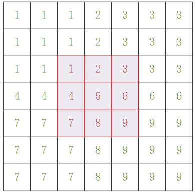

    - **HMPP\_BORDER\_IN\_MEM：**

        边框是从内存中的源图像像素获得的。如果ROI不能覆盖源图像的内部边框像素，请使用此边框类型。在这种情况下，从内存中的源图像像素获得边界像素的值。在下图中，标记为红色的正方形对应于从源图像ROI复制的像素。黑色值的正方形对应于内存中的源图像像素。

        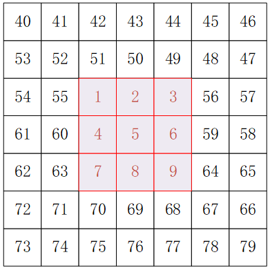

    - **HMPP\_BORDER\_MIRROR：**

        边界像素从源图像边界像素镜像而来。当使用镜像边框时，边框像素的值是从源图像边界像素获得的，如下图所示。用红色标记的正方形对应于从源图像ROI复制的像素。绿色值的正方形对应于边框像素，该边框像素从源图像像素镜像获得。

        

- 枚举类型HmppAmrnbMode定义了AMRNB协议的编码速率：

    ```c
    typedef enum {
        HMPP_AMRNB_MR475,   //码率4.75kbit/s
        HMPP_AMRNB_MR515,   //码率5.15kbit/s
        HMPP_AMRNB_MR59,    //码率5.9kbit/s
        HMPP_AMRNB_MR67,    //码率6.7kbit/s
        HMPP_AMRNB_MR74,    //码率7.4kbit/s
        HMPP_AMRNB_MR795,   //码率7.95kbit/s
        HMPP_AMRNB_MR102,   //码率10.2kbit/s
        HMPP_AMRNB_MR122    //码率12.2kbit/s
    } HmppAmrnbMode;
    ```

- 枚举类型HmppAmrwbMode定义了AMRWB协议的编码速率：

    ```c
    typedef enum {
        HMPP_AMRWB_6600,    //码率6.6kbit/s
        HMPP_AMRWB_8850,    //码率8.85kbit/s
        HMPP_AMRWB_12650,   //码率12.65kbit/s
        HMPP_AMRWB_14250,   //码率14.25kbit/s
        HMPP_AMRWB_15850,   //码率15.85kbit/s
        HMPP_AMRWB_18250,   //码率18.25kbit/s
        HMPP_AMRWB_19850,   //码率19.85kbit/s
        HMPP_AMRWB_23050,   //码率23.05kbit/s
        HMPP_AMRWB_23850,   //码率23.85kbit/s
    } HmppAmrwbMode;
    ```

### 整数缩放

由于一些信号处理函数在进行内部计算时提高了数据精度，在调用这些函数时会附加一个缩放因子作为函数参数，被调用函数使用整数缩放因子对内部计算的结果进行缩放。缩放因子必须为2<sup>n</sup>，且不能等于正无穷，不能为NaN，这些信号处理函数的函数名带有S描述符。

带缩放因子的函数在函数返回之前，将输出向量乘以scale来实现对计算结果的精度调整，这种操作有助于保留输出数据的范围或精度。

例如，对16位有符号整数300进行乘方运算时，由于运算结果溢出，实际能存储的结果为32767而不是90000。当缩放因子scale被设为0.25（即2<sup>-2</sup>）时，存储的计算结果为22500，没有溢出，并且实际的计算结果可以通过22500\*4来复原。

对于需要部分保留精度的情况，例如整数3的开方运算，HMPPS\_Sqrt函数会调用库函数sqrt进行计算。在不传递scale的情况下，程序输出结果是2而不是1.732；假如给程序传递缩放参数8（即2<sup>3</sup>），程序会对计算结果缩放并输出结果14，程序调用者可使用输出结果14和缩放参数0.125（即2<sup>-3</sup>）经计算得到更精确的结果：14\*2<sup>-3</sup>=1.75。

## HMPP接口函数说明

### 基础函数

#### 函数说明

该模块实现了63个基础函数，包含字节对齐、内存分配、内存释放、获取状态码描述、多线程设置及线程信息获取、获取CPU的缓存、时钟频率和CPU时间戳，以及HMPP版本信息、指令信息获取及设置和FlushToZero模式开闭等函数。

> **说明：** 
>以下所提供的所有接口示例代码引用的HMPP头文件都为hmpp.h。

#### AlignPtr

**将传入地址按指定字节进行对齐：**

void\* HMPP\_AlignPtr\(void \*ptr, int32\_t align\);

**参数**

|参数名|描述|取值范围|输入/输出|
|--|--|--|--|
|ptr|源地址。|非空|输入|
|align|对齐字节。|2的整数次幂|输入|

**返回值**

- 成功：对齐的字节是2的整数次幂，返回地址是按align对齐的。
- 失败：对齐的字节不是2的整数次幂，返回的地址不保证是按align对齐。

**错误码**

无

**注意**

- 此函数的入参正确性需要用户自己保证，不会有错误状态码，调用函数时，注意判断返回值，否则有可能操作结果和预期不一致。
- 接口不作越界保护，上层调用代码需确保内存不越界。

**示例**

```c
#define BUFFER_SIZE 100
#define ALIGN_BYTE 64
void AlignPtr_Example() {
    void *ptr = malloc(BUFFER_SIZE);
    if (ptr != NULL) {
        void *alignPtr = HMPP_AlignPtr(ptr, ALIGN_BYTE);
        if ((uint64_t)alignPtr % ALIGN_BYTE == 0) {
            printf("%d byte align\n", ALIGN_BYTE);
        } else {
            printf("not byte align\n");
        }
    }
}
```

运行结果：

```text
64 byte align
```

#### Malloc和Free

- **申请指定字节的内存大小：**

    void\* HMPP\_Malloc\(int32\_t len\);

- **释放内存：**

    void HMPP\_Free\(void\* ptr\);

**参数**

|参数名|描述|取值范围|输入/输出|
|--|--|--|--|
|len|字节长度（HMPP_Malloc函数）。数组长度（HMPPS_Malloc_xxx函数）。|大于0|输入|
|ptr|要释放内存的地址（Free函数）。|非空|输入|

**返回值**

HMPP\_Malloc函数：

- 成功：返回申请内存的首地址。
- 失败：返回NULL。

**注意**

Free函数入参一定是Malloc函数返回值。

**示例**

```c
#define BUFFER_SIZE 100
void Malloc_Free_Example() {
    void *ptr = HMPP_Malloc(BUFFER_SIZE);
    int suc = (ptr != NULL);
    HMPP_Free(ptr);
    uint8_t *ptrs = HMPPS_Malloc_8u(BUFFER_SIZE);
    suc = suc & (ptrs != NULL);
    HMPPS_Free(ptrs);
    printf("%d", suc);
}
```

运行结果：

```text
1
```

#### GetStatusString

**获取状态码描述：**

const char\* HMPP\_GetStatusString\(HmppResult result\);

**参数**

|参数名|描述|取值范围|输入/输出|
|--|--|--|--|
|result|状态码。|HMPPResult中出现的枚举类型。|输入|

**返回值**

- 成功：返回状态码的对应描述。
- 失败：返回“Not Found This Error Description”。

**错误码**

无

**注意**

不要释放返回指针指向的内存。

**示例**

```c
void  HMPP_GetStatusString_Example()
{
    printf("%s\n", HMPP_GetStatusString(HMPP_STS_NO_ERR));
    printf("%s\n", HMPP_GetStatusString(HMPP_STS_NULL_PTR_ERR));
    printf("%s\n", HMPP_GetStatusString(HMPP_STS_SIZE_ERR));
    printf("%s\n", HMPP_GetStatusString(HMPP_STS_NOT_SUPPORT));
}
```

运行结果：

```text
No Error
Null Pointer Error
Vector size <= 0 Error
This system does not support this function
```

#### Thread

- **设置多线程数上限：**

    HmppResult HMPP\_SetNumberThreads \(int32\_t numberThreads\);

- **获取当前的线程数：**

    HmppResult HMPP\_GetNumberThreads \(int32\_t\* numberThreads\);

- **获取当前线程ID：**

    HmppResult HMPP\_GetThreadIdx \(int32\_t\* threadIdx\);

- **获取当前多线程模式：**

    HmppResult HMPP\_GetThreadType \(HmppThreadType\* threadType\);

**参数**

|参数名|描述|取值范围|输入/输出|
|--|--|--|--|
|numberThreads|要限定的线程数上限（SetNumberThreads）。|大于0|输入|
|numberThreads|目标地址，指向内存存放当前线程数（GetNumberThreads）。|非空|输出|
|threadIdx|目标地址，指向内存存放当前线程的ID。|非空|输出|
|threadType|目标地址，指向内存存放当前线程模式。|非空|输出|

**返回值**

- 成功：返回HMPP\_STS\_NO\_ERR。
- 失败：返回错误码。

**错误码**

|错误码|描述|
|--|--|
|HMPP_STS_NULL_PTR_ERR|传入指针是空指针。|
|HMPP_STS_SIZE_ERR|len小于或等于0。|

**示例**

```c
#define NUMBER_THREAD_LIM 4
void  Thread_Example()
{
    HmppResult result = HMPP_SetNumberThreads(NUMBER_THREAD_LIM);
    printf("%s\n", HMPP_GetStatusString(result));

    HmppThreadType testThrType;
    result = HMPP_GetThreadType(&testThrType);
    printf("%s\n", HMPP_GetStatusString(result));

    if (testThrType == OMP) {
        printf("thread mode is omp\n");
        #pragma omp parallel for
        for (int32_t i = 0; i < NUMBER_THREAD_LIM; ++i) {
            int32_t testNumThr, testThrIdx;
            HMPP_GetNumberThreads(&testNumThr);
            HMPP_GetThreadIdx(&testThrIdx);
            printf("testNumThr = %d, testThrIdx = %d\n", testNumThr, testThrIdx);
        }
    } else {
        printf("no thread mode\n");
        int32_t testNumThr, testThrIdx;
        HMPP_GetNumberThreads(&testNumThr);
        HMPP_GetThreadIdx(&testThrIdx);
        printf("testNumThr = %d, testThrIdx = %d\n", testNumThr, testThrIdx);
    }
}
```

运行结果：

- 第一种：HMPP库没有开启多线程模式。

    ```text
    No Error
    No Error
    no thread mode
    testNumThr = 1, testThrIdx = 0
    ```

- 第二种：HMPP库开启多线程模式。

    ```text
    No Error
    No Error
    thread mode is omp
    testNumThr = 4, testThrIdx = 1
    testNumThr = 4, testThrIdx = 3
    testNumThr = 4, testThrIdx = 2
    testNumThr = 4, testThrIdx = 0
    ```

> **说明：** 
>
>- 目前HMPP仅发布二进制包，且未开启OMP编译选项，因此暂不支持多线程的功能。
>- 若支持多线程功能，几个线程之间的打印顺序可能与上述示例回显结果不同。

#### GetCacheInfo

- **获取L2 Cache大小：**

    HmppResult HMPP\_GetL2CacheSize \(int32\_t \*size\);

- **获取L2 Cache和L3 Cache中的较大值：**

    HmppResult HMPP\_GetMaxCacheSizeB \(int32\_t \*size\);

- **获取各级缓存的参数，如类型、等级、大小等信息：**

    HmppResult HMPP\_GetCacheParams \(HmppCache \*\*cacheInfo\);

**参数**

|参数名|描述|取值范围|输入/输出|
|--|--|--|--|
|size|目标地址，指向地址存放缓存的大小。|非空|输出|
|cacheInfo|目标地址，指向地址存放指向HmppCache数组的指针值。|非空|输出|

**返回值**

- 成功：返回HMPP\_STS\_NO\_ERR。
- 失败：返回错误码。

**错误码**

|错误码|描述|
|--|--|
|HMPP_STS_NULL_PTR_ERR|size、cacheInfo这些指针入参中存在空指针。|
|HMPP_STS_NOT_SUPPORT|获取缓存信息失败。|

**示例**

```c
void  GetCacheInfo_Example()
{
    int32_t l2CacheSize = 0;
    HmppResult result = HMPP_GetL2CacheSize(&l2CacheSize);
    printf("%s\n", HMPP_GetStatusString(result));
    printf("l2CacheSize = %d Byte\n\n", l2CacheSize);

    int32_t maxCacheSize = 0;
    result = HMPP_GetMaxCacheSizeB(&maxCacheSize);
    printf("%s\n", HMPP_GetStatusString(result));
    printf("maxCacheSize = %d Byte\n\n", maxCacheSize);

    HmppCache *pCacheSize;
    result = HMPP_GetCacheParams(&pCacheSize);
    printf("%s\n", HMPP_GetStatusString(result));
    int32_t i = 0;
    while (pCacheSize[i].type) {
        printf("type = %d\n", pCacheSize[i].type);
        printf("type = %d\n", pCacheSize[i].level);
        printf("type = %d Byte\n\n", pCacheSize[i].size);
        ++i;
    }
}
```

运行结果：

```text
No Error
l2CacheSize = 524288 Byte

No Error
maxCacheSize = 33554432 Byte

No Error
type = 1
type = 1
type = 65536 Byte

type = 2
type = 1
type = 65536 Byte

type = 3
type = 2
type = 524288 Byte

type = 3
type = 3
type = 33554432 Byte
```

> **说明：** 
>实际输出可能与上述结果不同，可调用lscpu对比输出值。

#### GetCpuFreq

**获取CPU频率：**

HmppResult HMPP\_GetCpuFreqMhz \(int32\_t \*mhz\);

**参数**

|参数名|描述|取值范围|输入/输出|
|--|--|--|--|
|mhz|目标地址，指向地址存放CPU频率值。|非空|输出|

**返回值**

- 成功：返回HMPP\_STS\_NO\_ERR。
- 失败：返回错误码。

**错误码**

|错误码|描述|
|--|--|
|HMPP_STS_NULL_PTR_ERR|mhz指针为空指针。|
|HMPP_STS_NOT_SUPPORT|获取信息失败。|

**示例**

```c
void  GetCpuFreq_Example()
{
    int32_t mhz;
    HmppResult result = HMPP_GetCpuFreqMhz(&mhz);
    printf("%s\n", HMPP_GetStatusString(result));
    printf("cpu frequency = %d Mhz\n", mhz);
}
```

运行结果：

```text
No Error
cpu frequency = 2600 Mhz
```

> **说明：** 
>
>- 此接口需要在root用户下，才能有正确返回值。
>- 实际输出可能与上述结果不同，可调用**dmidecode -t processor | grep "Current"**对比输出值。

#### GetCpuClock

**获取时间戳，即机器复位后经过了多少个时钟周期：**

uint64\_t HMPP\_GetCpuClock \(\);

**返回值**

返回当前时间戳。

**错误码**

无

**示例**

```c
void  GetCpuClock()
{
    printf("clock = %llu\n", HMPP_GetCpuClock());
}
```

运行结果：

```text
clock = 259338746414838
```

> **说明：** 
>clock具体数值会变化。

#### GetLibVersion

**获取HMPP当前版本信息：**

const HmppLibraryVersion\* HMPP\_GetLibVersion \(\);

**返回值**

返回指向存有版本信息的HmppLibraryVersion类型变量的首地址。

**错误码**

无

> **说明：** 
>
>1. 不要释放指针指向的内存。
>2. 此API后续不再进行维护，不建议使用，如需使用相关功能，建议使用GetProductVersion接口来替代使用此接口。

**示例**

```c
void  HMPP_GetLibVersion_Example()
{
    const HmppLibraryVersion *libVersion = HMPP_GetLibVersion();
    printf("HMPP_VERSION_MAJOR = %d\n", libVersion->major);
    printf("HMPP_VERSION_MINOR = %d\n", libVersion->minor);
    printf("HMPP_VERSION_PATCH = %d\n", libVersion->patch);
    printf("HMPP_VERSION_BUILDDATE = %s\n", libVersion->buildDate);
}
```

运行结果：

```text
HMPP_VERSION_MAJOR = 1
HMPP_VERSION_MINOR = 0
HMPP_VERSION_PATCH = 0
HMPP_VERSION_BUILDDATE = 2020.04.27
```

#### GetProductVersion

获取安装版本HMPP产品信息，包含软件名称、软件版本、产品版本、产品构建时间四个方面信息。

函数接口声明如下：

HmppResult HMPP\_GetProductVersion\(HmppProVersion \*packageInfo\);

**返回值**

- 成功：返回HMPP\_STS\_NO\_ERR。
- 失败：返回错误码。

**参数**

|参数名|描述|取值范围|输入/输出|
|--|--|--|--|
|packageInfo|目标结构体，存放输出的HMPP产品信息。|非空|输出|

**错误码**

|错误码|描述|
|--|--|
|HMPP_STS_NULL_PTR_ERR|HmppProVersion指针为空指针。|

**示例**

```c
void  HMPP_GetProductVersion_Example()
{
    HmppProVersion versionGet;
    HmppResult result = HMPP_GetProductVersion(&versionGet);
    HmppProVersion *version = &versionGet;
    if (result == HMPP_STS_NO_ERR) {
        printf("Product Name: %s\n", version->productName);
        printf("Product Version: %s\n", version->productVersion);
        printf("Component Name: %s\n", version->componentName);
        printf("Component Version: %s\n", version->componentVersion);
        printf("Component AppendInfo: %s\n", version->componentAppendInfo);
        printf("Software Name: %s\n", version->softwareName);
        printf("Software Version: %s\n", version->softwareVersion);
    }
}
```

运行结果：

```text
Product Name: Kunpeng Boostkit
Product Version: 23.0.RC2
Component Name: BoostKit-hmpp
Component Version: 1.7.0
Component AppendInfo: gcc
Software Name: boostkit-hmpp
Software Version: 1.7.0
```

> **说明：** 
>以上版本号和编译时间以实际运行结果为准，上述结果仅供参考。

#### CpuFeature

- **设置HMPP支持的指令集：**

    HmppResult HMPP\_SetCpuFeatures \(uint64\_t cpuFeatures\);

- **获取CPU支持的指令集：**

    HmppResult HMPP\_GetCpuFeatures \(uint64\_t\* cpuFeatures\);

- **获取HMPP当前支持的指令集：**

    uint64\_t HMPP\_GetEnabledCpuFeatures\(\)

**参数**

|参数名|描述|取值范围|输入/输出|
|--|--|--|--|
|cpuFeatures|要设置的HMPP库支持的指令集（SetCpuFeatures）。|hmpp_core.h头文件中提供的几种后缀为_FM的宏。|输入|
|cpuFeatures|目标地址，指向地址存放CPU支持指令集标记数（GetCpuFeatures）。|非空。|输出|

**返回值**

HMPP\_SetCpuFeatures

- 成功：返回HMPP\_STS\_NO\_ERR。
- 失败：返回错误码HMPP\_STS\_UNKNOWN\_FEATURE。

HMPP\_GetCpuFeatures

- 成功：返回HMPP\_STS\_NO\_ERR。
- 失败：返回错误码HMPP\_STS\_NULL\_PTR\_ERR。

HMPP\_GetEnabledCpuFeatures

- 返回当前HMPP库支持指令集标记数。

**错误码**

|错误码|描述|
|--|--|
|HMPP_STS_NULL_PTR_ERR|cpuFeatures指针为空指针。|
|HMPP_STS_UNKNOWN_FEATURE|要设置的指令集不在支持的几种指令集中。|

**注意**

目前只支持NEON\_FM（在hmppcore.h中定义）一种模式。

**示例**

```c
void  CpuFeature()
{
    uint64_t cpuFeatures;
    HmppResult result = HMPP_GetCpuFeatures(&cpuFeatures);
    printf("%s\n", HMPP_GetStatusString(result));
    printf("cpuFeatures = %016x\n", cpuFeatures);

    result = HMPP_SetCpuFeatures(NEON_FM);
    printf("%s\n", HMPP_GetStatusString(result));

    printf("enabledCpuFeatures = %016x\n", HMPP_GetEnabledCpuFeatures());
}
```

运行结果：

```text
No Error
cpuFeatures = 0000000000000001
No Error
enabledCpuFeatures = 0000000000000001
```

#### SetDenormAreZeros

**启用或禁用刷零模式：**

HmppResult HMPP\_SetDenormAreZeros \(int32\_t value\);

**参数**

|参数名|描述|取值范围|输入/输出|
|--|--|--|--|
|value|0表示禁用非0表示启用|int32_t值范围|输入|

**返回值**

- 成功：返回HMPP\_STS\_NO\_ERR。
- 失败：返回错误码。

**错误码**

|错误码|描述|
|--|--|
|HMPP_STS_NOT_SUPPORT|当前系统不是aarch64架构，不支持此函数。|

**示例**

```c
#define LEN 4
void  SetDenormAreZeros_Example()
{
    HmppResult result = HMPP_SetDenormAreZeros(1);
    cout << HMPP_GetStatusString(result) << endl;
    const float a[LEN] = {0.99 * pow(2, -126), 1.0 * pow(2, -126),
                          1.5 * pow(2, -126), 1.5 * pow(2, -126)};
    const float b[LEN] = {0.99 * pow(2, -126), 0.99 * pow(2, -126),
                          1.4 * pow(2, -126), -1.4 * pow(2, -126)};

    for (int32_t i = 0; i < LEN; ++i) {
        cout << a[i] + b[i] << endl;
    }

    result = HMPP_SetDenormAreZeros(0);
    cout << HMPP_GetStatusString(result) << endl;

    for (int32_t i = 0; i < LEN; ++i) {
        cout << a[i] + b[i] << endl;
    }
}
```

运行结果：

```text
No Error
0
1.17549e-38
3.40893e-38
0
No Error
2.32748e-38
2.33923e-38
3.40893e-38
1.17549e-39
```

#### Init

**初始化函数：**

HmppResult HMPP\_Init\(\);

> **说明：** 
>在此函数内会调用HMPP\_GetL2CacheSize、HMPP\_GetMaxCacheSizeB、HMPP\_GetCacheParams。

**返回值**

返回HMPP\_STS\_NO\_ERR。

**错误码**

无

#### ParallelFor

**并行化函数：**

HmppResult HMPP\_ParallelFor \(int32\_t numTasks, void \*arg, function func\);

> **说明：** 
>可将要执行的多个任务封装在HmppResult\(\*function\)\(int32\_t i, void \*arg\)内传入，使用方式见示例。

**参数**

|参数名|描述|取值范围|输入/输出|
|--|--|--|--|
|numTasks|任务数。|大于0（小于0不会报异常，可以认为就是一个任务都不创建）。|输入|
|arg|地址，指向func函数的参数值。|非空|输入|
|func|要执行函数（即任务）的函数指针。|非空|输入|

**返回值**

- 成功：返回HMPP\_STS\_NO\_ERR。
- 失败：返回错误码。

**错误码**

|错误码|描述|
|--|--|
|HMPP_STS_NULL_PTR_ERR|arg或func指针为空指针。|

> **说明：** 
>开启的多线程中也会返回错误码，该错误码在自定义函数中设定，由调用者决定。

**示例**

```c
#define LEN 20
 
void  ParallelFor_Example()
{
    typedef struct {
        int32_t val[LEN];
        int32_t rangeLen;
    }Arg;
    // 此函数实现的功能：对数组某段区间的数取绝对值
    auto func = [] (int32_t i, void *arg) -> HmppResult {
        Arg *args = (Arg *)arg;
        int32_t st = i * args->rangeLen;
        int32_t ed = st + args->rangeLen;
        for (int32_t k = st; k < ed; ++k) {
            args->val[k] = abs(args->val[k]);
        }
        return HMPP_STS_NO_ERR;
    };

    Arg arg;
    arg.rangeLen = 5;
    for (int32_t i = 0; i < LEN; ++i) {
        arg.val[i] = -(i + 1);
    }

    HmppResult result = HMPP_ParallelFor(LEN / arg.rangeLen, (void*)&arg, func);

    for (int32_t i = 0; i < LEN; ++i) {
        printf("%d\n", arg.val[i]);
    }
}
```

运行结果：

```text
1
2
3
4
5
6
7
8
9
10
11
12
13
14
15
16
17
18
19
20
```

### 信号库（HMPPS）

#### 函数说明

该模块实现了以下几种函数：

- 基础向量运算：逻辑移位运算、向量转换、向量统计、采样函数、初始化函数等。
- 信号变换：FFT、CZT、功率谱、希尔伯特、小波变换等。
- 滤波：卷积、FIR滤波、IIR滤波、重采样、中值滤波、自相关等。
- 窗口函数：Blackman、Hann、Kaiser、Hamming、Bartlett等。
- 数学运算：算术运算、三角运算、幂、根、指数运算等。

    > **说明：** 
    >以下所提供的所有接口示例代码引用的HMPP头文件都为hmpp.h。

#### 基础与通用运算

##### Abs

计算向量元素的绝对值。

函数接口声明如下：

- **整型数的操作：**

    HmppResult HMPPS\_Abs\_16s\(const int16\_t\* src, int16\_t\* dst, int32\_t len\);

    HmppResult HMPPS\_Abs\_32s\(const int32\_t\* src, int32\_t\* dst, int32\_t len\);

- **浮点数的操作：**

    HmppResult HMPPS\_Abs\_32f\(const float\* src, float\* dst, int32\_t len\);

    HmppResult HMPPS\_Abs\_64f\(const double\* src, double\* dst, int32\_t len\);

- **整型数的原地操作：**

    HmppResult HMPPS\_Abs\_16s\_I\(int16\_s\* srcDst, int32\_t len\);

    HmppResult HMPPS\_Abs\_32s\_I\(int32\_s\* srcDst, int32\_t len\);

- **浮点数的原地操作：**

    HmppResult HMPPS\_Abs\_32f\_I\(float\* srcDst, int32\_t len\);

    HmppResult HMPPS\_Abs\_64f\_I\(double\* srcDst, int32\_t len\);

**参数**

|参数名|描述|取值范围|输入/输出|
|--|--|--|--|
|src|指向源向量的指针。|非空|输入|
|dst|指向目的向量的指针。|非空|输出|
|srcDst|指向原地操作向量的指针。|非空|输入/输出|
|len|向量长度。|(0,INT_MAX]|输入|

**返回值**

- 成功：返回HMPP\_STS\_NO\_ERR。
- 失败：返回错误码。

**错误码**

|错误码|描述|
|--|--|
|HMPP_STS_NULL_PTR_ERR|src、dst、srcDst这几个入参中存在空指针。|
|HMPP_STS_SIZE_ERR|len小于或等于0。|

**示例**

```c
#define BUFFER_SIZE_T 10
void AbsExample(void)
{
    float src[BUFFER_SIZE_T] = {1.64, 1.63, -1.09, 0.71, -3.20, -0.43, 0.41, -4.83, 5.36, -4.40};
    float dst[BUFFER_SIZE_T];
    (void)HMPPS_Zero_32f(dst, BUFFER_SIZE_T); // 数组初始化，将dst所有元素初始化为0.

    HmppResult result = HMPPS_Abs_32f(src, dst, BUFFER_SIZE_T);
    printf("result = %d\n", result);
    if (result != HMPP_STS_NO_ERR) {
        return;
    }

    printf("dst =");
    for (int i = 0; i < BUFFER_SIZE_T; i++) {
        printf(" %.2f", dst[i]);
    }
    printf("\n");
}
```

运行结果：

```text
result = 0
dst = 1.64 1.63 1.09 0.71 3.20 0.43 0.41 4.83 5.36 4.40
```

##### Add

向量与向量相加。

函数接口声明如下：

- **整型数的操作：**

    HmppResult HMPPS\_Add\_8u16u\(const uint8\_t \*src1, const uint8\_t \*src2, uint16\_t \*dst, int32\_t len\);

    HmppResult HMPPS\_Add\_16u\(const uint16\_t \*src1, const uint16\_t \*src2, uint16\_t \*dst, int32\_t len\);

    HmppResult HMPPS\_Add\_32u\(const uint32\_t \*src1, const uint32\_t \*src2, uint32\_t \*dst, int32\_t len\);

    HmppResult HMPPS\_Add\_16s\(const int16\_t \*src1, const int16\_t \*src2, int16\_t \*dst, int32\_t len\);

- **整型与浮点数的操作：**

    HmppResult HMPPS\_Add\_16s32f\(const int16\_t \*src1, const int16\_t \*src2, float \*dst, int32\_t len\);

- **浮点数的操作：**

    HmppResult HMPPS\_Add\_32f\(const float \*src1, const float \*src2, float \*dst, int32\_t len\);

    HmppResult HMPPS\_Add\_64f\(const double \*src1, const double \*src2, double \*dst, int32\_t len\);

    HmppResult HMPPS\_Add\_32fc\(const Hmpp32fc \*src1, const Hmpp32fc \*src2, Hmpp32fc \*dst, int32\_t len\);

    HmppResult HMPPS\_Add\_64fc\(const Hmpp64fc \*src1, const Hmpp64fc \*src2, Hmpp64fc \*dst, int32\_t len\);

- **有缩放的整型数操作：**

    HmppResult HMPPS\_Add\_8u\_S\(const uint8\_t \*src1, const uint8\_t \*src2, uint8\_t \*dst, int32\_t len, double scale\);

    HmppResult HMPPS\_Add\_16u\_S\(const uint16\_t \*src1, const uint16\_t \*src2, uint16\_t \*dst, int32\_t len, double scale\);

    HmppResult HMPPS\_Add\_16s\_S\(const int16\_t \*src1, const int16\_t \*src2, int16\_t \*dst, int32\_t len, double scale\);

    HmppResult HMPPS\_Add\_32s\_S\(const int32\_t \*src1, const int32\_t \*src2, int32\_t \*dst, int32\_t len, double scale\);

    HmppResult HMPPS\_Add\_64s\_S\(const int64\_t \*src1, const int64\_t \*src2, int64\_t \*dst, int32\_t len, double scale\);

    HmppResult HMPPS\_Add\_16sc\_S\(const Hmpp16sc \*src1, const Hmpp16sc \*src2, Hmpp16sc \*dst, int32\_t len, double scale\);

    HmppResult HMPPS\_Add\_32sc\_S\(const Hmpp32sc \*src1, const Hmpp32sc \*src2, Hmpp32sc \*dst, int32\_t len, double scale\);

- **整型数的原地操作：**

    HmppResult HMPPS\_Add\_32u\_I\(const uint32\_t \*src, uint32\_t \*srcDst, int32\_t len\);

    HmppResult HMPPS\_Add\_16s\_I\(const int16\_t \*src, int16\_t \*srcDst, int32\_t len\);

    HmppResult HMPPS\_Add\_16s32s\_I\(const int16\_t \*src, int32\_t \*srcDst, int32\_t len\);

- **浮点数的原地操作：**

    HmppResult HMPPS\_Add\_32f\_I\(const float \*src, float \*srcDst, int32\_t len\);

    HmppResult HMPPS\_Add\_64f\_I\(const double \*src, double \*srcDst, int32\_t len\);

    HmppResult HMPPS\_Add\_32fc\_I\(const Hmpp32fc \*src, Hmpp32fc \*srcDst, int32\_t len\);

    HmppResult HMPPS\_Add\_64fc\_I\(const Hmpp64fc \*src, Hmpp64fc \*srcDst, int32\_t len\);

- **有缩放的整型数原地操作：**

    HmppResult HMPPS\_Add\_8u\_IS\(const uint8\_t \*src, uint8\_t \*srcDst, int32\_t len, double scale\);

    HmppResult HMPPS\_Add\_16u\_IS\(const uint16\_t \*src, uint16\_t \*srcDst, int32\_t len, double scale\);

    HmppResult HMPPS\_Add\_16s\_IS\(const int16\_t \*src, int16\_t \*srcDst, int32\_t len, double scale\);

    HmppResult HMPPS\_Add\_32s\_IS\(const int32\_t \*src, int32\_t \*srcDst, int32\_t len, double scale\);

    HmppResult HMPPS\_Add\_16sc\_IS\(const Hmpp16sc \*src, Hmpp16sc \*srcDst, int32\_t len, double scale\);

    HmppResult HMPPS\_Add\_32sc\_IS\(const Hmpp32sc \*src, Hmpp32sc \*srcDst, int32\_t len, double scale\);

**参数**

|参数名|描述|取值范围|输入/输出|
|--|--|--|--|
|src1|指向第一个源向量的指针。|非空|输入|
|src2|指向第二个源向量的指针。|非空|输入|
|dst|指向目的向量的指针。|非空|输出|
|srcDst|指向原地操作向量的指针。|非空|输入/输出|
|len|向量长度。|(0,INT_MAX]|输入|
|scale|缩放系数。|(0, inf)且为2<sup>n</sup>|输入|

**返回值**

- 成功：返回HMPP\_STS\_NO\_ERR。
- 失败：返回错误码。

**错误码**

|错误码|描述|
|--|--|
|HMPP_STS_NULL_PTR_ERR|src1、src2、dst、src、srcDst这几个入参中存在空指针。|
|HMPP_STS_SIZE_ERR|len小于或等于0。|
|HMPP_STS_SCALE_ERR|scale不在(0,INF)范围内或输入为NAN。|

**示例**

```c
#define BUFFER_SIZE_T 9
void AddExample(void)
{
    uint32_t src1[BUFFER_SIZE_T] = {1598181665, 1446829146, 2752624014, 2171200733, 2676378769, 1078554841, 1318511000, 2592925506, 2518880388};
    uint32_t src2[BUFFER_SIZE_T] = {422526272, 1563791282, 1664517688, 1278844750, 1984585164, 1554125489, 1115993496, 1182866132, 2965039412};
    uint32_t dst[BUFFER_SIZE_T] = {0};
 
    HmppResult result = HMPPS_Add_32u(src1, src2, dst, BUFFER_SIZE_T);
    printf("result = %d\n", result);
    if (result != HMPP_STS_NO_ERR) {
        return;
    }

    printf("\ndst = ");
    for (int32_t i = 0; i < BUFFER_SIZE_T; i++) {
        printf("%d ", dst[i]);
    }
}
```

运行结果：

```text
result = 0
dst = 2020707937 -1284346868 -1 -844921813 -1 -1662286966 -1860462800 -519175658 -1
```

##### AddC

常量与向量中的每个元素相加。

函数接口声明如下：

- **浮点数的操作：**

    HmppResult HMPPS\_AddC\_32f\(const float \*src, float val, float \*dst, int32\_t len\);

    HmppResult HMPPS\_AddC\_64f\(const double \*src, double val, double \*dst, int32\_t len\);

    HmppResult HMPPS\_AddC\_32fc\(const Hmpp32fc \*src, Hmpp32fc val, Hmpp32fc \*dst, int32\_t len\);

    HmppResult HMPPS\_AddC\_64fc\(const Hmpp64fc \*src, Hmpp64fc val, Hmpp64fc \*dst, int32\_t len\);

- **有缩放的整型数操作：**

    HmppResult HMPPS\_AddC\_8u\_S\(const uint8\_t \*src, uint8\_t val, uint8\_t \*dst, int32\_t len, double scale\);

    HmppResult HMPPS\_AddC\_16u\_S\(const uint16\_t \*src, uint16\_t val, uint16\_t \*dst, int32\_t len, double scale\);

    HmppResult HMPPS\_AddC\_16s\_S\(const int16\_t \*src, int16\_t val, int16\_t \*dst, int32\_t len, double scale\);

    HmppResult HMPPS\_AddC\_32s\_S\(const int32\_t \*src, int32\_t val, int32\_t \*dst, int32\_t len, double scale\);

    HmppResult HMPPS\_AddC\_64s\_S\(const int64\_t \*src, int64\_t val, int64\_t \*dst, int32\_t len, double scale, HmppRoundMode rndMode\);

    HmppResult HMPPS\_AddC\_16sc\_S\(const Hmpp16sc \*src, Hmpp16sc val, Hmpp16sc \*dst, int32\_t len, double scale\);

    HmppResult HMPPS\_AddC\_32sc\_S\(const Hmpp32sc \*src, Hmpp32sc val, Hmpp32sc \*dst, int32\_t len, double scale\);

    HmppResult HMPPS\_AddC\_64u\_S\(const uint64\_t \*src, uint64\_t val, uint64\_t \*dst, int32\_t len, double scale, HmppRoundMode rndMode\);

- **整型数的原地操作：**

    HmppResult HMPPS\_AddC\_16s\_I\(int16\_t val, int16\_t \*srcDst, int32\_t len\);

- **浮点数的原地操作：**

    HmppResult HMPPS\_AddC\_32f\_I\(float val, float \*srcDst, int32\_t len\);

    HmppResult HMPPS\_AddC\_64f\_I\(double val, double \*srcDst, int32\_t len\);

    HmppResult HMPPS\_AddC\_32fc\_I\(Hmpp32fc val, Hmpp32fc \*srcDst, int32\_t len\);

    HmppResult HMPPS\_AddC\_64fc\_I\(Hmpp64fc val, Hmpp64fc \*srcDst, int32\_t len\);

- **有缩放的整型数原地操作：**

    HmppResult HMPPS\_AddC\_8u\_IS\(uint8\_t val, uint8\_t \*srcDst, int32\_t len, double scale\);

    HmppResult HMPPS\_AddC\_16u\_IS\(uint16\_t val, uint16\_t \*srcDst, int32\_t len, double scale\);

    HmppResult HMPPS\_AddC\_16s\_IS\(int16\_t val, int16\_t \*srcDst, int32\_t len, double scale\);

    HmppResult HMPPS\_AddC\_32s\_IS\(int32\_t val, int32\_t \*srcDst, int32\_t len, double scale\);

    HmppResult HMPPS\_AddC\_16sc\_IS\(Hmpp16sc val, Hmpp16sc \*srcDst, int32\_t len, double scale\);

    HmppResult HMPPS\_AddC\_32sc\_IS\(Hmpp32sc val, Hmpp32sc \*srcDst, int32\_t len, double scale\);

**参数**

|参数名|描述|取值范围|输入/输出|
|--|--|--|--|
|src|指向源向量的指针。|非空|输入|
|val|固定值。|不限，视数据类型而定|输入|
|dst|指向目的向量的指针。|非空|输出|
|srcDst|指向原地操作向量的指针。|非空|输入/输出|
|len|向量长度。|(0,INT_MAX]|输入|
|scale|缩放系数。|(0,INF)且输入为2<sup>n</sup>|输入|
|rndMode|舍入模式。定义在枚举类型HmppRoundMode中，请参见枚举类型。|枚举体HmppRoundMode元素：HMPP_RND_ZEROHMPP_RND_NEARHMPP_RND_FINANCIAL|输入|

**返回值**

- 成功：返回HMPP\_STS\_NO\_ERR。
- 失败：返回错误码。

**错误码**

|错误码|描述|
|--|--|
|HMPP_STS_NULL_PTR_ERR|src、dst、srcDst这几个入参中存在空指针。|
|HMPP_STS_SIZE_ERR|len小于或等于0。|
|HMPP_STS_SCALE_ERR|scale不在(0,INF)范围内或输入为NaN。|

**示例**

```c
#define BUFFER_SIZE_T 10
void AddCExample(void)
{
    uint8_t src[BUFFER_SIZE_T] = {0, 1, 3, 5, 7, 10, 254, 255, 20, 50};
    uint8_t dst[BUFFER_SIZE_T] = {0, 0, 0, 0, 0, 0, 0, 0, 0, 0};
    uint8_t val = 1;
    double scale = 2.0;
    int32_t i;

    HmppResult result = HMPPS_AddC_8u_S(src, val, dst, BUFFER_SIZE_T, scale);
    printf("result = %d \n", result);
    if (result != HMPP_STS_NO_ERR) {
        return;
    }

    printf("dst =");
    for (i = 0; i < BUFFER_SIZE_T; i++) {
        printf(" %d ", dst[i]);
    }
    printf("\n");
}
```

运行结果：

```text
result = 0
dst = 0  1  2  3  4  6  128  128  10  26
```

##### AddProduct

两向量的乘积与目的向量相加。

计算公式如下：_srcDst\[n\] = srcDst\[n\] + src1\[n\] \* src2\[n\]_，n的范围为\[0，len\)。

函数接口声明如下：

- **浮点数的操作：**

    HmppResult HMPPS\_AddProduct\_32f\(const float \*src1, const float \*src2, float \*srcDst, int32\_t len\);

    HmppResult HMPPS\_AddProduct\_64f\(const double \*src1, const double \*src2, double \*srcDst, int32\_t len\);

    HmppResult HMPPS\_AddProduct\_32fc\(const Hmpp32fc \*src1, const Hmpp32fc \*src2, Hmpp32fc \*srcDst, int32\_t len\);

    HmppResult HMPPS\_AddProduct\_64fc\(const Hmpp64fc \*src1, const Hmpp64fc \*src2, Hmpp64fc \*srcDst, int32\_t len\);

- **有缩放的整型数操作：**

    HmppResult HMPPS\_AddProduct\_16s\_S\(const int16\_t \*src1, const int16\_t \*src2, int16\_t \*srcDst, int32\_t len, double scale\);

    HmppResult HMPPS\_AddProduct\_16s32s\_S\(const int16\_t \*src1, const int16\_t \*src2, int32\_t \*srcDst, int32\_t len, double scale\);

    HmppResult HMPPS\_AddProduct\_32s\_S\(const int32\_t \*src1, const int32\_t \*src2, int32\_t \*srcDst, int32\_t len, double scale\);

**参数**

|参数名|描述|取值范围|输入/输出|
|--|--|--|--|
|src1|指向第一个源向量的指针。|非空|输入|
|src2|指向第二个源向量的指针。|非空|输入|
|srcDst|指向目的向量的指针。|非空|输入/输出|
|len|向量长度。|(0,INT_MAX]|输入|
|scale|缩放系数。|(0,INF)且输入为2<sup>n</sup>|输入|

**返回值**

- 成功：返回HMPP\_STS\_NO\_ERR。
- 失败：返回错误码。

**错误码**

|错误码|描述|
|--|--|
|HMPP_STS_NULL_PTR_ERR|src1、src2、srcDst这几个入参中存在空指针。|
|HMPP_STS_SIZE_ERR|len小于或等于0。|
|HMPP_STS_SCALE_ERR|scale不在(0,INF)范围内或输入为NaN。|

**示例**

```c
#define BUFFER_SIZE_T 10
void AddProductExample(void)
{
    Hmpp64fc src1[BUFFER_SIZE_T] = {
        12130, -6322,  19151, -18246, 26700,  -6189, 10090, -5686, -17433, -29849,
        -1064, -12397, 9846,  -18348, -27613, 9270,  12561, 24201, -8793,  -3989
    };
    Hmpp64fc src2[BUFFER_SIZE_T] = {
        -26409, -11074, -16480, -2962, 8889,   15810, -25568, -16638, 15040,  13349,
        23212,  -27356, 6691,   26146, -17678, 15252, -20052, 25113,  -16404, 24897
    };
    Hmpp64fc srcDst[BUFFER_SIZE_T] = {
        -26409, -11074, -16480, -2962, 8889,   15810, -25568, -16638, 15040,  13349,
        23212,  -27356, 6691,   26146, -17678, 15252, -20052, 25113,  -16404, 24897
    };
    int32_t i;

    HmppResult result = HMPPS_AddProduct_64fc(src1, src2, srcDst, BUFFER_SIZE_T);
    printf("result = %d \n dst =", result);
    if (result != HMPP_STS_NO_ERR) {
        return;
    }

    for (i = 0; i < BUFFER_SIZE_T; i++) {
        printf(" %f ", srcDst[i]);
    }
}
```

运行结果：

```text
result = 0
 dst = -390377407.000000  -369669612.000000  335193279.000000  -352610356.000000  136277021.000000  -363806688.000000  545613085.000000  346738896.000000  -859652937.000000  243538101.000000
```

##### AddProductC

源向量和常量的乘积与目的向量相加。

计算公式为：。

函数接口声明如下：

**浮点数的操作：**

HmppResult HMPPS\_AddProductC\_32f\(const float \*src, float val, float \*srcDst, int32\_t len\);

HmppResult HMPPS\_AddProductC\_64f\(const double \*src, const double val, double \*srcDst, int32\_t len\);

**参数**

|参数名|描述|取值范围|输入/输出|
|--|--|--|--|
|src|指向源向量的指针。|非空|输入|
|val|固定值。|不限，视类型而定|输入|
|srcDst|指向目的向量的指针。|非空|输入/输出|
|len|向量长度。|(0, INT_MAX]|输入|

**返回值**

- 成功：返回HMPP\_STS\_NO\_ERR。
- 失败：返回错误码。

**错误码**

|错误码|描述|
|--|--|
|HMPP_STS_NULL_PTR_ERR|输入参数中出现空指针，src、srcDst不允许为空。|
|HMPP_STS_SIZE_ERR|参数len不允许小于或者等于0。|

**示例**

```c
#define BUFFER_SIZE_T 10

void AddProductCExample(void)
{
    double src[BUFFER_SIZE_T] = {2.2672e-08, -2.2672e-08, -18246, 26700, -6189, 10090, -5686, -17433, -29849, -1064};
    double dst[BUFFER_SIZE_T] = {3.2672e-08, -6.2672e-08, 18246, 26700, -7189, 20090, -6686, -16433, -23849, -1864};
    double val = -3;
    int32_t i;
    
    HmppResult result = HMPPS_AddProductC_64f(src, val, dst, BUFFER_SIZE_T);
    printf("result = %d \ndst =", result);
    if (result != HMPP_STS_NO_ERR) {
        return;
    }

    for (i = 0; i < BUFFER_SIZE_T; i++) {
        printf(" %f ", dst[i]);
    }
}
```

运行结果：

```text
result = 0
dst =  -0.000000  0.000000  72984.000000  -53400.000000  11378.000000  -10180.000000  10372.000000  35866.000000  65698.000000  1328.000000 
```

##### And

向量与向量每个元素按位与。

函数接口声明如下：

- **整型数的操作：**

    HmppResult HMPPS\_And\_8u\(const uint8\_t\* src1, const uint8\_t\* src2,uint8\_t\* dst, int32\_t len\);

    HmppResult HMPPS\_And\_16u\(const uint16\_t\* src1, const uint16\_t\* src2, uint16\_t\* dst, int32\_t len\);

    HmppResult HMPPS\_And\_32u\(const uint32\_t\* src1, const uint32\_t\* src2,uint32\_t\* dst, int32\_t len\);

- **整型数的原地操作：**

    HmppResult HMPPS\_And\_8u\_I\(const uint8\_t\* src, uint8\_t\* srcDst, int32\_t len\);

    HmppResult HMPPS\_And\_16u\_I\(const uint16\_t\* src, uint16\_t\* srcDst, int32\_t len\);

    HmppResult HMPPS\_And\_32u\_I\(const uint32\_t\* src, uint32\_t\* srcDst, int32\_t len\);

**参数**

|参数名|描述|取值范围|输入/输出|
|--|--|--|--|
|src1|指向第一个源向量的指针。|非空|输入|
|src2|指向第二个源向量的指针。|非空|输入|
|dst|指向目的向量的指针。|非空|输出|
|srcDst|指向原地操作向量的指针。|非空|输入/输出|
|len|向量长度。|(0,INT_MAX]|输入|

**返回值**

- 成功：返回HMPP\_STS\_NO\_ERR。
- 失败：返回错误码。

**错误码**

|错误码|描述|
|--|--|
|HMPP_STS_NULL_PTR_ERR|src1、src2、dst、srcDst这几个入参中存在空指针。|
|HMPP_STS_SIZE_ERR|len小于或等于0。|

**示例**

```c
#define BUFFER_SIZE_T 9

void AndExample(void)
{
    uint8_t src1[BUFFER_SIZE_T] = {1, 0,  45, 255,  214, 22, 11 ,112, 45};
    uint8_t src2[BUFFER_SIZE_T] = {0, 45,  55,  214, 22, 11 ,112, 45, 66};
    uint8_t dst[BUFFER_SIZE_T] = {0};
    int32_t i, result;

    result = HMPPS_And_8u(src1, src2, dst, BUFFER_SIZE_T);
    if (result != HMPP_STS_NO_ERR) {
        return;
    }
    printf("result = %d \n dst = ", result);
    for (i = 0; i < BUFFER_SIZE_T; i++) {
        printf("%d ", dst[i]);
    }
}
```

运行结果：

```text
result = 0
dst = 0 0 45 214 22 2 0 32 0
```

##### AndC

常量与向量中的每个元素按位与。

函数接口声明如下：

- **整型数的操作：**

    HmppResult HMPPS\_AndC\_8u\(const uint8\_t\* src, uint8\_t val, uint8\_t\* dst, int32\_t len\);

    HmppResult HMPPS\_AndC\_16u\(const uint16\_t\* src, uint16\_t val, uint16\_t\* dst, int32\_t len\);

    HmppResult HMPPS\_AndC\_32u\(const uint32\_t\* src, uint32\_t val, uint32\_t\* dst, int32\_t len\);

- **整型数的原地操作：**

    HmppResult HMPPS\_AndC\_8u\_I\(uint8\_t val, uint8\_t\* srcDst, int32\_t len\);

    HmppResult HMPPS\_AndC\_16u\_I\(uint16\_t val, uint16\_t\* srcDst, int32\_t len\);

    HmppResult HMPPS\_AndC\_32u\_I\(uint32\_t val, uint32\_t\* srcDst, int32\_t len\)

**参数**

|参数名|描述|取值范围|输入/输出|
|--|--|--|--|
|src|指向源向量的指针。|非空|输入|
|val|固定值。|不限，视类型而定|输入|
|dst|指向目的向量的指针。|非空|输出|
|srcDst|指向原地操作向量的指针。|非空|输入/输出|
|len|向量长度。|(0,INT_MAX]|输入|

**返回值**

- 成功：返回HMPP\_STS\_NO\_ERR。
- 失败：返回错误码。

**错误码**

|错误码|描述|
|--|--|
|HMPP_STS_NULL_PTR_ERR|src1、src2、dst、srcDst这几个入参中存在空指针。|
|HMPP_STS_SIZE_ERR|len小于或等于0。|

**示例**

```c
#define BUFFER_SIZE_T 10

void AndCExample(void)
{
    uint16_t src[BUFFER_SIZE_T] = {55102, 65510, 45878, 34567, 55102, 65510, 45878, 34567, 55102, 65510};
    uint16_t dst[BUFFER_SIZE_T] = {};
    uint16_t val = 32574;
    int32_t i, result;
    result = HMPPS_AndC_16u(src, val, dst, BUFFER_SIZE_T);
    if (result != HMPP_STS_NO_ERR) {
        return;
    }
    printf("result = %d \n dst =", result);
    for (i = 0; i < BUFFER_SIZE_T; i++) {
        printf(" %d ", dst[i]);
    }
}
```

运行结果：

```text
result = 0
dst = 22334 32550 13110 1798 22334 32550 13110 1798 22334 32550
```

##### Arctan

计算向量中每个元素的反正切值。

计算公式为：_pDst\[n\]=tan<sup>-1</sup>\(pSrc\[n\]\)_，n的范围为\[0，len\)。

函数接口声明如下：

- **浮点数的操作：**

    HmppResult HMPPS\_Arctan\_32f\(const float\* src, float\* dst, int32\_t len\);

    HmppResult HMPPS\_Arctan\_64f\(const double\* src, double\* dst, int32\_t len\);

- **浮点数的原地操作：**

    HmppResult HMPPS\_Arctan\_32f\_I\(float\* srcDst, int32\_t len\);

    HmppResult HMPPS\_Arctan\_64f\_I\(double\* srcDst, int32\_t len\);

**参数**

|参数名|描述|取值范围|输入/输出|
|--|--|--|--|
|src|指向源向量的指针。|非空|输入|
|dst|指向目的向量的指针。|非空|输出|
|srcDst|指向原地操作向量的指针。|非空|输入/输出|
|len|向量长度。|(0,INT_MAX]|输入|

**返回值**

- 成功：返回HMPP\_STS\_NO\_ERR。
- 失败：返回错误码。

**错误码**

|错误码|描述|
|--|--|
|HMPP_STS_NULL_PTR_ERR|src、dst、srcDst这几个入参中存在空指针。|
|HMPP_STS_SIZE_ERR|len小于或等于0。|

**示例**

```c
#define BUFFER_SIZE_T 10

void ArctanExample(void)
{
    float src[BUFFER_SIZE_T] = {4.52, 5.92, 5.16, 6.15, 8.17, 9.93, 6.04, 11.17, 2.79, 3.58};
    float dst[BUFFER_SIZE_T];
    (void)HMPPS_Zero_32f(dst, BUFFER_SIZE_T); // 数组初始化，将dst所有元素初始化为0.
    HmppResult result = HMPPS_Arctan_32f(src, dst, BUFFER_SIZE_T);
    printf("result = %d\n", result);
    if (result != HMPP_STS_NO_ERR) {
        return;
    }

    printf("dst =");
    for (int i = 0; i < BUFFER_SIZE_T; i++) {
        printf(" %.2f", dst[i]);
    }
    printf("\n");
}
```

运行结果：

```text
result = 0
dst = 1.35 1.40 1.38 1.41 1.45 1.47 1.41 1.48 1.23 1.30
```

##### Arctan2

计算两个向量的在四个象限的反正切。

计算公式为：_Dst\[n\]=tan<sup>-1</sup>\(Src\[n\]\)_，n的范围为\[0，len\)。

函数接口声明如下：

**浮点数的操作：**

HmppResult HMPPS\_Arctan2\_32f\(const float \*src1, const float \*src2, float \*dst, const int32\_tlen\);

HmppResult HMPPS\_Arctan2\_64f\(const double \*src1, const double \*src2, double \*dst, const int32\_t len\);

**参数**

|参数名|描述|取值范围|输入/输出|
|--|--|--|--|
|src1|指向第一个源向量的指针。|非空|输入|
|src2|指向第二个源向量的指针。|非空|输入|
|dst|指向目的向量的指针。|非空|输出|
|len|向量长度。|(0,INT_MAX]|输入|

**返回值**

- 成功：返回HMPP\_STS\_NO\_ERR。
- 失败：返回错误码。

**错误码**

|错误码|描述|
|--|--|
|HMPP_STS_NULL_PTR_ERR|src1、src2、dst这几个入参中存在空指针。|
|HMPP_STS_SIZE_ERR|len不大于0。|

**示例**

```c
#define BUFFER_SIZE_T 10

void Arctan2Example(void)
{
    float src1[BUFFER_SIZE_T] = {4.52, 5.92, 5.16, 6.15, 8.17, 9.93, 6.04, 11.17, 2.79, 3.58};
    float src2[BUFFER_SIZE_T] = {11.17, 2.79, 3.58, 4.52, 5.92, 5.16, 6.15, 8.17, 9.93, 6.04};
    float dst[BUFFER_SIZE_T];
    (void)HMPPS_Zero_32f(dst, BUFFER_SIZE_T);
    HmppResult result = HMPPS_Arctan2_32f(src1, src2, dst, BUFFER_SIZE_T);
    printf("result = %d\n", result);
    if (result != HMPP_STS_NO_ERR) {
        return;
    }
    printf("dst =");
    for (int i = 0; i < BUFFER_SIZE_T; i++) {
        printf(" %.2f", dst[i]);
    }
    printf("\n");
}
```

运行结果：

```text
result = 0
dst = 0.38 1.13 0.96 0.94 0.94 1.09 0.78 0.94 0.27 0.54
```

##### Arg

计算两个向量的幅角。

函数接口声明如下。

**主函数操作**：

HmppResult HMPPS\_Arg\_32fc\(const Hmpp32fc\* pSrc, float\* pDst, int32\_t len\);

**参数**

|参数名|描述|取值范围|输入/输出|
|--|--|--|--|
|pSrc|指向源向量指针。|非空|输入|
|pDst|指向目标向量指针。|非空|输出|
|len|源向量与目标向量长度。|(0, INT_MAX]|输入|

**返回值**

- 成功：返回HMPP\_STS\_NO\_ERR。
- 失败：返回错误码。

**错误码**

|错误码|描述|
|--|--|
|HMPP_STS_NO_ERR|表示没有错误。|
|HMPP_STS_NULL_PTR_ERR|当任何指定的指针为空时指示错误。|
|HMPP_STS_SIZE_ERR|当srcLen或dstLen小于或等于0时指示错误。|

**示例**

```c
#define BUFFER_SIZE_T 10
void ArgExample(void)
{
    Hmpp32fc src[BUFFER_SIZE_T] = {1.64, 1.63, -1.09, 0.71, -3.20, -0.43, 0.41, -4.83, 5.36, -4.40};
    float dst[BUFFER_SIZE_T];
    (void)HMPPS_Zero_32f(dst, BUFFER_SIZE_T); // 数组初始化，将dst所有元素初始化为0.
    HmppResult result = HMPPS_Arg_32fc(src, dst, BUFFER_SIZE_T / 2);
    printf("result = %d\n", result);
    if (result != HMPP_STS_NO_ERR) {
        return;
    }
    printf("dst =");
    for (int i = 0; i < BUFFER_SIZE_T; i++) {
        printf(" %.2f", dst[i]);
    }
    printf("\n");
}
int main() {
    ArgExample();
    return 0;
}
```

运行结果：

```text
result = 0
dst = 0.78 2.56 -3.01 -1.49 -0.69 0.00 0.00 0.00 0.00 0.00
```

##### Asin

计算源向量中每个元素的反正弦值。

函数接口声明如下：

HmppResult HMPPS_Asin_32f_A24(const float*pSrc, float* pDst, int len);

**参数**

| 参数名 | 描述                 | 取值范围    | 输入/输出 |
| ------ | -------------------- | ----------- | --------- |
| src    | 指向源向量的指针。   | 非空        | 输入      |
| dst    | 指向目标向量的指针。 | 非空        | 输出      |
| len    | 向量长度。           | (0,INT_MAX] | 输入      |

**返回值**

- 成功：返回HMPP_STS_NO_ERR。
- 失败：返回错误码。

**错误码**

| 错误码                | 描述                 |
| --------------------- | -------------------- |
| HMPP_STS_NULL_PTR_ERR | src、dst存在空指针。 |
| HMPP_STS_SIZE_ERR     | len小于或等于0。     |

**示例**

```c
#include <stdio.h>
#include <hmpp.h>

#define BUFFER_SIZE_T 10

void AsinExample(void)
{
    float src[BUFFER_SIZE_T] = {0.52, 0.92, 0.16, 0.15, 0.17, 0.93, 0.04, 0.17, 0.79, 0.58};
    float dst[BUFFER_SIZE_T];
    (void)HMPPS_Zero_32f(dst, BUFFER_SIZE_T);
    HmppResult result = HMPPS_Asin_32f_A24(src, dst, BUFFER_SIZE_T);
    printf("result = %d\n", result);
    if (result != HMPP_STS_NO_ERR) {
        return;
    }
    printf("dst =");
    for (int i = 0; i < BUFFER_SIZE_T; i++) {
        printf(" %.2f", dst[i]);
    }
    printf("\n");
}

int main()
{
    AsinExample();
    return 0;
}
```

运行结果：

```text
result = 0
dst = 0.55 1.17 0.16 0.15 0.17 1.19 0.04 0.17 0.91 0.62
```

##### AutoCorrNorm

计算src向量（长度为srcLen）的归一化自相关，结果存储到dst向量中。归一化支持正常、有偏和无偏自相关三种模式，计算公式如下：


该函数调用流程如下：

1. 调用Init初始化HmppsCorrPolicy\_32f结构体。
2. 再调用主函数。
3. 最后调用Release释放HmppsCorrPolicy\_32f函数所包含内存。

函数接口声明如下：

- **初始化操作：**

    HmppResult HMPPS\_AutoCorrInit\_32f\(int32\_t srcLen, int32\_t dstLen, HmppAlgMode calcMode, HmppsCorrPolicy\_32f \*\*policy\);

    HmppResult HMPPS\_AutoCorrInit\_64f\(int32\_t srcLen, int32\_t dstLen, HmppAlgMode calcMode, HmppsCorrPolicy\_64f \*\*policy\);

    HmppResult HMPPS\_AutoCorrInit\_32fc\(int32\_t srcLen, int32\_t dstLen, HmppAlgMode calcMode, HmppsCorrPolicy\_32fc \*\*policy\);

    HmppResult HMPPS\_AutoCorrInit\_64fc\(int32\_t srcLen, int32\_t dstLen, HmppAlgMode calcMode, HmppsCorrPolicy\_64fc \*\*policy\);

- **主函数操作：**

    HmppResult HMPPS\_AutoCorrNorm\_32f\(const float \*src, int32\_t srcLen, float \*dst, int32\_t dstLen, HmppNormMode normMode, HmppsCorrPolicy\_32f \*policy\);

    HmppResult HMPPS\_AutoCorrNorm\_64f\(const double \*src, int32\_t srcLen, double \*dst, int32\_t dstLen, HmppNormMode normMode, HmppsCorrPolicy\_64f \*policy\);

    HmppResult HMPPS\_AutoCorrNorm\_32fc\(const Hmpp32fc \*src, int32\_t srcLen, Hmpp32fc \*dst, int32\_t dstLen, HmppNormMode normMode, HmppsCorrPolicy\_32fc \*policy\);

    HmppResult HMPPS\_AutoCorrNorm\_64fc\(const Hmpp64fc \*src, int32\_t srcLen, Hmpp64fc \*dst, int32\_t dstLen, HmppNormMode normMode, HmppsCorrPolicy\_64fc \*policy\);

- **释放内存操作**：

    HmppResult HMPPS\_CorrRelease\_32f\(HmppsCorrPolicy\_32f \*policy\);

    HmppResult HMPPS\_CorrRelease\_64f\(HmppsCorrPolicy\_64f \*policy\);

    HmppResult HMPPS\_CorrRelease\_32fc\(HmppsCorrPolicy\_32fc \*policy\);

    HmppResult HMPPS\_CorrRelease\_64fc\(HmppsCorrPolicy\_64fc \*policy\);

**参数**

|参数名|描述|取值范围|输入/输出|
|--|--|--|--|
|src|指向源向量指针。|非空|输入|
|srcLen|源向量长度。|(0, INT_MAX]|输入|
|dst|指向目标向量指针。|非空|输出|
|dstLen|目标向量长度。|非空|输入|
|algMode|计算使用的算法模型。定义在枚举类型HmppAlgMode中，请参见枚举类型。|枚举体HmppAlgMode元素：HMPP_ALG_AUTOHMPP_ALG_DEFAULTHMPP_ALG_FFT|输入|
|normMode|数据归一化模式。定义在枚举类型HmppNormMode中，请参见枚举类型。|枚举体HmppNormMode元素：HMPP_NORM_NORMALHMPP_NORM_BIASEDHMPP_NORM_UNBIASED|输入|
|policy（init函数中）|指向内存存储CorrPolicy的指针。|非空|输出|
|policy（主函数中和release函数中）|指向CorrPolicy结构体的指针。|非空|输入|

**返回值**

- 成功：返回HMPP\_STS\_NO\_ERR。
- 失败：返回错误码。

**错误码**

|错误码|描述|
|--|--|
|HMPP_STS_NO_ERR|表示没有错误。|
|HMPP_STS_NULL_PTR_ERR|当任何指定的指针为空时指示错误。|
|HMPP_STS_SIZE_ERR|当srcLen或dstLen小于或等于0时指示错误。|
|HMPP_STS_MISMATCH|Init函数申请内存的问题规模和主函数中实际计算的问题规模不匹配。|
|HMPP_STS_OVERFLOW_ERR|FFT加速模型的问题规模过大。|
|HMPP_STS_MALLOC_FAILED|Init函数中进行算法模型所需内存申请失败。|

**注意**

- 调用该接口计算之前，必须调用Init接口初始化HmppsCorrPolicy\_32f规范结构。
- HmppsCorrPolicy\_32f结构体初始化需在Init函数中进行申请的，用户无法自己进行该结构体申请定义。
- src和dst不能是同一数组，否则可能导致结果错误。
- 使用HMPP\_ALG\_AUTO或HMPP\_ALG\_FFT模式时，当srcLen和dstLen较大时会出现OVERFLOW错误提示。

**示例**

```c
void AutoCorrNorm_Example()
{
    const int len = 10;
    float src[len];
    float dst[len];
    int32_t srcLen = len;
    int32_t dstLen = len;

    for (int i = 0; i < srcLen; ++i) {
        src[i] = 1;
    }
    HmppsCorrPolicy_32f *policy = NULL;
    HmppResult result = HMPPS_AutoCorrInit_32f(srcLen, dstLen, HMPP_ALG_AUTO, &policy);
    if (result != HMPP_STS_NO_ERR) {
        printf("Init failed");
        return;
    }
    result = HMPPS_AutoCorrNorm_32f(src, srcLen, dst, dstLen, HMPP_NORM_NORMAL, policy);
    if (result != HMPP_STS_NO_ERR) {
        printf("AutoCorr failed");
        return;
    }
    for (int i = 0; i < dstLen; ++i) {
        printf("%.2f ", dst[i]);
    }
    HMPPS_CorrRelease_32f(policy);
}
```

运行结果：

```text
10 9 8 7 6 5 4 3 2 1
```

##### CartToPolar

直角坐标转极坐标。

极角计算公式如下：


极径计算公式如下：


函数接口声明如下：

- **整型数的操作：**

    HmppResult HMPPS\_CartToPolar\_16sc\_S\(const Hmpp16sc \*src, int16\_t \*dstMagn, int16\_t \*dstPhase, int32\_t len, double magnScale, double phaseScale\);

- **浮点数的操作：**

    HmppResult HMPPS\_CartToPolar\_32f\(const float \*srcRe, const float \*srcIm, float \*dstMagn, float \*dstPhase, int32\_t len\);

    HmppResult HMPPS\_CartToPolar\_64f\(const double \*srcRe, const double \*srcIm, double \*dstMagn, double \*dstPhase, int32\_t len\);

    HmppResult HMPPS\_CartToPolar\_32fc\(const Hmpp32fc \*src, float \*dstMagn, float \*dstPhase, int32\_t len\);

    HmppResult HMPPS\_CartToPolar\_64fc\(const Hmpp64fc \*src, double \*dstMagn, double \*dstPhase, int32\_t len\);

**参数**

|参数名|描述|取值范围|输入/输出|
|--|--|--|--|
|src|指向复数源向量的指针。|非空|输入|
|srcRe|指向复数实部源向量复数的指针。|非空|输入|
|srcIm|指向复数虚部源向量复数的指针。|非空|输入|
|len|向量长度。|(0,INT_MAX]|输入|
|dstMagn|指向极径目标向量的指针。|非空|输出|
|dstPhase|指向极角目标向量的指针。|非空，目标向量中的值范围为(-π, π]|输出|
|magnScale|极径的缩放系数。|(0, inf)且为2<sup>n</sup>|输入|
|phaseScale|极角的缩放系数。|(0, inf)且为2<sup>n</sup>|输入|

**返回值**

- 成功：返回HMPP\_STS\_NO\_ERR。
- 失败：返回错误码。

**错误码**

|错误码|描述|
|--|--|
|HMPP_STS_NULL_PTR_ERR|当任何指定的指针为空时指示错误。|
|HMPP_STS_SIZE_ERR|len小于或等于0。|
|HMPP_STS_SCALE_ERR|magnScale或者phaseScale不在(0,INF)范围内或输入为NaN。|
|HMPP_STS_MALLOC_FAILED|Init函数中进行算法模型所需内存申请失败。|

**示例**

```c
#define SRC_LEN 8
void CartToPolarExample(void)
{
    int32_t len = SRC_LEN;
    float srcRe[SRC_LEN] = { 59.960567, 7.2509279, 1.7840941, 155.84264, 0.0020125117, 0.73378527, 4497.1704, 630.54828 };
    float srcIm[SRC_LEN] = { 2.0548565, 0.00067954202, 0.028709119, 0.0001744011, 0.0054633785, 0.00063873257, 2293.6162, 7.3549595 };
    float dstMagn[SRC_LEN] = { 0.0f };
    float dstPhase[SRC_LEN] = { 0.0f };

    HmppResult result = HMPPS_CartToPolar_32f(srcRe, srcIm, dstMagn, dstPhase, len);
    printf("HMPPS_CartToPolar_32f result = %d\n", result);
    if (result != HMPP_STS_NO_ERR) {
        return;
    }

    int32_t i;
    printf("len = %d\ndstMagn =", len);
    for(i = 0; i < len; ++i){
        printf(" %f", dstMagn[i]);
    }
    printf("\ndstPhase =");
    for(i = 0; i < len; ++i){
        printf(" %f", dstPhase[i]);
    }
    printf("\n");
}
```

运行结果：

```text
HMPPS_CartToPolar_32f result = 0
len = 8
dstMagn = 59.995770 7.250928 1.784325 155.842636 0.005822 0.733786 5048.288574 630.591187
dstPhase = 0.034257 0.000094 0.016090 0.000001 1.217856 0.000870 0.471626 0.011664
```

##### Convert

此类函数转换源向量中的每个元素的数据类型，结果保存在目的向量中。

带\_S后缀的函数根据scale值对结果值进行缩放。如果转换后的结果超出输出数据范围，则将达到饱和。

对float16\_t型数据进行转换时函数不支持HMPP\_RND\_FINANCIAL舍入模式。

函数接口声明如下：

- **整型转整型的操作：**

    HmppResult HMPPS\_Convert\_24u32u\(const uint8\_t \*src, uint32\_t \*dst, int32\_t len\);

    HmppResult HMPPS\_Convert\_8s8u\(const int8\_t \*src, uint8\_t \*dst, int32\_t len\);

    HmppResult HMPPS\_Convert\_8s16s\(const int8\_t \*src, int16\_t \*dst, int32\_t len\);

    HmppResult HMPPS\_Convert\_16s32s\(const int16\_t \*src, int32\_t \*dst, int32\_t len\);

    HmppResult HMPPS\_Convert\_24s32s\(const uint8\_t \*src, int32\_t \*dst, int32\_t len\);

    HmppResult HMPPS\_Convert\_32s16s\(const int32\_t \*src, int16\_t \*dst, int32\_t len\);

- **整型转浮点的操作：**

    HmppResult HMPPS\_Convert\_24u32f\(const uint8\_t \*src, float \*dst, int32\_t len\);

    HmppResult HMPPS\_Convert\_16s16f\(const int16\_t \*src, float16\_t \*dst, int32\_t len, HmppRoundMode roundMode\);

    HmppResult HMPPS\_Convert\_8u32f\(const uint8\_t \*src, float \*dst, int32\_t len\);

    HmppResult HMPPS\_Convert\_8s32f\(const int8\_t \*src, float \*dst, int32\_t len\);

    HmppResult HMPPS\_Convert\_16u32f\(const uint16\_t \*src, float \*dst, int32\_t len\);

    HmppResult HMPPS\_Convert\_16s32f\(const int16\_t \*src, float \*dst, int32\_t len\);

    HmppResult HMPPS\_Convert\_24s32f\(const uint8\_t \*src, float \*dst, int32\_t len\);

    HmppResult HMPPS\_Convert\_32s32f\(const int32\_t \*src, float \*dst, int32\_t len\);

    HmppResult HMPPS\_Convert\_32s64f\(const int32\_t \*src, double \*dst, int32\_t len\);

    HmppResult HMPPS\_Convert\_64s64f\(const int64\_t \*src, double \*dst, int32\_t len\);

- **浮点转浮点的操作：**

    HmppResult HMPPS\_Convert\_32f16f\(const float \*src, float16\_t \*dst, int32\_t len, HmppRoundMode rndMode\);

    HmppResult HMPPS\_Convert\_32f64f\(const float \*src, double \*dst, int32\_t len\);

    HmppResult HMPPS\_Convert\_16f32f\(const float16\_t \*src, float \*dst, int32\_t len\);

    HmppResult HMPPS\_Convert\_64f32f\(const double \*src, float \*dst, int32\_t len\);

- **有缩放的整型转整型操作：**

    HmppResult HMPPS\_Convert\_8u8s\_S\(const uint8\_t \*src, int8\_t \*dst, int32\_t len, HmppRoundMode rndMode, double scale\)

    HmppResult HMPPS\_Convert\_16s8s\_S\(const int16\_t \*src, int8\_t \*dst, int32\_t len, HmppRoundMode rndMode, double scale\);

    HmppResult HMPPS\_Convert\_32u24u\_S\(const uint32\_t \*src, uint8\_t \*dst, int32\_t len, double scale\);

    HmppResult HMPPS\_Convert\_32s16s\_S\(const int32\_t \*src, int16\_t \*dst, int32\_t len, double scale\);

    HmppResult HMPPS\_Convert\_32s24s\_S\(const int32\_t \*src, uint8\_t \*dst, int32\_t len, double scale\);

    HmppResult HMPPS\_Convert\_64s32s\_S\(const int64\_t \*src, int32\_t \*dst, int32\_t len, HmppRoundMode rndMode, double scale\);

- **有缩放的整型转浮点操作：**

    HmppResult HMPPS\_Convert\_16s32f\_S\(const int16\_t \*src, float \*dst, int32\_t len, double scale\);

    HmppResult HMPPS\_Convert\_16s64f\_S\(const int16\_t \*src, double \*dst, int32\_t len, double scale\);

    HmppResult HMPPS\_Convert\_32s32f\_S\(const int32\_t \*src, float \*dst, int32\_t len, double scale\);

    HmppResult HMPPS\_Convert\_32s64f\_S\(const int32\_t \*src, double \*dst, int32\_t len, double scale\);

- **有缩放的浮点转整型操作：**

    HmppResult HMPPS\_Convert\_32f8u\_S\(const float \*src, uint8\_t \*dst, int32\_t len, HmppRoundMode rndMode, double scale\);

    HmppResult HMPPS\_Convert\_32f8s\_S\(const float \*src, int8\_t \*dst, int32\_t len, HmppRoundMode rndMode, double scale\);

    HmppResult HMPPS\_Convert\_32f16u\_S\(const float \*src, uint16\_t \*dst, int32\_t len,HmppRoundMode rndMode, double scale\);

    HmppResult HMPPS\_Convert\_32f16s\_S\(const float \*src, int16\_t \*dst, int32\_t len, HmppRoundMode rndMode, double scale\);

    HmppResult HMPPS\_Convert\_32f32s\_S\(const float \*src, int32\_t \*dst, int32\_t len, HmppRoundMode rndMode, double scale\);

    HmppResult HMPPS\_Convert\_64f8u\_S\(const double \*src, uint8\_t \*dst, int32\_t len, HmppRoundMode rndMode, double scale\);

    HmppResult HMPPS\_Convert\_64f8s\_S\(const double \*src, int8\_t \*dst, int32\_t len, HmppRoundMode rndMode, double scale\);

    HmppResult HMPPS\_Convert\_64f16u\_S\(const double \*src, uint16\_t \*dst, int32\_t len, HmppRoundMode rndMode, double scale\);

    HmppResult HMPPS\_Convert\_64f16s\_S\(const double \*src, int16\_t \*dst, int32\_t len, HmppRoundMode rndMode, double scale\);

    HmppResult HMPPS\_Convert\_64f32s\_S\(const double \*src, int32\_t \*dst, int32\_t len, HmppRoundMode rndMode, double scale\);

    HmppResult HMPPS\_Convert\_64f64s\_S\(const double \*src, int64\_t \*dst, int32\_t len, HmppRoundMode rndMode, double scale\);

    HmppResult HMPPS\_Convert\_16f16s\_S\(const float16\_t \*src, int16\_t \*dst, int32\_t len, HmppRoundMode rndMode, double scale\);

    HmppResult HMPPS\_Convert\_32f24u\_S\(const float \*src, uint8\_t \*dst, int32\_t len, double scale\);

    HmppResult HMPPS\_Convert\_32f24s\_S\(const float \*src, uint8\_t \*dst, int32\_t len, double scale\);

**参数**

|参数名|描述|取值范围|输入/输出|
|--|--|--|--|
|src|指向源向量的指针。|非空|输入|
|dst|指向目的向量的指针。|非空|输出|
|len|源向量长度。|(0,INT_MAX]或[3, INT_MAX]|输入|
|scale|缩放系数。|(0,INF)且输入为2<sup>n</sup>|输入|
|rndMode|舍入模式。定义在枚举类型HmppRoundMode中，请参见枚举类型。|枚举体HmppRoundMode元素：HMPP_RND_ZERO、HMPP_RND_NEAR、HMPP_RND_FINANCIAL|输入|

**返回值**

- 成功：返回HMPP\_STS\_NO\_ERR。
- 失败：返回错误码。

**错误码**

|错误码|描述|
|--|--|
|HMPP_STS_NULL_PTR_ERR|src、dst这两个入参中存在空指针。|
|HMPP_STS_SIZE_ERR|len小于或等于0或len小于3。|
|HMPP_STS_NOT_SUPPORT|当前数据类型转换不支持参数传入的round mode。|
|HMPP_STS_SCALE_ERR|scale不在(0,INF)范围内或输入为nan。|

**示例**

```c
void ConvertExample()
{
    const int8_t src[BUFFER_SIZE_S] = { 123, 32, 0, -123, 3, -128, 32, -127, 64 };
    uint8_t dst[BUFFER_SIZE_S] = {0};
    int32_t i;
    HmppResult result = HMPPS_Convert_8s8u(src, dst, BUFFER_SIZE_S);
    printf("result = %d \ndst =", result);
    for(i = 0; i < BUFFER_SIZE_S; i++){
        printf(" %u ", dst[i]);
    }
    printf("\n");
}

```

运行结果：

```text
result = 0 
dst = 123  32  0  0  3  0  32  0  64
```

##### Convolve

计算src1向量（长度为src1Len）和src2向量（长度为src2Len）的线性卷积，结果存储到dst向量中。计算公式如下：


该函数调用流程如下：

1. 调用Init初始化HmppsCorrPolicy\_32f结构体。
2. 调用主函数。
3. 最后调用Release释放HmppsCorrPolicy\_32f函数所包含内存。

函数接口声明如下：

- **初始化操作：**

    HmppResult HMPPS\_ConvInit\_32f\(int32\_t src1Len, int32\_t src2Len, HmppCalcMode calcMode, HmppsConvPolicy\_32f \*\*policy\);

    HmppResult HMPPS\_ConvInit\_64f\(int32\_t src1Len, int32\_t src2Len, HmppCalcMode calcMode, HmppsConvPolicy\_64f \*\*policy\);

- **主函数操作：**

    HmppResult HMPPS\_Convolve\_32f\(const float \*src1, int32\_t src1Len, const float \*src2, int32\_t src2Len, float \*dst, HmppsConvPolicy\_32f \*policy\);

    HmppResult HMPPS\_Convolve\_64f\(const double \*src1, int32\_t src1Len, const double \*src2, int32\_t src2Len, double \*dst, HmppsConvPolicy\_64f \*policy\);

- **释放内存操作**：

    HmppResult HMPPS\_ConvRelease\_32f\(HmppsConvPolicy\_32f \*policy\);

    HmppResult HMPPS\_ConvRelease\_64f\(HmppsConvPolicy\_64f \*policy\);

**参数**

|参数名|描述|取值范围|输入/输出|
|--|--|--|--|
|src1|指向第一个源向量的指针。|非空|输入|
|src1Len|第一个源向量长度。|(0, INT_MAX]|输入|
|src2|指向第二个源向量的指针。|非空|输入|
|src2Len|第二个源向量长度。|(0, INT_MAX]|输入|
|dst|指向目的向量的指针。|非空|输出|
|algMode|计算使用的算法模型。定义在枚举类型HmppAlgMode中，请参见枚举类型。|枚举体HmppAlgMode元素：HMPP_ALG_AUTOHMPP_ALG_DEFAULTHMPP_ALG_FFT|输入|
|policy（init函数中）|指向内存存储ConvPolicy的指针。|非空|输出|
|policy（主函数中和release函数中）|指向ConvPolicy结构体的指针。|非空|输入|

**返回值**

- 成功：返回HMPP\_STS\_NO\_ERR。
- 失败：返回错误码。

**错误码**

|错误码|描述|
|--|--|
|HMPP_STS_NO_ERR|表示没有错误。|
|HMPP_STS_NULL_PTR_ERR|当任何指定的指针为空时指示错误。|
|HMPP_STS_SIZE_ERR|当src1Len或src2Len小于或等于0时指示错误。|
|HMPP_STS_MISMATCH|Init函数申请内存的问题规模和主函数中实际计算的问题规模不匹配。|
|HMPP_STS_OVERFLOW_ERR|FFT加速模型的问题规模过大。|
|HMPP_STS_MALLOC_FAILED|Init函数中进行算法模型所需内存申请失败。|

**注意**

- 调用该接口计算之前，必须调用Init接口初始化HmppsConvPolicy\_32f规范结构。
- HmppsConvPolicy\_32f结构体初始化需在Init函数中进行申请的，用户无法自己进行该结构体申请定义。
- src1、src2不能和dst是同一数组，否则可能导致结果错误。
- 使用HMPP\_ALG\_AUTO或HMPP\_ALG\_FFT模式时，当src1Len和src2Len较大时会出现OVERFLOW错误提示。

**示例**

```c
void Convolve_Example()
{
    const int src1Len = 10;
    const int src2Len = 10;
    float src1[src1Len];
    float src2[src2Len];
    float dst[src1Len + src2Len - 1];
    for (int i = 0; i < src1Len; ++i) src1[i] = 1;
    for (int i = 0; i < src2Len; ++i) src2[i] = 1;

    HmppsConvPolicy_32f *policy = NULL;
    HmppResult result = HMPPS_ConvInit_32f(src1Len, src2Len, HMPP_ALG_FFT, &policy);
    if (result != HMPP_STS_NO_ERR) {
        printf("Init failed");
        return;
    }
    result = HMPPS_Convolve_32f(src1, src1Len, src2, src2Len, dst, policy);
    if (result != HMPP_STS_NO_ERR) {
        printf("Convolve failed");
        return;
    }
    for (int i = 0; i < src1Len + src2Len - 1; ++i) {
        printf("%.2f ", dst[i]);
    }
    HMPPS_ConvRelease_32f(policy);

}
```

运行结果：

```text
1 2 3 4 5 6 7 8 9 10 9 8 7 6 5 4 3 2 1
```

##### CountInRange

统计向量中在特定区间范围内数据的个数。

当向量元素满足_lowerBound < src\[n \] < upperBound_时，pCounts = pCounts + 1。

函数接口声明如下：

HmppResult HMPPS\_CountInRange\_32s\(const int32\_t \*src, int32\_t len, int32\_t \*counts, int32\_t lowerBound, int32\_t upperBound\);

**参数**

|参数名|描述|取值范围|输入/输出|
|--|--|--|--|
|src|指向源向量的指针。|非空|输入|
|len|向量长度。|(0,INT_MAX]|输入|
|counts|指向统计结果的指针。|非空|输出|
|lowerBound|区间下界。|[INT_MIN,INT_MAX]|输入|
|upperBound|区间上界。|[INT_MIN,INT_MAX]|输入|

**返回值**

- 成功：返回HMPP\_STS\_NO\_ERR。
- 失败：返回错误码。

**错误码**

|错误码|描述|
|--|--|
|HMPP_STS_NULL_PTR_ERR|src、counts这两个入参中存在空指针。|
|HMPP_STS_SIZE_ERR|len小于或等于0。|

**示例**

```c
#define BUFFER_SIZE_T 10

void CountInRangeExample(void)
{
    int32_t src[BUFFER_SIZE_T] = {3, 5, 9, 9, 11, 10, 0, -7, -3, 1};
    int32_t lower =0;
    int32_t upper =10;
    int32_t count;

    HmppResult result = HMPPS_CountInRange_32s(src, BUFFER_SIZE_T, &count, lower, upper);
    printf("result = %d  ", result);
    if (result != HMPP_STS_NO_ERR) {
        return;
    }
    printf("countInRange = %d\n", count);
}
```

运行结果：

```text
result = 0  countInRange = 5
```

##### ConvBiased

计算src1向量（长度为src1Len）和src2向量（长度为src2Len）的线性卷积，以bias作为左偏移量指定src2开始的元素，计算得到的序列dst也以bias作为左偏移量进行移动，空位补0。计算公式如下：

，

设src2原数组为x，x的长度为xLen。

，

函数接口声明如下：

**主函数：**

HmppResult HMPPS\_ConvBiased\_32f \(const float\* src1, int32\_t src1Len, const float\* src2, int32\_t src2Len, float\* dst, int32\_t dstLen, int32\_t bias\);

**参数**

|参数名|描述|取值范围|输入/输出|
|--|--|--|--|
|src1|指向第一个源向量的指针。|非空|输入|
|src1Len|第一个源向量长度。|(0, INT_MAX]|输入|
|src2|指向第二个源向量的指针。|非空|输入|
|src2Len|第二个源向量长度。|(0, INT_MAX]|输入|
|dst|指向目的向量的指针。|非空|输出|
|dstLen|目标向量长度。|(0, INT_MAX]|输入|
|bias|指定卷积起始元素的参数。|[INT_MIN, INT_MAX]|输入|

**返回值**

- 成功：返回HMPP\_STS\_NO\_ERR。
- 失败：返回错误码。

**错误码**

|错误码|描述|
|--|--|
|HMPP_STS_NO_ERR|表示没有错误。|
|HMPP_STS_NULL_PTR_ERR|当任何指定的指针为空时指示错误。|
|HMPP_STS_SIZE_ERR|当srcLen或dstLen小于或等于0时指示错误。|

**注意**

src1、src2不能和dst是同一数组，否则可能导致结果错误。

**示例**

```c
void Hilbert_Example()
{
    const int src1Len = 5;
    const int src2Len = 4;
    const int dstLen = 10;
    const int bias = 1;
    float src1[src1Len] = {2.1, -1.5, 3.5, 4.2, 1.7};
    float src2[src2Len] = {0.6, 1.3, -1.7, 2.1};
    float dst[dstLen];
    HMPPS_ConvBiased_32f(src1, src1Len, src2, src2Len, dst, dstLen, bias);
    for (int i = 0; i < dstLen; ++i) {
        printf("%.2f ", dst[i]);
    }
}
```

运行结果：

```text
1.26 1.83 -3.42 9.62 0.529999 -4.93 -2.89 0 0 0
```

##### Conj

计算输入复数的共轭复数。

函数接口声明如下：

- **整型数的操作：**

    HmppResult HMPPS\_Conj\_16sc\(const Hmpp16sc\* src, Hmpp16sc\* dst, int32\_t len\);

- **浮点数的操作：**

    HmppResult HMPPS\_Conj\_32fc\(const Hmpp32fc\* src, Hmpp32fc\* dst, int32\_t len\);

    HmppResult HMPPS\_Conj\_64fc\(const Hmpp64fc\* src, Hmpp64fc\* dst, int32\_t len\);

- **整型数的原地操作：**

    HmppResult HMPPS\_Conj\_16sc\_I\(Hmpp16sc\* srcDst, int32\_t len\);

- **浮点数的原地操作：**

    HmppResult HMPPS\_Conj\_32fc\_I\(Hmpp32fc\* srcDst, int32\_t len\);

    HmppResult HMPPS\_Conj\_64fc\_I\(Hmpp64fc\* srcDst, int32\_t len\);

**参数**

|参数名|描述|取值范围|输入/输出|
|--|--|--|--|
|src|指向源向量的指针。|非空|输入|
|dst|指向目的向量的指针。|非空|输出|
|len|向量长度。|(0,INT_MAX]|输入|

**返回值**

- 成功：返回HMPP\_STS\_NO\_ERR。
- 失败：返回错误码。

**错误码**

|错误码|描述|
|--|--|
|HMPP_STS_NULL_PTR_ERR|src、dst、srcDst这几个入参中存在空指针。|
|HMPP_STS_SIZE_ERR|len小于或等于0。|

**示例**

```c
#define BUFFER_SIZE_T 5
void ConjExample(void)
{
    Hmpp16sc src[BUFFER_SIZE_T] = {1, 63, 9, 71, 3, 43, 41, 255, 0, 127};
    Hmpp16sc dst[BUFFER_SIZE_T];
    int32_t i;
    HmppResult result = HMPPS_Conj_16sc(src, dst, BUFFER_SIZE_T);
    printf("result = %d \n", result);
    if (result != HMPP_STS_NO_ERR) {
        return;
    }

    printf("dst =");
    for (i = 0; i < BUFFER_SIZE_T; i++) {
        printf(" %d   %d   ", dst[i].re, dst[i].im);
    }
    printf("\n");
}
```

运行结果：

```text
result = 0
dst = 1      -63     9     -71      3      -43       41      -255      0     -127
```

##### Copy

源地址数据拷贝到目的地址。

函数接口声明如下：

- **整型数的操作：**

    HmppResult HMPPS\_Copy\_8u\(const uint8\_t\* src, uint8\_t\* dst, int32\_t len\);

    HmppResult HMPPS\_Copy\_16s\(const int16\_t \*src, int16\_t \*dst, int32\_t len\);

    HmppResult HMPPS\_Copy\_32s\(const int32\_t \*src, int32\_t \*dst, int32\_t len\);

    HmppResult HMPPS\_Copy\_64s\(const int64\_t\* src, int64\_t\* dst, int32\_t len\);

    HmppResult HMPPS\_Copy\_16sc\(const Hmpp16sc\* src, Hmpp16sc\* dst, int32\_t len\);

    HmppResult HMPPS\_Copy\_32sc\(const Hmpp32sc\* src, Hmpp32sc\* dst, int32\_t len\);

    HmppResult HMPPS\_Copy\_64sc\(const Hmpp64sc\* src, Hmpp64sc\* dst, int32\_t len\);

- **浮点数的操作：**

    HmppResult HMPPS\_Copy\_32f\(const float \*src, float \*dst, int32\_t len\);

    HmppResult HMPPS\_Copy\_64f\(const double \*src, double \*dst, int32\_t len\);

    HmppResult HMPPS\_Copy\_32fc\(const Hmpp32fc \*src, Hmpp32fc \*dst, int32\_t len\);

    HmppResult HMPPS\_Copy\_64fc\(const Hmpp64fc\* src, Hmpp64fc\* dst, int32\_t len\);

**参数**

|参数名|描述|取值范围|输入/输出|
|--|--|--|--|
|src|指向源向量的指针。|非空|输入|
|dst|指向目的向量的指针。|非空|输出|
|len|向量长度。|(0,INT_MAX]|输入|

**返回值**

- 成功：返回HMPP\_STS\_NO\_ERR。
- 失败：返回错误码。

**错误码**

|错误码|描述|
|--|--|
|HMPP_STS_NULL_PTR_ERR|src、dst这几个入参中存在空指针。|
|HMPP_STS_SIZE_ERR|len小于或等于0。|

**示例**

```c
#define BUFFER_SIZE_T 10

int main()
{
    float src[BUFFER_SIZE_T] = {1.64, 1.63, -1.09, 0.71, -3.20, -0.43, 0.41, -4.83, 5.36, -4.40};
    float dst[BUFFER_SIZE_T];
    int32_t i;

    HmppResult result = HMPPS_Copy_32f(src, dst, BUFFER_SIZE_T);
    printf("result = %d \ndst =", result);
    for (i = 0; i < BUFFER_SIZE_T; i++) {
        printf("%.2f    ", dst[i]);
    }

    return 0;
}
```

运行结果：

```text
result = 0
dst = 1.64      1.63      -1.09      0.71      -3.20      -0.43      0.41      -4.83      5.36       -4.40
```

##### Cos

计算源向量中每个元素的余弦值。

函数接口声明如下：

HmppResult HMPPS\_Cos\_32f\(const float\* src, float\* dst, int32\_t len\);

HmppResult HMPPS\_Cos\_64f\(const double\* src, double\* dst, int32\_t len\);

HmppResult HMPPS\_Cos\_32fc\(const Hmpp32fc\* src, Hmpp32fc\* dst, int32\_t len\);

HmppResult HMPPS\_Cos\_64fc\(const Hmpp64fc\* src, Hmpp64fc\* dst, int32\_t len\);

**参数**

|参数名|描述|取值范围|输入/输出|
|--|--|--|--|
|src|指向源向量的指针。|非空|输入|
|dst|指向目的向量的指针。|非空|输出|
|len|向量长度。|(0,INT_MAX]|输入|

**返回值**

- 成功：返回HMPP\_STS\_NO\_ERR。
- 失败：返回错误码。

**错误码**

|错误码|描述|
|--|--|
|HMPP_STS_NULL_PTR_ERR|src、dst这两个入参中存在空指针。|
|HMPP_STS_SIZE_ERR|len小于或等于0。|

**示例**

```c
#define  BUFFER_SIZE_T 5
void CosExample()
{
    float src[BUFFER_SIZE_T] = {1, 2.5, 3.3, 1, 5};
    float dst[BUFFER_SIZE_T];
    HMPPS_Zero_32f(dst, BUFFER_SIZE_T); // 数组初始化，将dst所有元素初始化为0.
    HmppResult result = HMPPS_Cos_32f(src, dst, BUFFER_SIZE_T);
    if (result == HMPP_STS_NO_ERR) {
        printf("dst = ");
        for (int32_t i = 0; i < BUFFER_SIZE_T; i++) {
            printf("%.2f ", dst[i]);
        }
        printf("\n");
    }
}
```

运行结果：

```text
dst = 0.54 -0.80 -0.99 0.54 0.28
```

##### CplxToReal

输入复数，输出实部和虚部。

函数接口声明如下：

- **整型数的操作：**

    HmppResult HMPPS\_CplxToReal\_16sc\(const Hmpp16sc\* src, int16\_t\* dstRe, int16\_t\* dstIm, int32\_t len\);

- **浮点数的操作：**

    HmppResult HMPPS\_CplxToReal\_32fc\(const Hmpp32fc\* src, float\* dstRe, float\* dstIm, int32\_t len\);

    HmppResult HMPPS\_CplxToReal\_64fc\(const Hmpp64fc\* src, double\* dstRe, double\* dstIm, int32\_t len\);

**参数**

|参数名|描述|取值范围|输入/输出|
|--|--|--|--|
|src|指向源向量的指针。|非空|输入|
|dstRe|指向复数实部目的向量复数的指针。|非空|输入|
|dstIm|指向复数虚部目的向量复数的指针。|非空|输出|
|len|向量长度。|(0,INT_MAX]|输入|

**返回值**

- 成功：返回HMPP\_STS\_NO\_ERR。
- 失败：返回错误码。

**错误码**

|错误码|描述|
|--|--|
|HMPP_STS_NULL_PTR_ERR|src、dstRe、dstIm这几个入参中存在空指针。|
|HMPP_STS_SIZE_ERR|len小于或等于0。|

**示例**

```c
#define BUFFER_SIZE_T 5
void CplxToRealExample(void)
{
    Hmpp16sc src[BUFFER_SIZE_T] = {1, 63, 9, 71, 3, 43, 41, 255, 0, 127};
    int16_t dstRe[BUFFER_SIZE_T];
    int16_t dstIm[BUFFER_SIZE_T];
    int32_t i;
    HmppResult result = HMPPS_CplxToReal_16sc(src, dstRe, dstIm, BUFFER_SIZE_T);
    printf("result = %d \n", result);
    if (result != HMPP_STS_NO_ERR) {
        return;
    }
    printf("dst =");
    for (i = 0; i < BUFFER_SIZE_T; i++) {
        printf(" %d   %d   ", dstRe[i], dstIm[i]);
    }
    printf("\n");
}
```

运行结果：

```text
result = 0
dst = 1   63    9   71    3   43    41   255    0   127 
```

##### CrossCorrNorm

计算src1向量（长度为src1Len）和src2向量（长度为src2Len）的归一化互相关，结果存储到dst向量中。归一化支持正常、有偏和无偏自相关三种模式，计算公式如下：


该函数调用流程如下：

1. 调用Init初始化HmppsCorrPolicy\_32f结构体。
2. 调用主函数。
3. 调用Release释放HmppsCorrPolicy\_32f函数所包含内存。

函数接口声明如下：

- **初始化操作：**

    HmppResult HMPPS\_CrossCorrInit\_32f\(int32\_t src1Len, int32\_t src2Len, int32\_t dstLen, int32\_t lowLag, HmppCalcMode calcMode, HmppsCorrPolicy\_32f \*\*policy\);

    HmppResult HMPPS\_CrossCorrInit\_64f\(int32\_t src1Len, int32\_t src2Len, int32\_t dstLen, int32\_t lowLag, HmppCalcMode calcMode, HmppsCorrPolicy\_64f \*\*policy\);

    HmppResult HMPPS\_CrossCorrInit\_32fc\(int32\_t src1Len, int32\_t src2Len, int32\_t dstLen, int32\_t lowLag, HmppCalcMode calcMode, HmppsCorrPolicy\_32fc \*\*policy\);

    HmppResult HMPPS\_CrossCorrInit\_64fc\(int32\_t src1Len, int32\_t src2Len, int32\_t dstLen, int32\_t lowLag, HmppCalcMode calcMode, HmppsCorrPolicy\_64fc \*\*policy\);

- **主函数操作：**

    HmppResult HMPPS\_CrossCorrNorm\_32f\(const float \*src1, int32\_t src1Len, const float \*src2, int32\_t src2Len, float \*dst, int32\_t dstLen, int32\_t lowLag, HmppNormMode normMode, HmppsCorrPolicy\_32f \*policy\);

    HmppResult HMPPS\_CrossCorrNorm\_64f\(const double \*src1, int32\_t src1Len, const double \*src2, int32\_t src2Len, double \*dst, int32\_t dstLen, int32\_t lowLag, HmppNormMode normMode, HmppsCorrPolicy\_64f \*policy\);

    HmppResult HMPPS\_CrossCorrNorm\_32fc\(const Hmpp32fc \*src1, int32\_t src1Len, const Hmpp32fc \*src2, int32\_t src2Len, Hmpp32fc \*dst, int32\_t dstLen, int32\_t lowLag, HmppNormMode normMode, HmppsCorrPolicy\_32fc \*policy\);

    HmppResult HMPPS\_CrossCorrNorm\_64fc\(const Hmpp64fc \*src1, int32\_t src1Len, const Hmpp64fc \*src2, int32\_t src2Len, Hmpp64fc \*dst, int32\_t dstLen, int32\_t lowLag, HmppNormMode normMode, HmppsCorrPolicy\_64fc \*policy\);

- **释放内存操作**：

    HmppResult HMPPS\_CorrRelease\_32f\(HmppsCorrPolicy\_32f \*policy\);

    HmppResult HMPPS\_CorrRelease\_64f\(HmppsCorrPolicy\_64f \*policy\);

    HmppResult HMPPS\_CorrRelease\_32fc\(HmppsCorrPolicy\_32fc \*policy\);

    HmppResult HMPPS\_CorrRelease\_64fc\(HmppsCorrPolicy\_64fc \*policy\);

**参数**

|参数名|描述|取值范围|输入/输出|
|--|--|--|--|
|src1|指向第一个源向量的指针。|非空|输入|
|src1Len|第一个源向量长度。|(0, INT_MAX]|输入|
|src2|指向第二个源向量的指针。|非空|输入|
|src2Len|第二个源向量长度。|(0, INT_MAX]|输入|
|dst|指向目的向量的指针。|非空|输出|
|dstLen|目标向量长度。|(0, INT_MAX]|输入|
|lowLag|互相关最小滞后。|[INT_MIN,INT_MAX]|输入|
|algMode|计算使用的算法模型。定义在枚举类型HmppAlgMode中，请参见枚举类型。|枚举体HmppAlgMode元素：HMPP_ALG_AUTOHMPP_ALG_DEFAULTHMPP_ALG_FFT|输入|
|normMode|数据归一化模式。定义在枚举类型HmppNormMode中，请参见枚举类型。|枚举体HmppNormMode元素：HMPP_NORM_NORMALHMPP_NORM_BIASEDHMPP_NORM_UNBIASED|输入|
|policy（init函数中）|指向内存存储CorrPolicy的指针。|非空|输出|
|policy（主函数中和release函数中）|指向CorrPolicy结构体的指针。|非空|输入|

**返回值**

- 成功：返回HMPP\_STS\_NO\_ERR。
- 失败：返回错误码。

**错误码**

|错误码|描述|
|--|--|
|HMPP_STS_NO_ERR|表示没有错误。|
|HMPP_STS_NULL_PTR_ERR|当任何指定的指针为空时指示错误。|
|HMPP_STS_SIZE_ERR|当src1Len、src2Len或dstLen ≤ 0时指示错误。|
|HMPP_STS_MISMATCH|Init函数申请内存的问题规模和主函数中实际计算的问题规模不匹配。|
|HMPP_STS_OVERFLOW_ERR|FFT加速模型的问题规模过大。|
|HMPP_STS_MALLOC_FAILED|Init函数中进行算法模型所需内存申请失败。|

**注意**

- 调用该接口计算之前，必须调用Init接口初始化HmppsCorrPolicy\_32f规范结构。
- HmppsCorrPolicy\_32f结构体初始化需在Init函数中进行申请的，用户无法自己进行该结构体申请定义。
- src1、src2不能和dst是同一数组，否则可能导致结果错误。
- 使用HMPP\_ALG\_AUTO或HMPP\_ALG\_FFT模式时，当src1Len、src2Len、dstLen较大时会出现OVERFLOW错误提示。

**示例**

```c
void CrossCorrNorm_Example()
{
    const int src1Len = 10;
    const int src2Len = 5;
    const int dstLen = 10;
    float src1[src1Len];
    float src2[src2Len];
    float dst[dstLen];

    HmppsCorrPolicy_32f *policy = NULL;
    for (int i = 0; i < src1Len; ++i) src1[i] = 1;
    for (int i = 0; i < src2Len; ++i) src2[i] = 1;
    int lowLag = -1;

    HmppResult result = HMPPS_CrossCorrInit_32f(src1Len, src2Len, dstLen, lowLag, HMPP_ALG_AUTO, &policy);
    if (result != HMPP_STS_NO_ERR) {
        printf("Init failed");
        return;
    }
    result = HMPPS_CrossCorrNorm_32f(src1, src1Len, src2, src2Len, dst, dstLen, lowLag, HMPP_NORM_NORMAL, policy);
    if (result != HMPP_STS_NO_ERR) {
        printf("CrossCorr failed");
        return;
    }
    for (int i = 0; i < dstLen; ++i) {
        printf("%.2f ", dst[i]);
    }
    HMPPS_CorrRelease_32f(policy);

}
```

运行结果：

```text
5 5 4 3 2 1 0 0 0 0
```

##### Cubrt

计算每个元素的三次方根。公式为：。

对于含有scale参数的计算接口，公式为：。

函数接口声明如下：

HmppResult HMPPS\_Cubrt\_32f\(const float \*src, float \*dst, int32\_t len\);

HmppResult HMPPS\_Cubrt\_32s16s\_S\(const int32\_t \*src, int16\_t \*dst, int32\_t len, double scale\);

**参数**

|参数名|描述|取值范围|输入/输出|
|--|--|--|--|
|src|指向源向量的指针。|非空|输入|
|dst|指向计算结果的指针。|非空|输出|
|len|向量长度。|(0,INT_MAX]|输入|
|scale|缩放系数。|(0,INF)且输入为2<sup>n</sup>|输入|

**返回值**

- 成功：返回HMPP\_STS\_NO\_ERR。
- 失败：返回错误码。

**错误码**

|错误码|描述|
|--|--|
|HMPP_STS_NULL_PTR_ERR|src、dst这两个入参中存在空指针。|
|HMPP_STS_SIZE_ERR|len小于或等于0。|
|HMPP_STS_SCALE_ERR|scale不在(0,INF)范围内或输入为nan。|

**注意**

scale参数取值应在-16到16之间，否则计算结果未定义。

**示例**

```c
#define BUFFER_SIZE_T 10

int main()
{
    float src[BUFFER_SIZE_T] = {1.28, 4.53, 8.79, 4.23, 2.18, 9.69, 5.34, 8.03, 1.90, 8.76};
    float dst[BUFFER_SIZE_T];
    (void)HMPPS_Zero_32f(dst, BUFFER_SIZE_T); // 数组初始化，将dst所有元素初始化为0.

    HmppResult result = HMPPS_Cubrt_32f(src, dst, BUFFER_SIZE_T);
    printf("result = %d\n", result);
    if (result != HMPP_STS_NO_ERR) {
        return;    
    }

    printf("dst =");
    for (int32_t i = 0; i < BUFFER_SIZE_T; i++) {
        printf(" %.2f", dst[i]);    
    }
    printf("\n");

    return 0;
}
```

运行结果：

```text
result = 0
dst = 1.09 1.65 2.06 1.62 1.30 2.13 1.75 2.00 1.24 2.06
```

##### Div

两向量相除。

函数接口声明如下：

- **有缩放的整型数操作：**

    HmppResult HMPPS\_Div\_8u\_S\(const uint8\_t\* src1, const uint8\_t\* src2, uint8\_t\* dst, int32\_t len, double scale\);

    HmppResult HMPPS\_Div\_16u\_S\(const uint16\* src1, const uint16\_t src2, uint16\_t dst, int32\_t len, double scale\);

    HmppResult HMPPS\_Div\_16s\_S\(const int16\_t\* src1, const int16\_t\* src2, int16\_t\* dst, int32\_t len, double scale\);

    HmppResult HMPPS\_Div\_32s\_S\(const int32\_t\* src1, const int32\_t\* src2, int32\_t\* dst, int32\_t len, double scale\);

    HmppResult HMPPS\_Div\_16sc\_S\(const Hmpp16sc\* src1, const Hmpp16sc\* src2, Hmpp16sc\* dst, int32\_t len, double scale\);

    HmppResult HMPPS\_Div\_32s16s\_S\(const int16\_t\* src1, const int32\_t\* src2, int16\_t\* dst, int32\_t len, double scale\);

- **浮点数的操作：**

    HmppResult HMPPS\_Div\_32f\(const float\* src1, const float\* src2,float\* dst, int32\_t len\);

    HmppResult HMPPS\_Div\_64f\(const double\* src1, const double\* src2,double\* dst, int32\_t len\);

    HmppResult HMPPS\_Div\_32fc\(const Hmpp32fc\* src1, const Hmpp32fc\* src2,Hmpp32fc\* dst, int32\_t len\);

    HmppResult HMPPS\_Div\_64fc\(const Hmpp64fc\* src1, const Hmpp64fc\* src2,Hmpp64fc\* dst, int32\_t len\);

- **有缩放的整型数原地操作：**

    HmppResult HMPPS\_Div\_8u\_IS\(const uint8\_t\* src, uint8\_t\* srcDst, int32\_t len, double scale\);

    HmppResult HMPPS\_Div\_16u\_IS\(const uint16\_t\* src, uint16\_t\* srcDst, int32\_t len, double scale\);

    HmppResult HMPPS\_Div\_16s\_IS\(const int16\_t\* src, int16\_t\* srcDst, int32\_t len, double scale\);

    HmppResult HMPPS\_Div\_16sc\_IS\(const Hmpp16sc\* src, Hmpp16sc\* srcDst, int32\_t len, double scale\);

    HmppResult HMPPS\_Div\_32s\_IS\(const int32\_t\* src, int32\_t\* srcDst, int32\_t len, double scale\);

- **浮点数的原地操作：**

    HmppResult HMPPS\_Div\_32f\_I\(const float\* src, float\* srcDst, int32\_t len\);

    HmppResult HMPPS\_Div\_64f\_I\(const double\* src, double\* srcDst, int32\_t len\);

    HmppResult HMPPS\_Div\_32fc\_I\(const Hmpp32fc\* src, Hmpp32fc\* srcDst, int32\_t len\);

    HmppResult HMPPS\_Div\_64fc\_I\(const Hmpp64fc\* src, Hmpp64fc\* srcDst, int32\_t len\);

**参数**

|参数名|描述|取值范围|输入/输出|
|--|--|--|--|
|src1|指向除数向量的指针。|非空|输入|
|src2|指向被除数向量的指针。|非空|输入|
|dst|指向目的向量的指针。|非空|输出|
|srcDst|指向原地操作向量的指针。|非空|输入/输出|
|len|向量长度。|(0,INT_MAX]|输入|
|scale|缩放因子。|(0,INF)且输入为2<sup>n</sup>|输入|

**返回值**

- 成功：返回HMPP\_STS\_NO\_ERR。
- 失败：返回错误码。

**错误码**

|错误码|描述|
|--|--|
|HMPP_STS_NULL_PTR_ERR|输入参数中出现空指针，src1、src2、dst、src、srcDst不允许为空。|
|HMPP_STS_SIZE_ERR|参数len必须大于0。|
|HMPP_STS_DIV_BY_ZERO_ERR|除0错误。|
|HMPP_STS_SCALE_ERR|scale不在(0,INF)范围内或输入为nan。|

**示例**

```c
#define BUFFER_SIZE_T 10
void DivExample(void)
{
    float src1[BUFFER_SIZE_T] = { -1.64, -1.63, -1.09, 0.71, 3.20, -0.43, -0.41, 4.83, 5.36, 4.40};
    float src2[BUFFER_SIZE_T] = { 5.20, 9.12, 0.86, 10.13, 5.94, -0.62, 9.19, 11.44, -0.07, 10.23};
    float dst[BUFFER_SIZE_T] = {0.00};
    int32_t i, result;
    result = HMPPS_Div_32f(src1, src2, dst, BUFFER_SIZE_T);
    printf("result = %d\n", result);
    if (result != HMPP_STS_NO_ERR) {
        return;
    }
    printf("dst =");
    for (i = 0; i < BUFFER_SIZE_T; i++) {
        printf(" %.2f", dst[i]);
    }
    printf("\n");
}
```

运行结果：

```text
result = 0.
dst = -3.17  -5.60  -0.79  14.27  1.86  1.44  -22.41  2.37  -0.01  2.32
```

##### DivC

将一个向量中每个元素除以一个常数。

函数接口声明如下：

- **浮点数的操作：**

    HmppResult HMPPS\_DivC\_32f\(const float \*src, float val, float \*dst, int32\_t len\);

    HmppResult HMPPS\_DivC\_64f\(const double \*src, double val, double \*dst, int32\_t len\);

    HmppResult HMPPS\_DivC\_32fc\(const Hmpp32fc \*src, Hmpp32fc val, Hmpp32fc \*dst, int32\_t len\);

    HmppResult HMPPS\_DivC\_64fc\(const Hmpp64fc\* src, Hmpp64fc val, Hmpp64fc\* dst, int32\_t len\);

- **有缩放的整型数操作：**

    HmppResult HMPPS\_DivC\_8u\_S\(const uint8\_t \*src, const uint8\_t val, uint8\_t \*dst, int32\_t len, double scale\);

    HmppResult HMPPS\_DivC\_16u\_S\(const uint16\_t \*src, const uint16\_t val, uint16\_t \*dst, int32\_t len, double scale\);

    HmppResult HMPPS\_DivC\_16s\_S\(const int16\_t \*src, int16\_t val, int16\_t \*dst, int32\_t len, double scale\);

    HmppResult HMPPS\_DivC\_16sc\_S\(const Hmpp16sc \*src, Hmpp16sc val, Hmpp16sc \*dst, int32\_t len, double scale\);

- **浮点数的原地操作：**

    HmppResult HMPPS\_DivC\_32f\_I\(float val, float \*srcDst, int32\_t len\);

    HmppResult HMPPS\_DivC\_64f\_I\(double val, double \*srcDst, int32\_t len\);

    HmppResult HMPPS\_DivC\_32fc\_I\(Hmpp32fc val, Hmpp32fc \*srcDst, int32\_t len\);

    HmppResult HMPPS\_DivC\_64fc\_I\(Hmpp64fc val, Hmpp64fc\* srcDst, int32\_t len\);

- **有缩放的整型数原地操作：**

    HmppResult HMPPS\_DivC\_8u\_IS\(const uint8\_t val, uint8\_t \*srcDst, int32\_t len, double scale\);

    HmppResult HMPPS\_DivC\_16u\_IS\(const uint16\_t val, uint16\_t \*srcDst, int32\_t len, double scale\);

    HmppResult HMPPS\_DivC\_16sc\_IS\(const Hmpp16sc val, Hmpp16sc\* srcDst, int32\_t len, double scale\);

    HmppResult HMPPS\_DivC\_16s\_IS\(int16\_t val, int16\_t \*srcDst, int32\_t len, double scale\);

    HmppResult HMPPS\_DivC\_64s\_IS\(int64\_t val, int64\_t \*srcDst, int32\_t len, double scale\);

**参数**

|参数名|描述|取值范围|输入/输出|
|--|--|--|--|
|src|指向源向量的指针。|非空|输入|
|val|固定值，除数。|不为0|输入|
|dst|指向目的向量的指针。|非空|输出|
|srcDst|直接在向量上进行运算，充当源向量和目标向量。|非空|输入/输出|
|len|向量长度。|(0,INT_MAX]|输入|
|scale|缩放系数。|(0,INF)且输入为2<sup>n</sup>|输入|

**返回值**

- 成功：返回HMPP\_STS\_NO\_ERR。
- 失败：返回错误码。

**错误码**

|错误码|描述|
|--|--|
|HMPP_STS_NULL_PTR_ERR|输入参数中出现空指针，src、dst、srcDst不允许为空。|
|HMPP_STS_SIZE_ERR|参数len不允许小于或者等于0。|
|HMPP_STS_DIV_BY_ZERO_ERR|除数为0错误。|
|HMPP_STS_SCALE_ERR|scale不在(0,INF)范围内或输入为NaN。|

**示例**

```c
#define BUFFER_SIZE_T 10
void DivCExample(void)
{
    float src[BUFFER_SIZE_T] = {10.42, 8.64, 3.22, 10.90, 10.11, 4.27, 0.53, 4.00, 4.73, -1.23};
    float dst[BUFFER_SIZE_T] = {0.00, 0.00, 0.00, 0.00, 0.00, 0.00, 0.00, 0.00, 0.00, 0.00};
    float val = 8.51;
    int32_t i, result;
    result = HMPPS_DivC_32f(src, val, dst, BUFFER_SIZE_T);
    printf("result = %d\n", result);
    if (result != HMPP_STS_NO_ERR) {
        return;
    }
    printf("dst =");
    for (i = 0; i < BUFFER_SIZE_T; i++) {
        printf(" %.2f", dst[i]);
    }
    printf("\n");
}
```

运行结果：

```text
result = 0
dst = 1.22  1.02  0.38  1.28  1.19  0.50  0.06  0.47  0.56 -0.14
```

##### DivCRev

常量除以向量中的每个元素。

函数接口声明如下：

- **无符号整型数的操作：**

    HmppResult HMPPS\_DivCRev\_16u\(const uint16\_t\* src, uint16\_t val, uint16\_t\* dst, int32\_t len\);

- **浮点数的操作：**

    HmppResult HMPPS\_DivCRev\_32f\(const float\* src, float val, float\* dst, int32\_t len\);

- **无符号整型数的原地操作：**

    HmppResult HMPPS\_DivCRev\_16u\_I\(uint16\_t val, uint16\_t\* srcDst, int32\_t len\);

- **浮点数的原地操作：**

    HmppResult HMPPS\_DivCRev\_32f\_I\(float val, float\* srcDst, int32\_t len\);

**参数**

|参数名|描述|取值范围|输入/输出|
|--|--|--|--|
|src|指向源向量的指针。|非空|输入|
|val|被除数。|不限，视类型而定|输入|
|dst|指向目的向量的指针。|非空|输出|
|srcDst|指向原地操作向量的指针。|非空|输入/输出|
|len|向量长度。|(0,INT_MAX]|输入|

**返回值**

- 成功：返回HMPP\_STS\_NO\_ERR。
- 失败：返回错误码。

**错误码**

|错误码|描述|
|--|--|
|HMPP_STS_NULL_PTR_ERR|输入参数中出现空指针，src、dst、srcDst不允许为空。|
|HMPP_STS_SIZE_ERR|参数len必须大于0。|
|HMPP_STS_DIV_BY_ZERO|除数为0。|

**示例**

```c
#define BUFFER_SIZE_T 10
void DivCRevExample(void)
{
    float src[BUFFER_SIZE_T] = {6.44, 8.88, 0.78, 5.33, 10.29, 2.46, 10.88, 3.51, 10.72, 10.46};
    float dst[BUFFER_SIZE_T] = {0.00, 0.00, 0.00, 0.00, 0.00, 0.00, 0.00, 0.00, 0.00, 0.00};
    float val = 8.51;
    int32_t i, result;
    result = HMPPS_DivCRev_32f(src, val, dst, BUFFER_SIZE_T);
    printf("result = %d\n", result);
    if (result != HMPP_STS_NO_ERR) {
        return;
    }
    printf("dst =");
    for (i = 0; i < BUFFER_SIZE_T; i++) {
        printf(" %.2f", dst[i]);
    }
    printf("\n");
}
```

运行结果：

```text
result = 0
dst = 1.32 0.96 10.91 1.60 0.83 3.46 0.78 2.42 0.79 0.81
```

##### DivRound

带舍入的向量除法。

函数接口声明如下：

- **有缩放的整型数操作：**

    HmppResult HMPPS\_Div\_Round\_8u\_S\(const uint8\_t\* src1, const uint8\_t\* src2, uint8\_t\* dst, int32\_t len, HmppRoundMode rndMode, double scale\);

    HmppResult HMPPS\_Div\_Round\_16u\_S\(const uint16\_t\* src1, const uint16\_t\* src2, uint16\_t\* dst, int32\_t len, HmppRoundMode rndMode, double scale\);

    HmppResult HMPPS\_Div\_Round\_16s\_S\(const int16\_t\* src1, const int16\_t\* src2, int16\_t\* dst, int32\_t len, HmppRoundMode rndMode, double scale\);

- **有缩放的整型数原地操作：**

    HmppResult HMPPS\_Div\_Round\_8u\_IS\(const uint8\_t\* src, uint8\_t\* srcDst, int32\_t len, HmppRoundMode rndMode, double scale\);

    HmppResult HMPPS\_Div\_Round\_16u\_IS\(const uint16\_t\* src, uint16\_t\* srcDst, int32\_t len, HmppRoundMode rndMode, double scale\);

    HmppResult HMPPS\_Div\_Round\_16s\_IS\(const int16\_t\* src, int16\_t\* srcDst, int32\_t len, HmppRoundMode rndMode, double scale\);

**参数**

|参数名|描述|取值范围|输入/输出|
|--|--|--|--|
|src1|指向除数向量的指针。|非空|输入|
|src2|指向被除数向量的指针。|非空|输入|
|dst|指向目的向量的指针。|非空|输出|
|src|指向原地操作中除数向量的指针。|非空|输入|
|srcDst|指向原地操作中被除数向量的指针。|非空|输入/输出|
|len|向量长度。|(0,INT_MAX]|输入|
|rndMode|舍入模式。定义在枚举类型HmppRoundMode中，请参见枚举类型。|枚举体HmppRoundMode元素：HMPP_RND_ZEROHMPP_RND_NEARHMPP_RND_FINANCIAL|输入|
|scale|缩放因子。|(0,INF)且输入为2<sup>n</sup>|输入|

**返回值**

- 成功：返回HMPP\_STS\_NO\_ERR。
- 失败：返回错误码。

**错误码**

|错误码|描述|
|--|--|
|HMPP_STS_NULL_PTR_ERR|src1、src2、dst、src、srcDst这几个入参中存在空指针。|
|HMPP_STS_SIZE_ERR|len小于或等于0。|
|HMPP_STS_DIV_BY_ZERO|除0错误。|
|HMPP_STS_ROUND_MODEL_NOT_SUPPORTED_ERR|不支持的舍入模式。|
|HMPP_STS_SCALE_ERR|scale不在(0,INF)范围内或输入为NaN。|

**示例**

```c
#define BUFFER_SIZE_T 10
void DivRoundExample(void)
{
    int16_t src1[BUFFER_SIZE_T] = {5, 8, 1, 8, 4, 1, 4, 8, 11, 8};
    int16_t src2[BUFFER_SIZE_T] = {4, 9, 1, 9, -1, 10, 7, 8, 1, 6};
    int16_t dst[BUFFER_SIZE_T] = {0, 0, 0, 0, 0, 0, 0, 0, 0, 0};
    int16_t i, result;
    result = HMPPS_Div_Round_16s_S(src1, src2, dst, BUFFER_SIZE_T, HMPP_RND_ZERO, 0.5);
    printf("result = %d\n", result);
    if (result != HMPP_STS_NO_ERR) {
        return;
    }
    printf("dst =");
    for (i = 0; i < BUFFER_SIZE_T; i++) {
        printf(" %.2f", dst[i]);
    }
    printf("\n");
}
```

运行结果：

```text
result = 0
dst = 1 2 2 2 0 20 3 2 0 1
```

##### DotProd

计算两个向量的点积。

函数接口声明如下：

- **浮点数的操作：**

    HmppResult HMPPS\_DotProd\_32f\(const float \*src1, const float \*src2, int32\_t len, float \*dp\);

    HmppResult HMPPS\_DotProd\_32fc\(const Hmpp32fc \*src1, const Hmpp32fc \*src2, int32\_t len, Hmpp32fc \*dp\);

    HmppResult HMPPS\_DotProd\_64f\(const double \*src1, const double \*src2, int32\_t len, double \*dp\);

    HmppResult HMPPS\_DotProd\_64fc\(const Hmpp64fc \*src1, const Hmpp64fc \*src2, int32\_t len, Hmpp64fc \*dp\);

    HmppResult HMPPS\_DotProd\_32f32fc\(const float \*src1, const Hmpp32fc \*src2, int32\_t len, Hmpp32fc \*dp\);

    HmppResult HMPPS\_DotProd\_32f64f\(const float \*src1, const float \*src2, int32\_t len, double \*dp\);

    HmppResult HMPPS\_DotProd\_32fc64fc\(const Hmpp32fc \*src1, const Hmpp32fc \*src2, int32\_t len, Hmpp64fc \*dp\);

    HmppResult HMPPS\_DotProd\_32f32fc64fc\(const float \*src1, const Hmpp32fc \*src2, int32\_t len, Hmpp64fc \*dp\);

    HmppResult HMPPS\_DotProd\_64f64fc\(const double \*src1, const Hmpp64fc \*src2, int32\_t len, Hmpp64fc \*dp\);

- **整型数的操作：**

    HmppResult HMPPS\_DotProd\_16s64s\(const int16\_t \*src1, const int16\_t \*src2, int32\_t len, int64\_t \*dp\);

    HmppResult HMPPS\_DotProd\_16s32f\(const int16\_t \*src1, const int16\_t \*src2, int32\_t len, float \*dp\);

    HmppResult HMPPS\_DotProd\_16sc64sc\(const Hmpp16sc \*src1, const Hmpp16sc \*src2, int32\_t len, Hmpp64sc \*dp\);

    HmppResult HMPPS\_DotProd\_16s16sc64sc\(const int16\_t \*src1, const Hmpp16sc \*src2, int32\_t len, Hmpp64sc \*dp\);

- **有缩放的整型数操作：**

    HmppResult HMPPS\_DotProd\_32s\_S\(const int32\_t \*src1, const int32\_t \*src2, int32\_t len, int32\_t \*dp, double scale\);

    HmppResult HMPPS\_DotProd\_16s32s\_S\(const int16\_t \*src1, const int16\_t \*src2, int32\_t len, int32\_t \*dp, double scale\);

    HmppResult HMPPS\_DotProd\_16s32s32s\_S\(const int16\_t \*src1, const int32\_t \*src2, int32\_t len, int32\_t \*dp, double scale\);

**参数**

|参数名|描述|取值范围|输入/输出|
|--|--|--|--|
|src1|指向第一个源向量的指针。|非空|输入|
|src2|指向第二个源向量的指针。|非空|输入|
|len|向量长度。|(0,INT_MAX]|输入|
|dp|指向结果向量的指针。|非空|输出|
|scale|缩放系数。|(0,INF)且输入为2<sup>n</sup>|输入|

**返回值**

- 成功：返回HMPP\_STS\_NO\_ERR。
- 失败：返回错误码。

**错误码**

|错误码|描述|
|--|--|
|HMPP_STS_NULL_PTR_ERR|src1、src2、dp这几个入参中存在空指针。|
|HMPP_STS_SIZE_ERR|len小于或等于0。|
|HMPP_STS_SCALE_ERR|scale不在(0,INF)范围内或输入为nan。|

**示例**

```c
#define BUFFER_SIZE_T 10

void DotProdExample(void)
{
    float src1[BUFFER_SIZE_T] = {2.85, 5.44, 7.68, 11.25, 8.56, 8.34, -0.43, 9.70, 0.68, -1.38};
    float src2[BUFFER_SIZE_T] = {3.93, 2.30, 3.38, 3.92, 0.20, 3.42, 2.34, -1.36, 1.53, -1.15};
    float dst;

    HmppResult result = HMPPS_DotProd_32f(src1, src2, BUFFER_SIZE_T, &dst);
    printf("result = %d  ", result);
    if (result != HMPP_STS_NO_ERR) {
        return;
    }
    printf("dotProd = %.2f\n", dst);
}
```

运行结果：

```text
result = 0  dotProd = 112.43
```

##### Exp

以向量中每一个元素为指数，计算以e为底的幂次方。

函数接口声明如下：

- **浮点数的操作：**

    HmppResult HMPPS\_Exp\_32f\(const float\* src, float\* dst, int32\_t len\);

    HmppResult HMPPS\_Exp\_64f\(const double\* src, double\* dst, int32\_t len\);

- **浮点数的原地操作：**

    HmppResult HMPPS\_Exp\_32f\_I\(float\* srcDst, int32\_t len\);

    HmppResult HMPPS\_Exp\_64f\_I\(double\* srcDst, int32\_t len\);

- **有缩放的整型数操作：**

    HmppResult HMPPS\_Exp\_16s\_S\(const int16\_t\* src, int16\_t\* dst, int32\_t len, double scale\);

    HmppResult HMPPS\_Exp\_32s\_S\(const int32\_t\* src, int32\_t\* dst, int32\_t len, double scale\);

- **有缩放的整型数原地操作：**

    HmppResult HMPPS\_Exp\_16s\_IS\(int16\_t\* srcDst, int32\_t len, double scale\);

    HmppResult HMPPS\_Exp\_32s\_IS\(int32\_t\* srcDst, int32\_t len, double scale\);

**参数**

|参数名|描述|取值范围|输入/输出|
|--|--|--|--|
|src|指向源向量的指针。|非空|输入|
|dst|指向目的向量的指针。|非空|输出|
|srcDst|指向原地操作向量的指针。|非空|输入/输出|
|len|向量长度。|(0,INT_MAX]|输入|
|scale|缩放因子。|(0,INF)且输入为2<sup>n</sup>|输入|

**返回值**

- 成功：返回HMPP\_STS\_NO\_ERR。
- 失败：返回错误码。

**错误码**

|错误码|描述|
|--|--|
|HMPP_STS_NULL_PTR_ERR|src、dst、srcDst这几个入参中存在空指针。|
|HMPP_STS_SIZE_ERR|len小于或等于0。|
|HMPP_STS_SCALE_ERR|scale不在(0,INF)范围内或输入为NaN。|
|HMPP_STS_OVERFLOW|dst的计算结果超过了正最大规范数。|
|HMPP_STS_UNDERFLOW|dst的计算结果小于正最小规范数。|

**示例**

```c
#define BUFFER_SIZE_T 10

void ExpExample(void)  
{
    float src[BUFFER_SIZE_T] = {1.30, 5.34, 4.93, 10.08, 8.64, -0.86, -0.05, 5.63, 2.90, 4.43};
    float dst[BUFFER_SIZE_T];
    (void)HMPPS_Zero_32f(dst, BUFFER_SIZE_T); // 数组初始化，将dst所有元素初始化为0。
    HmppResult result = HMPPS_Exp_32f(src, dst, BUFFER_SIZE_T);
    printf("result = %d\n", result);
    if (result != HMPP_STS_NO_ERR) {
        return;
    }

    printf("dst =");
    for (int32_t i = 0; i < BUFFER_SIZE_T; i++) {
        printf(" %.2f", dst[i]);
    }
    printf("\n");
} 
```

运行结果：

```text
result = 0
dst = 3.67 208.51 138.38 23860.98 5653.33 0.42 0.95 278.66 18.17 83.93
```

##### FindNearest

在表中查找最接近指定值向量的元素集合。查找到的每个元素及其索引分别存储在向量outVals和outIndexes中。

其中表中元素必须满足条件：table\[n\] ≤table\[n+1\]。最接近指的是：min\(|inVals\[k\] -table\[n\]|\)。

函数接口声明如下：

HmppResult HMPPS\_FindNearest\_16u\(const uint16\_t \*inVals, uint16\_t \*outVals, int32\_t \*outIndexes, int32\_t len, const uint16\_t \*table, int32\_t tblLen\);

**参数**

|参数名|描述|取值范围|输入/输出|
|--|--|--|--|
|inVals|指向指定元素向量的指针。|非空|输入|
|outVals|指向查找结果元素向量的指针。|非空|输出|
|outIndexes|指向查找结果元素索引向量的指针。|非空|输出|
|len|inVals向量的长度|(0,INT_MAX]|输入|
|table|指向单调不减向量表。|非空|输入|
|tblLen|向量表的长度。|(0,INT_MAX]|输入|

**返回值**

- 成功：返回HMPP\_STS\_NO\_ERR。
- 失败：返回错误码。

**错误码**

|错误码|描述|
|--|--|
|HMPP_STS_NULL_PTR_ERR|table、inVals、outVals、outIndexes这四个入参中存在空指针。|
|HMPP_STS_SIZE_ERR|tblLen、len小于或等于0。|

**示例**

```c
#define  TABLE_SIZE_T 13
#define  BUFFER_SIZE_T 11
void FindNearestExample()
{
    uint16_t table[TABLE_SIZE_T] = {32, 434, 486, 545, 766, 976, 1222, 1534, 1687, 3452, 8556, 32452, 56422};
    uint16_t inVals[BUFFER_SIZE_T] = {32, 545, 766, 876, 1222, 1334, 1687, 3452, 4556, 32452, 45422};
    uint16_t outVals[BUFFER_SIZE_T];
    int32_t outIndexes[BUFFER_SIZE_T];
    HmppResult result = HMPPS_FindNearest_16u(inVals, outVals, outIndexes, BUFFER_SIZE_T, table, TABLE_SIZE_T);
    if (result == HMPP_STS_NO_ERR) {
        printf("outVals :");
        for (int i = 0; i < BUFFER_SIZE_T; i++) {
            printf(" %d", outVals[i]);
        }
        printf("\n");
        printf("outIndexes:");
        for (int i = 0; i < BUFFER_SIZE_T; i++) {
            printf(" %d", outIndexes[i]);
        }
        printf("\n");
    }
}
```

运行结果：

```text
outVals : 32 545 766 976 1222 1222 1687 3452 3452 32452 56422
outIndexes: 0 3 4 5 6 6 8 9 9 11 12
```

##### FindNearestOne

查找表中最接近指定值的元素。查找到的元素及其索引分别存储在outVal和outIndex中。

其中表中元素必须满足条件：table\[n\] ≤table\[n+1\]。最接近指的是：min\(|inVal -table\[n\]|\)。

函数接口声明如下：

HmppResult HMPPS\_FindNearestOne\_16u\(uint16\_t inVal, uint16\_t \*outVal, int32\_t \*outIndex, const uint16\_t \*table, int32\_t tblLen\);

**参数**

|参数名|描述|取值范围|输入/输出|
|--|--|--|--|
|inVal|指定元素。|(0,UINT16_MAX]|输入|
|outVal|查找结果元素的值。|(0,UINT16_MAX]|输出|
|outIndex|查找结果元素的索引。|[0,tblLen-1]|输出|
|table|指向单调不减向量表。|非空|输入|
|tblLen|向量表的长度。|(0,INT_MAX]|输入|

**返回值**

- 成功：返回HMPP\_STS\_NO\_ERR。
- 失败：返回错误码。

**错误码**

|错误码|描述|
|--|--|
|HMPP_STS_NULL_PTR_ERR|table为空指针。|
|HMPP_STS_SIZE_ERR|tblLen小于或等于0。|

**示例**

```c
#define  BUFFER_SIZE_T 11
void FindNearestOneExample()
{
    uint16_t table[BUFFER_SIZE_T] = {32, 545, 766, 876, 1222, 1334, 1687, 3452, 4556, 32452, 45422};
    uint16_t inVal = 4559;
    uint16_t outVal;
    int32_t outIndex;
    HmppResult result = HMPPS_FindNearestOne_16u(inVal, &outVal, &outIndex, table, BUFFER_SIZE_T );
    if (result == HMPP_STS_NO_ERR) {
        printf("outVal = %d\n", outVal);
        printf("outIndex = %d\n", outIndex);
    }
}
```

运行结果：

```text
outVal = 4556
outIndex = 8
```

##### Flip

向量反转。

函数接口声明如下：

- **整型数的操作：**

    HmppResult HMPPS\_Flip\_8u\(const uint8\_t\* src, uint8\_t\* dst, int32\_t len\);

    HmppResult HMPPS\_Flip\_16u\(const uint16\_t\* src, uint16\_t\* dst, int32\_t len\);

- **浮点数的操作：**

    HmppResult HMPPS\_Flip\_32f\(const float\* src, float\* dst, int32\_t len\);

    HmppResult HMPPS\_Flip\_64f\(const double\* src, double\* dst, int32\_t len\);

    HmppResult HMPPS\_Flip\_32fc\(const Hmpp32fc\* src, Hmpp32fc\* dst, int32\_t len\);

    HmppResult HMPPS\_Flip\_64fc\(const Hmpp64fc\* src, Hmpp64fc\* dst, int32\_t len\);

- **整型数的原地操作：**

    HmppResult HMPPS\_Flip\_8u\_I\(uint8\_t\* srcDst, int32\_t len\);

    HmppResult HMPPS\_Flip\_16u\_I\(uint16\_t\* srcDst, int32\_t len\);

- **浮点数的原地操作：**

    HmppResult HMPPS\_Flip\_32f\_I\(float\* srcDst, int32\_t len\);

    HmppResult HMPPS\_Flip\_64f\_I\(double\* srcDst, int32\_t len\);

    HmppResult HMPPS\_Flip\_32fc\_I\(Hmpp32fc\* srcDst, int32\_t len\);

    HmppResult HMPPS\_Flip\_64fc\_I\(Hmpp64fc\* srcDst, int32\_t len\);

**参数**

|参数名|描述|取值范围|输入/输出|
|--|--|--|--|
|src|指向源向量的指针。|非空|输入|
|dst|指向目的向量的指针。|非空|输出|
|srcDst|指向原地操作向量的指针。|非空|输入/输出|
|len|向量长度。|(0,INT_MAX]|输入|

**返回值**

- 成功：返回HMPP\_STS\_NO\_ERR。
- 失败：返回错误码。

**错误码**

|错误码|描述|
|--|--|
|HMPP_STS_NULL_PTR_ERR|dst、src、srcDst这几个入参中存在空指针。|
|HMPP_STS_SIZE_ERR|len小于或等于0。|

**示例**

```c
#define BUFFER_SIZE_T 9
void FlipExample()
{
    uint8_t src[BUFFER_SIZE_T] = {0, 1, 2, 3, 4, 5, 6, 7, 255};
    uint8_t dst[BUFFER_SIZE_T] = {};
    int32_t i;
    HmppResult result = HMPPS_Flip_8u(src, dst, BUFFER_SIZE_T);
    if (result == HMPP_STS_NO_ERR) {
        for (i = 0; i < BUFFER_SIZE_T; i++) {
            printf("%d ", dst[i]);
        }
        printf("\n");
    }
}
```

运行结果：

```text
dst = 255 7 6 5 4 3 2 1 0
```

##### GetLibVersion

函数接口声明如下。

**获取HMPP当前版本信息：**

const HmppLibraryVersion\* HMPPS\_GetLibVersion \(\);

**返回值**

返回指向存有版本信息的HmppLibraryVersion类型变量的首地址。

**错误码**

无

**注意**

不要释放指针指向的内存。

**示例**

```c
 void  GetLibVersionExample()
{
    const HmppLibraryVersion *libVersion = HMPPS_GetLibVersion();
    printf("HMPP_VERSION_MAJOR = %d\n", libVersion->major);
    printf("HMPP_VERSION_MINOR = %d\n", libVersion->minor);
    printf("HMPP_VERSION_PATCH = %d\n", libVersion->patch);
    printf("HMPP_VERSION_BUILDDATE = %s\n", libVersion->buildDate);
}
```

运行结果：

```text
HMPP_VERSION_MAJOR = 1
HMPP_VERSION_MINOR = 0
HMPP_VERSION_PATCH = 0
HMPP_VERSION_BUILDDATE = 2020.04.27
```

> **说明：** 
>具体值参见hmpp.h头文件中定义。

##### GetStatusString

**获取状态码描述：**

const char\* HMPPS\_GetStatusString\(HmppResult result\);

**参数**

|参数名|描述|取值范围|输入/输出|
|--|--|--|--|
|result|状态码。|HMPPResult中出现的枚举类型。|输入|

**返回值**

- 成功：返回状态码的对应描述。
- 失败：返回"Not Found This Error Description"。

**错误码**

无

**注意**

不要释放返回指针指向的内存。

**示例**

```c
void  GetStatusStringExample()
{
    printf("%s\n", HMPPS_GetStatusString(HMPP_STS_NO_ERR));
    printf("%s\n", HMPPS_GetStatusString(HMPP_STS_NULL_PTR_ERR));
    printf("%s\n", HMPPS_GetStatusString(HMPP_STS_SIZE_ERR));
    printf("%s\n", HMPPS_GetStatusString(HMPP_STS_NOT_SUPPORT));
}
```

运行结果：

```text
No Error
Null Pointer Error
Vector size <= 0 Error
This system does not support this function
```

##### Imag

获取复数虚部。

函数接口声明如下：

- **整型数的操作：**

    HmppResult HMPPS\_Imag\_16sc\(const Hmpp16sc\* src, int16\_t\* dstIm, int32\_t len\);

- **浮点数的操作：**

    HmppResult HMPPS\_Imag\_32fc\(const Hmpp32fc\* src, float\* dstIm, int32\_t len\);

    HmppResult HMPPS\_Imag\_64fc\(const Hmpp64fc\* src, double\* dstIm, int32\_t len\);

**参数**

|参数名|描述|取值范围|输入/输出|
|--|--|--|--|
|src|指向源向量的指针。|非空|输入|
|dstlm|指向目的向量的指针。|非空|输出|
|len|向量长度。|(0,INT_MAX]|输入|

**返回值**

- 成功：返回HMPP\_STS\_NO\_ERR。
- 失败：返回错误码。

**错误码**

|错误码|描述|
|--|--|
|HMPP_STS_NULL_PTR_ERR|src、dstIm这几个入参中存在空指针。|
|HMPP_STS_SIZE_ERR|len小于或等于0。|

**示例**

```c
#define BUFFER_SIZE_T 5
void ImagExample(void)
{
    Hmpp16sc src[BUFFER_SIZE_T] = {1, 63, 9, 71, 3, 43, 41, 255, 0, 127};
    int16_t dst[BUFFER_SIZE_T];
    int32_t i;
    HmppResult result = HMPPS_Imag_16sc(src, dst, BUFFER_SIZE_T);
    printf("result = %d \n", result);
    if (result != HMPP_STS_NO_ERR) {
        return;
    }
    printf("dst =");
    for (i = 0; i < BUFFER_SIZE_T; i++) {
        printf(" %d  ", dst[i]);
    }
    printf("\n");
}
```

运行结果：

```text
result = 0
dst = 63     71      43      255     127
```

##### Inv

将向量的元素反转。

函数接口声明如下：

HmppResult HMPPS\_Inv\_32f\(const float \*src, float \*dst, int32\_t len\);

**参数**

|参数名|描述|取值范围|输入/输出|
|--|--|--|--|
|src|指向源向量的指针。|非空|输入|
|dst|指向目的向量的指针。|非空|输出|
|len|向量长度。|(0, INT_MAX]|输入|

**返回值**

- 成功：返回HMPP\_STS\_NO\_ERR。
- 失败：返回错误码。

**错误码**

|错误码|描述|
|--|--|
|HMPP_STS_NULL_PTR_ERR|src、dst任一入参中存在空指针。|
|HMPP_STS_SIZE_ERR|len小于或等于0。|

**示例**

```c
#define BUFFER_SIZE_T 10
void InvExample(void)
{
    float src[BUFFER_SIZE_T] = {1.64, 1.63, -1.09, 0.71, -3.20, -0.43, 0.41, -4.83, 5.36, -4.40};
    float dst[BUFFER_SIZE_T];
    (void)HMPPS_Zero_32f(dst, BUFFER_SIZE_T); // 数组初始化，将dst所有元素初始化为0.
    HmppResult result = HMPPS_Inv_32f(src, dst, BUFFER_SIZE_T);
    printf("result = %d\n", result);
    if (result != HMPP_STS_NO_ERR) {
        return;
    }
    printf("dst =");
    for (int i = 0; i < BUFFER_SIZE_T; i++) {
        printf(" %.2f", dst[i]);
    }
    printf("\n");
}
int main() {
    InvExample();
    return 0;
}
```

运行结果：

```text
result = 0
dst = 0.61 0.61 -0.92 1.41 -0.31 -2.33 2.44 -0.21 0.19 -0.23
```

##### Ln

计算向量中每个元素的自然对数。

函数接口声明如下：

- **浮点数的操作：**

    HmppResult HMPPS\_Ln\_32f\(const float\* src, float\* dst, int32\_t len\);

    HmppResult HMPPS\_Ln\_64f\(const double\* src, double\* dst, int32\_t len\);

- **浮点数的原地操作：**

    HmppResult HMPPS\_Ln\_32f\_I\(float\* srcDst, int32\_t len\);

    HmppResult HMPPS\_Ln\_64f\_I\(double\* srcDst, int32\_t len\);

- **有缩放的整型数操作：**

    HmppResult HMPPS\_Ln\_16s\_S\(const int16\_t\* src, int16\_t\* dst, int32\_t len, double scale\);

    HmppResult HMPPS\_Ln\_32s\_S\(const int32\_t\* src, int32\_t\* dst, int32\_t len, double scale\);

- **有缩放的整型数原地操作：**

    HmppResult HMPPS\_Ln\_16s\_IS\(int16\_t\* srcDst, int32\_t len, double scale\);

    HmppResult HMPPS\_Ln\_32s\_IS\(int32\_t\* srcDst, int32\_t len, double scale\);

**参数**

|参数名|描述|取值范围|输入/输出|
|--|--|--|--|
|src|指向源向量的指针。|非空|输入|
|dst|指向目的向量的指针。|非空|输出|
|srcDst|指向原地操作向量的指针。|非空|输入/输出|
|len|向量长度。|(0,INT_MAX]|输入|
|scale|缩放因子。|(0,INF)且输入为2<sup>n</sup>|输入|

**返回值**

- 成功：返回HMPP\_STS\_NO\_ERR。
- 失败：返回错误码。

**错误码**

|错误码|描述|
|--|--|
|HMPP_STS_NULL_PTR_ERR|src、dst、srcDst这几个入参中存在空指针。|
|HMPP_STS_SIZE_ERR|len小于或等于0。|
|HMPP_STS_LN_NEG_ARG|真数为负数。|
|HMPP_STS_LN_ZERO_ARG|真数为0。|
|HMPP_STS_SCALE_ERR|scale不在(0,INF)范围内或输入为NaN。|
|HMPP_STS_SINGULARITY|src中至少有一个元素等于0。|
|HMPP_STS_DOMAIN|src中至少有一个元素小于0。|

**示例**

```c
#define BUFFER_SIZE_T 10

void LnExample(void)   
{ 
    float src[BUFFER_SIZE_T] = {6.17, 6.13, 0.70, 9.23, 3.71, 6.13, 0.90, 10.21, 0.70, 1.12};
    float dst[BUFFER_SIZE_T];
    (void)HMPPS_Zero_32f(dst, BUFFER_SIZE_T); // 数组初始化，将dst所有元素初始化为0.

    HmppResult result = HMPPS_Ln_32f(src, dst, BUFFER_SIZE_T);
    printf("result = %d\n", result);
    if (result != HMPP_STS_NO_ERR) {
        return;
    }

    printf("dst =");
    for (int32_t i = 0; i < BUFFER_SIZE_T; i++) {
        printf(" %.2f", dst[i]);
    }
    printf("\n"); 
} 
```

运行结果：

```text
result = 0
dst = 1.82 1.81 -0.36 2.22 1.31 1.81 -0.11 2.32 -0.36 0.11
```

##### Log10

计算src中每个元素以10为底的对数，并将结果存储到dst中。

实数公式：_dst\[n\] = log10\(src\[n\]\)_，0 ≤ n < len。

复数公式：_dst\[n\] = log10\(src\[n\].re \* src\[n\].re + src\[n\].im \* src\[n\].im\) / 2 + arctan\(b / a\)i_，0 ≤ n < len。

函数接口声明如下：

**主函数操作：**

HmppResult HMPPS\_Log10\_32f\(const float\* src, float\* dst, int32\_t len\);

HmppResult HMPPS\_Log10\_64f\(const double\* src, double\* dst, int32\_t len\);

HmppResult HMPPS\_Log10\_32fc\(const Hmpp32fc\* src, Hmpp32fc\* dst, int32\_t len\);

HmppResult HMPPS\_Log10\_64fc\(const Hmpp64fc\* src, Hmpp64fc\* dst, int32\_t len\);

**参数**

|参数名|描述|取值范围|输入/输出|
|--|--|--|--|
|src|指向源向量的指针。|非空|输入|
|dst|指向目的向量的指针。|非空|输出|
|len|向量长度。|(0,INT_MAX]|输入|

**返回值**

- 成功：返回HMPP\_STS\_NO\_ERR。
- 警告：返回HMPP\_STS\_DOMAIN或HMPP\_STS\_SINGULARITY。
- 失败：返回错误码。

**错误码**

|错误码|描述|
|--|--|
|HMPP_STS_NULL_PTR_ERR|src、dst这两个入参中存在空指针。|
|HMPP_STS_SIZE_ERR|len、overLap、window、nfft不在有效取值范围内。|
|HMPP_STS_DOMAIN|告警，向量中存在小于0的元素。|
|HMPP_STS_SINGULARITY|告警，向量中存在等于0的元素。|

**示例**

```c
#define  BUFFER_SIZE_T 5
void Log10Example()
{
    float src[BUFFER_SIZE_T] = {1, 2.5, 3.3, 1, 5};
    float dst[BUFFER_SIZE_T];
    HMPPS_Zero_32f(dst, BUFFER_SIZE_T); // 数组初始化，将dst所有元素初始化为0。
    HmppResult result = HMPPS_Log10_32f(src, dst, BUFFER_SIZE_T);
    if (result == HMPP_STS_NO_ERR) {
        printf("dst = ");
        for (int32_t i = 0; i < BUFFER_SIZE_T; i++) {
            printf("%.2f ", dst[i]);
        }
        printf("\n");
    }
}
```

运行结果：

```text
dst = 0.00 0.40 0.52 0.00 0.70
```

##### LShiftC

向量不饱和左移，包含8u，16u，16s，32s四种数据类型。不饱和左移不会对左移后的数据进行饱和处理，也不会保留有符号数的符号位。

函数接口声明如下：

**整型数的左移：**

HmppResult HMPPS\_LShiftC\_8u\(const uint8\_t\* src, int32\_t val, uint8\_t\* dst, int32\_t len\);

HmppResult HMPPS\_LShiftC\_16u\(const uint16\_t\* src, int32\_t val, uint16\_t\* dst, int32\_t len\);

HmppResult HMPPS\_LShiftC\_16s\(const int16\_t\* src, int32\_t val, int16\_t\* dst, int32\_t len\);

HmppResult HMPPS\_LShiftC\_32s\(const int32\_t\* src, int32\_t val, int32\_t\* dst, int32\_t len\);

HmppResult HMPPS\_LShiftC\_8u\_I\(int32\_t val, uint8\_t\* srcDst, int32\_t len\);

HmppResult HMPPS\_LShiftC\_16u\_I\(int32\_t val, uint16\_t\* srcDst, int32\_t len\);

HmppResult HMPPS\_LShiftC\_16s\_I\(int32\_t val, int16\_t\* srcDst, int32\_t len\);

HmppResult HMPPS\_LShiftC\_32s\_I\(int32\_t val, int32\_t\* srcDst, int32\_t len\);

**参数**

|参数名|描述|取值范围|输入/输出|
|--|--|--|--|
|src|指向输入向量的指针。|非空|输入|
|dst|指向左移后输出向量的指针。|非空|输出|
|srcDst|指向原地操作向量的指针。|非空|输入/输出|
|val|左移位数。|非负|输入|
|len|向量长度。|(0,INT_MAX]|输入|

**返回值**

- 成功：返回HMPP\_STS\_NO\_ERR。
- 失败：返回错误码。

**错误码**

|错误码|描述|
|--|--|
|HMPP_STS_NULL_PTR_ERR|src，dst或srcDst为空指针。|
|HMPP_STS_SIZE_ERR|len小于或等于0。|
|HMPP_STS_SHIFT_ERR|val小于0。|

**示例**

```c
#define BUFFER_SIZE_T 9

void LShiftCExample()
{
    uint8_t src[BUFFER_SIZE_T] = {0, 1, 2, 3, 4, 5, 6, 7, 255};
    uint8_t dst[BUFFER_SIZE_T] = {0};
    int32_t i;

    HmppResult result = HMPPS_LShiftC_8u(src, 1, dst, BUFFER_SIZE_T);
    printf("result = %d \ndst =", result);
    if (result != HMPP_STS_NO_ERR) {
        return;
    }

    for (i = 0; i < BUFFER_SIZE_T; i++) {
        printf("%d ", dst[i]);
    }
}
```

运行结果：

```text
result = 0
dst = 0 2 4 6 8 10 12 14 254
```

##### Malloc和Free

函数接口声明如下：

- **申请指定类型长度数组所需内存：**

    uint8\_t \*HMPPS\_Malloc\_8u\(int32\_t len\);

    uint16\_t \*HMPPS\_Malloc\_16u\(int32\_t len\);

    uint32\_t \*HMPPS\_Malloc\_32u\(int32\_t len\);

    uint64\_t \*HMPPS\_Malloc\_64u\(int32\_t len\);

    int8\_t \*HMPPS\_Malloc\_8s\(int32\_t len\);

    int16\_t \*HMPPS\_Malloc\_16s\(int32\_t len\);

    int32\_t \*HMPPS\_Malloc\_32s\(int32\_t len\);

    int64\_t \*HMPPS\_Malloc\_64s\(int32\_t len\);

    float \*HMPPS\_Malloc\_32f\(int32\_t len\);

    double \*HMPPS\_Malloc\_64f\(int32\_t len\);

    Hmpp8sc \*HMPPS\_Malloc\_8sc\(int32\_t len\);

    Hmpp16sc \*HMPPS\_Malloc\_16sc\(int32\_t len\);

    Hmpp32sc \*HMPPS\_Malloc\_32sc\(int32\_t len\);

    Hmpp64sc \*HMPPS\_Malloc\_64sc\(int32\_t len\);

    Hmpp32fc \*HMPPS\_Malloc\_32fc\(int32\_t len\);

    Hmpp64fc \*HMPPS\_Malloc\_64fc\(int32\_t len\);

- **释放内存：**

    void HMPPS\_Free\(void\* ptr\);

##### Magnitude

计算复数向量的模。

计算公式为：。

函数接口声明如下：

- **浮点数的操作：**

    HmppResult HMPPS\_Magnitude\_16s32f\(const int16\_t \*srcRe, const int16\_t \*srcIm, float \*dst, int32\_t len\);

    HmppResult HMPPS\_Magnitude\_16sc32f\(const Hmpp16sc\* src, float\* dst, int32\_t len\);

    HmppResult HMPPS\_Magnitude\_32f\(const float\* srcRe, const float\* srcIm, float\* dst, int32\_t len\);

    HmppResult HMPPS\_Magnitude\_64f\(const double\* srcRe, const double\* srcIm, double\* dst, int32\_t len\);

    HmppResult HMPPS\_Magnitude\_32fc\(const Hmpp32fc\* src, float\* dst, int32\_t len\);

    HmppResult HMPPS\_Magnitude\_64fc\(const Hmpp64fc\* src, double\* dst, int32\_t len\);

- **有缩放的整型数操作：**

    HmppResult HMPPS\_Magnitude\_16sc\_S\(const Hmpp16sc\* src, int16\_t\* dst, int32\_t len, double scale\);

    HmppResult HMPPS\_Magnitude\_32sc\_S\(const Hmpp32sc\* src, int32\_t\* dst, int32\_t len, double scale\);

    HmppResult HMPPS\_Magnitude\_16s\_S\(const int16\_t \*srcRe, const int16\_t \*srcIm, int16\_t \*dst, int32\_t len, double scale\);

**参数**

|参数名|描述|取值范围|输入/输出|
|--|--|--|--|
|src|指向源向量的指针。|非空|输入|
|srcRe|指向复数实部源向量的指针。|非空|输入|
|srcIm|指向复数虚部源向量的指针。|非空|输入|
|dst|指向目的向量的指针。|非空|输出|
|len|向量长度。|(0,INF)且输入为2<sup>n</sup>|输入|
|scale|缩放系数。|[INT_MIN, INT_MAX]|输入|

**返回值**

- 成功：返回HMPP\_STS\_NO\_ERR。
- 失败：返回错误码。

**错误码**

|错误码|描述|
|--|--|
|HMPP_STS_NULL_PTR_ERR|src、dst这几个入参中存在空指针。|
|HMPP_STS_SIZE_ERR|len小于或等于0。|
|HMPP_STS_SCALE_ERR|scale不在(0,INF)范围内或输入为NaN。|

**示例**

```c
#define BUFFER_SIZE_T 10
void MagnitudeExample(void) {
    float srcRe[BUFFER_SIZE_T] = {-0.10, 0.47, 11.54, 7.41, 9.14,
                                  6.89,  2.73, 8.15,  9.29, 7.94};
    float srcIm[BUFFER_SIZE_T] = {7.10, 3.12, 6.47,  3.87, 9.18,
                                  8.64, 2.00, -1.04, 6.34, 5.19};
    float dst[BUFFER_SIZE_T];
    int32_t i;
    HmppResult result = HMPPS_Magnitude_32f(srcRe, srcIm, dst, BUFFER_SIZE_T);
    printf("result = %d \n", result);
    if (result != HMPP_STS_NO_ERR) {
        return;
    }

    printf("dst =");
    for (i = 0; i < BUFFER_SIZE_T; i++) {
        printf(" %.2f ", dst[i]);
    }
}
```

运行结果：

```text
result = 0
dst = 7.10      3.16     13.23      8.36     12.95     11.05      3.38      8.22     11.25      9.49
```

##### Max

获取向量中的最大值。

函数接口声明如下：

- **整型数的操作：**

    HmppResult HMPPS\_Max\_16s\(const int16\_t \*src, int32\_t len, int16\_t \*max\);

    HmppResult HMPPS\_Max\_32s\(const int32\_t \*src, int32\_t len, int32\_t \*max\);

- **浮点数的操作：**

    HmppResult HMPPS\_Max\_32f\(const float \*src, int32\_t len, float \*max\);

    HmppResult HMPPS\_Max\_64f\(const double \*src, int32\_t len, double \*max\);

**参数**

|参数名|描述|取值范围|输入/输出|
|--|--|--|--|
|src|指向源向量的指针。|非空|输入|
|len|向量长度。|(0,INT_MAX]|输入|
|max|指向最大值的指针。|非空|输出|

**返回值**

- 成功：返回HMPP\_STS\_NO\_ERR。
- 失败：返回错误码。

**错误码**

|错误码|描述|
|--|--|
|HMPP_STS_NULL_PTR_ERR|src、max这两个入参中存在空指针。|
|HMPP_STS_SIZE_ERR|len小于或等于0。|

**示例**

```c
#define BUFFER_SIZE_T 10

void MaxExample(void)
{
    int16_t src[BUFFER_SIZE_T] = {3, 6, 2, 8, 3, 15, 56, 31, 1, 23};
    int16_t max;
    HmppResult result = HMPPS_Max_16s(src, BUFFER_SIZE_T, &max);
    printf("result = %d  ", result);
    if (result != HMPP_STS_NO_ERR) {
        return;
    }
    printf("max = %d\n", max);
}
```

运行结果：

```text
result = 0  max = 56
```

##### MaxAbs

获取向量中的最大绝对值。

函数接口声明如下：

- **整型数的操作：**

    HmppResult HMPPS\_MaxAbs\_16s\(const int16\_t \*src, int32\_t len, int16\_t \*maxAbs\);

    HmppResult HMPPS\_MaxAbs\_32s\(const int32\_t \*src, int32\_t len, int32\_t \*maxAbs\);

- **浮点数的操作：**

    HmppResult HMPPS\_MaxAbs\_32f\(const float \*src, int32\_t len, float \*maxAbs\);

    HmppResult HMPPS\_MaxAbs\_64f\(const double \*src, int32\_t len, double \*maxAbs\);

**参数**

|参数名|描述|取值范围|输入/输出|
|--|--|--|--|
|src|指向源向量的指针。|非空|输入|
|len|向量长度。|(0,INT_MAX]|输入|
|maxAbs|指向最大绝对值的指针。|非空|输出|

**返回值**

- 成功：返回HMPP\_STS\_NO\_ERR。
- 失败：返回错误码。

**错误码**

|错误码|描述|
|--|--|
|HMPP_STS_NULL_PTR_ERR|src、maxAbs这两个入参中存在空指针。|
|HMPP_STS_SIZE_ERR|len小于或等于0。|

**示例**

```c
#define BUFFER_SIZE_T 10

void MaxAbsExample(void)
{
    int16_t src[BUFFER_SIZE_T] = {3, 0, 2, -8, 3, 15, 26, -31, 1, 23};
    int16_t maxAbs;

    HmppResult result = HMPPS_MaxAbs_16s(src, BUFFER_SIZE_T, &maxAbs);
    printf("result = %d  ", result);
    if (result != HMPP_STS_NO_ERR) {
        return;
    }
    printf("maxAbs = %d\n", maxAbs);
}
```

运行结果：

```text
result = 0  maxAbs = 31
```

##### MaxAbsIndx

获取向量中的最大绝对值及其位置索引。

函数接口声明如下：

HmppResult HMPPS\_MaxAbsIndx\_16s\(const int16\_t \*src int32\_t len, int16\_t \*maxAbs, int32\_t \*indx\);

HmppResult HMPPS\_MaxAbsIndx\_32s\(const int32\_t \*src, int32\_t len, int32\_t \*maxAbs, int32\_t \*indx\);

**参数**

|参数名|描述|取值范围|输入/输出|
|--|--|--|--|
|src|指向源向量的指针。|非空|输入|
|len|向量长度。|(0,INT_MAX]|输入|
|maxAbs|指向最大绝对值的指针。|非空|输出|
|indx|指向位置索引的指针。|非空|输出|

**返回值**

- 成功：返回HMPP\_STS\_NO\_ERR。
- 失败：返回错误码。

**错误码**

|错误码|描述|
|--|--|
|HMPP_STS_NULL_PTR_ERR|src、maxAbs、indx这两个入参中存在空指针。|
|HMPP_STS_SIZE_ERR|len小于或等于0。|

**示例**

```c
#define BUFFER_SIZE_T 10

void MaxAbsIndxExample(void)
{
    int16_t src[BUFFER_SIZE_T] = {3, 0, 2, -8, 3, 15, 26, -31, 1, 23};
    int16_t maxAbs;
    int32_t maxIndex;

    HmppResult result = HMPPS_MaxAbsIndx_16s(src, BUFFER_SIZE_T, &maxAbs, &maxIndex);
    printf("result = %d\n", result);
    if (result != HMPP_STS_NO_ERR) {
        return;
    }
    printf("maxAbs = %d, index of maxAbs is %d\n", maxAbs, maxIndex);
}
```

运行结果：

```text
result = 0
maxAbs = 31, index of maxAbs is 7
```

##### MaxEvery

获取两向量中每一对元素的最大值。

函数接口声明如下：

- **浮点数的操作：**

    HmppResult HMPPS\_MaxEvery\_32f\(const float \*src1, const float \*src2, float \*dst, int32\_t len\);

    HmppResult HMPPS\_MaxEvery\_64f\(const double \*src1, const double \*src2, double \*dst, int32\_t len\);

- **浮点数的原地操作：**

    HmppResult HMPPS\_MaxEvery\_32f\_I\(const float \*src, float \*srcDst, int32\_t len\);

    HmppResult HMPPS\_MaxEvery\_64f\_I\(const double \*src, double \*srcDst, int32\_t len\);

- **整型数的原地操作：**

    HmppResult HMPPS\_MaxEvery\_16s\_I\(const int16\_t \*src, int16\_t \*srcDst, int32\_t len\);

    HmppResult HMPPS\_MaxEvery\_32s\_I\(const int32\_t \*src, int32\_t \*srcDst, int32\_t len\);

**参数**

|参数名|描述|取值范围|输入/输出|
|--|--|--|--|
|src1|指向第一个源向量的指针。|非空|输入|
|src2|指向第二个源向量的指针。|非空|输入|
|dst|指向目的向量的指针。|非空|输出|
|src|指向原地操作中源向量的指针。|非空|输入|
|srcDst|指向原地操作中目的向量的指针。|非空|输入/输出|
|len|向量长度。|(0,INT_MAX]|输入|

**返回值**

- 成功：返回HMPP\_STS\_NO\_ERR。
- 失败：返回错误码。

**错误码**

|错误码|描述|
|--|--|
|HMPP_STS_NULL_PTR_ERR|src1、src2、dst、src、srcDst这几个入参中存在空指针。|
|HMPP_STS_SIZE_ERR|len小于或等于0。|

**注意**

入参len是无符号类型的数据，传入负数会导致len变为一个大数，会发生未知错误。

**示例**

```c
#define BUFFER_SIZE_T 10

void MaxEveryExample(void)
{
    float src1[BUFFER_SIZE_T] = {3.25, 0.45, 2.23, -8.11, 3.10, 15.56, 26.53, -31.13, 1.44, 23.18};
    float src2[BUFFER_SIZE_T] = {0.32, 0.56, -12.45, 45.67, 12.10, -2.11, -7.60, 6.78, 8.88, 1.24};
    float dst[BUFFER_SIZE_T];
    (void)HMPPS_Zero_32f(dst, BUFFER_SIZE_T); // 数组初始化，将dst所有元素初始化为0.

    HmppResult result = HMPPS_MaxEvery_32f(src1, src2, dst, BUFFER_SIZE_T);
    printf("result = %d\n", result);
    if (result != HMPP_STS_NO_ERR) {
        return;
    }
    printf("The max vector is:");
    for (int i = 0; i < BUFFER_SIZE_T; i++) {
        printf("  %.2f", dst[i]);
    }
    printf("\n");
}
```

运行结果：

```text
result = 0
The max vector is: 3.25  0.56  2.23  45.67  12.10  15.56  26.53  6.78  8.88  23.18
```

##### MaxIndx

获取向量中的最大值及其位置索引。

函数接口声明如下：

- **整型数的操作：**

    HmppResult HMPPS\_MaxIndx\_16s\(const int16\_t \*src, int32\_t len, int16\_t \*max, int32\_t \*indx\);

    HmppResult HMPPS\_MaxIndx\_32s\(const int32\_t \*src, int32\_t len, int32\_t \*max, int32\_t \*indx\);

- **浮点数的操作：**

    HmppResult HMPPS\_MaxIndx\_32f\(const float \*src, int32\_t len, float \*max, int32\_t \*indx\);

    HmppResult HMPPS\_MaxIndx\_64f\(const double \*src, int32\_t len, double \*max, int32\_t \*indx\);

**参数**

|参数名|描述|取值范围|输入/输出|
|--|--|--|--|
|src|指向源向量的指针。|非空|输入|
|len|向量长度。|(0,INT_MAX]|输入|
|max|指向最大值的指针。|非空|输出|
|indx|指向索引的指针。|非空|输出|

**返回值**

- 成功：返回HMPP\_STS\_NO\_ERR。
- 失败：返回错误码。

**错误码**

|错误码|描述|
|--|--|
|HMPP_STS_NULL_PTR_ERR|src、max、indx这几个入参中存在空指针。|
|HMPP_STS_SIZE_ERR|len小于或等于0。|

**示例**

```c
#define BUFFER_SIZE_T 10

void MaxIndxExample(void)
{
    int16_t src[BUFFER_SIZE_T] = {3, 0, 2, -8, 3, 15, 26, -31, 1, 23};
    int16_t max;
    int32_t maxIndex;

    HmppResult result = HMPPS_MaxIndx_16s(src, BUFFER_SIZE_T, &max, &maxIndex);
    printf("result = %d\n", result);
    if (result != HMPP_STS_NO_ERR) {
        return;
    }
    printf("max = %d, index of max is %d\n", max, maxIndex);
}
```

运行结果：

```text
result = 0
max = 26, index of max is 6
```

##### Mean

计算向量的平均值。

函数接口声明如下：

- **浮点数的操作：**

    HmppResult HMPPS\_Mean\_32f\(const float \*src, int32\_t len, float \*mean, HmppHintAlgorithm hint\);

    HmppResult HMPPS\_Mean\_64f\(const double \*src, int32\_t len, double \*mean\);

    HmppResult HMPPS\_Mean\_32fc\(const Hmpp32fc \*src, int32\_t len, Hmpp32fc \*mean, HmppHintAlgorithm hint\);

    HmppResult HMPPS\_Mean\_64fc\(const Hmpp64fc \*src, int32\_t len, Hmpp64fc \*mean\);

- **有缩放的整型数操作：**

    HmppResult HMPPS\_Mean\_16s\_S\(const int16\_t \*src, int32\_t len, int16\_t \*mean, double scale\);

    HmppResult HMPPS\_Mean\_32s\_S\(const int32\_t \*src, int32\_t len, int32\_t \*mean, double scale\);

    HmppResult HMPPS\_Mean\_16sc\_S\(const Hmpp16sc \*src, int32\_t len, Hmpp16sc \*mean, double scale\);

**参数**

|参数名|描述|取值范围|输入/输出|
|--|--|--|--|
|src|指向源向量的指针。|非空|输入|
|len|向量长度。|(0,INT_MAX]|输入|
|mean|指向平均值的指针。|非空|输出|
|hint|算法模式。定义在枚举类型HmppHintAlgorithm中，请参见枚举类型。|枚举体HmppHintAlgorithm元素：HMPP_ALGHINT_NONEHMPP_ALGHINT_FASTHMPP_ALGHINT_ACCURATE|输入|
|scale|缩放因数。|(0,INF)且输入为2<sup>n</sup>|输入|

**返回值**

- 成功：返回HMPP\_STS\_NO\_ERR。
- 失败：返回错误码。

**错误码**

|错误码|描述|
|--|--|
|HMPP_STS_NULL_PTR_ERR|src、mean这两个入参中存在空指针。|
|HMPP_STS_SIZE_ERR|len小于或等于0。|
|HMPP_STS_SCALE_ERR|scale不在(0,INF)范围内或输入为nan。|

**示例**

```c
#define BUFFER_SIZE_T 10

void MeanExample(void)
{
    float src[BUFFER_SIZE_T] = {3.45, 0.12, 7.77, 4.45, 2.44, 3.67, 2.78, 8.88, 1.83, 5.57};
    float mean;
    HmppHintAlgorithm hint = HMPP_ALGHINT_FAST;

    HmppResult result = HMPPS_Mean_32f(src, BUFFER_SIZE_T, &mean, hint);
    printf("result = %d  ", result);
    if (result != HMPP_STS_NO_ERR) {
        return;
    }
    printf("mean = %.3f\n", mean);
}
```

运行结果：

```text
result = 0  mean = 4.096
```

##### MeanStdDev

计算向量的平均值以及标准差。计算公式如下：

- 平均值

    

- 标准差

    

函数接口声明如下：

- **浮点数的操作：**

    HmppResult HMPPS\_MeanStdDev\_32f\(const float \*src, int32\_t len, float \*mean, float \*stdDev, HmppHintAlgorithm hint\);

    HmppResult HMPPS\_MeanStdDev\_64f\(const double \*src, int32\_t len, double \*mean, double \*stdDev\);

- **有缩放的整型数操作：**

    HmppResult HMPPS\_MeanStdDev\_16s\_S\(const int16\_t \*src, int32\_t len, int16\_t \*mean, int16\_t \*stdDev, double scale\);

    HmppResult HMPPS\_MeanStdDev\_16s32s\_S\(const int16\_t \*src, int32\_t len, int32\_t \*mean, int32\_t \*stdDev, double scale\);

**参数**

|参数名|描述|取值范围|输入/输出|
|--|--|--|--|
|src|指向源向量的指针。|非空|输入|
|len|向量长度。|[2,INT_MAX]|输入|
|mean|指向平均值的指针。|非空|输出|
|stdDev|指向标准差的指针。|非空|输出|
|hint|算法模式。定义在枚举类型HmppHintAlgorithm中，请参见枚举类型。|枚举体HmppHintAlgorithm元素：HMPP_ALGHINT_NONEHMPP_ALGHINT_FASTHMPP_ALGHINT_ACCURATE|输入|
|scale|缩放系数。|(0,INF)且输入为2<sup>n</sup>|输入|

**返回值**

- 成功：返回HMPP\_STS\_NO\_ERR。
- 失败：返回错误码。

**错误码**

|错误码|描述|
|--|--|
|HMPP_STS_NULL_PTR_ERR|src、mean、stdDev这几个入参中存在空指针。|
|HMPP_STS_SIZE_ERR|len小于或等于0。|
|HMPP_STS_SCALE_ERR|scale不在(0,INF)范围内或输入为nan。|

**示例**

```c
#define BUFFER_SIZE_T 10

void MeanStdDevExample(void)
{
    float src[BUFFER_SIZE_T] = {3.45, 0.12, 7.77, 4.45, 2.44, 3.67, 2.78, 8.88, 1.83, 5.57};
    float mean;
    float stdDev;
    HmppHintAlgorithm hint = HMPP_ALGHINT_FAST;

    HmppResult result = HMPPS_MeanStdDev_32f(src, BUFFER_SIZE_T, &mean, &stdDev, hint);
    printf("result = %d\n", result);
    if (result != HMPP_STS_NO_ERR) {
        return;
    }
    printf("mean = %.3f, stdDev = %.3f\n", mean, stdDev);
}
```

运行结果：

```text
result = 0
mean = 4.096, stdDev = 2.681
```

##### Min

获取向量中的最小值。

函数接口声明如下：

- **整型数的操作：**

    HmppResult HMPPS\_Min\_16s\(const int16\_t \*src, int32\_t len, int16\_t \*min\);

    HmppResult HMPPS\_Min\_32s\(const int32\_t \*src, int32\_t len, int32\_t \*min\);

- **浮点数的操作：**

    HmppResult HMPPS\_Min\_32f\(const float \*src, int32\_t len, float \*min\);

    HmppResult HMPPS\_Min\_64f\(const double \*src, int32\_t len, double \*min\);

**参数**

|参数名|描述|取值范围|输入/输出|
|--|--|--|--|
|src|指向源向量的指针。|非空|输入|
|len|向量长度。|(0,INT_MAX]|输入|
|min|指向最小值的指针。|非空|输出|

**返回值**

- 成功：返回HMPP\_STS\_NO\_ERR。
- 失败：返回错误码。

**错误码**

|错误码|描述|
|--|--|
|HMPP_STS_NULL_PTR_ERR|src、min这两个入参中存在空指针。|
|HMPP_STS_SIZE_ERR|len小于或等于0。|

**示例**

```c
#define BUFFER_SIZE_T 10

void MinExample(void)
{
    int16_t src[BUFFER_SIZE_T] = {3, 6, 2, 8, 3, 15, 56, 31, 1, 23};
    int16_t min;

    HmppResult result = HMPPS_Min_16s(src, BUFFER_SIZE_T, &min);
    printf("result = %d  ", result);
    if (result != HMPP_STS_NO_ERR) {
        return;
    }
    printf("min = %d\n", min);
}
```

运行结果：

```text
result = 0  min = 1
```

##### MinAbs

获取向量中的最小绝对值。

函数接口声明如下：

- **整型数的操作：**

    HmppResult HMPPS\_MinAbs\_16s\(const int16\_t \*src, int32\_t len, int16\_t \*minAbs\);

    HmppResult HMPPS\_MinAbs\_32s\(const int32\_t \*src, int32\_t len, int32\_t \*minAbs\);

- **浮点数的操作：**

    HmppResult HMPPS\_MinAbs\_32f\(const float \*src, int32\_t len, float \*minAbs\);

    HmppResult HMPPS\_MinAbs\_64f\(const double \*src, int32\_t len, double \*minAbs\);

**参数**

|参数名|描述|取值范围|输入/输出|
|--|--|--|--|
|src|指向源向量的指针。|非空|输入|
|len|向量长度。|(0,INT_MAX]|输入|
|minAbs|指向最小绝对值的指针。|非空|输出|

**返回值**

- 成功：返回HMPP\_STS\_NO\_ERR。
- 失败：返回错误码。

**错误码**

|错误码|描述|
|--|--|
|HMPP_STS_NULL_PTR_ERR|src、minAbs这两个入参中存在空指针。|
|HMPP_STS_SIZE_ERR|len小于或等于0。|

**示例**

```c
#define BUFFER_SIZE_T 10

void MinAbsExample(void)
{
    int16_t src[BUFFER_SIZE_T] = {3, 0, 2, -8, 3, 15, 26, -31, 1, 23};
    int16_t minAbs;

    HmppResult result = HMPPS_MinAbs_16s(src, BUFFER_SIZE_T, &minAbs);
    printf("result = %d  ", result);
    if (result != HMPP_STS_NO_ERR) {
        return;
    }
    printf("minAbs = %d\n", minAbs);
}
```

运行结果：

```text
result = 0  minAbs = 0
```

##### MinAbsIndx

获取向量中的最小绝对值及其位置索引。

函数接口声明如下：

HmppResult HMPPS\_MinAbsIndx\_16s\(const int16\_t \*src, int32\_t len, int16\_t \*min, int32\_t \*indx\);

HmppResult HMPPS\_MinAbsIndx\_32s\(const int32\_t \*src, int32\_t len, int32\_t \*min, int32\_t \*indx\);

**参数**

|参数名|描述|取值范围|输入/输出|
|--|--|--|--|
|src|指向源向量的指针。|非空|输入|
|len|向量长度。|(0,INT_MAX]|输入|
|min|指向最小绝对值的指针。|非空|输出|
|indx|指向索引的指针。|非空|输出|

**返回值**

- 成功：返回HMPP\_STS\_NO\_ERR。
- 失败：返回错误码。

**错误码**

|错误码|描述|
|--|--|
|HMPP_STS_NULL_PTR_ERR|src、min、indx三个入参中存在空指针。|
|HMPP_STS_SIZE_ERR|len小于或等于0。|

**示例**

```c
#define BUFFER_SIZE_T 10

void MinAbsIndxExample(void)
{
    int16_t src[BUFFER_SIZE_T] = {3, 0, 2, -8, 3, 15, 26, -31, 1, 23};
    int16_t minAbs;
    int32_t minIndex;

    HmppResult result = HMPPS_MinAbsIndx_16s(src, BUFFER_SIZE_T, &minAbs, &minIndex);
    printf("result = %d\n", result);
    if (result != HMPP_STS_NO_ERR) {
        return;
    }
    printf("minAbs = %d, index of minAbs is %d\n", minAbs, minIndex);
}
```

运行结果：

```text
result = 0
minAbs = 0, index of minAbs is 1
```

##### MinEvery

获取两向量中每一对元素的最小值。

函数接口声明如下：

- **浮点数的操作：**

    HmppResult HMPPS\_MinEvery\_32f\(const float \*src1, const float \*src2, float \*dst, int32\_t len\);

    HmppResult HMPPS\_MinEvery\_64f\(const double \*src1, const double \*src2, double \*dst, int32\_t len\);

- **整型数的原地操作：**

    HmppResult HMPPS\_MinEvery\_16s\_I\(const int16\_t \*src, int16\_t \*srcDst, int32\_t len\);

    HmppResult HMPPS\_MinEvery\_32s\_I\(const int32\_t \*src, int32\_t \*srcDst, int32\_t len\);

- **浮点数的原地操作：**

    HmppResult HMPPS\_MinEvery\_32f\_I\(const float \*src, float \*srcDst, int32\_t len\);

    HmppResult HMPPS\_MinEvery\_64f\_I\(const double \*src, double \*srcDst, int32\_t len\);

**参数**

|参数名|描述|取值范围|输入/输出|
|--|--|--|--|
|src1|指向第一个源向量的指针。|非空|输入|
|src2|指向第二个源向量的指针。|非空|输入|
|dst|指向目的向量的指针。|非空|输出|
|src|指向原地操作中源向量的指针。|非空|输入|
|srcDst|指向原地操作中目的向量的指针。|非空|输入/输出|
|len|向量长度。|(0,INT_MAX]|输入|

**返回值**

- 成功：返回HMPP\_STS\_NO\_ERR。
- 失败：返回错误码。

**错误码**

|错误码|描述|
|--|--|
|HMPP_STS_NULL_PTR_ERR|src1、src2、dst、src、srcDst这几个入参中存在空指针。|
|HMPP_STS_SIZE_ERR|len小于或等于0。|

**注意**

入参len是无符号类型的数据，传入负数会导致len变为一个大数，会发生未知错误。

**示例**

```c
#define BUFFER_SIZE_T 10

void MinEveryExample(void)
{
    float src1[BUFFER_SIZE_T] = {3.25, 0.45, 2.23, -8.11, 3.10, 15.56, 26.53, -31.13, 1.44, 23.18};
    float src2[BUFFER_SIZE_T] = {0.32, 0.56, -12.45, 45.67, 12.10, -2.11, -7.60, 6.78, 8.88, 1.24};
    float dst[BUFFER_SIZE_T];
    (void)HMPPS_Zero_32f(dst, BUFFER_SIZE_T); // 数组初始化，将dst所有元素初始化为0。
    HmppResult result = HMPPS_MinEvery_32f(src1, src2, dst, BUFFER_SIZE_T);
    printf("result = %d\n", result);
    if (result != HMPP_STS_NO_ERR) {
        return;
    }
    printf("The min vector is:");
    for (int i = 0; i < BUFFER_SIZE_T; i++) {
        printf("  %.2f", dst[i]);
    }
    printf("\n");
}
```

运行结果：

```text
result = 0
The min vector is:  0.32  0.45  -12.45  -8.11  3.10  -2.11  -7.60  -31.13  1.44  1.24
```

##### MinIndx

获取向量中的最小值及其索引。

函数接口声明如下：

- **整型数的操作：**

    HmppResult HMPPS\_MinIndx\_16s\(const int16\_t \*src, int32\_t len, int16\_t \*min, int32\_t \*indx\);

    HmppResult HMPPS\_MinIndx\_32s\(const int32\_t \*src, int32\_t len, int32\_t \*min, int32\_t \*indx\);

- **浮点数的操作：**

    HmppResult HMPPS\_MinIndx\_32f\(const float \*src, int32\_t len, float \*min, int32\_t \*indx\);

    HmppResult HMPPS\_MinIndx\_64f\(const double \*src, int32\_t len, double \*min, int32\_t \*indx\);

**参数**

|参数名|描述|取值范围|输入/输出|
|--|--|--|--|
|src|源向量。|非空|输入|
|len|向量长度。|(0,INT_MAX]|输入|
|min|向量元素最小值。|非空|输出|
|indx|向量元素最小值的位置索引。|非空|输出|

**返回值**

- 成功：返回HMPP\_STS\_NO\_ERR。
- 失败：返回错误码。

**错误码**

|错误码|描述|
|--|--|
|HMPP_STS_NULL_PTR_ERR|src、min、indx这几个入参中存在空指针。|
|HMPP_STS_SIZE_ERR|len小于或等于0。|

**示例**

```c
#define BUFFER_SIZE_T 10

void MinIndxExample(void)
{
    int16_t src[BUFFER_SIZE_T] = {3, 0, 2, -8, 3, 15, 26, -31, 1, 23};
    int16_t min;
    int32_t minIndex;

    HmppResult result = HMPPS_MinIndx_16s(src, BUFFER_SIZE_T, &min, &minIndex);
    printf("result = %d\n", result);
    if (result != HMPP_STS_NO_ERR) {
        return;
    }
    printf("min = %d, index of min is %d\n", min, minIndex);
}
```

运行结果：

```text
result = 0
min = -31, index of min is 7
```

##### MinMax

获取向量的最大值和最小值。

函数接口声明如下：

- **整型数的操作：**

    HmppResult HMPPS\_MinMax\_16s\(const int16\_t\* src, int32\_t len, int16\_t\* min, int16\_t\* max\);

    HmppResult HMPPS\_MinMax\_32s\(const int32\_t\* src, int32\_t len, int32\_t\* min, int32\_t\* max\);

    HmppResult HMPPS\_MinMax\_8u\(const uint8\_t\* src, int32\_t len, uint8\_t\* min, uint8\_t\* max\);

    HmppResult HMPPS\_MinMax\_16u\(const uint16\_t\* src, int32\_t len, uint16\_t\* min, uint16\_t\* max\);

    HmppResult HMPPS\_MinMax\_32u\(const uint32\_t\* src, int32\_t len, uint32\_t\* min, uint32\_t\* max\);

- **浮点数的操作：**

    HmppResult HMPPS\_MinMax\_32f\(const float\* src, int32\_t len, float\* min, float\* max\);

    HmppResult HMPPS\_MinMax\_64f\(const double\* src, int32\_t len, double\* min, double\* max\);

**参数**

|参数名|描述|取值范围|输入/输出|
|--|--|--|--|
|src|指向源向量的指针。|非空|输入|
|len|向量长度。|(0,INT_MAX]|输入|
|min|指向最小值的指针。|非空|输出|
|max|指向最大值的指针。|非空|输出|

**返回值**

- 成功：返回HMPP\_STS\_NO\_ERR。
- 失败：返回错误码。

**错误码**

|错误码|描述|
|--|--|
|HMPP_STS_NULL_PTR_ERR|src、min、max这几个入参中存在空指针。|
|HMPP_STS_SIZE_ERR|len小于或等于0。|

**示例**

```c
#define BUFFER_SIZE_T 10

void MinMaxExample(void)
{
    int16_t src[BUFFER_SIZE_T] = {3, 0, 2, -8, 3, 15, 26, -31, 1, 23};
    int16_t min;
    int16_t max;

    HmppResult result = HMPPS_MinMax_16s(src, BUFFER_SIZE_T, &min, &max);
    printf("result = %d\n", result);
    if (result != HMPP_STS_NO_ERR) {
        return;
    }
    printf("min = %d, max = %d\n", min, max);
}
```

运行结果：

```text
result = 0
min = -31, max = 26
```

##### MinMaxIndx

获取向量中的最大值、最小值以及它们的索引。

函数接口声明如下：

- **整型数的操作：**

    HmppResult HMPPS\_MinMaxIndx\_8u\(const uint8\_t \*src, int32\_t len, uint8\_t \*min, int32\_t \*minIndx, uint8\_t \*max,int32\_t \*maxIndx\);

    HmppResult HMPPS\_MinMaxIndx\_16u\(const uint16\_t \*src, int32\_t len, uint16\_t \*min, int32\_t \*minIndx,uint16\_t \*max, int32\_t \*maxIndx\);

    HmppResult HMPPS\_MinMaxIndx\_32u\(const uint32\_t \*src, int32\_t len, uint32\_t \*min, int32\_t \*minIndx,uint32\_t \*max, int32\_t \*maxIndx\);

    HmppResult HMPPS\_MinMaxIndx\_16s\(const int16\_t \*src, int32\_t len, int16\_t \*min, int32\_t \*minIndx, int16\_t \*max,int32\_t \*maxIndx\);

    HmppResult HMPPS\_MinMaxIndx\_32s\(const int32\_t \*src, int32\_t len, int32\_t \*min, int32\_t \*minIndx, int32\_t \*max,int32\_t \*maxIndx\);

- **浮点数的操作：**

    HmppResult HMPPS\_MinMaxIndx\_32f\(const float \*src, int32\_t len, float \*min, int32\_t \*minIndx, float \*max,int32\_t \*maxIndx\);

    HmppResult HMPPS\_MinMaxIndx\_64f\(const double \*src, int32\_t len, double \*min, int32\_t \*minIndx, double \*max,int32\_t\* maxIndx\);

**参数**

|参数名|描述|取值范围|输入/输出|
|--|--|--|--|
|src|指向源向量的指针。|非空|输入|
|len|向量长度。|(0,INT_MAX]|输入|
|min|指向最小值的指针。|非空|输出|
|minIndx|指向最小值的位置索引的指针。|非空|输出|
|max|指向最大值的指针。|非空|输出|
|maxIndx|指向最大值的位置索引的指针。|非空|输出|

**返回值**

- 成功：返回HMPP\_STS\_NO\_ERR。
- 失败：返回错误码。

**错误码**

|错误码|描述|
|--|--|
|HMPP_STS_NULL_PTR_ERR|src、min、minIndx、max、maxIndx这几个入参中存在空指针。|
|HMPP_STS_SIZE_ERR|len小于或等于0。|

**示例**

```c
#define BUFFER_SIZE_T 10

void MinMaxIndxExample(void)
{
    int16_t src[BUFFER_SIZE_T] = {3, 0, 2, -8, 3, 15, 26, -31, 1, 23};
    int16_t min;
    int32_t minIndex;
    int16_t max;
    int32_t maxIndex;

    HmppResult result = HMPPS_MinMaxIndx_16s(src, BUFFER_SIZE_T, &min, &minIndex, &max, &maxIndex);
    printf("result = %d\n", result);
    if (result != HMPP_STS_NO_ERR) {
        return;
    }
    printf("min = %d, index of min is %d\n", min, minIndex);
    printf("max = %d, index of max is %d\n", max, maxIndex);
}
```

运行结果：

```text
result = 0
min = -31, index of min is 7
max = 26, index of max is 6
```

##### MMul

矩阵乘法。


op\(A\)为m\*k矩阵，op\(B\)为k\*n矩阵，C为m\*n矩阵。

函数接口声明如下：

HmppResult HMPPS\_MMul\_32f\(const float\* src1, const float \*src2, float dst, int32\_t mlen, int32\_t nlen, int32\_t klen\);

HmppResult HMPPS\_MMul\_64f\(const double\* src1, const double \*src2, double dst, int32\_t mlen, int32\_t nlen, int32\_t klen\);

HmppResult HMPPS\_MMul\_32fc\(const Hmpp32fc \* src1, const Hmpp32fc \*src2, Hmpp32fc dst, int32\_t mlen, int32\_t nlen, int32\_t klen\);

HmppResult HMPPS\_MMul\_64fc\(const Hmpp64fc \* src1, const Hmpp64fc \*src2, Hmpp64fc dst, int32\_t mlen, int32\_t nlen, int32\_t klen\);

**参数**

|参数名|描述|取值范围|输入/输出|
|--|--|--|--|
|src1|矩阵A。|非空|输入|
|src2|矩阵B。|非空|输入|
|dst|目标矩阵C。|非空|输出|
|mlen|矩阵A的行，矩阵C的行。|大于0|输入|
|nlen|矩阵B的列，矩阵C的列。|大于0|输入|
|klen|矩阵B的行，矩阵A的列。|大于0|输入|

**返回值**

- 成功：返回HMPP\_STS\_NO\_ERR。
- 失败：返回错误码。

**错误码**

|错误码|描述|
|--|--|
|HMPP_STS_NULL_PTR_ERR|表明src1、src2或dst指针至少有一个为空。|
|HMPP_STS_SIZE_ERR|表明入参mlen，nlen或klen小于或等于0。|
|HMPP_STS_NO_ERR|表明没有错误。|

**注意**

该接口的矩阵是行主序。

**示例**

```c
#define BUFFER_SIZE1_T 12
#define BUFFER_SIZE2_T 16
void MMulExample(void)
{
    float src1[BUFFER_SIZE1_T] = {0.340188, -0.105617, 0.283099, 
                                    0.298440, 0.411647, -0.302449, 
                                   -0.164777, 0.268230, -0.222225, 
                                    0.053970, -0.022603, 0.128871};
    float src2[BUFFER_SIZE1_T] = {-0.135216, 0.013401, 0.452230, 0.416195, 
                                     0.135712, 0.217297, -0.358397, 0.106969, 
                                    -0.483699, -0.257113, -0.362768, 0.304177};
    float  dst[BUFFER_SIZE2_T];
    (void)HMPPS_Zero_32f(dst, BUFFER_SIZE2_T); // 数组初始化，将dst所有元素初始化为0.

    HmppResult result = HMPPS_MMul_32f(src1, src2, dst, 4, 4, 3);
    printf("result = %d\n", result);
    if (result != HMPP_STS_NO_ERR) {
        return;
    }

    printf("dst =");
    for (int i = 0; i < BUFFER_SIZE2_T; i++) {
        printf(" %f", dst[i]);
    }
    printf("\n");
}
```

运行结果：

```text
result = 0
dst = -0.197267 -0.091180 0.088997 0.216399 0.161806 0.171213 0.097149 0.076245 0.166173 0.113214 -0.090034 -0.107483 -0.072700 -0.037323 -0.014243 0.059244
```

##### Move

把源地址数据转移到目的地址。

函数接口声明如下：

- **整型数的操作：**

    HmppResult HMPPS\_Move\_8u\(const uint8\_t\* src, uint8\_t\* dst, int32\_t len\);

    HmppResult HMPPS\_Move\_16s\(const int16\_t \*src, int16\_t \*dst, int32\_t len\);

    HmppResult HMPPS\_Move\_32s\(const int32\_t \*src, int32\_t \*dst, int32\_t len\);

    HmppResult HMPPS\_Move\_64s\(const int64\_t\* src, int64\_t\* dst, int32\_t len\);

    HmppResult HMPPS\_Move\_16sc\(const Hmpp16sc\* src, Hmpp16sc\* dst, int32\_t len\);

    HmppResult HMPPS\_Move\_32sc\(const Hmpp32sc\* src, Hmpp32sc\* dst, int32\_t len\);

    HmppResult HMPPS\_Move\_64sc\(const Hmpp64sc\* src, Hmpp64sc\* dst, int32\_t len\);

- **浮点数的操作：**

    HmppResult HMPPS\_Move\_32f\(const float \*src, float \*dst, int32\_t len\);

    HmppResult HMPPS\_Move\_64f\(const double\* src, double\* dst, int32\_t len\);

    HmppResult HMPPS\_Move\_32fc\(const Hmpp32fc \*src, Hmpp32fc \*dst, int32\_t len\);

    HmppResult HMPPS\_Move\_64fc\(const Hmpp64fc\* src, Hmpp64fc\* dst, int32\_t len\);

**参数**

|参数名|描述|取值范围|输入/输出|
|--|--|--|--|
|src|指向源向量的指针。|非空|输入|
|dst|指向目的向量的指针。|非空|输出|
|len|向量长度。|(0,INT_MAX]|输入|

**返回值**

- 成功：返回HMPP\_STS\_NO\_ERR。
- 失败：返回错误码。

**错误码**

|错误码|描述|
|--|--|
|HMPP_STS_NULL_PTR_ERR|src、dst这几个入参中存在空指针。|
|HMPP_STS_SIZE_ERR|len小于或等于0。|

**示例**

```c
#define BUFFER_SIZE_T 10

int main()
{
    uint8_t src[BUFFER_SIZE_T] = {1, 63, 9, 71, 3, 43, 41, 255, 0, 127};
    uint8_t dst[BUFFER_SIZE_T];
    int32_t i;

    HmppResult result = HMPPS_Move_8u(src, dst, BUFFER_SIZE_T);
    printf("result = %d \ndst =", result);
    for (i = 0; i < BUFFER_SIZE_T; i++) {
        printf(" %d    ", dst[i]);
    }

    return 0;
}
```

运行结果：

```text
result = 0
dst = 1    63    9    71    3    43    41    255    0    127
```

##### Mul

向量与向量相乘。

函数接口声明如下：

- **没有缩放的整型数的操作：**

    HmppResult HMPPS\_Mul\_8u16u\(const uint8\_t \*src1, const uint8\_t \*src2, uint16\_t \*dst, int32\_t len\)；

    HmppResult HMPPS\_Mul\_16s\(const int16\_t \*src1, const int16\_t \*src2, int16\_t \*dst, int32\_t len\);

- **没有缩放的浮点数的操作：**

    HmppResult HMPPS\_Mul\_16s32f\(const int16\_t \*src1, const int16\_t \*src2, float \*dst, int32\_t len\);

    HmppResult HMPPS\_Mul\_32f\(const float \*src1, const float \*src2, float \*dst, int32\_t len\);

    HmppResult HMPPS\_Mul\_32f32fc\(const float \*src1, const Hmpp32fc \*src2, Hmpp32fc \*dst, int32\_t len\);

    HmppResult HMPPS\_Mul\_64f\(const double \*src1, const double \*src2, double \*dst, int32\_t len\);

    HmppResult HMPPS\_Mul\_32fc\(const Hmpp32fc \*src1, const Hmpp32fc \*src2, Hmpp32fc \*dst, int32\_t len\);

    HmppResult HMPPS\_Mul\_64fc\(const Hmpp64fc \*src1, const Hmpp64fc \*src2, Hmpp64fc \*dst, int32\_t len\);

- **有缩放的整型数的操作：**

    HmppResult HMPPS\_Mul\_8u\_S\(const uint8\_t \*src1, const uint8\_t \*src2, uint8\_t \*dst, int32\_t len, double scale\);

    HmppResult HMPPS\_Mul\_16u\_S\(const uint16\_t \*src1, const uint16\_t \*src2, uint16\_t \*dst, int32\_t len, double scale\);

    HmppResult HMPPS\_Mul\_16s\_S\(const int16\_t \*src1, const int16\_t \*src2, int16\_t \*dst, int32\_t len, double scale\);

    HmppResult HMPPS\_Mul\_16s32s\_S\(const int16\_t \*src1, const int16\_t \*src2, int32\_t \*dst, int32\_t len, double scale\);

    HmppResult HMPPS\_Mul\_32s\_S\(const int32\_t \*src1, const int32\_t \*src2, int32\_t \*dst, int32\_t len, double scale\);

    HmppResult HMPPS\_Mul\_16sc\_S\(const Hmpp16sc \*src1, const Hmpp16sc \*src2, Hmpp16sc \*dst, int32\_t len, double scale\);

    HmppResult HMPPS\_Mul\_32sc\_S\(const Hmpp32sc \*src1, const Hmpp32sc \*src2, Hmpp32sc \*dst, int32\_t len, double scale\);

    HmppResult HMPPS\_Mul\_16u16s\_S\(const uint16\_t \*src1, const int16\_t \*src2, int16\_t \*dst, int32\_t len, double scale\);

- **没有缩放的整型数的原地操作：**

    HmppResult HMPPS\_Mul\_16s\_I\(const int16\_t \*src, int16\_t \*srcDst, int32\_t len\);

- **没有缩放的浮点数的原地操作：**

    HmppResult HMPPS\_Mul\_32f\_I\(const float \*src, float \*srcDst, int32\_t len\);

    HmppResult HMPPS\_Mul\_64f\_I\(const double \*src, double \*srcDst, int32\_t len\);

    HmppResult HMPPS\_Mul\_32fc\_I\(const Hmpp32fc \*src, Hmpp32fc \*srcDst, int32\_t len\);

    HmppResult HMPPS\_Mul\_32f32fc\_I\(const float \*src, Hmpp32fc \*srcDst, int32\_t len\);

    HmppResult HMPPS\_Mul\_64fc\_I\(const Hmpp64fc \*src, Hmpp64fc \*srcDst, int32\_t len\);

- **有缩放的整型数原地操作：**

    HmppResult HMPPS\_Mul\_8u\_IS\(const uint8\_t \*src, uint8\_t \*srcDst, int32\_t len, double scale\);

    HmppResult HMPPS\_Mul\_16u\_IS\(const uint16\_t \*src, uint16\_t \*srcDst, int32\_t len, double scale\);

    HmppResult HMPPS\_Mul\_16s\_IS\(const int16\_t \*src, int16\_t \*srcDst, int32\_t len, double scale\);

    HmppResult HMPPS\_Mul\_32s\_IS\(const int32\_t \*src, int32\_t \*srcDst, int32\_t len, double scale\);

    HmppResult HMPPS\_Mul\_16sc\_IS\(const Hmpp16sc \*src, Hmpp16sc \*srcDst, int32\_t len, double scale\);

    HmppResult HMPPS\_Mul\_32sc\_IS\(const Hmpp32sc \*src, Hmpp32sc \*srcDst, int32\_t len, double scale\);

**参数**

|参数名|描述|取值范围|输入/输出|
|--|--|--|--|
|src1|指向第一个源向量的指针。|非空|输入|
|src2|指向第二个源向量的指针。|非空|输入|
|src|指向源向量的指针。|非空|输入|
|dst|指向目的向量的指针。|非空|输出|
|srcDst|指向原地操作向量的指针。|非空|输入/输出|
|len|向量长度。|(0,INT_MAX]|输入|
|scale|缩放因子。|(0, inf)且为2<sup>n</sup>|输入|

**返回值**

- 成功：返回HMPP\_STS\_NO\_ERR。
- 失败：返回错误码。

**错误码**

|错误码|描述|
|--|--|
|HMPP_STS_NULL_PTR_ERR|src1、src2、src、dst、srcDst这几个输入参数中存在空指针。|
|HMPP_STS_SIZE_ERR|len小于或等于0。|
|HMPP_STS_SCALE_ERR|scale不在(0,INF)范围内或输入为NaN。|

**示例**

```c
#define BUFFER_SIZE_T 10
void MulExample(void)
{
    uint8_t src1[BUFFER_SIZE_T] = {255, 0, 254, 0, 253, 1, 252, 2, 251, 3};
    uint8_t src2[BUFFER_SIZE_T] = {2, 3, 1, 2, 6, 2, 2, 12, 2, 8};
    uint8_t dst[BUFFER_SIZE_T];
    (void)HMPPS_Zero_8u(dst, BUFFER_SIZE_T); // 数组初始化，将dst所有元素初始化为0.

    HmppResult result = HMPPS_Mul_8u_S(src1, src2, dst, BUFFER_SIZE_T, 8.0);
    printf("result = %d\n", result);
    if (result != HMPP_STS_NO_ERR) {
        return;
    }

    printf("dst =");
    for (int i = 0; i < BUFFER_SIZE_T; i++) {
        printf(" %d", dst[i]);
    }
    printf("\n");
}
```

运行结果：

```text
result = 0
dst = 64 0 32 0 190 0 63 3 63 3
```

##### MulC

向量与常量相乘。

函数接口声明如下：

- **有缩放的浮点数的操作：**

    HmppResult HMPPS\_MulC\_32f\(const float \*src, float val, float \*dst, int32\_t len\);

    HmppResult HMPPS\_MulC\_64f\(const double \*src, double val, double\*dst, int32\_t len\);

    HmppResult HMPPS\_MulC\_32fc\(const Hmpp32fc \*src, Hmpp32fc val, Hmpp32fc \*dst, int32\_t len\);

    HmppResult HMPPS\_MulC\_64fc\(const Hmpp64fc \*src, Hmpp64fc val, Hmpp64fc \*dst, int32\_t len\);

    HmppResult HMPPS\_MulC\_Low\_32f16s\(const float \*src, float val, int16\_t \*dst, int32\_t len\);

- **有缩放的整型数的操作：**

    HmppResult HMPPS\_MulC\_8u\_S\(const uint8\_t \*src, uint8\_t val, uint8\_t \*dst, int32\_t len, double scale\);

    HmppResult HMPPS\_MulC\_16u\_S\(const uint16\_t \*src, uint16\_t val, uint16\_t \*dst, int32\_t len, double scale\);

    HmppResult HMPPS\_MulC\_16s\_S\(const int16\_t \*src, int16\_t val, int16\_t \*dst, int32\_t len, double scale\);

    HmppResult HMPPS\_MulC\_32s\_S\(const int32\_t \*src, int32\_t val, int32\_t \*dst, int32\_t len, double scale\);

    HmppResult HMPPS\_MulC\_32f16s\_S\(const float \*src, float val, int16\_t \*dst, int32\_t len, double scale\);

    HmppResult HMPPS\_MulC\_16sc\_S\(const Hmpp16sc \*src, Hmpp16sc val, Hmpp16sc \*dst, int32\_t len, double scale\);

    HmppResult HMPPS\_MulC\_32sc\_S\(const Hmpp32sc \*src, Hmpp32sc val, Hmpp32sc \*dst, int32\_t len, double scale\);

- **整型数的原地操作：**

    HmppResult HMPPS\_MulC\_8u\_IS\(uint8\_t val, uint8\_t \*srcDst, int32\_t len, double scale\);

    HmppResult HMPPS\_MulC\_16u\_IS\(uint16\_t val, uint16\_t \*srcDst, int32\_t len, double scale\);

- **浮点数的原地操作：**

    HmppResult HMPPS\_MulC\_16s\_I\(int16\_t val, int16\_t \*srcDst, int32\_t len\);

    HmppResult HMPPS\_MulC\_32f\_I\(float val, float \*srcDst, int32\_t len\);

    HmppResult HMPPS\_MulC\_64f\_I\(double val, double \*srcDst, int32\_t len\);

    HmppResult HMPPS\_MulC\_32fc\_I\(Hmpp32fc val, Hmpp32fc \*srcDst, int32\_t len\);

    HmppResult HMPPS\_MulC\_64fc\_I\(Hmpp64fc val, Hmpp64fc \*srcDst, int32\_t len\);

- **有缩放的整型数原地操作：**

    HmppResult HMPPS\_MulC\_16s\_IS\(int16\_t val, int16\_t \*srcDst, int32\_t len, double scale\);

    HmppResult HMPPS\_MulC\_32s\_IS\(int32\_t val, int32\_t \*srcDst, int32\_t len, double scale\);

    HmppResult HMPPS\_MulC\_64s\_IS\(int64\_t val, int64\_t \*srcDst, int32\_t len, double scale\);

    HmppResult HMPPS\_MulC\_64f64s\_IS\(double val, int64\_t \*srcDst, int32\_t len, double scale\);

    HmppResult HMPPS\_MulC\_16sc\_IS\(Hmpp16sc val, Hmpp16sc \*srcDst, int32\_t len, double scale\);

    HmppResult HMPPS\_MulC\_32sc\_IS\(Hmpp32sc val, Hmpp32sc \*srcDst, int32\_t len, double scale\);

**参数**

|参数名|描述|取值范围|输入/输出|
|--|--|--|--|
|src|指向源向量的指针。|非空|输入|
|val|常量。|不限，视类型而定|输入|
|dst|指向目的向量的指针。|非空|输出|
|srcDst|指向原地操作向量的指针。|非空|输入/输出|
|len|向量长度。|(0,INT_MAX]|输入|
|scale|缩放因子。|(0, inf)且为2<sup>n</sup>|输入|

**返回值**

- 成功：返回HMPP\_STS\_NO\_ERR。
- 失败：返回错误码。

**错误码**

|错误码|描述|
|--|--|
|HMPP_STS_NULL_PTR_ERR|入参src、dst、srcDst中存在空指针。|
|HMPP_STS_SIZE_ERR|len小于或等于0。|
|HMPP_STS_SCALE_ERR|scale不在(0,INF)范围内或输入为NaN。|

**示例**

```c
#define BUFFER_SIZE_T 10

void MulCExample(void)
{
    uint8_t srcDst[BUFFER_SIZE_T] = {255, 0, 254, 0, 253, 1, 252, 2, 251, 3};
    uint8_t val = 54;
    HmppResult result = HMPPS_MulC_8u_IS(val, srcDst, BUFFER_SIZE_T, 8.0);
    printf("result = %d\n", result);
    if (result != HMPP_STS_NO_ERR) {
        return;
    }
    printf("srcDst =");
    for (int i = 0; i < BUFFER_SIZE_T; i++) {
        printf(" %d", srcDst[i]);
    }
    printf("\n");
}
```

运行结果：

```text
result = 0
srcDst = 255 0 255 0 255 7 255 14 255 20
```

##### Norm

计算向量的1范数（L1）、2范数（L2）或∞范数（Inf）。计算公式如下：

- L1范数

    

- L2范数

    

- ∞范数

    

函数接口声明如下：

- **L1范数：**

    HmppResult HMPPS\_Norm\_L1\_32f\(const float\* src, int32\_t len, float\* norm\);

    HmppResult HMPPS\_Norm\_L1\_64f\(const double\* src, int32\_t len, double\* norm\);

    HmppResult HMPPS\_Norm\_L1\_16s32f\(const int16\_t\* src, int32\_t len, float\* norm\);

    HmppResult HMPPS\_Norm\_L1\_32fc64f\(const Hmpp32fc\* src, int32\_t len, double\* norm\);

    HmppResult HMPPS\_Norm\_L1\_64fc64f\(const Hmpp64fc\* src, int32\_t len, double\* norm\);

- **有缩放的L1范数：**

    HmppResult HMPPS\_Norm\_L1\_16s32s\_S\(const int16\_t\* src, int32\_t len, int32\_t\* norm, double scale\);

    HmppResult HMPPS\_Norm\_L1\_16s64s\_S\(const int16\_t\* src, int32\_t len, int64\_t\* norm, double scale\);

- **L2范数：**

    HmppResult HMPPS\_Norm\_L2\_32f\(const float\* src, int32\_t len, float\* norm\);

    HmppResult HMPPS\_Norm\_L2\_64f\(const double\* src, int32\_t len, double\* norm\);

    HmppResult HMPPS\_Norm\_L2\_16s32f\(const int16\_t\* src, int32\_t len, float\* norm\);

    HmppResult HMPPS\_Norm\_L2\_32fc64f\(const Hmpp32fc\* src, int32\_t len, double\* norm\);

    HmppResult HMPPS\_Norm\_L2\_64fc64f\(const Hmpp64fc\* src, int32\_t len, double\* norm\);

- **有缩放的L2范数：**

    HmppResult HMPPS\_Norm\_L2\_16s32s\_S\(const int16\_t\* src, int32\_t len, int32\_t\* norm, double scale\);

- **L2Sqr范数：**

    HmppResult HMPPS\_Norm\_L2Sqr\_16s64s\_S\(const int16\_t\* src, int32\_t len, int64\_t\* norm, double scale\);

- **无穷范数：**

    HmppResult HMPPS\_Norm\_Inf\_32f\(const float\* src, int32\_t len, float\* norm\);

    HmppResult HMPPS\_Norm\_Inf\_64f\(const double\* src, int32\_t len, double\* norm\);

    HmppResult HMPPS\_Norm\_Inf\_16s32f\(const int16\_t\* src, int32\_t len, float\* norm\);

    HmppResult HMPPS\_Norm\_Inf\_32fc32f\(const Hmpp32fc\* src, int32\_t len, float\* norm\);

    HmppResult HMPPS\_Norm\_Inf\_64fc64f\(const Hmpp64fc\* src, int32\_t len, double\* norm\);

- **有缩放的无穷范数：**

    HmppResult HMPPS\_Norm\_Inf\_16s32s\_S\(const int16\_t\* src, int32\_t len, int32\_t\* norm, double scale\);

**参数**

|参数名|描述|取值范围|输入/输出|
|--|--|--|--|
|src|指向源向量的指针。|非空|输入|
|len|向量长度。|(0,INT_MAX]|输入|
|norm|指向范数的指针。|非空|输出|
|scale|缩放系数。|(0,INF)且输入为2<sup>n</sup>|输入|

**返回值**

- 成功：返回HMPP\_STS\_NO\_ERR。
- 失败：返回错误码。

**错误码**

|错误码|描述|
|--|--|
|HMPP_STS_NULL_PTR_ERR|src、norm这两个入参中存在空指针。|
|HMPP_STS_SIZE_ERR|len小于或等于0。|
|HMPP_STS_SCALE_ERR|scale不在(0,INF)范围内或输入为nan。|

**示例**

```c
#define BUFFER_SIZE_T 10

void NormExample(void)
{
    float[BUFFER_SIZE_T] = {3, 0, 2, -8, 3, 1, 7, 5, -2, 1};
    float norm1[1];
    float norm2[1];
    float norm3[1];
    HmppResult sign1, sign2, sign3;
    sign1 = HMPPS_Norm_Inf_32f(src, BUFFER_SIZE_T, norm1);
    printf("NormInf: result = %d\n", sign1);
    if (sign1 != HMPP_STS_NO_ERR) {
        return;
    }
    printf("Inf = %.2f\n", norm1[0]);
    sign2 = HMPPS_Norm_L1_32f(src, BUFFER_SIZE_T, norm2);
    printf("NormL1: result = %d\n", sign2);
    if (sign2 != HMPP_STS_NO_ERR) {
        return;
    }
    printf("L1 = %.2f\n", norm2[0]);
    sign3 = HMPPS_Norm_L2_32f(src, BUFFER_SIZE_T, norm3);
    printf("NormL2: result = %d\n", sign3);
    if (sign3 != HMPP_STS_NO_ERR) {
        return;
    }
    printf("L2 = %.2f\n", norm3[0]);
    printf("\n");
}
```

运行结果：

```text
NormInf: result = 0
Inf = 8.00
NormL1: result = 0
L1 = 32.00
NormL2: result = 0
L2 = 12.88
```

##### Normalize

使用偏移和除法运算对实数或复数向量的元素进行归一化，本函数归一化采用将向量的数值平移和缩放到一个范围，即线性归一化。

向量归一化处理。计算公式为：。

对于原地操作函数，计算公式为：。

函数接口声明如下：

- **浮点数的操作：**

    HmppResult HMPPS\_Normalize\_32f\(const float \*src, float \*dst, int32\_t len, float sub, float div\);

    HmppResult HMPPS\_Normalize\_64f\(const double \*src, double \*dst, int32\_t len, double sub, double div\);

    HmppResult HMPPS\_Normalize\_32fc\(const Hmpp32fc \*src, Hmpp32fc \*dst, int32\_t len, Hmpp32fc sub, float div\);

    HmppResult HMPPS\_Normalize\_64fc\(const Hmpp64fc \*src, Hmpp64fc \*dst, int32\_t len, Hmpp64fc sub, double div\);

- **浮点数的原地操作：**

    HmppResult HMPPS\_Normalize\_32f\_I\(float \*srcDst, int32\_t len, float sub, float div\);

    HmppResult HMPPS\_Normalize\_64f\_I\(double \*srcDst, int32\_t len, double sub, double div\);

    HmppResult HMPPS\_Normalize\_32fc\_I\(Hmpp32fc \*srcDst, int32\_t len, Hmpp32fc sub, float div\);

    HmppResult HMPPS\_Normalize\_64fc\_I\(Hmpp64fc \*srcDst, int32\_t len, Hmpp64fc sub, double div\);

- **有缩放的整型数操作：**

    HmppResult HMPPS\_Normalize\_16s\_S\(const int16\_t \*src, int16\_t \*dst, int32\_t len, int16\_t sub, int32\_t div, double scale\);

    HmppResult HMPPS\_Normalize\_16sc\_S\(const Hmpp16sc \*src, Hmpp16sc \*dst, int32\_t len, Hmpp16sc sub, int32\_t div, double scale\);

- **有缩放的整型数原地操作：**

    HmppResult HMPPS\_Normalize\_16s\_IS\(int16\_t \*srcDst, int32\_t len, int16\_t sub, int32\_t div, double scale\);

    HmppResult HMPPS\_Normalize\_16sc\_IS\(Hmpp16sc \*srcDst, int32\_t len, Hmpp16sc sub, int32\_t div, double scale\);

**参数**

|参数名|描述|取值范围|输入/输出|
|--|--|--|--|
|src|指向源向量的指针。|非空|输入|
|dst|指向目的向量的指针。|非空|输出|
|srcDst|指向原地操作向量的指针。|非空|输入/输出|
|len|向量长度。|(0,INT_MAX]|输入|
|sub|减数（偏移）因子。|视类型而定|输入|
|div|分母因子。|非0|输入|
|scale|缩放系数。|(0,INF)且输入为2<sup>n</sup>|输入|

**返回值**

- 成功：返回HMPP\_STS\_NO\_ERR。
- 失败：返回错误码。

**错误码**

|错误码|描述|
|--|--|
|HMPP_STS_NULL_PTR_ERR|src、dst、srcDst任一入参中存在空指针。|
|HMPP_STS_SIZE_ERR|len小于或等于0。|
|HMPP_STS_DIV_BY_ZERO_ERR|div等于0。|
|HMPP_STS_SCALE_ERR|scale不在(0,INF)范围内或输入为nan。|

**示例**

```c
#define BUFFER_SIZE_T 10

void NormalizeExample(void)
{
    float src[BUFFER_SIZE_T] = {3, 0, 2, -8, 3, 1, 7, 5, -2, 1};
    float dst[BUFFER_SIZE_T];
    float sub = 3;
    float div = 5;
    HmppResult result;
    result = HMPPS_Normalize_32f(src, dst, BUFFER_SIZE_T, sub, div);
    printf("result = %d\n", result);
    if (result != HMPP_STS_NO_ERR) {
        return;
    }
    printf("dst =");
    for (int i = 0; i < BUFFER_SIZE_T; i++) {
        printf(" %.1f", dst[i]);
    }
    printf("\n");
}
```

运行结果：

```text
result = 0
dst = 0.0 -0.6 -0.2 -2.2 0.0 -0.4 0.8 0.4 -1.0 -0.4
```

##### NormDiff

两个向量差值的1范数（L1）、2范数（L2）或∞范数（Inf）。计算公式如下：

- L1范数

    

- L2范数

    

- ∞范数

    

函数接口声明如下：

- **L1范数：**

    HmppResult HMPPS\_NormDiff\_L1\_32f\(const float\* src1, const float\* src2, int32\_t len, float\* norm\);

    HmppResult HMPPS\_NormDiff\_L1\_64f\(const double\* src1, const double\* src2, int32\_t len, double\* norm\);

    HmppResult HMPPS\_NormDiff\_L1\_16s32f\(const int16\_t\* src1, const int16\_t\* src2, int32\_t len, float\* norm\);

    HmppResult HMPPS\_NormDiff\_L1\_32fc64f\(const Hmpp32fc\* src1, const Hmpp32fc\* src2, int32\_t len, double\* norm\);

    HmppResult HMPPS\_NormDiff\_L1\_64fc64f\(const Hmpp64fc\* src1, const Hmpp64fc\* src2, int32\_t len, double\* norm\);

- **有缩放的L1范数：**

    HmppResult HMPPS\_NormDiff\_L1\_16s32s\_S\(const int16\_t\* src1, const int16\_t\* src2, int32\_t len, int32\_t\* norm, double scale\);

    HmppResult HMPPS\_NormDiff\_L1\_16s64s\_S\(const int16\_t\* src1, const int16\_t\* src2, int32\_t len, int64\_t\* norm, double scale\);

- **L2范数：**

    HmppResult HMPPS\_NormDiff\_L2\_32f\(const float\* src1, const float\* src2, int32\_t len, float\* norm\);

    HmppResult HMPPS\_NormDiff\_L2\_64f\(const double\* src1, const double\* src2, int32\_t len, double\* norm\);

    HmppResult HMPPS\_NormDiff\_L2\_16s32f\(const int16\_t\* src1, const int16\_t\* src2, int32\_t len, float\* norm\);

    HmppResult HMPPS\_NormDiff\_L2\_32fc64f\(const Hmpp32fc\* src1, const Hmpp32fc\* src2, int32\_t len, double\* norm\);

    HmppResult HMPPS\_NormDiff\_L2\_64fc64f\(const Hmpp64fc\* src1, const Hmpp64fc\* src2, int32\_t len, double\* norm\);

- **有缩放的L2范数：**

    HmppResult HMPPS\_NormDiff\_L2\_16s32s\_S\(const int16\_t\* src1, const int16\_t\* src2, int32\_t len, int32\_t\* norm, double scale\);

- **有缩放的L2Sqr范数**

    HmppResult HMPPS\_NormDiff\_L2Sqr\_16s64s\_S\(const int16\_t\* src1, const int16\_t\* src2, int32\_t len, int64\_t\* norm, double scale\);

- **无穷范数**

    HmppResult HMPPS\_NormDiff\_Inf\_32f\(const float\* src1, const float\* src2, int32\_t len, float\* norm\);

    HmppResult HMPPS\_NormDiff\_Inf\_64f\(const double\* src1, const double\* src2, int32\_t len, double\* norm\);

    HmppResult HMPPS\_NormDiff\_Inf\_16s32f\(const int16\_t\* src1, const int16\_t\* src2, int32\_t len, float\* norm\);

    HmppResult HMPPS\_NormDiff\_Inf\_32fc32f\(const Hmpp32fc\* src1, const Hmpp32fc\* src2, int32\_t len, float\* norm\);

    HmppResult HMPPS\_NormDiff\_Inf\_64fc64f\(const Hmpp64fc\* src1, const Hmpp64fc\* src2, int32\_t len, double\* norm\);

- **有缩放的无穷范数**

    HmppResult HMPPS\_NormDiff\_Inf\_16s32s\_S\(const int16\_t\* src1, const int16\_t\* src2, int32\_t len, int32\_t\* norm, double scale\);

**参数**

|参数名|描述|取值范围|输入/输出|
|--|--|--|--|
|src1|指向被减数的指针。|非空|输入|
|src2|指向减数的指针。|非空|输入|
|len|向量长度。|(0,INT_MAX]|输入|
|norm|指向范数的指针。|非空|输出|
|scale|缩放因子。|(0,INF)且输入为2<sup>n</sup>|输入|

**返回值**

- 成功：返回HMPP\_STS\_NO\_ERR。
- 失败：返回错误码。

**错误码**

|错误码|描述|
|--|--|
|HMPP_STS_NULL_PTR_ERR|src1、src2、norm任一入参中存在空指针。|
|HMPP_STS_SIZE_ERR|len小于或等于0。|
|HMPP_STS_SCALE_ERR|scale不在(0,INF)范围内或输入为NaN。|

**示例**

```c
#define BUFFER_SIZE_T 10
void NormDiffExample(void) {
  float src1[BUFFER_SIZE_T] = {3, 0, 2, -8, 3, 1, 7, 5, -2, 1};
  float src2[BUFFER_SIZE_T] = {1, -7, 3, 7, 8, 2, 4, -8, 5, 5};
  float norm1[1];
  float norm2[1];
  float norm3[1];
  HmppResult sign1, sign2, sign3;

  sign1 = HMPPS_NormDiff_Inf_32f(src1, src2, BUFFER_SIZE_T, norm1);
  printf("NormDiffInf: result = %d\n", sign1);
  if (sign1 != HMPP_STS_NO_ERR) {
    return;
  }
  printf("Inf = %.2f\n", norm1[0]);

  sign2 = HMPPS_NormDiff_L1_32f(src1, src2, BUFFER_SIZE_T, norm2);
  printf("NormDiffL1: result = %d\n", sign2);
  if (sign2 != HMPP_STS_NO_ERR) {
    return;
  }
  printf("L1 = %.2f\n", norm2[0]);

  sign3 = HMPPS_NormDiff_L2_32f(src1, src2, BUFFER_SIZE_T, norm3);
  printf("NormDiffL2: result = %d\n", sign3);
  if (sign3 != HMPP_STS_NO_ERR) {
    return;
  }
  printf("L2 = %.2f\n", norm3[0]);
  printf("\n");
}
```

运行结果：

```text
NormDiffInf: result = 0
Inf = 15.00
NormDiffL1: result = 0
L1 = 58.00
NormDiffL2: result = 0
L2 = 23.41
```

##### Not

向量中的每个元素按位取反。

函数接口声明如下：

- **整型数的操作：**

    HmppResult HMPPS\_Not\_8u\(const uint8\_t \*src, uint8\_t \*dst, int32\_t len\);

    HmppResult HMPPS\_Not\_16u\(const uint16\_t \*src, uint16\_t \*dst, int32\_t len\);

    HmppResult HMPPS\_Not\_32u\(const uint32\_t \*src, uint32\_t \*dst, int32\_t len\);

- **整型数的原地操作：**

    HmppResult HMPPS\_Not\_8u\_I\(uint8\_t \*srcDst, int32\_t len\);

**参数**

|参数名|描述|取值范围|输入/输出|
|--|--|--|--|
|src|指向第一个源向量的指针。|非空|输入|
|dst|指向目的向量的指针。|非空|输出|
|srcDst|指向原地操作向量的指针。|非空|输入/输出|
|len|向量长度。|(0,INT_MAX]|输入|

**返回值**

- 成功：返回HMPP\_STS\_NO\_ERR。
- 失败：返回错误码。

**错误码**

|错误码|描述|
|--|--|
|HMPP_STS_NULL_PTR_ERR|src、dst、srcDst任一入参中存在空指针。|
|HMPP_STS_SIZE_ERR|len小于或等于0。|

**示例**

```c
#define BUFFER_SIZE_T 9

void NotExample()
{
    uint8_t src[BUFFER_SIZE_T] = {198, 170, 22, 15, 13, 46, 221, 245, 156};
    uint8_t dst[BUFFER_SIZE_T] = {};
    int32_t i;

    HmppResult result = HMPPS_Not_8u(src, dst, BUFFER_SIZE_T);
    printf("result = %d \ndst = ", result);
    if (result != HMPP_STS_NO_ERR) {
        return;
    }

    for (i = 0; i < BUFFER_SIZE_T; i++) {
        printf("%d ", dst[i]);
    }
}
```

运行结果：

```text
result = 0
dst = 57 85 233 240 242 209 34 10 99
```

##### Or

向量与向量每个元素按位或。

函数接口声明如下：

- **整型数的操作：**

    HmppResult HMPPS\_Or\_8u\(const uint8\_t \*src1, const uint8\_t \*src2, uint8\_t \*dst, int32\_t len\);

    HmppResult HMPPS\_Or\_16u\(const uint16\_t \*src1, const uint16\_t \*src2, uint16\_t \*dst, int32\_t len\);

    HmppResult HMPPS\_Or\_32u\(const uint32\_t \*src1, const uint32\_t \*src2, uint32\_t \*dst, int32\_t len\);

- **整型数的原地操作：**

    HmppResult HMPPS\_Or\_8u\_I\(const uint8\_t \*src, uint8\_t \*srcDst, int32\_t len\);

    HmppResult HMPPS\_Or\_16u\_I\(const uint16\_t \*src, uint16\_t \*srcDst, int32\_t len\);

    HmppResult HMPPS\_Or\_32u\_I\(const uint32\_t \*src, uint32\_t \*srcDst, int32\_t len\);

**参数**

|参数名|描述|取值范围|输入/输出|
|--|--|--|--|
|src1|指向第一个源向量的指针。|非空|输入|
|src2|指向第二个源向量的指针。|非空|输入|
|dst|指向目的向量的指针。|非空|输出|
|srcDst|指向原地操作向量的指针。|非空|输入/输出|
|len|向量长度。|(0,INT_MAX]|输入|

**返回值**

- 成功：返回HMPP\_STS\_NO\_ERR。
- 失败：返回错误码。

**错误码**

|错误码|描述|
|--|--|
|HMPP_STS_NULL_PTR_ERR|src1、src2、dst、srcDst任一入参中存在空指针。|
|HMPP_STS_SIZE_ERR|len小于或等于0。|

**示例**

```c
#define BUFFER_SIZE_T 9
void OrExample()
{
    uint8_t src1[BUFFER_SIZE_T] = {123, 145, 210, 99, 123, 145, 255, 132, 156};
    uint8_t src2[BUFFER_SIZE_T] = {101, 125, 33, 201, 101, 125, 214, 135, 120};
    uint8_t dst[BUFFER_SIZE_T] = {0};
    int32_t i;
    
    HmppResult result = HMPPS_Or_8u(src1, src2, dst, BUFFER_SIZE_T);
    printf("result = %d \ndst =", result);
    if (result != HMPP_STS_NO_ERR) {
        return;
    }

    for (i = 0; i < BUFFER_SIZE_T; i++) {
        printf("%d ", dst[i]);
    }
}
```

运行结果：

```text
result = 0
dst = 127 253 243 235 127 253 255 135 252
```

##### Orc

常量与向量中的每个元素按位或。

函数接口声明如下：

- **整型数的操作：**

    HmppResult HMPPS\_OrC\_8u\(const uint8\_t \*src, uint8\_t val, uint8\_t \*dst, int32\_t len\);

    HmppResult HMPPS\_OrC\_16u\(const uint16\_t \*src, uint16\_t val, uint16\_t \*dst, int32\_t len\);

    HmppResult HMPPS\_OrC\_32u\(const uint32\_t \*src, uint32\_t val, uint32\_t \*dst, int32\_t len\);

- **整型数的原地操作：**

    HmppResult HMPPS\_OrC\_8u\_I\(const uint8\_t val, uint8\_t \*srcDst, int32\_t len\);

    HmppResult HMPPS\_OrC\_16u\_I\(const uint16\_t val, uint16\_t \*srcDst, int32\_t len\);

    HmppResult HMPPS\_OrC\_32u\_I\(const uint32\_t val, uint32\_t \*srcDst, int32\_t len\);

**参数**

|参数名|描述|取值范围|输入/输出|
|--|--|--|--|
|src|指向源向量的指针。|非空|输入|
|val|固定值。|不限，视类型而定|输入|
|dst|指向目的向量的指针。|非空|输出|
|srcDst|指向原地操作向量的指针。|非空|输入/输出|
|len|向量长度。|(0,INT_MAX]|输入|

**返回值**

- 成功：返回HMPP\_STS\_NO\_ERR。
- 失败：返回错误码。

**错误码**

|错误码|描述|
|--|--|
|HMPP_STS_NULL_PTR_ERR|src、dst、srcDst任一入参中存在空指针。|
|HMPP_STS_SIZE_ERR|len小于或等于0。|

**示例**

```c
#define BUFFER_SIZE_T 9
void OrCExample()
{
    uint8_t src[BUFFER_SIZE_T] = {123, 145, 210, 99, 123, 145, 255, 132, 156};
    uint8_t dst[BUFFER_SIZE_T] = {};
    uint8_t val = 255;
    int32_t i;
    
    HmppResult result = HMPPS_OrC_8u(src, val, dst, BUFFER_SIZE_T);
    printf("result = %d \ndst =", result);
    if (result != HMPP_STS_NO_ERR) {
        return;
    }

    for (i = 0; i < BUFFER_SIZE_T; i++) {
        printf("%d ", dst[i]);
    }
}
```

运行结果：

```text
result = 0
dst = 255 255 255 255 255 255 255 255 255
```

##### PolarToCart

极坐标转直角坐标。

公式如下：


函数接口声明如下：

- **整型数的操作：**

    HmppResultHMPPS\_PolarToCart\_16sc\_S\(constint16\_t\*srcMagn, constint16\_t\*srcPhase, Hmpp16sc\*dst, int32\_tlen, doublemagnScale, double phaseScale\);

- **浮点数的操作：**

    HmppResultHMPPS\_PolarToCart\_32f\(constfloat\*srcMagn, constfloat\*srcPhase, float\*dstRe, float\*dstIm, int32\_tlen\);

    HmppResultHMPPS\_PolarToCart\_64f\(constdouble\*srcMagn, constdouble\*srcPhase, double\*dstRe, double\*dstIm, int32\_tlen\);

    HmppResultHMPPS\_PolarToCart\_32fc\(constfloat\*srcMagn, constfloat\*srcPhase, Hmpp32fc\*dst, int32\_tlen\);

    HmppResultHMPPS\_PolarToCart\_64fc\(constdouble\*srcMagn, constdouble\*srcPhase, Hmpp64fc\*dst, int32\_tlen\);

**参数**

|参数名|描述|取值范围|输入/输出|
|--|--|--|--|
|srcMagn|指向极径源向量的指针。|非空|输入|
|srcPhase|指向极角源向量的指针。|非空|输入|
|len|向量长度。|(0,INT_MAX]|输入|
|dst|指向复数目标向量的指针。|非空|输出|
|dstRe|指向复数实部目标向量的指针。|非空|输出|
|dstIm|指向复数虚部目标向量的指针。|非空|输出|
|magnScale|极径的缩放系数。|(0, inf)且为2<sup>n</sup>|输入|
|phaseScale|极角的缩放系数。|(0, inf)且为2<sup>n</sup>|输入|

**返回值**

- 成功：返回HMPP\_STS\_NO\_ERR。
- 失败：返回错误码。

**错误码**

|错误码|描述|
|--|--|
|HMPP_STS_NULL_PTR_ERR|当任何指定的指针为空时指示错误。|
|HMPP_STS_SIZE_ERR|len小于或等于0。|
|HMPP_STS_SCALE_ERR|magnScale或者phaseScale不在(0,INF)范围内或输入为NaN。|
|HMPP_STS_MALLOC_FAILED|Init函数中进行算法模型所需内存申请失败。|

**示例**

```c
#define SRC_LEN 8
void PolarToCartExample(void)
{
    int32_t len = SRC_LEN;
    float srcMagn[SRC_LEN] = { 4.94, -2.39, -6.89, 54602.84, 8.17, 9.61, -7.003, 8.9 };
    float srcPhase[SRC_LEN] = { 4.0, 2.67, -1.02, -1.23, -6.84, -5.73, 3.89, 9.54 };
    float dstRe[SRC_LEN] = { 0.0f };
    float dstIm[SRC_LEN] = { 0.0f };

    HmppResult result = HMPPS_PolarToCart_32f(srcMagn, srcPhase, dstRe, dstIm, len);
    printf("HMPPS_PolarToCart_32f result = %d\n", result);
    if (result != HMPP_STS_NO_ERR) {
        return;
    }

    int32_t i;
    printf("len = %d\ndstRe =", len);
    for(i = 0; i < len; ++i){
        printf(" %f", dstRe[i]);
    }
    printf("\ndstIm =");
    for(i = 0; i < len; ++i){
        printf(" %f", dstIm[i]);
    }
    printf("\n");
}
```

运行结果：

```text
HMPPS_PolarToCart_32f result = 0
len = 8
dstRe = -3.228999 2.129122 -3.605992 18250.328125 6.935862 8.176719 5.131613 -8.840986
dstIm = -3.738604 -1.085790 5.871024 -51462.562500 -4.317721 5.049095 4.765349 -1.023208
```

##### Pow

此向量是将每个src1向量的src2次幂的计算结果存储到dst中。

计算公式为：。

函数接口声明如下：

**浮点数的操作：**

HmppResult HMPPS\_Pow\_32f\(const float \*src1, const float \*src2, float \*dst, int32\_t len\);

HmppResult HMPPS\_Pow\_64f\(const double \*src1, const double \*src2, double \*dst, int32\_t len\);

**参数**

|参数名|描述|取值范围|输入/输出|
|--|--|--|--|
|src1|指向第一个源向量的指针。|非空|输入|
|src2|指向第二个源向量的指针。|非空|输入|
|dst|指向目的向量的指针。|非空|输出|
|len|向量长度。|(0,INT_MAX]|输入|

**返回值**

- 成功：返回HMPP\_STS\_NO\_ERR。
- 失败：返回错误码。

**错误码**

|错误码|描述|
|--|--|
|HMPP_STS_NULL_PTR_ERR|src1、src2、dst任一入参中存在空指针。|
|HMPP_STS_SIZE_ERR|len小于或等于0。|
|HMPP_STS_DOMAIN|表明src向量中至少有一个元素小于0。|

**示例**

```c
#define BUFFER_SIZE_T 10

void PowExample(void)
{
    float src1[BUFFER_SIZE_T] = {4.52, 5.92, 5.16, 6.15, 8.17, 9.93, 6.04, 11.17, 2.79, 3.58};
    float src2[BUFFER_SIZE_T] = {11.17, 2.79, 3.58, 4.52, 5.92, 5.16, 6.15, 8.17, 9.93, 6.04};
    float dst[BUFFER_SIZE_T];
    (void)HMPPS_Zero_32f(dst, BUFFER_SIZE_T);
    HmppResult result = HMPPS_Pow_32f(src1, src2, dst, BUFFER_SIZE_T);
    printf("result = %d\n", result);
    if (result != HMPP_STS_NO_ERR) {
        return;
    }
    printf("dst =");
    for (int i = 0; i < BUFFER_SIZE_T; i++) {
        printf(" %.2f", dst[i]);
    }
    printf("\n");
}
```

运行结果：

```text
result = 0
dst = 20792004.00 142.82 355.87 3678.88 251393.86 139398.48 63588.30 365253632.00 26598.05 2215.41
```

##### Powx

计算源向量中每个元素的恒定幂次方。

函数接口声明如下：

HmppResult HMPPS\_Powx\_32f\_A11\(const float \*src, const float constValue, float \*dst, int32\_t len\);

HmppResult HMPPS\_Powx\_32f\_A21\(const float \*src, const float constValue, float \*dst, int32\_t len\);

HmppResult HMPPS\_Powx\_32f\_A24\(const float \*src, const float constValue, float \*dst, int32\_t len\);

HmppResult HMPPS\_Powx\_64f\_A26\(const double \*src, const double constValue, double \*dst, int32\_t len\);

HmppResult HMPPS\_Powx\_64f\_A50\(const double \*src, const double constValue, double \*dst, int32\_t len\);

HmppResult HMPPS\_Powx\_64f\_A53\(const double \*src, const double constValue, double \*dst, int32\_t len\);

HmppResult HMPPS\_Powx\_32fc\_A11\(const Hmpp32fc \*src, const Hmpp32fc constValue, Hmpp32fc \*dst, int32\_t len\);

HmppResult HMPPS\_Powx\_32fc\_A21\(const Hmpp32fc \*src, const Hmpp32fc constValue, Hmpp32fc \*dst, int32\_t len\);

HmppResult HMPPS\_Powx\_32fc\_A24\(const Hmpp32fc \*src, const Hmpp32fc constValue, Hmpp32fc \*dst, int32\_t len\);

**参数**

|参数名|描述|取值范围|输入/输出|
|--|--|--|--|
|src|指向源向量的指针。|非空|输入|
|dst|指向目的向量的指针。|非空|输出|
|len|向量长度。|(0,INT_MAX]|输入|
|constValue|幂运算的指数。|不限，视类型而定|输入|

**返回值**

- 成功：返回HMPP\_STS\_NO\_ERR。
- 警告：返回HMPP\_STS\_DOMAIN或HMPP\_STS\_SINGULARITY。
- 失败：返回错误码。

**错误码**

|错误码|描述|
|--|--|
|HMPP_STS_NULL_PTR_ERR|src、dst这两个入参中存在空指针。|
|HMPP_STS_SIZE_ERR|len小于或等于0。|
|HMPP_STS_DOMAIN|告警，向量中存在小于0的元素且指数constValue为小数。|
|HMPP_STS_SINGULARITY|告警，向量中存在等于0的元素且指数constValue为负数。|

**示例**

```c
#define  BUFFER_SIZE_T 5
void PowxExample()
{
    float src[BUFFER_SIZE_T] = {1, 2.5, 3.3, 1, 5};
    float constValue = 2;
    float dst[BUFFER_SIZE_T];
    HMPPS_Zero_32f(dst, BUFFER_SIZE_T); // 数组初始化，将dst所有元素初始化为0。
    HmppResult result = HMPPS_Powx_32f_A11(src, constValue, dst, BUFFER_SIZE_T);
    if (result == HMPP_STS_NO_ERR) {
        printf("dst = ");
        for (int32_t i = 0; i < BUFFER_SIZE_T; i++) {
            printf("%.2f ", dst[i]);
        }
        printf("\n");
    }
}
```

运行结果：

```text
dst = 1.00 6.25 10.89 1.00 25.00
```

##### PowerSpectr

计算复数向量的功率谱，计算公式如下：。

函数接口声明如下：

- **整型数的计算：**

    HmppResult HMPPS\_PowerSpectr\_16s32f\(const int16\_t\* srcRe, const int16\_t\* srcIm, float\* dst, int32\_t len\);

    HmppResult HMPPS\_PowerSpectr\_16sc32f\(const Hmpp16sc\* src, float\* dst, int32\_t len\);

- **浮点数的运算：**

    HmppResult HMPPS\_PowerSpectr\_32f\(const float\* srcRe, const float\* srcIm, float\* dst, int32\_t len\);

    HmppResult HMPPS\_PowerSpectr\_64f\(const double\* srcRe, const double\* srcIm, double\* dst, int32\_t len\);

    HmppResult HMPPS\_PowerSpectr\_32fc\(const Hmpp32fc\* src, float\* dst, int32\_t len\);

    HmppResult HMPPS\_PowerSpectr\_64fc\(const Hmpp64fc\* src, double\* dst, int32\_t len\);

- **带缩放的整型数计算：**

    HmppResult HMPPS\_PowerSpectr\_16s\_S\(const int16\_t\* srcRe, const int16\_t\* srcIm, int16\_t\* dst, int32\_t len, double scale\);

    HmppResult HMPPS\_PowerSpectr\_16sc\_S\(const Hmpp16sc\* src, int16\_t\* dst, int32\_t len, double scale\);

**参数**

|参数名|描述|取值范围|输入/输出|
|--|--|--|--|
|srcRe|指向输入实部向量的指针。|非空|输入|
|srcIm|指向输入虚部向量的指针。|非空|输入|
|src|指向输入复数向量的指针。|非空|输入|
|dst|指向输出功率谱密度向量的指针。|非空|输出|
|scale|缩放因子。|(0,INF)且输入为2<sup>n</sup>|输入|
|len|向量长度。|(0,INT_MAX]|输入|

**返回值**

- 成功：返回HMPP\_STS\_NO\_ERR。
- 失败：返回错误码。

**错误码**

|错误码|描述|
|--|--|
|HMPP_STS_NULL_PTR_ERR|srcRe，srcIm或src为空指针。|
|HMPP_STS_SIZE_ERR|len小于或等于0。|
|HMPP_STS_SCALE_ERR|scale不在(0,INF)范围内或输入为NaN。|

**示例**

```c
#define BUFFER_SIZE_T 5
void PowerSpectrExample(void)
{
    float srcRe[BUFFER_SIZE_T] = {0.0, 1.0, 2.0, 4.5, 150.0};
    float srcIm[BUFFER_SIZE_T] = {0.5, 1.5, 2.5, 4.0, 150.0};
    float dst[BUFFER_SIZE_T];   
    int32_t i;
    HmppResult result = HMPPS_PowerSpectr_32f(srcRe, srcIm, dst, BUFFER_SIZE_T);
    printf("result = %d \n", result);
    if (result != HMPP_STS_NO_ERR) {
        return;
    }
    printf("dst =");
    for (int i = 0; i < BUFFER_SIZE_T; i++) {
        printf(" %f  ", dst[i]);
    }
    printf("\n");
}
```

运行结果：

```text
result = 0
dst = 0.250000  3.250000  10.250000  36.250000  45000.000000
```

##### Pwelch

Welch方法是一种修正周期图功率谱密度估计方法，它通过选取的窗口对数据进行加窗处理，先分段求功率谱之后再进行平均。

函数接口声明如下：

HmppResult HMPPS\_Pwelch\_32f\(const float\* src, const float\* window, float\* dst, int32\_t len, double overLap, int32\_t nfft, int32\_t windowLen\);

HmppResult HMPPS\_Pwelch\_64f\(const double\* src, const double\* window, double\* dst, int32\_t len, double overLap, int32\_t nfft, int32\_t windowLen\);

HmppResult HMPPS\_Pwelch\_32fc\(const Hmpp32fc\* src, const float\* window, float\* dst, int32\_t len, double overLap, int32\_t nfft, int32\_t windowLen\);

HmppResult HMPPS\_Pwelch\_64fc\(const Hmpp64fc\* src, const double\* window, double\* dst, int32\_t len, double overLap, int32\_t nfft, int32\_t windowLen\);

**参数**

|参数名|描述|取值范围|输入/输出|
|--|--|--|--|
|src|指向保存源信号向量的数组。|非空|输入|
|window|指向保存窗向量的数组。|可以为空。为空时默认为全为1，长度为windowLen。|输入|
|dst|功率谱密度的估计数组。|非空|输出|
|overlap|相邻两段数据之间的重叠部分占window长度的比例。|(0,0.95]|输入|
|nfft|FFT点数。|[INT_MIN,windowLen]，小于零时默认为windowLen。|输入|
|len|源信号向量长度。|(0,INT_MAX]|输入|
|windowLen|窗向量长度。|(0,len]|输入|

**返回值**

- 成功：返回HMPP\_STS\_NO\_ERR。
- 失败：返回错误码。

**错误码**

|错误码|描述|
|--|--|
|HMPP_STS_NULL_PTR_ERR|src、dst这两个入参中存在空指针。|
|HMPP_STS_SIZE_ERR|len小于或等于0。|
|HMPP_SYS_MALLOC_FAILED|函数执行中出现malloc失败。|

**示例**

```c
#define  BUFFER_SIZE_T 5
#define  NFFT 2
#define  WINDOWLEN 2
#define  OVERLAP 0.5
void PwelchExample()
{
    float src[BUFFER_SIZE_T] = {1, 2.5, 3.3, 1, 5};
    float window[2] = {1,1};
    float dst[BUFFER_SIZE_T];
    HMPPS_Zero_32f(dst, BUFFER_SIZE_T); // 数组初始化，将dst所有元素初始化为0.
    HmppResult result = HMPPS_Pwelch_32f(src, window, dst, BUFFER_SIZE_T, OVERLAP, WINDOWLEN, NFFT);
    if (result == HMPP_STS_NO_ERR) {
        printf("dst = ");
        for (int32_t i = 0; i < (NFFT + 1) / 2; i++) {
            printf("%.2f ", dst[i]);
        }
        printf("\n");
    }
}
```

运行结果：

```text
dst = 0.97 0.18
```

##### RandGauss

产生给定均值、标准差的符合正态分布随机序列。

函数接口声明如下：

- **初始化操作：**

    HmppResult HMPPS\_RandGaussInit\_8u\(HmppsRandGaussPolicy\_8u \*\*policy, uint8\_t mean, uint8\_t stdDev, uint32\_t seed\);

    HmppResult HMPPS\_RandGaussInit\_16s\(HmppsRandGaussPolicy\_16s \*\*policy, int16\_t mean, int16\_t stdDev, uint32\_t seed\);

    HmppResult HMPPS\_RandGaussInit\_32f\(HmppsRandGaussPolicy\_32f \*\*policy, float mean, float stdDev, uint32\_t seed\);

    HmppResult HMPPS\_RandGaussInit\_64f\(HmppsRandGaussPolicy\_64f \*\*policy, double mean, double stdDev, uint32\_t seed\);

- **主函数操作：**

    HmppResult HMPPS\_RandGauss\_8u\(uint8\_t \*dst, int32\_t len, HmppsRandGaussPolicy\_8u \*policy\);

    HmppResult HMPPS\_RandGauss\_16s\(int16\_t \*dst, int32\_t len, HmppsRandGaussPolicy\_16s \*policy\);

    HmppResult HMPPS\_RandGauss\_32f\(float \*dst, int32\_t len, HmppsRandGaussPolicy\_32f \*policy\);

    HmppResult HMPPS\_RandGauss\_64f\(double \*dst, int32\_t len, HmppsRandGaussPolicy\_64f \*policy\);

- **释放内存操作：**

    HmppResult HMPPS\_RandGaussRelease\_8u\(HmppsRandGaussPolicy\_8u \*policy\);

    HmppResult HMPPS\_RandGaussRelease\_16s\(HmppsRandGaussPolicy\_16s \*policy\);

    HmppResult HMPPS\_RandGaussRelease\_32f\(HmppsRandGaussPolicy\_32f \*policy\);

    HmppResult HMPPS\_RandGaussRelease\_64f\(HmppsRandGaussPolicy\_64f \*policy\);

**参数**

|参数名|描述|取值范围|输入/输出|
|--|--|--|--|
|dst|指向目的向量的指针。|非空|输出|
|len|向量长度。|(0,INT_MAX]|输入|
|mean|均值。|视类型而定|输入|
|stdDev|标准差。|视类型而定|输入|
|seed|随机数种子。|视类型而定|输入|
|policy|产生随机序列参数结构体。|非空|输入/输出|

**返回值**

- 成功：返回HMPP\_STS\_NO\_ERR。
- 失败：返回错误码。

**错误码**

|错误码|描述|
|--|--|
|HMPP_STS_NULL_PTR_ERR|dst这个入参中存在空指针。|
|HMPP_STS_SIZE_ERR|len小于或等于0。|
|HMPP_STS_MALLOC_FAILED|所需的额外内存申请失败。|

**示例**

```c
#define BUFFER_SIZE_T 10

int main()
{
    float dst[BUFFER_SIZE_T];
    int32_t i;
    float mean = 1;
    float stdDev = 1;
    float seed = 0;
    HmppsRandGaussPolicy_32f *policy = NULL;

    HmppResult result;
    result = HMPPS_RandGaussInit_32f(&policy, mean, stdDev, seed);
    if (result != HMPP_STS_NO_ERR)
    {
        return;
    }
    result = HMPPS_RandGauss_32f(dst, BUFFER_SIZE_T, policy);
    printf("result = %d \ndst =", result);
    for (i = 0; i < BUFFER_SIZE_T; i++) {
        printf(" %f    ", dst[i]);
    }

    HMPPS_RandGaussRelease_32f(policy);

    return 0;
}
```

运行结果：

```text
result = 0
dst = 0.839658  0.516040  0.405604  0.981364  2.000319  -0.703950  0.667630  1.412678  1.724619  1.078169 
```

##### RandUniform

产生给定均值、标准差的均匀分布随机序列。

函数接口声明如下：

- **初始化操作：**

    HmppResult HMPPS\_RandUniformInit\_8u\(HmppsRandUniformPolicy\_8u\*\* policy, uint8\_t low, uint8\_t high, uint32\_t seed\);

    HmppResult HMPPS\_RandUniformInit\_16s\(HmppsRandUniformPolicy\_16s\*\* policy, int16\_t low, int16\_t high, uint32\_t seed\);

    HmppResult HMPPS\_RandUniformInit\_32f\(HmppsRandUniformPolicy\_32f\*\* policy, float low, float high, uint32\_t seed\);

    HmppResult HMPPS\_RandUniformInit\_64f\(HmppsRandUniformPolicy\_64f\*\* policy, double low, double high, uint32\_t seed\);

- **主函数操作：**

    HmppResult HMPPS\_RandUniform\_8u\(uint8\_t\* dst, int32\_t len, HmppsRandUniformPolicy\_8u\* policy\);

    HmppResult HMPPS\_RandUniform\_16s\(int16\_t\* dst, int32\_t len, HmppsRandUniformPolicy\_16s\* policy\);

    HmppResult HMPPS\_RandUniform\_32f\(float\* dst, int32\_t len, HmppsRandUniformPolicy\_32f\* policy\);

    HmppResult HMPPS\_RandUniform\_64f\(double\* dst, int32\_t len, HmppsRandUniformPolicy\_64f\* policy\);

- **释放内存操作：**

    HmppResult HMPPS\_RandUniformRelease\_8u\(HmppsRandUniformPolicy\_8u\* policy\);

    HmppResult HMPPS\_RandUniformRelease\_16s\(HmppsRandUniformPolicy\_16s\* policy\);

    HmppResult HMPPS\_RandUniformRelease\_32f\(HmppsRandUniformPolicy\_32f\* policy\);

    HmppResult HMPPS\_RandUniformRelease\_64f\(HmppsRandUniformPolicy\_64f\* policy\);

**参数**

|参数名|描述|取值范围|输入/输出|
|--|--|--|--|
|dst|指向目的向量的指针。|非空|输出|
|len|向量长度。|(0,INT_MAX]|输入|
|low|最小值|视类型而定|输入|
|high|最大值|视类型而定|输入|
|seed|随机数种子。|视类型而定|输入|
|policy|产生随机序列参数结构体。|非空|输入/输出|

**返回值**

- 成功：返回HMPP\_STS\_NO\_ERR。
- 失败：返回错误码。

**错误码**

|错误码|描述|
|--|--|
|HMPP_STS_NULL_PTR_ERR|dst这个入参中存在空指针。|
|HMPP_STS_SIZE_ERR|len小于或等于0。|
|HMPP_STS_MALLOC_FAILED|所需的额外内存申请失败。|

**示例**

```c
#define BUFFER_SIZE_T 10

int main()
{
    float dst[BUFFER_SIZE_T];
    int32_t i;
    float low = 1.0;
    float high = 1000.0;
    float seed = 0;
    HmppsRandUniformPolicy_32f *policy = NULL;

    HmppResult result;
    result = HMPPS_RandUniformInit_32f(&policy, low, high, seed);
    if (result != HMPP_STS_NO_ERR)
    {
        return;
    }
    result = HMPPS_RandUniform_32f(dst, BUFFER_SIZE_T, policy);
    printf("result = %d \ndst =", result);
    for (i = 0; i < BUFFER_SIZE_T; i++) {
        printf(" %f  ", dst[i]);
    }

    HMPPS_RandUniformRelease_32f(policy);

    return 0;
}
```

运行结果：

```text
result = 0
dst = 171.657196   750.152100   97.275284   870.594727   577.726196   786.013489   692.501953   369.397522   874.030151   745.349976 
```

##### Real

获取复数实部。

函数接口声明如下：

- **整型数的操作：**

    HmppResult HMPPS\_Real\_16sc\(const Hmpp16sc\* src, int16\_t\* dstRe, int32\_t len\);

- **浮点数的操作：**

    HmppResult HMPPS\_Real\_32fc\(const Hmpp32fc\* src, float\* dstRe, int32\_t len\);

    HmppResult HMPPS\_Real\_64fc\(const Hmpp64fc\* src, double\* dstRe, int32\_t len\);

**参数**

|参数名|描述|取值范围|输入/输出|
|--|--|--|--|
|src|指向源向量的指针。|非空|输入|
|dstRe|指向目的向量的指针。|非空|输出|
|len|向量长度。|(0,INT_MAX]|输入|

**返回值**

- 成功：返回HMPP\_STS\_NO\_ERR。
- 失败：返回错误码。

**错误码**

|错误码|描述|
|--|--|
|HMPP_STS_NULL_PTR_ERR|src、dstRe任一入参中存在空指针。|
|HMPP_STS_SIZE_ERR|len小于或等于0。|

**示例**

```c
#define BUFFER_SIZE_T 5
void RealExample(void)
{
    Hmpp16sc src[BUFFER_SIZE_T] = {1, 63, 9, 71, 3, 43, 41, 255, 0, 127};
    int16_t dst[BUFFER_SIZE_T];
    int32_t i;
    HmppResult result = HMPPS_Real_16sc(src, dst, BUFFER_SIZE_T);
    printf("result = %d \n", result);
    if (result != HMPP_STS_NO_ERR) {
        return;
    }
    printf("dst =");
    for (i = 0; i < BUFFER_SIZE_T; i++) {
        printf(" %d  ", dst[i]);
    }
    printf("\n");
}
```

运行结果：

```text
result = 0
dst = 1   9    3    41     0
```

##### RealToCplx

输入实部虚部，合成复数。

函数接口声明如下：

- **整型数的操作：**

    HmppResult HMPPS\_RealToCplx\_16s\(const int16\_t\* srcRe, const int16\_t\* srcIm, Hmpp16sc\* dst, int32\_t len\);

- **浮点数的操作：**

    HmppResult HMPPS\_RealToCplx\_32f\(const float\* srcRe, const float\* srcIm, Hmpp32fc\* dst, int32\_t len\);

    HmppResult HMPPS\_RealToCplx\_64f\(const double\* srcRe, const double\* srcIm, Hmpp64fc\* dst, int32\_t len\);

**参数**

|参数名|描述|取值范围|输入/输出|
|--|--|--|--|
|srcRe|指向复数实部源向量复数的指针。|非空|输入|
|srcIm|指向复数虚部源向量复数的指针。|非空|输入|
|dst|指向目的向量的指针。|非空|输出|
|len|向量长度。|(0,INT_MAX]|输入|

**返回值**

- 成功：返回HMPP\_STS\_NO\_ERR。
- 失败：返回错误码。

**错误码**

|错误码|描述|
|--|--|
|HMPP_STS_NULL_PTR_ERR|srcRe、srcIm、dst任一入参中存在空指针。|
|HMPP_STS_SIZE_ERR|len小于或等于0。|

**示例**

```c
#define BUFFER_SIZE_T 5
void RealToCplxExample(void)
{
    int16_t srcRe[BUFFER_SIZE_T] = {1, 63, 9, 71, 3};
    int16_t srcIm[BUFFER_SIZE_T] = {43, 41, 255, 0, 127};
    Hmpp16sc dst[BUFFER_SIZE_T];
    int32_t i;
    HmppResult result = HMPPS_RealToCplx_16s(srcRe, srcIm, dst, BUFFER_SIZE_T);
    printf("result = %d \ndst =", result);
    if (result != HMPP_STS_NO_ERR) {
        return;
    }
    for (i = 0; i < BUFFER_SIZE_T; i++) {
        printf(" %d   %d   ", dst[i].re, dst[i].im);
    } 
    printf("\n");
}
```

运行结果：

```text
result = 0
dst = 1       43       63     41      9        255       71       0       3       127
```

##### ReplaceNAN

查找向量元素中的NaN值，并将NaN值替换成指定的值。

函数接口声明如下：

HmppResult HMPPS\_ReplaceNAN\_32f\_I\(float \*srcDst, int32\_t len, float value\);

HmppResult HMPPS\_ReplaceNAN\_64f\_I\(double \*srcDst, int32\_t len, double value\);

**参数**

|参数名|描述|取值范围|输入/输出|
|--|--|--|--|
|srcDst|指向原地操作向量的指针。|非空|输入/输出|
|len|向量长度。|(0,INT_MAX]|输入|
|value|指定值。|不限，视类型而定|输入|

**返回值**

- 成功：返回HMPP\_STS\_NO\_ERR。
- 失败：返回错误码。

**错误码**

|错误码|描述|
|--|--|
|HMPP_STS_NULL_PTR_ERR|srcDst为空指针。|
|HMPP_STS_SIZE_ERR|len小于或等于0。|

**示例**

```c
#define BUFFER_SIZE_T 10

void ReplaceNANExample(void)
{
    const float nan = 0.0/0.0;
    float src[BUFFER_SIZE_T] = {3.28, nan, 2.05, -8.41, nan, 1.69, 7.91, nan, nan, 1.55};
    float repVal = 3.14;

    HmppResult result = HMPPS_ReplaceNAN_32f_I(src, BUFFER_SIZE_T, repVal);
    printf("ReplaceNAN: result = %d.\n", result);
    if (result != HMPP_STS_NO_ERR) {
        return;
    }
    printf("dst =");
    for (int i = 0; i < BUFFER_SIZE_T; i++) {
        printf("   %.2f", src[i]);
    }
    printf("\n");
}
```

运行结果：

```text
ReplaceNAN: result = 0
dst =   3.28   3.14   2.05   -8.41   3.14   1.69   7.91   3.14   3.14   1.55
```

##### Phase

求给定复数向量的相位角。

函数接口声明如下：

- **整型数的操作：**

    HmppResult HMPPS\_Phase\_16s32f\(const int16\_t\* srcRe, const int16\_t\* srcIm, float\* dst, int32\_t len\);

    HmppResult HMPPS\_Phase\_16sc32f\(const Hmpp16sc\* src, float\* dst, int32\_t len\);

    HmppResult HMPPS\_Phase\_16s\_S\(const int16\_t\* srcRe, const int16\_t\* srcIm, int16\_t\* dst, int32\_t len, double scale\);

    HmppResult HMPPS\_Phase\_16sc\_S\(const Hmpp16sc\* src, int16\_t\* dst, int32\_t len, double scale\);

- **浮点数的操作：**

    HmppResult HMPPS\_Phase\_32f\(const float\* srcRe, const float\* srcIm, float\* dst, int32\_t len\);

    HmppResult HMPPS\_Phase\_64f\(const double\* srcRe, const double\* srcIm, double\* dst, int32\_t len\);

    HmppResult HMPPS\_Phase\_32fc\(const Hmpp32fc\* src, float\* dst, int32\_t len\);

    HmppResult HMPPS\_Phase\_64fc\(const Hmpp64fc\* src, double\* dst, int32\_t len\);

**参数**

|参数名|描述|取值范围|输入/输出|
|--|--|--|--|
|dst|指向目的向量的指针。|非空|输出|
|len|向量长度。|(0,INT_MAX]|输入|
|src|指向复数向量序列的指针。|视类型而定|输入|
|srcRe|指向复数实部向量序列的指针。|视类型而定|输入|
|srcIm|指向复数虚部向量序列的指针。|视类型而定|输入|
|scale|缩放系数。|(0,INF)且输入为2<sup>n</sup>|输入|

**返回值**

- 成功：返回HMPP\_STS\_NO\_ERR。
- 失败：返回错误码。

**错误码**

|错误码|描述|
|--|--|
|HMPP_STS_NULL_PTR_ERR|dst这个入参中存在空指针。|
|HMPP_STS_SIZE_ERR|len小于或等于0。|
|HMPP_STS_SCALE_ERR|scale不在(0,INF)范围内或输入为nan。|

**示例**

```c
#define BUFFER_SIZE_T 10

int main()
{
    double dst[BUFFER_SIZE_T];
    int32_t i;
    double src1[BUFFER_SIZE_T] = {0, 1, 2, 3, 4, 5, 6, 7, 8, 9};
    double src2[BUFFER_SIZE_T] = {41.7918, 171.61, 55.8247, 85.8605, 93.5198, 275.385, 229.065, 302.278, 64.373, 309.137};

    HmppResult result = HMPPS_Phase_64f(src1, src2, dst, BUFFER_SIZE_T);
    printf("result = %d \ndst =", result);
    for (i = 0; i < BUFFER_SIZE_T; i++) {
        printf(" %f    ", dst[i]);
    }

    return 0;
} 
```

运行结果：

```text
result = 0
dst = 1.570796     1.564969     1.534985     1.535870     1.528051     1.552642     1.544609     1.547643     1.447155     1.541691
```

##### RShiftC

向量右移，包含8u，16u，16s，32s四种数据类型。右移会保留有符号整数的符号位，并从左侧填符号位。

函数接口声明如下：

**整型数的左移：**

HmppResult HMPPS\_RShiftC\_8u\(const uint8\_t\* src, int32\_t val, uint8\_t\* dst, int32\_t len\);

HmppResult HMPPS\_RShiftC\_16u\(const uint16\_t\* src, int32\_t val, uint16\_t\* dst, int32\_t len\);

HmppResult HMPPS\_RShiftC\_16s\(const int16\_t\* src, int32\_t val, int16\_t\* dst, int32\_t len\);

HmppResult HMPPS\_RShiftC\_32s\(const int32\_t\* src, int32\_t val, int32\_t\* dst, int32\_t len\);

HmppResult HMPPS\_RShiftC\_8u\_I\(int32\_t val, uint8\_t\* srcDst, int32\_t len\);

HmppResult HMPPS\_RShiftC\_16u\_I\(int32\_t val, uint16\_t\* srcDst, int32\_t len\);

HmppResult HMPPS\_RShiftC\_16s\_I\(int32\_t val, int16\_t\* srcDst, int32\_t len\);

HmppResult HMPPS\_RShiftC\_32s\_I\(int32\_t val, int32\_t\* srcDst, int32\_t len\);

**参数**

|参数名|描述|取值范围|输入/输出|
|--|--|--|--|
|src|指向输入向量的指针。|非空|输入|
|dst|指向左移后输出向量的指针。|非空|输出|
|srcDst|指向原地操作向量的指针。|非空|输入/输出|
|val|左移位数。|非负|输入|
|len|向量长度。|(0,INT_MAX]|输入|

**返回值**

- 成功：返回HMPP\_STS\_NO\_ERR。
- 失败：返回错误码。

**错误码**

|错误码|描述|
|--|--|
|HMPP_STS_NULL_PTR_ERR|src，dst或srcDst为空指针。|
|HMPP_STS_SIZE_ERR|len小于或等于0。|
|HMPP_STS_SHIFT_ERR|val小于0。|

**示例**

```c
#define BUFFER_SIZE_T 9

void RShiftCExample()
{
    uint8_t src[BUFFER_SIZE_T] = {0, 1, 2, 3, 4, 5, 6, 7, 255};
    uint8_t dst[BUFFER_SIZE_T] = {};
    int32_t i;

    HmppResult result = HMPPS_LShiftC_8u(src, 1, dst, BUFFER_SIZE_T);
    printf("result = %d \ndst =", result);
    if (result != HMPP_STS_NO_ERR) {
        return;
    }

    for (i = 0; i < BUFFER_SIZE_T; i++) {
        printf("%d ", dst[i]);
    }
}
```

运行结果：

```text
result = 0
dst = 0 2 4 6 8 10 12 14 254
```

##### SampleDown

信号的降采样，即使用采样因子（factor）降低采样率。

具体而言，降采样是将源采样序列src按序分为若干个块，每个块包含factor个采样点，丢弃其中的factor-1个采样点，并保存一个采样点至dst。参数phase是源采样序列的相位，它决定了每个块内要保留的采样点的位置。phase的取值范围应为\[0, factor-1\]。采样结果序列的长度保存在dstLen指向的位置。

处理方式可使用如下公式描述：


函数接口声明如下：

- **整型数的操作：**

    HmppResult HMPPS\_SampleDown\_16s\(const int16\_t \*src, int32\_t srcLen, int16\_t \*dst, int32\_t \*dstLen, int32\_t factor,int32\_t \*phase\);

    HmppResult HMPPS\_SampleDown\_16sc\(const Hmpp16sc \*src, int32\_t srcLen, Hmpp16sc \*dst, int32\_t \*dstLen, int32\_t factor,int32\_t \*phase\);

- **浮点数的操作：**

    HmppResult HMPPS\_SampleDown\_32f\(const float \*src, int32\_t srcLen, float \*dst, int32\_t \*dstLen, int32\_t factor, int32\_t \*phase\);

    HmppResult HMPPS\_SampleDown\_64f\(const double \*src, int32\_t srcLen, double \*dst, int32\_t \*dstLen, int32\_t factor, int32\_t \*phase\);

    HmppResult HMPPS\_SampleDown\_32fc\(const Hmpp32fc \*src, int32\_t srcLen, Hmpp32fc \*dst, int32\_t \*dstLen, int32\_t factor, int32\_t \*phase\);

    HmppResult HMPPS\_SampleDown\_64fc\(const Hmpp64fc \*src, int32\_t srcLen, Hmpp64fc \*dst, int32\_t \*dstLen, int32\_t factor, int32\_t \*phase\);

**参数**

|参数名|描述|取值范围|输入/输出|
|--|--|--|--|
|src|指向源向量的指针。|非空|输入|
|srcLen|源向量长度。|(0,INT_MAX]|输入|
|dst|指向目标向量的指针。|非空|输出|
|dstLen|指向目标向量长度的指针。|非空|输出|
|factor|采样因子。|(0, INT_MAX]|输入|
|phase|指向采样相位的指针。|非空且[0, factor)|输入|

**返回值**

- 成功：返回HMPP\_STS\_NO\_ERR。
- 失败：返回错误码。

**错误码**

|错误码|描述|
|--|--|
|HMPP_STS_NULL_PTR_ERR|src、dst、dstLen、phase任一入参中存在空指针。|
|HMPP_STS_SIZE_ERR|srcLen小于或等于0。|
|HMPP_STS_SAMPLE_FACTOR_ERR|采样因子小于或等于0。|
|HMPP_STS_SAMPLE_PHASE_ERR|采样相位小于0或者大于或等于factor。|

**示例**

```c
#define BUFFER_SIZE_S 9
void SampleDownExample(void)
{
    Hmpp16sc src1[BUFFER_SIZE_S] = { 14761, -14761, -9981, 9381, 286, -7115, -15360, -7959, -26648, -13094,
                                    -29344, -999, -12922, 8793, -21146, 12262, 1568, -6382 };
    Hmpp16sc src2[BUFFER_SIZE_S] = { 30000, -30000, -9976, 9976, -848, -2080, -22268, -32406, 29451, 8620,
                                    19416, -30118, -31166, -28113, -11331, -8179, -30595, 14322 };
    Hmpp16sc dst[65] = { 0 };
    int32_t dstLen1 = 0;
    int32_t dstLen2 = 0;
    int32_t factor = 4;
    int32_t phase = 2;

    HmppResult result;
    result = HMPPS_SampleDown_16sc(src1, BUFFER_SIZE_S, dst, &dstLen1, factor, &phase);
    result |= HMPPS_SampleDown_16sc(src2, BUFFER_SIZE_S, dst + dstLen1, &dstLen2, factor, &phase);
    printf("result = %d\n", result);
    if (result != HMPP_STS_NO_ERR) {
        return;
    }

    int32_t i = 0;
    printf("dstLen1 = %d\ndst1 =", dstLen1);
    for(; i < dstLen1; ++i){
        printf(" %d %d   ", dst[i].re, dst[i].im);
    }
    printf("\ndstLen2 = %d\ndst2 =", dstLen1);
    for(; i < dstLen1 + dstLen2; ++i){
        printf(" %d %d   ", dst[i].re, dst[i].im);
    }
    printf("\n");
}
```

运行结果：

```text
result = 0
dstLen1 = 2
dst1 = 286 -7115    -12922 8793
dstLen2 = 2
dst2 = -9976 9976    19416 -30118
```

##### SampleUp

信号的上采样，即使用采样因子（factor）增加采样率。

具体而言，上采样是在源采样序列src的每个元素之间插入factor-1个0。因此，在采样结果序列中，factor个元素构成一个块。参数phase是采样相位，它决定了源序列元素在结果序列中的位置，它的取值范围应为\[0, factor-1\]。

处理方式可用如下公式描述：


函数接口声明如下：

- **整型数的操作：**

    HmppResultHMPPS\_SampleUp\_16s\(const int16\_t \*src, int32\_t srcLen, int16\_t \*dst, int32\_t \*dstLen, int32\_t factor,int32\_t \*phase\);

    HmppResult HMPPS\_SampleUp\_16sc\(const Hmpp16sc \*src, int32\_t srcLen, Hmpp16sc \*dst, int32\_t \*dstLen, int32\_t factor, int32\_t \*phase\);

- **浮点数的操作：**

    HmppResult HMPPS\_SampleUp\_32f\(const float \*src, int32\_t srcLen, float \*dst, int32\_t \*dstLen, int32\_t factor, int32\_t \*phase\);

    HmppResult HMPPS\_SampleUp\_64f\(const double \*src, int32\_t srcLen, double \*dst, int32\_t \*dstLen, int32\_t factor, int32\_t \*phase\);

    HmppResult HMPPS\_SampleUp\_32fc\(const Hmpp32fc \*src, int32\_t srcLen, Hmpp32fc \*dst, int32\_t \*dstLen, int32\_t factor, int32\_t \*phase\);

    HmppResult HMPPS\_SampleUp\_64fc\(const Hmpp64fc \*src, int32\_t srcLen, Hmpp64fc \*dst, int32\_t \*dstLen, int32\_t factor, int32\_t \*phase\);

**参数**

|参数名|描述|取值范围|输入/输出|
|--|--|--|--|
|src|指向源向量的指针。|非空|输入|
|srcLen|样本大小。|(0,INT_MAX]|输入|
|dst|指向目的向量的指针。|非空|输出|
|dstLen|采样宽度。|非空|输出|
|factor|采样因子。|(0,INT_MAX]|输入|
|phase|指向采样相位的指针。|非空且[0, factor)|输入|

**返回值**

- 成功：返回HMPP\_STS\_NO\_ERR。
- 失败：返回错误码。

**错误码**

|错误码|描述|
|--|--|
|HMPP_STS_NULL_PTR_ERR|src、dst、dstLen、phase任一入参中存在空指针。|
|HMPP_STS_SIZE_ERR|len小于或等于0。|
|HMPP_STS_SAMPLE_FACTOR_ERR|采样因子小于或等于0。|
|HMPP_STS_SAMPLE_PHASE_ERR|采样相位小于0或者大于或等于factor。|

**示例**

```c
#define BUFFER_SIZE_S 9
void SampleUpExample(void)
{
    Hmpp16sc src1[BUFFER_SIZE_S] = { 14761, -14761, -9981, 9381, 286, -7115, -15360, -7959, -26648, -13094,
                                    -29344, -999, -12922, 8793, -21146, 12262, 1568, -6382 };
    Hmpp16sc src2[BUFFER_SIZE_S] = { 30000, -30000, -9976, 9976, -848, -2080, -22268, -32406, 29451, 8620,
                                    19416, -30118, -31166, -28113, -11331, -8179, -30595, 14322 };
    Hmpp16sc dst[65] = { 0 };
    int32_t dstLen1 = 0;
    int32_t dstLen2 = 0;
    int32_t factor = 4;
    int32_t phase = 2;

    HmppResult result;
    result = HMPPS_SampleUp_16sc(src1, BUFFER_SIZE_S, dst, &dstLen1, factor, &phase);
    result |= HMPPS_SampleUp_16sc(src2, BUFFER_SIZE_S, dst + dstLen1, &dstLen2, factor, &phase);
    printf("result = %d\n", result);
    if (result != HMPP_STS_NO_ERR) {
        return;
    }

    int32_t i = 0;
    printf("dstLen1 = %d\ndst1 =", dstLen1);
    for(; i < dstLen1; ++i){
        printf(" %d %d   ", dst[i].re, dst[i].im);
    }
    printf("\ndstLen2 = %d\ndst2 =", dstLen1);
    for(; i < dstLen1 + dstLen2; ++i){
        printf(" %d %d   ", dst[i].re, dst[i].im);
    }
    printf("\n");
}
```

运行结果：

```text
result = 0
dstLen1 = 36
dst1 = 0 0    0 0    14761 -14761    0 0    0 0    0 0    -9981 9381    0 0    0 0    0 0    286 -7115    0 0    0 0    0 0    -15360 -7959    0 0    0 0    0 0    -26648 -13094    0 0    0 0    0 0    -29344 -999    0 0    0 0    0 0    -12922 8793    0 0    0 0    0 0    -21146 12262    0 0    0 0    0 0    1568 -6382    0 0
dstLen2 = 36
dst2 = 0 0    0 0    0 0    0 0    0 0    0 0    0 0    0 0    0 0    0 0    0 0    0 0    0 0    0 0    0 0    0 0    0 0    0 0    0 0    0 0    0 0    0 0    0 0    0 0    0 0    0 0    -31166 -28113    0 0    0 0    0 0    -11331 -8179    0 0    0 0    0 0    -30595 14322    0 0
```

##### Set

把常数设置到目的地址。

函数接口声明如下：

- **整型数的操作：**

    HmppResult HMPPS\_Set\_8u\(uint8\_t val,uint8\_t\* dst,int32\_t len\);

    HmppResult HMPPS\_Set\_16s\(int16\_t val, int16\_t \*dst, int32\_t len\);

    HmppResult HMPPS\_Set\_32s\(int32\_t val, int32\_t \*dst, int32\_t len\);

    HmppResult HMPPS\_Set\_64s\(int64\_t val,int64\_t\* dst,int32\_t len\);

    HmppResult HMPPS\_Set\_16sc\(Hmpp16sc val,Hmpp16sc\* dst,int32\_t len\);

    HmppResult HMPPS\_Set\_32sc\(Hmpp32sc val, Hmpp32sc\* dst,int32\_t len\);

    HmppResult HMPPS\_Set\_64sc\(Hmpp64sc val, Hmpp64sc\* dst,int32\_t len\);

- **浮点数的操作：**

    HmppResult HMPPS\_Set\_32f\(float val, float \*dst, int32\_t len\);

    HmppResult HMPPS\_Set\_64f\(double val, double \*dst, int32\_t len\);

    HmppResult HMPPS\_Set\_32fc\(Hmpp32fc val, Hmpp32fc \*dst, int32\_t len\);

    HmppResult HMPPS\_Set\_64fc\(Hmpp64fc val, Hmpp64fc\* dst,int32\_t len\);

**参数**

|参数名|描述|取值范围|输入/输出|
|--|--|--|--|
|val|固定值。|不限，视类型而定|输入|
|dst|指向目的向量的指针。|非空|输出|
|len|向量长度。|(0,INT_MAX]|输入|

**返回值**

- 成功：返回HMPP\_STS\_NO\_ERR。
- 失败：返回错误码。

**错误码**

|错误码|描述|
|--|--|
|HMPP_STS_NULL_PTR_ERR|dst任一入参中存在空指针。|
|HMPP_STS_SIZE_ERR|len小于或等于0。|

**示例**

```c
#define BUFFER_SIZE_T 10

int main()
{
    uint8_t val = 127;
    uint8_t dst[BUFFER_SIZE_T];
    int32_t i;

    HmppResult result = HMPPS_Set_8u(val, dst, BUFFER_SIZE_T);
    printf("result = %d \ndst =", result);
    for (i = 0; i < BUFFER_SIZE_T; i++) {
        printf("%d    ", dst[i]);
    }

    return 0;
}
```

运行结果：

```text
result = 0
dst = 127    127    127    127    127    127    127    127    127    127
```

##### Sin

计算源向量中每个元素的正弦值。

函数接口声明如下：

HmppResult HMPPS\_Sin\_32f\(const float\* src, float\* dst, int32\_t len\);

HmppResult HMPPS\_Sin\_64f\(const double\* src, double\* dst, int32\_t len\);

HmppResult HMPPS_Sin_64f_A50(const double*pSrc, double* pDst, int len);

HmppResult HMPPS\_Sin\_32fc\(const Hmpp32fc\* src, Hmpp32fc\* dst, int32\_t len\);

HmppResult HMPPS\_Sin\_64fc\(const Hmpp64fc\* src, Hmpp64fc\* dst, int32\_t len\);

**参数**

|参数名|描述|取值范围|输入/输出|
|--|--|--|--|
|src|指向源向量的指针。|非空|输入|
|dst|指向目的向量的指针。|非空|输出|
|len|向量长度。|(0,INT_MAX]|输入|

**返回值**

- 成功：返回HMPP\_STS\_NO\_ERR。
- 失败：返回错误码。

**错误码**

|错误码|描述|
|--|--|
|HMPP_STS_NULL_PTR_ERR|src、dst这两个入参中存在空指针。|
|HMPP_STS_SIZE_ERR|len小于或等于0。|

**示例**

```c
#include <stdio.h>
#include <hmpp.h>

#define BUFFER_SIZE_T 5
void SinExample()
{
    float src[BUFFER_SIZE_T] = {1, 2.5, 3.3, 1, 5};
    float dst[BUFFER_SIZE_T];
    HMPPS_Zero_32f(dst, BUFFER_SIZE_T);  // 数组初始化，将dst所有元素初始化为0。
    HmppResult result = HMPPS_Sin_32f(src, dst, BUFFER_SIZE_T);
    if (result == HMPP_STS_NO_ERR) {
        printf("dst = ");
        for (int32_t i = 0; i < BUFFER_SIZE_T; i++) {
            printf("%.2f ", dst[i]);
        }
        printf("\n");
    }
}

int main()
{
    SinExample();
    return 0;
}
```

运行结果：

```text
dst = 0.84 0.60 -0.16 0.84 -0.96
```

##### Sort

向量排序，包含升序和降序。

函数接口声明如下：

- **整型数的升序排序：**

    HmppResult HMPPS\_SortAscend\_8u\_I\(uint8\_t\* srcDst, int32\_t len\);

    HmppResult HMPPS\_SortAscend\_16u\_I\(uint16\_t\* srcDst, int32\_t len\);

    HmppResult HMPPS\_SortAscend\_16s\_I\(int16\_t\* srcDst, int32\_t len\);

    HmppResult HMPPS\_SortAscend\_32s\_I\(int32\_t\* srcDst, int32\_t len\);

- **浮点数的升序排序：**

    HmppResult HMPPS\_SortAscend\_32f\_I\(float\* srcDst, int32\_t len\);

    HmppResult HMPPS\_SortAscend\_64f\_I\(double\* srcDst, int32\_t len\);

- **整型数的降序排序：**

    HmppResult HMPPS\_SortDescend\_8u\_I\(uint8\_t\* srcDst, int32\_t len\);

    HmppResult HMPPS\_SortDescend\_16u\_I\(uint16\_t\* srcDst, int32\_t len\);

    HmppResult HMPPS\_SortDescend\_16s\_I\(int16\_t\* srcDst, int32\_t len\);

    HmppResult HMPPS\_SortDescend\_32s\_I\(int32\_t\* srcDst, int32\_t len\);

- **浮点数的降序排序：**

    HmppResult HMPPS\_SortDescend\_32f\_I\(float\* srcDst, int32\_t len\);

    HmppResult HMPPS\_SortDescend\_64f\_I\(double\* srcDst, int32\_t len\);

**参数**

|参数名|描述|取值范围|输入/输出|
|--|--|--|--|
|srcDst|指向原地操作向量的指针。|非空|输入/输出|
|len|向量长度。|(0,INT_MAX]|输入|

**返回值**

- 成功：返回HMPP\_STS\_NO\_ERR。
- 失败：返回错误码。

**错误码**

|错误码|描述|
|--|--|
|HMPP_STS_NULL_PTR_ERR|srcDst为空指针。|
|HMPP_STS_SIZE_ERR|len小于或等于0。|

**示例**

```c
#define BUFFER_SIZE_T 9
void Sort_Example() {
    uint8_t src[BUFFER_SIZE_T] = {255, 0, 254, 0, 253, 1, 252, 2, 251};
    int32_t i;
    HmppResult result = HMPPS_SortAscend_8u_I(src, BUFFER_SIZE_T);
    if (result == HMPP_STS_NO_ERR) {
        printf("result = %d\n", result);
        printf("dst = ");
        for (i = 0; i < BUFFER_SIZE_T; i++) {
            printf("%d ", src[i]);
        }
        printf("\n");
    }
}
```

运行结果：

```text
result = 0
dst = 0 0 1 2 251 252 253 254 255
```

##### SortIndex

带索引的向量排序，包含升序和降序。如果参与排序的向量值有相同值，则这些相同值所对应的索引不排序，即排序算法是不稳定的，对相同值排序，排序后的索引顺序与排序之前的顺序不同。

函数接口声明如下：

- **整型数的升序排序：**

    HmppResult HMPPS\_SortIndexAscend\_8u\_I\(uint8\_t\* srcDst, int32\_t dstIdx, int32\_t len\);

    HmppResult HMPPS\_SortIndexAscend\_16u\_I\(uint16\_t\* srcDst, int32\_t dstIdx, int32\_t len\);

    HmppResult HMPPS\_SortIndexAscend\_16s\_I\(int16\_t\* srcDst, int32\_t dstIdx, int32\_t len\);

    HmppResult HMPPS\_SortIndexAscend\_32s\_I\(int32\_t\* srcDst, int32\_t dstIdx, int32\_t len\);

- **浮点数的升序排序：**

    HmppResult HMPPS\_SortIndexAscend\_32f\_I\(float\* srcDst, int32\_t dstIdx, int32\_t len\);

    HmppResult HMPPS\_SortIndexAscend\_64f\_I\(double\* srcDst, int32\_t dstIdx, int32\_t len\);

- **整型数的降序排序：**

    HmppResult HMPPS\_SortIndexDescend\_8u\_I\(uint8\_t\* srcDst, int32\_t dstIdx, int32\_t len\);

    HmppResult HMPPS\_SortIndexDescend\_16u\_I\(uint16\_t\* srcDst, int32\_t dstIdx, int32\_t len\);

    HmppResult HMPPS\_SortIndexDescend\_16s\_I\(int16\_t\* srcDst, int32\_t dstIdx, int32\_t len\);

    HmppResult HMPPS\_SortIndexDescend\_32s\_I\(int32\_t\* srcDst, int32\_t dstIdx, int32\_t len\);

- **浮点数的降序排序：**

    HmppResult HMPPS\_SortIndexDescend\_32f\_I\(float\* srcDst, int32\_t dstIdx, int32\_t len\);

    HmppResult HMPPS\_SortIndexDescend\_64f\_I\(double\* srcDst, int32\_t dstIdx, int32\_t len\);

**参数**

|参数名|描述|取值范围|输入/输出|
|--|--|--|--|
|srcDst|指向原地操作向量的指针。|非空|输入/输出|
|dstIdx|指向排序后索引的指针。|非空|输出|
|len|向量长度。|(0,INT_MAX]|输入|

**返回值**

- 成功：返回HMPP\_STS\_NO\_ERR。
- 失败：返回错误码。

**错误码**

|错误码|描述|
|--|--|
|HMPP_STS_NULL_PTR_ERR|srcDst为空指针。|
|HMPP_STS_SIZE_ERR|len小于或等于0。|

**示例**

```c
#define BUFFER_SIZE_T 9
void Sort_Example() {
    uint8_t src[BUFFER_SIZE_T] = {255, 5, 254, 0, 253, 1, 252, 2, 251};
    int32_t *dstIdx = HMPPS_Malloc_32s(BUFFER_SIZE_T);
    int32_t i;
    HmppResult result = HMPPS_SortAscend_8u_I(src, dstIdx ,BUFFER_SIZE_T);
    if (result == HMPP_STS_NO_ERR) {
        printf("result = %d\n", result);
        printf("dst = ");
        for (i = 0; i < BUFFER_SIZE_T; i++) {
            printf("%d ", src[i]);
        }
        printf("\n");
        printf("dstIdx = ");
        for (i = 0; i < BUFFER_SIZE_T; i++) {
            printf("%d ", dstIdx[i]);
        }
        printf("\n");
    }
    HMPPS_Free(dstIdx);
}
```

运行结果：

```text
result = 0
dst = 0 1 2 5 251 252 253 254 255
dstIdx = 3 5 7 1 8 6 4 2 0
```

##### SortRadix

向量基数排序，包含升序和降序。

函数接口声明如下：

- **辅助函数：**

    HmppResult HMPPS\_SortRadixInit\(int32\_t len, HmppDataType dataType, uint8\_t \*\*buffer\);

    HmppResult HMPPS\_SortRadixRelease\(uint8\_t\* buffer\);

- **整型数的升序排序：**

    HmppResult HMPPS\_SortRadixAscend\_8u\_I\(uint8\_t \*srcDst, int32\_t len, uint8\_t\* buffer\);

    HmppResult HMPPS\_SortRadixAscend\_16u\_I\(uint16\_t \*srcDst, int32\_t len, uint8\_t\* buffer\);

    HmppResult HMPPS\_SortRadixAscend\_16s\_I\(int16\_t \*srcDst, int32\_t len, uint8\_t\* buffer\);

    HmppResult HMPPS\_SortRadixAscend\_32u\_I\(uint32\_t \*srcDst, int32\_t len, uint8\_t\* buffer\);

    HmppResult HMPPS\_SortRadixAscend\_32s\_I\(int32\_t \*srcDst, int32\_t len, uint8\_t\* buffer\);

    HmppResult HMPPS\_SortRadixAscend\_64u\_I\(uint64\_t \*srcDst, int32\_t len, uint8\_t\* buffer\);

    HmppResult HMPPS\_SortRadixAscend\_64s\_I\(int64\_t \*srcDst, int32\_t len, uint8\_t\* buffer\);

- **浮点数的升序排序：**

    HmppResult HMPPS\_SortRadixAscend\_32f\_I\(float \*srcDst, int32\_t len, uint8\_t\* buffer\);

    HmppResult HMPPS\_SortRadixAscend\_64f\_I\(double \*srcDst, int32\_t len, uint8\_t\* buffer\);

- **整型数的降序排序：**

    HmppResult HMPPS\_SortRadixDescend\_8u\_I\(uint8\_t \*srcDst, int32\_t len, uint8\_t\* buffer\);

    HmppResult HMPPS\_SortRadixDescend\_16u\_I\(uint16\_t \*srcDst, int32\_t len, uint8\_t\* buffer\);

    HmppResult HMPPS\_SortRadixDescend\_16s\_I\(int16\_t \*srcDst, int32\_t len, uint8\_t\* buffer\);

    HmppResult HMPPS\_SortRadixDescend\_32u\_I\(uint32\_t \*srcDst, int32\_t len, uint8\_t\* buffer\);

    HmppResult HMPPS\_SortRadixDescend\_32s\_I\(int32\_t \*srcDst, int32\_t len, uint8\_t\* buffer\);

    HmppResult HMPPS\_SortRadixDescend\_64u\_I\(uint64\_t \*srcDst, int32\_t len, uint8\_t\* buffer\);

    HmppResult HMPPS\_SortRadixDescend\_64s\_I\(int64\_t \*srcDst, int32\_t len, uint8\_t\* buffer\);

- **浮点数的降序排序：**

    HmppResult HMPPS\_SortRadixDescend\_32f\_I\(float \*srcDst, int32\_t len, uint8\_t\* buffer\);

    HmppResult HMPPS\_SortRadixDescend\_64f\_I\(double \*srcDst, int32\_t len, uint8\_t\* buffer\);

**参数**

|参数名|描述|取值范围|输入/输出|
|--|--|--|--|
|srcDst|指向原地操作向量的指针。|非空|输入/输出|
|len|向量长度。|(0,INT_MAX]|输入|
|buffer|指向申请空间的指针。|非空|输入|
|dataType|数据类型。|枚举类型HmppDataType|输入|

**返回值**

- 成功：返回HMPP\_STS\_NO\_ERR。
- 失败：返回错误码。

**错误码**

|错误码|描述|
|--|--|
|HMPP_STS_NULL_PTR_ERR|srcDst、buffer中存在空指针。|
|HMPP_STS_SIZE_ERR|len小于或等于0。|
|HMPP_STS_DATA_TYPE_ERR|数据类型错误。|
|HMPP_STS_MALLOC_FAILED|内存申请失败。|

**示例**

```c
#define BUFFER_SIZE_T 9
void Sort_Example() {
    uint8_t src[BUFFER_SIZE_T] = {255, 0, 254, 0, 253, 1, 252, 2, 251};
    int32_t i;
    uint8_t *buffer;
    HMPPS_SortRadixInit(BUFFER_SIZE_T, HMPP8U, &buffer);
    HmppResult result = HMPPS_SortRadixAscend_8u_I(src, BUFFER_SIZE_T, buffer);
    if (result == HMPP_STS_NO_ERR) {
        printf("result = %d\n", result);
        printf("dst = ");
        for (i = 0; i < BUFFER_SIZE_T; i++) {
            printf("%d ", src[i]);
        }
        printf("\n");
    }
    HMPPS_SortRadixRelease(buffer);
}
```

运行结果：

```text
result = 0
dst = 0 0 1 2 251 252 253 254 255
```

##### SortRadixIndex

向量基数排序，包括升序和降序，输出排序后的索引。

函数接口声明如下：

- **辅助函数：**

    HmppResult HMPPS\_SortRadixIndexInit\(int32\_t len, HmppDataType dataType, uint8\_t \*\*buffer\);

    HmppResult HMPPS\_SortRadixIndexRelease\(uint8\_t\* buffer\);

- **整型数的升序排序：**

    HmppResult HMPPS\_SortRadixIndexAscend\_8u\(const uint8\_t \*src, int32\_t srcStrideBytes, int32\_t \*dstIdx, int32\_t len, uint8\_t\* buffer\);

    HmppResult HMPPS\_SortRadixIndexAscend\_16u\(const uint16\_t \*src, int32\_t srcStrideBytes, int32\_t \*dstIdx, int32\_t len, uint8\_t\* buffer\);

    HmppResult HMPPS\_SortRadixIndexAscend\_16s\(const int16\_t \*src, int32\_t srcStrideBytes, int32\_t \*dstIdx, int32\_t len, uint8\_t\* buffer\);

    HmppResult HMPPS\_SortRadixIndexAscend\_32u\(const uint32\_t \*src, int32\_t srcStrideBytes, int32\_t \*dstIdx, int32\_t len, uint8\_t\* buffer\);

    HmppResult HMPPS\_SortRadixIndexAscend\_32s\(const int32\_t \*src, int32\_t srcStrideBytes, int32\_t \*dstIdx, int32\_t len, uint8\_t\* buffer\);

    HmppResult HMPPS\_SortRadixIndexAscend\_64u\(const uint64\_t \*src, int32\_t srcStrideBytes, int32\_t \*dstIdx, int32\_t len, uint8\_t\* buffer\);

    HmppResult HMPPS\_SortRadixIndexAscend\_64s\(const int64\_t \*src, int32\_t srcStrideBytes, int32\_t \*dstIdx, int32\_t len, uint8\_t\* buffer\);

- **浮点数的升序排序：**

    HmppResult HMPPS\_SortRadixIndexAscend\_32f\(const float \*src, int32\_t srcStrideBytes, int32\_t \*dstIdx, int32\_t len, uint8\_t\* buffer\);

    HmppResult HMPPS\_SortRadixIndexAscend\_64f\(const double \*src, int32\_t srcStrideBytes, int32\_t \*dstIdx, int32\_t len, uint8\_t\* buffer\);

- **整型数的降序排序：**

    HmppResult HMPPS\_SortRadixIndexDescend\_8u\(const uint8\_t \*src, int32\_t srcStrideBytes, int32\_t \*dstIdx, int32\_t len, uint8\_t\* buffer\);

    HmppResult HMPPS\_SortRadixIndexDescend\_16u\(const uint16\_t \*src, int32\_t srcStrideBytes, int32\_t \*dstIdx, int32\_t len, uint8\_t\* buffer\);

    HmppResult HMPPS\_SortRadixIndexDescend\_16s\(const int16\_t \*src, int32\_t srcStrideBytes, int32\_t \*dstIdx, int32\_t len, uint8\_t\* buffer\);

    HmppResult HMPPS\_SortRadixIndexDescend\_32u\(const uint32\_t \*src, int32\_t srcStrideBytes, int32\_t \*dstIdx, int32\_t len, uint8\_t\* buffer\);

    HmppResult HMPPS\_SortRadixIndexDescend\_32s\(const int32\_t \*src, int32\_t srcStrideBytes, int32\_t \*dstIdx, int32\_t len, uint8\_t\* buffer\);

    HmppResult HMPPS\_SortRadixIndexDescend\_64u\(const uint64\_t \*src, int32\_t srcStrideBytes, int32\_t \*dstIdx, int32\_t len, uint8\_t\* buffer\);

    HmppResult HMPPS\_SortRadixIndexDescend\_64s\(const int64\_t \*src, int32\_t srcStrideBytes, int32\_t \*dstIdx, int32\_t len, uint8\_t\* buffer\);

- **浮点数的降序排序：**

    HmppResult HMPPS\_SortRadixIndexDescend\_32f\(const float \*src, int32\_t srcStrideBytes, int32\_t \*dstIdx, int32\_t len, uint8\_t\* buffer\);

    HmppResult HMPPS\_SortRadixIndexDescend\_64f\(const double \*src, int32\_t srcStrideBytes, int32\_t \*dstIdx, int32\_t len, uint8\_t\* buffer\);

**参数**

|参数名|描述|取值范围|输入/输出|
|--|--|--|--|
|srcDst|指向原地操作向量的指针。|非空。|输入/输出|
|srcStrideBytes|两个源向量之间的距离，单位字节。|大于等于sizeof(T)，其中T为数据类型。|输入|
|len|向量长度。|(0,INT_MAX]。|输入|
|buffer|指向申请空间的指针。|非空。|输入|
|dataType|数据类型。|枚举类型HmppDataType。|输入|

**返回值**

- 成功：返回HMPP\_STS\_NO\_ERR。
- 失败：返回错误码。

**错误码**

|错误码|描述|
|--|--|
|HMPP_STS_NULL_PTR_ERR|srcDst、buffer中存在空指针。|
|HMPP_STS_SIZE_ERR|len小于或等于0。|
|HMPP_STS_DATA_TYPE_ERR|数据类型错误。|
|HMPP_STS_MALLOC_FAILED|内存申请失败。|

**示例**

```c
#define BUFFER_SIZE_T 4
struct C{
     uint8_t key1;
     uint8_t key2;
     float data;
}C;
void Sort_Example() {
    struct C c_array[BUFFER_SIZE_T] = {{0,2,1.0f}, {1,3,2.0f}, {1,4,3.0f}, {8,2,10.0f}};
    uint8_t *buffer1,*buffer2;
    int32_t idx1[BUFFER_SIZE_T], idx2[BUFFER_SIZE_T];
    int32_t i;

    HMPPS_SortRadixIndexInit(BUFFER_SIZE_T, HMPP8U, &buffer1);
    HmppResult result1 = HMPPS_SortRadixIndexDescend_8u(&c_array[0].key1, sizeof(C), idx1, BUFFER_SIZE_T, buffer1);
    if (result1 == HMPP_STS_NO_ERR) {
        printf("result1 = %d\n", result1);
        printf("idx1 = ");
        for (i = 0; i < BUFFER_SIZE_T; i++) {
            printf("%d ", idx1[i]);
        }
        printf("\n");
    }
    HMPPS_SortRadixIndexRelease(buffer1);
    HMPPS_SortRadixIndexInit(BUFFER_SIZE_T, HMPP32F, &buffer2);
    HmppResult result2 = HMPPS_SortRadixIndexAscend_32f(&c_array[0].data, sizeof(C), idx2, BUFFER_SIZE_T, buffer2);
    if (result2 == HMPP_STS_NO_ERR) {
        printf("result2 = %d\n", result2);
        printf("idx2 = ");
        for (i = 0; i < BUFFER_SIZE_T; i++) {
            printf("%d ", idx2[i]);
        }
        printf("\n");
    }
    HMPPS_SortRadixIndexRelease(buffer2);
}
```

运行结果：

```text
result1 = 0
idx1 = 3 1 2 0
result2 = 0
idx2 = 0 1 2 3
```

##### Sqr

这些函数计算src指向的每个元素的平方，然后把数据存放到dst指向的内存中，计算过程为：。

使用in-place方式进行计算时，函数内部从srcDst中取出数据进行计算，获得的计算结果又写入到srcDst指向的内存区域中，即可表示为：。

计算一个整数的平方时，输出结果可能会超出对应数据类型的取值范围而饱和，为了获取更精确的结果，需要使用比例因子。

函数接口声明如下：

- **整型数的缩放操作：**

    HmppResult HMPPS\_Sqr\_8u\_S\(const uint8\_t\* src, uint8\_t \* dst, int32\_t len, double scale\);

    HmppResult HMPPS\_Sqr\_8u\_IS\(uint8\_t \* srcDst, int32\_t len, double scale\);

    HmppResult HMPPS\_Sqr\_16u\_S\(const uint16\_t\* src, uint16\_t \* dst, int32\_t len, double scale\);

    HmppResult HMPPS\_Sqr\_16u\_IS\(uint16\_t \*srcDst, int32\_t len, double scale\);

    HmppResult HMPPS\_Sqr\_16sc\_S\(const Hmpp16sc \* src, Hmpp16sc \* dst, int32\_t len, double scale\);

    HmppResult HMPPS\_Sqr\_16sc\_IS\(Hmpp16sc \* srcDst, int32\_t len, double scale\);

    HmppResult HMPPS\_Sqr\_16s\_S\(const int16\_t \*src, int16\_t \*dst, int32\_t len, double scale\);

    HmppResult HMPPS\_Sqr\_16s\_IS\(int16\_t \*srcDst, int32\_t len, double scale\);

- **浮点数的缩放操作：**

    HmppResult HMPPS\_Sqr\_32f\(const float \*src, float \*dst, int32\_t len\);

    HmppResult HMPPS\_Sqr\_64f\(const double \*src, double \*dst, int32\_t len\);

    HmppResult HMPPS\_Sqr\_32fc\(const Hmpp32fc \*src, Hmpp32fc \*dst, int32\_t len\);

    HmppResult HMPPS\_Sqr\_64fc\(const Hmpp64fc \*src, Hmpp64fc \*dst, int32\_t len\);

- **浮点数的原地操作：**

    HmppResult HMPPS\_Sqr\_32f\_I\(float \*srcDst, int32\_t len\);

    HmppResult HMPPS\_Sqr\_32fc\_I\(Hmpp32fc \*srcDst, int32\_t len\);

    HmppResult HMPPS\_Sqr\_64f\_I\(double \*srcDst, int32\_t len\);

    HmppResult HMPPS\_Sqr\_64fc\_I\(Hmpp64fc \*srcDst, int32\_t len\);

**参数**

|参数名|描述|取值范围|输入/输出|
|--|--|--|--|
|dst|指向目的向量的指针。|非空|输入|
|src|指向源向量的指针。|非空|输入|
|srcDst|指向源数据目的地址的指针。|非空|输入/输出|
|len|向量长度。|(0,INT_MAX]|输入|
|scale|缩放因子。|(0,INF)且输入为2<sup>n</sup>|输入|

**返回值**

- 成功：返回HMPP\_STS\_NO\_ERR。
- 失败：返回错误码。

**错误码**

|错误码|描述|
|--|--|
|HMPP_STS_NULL_PTR_ERR|src、dst、srcDst任一入参中存在空指针。|
|HMPP_STS_SIZE_ERR|参数len不允许小于或者等于0。|
|HMPP_STS_SCALE_ERR|scale不在(0,INF)范围内或输入为NaN。|

**示例**

```c
#define BUFFER_SIZE_T 10

void SqrExample(void)
{
    float src[BUFFER_SIZE_T] = {1.64, 1.63, -1.09, 0.71, -3.20, -0.43, 0.41, -4.83, 5.36, -4.40};
    float dst[BUFFER_SIZE_T];
    (void)HMPPS_Zero_32f(dst, BUFFER_SIZE_T); // 数组初始化，将dst所有元素初始化为0。

    HmppResult result = HMPPS_Sqr_32f(src, dst, BUFFER_SIZE_T);
    printf("result = %d\n", result);
    if (result != HMPP_STS_NO_ERR) {
        return;
    }

    printf("dst =");
    for (int i = 0; i < BUFFER_SIZE_T; i++) {
        printf(" %f", dst[i]);
    }
    printf("\n");
}
```

运行结果：

```text
result = 0
dst = 2.689600 2.656900 1.188100 0.504100 10.240001 0.184900 0.168100 23.328899 28.729601 19.360001
```

##### Sqrt

计算向量每个元素的平方根。

计算公式为：

对于原地操作函数，计算公式为：

复数开方的计算公式为：


函数接口声明如下：

- **浮点数的操作：**

    HmppResult HMPPS\_Sqrt\_32f\(const float \*src, float \*dst, int32\_t len\);

    HmppResult HMPPS\_Sqrt\_64f\(const double \*src, double \*dst, int32\_t len\);

    HmppResult HMPPS\_Sqrt\_32fc\(const Hmpp32fc \*src, Hmpp32fc \*dst, int32\_t len\);

    HmppResult HMPPS\_Sqrt\_64fc\(const Hmpp64fc \*src, Hmpp64fc \*dst, int32\_t len\);

- **整型数的缩放操作：**

    HmppResult HMPPS\_Sqrt\_8u\_S\(const uint8\_t \*src, uint16\_t \*dst, int32\_t len, double scale\);

    HmppResult HMPPS\_Sqrt\_16u\_S\(const uint16\_t \*src, uint16\_t \*dst, int32\_t len, double scale\);

    HmppResult HMPPS\_Sqrt\_16s\_S\(const int16\_t \*src, int16\_t \*dst, int32\_t len, double scale\);

    HmppResult HMPPS\_Sqrt\_32s16s\_S\(const int32\_t \*src, int16\_t \*dst, int32\_t len, double scale\);

    HmppResult HMPPS\_Sqrt\_16sc\_S\(const Hmpp16sc \*src, Hmpp16sc \*dst, int32\_t len, double scale\);

- **浮点数的原地操作：**

    HmppResult HMPPS\_Sqrt\_32f\_I\(float \*srcDst, int32\_t len\);

    HmppResult HMPPS\_Sqrt\_64f\_I\(double \*srcDst, int32\_t len\);

    HmppResult HMPPS\_Sqrt\_32fc\_I\(Hmpp32fc \*srcDst, int32\_t len\);

    HmppResult HMPPS\_Sqrt\_64fc\_I\(Hmpp64fc \*srcDst, int32\_t len\);

- **整型数的原地缩放操作：**

    HmppResult HMPPS\_Sqrt\_8u\_IS\(uint8\_t \*srcDst, int32\_t len, double scale\);

    HmppResult HMPPS\_Sqrt\_16u\_IS\(uint16\_t \*srcDst, int32\_t len, double scale\);

    HmppResult HMPPS\_Sqrt\_16s\_IS\(int16\_t \*srcDst, int32\_t len, double scale\);

    HmppResult HMPPS\_Sqrt\_16sc\_IS\(Hmpp16sc \*srcDst, int32\_t len, double scale\);

**参数**

|参数名|描述|取值范围|输入/输出|
|--|--|--|--|
|src|指向源向量的指针。|非空|输入|
|dst|指向目的向量的指针。|非空|输出|
|srcDst|指向原地操作向量的指针。|非空|输入/输出|
|len|向量长度。|(0,INT_MAX]|输入|
|scale|缩放因子。|(0,INF)且输入为2<sup>n</sup>|输入|

**返回值**

- 成功：返回HMPP\_STS\_NO\_ERR。
- 失败：返回错误码。

**错误码**

|错误码|描述|
|--|--|
|HMPP_STS_NULL_PTR_ERR|src、dst、srcDst任一入参中存在空指针。|
|HMPP_STS_SIZE_ERR|len小于或等于0。|
|HMPP_STS_SQRT_NEG_ARG|被开方的数为负数。|
|HMPP_STS_SCALE_ERR|scale不在(0,INF)范围内或输入为NaN。|

**示例**

```c
#define  BUFFER_SIZE 10
void SqrtExample(void)
{
    float src[BUFFER_SIZE] = { 1.28, 4.53, 8.79, 4.23, 2.18, 9.69, 5.34, 8.03, 1.90, 8.76};
    float dst[BUFFER_SIZE] = { 0.00 };
    HmppResult result;
    int32_t i = 0;
    result = HMPPS_Sqrt_32f(src, dst, BUFFER_SIZE);
    printf("result = %d\n", result);
    if (result != HMPP_STS_NO_ERR) {
        return;
    }

    printf("dst = ");
    for(; i < BUFFER_SIZE; ++i){
        printf(" %.2f", dst[i]);
    }
    printf("\n");
}
```

运行结果：

```text
result = 0
dst = 1.13 2.13 2.96 2.06 1.48 3.11 2.31 2.83 1.38 2.96
```

##### StdDev

计算向量的标准差。

计算公式为：


函数接口声明如下：

- **浮点数的操作：**

    HmppResult HMPPS\_StdDev\_32f\(const float \*src, int32\_t len, float \*stdDev, HmppHintAlgorithm hint\);

    HmppResult HMPPS\_StdDev\_64f\(const double \*src, int32\_t len, double \*stdDev\);

- **整型数的缩放操作：**

    HmppResult HMPPS\_StdDev\_16s\_S\(const int16\_t \*src, int32\_t len, int16\_t \*stdDev, double scale\);

    HmppResult HMPPS\_StdDev\_16s32s\_S\(const int16\_t \*src, int32\_t len, int32\_t \*stdDev, double scale\);

**参数**

|参数名|描述|取值范围|输入/输出|
|--|--|--|--|
|src|指向源向量的指针。|非空|输入|
|len|向量长度。|(0,INT_MAX]|输入|
|stdDev|指向标准差的指针。|非空|输出|
|hint|算法策略。定义在枚举类型HmppHintAlgorithm中，请参见枚举类型。|枚举体HmppHintAlgorithm元素：HMPP_ALGHINT_NONEHMPP_ALGHINT_FASTHMPP_ALGHINT_ACCURATE|输入|
|scale|缩放因子。|(0,INF)且输入为2<sup>n</sup>|输入|

**返回值**

- 成功：返回HMPP\_STS\_NO\_ERR。
- 失败：返回错误码。

**错误码**

|错误码|描述|
|--|--|
|HMPP_STS_NULL_PTR_ERR|src、stdDev这两个入参中存在空指针。|
|HMPP_STS_SIZE_ERR|len小于或等于0。|
|HMPP_STS_SCALE_ERR|scale不在(0,INF)范围内或输入为NaN。|

**示例**

```c
#define BUFFER_SIZE_T 10

void StdDevExample(void)
{
    float src[BUFFER_SIZE_T] = {4.58, 0.98, 4.30, 8.03, 11.19, 8.41, 4.55, 9.90, 0.14, 9.59};
    float dst;
    HmppHintAlgorithm hint = HMPP_ALGHINT_NONE;

    HmppResult result = HMPPS_StdDev_32f(src, BUFFER_SIZE_T, &dst, hint);
    printf("stdDev: result = %d ", result);
    if (result != HMPP_STS_NO_ERR) {
        return;
    }
    printf("stdDev = %.2f\n", dst);
}
```

运行结果：

```text
stdDev: result = 0 stdDev = 3.82
```

##### Sub

向量与向量相减。

函数接口声明如下：

- **整型数的操作：**

    HmppResult HMPPS\_Sub\_16s\(const int16\_t \*src1, const int16\_t \*src2, int16\_t \*dst, int32\_t len\);

- **浮点数的操作：**

    HmppResult HMPPS\_Sub\_32f\(const float \*src1, const float \*src2, float \*dst, int32\_t len\);

    HmppResult HMPPS\_Sub\_64f\(const double \*src1, const double \*src2, double \*dst, int32\_t len\);

    HmppResult HMPPS\_Sub\_32fc\(const Hmpp32fc \*src1, const Hmpp32fc \*src2, Hmpp32fc \*dst, int32\_t len\);

    HmppResult HMPPS\_Sub\_16s32f\(const int16\_t \*src1, const int16\_t \*src2, float \*dst, int32\_t len\);

    HmppResult HMPPS\_Sub\_64fc\(const Hmpp64fc \*src1, const Hmpp64fc \*src2, Hmpp64fc \*dst, int32\_t len\);

- **有缩放的整型数操作：**

    HmppResult HMPPS\_Sub\_16s\_S\(const int16\_t \*src1, const int16\_t \*src2, int16\_t \*dst, int32\_t len, double scale\);

    HmppResult HMPPS\_Sub\_32s\_S\(const int32\_t \*src1, const int32\_t \*src2, int32\_t \*dst, int32\_t len, double scale\);

    HmppResult HMPPS\_Sub\_8u\_S\(const uint8\_t \*src1, const uint8\_t \*src2, uint8\_t \*dst, int32\_t len, double scale\);

    HmppResult HMPPS\_Sub\_16u\_S\(const uint16\_t \*src1, const uint16\_t \*src2, uint16\_t \*dst, int32\_t len, double scale\);

    HmppResult HMPPS\_Sub\_16sc\_S\(const Hmpp16sc \*src1, const Hmpp16sc \*src2, Hmpp16sc \*dst, int32\_t len, double scale\);

    HmppResult HMPPS\_Sub\_32sc\_S\(const Hmpp32sc \*src1, const Hmpp32sc \*src2, Hmpp32sc \*dst, int32\_t len, int32\_t scale\);

- **整型数的原地操作：**

    HmppResult HMPPS\_Sub\_16s\_I\(const int16\_t \*src, int16\_t \*srcDst, int32\_t len\);

- **浮点数的原地操作：**

    HmppResult HMPPS\_Sub\_32f\_I\(const float \*src, float \*srcDst, int32\_t len\);

    HmppResult HMPPS\_Sub\_64f\_I\(const double \*src, double \*srcDst, int32\_t len\);

    HmppResult HMPPS\_Sub\_32fc\_I\(const Hmpp32fc \*src, Hmpp32fc \*srcDst, int32\_t len\);

    HmppResult HMPPS\_Sub\_64fc\_I\(const Hmpp64fc \*src, Hmpp64fc \*srcDst, int32\_t len\);

- **有缩放的整型数原地操作：**

    HmppResult HMPPS\_Sub\_16s\_IS\(const int16\_t \*src1, int16\_t \*srcDst, int32\_t len, double scale\);

    HmppResult HMPPS\_Sub\_32s\_IS\(const int32\_t \*src1, int32\_t \*srcDst, int32\_t len, double scale\);

    HmppResult HMPPS\_Sub\_8u\_IS\(const uint8\_t \*src, uint8\_t \*srcDst, int32\_t len, double scale\);

    HmppResult HMPPS\_Sub\_16u\_IS\(const uint16\_t \*src, uint16\_t \*srcDst, int32\_t len, double scale\);

    HmppResult HMPPS\_Sub\_16sc\_IS\(const Hmpp16sc \*src, Hmpp16sc \*srcDst, int32\_t len, double scale\);

    HmppResult HMPPS\_Sub\_32sc\_IS\(const Hmpp32sc \*src, Hmpp32sc \*srcDst, int32\_t len, double scale\);

**参数**

|参数名|描述|取值范围|输入/输出|
|--|--|--|--|
|src1|指向减数的指针。|非空|输入|
|src2|指向被减数的指针。|非空|输入|
|dst|指向目的向量的指针。|非空|输出|
|src|指向原地操作中减数的指针。|非空|输入|
|srcDst|指向原地操作向量中被减数的指针。|非空|输入/输出|
|len|向量长度。|(0,INT_MAX]|输入|
|scale|缩放因子。|(0,INF)且输入为2<sup>n</sup>|输入|

**返回值**

- 成功：返回HMPP\_STS\_NO\_ERR。
- 失败：返回错误码。

**错误码**

|错误码|描述|
|--|--|
|HMPP_STS_NULL_PTR_ERR|src1、src2、dst、src、srcDst任一入参中存在空指针。|
|HMPP_STS_SIZE_ERR|len小于或等于0。|
|HMPP_STS_SCALE_ERR|scale不在(0,INF)范围内或输入为NaN。|

**示例**

```c
#define BUFFER_SIZE_T 10
void SubExample(void)
{
    float src1[BUFFER_SIZE_T] = { -1.40, 10.85, 7.26, 8.98, 0.26, 6.47, 10.42, 8.64, 3.22, 10.90};    
    float src2[BUFFER_SIZE_T] = { 10.11, 4.27, 0.53, 4.00, 4.73, -1.23, 6.44, 8.88, 0.78, 5.33};    
    float dst[BUFFER_SIZE_T];
    (void)HMPPS_Zero_32f(dst, BUFFER_SIZE_T);
    HmppResult result = HMPPS_Sub_32f(src1, src2, dst, BUFFER_SIZE_T);
    printf("result = %d\n", result);
    if (result != HMPP_STS_NO_ERR) {
        return;
    }
    printf("dst =");
    for (int i = 0; i < BUFFER_SIZE_T; i++) {
        printf(" %.2f", dst[i]);
    }
    printf("\n");
}
```

运行结果：

```text
sub: result = 0.
dst = 11.51    -6.58    -6.73    -4.98    4.47    -7.70    -3.98    0.24    -2.44    -5.57
```

##### SubC

向量与常量相减。

函数接口声明如下：

- **浮点数的操作：**

    HmppResult HMPPS\_SubC\_32f\(const float \*src, float val, float \*dst, int32\_t len\);

    HmppResult HMPPS\_SubC\_64f\(const double \*src, double val, double \*dst, int32\_t len\);

    HmppResult HMPPS\_SubC\_32fc\(const Hmpp32fc \*src, Hmpp32fc val, Hmpp32fc \*dst, int32\_t len\);

    HmppResult HMPPS\_SubC\_64fc\(const Hmpp64fc \*src, Hmpp64fc val, Hmpp64fc \*dst, int32\_t len\);

- **整型数的缩放操作：**

    HmppResult HMPPS\_SubC\_16s\_S\(const int16\_t \*src, int16\_t val, int16\_t \*dst, int32\_t len, double scale\);

    HmppResult HMPPS\_SubC\_32s\_S\(const int32\_t \*src, int32\_t val, int32\_t \*dst, int32\_t len, double scale\);

    HmppResult HMPPS\_SubC\_8u\_S\(const uint8\_t \*src, uint8\_t val, uint8\_t \*dst, int32\_t len, double scale\);

    HmppResult HMPPS\_SubC\_16u\_S\(const uint16\_t \*src, uint16\_t val, uint16\_t \*dst, int32\_t len, double scale\);

    HmppResult HMPPS\_SubC\_16sc\_S\(const Hmpp16sc \*src, Hmpp16sc val, Hmpp16sc \*dst, int32\_t len, double scale\);

    HmppResult HMPPS\_SubC\_32sc\_S\(const Hmpp32sc \*src, Hmpp32sc val, Hmpp32sc \*dst, int32\_t len, double scale\);

- **整型数的原地操作：**

    HmppResult HMPPS\_SubC\_16s\_I\(int16\_t val, int16\_t \*srcDst, int32\_t len\);

- **浮点数的原地操作：**

    HmppResult HMPPS\_SubC\_32f\_I\(float val, float \*srcDst, int32\_t len\);

    HmppResult HMPPS\_SubC\_64f\_I\(double val, double \*srcDst, int32\_t len\);

    HmppResult HMPPS\_SubC\_32fc\_I\(Hmpp32fc val, Hmpp32fc \*srcDst, int32\_t len\);

    HmppResult HMPPS\_SubC\_64fc\_I\(Hmpp64fc val, Hmpp64fc \*srcDst, int32\_t len\);

- **整型数的原地缩放操作：**

    HmppResult HMPPS\_SubC\_16s\_IS\(int16\_t val, int16\_t \*srcDst, int32\_t len, double scale\);

    HmppResult HMPPS\_SubC\_32s\_IS\(int32\_t val, int32\_t \*srcDst, int32\_t len, double scale\);

    HmppResult HMPPS\_SubC\_8u\_IS\(uint8\_t val, uint8\_t \*srcDst, int32\_t len, double scale\)

    HmppResult HMPPS\_SubC\_16u\_IS\(uint16\_t val, uint16\_t \*srcDst, int32\_t len, double scale\);

    HmppResult HMPPS\_SubC\_16sc\_IS\(Hmpp16sc val, Hmpp16sc \*srcDst, int32\_t len, double scale\);

    HmppResult HMPPS\_SubC\_32sc\_IS\(Hmpp32sc val, Hmpp32sc \*srcDst, int32\_t len, double scale\);

**参数**

|参数名|描述|取值范围|输入/输出|
|--|--|--|--|
|src|指向被减数的指针。|非空|输入|
|val|给定常数。|不限，视类型而定|输入|
|dst|指向目的向量的指针。|非空|输出|
|srcDst|指向原地操作向量的指针。|非空|输入/输出|
|len|向量长度。|(0,INT_MAX]|输入|
|scale|缩放因子。|(0, inf)且为2<sup>n</sup>|输入|

**返回值**

- 成功：返回HMPP\_STS\_NO\_ERR。
- 失败：返回错误码。

**错误码**

|错误码|描述|
|--|--|
|HMPP_STS_NULL_PTR_ERR|src、dst、srcDst这几个入参中存在空指针。|
|HMPP_STS_SIZE_ERR|len小于或等于0。|
|HMPP_STS_SCALE_ERR|scale不在(0,INF)范围内或输入为NaN。|

**示例**

```c
#define BUFFER_SIZE_T 10
void SubCExample(void)
{
    float src[BUFFER_SIZE_T] = {10.29, 2.46, 10.88, 3.51, 10.72, 10.46, 2.85, 5.44, 7.68, 11.25};
    float valTest = 8.51;
    float dst[BUFFER_SIZE_T] = {0.00};
    (void)HMPPS_Zero_32f(dst, BUFFER_SIZE_T);
    HmppResult result = HMPPS_SubC_32f(src, valTest, dst, BUFFER_SIZE_T);
    printf("result = %d\n", result);
    if (result != HMPP_STS_NO_ERR) {
        return;
    }
    printf("dst =");
    for (int i = 0; i < BUFFER_SIZE_T; i++) {
        printf(" %.2f", dst[i]);
    }
    printf("\n");
}
```

运行结果：

```text
subC: result = 0.
dst = 1.78    -6.05    2.37    -5.00    2.21    1.95    -5.66    -3.07    -0.83    2.74
```

##### SubCRev

常量与向量相减。

函数接口声明如下：

- **浮点数的操作：**

    HmppResult HMPPS\_SubCRev\_32f\(const float \*src, float val, float \*dst, int32\_t len\);

    HmppResult HMPPS\_SubCRev\_64f\(const double \*src, double val, double \*dst, int32\_t len\);

    HmppResult HMPPS\_SubCRev\_32fc\(const Hmpp32fc \*src, Hmpp32fc val, Hmpp32fc \*dst, int32\_t len\);

    HmppResult HMPPS\_SubCRev\_64fc\(const Hmpp64fc \*src, Hmpp64fc val, Hmpp64fc \*dst, int32\_t len\);

- **整型数的缩放操作：**

    HmppResult HMPPS\_SubCRev\_16s\_S\(const int16\_t \*src, int16\_t val, int16\_t \*dst, int32\_t len, int32\_t scale\);

    HmppResult HMPPS\_SubCRev\_32s\_S\(const int32\_t \*src, int32\_t val, int32\_t \*dst, int32\_t len, int32\_t scale\);

    HmppResult HMPPS\_SubCRev\_8u\_S\(const uint8\_t \*src, uint8\_t val, uint8\_t \*dst, int32\_t len, int32\_t scale\);

    HmppResult HMPPS\_SubCRev\_16u\_S\(const uint16\_t \*src, uint16\_t val, uint16\_t \*dst, int32\_t len, int32\_t scale\);

    HmppResult HMPPS\_SubCRev\_16sc\_S\(const Hmpp16sc \*src, Hmpp16sc val, Hmpp16sc \*dst, int32\_t len, int32\_t scale\);

    HmppResult HMPPS\_SubCRev\_32sc\_S\(const Hmpp32sc \*src, Hmpp32sc val, Hmpp32sc \*dst, int32\_t len, int32\_t scale\);

- **浮点数的原地操作：**

    HmppResult HMPPS\_SubCRev\_32f\_I\(float val, float \*srcDst, int32\_t len\);

    HmppResult HMPPS\_SubCRev\_64f\_I\(double val, double \*srcDst, int32\_t len\);

    HmppResult HMPPS\_SubCRev\_32fc\_I\(Hmpp32fc val, Hmpp32fc \*srcDst, int32\_t len\);

    HmppResult HMPPS\_SubCRev\_64fc\_I\(Hmpp64fc val, Hmpp64fc \*srcDst, int32\_t len\);

- **整型数的原地缩放操作：**

    HmppResult HMPPS\_SubCRev\_16s\_IS\(int16\_t val, int16\_t \*srcDst, int32\_t len ,int32\_t scale\);

    HmppResult HMPPS\_SubCRev\_32s\_IS\(int32\_t val, int32\_t \*srcDst, int32\_t len ,int32\_t scale\);

    HmppResult HMPPS\_SubCRev\_8u\_IS\(uint8\_t val, uint8\_t \*srcDst, int32\_t len, int32\_t scale\);

    HmppResult HMPPS\_SubCRev\_16u\_IS\(uint16\_t val, uint16\_t \*srcDst, int32\_t len, int32\_t scale\);

    HmppResult HMPPS\_SubCRev\_16sc\_IS\(Hmpp16sc val, Hmpp16sc \*srcDst, int32\_t len, int32\_t scale\);

    HmppResult HMPPS\_SubCRev\_32sc\_IS\(Hmpp32sc val, Hmpp32sc \*srcDst, int32\_t len, int32\_t scale\);

**参数**

|参数名|描述|取值范围|输入/输出|
|--|--|--|--|
|src|指向减数的指针。|非空|输入|
|val|给定常数。|不限，视类型而定|输入|
|dst|指向目的向量的指针。|非空|输出|
|srcDst|指向原地操作向量的指针。|非空|输入/输出|
|len|向量长度。|(0,INT_MAX]|输入|
|scale|缩放因子。|[INT_MIN, INT_MAX]|输入|

**返回值**

- 成功：返回HMPP\_STS\_NO\_ERR。
- 失败：返回错误码。

**错误码**

|错误码|描述|
|--|--|
|HMPP_STS_NULL_PTR_ERR|src、dst、srcDst这几个入参中存在空指针。|
|HMPP_STS_SIZE_ERR|len小于或等于0。|

**示例**

```c
#define  BUFFER_SIZE 10

void SubCRevExample(void)
{
    float src[BUFFER_SIZE_T] = {1.46,  9.40, 10.73, 5.90, 5.74, -0.96, 8.55, -1.39, 1.71, 2.32}; 
    float valTest = 8.51;
    float dst[BUFFER_SIZE_T] = {0.00};
    (void)HMPPS_Zero_32f(dst, BUFFER_SIZE_T);

    HmppResult result =  HMPPS_SubCRev_32f(src, valTest, dst, BUFFER_SIZE_T);

    printf("result = %d\n", result);
    if (result != HMPP_STS_NO_ERR) {
        return;
    }
    printf("dst =");
    for (int i = 0; i < BUFFER_SIZE_T; i++) {
        printf(" %.2f", dst[i]);
    }
    printf("\n");
}
```

运行结果：

```text
subCRev: result = 0.
dst = 7.05    -0.89    -2.22    2.61    2.77    9.47    -0.04    9.90    6.80    6.19
```

##### Sum

计算向量中所有元素之和。计算公式为：。

函数接口声明如下：

- **浮点数的操作：**

    HmppResult HMPPS\_Sum\_32f\(const float \*src, int32\_t len, float \*sum, HmppHintAlgorithm hint\);

    HmppResult HMPPS\_Sum\_64f\(const double \*src, int32\_t len, double \*sum\);

    HmppResult HMPPS\_Sum\_32fc\(const Hmpp32fc \*src, int32\_t len, Hmpp32fc \*sum, HmppHintAlgorithm hint\);

    HmppResult HMPPS\_Sum\_64fc\(const Hmpp64fc \*src, int32\_t len, Hmpp64fc \*sum\);

- **整型数的缩放操作：**

    HmppResult HMPPS\_Sum\_16s\_S\(const int16\_t \*src, int32\_t len, int16\_t \*sum, double scale\);

    HmppResult HMPPS\_Sum\_32s\_S\(const int32\_t \*src, int32\_t len, int32\_t \*sum, double scale\);

    HmppResult HMPPS\_Sum\_16s32s\_S\(const int16\_t \*src, int32\_t len, int32\_t \*sum, double scale\);

    HmppResult HMPPS\_Sum\_16sc\_S\(const Hmpp16sc \*src, int32\_t len, Hmpp16sc \*sum, double scale\);

    HmppResult HMPPS\_Sum\_16sc32sc\_S\(const Hmpp16sc \*src, int32\_t len, Hmpp32sc \*sum, double scale\);

**参数**

|参数名|描述|取值范围|输入/输出|
|--|--|--|--|
|src|指向源向量的指针。|非空|输入|
|len|向量长度。|(0,INT_MAX]|输入|
|sum|指向向量和的指针。|非空|输出|
|scale|缩放因子。|(0,INF)且输入为2<sup>n</sup>|输入|
|hint|算法策略。定义在枚举类型HmppHintAlgorithm中，请参见枚举类型。|枚举体HmppHintAlgorithm元素：HMPP_ALGHINT_NONEHMPP_ALGHINT_FASTHMPP_ALGHINT_ACCURATE|输入|

**返回值**

- 成功：返回HMPP\_STS\_NO\_ERR。
- 失败：返回错误码。

**错误码**

|错误码|描述|
|--|--|
|HMPP_STS_NULL_PTR_ERR|src、sum这两个入参中存在空指针。|
|HMPP_STS_SIZE_ERR|len小于或等于0。|
|HMPP_STS_SCALE_ERR|scale不在(0,INF)范围内或输入为NaN。|

**示例**

```c
#define BUFFER_SIZE_T 10

void SumExample(void)
{
    float src[BUFFER_SIZE_T] = {9.99, 5.42, 10.58, 5.20, 9.12, 0.86, 10.13, 5.94, -0.62, 9.19};
    float sum;
    HmppHintAlgorithm hint = HMPP_ALGHINT_NONE;

    HmppResult result = HMPPS_Sum_32f(src, BUFFER_SIZE_T, &sum, hint);
    printf("sum: result = %d ", result);
    if (result != HMPP_STS_NO_ERR) {
        return;
    }
    printf("sum = %.2f\n", sum);
}
```

运行结果：

```text
sum: result = 0 sum = 65.81
```

##### SumLn

计算向量中所有元素的自然对数之和。

计算公式为：。

函数接口声明如下：

- **浮点数的操作：**

    HmppResult HMPPS\_SumLn\_32f\(const float\* src, int32\_t len, float\* sum\);

    HmppResult HMPPS\_SumLn\_64f\(const double\* src, int32\_t len, double\* sum\);

- **浮点数的变长操作：**

    HmppResult HMPPS\_SumLn\_32f64f\(const float\* src, int32\_t len, double\* sum\);

- **整型数转浮点数的操作：**

    HmppResult HMPPS\_SumLn\_16s32f\(const int16\_t\* src, int32\_t len, float\* sum\);

**参数**

|参数名|描述|取值范围|输入/输出|
|--|--|--|--|
|src|指向源向量的指针。|非空|输入|
|len|向量长度。|(0,INT_MAX]|输入|
|sum|指向结果的指针。|非空|输出|

**返回值**

- 成功：返回HMPP\_STS\_NO\_ERR。
- 失败：返回错误码。

**错误码**

|错误码|描述|
|--|--|
|HMPP_STS_NULL_PTR_ERR|src、sum这两个入参中存在空指针。|
|HMPP_STS_SIZE_ERR|len小于或等于0。|

**示例**

```c
#define  BUFFER_SIZE_T 10

void SumLnExample(void)
{
    float src[BUFFER_SIZE_T] = {11.44, 0.07, 10.23, 8.78, 0.30, 1.72, 1.37, 3.39, 7.37, 7.40};
    float dst = 0.00;  

    HmppResult result = HMPPS_SumLn_32f(src, BUFFER_SIZE_T, &dst);
    printf("result = %d\n", result);
    if (result != HMPP_STS_NO_ERR) {
        return;
    }
    printf("dst = %.2f \n", dst);
} 
```

运行结果：

```text
result = 0
dst = 5954088960.00
```

##### SwapBytes

反转数据字节顺序。可用于大小端数据的转换。

函数接口声明如下：

**整型数的操作：**

HmppResult HMPPS\_SwapBytes\_16u\(const uint16\_t \*src, uint16\_t \*dst, int32\_t len\);

HmppResult HMPPS\_SwapBytes\_24u\(const uint8\_t \*src, uint8\_t \*dst, int32\_t len\);

HmppResult HMPPS\_SwapBytes\_32u\(const uint32\_t \*src, uint32\_t \*dst, int32\_t len\);

HmppResult HMPPS\_SwapBytes\_64u\(const uint64\_t \*src, uint64\_t \*dst, int32\_t len\);

HmppResult HMPPS\_SwapBytes\_16u\_I\(uint16\_t \*srcDst, int32\_t len\);

HmppResult HMPPS\_SwapBytes\_24u\_I\(uint8\_t \*srcDst, int32\_t len\);

HmppResult HMPPS\_SwapBytes\_32u\_I\(uint32\_t \*srcDst, int32\_t len\);

HmppResult HMPPS\_SwapBytes\_64u\_I\(uint64\_t \*srcDst, int32\_t len\);

**参数**

|参数名|描述|取值范围|输入/输出|
|--|--|--|--|
|src|指向源向量的指针。|非空|输入|
|dst|指向目的向量的指针。|非空|输出|
|srcDst|指向原地操作向量的指针。|非空|输入/输出|
|len|向量长度。|(0,INT_MAX]|输入|

**返回值**

- 成功：返回HMPP\_STS\_NO\_ERR。
- 失败：返回错误码。

**错误码**

|错误码|描述|
|--|--|
|HMPP_STS_NULL_PTR_ERR|当任何指定的指针为空时指示错误。|
|HMPP_STS_SIZE_ERR|len小于或等于0。|

**示例**

```c
#define SRC_LEN 8
void SwapBytesExample(void)
{
    int32_t len = SRC_LEN;
    uint32_t src[SRC_LEN] = { 3158544435, 4294967295, 1961184808, 1746231054, 1674436114, 0, 3016018637, 938407021 };
    uint32_t dst[SRC_LEN] = { 0 };

    HmppResult result = HMPPS_SwapBytes_32u(src, dst, len);
    printf("HMPPS_SwapBytes_16u result = %d\n", result);
    if (result != HMPP_STS_NO_ERR) {
        return;
    }

    int32_t i;
    printf("len = %d\ndst =", len);
    for(i = 0; i < len; ++i){
        printf(" %u", dst[i]);
    }
    printf("\n");
}
```

运行结果：

```text
HMPPS_SwapBytes_16u result = 0
len = 8
dst = 865092540 4294967295 676259188 241112424 316591459 0 3452617907 1844768311
```

##### Tan

计算向量的正切值。

计算公式为：。

函数接口声明如下：

**浮点数的操作：**

HmppResult HMPPS\_Tan\_32f\(const float \*src, float \*dst, int32\_t len\);

HmppResult HMPPS\_Tan\_64f\(const double \*src, double \*dst, int32\_t len\);

HmppResult HMPPS_Tan_64f_A50(const double *src, double*dst, int32_t len);

**参数**

|参数名|描述|取值范围|输入/输出|
|--|--|--|--|
|src|指向源向量的指针。|非空|输入|
|dst|指向目的向量的指针。|非空|输出|
|len|向量长度。|(0,INT_MAX]|输入|

**返回值**

- 成功：返回HMPP\_STS\_NO\_ERR。
- 失败：返回错误码。

**错误码**

|错误码|描述|
|--|--|
|HMPP_STS_NULL_PTR_ERR|src、dst入参中存在空指针。|
|HMPP_STS_SIZE_ERR|len小于或等于0。|

**示例**

```c
#include <stdio.h>
#include <hmpp.h>

#define BUFFER_SIZE_T 10

void TanExample(void)
{
    float src[BUFFER_SIZE_T] = {4.52, 5.92, 5.16, 6.15, 8.17, 9.93, 6.04, 11.17, 2.79, 3.58};
    float dst[BUFFER_SIZE_T];
    (void)HMPPS_Zero_32f(dst, BUFFER_SIZE_T);
    HmppResult result = HMPPS_Tan_32f(src, dst, BUFFER_SIZE_T);
    printf("result = %d\n", result);
    if (result != HMPP_STS_NO_ERR) {
        return;
    }
    printf("dst =");
    for (int i = 0; i < BUFFER_SIZE_T; i++) {
        printf(" %.2f", dst[i]);
    }
    printf("\n");
}

int main()
{
    TanExample();
    return 0;
}
```

运行结果：

```text
result = 0
dst = 5.13 -0.38 -2.08 -0.13 -3.06 0.55 -0.25 -5.67 -0.37 0.47
```

##### Threshold

指定常数作为阈值，给向量中的元素做设阈操作。

接口中包含参数relOp，该参数指定了比较操作的类型，它的取值是HMPP\_CMP\_LT（小于）和HMPP\_CMP\_GT（大于）。

计算公式如下：

- 有实数序列src，且relOp = HMPP\_CMP\_LT，则

    

- 有实数序列src，且relOp = HMPP\_CMP\_GT，则

    

- 有复数序列src，且relOp = HMPP\_CMP\_LT，则

    

- 有复数序列src，且relOp = HMPP\_CMP\_GT，则

    

函数接口声明如下：

- **整型数的操作：**

    HmppResult HMPPS\_Threshold\_16s\(const int16\_t\* src, int16\_t\* dst, int32\_t len, int16\_t level, HmppCmpOp relOp\);

- **浮点数的操作：**

    HmppResult HMPPS\_Threshold\_32f\(const float\* src, float\* dst, int32\_t len, float level, HmppCmpOp relOp\);

    HmppResult HMPPS\_Threshold\_64f\(const double\* src, double\* dst, int32\_t len, double level, HmppCmpOp relOp\);

    HmppResult HMPPS\_Threshold\_32fc\(const Hmpp32fc\* src, Hmpp32fc\* dst, int32\_t len, float level, HmppCmpOp relOp\);

- **整型数的原地操作：**

    HmppResult HMPPS\_Threshold\_16s\_I\(int16\_t\* srcDst, int32\_t len, int16\_t level, HmppCmpOp relOp\);

- **浮点数的原地操作：**

    HmppResult HMPPS\_Threshold\_32f\_I\(float\* srcDst, int32\_t len, float level, HmppCmpOp relOp\);

    HmppResult HMPPS\_Threshold\_64f\_I\(double\* srcDst, int32\_t len, double level, HmppCmpOp relOp\);

    HmppResult HMPPS\_Threshold\_32fc\_I\(Hmpp32fc\* srcDst, int32\_t len, float level, HmppCmpOp relOp\);

**参数**

|参数名|描述|取值范围|输入/输出|
|--|--|--|--|
|src|指向源向量的指针。|非空|输入|
|dst|指向目的向量的指针。|非空|输出|
|srcDst|指向原地操作向量的指针。|非空|输入/输出|
|len|向量长度。|(0,INT_MAX]|输入|
|level|阈值。|不限，视类型而定|输入|
|relOp|运算模式。|HMPP_CMP_LT、HMPP_CMP_GT|输入|

**返回值**

- 成功：返回HMPP\_STS\_NO\_ERR。
- 失败：返回错误码。

**错误码**

|错误码|描述|
|--|--|
|HMPP_STS_NULL_PTR_ERR|src、dst、srcDst这几个入参中存在空指针。|
|HMPP_STS_SIZE_ERR|len小于或等于0。|
|HMPP_STS_BAD_ARG_ERR|运算模式错误。|

**示例**

```c
#define BUFFER_SIZE_T 10
void ThresholdExample(void) {
  float src[BUFFER_SIZE_T] = {-1.64, -1.63, -1.09, 0.71, 3.20,
                              -0.43, -0.41, 4.83,  5.36, 4.40};
  float dst1[BUFFER_SIZE_T] = {0.00};
  float dst2[BUFFER_SIZE_T] = {0.00};
  HmppResult result;

  result = HMPPS_Threshold_32f(src, dst1, BUFFER_SIZE_T, 3.14, HMPP_CMP_LT);
  printf("Threshold1: result = %d\n", result);
  if (result != HMPP_STS_NO_ERR) {
    return;
  }
  printf("dst1 =");
  for (int i = 0; i < BUFFER_SIZE_T; i++) {
    printf(" %.2f", dst1[i]);
  }

  result = HMPPS_Threshold_32f(src, dst2, BUFFER_SIZE_T, 3.14, HMPP_CMP_GT);
  printf("\nThreshold2: result = %d\n", result);
  if (result != HMPP_STS_NO_ERR) {
    return;
  }
  printf("dst2 =");
  for (int i = 0; i < BUFFER_SIZE_T; i++) {
    printf(" %.2f", dst2[i]);
  }
  printf("\n");
}
```

运行结果：

```text
Threshold1: result = 0
dst1 = 3.14 3.14 3.14 3.14 3.20 3.14 3.14 4.83 5.36 4.40
Threshold2: result = 0
dst2 = -1.64 -1.63 -1.09 0.71 3.14 -0.43 -0.41 3.14 3.14 3.14
```

##### ThresholdNorm

指定常数作为阈值，给向量中的元素做设阈操作。与threshold接口不同的是，不包含relOp参数，比较模式由接口函数名直接指定。包含两类比较模式：

- HMPPS\_Threshold\_LT

    小于操作，即level是源向量的下边界。计算公式为：

    

    若src\[n\]为复数序列，则

    

- HMPPS\_Threshold\_GT

    大于操作，即level是源向量的上边界。计算公式为：

    

    若src\[n\]为复数序列，则

    

函数接口声明如下：

- **整型数的操作：**

    HmppResult HMPPS\_Threshold\_LT\_16s\(const int16\_t\* src, int16\_t\* dst, int32\_t len, int16\_t level\);

    HmppResult HMPPS\_Threshold\_LT\_32s\(const int32\_t\* src, int32\_t\* dst, int32\_t len, int32\_t level\);

    HmppResult HMPPS\_Threshold\_GT\_16s\(const int16\_t\* src, int16\_t\* dst, int32\_t len, int16\_t level\);

    HmppResult HMPPS\_Threshold\_GT\_32s\(const int32\_t\* src, int32\_t\* dst, int32\_t len, int32\_t level\);

- **浮点数的操作：**

    HmppResult HMPPS\_Threshold\_LT\_32f\(const float\* src, float\* dst, int32\_t len, float level\);

    HmppResult HMPPS\_Threshold\_LT\_64f\(const double\* src, double\* dst, int32\_t len, double level\);

    HmppResult HMPPS\_Threshold\_LT\_32fc\(const Hmpp32fc\* src, Hmpp32fc\* dst, int32\_t len, float level\);

    HmppResult HMPPS\_Threshold\_GT\_32f\(const float\* src, float\* dst, int32\_t len, float level\);

    HmppResult HMPPS\_Threshold\_GT\_64f\(const double\* src, double\* dst, int32\_t len, double level\);

    HmppResult HMPPS\_Threshold\_GT\_32fc\(const Hmpp32fc\* src, Hmpp32fc\* dst, int32\_t len, float level\);

- **整型数的原地操作：**

    HmppResult HMPPS\_Threshold\_LT\_16s\_I\(int16\_t\* srcDst, int32\_t len, int16\_t level\);

    HmppResult HMPPS\_Threshold\_LT\_32s\_I\(int32\_t\* srcDst, int32\_t len, int32\_t level\);

    HmppResult HMPPS\_Threshold\_GT\_16s\_I\(int16\_t\* srcDst, int32\_t len, int16\_t level\);

    HmppResult HMPPS\_Threshold\_GT\_32s\_I\(int32\_t\* srcDst, int32\_t len, int32\_t level\);

- **浮点数的原地操作：**

    HmppResult HMPPS\_Threshold\_LT\_32f\_I\(float\* srcDst, int32\_t len, float level\);

    HmppResult HMPPS\_Threshold\_LT\_64f\_I\(double\* srcDst, int32\_t len, double level\);

    HmppResult HMPPS\_Threshold\_LT\_32fc\_I\(Hmpp32fc\* srcDst, int32\_t len, float level\);

    HmppResult HMPPS\_Threshold\_GT\_32f\_I\(float\* srcDst, int32\_t len, float level\);

    HmppResult HMPPS\_Threshold\_GT\_64f\_I\(double\* srcDst, int32\_t len, double level\);

    HmppResult HMPPS\_Threshold\_GT\_32fc\_I\(Hmpp32fc\* srcDst, int32\_t len, float level\);

**参数**

|参数名|描述|取值范围|输入/输出|
|--|--|--|--|
|src|指向源向量的指针。|非空|输入|
|dst|指向目的向量的指针。|非空|输出|
|srcDst|指向原地操作向量的指针。|非空|输入/输出|
|len|向量长度。|(0,INT_MAX]|输入|
|level|阈值。|不限，视类型而定|输入|

**返回值**

- 成功：返回HMPP\_STS\_NO\_ERR。
- 失败：返回错误码。

**错误码**

|错误码|描述|
|--|--|
|HMPP_STS_NULL_PTR_ERR|src、dst、srcDst这几个入参中存在空指针。|
|HMPP_STS_SIZE_ERR|len小于或等于0。|
|HMPP_STS_THRESH_NEG_LEVEL_ERR|阈值小于0。|

**示例**

```c
#define BUFFER_SIZE_T 20

void ThresholdNormExample(void)
{
    float src[BUFFER_SIZE_T] = {4.52,  5.92, 6.15, 8.17,  9.93,  6.04, 11.17, 2.79, 3.58, 0.71,
                                -0.15, 9.68, 9.13, 11.04, 10.37, 0.21, 7.47,  0.05, 2.33, -1.58};
    float dst1[BUFFER_SIZE_T] = {0.00};
    float dst2[BUFFER_SIZE_T] = {0.00};
    HmppResult result;
    result = HMPPS_Threshold_LT_32f(src, dst1, BUFFER_SIZE_T, 3.14);
    printf("Threshold1: result = %d\n", result);
    if (result != HMPP_STS_NO_ERR) {
        return;
    }
    printf("dst1 =");
    for (int i = 0; i < BUFFER_SIZE_T; i++) {
        printf(" %.2f", dst1[i]);
    }
    result = HMPPS_Threshold_GT_32f(src, dst2, BUFFER_SIZE_T, 3.14);
    printf("\nThreshold2: result = %d\n", result);
    if (result != HMPP_STS_NO_ERR) {
        return;
    }
    printf("dst2 =");
    for (int i = 0; i < BUFFER_SIZE_T; i++) {
        printf(" %.2f", dst2[i]);
    }
    printf("\n");
}
```

运行结果：

```text
Threshold1: result = 0
dst1 = 4.52 5.92 6.15 8.17 9.93 6.04 11.17 3.14 3.58 3.14 3.14 9.68 9.13 11.04 10.37 3.14 7.47 3.14 3.14 3.14
Threshold2: result = 0
dst2 = 3.14 3.14 3.14 3.14 3.14 3.14 3.14 2.79 3.14 0.71 -0.15 3.14 3.14 3.14 3.14 0.21 3.14 0.05 2.33 -1.58
```

##### ThresholdAbs

对向量中所有元素的绝对值做设阈操作。比较操作由接口函数名指定，包括：

- HMPPS\_Threshold\_LTAbs

    小于操作，即level是向量的下边界。

    

- HMPPS\_Threshold\_GTAbs

    大于操作，即level是向量的上边界。

    

函数接口声明如下：

- **整型数的操作：**

    HmppResult HMPPS\_Threshold\_LTAbs\_16s\(const int16\_t\* src, int16\_t\* dst, int32\_t len, int16\_t level\);

    HmppResult HMPPS\_Threshold\_LTAbs\_32s\(const int32\_t\* src, int32\_t\* dst, int32\_t len, int32\_t level\);

    HmppResult HMPPS\_Threshold\_GTAbs\_16s\(const int16\_t\* src, int16\_t\* dst, int32\_t len, int16\_t level\);

    HmppResult HMPPS\_Threshold\_GTAbs\_32s\(const int32\_t\* src, int32\_t\* dst, int32\_t len, int32\_t level\);

- **浮点数的操作：**

    HmppResult HMPPS\_Threshold\_LTAbs\_32f\(const float\* src, float\* dst, int32\_t len, float level\);

    HmppResult HMPPS\_Threshold\_LTAbs\_64f\(const double\* src, double\* dst, int32\_t len, double level\);

    HmppResult HMPPS\_Threshold\_GTAbs\_32f\(const float\* src, float\* dst, int32\_t len, float level\);

    HmppResult HMPPS\_Threshold\_GTAbs\_64f\(const double\* src, double\* dst, int32\_t len, double level\);

- **整型数的原地操作：**

    HmppResult HMPPS\_Threshold\_LTAbs\_16s\_I\(int16\_t\* srcDst, int32\_t len, int16\_t level\);

    HmppResult HMPPS\_Threshold\_LTAbs\_32s\_I\(int32\_t\* srcDst, int32\_t len, int32\_t level\);

    HmppResult HMPPS\_Threshold\_GTAbs\_16s\_I\(int16\_t\* srcDst, int32\_t len, int16\_t level\);

    HmppResult HMPPS\_Threshold\_GTAbs\_32s\_I\(int32\_t\* srcDst, int32\_t len, int32\_t level\);

- **浮点数的原地操作：**

    HmppResult HMPPS\_Threshold\_LTAbs\_32f\_I\(float\* srcDst, int32\_t len, float level\);

    HmppResult HMPPS\_Threshold\_LTAbs\_64f\_I\(double\* srcDst, int32\_t len, double level\);

    HmppResult HMPPS\_Threshold\_GTAbs\_32f\_I\(float\* srcDst, int32\_t len, float level\);

    HmppResult HMPPS\_Threshold\_GTAbs\_64f\_I\(double\* srcDst, int32\_t len, double level\)

**参数**

|参数名|描述|取值范围|输入/输出|
|--|--|--|--|
|src|指向源向量的指针。|非空|输入|
|dst|指向目的向量的指针。|非空|输出|
|srcDst|指向原地操作向量的指针。|非空|输入/输出|
|len|向量长度。|(0,INT_MAX]|输入|
|level|阈值。|不限，视类型而定|输入|

**返回值**

- 成功：返回HMPP\_STS\_NO\_ERR。
- 失败：返回错误码。

**错误码**

|错误码|描述|
|--|--|
|HMPP_STS_NULL_PTR_ERR|src、dst、srcDst这几个入参中存在空指针。|
|HMPP_STS_SIZE_ERR|len小于或等于0。|
|HMPP_STS_THRESH_NEG_LEVEL_ERR|阈值小于0。|

**示例**

```c
#define  BUFFER_SIZE_T 20

void ThresholdAbsExample(void)
{
    float src[BUFFER_SIZE_T] = {1.46, 9.40, 10.73, 5.90, 5.74, -0.96, 8.55,  -1.39, 1.71,  2.32, 9.99, 5.42, 10.58, 5.20, 9.12, 0.86,  10.13, 5.94,  -0.62, 9.19};
    float dst[BUFFER_SIZE_T] = {0.00};
    HmppResult result;
    int32_t i;
    result = HMPPS_Threshold_LTAbs_32f(src, dst, BUFFER_SIZE_T, 3.14);
    printf("Threshold1: result = %d.\ndst1 = ", result);
    if (result != HMPP_STS_NO_ERR) {
        return;
    }
    for (i = 0; i < BUFFER_SIZE_T; i++) {
        printf(" %.2f   ", dst[i]);
    }
    HMPPS_Zero_32f(dst, BUFFER_SIZE_T);
    result = HMPPS_Threshold_GTAbs_32f(src, dst, BUFFER_SIZE_T, 3.14);
    if (result != HMPP_STS_NO_ERR) {
        return;
    }
    printf("\nThreshold2: result = %d.\ndst2 = ", result);
    for (i = 0; i < BUFFER_SIZE_T; i++) {
        printf(" %.2f   ", dst[i]);
    }
}
```

运行结果：

```text
Threshold1: result = 0.
dst1 = 3.14    9.40    10.73    5.90    5.74    -3.14    8.55    -3.14    3.14    3.14    9.99    5.42    10.58    5.20    9.12    3.14    10.13    5.94    -3.14    9.19
Threshold2: result = 0.
dst2 = 1.46    3.14    3.14    3.14    3.14    -0.96    3.14    -1.39    1.71    2.32    3.14    3.14    3.14    3.14    3.14    0.86    3.14    3.14    -0.62    3.14
```

##### ThresholdVal

指定常数作为阈值，给向量中的元素做设阈操作。与threshold接口不同的是，不在阈值范围内的向量元素将被设置成指定值value。

比较操作分为三类，由接口函数名指定，包括：

- HMPPS\_Threshold\_LTVal

    小于操作。计算公式为：

    

    如果源向量src是复数序列，此时参数level必须是实数，计算公式为：

    

- HMPPS\_Threshold\_GTVal

    大于操作。计算公式为：

    

    如果源向量src是复数序列，此时参数level必须是实数，计算公式为：

    

- HMPPS\_Threshold\_LTValGTVal

    该模式要求源向量的元素同时满足大于下边界和小于上边界的条件。参数levelLT是下边界，levelGT是上边界。小于levelLT的元素会被设为valueLT，大于levelGT的元素会被设为valueGT。要求levelLT必须小于或等于levelGT。计算公式如下：

    

函数接口声明如下：

- **整型数的操作：**

    HmppResult HMPPS\_Threshold\_LTVal\_16s\(const int16\_t\* src, int16\_t\* dst, int32\_t len, int16\_t level, int16\_t value\);

    HmppResult HMPPS\_Threshold\_GTVal\_16s\(const int16\_t\* src, int16\_t\* dst, int32\_t len, int16\_t level, int16\_t value\);

    HmppResult HMPPS\_Threshold\_LTValGTVal\_16s\(const int16\_t\* src, int16\_t\* dst, int32\_t len, int16\_t levelLT, int16\_t valueLT, int16\_t levelGT, int16\_t valueGT\);

    HmppResult HMPPS\_Threshold\_LTValGTVal\_32s\(const int32\_t\* src, int32\_t\* dst, int32\_t len, int32\_t levelLT, int32\_t valueLT, int32\_t levelGT, int32\_t valueGT\);

- **浮点数的操作：**

    HmppResult HMPPS\_Threshold\_LTVal\_32f\(const float\* src, float\* dst, int32\_t len, float level, float value\);

    HmppResult HMPPS\_Threshold\_LTVal\_32s\(const int32\_t \*src, int32\_t \*dst, int32\_t len, int32\_t level, int32\_t value\);

    HmppResult HMPPS\_Threshold\_LTVal\_64f\(const double\* src, double\* dst, int32\_t len, double level, double value\);

    HmppResult HMPPS\_Threshold\_LTVal\_32fc\(const Hmpp32fc\* src, Hmpp32fc\* dst, int32\_t len, float level, Hmpp32fc value\);

    HmppResult HMPPS\_Threshold\_GTVal\_32f\(const float\* src, float\* dst, int32\_t len, float level, float value\);

    HmppResult HMPPS\_Threshold\_GTVal\_32s\(const int32\_t \*src, int32\_t \*dst, int32\_t len, int32\_t level, int32\_t value\);

    HmppResult HMPPS\_Threshold\_GTVal\_64f\(const double\* src, double\* dst, int32\_t len, double level, double value\);

    HmppResult HMPPS\_Threshold\_GTVal\_32fc\(const Hmpp32fc\* src, Hmpp32fc\* dst, int32\_t len, float level, Hmpp32fc value\);

    HmppResult HMPPS\_Threshold\_LTValGTVal\_32f\(const float\* src, float\* dst, int32\_t len, float levelLT, float valueLT, float levelGT, float valueGT\);

    HmppResult HMPPS\_Threshold\_LTValGTVal\_64f\(const double\* src, double\* dst, int32\_t len, double levelLT, double valueLT, double levelGT, double valueGT\);

- **整型数的原地操作：**

    HmppResult HMPPS\_Threshold\_LTVal\_16s\_I\(int16\_t\* srcDst, int32\_t len, int16\_t level, int16\_t value\);

    HmppResult HMPPS\_Threshold\_GTVal\_16s\_I\(int16\_t\* srcDst, int32\_t len, int16\_t level, int16\_t value\);

    HmppResult HMPPS\_Threshold\_LTValGTVal\_16s\_I\(int16\_t\* srcDst, int32\_t len, int16\_t levelLT, int16\_t valueLT, int16\_t levelGT, int16\_t valueGT\);

    HmppResult HMPPS\_Threshold\_LTValGTVal\_32s\_I\(int32\_t\* srcDst, int32\_t len, int32\_t levelLT, int32\_t valueLT, int32\_t levelGT, int32\_t valueGT\);

- **浮点数的原地操作：**

    HmppResult HMPPS\_Threshold\_LTVal\_32f\_I\(float\* srcDst, int32\_t len, float level, float value\);

    HmppResult HMPPS\_Threshold\_LTVal\_64f\_I\(double\* srcDst, int32\_t len, double level, double value\);

    HmppResult HMPPS\_Threshold\_LTVal\_32fc\_I\(Hmpp32fc\* srcDst, int32\_t len, float level, Hmpp32fc value\);

    HmppResult HMPPS\_Threshold\_GTVal\_32f\_I\(float\* srcDst, int32\_t len, float level, float value\);

    HmppResult HMPPS\_Threshold\_GTVal\_64f\_I\(double\* srcDst, int32\_t len, double level, double value\);

    HmppResult HMPPS\_Threshold\_GTVal\_32fc\_I\(Hmpp32fc\* srcDst, int32\_t len, float level, Hmpp32fc value\);

    HmppResult HMPPS\_Threshold\_LTValGTVal\_32f\_I\(float\* srcDst, int32\_t len, float levelLT, float valueLT, float levelGT, float valueGT\);

    HmppResult HMPPS\_Threshold\_LTValGTVal\_64f\_I\(double\* srcDst, int32\_t len, double levelLT, double valueLT, double levelGT, double valueGT\);

**参数**

|参数名|描述|取值范围|输入/输出|
|--|--|--|--|
|src|指向源向量的指针。|非空|输入|
|dst|指向目的向量的指针。|非空|输出|
|srcDst|指向原地操作向量的指针。|非空|输入/输出|
|len|向量长度。|(0,INT_MAX]|输入|
|level|阈值。|不限，视类型而定|输入|
|value|设定值。|不限，视类型而定|输入|
|levelLT|阈值下界。|小于或等于levelGT|输入|
|levelGT|阈值上界。|大于levelLT|输入|
|valueLT|下界替换值。|不限，视类型而定|输入|
|valueGT|上界替换值。|不限，视类型而定|输入|

**返回值**

- 成功：返回HMPP\_STS\_NO\_ERR。
- 失败：返回错误码。

**错误码**

|错误码|描述|
|--|--|
|HMPP_STS_NULL_PTR_ERR|src、dst、srcDst任一入参中存在空指针。|
|HMPP_STS_SIZE_ERR|len小于或等于0。|
|HMPP_STS_THRESHOLD_ERR|阈值下界大于阈值上界。|
|HMPP_STS_THRESH_NEG_LEVEL_ERR|阈值小于0。|

> **说明：** 
>在所有的复数操作中，level必须是正数。

**示例**

```c
#define  BUFFER_SIZE_T 20

void ThresholdValExample(void)
{
    float src[BUFFER_SIZE_T] = {-1.63, 0.92, 6.15, 3.34, -1.28, 4.53, 8.79, 4.23, 2.18,  9.69,
                              5.34,  8.03, 1.90, 8.76, 4.58,  0.98, 4.30, 8.03, 11.19, 8.41};
    float dst[BUFFER_SIZE_T] = {0.00};

    int32_t i;
    HmppResult result = HMPPS_Threshold_LTVal_32f(src, dst, BUFFER_SIZE_T, 3.14, -2.71);
    if (result != HMPP_STS_NO_ERR) {
        return;
    }
    printf("Threshold1: result = %d.\ndst1 = ", result);
    for (i = 0; i < BUFFER_SIZE_T; i++) {
        printf(" %.2f   ", dst[i]);
    }
    HMPPS_Zero_32f(dst, BUFFER_SIZE_T);
    result = HMPPS_Threshold_GTVal_32f(src, dst, BUFFER_SIZE_T, 8.51, 2.71);
    if (result != HMPP_STS_NO_ERR) {
        return;
    }
    printf("\nThreshold2: result = %d.\ndst2 = ", result);
    for (i = 0; i < BUFFER_SIZE_T; i++) {
        printf(" %.2f   ", dst[i]);
    }
    HMPPS_Zero_32f(dst, BUFFER_SIZE_T);
    result = HMPPS_Threshold_LTValGTVal_32f(src, dst, BUFFER_SIZE_T, 3.14, 2.71, 8.51, -2.71);
    if (result != HMPP_STS_NO_ERR) {
        return;
    }
    printf("\nThreshold3: result = %d.\ndst3 = ", result);
    for (i = 0; i < BUFFER_SIZE_T; i++) {
        printf(" %.2f   ", dst[i]);
    }
}
```

运行结果：

```text
Threshold1: result = 0.
dst1 = -2.71    -2.71    6.15    3.34    -2.71    4.53    8.79    4.23    -2.71    9.69    5.34    8.03    -2.71    8.76    4.58    -2.71    4.30    8.03    11.19    8.41
Threshold2: result = 0.
dst2 = -1.63    0.92    6.15    3.34    -1.28    4.53    2.71    4.23    2.18    2.71    5.34    8.03    1.90    2.71    4.58    0.98    4.30    8.03    2.71    8.41
Threshold3: result = 0.
dst3 = 2.71    2.71    6.15    3.34    2.71    4.53    -2.71    4.23    2.71    -2.71    5.34    8.03    2.71    -2.71    4.58    2.71    4.30    8.03    -2.71    8.41
```

##### ThresholdAbsVal

指定常数作为阈值，给向量中的元素的绝对值做设阈操作。与ThresholdAbs接口不同的是，不在阈值范围内的向量元素将被设置成指定值value。

函数接口声明如下：

- **整型数的操作：**

    HmppResult HMPPS\_Threshold\_LTAbsVal\_16s\(const int16\_t\* src, int16\_t\* dst, int32\_t len, int16\_t level, int16\_t value\);

    HmppResult HMPPS\_Threshold\_LTAbsVal\_32s\(const int32\_t\* src, int32\_t\* dst, int32\_t len, int32\_t level, int32\_t value\);

- **浮点数的操作：**

    HmppResult HMPPS\_Threshold\_LTAbsVal\_32f\(const float\* src, float\* dst, int32\_t len, float level, float value\);

    HmppResult HMPPS\_Threshold\_LTAbsVal\_64f\(const double\* src, double\* dst, int32\_t len, double level, double value\);

- **整型数的原地操作：**

    HmppResult HMPPS\_Threshold\_LTAbsVal\_16s\_I\(int16\_t\* srcDst, int32\_t len, int16\_t level, int16\_t value\);

    HmppResult HMPPS\_Threshold\_LTAbsVal\_32s\_I\(int32\_t\* srcDst, int32\_t len, int32\_t level, int32\_t value\);

- **浮点数的原地操作：**

    HmppResult HMPPS\_Threshold\_LTAbsVal\_32f\_I\(float\* srcDst, int32\_t len, float level, float value\);

    HmppResult HMPPS\_Threshold\_LTAbsVal\_64f\_I\(double\* srcDst, int32\_t len, double level, double value\);

**参数**

|参数名|描述|取值范围|输入/输出|
|--|--|--|--|
|src|指向源向量的指针。|非空|输入|
|dst|指向目的向量的指针。|非空|输出|
|srcDst|指向原地操作向量的指针。|非空|输入/输出|
|len|向量长度。|(0,INT_MAX]|输入|
|level|阈值。|不限，视类型而定|输入|
|value|指定常数。|不限，视类型而定|输入|

**返回值**

- 成功：返回HMPP\_STS\_NO\_ERR。
- 失败：返回错误码。

**错误码**

|错误码|描述|
|--|--|
|HMPP_STS_NULL_PTR_ERR|src、dst、srcDst这几个入参中存在空指针。|
|HMPP_STS_SIZE_ERR|len小于或等于0。|

**示例**

```c
#define  BUFFER_SIZE_T 20

void ThresholdAbsValExample(void)
{
    float src[BUFFER_SIZE_T] = {11.44, -0.07, 10.23, 8.78, -0.30, 1.72, -1.37, 3.39, 7.37, 7.40,
                              8.36,  -1.56, 6.65,  0.04, 6.56,  8.60, 0.84,  4.96, 5.13, 2.56};
    float dst[BUFFER_SIZE_T] = {0.00};
    HmppResult result;
    int32_t i = 0;
    result = HMPPS_Threshold_LTAbsVal_32f(src, dst, BUFFER_SIZE_T, 3.14, 8.51);
    if (result != HMPP_STS_NO_ERR) {
        return;
    }
    printf("ThresholdAbsVal: result = %d.\ndst = ", result);
    for (; i < BUFFER_SIZE_T; i++) {
        printf(" %.2f   ", dst[i]);
    }
}
```

运行结果：

```text
ThresholdAbsVal: result = 0.
dst = 11.44    8.51    10.23    8.78    8.51    8.51    8.51    3.39    7.37    7.40    8.36    8.51    6.65    8.51    6.56    8.60     8.51    4.96    5.13    8.51
```

##### ThresholdInv

给向量中元素的模指定下边界做设阈操作，并计算元素的倒数。

level表示元素的模，应该为一个正实数。计算公式为：


如果向量元素中包含0并且level也为零处理方式为：


函数接口声明如下：

- **浮点数的操作：**

    HmppResult HMPPS\_Threshold\_LTInv\_32f\(const float \*src, float \*dst, int32\_t len, float level\);

    HmppResult HMPPS\_Threshold\_LTInv\_64f\(const double \*src, double \*dst, int32\_t len, double level\);

    HmppResult HMPPS\_Threshold\_LTInv\_32fc\(const Hmpp32fc \*src, Hmpp32fc \*dst, int32\_t len, float level\);

- **浮点数的原地操作：**

    HmppResult HMPPS\_Threshold\_LTInv\_32f\_I\(float \*srcDst, int32\_t len, float level\);

    HmppResult HMPPS\_Threshold\_LTInv\_64f\_I\(double \*srcDst, int32\_t len, double level\);

    HmppResult HMPPS\_Threshold\_LTInv\_32fc\_I\(Hmpp32fc \*srcDst, int32\_t len, float level\);

**参数**

|参数名|描述|取值范围|输入/输出|
|--|--|--|--|
|src|指向源向量的指针。|非空|输入|
|dst|指向目的向量的指针。|非空|输出|
|srcDst|指向原地操作向量的指针。|非空|输入/输出|
|len|向量长度。|(0,INT_MAX]|输入|
|level|阈值。|非负数|输入|

**返回值**

- 成功：返回HMPP\_STS\_NO\_ERR。
- 失败：返回错误码。

**错误码**

|错误码|描述|
|--|--|
|HMPP_STS_NULL_PTR_ERR|src、dst、srcDst这几个入参中存在空指针。|
|HMPP_STS_SIZE_ERR|len小于或等于0。|
|HMPP_STS_THRESH_NEG_LEVEL_ERR|阈值小于0。|
|HMPP_STS_INV_ZERO|level为0或向量元素为0时发出此警告，程序继续执行，对应的目标向量元素为Inf(∞)。|

**示例**

```c
#define  BUFFER_SIZE_T 20

void ThresholdInvExample(void)
{
    float src[BUFFER_SIZE_T] = { 7.68, 3.24, 10.00, 3.29, 5.34, 4.04, 5.57, 7.23, 0.63, 9.39, 9.80, 8.57, -0.94, 11.20, 2.80, -0.55, 1.95, -0.65, 7.34, 9.12};
    float dst[BUFFER_SIZE_T] = {0.00};
    HmppResult result;
    int32_t i = 0;
    result = HMPPS_Threshold_LTInv_32f(src, dst, BUFFER_SIZE_T, 3.14);
    if(result != HMPP_STS_NO_ERR){
        return;
    }
    printf("ThresholdInv: result = %d.\ndst = ", result);
    for(;i < BUFFER_SIZE_T;i++){
        printf(" %.2f   ", dst[i]);
    }
}
```

运行结果：

```text
ThresholdInv: result = 0.
dst = 0.13    0.31    0.10    0.30    0.19    0.25    0.18    0.14    0.32    0.11    0.10    0.12    -0.32    0.09    0.32    -0.32    0.32    -0.32    0.14    0.11
```

##### Tone

产生给定频率、相位和幅度的音调。

函数接口声明如下：

- **整型数的操作：**

    HmppResult HMPPS\_Tone\_16s\(int16\_t \*dst, int32\_t len, int16\_t magn, float freq, float \*phase\);

    HmppResult HMPPS\_Tone\_16sc\(Hmpp16sc \*dst, int32\_t len, int16\_t magn, float freq, float \*phase\);

- **浮点数的操作：**

    HmppResult HMPPS\_Tone\_32f\(float \*dst, int32\_t len, float magn, float freq, float \*phase\);

    HmppResult HMPPS\_Tone\_64f\(double \*dst, int32\_t len, double magn, double freq, double \*phase\);

    HmppResult HMPPS\_Tone\_32fc\(Hmpp32fc \*dst, int32\_t len, float magn, float freq, float \*phase\);

    HmppResult HMPPS\_Tone\_64fc\(Hmpp64fc \*dst, int32\_t len, double magn, double freq, double \*phase\);

**参数**

|参数名|描述|取值范围|输入/输出|
|--|--|--|--|
|dst|指向目的向量的指针。|非空|输出|
|len|向量长度。|(0,INT_MAX]|输入|
|phase|指向相位的指针。|[0.0, 2π)|输入|
|magn|振幅。|视类型而定|输入|
|freq|频率。|实数：[0.0, 0.5)复数：[0.0, 1.0)|输入|

**返回值**

- 成功：返回HMPP\_STS\_NO\_ERR。
- 失败：返回错误码。

**错误码**

|错误码|描述|
|--|--|
|HMPP_STS_NULL_PTR_ERR|dst这个入参中存在空指针。|
|HMPP_STS_SIZE_ERR|len小于或等于0。|
|HMPP_STS_PARAMETER_ERR|振幅小于0，频率，相位超出范围。|

**示例**

```c
#define BUFFER_SIZE_T 10

int main()
{
    int16_t dst[BUFFER_SIZE_T];
    int32_t i;
    int16_t magn = 25;
    float freq = 0.4;
    float phase = 5.1415901;

    HmppResult result = HMPPS_Tone_16s(dst, BUFFER_SIZE_T, magn, freq, &phase);
    printf("result = %d \ndst =", result);
    for (i = 0; i < BUFFER_SIZE_T; i++) {
        printf(" %d    ", dst[i]);
    }

    return 0;
}
```

运行结果：

```text
result = 0
dst = 10    4    -18    24    -21    10    4    -18    24    -21
```

##### TopK

输出源向量最大K个值及其索引。如果源向量中有相同值，则非HMPP\_TOPK\_RADIX算法计算这些相同值所对应的索引不排序，即非HMPP\_TOPK\_RADIX算法是不稳定的，TopK计算后的索引顺序与计算之前的顺序可能不同。

该函数调用流程如下：

1. 调用Init初始化缓冲区buffer内存。
2. 调用主函数。
3. 最后调用Release释放缓冲区buffer内存。

函数接口声明如下：

- **初始化操作：**

    HmppResult HMPPS\_TopKInit\_32s\(int32\_t srcLen, int32\_t \*dstValue, int32\_t \*dstIndex, int32\_t dstLen, HmppTopKMode hint, uint8\_t \*\*buffer\);

    HmppResult HMPPS\_TopKInit\_32f\(int32\_t srcLen, float \*dstValue, int32\_t \*dstIndex, int32\_t dstLen, HmppTopKMode hint, uint8\_t \*\*buffer\);

- **主函数操作：**

    HmppResult HMPPS\_TopK\_32s\(const int32\_t \*src, int32\_t srcIndex, int32\_t srcStride, int32\_t srcLen, int32\_t \*dstValue, int32\_t \*dstIndex, int32\_t dstLen, HmppTopKMode hint, uint8\_t \*buffer\);

    HmppResult HMPPS\_TopK\_32f\(const float \*src, int32\_t srcIndex, int32\_t srcStride, int32\_t srcLen, float \*dstValue, int32\_t \*dstIndex, int32\_t dstLen, HmppTopKMode hint, uint8\_t \*buffer\);

- **释放内存操作**：

    HmppResult HMPPS\_TopKRelease\(uint8\_t \*buffer\);

**参数**

|参数名|描述|取值范围|输入/输出|
|--|--|--|--|
|src|指向源向量的指针。|非空|输入|
|srcIndex|起始索引（pSrc[0]的索引）。|[0, INT_MAX - srcLen)|输入|
|srcStride|源向量中元素之间的跨度|(0, INT_MAX]|输入|
|srcLen|源向量中的元素长度。|(0, INT_MAX]|输入|
|dstValue|指向值目标向量的指针。|非空|输出|
|dstIndex|指向值索引目标向量的指针。|非空|输出|
|dstLen|目标向量中的元素长度。|(0, INT_MAX]|输入|
|hint|计算使用的算法模型。|HMPP_TOPK_AUTO、HMPP_TOPK_DIRECT或HMPP_TOPK_RADIX|输入|
|buffer（init函数中）|指向计算所需缓冲区的指针的指针。|非空|输出|
|buffer（主函数中和release函数中）|指向计算所需缓冲区的指针。|非空|输入|

**返回值**

- 成功：返回HMPP\_STS\_NO\_ERR。
- 失败：返回错误码。

**错误码**

|错误码|描述|
|--|--|
|HMPP_STS_NO_ERR|表示没有错误。|
|HMPP_STS_NULL_PTR_ERR|当任何指定的指针为空时指示错误。|
|HMPP_STS_SIZE_ERR|当srcLen或者dstLen小于或等于0时指示错误。|
|HMPP_STS_BAD_ARG_ERR|指示hint数值不支持时错误。|
|HMPP_STS_OVERFLOW|指示计算溢出时错误。|
|HMPP_STS_MALLOC_FAILED|Init函数中进行算法模型所需内存申请失败。|

**注意**

调用该接口计算之前，必须调用Init接口初始化缓冲区buffer内存和值目标向量、值索引目标向量。

**示例**

```c
#define SRC_LEN_S 7
void TopKExample(void){
    int32_t srcLen = SRC_LEN_S;
    int32_t srcIndex = 0;
    int32_t srcStride = 4;
    int32_t dstLen = SRC_LEN_S;
    HmppTopKMode hint = HMPP_TOPK_AUTO;
    int32_t src[SRC_LEN_S] = { 7, 1, 11, 0, 2, 5, 16 };
    int32_t dstValue[SRC_LEN_S] = { 0 };
    int32_t dstIndex[SRC_LEN_S] = { 0 };
    uint8_t *buffer = NULL;
    HmppResult result;
    result = HMPPS_TopKInit_32s(srcLen, dstValue, dstIndex, dstLen, hint, &buffer);
    printf("HMPPS_TopKInit_32s result = %d\n", result);
    if (result != HMPP_STS_NO_ERR) {
        return;
    }
    result = HMPPS_TopK_32s(src, srcIndex, srcStride, srcLen, dstValue, dstIndex, dstLen, hint, buffer);
    printf("HMPPS_TopK_32s result = %d\n", result);
    HMPPS_TopKRelease(buffer);
    if (result != HMPP_STS_NO_ERR) {
        return;
    }
    int32_t i;
    printf("dstLen = %d\ndstValue =", dstLen);
    for(i = 0; i < dstLen; ++i) {
        printf(" %d", dstValue[i]);
    }
    printf("\ndstIndex =");
    for(i = 0; i < dstLen; ++i){
        printf(" %d", dstIndex[i]);
    }
    printf("\n");
}
```

运行结果：

```text
HMPPS_TopKInit_32s result = 0
HMPPS_TopK_32s result = 0
dstLen = 7
dstValue = 16 11 7 5 2 1 0
dstIndex = 6 2 0 5 4 1 3
```

##### Triangle

产生三角波。

公式：

实数：x\[n\] = magn \* cth\(2π\* rFreq\*n + phase\), n = 0, 1, 2,...

复数：x\[n\] = magn \* \[cth\(2π\* rFreq\*n + phase\) + j \* sth\(2π\* rFreq\*n + phase\)\], n = 0, 1, 2,...

函数接口声明如下：

- **整型数的操作：**

    HmppResult HMPPS\_Triangle\_16s\(int16\_t \*dst, int32\_t len, int16\_t magn, float freq, float sym, float \*phase\);

    HmppResult HMPPS\_Triangle\_16sc\(Hmpp16sc \*dst, int32\_t len, int16\_t magn, float freq, float sym, float \*phase\);

- **浮点数的操作：**

    HmppResult HMPPS\_Triangle\_32f\(float \*dst, int32\_t len, float magn, float freq, float sym, float \*phase\);

    HmppResult HMPPS\_Triangle\_64f\(double \*dst, int32\_t len, double magn, double freq, double sym, double \*phase\);

    HmppResult HMPPS\_Triangle\_32fc\(Hmpp32fc \*dst, int32\_t len, float magn, float freq, float sym, float \*phase\);

    HmppResult HMPPS\_Triangle\_64fc\(Hmpp64fc \*dst, int32\_t len, double magn, double freq, double sym, double \*phase\);

**参数**

|参数名|描述|取值范围|输入/输出|
|--|--|--|--|
|dst|指向目的向量的指针。|非空|输出|
|len|向量长度。|(0,INT_MAX]|输入|
|phase|指向相位的指针。|[0.0, 2π)|输入|
|magn|振幅。|视类型而定|输入|
|freq|频率。|[0.0, 0.5)|输入|
|sym|对称性。|（-π, π）|输入|

**返回值**

- 成功：返回HMPP\_STS\_NO\_ERR。
- 失败：返回错误码。

**错误码**

|错误码|描述|
|--|--|
|HMPP_STS_NULL_PTR_ERR|dst这个入参中存在空指针。|
|HMPP_STS_SIZE_ERR|len小于或等于0。|
|HMPP_STS_PARAMETER_ERR|振幅小于0，频率，相位超出范围。|

**示例**

```c
#define BUFFER_SIZE_T 10

int main()
{
    int16_t dst[BUFFER_SIZE_T];
    int32_t i;
    int16_t magn = 25;
    float freq = 0.4;
    float phase = 5.1415901;
    float sym = 1.3;

    HmppResult result = HMPPS_Triangle_16s(dst, BUFFER_SIZE_T, magn, freq, sym, &phase);
    printf("result = %d \ndst =", result);
    for (i = 0; i < BUFFER_SIZE_T; i++) {
        printf(" %d    ", dst[i]);
    }

    return 0;
}
```

运行结果：

```text
result = 0
dst = -5     9     -18     23     -4     -5     9     -18     23     -4 
```

##### VectorJaehne

生成特殊向量，可用作测试信号，以检查应用不同信号处理功能的效果。

函数接口声明如下：

- **整型数的操作：**

    HmppResult HMPPS\_VectorJaehne\_8u\(uint8\_t \*dst, int32\_t len, uint8\_t magn\);

    HmppResult HMPPS\_VectorJaehne\_16u\(uint16\_t \*dst, int32\_t len, uint16\_t magn\);

    HmppResult HMPPS\_VectorJaehne\_16s\(int16\_t \*dst, int32\_t len, int16\_t magn\);

    HmppResult HMPPS\_VectorJaehne\_32s\(int32\_t \*dst, int32\_t len, int32\_t magn\);

- **浮点数的操作：**

    HmppResult HMPPS\_VectorJaehne\_32f\(float \*dst, int32\_t len, float magn\);

    HmppResult HMPPS\_VectorJaehne\_64f\(double \*dst, int32\_t len, double magn\);

**参数**

|参数名|描述|取值范围|输入/输出|
|--|--|--|--|
|dst|指向目的向量的指针。|非空|输出|
|len|向量长度。|(0,INT_MAX]|输入|
|magn|振幅。|视类型而定|输入|

**返回值**

- 成功：返回HMPP\_STS\_NO\_ERR。
- 失败：返回错误码。

**错误码**

|错误码|描述|
|--|--|
|HMPP_STS_NULL_PTR_ERR|dst这个入参中存在空指针。|
|HMPP_STS_SIZE_ERR|len小于或等于0。|
|HMPP_STS_PARAMETER_ERR|振幅小于0。|

**示例**

```c
#define BUFFER_SIZE_T 10

int main()
{
    int16_t dst[BUFFER_SIZE_T];
    int32_t i;
    int16_t magn = 25;

    HmppResult result = HMPPS_Vectorjaehne_8u(dst, BUFFER_SIZE_T, magn);
    printf("result = %d \ndst =", result);
    for (i = 0; i < BUFFER_SIZE_T; i++) {
        printf(" %d    ", dst[i]);
    }

    return 0;
}
```

运行结果：

```text
result = 0
dst = 25     29     40     50     40     7     10     50     10     29     
```

##### VectorSlope

该函数的功能是创建斜率向量化数组，其公式如下：

dst\[n\] = offset + slope \* n, n = 1, 2, 3, ...

函数接口声明如下：

- **整型数的操作：**

    HmppResult HMPPS\_VectorSlope\_8u\(uint8\_t \*dst, int32\_t len, float offset, float slope\);

    HmppResult HMPPS\_VectorSlope\_16u\(uint16\_t \*dst, int32\_t len, float offset, float slope\);

    HmppResult HMPPS\_VectorSlope\_16s\(int16\_t \*dst, int32\_t len, float offset, float slope\);

    HmppResult HMPPS\_VectorSlope\_32u\(uint32\_t \*dst, int32\_t len, double offset, double slope\);

    HmppResult HMPPS\_VectorSlope\_32s\(int32\_t \*dst, int32\_t len, double offset, double slope\);

- **浮点数的操作：**

    HmppResult HMPPS\_VectorSlope\_32f\(float \*dst, int32\_t len, float offset, float slope\);

    HmppResult HMPPS\_VectorSlope\_64f\(double \*dst, int32\_t len, double offset, double slope\);

**参数**

|参数名|描述|取值范围|输入/输出|
|--|--|--|--|
|dst|斜率向量数组指针。|非空|输出|
|len|斜率向量数组元素个数。|(0,INT_MAX]|输入|
|offset|偏移值。|非空|输入|
|slope|斜率值。|非空|输入|

**返回值**

- 成功：返回HMPP\_STS\_NO\_ERR。
- 失败：返回错误码。

**错误码**

|错误码|描述|
|--|--|
|HMPP_STS_NULL_PTR_ERR|dst这个入参中存在空指针。|
|HMPP_STS_SIZE_ERR|长度错误。|

**示例**

```c
void VectorSlopeExample()
{
    int16_t dst[BUFFER_SIZE_T];
    int32_t i;
    float offset =1.5;
    float slope =0.5;
    
    HmppResult result =HMPPS_VectorSlope_16s(dst, BUFFER_SIZE_T, offset, slope);
    printf("result = %d\n", result);
    if (result != HMPP_STS_NO_ERR) {
        return;
    }

    for (i =0; i < BUFFER_SIZE_T; i++) {
        printf("%d ", dst[i]);
    }
    printf("\n");
}
```

运行结果：

```text
result = 0
2 2 2 3 4 4 4 5 6 6 6 7 8 8 8
```

##### WinHamming

向量与汉明窗相乘。汉明窗公式定义为：_。_

函数接口声明如下：

- **整型数的操作：**

    HmppResult HMPPS\_WinHamming\_16s\(const int16\_t \*src, int16\_t \*dst, int32\_t len\);

    HmppResult HMPPS\_WinHamming\_16sc\(const Hmpp16sc \*src, Hmpp16sc \*dst, int32\_t len\);

- **浮点数的操作：**

    HmppResult HMPPS\_WinHamming\_32f\(const float \*src, float \*dst, int32\_t len\);

    HmppResult HMPPS\_WinHamming\_64f\(const double \*src, double \*dst, int32\_t len\);

    HmppResult HMPPS\_WinHamming\_32fc\(const Hmpp32fc \*src, Hmpp32fc \*dst, int32\_t len\);

    HmppResult HMPPS\_WinHamming\_64fc\(const Hmpp64fc \*src, Hmpp64fc \*dst, int32\_t len\);

- **整型数的原地操作：**

    HmppResult HMPPS\_WinHamming\_16s\_I\(int16\_t \*srcDst, int32\_t len\);

    HmppResult HMPPS\_WinHamming\_16sc\_I\(Hmpp16sc \*srcDst, int32\_t len\);

- **浮点数的原地操作：**

    HmppResult HMPPS\_WinHamming\_32f\_I\(float \*srcDst, int32\_t len\);

    HmppResult HMPPS\_WinHamming\_64f\_I\(double \*srcDst, int32\_t len\);

    HmppResult HMPPS\_WinHamming\_32fc\_I\(Hmpp32fc \*srcDst, int32\_t len\);

    HmppResult HMPPS\_WinHamming\_64fc\_I\(Hmpp64fc \*srcDst, int32\_t len\);

**参数**

|参数名|描述|取值范围|输入/输出|
|--|--|--|--|
|src|指向源向量的指针。|非空|输入|
|dst|指向目的向量的指针。|非空|输出|
|srcDst|指向原地操作向量的指针。|非空|输入/输出|
|len|向量长度。|[3,INT_MAX]|输入|

**返回值**

- 成功：返回HMPP\_STS\_NO\_ERR。
- 失败：返回错误码。

**错误码**

|错误码|描述|
|--|--|
|HMPP_STS_NULL_PTR_ERR|src、dst、srcDst这几个入参中存在空指针。|
|HMPP_STS_SIZE_ERR|len小于3。|

**示例**

```c
#define BUFFER_SIZE_T 10
void WinHammingExample(void)
{
    float src[BUFFER_SIZE_T] = {1.64, 1.63, -1.09, 0.71, -3.20, -0.43, 0.41, -4.83, 5.36, -4.40};
    float dst[BUFFER_SIZE_T];
    (void)HMPPS_Zero_32f(dst, BUFFER_SIZE_T); // 数组初始化，将dst所有元素初始化为0.

    HmppResult result = HMPPS_WinHamming_32f(src, dst, BUFFER_SIZE_T);
    printf("result = %d\n", result);
    if (result != HMPP_STS_NO_ERR) {
        return;
    }

    printf("dst =");
    for (int i = 0; i < BUFFER_SIZE_T; i++) {
        printf(" %f", dst[i]);
    }
    printf("\n");
}
```

运行结果：

```text
result = 0
dst = 0.131200 0.305820 -0.501533 0.546700 -3.111228 -0.418071 0.315700 -2.222389 1.005641 -0.352000
```

##### WinBlackman

给指定向量加Blackman窗，其公式为：


其中，

- WinBlackman类接口，其alpha值由接口参数传入。
- WinBlackmanStd类接口，其alpha=-0.16。
- WinBlackmanOpt类接口，其alpha计算公式为：

    

函数接口声明如下：

- **数据的常规操作：**

    HmppResult HMPPS\_WinBlackman\_16s\(const int16\_t\* src, int16\_t\* dst, int32\_t len, float alpha\);

    HmppResult HMPPS\_WinBlackman\_32f\(const float\* src, float\* dst, int32\_t len, float alpha\);

    HmppResult HMPPS\_WinBlackman\_64f\(const double\* src, double\* dst, int32\_t len, double alpha\);

    HmppResult HMPPS\_WinBlackman\_16sc\(const Hmpp16sc\* src, Hmpp16sc\* dst, int32\_t len, float alpha\);

    HmppResult HMPPS\_WinBlackman\_32fc\(const Hmpp32fc\* src, Hmpp32fc\* dst, int32\_t len, float alpha\);

    HmppResult HMPPS\_WinBlackman\_64fc\(const Hmpp64fc\* src, Hmpp64fc\* dst, int32\_t len, double alpha\);

    HmppResult HMPPS\_WinBlackmanStd\_16s\(const int16\_t\* src, int16\_t\* dst, int32\_t len\);

    HmppResult HMPPS\_WinBlackmanStd\_32f\(const float\* src, float\* dst, int32\_t len\);

    HmppResult HMPPS\_WinBlackmanStd\_64f\(const double\* src, double\* dst, int32\_t len\);

    HmppResult HMPPS\_WinBlackmanStd\_16sc\(const Hmpp16sc\* src, Hmpp16sc\* dst, int32\_t len\);

    HmppResult HMPPS\_WinBlackmanStd\_32fc\(const Hmpp32fc\* src, Hmpp32fc\* dst, int32\_t len\);

    HmppResult HMPPS\_WinBlackmanStd\_64fc\(const Hmpp64fc\* src, Hmpp64fc\* dst, int32\_t len\);

    HmppResult HMPPS\_WinBlackmanOpt\_16s\(const int16\_t\* src, int16\_t\* dst, int32\_t len\);

    HmppResult HMPPS\_WinBlackmanOpt\_32f\(const float\* src, float\* dst, int32\_t len\);

    HmppResult HMPPS\_WinBlackmanOpt\_64f\(const double\* src, double\* dst, int32\_t len\);

    HmppResult HMPPS\_WinBlackmanOpt\_16sc\(const Hmpp16sc\* src, Hmpp16sc\* dst, int32\_t len\);

    HmppResult HMPPS\_WinBlackmanOpt\_32fc\(const Hmpp32fc\* src, Hmpp32fc\* dst, int32\_t len\);

    HmppResult HMPPS\_WinBlackmanOpt\_64fc\(const Hmpp64fc\* src, Hmpp64fc\* dst, int32\_t len\);

- **数据的原地操作：**

    HmppResult HMPPS\_WinBlackman\_16s\_I\(int16\_t\* srcDst, int32\_t len, float alpha\);

    HmppResult HMPPS\_WinBlackman\_32f\_I\(float\* srcDst, int32\_t len, float alpha\);

    HmppResult HMPPS\_WinBlackman\_64f\_I\(double\* srcDst, int32\_t len, double alpha\);

    HmppResult HMPPS\_WinBlackman\_16sc\_I\(Hmpp16sc\* srcDst, int32\_t len, float alpha\);

    HmppResult HMPPS\_WinBlackman\_32fc\_I\(Hmpp32fc\* srcDst, int32\_t len, float alpha\);

    HmppResult HMPPS\_WinBlackman\_64fc\_I\(Hmpp64fc\* srcDst, int32\_t len, double alpha\);

    HmppResult HMPPS\_WinBlackmanStd\_16s\_I\(int16\_t\* srcDst, int32\_t len\);

    HmppResult HMPPS\_WinBlackmanStd\_32f\_I\(float\* srcDst, int32\_t len\);

    HmppResult HMPPS\_WinBlackmanStd\_64f\_I\(double\* srcDst, int32\_t len\);

    HmppResult HMPPS\_WinBlackmanStd\_16sc\_I\(Hmpp16sc\* srcDst, int32\_t len\);

    HmppResult HMPPS\_WinBlackmanStd\_32fc\_I\(Hmpp32fc\* srcDst, int32\_t len\);

    HmppResult HMPPS\_WinBlackmanStd\_64fc\_I\(Hmpp64fc\* srcDst, int32\_t len\);

    HmppResult HMPPS\_WinBlackmanOpt\_16s\_I\(int16\_t\* srcDst, int32\_t len\);

    HmppResult HMPPS\_WinBlackmanOpt\_32f\_I\(float\* srcDst, int32\_t len\);

    HmppResult HMPPS\_WinBlackmanOpt\_64f\_I\(double\* srcDst, int32\_t len\);

    HmppResult HMPPS\_WinBlackmanOpt\_16sc\_I\(Hmpp16sc\* srcDst, int32\_t len\);

    HmppResult HMPPS\_WinBlackmanOpt\_32fc\_I\(Hmpp32fc\* srcDst, int32\_t len\);

    HmppResult HMPPS\_WinBlackmanOpt\_64fc\_I\(Hmpp64fc\* srcDst, int32\_t len\);

**参数**

|参数名|描述|取值范围|输入/输出|
|--|--|--|--|
|dst|指向目的向量的指针。|非空|输出|
|len|向量长度。|(0,INT_MAX]|输入|
|src|指向源向量序列的指针。|非空|输入|
|srcDst|做原地操作时指向源和目的向量的指针。|非空|输入&输出|
|alpha|WinBlackman相关的调整参数。|视类型而定|输入|

**返回值**

- 成功：返回HMPP\_STS\_NO\_ERR。
- 失败：返回错误码。

**错误码**

|错误码|描述|
|--|--|
|HMPP_STS_NULL_PTR_ERR|src、dst、srcDst入参中存在空指针。|
|HMPP_STS_SIZE_ERR|WinBlackmanOpt类型接口len小于4，其他类型接口len小于3。|

**示例**

```c
#define BUFFER_SIZE_T 10

int WinBlackmanExample()
{
    int32_t i;
    float dst[BUFFER_SIZE_T] = {0.0};
    float alpha = 2.3399999;
    float src[BUFFER_SIZE_T] = {32.4324, 65.655998, -645.26532, 34534.34, 76547.547, 32.4324, -54353.234, -534.53448, 868.12323, 9.3542995};
    HmppResult result = HMPPS_WinBlackman_32f(src, dst, BUFFER_SIZE_T, alpha);
    printf("result = %d \ndst =", result);
    for (i = 0; i < BUFFER_SIZE_T; i++) {
        printf(" %f  ", dst[i]);
    }
    return 0;
}
```

运行结果：

```text
result = 0
dst = 0.000000   71.158592   -1730.999023   86508.515625   95192.570312   40.332100   -136154.843750   -1433.950806   940.880188   0.000000
```

##### WinBartlett

给指定向量加bartlett窗。其具体公式为：


函数接口声明如下：

- **数据的常规操作：**

    HmppResult HMPPS\_WinBartlett\_16s\(const int16\_t \*src, int16\_t \*dst, int32\_t len\);

    HmppResult HMPPS\_WinBartlett\_32f\(const float\* src, float\* dst, int32\_t len\);

    HmppResult HMPPS\_WinBartlett\_64f\(const double\* src, double\* dst, int32\_t len\);

    HmppResult HMPPS\_WinBartlett\_16sc\(const Hmpp16sc\* src, Hmpp16sc\* dst, int32\_t len\);

    HmppResult HMPPS\_WinBartlett\_32fc\(const Hmpp32fc\* src, Hmpp32fc\* dst, int32\_t len\);

    HmppResult HMPPS\_WinBartlett\_64fc\(const Hmpp64fc\* src, Hmpp64fc\* dst, int32\_t len\);

- **数据的原地操作：**

    HmppResult HMPPS\_WinBartlett\_16s\_I\(int16\_t\* srcDst, int32\_t len\);

    HmppResult HMPPS\_WinBartlett\_32f\_I\(float\* srcDst, int32\_t len\);

    HmppResult HMPPS\_WinBartlett\_64f\_I\(double\* srcDst, int32\_t len\);

    HmppResult HMPPS\_WinBartlett\_16sc\_I\(Hmpp16sc\* srcDst, int32\_t len\);

    HmppResult HMPPS\_WinBartlett\_32fc\_I\(Hmpp32fc\* srcDst, int32\_t len\);

    HmppResult HMPPS\_WinBartlett\_64fc\_I\(Hmpp64fc\* srcDst, int32\_t len\);

**参数**

|参数名|描述|取值范围|输入/输出|
|--|--|--|--|
|dst|指向目的向量的指针。|非空|输出|
|len|向量长度。|(0,INT_MAX]|输入|
|src|指向源向量序列的指针。|非空|输入|
|srcDst|做原地操作时指向源和目的向量的指针。|非空|输入&输出|

**返回值**

- 成功：返回HMPP\_STS\_NO\_ERR。
- 失败：返回错误码。

**错误码**

|错误码|描述|
|--|--|
|HMPP_STS_NULL_PTR_ERR|dst这个入参中存在空指针。|
|HMPP_STS_SIZE_ERR|len小于3。|

**示例**

```c
#define BUFFER_SIZE_T 10

int WinBartlettExample()
{
    int32_t i;
    int16_t dst[BUFFER_SIZE_T] = {0};
    int16_t src[BUFFER_SIZE_T] = {0, 25863, 20143, -32768, -4362, 10220, -22644, 13540, -29236, 187};
    HmppResult result = HMPPS_WinBartlett_16s(src, dst, BUFFER_SIZE_T);
    printf("result = %d \ndst =", result);
    for (i = 0; i < BUFFER_SIZE_T; i++) {
        printf(" %d  ", dst[i]);
    }
    return 0;
}
```

运行结果：

```text
result = 0
dst = 0  5747  8952  -21845  -3877  9084  -15096  6018  -6497  0
```

##### WinHann

给指定向量加Hann窗。其具体公式为：。

函数接口声明如下：

- **整型数的操作：**

    HmppResult HMPPS\_WinHann\_16s\(const int16\_t\* src, int16\_t\* dst, int32\_t len\);

    HmppResult HMPPS\_WinHann\_16sc\(const Hmpp16sc\* src, Hmpp16sc\* dst, int32\_t len\);

- **浮点数的操作：**

    HmppResult HMPPS\_WinHann\_32f\(const float\* src, float\* dst, int32\_t len\);

    HmppResult HMPPS\_WinHann\_64f\(const double\* src, double\* dst, int32\_t len\);

    HmppResult HMPPS\_WinHann\_32fc\(const Hmpp32fc\* src, Hmpp32fc\* dst, int32\_t len\);

    HmppResult HMPPS\_WinHann\_64fc\(const Hmpp64fc\* src, Hmpp64fc\* dst, int32\_t len\);

- **整型数的原地操作：**

    HmppResult HMPPS\_WinHann\_16s\_I\(int16\_t\* srcDst, int32\_t len\);

    HmppResult HMPPS\_WinHann\_16sc\_I\(Hmpp16sc\* srcDst, int32\_t len\);

- **浮点数的原地操作：**

    HmppResult HMPPS\_WinHann\_32f\_I\(float\* srcDst, int32\_t len\);

    HmppResult HMPPS\_WinHann\_64f\_I\(double\* srcDst, int32\_t len\);

    HmppResult HMPPS\_WinHann\_32fc\_I\(Hmpp32fc\* srcDst, int32\_t len\);

    HmppResult HMPPS\_WinHann\_64fc\_I\(Hmpp64fc\* srcDst, int32\_t len\);

**参数**

|参数名|描述|取值范围|输入/输出|
|--|--|--|--|
|src|指向源向量的指针。|非空|输入|
|dst|指向目的向量的指针。|非空|输出|
|srcDst|指向原地操作向量的指针。|非空|输入/输出|
|len|向量长度。|(0,INT_MAX]|输入|

**返回值**

- 成功：返回HMPP\_STS\_NO\_ERR。
- 失败：返回错误码。

**错误码**

|错误码|描述|
|--|--|
|HMPP_STS_NULL_PTR_ERR|src、dst、srcDst这几个入参中存在空指针。|
|HMPP_STS_SIZE_ERR|len小于3。|

**示例**

```c
#define BUFFER_SIZE_T 10

int main()
{
    int16_t src[BUFFER_SIZE_T] = {0, 1, 2, 3, 4, 5, 6, 7, 8, 9};
    int16_t dst[BUFFER_SIZE_T];
    (void)HMPPS_Zero_16s(dst, BUFFER_SIZE_T); // 数组初始化，将dst所有元素初始化为0.

    HmppResult result = HMPPS_WinHann_16s(src, dst, BUFFER_SIZE_T);
    printf("result = %d\n", result);
    if (result != HMPP_STS_NO_ERR) {
        return -1;    
    }

    printf("dst =");
    for (int32_t i = 0; i < BUFFER_SIZE_T; i++) {
        printf(" %d", dst[i]);   
    }

    return 0;
} 
```

运行结果：

```text
result = 0
dst = 0 0 1 2 4 5 4 3 1 0       
```

##### WinKaiser

给指定向量加Kaiser窗。其具体公式为：


I<sub>0</sub>\(\)表示第一类修正的0阶贝塞尔函数，计算公式如下：


函数接口声明如下：

- **整型数的操作：**

    HmppResult HMPPS\_WinKaiser\_16s\(const int16\_t\* src, int16\_t\* dst, int32\_t len, float alpha\);

    HmppResult HMPPS\_WinKaiser\_16sc\(const Hmpp16sc\* src, Hmpp16sc\* dst, int32\_t len, float alpha\);

- **浮点数的操作：**

    HmppResult HMPPS\_WinKaiser\_32f\(const float\* src, float\* dst, int32\_t len, float alpha\);

    HmppResult HMPPS\_WinKaiser\_64f\(const double\* src, double\* dst, int32\_t len, double alpha\);

    HmppResult HMPPS\_WinKaiser\_32fc\(const Hmpp32fc\* src, Hmpp32fc\* dst, int32\_t len, float alpha\);

    HmppResult HMPPS\_WinKaiser\_64fc\(const Hmpp64fc\* src, Hmpp64fc\* dst, int32\_t len, double alpha\);

- **整型数的原地操作：**

    HmppResult HMPPS\_WinKaiser\_16s\_I\(int16\_t\* srcDst, int32\_t len, float alpha\);

    HmppResult HMPPS\_WinKaiser\_16sc\_I\(Hmpp16sc\* srcDst, int32\_t len, float alpha\);

- **浮点数的原地操作：**

    HmppResult HMPPS\_WinKaiser\_32f\_I\(float\* srcDst, int32\_t len, float alpha\);

    HmppResult HMPPS\_WinKaiser\_64f\_I\(double\* srcDst, int32\_t len, double alpha\);

    HmppResult HMPPS\_WinKaiser\_32fc\_I\(Hmpp32fc\* srcDst, int32\_t len, float alpha\);

    HmppResult HMPPS\_WinKaiser\_64fc\_I\(Hmpp64fc\* srcDst, int32\_t len, double alpha\);

**参数**

|参数名|描述|取值范围|输入/输出|
|--|--|--|--|
|src|指向源向量的指针。|非空|输入|
|dst|指向目的向量的指针。|非空|输出|
|srcDst|指向原地操作向量的指针。|非空|输入/输出|
|len|向量长度。|(0,INT_MAX]|输入|
|alpha|与Kaiser窗方程相关的可调参数。|alpha是double类型时，需要满足fabs(alpha)*(len-1)/2<=308。alpha是float类型时，需要满足fabs(alpha)*(len-1)/2<=38。|输入|

**返回值**

- 成功：返回HMPP\_STS\_NO\_ERR。
- 失败：返回错误码。

**错误码**

|错误码|描述|
|--|--|
|HMPP_STS_NULL_PTR_ERR|src、dst、srcDst这几个入参中存在空指针。|
|HMPP_STS_SIZE_ERR|len小于1。|
|HMPP_STS_HUGEWIN_ERR|Kaiser window的值太大。alpha是double类型时，fabs(alpha)*(len-1)/2>308。alpha是float类型时，fabs(alpha)*(len-1)/2>38。|

**示例**

```c
#define BUFFER_SIZE_T 10

int main()
{
    int16_t src[BUFFER_SIZE_T] = {10, 11, 12, 13, 14, 15, 16, 17, 18, 19};
    float alpha = 0.5;  
    int16_t dst[BUFFER_SIZE_T];
    (void)HMPPS_Zero_16s(dst, BUFFER_SIZE_T); // 数组初始化，将dst所有元素初始化为0.

    HmppResult result = HMPPS_WinKaiser_16s(src, dst, BUFFER_SIZE_T, alpha);
    printf("result = %d\n", result);
    if (result != HMPP_STS_NO_ERR) {
        return -1;    
    }

    printf("dst =");
    for (int32_t i = 0; i < BUFFER_SIZE_T; i++) {
        printf(" %d", dst[i]);   
    }
    printf("\n");

    return 0;
} 
```

运行结果：

```text
result = 0
dst = 4 6 9 12 14 15 15 13 10 7    
```

##### Xor

向量与向量每个元素按位异或。

函数接口声明如下：

- **整型数的操作：**

    HmppResult HMPPS\_Xor\_8u\(const uint8\_t \*src1, const uint8\_t \*src2, uint8\_t \*dst, int32\_t len\);

    HmppResult HMPPS\_Xor\_16u\(const uint16\_t \*src1, const uint16\_t \*src2, uint16\_t \*dst, int32\_t len\);

    HmppResult HMPPS\_Xor\_32u\(const uint32\_t \*src1, const uint32\_t \*src2, uint32\_t \*dst, int32\_t len\);

- **整型数的原地操作：**

    HmppResult HMPPS\_Xor\_8u\_I\(const uint8\_t \*src, uint8\_t \*srcDst, int32\_t len\);

    HmppResult HMPPS\_Xor\_16u\_I\(const uint16\_t \*src, uint16\_t \*srcDst, int32\_t len\);

    HmppResult HMPPS\_Xor\_32u\_I\(const uint32\_t \*src, uint32\_t \*srcDst, int32\_t len\);

**参数**

|参数名|描述|取值范围|输入/输出|
|--|--|--|--|
|src1|指向第一个源向量的指针。|非空|输入|
|src2|指向第二个源向量的指针。|非空|输入|
|dst|指向目的向量的指针。|非空|输出|
|srcDst|指向原地操作向量的指针。|非空|输入/输出|
|len|向量长度。|(0,INT_MAX]|输入|

**返回值**

- 成功：返回HMPP\_STS\_NO\_ERR。
- 失败：返回错误码。

**错误码**

|错误码|描述|
|--|--|
|HMPP_STS_NULL_PTR_ERR|src1、src2、dst、srcDst这几个入参中存在空指针。|
|HMPP_STS_SIZE_ERR|len小于或等于0。|

**示例**

```c
#define BUFFER_SIZE_T 9

void XorExample()
{
    uint8_t src1[BUFFER_SIZE_T] = {55, 63, 123, 145, 210, 99, 123, 145, 210};
    uint8_t src2[BUFFER_SIZE_T] = {123, 145, 210, 99, 123, 145, 210, 99, 123};
    uint8_t dst[BUFFER_SIZE_T] = {0};
    int32_t i;
    
    HmppResult result = HMPPS_Xor_8u(src1, src2, dst, BUFFER_SIZE_T);
    printf("result = %d \ndst =", result);
    if (result != HMPP_STS_NO_ERR) {
        return;
    }

    for (i = 0; i < BUFFER_SIZE_T; i++) {
        printf("%d ", dst[i]);
    }
}
```

运行结果：

```text
result = 0
dst = 76 174 169 242 169 242 169 242 169
```

##### XorC

常量与向量中的每个元素按位异或。

函数接口声明如下：

- **整型数的操作：**

    HmppResult HMPPS\_XorC\_8u\(const uint8\_t \*src, uint8\_t val, uint8\_t \*dst, int32\_t len\);

    HmppResult HMPPS\_XorC\_16u\(const uint16\_t \*src, uint16\_t val, uint16\_t \*dst, int32\_t len\);

    HmppResult HMPPS\_XorC\_32u\(const uint32\_t \*src, uint32\_t val, uint32\_t \*dst, int32\_t len\);

- **整型数的原地操作：**

    HmppResult HMPPS\_XorC\_8u\_I\(const uint8\_t val, uint8\_t \*srcDst, int32\_t len\);

    HmppResult HMPPS\_XorC\_16u\_I\(const uint16\_t val, uint16\_t \*srcDst, int32\_t len\);

    HmppResult HMPPS\_XorC\_32u\_I\(const uint32\_t val, uint32\_t \*srcDst, int32\_t len\);

**参数**

|参数名|描述|取值范围|输入/输出|
|--|--|--|--|
|src|指向源向量的指针。|非空|输入|
|val|固定值。|不限，视类型而定|输入|
|dst|指向目的向量的指针。|非空|输出|
|srcDst|指向原地操作向量的指针。|非空|输入/输出|
|len|向量长度。|(0,INT_MAX]|输入|

**返回值**

- 成功：返回HMPP\_STS\_NO\_ERR。
- 失败：返回错误码。

**错误码**

|错误码|描述|
|--|--|
|HMPP_STS_NULL_PTR_ERR|src、dst、srcDst这几个入参中存在空指针。|
|HMPP_STS_SIZE_ERR|len小于或等于0。|

**示例**

```c
#define BUFFER_SIZE_T 9

void XorCExample()
{
    uint16_t src[BUFFER_SIZE_T] = {40580, 58192, 61183, 49861, 23520, 27185, 25177, 65534, 40580};
    uint16_t dst[BUFFER_SIZE_T] = {};
    uint16_t val = 20328;
    int32_t i;
    
    HmppResult result = HMPPS_OrC_16u(src, val, dst, BUFFER_SIZE_T);
    printf("result = %d \ndst =", result);
    if (result != HMPP_STS_NO_ERR) {
        return;
    }

    for (i = 0; i < BUFFER_SIZE_T; i++) {
        printf("%d ", dst[i]);
    }
}
```

运行结果：

```text
result = 0
dst = 57324 61304 61439 53229 24552 28537 28537 65534 57324
```

##### ZeroCrossing

计算向量跨零次数。

计算模式由参数zcType指定，计算结果保存在pValZC指向的地址中。计算模式包括以下三类：

- ZCType = HMPPZCR，计算公式为：

    

- ZCType = HMPPZCXor，计算公式为：

    

- ZCType = HMPPZCC, 计算公式为：

    

接口函数的声明如下：

HmppResult HMPPS\_ZeroCrossing\_16s32f\(const int16\_t \*src, uint32\_t len, float \*valZcr, HmppZCType zcType\);

HmppResult HMPPS\_ZeroCrossing\_32f\(const float \*src, uint32\_t len, float \*valZcr, HmppZCType zcType\);

**参数**

|参数名|描述|取值范围|输入/输出|
|--|--|--|--|
|src|指向源向量的指针。|非空|输入|
|valZcr|指向计算结果的指针。|非空|输出|
|zcType|跨零计算模式。定义在枚举类型HmppZCType中，请参见枚举类型。|枚举体HmppZCType元素：HMPPZCRHMPPZCXorHMPPZCC|输入|
|len|向量长度。|正数|输入|

**返回值**

- 成功：返回HMPP\_STS\_NO\_ERR。
- 失败：返回错误码。

**错误码**

|错误码|描述|
|--|--|
|HMPP_STS_NULL_PTR_ERR|src、valZCR这两个入参中存在空指针。|
|HMPP_STS_SIZE_ERR|len为0。|
|HMPP_STS_RANGE_ERR|zcType为无效数值。|

**注意事项**

调用函数时，注意len的数值类型为无符号型，不能误传负数。

**示例**

```c
#define BUFFER_SIZE_T 10

void ZeroCrossingExample(void)
{
    float src[BUFFER_SIZE_T] = {1.64, 1.63, -1.09, 0.71, -3.20, -0.43, 0.41, -4.83, 5.36, -4.40};
    float valZCR[BUFFER_SIZE_T];
    (void)HMPPS_Zero_32f(valZCR, BUFFER_SIZE_T); // 数组初始化，将valZCR所有元素初始化为0.
    HmppZCType HmppZCR = HMPP_ZCR;

    HmppResult result = HMPPS_ZeroCrossing_32f(src, 10, valZCR, HmppZCR);
    printf("result = %d.\n", result);
    if (result != HMPP_STS_NO_ERR) {
        return;
    }
    printf("valZCR =");
    for (int i = 0; i < BUFFER_SIZE_T; i++) {
        printf(" %.2f", valZCR[i]);
    }
    printf("\n");
}
```

运行结果：

```text
result = 0.
valZCR = 7.00 0.00 0.00 0.00 0.00 0.00 0.00 0.00 0.00 0.00
```

##### Zero

把目的地址内存数据清零。

函数接口声明如下：

- **整型数的操作：**

    HmppResult HMPPS\_Zero\_8u\(uint8\_t\* dst, int32\_t len\);

    HmppResult HMPPS\_Zero\_16s\(int16\_t \*dst, int32\_t len\);

    HmppResult HMPPS\_Zero\_32s\(int32\_t \*dst, int32\_t len\);

    HmppResult HMPPS\_Zero\_64s\(int64\_t\* dst, int32\_t len\);

    HmppResult HMPPS\_Zero\_16sc\(Hmpp16sc\* dst, int32\_t len\);

    HmppResult HMPPS\_Zero\_32sc\(Hmpp32sc\* dst, int32\_t len\);

    HmppResult HMPPS\_Zero\_64sc\(Hmpp64sc\* dst, int32\_t len\);

- **浮点数的操作：**

    HmppResult HMPPS\_Zero\_32f\(float \*dst, int32\_t len\);

    HmppResult HMPPS\_Zero\_64f\(double \*dst, int32\_t len\);

    HmppResult HMPPS\_Zero\_32fc\(Hmpp32fc \*dst, int32\_t len\);

    HmppResult HMPPS\_Zero\_64fc\(Hmpp64fc\* dst, int32\_t len\);

**参数**

|参数名|描述|取值范围|输入/输出|
|--|--|--|--|
|dst|指向目的向量的指针。|非空|输出|
|len|向量长度。|(0,INT_MAX]|输入|

**返回值**

- 成功：返回HMPP\_STS\_NO\_ERR。
- 失败：返回错误码。

**错误码**

|错误码|描述|
|--|--|
|HMPP_STS_NULL_PTR_ERR|dst这个入参中存在空指针。|
|HMPP_STS_SIZE_ERR|len小于或等于0。|

**示例**

```c
#define BUFFER_SIZE_T 10

int main()
{
    uint8_t dst[BUFFER_SIZE_T];
    int32_t i;

    HmppResult result = HMPPS_Zero_8u(dst, BUFFER_SIZE_T);
    printf("result = %d \ndst =", result);
    for (i = 0; i < BUFFER_SIZE_T; i++) {
        printf(" %d    ", dst[i]);
    }

    return 0;
}
```

运行结果：

```text
result = 0
dst = 0    0    0    0    0    0    0    0    0    0
```

#### 变换算法

##### CZT

适合于计算当取样频率间隔（sampling frequency interval）与取样时间间隔（sampling time interval）乘积的倒数不等于信号的时频分布面积时的算法。

计算公式为：，

上式等同于FFT。

函数接口声明如下：

**主函数操作：**

HmppResult HMPPS\_CZT\_32f\(const float \*src, int32\_t srcLen, Hmpp32fc \*dst, int32\_t dstLen, Hmpp32fc w, Hmpp32fc a\);

HmppResult HMPPS\_CZT\_64f\(const double \*src, int32\_t srcLen, Hmpp64fc \*dst, int32\_t dstLen, Hmpp64fc w, Hmpp64fc a\);

HmppResult HMPPS\_CZT\_32fc\(const Hmpp32fc \*src, int32\_t srcLen, Hmpp32fc \*dst, int32\_t dstLen, Hmpp32fc w, Hmpp32fc a\);

HmppResult HMPPS\_CZT\_64fc\(const Hmpp64fc \*src, int32\_t srcLen, Hmpp64fc \*dst, int32\_t dstLen, Hmpp64fc w, Hmpp64fc a\);

**参数**

|参数名|描述|取值范围|输入/输出|
|--|--|--|--|
|src|指向源向量指针。|非空|输入|
|srcLen|源向量元素个数。|(0, INT_MAX]|输入|
|dst|指向目标向量指针。|非空|输入|
|dstLen|目标向量元素个数。|(0, INT_MAX]|输出|
|w|z平面螺旋轮各点之间的比值。|通常模长为1|输入|
|a|z平面螺旋轮的起点。|通常模长为1|输入|

**返回值**

- 成功：返回HMPP\_STS\_NO\_ERR。
- 失败：返回错误码。

**错误码**

|错误码|描述|
|--|--|
|HMPP_STS_NO_ERR|表示没有错误。|
|HMPP_STS_NULL_PTR_ERR|当指定指针为空时指示错误。|
|HMPP_STS_SIZE_ERR|当srcLen或dstLen小于或等于0时指示错误。|
|HMPP_STS_OVERFLOW_ERR|数据规模(srcLen, dstLen)过大。|
|HMPP_STS_MALLOC_FAILED|运算过程中所需的内存分配失败。|

**示例**

```c
void Convolve_Example()
{
    const int srcLen = 10;
    const int dstLen = 20;
    float src[srcLen] = {9.244539, 0.686178, 4.528434, 7.181965, 6.123716, 5.890331, 2.779223, 1.576141, 3.751002, 8.829503};
    Hmpp32fc dst[dstLen];
    Hmpp32fc a = {0.306101, 0.951999};
    Hmpp32fc w = {-0.562033, -0.827115};
    HMPPS_CZT_32f(src, srcLen, dst, dstLen, w, a);
    for (int i = 0; i < dstLen; ++i) {
        printf("%.5f + %.5fi ", dst[i].re, dst[i].im);
    }
}
```

运行结果：

```text
7.35142 + 13.7323i, 14.6336 + 4.04731i, 6.05243 + 4.48011i, 17.1773 + -1.37873i, 10.6023 + -5.12952i, -3.68937 + 11.8929i, 2.38356 + -4.45827i, 5.83655 + 2.65852i, 17.3432 + 32.6026i, 5.83083 + 9.56965i, 16.495 + 1.73368i, 49.9786 + 6.41107i, 17.4045 + 2.00529i, 10.1817 + -10.0219i, 28.4027 + -31.2852i, 8.1634 + -4.72801i, 0.304818 + 0.486745i, -2.72213 + -18.6895i, 7.71386 + 4.53396i, 14.2174 + 5.30225i,
```

##### DFT

计算任意长度实数序列、复数序列的正向/逆向傅里叶变换。

正向变换：

逆向变换：


DFT（Discrete Fourier Transform）函数调用流程如下：

1. 调用Init初始化HmppsDFTPolicy结构体。
2. 调用CToC、RToC、CToR等主函数。
3. 最后调用Release释放。HmppsDFTPolicy函数所包含内存。

函数接口声明如下：

- **初始化操作：**

    HmppResult HMPPS\_DFTCToCInit\_32f\(int32\_t len, int32\_t direction, int32\_t flag, HmppsDFTPolicy\_32f \*\*policy\);

    HmppResult HMPPS\_DFTCToCInit\_64f\(int32\_t len, int32\_t direction, int32\_t flag, HmppsDFTPolicy\_64f \*\*policy\);

    HmppResult HMPPS\_DFTCToCInit\_32fc\(int32\_t len, int32\_t direction, int32\_t flag, HmppsDFTPolicy\_32fc \*\*policy\);

    HmppResult HMPPS\_DFTCToCInit\_64fc\(int32\_t len, int32\_t direction, int32\_t flag, HmppsDFTPolicy\_64fc \*\*policy\);

    HmppResult HMPPS\_DFTRToCInit\_32f\(int32\_t len, int32\_t flag, HmppsDFTPolicy\_32f \*\*policy\);

    HmppResult HMPPS\_DFTRToCInit\_64f\(int32\_t len, int32\_t flag, HmppsDFTPolicy\_64f \*\*policy\);

    HmppResult HMPPS\_DFTCToRInit\_32f\(int32\_t len, int32\_t flag, HmppsDFTPolicy\_32f \*\*policy\);

    HmppResult HMPPS\_DFTCToRInit\_64f\(int32\_t len, int32\_t flag, HmppsDFTPolicy\_64f \*\*policy\);

- **主函数操作：**

    HmppResult HMPPS\_DFTCToC\_32f\(float \*srcRe, float \*srcIm, float \*dstRe, float \*dstIm, HmppsFFTPolicy\_32f \*policy\);

    HmppResult HMPPS\_DFTCToC\_64f\(double \*srcRe, double \*srcIm, double \*dstRe, double \*dstIm, HmppsFFTPolicy\_64f \*policy\);

    HmppResult HMPPS\_DFTCToC\_32fc\(Hmpp32fc \*src, Hmpp32fc \*dst, HmppsFFTPolicy\_32fc \*policy\);

    HmppResult HMPPS\_DFTCToC\_64fc\(Hmpp64fc \*src, Hmpp64fc \*dst, HmppsFFTPolicy\_64fc \*policy\);

    HmppResult HMPPS\_DFTRToC\_32f\(float \*src, Hmpp32fc \*dst, HmppsDFTPolicy\_32f \*policy\);

    HmppResult HMPPS\_DFTRToC\_64f\(double \*src, Hmpp64fc \*dst, HmppsDFTPolicy\_64f \*policy\);

    HmppResult HMPPS\_DFTCToR\_32f\(Hmpp32fc \*src, float \*dst, HmppsDFTPolicy\_32f \*policy\);

    HmppResult HMPPS\_DFTCToR\_64f\(Hmpp64fc \*src, double \*dst, HmppsDFTPolicy\_64f \*policy\);

- **释放内存操作**：

    HmppResult HMPPS\_DFTCToCRelease\_32f\(HmppsDFTPolicy\_32f \*policy\);

    HmppResult HMPPS\_DFTCToCRelease\_64f\(HmppsDFTPolicy\_64f \*policy\);

    HmppResult HMPPS\_DFTCToCRelease\_32fc\(HmppsDFTPolicy\_32fc \*policy\);

    HmppResult HMPPS\_DFTCToCRelease\_64fc\(HmppsDFTPolicy\_64fc \*policy\);

    HmppResult HMPPS\_DFTRToCRelease\_32f\(HmppsDFTPolicy\_32f \*policy\);

    HmppResult HMPPS\_DFTRToCRelease\_64f\(HmppsDFTPolicy\_64f \*policy\);

    HmppResult HMPPS\_DFTCToRRelease\_32f\(HmppsDFTPolicy\_32f \*policy\);

    HmppResult HMPPS\_DFTCToRRelease\_64f\(HmppsDFTPolicy\_64f \*policy\);

**参数**

|参数名|描述|取值范围|输入/输出|
|--|--|--|--|
|len|FFT序列输入信号长度。|(0, 227]|输入|
|direction|direction=1表示FFT正变换。direction=-1表示FFT逆变换。用于CToC模式。|±1|输入|
|flag|结果正规化模式。|HMPP_FFT_DIV_FWD_BY_N、HMPP_FFT_DIV_BWD_BY_N、HMPP_FFT_DIV_BY_SQRTN、HMPP_FFT_NODIV_BY_ANY|输入|
|policy（init函数中）|双重指针，指向HmppsDFTPolicy结构体，结构体内包含DFT计算需要的一些信息和缓存块的首地址。|非空|输出|
|policy（主函数和release函数）|指针，指向HmppsDFTPolicy结构体。|非空|输入|
|src|指向源序列的指针。|非空|输入|
|dst|指向输出序列的指针。|非空|输出|
|srcDst|指向原地操作序列的指针。|非空|输入/输出|

参数flag取值的说明

|取值|描述|
|--|--|
|HMPP_FFT_DIV_FWD_BY_N|正向变换，1/N正规化模式。|
|HMPP_FFT_DIV_BWD_BY_N|反向变换，1/N正规化模式。|
|HMPP_FFT_DIV_BY_SQRTN|正向或反向变换，1/N1/2正规化模式。|
|HMPP_FFT_NODIV_BY_ANY|正向或反向变换，不做特殊处理。|

**返回值**

- 成功：返回HMPP\_STS\_NO\_ERR。
- 失败：返回错误码。

**错误码**

|错误码|描述|
|--|--|
|HMPP_STS_NULL_PTR_ERR|指针参数为空。|
|HMPP_STS_SIZE_ERR|len小于0。|
|HMPP_STS_MALLOC_FAILED|所需的额外内存申请失败。|
|HMPP_STS_FFT_FLAG_ERR|flag的值不在[1,4]范围内。|

**注意**

- 调用该接口计算DFT之前，必须调用HMPPS\_DFTInit接口初始化HmppsDFTPolicy规范结构。
- HmppsDFTPolicy结构体初始化需在Init函数中进行申请的，用户无法自己进行该结构体申请定义。

**示例**

- DFTCToC调用示例：

    ```c
    #define PI 3.14159265358979323846
    
    void DFTCToC_Example()
    {
        Hmpp32fc src[8], dst[8];
        for (int32_t i = 0; i < 8; i++) {
            src[i].re = cos(2 * PI * i * 16 / 64);
            src[i].im = 1;
        }
        HmppResult result;
        HmppsDFTPolicy_32fc *policy = NULL;
        
        result = HMPPS_DFTCToCInit_32fc(8, 1, HMPP_FFT_NODIV_BY_ANY, &policy);// 正向FFT
        if (result != HMPP_STS_NO_ERR) {
            printf("Create Policy Error!\n");
            return;
        }
        result = HMPPS_DFTCToC_32fc(src, dst, policy);
        if (result != HMPP_STS_NO_ERR) {
            printf("DFT Error!\n");
            return;
        }
        HMPPS_DFTCToCRelease_32fc(policy);
        printf("dstRe =");
        for (int32_t i = 0; i < 8; i++) {
            printf("    %.2f", dst[i].re);
        }
        printf("\ndstIm =");
        for (int32_t i = 0; i < 8; i++) {
            printf("    %.2f", dst[i].im);
        }
        printf("\n");
    }
    ```

    运行结果：

    ```text
    dstRe =    -0.00    -0.00    4.00    0.00    0.00    0.00    4.00    -0.00
    dstIm =    8.00    -0.00    -0.00    -0.00    0.00    0.00    0.00    0.00
    ```

- DFTRToC/CToR调用示例：

    ```c
    void DFT_R_Example()
    {
        float src[8];
        Hmpp32fc rtoc_dst[5];
        float ctor_dst[8] = {0};
        for (int32_t i = 0; i < 8; i++) {
            src[i] = i + 1;
        }
        HmppResult result;
        HmppsDFTPolicy_32f *policy = NULL;
    
        result = HMPPS_DFTRToCInit_32f(8, HMPP_FFT_NODIV_BY_ANY, &policy);
        if (result != HMPP_STS_NO_ERR) {
            printf("DFTRToC Create Policy Error!\n");
            return;
        }
        result = HMPPS_DFTRToC_32f(src, rtoc_dst, policy);
        if (result != HMPP_STS_NO_ERR) {
            printf("DFTRToC Error!\n");
            return;
        }
        HMPPS_DFTRToCRelease_32f(policy);
        printf("rtoc_dstRe =");
        for (int32_t i = 0; i < 8; i++) {
            printf("    %.2f", rtoc_dst[i].re);
        }
        printf("\nrtoc_dstIm =");
        for (int32_t i = 0; i < 8; i++) {
            printf("    %.2f", rtoc_dst[i].im);
        }
        printf("\n");
    
        result = HMPPS_DFTCToRInit_32f(8, HMPP_FFT_NODIV_BY_ANY, &policy);
        if (result != HMPP_STS_NO_ERR) {
            printf("DFTCToR Create Policy Error!\n");
            return;
        }
        result = HMPPS_DFTCToR_32f(rtoc_dst, ctor_dst, policy);
        if (result != HMPP_STS_NO_ERR) {
            printf("DFTCToR Error!\n");
            return;
        }
        HMPPS_DFTCToRRelease_32f(policy);
        printf("ctor_dst =");
        for (int32_t i = 0; i < 8; i++) {
            printf("    %.2f", ctor_dst[i]);
        }
        printf("\n");
    }
    ```

    运行结果：

    ```text
    rtoc_dstRe =    36.00    -4.00    -4.00    -4.00    -4.00    1.00    3.00    5.00
    rtoc_dstIm =    0.00    9.66    4.00    1.66    0.00    2.00    4.00    6.00
    ctor_dst =    8.00    16.00    24.00    32.00    40.00    48.00    56.00    64.00
    ```

##### FFT

计算2的幂次长度的实数序列、复数序列的正向/逆向快速傅里叶变换。

正向变换：

逆向变换：


FFT函数调用流程如下：

1. 调用Init初始化HmppsFFTPolicy结构体。
2. 调用CToC、RToC、CToR等主函数。
3. 最后调用Release释放HmppsFFTPolicy函数所包含内存。

函数接口声明如下：

- **初始化操作：**

    HmppResult HMPPS\_FFTCToCInit\_32f\(int32\_t power, int32\_t direction, int32\_t flag, HmppsFFTPolicy\_32f \*\*policy\);

    HmppResult HMPPS\_FFTCToCInit\_64f\(int32\_t power, int32\_t direction, int32\_t flag, HmppsFFTPolicy\_64f \*\*policy\);

    HmppResult HMPPS\_FFTCToCInit\_32fc\(int32\_t power, int32\_t direction, int32\_t flag, HmppsFFTPolicy\_32fc \*\*policy\);

    HmppResult HMPPS\_FFTCToCInit\_64fc\(int32\_t power, int32\_t direction, int32\_t flag, HmppsFFTPolicy\_64fc \*\*policy\);

    HmppResult HMPPS\_FFTRToCInit\_32f\(int32\_t power, int32\_t flag, HmppsFFTPolicy\_32f \*\*policy\);

    HmppResult HMPPS\_FFTRToCInit\_64f\(int32\_t power, int32\_t flag, HmppsFFTPolicy\_64f \*\*policy\);

    HmppResult HMPPS\_FFTCToRInit\_32f\(int32\_t power, int32\_t flag, HmppsFFTPolicy\_32f \*\*policy\);

    HmppResult HMPPS\_FFTCToRInit\_64f\(int32\_t power, int32\_t flag, HmppsFFTPolicy\_64f \*\*policy\);

- **主函数操作：**

    HmppResult HMPPS\_FFTCToC\_32f\(float \*srcRe, float \*srcIm, float \*dstRe, float \*dstIm, HmppsFFTPolicy\_32f \*policy\);

    HmppResult HMPPS\_FFTCToC\_64f\(double \*srcRe, double \*srcIm, double \*dstRe, double \*dstIm, HmppsFFTPolicy\_64f \*policy\)

    HmppResult HMPPS\_FFTCToC\_32fc\(Hmpp32fc \*src, Hmpp32fc \*dst, HmppsFFTPolicy\_32fc \*policy\);

    HmppResult HMPPS\_FFTCToC\_64fc\(Hmpp64fc \*src, Hmpp64fc \*dst, HmppsFFTPolicy\_64fc \*policy\)

    HmppResult HMPPS\_FFTCToC\_32fc\_I\(Hmpp32fc \*srcDst, HmppsFFTPolicy\_32fc \*policy\);

    HmppResult HMPPS\_FFTCToC\_64fc\_I\(Hmpp64fc \*srcDst, HmppsFFTPolicy\_64fc \*policy\);

    HmppResult HMPPS\_FFTRToC\_32f\(float \*src, Hmpp32fc \*dst, HmppsFFTPolicy\_32f \*policy\)

    HmppResult HMPPS\_FFTRToC\_64f\(double \*src, Hmpp64fc \*dst, HmppsFFTPolicy\_64f \*policy\);

    HmppResult HMPPS\_FFTCToR\_32f\(Hmpp32fc \*src, float \*dst, HmppsFFTPolicy\_32f \*policy\);

    HmppResult HMPPS\_FFTCToR\_64f\(Hmpp64fc \*src, double \*dst, HmppsFFTPolicy\_64f \*policy\);

- **释放内存操作**：

    HmppResult HMPPS\_FFTCToCRelease\_32f\(HmppsFFTPolicy\_32f \*policy\);

    HmppResult HMPPS\_FFTCToCRelease\_64f\(HmppsFFTPolicy\_64f \*policy\);

    HmppResult HMPPS\_FFTCToCRelease\_32fc\(HmppsFFTPolicy\_32fc \*policy\);

    HmppResult HMPPS\_FFTCToCRelease\_64fc\(HmppsFFTPolicy\_64fc \*policy\);

    HmppResult HMPPS\_FFTRToCRelease\_32f\(HmppsFFTPolicy\_32f \*policy\);

    HmppResult HMPPS\_FFTRToCRelease\_64f\(HmppsFFTPolicy\_64f \*policy\);

    HmppResult HMPPS\_FFTCToRRelease\_32f\(HmppsFFTPolicy\_32f \*policy\);

    HmppResult HMPPS\_FFTCToRRelease\_64f\(HmppsFFTPolicy\_64f \*policy\);

**参数**

|参数名|描述|取值范围|输入/输出|
|--|--|--|--|
|power|FFT序列输入信号长度为。|[0, 27]|输入|
|direction|direction=1表示FFT正变换。direction=-1表示FFT逆变换。用于CToC模式。|±1|输入|
|flag|结果正规化模式。|HMPP_FFT_DIV_FWD_BY_N、HMPP_FFT_DIV_BWD_BY_N、HMPP_FFT_DIV_BY_SQRTN、HMPP_FFT_NODIV_BY_ANY|输入|
|policy（init函数中）|双重指针，指向HmppsFFTPolicy结构体，结构体内包含FFT计算需要的一些信息和缓存块的首地址。|非空|输出|
|policy（主函数和release函数）|指针，指向HmppsFFTPolicy结构体。|非空|输入|
|src|指向源序列的指针。|非空|输入|
|dst|指向输出序列的指针。|非空|输出|
|srcDst|指向原地操作序列的指针。|非空|输入/输出|

参数flag取值的说明

|取值|描述|
|--|--|
|HMPP_FFT_DIV_FWD_BY_N|正向变换，1/N正规化模式。|
|HMPP_FFT_DIV_BWD_BY_N|反向变换，1/N正规化模式。|
|HMPP_FFT_DIV_BY_SQRTN|正向或反向变换，1/N1/2正规化模式。|
|HMPP_FFT_NODIV_BY_ANY|正向或反向变换，不做特殊处理。|

**返回值**

- 成功：返回HMPP\_STS\_NO\_ERR。
- 失败：返回错误码。

**错误码**

|错误码|描述|
|--|--|
|HMPP_STS_NULL_PTR_ERR|指针参数为空。|
|HMPP_STS_FFT_POWER_ERR|power小于0或大于27。|
|HMPP_STS_MALLOC_FAILED|所需的额外内存申请失败。|
|HMPP_STS_FFT_FLAG_ERR|flag的值不在[1,4]范围内。|

**注意**

- 调用该接口计算FFT之前，必须调用HMPPS\_FFTCToCInit接口初始化HmppsFFTPolicy规范结构。
- HmppsFFTPolicy结构体初始化需在Init函数中进行申请的，用户无法自己进行该结构体申请定义。

**示例**

- FFTCToC调用示例：

    ```c
    #define PI 3.14159265358979323846
    
    void FFTCToC_Example()
    {
        Hmpp32fc src[8], dst[8];
        for (int32_t i = 0; i < 8; i++) {
            src[i].re = cos(2 * PI * i * 16 / 64);
            src[i].im = 1;
        }
        HmppResult result;
        HmppsFFTPolicy_32fc *policy = NULL;
        
        result = HMPPS_FFTCToCInit_32fc(3, 1, HMPP_FFT_NODIV_BY_ANY, &policy);// 正向FFT
        if (result != HMPP_STS_NO_ERR) {
            printf("Create Policy Error!\n");
            return;
        }
        result = HMPPS_FFTCToC_32fc(src, dst, policy);
        if (result != HMPP_STS_NO_ERR) {
            printf("FFT Error!\n");
            return;
        }
        HMPPS_FFTCToCRelease_32fc(policy);
        printf("dstRe =");
        for (int32_t i = 0; i < 8; i++) {
            printf("    %.2f", dst[i].re);
        }
        printf("\ndstIm =");
        for (int32_t i = 0; i < 8; i++) {
            printf("    %.2f", dst[i].im);
        }
        printf("\n");
    }
    ```

    运行结果：

    ```c
    dstRe =    -0.00    -0.00    4.00    0.00    0.00    0.00    4.00    -0.00
    dstIm =    8.00    -0.00    -0.00    -0.00    0.00    0.00    0.00    0.00
    ```

- FFTRToC/CToR调用示例：

    ```c
    void FFT_R_Example()
    {
        float src[8];
        Hmpp32fc rtoc_dst[5];
        float ctor_dst[8] = {0};
        for (int32_t i = 0; i < 8; i++) {
            src[i] = i + 1;
        }
        HmppResult result;
        HmppsFFTPolicy_32f *policy = NULL;
    
        result = HMPPS_FFTRToCInit_32f(3, HMPP_FFT_NODIV_BY_ANY, &policy);
        if (result != HMPP_STS_NO_ERR) {
            printf("RToC Create Policy Error!\n");
            return;
        }
        result = HMPPS_FFTRToC_32f(src, rtoc_dst, policy);
        if (result != HMPP_STS_NO_ERR) {
            printf("FFTRToC Error!\n");
            return;
        }
        HMPPS_FFTRToCRelease_32f(policy);
        printf("rtoc_dstRe =");
        for (int32_t i = 0; i < 8; i++) {
            printf("    %.2f", rtoc_dst[i].re);
        }
        printf("\nrtoc_dstIm =");
        for (int32_t i = 0; i < 8; i++) {
            printf("    %.2f", rtoc_dst[i].im);
        }
        printf("\n");
    
        result = HMPPS_FFTCToRInit_32f(3, HMPP_FFT_NODIV_BY_ANY, &policy);
        if (result != HMPP_STS_NO_ERR) {
            printf("CToR Create Policy Error!\n");
            return;
        }
        result = HMPPS_FFTCToR_32f(rtoc_dst, ctor_dst, policy);
        if (result != HMPP_STS_NO_ERR) {
            printf("FFTCToR Error!\n");
            return;
        }
        HMPPS_FFTCToRRelease_32f(policy);
        printf("ctor_dst =");
        for (int32_t i = 0; i < 8; i++) {
            printf("    %.2f", ctor_dst[i]);
        }
        printf("\n");
    }
    ```

    运行结果：

    ```c
    rtoc_dstRe =    36.00    -4.00    -4.00    -4.00    -4.00    1.00    3.00    5.00
    rtoc_dstIm =    0.00    9.66    4.00    1.66    0.00    2.00    4.00    6.00
    ctor_dst =    8.00    16.00    24.00    32.00    40.00    48.00    56.00    64.00
    ```

##### FFTShift

将零频点移到频谱的中间，对于一维信号，其实就是入参数组左半部和右半部对换。

函数接口声明如下：

**浮点数的操作：**

HmppResult HMPPS\_FFTShift\_32f\(const float \*src, float \*dst, int32\_t len\);

HmppResult HMPPS\_FFTShift\_64f\(const double \*src, double \*dst, int32\_t len\);

HmppResult HMPPS\_FFTShift\_32fc\(const Hmpp32fc \*src, Hmpp32fc \*dst, int32\_t len\);

HmppResult HMPPS\_FFTShift\_64fc\(const Hmpp64fc\* src, Hmpp64fc\* dst, int32\_t len\);

**参数**

|参数名|描述|取值范围|输入/输出|
|--|--|--|--|
|src|指向源向量的指针。|非空|输入|
|dst|指向目的向量的指针。|非空|输出|
|len|向量长度。|(0,INT_MAX]|输入|

**返回值**

- 成功：返回HMPP\_STS\_NO\_ERR。
- 失败：返回错误码。

**错误码**

|错误码|描述|
|--|--|
|HMPP_STS_NULL_PTR_ERR|src、dst这几个入参中存在空指针。|
|HMPP_STS_SIZE_ERR|len小于或等于0。|

**示例**

```c
#define BUFFER_SIZE_T 10
void FFTShift_Example(void)
{
    float src[BUFFER_SIZE_T] = {1.64, 1.63, -1.09, 0.71, -3.20, -0.43, 0.41, -4.83, 5.36, -4.40};
    float dst[BUFFER_SIZE_T];
    int32_t i;

    HmppResult result = HMPPS_FFTShift_32f(src, dst, BUFFER_SIZE_T);
    printf("result = %d \ndst =", result);
    for (i = 0; i < BUFFER_SIZE_T; i++) {
        printf("%.2f    ", dst[i]);
    }

}
```

运行结果：

```text
result = 0
dst = -0.43      0.41      -4.83      5.36       -4.40      1.64      1.63      -1.09      0.71      -3.20
```

##### FFTThread

- **设置多线程数上限：**

    HmppResult HMPPS\_SetFFTNumberThreads\(int32\_t fftNumberThreads\);

- **获取当前的线程数：**

    HmppResult HMPPS\_GetFFTNumberThreads\(int32\_t\* fftNumberThreads\);

**参数**

|参数名|描述|取值范围|输入/输出|
|--|--|--|--|
|fftNumberThreads|要限定的线程数上限（SetFFTNumberThreads）。|大于0|输入|
|fftNumberThreads|目标地址，指向内存存放当前线程数（GetFFTNumberThreads）。|非空|输出|

**返回值**

- 成功：返回HMPP\_STS\_NO\_ERR。
- 失败：返回错误码。

**错误码**

|错误码|描述|
|--|--|
|HMPP_STS_NULL_PTR_ERR|传入指针是空指针。|
|HMPP_STS_BAD_ARG_ERR|入参fftNumberThreads不合法。|

**示例**

```c
#define NUMBER_THREAD_FFT 4
void FFT_Thread_Example()
{
    int curNum = 0;
    HMPP_GetNumberThreads(&curNum);
    printf("curNum = %d\n", curNum);

    HMPP_SetFFTNumberThreads(NUMBER_THREAD_FFT);
    int num = 0;
    HMPP_GetNumberThreads(&num);
    printf("num = %d\n", num);
}
```

运行结果：

```text
curNum = 8
num = 4
```

> **说明：** 
>
>- HMPP默认设置FFT多线程数为8，可通过本节提供的HMPP\_SetFFTNumberThreads函数设置本次任务执行时使用的FFT线程数，非永久有效。
>- 同时可通过环境变量HMPP\_FFT\_THREAD\_NUM设置FFT线程数。

##### Goertz

为单个信号计算给定频率的离散傅里叶变换。


函数接口声明如下：

**浮点数的操作：**

HmppResult HMPPS\_Goertz\_32f\(const float \*src, int32\_t len, Hmpp32fc \*res, float freq\)

HmppResult HMPPS\_Goertz\_64f\(const double \*src, int32\_t len, Hmpp64fc \*res, double freq\);

HmppResult HMPPS\_Goertz\_32fc\(const Hmpp32fc \*src, int32\_t len, Hmpp32fc \*res, float freq\);

HmppResult HMPPS\_Goertz\_64fc\(const Hmpp64fc \*src, int32\_t len, Hmpp64fc \*res, double freq\);

**参数**

|参数名|描述|取值范围|输入/输出|
|--|--|--|--|
|src|指向源向量的指针。|非空|输入|
|len|源向量长度。|(0,INT_MAX]|输入|
|res|指向结果值的指针。|非空|输出|
|freq|傅里叶变换频率|[0.0, 1.0)|输入|

**返回值**

- 成功：返回HMPP\_STS\_NO\_ERR。
- 失败：返回错误码。

**错误码**

|错误码|描述|
|--|--|
|HMPP_STS_NULL_PTR_ERR|src、res这几个入参中存在空指针。|
|HMPP_STS_SIZE_ERR|len小于或等于0。|
|HMPP_STS_REL_FREQ_ERR|freq不在[0.0, 1.0)范围内。|

**示例**

```c
void Goertz_Example(void)
{
    float src[7] = {1, 2, 3, 4, 5, 6, 7};
    Hmpp32fc res;
    int32_t i;

    HmppResult result = HMPPS_Goertz_32f(src, 7, &res, 1.0 / 7);
    printf("re = %f, im = %f\n", res.re, res.im);
}
```

运行结果：

```text
re = -3.499998, im = 7.267825
```

##### Hilbert

该函数计算复解析信号dst，该解析信号dst包含原始实信号src作为实部，计算希尔伯特变换作为虚部。Hilbert变换是根据spec规范参数执行的：样本数len和hint。输入数据将补零或截断为len的大小。

Hilbert函数调用流程如下：

1. 调用Init初始化HmppsHilbertPolicy\_32f结构体。
2. 调用主函数。
3. 最后调用Release释放HmppsHilbertPolicy\_32f函数所包含内存。

函数接口声明如下：

- **初始化操作：**

    HmppResult HMPPS\_HilbertInit\_32f32fc\(int32\_t len, HmppsHilbertPolicy\_32f32fc \*\*policy\);

- **主函数操作：**

    HmppResult HMPPS\_Hilbert\_32f32fc\(const float \*src, Hmpp32fc \*dst, int32\_t len, HmppsHilbertPolicy\_32f32fc \*policy\);

- **释放内存操作**：

    HmppResult HMPPS\_HilbertRelease\_32f32fc\(HmppsHilbertPolicy\_32f32fc \*policy\);

**参数**

|参数名|描述|取值范围|输入/输出|
|--|--|--|--|
|src|源向量。|非空|输入|
|dst|目标向量。|非空|输出|
|len|向量长度。|(0, INT_MAX]|输入|
|policy（init函数中）|双重指针，指向HmppsHilbertPolicy。|非空|输出|
|policy（主函数中和release函数中）|指针，指向HmppsHilbertPolicy结构体的指针。|非空|输入|

**返回值**

- 成功：返回HMPP\_STS\_NO\_ERR。
- 失败：返回错误码。

**错误码**

|错误码|描述|
|--|--|
|HMPP_STS_NO_ERR|表示没有错误。|
|HMPP_STS_NULL_PTR_ERR|当指定的任一指针为空时指示错误。|
|HMPP_STS_SIZE_ERR|当len小于或等于0时指示错误。|
|HMPP_STS_MALLOC_FAILED|Init函数中进行算法模型所需内存申请失败。|
|HMPP_STS_MISMATCH|Init函数申请内存的问题规模和主函数中实际计算的问题规模不匹配。|

**注意**

- 调用该接口计算之前，必须调用Init接口初始化HmppsHilbertPolicy\_32f规范结构。
- HmppsHilbertPolicy\_32f结构体初始化需在Init函数中进行申请的，用户无法自己进行该结构体申请定义。

**示例**

```c
void Hilbert_Example()
{
    const int len = 10;
    float src[len];
    Hmpp32fc dst[len];
    HmppsHilbertPolicy_32f32fc *policy = NULL;

    for (int i = 0; i < 10; ++i){
        src[i] = i / 10.0;
    }
    HmppResult result = HMPPS_HilbertInit_32f32fc(len, &policy);
    if (result != HMPP_STS_NO_ERR) {
        return;
    }
    result = HMPPS_Hilbert_32f32fc(src, dst, len, policy);
    if (result != HMPP_STS_NO_ERR) {
        return;
    }
    result = HMPPS_HilbertRelease_32f32fc(policy);
    if (result != HMPP_STS_NO_ERR) {
        return;
    }
    for (int i = 0; i < len; ++i) {
        printf("%.2f + %.6fi ", dst[i].re, dst[i].im);
    }

}
```

运行结果：

```text
0 + 0.550553i, 0.1 + -0.0649839i, 0.2 + -0.0649839i, 0.3 + -0.210292i, 0.4 + -0.210292i, 0.5 + -0.210292i, 0.6 + -0.210292i, 0.7 + -0.0649839i, 0.8 + -0.0649839i, 0.9 + 0.550553i,
```

##### WT

小波变换：小波前向初始化函数、小波反向初始化函数、小波前向设置延迟线函数、小波反向设置延迟线函数、小波前向获取延迟线函数、小波反向获取延迟线函数、小波前向变换、小波反向变换。

函数调用流程如下：

1. 调用Init初始化小波变换状态结构。
2. 调用主函数。
3. 最后调用Release释放小波变换状态结构。

函数接口声明如下：

- **初始化操作：**

    HmppResult HMPPS\_WTFwdInit\_32f\(HmppsWTFwdState\_32f\*\* state, const float\* tapsLow, int32\_t lenLow, int32\_t offsLow, const float\* tapsHigh, int32\_t lenHigh, int32\_t offsHigh\);

    HmppResult HMPPS\_WTInvInit\_32f \(HmppsWTInvState\_32f\*\* state, const float\* tapsLow, int32\_t lenLow, int32\_t offsLow, const float\* tapsHigh, int32\_t lenHigh, int32\_t offsHigh\);

- **主函数操作：**

    HmppResult HMPPS\_WTFwdSetDlyLine\_32f\(HmppsWTFwdState\_32f\* state, const float\* dlyLow, const float\* dlyHigh\);

    HmppResult HMPPS\_WTInvSetDlyLine\_32f\(HmppsWTInvState\_32f\* state, const float\* dlyLow, const float\* dlyHigh\);

    HmppResult  HMPPS\_WTFwdGetDlyLine\_32f \(HmppsWTFwdState\_32f\* state, float\* dlyLow, float\* dlyHigh\);

    HmppResult  HMPPS\_WTInvGetDlyLine\_32f\(HmppsWTInvState\_32f\* state, float\* dlyLow, float\* dlyHigh\);

    HmppResult  HMPPS\_WTFwd\_32f\(const float\* src, float\* dstLow, float\* dstHigh, int32\_t dstLen, HmppsWTFwdState\_32f\* state\);

    HmppResult HMPPS\_WTInv\_32f\(const float\* srcLow, const float\* srcHigh, int32\_t srcLen, float\* dst, HmppsWTInvState\_32f\* state\);

- **释放内存操作**：

    void HMPPS\_WTFwdRelease\_32f\(HmppsWTFwdState\_32f \*state\);

    void HMPPS\_WTInvRelease\_32f\(HmppsWTInvState\_32f \*state\);

**参数**

|参数名|描述|取值范围|输入/输出|
|--|--|--|--|
|state|Init函数：指向初始化的前向小波变换状态结构指针的指针。主函数中：指向状态结构的指针。|非空指针|输入，输出|
|tapsLow|指向低通滤波器抽头向量的指针。|非空指针|输入|
|lenLow|低通滤波器的抽头数。|正整数|输入|
|offsLow|低通滤波器的输入延迟（偏移量）。|大于等于-1|输入|
|tapsHigh|指向高通滤波器抽头向量的指针。|非空指针|输入|
|lenHigh|高通滤波器的抽头数。|正整数|输入|
|offsHigh|高通滤波器的输入延迟（偏移量）。|大于等于-1|输入|
|dlyLow|指向持有“低频”分量延迟线的向量的指针。|非空指针|输入|
|dlyHigh|指向持有“高频”分量延迟线的向量的指针。|非空指针|输入|
|src|指向保存用于分解的输入信号的向量的指针。|非空指针|输入|
|dstLow|指向包含输出粗略“低频”分量的向量的指针。|非空指针|输入，输出|
|dstHigh|指向包含输出详细“高频”分量的向量的指针。|非空指针|输入，输出|
|dstLen|向量dstHigh和dstLow中的元素数。|正整数|输入|
|srcLow|指向存放输入粗略“低频”分量的向量的指针。|非空指针|输入|
|srcHigh|指向存放详细“高频”分量的向量的指针。|非空指针|输入|
|srcLen|向量srcHigh和srcLow中的元素数。|正整数|输入|
|dst|指向保存输出重构信号的向量的指针。|非空指针|输入，输出|

**返回值**

- 成功：返回HMPP\_STS\_NO\_ERR。
- 失败：返回错误码。

**错误码**

|错误码|描述|
|--|--|
|HMPP_STS_SIZE_ERR|lenHigh和lenLow中的任何一个小于等于0/dstLen小于等于0/srcLen小于等于0。|
|HMPP_STS_WT_OFFSET_ERR|offsLow和offsHigh中任意一个小于-1。|
|HMPP_STS_NULL_PTR_ERR|出现空指针。|
|HMPP_STS_CONTEXT_MATCH_ERR|状态结构体state的元素为空或不符合要求。|

**HMPPS\_WTFwd\_32f示例**

```c
#include <stdio.h>
#include <stdint.h>
#include "hmpps.h"

#define LEN 12

int main()
{
    float src[LEN] = {1,2,3,4,5,6,7,8,9,10,11,12};
    float tapsLow[4] = {1,2,3,4};
    float tapsHigh[4] = {1,2,3,4};
    float dstLow[LEN/2];
    float dstHigh[LEN/2];
    int32_t offsetLow = -1;
    int32_t offsetHigh = -1;
    int32_t lenLow = 4;
    int32_t lenHigh = 4;
    HmppsWTFwdState_32f* state;
    HMPPS_WTFwdInit_32f(&state,tapsLow,lenLow,offsetLow,tapsHigh,lenHigh,offsetHigh);
    HMPPS_WTFwdSetDlyLine_32f(state,&src[0],&src[0]);
    HmppResult result = HMPPS_WTFwd_32f(src,dstLow,dstHigh,6,state);
    printf("result = %d\n",result);
    if (result != HMPP_STS_NO_ERR){
       return 0;
    }
    printf("dstLow =");
    for(int i = 0;i<LEN/2;i++){
       printf("%.2f",dstLow[i]);
    }
    printf("\n");
    for(int i = 0;i<LEN/2;i++){
       printf("%.2f",dstHigh[i]);
    }
    printf("\n");
    return 0;
}
```

运行结果：

```text
result = 0
dstLow =14.00 20.00 40.00 60.00 80.00 100.00 
dstHigh = 14.00 20.00 40.00 60.00 80.00 100.00
```

**HMPPS\_WTInv\_32f示例**

```c
#include <stdio.h>
#include <stdint.h>
#include "hmpps.h"

#define LEN 12

int main()
{
    float srcLow[LEN/2] = {80,20,40,60,80,100};
    float srcHigh[LEN/2] = {84,20,40,60,80,100};
    float tapsLow[4] = {1,2,3,4};
    float tapsHigh[4] = {1,2,3,4};
    float dst[LEN];
    int32_t offsetLow = 0;
    int32_t offsetHigh = 0;
    int32_t lenLow = 4;
    int32_t lenHigh = 4;
    HmppsWTInvState_32f* state;
    HMPPS_WTInvInit_32f(&state,tapsLow,lenLow,offsetLow,tapsHigh,lenHigh,offsetHigh);
    HMPPS_WTInvSetDlyLine_32f(state,srcLow,srcHigh);
    HmppResult result = HMPPS_WTInv_32f(srcLow,srcHigh,6,dst,state);
    printf("result = %d\n",result);
    if (result != HMPP_STS_NO_ERR){
       return 0;
    }
    printf("dst =");
    for(int i =0;i<LEN;i++){
       printf(" %.2f",dst[i]);
    }
    printf("\n");
}
```

运行结果：

```text
result = 0
dst =656.00 984.00 532.00 736.00 200.00 320.00 360.00 560.00 520.00 800.00 680.00 1040.00
```

##### WTHaar

实现小波前向哈尔变换和小波反向哈尔变换。

**小波前向哈尔变换：**

该函数对len长度信号src进行前向单级离散Haar变换，并将分解后的粗低频分量存储在dstLow中，将详细的高频分量存储在dstHigh中。

HmppResult HMPPS\_WTHaarFwd\_32f\(const float\* src, int32\_t len, float\* dstLow, float\* dstHigh\);

HmppResult HMPPS\_WTHaarFwd\_64f\(const double\* src, int32\_t len, double\* dstLow, double\* dstHigh\);

**小波反向哈尔变换：**

该函数对粗“低频”分量srcLow和细“高频”分量srcHigh进行反向单级离散Haar变换，并将重构信号存储在len长度矢量dst中。

HmppResult HMPPS\_WTHaarInv\_32f\(const float\* srcLow, const float\* srcHigh, float\* dst, int32\_t len\);

HmppResult HMPPS\_WTHaarInv\_64f\(const double\* srcLow, const double\* srcHigh, double\* dst, int32\_t len\);

**参数**

|参数名|描述|取值范围|输入/输出|
|--|--|--|--|
|src|指向变换源向量的指针。|非空指针|输入|
|srcLow|指向具有反向变换输入的粗略“低频”分量的数组的指针。|非空指针|输入|
|srcHigh|指向具有反向变换输入的详细“高频”分量的数组的指针。|非空指针|输入|
|len|前向：源向量中的元素个数。反向：目标向量中的元素个数。|正整数|输入|
|dstLow|指向具有用于前向变换的输出的粗略“低频”分量的数组的指针。|非空指针|输出|
|dstHigh|指向具有用于前向变换的输出的详细“高频”分量的数组的指针。|非空指针|输出|
|dst|指向带有逆变换输出信号的数组的指针。|非空指针|输出|

**返回值**

- 成功：返回HMPP\_STS\_NO\_ERR。
- 失败：返回错误码。

**错误码**

|错误码|描述|
|--|--|
|HMPP_STS_SIZE_ERR|变换源向量的长度小于0。|
|HMPP_STS_NULL_PTR_ERR|出现空指针。|

**HMPPS\_WTHaarFwd\_32f示例**

```c
#include <stdio.h>
#include <stdint.h>
#include "hmpps.h"

#define LEN 10

int main()
{
    float src[LEN] = {0.43,1.56,2.34,-4.56,0.76,1.89,-3.41,0.58,0.61,1.92};
    float dstLow[LEN / 2];
    float dstHigh[LEN / 2];
    HmppResult result = HMPPS_WTHaarFwd_32f(src, LEN, dstLow, dstHigh);
    printf("result = %d\n", result);
    if (result != HMPP_STS_NO_ERR){
        return 0;
    }
    printf("dstLow =");
    for(int i = 0;i < LEN / 2;i++){
        printf("%.2f ", dstLow[i]);
    }
    printf("\n");
    printf("dstHigh =");
    for(int i = 0; i < LEN / 2; i++){
        printf("%.2f ", dstHigh[i]);
    }
    printf("\n");


    return 0;
}
```

运行结果：

```text
result = 0
dstLow =0.99 -1.11 1.33 -1.42 1.26 
dstHigh =0.56 -3.45 0.56 2.00 0.65
```

**HMPPS\_WTHaarInv\_32f示例**

```c
#include <stdio.h>
#include <stdint.h>
#include "hmpps.h"

#define LEN 10

int main()
{
    float srcHigh[LEN/2]={1.64,1.63,-1.09,0.71,-3.20};
    float srcLow[LEN/2]={-0.43,0.41,-4.83,5.36,-4.40};
    float dst[LEN];
    HmppResult result = HMPPS_WTHaarInv_32f(srcLow, srcHigh, dst, LEN);
    printf("result = %d\n", result);
    if (result != HMPP_STS_NO_ERR){
       return 0;
    }
    printf("dst =");
    for (int i = 0; i<LEN; i++) {
       printf(" %.2f", dst[i]);
    }
    printf("\n");


    return 0;
}
```

运行结果：

```text
result = 0
dst = -2.07 1.21 -1.22 2.04 -3.74 -5.92 4.65 6.07 -1.20 -7.60
```

#### 滤波算法

##### FIRSparse

滤波器就是对特定的频率或者特定频率以外的频率进行消除的电路，被广泛用于通信系统和信号处理系统中。从功能角度，数字滤波器对输入离散信号的数字代码进行运算处理，以达到滤除频带外信号的目的。而稀疏滤波是针对滤波器中具有较多的0值，只记录非0抽头的类型滤波器并进行信号处理。

滤波目标向量dst\(y\)通过滤波系数组nzTaps\(b\)与src\(x\)向量中采样信号x做卷积运算得。

计算公式如下：


dlyLine向量支持空值：如果dlyLine为空，该函数使用全零值的延迟线。

FIRSparse函数调用流程如下：

1. 使用对应的FIRSparseInit函数进行初始化。
2. 使用FIRSparse进行滤波操作。
3. 再使用FIRSparseGetDlyLine或者FIRSparseSetDlyLine检索设置延迟线。
4. 最后使用FIRSparseRelease对FIRSparseInit申请的内存进行释放。

函数接口声明如下：

- **初始化操作：**

    HmppResult HMPPS\_FIRSparseInit\_32f\(const float \*nzTaps, const int32\_t \*nzTapsPos, int32\_t nzTapsLen, const float \*dlyLine, HmppsFIRSparsePolicy\_32f \*\*policy\);

- **获取延迟线操作：**

    HmppResult HMPPS\_FIRSparseGetDlyLine\_32f\(const HmppsFIRSparsePolicy\_32f \*policy, float \*dlyLine\);;

- **设置延迟线操作：**

    HmppResult HMPPS\_FIRSparseSetDlyLine\_32f\(HmppsFIRSparsePolicy\_32f \*policy, const float \*dlyLine\);

- **主函数操作：**

    HmppResult HMPPS\_FIRSparse\_32f\(const float \*src, float \*dst, int32\_t len, HmppsFIRSparsePolicy\_32f \*policy\);

- **释放内存操作：**

    HmppResult HMPPS\_FIRSparseRelease\_32f\(HmppsFIRSparsePolicy\_32f \*policy\);

**参数**

|参数名|描述|取值范围|输入/输出|
|--|--|--|--|
|nzTaps|指向包含非零抽头值的指针。|非空|输入|
|nzTapPos|指向包含非零抽头值位置（从0开始计）的指针。|非空，数组中的数据值需在[0, INT_MAX]范围内，且升序|输入|
|nzTapsLen|数组中具有非零抽头值的元素的数目。|(0, INT_MAX]|输入|
|dlyLine（init和setDly函数中）|指向包含延迟线值的指针。|数组中的元素数为nzTapPos[nzTapsLen - 1]，当dlyLine为NULL时，使用0填充|输入|
|dlyLine（getDly函数中）|指向延迟线值的指针。|非空|输出|
|src|指向源向量的指针。|非空|输入|
|len|源向量中的元素长度。|(0, INT_MAX]|输入|
|dst|指向目的向量的指针。|非空|输出|
|policy（init函数中）|指向内存存储FIRSparsePolicy的指针的指针。|非空|输出|
|policy（setDly函数中）|指向FIRSparsePolicy的指针。|非空|输出|
|policy（主函数、getDly函数和release函数中）|指向FIRSparsePolicy结构体的指针。|非空|输入|

**返回值**

- 成功：返回HMPP\_STS\_NO\_ERR。
- 失败：返回错误码。

**错误码**

|错误码|描述|
|--|--|
|HMPP_STS_NO_ERR|表示没有错误。|
|HMPP_STS_NULL_PTR_ERR|当任何指定的指针为空时指示错误。|
|HMPP_STS_SIZE_ERR|当nzTapsLen或len小于或等于0时指示错误。|
|HMPP_STS_SPARSE_ERR|指示nzTapPos指针指向的数组内数值不是升序排序，或有负数或重复的数值出现。|
|HMPP_STS_OVERFLOW|指示计算溢出时错误。|
|HMPP_STS_MALLOC_FAILED|Init函数中进行算法模型所需内存申请失败。|

**注意**

- 调用该接口计算之前，必须调用Init接口初始化FIRSparsePolicy规范结构。
- FIRSparsePolicy结构体初始化需在Init函数中进行申请的，用户无法自己进行该结构体申请定义。
- FIRSparsePolicy结构体初始化成功后，如果执行主函数失败，必须使用Release函数释放结构体。
- src不能和dst是同一数组，否则可能导致结果错误。

**示例**

```c
#define TPAS_LEN_S 5
#define DLYLINE_LEN_S 8
#define SRC_LEN_S 7
void FIRSparseExample(void)
{
    int32_t nzTapsLen = TPAS_LEN_S;
    float nzTaps[TPAS_LEN_S] = { 0.1, 0.2, 0.3, 0.4, 0.5 };
    int32_t nzTapsPos[TPAS_LEN_S] = { 1, 3, 4, 6, DLYLINE_LEN_S };
    float *dlyLine1 = NULL;
    float dlyLine2[DLYLINE_LEN_S] = { 0.01, 0.02, 0.03, 0.04, 0.05, 0.06, 0.07, 0.08 };
    float dlyDst[DLYLINE_LEN_S] = { 0.0f };
    int32_t len = SRC_LEN_S;
    float src[SRC_LEN_S] = { 0.2107, -40.6842, 17.1776, -15.6654, -2.407, -0.8981, 0.2883 };
    float dst[SRC_LEN_S] = { 0.0f };

    HmppsFIRSparsePolicy_32f *policy = NULL;
    HmppResult result;

    result = HMPPS_FIRSparseInit_32f(nzTaps, nzTapsPos, nzTapsLen, dlyLine1, &policy);
    printf("HMPPS_FIRSparseInit_32f result = %d\n", result);
    if (result != HMPP_STS_NO_ERR) {
        return;
    }
    result = HMPPS_FIRSparseSetDlyLine_32f(policy, dlyLine2);
    printf("HMPPS_FIRSparseSetDlyLine_32f result = %d\n", result);
    if (result != HMPP_STS_NO_ERR) {
        HMPPS_FIRSparseRelease_32f(policy);
        return;
    }
    result = HMPPS_FIRSparse_32f(src, dst, len, policy);
    printf("HMPPS_FIRSparse_32f result = %d\n", result);
    if (result != HMPP_STS_NO_ERR) {
        HMPPS_FIRSparseRelease_32f(policy);
        return;
    }
    result = HMPPS_FIRSparseGetDlyLine_32f(policy, dlyDst);
    printf("HMPPS_FIRSparseGetDlyLine_32f result = %d\n", result);
    HMPPS_FIRSparseRelease_32f(policy);
    policy = NULL;
    if (result != HMPP_STS_NO_ERR) {
        return;
    }

    int32_t i;
    printf("len = %d\ndst =", len);
    for(i = 0; i < len; ++i){
        printf(" %f", dst[i]);
    }
    printf("\ndlyDstLen = %d\ndlyDst =", DLYLINE_LEN_S);
    for(i = 0; i < DLYLINE_LEN_S; ++i){
        printf(" %f", dlyDst[i]);
    }
    printf("\n");
}
```

运行结果：

```text
HMPPS_FIRSparseInit_32f result = 0
HMPPS_FIRSparseSetDlyLine_32f result = 0
HMPPS_FIRSparse_32f result = 0
HMPPS_FIRSparseGetDlyLine_32f result = 0
len = 7
dst = 0.083000 0.089070 -4.014420 1.799900 -9.612170 -8.991440 2.024671
dlyDstLen = 8
dlyDst = 0.288300 -0.898100 -2.407000 -15.665400 17.177601 -40.684200 0.210700 0.010000
```

##### FIRSR

对源矢量执行单速率FIR滤波，单速率基本FIR滤波器IP核是单速率（输入采样率=输出采样率）有限脉冲响应滤波器。

计算taps向量（长度为tapsLen）和src向量（长度为len）、dlySrc向量（长度为tapsLen-1）的线性点积运算，目标向量存储到dst向量中，延迟线向量存储在dlyDst中。

计算公式为：。

其中，x\(0\)...x\(numIters\)是源向量；h\(0\)...h\(tapsLen -1\)是FIR滤波器系数。要计算y\(0\)...y\(tapsLen -1\)目标向量，该函数使用延迟线的dly向量。

举例如下：

y\(0\)= h\(tapsLen-1\)\* d\(0\)+h\(tapsLen-2\)\* d\(1\)+...+h\(1\)\*d\(tapsLen -2\)+h\(0\)\*x\(0\)

y\(1\)= h\(tapsLen-1\)\* d\(1\)+h\(tapsLen-2\)\* d\(2\)+... +h\(2\)\*d\(tapsLen -2\)+h\(1\)\*x\(0\)+h\(0\)\*x\(1\)

y\(tapsLen-1\)= h\(tapsLen-1\)\* x\(0\)+...+h\(1\)\* x\(tapsLen-2\)+h\(0\)\* x\(tapsLen-1\)

其中，

- d\(0\)、d\(1\)、d\(2\)和d\(tapsLen -2\)是dlySrc向量的元素。
- dlySrc向量和dlyDst支持空值：
    - 如果dlySrc为空，该函数使用全零值的延迟线。
    - 如果dlyDst为空，该函数不会将任何数据复制到目标延迟线。

该函数调用流程如下：

1. 调用Init初始化FIRPolicy结构体。
2. 调用主函数。
3. 最后调用Release释放FIRPolicy函数所包含内存（16s、16sc使用32f、32fc初始化及释放）。

函数接口声明如下：

- **初始化操作：**

    HmppResult HMPPS\_FIRSRInit\_32f\(const float \*taps, int32\_t tapsLen, int32\_t len, HmppAlgMode algType, HmppsFIRPolicy\_32f \*\*policy\);

    HmppResult HMPPS\_FIRSRInit\_64f\(const double \*taps, int32\_t tapsLen, int32\_t len, HmppAlgMode algType, HmppsFIRPolicy\_64f \*\*policy\);

    HmppResult HMPPS\_FIRSRInit\_32fc\(const Hmpp32fc \*taps, int32\_t tapsLen, int32\_t len, HmppAlgMode algType, HmppsFIRPolicy\_32fc \*\*policy\);

    HmppResult HMPPS\_FIRSRInit\_64fc\(const Hmpp64fc \*taps, int32\_t tapsLen, int32\_t len, HmppAlgMode algType, HmppsFIRPolicy\_64fc \*\*policy\);

    HmppResult HMPPS\_FIRSRInit32f\_32fc\(const float \*taps, int32\_t tapsLen, int32\_t len, HmppAlgMode algType, HmppsFIRPolicy\_32f \*\*policy\);

- **主函数操作：**

    HmppResult HMPPS\_FIRSR\_16s\(const int16\_t \*src, int16\_t \*dst, int32\_t len, HmppsFIRPolicy\_32f \*policy, const int16\_t \*dlySrc, int16\_t \*dlyDst\);

    HmppResult HMPPS\_FIRSR\_32f\(const float \*src, float \*dst, int32\_t len, HmppsFIRPolicy\_32f \*policy, const float \*dlySrc, float \*dlyDst\);

    HmppResult HMPPS\_FIRSR\_64f\(const double \*src, double \*dst, int32\_t len, HmppsFIRPolicy\_64f \*policy, const double \*dlySrc, double \*dlyDst\);

    HmppResult HMPPS\_FIRSR\_16sc\(const Hmpp16sc \*src, Hmpp16sc \*dst, int32\_t len, HmppsFIRPolicy\_32fc \*policy, const Hmpp16sc \*dlySrc, Hmpp16sc \*dlyDst\);

    HmppResult HMPPS\_FIRSR\_32fc\(const Hmpp32fc \*src, Hmpp32fc \*dst, int32\_t len, HmppsFIRPolicy\_32fc \*policy, const Hmpp32fc \*dlySrc, Hmpp32fc \*dlyDst\);

    HmppResult HMPPS\_FIRSR\_64fc\(const Hmpp64fc \*src, Hmpp64fc \*dst, int32\_t len, HmppsFIRPolicy\_64fc \*policy, const Hmpp64fc \*dlySrc, Hmpp64fc \*dlyDst\);

    HmppResult HMPPS\_FIRSR32f\_32fc\(const Hmpp32fc \*src, Hmpp32fc \*dst, int32\_t len, HmppsFIRPolicy\_32f \*policy, const Hmpp32fc \*dlySrc, Hmpp32fc \*dlyDst\);

- **释放内存操作**：

    HmppResult HMPPS\_FIRSRRelease\_32f\(HmppsFIRPolicy\_32f \*policy\);

    HmppResult HMPPS\_FIRSRRelease\_64f\(HmppsFIRPolicy\_64f \*policy\);

    HmppResult HMPPS\_FIRSRRelease\_32fc\(HmppsFIRPolicy\_32fc \*policy\);

    HmppResult HMPPS\_FIRSRRelease\_64fc\(HmppsFIRPolicy\_64fc \*policy\);

    HmppResult HMPPS\_FIRSRRelease32f\_32fc\(HmppsFIRPolicy\_32f \*policy\);

**参数**

|参数名|描述|取值范围|输入/输出|
|--|--|--|--|
|taps|指向滤波器系数的指针。|非空|输入|
|tapsLen|FIR滤波器系数的长度。|(0, INT_MAX]|输入|
|src|指向源向量的指针。|非空|输入|
|len|源向量中的元素长度。|(0, INT_MAX]|输入|
|dst|指向目的向量的指针。|非空|输出|
|algMode|计算使用的算法模型，可能的值是：HMPP_ALG_AUTO、HMPP_ALG_DEFAULT、HMPP_ALG_FFT。|HMPP_ALG_AUTOHMPP_ALG_DEFAULTHMPP_ALG_FFT|输入|
|dlySrc|指向包含源延迟线值向量的指针。|向量可以为NULL，如果为非NULL，则数组长度定义为tapsLen - 1|输入|
|dlyDst|指向包含目标延迟线值向量的指针。|向量可以为NULL，如果为非NULL，则数组长度定义为tapsLen - 1|输出|
|policy（init函数中）|指向内存存储FIRPolicy的指针的指针。|非空|输出|
|policy（主函数中和release函数中）|指向FIRPolicy结构体的指针。|非空|输入|

**返回值**

- 成功：返回HMPP\_STS\_NO\_ERR。
- 失败：返回错误码。

**错误码**

|错误码|描述|
|--|--|
|HMPP_STS_NO_ERR|表示没有错误。|
|HMPP_STS_NULL_PTR_ERR|当任何指定的指针为空时指示错误。|
|HMPP_STS_SIZE_ERR|当tapsLen或len小于或等于0时指示错误。|
|HMPP_STS_ALG_TYPE_ERR|指示algMode数值不支持时错误。|
|HMPP_STS_OVERFLOW|指示计算溢出时错误。|
|HMPP_STS_MALLOC_FAILED|Init函数中进行算法模型所需内存申请失败。|

**注意**

- 调用该接口计算之前，必须调用Init接口初始化FIRPolicy规范结构。
- FIRPolicy结构体初始化需在Init函数中进行申请的，用户无法自己进行该结构体申请定义。
- FIRPolicy结构体初始化成功后，如果执行主函数失败，必须使用Release函数释放结构体。
- src不能和dst是同一数组，否则可能导致结果错误。

**示例**

```c
#define TPAS_SIZE_S 8
#define SRC_SIZE_S 7
void FIRSRExample(void)
{
    float taps[TPAS_SIZE_S] = { -0.023, -3.1463, 35.5304, -0.0622, 0.2213, 0.0127, 0.0183, 59.8159 };
    float src[SRC_SIZE_S] = { 0.3065, -1.8737, -58.7455, 155.8426, -0.0294, 4.3917, -195.6575 };
    float dlySrc[TPAS_SIZE_S - 1] = { 0.2107, -40.6842, 17.1776, -15.6654, -2.407, -0.8981, 0.2883 };
    float dst[SRC_SIZE_S] = { 0.0f };
    float dlyDst[TPAS_SIZE_S - 1] = { 0.0f };
    int32_t tapsLen = TPAS_SIZE_S;
    int32_t len = SRC_SIZE_S;
    HmppAlgMode algType = HMPP_ALG_AUTO;
    HmppsFIRPolicy_32f *policy = NULL;
    HmppResult result;

    result = HMPPS_FIRSRInit_32f(taps, tapsLen, len, HMPP_ALG_AUTO, &policy);
    printf("HMPPS_FIRSRInit_32f result = %d\n", result);
    if (result != HMPP_STS_NO_ERR) {
        return;
    }
    result = HMPPS_FIRSR_32f(src, dst, len, policy, dlySrc, dlyDst);
    printf("HMPPS_FIRSR_32f result = %d\n", result);
    HMPPS_FIRSRRelease_32f(policy);
    policy = NULL;
    if (result != HMPP_STS_NO_ERR) {
        return;
    }
    int32_t i;
    printf("dstLen = %d\ndst =", len);
    for(i = 0; i < len; ++i){
        printf(" %f", dst[i]);
    }
    printf("\ndlyDstLen = %d\ndst2 =", TPAS_SIZE_S - 1);
    for(i = 0; i < TPAS_SIZE_S - 1; ++i){
        printf(" %f", dlyDst[i]);
    }
    printf("\n");
}
```

运行结果：

```text
HMPPS_FIRSRInit_32f result = 0
HMPPS_FIRSR_32f result = 0
dstLen = 7
dst = -24.064171 -2424.601318 1045.096069 -822.377380 -2721.383057 5486.669434 -15.829129
dlyDstLen = 7
dst2 = 0.306500 -1.873700 -58.745499 155.842606 -0.029400 4.391700 -195.657501
```

##### FIRMR

对源矢量执行多速率FIR滤波，多速率是与单速率相对的。

计算taps向量（长度为tapsLen）和src向量（长度为numIters \* downFactor）、dlySrc向量（长度为\(tapsLen + upFactor - 1\) / upFactor）的相关线性点积运算，目标向量存储到dst向量中，延迟线目标向量存储在dlyDst中。

计算公式从FIRSR的计算公式发展而来，如下：


其中，

- src是延迟线向量和源向量的组合。
- tapsN是FIR滤波器系数组成的特定序列的二维数组。
- upFactor：滤波信号内部上行采样所依据的因子。即在输入信号的每个样本之间插入upFactor - 1个零。
- upPhase：非零样本在upFactor- 上采样输入信号的长度块内的偏移相位。
- downFactor：FIR响应内部向下采样的因子。即从上采样滤波器响应的每downFactor -上采样滤波器响应的长度输出块中丢弃downFactor-1个输出样本。
- downPhase：非丢弃样本位于上采样滤波器响应块内的偏移相位。

    dlySrc向量和dlyDst支持空值：

    - 如果dlySrc为空，该函数使用全零值的延迟线。
    - 如果dlyDst为空，该函数不会将任何数据复制到目标延迟线。

FIRMR函数调用流程如下：

1. 调用Init初始化FIRPolicy结构体，
2. 调用主函数，
3. 最后调用Release释放FIRPolicy函数所包含内存（16s、16sc使用32f、32fc初始化及释放）。

函数接口声明如下：

- **初始化操作：**

    HmppResult HMPPS\_FIRMRInit\_32f\(const float \*taps, int32\_t tapsLen, int32\_t upFactor, int32\_t upPhase, int32\_t downFactor, int32\_t downPhase, HmppsFIRPolicy\_32f \*\*policy\);

    HmppResult HMPPS\_FIRMRInit\_64f\(const double \*taps, int32\_t tapsLen, int32\_t upFactor, int32\_t upPhase, int32\_t downFactor, int32\_t downPhase, HmppsFIRPolicy\_64f \*\*policy\);

    HmppResult HMPPS\_FIRMRInit\_32fc\(const Hmpp32fc \*taps, int32\_t tapsLen, int32\_t upFactor, int32\_t upPhase, int32\_t downFactor, int32\_t downPhase, HmppsFIRPolicy\_32fc \*\*policy\);

    HmppResult HMPPS\_FIRMRInit\_64fc\(const Hmpp64fc \*taps, int32\_t tapsLen, int32\_t upFactor, int32\_t upPhase, int32\_t downFactor, int32\_t downPhase, HmppsFIRPolicy\_64fc \*\*policy\);

    HmppResult HMPPS\_FIRMRInit32f\_32fc\(const float \*taps, int32\_t tapsLen, int32\_t upFactor, int32\_t upPhase, int32\_t downFactor, int32\_t downPhase, HmppsFIRPolicy\_32f \*\*policy\);

- **主函数操作：**

    HmppResult HMPPS\_FIRMR\_16s\(const int16\_t \*src, int16\_t \*dst, int32\_t numIters, HmppsFIRPolicy\_32f \*policy, const int16\_t \*dlySrc, int16\_t \*dlyDst\);

    HmppResult HMPPS\_FIRMR\_32f\(const float \*src, float \*dst, int32\_t numIters, HmppsFIRPolicy\_32f \*policy, const float \*dlySrc, float \*dlyDst\);

    HmppResult HMPPS\_FIRMR\_64f\(const double \*src, double \*dst, int32\_t numIters, HmppsFIRPolicy\_64f \*policy, const double \*dlySrc, double \*dlyDst\);

    HmppResult HMPPS\_FIRMR\_16sc\(const Hmpp16sc \*src, Hmpp16sc \*dst, int32\_t numIters, HmppsFIRPolicy\_32fc \*policy, const Hmpp16sc \*dlySrc, Hmpp16sc \*dlyDst\);

    HmppResult HMPPS\_FIRMR\_32fc\(const Hmpp32fc \*src, Hmpp32fc \*dst, int32\_t numIters, HmppsFIRPolicy\_32fc \*policy, const Hmpp32fc \*dlySrc, Hmpp32fc \*dlyDst\);

    HmppResult HMPPS\_FIRMR\_64fc\(const Hmpp64fc \*src, Hmpp64fc \*dst, int32\_t numIters, HmppsFIRPolicy\_64fc \*policy, const Hmpp64fc \*dlySrc, Hmpp64fc \*dlyDst\);

    HmppResult HMPPS\_FIRMR32f\_32fc\(const Hmpp32fc \*src, Hmpp32fc \*dst, int32\_t numIters, HmppsFIRPolicy\_32f \*policy, const Hmpp32fc \*dlySrc, Hmpp32fc \*dlyDst\);

- **释放内存操作**：

    HmppResult HMPPS\_FIRMRRelease\_32f\(HmppsFIRPolicy\_32f \*policy\);

    HmppResult HMPPS\_FIRMRRelease\_64f\(HmppsFIRPolicy\_64f \*policy\);

    HmppResult HMPPS\_FIRMRRelease\_32fc\(HmppsFIRPolicy\_32fc \*policy\);

    HmppResult HMPPS\_FIRMRRelease\_64fc\(HmppsFIRPolicy\_64fc \*policy\);

    HmppResult HMPPS\_FIRMRRelease32f\_32fc\(HmppsFIRPolicy\_32f \*policy\);

**参数**

|参数名|描述|取值范围|输入/输出|
|--|--|--|--|
|taps|指向滤波器系数的指针。|非空|输入|
|tapsLen|FIR滤波器系数的长度。|(0, INT_MAX]|输入|
|upFactor|多速率上采样因子。|(0, INT_MAX]|输入|
|upPhase|上采样信号的相位。|[0, upFactor]|输入|
|downFactor|多速率下采样因子。|(0, INT_MAX]|输入|
|downPhase|下采样信号的相位。|[0, downFactor]|输入|
|src|指向源向量的指针。|非空|输入|
|numIters|与函数过滤的样本数量相关联的迭代次数。源向量的元素(numIters*downFactor)被过滤，结果(numIters* upFactor)的样本被存储在目标数组中。|(0, INT_MAX]|输入|
|dst|指向目的向量的指针。|非空|输出|
|dlySrc|指向包含源延迟线值向量的指针。|向量可以为NULL，如果为非NULL，则数组长度定义为( tapsLen+ upFactor - 1) / upFactor|输入|
|dlyDst|指向包含目标延迟线值向量的指针。|向量可以为NULL，如果为非NULL，则数组长度定义为( tapsLen+ upFactor - 1) / upFactor|输出|
|policy（init函数中）|指向内存存储FIRPolicy的指针的指针。|非空|输出|
|policy（主函数中和release函数中）|指向FIRPolicy结构体的指针。|非空|输入|

**返回值**

- 成功：返回HMPP\_STS\_NO\_ERR。
- 失败：返回错误码。

**错误码**

|错误码|描述|
|--|--|
|HMPP_STS_NO_ERR|表示没有错误。|
|HMPP_STS_NULL_PTR_ERR|当任何指定的指针为空时指示错误。|
|HMPP_STS_SIZE_ERR|当tapsLen或numIters小于或等于0时指示错误。|
|HMPP_STS_OVERFLOW_ERR|指示计算溢出时错误。|
|HMPP_STS_FIRMR_FACTOR_ERR|采样因子小于或等于0时错误。|
|HMPP_STS_FIRMR_PHASE_ERR|相位小于0或采样因子小于相位时错误。|
|HMPP_STS_MALLOC_FAILED|Init函数中进行算法模型所需内存申请失败。|

**注意**

- 调用该接口计算之前，必须调用Init接口初始化FIRPolicy规范结构。
- FIRPolicy结构体初始化需在Init函数中进行申请的，用户无法自己进行该结构体申请定义。
- FIRPolicy结构体初始化成功后，如果执行主函数失败，必须使用Release函数释放结构体。
- src不能和dst是同一数组，否则可能导致结果错误。

**示例**

```c
#define TPAS_SIZE_S 8
#define UP_FACTOR_SIZE_S 5
#define UP_PHASE_SIZE_S 4
#define DOWN_FACTOR_SIZE_S 3
#define DOWN_PHASE_SIZE_S 2
#define NUM_ITERS_SIZE_S 2
void FIRMRExample(void)
{
    int32_t tapsLen = TPAS_SIZE_S;
    int32_t upFactor = UP_FACTOR_SIZE_S;
    int32_t upPhase = UP_PHASE_SIZE_S;
    int32_t downFactor = DOWN_FACTOR_SIZE_S;
    int32_t downPhase = DOWN_PHASE_SIZE_S;
    int32_t numIters = NUM_ITERS_SIZE_S;
    float taps[TPAS_SIZE_S] = { -0.023, -3.1463, 35.5304, -0.0622, 0.2213, 0.0127, 0.0183, 59.8159 };
    float src[NUM_ITERS_SIZE_S * DOWN_FACTOR_SIZE_S] = { 0.3065, -1.8737, -58.7455, 155.8426, -0.0294, 4.3917 };
    float dlySrc[(TPAS_SIZE_S + UP_FACTOR_SIZE_S - 1) / UP_FACTOR_SIZE_S] = { 0.2107, -40.6842};
    float dst[NUM_ITERS_SIZE_S * UP_FACTOR_SIZE_S] = { 0.0f };
    float dlyDst[TPAS_SIZE_S - 1] = { 0.0f };

    HmppsFIRPolicy_32f *policy = NULL;
    HmppResult result;

    result = HMPPS_FIRMRInit_32f(taps, tapsLen, upFactor, upPhase, downFactor, downPhase, &policy);
    printf("HMPPS_FIRMRInit_32f result = %d\n", result);
    if (result != HMPP_STS_NO_ERR) {
        return;
    }
    result = HMPPS_FIRMR_32f(src, dst, numIters, policy, dlySrc, dlyDst);
    printf("HMPPS_FIRMR_32f result = %d\n", result);
    HMPPS_FIRMRRelease_32f(policy);
    policy = NULL;
    if (result != HMPP_STS_NO_ERR) {
        return;
    }
    int32_t i;
    int32_t dstLen = numIters * upFactor;
    int32_t dlyLen = (tapsLen + upFactor - 1) / upFactor;
    printf("dstLen = %d\ndst =", dstLen);
    for(i = 0; i < dstLen; ++i){
        printf(" %f", dst[i]);
    }
    printf("\ndlyDstLen = %d\ndst2 =", dlyLen);
    for(i = 0; i < dlyLen; ++i){
        printf(" %f", dlyDst[i]);
    }
    printf("\n");
}
```

运行结果：

```text
HMPPS_FIRMRInit_32f result = 0
HMPPS_FIRMR_32f result = 0
dstLen = 10
dst = 2.530557 -1.708862 0.067828 -48.239738 1.327350 3.653970 -491.402649 34.487968 9320.820312 -0.101382
dlyDstLen = 2
dst2 = -0.029400 4.391700
```

##### FIRGen

滤波系数生成接口主要是通过对无限滤波器系数加窗转化为有限滤波系数，此次支持低通、高通、带通和带阻滤波系数，支持的窗口为Bartlett窗、Blackman窗、Hamming窗和Hann窗。

滤波系数生成是通过对理想的无限滤波器系数hd\(n\)加窗window\(n\)转化为有限滤波器系数h\(n\)，并计算出具有截止频率freq\(F\)的FIR滤波器的len个数的系数h\(n\)。

主要公式为：。

其中窗口生成可参考HMPP相关窗口模块。

。

低通时域采用公式如下：


高通时域采用公式如下：


带通时域采用公式如下：


带阻时域采用公式如下：


低通时域归一化公式如下：


高通时域归一化公式如下：


带通时域归一化公式如下：


带阻时域归一化公式如下：


FIRGen函数调用流程如下：

1. 调用Init初始化buffer缓冲区。
2. 调用主函数。
3. 最后调用Release释放buffer缓冲区。

函数接口声明如下：

- **初始化操作：**

    HmppResult HMPPS\_FIRGenInit\_64f\(int32\_t tapsLen, uint8\_t \*\*buffer\);

- **主函数操作：**

    HmppResult HMPPS\_FIRGenLowpass\_64f\(double freq, double \*taps, int32\_t tapsLen, HmppWinType winType, HmppBool doNormal, uint8\_t \*buffer\);

    HmppResult HMPPS\_FIRGenHighpass\_64f\(double freq, double \*taps, int32\_t tapsLen, HmppWinType winType, HmppBool doNormal, uint8\_t \*buffer\);

    HmppResult HMPPS\_FIRGenBandpass\_64f\(double freqLow, double freqHigh, double \*taps, int32\_t tapsLen, HmppWinType winType, HmppBool doNormal, uint8\_t \*buffer\);

    HmppResult HMPPS\_FIRGenBandstop\_64f\(double freqLow, double freqHigh, double \*taps, int32\_t tapsLen, HmppWinType winType, HmppBool doNormal, uint8\_t \*buffer\);

- **释放内存操作**：

    HmppResult HMPPS\_FIRGenRelease\(uint8\_t \*buffer\);

**参数**

|参数名|描述|取值范围|输入/输出|
|--|--|--|--|
|tapsLen|有限滤波系数的长度。|[5, INT_MAX]|输入|
|freq|截止频率。|(0, 0.5)|输入|
|freqLow|低截止频率。|(0, 0.5)且小于freqHigh|输入|
|freqHigh|高截止频率。|(0, 0.5)且大于freqLow|输入|
|taps|指向存储计算出的tap值向量的指针。|非空|输出|
|winType|指定计算中使用的窗口类型。|HMPP_WIN_BARTLETT、HMPP_WIN_BLACKMAN、HMPP_WIN_HAMMING或HMPP_WIN_HANN|输入|
|doNormal|指定计算过滤系数是否进行归一化。|HMPP_TRUE或HMPP_FALSE|输入|
|buffer（init函数中）|指向内存存储buffer缓冲区的指针的指针。|非空|输出|
|buffer（主函数中和release函数中）|指向buffer缓冲区的指针。|非空|输入|

**返回值**

- 成功：返回HMPP\_STS\_NO\_ERR。
- 失败：返回错误码。

**错误码**

|错误码|描述|
|--|--|
|HMPP_STS_NO_ERR|表示没有错误。|
|HMPP_STS_NULL_PTR_ERR|当任何指定的指针为空时指示错误。|
|HMPP_STS_SIZE_ERR|指示当tapsLen<5，或者freq<=0、freq>=0.5，或者freqLow、freqHigh<=0、freqLow、freqHigh>=0.5、freqLow>=freqHigh时的错误。|
|HMPP_STS_WIN_TYPE_ERR|指示窗口类型错误。|
|HMPP_STS_OVERFLOW|指示计算溢出时错误。|
|HMPP_STS_MALLOC_FAILED|Init函数中进行算法模型所需内存申请失败。|

**注意**

- 调用该接口计算之前，必须调用Init接口初始化buffer缓冲区规范结构。
- buffer缓冲区初始化成功后，如果执行主函数失败，必须使用Release函数释放buffer缓冲区。

**示例**

```c
#define TPAS_LEN_S 8
void FIRGenBandpassExample(void)
{
    int32_t tapsLen = TPAS_LEN_S;
    double freqLow = 0.05;
    double freqHigh = 0.48;
    HmppWinType winType = HMPP_WIN_BARTLETT;
    HmppBool doNormal = HMPP_TRUE;
    double taps[TPAS_LEN_S] = { 0.0 };

    uint8_t *buffer = NULL;
    HmppResult result;

    result = HMPPS_FIRGenInit_64f(tapsLen, &buffer);
    printf("HMPPS_FIRGenInit_64f result = %d\n", result);
    if (result != HMPP_STS_NO_ERR) {
        return;
    }
    result = HMPPS_FIRGenBandpass_64f(freqLow, freqHigh, taps, tapsLen, winType, doNormal, buffer);
    printf("HMPPS_FIRGenBandpass_64f result = %d\n", result);
    HMPPS_FIRGenRelease(buffer);
    buffer = NULL;
    if (result != HMPP_STS_NO_ERR) {
        return;
    }

    int32_t i;
    printf("tapsLen = %d\ntaps =", tapsLen);
    for(i = 0; i < tapsLen; ++i){
        printf(" %f", taps[i]);
    }
    printf("\n");
}
```

运行结果：

```text
HMPPS_FIRGenInit_64f result = 0
HMPPS_FIRGenBandpass_64f result = 0
tapsLen = 8
taps = -0.000000 0.010000 -0.196259 0.517494 0.517494 -0.196259 0.010000 -0.000000
```

##### FIRLMS

本函数最终求解出一个滤波器，求解过程使用均值方差来修正滤波器系数。主函数计算主要两部分：

1. 第一步计算dst的结果，计算公式如下：

    

    src\[0\]前会接上dlyLine延迟线，下面举例说明：

    假设src数组长度len为4，taps数组长度tapsLen为3，则延迟线数组dlyLine长度也为tapsLen，dlyIndex范围\[0, tapsLen - 1\]

    - 如果dlyIndex=0，实际src数组可看成dlyLine\[1\]，dlyLine\[2\]，src\[0\]，src\[1\]，src\[2\]，src\[3\]。
    - 如果dlyIndex=1，实际src数组可看成dlyLine\[2\]，dlyLine\[0\]，src\[0\]，src\[1\]，src\[2\]，src\[3\]。
    - 如果dlyIndex=2，实际src数组可看成dlyLine\[0\]，dlyLine\[1\]，src\[0\]，src\[1\]，src\[2\]，src\[3\]。

2. 第二步修正taps数组，即修正滤波器系数，公式如下：

    

    

    实际计算过程，每计算出一个dst\[n\]的值，就用该dst\[n\]，更新一次taps数组。

该函数调用流程如下：

1. 调用Init初始化FIRLMSPolicy结构体。
2. 调用主函数。
3. 调用GetTaps获取修正后的滤波器数组。
4. 最后调用Release释放FIRPolicy函数所包含内存（16s、16sc使用32f、32fc初始化及释放）。

函数接口声明如下：

- **获取滤波器数组：**

    HmppResult HMPPS\_FIRLMSGetTaps\_32f\(const HmppsFIRLMSPolicy\_32f\* policy, float \*outTaps\);

    HmppResult HMPPS\_FIRLMSGetTaps32f\_16s\(const HmppsFIRLMSPolicy32f\_16s\* policy, float \*outTaps\);

- **设置延迟线数组和偏移：**

    HmppResult HMPPS\_FIRLMSSetDlyLine\_32f\(HmppsFIRLMSPolicy\_32f\* policy, const float \*dlyLine, int32\_t dlyLineIndex\);

    HmppResult HMPPS\_FIRLMSSetDlyLine32f\_16s\(HmppsFIRLMSPolicy32f\_16s\* policy, const int16\_t \*dlyLine, int32\_t dlyLineIndex\);

- **获取延迟线数组和偏移：**

    HmppResult HMPPS\_FIRLMSGetDlyLine\_32f\(const HmppsFIRLMSPolicy\_32f\* policy, float \*dlyLine, int32\_t \*dlyLineIndex\);

    HmppResult HMPPS\_FIRLMSGetDlyLine32f\_16s\(const HmppsFIRLMSPolicy32f\_16s\* policy, int16\_t \*dlyLine, int32\_t \*dlyLineIndex\);

- **初始化操作：**

    HmppResult HMPPS\_FIRLMSInit\_32f\(HmppsFIRLMSPolicy\_32f \*\*policy, const float \*taps, int32\_t tapsLen, const float \*dlyLine, int dlyLineIndex\);

    HmppResult HMPPS\_FIRLMSInit32f\_16s\(HmppsFIRLMSPolicy32f\_16s \*\*policy, const float \*taps, int32\_t tapsLen, const int16\_t \*dlyLine, int dlyLineIndex\);

- **主函数操作：**

    HmppResult HMPPS\_FIRLMS\_32f\(HmppsFIRLMSPolicy\_32f \*policy, const float \*src, const float \*ref, float \*dst, int32\_t len, float mu\);

    HmppResult HMPPS\_FIRLMS32f\_16s\(HmppsFIRLMSPolicy32f\_16s \*policy, const int16\_t \*src, const int16\_t \*ref, int16\_t \*dst, int32\_t len, float mu\);

- **释放内存操作**：

    HmppResult HMPPS\_FIRLMSRelease\_32f\(HmppsFIRLMSPolicy\_32f \*policy\);

    HmppResult HMPPS\_FIRLMSRelease32f\_16s\(HmppsFIRLMSPolicy32f\_16s \*policy\);

**参数**

|参数名|描述|取值范围|输入/输出|
|--|--|--|--|
|src|指向源向量的指针。|非空|输入|
|ref|指向参考向量的指针。|非空|输入|
|dst|指向目标向量指针。|非空|输出|
|len|源向量、参考向量、目标向量长度。|(0, INT_MAX]|输入|
|taps|指向滤波器向量的指针。|Init函数入参中，taps可以为NULL|输入|
|tapsLen|滤波器向量长度。|(0, INT_MAX]|输入|
|dlyLine|指向延迟线向量指针。|SetDIyLine入参中，不能为NULLInit函数入参中，可以为NULL|输入|
|dlyLineIndex|延迟线起始元素的偏移量。|[INT_MIN, INT_MAX]实际会映射到[0,tapsLen)|输入|
|policy（init函数中）|指向内存存储FIRLMSPolicy的指针的指针。|非空|输出|
|policy（主函数中和release函数中）|指向DFTPolicy结构体的指针。|非空|输入/输出|
|mu|滤波器适配系数。|float数据，需要用户根据实际数据进行调节|输入|

**返回值**

- 成功：返回HMPP\_STS\_NO\_ERR。
- 失败：返回错误码。

**错误码**

|错误码|描述|
|--|--|
|HMPP_STS_NO_ERR|表示没有错误。|
|HMPP_STS_NULL_PTR_ERR|当任何指定的指针为空时指示错误。|
|HMPP_STS_SIZE_ERR|当len小于或等于0时指示错误。|
|HMPP_STS_FIR_LEN_ERR|当tapsLen小于或等于0时指示错误。|
|HMPPS_STS_POLICY_STATE_ERR|policy结构体状态标识不对。|
|HMPP_STS_MALLOC_FAILED|函数中进行内存申请失败。|

**注意**

- 调用该接口计算之前，必须调用Init接口初始化FIRLMS规范结构。
- FIRLMSPolicy结构体初始化需在Init函数中进行申请的，用户无法自己进行该结构体申请定义。
- FIRLMSPolicy结构体初始化成功后，如果执行主函数失败，必须使用Release函数释放结构体。
- 主函数调用成功后，需要调用GetTaps函数从policy中获取最新的滤波器数组
- src不能和dst是同一数组，否则可能导致结果错误。

**示例**

```c
void FIRLMSExample(void)
{
    const int tapsLen = 7;
    const int len = 32;
    float src[len] = { 0.15275501, 0.143135, 0.31686401, 0.26976699, 0.72030699, 0.50592899, 0.486655, 0.706716, 0.68356198, 0.77510101, 
                              0.94214898, 1.05799, 1.29482, 1.14037, 1.43979, 1.44664, 1.55493, 1.57329, 1.68367, 1.70401, 1.85473, 1.86356, 
                              2.2176099, 2.1915801, 2.24248, 2.1015699, 2.25688, 2.26349, 2.5790999, 2.6948299, 2.4193299, 2.69561 };
    float ref[len];
    float dst[len];
    float taps[tapsLen];
    float mu = 0.0005;
    for (int i = 0; i < tapsLen; ++i) {
        taps[i] = 1.0 / tapsLen;
    }
    HmppsFIRLMSPolicy_32f *policy = NULL;

    HmppResult result = HMPPS_FIRLMSInit_32f(&policy, taps, tapsLen, NULL, 0);
    if (result != HMPP_STS_NO_ERR) {
        printf("HMPPS_FIRLMSInit_32f result = %d\n", result);
        return;
    }
    result = HMPPS_FIRLMS_32f(policy, src, ref, dst, len, mu);
    if (result != HMPP_STS_NO_ERR) {
        printf("HMPPS_FIRLMS_32f result = %d\n", result);
        return;
    }
    printf("Dst: ");
    for (int i = 0; i < len; ++i) {
        printf("%f ", dst[i]);
    }
    printf("\n");
    result = HMPPS_FIRLMSGetTaps_32f(policy, taps);
    if (result != HMPP_STS_NO_ERR) {
        printf("HMPPS_FIRLMSGetTaps_32f result = %d\n", result);
        return;
    }
    printf("Taps: ");
    for (int i = 0; i < tapsLen; ++i) {
        printf("%f ", taps[i]);
    }
    printf("\n");
    HMPPS_FIRLMSRelease_32f(policy);
}
```

运行结果：

```text
Dst: 0.021822 0.042269 0.087532 0.126056 0.228895 0.297082 0.365800 0.443564 0.519442 0.570626 0.661690 0.704063 0.808335 0.893767 0.985927 1.080792 1.174086 1.177286 1.238281 1.184714 1.245834 1.165491 1.215122 1.248639 1.280253 1.287248 1.300077 1.297933 1.313811 1.096912 1.071277 0.833319
Taps: 0.031206 0.038017 0.041954 0.050642 0.050239 0.060425 0.061261
```

##### FilterMedian

计算源向量中元素的中值。

中值滤波器是一种使用掩码（mask）的非线性排序滤波器，使用相邻区间内的中值来替换源向量中的元素。中值滤波器常用于图像和信号的处理中，具有滤除脉冲噪声的作用。通常掩码长度被设为奇数，奇数长度的掩码可以使计算实现更简洁，同时保证输出信号偏移较小。HMPP函数库还实现了延迟线的特性，计算时在源向量左端补充延迟线dlySrc数组数据，dlySrc为NULL时补充maskSize-1个src\[0\]。

函数接口声明如下：

- **初始化操作**：

    HmppResult HMPPS\_FilterMedianInit\(int32\_t maskSize, HmppDataType dataType, uint8\_t \*\*buffer\);

- **主函数操作：**

    HmppResult HMPPS\_FilterMedian\_8u\(const uint8\_t \*src, uint8\_t \*dst, int32\_t len, int32\_t maskSize, const uint8\_t \*dlySrc, uint8\_t \*dlyDst, uint8\_t \*buffer\);

    HmppResult HMPPS\_FilterMedian\_16s\(const int16\_t \*src, int16\_t \*dst, int32\_t len, int32\_t maskSize, const int16\_t \*dlySrc, int16\_t \*dlyDst, uint8\_t \*buffer\);

    HmppResult HMPPS\_FilterMedian\_32s\(const int32\_t \*src, int32\_t \*dst, int32\_t len, int32\_t maskSize, const int32\_t \*dlySrc, int32\_t \*dlyDst, uint8\_t \*buffer\);

    HmppResult HMPPS\_FilterMedian\_32f\(const float \*src, float \*dst, int32\_t len, int32\_t maskSize, const float \*dlySrc, float \*dlyDst, uint8\_t \*buffer\);

    HmppResult HMPPS\_FilterMedian\_64f\(const double \*src, double \*dst, int32\_t len, int32\_t maskSize, const double \*dlySrc, double \*dlyDst, uint8\_t \*buffer\);

    HmppResult HMPPS\_FilterMedian\_8u\_I\(uint8\_t \*srcDst, int32\_t len, int32\_t maskSize, const uint8\_t \*dlySrc, uint8\_t \*dlyDst, uint8\_t \*buffer\);

    HmppResult HMPPS\_FilterMedian\_16s\_I\(int16\_t \*srcDst, int32\_t len, int32\_t maskSize, const int16\_t \*dlySrc, int16\_t \*dlyDst, uint8\_t \*buffer\);

    HmppResult HMPPS\_FilterMedian\_32s\_I\(int32\_t \*srcDst, int32\_t len, int32\_t maskSize, const int32\_t \*dlySrc, int32\_t \*dlyDst, uint8\_t \*buffer\);

    HmppResult HMPPS\_FilterMedian\_32f\_I\(float \*srcDst, int32\_t len, int32\_t maskSize, const float \*dlySrc, float \*dlyDst, uint8\_t \*buffer\);

    HmppResult HMPPS\_FilterMedian\_64f\_I\(double \*srcDst, int32\_t len, int32\_t maskSize, const double \*dlySrc, double \*dlyDst, uint8\_t \*buffer\);

- **释放内存操作：**

    HmppResult HMPPS\_FilterMedianRelease\(uint8\_t \*buffer\)；

**参数**

|参数名|描述|取值范围|输入/输出|
|--|--|--|--|
|srcDst|指向原地操作向量的指针。|非空|输入/输出|
|src|指向源向量的指针。|非空|输入|
|dst|指向目的向量的指针。|非空|输出|
|len|向量长度。|(0,INT_MAX]|输入|
|maskSize|中值掩码大小，若为偶数则减1后作为奇数用于中值滤波。|(0, len]|输入|
|dlySrc|源延迟线数据地址。|无|输入|
|dlyDst|目的延迟线数据地址。|无|输出|
|buffer|工作缓冲区地址。|非空|输入|
|bufferSize|工作缓冲区大小。|非空|输出|
|dataType|中值滤波支持的数据类型： 8u，16s，32s，32f，64f。|非空|输入|

**返回值**

- 成功：返回HMPP\_STS\_NO\_ERR。
- 警告：返回HMPP\_STS\_EVEN\_MEDIAN\_MASK\_SIZE。
- 失败：返回错误码。

**错误码**

|错误码|描述|
|--|--|
|HMPP_STS_NULL_PTR_ERR|srcDst、src、dst、buffer这几个入参中存在空指针。|
|HMPP_STS_SIZE_ERR|len小于或等于0。|
|HMPP_STS_MASK_SIZE_ERR|中值掩码小于或等于0或者大于len。|
|HMPP_STS_EVEN_MEDIAN_MASK_SIZE|告警，中值掩码为偶数。|

**注意**

掩码长度通常是奇数，用户可以将其设为偶数，但最终会通过减法将其转变为奇数。

**示例**

```c
#define DATA_SIZE 10
#define MASK_SIZE 3
void FilterMedianExample(void)
{

    int16_t src[DATA_SIZE] = { 1, 3, 3, 1, 5, 6, 3, 8, 19, 10 };
    int16_t dst[DATA_SIZE] = { 0 };
    uint8_t *buffer = NULL;
    int16_t dlySrc[MASK_SIZE-1] = { 2, 4 };
    int16_t dlyDst[MASK_SIZE-1] = { 0 };

    HmppResult retVal;
    retVal = HMPPS_FilterMedianInit(MASK_SIZE, HMPP16S, &buffer);
    if (retVal != HMPP_STS_EVEN_MEDIAN_MASK_SIZE && retVal != HMPP_STS_NO_ERR) {
        return;
    }
 
    retVal = HMPPS_FilterMedian_16s(src, dst, DATA_SIZE, MASK_SIZE, dlySrc, dlyDst, buffer);
    printf("result = %d\n", retVal);
    if (retVal != HMPP_STS_NO_ERR) {
        return;
    }
    HMPPS_FilterMedianRelease(buffer);
    int32_t i;
    printf("dst =");
    for (i = 0; i < DATA_SIZE; ++i) {
        printf(" %d", dst[i]);
    }
    printf("\ndlyDst =");
    for (i = 0; i < MASK_SIZE - 1; ++i) {
        printf(" %d", dlyDst[i]);
    }
    printf("\n");
}
```

运行结果：

```text
result = 0
dst = 2 3 3 3 3 5 5 6 8 10
dlyDst = 19 10
```

##### IIR

初始化一个无限脉冲响应（IIR）滤波器并进行滤波。

HMPP支持两种IIR滤波器：任意阶滤波器和BiQuad滤波器。输入向量X\[n\]将被存储在src中，输出向量y\[n\]存储在dst中。

如图1所示描述了任意阶滤波器的结构。

**图 1**  任意阶滤波器结构  
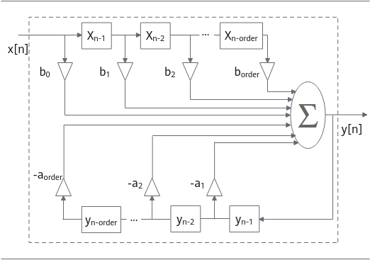

其中X\[n\]为输入，y\[n\]为输出，order为滤波器阶数，a、b为滤波器系数，计算公式：


其中，，滤波器初始系数向量长度为order，排列顺序为：。

其中src和dst允许是同一个数组，支持原地操作。IIR接收长度为order延迟线，延迟线运行为空，若为空，会将延迟线0填充。滤波计算完成后，延迟线将会被更新。

BiQuad滤波器是二阶IIR滤波器的级联，如图2所示描述了k个二阶滤波器组成的BiQuad滤波器。

**图 2**  k个二阶滤波器组成的BiQuad滤波器  
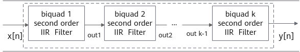

HMPP仅支持Direct Form 2（DF2）形式的延迟线。HMPPS\_IIRGetDlyLine和HMPPS\_IIRSetDlyLine函数返回/设置的延迟线也是DF2形式的。相较于Direct Form 1（DF1）形式的延迟线，存储DF2形式的延迟线元素的个数少一半。DF2形式的延迟线可以由DF1形式延迟线计算得到的信息，如果需要DF1形式的延迟线，请拷贝src数组和计算完成后dst数组的后order个元素作为DF1形式的延迟线。

IIR函数调用流程如下：

1. 使用对应的IIRInit函数进行初始化。
2. 使用IIR进行滤波操作。
3. 再使用IIRGetDlyLine或者IIRSetDlyLine检索设置延迟线。
4. 最后再使用IIRRelease对IIRInit申请的内存进行释放。

函数接口声明如下：

- **初始化操作：**

    HmppResult HMPPS\_IIRInit\_32f\(HmppsIIRPolicy\_32f \*\*policy, const float \*taps, int order, const float \*dlyLine\);

    HmppResult HMPPS\_IIRInit\_64f\(HmppsIIRPolicy\_64f \*\*policy, const double \*taps, int order, const double \*dlyLine\);

    HmppResult HMPPS\_IIRInit\_32fc\(HmppsIIRPolicy\_32fc \*\*policy, const Hmpp32fc \*taps, int order, const Hmpp32fc \*dlyLine\);

    HmppResult HMPPS\_IIRInit\_64fc\(HmppsIIRPolicy\_64fc \*\*policy, const Hmpp64fc \*taps, int order, const Hmpp64fc \*dlyLine\);

    HmppResult HMPPS\_IIRInit\_BiQuad\_32f\(HmppsIIRPolicy\_32f \*\*policy, const float \*taps, int numBq, const float \*dlyLine\);

    HmppResult HMPPS\_IIRInit\_BiQuad\_64f\(HmppsIIRPolicy\_64f \*\*policy, const double \*taps, int numBq, const double \*dlyLine\);

    HmppResult HMPPS\_IIRInit\_BiQuad\_32fc\(HmppsIIRPolicy\_32fc \*\*policy, const Hmpp32fc \*taps, int numBq, const Hmpp32fc \*dlyLine\);

    HmppResult HMPPS\_IIRInit\_BiQuad\_64fc\(HmppsIIRPolicy\_64fc \*\*policy, const Hmpp64fc \*taps, int numBq, const Hmpp64fc \*dlyLine\);

- **获取延迟线操作：**

    HmppResult HMPPS\_IIRGetDlyLine\_32f\(const HmppsIIRPolicy\_32f \*policy, float \*dlyLine\);

    HmppResult HMPPS\_IIRGetDlyLine\_64f\(const HmppsIIRPolicy\_64f \*policy, double \*dlyLine\);

    HmppResult HMPPS\_IIRGetDlyLine\_32fc\(const HmppsIIRPolicy\_32fc \*policy, Hmpp32fc \*dlyLine\);

    HmppResult HMPPS\_IIRGetDlyLine\_64fc\(const HmppsIIRPolicy\_64fc \*policy, Hmpp64fc \*dlyLine\);

- **设置延迟线操作：**

    HmppResult HMPPS\_IIRSetDlyLine\_32f\(HmppsIIRPolicy\_32f \*policy, const float \*dlyLine\);

    HmppResult HMPPS\_IIRSetDlyLine\_64f\(HmppsIIRPolicy\_64f \*policy, const double \*dlyLine\);

    HmppResult HMPPS\_IIRSetDlyLine\_32fc\(HmppsIIRPolicy\_32fc \*policy, const Hmpp32fc \*dlyLine\);

    HmppResult HMPPS\_IIRSetDlyLine\_64fc\(HmppsIIRPolicy\_64fc \*policy, const Hmpp64fc \*dlyLine\);

- **滤波操作：**

    HmppResult HMPPS\_IIR\_32f\(const float \*src, float \*dst, int len, HmppsIIRPolicy\_32f \*policy\);

    HmppResult HMPPS\_IIR\_64f\(const double \*src, double \*dst, int len, HmppsIIRPolicy\_64f \*policy\);

    HmppResult HMPPS\_IIR\_32fc\(const Hmpp32fc \*src, Hmpp32fc \*dst, int len, HmppsIIRPolicy\_32fc \*policy\);

    HmppResult HMPPS\_IIR\_64fc\(const Hmpp64fc \*src, Hmpp64fc \*dst, int len, HmppsIIRPolicy\_64fc \*policy\);

- **释放内存操作：**

    HmppResult HMPPS\_IIRRelease\_32f\(HmppsIIRPolicy\_32f \*policy\);

    HmppResult HMPPS\_IIRRelease\_64f\(HmppsIIRPolicy\_64f \*policy\);

    HmppResult HMPPS\_IIRRelease\_32fc\(HmppsIIRPolicy\_32fc \*policy\);

    HmppResult HMPPS\_IIRRelease\_64fc\(HmppsIIRPolicy\_64fc \*policy\);

    HmppResult HMPPS\_IIRRelease\_BiQuad\_32f\(HmppsIIRPolicy\_32f \*policy\);

    HmppResult HMPPS\_IIRRelease\_BiQuad\_64f\(HmppsIIRPolicy\_64f \*policy\);

    HmppResult HMPPS\_IIRRelease\_BiQuad\_32fc\(HmppsIIRPolicy\_32fc \*policy\);

    HmppResult HMPPS\_IIRRelease\_BiQuad\_64fc\(HmppsIIRPolicy\_64fc \*policy\);

**参数**

|参数名|描述|取值范围|输入/输出|
|--|--|--|--|
|taps|指向滤波器系数的指针。|非空|输入|
|order|IIR滤波器的阶数。|(0, INT_MAX]|输入|
|src|指向源向量指针|非空|输入|
|dst|指向目标向量的指针。|非空|输出|
|len|源向量和目标向量长度|(0, INT_MAX]|输入|
|numBq|BiQuad滤波器的级数。|(0, INT_MAX]|输入|
|dlyLine（init和setDly函数中）|指向包含延迟线向量的指针。|向量可以为NULL，如果为NULL，则用全零填充延迟线。|输入|
|dlyLine（getDly函数中）|指向延迟线值的指针。|非空|输出|
|policy（init函数中）|指向内存存储IIRPolicy的指针的指针。|非空|输出|
|policy（setDly函数中）|指向IIRPolicy结构体的指针。|非空|输入|
|policy（滤波函数中和release函数中）|指向IIRPolicy结构体的指针。|非空|输入|

**返回值**

- 成功：返回HMPP\_STS\_NO\_ERR。
- 失败：返回错误码。

**错误码**

|错误码|描述|
|--|--|
|HMPP_STS_NO_ERR|表示没有错误。|
|HMPP_STS_NULL_PTR_ERR|当任何指定的指针为空时指示错误。|
|HMPP_STS_SIZE_ERR|当len小于或等于0时指示错误。|
|HMPP_STS_DIV_BY_ZERO_ERR|除0错误，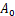不能为0。|
|HMPP_STS_CONTEXT_MATCH_ERR|表示Policy状态不正确时出错（使用了错误的Init函数）。|
|HMPP_STS_MALLOC_FAILED|Init函数中进行算法模型所需内存申请失败。|

> **说明：** 
>
>- 调用该接口计算之前，必须调用Init接口初始化IIRPolicy规范结构。
>- IIRPolicy结构体初始化需在Init函数中进行申请的，用户无法自己进行该结构体申请定义。
>- IIRPolicy结构体初始化成功后，如果执行主函数失败，必须使用Release函数释放结构体。
>- src和dst支持是同一数组，即原地（inplace）操作。
>- IIR和IIR BiQuad的初始化函数不同，其他操作共用一套函数。

**IIR示例**

```c
#define ORDER 4
#define TAPS_LEN ( (ORDER + 1) * 2)
#define SRC_LEN 10
#define DLY_LEN ORDER
 
void IIRExample(void) {
    float taps[TAPS_LEN] = {0.0390, -0.1560, 0.2340, -0.1560, 0.0390, 1.0000, 0.9532, 0.7746, 0.2338, 0.0366};
    float src[SRC_LEN] = {186, 431, 689, 206, 716, 90, 695, -153};
    float dlySrc[DLY_LEN] = {123, 312, 781, 249};
    float dlyDst[DLY_LEN];
    float dst[SRC_LEN];
    HmppsIIRPolicy_32f *policy = NULL;
    HmppResult result;
 
    result = HMPPS_IIRInit_32f(&policy, taps, ORDER, dlySrc);
    printf("HMPPS_IIRInit_32f result = %d\n", result);
    if (result != HMPP_STS_NO_ERR) {
        return;
    }
    result = HMPPS_IIR_32f(src, dst, SRC_LEN, policy);
    printf("HMPPS_IIR_32f result = %d\n", result);
    if (result != HMPP_STS_NO_ERR) {
        return;
    }
    int32_t i;
    printf("dstLen = %d\ndst =", SRC_LEN);
    for (i = 0; i < SRC_LEN; ++i) {
        printf(" %f", dst[i]);
    }
    HMPPS_IIRGetDlyLine_32f(policy, dlyDst);
    printf("\ndlyDstLen = %d\ndlyDst =", DLY_LEN);
    for (i = 0; i < DLY_LEN; ++i) {
        printf(" %f", dlyDst[i]);
    }
    printf("\n");
    HMPPS_IIRRelease_32f(policy);
    policy = NULL;
}
```

运行结果：

```text
HMPPS_IIRInit_32f result = 0
HMPPS_IIR_32f result = 0
dstLen = 10
dst = 130.253998 175.634888 515.849060 -436.819489 68.000931 -4.148865 209.873474 -393.737732 411.605988 -276.982147
dlyDstLen = 4
dlyDst = 80.536873 126.760712 49.693642 10.137547
```

**IIRBiQuad示例**

```c
#define NUM_BQ 2
#define TAPS_LEN (NUM_BQ * 6)
#define SRC_LEN 8
#define DLY_LEN (NUM_BQ * 2)

void BiQuadExample(void) {
    float taps[TAPS_LEN] = {0.1980326, -0.39606521, 0.1980326, 1., 0.40919919, 0.2013296, 0.197444, -0.394888,  0.197444, 1., 0.41195841, 0.20173442};
    float src[SRC_LEN] = {186, 431, 689, 206, 716, 90, 695, -153};
    float dlySrc[DLY_LEN] = {694.24421981, -100.19274855, -681.3183156 , -324.66495805};
    float dlyDst[DLY_LEN];
    float dst[SRC_LEN];
    HmppsIIRPolicy_32f *policy = NULL;
    HmppResult result;
 
    result = HMPPS_IIRInit_BiQuad_32f(&policy, taps, NUM_BQ, dlySrc);
    printf("HMPPS_IIRInit_BiQuad_32f result = %d\n", result);
    if (result != HMPP_STS_NO_ERR) {
        return;
    }
    result = HMPPS_IIR_32f(src, dst, SRC_LEN, policy);
    printf("HMPPS_IIR_32f result = %d\n", result);
    if (result != HMPP_STS_NO_ERR) {
        return;
    }
    int32_t i;
    printf("dstLen = %d\ndst =", SRC_LEN);
    for (i = 0; i < SRC_LEN; ++i) {
        printf(" %f", dst[i]);
    }
    HMPPS_IIRGetDlyLine_32f(policy, dlyDst);
    printf("\ndlyDstLen = %d\ndlyDst =", DLY_LEN);
    for (i = 0; i < DLY_LEN; ++i) {
        printf(" %f", dlyDst[i]);
    }
    printf("\n");
    HMPPS_IIRRelease_32f(policy);
    policy = NULL;
}
```

运行结果：

```text
HMPPS_IIRInit_BiQuad_32f result = 0
HMPPS_IIR_32f result = 0
dstLen = 8
dst = -536.971313 -468.691376 601.606384 -250.059616 58.091927 -136.327194 271.481598 -341.952698
dlyDstLen = 4
dlyDst = 280.199768 41.936638 291.383179 -1.857876
```

##### IIRGen

生成低通或高通IIR滤波器。

HMPP支持生成Butterworth和Chebyshev1类型的滤波器。Butterworth滤波器的特点是在通带内平坦，Chebyshev1滤波器的特点在通带内有波纹波动。

函数接口声明如下：

HmppResult HMPPS\_IIRGenLowpass\_64f\(double rFreq, double ripple, int order, double \*pTaps, HmppsIIRFilterType filterType\);

HmppResult HMPPS\_IIRGenHighpass\_64f\(double rFreq, double ripple, int order, double \*pTaps, HmppsIIRFilterType filterType\);

**参数**

|参数名|描述|取值范围|输入/输出|
|--|--|--|--|
|rFreq|截止频率。|(0,0.5)|输入|
|ripple|当滤波器类型为HmppChebyshev1时指定波纹。|(0, INT_MAX]，滤波器类型为HmppChebyshev1时(0, 28]|输入|
|order|生成滤波器的阶数。|[1, 12]|输入|
|filterType|生成滤波器的类型。|HmppButterworth：表示滤波器类型为Butterworth滤波器HmppChebyshev1：表示滤波器类型为Chebyshev1滤波器|输入|
|pTaps|生成滤波器的系数。|非空|输出|

**返回值**

- 成功：返回HMPP\_STS\_NO\_ERR。
- 失败：返回错误码。

**错误码**

|错误码|描述|
|--|--|
|HMPP_STS_NO_ERR|表示没有错误。|
|HMPP_STS_NULL_PTR_ERR|任何指定的指针为空时错误。|
|HMPP_STS_GEN_ORDER_ERR|生成的order小于1或大于12。|
|HMPP_STS_FILTER_FREQUENCY_ERR|截止频率不在(0, 0.5)范围内。|

> **说明：** 
>
>- 滤波器类型仅支持HmppButterworth和HmppChebyshev1，请勿使用其他值，否则结果可能出错。
>- IIR滤波器的收敛性对系数a的量化误差敏感，因此将生成double类型的系数用于单精度计算时候需要验证滤波器是否收敛。

**示例**

以下是用HMPP分别生成一个高通滤波器和一个低通滤波器的示例代码。

高通滤波器的类型为Butterworth，阶数为9，采样频率为1000Hz，截止频率为400Hz。与MatLab等价的代码：**\[b,a\] = butter\(9,400/500,'high'\);**。

低通滤波器的类型为Chebyshev1，阶数为9，采样频率为1000Hz，截止频率为400Hz，通带内的波纹为0.4dB。与MatLab等价的代码：**\[b,a\] = cheby1\(9, 0.4, 400/500\);**。

```c
#define ORDER 9
#define TAPS_LEN ((ORDER + 1) * 2)
void IIRGenExample() {
    HmppResult ret;
    double taps[TAPS_LEN];
    ret = HMPPS_IIRGenHighpass_64f(400.0 / 1000.0, 0, ORDER, taps, HmppButterworth);
    printf("IIRGenHighpass ret=%d\n", ret);
    for (int i = 0; i < TAPS_LEN; ++i) {
        printf("%lf ", taps[i]);
    }
    printf("\n");
 
    ret = HMPPS_IIRGenLowpass_64f(400.0 / 1000.0, 0.4, ORDER, taps, HmppChebyshev1);
    printf("IIRGenLowpass ret=%d\n", ret);
    for (int i = 0; i < TAPS_LEN; ++i) {
        printf("%lf ", taps[i]);
    }
    printf("\n");
}
```

运行结果：

```text
IIRGenHighpass ret=0
0.000006 -0.000057 0.000229 -0.000534 0.000800 -0.000800 0.000534 -0.000229 0.000057 -0.000006 1.000000 5.386221 13.378550 19.961682 19.623982 13.137028 5.973215 1.775180 0.312381 0.024765 
IIRGenLowpass ret=0
0.080020 0.720182 2.880728 6.721698 10.082547 10.082547 6.721698 2.880728 0.720182 0.080020 1.000000 4.135535 8.510626 10.746179 9.121897 5.230419 1.958336 0.349120 -0.039936 -0.041825
```

##### IIRIIR

初始化一个无限脉冲响应（IIR）滤波器并对输入进行零相位数字滤波（zero-phase digital filtering）。

滤波过程分为正向滤波和反向滤波。x\(n\)将被存储在src中，滤波输出y\(n\)存储在dst中。下面简单解释零相位数字滤波器的原理。

数字信号的时域表示：


其中，h\(n\)为对应数字滤波器的冲激响应，y<sub>4</sub>\(n\)去掉首尾L个信号点即为对应输出序列。

频域表示：


由此可以推出：


即输出序列与输入序列之间没有相位偏移。

正向滤波器和反向滤波器的阶数由order指定。系数向量长度为2\*\(order+1\)，元素排列如下：

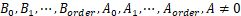

IIRIIRInit接收长度为order的延迟线向量，允许为空。若为空，将会用生成一个初始条件填充延迟线。

IIRIIR函数调用流程如下：

1. 使用对应的IIRIIRInit函数进行初始化。
2. 使用IIRIIR进行滤波操作。
3. 再使用IIRIIRGetDlyLine或者IIRIIRSetDlyLine检索设置延迟线。
4. 最后再使用IIRIIRRelease对IIRIIRInit申请的内存进行释放。

函数接口声明如下：

- **初始化操作：**

HmppResult HMPPS\_IIRIIRInit\_32f\(HmppsIIRPolicy\_32f \*\*policy, const float \*taps, int order, const float \*dlyLine\);

HmppResult HMPPS\_IIRIIRInit\_64f\(HmppsIIRPolicy\_64f \*\*policy, const double \*taps, int order, const double \*dlyLine\);

- **获取延迟线操作：**

HmppResult HMPPS\_IIRIIRGetDlyLine\_32f\(const HmppsIIRPolicy\_32f \*policy, float \*dlyLine\);

HmppResult HMPPS\_IIRIIRGetDlyLine\_64f\(const HmppsIIRPolicy\_64f \*policy, double \*dlyLine\);

- **设置延迟线操作：**

HmppResult HMPPS\_IIRIIRSetDlyLine\_32f\(HmppsIIRPolicy\_32f \*policy, const float \*dlyLine\);

HmppResult HMPPS\_IIRIIRSetDlyLine\_64f\(HmppsIIRPolicy\_64f \*policy, const double \*dlyLine\);

- **滤波操作：**

HmppResult HMPPS\_IIRIIR\_32f\(const float \*src, float \*dst, int len, HmppsIIRPolicy\_32f \*policy\);

HmppResult HMPPS\_IIRIIR\_64f\(const double \*src, double \*dst, int len, HmppsIIRPolicy\_64f \*policy\);

- **释放内存操作：**

HmppResult HMPPS\_IIRIIRRelease\_32f\(HmppsIIRPolicy\_32f \*policy\);

HmppResult HMPPS\_IIRIIRRelease\_64f\(HmppsIIRPolicy\_64f \*policy\);

**参数**

|参数名|描述|取值范围|输入/输出|
|--|--|--|--|
|taps|指向滤波器系数的指针。|非空|输入|
|order|IIR滤波器的阶数。|(0, INT_MAX]|输入|
|src|指向源向量指针。|非空|输入|
|dst|指向目标向量的指针。|非空|输出|
|len|源向量和目标向量长度。|[3 * order, INT_MAX]|输入|
|dlyLine（init和setDly函数中）|指向包含延迟线向量的指针。|向量可以为NULL，如果为NULL，则用初始条件填充延迟线。|输入|
|dlyLine（getDly函数中）|指向延迟线值的指针。|非空|输出|
|policy（init函数中）|指向内存存储IIRIIRPolicy的指针的指针。|非空|输出|
|policy（setDly函数中）|指向IIRIIRPolicy结构体的指针。|非空|输入|
|policy（滤波函数中和release函数中）|指向IIRIIRPolicy结构体的指针。|非空|输入|

**返回值**

- 成功：返回HMPP\_STS\_NO\_ERR。
- 失败：返回错误码。

**错误码**

|错误码|描述|
|--|--|
|HMPP_STS_NO_ERR|表示没有错误。|
|HMPP_STS_NULL_PTR_ERR|任何指定的指针为空时错误。|
|HMPP_STS_LENGTh_ERR|len小于或等于0时错误、或len<3*order。|
|HMPP_STS_DIV_BY_ZERO_ERR|除0错误，不能为0。|
|HMPP_STS_CONTEXT_MATCH_ERR|表示Policy状态不正确时出错（使用了错误的Init函数）。|
|HMPP_STS_MALLOC_FAILED|Init函数中进行算法模型所需内存申请失败。|

> **说明：** 
>
>- 调用该接口计算之前，必须调用Init接口初始化IIRIIRPolicy规范结构。
>- IIRIIRPolicy结构体初始化需在Init函数中进行申请的，用户无法自己进行该结构体申请定义。
>- IIRIIRPolicy结构体初始化成功后，如果执行滤波失败，必须使用Release函数释放结构体。
>- IIRIIR对滤波器输入数据长度有要求，要求len≥3\*order。

**示例**

```c
#define ORDER 4
#define TAPS_LEN ( (ORDER + 1) * 2)
#define SRC_LEN 12
#define DLY_LEN ORDER

void IIRIIRExample(void) {
    float taps[TAPS_LEN] = {0.0390, -0.1560, 0.2340, -0.1560, 0.0390, 1.0000, 0.9532, 0.7746, 0.2338, 0.0366};
    float src[SRC_LEN] = {186, 431, 689, 206, 716, 90, 695, -153, 289, 291, 482, -21};
    float dlySrc[DLY_LEN] = {123, 312, 781, 249};
    float dlyDst[DLY_LEN];
    float dst[SRC_LEN];
    HmppsIIRPolicy_32f *policy = NULL;
    HmppResult result;
 
    result = HMPPS_IIRIIRInit_32f(&policy, taps, ORDER, dlySrc);
    printf("HMPPS_IIRIIRInit_32f result = %d\n", result);
    if (result != HMPP_STS_NO_ERR) {
        return;
    }
    result = HMPPS_IIRIIR_32f(src, dst, SRC_LEN, policy);
    printf("HMPPS_IIRIIR_32f result = %d\n", result);
    if (result != HMPP_STS_NO_ERR) {
        return;
    }
    int32_t i;
    printf("dstLen = %d\ndst =", SRC_LEN);
    for (i = 0; i < SRC_LEN; ++i) {
        printf(" %f", dst[i]);
    }
    HMPPS_IIRIIRGetDlyLine_32f(policy, dlyDst);
    printf("\ndlyDstLen = %d\ndlyDst =", DLY_LEN);
    for (i = 0; i < DLY_LEN; ++i) {
        printf(" %f", dlyDst[i]);
    }
    printf("\n");
    HMPPS_IIRIIRRelease_32f(policy);
    policy = NULL;
}
```

运行结果：

```text
HMPPS_IIRIIRInit_32f result = 0
HMPPS_IIRIIR_32f result = 0
dstLen = 12
dst = 1265.131836 330.548798 -677.644104 32.452599 557.080872 -618.195129 370.672546 -161.901367 103.654419 -112.175522 88.226212 -16.978725
dlyDstLen = 4
dlyDst = -0.039000 0.117000 -0.117000 0.039000
```

##### IIRSparse

初始化一个任意阶稀疏IIR滤波器并进行滤波。

稀疏滤波器仅对系数非零的位置进行计算，适用于高阶非零元素较少的滤波器。输入向量x\(n\)将被存储在src中，输出向量y\(n\)存储在dst中。

计算公式如下：


在初始化接收长度为nzTapsLen1 + nzTapsLen2的非零系数向量、非零系数位置向量和延迟线向量，系数向量的排列为：。

系数位置向量的顺序为：

  。

计算完成后，存储在Policy内部的延迟线将会被更新。

IIRSparse函数调用流程如下：

1. 使用IIRSparseInit函数进行初始化。
2. 使用FIRSparse进行滤波操作。
3. 再使用FIRSparseGetDlyLine或者FirSparseSetDlyLine检索设置延迟线。
4. 最后再使用IIRSparseRelease对IIRSparseInit申请的内存进行释放。

函数接口声明如下：

- **初始化操作**：

    HmppResult HMPPS\_IIRSparseInit\_32f\(HmppsIIRSparsePolicy\_32f \*\*policy, const float \*nzTaps, const int32\_t \*nzTapPos, int32\_t nzTapsLen1, int32\_t nzTapsLen2, const float \*dlyLine\);

- **滤波操作：**

    HmppResult HMPPS\_IIRSparse\_32f\(const float \*src, float \*dst, int len, HmppsIIRSparsePolicy\_32f \*policy\);

- **释放内存操作：**

    HmppResult HMPPS\_IIRSparseRelease\_32f\(HmppsIIRSparsePolicy\_32f \*policy\);

**返回值**

- 成功：返回HMPP\_STS\_NO\_ERR。
- 失败：返回错误码。

**参数**

|参数名|描述|取值范围|输入/输出|
|--|--|--|--|
|nzTapsLen1|系数向量A的长度。|(0, INT_MAX]|输入|
|nzTapsLen2|系数向量B的长度。|(0, INT_MAX]|输入|
|nzTaps|指向系数向量的指针。|非空，所有元素非零|输入|
|nzTapsPos|指向系数位置向量的指针。|非空升序序列，所有元素非零|输入|
|src|指向源向量指针|非空|输入|
|dst|指向目标向量的指针。|非空|输出|
|dlyLine|指向包含延迟线向量的指针。|向量可以为NULL，如果为NULL，则用全零填充延迟线。|输入|
|len|源向量和目标向量长度|(0, INT_MAX]|输入|
|policy（init函数中）|指向内存存储IIRSparsePolicy的指针的指针。|非空|输出|
|policy（滤波函数中和release函数中）|指向IIRSparsePolicy结构体的指针。|非空|输入|

**错误码**

|错误码|描述|
|--|--|
|HMPP_STS_NO_ERR|表示没有错误。|
|HMPP_STS_NULL_PTR_ERR|当任何指定的指针为空时指示错误。|
|HMPP_STS_SIZE_ERR|当len小于或等于0时指示错误。|
|HMPP_STS_SPARSE_ERR|除0错误，不能为0。|
|HMPP_STS_IIR_ORDER_ERR|系数位置数组不是升序，或pNZTapPos[nzTapsLen1]为0。|
|HMPP_STS_MALLOC_FAILED|Init函数中进行算法模型所需内存申请失败。|

> **说明：** 
>
>- 调用该接口计算之前，必须调用Init接口初始化IIRSparsePolicy规范结构。
>- IIRSparsePolicy结构体初始化需在Init函数中进行申请的，用户无法自己进行该结构体申请定义。
>- IIRSparsePolicy结构体初始化成功后，如果执行主函数失败，必须使用Release函数释放结构体。
>- IIRSparsePolicy会存储当前的dly，但是暂时不支持用户获取/设置。

**示例**

```c
#define TAPS_LEN1 3
#define TAPS_LEN2 2
#define SRC_LEN 5

void IIRSparseExample(void) {
    float nzTaps[TAPS_LEN1 + TAPS_LEN2] = {0.11381195, -0.22762391,  0.11381195, -0.8457246 , -0.30097242};
    int nzTapsPos[TAPS_LEN1 + TAPS_LEN2] = {0, 1, 2, 1, 2};
    float src[SRC_LEN] = {-609.13320264, -797.90780797, -654.27805165, -108.74137918, 24.2107372};
    float dly[TAPS_LEN1 + TAPS_LEN2] = {-578.53248547, 282.88755714, 861.85222751, 342.84958675, 769.01355443};
    float dst[SRC_LEN];
    HmppsIIRSparsePolicy_32f *policy = NULL;
    HmppResult result;

    result = HMPPS_IIRSparseInit_32f(&policy, nzTaps, nzTapsPos, TAPS_LEN1, TAPS_LEN2, dly);
    printf("HMPPS_IIRSparseInit_32f result = %d\n", result);
    if (result != HMPP_STS_NO_ERR) {
        return;
    }
    result = HMPPS_IIRSparse_32f(src, dst, SRC_LEN, policy);
    printf("HMPPS_IIR_32f result = %d\n", result);
    if (result != HMPP_STS_NO_ERR) {
        return;
    }
    int32_t i;
    printf("\ndstLen = %d\ndst =", SRC_LEN);
    for (i = 0; i < SRC_LEN; ++i) {
        printf(" %f", dst[i]);
    }
    printf("\n");
    HMPPS_IIRSparseRelease_32f(policy);
    policy = NULL;
}
```

运行结果：

```text
HMPPS_IIRSparseInit_32f result = 0
HMPPS_IIR_32f result = 0

dstLen = 5
dst = -737.520752 346.343597 -33.106266 -30.499273 -11.198996
```

##### Resample

使用对理想低通滤波器加Kaiser窗的多项滤波器对数据进行重采样，适用于可变的重采样率。

函数调用流程如下：

1. 调用Init初始化结构体。
2. 调用重采样主函数。
3. 最后调用Release释放结构体所包含的内存。

输入待重采样数据src的最左边和最右边需包含滤波所需要的延长线数据；滤波器长度filterLen跟factor、step、window关系如下：

filterLen / 2 = window \* 0.5 + 1;  factor \> 1.0

filterLen / 2 = window \* 0.5 / factor + 1.0 / \(factor \* step\); factor < 1.0

src左侧延长线数据个数：\(filterLen / 2\) - time;

src右侧延长线数据个数：time + \(filterLen / 2\);

即src长度应该为len + filterLen。

函数接口声明如下：

- **初始化操作：**

    HmppResult HMPPS\_ResamplePolyphaseInit\_32f\(float window, int32\_t step, float rollf, float alpha, HmppHintAlgorithm hint, HmppsResamplingPolyphase\_32f \*\*policy\);

    HmppResult HMPPS\_ResamplePolyphaseInit\_16s\(float window, int32\_t step, float rollf, float alpha, HmppHintAlgorithm hint, HmppsResamplingPolyphase\_16s \*\*policy\);

- **重采样操作：**

    HmppResult HMPPS\_ResamplePolyphase\_32f\(const float \*src, int32\_t len, float \*dst, double factor, float norm, double \*time,int32\_t \*outLen, const HmppsResamplingPolyphase\_32f \*policy\);

    HmppResult HMPPS\_ResamplePolyphase\_16s\(const int16\_t \*src, int32\_t len, int16\_t \*dst, double factor, float norm, double \*time,int32\_t \*outLen, const HmppsResamplingPolyphase\_16s \*policy\);

- **释放内存操作：**

    HmppResult HMPPS\_ResamplePolyphaseRelease\_32f\(HmppsResamplingPolyphase\_32f \*policy\);

    HmppResult HMPPS\_ResamplePolyphaseRelease\_16s\(HmppsResamplingPolyphase\_16s \*policy\);

**参数**

|参数名|描述|取值范围|输入/输出|
|--|--|--|--|
|window|理想低通滤波器窗口大小。|(0,  (INT_MAX - 0x90) / 4 / step)|输入|
|step|多项滤波器的步长。|(0,**** (INT_MAX - 0x90) / 4 / window)|输入|
|rollf|滤波器的衰减频率。|(0, 1.0]|输入|
|alpha|Kaiser窗的可调参数。|(1.0,FLT_MAX]|输入|
|policy|指向重采样策略结构体的指针或者指针的指针。|非空|输入/输出|
|hint|重采样的模式。|HMPP_ALGHINT_NONEHMPP_ALGHINT_FASTHMPP_ALGHINT_ACCURATE|输入|
|src|指向输入的待重采样的数据及延迟线。|非空|输入|
|dst|指向输出的已重采样的数据。|非空|输入/输出|
|len|待重采样的数据长度。|当factor >= 1.0 : (0,INT_MAX / factor)当factor < 1.0 : (0,INT_MAX)|输入|
|factor|重采样因子。|(0,DBL_MAX]|输入|
|norm|重采样数据的归一化系数。|float任意值|输入|
|time|指向重采样的开始时间及结束时间。|非空|输入/输出|
|outLen|指向重采样输出的数据长度。|非空|输入/输出|

**返回值**

- 成功：返回HMPP\_STS\_NO\_ERR。
- 失败：返回错误码。

**错误码**

|错误码|描述|
|--|--|
|HMPP_STS_NULL_PTR_ERR|src、dst、policy、time、outLen这几个入参中存在空指针。|
|HMPP_STS_SIZE_ERR|len存在小于或者等于0。|
|HMPP_STS_BAD_ARG_ERR|rollf小于或等于0或者大于1。alpha小于1。window小于2/step。factor小于或者等于0。|
|HMPP_STS_MALLOC_FAILED|申请内存失败。|
|HMPP_STS_OVER_FLOW|所需的内部buffer大小超过INT_MAX。|

**示例**

```c
#include <stdio.h>
#include <stdint.h>
#include "hmpps.h"
#include "hmpp_core.h"

#define BUFFER_SIZE_T 10

int main()
{
    float src[4 + BUFFER_SIZE_T + 4] = {0, 0, 0, 0, 1.0, 1.1, 1.2, 1.3, 1.4, 1.5, 1.6, 1.7, 1.8, 1.9, 0, 0, 0, 0};
    float window = 6.0;
    int32_t step = 2;
    float rollf = 0.95;
    float alpha = 9.0f;
    double factor = 0.5;
    float norm = 1.0;
    double time = 4.0;
    int32_t outLen;
    float dst[BUFFER_SIZE_T/2];
    HmppsResamplingPolyphase_32f *policy;

    HmppResult result = HMPPS_ResamplePolyphaseInit_32f(window, step, rollf, alpha, HMPP_ALGHINT_FAST, &policy);
    if (result != HMPP_STS_NO_ERR) {
        return -1;    
    }
    result = HMPPS_ResamplePolyphase_32f(src, BUFFER_SIZE_T, dst, factor, norm, &time, &outLen, policy);
    printf("result = %d, outLen = %d\n", result, outLen);
    if (result != HMPP_STS_NO_ERR) {
        return -1;    
    }

    printf("dst =");
    for (int32_t i = 0; i < outLen; i++) {
        printf(" %f", dst[i]);  
    }
    printf("\n");
    
    HMPPS_ResamplePolyphaseRelease_32f(policy);

    return 0;
} 
```

运行结果：

```text
result = 0, outLen = 5
dst = 0.761617 1.231306 1.398704 1.602798 1.842311
```

##### ResampleFixed

使用对理想低通滤波器加Kaiser窗的多项滤波器对数据进行重采样，仅适用于输入和输出采用率为固定有理数的情况，相比非Fixed接口提供更好的性能。

函数调用流程如下：

1. 调用Init初始化结构体。
2. 调用重采样主函数。
3. 最后调用Release释放结构体所包含的内存。

函数接口声明如下：

- **初始化操作：**

    HmppResult HMPPS\_ResamplePolyphaseFixedInit\_32f\(int32\_t inRate, int32\_t outRate, int32\_t len, float rollf, float alpha,HmppHintAlgorithm hint, int32\_t \*fLen, int32\_t \*fHeight,HmppsResamplingPolyphaseFixed\_32f \*\*policy\);

    HmppResult HMPPS\_ResamplePolyphaseFixedInit\_16s\(int32\_t inRate, int32\_t outRate, int32\_t len, float rollf, float alpha,HmppHintAlgorithm hint, int32\_t \*fLen, int32\_t \*fHeight,HmppsResamplingPolyphaseFixed\_16s \*\*policy\);

- **设置滤波器系数操作：**

    HmppResult HMPPS\_ResamplePolyphaseSetFixedFilter\_32f\(const float \*src, int32\_t step, int32\_t height,HmppsResamplingPolyphaseFixed\_32f \*policy\);

    HmppResult HMPPS\_ResamplePolyphaseSetFixedFilter\_16s\(const int16\_t \*src, int32\_t step, int32\_t height,HmppsResamplingPolyphaseFixed\_16s \*policy\);

- **获取滤波器系数操作：**

    HmppResult HMPPS\_ResamplePolyphaseGetFixedFilter\_32f\(float \*dst, int32\_t step, int32\_t height,const HmppsResamplingPolyphaseFixed\_32f \*policy\);

    HmppResult HMPPS\_ResamplePolyphaseGetFixedFilter\_16s\(int16\_t \*dst, int32\_t step, int32\_t height,const HmppsResamplingPolyphaseFixed\_16s \*policy\);

- **重采样操作：**

    HmppResult HMPPS\_ResamplePolyphaseFixed\_32f\(const float \*src, int32\_t len, float \*dst, float norm, double \*time,int32\_t \*outLen, const HmppsResamplingPolyphaseFixed\_32f \*policy\);

    HmppResult HMPPS\_ResamplePolyphaseFixed\_16s\(const int16\_t \*src, int32\_t len, int16\_t \*dst, float norm, double \*time,int32\_t \*outLen, const HmppsResamplingPolyphaseFixed\_16s \*policy\);

- **释放内存操作：**

    HmppResult HMPPS\_ResamplePolyphaseFixedRelease\_32f\(HmppsResamplingPolyphaseFixed\_32f \*policy\);

    HmppResult HMPPS\_ResamplePolyphaseFixedRelease\_16s\(HmppsResamplingPolyphaseFixed\_16s \*policy\);

**参数**

|参数名|描述|取值范围|输入/输出|
|--|--|--|--|
|inRate|固定因子重采样的输入频率。|(0,INT_MAX]|输入|
|outRate|固定因子重采样的输出频率。|(0,INT_MAX]|输入|
|len|固定因子重采样滤波器的长度或者待重采样的输入数据的长度。|滤波器长度取值范围：Init函数中会有合法性判断，跟inRate和outRate有关，(0, (INT_MAX****- 0x4) / 4)待重采样数据长度：(0,INT_MAX * inRate / outRate)|输入|
|rollf|滤波器的衰减频率。|(0,1.0]|输入|
|alpha|Kaiser窗的可调参数。|[1,FLT_MAX]|输入|
|policy|指向重采样策略结构体的指针或者指针的指针。|非空|输入/输出|
|hint|重采样的模式。|HMPP_ALGHINT_NONEHMPP_ALGHINT_FASTHMPP_ALGHINT_ACCURATE|输入|
|fLen|多项滤波器实际的长度。|非空|输入/输出|
|fHeight|多项滤波器的个数。|非空|输入/输出|
|step|滤波器的步长。|(0,Init函数初始化的实际多项滤波器长度fLen]|输入|
|height|滤波器的个数。|(0,Init函数初始化的实际多项滤波器的高度fHeight]|输入|
|src|指向输入的滤波器系数或者指向输入的待重采样的数据。|非空|输入/输出|
|dst|指向输出的滤波器系数或者指向输出的已重采样的数据。|非空|输入/输出|
|norm|重采样数据的归一化系数。|float任意值|输入|
|time|指向重采样的开始时间及结束时间。|非空|输入/输出|
|outLen|指向重采样输出的数据长度。|非空|输入/输出|

**返回值**

- 成功：返回HMPP\_STS\_NO\_ERR。
- 失败：返回错误码。

**错误码**

|错误码|描述|
|--|--|
|HMPP_STS_NULL_PTR_ERR|src、dst、policy、fLen、fHeight、time、outLen这几个入参中存在空指针。|
|HMPP_STS_SIZE_ERR|len、step、height中存在小于或等于0。|
|HMPP_STS_BAD_ARG_ERR|rollf小于或等于0或者大于1。alpha小于1。height大于结构体中的滤波器个数。|
|HMPP_STS_MALLOC_FAILED|申请内存失败。|
|HMPP_STS_OVER_FLOW|所需的内部buffer大小超过INT_MAX。|

**示例**

```c
#include <stdio.h>
#include <stdint.h>
#include "hmpps.h"
#include "hmpp_core.h"

#define BUFFER_SIZE_T 10

int main()
{
    float src[4 + BUFFER_SIZE_T + 4] = {0, 0, 0, 0, 1.0, 1.1, 1.2, 1.3, 1.4, 1.5, 1.6, 1.7, 1.8, 1.9, 0, 0, 0, 0};
    int32_t inRate = 16000;
    int32_t outRate = 8000;
    int32_t inFilterLen = 6;
    float rollf = 0.95;
    float alpha = 9.0f;
    int32_t fLen;
    int32_t fHeight;
    float norm = 1.0;
    double time = 4.0;
    int32_t outLen;
    float dst[BUFFER_SIZE_T / 2];
    HmppsResamplingPolyphaseFixed_32f *policy;

    HmppResult result = HMPPS_ResamplePolyphaseFixedInit_32f(inRate, outRate, inFilterLen, rollf, alpha, 
                                                             HMPP_ALGHINT_FAST, &fLen, &fHeight, &policy);
    if (result != HMPP_STS_NO_ERR) {
        return -1;    
    }
    float *filter = (float *)HMPPS_Malloc_8u(fLen * fHeight * sizeof(float));
    if (filter == NULL) {
        return -1;
    }
    result = HMPPS_ResamplePolyphaseGetFixedFilter_32f(filter, fLen, fHeight, policy);
    if (result != HMPP_STS_NO_ERR) {
        return -1;    
    }
    printf("filter =");
    for (int32_t i = 0; i < fHeight; i++) {
       for (int32_t j = 0; j < fLen; j++) {
          printf(" %f", *(filter + i * fLen + j));
       }
       printf("\n");
    }
    result = HMPPS_ResamplePolyphaseFixed_32f(src, BUFFER_SIZE_T, dst, norm, &time, &outLen, policy);
    printf("result = %d\n", result);
    if (result != HMPP_STS_NO_ERR) {
        return -1;    
    }

    printf("dst =");
    for (int32_t i = 0; i < outLen; i++) {
        printf(" %f", dst[i]);  
    }
    printf("\n");
    
    HMPPS_ResamplePolyphaseFixedRelease_32f(policy);
    HMPPS_Free(filter);

    return 0;
} 
```

运行结果：

```text
filter = -0.000046 -0.012375 0.016357 0.493774 0.967378 0.493774 0.016357 -0.012375
result = 0
dst = 0.757003 1.183266 1.373958 1.570284 1.763205    
```

#### 聚合与哈希算法

##### 函数说明

该模块包含聚合类和哈希类的函数。涉及到的数据类型包含HMPP基本的数据类型，以及两种新定义的数据类型：

- varchar

    ```c
    typedef uint8_t varchar;
    ```

    即字符类型，varchar\*表示字符串。

    也可用varchar\*表示字符串数组，这种字符串数组数据类型是紧凑型存储的数据类型，使用时会配套使用offset\*向量表示每个子字符串的起始地址。例如：varchar\*指向"wearegoodfriend"字符串，offset\[4\]=\{0, 2, 5, 9\};，因此实际想要表示的字符串数组是\{"we", "are", "good", "friend"\}。

- HmppDecimal128

    ```c
    typedef struct {
        uint64_t low;
        int64_t high;
    } HmppDecimal128;
    ```

    即128位整型数，用两个64位整型数分别表示其低位和高位。high的最高位是符号位，其余127位构成绝对值。

##### CombineHash

函数接口声明如下：

HmppResult HMPPS\_CombineHash\(const int64\_t \*src1, const int64\_t \*src2, int32\_t len, int64\_t \*dst\);

**参数**

|参数名|描述|取值范围|输入/输出|
|--|--|--|--|
|src1|指向源向量的指针。|非空|输入|
|src2|指向源向量的指针。|非空|输入|
|len|向量长度。|(0,INT_MAX]|输入|
|dst|指向结果的指针。|非空|输出|

**返回值**

- 成功：返回HMPP\_STS\_NO\_ERR。
- 失败：返回错误码。

**错误码**

|错误码|描述|
|--|--|
|HMPP_STS_NULL_PTR_ERR|src1、src2、dst这几个入参中存在空指针。|
|HMPP_STS_SIZE_ERR|len小于或等于0。|

**示例**

```c
#include <stdio.h>
#include "hmpp.h"
#define BUFFER_SIZE_T 10

int main() {
    int64_t src1[BUFFER_SIZE_T] = {3, 6, 2, 8, 3, 15, 56, 31, 1, 23};
    int64_t dst[BUFFER_SIZE_T] = {0};
    int64_t src2[BUFFER_SIZE_T] = {33, 612, 224, 80, 3234, 150, 562, 311, 11, 232};
    HmppResult result = HMPPS_CombineHash(src1, src2, BUFFER_SIZE_T, dst);
    printf("result = %d\n", result);
    if (result != HMPP_STS_NO_ERR) {
        return 0;
    }
    for (int i = 0; i < BUFFER_SIZE_T; i++) {
 printf("%d, ", dst[i]);
    }
    printf("\n");
}
```

运行结果：

```text
result = 0
126, 798, 286, 328, 3327, 615, 2298, 1272, 42, 945,
```

##### Hash

函数接口声明如下：

HmppResult HMPPS\_Hash\_16s\(const int16\_t \*src, int32\_t len, const int8\_t \*nullAddr, int64\_t \*dst\);

HmppResult HMPPS\_Hash\_32s\(const int32\_t \*src, int32\_t len, const int8\_t \*nullAddr, int64\_t \*dst\);

HmppResult HMPPS\_Hash\_64s\(const int64\_t \*src, int32\_t len, const int8\_t \*nullAddr, int64\_t \*dst\);

HmppResult HMPPS\_Hash\_64f\(const double \*src, int32\_t len, const int8\_t \*nullAddr, int64\_t \*dst\);

HmppResult HMPPS\_Hash\_bool\(const bool \*src, int32\_t len, const int8\_t \*nullAddr, int64\_t \*dst\);

HmppResult HMPPS\_Hash\_decimal64\(const int64\_t \*src, int32\_t len, const int8\_t \*nullAddr, int64\_t \*dst\);

HmppResult HMPPS\_Hash\_decimal128\(const HmppDecimal128 \*src, int32\_t len, const int8\_t \*nullAddr, int64\_t \*dst\);

HmppResult HMPPS\_Hash\_varchar\(const varchar \*src, const int32\_t \*offset, int32\_t len, const int8\_t \*nullAddr, int64\_t \*dst\);

**参数**

|参数名|描述|取值范围|输入/输出|
|--|--|--|--|
|src|指向源向量的指针。|非空|输入|
|offset|指向子字符串偏移地址的指针。|非空|输入|
|len|向量长度。|(0,INT_MAX]|输入|
|nullAddr|指向空地址的指针。若nullAddr为空指针，表示src向量中所有元素都参与计算。否则，当nullAddr[i]=0时，src[i]参与计算（i表示索引）。|无要求，可以为空|输入|
|dst|指向结果的指针。|非空|输出|

**返回值**

- 成功：返回HMPP\_STS\_NO\_ERR。
- 失败：返回错误码。

**错误码**

|错误码|描述|
|--|--|
|HMPP_STS_NULL_PTR_ERR|src、offset、dst这几个入参中存在空指针。|
|HMPP_STS_SIZE_ERR|len小于或等于0。|

**示例**

```c
#include <stdio.h>
#include "hmpp.h"
#define BUFFER_SIZE_T 10

int main() {
    int64_t src[BUFFER_SIZE_T] = {3, 6, 2, 8, 3, 15, 56, 31, 1, 23};
    int64_t dst[BUFFER_SIZE_T] = {0};
 int8_t nullAddr[BUFFER_SIZE_T] = {0, 0, 1, 1, 0, 1, 0, 0, 0, 0};
    HmppResult result = HMPPS_Hash_64s(src, BUFFER_SIZE_T, nullAddr, dst);
    printf("result = %d\n", result);
    if (result != HMPP_STS_NO_ERR) {
        return 0;
    }
    for (int i = 0; i < BUFFER_SIZE_T; i++) {
 printf("%d, ", dst[i]);
    }
    printf("\n");
}
```

运行结果：

```text
result = 0
806985981, -434172799, 0, 0, 806985981, 0, 2071699152, -304648091, -479945518, -1157406791,
```

##### Max

函数接口声明如下：

HmppResult HMPPS\_AggMax\_bool\(const bool \*src, int32\_t len, int8\_t \*nullAddr, bool \*max\);

HmppResult HMPPS\_AggMax\_varchar\(const varchar \*src, const int32\_t \*offset, int32\_t len, varchar \*max, int32\_t \*maxLen\);

HmppResult HMPPS\_AggMax\_16s\(const int16\_t \*src, int32\_t len, int8\_t \*nullAddr, int16\_t \*max\);

HmppResult HMPPS\_AggMax\_32s\(const int32\_t \*src, int32\_t len, int8\_t \*nullAddr, int32\_t \*max\);

HmppResult HMPPS\_AggMax\_64s\(const int64\_t \*src, int32\_t len, int8\_t \*nullAddr, int64\_t \*max\);

HmppResult HMPPS\_AggMax\_64f\(const double \*src, int32\_t len, int8\_t \*nullAddr, double \*max\);

HmppResult HMPPS\_AggMax\_decimal128\(const HmppDecimal128 \*src, int32\_t len, int8\_t \*nullAddr, HmppDecimal128 \*max\);

**参数**

|参数名|描述|取值范围|输入/输出|
|--|--|--|--|
|src|指向源向量的指针。|非空|输入|
|len|向量长度。|(0,INT_MAX]|输入|
|nullAddr|指向空地址的指针。若nullAddr为空指针，表示src向量中所有元素都参与计算。否则，当nullAddr[i]=0时，src[i]参与计算（i表示索引）。|无要求，可以为空|输入|
|offset|指向子字符串偏移地址的指针。|非空|输入|
|max|指向结果的指针。|非空|输出|
|maxlen|指向结果字符串长度的指针。|非空|输出|

> **说明：** 
>使用HMPPS\_AggMax\_varchar函数时，用户需要给max分配足够大的内存，否则可能导致段错误。建议分配与src同样大的内存大小。

**返回值**

- 成功：返回HMPP\_STS\_NO\_ERR。
- 失败：返回错误码。

**错误码**

|错误码|描述|
|--|--|
|HMPP_STS_NULL_PTR_ERR|src、max、maxlen、offset这几个入参中存在空指针。|
|HMPP_STS_SIZE_ERR|len小于或等于0。|

**示例**

```c
#include <stdio.h>
#include "hmpp.h"
#define BUFFER_SIZE_T 10

int main() {
    int64_t src[BUFFER_SIZE_T] = {3, 6, 2, 8, 3, 15, 56, 31, 1, 23};
    int8_t nullAddr[BUFFER_SIZE_T] = {0, 1, 0, 0, 0, 0, 1, 0, 0, 0};
    int64_t max;
    HmppResult result = HMPPS_AggMax_64s(src, BUFFER_SIZE_T, nullAddr, &max);
    printf("result = %d  ", result);
    if (result != HMPP_STS_NO_ERR) {
        return 0;
    }
    printf("max = %ld\n", max);

```

运行结果：

```text
result = 0  max = 31
```

##### Mean

函数接口声明如下：

HmppResult HMPPS\_AggMean\_16s\(const int16\_t \*src, int32\_t len, int8\_t \*nullAddr, bool \*overflow, double \*sum, int64\_t \*count\);

HmppResult HMPPS\_AggMean\_32s\(const int32\_t \*src, int32\_t len, int8\_t \*nullAddr, bool \*overflow, double \*sum, int64\_t \*count\);

HmppResult HMPPS\_AggMean\_64s\(const int64\_t \*src, int32\_t len, int8\_t \*nullAddr, bool \*overflow, double \*sum, int64\_t \*count\);

HmppResult HMPPS\_AggMean\_64f\(const double \*src, int32\_t len, int8\_t \*nullAddr, bool \*overflow, double \*sum, int64\_t \*count\);

HmppResult HMPPS\_AggMean\_decimal64\(const int64\_t \*src, int32\_t len, int8\_t \*nullAddr, bool \*overflow, HmppDecimal128 \*sum, int64\_t \*count\);

HmppResult HMPPS\_AggMean\_decimal128\(const HmppDecimal128 \*src, int32\_t len, int8\_t \*nullAddr, bool \*overflow, HmppDecimal128 \*sum, int64\_t \*count\);

**参数**

|参数名|描述|取值范围|输入/输出|
|--|--|--|--|
|src|指向源向量的指针。|非空|输入|
|len|向量长度。|(0,INT_MAX]|输入|
|nullAddr|指向空地址的指针。若nullAddr为空指针，表示src向量中所有元素都参与计算。否则，当nullAddr[i]=0时，src[i]参与计算（i表示索引）。|无要求，可以为空|输入|
|overflow|指向溢出标志位的指针。|非空|输出|
|sum|指向求和结果的指针。|非空|输出|
|count|指向个数结果的指针。统计有效计算元素个数，最终的平均值为sum/count。|非空|输出|

**返回值**

- 成功：返回HMPP\_STS\_NO\_ERR。
- 失败：返回错误码。

**错误码**

|错误码|描述|
|--|--|
|HMPP_STS_NULL_PTR_ERR|src、nullAddr、sum、count、overflow这几个入参中存在空指针。|
|HMPP_STS_SIZE_ERR|len小于或等于0。|

**示例**

```c
#include <stdio.h>
#include <stdint.h>
#include "hmpp.h"
#define BUFFER_SIZE_T 10

int main()
{
    int64_t src[BUFFER_SIZE_T] = {1, 2, 3, 4, 5, 6, 7, 8, 9, 10};
    int8_t nullAddr[BUFFER_SIZE_T] = {0, 0, 1, 1, 0, 1, 0, 0, 0, 0};
    double sum;
    int64_t count;
    bool overflow;
    HmppResult result = HMPPS_AggMean_64s(src, BUFFER_SIZE_T, nullAddr, &overflow, &sum, &count);
    printf("result = %d  ", result);
    if (result != HMPP_STS_NO_ERR) {
        return 0;
    }
    printf("sum = %lf, count = %d, overflow = %d\n", sum, count, overflow);
}

```

运行结果：

```text
result = 0  sum = 42.000000, count = 7, overflow = 0
```

##### Min

函数接口声明如下：

HmppResult HMPPS\_AggMin\_bool\(const bool \*src, int32\_t len, int8\_t \*nullAddr, bool \*min\);

HmppResult HMPPS\_AggMin\_varchar\(const varchar \*src, const int32\_t \*offset, int32\_t len, varchar \*min, int32\_t \*minLen\);

HmppResult HMPPS\_AggMin\_16s\(const int16\_t \*src, int32\_t len, int8\_t \*nullAddr, int16\_t \*min\);

HmppResult HMPPS\_AggMin\_32s\(const int32\_t \*src, int32\_t len, int8\_t \*nullAddr, int32\_t \*min\);

HmppResult HMPPS\_AggMin\_64s\(const int64\_t \*src, int32\_t len, int8\_t \*nullAddr, int64\_t \*min\);

HmppResult HMPPS\_AggMin\_64f\(const double \*src, int32\_t len, int8\_t \*nullAddr, double \*min\);

HmppResult HMPPS\_AggMin\_decimal128\(const HmppDecimal128 \*src, int32\_t len, int8\_t \*nullAddr, HmppDecimal128 \*min\);

**参数**

|参数名|描述|取值范围|输入/输出|
|--|--|--|--|
|src|指向源向量的指针。|非空|输入|
|len|向量长度。|(0,INT_MAX]|输入|
|nullAddr|指向空地址的指针。若nullAddr为空指针，表示src向量中所有元素都参与计算。否则，当nullAddr[i]=0时，src[i]参与计算（i表示索引）。|无要求，可以为空|输入|
|offset|指向子字符串偏移地址的指针。|非空|输入|
|min|指向结果的指针。|非空|输出|
|minlen|指向结果字符串长度的指针。|非空|输出|

> **说明：** 
>使用HMPPS\_AggMin\_varchar函数时，用户需要给min分配足够大的内存，否则可能导致段错误。建议分配与src同样大的内存大小。

**返回值**

- 成功：返回HMPP\_STS\_NO\_ERR。
- 失败：返回错误码。

**错误码**

|错误码|描述|
|--|--|
|HMPP_STS_NULL_PTR_ERR|src、min、minlen、offset这几个入参中存在空指针。|
|HMPP_STS_SIZE_ERR|len小于或等于0。|

**示例**

```c
#include <stdio.h>
#include "hmpp.h"
#define BUFFER_SIZE_T 10

int main() {
    int64_t src[BUFFER_SIZE_T] = {3, 6, 2, 8, 3, 15, 56, 31, 1, 23};
    int8_t nullAddr[BUFFER_SIZE_T] = {0, 0, 0, 0, 0, 0, 0, 0, 1, 23};
    int64_t min;
    HmppResult result = HMPPS_AggMin_64s(src, BUFFER_SIZE_T, nullAddr, &min);
    printf("result = %d  ", result);
    if (result != HMPP_STS_NO_ERR) {
        return 0;
    }
    printf("min = %ld\n", min);
}
```

运行结果：

```text
result = 0  min = 2
```

##### Sum

函数接口声明如下：

HmppResult HMPPS\_AggSum\_16s\(const int16\_t \*src, int32\_t len, int8\_t \*nullAddr, bool \*overflow, int64\_t \*sum\);

HmppResult HMPPS\_AggSum\_32s\(const int32\_t \*src, int32\_t len, int8\_t \*nullAddr, bool \*overflow, int64\_t \*sum\);

HmppResult HMPPS\_AggSum\_64s\(const int64\_t \*src, int32\_t len, int8\_t \*nullAddr, bool \*overflow, int64\_t \*sum\);

HmppResult HMPPS\_AggSum\_64f\(const double \*src, int32\_t len, int8\_t \*nullAddr, bool \*overflow, double \*sum\);

HmppResult HMPPS\_AggSum\_decimal64\(const int64\_t \*src, int32\_t len, int8\_t \*nullAddr, bool \*overflow, HmppDecimal128 \*sum\);

HmppResult HMPPS\_AggSum\_decimal128\(const HmppDecimal128 \*src, int32\_t len, int8\_t \*nullAddr, bool \*overflow, HmppDecimal128 \*sum\);

**参数**

|参数名|描述|取值范围|输入/输出|
|--|--|--|--|
|src|指向源向量的指针。|非空|输入|
|len|向量长度。|(0,INT_MAX]|输入|
|nullAddr|指向空地址的指针。若nullAddr为空指针，表示src向量中所有元素都参与计算。否则，当nullAddr[i]=0时，src[i]参与计算（i表示索引）。|无要求，可以为空|输入|
|overflow|指向溢出标志位的指针。|非空|输出|
|sum|指向求和结果的指针。|非空|输出|

**返回值**

- 成功：返回HMPP\_STS\_NO\_ERR。
- 失败：返回错误码。

**错误码**

|错误码|描述|
|--|--|
|HMPP_STS_NULL_PTR_ERR|src、sum、overflow这几个入参中存在空指针。|
|HMPP_STS_SIZE_ERR|len小于或等于0。|

**示例**

```c
#include <stdio.h>
#include "hmpp.h"
#define BUFFER_SIZE_T 10

int main()
{
    int64_t src[BUFFER_SIZE_T] = {1, 2, 3, 4, 5, 6, 7, 8, 9, 10};
    int8_t nullAddr[BUFFER_SIZE_T] = {0, 0, 1, 1, 0, 1, 0, 0, 0, 0};
    int64_t sum;
    bool overflow;
    HmppResult result = HMPPS_AggSum_64s(src, BUFFER_SIZE_T, nullAddr, &overflow, &sum);
    printf("result = %d  ", result);
    if (result != HMPP_STS_NO_ERR) {
        return 0;
    }
    printf("sum = %ld, overflow = %d\n", sum, overflow);
}
```

运行结果：

```text
result = 0  sum = 42, overflow = 0
```

### 图像库（HMPPI）

#### 函数说明

该模块实现了图像颜色模型转换、阈值、算术逻辑运算、图像几何变换等相关函数。

> **说明：** 
>以下所提供的所有接口示例代码引用的HMPP头文件都为hmpp.h。

#### 基础运算

##### Add

将两个图像相加。

函数接口声明如下:

HmppResult HMPPI\_Add\_32f\_C1R\(const float\* pSrc1, int src1Step, const float\* pSrc2, int src2Step, float\* pDst, int dstStep, HmppiSize roiSize\);

HmppResult HMPPI\_Add\_32f\_C3R\(const float\* pSrc1, int src1Step, const float\* pSrc2, int src2Step, float\* pDst, int dstStep, HmppiSize roiSize\);

**参数**

|参数名|描述|取值范围|输入/输出|
|--|--|--|--|
|pSrc1|指向源图像1感兴趣区域的指针。|非空|输入|
|src1Step|源图像1中连续行起点之间的距离（以字节为单位）。|非负整数|输入|
|pSrc2|指向源图像2感兴趣区域的指针。|非空|输入|
|src2Step|源图像2中连续行起点之间的距离（以字节为单位）。|非负整数|输入|
|pDst|指向目标图像的指针。|非空|输出|
|dstStep|目标图像中连续行起点之间的距离（以字节为单位）。|非负整数|输入|
|roiSize|源和目标图像感兴趣区域的大小（以像素为单位）。|roiSize.width∈(0, INT_MAX]，roiSize.height∈(0, INT_MAX]|输入|

**返回值**

- 成功：返回HMPP\_STS\_NO\_ERR。
- 失败：返回错误码。

**错误码**

|错误码|描述|
|--|--|
|HMPP_STS_NULL_PTR_ERR|src、max中存在空指针。|
|HMPP_STS_STEP_ERR|srcStep小于或等于0。|
|HMPP_STS_SIZE_ERR|roiSize.width或roiSize.height小于或等于0。|

**示例**

```c
#define BUFFER_SIZE_T 10
void AddExample(void)
{
    float src1[BUFFER_SIZE_T] = {1.64, 1.63, -1.09, 0.71, -3.20, -0.43, 0.41, -4.83, 5.36, -4.40};
    float src2[BUFFER_SIZE_T] = {9.54, 3.77, 2.1, -3.77, 1.59, 2.9, -3.77, 8.91, 0.19, -0.11};
    float dst[BUFFER_SIZE_T];
    (void)HMPPS_Zero_32f(dst, BUFFER_SIZE_T); // 数组初始化，将dst所有元素初始化为0.
    HmppiSize roiSize = {2, 5};
    HmppResult result = HMPPI_Add_32f_C1R(src1, 2 * sizeof(float), src2, 2 * sizeof(float),
        dst, 2 * sizeof(float), roiSize);
    printf("result = %d\n", result);
    if (result != HMPP_STS_NO_ERR) {
        return;
    }
    printf("dst =");
    for (int i = 0; i < BUFFER_SIZE_T; i++) {
        printf(" %.2f", dst[i]);
    }
    printf("\n");
}
int main() {
    AddExample();
    return 0;
}
```

运行结果：

```text
result = 0
dst = 11.18 5.40 1.01 -3.06 -1.61 2.47 -3.36 4.08 5.55 -4.51
```

##### ComputeThreshold\_Otsu

计算Otsu阈值的值。计算公式为：


w0：前景点所占的比例。

w1：背景点所占比例\(1 - w0\)。

u0：前景点灰度值。

u1：背景点的灰度值。

u：图像整体的均值。

函数接口声明如下：

**单通道数据的阈值操作：**

HmppResult HMPPI\_ComputeThreshold\_Otsu\_8u\_C1R\(const uint8\_t\* src, int32\_t srcStep, HmppiSize roiSize, uint8\_t\* threshold\);

**参数**

|参数名|描述|取值范围|输入/输出|
|--|--|--|--|
|src|指向源图像感兴趣区域的指针。|非空|输入|
|srcStep|源图像中连续行起点之间的距离（以字节为单位）。|非空|输入|
|roiSize|源和目标图像感兴趣区域的大小（以像素为单位）。|roiSize.width∈(0,INT_MAX]，roiSize.height∈(0,INT_MAX]|输入|
|threshold|指向Otsu阈值的指针。|输入数据类型的范围|输出|

**返回值**

- 成功：返回HMPP\_STS\_NO\_ERR。
- 失败：返回错误码。

**错误码**

|错误码|描述|
|--|--|
|HMPP_STS_NULL_PTR_ERR|src、dst、srcDst中存在空指针。|
|HMPP_STS_SIZE_ERR|roiSize的width、height存在零或负值。|
|HMPP_STS_STEP_ERR|srcStep、dstStep、srcDstStep中存在零或负值。|
|HMPP_STS_ROI_ERR|roiSize.width > 步长。|

**示例**

```c
#define BUFFER_SIZE 36
int ComputeThreshold_Ostu()
{
    HmppiSize roi = { 9, 4 };
    const uint8_t src[BUFFER_SIZE] = { 1, 2, 4, 8, 16, 8, 4, 2, 1,
                                       1, 2, 4, 8, 16, 8, 4, 2, 1,
                                       1, 2, 4, 8, 16, 8, 4, 2, 1,
                                       1, 2, 4, 8, 16, 8, 4, 2, 1};
    uint8_t threshold;
    int32_t srcStep = 9 * sizeof(uint8_t);
    HmppResult result = HMPPI_ComputeThreshold_Otsu_8u_C1R(src, srcStep, roi, &threshold);

    printf("result = %d \n dst = ", result);
    if (result != HMPP_STS_NO_ERR) {
        printf("result error: %d\n", result);
    }
    printf("%d\n", threshold);
    return 0;
}
```

运行结果：

```text
result = 0
dst = 4
```

##### CompareC

通过特定的比较方法将图像的每一个像素值与一个固定值比较。

函数接口声明如下：

HmppResult HMPPI\_CompareC\_8u\_C1R\(const uint8\_t\* pSrc, int srcStep, uint8\_t value, uint8\_t\* pDst, int dstStep, HmppiSize roiSize, HmppCmpOp cmpOp\);

**参数**

|参数名|描述|取值范围|输入/输出|
|--|--|--|--|
|pSrc|指向源向量的指针。|非空|输入|
|srcStep|源图像中连续行起点之间的距离（以字节为单位）。|(0, INT_MAX]|输入|
|value|用于比较的固定值|[-UINT8_MAX, UINT8_MAX]|输入|
|pDst|指向目的向量的指针。|非空|输出|
|dstStep|目标图像中连续行的起点之间的距离（以字节为单位）。|(0, INT_MAX]|输入|
|roiSize|源和目标图像感兴趣区域的大小（以像素为单位）。|roiSize.width∈(0, INT_MAX]，roiSize.height∈(0, INT_MAX]|输入|
|cmpOp|枚举，指示使用的比较操作。|HMPP_CMP_EQ： 比较像素与固定值是否相等。HMPP_CMP_GE： 比较像素是否大于等于固定值。HMPP_CMP_LE： 比较像素是否小于等于固定值。HMPP_CMP_GT： 比较像素是否大于固定值。HMPP_CMP_LT： 比较像素是否小于固定值。|输入|

**返回值**

- 成功：返回HMPP\_STS\_NO\_ERR。
- 失败：返回错误码。

**错误码**

|错误码|描述|
|--|--|
|HMPP_STS_NULL_PTR_ERR|src、max中存在空指针。|
|HMPP_STS_STEP_ERR|srcStep小于或等于0。|
|HMPP_STS_SIZE_ERR|roiSize.width或roiSize.height小于或等于0。|
|HMPP_STS_ROI_ERR|roiSize.width > 步长。|

**示例**

```c
#include <stdio.h>
#include "hmppi.h"
#include "hmpp_type.h"
void CompareCExample()
{
    HmppiSize roi = {5, 7};
    uint8_t src[45] = {1, 2, 3, 4, 5,
                       1, 2, 3, 4, 5,
                       1, 2, 3, 4, 5,
                       1, 2, 3, 4, 5,
                       1, 2, 3, 4, 5,
                       1, 2, 3, 4, 5,
                       1, 2, 3, 4, 5,
                       1, 2, 3, 4, 5,
                       1, 2, 3, 4, 5
                      };
    uint8_t dst[49] = {0};
    int32_t srcStep = 5 * sizeof(uint8_t);
    int32_t dstStep = 7 * sizeof(uint8_t);
    int32_t value = 3;
    HmppCmpOp cmpop = HMPP_CMP_GE;
    (void)HMPPI_CompareC_8u_C1R(src, srcStep, value, dst, dstStep, roi, cmpop);
    for (int i = 0; i < 7; i++) {
        for (int j = 0; j < 7; j++) {
            printf("%d ", dst[i * 7 + j]);
        }
        printf("\n");
    }
}
int main()
{
    CompareCExample();
    return 0;
}
```

运行结果：

```text
0 0 255 255 255 0 0 
0 0 255 255 255 0 0 
0 0 255 255 255 0 0 
0 0 255 255 255 0 0 
0 0 255 255 255 0 0 
0 0 255 255 255 0 0 
0 0 255 255 255 0 0
```

##### Convert

该类接口可将图像像素值从一种数据类型转换为另一种数据类型。

函数接口声明如下：

- **将无符号整型类型转为无符号整型类型：**

    HmppResult HMPPI\_Convert\_8u16u\_C1R\(const uint8\_t \*src, int32\_t srcStep, uint16\_t \*dst, int32\_t dstStep, HmppiSize roiSize\);

    HmppResult HMPPI\_Convert\_8u16u\_C3R\(const uint8\_t \*src, int32\_t srcStep, uint16\_t \*dst, int32\_t dstStep, HmppiSize roiSize\);

    HmppResult HMPPI\_Convert\_8u16u\_C4R\(const uint8\_t \*src, int32\_t srcStep, uint16\_t \*dst, int32\_t dstStep, HmppiSize roiSize\);

    HmppResult HMPPI\_Convert\_8u16u\_AC4R\(const uint8\_t \*src, int32\_t srcStep, uint16\_t \*dst, int32\_t dstStep, HmppiSize roiSize\);

    HmppResult HMPPI\_Convert\_16u8u\_C1R\(const uint16\_t \*src, int32\_t srcStep, uint8\_t \*dst, int32\_t dstStep, HmppiSize roiSize\);

    HmppResult HMPPI\_Convert\_16u8u\_C3R\(const uint16\_t \*src, int32\_t srcStep, uint8\_t \*dst, int32\_t dstStep, HmppiSize roiSize\);

    HmppResult HMPPI\_Convert\_16u8u\_C4R\(const uint16\_t \*src, int32\_t srcStep, uint8\_t \*dst, int32\_t dstStep, HmppiSize roiSize\);

    HmppResult HMPPI\_Convert\_16u8u\_AC4R\(const uint16\_t \*src, int32\_t srcStep, uint8\_t \*dst, int32\_t dstStep, HmppiSize roiSize\);

    HmppResult HMPPI\_Convert\_16u32u\_C1R\(const uint16\_t \*src, int32\_t srcStep, uint32\_t \*dst, int32\_t dstStep, HmppiSize roiSize\);

- **将无符号整型类型转为有符号整型类型：**

    HmppResult HMPPI\_Convert\_8u16s\_C1R\(const uint8\_t \*src, int32\_t srcStep, int16\_t \*dst, int32\_t dstStep, HmppiSize roiSize\);

    HmppResult HMPPI\_Convert\_8u16s\_C3R\(const uint8\_t \*src, int32\_t srcStep, int16\_t \*dst, int32\_t dstStep, HmppiSize roiSize\);

    HmppResult HMPPI\_Convert\_8u16s\_C4R\(const uint8\_t \*src, int32\_t srcStep, int16\_t \*dst, int32\_t dstStep, HmppiSize roiSize\);

    HmppResult HMPPI\_Convert\_8u16s\_AC4R\(const uint8\_t \*src, int32\_t srcStep, int16\_t \*dst, int32\_t dstStep, HmppiSize roiSize\);

    HmppResult HMPPI\_Convert\_8u32s\_C1R\(const uint8\_t \*src, int32\_t srcStep, int32\_t \*dst, int32\_t dstStep, HmppiSize roiSize\);

    HmppResult HMPPI\_Convert\_8u32s\_C3R\(const uint8\_t \*src, int32\_t srcStep, int32\_t \*dst, int32\_t dstStep, HmppiSize roiSize\);

    HmppResult HMPPI\_Convert\_8u32s\_C4R\(const uint8\_t \*src, int32\_t srcStep, int32\_t \*dst, int32\_t dstStep, HmppiSize roiSize\);

    HmppResult HMPPI\_Convert\_8u32s\_AC4R\(const uint8\_t \*src, int32\_t srcStep, int32\_t \*dst, int32\_t dstStep, HmppiSize roiSize\);

    HmppResult HMPPI\_Convert\_16u32s\_C1R\(const uint16\_t \*src, int32\_t srcStep, int32\_t \*dst, int32\_t dstStep, HmppiSize roiSize\);

    HmppResult HMPPI\_Convert\_16u32s\_C3R\(const uint16\_t \*src, int32\_t srcStep, int32\_t \*dst, int32\_t dstStep, HmppiSize roiSize\);

    HmppResult HMPPI\_Convert\_16u32s\_C4R\(const uint16\_t \*src, int32\_t srcStep, int32\_t \*dst, int32\_t dstStep, HmppiSize roiSize\);

    HmppResult HMPPI\_Convert\_16u32s\_AC4R\(const uint16\_t \*src, int32\_t srcStep, int32\_t \*dst, int32\_t dstStep, HmppiSize roiSize\);

- **将无符号整型类型转为浮点类型：**

    HmppResult HMPPI\_Convert\_8u32f\_C1R\(const uint8\_t \*src, int32\_t srcStep, float\* dst, int32\_t dstStep, HmppiSize roiSize\);

    HmppResult HMPPI\_Convert\_8u32f\_C3R\(const uint8\_t \*src, int32\_t srcStep, float\* dst, int32\_t dstStep, HmppiSize roiSize\);

    HmppResult HMPPI\_Convert\_8u32f\_C4R\(const uint8\_t \*src, int32\_t srcStep, float\* dst, int32\_t dstStep, HmppiSize roiSize\);

    HmppResult HMPPI\_Convert\_8u32f\_AC4R\(const uint8\_t \*src, int32\_t srcStep, float\* dst, int32\_t dstStep, HmppiSize roiSize\);

    HmppResult HMPPI\_Convert\_16u32f\_C1R\(const uint16\_t \*src, int32\_t srcStep, float \*dst, int32\_t dstStep, HmppiSize roiSize\);

    HmppResult HMPPI\_Convert\_16u32f\_C3R\(const uint16\_t \*src, int32\_t srcStep, float \*dst, int32\_t dstStep, HmppiSize roiSize\);

    HmppResult HMPPI\_Convert\_16u32f\_AC4R\(const uint16\_t \*src, int32\_t srcStep, float \*dst, int32\_t dstStep, HmppiSize roiSize\);

    HmppResult HMPPI\_Convert\_16u32f\_C4R\(const uint16\_t \*src, int32\_t srcStep, float \*dst, int32\_t dstStep, HmppiSize roiSize\);

    HmppResult HMPPI\_Convert\_32u32f\_C1R\(const uint32\_t \*src, int32\_t srcStep, float \*dst, int32\_t dstStep, HmppiSize roiSize\);

- **将有符号整型类型转为无符号整数类型：**

    HmppResult HMPPI\_Convert\_8s8u\_C1Rs\(const int8\_t \*src, int32\_t srcStep, uint8\_t \*dst, int32\_t dstStep, HmppiSize roiSize\);

    HmppResult HMPPI\_Convert\_8s16u\_C1Rs\(const int8\_t \*src, int32\_t srcStep, uint16\_t \*dst, int32\_t dstStep, HmppiSize roiSize\);

    HmppResult HMPPI\_Convert\_8s32u\_C1Rs\(const int8\_t \*src, int32\_t srcStep, uint32\_t \*dst, int32\_t dstStep, HmppiSize roiSize\);

    HmppResult HMPPI\_Convert\_16s8u\_C1R\(const int16\_t \*src, int32\_t srcStep, uint8\_t \*dst, int32\_t dstStep, HmppiSize roiSize\);

    HmppResult HMPPI\_Convert\_16s8u\_C3R\(const int16\_t \*src, int32\_t srcStep, uint8\_t \*dst, int32\_t dstStep, HmppiSize roiSize\);

    HmppResult HMPPI\_Convert\_16s8u\_C4R\(const int16\_t \*src, int32\_t srcStep, uint8\_t \*dst, int32\_t dstStep, HmppiSize roiSize\);

    HmppResult HMPPI\_Convert\_16s8u\_AC4R\(const int16\_t \*src, int32\_t srcStep, uint8\_t \*dst, int32\_t dstStep, HmppiSize roiSize\);

    HmppResult HMPPI\_Convert\_16s16u\_C1Rs\(const int16\_t \*src, int32\_t srcStep, uint16\_t \*dst, int32\_t dstStep, HmppiSize roiSize\);

    HmppResult HMPPI\_Convert\_16s32u\_C1Rs\(const int16\_t \*src, int32\_t srcStep, uint32\_t \*dst, int32\_t dstStep, HmppiSize roiSize\);

    HmppResult HMPPI\_Convert\_32s8u\_C1R\(const int32\_t \*src, int32\_t srcStep, uint8\_t \*dst, int32\_t dstStep, HmppiSize roiSize\);

    HmppResult HMPPI\_Convert\_32s8u\_C3R\(const int32\_t \*src, int32\_t srcStep, uint8\_t \*dst, int32\_t dstStep, HmppiSize roiSize\);

    HmppResult HMPPI\_Convert\_32s8u\_AC4R\(const int32\_t \*src, int32\_t srcStep, uint8\_t \*dst, int32\_t dstStep, HmppiSize roiSize\);

    HmppResult HMPPI\_Convert\_32s8u\_C4R\(const int32\_t \*src, int32\_t srcStep, uint8\_t \*dst, int32\_t dstStep, HmppiSize roiSize\);

    HmppResult HMPPI\_Convert\_32s32u\_C1Rs\(const int32\_t \*src, int32\_t srcStep, uint32\_t \*dst, int32\_t dstStep, HmppiSize roiSize\);

- **将有符号整型类型转为有符号整数类型：**

    HmppResult HMPPI\_Convert\_8s16s\_C1R\(const int8\_t \*src, int32\_t srcStep, int16\_t \*dst, int32\_t dstStep, HmppiSize roiSize\);

    HmppResult HMPPI\_Convert\_8s32s\_C1R\(const int8\_t \*src, int32\_t srcStep, int32\_t \*dst, int32\_t dstStep, HmppiSize roiSize\);

    HmppResult HMPPI\_Convert\_8s32s\_C3R\(const int8\_t \*src, int32\_t srcStep, int32\_t \*dst, int32\_t dstStep, HmppiSize roiSize\);

    HmppResult HMPPI\_Convert\_8s32s\_C4R\(const int8\_t \*src, int32\_t srcStep, int32\_t \*dst, int32\_t dstStep, HmppiSize roiSize\);

    HmppResult HMPPI\_Convert\_8s32s\_AC4R\(const int8\_t \*src, int32\_t srcStep, int32\_t \*dst, int32\_t dstStep, HmppiSize roiSize\);

    HmppResult HMPPI\_Convert\_16s32s\_C1R\(const int16\_t \*src, int32\_t srcStep, int32\_t \*dst, int32\_t dstStep, HmppiSize roiSize\);

    HmppResult HMPPI\_Convert\_16s32s\_C3R\(const int16\_t \*src, int32\_t srcStep, int32\_t \*dst, int32\_t dstStep, HmppiSize roiSize\);

    HmppResult HMPPI\_Convert\_16s32s\_AC4R\(const int16\_t \*src, int32\_t srcStep, int32\_t \*dst, int32\_t dstStep, HmppiSize roiSize\);

    HmppResult HMPPI\_Convert\_16s32s\_C4R\(const int16\_t \*src, int32\_t srcStep, int32\_t \*dst, int32\_t dstStep, HmppiSize roiSize\);

    HmppResult HMPPI\_Convert\_32s8s\_C1R\(const int32\_t \*src, int32\_t srcStep, int8\_t \*dst, int32\_t dstStep, HmppiSize roiSize\);

    HmppResult HMPPI\_Convert\_32s8s\_C3R\(const int32\_t \*src, int32\_t srcStep, int8\_t \*dst, int32\_t dstStep, HmppiSize roiSize\);

    HmppResult HMPPI\_Convert\_32s8s\_AC4R\(const int32\_t \*src, int32\_t srcStep, int8\_t \*dst, int32\_t dstStep, HmppiSize roiSize\);

    HmppResult HMPPI\_Convert\_32s8s\_C4R\(const int32\_t \*src, int32\_t srcStep, int8\_t \*dst, int32\_t dstStep, HmppiSize roiSize\);

- **将有符号整型类型转为浮点类型：**

    HmppResult HMPPI\_Convert\_8s32f\_C1R\(const int8\_t \*src, int32\_t srcStep, float\* dst, int32\_t dstStep, HmppiSize roiSize\);

    HmppResult HMPPI\_Convert\_8s64f\_C1R\(const int8\_t \*src, int32\_tsrcStep, double \*dst, int32\_t dstStep, HmppiSize roiSize\);

    HmppResult HMPPI\_Convert\_8s32f\_C3R\(const int8\_t \*src, int32\_t srcStep, float\* dst, int32\_t dstStep, HmppiSize roiSize\);

    HmppResult HMPPI\_Convert\_8s32f\_C4R\(const int8\_t \*src, int32\_t srcStep, float\* dst, int32\_t dstStep, HmppiSize roiSize\);

    HmppResult HMPPI\_Convert\_8s32f\_AC4R\(const int8\_t \*src, int32\_t srcStep, float\* dst, int32\_t dstStep, HmppiSize roiSize\);

    HmppResult HMPPI\_Convert\_16s32f\_C1R\(const int16\_t \*src, int32\_t srcStep, float \*dst, int32\_t dstStep, HmppiSize roiSize\);

    HmppResult HMPPI\_Convert\_16s32f\_C3R\(const int16\_t \*src, int32\_t srcStep, float \*dst, int32\_t dstStep, HmppiSize roiSize\);

    HmppResult HMPPI\_Convert\_16s32f\_AC4R\(const int16\_t \*src, int32\_t srcStep, float \*dst, int32\_t dstStep, HmppiSize roiSize\);

    HmppResult HMPPI\_Convert\_16s32f\_C4R\(const int16\_t \*src, int32\_t srcStep, float \*dst, int32\_t dstStep, HmppiSize roiSize\);

    HmppResult HMPPI\_Convert\_32s32f\_C1R\(const int32\_t \*src, int32\_t srcStep, float \*dst, int32\_t dstStep, HmppiSize roiSize\);

- **将浮点数转为无符号整数类型：**

    HmppResult HMPPI\_Convert\_32f8u\_C1R\(const float \*src, int32\_t srcStep, uint8\_t \*dst, int32\_t dstStep, HmppiSize roiSize, HmppRoundMode roundMode\);

    HmppResult HMPPI\_Convert\_32f8u\_C3R\(const float \*src, int32\_t srcStep, uint8\_t \*dst, int32\_t dstStep, HmppiSize roiSize, HmppRoundMode roundMode\);

    HmppResult HMPPI\_Convert\_32f8u\_AC4R\(const float \*src, int32\_t srcStep, uint8\_t \*dst, int32\_t dstStep, HmppiSize roiSize, HmppRoundMode roundMode\);

    HmppResult HMPPI\_Convert\_32f8u\_C4R\(const float \*src, int32\_t srcStep, uint8\_t \*dst, int32\_t dstStep, HmppiSize roiSize, HmppRoundMode roundMode\);

    HmppResult HMPPI\_Convert\_32f16u\_C1R\(const float \*src, int32\_t srcStep, uint16\_t \*dst, int32\_t dstStep, HmppiSize roiSize, HmppRoundMode roundMode\);

    HmppResult HMPPI\_Convert\_32f16u\_C3R\(const float \*src, int32\_t srcStep, uint16\_t \*dst, int32\_t dstStep, HmppiSize roiSize, HmppRoundMode roundMode\);

    HmppResult HMPPI\_Convert\_32f16u\_AC4R\(const float \*src, int32\_t srcStep, uint16\_t \*dst, int32\_t dstStep, HmppiSize roiSize, HmppRoundMode roundMode\);

    HmppResult HMPPI\_Convert\_32f16u\_C4R\(const float \*src, int32\_t srcStep, uint16\_t \*dst, int32\_t dstStep, HmppiSize roiSize, HmppRoundMode roundMode\);

- **将浮点数转为有符号整数类型：**

    HmppResult HMPPI\_Convert\_32f8s\_C1R\(const float \*src, int32\_t srcStep, int8\_t \*dst, int32\_t dstStep, HmppiSize roiSize, HmppRoundMode roundMode\);

    HmppResult HMPPI\_Convert\_32f8s\_C3R\(const float \*src, int32\_t srcStep, int8\_t \*dst, int32\_t dstStep, HmppiSize roiSize, HmppRoundMode roundMode\);

    HmppResult HMPPI\_Convert\_32f8s\_AC4R\(const float \*src, int32\_t srcStep, int8\_t \*dst, int32\_t dstStep, HmppiSize roiSize, HmppRoundMode roundMode\);

    HmppResult HMPPI\_Convert\_32f8s\_C4R\(const float \*src, int32\_t srcStep, int8\_t \*dst, int32\_t dstStep, HmppiSize roiSize, HmppRoundMode roundMode\);

    HmppResult HMPPI\_Convert\_32f16s\_C1R\(const float \*src, int32\_t srcStep, int16\_t \*dst, int32\_t dstStep, HmppiSize roiSize, HmppRoundMode roundMode\);

    HmppResult HMPPI\_Convert\_32f16s\_C3R\(const float \*src, int32\_t srcStep, int16\_t \*dst, int32\_t dstStep, HmppiSize roiSize, HmppRoundMode roundMode\);

    HmppResult HMPPI\_Convert\_32f16s\_AC4R\(const float \*src, int32\_t srcStep, int16\_t \*dst, int32\_t dstStep, HmppiSize roiSize, HmppRoundMode roundMode\);

    HmppResult HMPPI\_Convert\_32f16s\_C4R\(const float \*src, int32\_t srcStep, int16\_t \*dst, int32\_t dstStep, HmppiSize roiSize, HmppRoundMode roundMode\);

- **带缩放的有符号整数之间的转换：**

    HmppResult HMPPI\_Convert\_16s8s\_C1R\_S\(const int16\_t \*src, int32\_t srcStep, int8\_t\* dst, int32\_t dstStep, HmppiSize roiSize, HmppRoundMode roundMode, double scale\);

    HmppResult HMPPI\_Convert\_32s16s\_C1R\_S\(const int32\_t \*src, int32\_t srcStep, int16\_t \*dst, int32\_t dstStep, HmppiSize roiSize, HmppRoundMode roundMode, double scale\);

- **带缩放的无符号整型之间的转换：**

    HmppResult HMPPI\_Convert\_32u8u\_C1R\_S\(const uint32\_t \*src, int32\_t srcStep, uint8\_t \*dst, int32\_t dstStep, HmppiSize roiSize, HmppRoundMode roundMode, double scale\);

    HmppResult HMPPI\_Convert\_32u16u\_C1R\_S\(const uint32\_t \*src, int32\_t srcStep, uint16\_t \*dst, int32\_t dstStep, HmppiSize roiSize, HmppRoundMode roundMode, double scale\);

- **带缩放的有符号整数转为无符号整数：**

    HmppResult HMPPI\_Convert\_32s16u\_C1R\_S\(const int32\_t \*src, int32\_t srcStep, uint16\_t \*dst, int32\_t dstStep, HmppiSize roiSize, HmppRoundMode roundMode, double scale\);

- **带缩放的无符号整数转为有符号整数：**

    HmppResult HMPPI\_Convert\_8u8s\_C1R\_S\(const uint8\_t \*src, int32\_t srcStep, int8\_t \*dst, int32\_t dstStep, HmppiSize roiSize, HmppRoundMode roundMode, double scale\);

    HmppResult HMPPI\_Convert\_16u8s\_C1R\_S\(const uint16\_t \*src, int32\_t srcStep, int8\_t \*dst, int32\_t dstStep, HmppiSize roiSize, HmppRoundMode roundMode, double scale\);

    HmppResult HMPPI\_Convert\_16u16s\_C1R\_S\(const uint16\_t \*src, int32\_t srcStep, int16\_t \*dst, int32\_t dstStep, HmppiSize roiSize, HmppRoundMode roundMode, double scale\);

    HmppResult HMPPI\_Convert\_32u8s\_C1R\_S\(const uint32\_t \*src, int32\_t srcStep, int8\_t \*dst, int32\_t dstStep, HmppiSize roiSize, HmppRoundMode roundMode, double scale\);

    HmppResult HMPPI\_Convert\_32u16s\_C1R\_S\(const uint32\_t \*src, int32\_t srcStep, int16\_t \*dst, int32\_t dstStep, HmppiSize roiSize, HmppRoundMode roundMode, double scale\);

    HmppResult HMPPI\_Convert\_32u32s\_C1R\_S\(const uint32\_t \*src, int32\_t srcStep, int32\_t \*dst, int32\_t dstStep, HmppiSize roiSize, HmppRoundMode roundMode, double scale\);

- **带缩放的浮点数和整数之间的转换：**

    HmppResult HMPPI\_Convert\_32f8u\_C1R\_S\(const float \*src, int32\_t srcStep, uint8\_t \*dst, int32\_t dstStep, HmppiSize roiSize, HmppRoundMode roundMode, double scale\);

    HmppResult HMPPI\_Convert\_32f8s\_C1R\_S\(const float \*src, int32\_t srcStep, int8\_t \*dst, int32\_t dstStep, HmppiSize roiSize, HmppRoundMode roundMode, double scale\);

    HmppResult HMPPI\_Convert\_32f16u\_C1R\_S\(const float \*src, int32\_t srcStep, uint16\_t \*dst, int32\_t dstStep, HmppiSize roiSize, HmppRoundMode roundMode, double scale\);

    HmppResult HMPPI\_Convert\_32f16s\_C1R\_S\(const float \*src, int32\_t srcStep, int16\_t \*dst, int32\_t dstStep, HmppiSize roiSize, HmppRoundMode roundMode, double scale\);

    HmppResult HMPPI\_Convert\_32f32u\_C1R\_S\(const float \*src, int32\_t srcStep, uint32\_t \*dst, int32\_t dstStep, HmppiSize roiSize, HmppRoundMode roundMode, double scale\);

    HmppResult HMPPI\_Convert\_32f32s\_C1R\_S\(const float \*src, int32\_t srcStep, int32\_t \*dst, int32\_t dstStep, HmppiSize roiSize, HmppRoundMode roundMode, double scale\);

    HmppResult HMPPI\_Convert\_64f8u\_C1R\_S\(const double \*src, int32\_t srcStep, uint8\_t \*dst, int32\_t dstStep, HmppiSize roiSize, HmppRoundMode roundMode, double scale\);

    HmppResult HMPPI\_Convert\_64f8s\_C1R\_S\(const double \*src, int32\_t srcStep, int8\_t \*dst, int32\_t dstStep, HmppiSize roiSize, HmppRoundMode roundMode, double scale\);

    HmppResult HMPPI\_Convert\_64f16u\_C1R\_S\(const double \*src, int32\_t srcStep, uint16\_t \*dst, int32\_t dstStep, HmppiSize roiSize, HmppRoundMode roundMode, double scale\);

    HmppResult HMPPI\_Convert\_64f16s\_C1R\_S\(const double \*src, int32\_t srcStep, int16\_t \*dst, int32\_t dstStep, HmppiSize roiSize, HmppRoundMode roundMode, double scale\);

- **带缩放的浮点数和无符号整数之间的原地转换：**

    HmppResult HMPPI\_Convert\_32f32u\_C1IR\_S\(uint32\_t \*srcDst, int32\_t srcDstStep, HmppiSize roiSize, HmppRoundMode roundMode, double scale\);

**参数**

|参数名|描述|取值范围|输入/输出|
|--|--|--|--|
|src|指向源向量的指针。|非空|输入|
|srcStep|源图像中连续行起点之间的距离（以字节为单位）。|(0,INT_MAX]|输入|
|dst|指向目的向量的指针。|非空|输出|
|srcDst|指向源图像感兴趣区域的指针。|非空|输入/输出|
|dstStep|目标图像中连续行的起点之间的距离（以字节为单位）。|(0,INT_MAX]|输入|
|srcDstStep|源图像中连续行的起点之间的距离（以字节为单位）。|非负整数|输入|
|roiSize|源和目标图像感兴趣区域的大小（以像素为单位）。|roiSize.width∈(0,INT_MAX]，roiSize.height∈(0,INT_MAX]|输入|
|scale|比例因子。|[INT_MIN, INT_MAX]|输入|
|roundMode|HMPP_RND_ZERO：指定将浮点值截断为零。|0|输入|
|HMPP_RND_NEAR：指定当小数部分等于0.5时，浮点值四舍五入为最接近的偶数整数；否则，浮点值四舍五入为最接近的整数。|1|输入|
|HMPP_RND_FINANCIAL：指定当小数部分小于0.5时，浮点值向下舍入为最接近的整数；如果小数部分等于或大于0.5，则向上舍入为最接近的整数。|2|输入|

**返回值**

- 成功：返回HMPP\_STS\_NO\_ERR。
- 失败：返回错误码。

**错误码**

|错误码|描述|
|--|--|
|HMPP_STS_NULL_PTR_ERR|src、dst这两个入参中存在空指针。|
|HMPP_STS_SIZE_ERR|roiSize的字段为零或负值。|
|HMPP_STS_STEP_ERR|srcStep、dstStep中存在零或负值。|
|HMPP_STS_NOT_EVEN_STEP_ERR|srcStep、dstStep不能被src、dst所属数据类型的字节长度整除的错误条件。|
|HMPP_STS_NOT_SUPPORTED_MODE_ERR|输入模式为不支持的舍入模式。|
|HMPP_STS_ROI_ERR|roiSize.width > 步长。|

**示例**

```c
#define SRC_BUFFER_SIZE_T 28
#define DST_BUFFER_SIZE_T 28

int ConvertExample(){
    int32_t i;
    HmppiSize roi = {5,4};
    float dst[DST_BUFFER_SIZE_T] = {0.0f};
    uint8_t src[SRC_BUFFER_SIZE_T] = { 1, 2, 4, 8, 16, 8, 4, 
                                       1, 2, 4, 8, 16, 8, 4, 
                                       1, 2, 4, 8, 16, 8, 4, 
                                       1, 2, 4, 8, 16, 8, 4,};
    int32_t srcStep = 7 * sizeof(uint8_t);
    int32_t dstStep = 7 * sizeof(float);
    HmppResult result = HMPPI_Convert_8u32f_C1R(src, srcStep, dst, dstStep, roi);
    printf("result = %d \ndst =", result);
    for (i = 0; i < DST_BUFFER_SIZE_T; i++) {
        printf(" %f  ", dst[i]);
    }
    return 0;
}
```

运行结果：

```text
result = 0
dst = 1.000000  2.000000  4.000000  8.000000  16.000000  0.000000  0.000000  1.000000  2.000000  4.000000  8.000000  16.000000  0.000000  0.000000 1.000000  2.000000  4.000000  8.000000  16.000000  0.000000  0.000000 1.000000  2.000000  4.000000  8.000000  16.000000  0.000000  0.000000  
```

##### Copy

该类接口将源图像缓冲区的像素值复制到目标图像缓冲区中。

函数接口声明如下：

- **复制所有颜色通道的所有像素：**

    HmppResult HMPPI\_Copy\_8u\_C1R\(const uint8\_t \*src, int32\_t srcStep, uint8\_t \*dst, int32\_t dstStep, HmppiSize roiSize\);

    HmppResult HMPPI\_Copy\_16u\_C1R\(const uint16\_t \*src, int32\_t srcStep, uint16\_t \*dst, int32\_t dstStep, HmppiSize roiSize\);

    HmppResult HMPPI\_Copy\_16s\_C1R\(const int16\_t \*src, int32\_t srcStep, int16\_t \*dst, int32\_t dstStep, HmppiSize roiSize\);

    HmppResult HMPPI\_Copy\_32s\_C1R\(const int32\_t \*src, int32\_t srcStep, int32\_t \*dst, int32\_t dstStep, HmppiSize roiSize\);

    HmppResult HMPPI\_Copy\_32f\_C1R\(const float \*src, int32\_t srcStep, float \*dst, int32\_t dstStep, HmppiSize roiSize\);

    HmppResult HMPPI\_Copy\_8u\_C3R\(const uint8\_t \*src, int32\_t srcStep, uint8\_t \*dst, int32\_t dstStep, HmppiSize roiSize\);

    HmppResult HMPPI\_Copy\_16u\_C3R\(const uint16\_t \*src, int32\_t srcStep, uint16\_t \*dst, int32\_t dstStep, HmppiSize roiSize\);

    HmppResult HMPPI\_Copy\_16s\_C3R\(const int16\_t \*src, int32\_t srcStep, int16\_t \*dst, int32\_t dstStep, HmppiSize roiSize\);

    HmppResult HMPPI\_Copy\_32s\_C3R\(const int32\_t \*src, int32\_t srcStep, int32\_t \*dst, int32\_t dstStep, HmppiSize roiSize\);

    HmppResult HMPPI\_Copy\_32f\_C3R\(const float \*src, int32\_t srcStep, float \*dst, int32\_t dstStep, HmppiSize roiSize\);

    HmppResult HMPPI\_Copy\_8u\_C4R\(const uint8\_t \*src, int32\_t srcStep, uint8\_t \*dst, int32\_t dstStep, HmppiSize roiSize\);

    HmppResult HMPPI\_Copy\_16u\_C4R\(const uint16\_t \*src, int32\_t srcStep, uint16\_t \*dst, int32\_t dstStep, HmppiSize roiSize\);

    HmppResult HMPPI\_Copy\_16s\_C4R\(const int16\_t \*src, int32\_t srcStep, int16\_t \*dst, int32\_t dstStep, HmppiSize roiSize\);

    HmppResult HMPPI\_Copy\_32s\_C4R\(const int32\_t \*src, int32\_t srcStep, int32\_t \*dst, int32\_t dstStep, HmppiSize roiSize\);

    HmppResult HMPPI\_Copy\_32f\_C4R\(const float \*src, int32\_t srcStep, float \*dst, int32\_t dstStep, HmppiSize roiSize\);

    HmppResult HMPPI\_Copy\_8u\_AC4R\(const uint8\_t \*src, int32\_t srcStep, uint8\_t \*dst, int32\_t dstStep, HmppiSize roiSize\);

    HmppResult HMPPI\_Copy\_16u\_AC4R\(const uint16\_t \*src, int32\_t srcStep, uint16\_t \*dst, int32\_t dstStep, HmppiSize roiSize\);

    HmppResult HMPPI\_Copy\_16s\_AC4R\(const int16\_t \*src, int32\_t srcStep, int16\_t \*dst, int32\_t dstStep, HmppiSize roiSize\);

    HmppResult HMPPI\_Copy\_32s\_AC4R\(const int32\_t \*src, int32\_t srcStep, int32\_t \*dst, int32\_t dstStep, HmppiSize roiSize\);

    HmppResult HMPPI\_Copy\_32f\_AC4R\(const float \*src, int32\_t srcStep, float \*dst, int32\_t dstStep, HmppiSize roiSize\);

    HmppResult HMPPI\_Copy\_8u\_C3AC4R\(const uint8\_t \*src, int32\_t srcStep, uint8\_t \*dst, int32\_t dstStep, HmppiSize roiSize\);

    HmppResult HMPPI\_Copy\_16u\_C3AC4R\(const uint16\_t \*src, int32\_t srcStep, uint16\_t \*dst, int32\_t dstStep, HmppiSize roiSize\);

    HmppResult HMPPI\_Copy\_16s\_C3AC4R\(const int16\_t \*src, int32\_t srcStep, int16\_t \*dst, int32\_t dstStep, HmppiSize roiSize\);

    HmppResult HMPPI\_Copy\_32s\_C3AC4R\(const int32\_t \*src, int32\_t srcStep, int32\_t \*dst, int32\_t dstStep, HmppiSize roiSize\);

    HmppResult HMPPI\_Copy\_32f\_C3AC4R\(const float \*src, int32\_t srcStep, float \*dst, int32\_t dstStep, HmppiSize roiSize\);

    HmppResult HMPPI\_Copy\_8u\_AC4C3R\(const uint8\_t \*src, int32\_t srcStep, uint8\_t \*dst, int32\_t dstStep, HmppiSize roiSize\);

    HmppResult HMPPI\_Copy\_16u\_AC4C3R\(const uint16\_t \*src, int32\_t srcStep, uint16\_t \*dst, int32\_t dstStep, HmppiSize roiSize\);

    HmppResult HMPPI\_Copy\_16s\_AC4C3R\(const int16\_t \*src, int32\_t srcStep, int16\_t \*dst, int32\_t dstStep, HmppiSize roiSize\);

    HmppResult HMPPI\_Copy\_32s\_AC4C3R\(const int32\_t \*src, int32\_t srcStep, int32\_t \*dst, int32\_t dstStep, HmppiSize roiSize\);

    HmppResult HMPPI\_Copy\_32f\_AC4C3R\(const float \*src, int32\_t srcStep, float \*dst, int32\_t dstStep, HmppiSize roiSize\);

- **复制被蒙版标记的各通道的像素：**

    HmppResult HMPPI\_Copy\_8u\_C1MR\(const uint8\_t \*src, int32\_t srcStep, uint8\_t \*dst, int32\_t dstStep, HmppiSize roiSize, const uint8\_t \*mask, int32\_t maskStep\);

    HmppResult HMPPI\_Copy\_16u\_C1MR\(const uint16\_t \*src, int32\_t srcStep, uint16\_t \*dst, int32\_t dstStep, HmppiSize roiSize, const uint8\_t \*mask, int32\_t maskStep\);

    HmppResult HMPPI\_Copy\_16s\_C1MR\(const int16\_t \*src, int32\_t srcStep, int16\_t \*dst, int32\_t dstStep, HmppiSize roiSize, const uint8\_t \*mask, int32\_t maskStep\);

    HmppResult HMPPI\_Copy\_32s\_C1MR\(const int32\_t \*src, int32\_t srcStep, int32\_t \*dst, int32\_t dstStep, HmppiSize roiSize, const uint8\_t \*mask, int32\_t maskStep\);

    HmppResult HMPPI\_Copy\_32f\_C1MR\(const float \*src, int32\_t srcStep, float \*dst, int32\_t dstStep, HmppiSize roiSize, const uint8\_t \*mask, int32\_t maskStep\);

    HmppResult HMPPI\_Copy\_8u\_C3MR\(const uint8\_t \*src, int32\_t srcStep, uint8\_t \*dst, int32\_t dstStep, HmppiSize roiSize, const uint8\_t \*mask, int32\_t maskStep\);

    HmppResult HMPPI\_Copy\_16u\_C3MR\(const uint16\_t \*src, int32\_t srcStep, uint16\_t \*dst, int32\_t dstStep, HmppiSize roiSize, const uint8\_t \*mask, int32\_t maskStep\);

    HmppResult HMPPI\_Copy\_16s\_C3MR\(const int16\_t \*src, int32\_t srcStep, int16\_t \*dst, int32\_t dstStep, HmppiSize roiSize, const uint8\_t \*mask, int32\_t maskStep\);

    HmppResult HMPPI\_Copy\_32s\_C3MR\(const int32\_t \*src, int32\_t srcStep, int32\_t \*dst, int32\_t dstStep, HmppiSize roiSize, const uint8\_t \*mask, int32\_t maskStep\);

    HmppResult HMPPI\_Copy\_32f\_C3MR\(const float \*src, int32\_t srcStep, float \*dst, int32\_t dstStep, HmppiSize roiSize, const uint8\_t \*mask, int32\_t maskStep\);

    HmppResult HMPPI\_Copy\_8u\_C4MR\(const uint8\_t \*src, int32\_t srcStep, uint8\_t \*dst, int32\_t dstStep, HmppiSize roiSize, const uint8\_t \*mask, int32\_t maskStep\);

    HmppResult HMPPI\_Copy\_16u\_C4MR\(const uint16\_t \*src, int32\_t srcStep, uint16\_t \*dst, int32\_t dstStep, HmppiSize roiSize, const uint8\_t \*mask, int32\_t maskStep\);

    HmppResult HMPPI\_Copy\_16s\_C4MR\(const int16\_t \*src, int32\_t srcStep, int16\_t \*dst, int32\_t dstStep, HmppiSize roiSize, const uint8\_t \*mask, int32\_t maskStep\);

    HmppResult HMPPI\_Copy\_32s\_C4MR\(const int32\_t \*src, int32\_t srcStep, int32\_t \*dst, int32\_t dstStep, HmppiSize roiSize, const uint8\_t \*mask, int32\_t maskStep\);

    HmppResult HMPPI\_Copy\_32f\_C4MR\(const float \*src, int32\_t srcStep, float \*dst, int32\_t dstStep, HmppiSize roiSize, const uint8\_t \*mask, int32\_t maskStep\);

    HmppResult HMPPI\_Copy\_8u\_AC4MR\(const uint8\_t \*src, int32\_t srcStep, uint8\_t \*dst, int32\_t dstStep, HmppiSize roiSize, const uint8\_t \*mask, int32\_t maskStep\);

    HmppResult HMPPI\_Copy\_16u\_AC4MR\(const uint16\_t \*src, int32\_t srcStep, uint16\_t \*dst, int32\_t dstStep, HmppiSize roiSize, const uint8\_t \*mask, int32\_t maskStep\);

    HmppResult HMPPI\_Copy\_16s\_AC4MR\(const int16\_t \*src, int32\_t srcStep, int16\_t \*dst, int32\_t dstStep, HmppiSize roiSize, const uint8\_t \*mask, int32\_t maskStep\);

    HmppResult HMPPI\_Copy\_32s\_AC4MR\(const int32\_t \*src, int32\_t srcStep, int32\_t \*dst, int32\_t dstStep, HmppiSize roiSize, const uint8\_t \*mask, int32\_t maskStep\);

    HmppResult HMPPI\_Copy\_32f\_AC4MR\(const float \*src, int32\_t srcStep, float \*dst, int32\_t dstStep, HmppiSize roiSize, const uint8\_t \*mask, int32\_t maskStep\);

- **复制多通道图像中的选定通道的像素：**

    HmppResult HMPPI\_Copy\_8u\_C3CR\(const uint8\_t \*src, int32\_t srcStep, uint8\_t \*dst, int32\_t dstStep, HmppiSize roiSize\);

    HmppResult HMPPI\_Copy\_16u\_C3CR\(const uint16\_t \*src, int32\_t srcStep, uint16\_t \*dst, int32\_t dstStep, HmppiSize roiSize\);

    HmppResult HMPPI\_Copy\_16s\_C3CR\(const int16\_t \*src, int32\_t srcStep, int16\_t \*dst, int32\_t dstStep, HmppiSize roiSize\);

    HmppResult HMPPI\_Copy\_32s\_C3CR\(const int32\_t \*src, int32\_t srcStep, int32\_t \*dst, int32\_t dstStep, HmppiSize roiSize\);

    HmppResult HMPPI\_Copy\_32f\_C3CR\(const float \*src, int32\_t srcStep, float \*dst, int32\_t dstStep, HmppiSize roiSize\);

    HmppResult HMPPI\_Copy\_8u\_C4CR\(const uint8\_t \*src, int32\_t srcStep, uint8\_t \*dst, int32\_t dstStep, HmppiSize roiSize\);

    HmppResult HMPPI\_Copy\_16u\_C4CR\(const uint16\_t \*src, int32\_t srcStep, uint16\_t \*dst, int32\_t dstStep, HmppiSize roiSize\);

    HmppResult HMPPI\_Copy\_16s\_C4CR\(const int16\_t \*src, int32\_t srcStep, int16\_t \*dst, int32\_t dstStep, HmppiSize roiSize\);

    HmppResult HMPPI\_Copy\_32s\_C4CR\(const int32\_t \*src, int32\_t srcStep, int32\_t \*dst, int32\_t dstStep, HmppiSize roiSize\);

    HmppResult HMPPI\_Copy\_32f\_C4CR\(const float \*src, int32\_t srcStep, float \*dst, int32\_t dstStep, HmppiSize roiSize\);

- **复制所选通道的像素到单通道图像：**

    HmppResult HMPPI\_Copy\_8u\_C3C1R\(const uint8\_t \*src, int32\_t srcStep, uint8\_t \*dst, int32\_t dstStep, HmppiSize roiSize\);

    HmppResult HMPPI\_Copy\_16u\_C3C1R\(const uint16\_t \*src, int32\_t srcStep, uint16\_t \*dst, int32\_t dstStep, HmppiSize roiSize\);

    HmppResult HMPPI\_Copy\_16s\_C3C1R\(const int16\_t \*src, int32\_t srcStep, int16\_t \*dst, int32\_t dstStep, HmppiSize roiSize\);

    HmppResult HMPPI\_Copy\_32s\_C3C1R\(const int32\_t \*src, int32\_t srcStep, int32\_t \*dst, int32\_t dstStep, HmppiSize roiSize\);

    HmppResult HMPPI\_Copy\_32f\_C3C1R\(const float \*src, int32\_t srcStep, float \*dst, int32\_t dstStep, HmppiSize roiSize\);

    HmppResult HMPPI\_Copy\_8u\_C4C1R\(const uint8\_t \*src, int32\_t srcStep, uint8\_t \*dst, int32\_t dstStep, HmppiSize roiSize\);

    HmppResult HMPPI\_Copy\_16u\_C4C1R\(const uint16\_t \*src, int32\_t srcStep, uint16\_t \*dst, int32\_t dstStep, HmppiSize roiSize\);

    HmppResult HMPPI\_Copy\_16s\_C4C1R\(const int16\_t \*src, int32\_t srcStep, int16\_t \*dst, int32\_t dstStep, HmppiSize roiSize\);

    HmppResult HMPPI\_Copy\_32s\_C4C1R\(const int32\_t \*src, int32\_t srcStep, int32\_t \*dst, int32\_t dstStep, HmppiSize roiSize\);

    HmppResult HMPPI\_Copy\_32f\_C4C1R\(const float \*src, int32\_t srcStep, float \*dst, int32\_t dstStep, HmppiSize roiSize\);

- **复制单通道图像的像素到多通道图像：**

    HmppResult HMPPI\_Copy\_8u\_C1C3R\(const uint8\_t \*src, int32\_t srcStep, uint8\_t \*dst, int32\_t dstStep, HmppiSize roiSize\);

    HmppResult HMPPI\_Copy\_16u\_C1C3R\(const uint16\_t \*src, int32\_t srcStep, uint16\_t \*dst, int32\_t dstStep, HmppiSize roiSize\);

    HmppResult HMPPI\_Copy\_16s\_C1C3R\(const int16\_t \*src, int32\_t srcStep, int16\_t \*dst, int32\_t dstStep, HmppiSize roiSize\);

    HmppResult HMPPI\_Copy\_32s\_C1C3R\(const int32\_t \*src, int32\_t srcStep, int32\_t \*dst, int32\_t dstStep, HmppiSize roiSize\);

    HmppResult HMPPI\_Copy\_32f\_C1C3R\(const float \*src, int32\_t srcStep, float \*dst, int32\_t dstStep, HmppiSize roiSize\);

    HmppResult HMPPI\_Copy\_8u\_C1C4R\(const uint8\_t \*src, int32\_t srcStep, uint8\_t \*dst, int32\_t dstStep, HmppiSize roiSize\);

    HmppResult HMPPI\_Copy\_16u\_C1C4R\(const uint16\_t \*src, int32\_t srcStep, uint16\_t \*dst, int32\_t dstStep, HmppiSize roiSize\);

    HmppResult HMPPI\_Copy\_16s\_C1C4R\(const int16\_t \*src, int32\_t srcStep, int16\_t \*dst, int32\_t dstStep, HmppiSize roiSize\);

    HmppResult HMPPI\_Copy\_32s\_C1C4R\(const int32\_t \*src, int32\_t srcStep, int32\_t \*dst, int32\_t dstStep, HmppiSize roiSize\);

    HmppResult HMPPI\_Copy\_32f\_C1C4R\(const float \*src, int32\_t srcStep, float \*dst, int32\_t dstStep, HmppiSize roiSize\);

- **分割多通道图像为多个单独的图像：**

    HmppResult HMPPI\_Copy\_8u\_C3P3R\(const uint8\_t \*src, int32\_t srcStep, uint8\_t \* const dst\[3\], int32\_t dstStep, HmppiSize roiSize\);

    HmppResult HMPPI\_Copy\_16u\_C3P3R\(const uint16\_t \*src, int32\_t srcStep, uint16\_t \* const dst\[3\], int32\_t dstStep, HmppiSize roiSize\);

    HmppResult HMPPI\_Copy\_16s\_C3P3R\(const int16\_t \*src, int32\_t srcStep, int16\_t \* const dst\[3\], int32\_t dstStep, HmppiSize roiSize\);

    HmppResult HMPPI\_Copy\_32s\_C3P3R\(const int32\_t \*src, int32\_t srcStep, int32\_t \* const dst\[3\], int32\_t dstStep, HmppiSize roiSize\);

    HmppResult HMPPI\_Copy\_32f\_C3P3R\(const float \*src, int32\_t srcStep, float \* const dst\[3\], int32\_t dstStep, HmppiSize roiSize\);

    HmppResult HMPPI\_Copy\_8u\_C4P4R\(const uint8\_t \*src, int32\_t srcStep, uint8\_t \* const dst\[4\], int32\_t dstStep, HmppiSize roiSize\);

    HmppResult HMPPI\_Copy\_16u\_C4P4R\(const uint16\_t \*src, int32\_t srcStep, uint16\_t \* const dst\[4\], int32\_t dstStep, HmppiSize roiSize\);

    HmppResult HMPPI\_Copy\_16s\_C4P4R\(const int16\_t \*src, int32\_t srcStep, int16\_t \* const dst\[4\], int32\_t dstStep, HmppiSize roiSize\);

    HmppResult HMPPI\_Copy\_32s\_C4P4R\(const int32\_t \*src, int32\_t srcStep, int32\_t \* const dst\[4\], int32\_t dstStep, HmppiSize roiSize\);

    HmppResult HMPPI\_Copy\_32f\_C4P4R\(const float \*src, int32\_t srcStep, float \* const dst\[4\], int32\_t dstStep, HmppiSize roiSize\);

- **合成多个单独的图像为多通道图像：**

    HmppResult HMPPI\_Copy\_8u\_P3C3R\(const uint8\_t \* const src\[3\], int32\_t srcStep, uint8\_t \* const dst, int32\_t dstStep, HmppiSize roiSize\);

    HmppResult HMPPI\_Copy\_16u\_P3C3R\(const uint16\_t \* const src\[3\], int32\_t srcStep, uint16\_t \* const dst, int32\_t dstStep, HmppiSize roiSize\);

    HmppResult HMPPI\_Copy\_16s\_P3C3R\(const int16\_t \* const src\[3\], int32\_t srcStep, int16\_t \* const dst, int32\_t dstStep, HmppiSize roiSize\);

    HmppResult HMPPI\_Copy\_32s\_P3C3R\(const int32\_t \* const src\[3\], int32\_t srcStep, int32\_t \* const dst, int32\_t dstStep, HmppiSize roiSize\);

    HmppResult HMPPI\_Copy\_32f\_P3C3R\(const float \* const src\[3\], int32\_t srcStep, float \* const dst, int32\_t dstStep, HmppiSize roiSize\);

    HmppResult HMPPI\_Copy\_8u\_P4C4R\(const uint8\_t \* const src\[4\], int32\_t srcStep, uint8\_t \* const dst, int32\_t dstStep, HmppiSize roiSize\);

    HmppResult HMPPI\_Copy\_16u\_P4C4R\(const uint16\_t \* const src\[4\], int32\_t srcStep, uint16\_t \* const dst, int32\_t dstStep, HmppiSize roiSize\);

    HmppResult HMPPI\_Copy\_16s\_P4C4R\(const int16\_t \* const src\[4\], int32\_t srcStep, int16\_t \* const dst, int32\_t dstStep, HmppiSize roiSize\);

    HmppResult HMPPI\_Copy\_32s\_P4C4R\(const int32\_t \* const src\[4\], int32\_t srcStep, int32\_t \* const dst, int32\_t dstStep, HmppiSize roiSize\);

    HmppResult HMPPI\_Copy\_32f\_P4C4R\(const float \* const src\[4\], int32\_t srcStep, float \* const dst, int32\_t dstStep, HmppiSize roiSize\);

**参数**

|参数名|描述|取值范围|输入/输出|
|--|--|--|--|
|src|指向源图像感兴趣区域的指针。|非空|输入|
|srcStep|源图像中连续行的起点之间的距离（以字节为单位）。|非负整数|输入|
|dst|指向目的图像感兴趣区域的指针。|非空|输出|
|dstStep|目标图像中连续行的起点之间的距离（以字节为单位）。|非负整数|输入|
|roiSize|源和目标图像感兴趣区域的大小（以像素为单位）。|roiSize.width∈(0,INT_MAX]，roiSize.height∈(0,INT_MAX]|输入/输出|
|mask|指向蒙版图像缓冲区的指针。|非空|输入|
|maskStep|蒙版图像缓冲区中连续起点之间的距离（以字节为单位）。|非负整数|输入|

**返回值**

- 成功：返回HMPP\_STS\_NO\_ERR。
- 失败：返回错误码。

**错误码**

|错误码|描述|
|--|--|
|HMPP_STS_NULL_PTR_ERR|src、dst这两个入参中存在空指针。|
|HMPP_STS_SIZE_ERR|roiSize的字段为零或负值。|
|HMPP_STS_STEP_ERR|srcStep、dstStep中存在零或负值。|
|HMPP_STS_NOT_EVEN_STEP_ERR|srcStep、dstStep不能被src、dst所属数据类型的字节长度整除的错误条件。|
|HMPP_STS_ROI_ERR|roiSize.width > 步长。|

**示例**

```c
#define SRC_BUFFER_SIZE_T 90
#define DST_BUFFER_SIZE_T 90

int CopyExample()
{
    HmppiSize roi = { 4, 5 };
    const uint8_t src[SRC_BUFFER_SIZE_T] = {
        11, 22, 33, 44, 55, 66, 77, 88, 22, 88, 77, 66, 55, 44, 33, 
        11, 22, 33, 44, 55, 66, 77, 88, 22, 88, 77, 66, 55, 44, 33, 
        11, 22, 33, 44, 55, 66, 77, 88, 22, 88, 77, 66, 55, 44, 33, 
        11, 22, 33, 44, 55, 66, 77, 88, 22, 88, 77, 66, 55, 44, 33, 
        11, 22, 33, 44, 55, 66, 77, 88, 22, 88, 77, 66, 55, 44, 33, 
        11, 22, 33, 44, 55, 66, 77, 88, 22, 88, 77, 66, 55, 44, 33
    };
    uint8_t dst[DST_BUFFER_SIZE_T] = {0};
    int32_t srcStep = 15 * sizeof(uint8_t);
    int32_t dstStep = 18 * sizeof(uint8_t);
    HmppResult result = HMPPI_Copy_8u_C3AC4R(src, srcStep, dst, dstStep, roi);

    printf("result = %d \ndst = ", result);
    if (result != HMPP_STS_NO_ERR) {
        printf("result error: %d\n", result);
    }
    int32_t dstWidth = dstStep / sizeof(uint8_t);
    for (int32_t i = 0; i < DST_BUFFER_SIZE_T; i++) {
        if( i % dstWidth == 0 ){
            printf("\n");
        }
        printf("%3d ",dst[i]);       
    }
    printf("\n");
    return 0;
}
```

运行结果：

```text
result = 0
dst = 
 11  22  33   0  44  55  66   0  77  88  22   0  88  77  66   0   0   0 
 11  22  33   0  44  55  66   0  77  88  22   0  88  77  66   0   0   0 
 11  22  33   0  44  55  66   0  77  88  22   0  88  77  66   0   0   0 
 11  22  33   0  44  55  66   0  77  88  22   0  88  77  66   0   0   0 
 11  22  33   0  44  55  66   0  77  88  22   0  88  77  66   0   0   0 
  0   0   0   0   0   0   0   0   0   0
```

##### CopyConstBorder

在两个图像之间复制像素值，并添加固定值边界框像素。

函数接口声明如下：

HmppResult HMPPI\_CopyConstBorder\_32f\_C1R\(const float \*src, int32\_t srcStep, HmppiSize srcRoiSize, float \*dst, int32\_t dstStep, HmppiSize dstRoiSize, int32\_t topBorderHeight, int32\_t leftBorderWidth, float value\);

HmppResult HMPPI\_CopyConstBorder\_8u\_C1R\(const uint8\_t \*src, int32\_t srcStep, HmppiSize srcRoiSize, uint8\_t \*dst, int32\_t dstStep, HmppiSize dstRoiSize, int32\_t topBorderHeight, int32\_t leftBorderWidth, uint8\_t value\);

**参数**

|参数名|描述|取值范围|输入/输出|
|--|--|--|--|
|src|指向源图像感兴趣区域的指针。|非空|输入|
|srcStep|源图像中连续行的起点之间的距离（以字节为单位）。|非负整数|输入|
|dst|指向目的图像感兴趣区域的指针。|非空|输出|
|dstStep|目标图像中连续行的起点之间的距离（以字节为单位）。|非负整数|输入|
|srcDst|指向源和目标图像感兴趣区域的指针（用于原地操作）。|非空|输入/输出|
|srcDstStep|原地操作的源图像和目标图像中连续行的起点之间的距离（以字节为单位）。|非负整数|输入|
|srcRoiSize|源感兴趣区域的大小（以像素为单位）。|srcRoiSize.width∈(0, INT_MAX]，srcRoiSize.height∈(0, INT_MAX]|输入|
|dstRoiSize|目标感兴趣区域的大小（以像素为单位）。|dstRoiSize.width∈(0, INT_MAX]，dstRoiSize.height∈(0, INT_MAX]|输入/输出|
|topBorderHeight|顶部边框的高度（以像素为单位）。|非负整数|输入|
|leftBorderWidth|左边框的宽度（以像素为单位）。|非负整数|输入|
|value|边界框像素的值。|输入数据类型的范围|输入|

**返回值**

- 成功：返回HMPP\_STS\_NO\_ERR。
- 失败：返回错误码。

**错误码**

|错误码|描述|
|--|--|
|HMPP_STS_NULL_PTR_ERR|src、dst任一入参中存在空指针。|
|HMPP_STS_SIZE_ERR|srcRoiSize或dstRoiSize为零或负值。|
|HMPP_STS_STEP_ERR|srcStep、dstStep中存在零或负值。|
|HMPP_STS_NOT_EVEN_STEP_ERR|srcStep、dstStep不能被src、dst所属数据类型的字节长度整除的错误条件。|
|HMPP_STS_ROI_ERR|srcRoiSize.width > 步长或dstRoiSize.width > 步长。|

**示例**

```c
#include <stdio.h>
#include "hmppi.h"
#include "hmpp_type.h"
#define SRC_BUFFER_SIZE_T 12
#define DST_BUFFER_SIZE_T 132
int CopyConstBorderExample()
{
    HmppiSize roiSrc = {3,4};
    uint8_t src[SRC_BUFFER_SIZE_T] = { 1, 2, 3,  
                                      2, 3, 4, 
                                      3, 4, 5,  
                                      4, 5, 6 };
    uint8_t dst[DST_BUFFER_SIZE_T] = {0};
    int32_t srcStep = 3 * sizeof(uint8_t);
    int32_t dstStep = 11 * sizeof(uint8_t);
    HmppiSize roiDst = {11,12};
    int32_t topBorderHeight = 4;
    int32_t leftBorderWidth = 4;
    uint8_t value = 255;
    HmppResult result = HMPPI_CopyConstBorder_8u_C1R(src, srcStep, roiSrc, dst, dstStep, roiDst, topBorderHeight, leftBorderWidth, value);
    printf("result = %d \ndst = \n", result);
    if (result != HMPP_STS_NO_ERR) {
        printf("result error: %d\n", result);
    }
    int32_t dstWidth = dstStep / sizeof(uint8_t);
    for (int32_t i = 0; i < 12; i++){
        for (int32_t j = 0; j < 11; j++){
            printf("%3d ",dst[i*11+j]);
        }
        printf("\n");
    }
    return 0;
}
int main() {
    CopyConstBorderExample();
    return 0;
}
```

运行结果：

```text
result = 0 
dst = 
255 255 255 255 255 255 255 255 255 255 255 
255 255 255 255 255 255 255 255 255 255 255 
255 255 255 255 255 255 255 255 255 255 255 
255 255 255 255 255 255 255 255 255 255 255 
255 255 255 255   1   2   3 255 255 255 255 
255 255 255 255   2   3   4 255 255 255 255 
255 255 255 255   3   4   5 255 255 255 255 
255 255 255 255   4   5   6 255 255 255 255 
255 255 255 255 255 255 255 255 255 255 255 
255 255 255 255 255 255 255 255 255 255 255 
255 255 255 255 255 255 255 255 255 255 255 
255 255 255 255 255 255 255 255 255 255 255
```

##### CopyReplicateBorder

在两个图像之间复制像素值，并复制源图像的边界，添加边界框像素。

函数接口声明如下：

HmppResult HMPPI\_CopyReplicateBorder\_32f\_C1R\(const float \*src, int32\_t srcStep, HmppiSize srcRoiSize, float \*dst, int32\_t dstStep, HmppiSize dstRoiSize, int32\_t topBorderHeight, int32\_t leftBorderWidth\);

HmppResult HMPPI\_CopyReplicateBorder\_16s\_C1R\(const int16\_t \*src, int32\_t srcStep, HmppiSize srcRoiSize, int16\_t \*dst, int32\_t dstStep, HmppiSize dstRoiSize, int32\_t topBorderHeight, int32\_t leftBorderWidth\);

HmppResult HMPPI\_CopyReplicateBorder\_8u\_C1R\(const uint8\_t \*src, int32\_t srcStep, HmppiSize srcRoiSize, uint8\_t \*dst, int32\_t dstStep, HmppiSize dstRoiSize, int32\_t topBorderHeight, int32\_t leftBorderWidth\);

**参数**

|参数名|描述|取值范围|输入/输出|
|--|--|--|--|
|src|指向源图像感兴趣区域的指针。|非空|输入|
|srcStep|源图像中连续行的起点之间的距离（以字节为单位）。|非负整数|输入|
|dst|指向目的图像感兴趣区域的指针。|非空|输出|
|dstStep|目标图像中连续行的起点之间的距离（以字节为单位）。|非负整数|输入|
|srcDst|指向源和目标图像感兴趣区域的指针（用于原地操作）。|非空|输入/输出|
|srcDstStep|原地操作的源图像和目标图像中连续行的起点之间的距离（以字节为单位）。|非负整数|输入|
|srcRoiSize|源感兴趣区域的大小（以像素为单位）。|srcRoiSize.width∈(0, INT_MAX]，srcRoiSize.height∈(0, INT_MAX]|输入|
|dstRoiSize|目标感兴趣区域的大小（以像素为单位）。|dstRoiSize.width∈(0, INT_MAX]，dstRoiSize.height∈(0, INT_MAX]|输入/输出|
|topBorderHeight|顶部边框的高度（以像素为单位）。|非负整数|输入|
|leftBorderWidth|左边框的宽度（以像素为单位）。|非负整数|输入|

**返回值**

- 成功：返回HMPP\_STS\_NO\_ERR。
- 失败：返回错误码。

**错误码**

|错误码|描述|
|--|--|
|HMPP_STS_NULL_PTR_ERR|src、dst任一入参中存在空指针。|
|HMPP_STS_SIZE_ERR|srcRoiSize或dstRoiSize为零或负值。|
|HMPP_STS_STEP_ERR|srcStep、dstStep中存在零或负值。|
|HMPP_STS_NOT_EVEN_STEP_ERR|srcStep、dstStep不能被src、dst所属数据类型的字节长度整除的错误条件。|
|HMPP_STS_ROI_ERR|srcRoiSize.width > 步长或dstRoiSize.width > 步长。|

**示例**

```c
#include <stdio.h>
#include "hmppi.h"
#include "hmpp_type.h"
#define SRC_BUFFER_SIZE_T 12
#define DST_BUFFER_SIZE_T 132
int CopyReplicateBorderExample()
{
    HmppiSize roiSrc = {3,4};
    uint8_t src[SRC_BUFFER_SIZE_T] = { 1, 2, 3,  
                                      2, 3, 4, 
                                      3, 4, 5,  
                                      4, 5, 6 };
    uint8_t dst[DST_BUFFER_SIZE_T] = {0};
    int32_t srcStep = 3 * sizeof(uint8_t);
    int32_t dstStep = 11 * sizeof(uint8_t);
    HmppiSize roiDst = {11,12};
    int32_t topBorderHeight = 4;
    int32_t leftBorderWidth = 4;
    HmppResult result = HMPPI_CopyReplicateBorder_8u_C1R(src, srcStep, roiSrc, dst, dstStep, roiDst, topBorderHeight, leftBorderWidth);
    printf("result = %d \ndst = \n", result);
    if (result != HMPP_STS_NO_ERR) {
        printf("result error: %d\n", result);
    }
    int32_t dstWidth = dstStep / sizeof(uint8_t);
    for (int32_t i = 0; i < 12; i++){
        for (int32_t j = 0; j < 11; j++){
            printf("%3d ",dst[i*11+j]);
        }
        printf("\n");
    }
    return 0;
}
int main() {
    CopyReplicateBorderExample();
    return 0;
}
```

运行结果：

```text
result = 0 
dst = 
  1   1   1   1   1   2   3   3   3   3   3 
  1   1   1   1   1   2   3   3   3   3   3 
  1   1   1   1   1   2   3   3   3   3   3 
  1   1   1   1   1   2   3   3   3   3   3 
  1   1   1   1   1   2   3   3   3   3   3 
  2   2   2   2   2   3   4   4   4   4   4 
  3   3   3   3   3   4   5   5   5   5   5 
  4   4   4   4   4   5   6   6   6   6   6 
  4   4   4   4   4   5   6   6   6   6   6 
  4   4   4   4   4   5   6   6   6   6   6 
  4   4   4   4   4   5   6   6   6   6   6 
  4   4   4   4   4   5   6   6   6   6   6
```

##### CopyWrapBorder

该类接口在两个图像之间复制像素值，并添加边界框像素。

函数接口声明如下：

- **非原地操作：**

    HmppResult HMPPI\_CopyWrapBorder\_32s\_C1R\(const int32\_t \*src, int32\_t srcStep, HmppiSize srcRoiSize, int32\_t \*dst, int32\_t dstStep,HmppiSize dstRoiSize, int32\_t topBorderHeight, int32\_t leftBorderWidth\);

    HmppResult HMPPI\_CopyWrapBorder\_32f\_C1R\(const float \*src, int32\_t srcStep, HmppiSize srcRoiSize, float \*dst, int32\_t dstStep,HmppiSize dstRoiSize, int32\_t topBorderHeight, int32\_t leftBorderWidth\);

- **原地操作：**

    HmppResult HMPPI\_CopyWrapBorder\_32s\_C1IR\(const int32\_t \*src, int32\_t srcDstStep, HmppiSize srcRoiSize, HmppiSize dstRoiSize,int32\_t topBorderHeight, int32\_t leftBorderwidth\);

    HmppResult HMPPI\_CopyWrapBorder\_32f\_C1IR\(const float \*src, int32\_t srcDstStep, HmppiSize srcRoiSize, HmppiSize dstRoiSize,int32\_t topBorderHeight, int32\_t leftBorderwidth\);

**参数**

|参数名|描述|取值范围|输入/输出|
|--|--|--|--|
|src|指向源图像感兴趣区域的指针。|非空|输入|
|srcStep|源图像中连续行的起点之间的距离（以字节为单位）。|非负整数|输入|
|dst|指向目的图像感兴趣区域的指针。|非空|输出|
|dstStep|目标图像中连续行的起点之间的距离（以字节为单位）。|非负整数|输入|
|srcDst|指向源和目标图像感兴趣区域的指针（用于原地操作）。|非空|输入/输出|
|srcDstStep|原地操作的源图像和目标图像中连续行的起点之间的距离（以字节为单位）。|非负整数|输入|
|srcRoiSize|源感兴趣区域的大小（以像素为单位）。|srcRoiSize.width∈(0,INT_MAX]，srcRoiSize.height∈(0,INT_MAX]|输入|
|dstRoiSize|目标感兴趣区域的大小（以像素为单位）。|dstRoiSize.width∈(0,INT_MAX]，dstRoiSize.height∈(0,INT_MAX]|输入/输出|
|topBorderHeight|顶部边框的高度（以像素为单位）。|非负整数|输入|
|leftBorderWidth|左边框的宽度（以像素为单位）。|非负整数|输入|

**返回值**

- 成功：返回HMPP\_STS\_NO\_ERR。
- 失败：返回错误码。

**错误码**

|错误码|描述|
|--|--|
|HMPP_STS_NULL_PTR_ERR|src、dst这两个入参中存在空指针。|
|HMPP_STS_SIZE_ERR|srcRoiSize或dstRoiSize为零或负值。|
|HMPP_STS_STEP_ERR|srcStep、dstStep中存在零或负值。|
|HMPP_STS_NOT_EVEN_STEP_ERR|srcStep、dstStep不能被src、dst所属数据类型的字节长度整除的错误条件。|
|HMPP_STS_ROI_ERR|srcRoiSize.width > 步长或dstRoiSize.width > 步长。|

**示例**

```c
#define SRC_BUFFER_SIZE_T 12
#define DST_BUFFER_SIZE_T 132

int CopyWrapBorderExample()
{
    HmppiSize roiSrc = {3,4};
    int32_t src[SRC_BUFFER_SIZE_T] = { 1, 2, 3,  
                                      2, 3, 4, 
                                      3, 4, 5,  
                                      4, 5, 6 };
    int32_t dst[DST_BUFFER_SIZE_T] = {0};
    int32_t srcStep = 3 * sizeof(int32_t);
    int32_t dstStep = 11 * sizeof(int32_t);
    HmppiSize roiDst = {11,12};
    int32_t topBorderHeight = 4;
    int32_t leftBorderWidth = 4;
    HmppResult result = HMPPI_CopyWrapBorder_32s_C1R(src, srcStep, roiSrc, dst, dstStep, roiDst, topBorderHeight, leftBorderWidth);
    printf("result = %d \ndst = \n", result);
    if (result != HMPP_STS_NO_ERR) {
        printf("result error: %d\n", result);
    }
    int32_t dstWidth = dstStep / sizeof(uint8_t);
    for (int32_t i = 0; i < 12; i++){
        for (int32_t j = 0; j < 11; j++){
            printf("%3d",dst[i*11+j]);
        }
        printf("\n");
    }
    return 0;
}
```

运行结果：

```text
result = 0
dst = 
   3   1   2   3   1   2   3   1   2   3   1
   4   2   3   4   2   3   4   2   3   4   2
   5   3   4   5   3   4   5   3   4   5   3
   6   4   5   6   4   5   6   4   5   6   4
   3   1   2   3   1   2   3   1   2   3   1
   4   2   3   4   2   3   4   2   3   4   2
   5   3   4   5   3   4   5   3   4   5   3
   6   4   5   6   4   5   6   4   5   6   4
   3   1   2   3   1   2   3   1   2   3   1
   4   2   3   4   2   3   4   2   3   4   2
   5   3   4   5   3   4   5   3   4   5   3
   6   4   5   6   4   5   6   4   5   6   4
```

##### FloodFill

对图像进行泛洪填充。

函数接口声明如下：

HmppResult HMPPI\_FloodFill\_4Con\_8u\_C1IR\(uint8\_t \*srcDst, int srcDstStep, HmppiSize roiSize, HmppiPoint seed, uint8\_t newVal, HmppiConnectedComp \*pRegion\);

HmppResult HMPPI\_FloodFill\_8Con\_32f\_C1IR\(float \*srcDst, int srcDstStep, HmppiSize roiSize, HmppiPoint seed, float newVal, HmppiConnectedComp \*pRegion\);

HmppResult HMPPI\_FloodFill\_8Con\_8u\_C1IR\(uint8\_t \*srcDst, int srcDstStep, HmppiSize roiSize, HmppiPoint seed, uint8\_t newVal, HmppiConnectedComp \*pRegion\);

**参数**

|参数名|描述|取值范围|输入/输出|
|--|--|--|--|
|srcDst|指向源和目标缓冲区的指针。|非空|输入/输出|
|srcDstStep|源图像和目标图像中连续行的起点之间的距离。|非负整数|输入|
|roiSize|源和目标图像感兴趣区域的大小（以像素为单位）。|非负整数|输入|
|seed|源图像中泛洪填充的起点。|seed.x∈(0, INT_MAX]，seed.y∈(0, INT_MAX]|输入|
|newVal|用于泛洪填充的新值。|输入数据类型的范围|输入|
|pRegion|指向连通分量结构体的指针。|非空|输出|

**返回值**

- 成功：返回HMPP\_STS\_NO\_ERR。
- 失败：返回错误码。

**错误码**

|错误码|描述|
|--|--|
|HMPP_STS_NULL_PTR_ERR|srcDst，pRegion中存在空指针。|
|HMPP_STS_SIZE_ERR|roiSize的字段为零或负值。|
|HMPP_STS_STEP_ERR|srcDstStep中存在零或负值。|
|HMPP_STS_ROI_ERR|roiSize.width *通道数* 数据类型所占字节数 > 步长。|
|HMPP_STS_NOT_EVEN_STEP_ERR|srcDstStep不能被srcDst所属数据类型的字节长度整除的错误条件。|

**示例**

```c
#include <stdio.h>
#include "hmppi.h"
#include "hmpp_type.h"
void FloodFillExample()
{
    HmppiSize roi = {7, 7};
    uint8_t srcDst[50] = { 1, 1, 1, 1, 1, 1, 1,
                        0, 0, 1, 0, 0, 0, 1,
                        0, 1, 1, 1, 0, 1, 1,
                        0, 0, 0, 0, 1, 1, 1,
                        0, 0, 1, 0, 0, 1, 1,
                        0, 0, 0, 0, 1, 0, 1,
                        1, 1, 1, 1, 1, 1, 1
                      };
    int32_t srcDstStep = 7 * sizeof(uint8_t);
    HmppiPoint seed = {3, 3};
    uint8_t newVal = 2;
    HmppiConnectedComp pRegion;
    HmppResult res = HMPPI_FloodFill_4Con_8u_C1IR(srcDst, srcDstStep, roi, seed, newVal, &pRegion);
    printf("result: %d\n", (int)res);
    for (int i = 0; i < 7; i++) {
        for (int j = 0; j < 7; j++) {
            printf("%d ", srcDst[i * 7 + j]);
        }
        printf("\n");
    }
}
int main()
{
    FloodFillExample();
    return 0;
}
```

运行结果：

```text
result: 0
1 1 1 1 1 1 1 
2 2 1 0 0 0 1 
2 1 1 1 0 1 1 
2 2 2 2 1 1 1 
2 2 1 2 2 1 1 
2 2 2 2 1 0 1 
1 1 1 1 1 1 1
```

##### Or

将两个图像进行或运算。

函数接口声明如下：

HmppResult HMPPI_Or_8u_C1R(const uint8_t *pSrc1, int src1Step, const uint8_t*pSrc2, int src2Step, uint8_t *pDst, int dstStep, HmppiSize roiSize);

**参数**

| 参数名   | 描述                                             | 取值范围                                                | 输入/输出 |
| -------- | ------------------------------------------------ | ------------------------------------------------------- | --------- |
| pSrc1    | 指向源图像1感兴趣区域的指针。                    | 非空                                                    | 输入      |
| src1Step | 源图像1中连续行起点之间的距离（以字节为单位）。  | 非负整数                                                | 输入      |
| pSrc2    | 指向源图像2感兴趣区域的指针。                    | 非空                                                    | 输入      |
| src2Step | 源图像2中连续行起点之间的距离（以字节为单位）。  | 非负整数                                                | 输入      |
| pDst     | 指向目标图像的指针。                             | 非空                                                    | 输出      |
| dstStep  | 目标图像中连续行起点之间的距离（以字节为单位）。 | 非负整数                                                | 输入      |
| roiSize  | 源和目标图像感兴趣区域的大小（以像素为单位）。   | roiSize.width∈(0, INT_MAX]，roiSize.height∈(0, INT_MAX] | 输出      |

**返回值**

- 成功：返回HMPP_STS_NO_ERR。
- 失败：返回错误码。

**错误码**

| 错误码                | 描述                                       |
| --------------------- | ------------------------------------------ |
| HMPP_STS_NULL_PTR_ERR | pSrc1、pSrc2、pDst存在空指针。             |
| HMPP_STS_STEP_ERR     | src1Step、src2Step、dstStep小于或等于0.    |
| HMPP_STS_SIZE_ERR     | roiSize.width、roiSize.height小于或等于0。 |

**示例**

```c
#include <hmpp.h>
#include <stdio.h>
#define BUFFER_SIZE_T 12
void OrExample()
{
    uint8_t src1[BUFFER_SIZE_T] = {72, 27, 3, 0, 128, 255, 5, 4, 32, 101, 169, 77};
    uint8_t src2[BUFFER_SIZE_T] = {27, 72, 54, 77, 1, 37, 59, 9, 77, 91, 19, 11};
    uint8_t dst[BUFFER_SIZE_T];
    HmppiSize roiSize = {3, 4};
    for (int i = 0; i < BUFFER_SIZE_T; i++) {
     dst[i] = 0;
    }
    HmppResult result = HMPPI_Or_8u_C1R(src1, 3 * sizeof(uint8_t), src2, 3 * sizeof(uint8_t),
        dst, 3 * sizeof(uint8_t), roiSize);
    printf("result = %d\n", result);
    if (result != HMPP_STS_NO_ERR) {
        return;
    }
    printf("dst =");
    for (int i = 0; i < BUFFER_SIZE_T; i++) {
        printf(" %d", dst[i]);
    }
    printf("\n");
}

int main()
{
    OrExample();
    return 0;
}
```

运行结果：

```text
result = 0
dst = 91 91 55 77 129 255 63 13 109 127 187 79
```

##### Scale

此类接口功能是缩放图像的像素值并将它们转换为另一种位深度。

函数接口声明如下：

- **单通道数据的缩放操作：**

    HmppResult HMPPI\_Scale\_8u16u\_C1R\(const uint8\_t \*src, int32\_t srcStep, uint16\_t \*dst, int32\_t dstStep, HmppiSize roiSize\);

    HmppResult HMPPI\_Scale\_8u16s\_C1R\(const uint8\_t \*src, int32\_t srcStep, int16\_t \*dst, int32\_t dstStep, HmppiSize roiSize\);

    HmppResult HMPPI\_Scale\_8u32s\_C1R\(const uint8\_t \*src, int32\_t srcStep, int32\_t \*dst, int32\_t dstStep, HmppiSize roiSize\);

    HmppResult HMPPI\_Scale\_8u32f\_C1R\(const uint8\_t \*src, int32\_t srcStep, float \*dst, int32\_t dstStep, HmppiSize roiSize, float vMin, float vMax\);

    HmppResult HMPPI\_Scale\_16u8u\_C1R\(const uint16\_t \*src, int32\_t srcStep, uint8\_t \*dst, int32\_t dstStep, HmppiSize roiSize, HmppHintAlgorithm hint\);

    HmppResult HMPPI\_Scale\_16s8u\_C1R\(const int16\_t \*src, int32\_t srcStep, uint8\_t \*dst, int32\_t dstStep, HmppiSize roiSize, HmppHintAlgorithm hint\);

    HmppResult HMPPI\_Scale\_32s8u\_C1R\(const int32\_t \*src, int32\_t srcStep, uint8\_t \*dst, int32\_t dstStep, HmppiSize roiSize, HmppHintAlgorithm hint\);

    HmppResult HMPPI\_Scale\_32f8u\_C1R\(const float \*src, int32\_t srcStep, uint8\_t \*dst, int32\_t dstStep, HmppiSize roiSize, float vMin, float vMax\);

- **多通道数据的缩放操作：**

    HmppResult HMPPI\_Scale\_8u16u\_C3R\(const uint8\_t \*src, int32\_t srcStep, uint16\_t \*dst, int32\_t dstStep, HmppiSize roiSize\);

    HmppResult HMPPI\_Scale\_8u16s\_C3R\(const uint8\_t \*src, int32\_t srcStep, int16\_t \*dst, int32\_t dstStep, HmppiSize roiSize\);

    HmppResult HMPPI\_Scale\_8u32s\_C3R\(const uint8\_t \*src, int32\_t srcStep, int32\_t \*dst, int32\_t dstStep, HmppiSize roiSize\);

    HmppResult HMPPI\_Scale\_8u32f\_C3R\(const uint8\_t \*src, int32\_t srcStep, float \*dst, int32\_t dstStep, HmppiSize roiSize, float vMin, float vMax\);

    HmppResult HMPPI\_Scale\_16u8u\_C3R\(const uint16\_t \*src, int32\_t srcStep, uint8\_t \*dst, int32\_t dstStep, HmppiSize roiSize, HmppHintAlgorithm hint\);

    HmppResult HMPPI\_Scale\_16s8u\_C3R\(const int16\_t \*src, int32\_t srcStep, uint8\_t \*dst, int32\_t dstStep, HmppiSize roiSize, HmppHintAlgorithm hint\);

    HmppResult HMPPI\_Scale\_32s8u\_C3R\(const int32\_t \*src, int32\_t srcStep, uint8\_t \*dst, int32\_t dstStep, HmppiSize roiSize, HmppHintAlgorithm hint\);

    HmppResult HMPPI\_Scale\_32f8u\_C3R\(const float \*src, int32\_t srcStep, uint8\_t \*dst, int32\_t dstStep, HmppiSize roiSize, float vMin, float vMax\);

    HmppResult HMPPI\_Scale\_8u16u\_C4R\(const uint8\_t \*src, int32\_t srcStep, uint16\_t \*dst, int32\_t dstStep, HmppiSize roiSize\);

    HmppResult HMPPI\_Scale\_8u16s\_C4R\(const uint8\_t \*src, int32\_t srcStep, int16\_t \*dst, int32\_t dstStep, HmppiSize roiSize\);

    HmppResult HMPPI\_Scale\_8u32s\_C4R\(const uint8\_t \*src, int32\_t srcStep, int32\_t \*dst, int32\_t dstStep, HmppiSize roiSize\);

    HmppResult HMPPI\_Scale\_8u32f\_C4R\(const uint8\_t \*src, int32\_t srcStep, float \*dst, int32\_t dstStep, HmppiSize roiSize, float vMin, float vMax\);

    HmppResult HMPPI\_Scale\_16u8u\_C4R\(const uint16\_t \*src, int32\_t srcStep, uint8\_t \*dst, int32\_t dstStep, HmppiSize roiSize, HmppHintAlgorithm hint\);

    HmppResult HMPPI\_Scale\_16s8u\_C4R\(const int16\_t \*src, int32\_t srcStep, uint8\_t \*dst, int32\_t dstStep, HmppiSize roiSize, HmppHintAlgorithm hint\);

    HmppResult HMPPI\_Scale\_32s8u\_C4R\(const int32\_t \*src, int32\_t srcStep, uint8\_t \*dst, int32\_t dstStep, HmppiSize roiSize, HmppHintAlgorithm hint\);

    HmppResult HMPPI\_Scale\_32f8u\_C4R\(const float \*src, int32\_t srcStep, uint8\_t \*dst, int32\_t dstStep, HmppiSize roiSize, float vMin, float vMax\);

    HmppResult HMPPI\_Scale\_8u16u\_AC4R\(const uint8\_t \*src, int32\_t srcStep, uint16\_t \*dst, int32\_t dstStep, HmppiSize roiSize\);

    HmppResult HMPPI\_Scale\_8u16s\_AC4R\(const uint8\_t \*src, int32\_t srcStep, int16\_t \*dst, int32\_t dstStep, HmppiSize roiSize\);

    HmppResult HMPPI\_Scale\_8u32s\_AC4R\(const uint8\_t \*src, int32\_t srcStep, int32\_t \*dst, int32\_t dstStep, HmppiSize roiSize\);

    HmppResult HMPPI\_Scale\_16u8u\_AC4R\(const uint16\_t \*src, int32\_t srcStep, uint8\_t \*dst, int32\_t dstStep, HmppiSize roiSize, HmppHintAlgorithm hint\);

    HmppResult HMPPI\_Scale\_16s8u\_AC4R\(const int16\_t \*src, int32\_t srcStep, uint8\_t \*dst, int32\_t dstStep, HmppiSize roiSize, HmppHintAlgorithm hint\);

    HmppResult HMPPI\_Scale\_32s8u\_AC4R\(const int32\_t \*src, int32\_t srcStep, uint8\_t \*dst, int32\_t dstStep, HmppiSize roiSize, HmppHintAlgorithm hint\);

**参数**

|参数名|描述|取值范围|输入/输出|
|--|--|--|--|
|src|指向源图像感兴趣区域的指针。|非空|输入|
|srcStep|源图像中连续行起点之间的距离（以字节为单位）。|非负整数|输入|
|dst|指向目标图像感兴趣区域的指针。|非空|输入/输出|
|dstStep|目标图像中连续行的起点之间的距离（以字节为单位）。|非负整数|输入|
|vMin|输入数据的最小值。|可通过HMPPI_Min_*类接口获取|输入|
|vMax|输入数据的最大值。|可通过HMPPI_Max_*类接口获取|输入|
|hint|函数的算法实现方式。|HmppHintAlgorithm的枚举值之一|输入|
|roiSize|源和目标图像感兴趣区域的大小（以像素为单位）。|roiSize.width∈(0,INT_MAX]，roiSize.height∈(0,INT_MAX]|输入|
|cmpOp|指定用于比较像素值和阈值的操作。可以使用“大于”或“小于”的比较。|HMPP_CMP_LT，HMPP_CMP_GT|输入|

**返回值**

- 成功：返回HMPP\_STS\_NO\_ERR。
- 失败：返回错误码。

**错误码**

|错误码|描述|
|--|--|
|HMPP_STS_NULL_PTR_ERR|src中存在空指针。|
|HMPP_STS_SIZE_ERR|roiSize的字段为零或负值。|
|HMPP_STS_STEP_ERR|srcStep中存在零或负值。|
|HMPP_STS_ROI_ERR|roiSize.width *通道数* 数据类型所占字节数 > 步长。|
|HMPP_STS_NOT_EVEN_STEP_ERR|srcStep不能被src所属数据类型的字节长度整除的错误条件。|
|HMPP_STS_SCALE_RANGE_ERR|当vMin > vMax时返回错误。|
|HMPP_STS_NOT_SUPPORTED_MODE_ERR|不支持的比较模式。|
|HMPP_STS_NO_ERR|返回值正确，任何其他值表示错误或警告。|

**示例**

```c
void ScaleExample()
{
    HmppiSize roi = {5,4};
    uint8_t src[60] = {1,2,3,4,5,6,7,8,9,10,11,12,13,14,15,
                       1,2,3,4,5,6,7,8,9,10,11,12,13,14,15,
                        1,2,3,4,5,6,7,8,9,10,11,12,13,14,15,
                        1,2,3,4,5,6,7,8,9,10,11,12,13,14,15
                               };
    int16_t dst[72] = {0};
    int32_t srcStep=15*sizeof(uint8_t);
    int32_t dstStep=18*sizeof(int16_t);
    HMPPI_Scale_8u16s_C3R(src, srcStep, dst, dstStep, roi);
 
    for(int i=0; i< 4; ++i){
        for(int j=0;j<18;++j){
          printf( "%d ", dst[i*18 + j]);
        }
        printf("\n");
    }
}

int main(){
    ScaleExample();
    return 0;
}
```

运行结果：

```text
-32511 -32254 -31997 -31740 -31483 -31226 -30969 -30712 -30455 -30198 -29941 -29684 -29427 -29170 -28913 0 0 0
-32511 -32254 -31997 -31740 -31483 -31226 -30969 -30712 -30455 -30198 -29941 -29684 -29427 -29170 -28913 0 0 0
-32511 -32254 -31997 -31740 -31483 -31226 -30969 -30712 -30455 -30198 -29941 -29684 -29427 -29170 -28913 0 0 0
-32511 -32254 -31997 -31740 -31483 -31226 -30969 -30712 -30455 -30198 -29941 -29684 -29427 -29170 -28913 0 0 0
```

##### ScaleC

缩放图像的像素值并将其转换为另一个位深度。

函数接口声明如下：

HmppResult HMPPI\_ScaleC\_8u\_C1R\(const uint8\_t \*src, int32\_t srcStep, double mVal, double aVal, uint8\_t \*dst, int32\_t dstStep, HmppiSize roiSize, HmppHintAlgorithm hint\);

HmppResult HMPPI\_ScaleC\_8u8s\_C1R\(const uint8\_t \*src, int32\_t srcStep, double mVal, double aVal, int8\_t \*dst, int32\_t dstStep, HmppiSize roiSize, HmppHintAlgorithm hint\);

HmppResult HMPPI\_ScaleC\_8u16u\_C1R\(const uint8\_t \*src, int32\_t srcStep, double mVal, double aVal, uint16\_t \*dst, int32\_t dstStep, HmppiSize roiSize, HmppHintAlgorithm hint\);

HmppResult HMPPI\_ScaleC\_8u16s\_C1R\(const uint8\_t \*src, int32\_t srcStep, double mVal, double aVal, int16\_t \*dst, int32\_t dstStep, HmppiSize roiSize, HmppHintAlgorithm hint\);

HmppResult HMPPI\_ScaleC\_8u32s\_C1R\(const uint8\_t \*src, int32\_t srcStep, double mVal, double aVal, int32\_t \*dst, int32\_t dstStep, HmppiSize roiSize, HmppHintAlgorithm hint\);

HmppResult HMPPI\_ScaleC\_8u32f\_C1R\(const uint8\_t \*src, int32\_t srcStep, double mVal, double aVal, float \*dst, int32\_t dstStep, HmppiSize roiSize, HmppHintAlgorithm hint\);

HmppResult HMPPI\_ScaleC\_8u64f\_C1R\(const uint8\_t \*src, int32\_t srcStep, double mVal, double aVal, double \*dst, int32\_t dstStep, HmppiSize roiSize, HmppHintAlgorithm hint\);

HmppResult HMPPI\_ScaleC\_8s8u\_C1R\(const int8\_t \*src, int32\_t srcStep, double mVal, double aVal, uint8\_t \*dst, int32\_t dstStep, HmppiSize roiSize, HmppHintAlgorithm hint\);

HmppResult HMPPI\_ScaleC\_8s\_C1R\(const int8\_t \*src, int32\_t srcStep, double mVal, double aVal, int8\_t \*dst, int32\_t dstStep, HmppiSize roiSize, HmppHintAlgorithm hint\);

HmppResult HMPPI\_ScaleC\_8s16u\_C1R\(const int8\_t \*src, int32\_t srcStep, double mVal, double aVal, uint16\_t \*dst, int32\_t dstStep, HmppiSize roiSize, HmppHintAlgorithm hint\);

HmppResult HMPPI\_ScaleC\_8s16s\_C1R\(const int8\_t \*src, int32\_t srcStep, double mVal, double aVal, int16\_t \*dst, int32\_t dstStep, HmppiSize roiSize, HmppHintAlgorithm hint\);

HmppResult HMPPI\_ScaleC\_8s32s\_C1R\(const int8\_t \*src, int32\_t srcStep, double mVal, double aVal, int32\_t \*dst, int32\_t dstStep, HmppiSize roiSize, HmppHintAlgorithm hint\);

HmppResult HMPPI\_ScaleC\_8s32f\_C1R\(const int8\_t \*src, int32\_t srcStep, double mVal, double aVal, float \*dst, int32\_t dstStep, HmppiSize roiSize, HmppHintAlgorithm hint\);

HmppResult HMPPI\_ScaleC\_8s64f\_C1R\(const int8\_t \*src, int32\_t srcStep, double mVal, double aVal, double \*dst, int32\_t dstStep, HmppiSize roiSize, HmppHintAlgorithm hint\);

HmppResult HMPPI\_ScaleC\_16u8u\_C1R\(const uint16\_t \*src, int32\_t srcStep, double mVal, double aVal, uint8\_t \*dst, int32\_t dstStep, HmppiSize roiSize, HmppHintAlgorithm hint\);

HmppResult HMPPI\_ScaleC\_16u8s\_C1R\(const uint16\_t \*src, int32\_t srcStep, double mVal, double aVal, int8\_t \*dst, int32\_t dstStep, HmppiSize roiSize, HmppHintAlgorithm hint\);

HmppResult HMPPI\_ScaleC\_16u\_C1R\(const uint16\_t \*src, int32\_t srcStep, double mVal, double aVal, uint16\_t \*dst, int32\_t dstStep, HmppiSize roiSize, HmppHintAlgorithm hint\);

HmppResult HMPPI\_ScaleC\_16u16s\_C1R\(const uint16\_t \*src, int32\_t srcStep, double mVal, double aVal, int16\_t \*dst, int32\_t dstStep, HmppiSize roiSize, HmppHintAlgorithm hint\);

HmppResult HMPPI\_ScaleC\_16u32s\_C1R\(const uint16\_t \*src, int32\_t srcStep, double mVal, double aVal, int32\_t \*dst, int32\_t dstStep, HmppiSize roiSize, HmppHintAlgorithm hint\);

HmppResult HMPPI\_ScaleC\_16u32f\_C1R\(const uint16\_t \*src, int32\_t srcStep, double mVal, double aVal, float \*dst, int32\_t dstStep, HmppiSize roiSize, HmppHintAlgorithm hint\);

HmppResult HMPPI\_ScaleC\_16u64f\_C1R\(const uint16\_t \*src, int32\_t srcStep, double mVal, double aVal, double \*dst, int32\_t dstStep, HmppiSize roiSize, HmppHintAlgorithm hint\);

HmppResult HMPPI\_ScaleC\_16s8u\_C1R\(const int16\_t \*src, int32\_t srcStep, double mVal, double aVal, uint8\_t \*dst, int32\_t dstStep, HmppiSize roiSize, HmppHintAlgorithm hint\);

HmppResult HMPPI\_ScaleC\_16s8s\_C1R\(const int16\_t \*src, int32\_t srcStep, double mVal, double aVal, int8\_t \*dst, int32\_t dstStep, HmppiSize roiSize, HmppHintAlgorithm hint\);

HmppResult HMPPI\_ScaleC\_16s16u\_C1R\(const int16\_t \*src, int32\_t srcStep, double mVal, double aVal, uint16\_t \*dst, int32\_t dstStep, HmppiSize roiSize, HmppHintAlgorithm hint\);

HmppResult HMPPI\_ScaleC\_16s\_C1R\(const int16\_t \*src, int32\_t srcStep, double mVal, double aVal, int16\_t \*dst, int32\_t dstStep, HmppiSize roiSize, HmppHintAlgorithm hint\);

HmppResult HMPPI\_ScaleC\_16s32s\_C1R\(const int16\_t \*src, int32\_t srcStep, double mVal, double aVal, int32\_t \*dst, int32\_t dstStep, HmppiSize roiSize, HmppHintAlgorithm hint\);

HmppResult HMPPI\_ScaleC\_16s32f\_C1R\(const int16\_t \*src, int32\_t srcStep, double mVal, double aVal, float \*dst, int32\_t dstStep, HmppiSize roiSize, HmppHintAlgorithm hint\);

HmppResult HMPPI\_ScaleC\_16s64f\_C1R\(const int16\_t \*src, int32\_t srcStep, double mVal, double aVal, double \*dst, int32\_t dstStep, HmppiSize roiSize, HmppHintAlgorithm hint\);

HmppResult HMPPI\_ScaleC\_32s8u\_C1R\(const int32\_t \*src, int32\_t srcStep, double mVal, double aVal, uint8\_t \*dst, int32\_t dstStep, HmppiSize roiSize, HmppHintAlgorithm hint\);

HmppResult HMPPI\_ScaleC\_32s8s\_C1R\(const int32\_t \*src, int32\_t srcStep, double mVal, double aVal, int8\_t \*dst, int32\_t dstStep, HmppiSize roiSize, HmppHintAlgorithm hint\);

HmppResult HMPPI\_ScaleC\_32s16u\_C1R\(const int32\_t \*src, int32\_t srcStep, double mVal, double aVal, uint16\_t \*dst, int32\_t dstStep, HmppiSize roiSize, HmppHintAlgorithm hint\);

HmppResult HMPPI\_ScaleC\_32s16s\_C1R\(const int32\_t \*src, int32\_t srcStep, double mVal, double aVal, int16\_t \*dst, int32\_t dstStep, HmppiSize roiSize, HmppHintAlgorithm hint\);

HmppResult HMPPI\_ScaleC\_32s\_C1R\(const int32\_t \*src, int32\_t srcStep, double mVal, double aVal, int32\_t \*dst, int32\_t dstStep, HmppiSize roiSize, HmppHintAlgorithm hint\);

HmppResult HMPPI\_ScaleC\_32s32f\_C1R\(const int32\_t \*src, int32\_t srcStep, double mVal, double aVal, float \*dst, int32\_t dstStep, HmppiSize roiSize, HmppHintAlgorithm hint\);

HmppResult HMPPI\_ScaleC\_32s64f\_C1R\(const int32\_t \*src, int32\_t srcStep, double mVal, double aVal, double \*dst, int32\_t dstStep, HmppiSize roiSize, HmppHintAlgorithm hint\);

HmppResult HMPPI\_ScaleC\_32f8u\_C1R\(const float \*src, int32\_t srcStep, double mVal, double aVal, uint8\_t \*dst, int32\_t dstStep, HmppiSize roiSize, HmppHintAlgorithm hint\);

HmppResult HMPPI\_ScaleC\_32f8s\_C1R\(const float \*src, int32\_t srcStep, double mVal, double aVal, int8\_t \*dst, int32\_t dstStep, HmppiSize roiSize, HmppHintAlgorithm hint\);

HmppResult HMPPI\_ScaleC\_32f16u\_C1R\(const float \*src, int32\_t srcStep, double mVal, double aVal, uint16\_t \*dst, int32\_t dstStep, HmppiSize roiSize, HmppHintAlgorithm hint\);

HmppResult HMPPI\_ScaleC\_32f16s\_C1R\(const float \*src, int32\_t srcStep, double mVal, double aVal, int16\_t \*dst, int32\_t dstStep, HmppiSize roiSize, HmppHintAlgorithm hint\);

HmppResult HMPPI\_ScaleC\_32f32s\_C1R\(const float \*src, int32\_t srcStep, double mVal, double aVal, int32\_t \*dst, int32\_t dstStep, HmppiSize roiSize, HmppHintAlgorithm hint\);

HmppResult HMPPI\_ScaleC\_32f\_C1R\(const float \*src, int32\_t srcStep, double mVal, double aVal, float \*dst, int32\_t dstStep, HmppiSize roiSize, HmppHintAlgorithm hint\);

HmppResult HMPPI\_ScaleC\_32f64f\_C1R\(const float \*src, int32\_t srcStep, double mVal, double aVal, double \*dst, int32\_t dstStep, HmppiSize roiSize, HmppHintAlgorithm hint\);

HmppResult HMPPI\_ScaleC\_64f8u\_C1R\(const double \*src, int32\_t srcStep, double mVal, double aVal, uint8\_t \*dst, int32\_t dstStep, HmppiSize roiSize, HmppHintAlgorithm hint\);

HmppResult HMPPI\_ScaleC\_64f8s\_C1R\(const double \*src, int32\_t srcStep, double mVal, double aVal, int8\_t \*dst, int32\_t dstStep, HmppiSize roiSize, HmppHintAlgorithm hint\);

HmppResult HMPPI\_ScaleC\_64f16u\_C1R\(const double \*src, int32\_t srcStep, double mVal, double aVal, uint16\_t \*dst, int32\_t dstStep, HmppiSize roiSize, HmppHintAlgorithm hint\);

HmppResult HMPPI\_ScaleC\_64f16s\_C1R\(const double \*src, int32\_t srcStep, double mVal, double aVal, int16\_t \*dst, int32\_t dstStep, HmppiSize roiSize, HmppHintAlgorithm hint\);

HmppResult HMPPI\_ScaleC\_64f32s\_C1R\(const double \*src, int32\_t srcStep, double mVal, double aVal, int32\_t \*dst, int32\_t dstStep, HmppiSize roiSize, HmppHintAlgorithm hint\);

HmppResult HMPPI\_ScaleC\_64f32f\_C1R\(const double \*src, int32\_t srcStep, double mVal, double aVal, float \*dst, int32\_t dstStep, HmppiSize roiSize, HmppHintAlgorithm hint\);

HmppResult HMPPI\_ScaleC\_64f\_C1R\(const double \*src, int32\_t srcStep, double mVal, double aVal, double \*dst, int32\_t dstStep, HmppiSize roiSize, HmppHintAlgorithm hint\);

HmppResult HMPPI\_ScaleC\_8u\_C1IR\(uint8\_t \*srcDst, int32\_t srcDstStep, double mVal, double aVal, HmppiSize roiSize, HmppHintAlgorithm hint\);

HmppResult HMPPI\_ScaleC\_8s\_C1IR\(int8\_t \*srcDst, int32\_t srcDstStep, double mVal, double aVal, HmppiSize roiSize, HmppHintAlgorithm hint\);

HmppResult HMPPI\_ScaleC\_16u\_C1IR\(uint16\_t \*srcDst, int32\_t srcDstStep, double mVal, double aVal, HmppiSize roiSize, HmppHintAlgorithm hint\);

HmppResult HMPPI\_ScaleC\_16s\_C1IR\(int16\_t \*srcDst, int32\_t srcDstStep, double mVal, double aVal, HmppiSize roiSize, HmppHintAlgorithm hint\);

HmppResult HMPPI\_ScaleC\_32s\_C1IR\(int32\_t \*srcDst, int32\_t srcDstStep, double mVal, double aVal, HmppiSize roiSize, HmppHintAlgorithm hint\);

HmppResult HMPPI\_ScaleC\_32f\_C1IR\(float \*srcDst, int32\_t srcDstStep, double mVal, double aVal, HmppiSize roiSize, HmppHintAlgorithm hint\);

HmppResult HMPPI\_ScaleC\_64f\_C1IR\(double \*srcDst, int32\_t srcDstStep, double mVal, double aVal, HmppiSize roiSize, HmppHintAlgorithm hint\);

**参数**

|参数名|描述|取值范围|输入/输出|
|--|--|--|--|
|src|指向源图像感兴趣区域的指针。|非空|输入|
|srcStep|源图像中连续行起点之间的距离（以字节为单位）。|非负整数|输入|
|dst|指向目标图像感兴趣区域的指针。|非空|输入/输出|
|dstStep|目标图像中连续行的起点之间的距离（以字节为单位）。|非负整数|输入|
|srcDst|指向源和目标缓冲区的指针。|非空|输入/输出|
|srcDstStep|源图像和目标图像中连续行的起点之间的距离。|非负整数|输入|
|mVal|用于缩放的乘数值。|双精度取值范围|输入|
|aVal|缩放的偏移值。|双精度取值范围|输入|
|hint|函数的算法实现方式。|0或2|输入|
|roiSize|源和目标图像感兴趣区域的大小（以像素为单位）。|非负整数|输入|

**返回值**

- 成功：返回HMPP\_STS\_NO\_ERR。
- 失败：返回错误码。

**错误码**

|错误码|描述|
|--|--|
|HMPP_STS_NULL_PTR_ERR|src，dst中存在空指针。|
|HMPP_STS_SIZE_ERR|roiSize的字段为零或负值。|
|HMPP_STS_STEP_ERR|srcStep，dstStep中存在零或负值。|
|HMPP_STS_ROI_ERR|roiSize.width *通道数* 数据类型所占字节数 > 步长。|
|HMPP_STS_NOT_EVEN_STEP_ERR|srcStep、dstStep不能被src、dst所属数据类型的字节长度整除的错误。|
|HMPP_STS_BAD_ARG_ERR|hint != 0且hint != 2时的返回值，表示算法模式入参不合法。|
|HMPP_STS_NO_ERR|返回值正确，任何其他值表示错误或警告。|

**示例**

```c
#include <stdio.h>
#include "hmppi.h"
#include "hmpp_type.h"

void ScaleCExample()
{
    HmppiSize roi = {5, 7};

    uint8_t src[45] = {1, 2, 3, 4, 5,
                       1, 2, 3, 4, 5,
                       1, 2, 3, 4, 5,
                       1, 2, 3, 4, 5,
                       1, 2, 3, 4, 5,
                       1, 2, 3, 4, 5,
                       1, 2, 3, 4, 5,
                       1, 2, 3, 4, 5,
                       1, 2, 3, 4, 5
                      };
    uint8_t dst[49] = {0};
    int32_t srcStep = 5 * sizeof(uint8_t);
    int32_t dstStep = 7 * sizeof(uint8_t);
    double aVal = 0.5;
    double mVal = 0.5;
    HmppHintAlgorithm hint = HMPP_ALGHINT_ACCURATE;

    (void)HMPPI_ScaleC_8u_C1R(src, srcStep, mVal, aVal, dst, dstStep, roi, hint);

    for (int i = 0; i < 7; i++) {
        for (int j = 0; j < 7; j++) {
            printf("%d ", dst[i * 7 + j]);
        }
        printf("\n");
    }
}

int main()
{
    ScaleCExample();
    return 0;
}
```

运行结果：

```text
1 2 2 2 3 0 0
1 2 2 2 3 0 0
1 2 2 2 3 0 0
1 2 2 2 3 0 0
1 2 2 2 3 0 0
1 2 2 2 3 0 0
1 2 2 2 3 0 0
```

##### Set

初始化图像像素值为value。

函数接口声明如下：

HmppResult HMPPI_Set_64f_C1R(double value, double *dst, HmppiSize dstSize);

**参数**

|参数名|描述|取值范围|输入/输出|
|--|--|--|--|
|dst|指向目标图像感兴趣区域的指针。|非空|输入/输出|
|value|需要初始化的像素值。|数据类型范围内的值|输入|
|dstSize|目标图像感兴趣区域的大小。|正整数|输入|

**返回值**

- 成功：返回HMPP\_STS\_NO\_ERR。
- 失败：返回错误码。

**错误码**

|错误码|描述|
|--|--|
|HMPP_STS_NULL_PTR_ERR|dst中存在空指针。|
|HMPP_STS_SIZE_ERR|dstSize的字段为零或负值。|
|HMPP_STS_NO_ERR|返回值正确，任何其他值表示错误或警告。|

**示例**

```c
#include <stdio.h>
#include "hmppi.h"
#include "hmpp_type.h"

void SetExample()
{
    double value = 0.0;
    HmppiSize dstSize = {4, 4};
    double *dst = (double *)malloc(dstSize.height * dstSize.width * sizeof(double));
    
    HmppResult result = HMPPI_Set_64f_C1R(value, dst, dstSize);
    printf("result = %d\n", result);
    
    if (result != HMPP_STS_NO_ERR) {
        return;
    }
    for (int y = 0; y < dstSize.height; ++y) {
        for (int x = 0; x < dstSize.width; ++x) {
            printf("%f ", dst[y * dstSize.width + x]);
        }
    }
    printf("\n");
}
 
int main()
{
    SetExample();
    return 0;
}
```

运行结果：

```text
result = 0
0.000000 0.000000 0.000000 0.000000 0.000000 0.000000 0.000000 0.000000 0.000000 0.000000 0.000000 0.000000 0.000000 0.000000 0.000000 0.000000
```

##### Sub

将两个图像相减。

函数接口声明如下:

HmppResult HMPPI\_Sub\_32f\_C1R\(const float\* pSrc1, int src1Step, const float\* pSrc2, int src2Step, float\* pDst, int dstStep, HmppiSize roiSize\);

HmppResult HMPPI\_Sub\_32f\_C3R\(const float\* pSrc1, int src1Step, const float\* pSrc2, int src2Step, float\* pDst, int dstStep, HmppiSize roiSize\);

**参数**

|参数名|描述|取值范围|输入/输出|
|--|--|--|--|
|pSrc1|指向源图像1感兴趣区域的指针。|非空|输入|
|src1Step|源图像1中连续行起点之间的距离（以字节为单位）。|非负整数|输入|
|pSrc2|指向源图像2感兴趣区域的指针。|非空|输入|
|src2Step|源图像2中连续行起点之间的距离（以字节为单位）。|非负整数|输入|
|pDst|指向目标图像的指针。|非空|输出|
|dstStep|目标图像中连续行起点之间的距离（以字节为单位）。|非负整数|输入|
|roiSize|源和目标图像感兴趣区域的大小（以像素为单位）。|roiSize.width∈(0, INT_MAX]，roiSize.height∈(0, INT_MAX]|输入|

**返回值**

- 成功：返回HMPP\_STS\_NO\_ERR。
- 失败：返回错误码。

**错误码**

|错误码|描述|
|--|--|
|HMPP_STS_NULL_PTR_ERR|src、max中存在空指针。|
|HMPP_STS_STEP_ERR|srcStep小于或等于0。|
|HMPP_STS_SIZE_ERR|roiSize.width或roiSize.height小于或等于0。|

**示例**

```c
#include <hmpp.h>
#include <stdio.h>
#define BUFFER_SIZE_T 10
void SubExample(void)
{
    float src1[BUFFER_SIZE_T] = {1.64, 1.63, -1.09, 0.71, -3.20, -0.43, 0.41, -4.83, 5.36, -4.40};
    float src2[BUFFER_SIZE_T] = {9.54, 3.77, 2.1, -3.77, 1.59, 2.9, -3.77, 8.91, 0.19, -0.11};
    float dst[BUFFER_SIZE_T];
    (void)HMPPS_Zero_32f(dst, BUFFER_SIZE_T); // 数组初始化，将dst所有元素初始化为0.
    HmppiSize roiSize = {2, 5};
    HmppResult result = HMPPI_Sub_32f_C1R(src1, 2 * sizeof(float), src2, 2 * sizeof(float),
        dst, 2 * sizeof(float), roiSize);
    printf("result = %d\n", result);
    if (result != HMPP_STS_NO_ERR) {
        return;
    }
    printf("dst =");
    for (int i = 0; i < BUFFER_SIZE_T; i++) {
        printf(" %.2f", dst[i]);
    }
    printf("\n");
}
int main() {
    SubExample();
    return 0;
}
```

运行结果：

```text
result = 0
dst = 7.90 2.14 3.19 -4.48 4.79 3.33 -4.18 13.74 -5.17 4.29
```

##### Threshold

对图像中的像素进行阈值处理，阈值函数根据图像像素值是小于还是大于指定值来更改像素值。用于阈值像素值的比较操作的类型由HMPPCmpOp参数指定。这个操作可以是“大于”或“小于”，如果输入像素值满足比较条件，则将相应的输出像素设置为阈值，否则它不会更改或设置输出像素值，计算公式为：

- 当cmpOp=HMPP\_CMPLESS时，如果src中的像素值小于threshold时，将threshold值赋值给dst，否则将src中的像素值赋值给dst。

    

- 当cmpOp=HMPP\_CMPGREATER时，如果src中的像素值大于threshold时，将threshold值赋值给dst，否则将src中的像素值赋值给dst。

    

函数接口声明如下：

- **单通道数据的阈值操作：**

    HmppResult HMPPI\_Threshold\_8u\_C1R\(const uint8\_t \*src, int32\_t srcStep, uint8\_t \*dst, int32\_t dstStep, HmppiSize roiSize, uint8\_t threshold, HmppCmpOp cmpOp\);

    HmppResult HMPPI\_Threshold\_16u\_C1R\(const uint16\_t \*src, int32\_t srcStep, uint16\_t \*dst, int32\_t dstStep, HmppiSize roiSize, uint16\_t threshold, HmppCmpOp cmpOp\);

    HmppResult HMPPI\_Threshold\_16s\_C1R\(const int16\_t \*src, int32\_t srcStep, int16\_t \*dst, int32\_t dstStep, HmppiSize roiSize, int16\_t threshold, HmppCmpOp cmpOp\);

    HmppResult HMPPI\_Threshold\_32f\_C1R\(const float \*src, int32\_t srcStep, float \*dst, int32\_t dstStep, HmppiSize roiSize, float threshold, HmppCmpOp cmpOp\);

- **多通道数据的阈值操作：**

    HmppResult HMPPI\_Threshold\_8u\_C3R\(const uint8\_t \*src, int32\_t srcStep, uint8\_t\*dst, int32\_t dstStep, HmppiSize roiSize, const uint8\_t threshold\[3\], HmppCmpOp cmpOp\);

    HmppResult HMPPI\_Threshold\_16u\_C3R\(const uint16\_t \*src, int32\_t srcStep, uint16\_t\*dst, int32\_t dstStep, HmppiSize roiSize, const uint16\_t threshold\[3\], HmppCmpOp cmpOp\);

    HmppResult HMPPI\_Threshold\_16s\_C3R\(const int16\_t \*src, int32\_t srcStep, int16\_t\*dst, int32\_t dstStep, HmppiSize roiSize, const int16\_t threshold\[3\], HmppCmpOp cmpOp\);

    HmppResult HMPPI\_Threshold\_32f\_C3R\(const float \*src, int32\_t srcStep, float\*dst, int32\_t dstStep, HmppiSize roiSize, const float threshold\[3\], HmppCmpOp cmpOp\);

    HmppResult HMPPI\_Threshold\_8u\_AC4R\(const uint8\_t \*src, int32\_t srcStep, uint8\_t\*dst, int32\_t dstStep, HmppiSize roiSize, const uint8\_t threshold\[3\], HmppCmpOp cmpOp\);

    HmppResult HMPPI\_Threshold\_16u\_AC4R\(const uint16\_t \*src, int32\_t srcStep, uint16\_t\*dst, int32\_t dstStep, HmppiSize roiSize, const uint16\_t threshold\[3\], HmppCmpOp cmpOp\);

    HmppResult HMPPI\_Threshold\_16s\_AC4R\(const int16\_t \*src, int32\_t srcStep, int16\_t\*dst, int32\_t dstStep, HmppiSize roiSize, const int16\_t threshold\[3\], HmppCmpOp cmpOp\);

    HmppResult HMPPI\_Threshold\_32f\_AC4R\(const float \*src, int32\_t srcStep, float\*dst, int32\_t dstStep, HmppiSize roiSize, const float threshold\[3\], HmppCmpOp cmpOp\);

- **单通道数据的原地阈值操作：**

    HmppResult HMPPI\_Threshold\_8u\_C1IR\(uint8\_t \*srcDst, int32\_t srcDstStep, HmppiSize roiSize, uint8\_t threshold, HmppCmpOp cmpOp\);

    HmppResult HMPPI\_Threshold\_16u\_C1IR\(uint16\_t \*srcDst, int32\_t srcDstStep, HmppiSize roiSize, uint16\_t threshold, HmppCmpOp cmpOp\);

    HmppResult HMPPI\_Threshold\_16s\_C1IR\(int16\_t \*srcDst, int32\_t srcDstStep, HmppiSize roiSize, int16\_t threshold, HmppCmpOp cmpOp\);

    HmppResult HMPPI\_Threshold\_32f\_C1IR\(float \*srcDst, int32\_t srcDstStep, HmppiSize roiSize, float threshold, HmppCmpOp cmpOp\);

- **多通道数据的原地阈值操作：**

    HmppResult HMPPI\_Threshold\_8u\_C3IR\(uint8\_t \*srcDst, int32\_t srcDstStep, HmppiSize roiSize, const uint8\_t threshold\[3\], HmppCmpOp cmpOp\);

    HmppResult HMPPI\_Threshold\_16u\_C3IR\(uint16\_t \*srcDst, int32\_t srcDstStep, HmppiSize roiSize, const uint16\_t threshold\[3\], HmppCmpOp cmpOp\);

    HmppResult HMPPI\_Threshold\_16s\_C3IR\(int16\_t \*srcDst, int32\_t srcDstStep, HmppiSize roiSize, const int16\_t threshold\[3\], HmppCmpOp cmpOp\);

    HmppResult HMPPI\_Threshold\_32f\_C3IR\(float \*srcDst, int32\_t srcDstStep, HmppiSize roiSize, const float threshold\[3\], HmppCmpOp cmpOp\);

    HmppResult HMPPI\_Threshold\_8u\_AC4IR\(uint8\_t \*srcDst, int32\_t srcDstStep, HmppiSize roiSize, const uint8\_t threshold\[3\], HmppCmpOp cmpOp\);

    HmppResult HMPPI\_Threshold\_16u\_AC4IR\(uint16\_t \*srcDst, int32\_t srcDstStep, HmppiSize roiSize, const uint16\_t threshold\[3\], HmppCmpOp cmpOp\);

    HmppResult HMPPI\_Threshold\_16s\_AC4IR\(int16\_t \*srcDst, int32\_t srcDstStep, HmppiSize roiSize, const int16\_t threshold\[3\], HmppCmpOp cmpOp\);

    HmppResult HMPPI\_Threshold\_32f\_AC4IR\(float \*srcDst, int32\_t srcDstStep, HmppiSize roiSize, const float threshold\[3\], HmppCmpOp cmpOp\);

**参数**

|参数名|描述|取值范围|输入/输出|
|--|--|--|--|
|src|指向源图像感兴趣区域的指针。|非空|输入|
|srcStep|源图像中连续行起点之间的距离（以字节为单位）。|非负整数|输入|
|dst|指向目标图像感兴趣区域的指针。|非空|输出|
|dstStep|目标图像中连续行的起点之间的距离（以字节为单位）。|非负整数|输入|
|srcDst|指向源和目标图像感兴趣区域的指针（用于原地操作）。|非空|输入/输出|
|srcDstStep|原地操作的源图像和目标图像中连续行起点之间的距离（以字节为单位）。|非负整数|输入|
|roiSize|源和目标图像感兴趣区域的大小（以像素为单位）。|roiSize.width∈(0,INT_MAX]，roiSize.height∈(0,INT_MAX]|输入|
|threshold|每个像素要使用的阈值水平值；多通道数据下，使用每个颜色通道的阈值数组。|任意值|输入|
|cmpOp|指定用于比较像素值和阈值的操作。可以使用“大于”或“小于”的比较。|HMPP_CMP_LT，HMPP_CMP_GT|输入|

**返回值**

- 成功：返回HMPP\_STS\_NO\_ERR。
- 失败：返回错误码。

**错误码**

|错误码|描述|
|--|--|
|HMPP_STS_NO_ERR|正常输出。|
|HMPP_STS_NULL_PTR_ERR|src、dst、srcDst中存在空指针。|
|HMPP_STS_SIZE_ERR|roiSize的width、height存在零或负值。|
|HMPP_STS_STEP_ERR|srcStep、dstStep、srcDstStep中存在零或负值。|
|HMPP_STS_NOT_EVEN_STEP_ERR|srcStep、dstStep不能被src、dst所属数据类型的字节长度整除的错误条件。|
|HMPP_STS_ROI_ERR|roiSize.width > 步长。|
|HMPP_STS_NOT_SUPPORTED_MODE_ERR|不支持的比较模式。|

**示例**

```c
void ThresholdExample()
{
    HmppiSize roi = {3,4};
    uint8_t src[9*4] = { 1, 2, 4, 8, 16, 8, 4, 2, 1, 
                   1, 2, 4, 8, 16, 8, 4, 2, 1, 
                   1, 2, 4, 8, 16, 8, 4, 2, 1, 
                   1, 2, 4, 8, 16, 8, 4, 2, 1};
    uint8_t dst[9*4] = {0};
    uint8_t threshold[3] = {8,8,8};
    int srcStep=9*sizeof(uint8_t);
    int dstStep=9*sizeof(uint8_t);

    HMPPI_Threshold_8u_C3R(src, srcStep, dst, dstStep, roi, threshold, HMPP_CMP_LT);
    for (int i = 0; i < 4; i++){
        for (int j = 0; j < 9; j++){
            printf("%4d ",dst[i*9+j]);
        }
        printf("\n");
    }
}

int main(void)
{
    ThresholdExample();
    return 0;
}
```

运行结果：

```text
   8    8    8    8   16    8    8    8    8
   8    8    8    8   16    8    8    8    8
   8    8    8    8   16    8    8    8    8
   8    8    8    8   16    8    8    8    8
```

##### Threshold\_GT

对图像中的像素与阈值进行比较，大于阈值的设置为阈值。

小于操作，即level是源向量上边界。计算公式为：


函数接口声明如下：

- **单通道数据的阈值操作：**

    HmppResult HMPPI\_Threshold\_GT\_8u\_C1R\(const uint8\_t\* src, int32\_t srcStep, uint8\_t\* dst, int32\_t dstStep, HmppiSize roiSize, uint8\_t threshold\);

    HmppResult HMPPI\_Threshold\_GT\_16u\_C1R\(const uint16\_t\* src, int32\_t srcStep, uint16\_t\* dst, int32\_t dstStep, HmppiSize roiSize, uint16\_t threshold\);

    HmppResult HMPPI\_Threshold\_GT\_16s\_C1R\(const int16\_t\* src, int32\_t srcStep, int16\_t\* dst, int32\_t dstStep, HmppiSize roiSize, int16\_t threshold\);

    HmppResult HMPPI\_Threshold\_GT\_32f\_C1R\(const float\* src, int32\_t srcStep, float\* dst, int32\_t dstStep, HmppiSize roiSize, float threshold\);

- **多通道数据的阈值操作：**

    HmppResult HMPPI\_Threshold\_GT\_8u\_C3R\(const uint8\_t \*src, int32\_t srcStep, uint8\_t\*dst, int32\_t dstStep, HmppiSize roiSize, const uint8\_t threshold\[3\]\);

    HmppResult HMPPI\_Threshold\_GT\_16u\_C3R\(const uint16\_t \*src, int32\_t srcStep, uint16\_t\*dst, int32\_t dstStep, HmppiSize roiSize, const uint16\_t threshold\[3\]\);

    HmppResult HMPPI\_Threshold\_GT\_16s\_C3R\(const int16\_t \*src, int32\_t srcStep, int16\_t\*dst, int32\_t dstStep, HmppiSize roiSize, const int16\_t threshold\[3\]\);

    HmppResult HMPPI\_Threshold\_GT\_32f\_C3R\(const float \*src, int32\_t srcStep, float\*dst, int32\_t dstStep, HmppiSize roiSize, const float threshold\[3\]\);

    HmppResult HMPPI\_Threshold\_GT\_8u\_AC4R\(const uint8\_t \*src, int32\_t srcStep, uint8\_t\*dst, int32\_t dstStep, HmppiSize roiSize, const uint8\_t threshold\[3\]\);

    HmppResult HMPPI\_Threshold\_GT\_16u\_AC4R\(const uint16\_t \*src, int32\_t srcStep, uint16\_t\*dst, int32\_t dstStep, HmppiSize roiSize, const uint16\_t threshold\[3\]\);

    HmppResult HMPPI\_Threshold\_GT\_16s\_AC4R\(const int16\_t \*src, int32\_t srcStep, int16\_t\*dst, int32\_t dstStep, HmppiSize roiSize, const int16\_t threshold\[3\]\);

    HmppResult HMPPI\_Threshold\_GT\_32f\_AC4R\(const float \*src, int32\_t srcStep, float\*dst, int32\_t dstStep, HmppiSize roiSize, const float threshold\[3\]\);

- **单通道数据的原地阈值操作：**

    HmppResult HMPPI\_Threshold\_GT\_8u\_C1IR\(uint8\_t \*srcDst, int32\_t srcDstStep, HmppiSize roiSize, uint8\_t threshold\);

    HmppResult HMPPI\_Threshold\_GT\_16u\_C1IR\(uint16\_t \*srcDst, int32\_t srcDstStep, HmppiSize roiSize, uint16\_t threshold\);

    HmppResult HMPPI\_Threshold\_GT\_16s\_C1IR\(int16\_t \*srcDst, int32\_t srcDstStep, HmppiSize roiSize, int16\_t threshold\);

    HmppResult HMPPI\_Threshold\_GT\_32f\_C1IR\(float \*srcDst, int32\_t srcDstStep, HmppiSize roiSize, float threshold\);

- **多通道数据的原地阈值操作：**

    HmppResult HMPPI\_Threshold\_GT\_8u\_C3IR\(uint8\_t \*srcDst, int32\_t srcDstStep, HmppiSize roiSize, const uint8\_t threshold\[3\]\);

    HmppResult HMPPI\_Threshold\_GT\_16u\_C3IR\(uint16\_t \*srcDst, int32\_t srcDstStep, HmppiSize roiSize, const uint16\_t threshold\[3\]\);

    HmppResult HMPPI\_Threshold\_GT\_16s\_C3IR\(int16\_t \*srcDst, int32\_t srcDstStep, HmppiSize roiSize, const int16\_t threshold\[3\]\);

    HmppResult HMPPI\_Threshold\_GT\_32f\_C3IR\(float \*srcDst, int32\_t srcDstStep, HmppiSize roiSize, const float threshold\[3\]\);

    HmppResult HMPPI\_Threshold\_GT\_8u\_AC4IR\(uint8\_t \*srcDst, int32\_t srcDstStep, HmppiSize roiSize, const uint8\_t threshold\[3\]\);

    HmppResult HMPPI\_Threshold\_GT\_16u\_AC4IR\(uint16\_t \*srcDst, int32\_t srcDstStep, HmppiSize roiSize, const uint16\_t threshold\[3\]\);

    HmppResult HMPPI\_Threshold\_GT\_16s\_AC4IR\(int16\_t \*srcDst, int32\_t srcDstStep, HmppiSize roiSize, const int16\_t threshold\[3\]\);

    HmppResult HMPPI\_Threshold\_GT\_32f\_AC4IR\(float \*srcDst, int32\_t srcDstStep, HmppiSize roiSize, const float threshold\[3\]\);

**参数**

|参数名|描述|取值范围|输入/输出|
|--|--|--|--|
|src|指向源图像感兴趣区域的指针。|非空。|输入|
|srcStep|源图像中连续行起点之间的距离（以字节为单位）。|非空。|输入|
|dst|指向目标图像感兴趣区域的指针。|非空。|输出|
|dstStep|目标图像中连续行的起点之间的距离（以字节为单位）。|大于0。|输入|
|srcDst|指向源和目标图像感兴趣区域的指针（用于原地操作）。|非空。|输入/输出|
|srcDstStep|原地操作的源图像和目标图像中连续行起点之间的距离（以字节为单位）。|大于0。|输入|
|roiSize|源和目标图像感兴趣区域的大小（以像素为单位）。|roiSize.width∈(0,INT_MAX]，roiSize.height∈(0,INT_MAX]|输入|
|threshold|每个像素要使用的阈值水平值；多通道数据下，使用每个颜色通道的阈值数组。|任意值。|输入|

**返回值**

- 成功：返回HMPP\_STS\_NO\_ERR。
- 失败：返回错误码。

**错误码**

|错误码|描述|
|--|--|
|HMPP_STS_NULL_PTR_ERR|src、dst、srcDst中存在空指针。|
|HMPP_STS_SIZE_ERR|roiSize的width、height存在零或负值。|
|HMPP_STS_STEP_ERR|srcStep、dstStep、srcDstStep中存在零或负值。|
|HMPP_STS_NOT_EVEN_STEP_ERR|srcStep、dstStep不能被src、dst所属数据类型的字节长度整除的错误条件。|
|HMPP_STS_ROI_ERR|roiSize.width > 步长。|

**示例**

```c
#define BUFFER_SIZE_T 52
int ThresholdLTExample()
{
    HmppiSize roi = { 4, 3 };
    uint8_t src[BUFFER_SIZE_T] = {  1, 4, 8, 13, 16, 20, 24, 28, 32, 36, 40, 44, 48,
                                   1, 4, 8, 13, 16, 20, 24, 28, 32, 36, 40, 44, 48,
                                   1, 4, 8, 13, 16, 20, 24, 28, 32, 36, 40, 44, 48,
                                   1, 4, 8, 13, 16, 20, 24, 28, 32, 36, 40, 44, 48};
    uint8_t dst[BUFFER_SIZE_T] = {0};
    uint8_t threshold[3] = { 18, 30, 35 };
    int32_t srcStep = 13 * sizeof(uint8_t);
    int32_t dstStep = 13 * sizeof(uint8_t);
    HmppResult result = HMPPI_Threshold_GT_8u_C3R(src, srcStep, dst, dstStep, roi, threshold);
    printf("result = %d \n dst =", result);
    if (result != HMPP_STS_NO_ERR) {
        printf("result error: %d\n", result);
    }
    for (int i = 0; i < 4; i++) {
        for (int j = 0; j < 13; j++) {
            printf("%4d ", dst[i * 13 + j]);
        }
        printf("\n");
    }
    return 0;
}
```

运行结果：

```text
result = 0
dst =  1  4  8  13  16  20  18  28  32  18  30  35  0
       1  4  8  13  16  20  18  28  32  18  30  35  0
       1  4  8  13  16  20  18  28  32  18  30  35  0
       0  0  0   0   0   0   0   0   0   0   0   0  0
```

##### Threshold\_LT

对图像中的像素与阈值进行比较，小于阈值的设置为阈值。

大于操作，即level是源向量的下边界。计算公式为：


函数接口声明如下：

- **单通道数据的阈值操作：**

    HmppResult HMPPI\_Threshold\_LT\_8u\_C1R\(const uint8\_t\* src, int32\_t srcStep, uint8\_t\* dst, int32\_t dstStep, HmppiSize roiSize, uint8\_t threshold\);

    HmppResult HMPPI\_Threshold\_LT\_16u\_C1R\(const uint16\_t\* src, int32\_t srcStep, uint16\_t\* dst, int32\_t dstStep, HmppiSize roiSize, uint16\_t threshold\);

    HmppResult HMPPI\_Threshold\_LT\_16s\_C1R\(const int16\_t\* src, int32\_t srcStep, int16\_t\* dst, int32\_t dstStep, HmppiSize roiSize, int16\_t threshold\);

    HmppResult HMPPI\_Threshold\_LT\_32f\_C1R\(const float\* src, int32\_t srcStep, float\* dst, int32\_t dstStep, HmppiSize roiSize, float threshold\);

- **多通道数据的阈值操作：**

    HmppResult HMPPI\_Threshold\_LT\_8u\_C3R\(const uint8\_t \*src, int32\_t srcStep, uint8\_t\*dst, int32\_t dstStep, HmppiSize roiSize, const uint8\_t threshold\[3\]\);

    HmppResult HMPPI\_Threshold\_LT\_16u\_C3R\(const uint16\_t \*src, int32\_t srcStep, uint16\_t\*dst, int32\_t dstStep, HmppiSize roiSize, const uint16\_t threshold\[3\]\);

    HmppResult HMPPI\_Threshold\_LT\_16s\_C3R\(const int16\_t \*src, int32\_t srcStep, int16\_t\*dst, int32\_t dstStep, HmppiSize roiSize, const int16\_t threshold\[3\]\);

    HmppResult HMPPI\_Threshold\_LT\_32f\_C3R\(const float \*src, int32\_t srcStep, float\*dst, int32\_t dstStep, HmppiSize roiSize, const float threshold\[3\]\);

    HmppResult HMPPI\_Threshold\_LT\_8u\_AC4R\(const uint8\_t \*src, int32\_t srcStep, uint8\_t\*dst, int32\_t dstStep, HmppiSize roiSize, const uint8\_t threshold\[3\]\);

    HmppResult HMPPI\_Threshold\_LT\_16u\_AC4R\(const uint16\_t \*src, int32\_t srcStep, uint16\_t\*dst, int32\_t dstStep, HmppiSize roiSize, const uint16\_t threshold\[3\]\);

    HmppResult HMPPI\_Threshold\_LT\_16s\_AC4R\(const int16\_t \*src, int32\_t srcStep, int16\_t\*dst, int32\_t dstStep, HmppiSize roiSize, const int16\_t threshold\[3\]\);

    HmppResult HMPPI\_Threshold\_LT\_32f\_AC4R\(const float \*src, int32\_t srcStep, float\*dst, int32\_t dstStep, HmppiSize roiSize, const float threshold\[3\]\);

- **单通道数据的原地阈值操作：**

    HmppResult HMPPI\_Threshold\_LT\_8u\_C1IR\(uint8\_t \*srcDst, int32\_t srcDstStep, HmppiSize roiSize, uint8\_t threshold\);

    HmppResult HMPPI\_Threshold\_LT\_16u\_C1IR\(uint16\_t \*srcDst, int32\_t srcDstStep, HmppiSize roiSize, uint16\_t threshold\);

    HmppResult HMPPI\_Threshold\_LT\_16s\_C1IR\(int16\_t \*srcDst, int32\_t srcDstStep, HmppiSize roiSize, int16\_t threshold\);

    HmppResult HMPPI\_Threshold\_LT\_32f\_C1IR\(float \*srcDst, int32\_t srcDstStep, HmppiSize roiSize, float threshold\);

- **多通道数据的原地阈值操作：**

    HmppResult HMPPI\_Threshold\_LT\_8u\_C3IR\(uint8\_t \*srcDst, int32\_t srcDstStep, HmppiSize roiSize, const uint8\_t threshold\[3\]\);

    HmppResult HMPPI\_Threshold\_LT\_16u\_C3IR\(uint16\_t \*srcDst, int32\_t srcDstStep, HmppiSize roiSize, const uint16\_t threshold\[3\]\);

    HmppResult HMPPI\_Threshold\_LT\_16s\_C3IR\(int16\_t \*srcDst, int32\_t srcDstStep, HmppiSize roiSize, const int16\_t threshold\[3\]\);

    HmppResult HMPPI\_Threshold\_LT\_32f\_C3IR\(float \*srcDst, int32\_t srcDstStep, HmppiSize roiSize, const float threshold\[3\]\);

    HmppResult HMPPI\_Threshold\_LT\_8u\_AC4IR\(uint8\_t \*srcDst, int32\_t srcDstStep, HmppiSize roiSize, const uint8\_t threshold\[3\]\);

    HmppResult HMPPI\_Threshold\_LT\_16u\_AC4IR\(uint16\_t \*srcDst, int32\_t srcDstStep, HmppiSize roiSize, const uint16\_t threshold\[3\]\);

    HmppResult HMPPI\_Threshold\_LT\_16s\_AC4IR\(int16\_t \*srcDst, int32\_t srcDstStep, HmppiSize roiSize, const int16\_t threshold\[3\]\);

    HmppResult HMPPI\_Threshold\_LT\_32f\_AC4IR\(float \*srcDst, int32\_t srcDstStep, HmppiSize roiSize, const float threshold\[3\]\);

**参数**

|参数名|描述|取值范围|输入/输出|
|--|--|--|--|
|src|指向源图像感兴趣区域的指针。|非空。|输入|
|srcStep|源图像中连续行起点之间的距离（以字节为单位）。|非空。|输入|
|dst|指向目标图像感兴趣区域的指针。|非空。|输出|
|dstStep|目标图像中连续行的起点之间的距离（以字节为单位）。|大于0。|输入|
|srcDst|指向源和目标图像感兴趣区域的指针（用于原地操作）。|非空。|输入/输出|
|srcDstStep|原地操作的源图像和目标图像中连续行起点之间的距离（以字节为单位）。|大于0。|输入|
|roiSize|源和目标图像感兴趣区域的大小（以像素为单位）。|roiSize.width∈(0,INT_MAX]，roiSize.height∈(0,INT_MAX]|输入|
|threshold|每个像素要使用的阈值水平值；多通道数据下，使用每个颜色通道的阈值数组。|任意值。|输入|

**返回值**

- 成功：返回HMPP\_STS\_NO\_ERR。
- 失败：返回错误码。

**错误码**

|错误码|描述|
|--|--|
|HMPP_STS_NULL_PTR_ERR|src、dst、srcDst中存在空指针。|
|HMPP_STS_SIZE_ERR|roiSize的width、height存在零或负值。|
|HMPP_STS_STEP_ERR|srcStep、dstStep、srcDstStep中存在零或负值。|
|HMPP_STS_NOT_EVEN_STEP_ERR|srcStep、dstStep不能被src、dst所属数据类型的字节长度整除的错误条件。|
|HMPP_STS_ROI_ERR|roiSize.width > 步长。|

**示例**

```c
#define BUFFER_SIZE_T 52

int ThresholdLTExample(){
    HmppiSize roi = {4,3};
    uint8_t src[BUFFER_SIZE_T] = {  1, 4, 8, 13, 16, 20, 24, 28, 32, 36, 40, 44, 48, 
                                    1, 4, 8, 13, 16, 20, 24, 28, 32, 36, 40, 44, 48, 
                                    1, 4, 8, 13, 16, 20, 24, 28, 32, 36, 40, 44, 48, 
                                    1, 4, 8, 13, 16, 20, 24, 28, 32, 36, 40, 44, 48};
    uint8_t dst[BUFFER_SIZE_T] = {0};
    uint8_t threshold[3] = {18,30,35};
    int32_t srcStep=13*sizeof(uint8_t);
    int32_t dstStep=13*sizeof(uint8_t);
    HmppResult result = HMPPI_Threshold_LT_8u_C3R(src, srcStep, dst, dstStep, roi, threshold);
    printf("result = %d \ndst =", result);
    if (result != HMPP_STS_NO_ERR) {
        return;
    }
    for (int i = 0; i < 4; i++){
        for (int j = 0; j < 13; j++){
            printf("%4d ", dst[i * 13 + j]);
        }
        printf("\n");
    }
       return 0;
}
```

运行结果：

```text
result = 0
dst = 18 30 35 18 30 35 24 30 35 36 40 44 0
      18 30 35 18 30 35 24 30 35 36 40 44 0
      18 30 35 18 30 35 24 30 35 36 40 44 0
       0  0  0  0  0  0  0  0  0  0  0  0 0
```

##### Threshold\_Val

对图像中的像素进行阈值处理，阈值函数根据图像像素值是小于还是大于阈值来更改像素值。用于阈值像素值的比较操作的类型由HMPPCmpOp参数指定。这个操作可以是“大于”或“小于”，如果输入像素值满足比较条件，则将相应的输出像素设置为参数value的值，否则它不会更改或设置输出像素值。对于具有多通道数据的图像，应分别为每个通道设置比较条件，计算公式如下：

- 当cmpOp=HMPP\_CMPLESS时，如果src中的像素值小于Threshold时，将value值赋值给dst，否则将src中的像素值赋值给dst。

    

- 当cmpOp=HMPP\_CMPGREATER时，如果src中的像素值大于Threshold时，将value值赋值给dst，否则将src中的像素值赋值给dst。

    

函数接口声明如下：

- **单通道数据的阈值操作：**

    HmppResult HMPPI\_Threshold\_Val\_8u\_C1R\(const uint8\_t \*src, int32\_t srcStep, uint8\_t \*dst, int32\_t dstStep, HmppiSize roiSize, uint8\_t threshold, uint8\_t value, HmppCmpOp cmpOp\);

    HmppResult HMPPI\_Threshold\_Val\_16u\_C1R\(const uint16\_t \*src, int32\_t srcStep, uint16\_t \*dst, int32\_t dstStep, HmppiSize roiSize, uint16\_t threshold, uint16\_t value, HmppCmpOp cmpOp\);

    HmppResult HMPPI\_Threshold\_Val\_16s\_C1R\(const int16\_t \*src, int32\_t srcStep, int16\_t \*dst, int32\_t dstStep, HmppiSize roiSize, int16\_t threshold, int16\_t value, HmppCmpOp cmpOp\);

    HmppResult HMPPI\_Threshold\_Val\_32f\_C1R\(const float \*src, int32\_t srcStep, float \*dst, int32\_t dstStep, HmppiSize roiSize, float threshold, float value, HmppCmpOp cmpOp\);

- **多通道数据的阈值操作：**

    HmppResult HMPPI\_Threshold\_Val\_8u\_C3R\(const uint8\_t \*src, int32\_t srcStep, uint8\_t \*dst, int32\_t dstStep, HmppiSize roiSize, const uint8\_t threshold\[3\], const uint8\_t value\[3\], HmppCmpOp cmpOp\);

    HmppResult HMPPI\_Threshold\_Val\_16u\_C3R\(const uint16\_t \*src, int32\_t srcStep, uint16\_t \*dst, int32\_t dstStep, HmppiSize roiSize, const uint16\_t threshold\[3\], const uint16\_t value\[3\], HmppCmpOp cmpOp\);

    HmppResult HMPPI\_Threshold\_Val\_16s\_C3R\(const int16\_t \*src, int32\_t srcStep, int16\_t \*dst, int32\_t dstStep, HmppiSize roiSize, const int16\_t threshold\[3\], const int16\_t value\[3\], HmppCmpOp cmpOp\);

    HmppResult HMPPI\_Threshold\_Val\_32f\_C3R\(const float \*src, int32\_t srcStep, float \*dst, int32\_t dstStep, HmppiSize roiSize, const float threshold\[3\], const float value\[3\], HmppCmpOp cmpOp\);

    HmppResult HMPPI\_Threshold\_Val\_8u\_AC4R\(const uint8\_t \*src, int32\_t srcStep, uint8\_t \*dst, int32\_t dstStep, HmppiSize roiSize, const uint8\_t threshold\[3\], const uint8\_t value\[3\], HmppCmpOp cmpOp\);

    HmppResult HMPPI\_Threshold\_Val\_16u\_AC4R\(const uint16\_t \*src, int32\_t srcStep, uint16\_t \*dst, int32\_t dstStep, HmppiSize roiSize, const uint16\_t threshold\[3\], const uint16\_t value\[3\], HmppCmpOp cmpOp\);

    HmppResult HMPPI\_Threshold\_Val\_16s\_AC4R\(const int16\_t \*src, int32\_t srcStep, int16\_t \*dst, int32\_t dstStep, HmppiSize roiSize, const int16\_t threshold\[3\], const int16\_t value\[3\], HmppCmpOp cmpOp\);

    HmppResult HMPPI\_Threshold\_Val\_32f\_AC4R\(const float \*src, int32\_t srcStep, float \*dst, int32\_t dstStep, HmppiSize roiSize, const float threshold\[3\], const float value\[3\], HmppCmpOp cmpOp\);

- **单通道数据的原地阈值操作**：

    HmppResult HMPPI\_Threshold\_Val\_8u\_C1IR\(uint8\_t \*srcDst, int32\_t srcDstStep, HmppiSize roiSize, uint8\_t threshold, uint8\_t value, HmppCmpOp cmpOp\);

    HmppResult HMPPI\_Threshold\_Val\_16u\_C1IR\(uint16\_t \*srcDst, int32\_t srcDstStep, HmppiSize roiSize, uint16\_t threshold, uint16\_t value, HmppCmpOp cmpOp\);

    HmppResult HMPPI\_Threshold\_Val\_16s\_C1IR\(int16\_t \*srcDst, int32\_t srcDstStep, HmppiSize roiSize, int16\_t threshold, int16\_t value, HmppCmpOp cmpOp\);

    HmppResult HMPPI\_Threshold\_Val\_32f\_C1IR\(float \*srcDst, int32\_t srcDstStep, HmppiSize roiSize, float threshold, float value, HmppCmpOp cmpOp\);

- **多通道数据的原地阈值操作：**

    HmppResult HMPPI\_Threshold\_Val\_8u\_C3IR\(uint8\_t \*srcDst, int32\_t srcDstStep, HmppiSize roiSize, const uint8\_t threshold\[3\], const uint8\_t value\[3\], HmppCmpOp cmpOp\);

    HmppResult HMPPI\_Threshold\_Val\_16u\_C3IR\(uint16\_t \*srcDst, int32\_t srcDstStep, HmppiSize roiSize, const uint16\_t threshold\[3\], const uint16\_t value\[3\], HmppCmpOp cmpOp\);

    HmppResult HMPPI\_Threshold\_Val\_16s\_C3IR\(int16\_t \*srcDst, int32\_t srcDstStep, HmppiSize roiSize, const int16\_t threshold\[3\], const int16\_t value\[3\], HmppCmpOp cmpOp\);

    HmppResult HMPPI\_Threshold\_Val\_32f\_C3IR\(float \*srcDst, int32\_t srcDstStep, HmppiSize roiSize, const float threshold\[3\], const float value\[3\], HmppCmpOp cmpOp\);

    HmppResult HMPPI\_Threshold\_Val\_8u\_AC4IR\(uint8\_t \*srcDst, int32\_t srcDstStep, HmppiSize roiSize, const uint8\_t threshold\[3\], const uint8\_t value\[3\], HmppCmpOp cmpOp\);

    HmppResult HMPPI\_Threshold\_Val\_16u\_AC4IR\(uint16\_t \*srcDst, int32\_t srcDstStep, HmppiSize roiSize, const uint16\_t threshold\[3\], const uint16\_t value\[3\], HmppCmpOp cmpOp\);

    HmppResult HMPPI\_Threshold\_Val\_16s\_AC4IR\(int16\_t \*srcDst, int32\_t srcDstStep, HmppiSize roiSize, const int16\_t threshold\[3\], const int16\_t value\[3\], HmppCmpOp cmpOp\);

    HmppResult HMPPI\_Threshold\_Val\_32f\_AC4IR\(float \*srcDst, int32\_t srcDstStep, HmppiSize roiSize, const float threshold\[3\], const float value\[3\], HmppCmpOp cmpOp\);

**参数**

|参数名|描述|取值范围|输入/输出|
|--|--|--|--|
|src|指向源图像感兴趣区域的指针。|非空|输入|
|srcStep|源图像中连续行起点之间的距离（以字节为单位）。|非负整数|输入|
|dst|指向目标图像感兴趣区域的指针。|非空|输入/输出|
|dstStep|目标图像中连续行的起点之间的距离（以字节为单位）。|非负整数|输入|
|srcDst|指向源和目标图像感兴趣区域的指针（用于原地操作）。|非空|输入/输出|
|srcDstStep|原地操作的源图像和目标图像中连续行起点之间的距离（以字节为单位）。|非负整数|输入|
|roiSize|源和目标图像感兴趣区域的大小（以像素为单位）。|roiSize.width∈(0,INT_MAX]，roiSize.height∈(0,INT_MAX]|输入|
|Threshold|每个像素要使用的阈值水平值；多通道数据下，使用每个颜色通道的阈值数组。|输入数据类型的范围|输入|
|value|像素值与相应阈值进行比较，满足比较条件（大于或小于）时，输出像素取值。多通道下使用value值数组。|输入数据类型的范围|输入|
|cmpOp|指定用于比较像素值和Threshold的操作。可以使用“小于（HMPP_CMPLESS）”或“大于（HMPP_CMPGREATER）”的比较方式。|HMPP_CMPLESS或者HMPP_CMPGREATER|输入|

**返回值**

- 成功：返回HMPP\_STS\_NO\_ERR。
- 失败：返回错误码。

**错误码**

|错误码|描述|
|--|--|
|HMPP_STS_NULL_PTR_ERR|src、dst、srcDst中存在空指针。|
|HMPP_STS_SIZE_ERR|roiSize的字段为零或负值。|
|HMPP_STS_STEP_ERR|srcStep、dstStep、srcDstStep中存在零或负值。|
|HMPP_STS_NOT_EVEN_STEP_ERR|srcStep、dstStep不能被src、dst所属数据类型的字节长度整除的错误条件。|
|HMPP_STS_NOT_SUPPORTED_MODE_ERR|不支持的比较模式。|
|HMPP_STS_ROI_ERR|roiSize.width > 步长。|
|HMPP_STS_NO_ERR|返回值正确，任何其他值表示错误或警告。|

**示例**

```c
#define BUFFER_SIZE_T 36
int ThresholValExample()
{
    HmppiSize roi = { 3, 4 };
    uint8_t src[BUFFER_SIZE_T] = { 1, 2, 4, 8, 16, 8, 4, 2, 1,
                                   1, 2, 4, 8, 16, 8, 4, 2, 1,
                                   1, 2, 4, 8, 16, 8, 4, 2, 1,
                                   1, 2, 4, 8, 16, 8, 4, 2, 1};
    uint8_t dst[BUFFER_SIZE_T] = {0};
    uint8_t threshold[3] = {8, 8, 8};
    uint8_t value[3] = {7, 7, 7};
    int srcStep = 9 * sizeof(uint8_t);
    int dstStep = 9 * sizeof(uint8_t);

    HmppResult result = HMPPI_Threshold_Val_8u_C3R(src, srcStep, dst, dstStep, roi, threshold, value, HMPP_CMP_LT);

    printf("result = %d \n dst = ", result);
    if (result != HMPP_STS_NO_ERR) {
        printf("result error: %d\n", result);
    }

    for (int i = 0; i < 4; i++) {
        for (int j = 0; j < 9; j++) {
            printf("%4d ", dst[i * 9 + j]);
        }
        printf("\n");
    }

    return 0;
}
```

运行结果：

```text
result = 0
dst =  1  4  8  13  16  20  18  28  32  18  30  35  0
       1  4  8  13  16  20  18  28  32  18  30  35  0
       1  4  8  13  16  20  18  28  32  18  30  35  0
       0  0  0   0   0   0   0   0   0   0   0   0  0
```

##### Threshold\_GTVal

对图像中的像素进行阈值处理，阈值函数根据图像像素值是否大于阈值来更改像素值。如果输入像素值满足大于阈值条件，则将相应的输出像素设置为参数value的值，否则它不会更改或设置输出像素值。对于具有多通道数据的图像，应分别为每个通道设置比较条件。

计算公式如下：


函数接口声明如下：

- **单通道数据的阈值操作：**

    HmppResult HMPPI\_Threshold\_GTVal\_8u\_C1R\(const uint8\_t \*src, int32\_t srcStep, uint8\_t \*dst, int32\_t dstStep, HmppiSize roiSize, uint8\_t threshold, uint8\_t value\);

    HmppResult HMPPI\_Threshold\_GTVal\_16u\_C1R\(const uint16\_t \*src, int32\_t srcStep, uint16\_t \*dst, int32\_t dstStep, HmppiSize roiSize, uint16\_t threshold, uint16\_t value\);

    HmppResult HMPPI\_Threshold\_GTVal\_16s\_C1R\(const int16\_t \*src, int32\_t srcStep, int16\_t \*dst, int32\_t dstStep, HmppiSize roiSize, int16\_t threshold, int16\_t value\);

    HmppResult HMPPI\_Threshold\_GTVal\_32f\_C1R\(const float \*src, int32\_t srcStep, float \*dst, int32\_t dstStep, HmppiSize roiSize, float threshold, float value\);

- **多通道数据的阈值操作：**

    HmppResult HMPPI\_Threshold\_GTVal\_8u\_C3R\(const uint8\_t \*src, int32\_t srcStep, uint8\_t \*dst, int32\_t dstStep, HmppiSize roiSize, const uint8\_t threshold\[3\], const uint8\_t value\[3\]\);

    HmppResult HMPPI\_Threshold\_GTVal\_16u\_C3R\(const uint16\_t \*src, int32\_t srcStep, uint16\_t \*dst, int32\_t dstStep, HmppiSize roiSize, const uint16\_t threshold\[3\], const uint16\_t value\[3\]\);

    HmppResult HMPPI\_Threshold\_GTVal\_16s\_C3R\(const int16\_t \*src, int32\_t srcStep, int16\_t \*dst, int32\_t dstStep, HmppiSize roiSize, const int16\_t threshold\[3\], const int16\_t value\[3\]\);

    HmppResult HMPPI\_Threshold\_GTVal\_32f\_C3R\(const float \*src, int32\_t srcStep, float \*dst, int32\_t dstStep, HmppiSize roiSize, const float threshold\[3\], const float value\[3\]\);

    HmppResult HMPPI\_Threshold\_GTVal\_8u\_AC4R\(const uint8\_t \*src, int32\_t srcStep, uint8\_t \*dst, int32\_t dstStep, HmppiSize roiSize, const uint8\_t threshold\[3\], const uint8\_t value\[3\]\);

    HmppResult HMPPI\_Threshold\_GTVal\_16u\_AC4R\(const uint16\_t \*src, int32\_t srcStep, uint16\_t \*dst, int32\_t dstStep, HmppiSize roiSize, const uint16\_t threshold\[3\], const uint16\_t value\[3\]\);

    HmppResult HMPPI\_Threshold\_GTVal\_16s\_AC4R\(const int16\_t \*src, int32\_t srcStep, int16\_t \*dst, int32\_t dstStep, HmppiSize roiSize, const int16\_t threshold\[3\], const int16\_t value\[3\]\);

    HmppResult HMPPI\_Threshold\_GTVal\_32f\_AC4R\(const float \*src, int32\_t srcStep, float \*dst, int32\_t dstStep, HmppiSize roiSize, const float threshold\[3\], const float value\[3\]\);

    HmppResult HMPPI\_Threshold\_GTVal\_8u\_C4R\(const uint8\_t \*src, int32\_t srcStep, uint8\_t \*dst, int32\_t dstStep, HmppiSize roiSize, const uint8\_t threshold\[4\], const uint8\_t value\[4\]\);

    HmppResult HMPPI\_Threshold\_GTVal\_16u\_C4R\(const uint16\_t \*src, int32\_t srcStep, uint16\_t \*dst, int32\_t dstStep, HmppiSize roiSize, const uint16\_t threshold\[4\], const uint16\_t value\[4\]\);

    HmppResult HMPPI\_Threshold\_GTVal\_16s\_C4R\(const int16\_t \*src, int32\_t srcStep, int16\_t \*dst, int32\_t dstStep, HmppiSize roiSize, const int16\_t threshold\[4\], const int16\_t value\[4\]\);

    HmppResult HMPPI\_Threshold\_GTVal\_32f\_C4R\(const float \*src, int32\_t srcStep, float \*dst, int32\_t dstStep, HmppiSize roiSize, const float threshold\[4\], const float value\[4\]\);

- **单通道数据的原地阈值操作：**

    HmppResult HMPPI\_Threshold\_GTVal\_8u\_C1IR\(uint8\_t \*srcDst, int32\_t srcDstStep, HmppiSize roiSize, uint8\_t threshold, uint8\_t value\);

    HmppResult HMPPI\_Threshold\_GTVal\_16u\_C1IR\(uint16\_t \*srcDst, int32\_t srcDstStep, HmppiSize roiSize, uint16\_t threshold, uint16\_t value\);

    HmppResult HMPPI\_Threshold\_GTVal\_16s\_C1IR\(int16\_t \*srcDst, int32\_t srcDstStep, HmppiSize roiSize, int16\_t threshold, int16\_t value\);

    HmppResult HMPPI\_Threshold\_GTVal\_32f\_C1IR\(float \*srcDst, int32\_t srcDstStep, HmppiSize roiSize, float threshold, float value\);

- **多通道数据的原地阈值操作：**

    HmppResult HMPPI\_Threshold\_GTVal\_8u\_C3IR\(uint8\_t \*srcDst, int32\_t srcDstStep, HmppiSize roiSize, const uint8\_t threshold\[3\], const uint8\_t value\[3\]\);

    HmppResult HMPPI\_Threshold\_GTVal\_16u\_C3IR\(uint16\_t \*srcDst, int32\_t srcDstStep, HmppiSize roiSize, const uint16\_t threshold\[3\], const uint16\_t value\[3\]\);

    HmppResult HMPPI\_Threshold\_GTVal\_16s\_C3IR\(int16\_t \*srcDst, int32\_t srcDstStep, HmppiSize roiSize, const int16\_t threshold\[3\], const int16\_t value\[3\]\);

    HmppResult HMPPI\_Threshold\_GTVal\_32f\_C3IR\(float \*srcDst, int32\_t srcDstStep, HmppiSize roiSize, const float threshold\[3\], const float value\[3\]\);

    HmppResult HMPPI\_Threshold\_GTVal\_8u\_AC4IR\(uint8\_t \*srcDst, int32\_t srcDstStep, HmppiSize roiSize, const uint8\_t threshold\[3\], const uint8\_t value\[3\]\);

    HmppResult HMPPI\_Threshold\_GTVal\_16u\_AC4IR\(uint16\_t \*srcDst, int32\_t srcDstStep, HmppiSize roiSize, const uint16\_t threshold\[3\], const uint16\_t value\[3\]\);

    HmppResult HMPPI\_Threshold\_GTVal\_16s\_AC4IR\(int16\_t \*srcDst, int32\_t srcDstStep, HmppiSize roiSize, const int16\_t threshold\[3\], const int16\_t value\[3\]\);

    HmppResult HMPPI\_Threshold\_GTVal\_32f\_AC4IR\(float \*srcDst, int32\_t srcDstStep, HmppiSize roiSize, const float threshold\[3\], const float value\[3\]\);

    HmppResult HMPPI\_Threshold\_GTVal\_8u\_C4IR\(uint8\_t \*srcDst, int32\_t srcDstStep, HmppiSize roiSize, const uint8\_t threshold\[4\], const uint8\_t value\[4\]\);

    HmppResult HMPPI\_Threshold\_GTVal\_16u\_C4IR\(uint16\_t \*srcDst, int32\_t srcDstStep, HmppiSize roiSize, const uint16\_t threshold\[4\], const uint16\_t value\[4\]\);

    HmppResult HMPPI\_Threshold\_GTVal\_16s\_C4IR\(int16\_t \*srcDst, int32\_t srcDstStep, HmppiSize roiSize, const int16\_t threshold\[4\], const int16\_t value\[4\]\);

    HmppResult HMPPI\_Threshold\_GTVal\_32f\_C4IR\(float \*srcDst, int32\_t srcDstStep, HmppiSize roiSize, const float threshold\[4\], const float value\[4\]\);

**参数**

|参数名|描述|取值范围|输入/输出|
|--|--|--|--|
|src|指向源图像感兴趣区域的指针。|非空。|输入|
|srcStep|源图像中连续行起点之间的距离（以字节为单位）。|非负整数。|输入|
|dst|指向目标图像感兴趣区域的指针。|非空。|输入/输出|
|dstStep|目标图像中连续行的起点之间的距离（以字节为单位）。|非负整数。|输入|
|srcDst|指向源和目标图像感兴趣区域的指针（用于原地操作）。|非空。|输入/输出|
|srcDstStep|原地操作的源图像和目标图像中连续行起点之间的距离（以字节为单位）。|非负整数。|输入|
|roiSize|源和目标图像感兴趣区域的大小（以像素为单位）。|roiSize.width∈(0,INT_MAX]，roiSize.height∈(0,INT_MAX]|输入|
|threshold|每个像素要使用的阈值水平值；多通道数据下，使用每个颜色通道的阈值数组。|输入数据类型的范围。|输入|
|value|像素值与相应阈值进行比较，满足大于阈值条件时，输出像素取值。多通道下使用value值数组。|输入数据类型的范围。|输入|

**返回值**

- 成功：返回HMPP\_STS\_NO\_ERR。
- 失败：返回错误码。

**错误码**

|错误码|描述|
|--|--|
|HMPP_STS_NULL_PTR_ERR|src、dst、srcDst中存在空指针。|
|HMPP_STS_SIZE_ERR|roiSize的字段为零或负值。|
|HMPP_STS_STEP_ERR|srcStep、dstStep、srcDstStep中存在零或负值。|
|HMPP_STS_NOT_EVEN_STEP_ERR|srcStep、dstStep不能被src、dst所属数据类型的字节长度整除的错误条件。|
|HMPP_STS_ROI_ERR|roiSize.width > 步长。|
|HMPP_STS_NO_ERR|返回值正确，任何其他值表示错误或警告。|

**示例**

```c
#define BUFFER_SIZE_T 36
int ThresholGTValExample()
{
    HmppiSize roi = { 2, 4 };
    int16_t srcDst[BUFFER_SIZE_T] = { 1, 2, 4, 8, 16, 8, 4, 2, 1,
                            1, 2, 4, 8, 16, 8, 4, 2, 1,
                            1, 2, 4, 8, 16, 8, 4, 2, 1,
                            1, 2, 4, 8, 16, 8, 4, 2, 1};
    int16_t threshold[3] = {8, 8, 8};
    int16_t value[3] = { 6, 6, 6 };
    int srcDstStep = 9 * sizeof(int16_t);
    HmppResult result = HMPPI_Threshold_GTVal_16s_AC4IR(srcDst, srcDstStep, roi, threshold, value);

    printf("result = %d \n dst = ", result);
    if (result != HMPP_STS_NO_ERR) {
        printf("result error: %d\n", result);
    }

    int dstWidth = srcDstStep / sizeof(int16_t);
    for (int i = 0; i < 4; i++) {
        for (int j = 0; j < 9; j++) {
            printf("%4d ", srcDst[i * dstWidth + j]);
        }
        printf("\n");
    }
    return 0;
}
```

运行结果：

```text
 result = 0
 dst =  1    2    4    8    6    8    4    2    1
        1    2    4    8    6    8    4    2    1
        1    2    4    8    6    8    4    2    1
        1    2    4    8    6    8    4    2    1
```

##### Threshold\_LTVal

对图像中的像素进行阈值处理，阈值函数根据图像像素值是否小于阈值来更改像素值。如果输入像素值满足小于阈值条件，则将相应的输出像素设置为参数value的值，否则它不会更改或设置输出像素值。对于具有多通道数据的图像，应分别为每个通道设置比较条件。

计算公式如下：


函数接口声明如下：

- **单通道数据的阈值操作：**

    HmppResult HMPPI\_Threshold\_LTVal\_8u\_C1R\(const uint8\_t \*src, int32\_t srcStep, uint8\_t \*dst, int32\_t dstStep, HmppiSize roiSize, uint8\_t threshold, uint8\_t value\);

    HmppResult HMPPI\_Threshold\_LTVal\_16u\_C1R\(const uint16\_t \*src, int32\_t srcStep, uint16\_t \*dst, int32\_t dstStep, HmppiSize roiSize, uint16\_t threshold, uint16\_t value\);

    HmppResult HMPPI\_Threshold\_LTVal\_16s\_C1R\(const int16\_t \*src, int32\_t srcStep, int16\_t \*dst, int32\_t dstStep, HmppiSize roiSize, int16\_t threshold, int16\_t value\);

    HmppResult HMPPI\_Threshold\_LTVal\_32f\_C1R\(const float \*src, int32\_t srcStep, float \*dst, int32\_t dstStep, HmppiSize roiSize, float threshold, float value\);

- **多通道数据的阈值操作：**

    HmppResult HMPPI\_Threshold\_LTVal\_8u\_C3R\(const uint8\_t \*src, int32\_t srcStep, uint8\_t \*dst, int32\_t dstStep, HmppiSize roiSize, const uint8\_t threshold\[3\], const uint8\_t value\[3\]\);

    HmppResult HMPPI\_Threshold\_LTVal\_16u\_C3R\(const uint16\_t \*src, int32\_t srcStep, uint16\_t \*dst, int32\_t dstStep, HmppiSize roiSize, const uint16\_t threshold\[3\], const uint16\_t value\[3\]\);

    HmppResult HMPPI\_Threshold\_LTVal\_16s\_C3R\(const int16\_t \*src, int32\_t srcStep, int16\_t \*dst, int32\_t dstStep, HmppiSize roiSize, const int16\_t threshold\[3\], const int16\_t value\[3\]\);

    HmppResult HMPPI\_Threshold\_LTVal\_32f\_C3R\(const float \*src, int32\_t srcStep, float \*dst, int32\_t dstStep, HmppiSize roiSize, const float threshold\[3\], const float value\[3\]\);

    HmppResult HMPPI\_Threshold\_LTVal\_8u\_AC4R\(const uint8\_t \*src, int32\_t srcStep, uint8\_t \*dst, int32\_t dstStep, HmppiSize roiSize, const uint8\_t threshold\[3\], const uint8\_t value\[3\]\);

    HmppResult HMPPI\_Threshold\_LTVal\_16u\_AC4R\(const uint16\_t \*src, int32\_t srcStep, uint16\_t \*dst, int32\_t dstStep, HmppiSize roiSize, const uint16\_t threshold\[3\], const uint16\_t value\[3\]\);

    HmppResult HMPPI\_Threshold\_LTVal\_16s\_AC4R\(const int16\_t \*src, int32\_t srcStep, int16\_t \*dst, int32\_t dstStep, HmppiSize roiSize, const int16\_t threshold\[3\], const int16\_t value\[3\]\);

    HmppResult HMPPI\_Threshold\_LTVal\_32f\_AC4R\(const float \*src, int32\_t srcStep, float \*dst, int32\_t dstStep, HmppiSize roiSize, const float threshold\[3\], const float value\[3\]\);

    HmppResult HMPPI\_Threshold\_LTVal\_8u\_C4R\(const uint8\_t \*src, int32\_t srcStep, uint8\_t \*dst, int32\_t dstStep, HmppiSize roiSize, const uint8\_t threshold\[4\], const uint8\_t value\[4\]\);

    HmppResult HMPPI\_Threshold\_LTVal\_16u\_C4R\(const uint16\_t \*src, int32\_t srcStep, uint16\_t \*dst, int32\_t dstStep, HmppiSize roiSize, const uint16\_t threshold\[4\], const uint16\_t value\[4\]\);

    HmppResult HMPPI\_Threshold\_LTVal\_16s\_C4R\(const int16\_t \*src, int32\_t srcStep, int16\_t \*dst, int32\_t dstStep, HmppiSize roiSize, const int16\_t threshold\[4\], const int16\_t value\[4\]\);

    HmppResult HMPPI\_Threshold\_LTVal\_32f\_C4R\(const float \*src, int32\_t srcStep, float \*dst, int32\_t dstStep, HmppiSize roiSize, const float threshold\[4\], const float value\[4\]\);

- **单通道数据的原地阈值操作：**

    HmppResult HMPPI\_Threshold\_LTVal\_8u\_C1IR\(uint8\_t \*srcDst, int32\_t srcDstStep, HmppiSize roiSize, uint8\_t threshold, uint8\_t value\);

    HmppResult HMPPI\_Threshold\_LTVal\_16u\_C1IR\(uint16\_t \*srcDst, int32\_t srcDstStep, HmppiSize roiSize, uint16\_t threshold, uint16\_t value\);

    HmppResult HMPPI\_Threshold\_LTVal\_16s\_C1IR\(int16\_t \*srcDst, int32\_t srcDstStep, HmppiSize roiSize, int16\_t threshold, int16\_t value\);

    HmppResult HMPPI\_Threshold\_LTVal\_32f\_C1IR\(float \*srcDst, int32\_t srcDstStep, HmppiSize roiSize, float threshold, float value\);

- **多通道数据的原地阈值操作**：

    HmppResult HMPPI\_Threshold\_LTVal\_8u\_C3IR\(uint8\_t \*srcDst, int32\_t srcDstStep, HmppiSize roiSize, const uint8\_t threshold\[3\], const uint8\_t value\[3\]\);

    HmppResult HMPPI\_Threshold\_LTVal\_16u\_C3IR\(uint16\_t \*srcDst, int32\_t srcDstStep, HmppiSize roiSize, const uint16\_t threshold\[3\], const uint16\_t value\[3\]\);

    HmppResult HMPPI\_Threshold\_LTVal\_16s\_C3IR\(int16\_t \*srcDst, int32\_t srcDstStep, HmppiSize roiSize, const int16\_t threshold\[3\], const int16\_t value\[3\]\);

    HmppResult HMPPI\_Threshold\_LTVal\_32f\_C3IR\(float \*srcDst, int32\_t srcDstStep, HmppiSize roiSize, const float threshold\[3\], const float value\[3\]\);

    HmppResult HMPPI\_Threshold\_LTVal\_8u\_AC4IR\(uint8\_t \*srcDst, int32\_t srcDstStep, HmppiSize roiSize, const uint8\_t threshold\[3\], const uint8\_t value\[3\]\);

    HmppResult HMPPI\_Threshold\_LTVal\_16u\_AC4IR\(uint16\_t \*srcDst, int32\_t srcDstStep, HmppiSize roiSize, const uint16\_t threshold\[3\], const uint16\_t value\[3\]\);

    HmppResult HMPPI\_Threshold\_LTVal\_16s\_AC4IR\(int16\_t \*srcDst, int32\_t srcDstStep, HmppiSize roiSize, const int16\_t threshold\[3\], const int16\_t value\[3\]\);

    HmppResult HMPPI\_Threshold\_LTVal\_32f\_AC4IR\(float \*srcDst, int32\_t srcDstStep, HmppiSize roiSize, const float threshold\[3\], const float value\[3\]\);

    HmppResult HMPPI\_Threshold\_LTVal\_8u\_C4IR\(uint8\_t \*srcDst, int32\_t srcDstStep, HmppiSize roiSize, const uint8\_t threshold\[4\], const uint8\_t value\[4\]\);

    HmppResult HMPPI\_Threshold\_LTVal\_16u\_C4IR\(uint16\_t \*srcDst, int32\_t srcDstStep, HmppiSize roiSize, const uint16\_t threshold\[4\], const uint16\_t value\[4\]\);

    HmppResult HMPPI\_Threshold\_LTVal\_16s\_C4IR\(int16\_t \*srcDst, int32\_t srcDstStep, HmppiSize roiSize, const int16\_t threshold\[4\], const int16\_t value\[4\]\);

    HmppResult HMPPI\_Threshold\_LTVal\_32f\_C4IR\(float \*srcDst, int32\_t srcDstStep, HmppiSize roiSize, const float threshold\[4\], const float value\[4\]\);

**参数**

|参数名|描述|取值范围|输入/输出|
|--|--|--|--|
|src|指向源图像感兴趣区域的指针。|非空。|输入|
|srcStep|源图像中连续行起点之间的距离（以字节为单位）。|非负整数。|输入|
|dst|指向目标图像感兴趣区域的指针。|非空。|输入/输出|
|dstStep|目标图像中连续行的起点之间的距离（以字节为单位）。|非负整数。|输入|
|srcDst|指向源和目标图像感兴趣区域的指针（用于原地操作）。|非空。|输入/输出|
|srcDstStep|原地操作的源图像和目标图像中连续行起点之间的距离（以字节为单位）。|非负整数。|输入|
|roiSize|源和目标图像感兴趣区域的大小（以像素为单位）。|roiSize.width∈(0,INT_MAX]，roiSize.height∈(0,INT_MAX]|输入|
|threshold|每个像素要使用的阈值水平值；多通道数据下，使用每个颜色通道的阈值数组。|输入数据类型的范围。|输入|
|value|像素值与相应阈值进行比较，满足大于阈值条件时，输出像素取值。多通道下使用value值数组。|输入数据类型的范围。|输入|

**返回值**

- 成功：返回HMPP\_STS\_NO\_ERR。
- 失败：返回错误码。

**错误码**

|错误码|描述|
|--|--|
|HMPP_STS_NULL_PTR_ERR|src、dst、srcDst中存在空指针。|
|HMPP_STS_SIZE_ERR|roiSize的字段为零或负值。|
|HMPP_STS_STEP_ERR|srcStep、dstStep、srcDstStep中存在零或负值。|
|HMPP_STS_NOT_EVEN_STEP_ERR|srcStep、dstStep不能被src、dst所属数据类型的字节长度整除的错误条件。|
|HMPP_STS_ROI_ERR|roiSize.width > 步长。|
|HMPP_STS_NO_ERR|返回值正确，任何其他值表示错误或警告。|

**示例**

```c
#define BUFFER_SIZE_T 36
int ThresholLTValExample()
{
    HmppiSize roi = { 3, 4 };
    uint8_t src[BUFFER_SIZE_T] = { 1, 2, 4, 8, 16, 8, 4, 2, 1,
                       1, 2, 4, 8, 16, 8, 4, 2, 1,
                       1, 2, 4, 8, 16, 8, 4, 2, 1,
                       1, 2, 4, 8, 16, 8, 4, 2, 1};
    uint8_t dst[BUFFER_SIZE_T] = {0};
    uint8_t threshold[3] = {8, 8, 8};
    uint8_t value[3] = {9, 9, 9};
    int srcStep = 9 * sizeof(uint8_t);
    int dstStep = 9 * sizeof(uint8_t);

    HmppResult result = HMPPI_Threshold_LTVal_8u_C3R(src, srcStep, dst, dstStep, roi, threshold, value);

    printf("result = %d \n dst = ", result);
    if (result != HMPP_STS_NO_ERR) {
        printf("result error: %d\n", result);
    }
    for (int i = 0; i < 4; i++) {
        for (int j = 0; j < 9; j++) {
            printf("%4d ", dst[i * 9 + j]);
        }
        printf("\n");
    }

    return 0;
}
```

运行结果：

```text
result = 0
dst =   9    9    9    8   16    8    9    9    9
        9    9    9    8   16    8    9    9    9
        9    9    9    8   16    8    9    9    9
        9    9    9    8   16    8    9    9    9
```

##### Threshold\_LTValGTVal

对图像中的像素进行阈值处理，阈值函数根据图像像素值是小于较低阈值还是大于较高阈值，将相应的输出像素设置为低或高的输出值，否则它不会更改或设置输出像素值。对于具有多通道数据的图像，应分别为每个通道设置比较条件。

计算公式如下：


函数接口声明如下：

- **单通道数据的阈值操作：**

    HmppResult HMPPI\_Threshold\_LTValGTVal\_8u\_C1R\(const uint8\_t \*src, int32\_t srcStep, uint8\_t \*dst, int32\_t dstStep, HmppiSize roiSize, uint8\_t thresholdLT, uint8\_t valueLT, uint8\_t thresholdGT, uint8\_t valueGT\);

    HmppResult HMPPI\_Threshold\_LTValGTVal\_16u\_C1R\(const uint16\_t \*src, int32\_t srcStep, uint16\_t \*dst, int32\_t dstStep, HmppiSize roiSize, uint16\_t thresholdLT, uint16\_t valueLT, uint16\_t thresholdGT, uint16\_t valueGT\);

    HmppResult HMPPI\_Threshold\_LTValGTVal\_16s\_C1R\(const int16\_t \*src, int32\_t srcStep, int16\_t \*dst, int32\_t dstStep, HmppiSize roiSize, int16\_t thresholdLT, int16\_t valueLT, int16\_t thresholdGT, int16\_t valueGT\);

    HmppResult HMPPI\_Threshold\_LTValGTVal\_32f\_C1R\(const float \*src, int32\_t srcStep, float \*dst, int32\_t dstStep, HmppiSize roiSize, float thresholdLT, float valueLT, float thresholdGT, float valueGT\);

- **多通道数据的阈值操作：**

    HmppResult HMPPI\_Threshold\_LTValGTVal\_8u\_C3R\(const uint8\_t \*src, int32\_t srcStep, uint8\_t \*dst, int32\_t dstStep, HmppiSize roiSize, const uint8\_t thresholdLT\[3\], const uint8\_t valueLT\[3\], const uint8\_t thresholdGT\[3\], const uint8\_t valueGT\[3\]\);

    HmppResult HMPPI\_Threshold\_LTValGTVal\_16u\_C3R\(const uint16\_t \*src, int32\_t srcStep, uint16\_t \*dst, int32\_t dstStep, HmppiSize roiSize, const uint16\_t thresholdLT\[3\], const uint16\_t valueLT\[3\], const uint16\_t thresholdGT\[3\], const uint16\_t valueGT\[3\]\);

    HmppResult HMPPI\_Threshold\_LTValGTVal\_16s\_C3R\(const int16\_t \*src, int32\_t srcStep, int16\_t \*dst, int32\_t dstStep HmppiSize roiSize, const int16\_t thresholdLT\[3\], const int16\_t valueLT\[3\] const int16\_t thresholdGT\[3\], const int16\_t valueGT\[3\]\);

    HmppResult HMPPI\_Threshold\_LTValGTVal\_32f\_C3R\(const float \*src, int32\_t srcStep, float \*dst, int32\_t dstStep HmppiSize roiSize, const float thresholdLT\[3\], const float valueLT\[3\] const float thresholdGT\[3\], const float valueGT\[3\]\);

    HmppResult HMPPI\_Threshold\_LTValGTVal\_8u\_AC4R\(const uint8\_t \*src, int32\_t srcStep, uint8\_t \*dst, int32\_t dstStep HmppiSize roiSize, const uint8\_t thresholdLT\[3\], const uint8\_t valueLT\[3\] const uint8\_t thresholdGT\[3\], const uint8\_t valueGT\[3\]\);

    HmppResult HMPPI\_Threshold\_LTValGTVal\_16u\_AC4R\(const uint16\_t \*src, int32\_t srcStep, uint16\_t \*dst, int32\_t dstStep HmppiSize roiSize, const uint16\_t thresholdLT\[3\] const uint16\_t valueLT\[3\], const uint16\_t thresholdGT\[3\] const uint16\_t valueGT\[3\]\);

    HmppResult HMPPI\_Threshold\_LTValGTVal\_16s\_AC4R\(const int16\_t \*src, int32\_t srcStep, int16\_t \*dst, int32\_t dstStep HmppiSize roiSize, const int16\_t thresholdLT\[3\] const int16\_t valueLT\[3\], const int16\_t thresholdGT\[3\] const int16\_t valueGT\[3\]\);

    HmppResult HMPPI\_Threshold\_LTValGTVal\_32f\_AC4R\(const float \*src, int32\_t srcStep, float \*dst, int32\_t dstStep HmppiSize roiSize, const float thresholdLT\[3\], const float valueLT\[3\] const float thresholdGT\[3\], const float valueGT\[3\]\);

- **单通道数据的原地阈值操作：**

    HmppResult HMPPI\_Threshold\_LTValGTVal\_8u\_C1IR\(uint8\_t \*srcDst, int32\_t srcDstStep, HmppiSize roiSize uint8\_t thresholdLT, uint8\_t valueLT, uint8\_t thresholdGT uint8\_t valueGT\);

    HmppResult HMPPI\_Threshold\_LTValGTVal\_16u\_C1IR\(uint16\_t \*srcDst, int32\_t srcDstStep, HmppiSize roiSize uint16\_t thresholdLT, uint16\_t valueLT, uint16\_t thresholdGT uint16\_t valueGT\);

    HmppResult HMPPI\_Threshold\_LTValGTVal\_16s\_C1IR\(int16\_t \*srcDst, int32\_t srcDstStep, HmppiSize roiSize int16\_t thresholdLT, int16\_t valueLT, int16\_t thresholdGT int16\_t valueGT\);

    HmppResult HMPPI\_Threshold\_LTValGTVal\_32f\_C1IR\(float \*srcDst, int32\_t srcDstStep, HmppiSize roiSize float thresholdLT, float valueLT, float thresholdGT, float valueGT\);

- **多通道数据的原地阈值操作：**

    HmppResult HMPPI\_Threshold\_LTValGTVal\_8u\_C3IR\(uint8\_t \*srcDst, int32\_t srcDstStep, HmppiSize roiSize const uint8\_t thresholdLT\[3\], const uint8\_t valueLT\[3\] const uint8\_t thresholdGT\[3\], const uint8\_t valueGT\[3\]\);

    HmppResult HMPPI\_Threshold\_LTValGTVal\_16u\_C3IR\(uint16\_t \*srcDst, int32\_t srcDstStep, HmppiSize roiSize const uint16\_t thresholdLT\[3\], const uint16\_t valueLT\[3\] const uint16\_t thresholdGT\[3\], const uint16\_t valueGT\[3\]\);

    HmppResult HMPPI\_Threshold\_LTValGTVal\_16s\_C3IR\(int16\_t \*srcDst, int32\_t srcDstStep, HmppiSize roiSize const int16\_t thresholdLT\[3\], const int16\_t valueLT\[3\] const int16\_t thresholdGT\[3\], const int16\_t valueGT\[3\]\);

    HmppResult HMPPI\_Threshold\_LTValGTVal\_32f\_C3IR\(float \*srcDst, int32\_t srcDstStep, HmppiSize roiSize const float thresholdLT\[3\], const float valueLT\[3\] const float thresholdGT\[3\], const float valueGT\[3\]\);

    HmppResult HMPPI\_Threshold\_LTValGTVal\_8u\_AC4IR\(uint8\_t \*srcDst, int32\_t srcDstStep, HmppiSize roiSize const uint8\_t thresholdLT\[3\], const uint8\_t valueLT\[3\] const uint8\_t thresholdGT\[3\], const uint8\_t valueGT\[3\]\);

    HmppResult HMPPI\_Threshold\_LTValGTVal\_16u\_AC4IR\(uint16\_t \*srcDst, int32\_t srcDstStep, HmppiSize roiSize const uint16\_t thresholdLT\[3\], const uint16\_t valueLT\[3\] const uint16\_t thresholdGT\[3\], const uint16\_t valueGT\[3\]\);

    HmppResult HMPPI\_Threshold\_LTValGTVal\_16s\_AC4IR\(int16\_t \*srcDst, int32\_t srcDstStep, HmppiSize roiSize const int16\_t thresholdLT\[3\], const int16\_t valueLT\[3\] const int16\_t thresholdGT\[3\], const int16\_t valueGT\[3\]\);

    HmppResult HMPPI\_Threshold\_LTValGTVal\_32f\_AC4IR\(float \*srcDst, int32\_t srcDstStep, HmppiSize roiSize const float thresholdLT\[3\], const float valueLT\[3\] const float thresholdGT\[3\], const float valueGT\[3\]\);

**参数**

|参数名|描述|取值范围|输入/输出|
|--|--|--|--|
|src|指向源图像感兴趣区域的指针。|非空。|输入|
|srcStep|源图像中连续行起点之间的距离（以字节为单位）。|非负整数。|输入|
|dst|指向目标图像感兴趣区域的指针。|非空。|输出|
|dstStep|目标图像中连续行的起点之间的距离（以字节为单位）。|非负整数。|输入|
|srcDst|指向源和目标图像感兴趣区域的指针（用于原地操作）。|非空。|输入/输出|
|srcDstStep|原地操作的源图像和目标图像中连续行起点之间的距离（以字节为单位）。|非负整数。|输入|
|roiSize|源和目标图像感兴趣区域的大小（以像素为单位）。|roiSize.width∈(0,INT_MAX]，roiSize.height∈(0,INT_MAX]|输入|
|thresholdLT|每个像素要使用的较低阈值。|输入数据类型的范围。|输入|
|valueLT|像素值小于较低阈值时，设定的较低输出值。|非负整数。|输入|
|thresholdGT|每个像素要使用的较高阈值。|输入数据类型的范围。|输入|
|valueGT|像素值大于较大阈值时，设定的较高输出值。|非负整数。|输入|

**返回值**

- 成功：返回HMPP\_STS\_NO\_ERR。
- 失败：返回错误码。

**错误码**

|错误码|描述|
|--|--|
|HMPP_STS_NULL_PTR_ERR|src、dst、srcDst中存在空指针。|
|HMPP_STS_SIZE_ERR|roiSize的字段为零或负值。|
|HMPP_STS_STEP_ERR|srcStep、dstStep、srcDstStep中存在零或负值。|
|HMPP_STS_NOT_EVEN_STEP_ERR|srcStep、dstStep不能被src、dst所属数据类型的字节长度整除的错误条件。|
|HMPP_STS_ROI_ERR|roiSize.width > 步长。|
|HMPP_STS_THRESHOLD_ERR|thresholdLT小于thresholdGT。|
|HMPP_STS_NO_ERR|返回值正确，任何其他值表示错误或警告。|

**示例**

```c
#define BUFFER_SIZE_T 36
int ThresholdLTValGTValExample()
{
    HmppiSize roi = { 3, 4 };
    uint16_t src[BUFFER_SIZE_T] = { 1, 2, 4, 8, 16, 8, 4, 2, 1,
                            1, 2, 4, 8, 16, 8, 4, 2, 1,
                            1, 2, 4, 8, 16, 8, 4, 2, 1,
                            1, 2, 4, 8, 16, 8, 4, 2, 1};
    uint16_t dst[BUFFER_SIZE_T] = {0};
    uint16_t thresholdLT[3] = {2, 2, 2};
    uint16_t valueLT[3] = {3, 3, 3};
    uint16_t thresholdGT[3] = {9, 9, 9};
    uint16_t valueGT[3] = {8, 8, 8};
    int srcStep = 9 * sizeof(uint16_t);
    int dstStep = 9 * sizeof(uint16_t);
    HmppResult result = HMPPI_Threshold_LTValGTVal_16u_C3R(src, srcStep, dst, dstStep, roi, thresholdLT, valueLT, thresholdGT, valueGT);
    printf("result = %d \n dst = ", result);
    if (result != HMPP_STS_NO_ERR) {
        printf("result error: %d\n", result);
    }
    for (int i = 0; i < 4; i++) {
        for (int j = 0; j < 9; j++) {
            printf("%4d ", dst[i * 9 + j]);
        }
        printf("\n");
    }
    return 0;
}
```

运行结果：

```text
result = 0
dst =    3    2    4    8    8    8    4    2    3
         3    2    4    8    8    8    4    2    3
         3    2    4    8    8    8    4    2    3
         3    2    4    8    8    8    4    2    3
```

##### SwapChannels

此类函数实现将源图像指定区域的通道数据按照一定的顺序复制到目标图像的指定区域中。

函数接口声明如下：

HmppResult HMPPI\_SwapChannels\_8u\_C3R\(const uint8\_t \*src, int32\_t src\_step, uint8\_t \*dst, int32\_t dst\_step, HmppiSize roi\_size, const int32\_t dst\_order\[3\]\);

HmppResult HMPPI\_SwapChannels\_16u\_C3R\(const uint16\_t \*src, int32\_t src\_step, uint16\_t \*dst, int32\_t dst\_step, HmppiSize roi\_size, const int32\_t dst\_order\[3\]\);

HmppResult HMPPI\_SwapChannels\_16s\_C3R\(const int16\_t \*src, int32\_t src\_step, int16\_t \*dst, int32\_t dst\_step, HmppiSize roi\_size, const int32\_t dst\_order\[3\]\);

HmppResult HMPPI\_SwapChannels\_32s\_C3R\(const int32\_t \*src, int32\_t src\_step, int32\_t \*dst, int32\_t dst\_step, HmppiSize roi\_size, const int32\_t dst\_order\[3\]\);

HmppResult HMPPI\_SwapChannels\_32f\_C3R\(const float \*src, int32\_t src\_step, float \*dst, int32\_t dst\_step, HmppiSize roi\_size, const int32\_t dst\_order\[3\]\);

HmppResult HMPPI\_SwapChannels\_8u\_AC4R\(const uint8\_t \*src, int32\_t src\_step, uint8\_t \*dst, int32\_t dst\_step, HmppiSize roi\_size, const int32\_t dst\_order\[3\]\);

HmppResult HMPPI\_SwapChannels\_16u\_AC4R\(const uint16\_t \*src, int32\_t src\_step, uint16\_t \*dst, int32\_t dst\_step, HmppiSize roi\_size, const int32\_t dst\_order\[3\]\);

HmppResult HMPPI\_SwapChannels\_16s\_AC4R\(const int16\_t \*src, int32\_t src\_step, int16\_t \*dst, int32\_t dst\_step, HmppiSize roi\_size, const int32\_t dst\_order\[3\]\);

HmppResult HMPPI\_SwapChannels\_32s\_AC4R\(const int32\_t \*src, int32\_t src\_step, int32\_t \*dst, int32\_t dst\_step, HmppiSize roi\_size, const int32\_t dst\_order\[3\]\);

HmppResult HMPPI\_SwapChannels\_32f\_AC4R\(const float \*src, int32\_t src\_step, float \*dst, int32\_t dst\_step, HmppiSize roi\_size, const int32\_t dst\_order\[3\]\);

HmppResult HMPPI\_SwapChannels\_8u\_C4R\(const uint8\_t \*src, int32\_t src\_step, uint8\_t \*dst, int32\_t dst\_step, HmppiSize roi\_size, const int32\_t dst\_order\[4\]\);

HmppResult HMPPI\_SwapChannels\_16u\_C4R\(const uint16\_t \*src, int32\_t src\_step, uint16\_t \*dst, int32\_t dst\_step, HmppiSize roi\_size, const int32\_t dst\_order\[4\]\);

HmppResult HMPPI\_SwapChannels\_16s\_C4R\(const int16\_t \*src, int32\_t src\_step, int16\_t \*dst, int32\_t dst\_step, HmppiSize roi\_size, const int32\_t dst\_order\[4\]\);

HmppResult HMPPI\_SwapChannels\_32s\_C4R\(const int32\_t \*src, int32\_t src\_step, int32\_t \*dst, int32\_t dst\_step, HmppiSize roi\_size, const int32\_t dst\_order\[4\]\);

HmppResult HMPPI\_SwapChannels\_32f\_C4R\(const float \*src, int32\_t src\_step, float \*dst, int32\_t dst\_step, HmppiSize roi\_size, const int32\_t dst\_order\[4\]\);

HmppResult HMPPI\_SwapChannels\_8u\_C3IR\(uint8\_t \*srcdst, int32\_t srcdst\_step, HmppiSize roi\_size, const int32\_t dst\_order\[3\]\);

HmppResult HMPPI\_SwapChannels\_8u\_C4IR\(uint8\_t \*srcdst, int32\_t srcdst\_step, HmppiSize roi\_size, const int32\_t dst\_order\[4\]\);

HmppResult HMPPI\_SwapChannels\_8u\_C3C4R\(const uint8\_t \*src, int32\_t src\_step, uint8\_t \*dst, int32\_t dst\_step, HmppiSize roi\_size, const int32\_t dst\_order\[4\], uint8\_t val\);

HmppResult HMPPI\_SwapChannels\_16u\_C3C4R\(const uint16\_t \*src, int32\_t src\_step, uint16\_t \*dst, int32\_t dst\_step, HmppiSize roi\_size, const int32\_t dst\_order\[4\], uint16\_t val\);

HmppResult HMPPI\_SwapChannels\_16s\_C3C4R\(const int16\_t \*src, int32\_t src\_step, int16\_t \*dst, int32\_t dst\_step, HmppiSize roi\_size, const int32\_t dst\_order\[4\], int16\_t val\);

HmppResult HMPPI\_SwapChannels\_32s\_C3C4R\(const int32\_t \*src, int32\_t src\_step, int32\_t \*dst, int32\_t dst\_step, HmppiSize roi\_size, const int32\_t dst\_order\[4\], int32\_t val\);

HmppResult HMPPI\_SwapChannels\_32f\_C3C4R\(const float \*src, int32\_t src\_step, float  \*dst, int32\_t dst\_step, HmppiSize roi\_size, const int32\_t dst\_order\[4\], float val\);

HmppResult HMPPI\_SwapChannels\_8u\_C4C3R\(const uint8\_t \*src, int32\_t src\_step, uint8\_t \*dst, int32\_t dst\_step, HmppiSize roi\_size, const int32\_t dst\_order\[3\]\);

HmppResult HMPPI\_SwapChannels\_16u\_C4C3R\(const uint16\_t \*src, int32\_t src\_step, uint16\_t \*dst, int32\_t dst\_step, HmppiSize roi\_size, const int32\_t dst\_order\[3\]\);

HmppResult HMPPI\_SwapChannels\_16s\_C4C3R\(const int16\_t \*src, int32\_t src\_step, int16\_t \*dst, int32\_t dst\_step, HmppiSize roi\_size, const int32\_t dst\_order\[3\]\);

HmppResult HMPPI\_SwapChannels\_32s\_C4C3R\(const int32\_t \*src, int32\_t src\_step, int32\_t \*dst, int32\_t dst\_step, HmppiSize roi\_size, const int32\_t dst\_order\[3\]\);

HmppResult HMPPI\_SwapChannels\_32f\_C4C3R\(const float \*src, int32\_t src\_step, float \*dst, int32\_t dst\_step, HmppiSize roi\_size, const int32\_t dst\_order\[3\]\);

**参数**

|参数名|描述|取值范围|输入/输出|
|--|--|--|--|
|src|指向源图像感兴趣区域的指针。|非空|输入|
|srcStep|源图像中连续行起点之间的距离（以字节为单位）。|非负整数|输入|
|dst|指向目标图像感兴趣区域的指针。|非空|输入/输出|
|dstStep|目标图像中连续行的起点之间的距离（以字节为单位）。|非负整数|输入|
|srcDst|指向源和目标缓冲区的指针。|非空|输入/输出|
|srcDstStep|源图像和目标图像中连续行的起点之间的距离。|非负整数|输入|
|roiSize|源和目标图像感兴趣区域的大小（以像素为单位）。|非负整数|输入|
|dst_order|目标图像中通道的顺序。|0、1、2的随机组合或0、1、2、3的随机组合|输入|
|val|常量值。|任意常量值|输入|

**返回值**

- 成功：返回HMPP\_STS\_NO\_ERR。
- 失败：返回错误码。

**错误码**

|错误码|描述|
|--|--|
|HMPP_STS_NULL_PTR_ERR|src，dst中存在空指针或dst_order值为空。|
|HMPP_STS_SIZE_ERR|roiSize的字段为零或负值。|
|HMPP_STS_STEP_ERR|srcStep，dstStep中存在零或负值。|
|HMPP_STS_ROI_ERR|roiSize.width *通道数* 数据类型所占字节数 > 步长。|
|HMPP_STS_NOT_EVEN_STEP_ERR|srcStep、dstStep不能被src、dst所属数据类型的字节长度整除的错误。|
|HMPP_STS_NO_ERR|返回值正确，任何其他值表示错误或警告。|

**示例**

```c
#define SRC_BUFFER_SIZE_T 36
#define DST_BUFFER_SIZE_T 40

void PrintResult(HmppResult result, uint8_t *dst, int32_t dstStep)
{
    printf("result = %d \ndst = ", result);
    if (result != HMPP_STS_NO_ERR) {
        printf("result error: %d\n", result);
    }
    int32_t dstWidth = dstStep / sizeof(uint8_t);
    for (int32_t i = 0; i < DST_BUFFER_SIZE_T; i++) {
        if( i % dstWidth == 0 ){
            printf("\n");
        }
        printf("%3d ",dst[i]);
    }
    printf("\n\n");
}

void TestExample()
{
    HmppiSize roi = { 2, 4 };
    const uint8_t src[SRC_BUFFER_SIZE_T] = {
        53, 111, 2, 61, 6, 12,
        77, 184, 5, 99, 3,  4,
        41, 233, 1, 27, 5,  6,
        62, 157, 6, 80, 7,  8
    };

    int32_t srcStep = 6 * sizeof(uint8_t);
    uint8_t dst[DST_BUFFER_SIZE_T] = { 0 };
    int32_t dstStep = 8 * sizeof(uint8_t);
    const int32_t dst_order[3] = {2, 0, 1};

    HmppResult result = HMPPI_SwapChannels_8u_C3R(src, srcStep, dst, dstStep, roi, dst_order);
    PrintResult(result, dst, dstStep);
}

int main()
{
    TestExample();
    return 0;
}
```

运行结果：

```text
result = 0 
dst = 
  2  53 111  12  61   6   0   0 
  5  77 184   4  99   3   0   0 
  1  41 233   6  27   5   0   0 
  6  62 157   8  80   7   0   0 
  0   0   0   0   0   0   0   0
```

#### 图像统计功能

##### CountInRange

此函数功能是统计源图像指定区域内像素值处于上下界区间内的像素个数，并保存至counts中。在多通道情况下，给定范围的像素数在每个通道上分别计算并存储到数组counts中。

函数接口声明如下：

- **单通道操作：**

    HmppResult HMPPI\_CountInRange\_32f\_C1R\(const float \*src, int32\_t srcStep, HmppiSize roiSize, int32\_t \*counts, float lowerBound, float upperBound\);

    HmppResult HMPPI\_CountInRange\_8u\_C1R\(const uint8\_t \*src, int32\_t srcStep, HmppiSize roiSize, int32\_t \*counts, uint8\_t lowerBound, uint8\_t upperBound\);

- **多通道操作：**

    HmppResult HMPPI\_CountInRange\_8u\_C3R\(const uint8\_t \*src, int32\_t srcStep, HmppiSize roiSize, int32\_t counts\[3\], uint8\_t lowerBound\[3\], uint8\_t upperBound\[3\]\);

    HmppResult HMPPI\_CountInRange\_8u\_AC4R\(const uint8\_t \*src, int32\_t srcStep, HmppiSize roiSize, int32\_t counts\[3\], uint8\_t lowerBound\[3\], uint8\_t upperBound\[3\]\);

    HmppResult HMPPI\_CountInRange\_32f\_C3R\(const float \*src, int32\_t srcStep, HmppiSize roiSize, int32\_t counts\[3\], float lowerBound\[3\], float upperBound\[3\]\);

    HmppResult HMPPI\_CountInRange\_32f\_AC4R\(const float \*src, int32\_t srcStep, HmppiSize roiSize, int32\_t counts\[3\], float lowerBound\[3\], float upperBound\[3\]\);

**参数**

|参数名|描述|取值范围|输入/输出|
|--|--|--|--|
|src|指向源图像感兴趣区域的指针。|非空|输入|
|srcStep|源图像中连续行起点之间的距离（以字节为单位）。|非负整数|输入|
|roiSize|源和目标图像感兴趣区域的大小（以像素为单位）。|roiSize.width∈(0,INT_MAX]，roiSize.height∈(0,INT_MAX]|输入|
|counts|指向像素值在给定范围的像素数的指针（用于单通道函数）。|非负整数|输入/输出|
|counts[]|包含各个通道像素值在给定范围内像素数的数组（用于多通道函数）。|非负整数|输入/输出|
|lowerBound|给定强度范围的下界（用于单通道数据）。|输入数据类型的范围|输入|
|lowerBound[]|包含各个通道的给定强度范围的下界的数组（用于多通道数据）。|输入数据类型的范围|输入|
|upperBound|给定强度范围的上界（用于单通道数据）。|输入数据类型的范围|输入|
|upperBound[]|包含各个通道的给定强度范围的上界的数组（用于多通道数据）。|输入数据类型的范围|输入|

**返回值**

- 成功：返回HMPP\_STS\_NO\_ERR。
- 失败：返回错误码。

**错误码**

|错误码|描述|
|--|--|
|HMPP_STS_NULL_PTR_ERR|src中存在空指针。|
|HMPP_STS_SIZE_ERR|roiSize的width、height存在零或负值。|
|HMPP_STS_STEP_ERR|srcStep中存在零或负值。|
|HMPP_STS_NOT_EVEN_STEP_ERR|srcStep不能被src所属数据类型的字节长度整除的错误条件。|
|HMPP_STS_ROI_ERR|roiSize.width > 步长。|
|HMPP_STS_RANGE_ERR|lowerBound大于upperBound。|

**示例**

```c
void CountInRangeExample()
{
    HmppiSize roi = {3, 4};
    uint8_t src[9 * 4] = {1, 1, 1, 2, 2, 2, 3, 3, 3, 
                          4, 4, 4, 5, 5, 5, 6, 6, 6, 
                          7, 7, 7, 8, 8, 8, 9, 9, 9,
                          10, 10, 10, 11, 11, 11, 12, 12, 12};
    int32_t srcStep =9*sizeof(uint8_t);
    int32_t counts[3] = {0};
    uint8_t lowerBound[3] = {0, 2, 4};
    uint8_t upperBound[3] = {8, 8, 8};
    int32_t i;
    HmppResult result =HMPPI_CountInRange_8u_C3R(src, srcStep, roi, counts, lowerBound, upperBound);
    printf("result = %d\n", result);
    if (result != HMPP_STS_NO_ERR) {
        return;
    }
    for(i =0; i <3; i++) {
        printf("%d ", counts[i]);
    }
    printf("\n");
}
```

运行结果：

```text
result = 0
8 7 5
```

##### DistanceTransform

计算源图像中每个非零像素到最近的零像素的距离。

函数接口声明如下：

HmppResult HMPPI\_DistanceTransform\_3x3\_8u32f\_C1R\(const uint8\_t\* pSrc, int srcStep, float\* pDst, int dstStep, HmppiSize roiSize, float\* pMetrics\);

其中pMetrics可以定义为如下数组：

- **曼哈顿距离**

    ```c
    Ipp32f pMetrics[3*3] = {
         1, 1, 1,
         1, 0, 1,
         1, 1, 1 
    };
    ```

- **欧几里得距离**

    ```c
    Ipp32f pMetrics[3*3] = {
         1.4142f, 1.0f, 1.4142f,
         1.0f,    0.0f, 1.0f,
         1.4142f, 1.0f, 1.4142f
     };
    ```

**参数**

|参数名|描述|取值范围|输入/输出|
|--|--|--|--|
|pSrc|指向源向量的指针。|非空|输入|
|srcStep|源图像中连续行起点之间的距离（以字节为单位）。|(0, INT_MAX]|输入|
|pDst|指向目的向量的指针。|非空|输出|
|dstStep|目标图像中连续行的起点之间的距离（以字节为单位）。|(0, INT_MAX]|输入|
|roiSize|源和目标图像感兴趣区域的大小（以像素为单位）。|roiSize.width∈(0, INT_MAX]，roiSize.height∈(0, INT_MAX]|输入|
|pMetrics|该指针指向一个用户定义的邻域代价表，用于自定义距离传播规则。|非空|输入|

**返回值**

- 成功：返回HMPP\_STS\_NO\_ERR。
- 失败：返回错误码。

**错误码**

|错误码|描述|
|--|--|
|HMPP_STS_NULL_PTR_ERR|pSrc、pDst、pMetrics中存在空指针。|
|HMPP_STS_STEP_ERR|srcStep小于或等于0。|
|HMPP_STS_SIZE_ERR|roiSize.width或roiSize.height小于或等于0。|

**示例**

```c
#include <stdio.h>
#include "hmppi.h"
#include "hmpp_type.h"
void DistanceTransformExample()
{
    HmppiSize roi = {5, 7};
    uint8_t src[45] = {1, 2, 3, 4, 5,
                       1, 2, 3, 4, 5,
                       1, 2, 3, 4, 5,
                       1, 2, 3, 4, 5,
                       1, 2, 3, 4, 5,
                       1, 2, 3, 4, 5,
                       1, 2, 3, 4, 5,
                       1, 2, 3, 4, 5,
                       1, 2, 3, 4, 5
                      };
    float dst[49] = {0};
    int32_t srcStep = 5 * sizeof(uint8_t);
    int32_t dstStep = 7 * sizeof(float);
    float pMetrics[3*3] = {
        1, 1, 1,
        1, 0, 1,
        1, 1, 1 
    };
    HmppResult res = HMPPI_DistanceTransform_3x3_8u32f_C1R(src, srcStep, dst, dstStep, roi, pMetrics);
    printf("result: %d\n", (int)res);
    for (int i = 0; i < 7; i++) {
        for (int j = 0; j < 7; j++) {
            printf("%f ", dst[i * 7 + j]);
        }
        printf("\n");
    }
}
int main()
{
    DistanceTransformExample();
    return 0;
}
```

运行结果：

```text
result: 0
1.00 2.00 3.00 2.00 2.00 0.00 0.00 
1.00 2.00 3.00 2.00 1.00 0.00 0.00 
1.00 2.00 3.00 2.00 1.00 0.00 0.00 
1.00 2.00 3.00 2.00 1.00 0.00 0.00 
1.00 2.00 3.00 2.00 1.00 0.00 0.00 
1.00 4.00 3.00 2.00 1.00 0.00 0.00 
5.00 4.00 3.00 2.00 1.00 0.00 0.00
```

##### Histogram

此函数计算源图像每个通道的强度直方图，并将结果存储在hist数组中。实际操作为划分几个区间，指定图像统计的区域，计算区域内在各区间中的像素值的数量：

- levels是级别数组，长度为levelsLen，一个区间由levels相邻两个值组成，左闭右开；hist数组对区间内数进行统计，因此hist数组长度为levelsLen – 1。
- hist\[k\]是源图像像素src\(x, y\)的数量，该像素满足条件levels\[k\]<=src\(x,y\)<levels\[k+1\]。

函数接口声明如下：

- **初始化函数：**

    HmppResult HMPPI\_HistogramInit\(HmppDataType dataType, const float \*levels\[\], int32\_t levelsLen\[\], int32\_t numChannels,HmppiHistogramPolicy \*\*policy\);

    HmppResult HMPPI\_HistogramUniformInit\(HmppDataType dataType, float lowerLevel\[\], float upperLevel\[\],int32\_t levelsLen\[\], int32\_t numChannels, HmppiHistogramPolicy \*\*policy\);

- **单通道主函数：**

    HmppResult HMPPI\_Histogram\_8u\_C1R\(const uint8\_t \*src, int32\_t srcStep, HmppiSize roiSize, uint32\_t \*hist, const HmppiHistogramPolicy \*policy\);

    HmppResult HMPPI\_Histogram\_16u\_C1R\(const uint16\_t \*src, int32\_t srcStep, HmppiSize roiSize, uint32\_t \*hist, const HmppiHistogramPolicy \*policy\);

    HmppResult HMPPI\_Histogram\_16s\_C1R\(const int16\_t \*src, int32\_t srcStep, HmppiSize roiSize, uint32\_t \*hist, const HmppiHistogramPolicy \*policy\);

    HmppResult HMPPI\_Histogram\_32f\_C1R\(const float \*src, int32\_t srcStep, HmppiSize roiSize, uint32\_t \*hist, const HmppiHistogramPolicy \*policy\);

- **多通道主函数：**

    HmppResult HMPPI\_Histogram\_8u\_C3R\(const uint8\_t \*src, int32\_t srcStep, HmppiSize roiSize, uint32\_t \*hist\[3\], const HmppiHistogramPolicy \*policy\);

    HmppResult HMPPI\_Histogram\_16u\_C3R\(const uint16\_t \*src, int32\_t srcStep, HmppiSize roiSize, uint32\_t \*hist\[3\], const HmppiHistogramPolicy \*policy\);

    HmppResult HMPPI\_Histogram\_16s\_C3R\(const int16\_t \*src, int32\_t srcStep, HmppiSize roiSize, uint32\_t \*hist\[3\], const HmppiHistogramPolicy \*policy\);

    HmppResult HMPPI\_Histogram\_32f\_C3R\(const float \*src, int32\_t srcStep, HmppiSize roiSize, uint32\_t \*hist\[3\], const HmppiHistogramPolicy \*policy\);

    HmppResult HMPPI\_Histogram\_8u\_C4R\(const uint8\_t \*src, int32\_t srcStep, HmppiSize roiSize, uint32\_t \*hist\[4\], const HmppiHistogramPolicy \*policy\);

    HmppResult HMPPI\_Histogram\_16u\_C4R\(const uint16\_t \*src, int32\_t srcStep, HmppiSize roiSize, uint32\_t \*hist\[4\], const HmppiHistogramPolicy \*policy\);

    HmppResult HMPPI\_Histogram\_16s\_C4R\(const int16\_t \*src, int32\_t srcStep, HmppiSize roiSize, uint32\_t \*hist\[4\], const HmppiHistogramPolicy \*policy\);

    HmppResult HMPPI\_Histogram\_32f\_C4R\(const float \*src, int32\_t srcStep, HmppiSize roiSize, uint32\_t \*hist\[4\], const HmppiHistogramPolicy \*policy\);

- **获取区间边界函数：**

    HmppResult HMPPI\_HistogramGetLevels\(const HmppiHistogramPolicy \*policy, float \*levels\[\]\);

- **释放函数：**

    HmppResult HMPPI\_HistogramRelease\(HmppiHistogramPolicy \*policy\);

**参数**

|参数名|描述|取值范围|输入/输出|
|--|--|--|--|
|src|指向源图像ROI的指针。|非空|输入|
|srcStep|源图像中连续行的起点之间的距离，以字节为单位。|(0,INT_MAX]|输入|
|roiSize|源图像ROI的大小，单位为像素。|roiSize.width∈(0,INT_MAX]，roiSize.height∈(0,INT_MAX]|输入|
|hist|指向计算直方图的指针。在多通道数据的情况下，hist是指向每个通道直方图的指针数组。|非空|输出|
|datatype|源图像的数据类型。|HMPP8U、HMPP16UHMPP16S、HMPP32F|输入|
|Levels|指向级别数组的指针。|非空|输入|
|lowerLevel|Uniform类型直方图的级别下边界，每个通道分开。|非空|输入|
|upperLevel|Uniform类型直方图的级别上边界，每个通道分开。|非空|输入|
|numChannels|通道数。|1、3、4|输入|
|levelsLen|级别数组的长度。每个通道都有单独的级别数量。|各通道级别数组总长度不超过50,000,000。一般情况下，整型类接口级别数组长度不会超过该类型最小最大值之间整数的数量，浮点类接口级别数组长度也远不会达到50000000这个级别的数量。|输入|
|policy（init函数中）|指向HistogramPolicy结构体的双重指针。|非空|输出|
|policy（主函数中和release函数中）|指向Histogram结构体的指针。|非空|输入|

**返回值**

- 成功：返回HMPP\_STS\_NO\_ERR。
- 失败：返回错误码。

**错误码**

|错误码|描述|
|--|--|
|HMPP_STS_NULL_PTR_ERR|当任何指定的指针为空时指示错误。|
|HMPP_STS_DATETYPE_ERR|传入的数据类型不是HMPP8U、HMPP16U、HMPP16S、HMPP32F中的一种。|
|HMPP_STS_HISTOLEVELS_ERR|级别数组长度小于2。|
|HMPP_STS_NUMCHANNELS_ERR|通道数不是1、3、4其中一个。|
|HMPP_STS_MALLOC_FAILED|函数中进行内存申请失败。|
|HMPP_STS_OVERFLOW|各通道的总级别数组长度超过500000000。|
|HMPP_STS_POLICY_STATE_ERR|policy结构体标记值错误。|
|HMPP_STS_STEP_ERR|srcStep小于或等于0。|
|HMPP_STS_ROI_ERR|roiSize.width *通道数* 数据类型所占字节数 > 步长。|
|HMPP_STS_SIZE_ERR|roiSize.width或roiSize.height小于或等于0。|
|HMPP_STS_RANGE_ERR|Init模式levels数组不是非递减序列，或Uniform模式lowerLevel大于upperLevel。|

**示例**

```c
void HistogramExample()
{
    const int32_t numChannels = 3;
    HmppiSize roiSize = {2,3};
    uint8_t src[28] = { 1, 2, 3, 4, 5, 6, 7, 
                        102, 103, 104, 105, 106, 107, 108,
                        203, 204, 205, 255, 255, 255, 209,
                        4, 5, 6, 7, 8, 9, 10 };
    int32_t srcStep = 7 * sizeof(uint8_t);
    int32_t levelsLen[3] = {3, 4, 5};
    float p0[3] = {0, 105, 256};
    float p1[4] = {0, 100, 200, 256};
    float p2[5] = {0, 60, 105, 205, 256};
    const float *levels[3] = {p0, p1, p2};
    uint32_t h0[2], h1[3], h2[4];
    uint32_t *hist[3] = {h0, h1, h2};

    HmppiHistogramPolicy *policy = NULL;
    HmppResult result = HMPPI_HistogramInit(HMPP8U, levels, levelsLen, numChannels, &policy);
    if (result != HMPP_STS_NO_ERR) {
        printf("Histogram Init error: %d\n", result);
    }
    result = HMPPI_Histogram_8u_C3R(src, srcStep, roiSize, hist, policy);
    if (result != HMPP_STS_NO_ERR) {
        printf("Histogram error: %d\n", result);
    }
    HMPPI_HistogramRelease(policy);

    printf("hist:\n");
    for (int32_t i = 0; i < 3; i++){
        for (int32_t j = 0; j < levelsLen[i] - 1; j++){
            printf("%d ", hist[i][j]);
        }
        printf("\n");
    }
}

int main()
{
    HistogramExample();
    return 0;
}

```

运行结果：

```text
hist:
3 3
2 2 2
2 1 1 2
```

##### LabelMarkers

给图像的每个连通分量用数字标签标记。

函数接口声明如下：

- **原地操作**

    HmppResult HMPPI\_LabelMarkers\_8u\_C1IR\(uint8\_t\* pMarker, int markerStep, HmppiSize roiSize, int minLabel, int maxLabel, HmppiNorm norm, int\* pNumber\);

    HmppResult HMPPI\_LabelMarkers\_16u\_C1IR\(uint16\_t\* pMarker, int markerStep, HmppiSize roiSize, int minLabel, int maxLabel, HmppiNorm norm, int\* pNumber\);

- **非原地操作**

    HmppResult HMPPI\_LabelMarkers\_16u8u\_C1R\(uint16\_t\* pSrc, int srcMarkerStep, uint8\_t\* pMarker, int dstMarkerStep, HmppiSize roiSize, int minLabel, int maxLabel, HmppiNorm norm, int\* pNumber\);

|参数名|描述|取值范围|输入/输出|
|--|--|--|--|
|pMarker|指向源图像和目标图像感兴趣区域的指针（原地操作）。|非空|输入，输出|
|markerStep|源图像中连续行的起点之间的距离（以字节为单位）。|非负整数|输入|
|roiSize|源图像和目标图像感兴趣区域的大小（以像素为单位）。|roiSize.width∈(0, INT_MAX]，roiSize.height∈(0, INT_MAX]|输入|
|minLabel|最小标签值。|minLabel∈[1, 255], minLabel <= maxLabel|输入|
|maxLabel|最大标签值。|maxLabel∈[1, 255], minLabel <= maxLabel|输入|
|pSrcMarker|指向源图像感兴趣区域的指针（非原地操作）。|非空|输入|
|pMarker|指向目标图像感兴趣区域的指针（非原地操作）。|非空|输出|
|srcMarkerStep|源图像中连续行的起点之间的距离（以字节为单位）。|非负整数|输入|
|dstMarkerStep|目标图像中连续行的起点之间的距离（以字节为单位）。|非负整数|输入|
|norm|标志使用4连接还是8连接方式计算连通分量。|HMPP_NORML1, HMPP_NORMINF, 其中L1代表4连接，INF代表8连接|输入|
|pNumber|指向连通分量数量的指针。|非空|输出|

**返回值**

- 成功：返回HMPP\_STS\_NO\_ERR。
- 失败：返回错误码。

**错误码**

|错误码|描述|
|--|--|
|HMPP_STS_NULL_PTR_ERR|pMarker，pSrcMarker中存在空指针。|
|HMPP_STS_STEP_ERR|markerStep小于或等于0。|
|HMPP_STS_BAD_ARG_ERR|minLabel, maxLabel不在[1, 255]范围内或minLabel > maxLabel。|
|HMPP_STS_SIZE_ERR|roiSize.width或roiSize.height小于或等于0。|
|HMPP_STS_MALLOC_FAILED|使用的辅助缓冲区分配失败。|

**示例**

```c
#include <stdio.h>
#include "hmppi.h"
#include "hmpp_type.h"
void LabelMarkersExample()
{
    HmppiSize roi = {7, 6};
    uint8_t srcDst[50] = { 0, 0, 0, 0, 1, 1, 0,
                        0, 1, 1, 0, 1, 1, 0,
                        0, 1, 1, 0, 1, 1, 0,
                        0, 0, 0, 0, 1, 1, 0,
                        0, 0, 1, 0, 0, 0, 0,
                        0, 0, 0, 0, 0, 0, 1,
                      };
    int32_t srcDstStep = 7 * sizeof(uint8_t);
    HmppiPoint seed = {3, 3};
    uint8_t minLabel = 1;
    uint8_t maxLabel = 8;
    HmppiNorm norm = HMPP_NORML1;
    int number;
    HmppResult res = HMPPI_LabelMarkers_8u_C1IR(srcDst, srcDstStep, roi, minLabel, maxLabel,norm, &number);
    printf("result: %d\n", (int)res);
    for (int i = 0; i < 7; i++) {
        for (int j = 0; j < 7; j++) {
            printf("%d ", srcDst[i * 7 + j]);
        }
        printf("\n");
    }
}
int main()
{
    LabelMarkersExample();
    return 0;
}
```

运行结果：

```text
result: 0
0 0 0 0 1 1 0 
0 2 2 0 1 1 0 
0 2 2 0 1 1 0 
0 0 0 0 1 1 0 
0 0 3 0 0 0 0 
0 0 0 0 0 0 4 
0 0 0 0 0 0 0
```

##### Min

计算图像像素值的最小值。

函数接口声明如下：

- **单通道数据操作：**

    HmppResult HMPPI\_Min\_8u\_C1R\(const uint8\_t \*src, int32\_t srcStep, HmppiSize roiSize, uint8\_t \*min\);

    HmppResult HMPPI\_Min\_16u\_C1R\(const uint16\_t \*src, int32\_t srcStep, HmppiSize roiSize, uint16\_t \*min\);

    HmppResult HMPPI\_Min\_16s\_C1R\(const int16\_t \*src, int32\_t srcStep, HmppiSize roiSize, int16\_t \*min\);

    HmppResult HMPPI\_Min\_32f\_C1R\(const float \*src, int32\_t srcStep, HmppiSize roiSize, float \*min\);

- **多通道数据操作：**

    HmppResult HMPPI\_Min\_8u\_C3R\(const uint8\_t \*src, int32\_t srcStep, HmppiSize roiSize, uint8\_t min\[3\]\);

    HmppResult HMPPI\_Min\_16u\_C3R\(const uint16\_t \*src, int32\_t srcStep, HmppiSize roiSize, uint16\_t min\[3\]\);

    HmppResult HMPPI\_Min\_16s\_C3R\(const int16\_t \*src, int32\_t srcStep, HmppiSize roiSize, int16\_t min\[3\]\);

    HmppResult HMPPI\_Min\_32f\_C3R\(const float \*src, int32\_t srcStep, HmppiSize roiSize, float min\[3\]\);

    HmppResult HMPPI\_Min\_8u\_C4R\(const uint8\_t \*src, int32\_t srcStep, HmppiSize roiSize, uint8\_t min\[4\]\);

    HmppResult HMPPI\_Min\_16u\_C4R\(const uint16\_t \*src, int32\_t srcStep, HmppiSize roiSize, uint16\_t min\[4\]\);

    HmppResult HMPPI\_Min\_16s\_C4R\(const int16\_t \*src, int32\_t srcStep, HmppiSize roiSize, int16\_t min\[4\]\);

    HmppResult HMPPI\_Min\_32f\_C4R\(const float \*src, int32\_t srcStep, HmppiSize roiSize, float min\[4\]\);

    HmppResult HMPPI\_Min\_8u\_AC4R\(const uint8\_t \*src, int32\_t srcStep, HmppiSize roiSize, uint8\_t min\[3\]\);

    HmppResult HMPPI\_Min\_16u\_AC4R\(const uint16\_t \*src, int32\_t srcStep, HmppiSize roiSize, uint16\_t min\[3\]\);

    HmppResult HMPPI\_Min\_16s\_AC4R\(const int16\_t \*src, int32\_t srcStep, HmppiSize roiSize, int16\_t min\[3\]\);

    HmppResult HMPPI\_Min\_32f\_AC4R\(const float \*src, int32\_t srcStep, HmppiSize roiSize, float min\[3\]\);

**参数**

|参数名|描述|取值范围|输入/输出|
|--|--|--|--|
|src|指向源图像感兴趣区域的指针。|非空|输入|
|srcStep|源图像中连续行的起点之间的距离（以字节为单位）。|非负整数|输入|
|roiSize|源图像和目标图像感兴趣区域的大小（以像素为单位）。|roiSize.width∈(0,INT_MAX]，roiSize.height∈(0,INT_MAX]|输入|
|min|指向最小像素值的指针（用于单通道数据）。|非空|输入，输出|
|min[]|包含源缓冲区中像素的最小通道值的数组（用于多通道数据）。|非空|输入，输出|

**返回值**

- 成功：返回HMPP\_STS\_NO\_ERR。
- 失败：返回错误码。

**错误码**

|错误码|描述|
|--|--|
|HMPP_STS_NULL_PTR_ERR|src中存在空指针。|
|HMPP_STS_STEP_ERR|srcStep小于或等于0。|
|HMPP_STS_ROI_ERR|roiSize.width > 步长。|
|HMPP_STS_SIZE_ERR|roiSize.width或roiSize.height小于或等于0。|
|HMPP_STS_NOT_EVEN_STEP_ERROR|srcStep不能被src所属数据类型的字节长度整除。|

**示例**

```c
void ThresholdExample()
{
    HmppiSize roi = {9,3};
    uint8_t src[52] = {  10, 4, 8, 13, 16, 20, 24, 28, 32, 36, 40, 44, 48, 
                     11, 4, 8, 13, 16, 20, 24, 28, 32, 36, 40, 44, 48, 
                     12, 4, 8, 13, 16, 20, 3, 28, 32, 36, 40, 1, 255, 
                     13, 4, 8, 13, 16, 20, 24, 28, 32, 36, 40, 44, 48};
    int32_t srcStep = 13*sizeof(uint8_t);
    uint8_t min;
    HMPPI_Min_8u_C1R(src, srcStep, roi, &min);
    printf("min=%d ", min);
    printf("\n");
}

int main(){
    ThresholdExample();
    return 0;
}
```

测试结果：

```text
min = 3
```

##### MinEvery

计算两个图像中每对位置相同的像素中的最小值，存储到目标图像中。

函数接口声明如下：

- **选择单通道最小像素值**：

    HmppResult HMPPI\_MinEvery\_32f\_C1R\(const float \*pSrc1, int src1Step, const float \*pSrc2, int src2Step, float \*pDst, int dstStep, HmppiSize roiSize\);

**参数**

|参数名|描述|取值范围|输入/输出|
|--|--|--|--|
|pSrc1|指向源图像1感兴趣区域的指针。|非空|输入|
|src1Step|源图像1中连续行起点之间的距离（以字节为单位）。|非负整数|输入|
|pSrc2|指向源图像2感兴趣区域的指针。|非空|输入|
|src2Step|源图像2中连续行起点之间的距离（以字节为单位）。|非负整数|输入|
|pDst|指向目标图像的指针。|非空|输出|
|dstStep|目标图像中连续行起点之间的距离（以字节为单位）。|非负整数|输入|
|roiSize|源和目标图像感兴趣区域的大小（以像素为单位）。|roiSize.width∈(0, INT_MAX]，roiSize.height∈(0, INT_MAX]|输入|

**返回值**

- 成功：返回HMPP\_STS\_NO\_ERR。
- 失败：返回错误码。

**错误码**

|错误码|描述|
|--|--|
|HMPP_STS_NULL_PTR_ERR|src、max中存在空指针。|
|HMPP_STS_STEP_ERR|srcStep小于或等于0。|
|HMPP_STS_SIZE_ERR|roiSize.width或roiSize.height小于或等于0。|
|HMPP_STS_NOT_EVEN_STEP_ERROR|srcStep不能被src所属数据类型的字节长度整除。|

**示例**

```c
#include <hmpp.h>
#include <stdio.h>
#define BUFFER_SIZE_T 10
void MinEveryExample(void)
{
    float src1[BUFFER_SIZE_T] = {1.64, 1.63, -1.09, 0.71, -3.20, -0.43, 0.41, -4.83, 5.36, -4.40};
    float src2[BUFFER_SIZE_T] = {9.54, 3.77, 2.1, -3.77, 1.59, 2.9, -3.77, 8.91, 0.19, -0.11};
    float dst[BUFFER_SIZE_T];
    (void)HMPPS_Zero_32f(dst, BUFFER_SIZE_T); // 数组初始化，将dst所有元素初始化为0.
    HmppiSize roiSize = {2, 5};
    HmppResult result = HMPPI_MinEvery_32f_C1R(src1, 2 * sizeof(float), src2, 2 * sizeof(float),
        dst, 2 * sizeof(float), roiSize);
    printf("result = %d\n", result);
    if (result != HMPP_STS_NO_ERR) {
        return;
    }
    printf("dst =");
    for (int i = 0; i < BUFFER_SIZE_T; i++) {
        printf(" %.2f", dst[i]);
    }
    printf("\n");
}
int main() {
    MinEveryExample();
    return 0;
}
```

运行结果：

```text
result = 0
dst = 1.64 1.63 -1.09 -3.77 -3.20 -0.43 -3.77 -4.83 0.19 -4.40
```

##### Max

此函数计算源图像指定区域内的最大像素值。在多通道图像情况下，最大值在每个通道上分别计算并存储在数组max中。

函数接口声明如下：

- **选择单通道最大像素值：**

    HmppResult HMPPI\_Max\_8u\_C1R\(const uint8\_t \*src, int32\_t srcStep, HmppiSize roiSize, uint8\_t \*max\);

    HmppResult HMPPI\_Max\_16u\_C1R\(const uint16\_t \*src, int32\_t srcStep, HmppiSize roiSize, uint16\_t \*max\);

    HmppResult HMPPI\_Max\_16s\_C1R\(const int16\_t \*src, int32\_t srcStep, HmppiSize roiSize, int16\_t \*max\);

    HmppResult HMPPI\_Max\_32f\_C1R\(const float \*src, int32\_t srcStep, HmppiSize roiSize, float \*max\);

- **选择多通道最大像素值：**

    HmppResult HMPPI\_Max\_8u\_C3R\(const uint8\_t \*src, int32\_t srcStep, HmppiSize roiSize, uint8\_t max\[3\]\);

    HmppResult HMPPI\_Max\_16u\_C3R\(const uint16\_t \*src, int32\_t srcStep, HmppiSize roiSize, uint16\_t max\[3\]\);

    HmppResult HMPPI\_Max\_16s\_C3R\(const int16\_t \*src, int32\_t srcStep, HmppiSize roiSize, int16\_t max\[3\]\);

    HmppResult HMPPI\_Max\_32f\_C3R\(const float \*src, int32\_t srcStep, HmppiSize roiSize, float max\[3\]\);

    HmppResult HMPPI\_Max\_8u\_AC4R\(const uint8\_t \*src, int32\_t srcStep, HmppiSize roiSize, uint8\_t max\[3\]\);

    HmppResult HMPPI\_Max\_16u\_AC4R\(const uint16\_t \*src, int32\_t srcStep, HmppiSize roiSize, uint16\_t max\[3\]\);

    HmppResult HMPPI\_Max\_16s\_AC4R\(const int16\_t \*src, int32\_t srcStep, HmppiSize roiSize, int16\_t max\[3\]\);

    HmppResult HMPPI\_Max\_32f\_AC4R\(const float \*src, int32\_t srcStep, HmppiSize roiSize, float max\[3\]\);

    HmppResult HMPPI\_Max\_8u\_C4R\(const uint8\_t \*src, int32\_t srcStep, HmppiSize roiSize, uint8\_t max\[4\]\);

    HmppResult HMPPI\_Max\_16u\_C4R\(const uint16\_t \*src, int32\_t srcStep, HmppiSize roiSize, uint16\_t max\[4\]\);

    HmppResult HMPPI\_Max\_16s\_C4R\(const int16\_t \*src, int32\_t srcStep, HmppiSize roiSize, int16\_t max\[4\]\);

    HmppResult HMPPI\_Max\_32f\_C4R\(const float \*src, int32\_t srcStep, HmppiSize roiSize, float max\[4\]\);

**参数**

|参数名|描述|取值范围|输入/输出|
|--|--|--|--|
|src|指向源图像感兴趣区域的指针。|非空|输入|
|srcStep|源图像中连续行起点之间的距离（以字节为单位）。|非负整数|输入|
|roiSize|源和目标图像感兴趣区域的大小（以像素为单位）。|roiSize.width∈(0,INT_MAX]，roiSize.height∈(0,INT_MAX]|输入|
|max|指向最大像素值的指针（用于单通道数据）。|非空|输入/输出|
|max[]|指向最大像素值的数组（用于多通道数据）。|非空|输入/输出|

**返回值**

- 成功：返回HMPP\_STS\_NO\_ERR。
- 失败：返回错误码。

**错误码**

|错误码|描述|
|--|--|
|HMPP_STS_NULL_PTR_ERR|src、max中存在空指针。|
|HMPP_STS_STEP_ERR|srcStep小于或等于0。|
|HMPP_STS_ROI_ERR|roiSize.width > 步长。|
|HMPP_STS_SIZE_ERR|roiSize.width或roiSize.height小于或等于0。|
|HMPP_STS_NOT_EVEN_STEP_ERROR|srcStep不能被src所属数据类型的字节长度整除。|

**示例**

```c
void MaxExample()
{
    HmppiSize roi = {6, 6};
    const float src[8*8] = {124.5, 913, 13453434, 57.5, 23.75, 63.375, 98.0625, 2343,
                 57.540001, 16.845346, 256.14001, 98.709999, 736.23999, 459.64999, 80.102997, 90.989998, 
                 4013, 4238, 11940, 32200, 15709, 38807, 4239, 11942,
                 95345008, 25438044, 8.5345428e+09, 1.0534482e+08, 0.2, 0.23, 0.36000001, 0.56999999,
                 0.25001001, 0.87011999, 0.99010998, 0.54004002, 0.25999999, 0.33000001, 0.63, 0.75,
                 0.75001001, 0.90012002, 53450.691, 0.34004, 16411.25, 12293.375, 12779.5, 15498.062,
                 16411.211, 12293.377, 12779.52, 15498.062, 65519, 65520, 65519, 65520,
                 65504, 65504, 0.00013, 0.00013, 0, 1, 1, 3.4028235e+38};

    float vMax;
    int32_t srcStep = 8 * sizeof(float);
    HmppResult result = HMPPI_Max_32f_C1R(src, srcStep, roi, &vMax);
    printf("result = %d \n vMax = ", result);
    if (result != HMPP_STS_NO_ERR) {
        printf("result error: %d\n", result);
    }
    printf("%f\n", vMax);
    return 0;
}

int main(void)
{
    MaxExample();
    return 0;
}
```

运行结果：

```text
result = 0
vMax = 8.5345428e+09
```

##### Mean

此函数功能是计算图像像素平均值。对于多通道图像，均值是在每个通道中分别计算，并将结果保存在对应通道数组中。

函数接口声明如下：

- **单通道均值：**

    HmppResult HMPPI\_Mean\_8u\_C1R\(const uint8\_t \*src, int32\_t srcStep, HmppiSize roiSize, double \*mean\);

    HmppResult HMPPI\_Mean\_16u\_C1R\(const uint16\_t \*src, int32\_t srcStep, HmppiSize roiSize, double \*mean\);

    HmppResult HMPPI\_Mean\_16s\_C1R\(const int16\_t \*src, int32\_t srcStep, HmppiSize roiSize, double \*mean\);

    HmppResult HMPPI\_Mean\_32f\_C1R\(const float \*src, int32\_t srcStep, HmppiSize roiSize, double \*mean, HmppHintAlgorithm hint\);

- **带蒙版的单通道均值：**

    HmppResult HMPPI\_Mean\_8u\_C1MR\(const uint8\_t \*src, int32\_t srcStep, const uint8\_t \*mask, int32\_t maskStep, HmppiSize roiSize, double \*mean\);

    HmppResult HMPPI\_Mean\_16u\_C1MR\(const uint16\_t \*src, int32\_t srcStep, const uint8\_t \*mask, int32\_t maskStep, HmppiSize roiSize, double \*mean\);

    HmppResult HMPPI\_Mean\_32f\_C1MR\(const float \*src, int32\_t srcStep, const uint8\_t \*mask, int32\_t maskStep, HmppiSize roiSize, double \*mean\);

- **三通道均值**

    HmppResult HMPPI\_Mean\_8u\_C3R\(const uint8\_t \*src, int32\_t srcStep, HmppiSize roiSize, double mean\[3\]\);

    HmppResult HMPPI\_Mean\_16u\_C3R\(const uint16\_t \*src, int32\_t srcStep, HmppiSize roiSize, double mean\[3\]\);

    HmppResult HMPPI\_Mean\_16s\_C3R\(const int16\_t \*src, int32\_t srcStep, HmppiSize roiSize, double mean\[3\]\);

    HmppResult HMPPI\_Mean\_32f\_C3R\(const float \*src, int32\_t srcStep, HmppiSize roiSize, double mean\[3\], HmppHintAlgorithm hint\);

- **带蒙版和COI的多通道均值：**

    HmppResult HMPPI\_Mean\_8u\_C3CMR\(const uint8\_t \*src, int32\_t srcStep, const uint8\_t \*mask, int32\_t maskStep, HmppiSize roiSize, int32\_t coi, double \*mean\);

    HmppResult HMPPI\_Mean\_16u\_C3CMR\(const uint16\_t \*src, int32\_t srcStep, const uint8\_t \*mask, int32\_t maskStep, HmppiSize roiSize, int32\_t coi, double \*mean\);

    HmppResult HMPPI\_Mean\_32f\_C3CMR\(const float \*src, int32\_t srcStep, const uint8\_t \*mask, int32\_t maskStep, HmppiSize roiSize, int32\_t coi, double \*mean\);

- **四通道均值：**

    HmppResult HMPPI\_Mean\_8u\_C4R\(const uint8\_t \*src, int32\_t srcStep, HmppiSize roiSize, double mean\[4\]\);

    HmppResult HMPPI\_Mean\_16u\_C4R\(const uint16\_t \*src, int32\_t srcStep, HmppiSize roiSize, double mean\[4\]\);

    HmppResult HMPPI\_Mean\_16s\_C4R\(const int16\_t \*src, int32\_t srcStep, HmppiSize roiSize, double mean\[4\]\);

    HmppResult HMPPI\_Mean\_32f\_C4R\(const float \*src, int32\_t srcStep, HmppiSize roiSize, double mean\[4\], HmppHintAlgorithm hint\);

**参数**

|参数名|描述|取值范围|输入/输出|
|--|--|--|--|
|src|指向源图像感兴趣区域的指针。|非空|输入|
|srcStep|源图像中连续行起点之间的距离（以字节为单位）。|非负整数|输入|
|roiSize|源和目标图像感兴趣区域的大小（以像素为单位）。|roiSize.width∈(0,INT_MAX]，roiSize.height∈(0,INT_MAX]|输入|
|mean[]|保存源图像各通道平均像素值的数组（用于多通道函数）。|源图像像素数据类型取值范围|输入/输出|

**返回值**

- 成功：返回HMPP\_STS\_NO\_ERR。
- 失败：返回错误码。

**错误码**

|错误码|描述|
|--|--|
|HMPP_STS_NULL_PTR_ERR|src中存在空指针。|
|HMPP_STS_SIZE_ERR|roiSize的width、height存在零或负值。|
|HMPP_STS_STEP_ERR|srcStep中存在零或负值。|
|HMPP_STS_NOT_EVEN_STEP_ERR|srcStep不能被src所属数据类型的字节长度整除的错误条件。|
|HMPP_STS_ROI_ERR|roiSize.width > 步长。|
|HMPP_STS_COI_ERR|coi不是1、2、3。|

**示例**

```c
void MeanExample()
{
    HmppiSize roi = {3, 4};
    uint8_t src[9 * 4] = {1, 1, 1, 2, 2, 2, 3, 3, 3, 
                          4, 4, 4, 5, 5, 5, 6, 6, 6, 
                          7, 7, 7, 8, 8, 8, 9, 9, 9,
                          10, 10, 10, 11, 11, 11, 12, 12, 12};
    int32_t srcStep =9*sizeof(uint8_t);
    double mean[3] = {0.0};
    int32_t i;
    HmppResult result =HMPPI_Mean_8u_C3R(src, srcStep, roi, mean);
    printf("result = %d\n", result);
    if (result != HMPP_STS_NO_ERR) {
        return;
    }
    for(i =0; i <3; i++) {
        printf("%lf ", mean[i]);
    }
    printf("\n");
}
```

运行结果：

```text
result = 0
6.500000 6.500000 6.500000
```

##### Mean\_StdDev

此函数功能是计算图像像素值的平均值和标准差。

函数接口声明如下：

- **单通道均值和标准差：**

    HmppResult HMPPI\_Mean\_StdDev\_32f\_C1R\(const float\* pSrc, int srcStep, HmppiSize roiSize, double\* pMean, double\* pStdDev\);

**参数**

|参数名|描述|取值范围|输入/输出|
|--|--|--|--|
|pSrc|指向源图像感兴趣区域的指针。|非空|输入|
|srcStep|源图像中连续行起点之间的距离（以字节为单位）。|非负整数|输入|
|roiSize|源和目标图像感兴趣区域的大小（以像素为单位）。|roiSize.width∈(0, INT_MAX]，roiSize.height∈(0, INT_MAX]|输入|
|pMean|指向像素值计算平均值的指针。|非空|输入/输出|
|pStdDev|指向图像中像素值计算得到的标准差的指针。|非空|输入/输出|

**返回值**

- 成功：返回HMPP\_STS\_NO\_ERR。
- 失败：返回错误码。

**错误码**

|错误码|描述|
|--|--|
|HMPP_STS_NULL_PTR_ERR|src中存在空指针。|
|HMPP_STS_SIZE_ERR|roiSize的width、height存在零或负值。|
|HMPP_STS_STEP_ERR|srcStep中存在零或负值。|
|HMPP_STS_NOT_EVEN_STEP_ERR|srcStep不能被src所属数据类型的字节长度整除的错误条件。|

**示例**

```c
void Mean_StdDevExample()
{
    HmppiSize roiSize = {3, 3};
    float pSrc[] = {1.0, 2.0, 3.0,
                    4.0, 5.0, 6.0,
                    7.0, 8.0, 9.0};
    double pMean, pStdDev; 
    int srcStep = roiSize.width * sizeof(float);
    HmppResult result = HMPPI_Mean_StdDev_32f_C1R(pSrc, srcStep, roiSize, &pMean, &pStdDev);
    printf("result = %d\n", result);
    if (result != HMPP_STS_NO_ERR) {
        return;
    }
    printf("%lf %lf\n", pMean, pStdDev);
}
```

运行结果：

```text
result = 0
5.000000 2.581989
```

##### TrueDistanceTransform

计算源图像中每个非零像素到最近的零像素的欧式距离。

函数接口声明如下：

HmppResult HMPPI\_TrueDistanceTransform\_8u32f\_C1R\(const uint8\_t\* pSrc, int srcStep, float\* pDst, int dstStep, HmppiSize roiSize\);

**参数**

|参数名|描述|取值范围|输入/输出|
|--|--|--|--|
|pSrc|指向源向量的指针。|非空|输入|
|srcStep|源图像中连续行起点之间的距离（以字节为单位）。|(0, INT_MAX]|输入|
|pDst|指向目的向量的指针。|非空|输出|
|dstStep|目标图像中连续行的起点之间的距离（以字节为单位）。|(0, INT_MAX]|输入|
|roiSize|源和目标图像感兴趣区域的大小（以像素为单位）。|roiSize.width∈(0, INT_MAX]，roiSize.height∈(0, INT_MAX]|输入|

**返回值**

- 成功：返回HMPP\_STS\_NO\_ERR。
- 失败：返回错误码。

**错误码**

|错误码|描述|
|--|--|
|HMPP_STS_NULL_PTR_ERR|pSrc、pDst、pMetrics中存在空指针。|
|HMPP_STS_STEP_ERR|srcStep小于或等于0。|
|HMPP_STS_SIZE_ERR|roiSize.width或roiSize.height小于或等于0。|

**示例**

```c
#include <stdio.h>
#include "hmppi.h"
#include "hmpp_type.h"
void TrueDistanceTransformExample()
{
    HmppiSize roi = {5, 7};
    uint8_t src[45] = {1, 0, 3, 4, 5,
                       1, 2, 3, 4, 5,
                       1, 2, 3, 4, 5,
                       1, 2, 0, 4, 5,
                       1, 2, 3, 4, 5,
                       1, 2, 3, 4, 5,
                       1, 2, 3, 4, 5,
                       1, 2, 3, 4, 0,
                       1, 2, 3, 4, 5
                      };
    float dst[49] = {0};
    int32_t srcStep = 5 * sizeof(uint8_t);
    int32_t dstStep = 7 * sizeof(float);
    HmppResult res = HMPPI_TrueDistanceTransform_8u32f_C1R(src, srcStep, dst, dstStep, roi);
    printf("result: %d\n", (int)res);
    for (int i = 0; i < 7; i++) {
        for (int j = 0; j < 7; j++) {
            printf("%.2f ", dst[i * 7 + j]);
        }
        printf("\n");
    }
}
int main()
{
    TrueDistanceTransformExample();
    return 0;
}
```

运行结果：

```text
result: 0
1.00 0.00 1.00 2.00 3.00 0.00 0.00 
1.41 1.00 1.41 2.24 2.83 0.00 0.00 
2.24 1.41 1.00 1.41 2.24 0.00 0.00 
2.00 1.00 0.00 1.00 2.00 0.00 0.00 
2.24 1.41 1.00 1.41 2.24 0.00 0.00 
2.83 2.24 2.00 2.24 2.83 0.00 0.00 
3.61 3.16 3.00 3.16 3.61 0.00 0.00
```

#### 图像转换功能

##### BGRToYCbCr420

将图像模型由BGR格式转换为YCbCr格式，采样格式为4:2:0。依据采样方式，其中roiSize的宽和高需为2的倍数，否则，将roiSize的值修正到最近的2的倍数后，再进行计算，并返回告警信息。

计算公式如下：

Y = 0.257\*R + 0.504\*G + 0.098\*B + 16

Cb = -0.148\*R - 0.291\*G + 0.439\*B + 128

Cr = 0.439\*R - 0.368\*G - 0.071\*B + 128

函数接口声明如下：

HmppResult HMPPI\_BGRToYCbCr420\_8u\_C3P3R\(const uint8\_t\* src, int32\_t srcStep, uint8\_t\* dst\[3\], int32\_t dstStep\[3\], HmppiSize roiSize\);

HmppResult HMPPI\_BGRToYCbCr420\_8u\_AC4P3R\(const uint8\_t\* src, int32\_t srcStep, uint8\_t\* dst\[3\], int32\_t dstStep\[3\], HmppiSize roiSize\);

**参数**

|参数名|描述|取值范围|输入/输出|
|--|--|--|--|
|src|指向源向量的指针。|非空|输入|
|srcStep|源图像中连续行起点之间的距离（以字节为单位）。|(0,INT_MAX]|输入|
|dst|指向目的向量的指针。|非空|输出|
|dstStep|目标图像中连续行的起点之间的距离（以字节为单位）。|(0,INT_MAX]|输入|
|roiSize|源和目标图像感兴趣区域的大小（以像素为单位）。|roiSize.width∈(0,INT_MAX]，roiSize.height∈(0,INT_MAX]|输入|

**返回值**

- 成功：返回HMPP\_STS\_NO\_ERR。
- 失败：返回错误码。

**错误码**

|错误码|描述|
|--|--|
|HMPP_STS_NULL_PTR_ERR|src、dst这两个入参中存在空指针。|
|HMPP_STS_SIZE_ERR|roiSize.width、roiSize.height这两个入参中存在值小于2。|
|HMPP_STS_STEP_ERR|srcStep、dstStep小于等于0。|
|HMPP_STS_ROI_ERR|roiSize.width > 步长。|
|HMPP_STS_DOUBLE_SIZE|告警码，roiSize.width、roiSize.height这两个入参中存在值不是2的倍数。|

**示例**

```c
#define SRC_BUFFER_SIZE_T 90
#define DST_BUFFER_SIZE_T 12

int CopyExample()
{
    HmppiSize roi = { 4, 4 };
    const uint8_t src[SRC_BUFFER_SIZE_T] = {
        11, 22, 33, 44, 55, 66, 77, 88, 22, 88, 77, 66, 55, 44, 33, 
        11, 22, 33, 44, 55, 66, 77, 88, 22, 88, 77, 66, 55, 44, 33, 
        11, 22, 33, 44, 55, 66, 77, 88, 22, 88, 77, 66, 55, 44, 33, 
        11, 22, 33, 44, 55, 66, 77, 88, 22, 88, 77, 66, 55, 44, 33, 
        11, 22, 33, 44, 55, 66, 77, 88, 22, 88, 77, 66, 55, 44, 33, 
        11, 22, 33, 44, 55, 66, 77, 88, 22, 88, 77, 66, 55, 44, 33
    };
    uint8_t a[DST_BUFFER_SIZE_T], b[DST_BUFFER_SIZE_T], c[DST_BUFFER_SIZE_T];
    uint8_t *dst[3] = {a, b, c};

    int32_t srcStep = 15 * sizeof(uint8_t);
    int32_t dstStep[3] = {12 * sizeof(uint8_t),12 * sizeof(uint8_t),12 * sizeof(uint8_t)};
    HmppResult result = HMPPI_BGRToYCbCr420_8u_C3P3R(src, srcStep, dst, dstStep, roi);

    printf("result = %d \ndst = ", result);
    if (result != HMPP_STS_NO_ERR) {
        printf("result error: %d\n", result);
    }
    for(int32_t i = 0; i < 3; i++){
        int32_t dstWidth = dstStep[i] / sizeof(uint8_t);
        for (int32_t j = 0; j < DST_BUFFER_SIZE_T; j++) {
            if( j % dstWidth == 0 ){
                printf("\n");
            }
            printf("%3d ",dst[i][j]);       
        }
    }
    printf("\n");
    return 0;
}
```

运行结果：

```text
result = 0
dst =
 37  65  74  80   0   0   0   0   0   0   0   0
121 133   0   0   0   0   0   0   0   0   0   0
133 111   0   0   0   0   0   0   0   0   0   0
```

##### BGRToYUV420

将BGR图像转换为YUV颜色模型；使用4:2:0采样。

此函数根据以下公式将伽马校正的R'G'B'图像转换为Y'U'V'图像，采样为4:2:0：


对于范围\[0,255\]内的数字BGR值，Y'在范围\[0, 255\]内变化，U'在范围\[-112, +112\]内变化，V'在范围\[-157, +157\]内变化。为了适应\[0, 255\]的范围，将常量值128添加到计算的U和V值中，然后对V取饱和。

函数接口声明如下：

HmppResult HMPPI\_BGRToYUV420\_8u\_AC4P3R\(const uint8\_t \*src, int32\_t srcStep, uint8\_t \*dst\[3\], int32\_t dstStep\[3\], HmppiSize roiSize\);

**参数**

|参数名|描述|取值范围|输入/输出|
|--|--|--|--|
|src|指向像素顺序数据的源缓冲区的指针。在平面数据的情况下，用于分隔源颜色平面的指针数组。|非空|输入|
|srcStep|源图像中连续行的起点之间的距离（以字节为单位）。|非负整数|输入|
|dst|指向像素顺序数据的目标缓冲区的指针。在平面数据的情况下，指向分隔目标颜色平面的指针数组。|非空|输出|
|dstStep|指向目标图像中连续行的起点之间的距离的数组（以字节为单位）。|非负整数|输出|
|roiSize|源和目标图像感兴趣区域的大小（以像素为单位）。|roiSize.width∈(0,INT_MAX]，roiSize.height∈(0,INT_MAX]|输入|

**返回值**

- 成功：返回HMPP\_STS\_NO\_ERR。
- 失败：返回错误码。

**错误码**

|错误码|描述|
|--|--|
|HMPP_STS_NULL_PTR_ERR|src或者dst中存在空指针。|
|HMPP_STS_SIZE_ERR|roiSize的字段为零或负值。|
|HMPP_STS_STEP_ERR|srcStep或者dstStep中存在零或负值。|
|HMPP_STS_ROI_ERR|roiSize.width *通道数* 数据类型所占字节数 > 步长。|
|HMPP_STS_DOUBLE_SIZE|roiSize的width和height不是2的倍数。|

**示例**

```c
#define SRC_BUFFER_SIZE_T 90
#define DST_BUFFER_SIZE_T 90
void TestExample()
{
    HmppiSize roi = { 4, 4 };
    const uint8_t src[SRC_BUFFER_SIZE_T] = {
        11, 22, 33, 44, 55, 66, 77, 88, 22, 88, 77, 66, 55, 44, 33,
        11, 22, 33, 44, 55, 66, 77, 88, 22, 88, 77, 66, 55, 44, 33,
        11, 22, 33, 44, 55, 66, 77, 88, 22, 88, 77, 66, 55, 44, 33,
        11, 22, 33, 44, 55, 66, 77, 88, 22, 88, 77, 66, 55, 44, 33,
        11, 22, 33, 44, 55, 66, 77, 88, 22, 88, 77, 66, 55, 44, 33,
        11, 22, 33, 44, 55, 66, 77, 88, 22, 88, 77, 66, 55, 44, 33
    };
    uint8_t a[DST_BUFFER_SIZE_T], b[DST_BUFFER_SIZE_T], c[DST_BUFFER_SIZE_T];
    uint8_t *dst[3] = {a, b, c};

    int32_t srcStep = 20 * sizeof(uint8_t);
    int32_t dstStep[3] = {12 * sizeof(uint8_t),12 * sizeof(uint8_t),12 * sizeof(uint8_t)};
    HmppResult result = HMPPI_BGRToYUV420_8u_AC4P3R(src, srcStep, dst, dstStep, roi);

    printf("result = %d \ndst = ", result);
    if (result != HMPP_STS_NO_ERR) {
        printf("result error: %d\n", result);
    }
    for(int32_t i = 0; i < 3; i++){
        int32_t dstWidth = dstStep[i] / sizeof(uint8_t);
        for (int32_t j = 0; j < DST_BUFFER_SIZE_T; j++) {
            if( j % dstWidth == 0 ){
                printf("\n");
            }
            printf("%3d ",dst[i][j]);
        }
    }
    printf("\n");

}

int main()
{
   TestExample();
   return 0;
}
```

运行结果：

```text
result = 0
dst =
 24  68  77  41   0   0   0   0 104  17 137 186
 79  74  27  46   0   0   0   0   0   0   0   0
 63  16  57  49   0   0   0   0 224  95 137 186
 24  68  77  41 224  30 227 233 255 255   0   0
 46  78  61 246   0   0   0   0  88 161 135 186
255 255   0   0  24   0   0   0   0   0   0   0
255 255 255 255   0   0   0   0   4   0   0   0
  0   0   0   0  56 245
124 123  69 186 255 255   0   0 136  58  69 186
128 126   0   0  80 162  88 186 255 255   0   0
 96 125  69 186 255 255   0   0  80  51 137 186
255 255   0   0   0   0   0   0   0   0   0   0
224  95 137 186 255 255   0   0  80  51 137 186
255 255   0   0 221   4  64   0   0   0   0   0
224   8  70 186 255 255   0   0 224   3  64   0
  0   0   0   0   0   0
132 124   0   0   1   0   0   0   1   0   0   0
131 136   0   0   0   0   0   0   0   0   0   0
  1   0   0   0 255 255   0   0 104  17 137 186
255 255   0   0  96  31 227 233 255 255   0   0
200 214 134 186 255 255   0   0 224 107 137 186
255 255   0   0   0   0   0   0   0   0   0   0
144  30 227 233 255 255   0   0  48 138  72 186
255 255   0   0  28 231
```

##### FFT

对二维图像做快速傅里叶变换。

> **说明：** 
>调用该接口计算FFT之前，必须调用HMPPS\_FFTCToCInit接口初始化HmppsFFTPolicy规范结构。

- 初始化函数

    HmppResult HMPPI\_FFTCToCInit\_32fc\(int32\_t powerX, int32\_t powerY, int32\_t direction, int32\_t flag, HmppsFFTPolicy\_32fc \*\*policyX, HmppsFFTPolicy\_32fc \*\*policyY\);

    其中policyX，policyY需要调用HMPPS\_FFTCToCInit\_32fc做初始化。

- 主函数

    HmppResult HMPPI\_FFTCToC\_32fc\_C1R\(Hmpp32fc \*src, int srcStep, Hmpp32fc \*dst, int dstStep, HmppsFFTPolicy\_32fc \*policyX, HmppsFFTPolicy\_32fc \*policyY\);

- 资源释放函数

    HmppResult HMPPI\_FFTCToCRelease\_32fc\(HmppsFFTPolicy\_32fc \*policyX, HmppsFFTPolicy\_32fc \*policyY\);

**参数**

|参数名|描述|取值范围|输入/输出|
|--|--|--|--|
|powerX|图像X轴方向的信号长度, FFT序列输入信号长度为。|[0, 27]|输入|
|powerY|图像Y轴方向的信号长度, FFT序列输入信号长度为。|[0, 27]|输入|
|direction|direction=1表示FFT正变换。direction=-1表示FFT逆变换。用于CToC模式。|±1|输入|
|flag|结果正规化模式。|HMPP_FFT_DIV_FWD_BY_N：正向变换，1/N正规化模式。HMPP_FFT_DIV_BWD_BY_N：反向变换，1/N正规化模式。HMPP_FFT_DIV_BY_SQRTN：正向或反向变换，1/N1/2正规化模式。HMPP_FFT_NODIV_BY_ANY：正向或反向变换，不做特殊处理。|输入|
|policyX（init函数中）|双重指针，指向X轴方向的HmppsFFTPolicy结构体，结构体内包含FFT计算需要的一些信息和缓存块的首地址。|非空|输出|
|policyY（init函数中）|双重指针，指向Y轴方向的HmppsFFTPolicy结构体，结构体内包含FFT计算需要的一些信息和缓存块的首地址。|非空|输出|
|policy（主函数和release函数）|指针，指向HmppsFFTPolicy结构体。|非空|输入|
|src|指向源图像感兴趣区域的指针。|非空|输入|
|dst|指向目标图像感兴趣区域的指针。|非空|输入/输出|
|srcStep|源图像中连续行起点之间的距离（以字节为单位）。|非负整数|输入|
|dstStep|目标图像中连续行的起点之间的距离（以字节为单位）。|非负整数|输入|

**返回值**

- 成功：返回HMPP\_STS\_NO\_ERR。
- 失败：返回错误码。

**错误码**

|错误码|描述|
|--|--|
|HMPP_STS_NULL_PTR_ERR|指针参数为空。|
|HMPP_STS_FFT_POWER_ERR|power小于0或大于27。|
|HMPP_STS_MALLOC_FAILED|所需的额外内存申请失败。|
|HMPP_STS_FFT_FLAG_ERR|flag的值不在[1,4]范围内。|

> **说明：** 
>
>- HmppsFFTPolicy结构体初始化需在Init函数中进行申请的，用户无法自己进行该结构体申请定义。

**示例**

```c
#include <stdio.h>
#include <math.h>
#include "hmppi.h"
#include "hmpp_type.h"
#define PI 3.14159265358979323846
void FFTCToC_Example()
{
    Hmpp32fc src[64], dst[64];
    for (int32_t i = 0; i < 8; i++) {
        for (int32_t j = 0; j < 8; j++) {
            src[i * 8 + j].re = cos(2 * PI * i * 16 / 64);
            src[i * 8 + j].im = 1;
        }
    }
    HmppResult result;
    HmppsFFTPolicy_32fc *policyX = NULL;
    HmppsFFTPolicy_32fc *policyY = NULL;
    int srcStep = 8 * sizeof(Hmpp32fc);
    int dstStep = 8 * sizeof(Hmpp32fc);
    result = HMPPI_FFTCToCInit_32fc(3, 3, 1, HMPP_FFT_NODIV_BY_ANY, &policyX, &policyY);// 正向FFT
    if (result != HMPP_STS_NO_ERR) {
        printf("Create Policy Error!\n");
        return;
    }
    result = HMPPI_FFTCToC_32fc_C1R(src, srcStep, dst, dstStep, policyX, policyY);
    if (result != HMPP_STS_NO_ERR) {
        printf("FFT Error!\n");
        return;
    }
    HMPPI_FFTCToCRelease_32fc(policyX, policyY);
    printf("dstRe =");
    for (int32_t i = 0; i < 8; i++) {
        for (int j = 0; j < 8; j++) {
            printf("    %e", dst[i * 8 + j].re);
        }
    }
    printf("\ndstIm =");
    for (int32_t i = 0; i < 64; i++) {
        for (int j = 0; j < 8; j++) {
            printf("    %e", dst[i * 8 + j].im);
        }
    }
    printf("\n");
}
int main() {
    FFTCToC_Example();
    return 0;
}
```

运行结果：

```text
dstRe =    -1.959435e-15    0.000000e+00    0.000000e+00    0.000000e+00    0.000000e+00    0.000000e+00    0.000000e+00    0.000000e+00    -2.771059e-15    0.000000e+00    0.000000e+00    0.000000e+00    0.000000e+00    0.000000e+00    0.000000e+00    0.000000e+00    3.200000e+01    0.000000e+00    0.000000e+00    0.000000e+00    0.000000e+00    0.000000e+00    0.000000e+00    0.000000e+00    2.771059e-15    0.000000e+00    0.000000e+00    0.000000e+00    0.000000e+00    0.000000e+00    0.000000e+00    0.000000e+00    1.959435e-15    0.000000e+00    0.000000e+00    0.000000e+00    0.000000e+00    0.000000e+00    0.000000e+00    0.000000e+00    2.771059e-15    0.000000e+00    0.000000e+00    0.000000e+00    0.000000e+00    0.000000e+00    0.000000e+00    0.000000e+00    3.200000e+01    0.000000e+00    0.000000e+00    0.000000e+00    0.000000e+00    0.000000e+00    0.000000e+00    0.000000e+00    -2.771059e-15    0.000000e+00    0.000000e+00    0.000000e+00    0.000000e+00    0.000000e+00    0.000000e+00    0.000000e+00
dstIm =    6.400000e+01    0.000000e+00    0.000000e+00    0.000000e+00    0.000000e+00    0.000000e+00    0.000000e+00    0.000000e+00    0.000000e+00    0.000000e+00    0.000000e+00    0.000000e+00    0.000000e+00    0.000000e+00    0.000000e+00    0.000000e+00    -7.837740e-15    0.000000e+00    0.000000e+00    0.000000e+00    0.000000e+00    0.000000e+00    0.000000e+00    0.000000e+00    0.000000e+00    0.000000e+00    0.000000e+00    0.000000e+00    0.000000e+00    0.000000e+00    0.000000e+00    0.000000e+00    0.000000e+00    0.000000e+00    0.000000e+00    0.000000e+00    0.000000e+00    0.000000e+00    0.000000e+00    0.000000e+00    0.000000e+00    0.000000e+00    0.000000e+00    0.000000e+00    0.000000e+00    0.000000e+00    0.000000e+00    0.000000e+00    7.837740e-15    0.000000e+00    0.000000e+00    0.000000e+00    0.000000e+00    0.000000e+00    0.000000e+00    0.000000e+00    0.000000e+00    0.000000e+00    0.000000e+00    0.000000e+00    0.000000e+00    0.000000e+00    0.000000e+00    0.000000e+00    1.000000e+00    1.000000e+00    1.000000e+00    1.000000e+00    1.000000e+00    1.000000e+00    1.000000e+00    1.000000e+00    1.000000e+00    1.000000e+00    1.000000e+00    1.000000e+00    1.000000e+00    1.000000e+00    1.000000e+00    1.000000e+00    1.000000e+00    1.000000e+00    1.000000e+00    1.000000e+00    1.000000e+00    1.000000e+00    1.000000e+00    1.000000e+00    1.000000e+00    1.000000e+00    1.000000e+00    1.000000e+00    1.000000e+00    1.000000e+00    1.000000e+00    1.000000e+00    1.000000e+00    1.000000e+00    1.000000e+00    1.000000e+00    1.000000e+00    1.000000e+00    1.000000e+00    1.000000e+00    1.000000e+00    1.000000e+00    1.000000e+00    1.000000e+00    1.000000e+00    1.000000e+00    1.000000e+00    1.000000e+00    1.000000e+00    1.000000e+00    1.000000e+00    1.000000e+00    1.000000e+00    1.000000e+00    1.000000e+00    1.000000e+00    1.000000e+00    1.000000e+00    1.000000e+00    1.000000e+00    1.000000e+00    1.000000e+00    1.000000e+00    1.000000e+00    0.000000e+00    8.968310e-44    2.242078e-44    1.121039e-44    1.121039e-44    9.183409e-41    9.183409e-41    0.000000e+00    0.000000e+00    1.401298e-45    9.183409e-41    9.183409e-41    0.000000e+00    0.000000e+00    0.000000e+00    9.183409e-41    0.000000e+00    9.183409e-41    0.000000e+00    0.000000e+00    0.000000e+00    9.183409e-41    -1.973691e+26    9.183409e-41    -1.973691e+26    0.000000e+00    0.000000e+00    0.000000e+00    0.000000e+00    0.000000e+00    0.000000e+00    0.000000e+00    0.000000e+00    9.183409e-41    0.000000e+00    0.000000e+00    0.000000e+00    0.000000e+00    -1.456977e-27    9.183409e-41    9.183409e-41    0.000000e+00    0.000000e+00    0.000000e+00    0.000000e+00    0.000000e+00    0.000000e+00    0.000000e+00    0.000000e+00    0.000000e+00    0.000000e+00    0.000000e+00    0.000000e+00    0.000000e+00    0.000000e+00    0.000000e+00    9.183409e-41    0.000000e+00    9.183409e-41    9.183409e-41    9.183409e-41    9.183409e-41    9.183409e-41    9.183409e-41    9.183409e-41    9.183409e-41    9.183409e-41    9.183409e-41    9.183409e-41    9.183409e-41    9.183409e-41    9.183409e-41    9.183409e-41    9.183409e-41    9.183409e-41    9.183409e-41    9.183409e-41    9.183409e-41    9.183409e-41    9.183409e-41    9.183409e-41    9.183409e-41    9.183409e-41    9.183409e-41    9.183409e-41    0.000000e+00    0.000000e+00    9.183409e-41    0.000000e+00    0.000000e+00    0.000000e+00    0.000000e+00    0.000000e+00    0.000000e+00    0.000000e+00    0.000000e+00    0.000000e+00    0.000000e+00    0.000000e+00    0.000000e+00    0.000000e+00    0.000000e+00    0.000000e+00    9.183409e-41    0.000000e+00    0.000000e+00    0.000000e+00    0.000000e+00    0.000000e+00    0.000000e+00    0.000000e+00    0.000000e+00    0.000000e+00    0.000000e+00    0.000000e+00    0.000000e+00    0.000000e+00    0.000000e+00    0.000000e+00    9.183409e-41    0.000000e+00    0.000000e+00    0.000000e+00    9.183409e-41    0.000000e+00    9.183409e-41    0.000000e+00    0.000000e+00    -1.456977e-27    -1.979496e+26    4.794963e-39    0.000000e+00    0.000000e+00    0.000000e+00    0.000000e+00    0.000000e+00    0.000000e+00    0.000000e+00    0.000000e+00    0.000000e+00    0.000000e+00    0.000000e+00    0.000000e+00    0.000000e+00    0.000000e+00    0.000000e+00    0.000000e+00    0.000000e+00    0.000000e+00    0.000000e+00    0.000000e+00    0.000000e+00    0.000000e+00    0.000000e+00    0.000000e+00    0.000000e+00    0.000000e+00    0.000000e+00    0.000000e+00    0.000000e+00    0.000000e+00    0.000000e+00    0.000000e+00    0.000000e+00    0.000000e+00    0.000000e+00    0.000000e+00    0.000000e+00    0.000000e+00    0.000000e+00    0.000000e+00    0.000000e+00    0.000000e+00    0.000000e+00    0.000000e+00    0.000000e+00    0.000000e+00    0.000000e+00    0.000000e+00    0.000000e+00    0.000000e+00    0.000000e+00    0.000000e+00    0.000000e+00    0.000000e+00    0.000000e+00    0.000000e+00    0.000000e+00    0.000000e+00    0.000000e+00    0.000000e+00    0.000000e+00    0.000000e+00    0.000000e+00    0.000000e+00    0.000000e+00    0.000000e+00    0.000000e+00    0.000000e+00    0.000000e+00    0.000000e+00    0.000000e+00    0.000000e+00    0.000000e+00    0.000000e+00    0.000000e+00    0.000000e+00    0.000000e+00    0.000000e+00    0.000000e+00    0.000000e+00    0.000000e+00    0.000000e+00    0.000000e+00    0.000000e+00    0.000000e+00    0.000000e+00    0.000000e+00    0.000000e+00    0.000000e+00    0.000000e+00    0.000000e+00    0.000000e+00    0.000000e+00    0.000000e+00    0.000000e+00    0.000000e+00    0.000000e+00    0.000000e+00    0.000000e+00    0.000000e+00    0.000000e+00    0.000000e+00    0.000000e+00    0.000000e+00    0.000000e+00    0.000000e+00    0.000000e+00    0.000000e+00    0.000000e+00    0.000000e+00    0.000000e+00    0.000000e+00    0.000000e+00    0.000000e+00    0.000000e+00    0.000000e+00    0.000000e+00    0.000000e+00    0.000000e+00    0.000000e+00    0.000000e+00    0.000000e+00    0.000000e+00    0.000000e+00    0.000000e+00    0.000000e+00    0.000000e+00    0.000000e+00    0.000000e+00    0.000000e+00    0.000000e+00    0.000000e+00    0.000000e+00    0.000000e+00    0.000000e+00    0.000000e+00    0.000000e+00    0.000000e+00    0.000000e+00    0.000000e+00    0.000000e+00    0.000000e+00    0.000000e+00    0.000000e+00    0.000000e+00    0.000000e+00    0.000000e+00    0.000000e+00    0.000000e+00    0.000000e+00    0.000000e+00    0.000000e+00    0.000000e+00    0.000000e+00    0.000000e+00    0.000000e+00    0.000000e+00    0.000000e+00    0.000000e+00    0.000000e+00    0.000000e+00    0.000000e+00    0.000000e+00    0.000000e+00    0.000000e+00    0.000000e+00    0.000000e+00    0.000000e+00    0.000000e+00    0.000000e+00    0.000000e+00    0.000000e+00    0.000000e+00    0.000000e+00    0.000000e+00    0.000000e+00    0.000000e+00    0.000000e+00    0.000000e+00    0.000000e+00    0.000000e+00    0.000000e+00    0.000000e+00    0.000000e+00    0.000000e+00    0.000000e+00    0.000000e+00    0.000000e+00    0.000000e+00    0.000000e+00    0.000000e+00    0.000000e+00    0.000000e+00    0.000000e+00    0.000000e+00    0.000000e+00    0.000000e+00    0.000000e+00    0.000000e+00    0.000000e+00    0.000000e+00    0.000000e+00    0.000000e+00    0.000000e+00    0.000000e+00    0.000000e+00    0.000000e+00    0.000000e+00    0.000000e+00    0.000000e+00    0.000000e+00    0.000000e+00    0.000000e+00    0.000000e+00    0.000000e+00    0.000000e+00    0.000000e+00    0.000000e+00    0.000000e+00    0.000000e+00    0.000000e+00    0.000000e+00    0.000000e+00    0.000000e+00    0.000000e+00    0.000000e+00    0.000000e+00    0.000000e+00    0.000000e+00    0.000000e+00    0.000000e+00    0.000000e+00    0.000000e+00    0.000000e+00    0.000000e+00    0.000000e+00    0.000000e+00    0.000000e+00    0.000000e+00    0.000000e+00    0.000000e+00    0.000000e+00    0.000000e+00    0.000000e+00    0.000000e+00    0.000000e+00    0.000000e+00    0.000000e+00    0.000000e+00    0.000000e+00    0.000000e+00    0.000000e+00    0.000000e+00
```

##### ResizeLinear

用于调整图像大小，属于图像几何变换的一类功能。

在调用ResizeLinear函数之前需要先调用Init函数进行初始化，然后调用ResizeLinear主功能函数，最后调用Release函数释放相关空间。对于Resize类函数，主要有以下三种处理方式调整图像大小：

- Init之后，调整整个图像的大小，最后Release。
- Init之后，对每一个图像块调整大小，最后Release。
- 对每个图像块进行Init，之后通过Resize主函数调整大小，最后Release。

目前仅支持双线性插值算法进行图像大小调整。

函数接口声明如下：

- **初始化函数：**

    HmppResult HMPPI\_ResizeLinearInit\_8u\(HmppiSize srcSize, HmppiSize dstSize, HmppiResizePolicy\_32f\*\* policy\);

    HmppResult HMPPI_ResizeLinearInit_16s(HmppiSize srcSize, HmppiSize dstSize, HmppiResizePolicy_32f* pSpec);

    HmppResult HMPPI\_ResizeLinearInit\_32f\(HmppiSize srcSize, HmppiSize dstSize, HmppiResizePolicy\_32f\*\* pSpec\);

- **主函数：**

    HmppResult HMPPI\_ResizeLinear\_8u\_C3R\(const uint8\_t \*src, int32\_t srcStep, uint8\_t \*dst, int32\_t dstStep, HmppiPoint dstOffset, HmppiSize dstSize, HmppiBorderType border, const uint8\_t \*borderValue, const HmppResizePolicy\_32f \*policy\);

    HmppResult HMPPI\_ResizeLinear\_8u\_C4R\(const uint8\_t \*src, int32\_t srcStep, uint8\_t \*dst, int32\_t dstStep, HmppiPoint dstOffset, HmppiSize dstSize, HmppiBorderType border, const uint8\_t \*borderValue, const HmppResizePolicy\_32f \*policy\);

    HmppResult HMPPI_ResizeLinear_16s_C1R(const int16_t*pSrc, HMPP32S srcStep, int16_t* pDst, HMPP32S dstStep, HmppiPoint dstOffset, HmppiSize dstSize, HmppiBorderType border, const int16_t*pBorderValue, const HmppiResizePolicy_32f* pSpec);

    HmppResult HMPPI\_ResizeLinear\_32f\_C1R\(const float\* pSrc, int32\_t srcStep, float\* pDst, int32\_t dstStep, HmppiPoint dstOffset, HmppiSize dstSize, HmppiBorderType border, const float\* pBorderValue, const HmppiResizePolicy\_32f\* pSpec\);

- **释放函数：**

    HmppResult HMPPI\_ResizeLinearRelease\_8u\(HmppResizePolicy\_32f \*policy\);

    HmppResult HMPPI\_ResizeLinearRelease\_32f\(HmppiResizePolicy\_32f \*policy\);

**参数**

|参数名|描述|取值范围|输入/输出|
|--|--|--|--|
|src/pSrc|指向源图像感兴趣区域的指针。|非空|输入|
|srcStep|源图像中连续行起点之间的距离（以字节为单位）。|非负整数|输入|
|srcSize|源图像块的大小。|正整数|输入|
|dst/pDst|指向目标图像感兴趣区域的指针。|非空|输入、输出|
|dstStep|目标图像中连续行的起点之间的距离（以字节为单位）。|非负整数|输入|
|dstOffset|目标图像块的偏移值。|非负整数|输入|
|dstSize|目标图像块的大小。|正整数|输入|
|border|边界取值算法。|HMPPI_ResizeLinear_8u_*目前支持如下算法：HMPPI_BORDER_REPL、HMPPI_BORDER_IN_MEM、HMPPI_BORDER_REPL | HMPPI_BORDER_IN_MEM_BOTTOM、HMPPI_BORDER_REPL | HMPPI_BORDER_IN_MEM_TOP、HMPPI_BORDER_REPL | HMPPI_BORDER_IN_MEM_LEFT、HMPPI_BORDER_REPL | HMPPI_BORDER_IN_MEM_RIGHT、HMPPI_BORDER_REPL | HMPPI_BORDER_IN_MEM_RIGHT | HMPPI_BORDER_IN_MEM_BOTTOM、HMPPI_BORDER_REPL | HMPPI_BORDER_IN_MEM_RIGHT | HMPPI_BORDER_IN_MEM_TOP、HMPPI_BORDER_REPL | HMPPI_BORDER_IN_MEM_LEFT | HMPPI_BORDER_IN_MEM_BOTTOM、HMPPI_BORDER_REPL | HMPPI_BORDER_IN_MEM_LEFT | HMPPI_BORDER_IN_MEM_TOP、HMPPI_BORDER_REPL | HMPPI_BORDER_IN_MEM_RIGHT | HMPPI_BORDER_IN_MEM_BOTTOM | HMPPI_BORDER_IN_MEM_LEFT、HMPPI_BORDER_REPL | HMPPI_BORDER_IN_MEM_RIGHT | HMPPI_BORDER_IN_MEM_TOP | HMPPI_BORDER_IN_MEM_BOTTOM、HMPPI_BORDER_REPL | HMPPI_BORDER_IN_MEM_LEFT | HMPPI_BORDER_IN_MEM_BOTTOM | HMPPI_BORDER_IN_MEM_TOP、HMPPI_BORDER_REPL | HMPPI_BORDER_IN_MEM_LEFT | HMPPI_BORDER_IN_MEM_TOP | HMPPI_BORDER_IN_MEM_RIGHT | HMPPI_BORDER_IN_MEM，HMPPI_ResizeLinear_32f_C1R目前支持以下算法：HMPPI_BORDER_REPLH、MPPI_BORDER_IN_MEM、HMPPI_BORDER_MIRROR、HMPPI_BORDER_MIRROR_R|输入|
|borderValue|边界值。|border为HMPPI_BORDER_CONST时边界值|输入|
|policy/pSpec|特殊结构体的指针。|非空|输入/输出|

**返回值**

- 成功：返回HMPP\_STS\_NO\_ERR。
- 失败：返回错误码。

**错误码**

|错误码|描述|
|--|--|
|HMPP_STS_NO_OPERATION|告警，不进行操作。srcSize和dstSize中width、height存在零。|
|HMPP_STS_NULL_PTR_ERR|传入的任意一个指针存在空指针。|
|HMPP_STS_MALLOC_FAILED|Policy初始化时内存申请失败。|
|HMPP_STS_SIZE_ERR|srcSize和dstSize中width、height存在负值。或srcSize小于2x2。|
|HMPP_STS_BORDER_ERR|边界算法类型不支持。|
|HMPP_STS_OUT_OF_RANGE_ERR|目标图像块偏移值比Init函数输入的目标图像块的width/height大。|
|HMPP_STS_SIZE_WRN|目标图像块width/height比Init函数输入的目标图像块的width/height大。|

**示例**

```c
#include <stdio.h>
#include <stdint.h>
#include <stdlib.h>
#include <hmpp.h>

int main ()
{
    HmppiResizePolicy_32f *policy = NULL;
    HmppiSize srcSize = {2, 2};
    HmppiSize dstSize = {4, 4};
    int32_t numChannels = 3;
    HmppiBorderType borderType = HMPPI_BORDER_REPL;
    const uint8_t borderValue = 0;
    HmppResult result = 0;
    HmppiPoint dstOffset = {0, 0};

    uint8_t src[12] = {0, 255, 3, 6, 255, 0,
                       2, 1,   3, 4, 134, 23};
    int32_t dstLen = dstSize.width * dstSize.height * numChannels;
    uint8_t *dst = HMPPS_Malloc_8u(dstLen);

    result = HMPPI_ResizeLinearInit_8u(srcSize, dstSize, &policy);
    printf("result = %d\n", result);
    int32_t srcStep = srcSize.width * numChannels * sizeof(uint8_t);
    int32_t dstStep = dstSize.width * numChannels * sizeof(uint8_t);
    result = HMPPI_ResizeLinear_8u_C3R(src, srcStep, dst, dstStep, dstOffset, dstSize, borderType, &borderValue, policy);
    printf("result = %d\n", result);

    HMPPI_ResizeLinearRelease_8u(policy);
    printf("free policy end\n");
    for (int32_t i = 0; i < dstLen; i++) {
        printf("%d ", dst[i]);
    }
    printf("\n");
    HMPPS_Free(dst);
}
```

运行结果：

```text
result = 0
result = 0
free policy end
0 255 3 2 255 2 5 255 1 6 255 0 1 192 3 2 200 4 4 216 5 6 225 6 2 65 3 2 89 7 4 139 14 5 164 17 2 1 3 3 34 8 4 101 18 4 134 23
```

##### RGBToYCbCr

将RGB图像转换为YCbCr颜色模型。

此函数根据以下公式将值在\[0,255\]范围内的伽马校正R'G'B'图像转换为Y'Cb'Cr'图像。


在YCbCr模型中，Y运算后的取值范围是\[16, 235\]，Cb和Cr运算后的取值范围是\[16,240\]。

函数接口声明如下：

- **对像素阶数据的操作：**

    HmppResult HMPPI\_RGBToYCbCr\_8u\_C3R\(const uint8\_t \*src, int32\_t srcStep, uint8\_t \*dst, int32\_t dstStep, HmppiSize roiSize\);

    HmppResult HMPPI\_RGBToYCbCr\_8u\_AC4R\(const uint8\_t \*src, int32\_t srcStep, uint8\_t \*dst, int32\_t dstStep, HmppiSize roiSize\);

- **对平面数据的操作：**

    HmppResult HMPPI\_RGBToYCbCr\_8u\_P3R\(const uint8\_t \*src\[3\], int32\_t srcStep, uint8\_t \*dst\[3\], int32\_t dstStep, HmppiSize roiSize\);

- **从像素阶到平面数据的转换：**

    HmppResult HMPPI\_RGBToYCbCr\_8u\_C3P3R\(const uint8\_t \*src, int32\_t srcStep, uint8\_t \*dst\[3\], int32\_t dstStep, HmppiSize roiSize\);

    HmppResult HMPPI\_RGBToYCbCr\_8u\_AC4P3R\(const uint8\_t \*src, int32\_t srcStep, uint8\_t \*dst\[3\], int32\_t dstStep, HmppiSize roiSize\);

**参数**

|参数名|描述|取值范围|输入/输出|
|--|--|--|--|
|src|指向源图像的指针。该数组存储指向源平面图像的颜色平面的指针。|非空|输入|
|srcStep|源图像中连续行的起点之间的距离（以字节为单位）。|非负整数|输入|
|dst|指向目的图像感兴趣区域的指针。该数组存储指向目标平面图像的颜色平面的指针。|非空|输出|
|dstStep|目标图像中连续行的起点之间的距离（以字节为单位）。|非负整数|输入|
|roiSize|源和目标图像感兴趣区域的大小（以像素为单位）。|roiSize.width∈(0,INT_MAX]，roiSize.height∈(0,INT_MAX]|输入|

**返回值**

- 成功：返回HMPP\_STS\_NO\_ERR。
- 失败：返回错误码。

**错误码**

|错误码|描述|
|--|--|
|HMPP_STS_NULL_PTR_ERR|src中存在空指针。|
|HMPP_STS_SIZE_ERR|roiSize的字段为零或负值。|
|HMPP_STS_STEP_ERR|srcStep中存在零或负值。|
|HMPP_STS_ROI_ERR|roiSize.width *通道数* 数据类型所占字节数 > 步长。|

**示例**

```c
#define SRC_BUFFER_SIZE_T 90
#define DST_BUFFER_SIZE_T 90

void TestExample()
{
    HmppiSize roi = { 4, 4 };
    const uint8_t src[SRC_BUFFER_SIZE_T] = {
        11, 22, 33, 44, 55, 66, 77, 88, 22, 88, 77, 66, 55, 44, 33,
        11, 22, 33, 44, 55, 66, 77, 88, 22, 88, 77, 66, 55, 44, 33,
        11, 22, 33, 44, 55, 66, 77, 88, 22, 88, 77, 66, 55, 44, 33,
        11, 22, 33, 44, 55, 66, 77, 88, 22, 88, 77, 66, 55, 44, 33,
        11, 22, 33, 44, 55, 66, 77, 88, 22, 88, 77, 66, 55, 44, 33,
        11, 22, 33, 44, 55, 66, 77, 88, 22, 88, 77, 66, 55, 44, 33
    };
    int32_t srcStep = 20 * sizeof(uint8_t);
    int32_t dstStep = 15 * sizeof(uint8_t);;
    uint8_t dst[DST_BUFFER_SIZE_T] = {0};

    HmppResult result = HMPPI_RGBToYCbCr_8u_C3R(src, srcStep, dst, dstStep, roi);

    printf("result = %d \ndst = ", result);
    if (result != HMPP_STS_NO_ERR) {
        printf("result error: %d\n", result);
    }
    int32_t dstWidth = dstStep / sizeof(uint8_t);
    for(int32_t i = 0; i < DST_BUFFER_SIZE_T; i++){
        if (i % dstWidth == 0) {
            printf("\n");
        }
        printf("%3d ",dst[i]);
    }
    printf("\n");

}

int main()
{
   TestExample();
   return 0;
}
```

运行结果：

```text
result = 0
dst =
 33 134 122  61 134 122  82 101 128  84 122 134   0   0   0
 80 134 122  74 133 100  65 122 134  32 130 137   0   0   0
 74 122 134  45 117 134  43 134 122  71 134 122   0   0   0
 33 134 122  61 134 122  82 101 128  84 122 134   0   0   0
  0   0   0   0   0   0   0   0   0   0   0   0   0   0   0
  0   0   0   0   0   0   0   0   0   0   0   0   0   0   0
```

##### RGBToYCbCr422

将RGB图像转换为YCbCr图像，采样为4:2:2。

此函数将伽马校正的R'G'B'图像src转换为Y'Cb'Cr'图像dst，采样格式为4:2:2。其中转换公式与函数RGBToYCbCr相同。

像素阶图像的转换缓冲区的位深度降低为每像素16位，而源缓冲区的位深度为24位。

函数接口声明如下：

- **对像素阶数据的操作：**

    HmppResult HMPPI\_RGBToYCbCr422\_8u\_C3C2R\(const uint8\_t \*src, int32\_t srcStep, uint8\_t \*dst, int32\_t dstStep, HmppiSize roiSize\);

- **对平面数据的操作：**

    HmppResult HMPPI\_RGBToYCbCr422\_8u\_C3P3R\(const uint8\_t \*src, int32\_t srcStep, uint8\_t \*dst\[3\], int32\_t dstStep\[3\], HmppiSize roiSize\);

- **从像素阶到平面数据的转换：**

    HmppResult HMPPI\_RGBToYCbCr422\_8u\_P3C2R\(const uint8\_t \*src\[3\], int32\_t srcStep, uint8\_t \*dst, int32\_t dstStep, HmppiSize roiSize\);

**参数**

|参数名|描述|取值范围|输入/输出|
|--|--|--|--|
|src|指向源图像的指针。该数组存储指向源平面图像的颜色平面的指针。|非空|输入|
|srcStep|源图像中连续行的起点之间的距离（以字节为单位）。|非负整数|输入|
|dst|指向目的图像感兴趣区域的指针。该数组存储指向目标平面图像的颜色平面的指针。|非空|输出|
|dstStep|目标图像中连续行的起点之间的距离（以字节为单位）。|非负整数|输入|
|roiSize|源和目标图像感兴趣区域的大小（以像素为单位）。|roiSize.width∈(0,INT_MAX]，roiSize.height∈(0,INT_MAX]|输入|

**返回值**

- 成功：返回HMPP\_STS\_NO\_ERR。
- 失败：返回错误码。

**错误码**

|错误码|描述|
|--|--|
|HMPP_STS_NULL_PTR_ERR|src中存在空指针。|
|HMPP_STS_SIZE_ERR|roiSize的字段为零或负值。|
|HMPP_STS_STEP_ERR|srcStep中存在零或负值。|
|HMPP_STS_ROI_ERR|roiSize.width *通道数* 数据类型所占字节数 > 步长。|

**示例**

```c
#define SRC_BUFFER_SIZE_T 90
#define DST_BUFFER_SIZE_T 90

void TestExample_RGBToYCbCr422()
{
    HmppiSize roi = { 4, 4 };
    const uint8_t src[SRC_BUFFER_SIZE_T] = {
        11, 22, 33, 44, 55, 66, 77, 88, 22, 88, 77, 66, 55, 44, 33,
        11, 22, 33, 44, 55, 66, 77, 88, 22, 88, 77, 66, 55, 44, 33,
        11, 22, 33, 44, 55, 66, 77, 88, 22, 88, 77, 66, 55, 44, 33,
        11, 22, 33, 44, 55, 66, 77, 88, 22, 88, 77, 66, 55, 44, 33,
        11, 22, 33, 44, 55, 66, 77, 88, 22, 88, 77, 66, 55, 44, 33,
        11, 22, 33, 44, 55, 66, 77, 88, 22, 88, 77, 66, 55, 44, 33
    };
    int32_t srcStep = 20 * sizeof(uint8_t);
    int32_t dstStep = 15 * sizeof(uint8_t);;
    uint8_t dst[DST_BUFFER_SIZE_T] = {0};

    HmppResult result = HMPPI_RGBToYCbCr422_8u_C3C2R(src, srcStep, dst, dstStep, roi);

    printf("result = %d \ndst = ", result);
    if (result != HMPP_STS_NO_ERR) {
        printf("result error: %d\n", result);
    }
    int32_t dstWidth = dstStep / sizeof(uint8_t);
    for(int32_t i = 0; i < DST_BUFFER_SIZE_T; i++){
        if (i % dstWidth == 0) {
            printf("\n");
        }
        printf("%3d ",dst[i]);
    }
    printf("\n");

}

int main()
{
   TestExample_RGBToYCbCr422();
   return 0;
}
```

运行结果：

```text
result = 0
dst =
 33 134  61 122  82 111  84 131   0   0   0   0   0   0   0
 80 134  74 111  65 126  32 135   0   0   0   0   0   0   0
 74 119  45 134  43 134  71 122   0   0   0   0   0   0   0
 33 134  61 122  82 111  84 131   0   0   0   0   0   0   0
  0   0   0   0   0   0   0   0   0   0   0   0   0   0   0
  0   0   0   0   0   0   0   0   0   0   0   0   0   0   0
```

##### RGBToYCrCb422

将24位每像素RGB图像转换为16位每像素YCrCb图像。该函数根据与函数RGBToYCbCr相同的公式将伽玛校正的R'G'B'图像转换为Y'Cb'Cr'图像。不同的是，HMPPI\_RGBToYCrCb422对转换图像使用4:2:2采样格式。

转换后的缓冲区的位深度减少为每像素16位，而源缓冲区的位深度为24位。

函数接口声明如下：

- **对像素阶数据的操作：**

    HmppResult HMPPI\_RGBToYCrCb422\_8u\_C3C2R\(const uint8\_t \*src, int32\_t srcStep, uint8\_t \*dst, int32\_t dstStep, HmppiSize roiSize\);

- **从平面数据到像素阶数据的转换：**

    HmppResult HMPPI\_RGBToYCrCb422\_8u\_P3C2R\(const uint8\_t \*src\[3\], int32\_t srcStep, uint8\_t \*dst, int32\_t dstStep, HmppiSize roiSize\);

**参数**

|参数名|描述|取值范围|输入/输出|
|--|--|--|--|
|src|指向源图像的指针。该数组存储指向源平面图像的颜色平面的指针。|非空|输入|
|srcStep|源图像中连续行的起点之间的距离（以字节为单位）。|非负整数|输入|
|dst|指向目的图像感兴趣区域的指针。该数组存储指向目标平面图像的颜色平面的指针。|非空|输出|
|dstStep|目标图像中连续行的起点之间的距离（以字节为单位）。|非负整数|输入|
|roiSize|源和目标图像感兴趣区域的大小（以像素为单位）。|roiSize.width∈(0,INT_MAX]，roiSize.height∈(0,INT_MAX]|输入|

**返回值**

- 成功：返回HMPP\_STS\_NO\_ERR。
- 失败：返回错误码。

**错误码**

|错误码|描述|
|--|--|
|HMPP_STS_NULL_PTR_ERR|src中存在空指针。|
|HMPP_STS_SIZE_ERR|roiSize的字段为零或负值。|
|HMPP_STS_STEP_ERR|srcStep中存在零或负值。|
|HMPP_STS_ROI_ERR|roiSize.width *通道数* 数据类型所占字节数 > 步长。|

**示例**

```c
#define SRC_BUFFER_SIZE_T 90
#define DST_BUFFER_SIZE_T 90

void TestExample_RGBToYCrCb422()
{
    HmppiSize roi = { 4, 4 };
    const uint8_t src[SRC_BUFFER_SIZE_T] = {
        11, 22, 33, 44, 55, 66, 77, 88, 22, 88, 77, 66, 55, 44, 33,
        11, 22, 33, 44, 55, 66, 77, 88, 22, 88, 77, 66, 55, 44, 33,
        11, 22, 33, 44, 55, 66, 77, 88, 22, 88, 77, 66, 55, 44, 33,
        11, 22, 33, 44, 55, 66, 77, 88, 22, 88, 77, 66, 55, 44, 33,
        11, 22, 33, 44, 55, 66, 77, 88, 22, 88, 77, 66, 55, 44, 33,
        11, 22, 33, 44, 55, 66, 77, 88, 22, 88, 77, 66, 55, 44, 33
    };
    int32_t srcStep = 20 * sizeof(uint8_t);
    int32_t dstStep = 15 * sizeof(uint8_t);;
    uint8_t dst[DST_BUFFER_SIZE_T] = {0};

    HmppResult result = HMPPI_RGBToYCbCr422_8u_C3C2R(src, srcStep, dst, dstStep, roi);

    printf("result = %d \ndst = ", result);
    if (result != HMPP_STS_NO_ERR) {
        printf("result error: %d\n", result);
    }
    int32_t dstWidth = dstStep / sizeof(uint8_t);
    for(int32_t i = 0; i < DST_BUFFER_SIZE_T; i++){
        if (i % dstWidth == 0) {
            printf("\n");
        }
        printf("%3d ",dst[i]);
    }
    printf("\n");

}

int main()
{
   TestExample_RGBToYCrCb422();
   return 0;
}
```

运行结果：

```text
result = 0
dst =
 33 134  61 122  82 111  84 131   0   0   0   0   0   0   0
 80 134  74 111  65 126  32 135   0   0   0   0   0   0   0
 74 119  45 134  43 134  71 122   0   0   0   0   0   0   0
 33 134  61 122  82 111  84 131   0   0   0   0   0   0   0
  0   0   0   0   0   0   0   0   0   0   0   0   0   0   0
  0   0   0   0   0   0   0   0   0   0   0   0   0   0   0
```

##### RGBToYUV

该接口将RGB图像转换为YUV颜色模型。

此函数根据以下公式将伽马校正的R'G'B'图像src转换为Y'U'V'图像dst：

Y' = 0.299\*R' + 0.587\*G' + 0.114\*B'

U' = -0.147\*R' - 0.289\*G' + 0.436\*B' = 0.492\*\(B'-Y'\)

V' = 0.615\*R' - 0.515\*G' - 0.100\*B' = 0.877\*\(R'-Y'\)

对于范围\[0,255\]内的数字RGB值，Y'的范围为\[0,255\]，U'在范围\[-112,112\]内变化，V'在范围\[-157,157\]内变化。为了适应\[0,255\]的范围，将常量值128添加到计算的U'和V'值中，并对V'取饱和运算。

函数接口声明如下：

- **对像素阶数据的操作：**

    HmppResult HMPPI\_RGBToYUV\_8u\_C3R\(const uint8\_t \*src, int32\_t srcStep, uint8\_t \*dst, int32\_t dstStep, HmppiSize roiSize\);

    HmppResult HMPPI\_RGBToYUV\_8u\_AC4R\(const uint8\_t \*src, int32\_t srcStep, uint8\_t \*dst, int32\_t dstStep, HmppiSize roiSize\);

- **对平面数据的操作：**

    HmppResult HMPPI\_RGBToYUV\_8u\_P3R\(const uint8\_t \*src\[3\], int32\_t srcStep, uint8\_t \*dst\[3\], int32\_t dstStep, HmppiSize roiSize\);

- **从像素阶到平面数据的转换：**

    HmppResult HMPPI\_RGBToYUV\_8u\_C3P3R\(const uint8\_t \*src, int32\_t srcStep, uint8\_t \*dst\[3\], int32\_t dstStep, HmppiSize roiSize\);

    HmppResult HMPPI\_RGBToYUV\_8u\_AC4P4R\(const uint8\_t \*src, int32\_t srcStep, uint8\_t \*dst\[4\], int32\_t dstStep, HmppiSize roiSize\);

**参数**

|参数名|描述|取值范围|输入/输出|
|--|--|--|--|
|src|指向源图像的指针。该数组存储指向源平面图像的颜色平面的指针。|非空|输入|
|srcStep|源图像中连续行的起点之间的距离（以字节为单位）。|非负整数|输入|
|dst|指向目的图像感兴趣区域的指针。该数组存储指向目标平面图像的颜色平面的指针。|非空|输出|
|dstStep|目标图像中连续行的起点之间的距离（以字节为单位）。|非负整数|输入|
|roiSize|源和目标图像感兴趣区域的大小（以像素为单位）。|roiSize.width∈(0,INT_MAX]，roiSize.height∈(0,INT_MAX]|输入|

**返回值**

- 成功：返回HMPP\_STS\_NO\_ERR。
- 失败：返回错误码。

**错误码**

|错误码|描述|
|--|--|
|HMPP_STS_NULL_PTR_ERR|src中存在空指针。|
|HMPP_STS_SIZE_ERR|roiSize的字段为零或负值。|
|HMPP_STS_STEP_ERR|srcStep中存在零或负值。|
|HMPP_STS_ROI_ERR|roiSize.width *通道数* 数据类型所占字节数 > 步长。|

**示例**

```c
#define SRC_BUFFER_SIZE_T 90
#define DST_BUFFER_SIZE_T 90

#include "hmpp.h"

void TestExample_RGBToYUV()
{
    HmppiSize roi = { 4, 4 };
    const uint8_t src[SRC_BUFFER_SIZE_T] = {
        11, 22, 33, 44, 55, 66, 77, 88, 22, 88, 77, 66, 55, 44, 33,
        11, 22, 33, 44, 55, 66, 77, 88, 22, 88, 77, 66, 55, 44, 33,
        11, 22, 33, 44, 55, 66, 77, 88, 22, 88, 77, 66, 55, 44, 33,
        11, 22, 33, 44, 55, 66, 77, 88, 22, 88, 77, 66, 55, 44, 33,
        11, 22, 33, 44, 55, 66, 77, 88, 22, 88, 77, 66, 55, 44, 33,
        11, 22, 33, 44, 55, 66, 77, 88, 22, 88, 77, 66, 55, 44, 33
    };
    int32_t srcStep = 20 * sizeof(uint8_t);
    int32_t dstStep = 15 * sizeof(uint8_t);;
    uint8_t dst[DST_BUFFER_SIZE_T] = {0};

    HmppResult result = HMPPI_RGBToYUV_8u_C3R(src, srcStep, dst, dstStep, roi);

    printf("result = %d \ndst = ", result);
    if (result != HMPP_STS_NO_ERR) {
        printf("result error: %d\n", result);
    }
    int32_t dstWidth = dstStep / sizeof(uint8_t);
    for(int32_t i = 0; i < DST_BUFFER_SIZE_T; i++){
        if (i % dstWidth == 0) {
            printf("\n");
        }
        printf("%3d ",dst[i]);
    }
    printf("\n");

}

int main()
{
   TestExample_RGBToYUV();
   return 0;
}
```

运行结果：

```text
result = 0
dst =
 19 134 120  52 134 120  77 100 128  79 121 135   0   0   0
 74 134 120  67 132  88  57 121 135  18 129 140   0   0   0
 68 121 135  33 116 136  30 134 120  63 134 120   0   0   0
 19 134 120  52 134 120  77 100 128  79 121 135   0   0   0
  0   0   0   0   0   0   0   0   0   0   0   0   0   0   0
  0   0   0   0   0   0   0   0   0   0   0   0   0   0   0
```

##### RGBToYUV420

将RGB图像转换成采样为4:2:0的YUV图像，即每4个Y共用一组UV分量。

函数接口声明如下：

- **对像素阶数据的操作：**

    HmppResult HMPPI\_RGBToYUV420\_8u\_C3P3R\(const uint8\_t \*src, int32\_t srcStep, uint8\_t \*dst\[3\], int32\_t dstStep, HmppiSize roiSize\);

- **对平面数据的操作：**

    HmppResult HMPPI\_RGBToYUV420\_8u\_P3R\(const uint8\_t \*src\[3\], int32\_t srcStep, uint8\_t \*dst\[3\], int32\_t dstStep, HmppiSize roiSize\);

    HmppResult HMPPI\_RGBToYUV420\_8u\_P3\(const uint8\_t \* src\[3\], uint8\_t \* dst\[3\], HmppiSize imgSize\);

- **从像素阶到平面数据的转换：**

    HmppResult HMPPI\_RGBToYUV420\_8u\_C3P3\(const uint8\_t \* src, uint8\_t \* dst\[3\], HmppiSize imgSize\);

**参数**

|参数名|描述|取值范围|输入/输出|
|--|--|--|--|
|src|指向像素顺序数据的源缓冲区的指针。在平面数据的情况下，用于分隔源颜色平面的指针数组。|非空|输入|
|srcStep|源图像中连续行起点之间的距离（以字节为单位）。|非负整数|输入|
|dst|指向像素顺序数据的目标缓冲区的指针。在平面数据的情况下，指向分隔目标颜色平面的指针数组。|非空|输出|
|dstStep|指向目标图像中连续行的起点之间的距离（以字节为单位）。|非负整数|输入|
|roiSize|源和目标图像感兴趣区域的大小（以像素为单位）。|roiSize.width∈(0,INT_MAX]，roiSize.height∈(0,INT_MAX]|输入|
|imgSize|源和目标图像的大小（以像素为单位）。|非负整数|输入|

**返回值**

- 成功：返回HMPP\_STS\_NO\_ERR。
- 失败：返回错误码。

**错误码**

|错误码|描述|
|--|--|
|HMPP_STS_NULL_PTR_ERR|src或者dst中存在空指针。|
|HMPP_STS_SIZE_ERR|roiSize或者imgSize的字段为零或负值。|
|HMPP_STS_STEP_ERR|srcStep或者dstStep中存在零或负值。|
|HMPP_STS_ROI_ERR|roiSize.width *通道数* 数据类型所占字节数 > 步长。|

**示例**

```c
#define SRC_BUFFER_SIZE_T 90
#define DST_BUFFER_SIZE_T 90
void TestExample()
{
    HmppiSize roi = { 4, 4 };
    const uint8_t src[SRC_BUFFER_SIZE_T] = {
        11, 22, 33, 44, 55, 66, 77, 88, 22, 88, 77, 66, 55, 44, 33,
        11, 22, 33, 44, 55, 66, 77, 88, 22, 88, 77, 66, 55, 44, 33,
        11, 22, 33, 44, 55, 66, 77, 88, 22, 88, 77, 66, 55, 44, 33,
        11, 22, 33, 44, 55, 66, 77, 88, 22, 88, 77, 66, 55, 44, 33,
        11, 22, 33, 44, 55, 66, 77, 88, 22, 88, 77, 66, 55, 44, 33,
        11, 22, 33, 44, 55, 66, 77, 88, 22, 88, 77, 66, 55, 44, 33
    };
    uint8_t a[DST_BUFFER_SIZE_T], b[DST_BUFFER_SIZE_T], c[DST_BUFFER_SIZE_T];
    uint8_t *dst[3] = {a, b, c};

    int32_t srcStep = 20 * sizeof(uint8_t);
    int32_t dstStep[3] = {12 * sizeof(uint8_t),12 * sizeof(uint8_t),12 * sizeof(uint8_t)};
    HmppResult result = HMPPI_RGBToYUV420_8u_C3P3R(src, srcStep, dst, dstStep, roi);

    printf("result = %d \ndst = ", result);
    if (result != HMPP_STS_NO_ERR) {
        printf("result error: %d\n", result);
    }
    for(int32_t i = 0; i < 3; i++){
        int32_t dstWidth = dstStep[i] / sizeof(uint8_t);
        for (int32_t j = 0; j < DST_BUFFER_SIZE_T; j++) {
            if( j % dstWidth == 0 ){
                printf("\n");
            }
            printf("%3d ",dst[i][j]);
        }
    }
    printf("\n");

}

int main()
{
   TestExample();
   return 0;
}

```

运行结果：

```text
result = 0
dst =
 19  52  77  79 251 255   0   0 112  17 254 204
 74  67  57  18 144  99  21 239 255 255   0   0
 68  33  30  63 251 255   0   0   0   0  66   0
 19  52  77  79  16 115 254 204 251 255   0   0
 16 123 254 204 251 255   0   0   0   0   0   0
  0   0   0   0   0   0   0   0   0   0   0   0
  0   0   0   0   0   0   0   0   0   0   0   0
  0   0   0   0   0   0
134 118  21 239 255 255   0   0  88  99  21 239
126 122   0   0 240   2  64   0   0   0   0   0
 65   5  64   0   0   0   0   0 120  98  21 239
255 255   0   0 116  98  21 239 255 255   0   0
 56 245 216   3   0   0   0   0   0 240 253 204
251 255   0   0 176  98  21 239   0   0   0   0
  0   0   0   0   0   0   0   0   1   0   0   0
251 255   0   0   0   0
112 134 254 204 251 255   0   0 176 101 254 204
128 125   0   0   1   0   0   0   0   0   0   0
  0   0   0   0   0   0   0   0  72  99  21 239
255 255   0   0  88  99  21 239 255 255   0   0
 46  16 138  52   0   0   0   0  14   0   0   0
  0   0   0   0  14   0   0   0   0   0   0   0
  5   0   0   0   0   0   0   0   8 101 254 204
251 255   0   0   0   0
```

##### RGBToYUV422

此函数将RGB图像转换为YUV422颜色模型，使用4:2:2采样。因为YUV422格式图像采用4:2:2采样，即每2个像素块，采样2次Y，1次U和V。

函数接口声明如下：

- **对像素阶数据的操作：**

    HmppResult HMPPI\_RGBToYUV422\_8u\_C3C2R\(const uint8\_t \*src, int32\_t srcStep, uint8\_t \*dst, int32\_t dstStep, HmppiSize roiSize\);

- **对平面数据的操作：**

    HmppResult HMPPI\_RGBToYUV422\_8u\_P3R\(const uint8\_t \*src\[3\], int32\_t srcStep, uint8\_t \*dst\[3\], int32\_t dstStep\[3\], HmppiSize roiSize\);

    HmppResult HMPPI\_RGBToYUV422\_8u\_C3P3R\(const uint8\_t \*src, int32\_t srcStep, uint8\_t \*dst\[3\], int32\_t dstStep\[3\], HmppiSize roiSize\);

- **对平面数据的操作（无ROI）：**

    HmppResult HMPPI\_RGBToYUV422\_8u\_P3\(const uint8\_t \*src\[3\], uint8\_t \*dst\[3\], HmppiSize imgSize\);

- **从像素阶到平面数据的转换（无ROI）：**

    HmppResult HMPPI\_RGBToYUV422\_8u\_C3P3\(const uint8\_t \*src, uint8\_t \*dst\[3\], HmppiSize imgSize\);

**参数**

|参数名|描述|取值范围|输入/输出|
|--|--|--|--|
|src|指向像素顺序数据的源缓冲区的指针。在平面数据的情况下，用于分隔源颜色平面的指针数组。|非空|输入|
|srcStep|源图像中连续行起点之间的距离（以字节为单位）。|非负整数|输入|
|dst|指向像素顺序数据的目标缓冲区的指针。在平面数据的情况下，指向分隔目标颜色平面的指针数组。|非空|输出|
|dstStep|指向目标图像中连续行的起点之间的距离（以字节为单位）。|非负整数|输入|
|roiSize|源和目标图像感兴趣区域的大小（以像素为单位）。|roiSize.width∈(0,INT_MAX]，roiSize.height∈(0,INT_MAX]|输入|
|imgSize|源和目标图像的大小（以像素为单位）。|非负整数|输入|

**返回值**

- 成功：返回HMPP\_STS\_NO\_ERR。
- 失败：返回错误码。

**错误码**

|错误码|描述|
|--|--|
|HMPP_STS_NULL_PTR_ERR|src或者dst中存在空指针。|
|HMPP_STS_SIZE_ERR|roiSize或者imgSize的字段为零或负值。|
|HMPP_STS_STEP_ERR|srcStep或者dstStep中存在零或负值。|
|HMPP_STS_ROI_ERR|roiSize.width *通道数* 数据类型所占字节数 > 步长。|
|HMPP_STS_NO_ERR|返回值正确，任何其他值表示错误或警告。|

**示例**

```c
#define SRC_BUFFER_SIZE_T 180
#define DST_BUFFER_SIZE_T 120
void TestExample()
{
    HmppiSize roi = { 4, 4 };
    const uint8_t src[SRC_BUFFER_SIZE_T] = {
        11, 22, 33, 44, 55, 66, 77, 88, 22, 88, 77, 66, 55, 44, 33,
        11, 22, 33, 44, 55, 66, 77, 88, 22, 88, 77, 66, 55, 44, 33,
        11, 22, 33, 44, 55, 66, 77, 88, 22, 88, 77, 66, 55, 44, 33,
        11, 22, 33, 44, 55, 66, 77, 88, 22, 88, 77, 66, 55, 44, 33,
        11, 22, 33, 44, 55, 66, 77, 88, 22, 88, 77, 66, 55, 44, 33,
        11, 22, 33, 44, 55, 66, 77, 88, 22, 88, 77, 66, 55, 44, 33,
        11, 22, 33, 44, 55, 66, 77, 88, 22, 88, 77, 66, 55, 44, 33,
        11, 22, 33, 44, 55, 66, 77, 88, 22, 88, 77, 66, 55, 44, 33,
        11, 22, 33, 44, 55, 66, 77, 88, 22, 88, 77, 66, 55, 44, 33,
        11, 22, 33, 44, 55, 66, 77, 88, 22, 88, 77, 66, 55, 44, 33,
        11, 22, 33, 44, 55, 66, 77, 88, 22, 88, 77, 66, 55, 44, 33,
        11, 22, 33, 44, 55, 66, 77, 88, 22, 88, 77, 66, 55, 44, 33
    };
    uint8_t a[DST_BUFFER_SIZE_T] = { 0 };
    uint8_t b[DST_BUFFER_SIZE_T] = { 0 };
    uint8_t c[DST_BUFFER_SIZE_T] = { 0 };
    uint8_t *dst[3] = {a, b, c};

    int32_t srcStep = 12 * sizeof(uint8_t);
    int32_t dstStep[3] = {20 * sizeof(uint8_t), 20 * sizeof(uint8_t), 20 * sizeof(uint8_t)};
    HmppResult result = HMPPI_RGBToYUV422_8u_C3P3R(src, srcStep, dst, dstStep, roi);

    printf("result = %d \ndst = ", result);
    if (result != HMPP_STS_NO_ERR) {
        printf("result error: %d\n", result);
    }
    for(int32_t i = 0; i < 3; i++){
        int32_t dstWidth = dstStep[i] / sizeof(uint8_t);
        for (int32_t j = 0; j < DST_BUFFER_SIZE_T; j++) {
            if( j % dstWidth == 0 ){
                printf("\n");
            }
            printf("%3d ",dst[i][j]);
        }
    }
    printf("\n");
}

int main()
{
   TestExample();
   return 0;
}
```

运行结果：

```text
result = 0
dst =
 19  52  77  79   0   0   0   0   0   0   0   0   0   0   0   0   0   0   0   0
 46  19  52  77   0   0   0   0   0   0   0   0   0   0   0   0   0   0   0   0
 79  46  19  52   0   0   0   0   0   0   0   0   0   0   0   0   0   0   0   0
 77  79  46  19   0   0   0   0   0   0   0   0   0   0   0   0   0   0   0   0
  0   0   0   0   0   0   0   0   0   0   0   0   0   0   0   0   0   0   0   0
  0   0   0   0   0   0   0   0   0   0   0   0   0   0   0   0   0   0   0   0
134 111   0   0   0   0   0   0   0   0   0   0   0   0   0   0   0   0   0   0
128 117   0   0   0   0   0   0   0   0   0   0   0   0   0   0   0   0   0   0
121 134   0   0   0   0   0   0   0   0   0   0   0   0   0   0   0   0   0   0
111 128   0   0   0   0   0   0   0   0   0   0   0   0   0   0   0   0   0   0
  0   0   0   0   0   0   0   0   0   0   0   0   0   0   0   0   0   0   0   0
  0   0   0   0   0   0   0   0   0   0   0   0   0   0   0   0   0   0   0   0
120 131   0   0   0   0   0   0   0   0   0   0   0   0   0   0   0   0   0   0
128 124   0   0   0   0   0   0   0   0   0   0   0   0   0   0   0   0   0   0
135 120   0   0   0   0   0   0   0   0   0   0   0   0   0   0   0   0   0   0
131 128   0   0   0   0   0   0   0   0   0   0   0   0   0   0   0   0   0   0
  0   0   0   0   0   0   0   0   0   0   0   0   0   0   0   0   0   0   0   0
  0   0   0   0   0   0   0   0   0   0   0   0   0   0   0   0   0   0   0   0
```

##### YCbCrI420ToRGB24

将图像模型由YCbCrI格式转换为RGB或者BGR格式。计算公式如下：


，其中clamp表示限定值在\[0, 255\]。

函数接口声明如下：

- **YCbCrI420转换为RGB24：**

    HmppResult HMPPI\_YCbCrI420ToRGB24\_8u\(const uint8\_t \*src, uint8\_t \*dst, int32\_t width, int32\_t height\);

- **YCbCrI420转换为BGR24：**

    HmppResult HMPPI\_YCbCrI420ToBGR24\_8u\(const uint8\_t \*src, uint8\_t \*dst, int32\_t width, int32\_t height\);

**参数**

|参数名|描述|取值范围|输入/输出|
|--|--|--|--|
|src|指向源向量的指针。|非空|输入|
|dst|指向目的向量的指针。|非空|输出|
|width|图像宽度（按像素计算）。|(0,INT_MAX]，可被2整除|输入|
|height|图像高度（按像素计算）。|(0,INT_MAX]，可被2整除|输入|

**返回值**

- 成功：返回HMPP\_STS\_NO\_ERR。
- 失败：返回错误码。

**错误码**

|错误码|描述|
|--|--|
|HMPP_STS_NULL_PTR_ERR|src、dst这两个入参中存在空指针。|
|HMPP_STS_SIZE_ERR|width、height这两个入参中存在值小于或等于0。|
|HMPP_STS_DOUBLE_SIZE_ERR|width、height这两个入参中存在值不是2的倍数。|

**示例**

```c
#define SRC_BUFFER_SIZE_T 6
#define DST_BUFFER_SIZE_T 12

int YcbcrToRgbExample(){
    int32_t i;
    uint8_t dst[DST_BUFFER_SIZE_T] = {0};
    uint8_t src[SRC_BUFFER_SIZE_T] = {0, 255, 5, 34, 122, 78};
    HmppResult result = HMPPI_YCbCrI420ToRGB24_8u(src, dst, 2, 2);
    printf("result = %d \ndst =", result);
    for (i = 0; i < DST_BUFFER_SIZE_T; i++) {
        printf(" %d  ", dst[i]);
    }
    return 0;
}
```

运行结果：

```text
result = 0
dst = 0   24   0   199   255   255   0   30   0   0   64   9
```

##### YCbCrToBGR

将YCbCr图像转换为BGR颜色模型。

此函数根据与函数YCbCrToRGB相同的公式，将Y'Cb'Cr'图像转换为24位伽马校正的B'G'R'图像。输出B'G'R'值饱和到范围\[0, 255\]。

第四个通道是通过将通道值设置为常量值aval来创建的。

函数接口声明如下：

HmppResult HMPPI\_YCbCrToBGR\_8u\_P3C3R\(const uint8\_t \*src\[3\], int32\_t srcStep, uint8\_t \*dst, int32\_t dstStep, HmppiSize roiSize\);

HmppResult HMPPI\_YCbCrToBGR\_8u\_P3C4R\(const uint8\_t \*src\[3\], int32\_t srcStep, uint8\_t \*dst, int32\_t dstStep, HmppiSize roiSize, uint8\_t aVal\);

**参数**

|参数名|描述|取值范围|输入/输出|
|--|--|--|--|
|src|指向源图像的指针。该数组存储指向源平面图像的颜色平面的指针。|非空|输入|
|srcStep|源图像中连续行的起点之间的距离（以字节为单位）。|非负整数|输入|
|dst|指向目的图像感兴趣区域的指针。该数组存储指向目标平面图像的颜色平面的指针。|非空|输出|
|dstStep|目标图像中连续行的起点之间的距离（以字节为单位）。|非负整数|输入|
|roiSize|源和目标图像感兴趣区域的大小（以像素为单位）。|roiSize.width∈(0,INT_MAX]，roiSize.height∈(0,INT_MAX]|输入|
|aVal|创建第四个通道的常量值。|非负整数|输入|

**返回值**

- 成功：返回HMPP\_STS\_NO\_ERR。
- 失败：返回错误码。

**错误码**

|错误码|描述|
|--|--|
|HMPP_STS_NULL_PTR_ERR|src中存在空指针。|
|HMPP_STS_SIZE_ERR|roiSize的字段为零或负值。|
|HMPP_STS_STEP_ERR|srcStep中存在零或负值。|
|HMPP_STS_ROI_ERR|roiSize.width *通道数* 数据类型所占字节数 > 步长。|

**示例**

```c
#define SRC_BUFFER_SIZE_T 90
#define DST_BUFFER_SIZE_T 90

void TestExample_YCbCrToBGR()
{
    HmppiSize roi = { 4, 4 };
    const uint8_t src1[SRC_BUFFER_SIZE_T] = {
        11, 22, 33, 44, 55, 66, 77, 88, 22, 88, 77, 66, 55, 44, 33,
        11, 22, 33, 44, 55, 66, 77, 88, 22, 88, 77, 66, 55, 44, 33,
        11, 22, 33, 44, 55, 66, 77, 88, 22, 88, 77, 66, 55, 44, 33,
        11, 22, 33, 44, 55, 66, 77, 88, 22, 88, 77, 66, 55, 44, 33,
        11, 22, 33, 44, 55, 66, 77, 88, 22, 88, 77, 66, 55, 44, 33,
        11, 22, 33, 44, 55, 66, 77, 88, 22, 88, 77, 66, 55, 44, 33
    };

    const uint8_t src2[SRC_BUFFER_SIZE_T] = {
        11, 22, 33, 44, 55, 66, 77, 88, 22, 88, 77, 66, 55, 44, 33,
        21, 23, 33, 44, 55, 66, 77, 88, 22, 88, 77, 66, 55, 44, 33,
        31, 24, 33, 44, 55, 66, 77, 88, 22, 88, 77, 66, 55, 44, 33,
        41, 25, 33, 44, 55, 66, 77, 88, 22, 88, 77, 66, 55, 44, 33,
        51, 26, 33, 44, 55, 66, 77, 88, 22, 88, 77, 66, 55, 44, 33,
        61, 27, 33, 44, 55, 66, 77, 88, 22, 88, 77, 66, 55, 44, 33
    };

    const uint8_t src3[SRC_BUFFER_SIZE_T] = {
        11, 12, 33, 44, 55, 66, 77, 88, 22, 88, 77, 66, 55, 44, 33,
        12, 22, 33, 44, 55, 66, 77, 88, 22, 88, 77, 66, 55, 44, 33,
        13, 32, 33, 44, 55, 66, 77, 88, 22, 88, 77, 66, 55, 44, 33,
        14, 42, 33, 44, 55, 66, 77, 88, 22, 88, 77, 66, 55, 44, 33,
        15, 52, 33, 44, 55, 66, 77, 88, 22, 88, 77, 66, 55, 44, 33,
        16, 62, 33, 44, 55, 66, 77, 88, 22, 88, 77, 66, 55, 44, 33
    };
    const uint8_t *src[3] = {src1, src2, src3};

    int32_t srcStep = 20 * sizeof(uint8_t);
    int32_t dstStep = 20 * sizeof(uint8_t);;
    uint8_t dst[DST_BUFFER_SIZE_T] = {0};
    uint8_t aval = 25;
    HmppResult result = HMPPI_YCbCrToBGR_8u_P3C4R(src, srcStep, dst, dstStep, roi, aval);

    printf("result = %d \ndst = ", result);
    if (result != HMPP_STS_NO_ERR) {
        printf("result error: %d\n", result);
    }
    int32_t dstWidth = dstStep / sizeof(uint8_t);
    for(int32_t i = 0; i < DST_BUFFER_SIZE_T; i++){
        if (i % dstWidth == 0) {
            printf("\n");
        }
        printf("%3d ",dst[i]);
    }
    printf("\n");

}

int main()
{
   TestExample_YCbCrToBGR();
   return 0;
}
```

运行结果：

```text
result = 0
dst =
  0 135   0  25   0 143   0  25   0 134   0  25   0 134   0  25   0   0   0   0
  0 133   0  25   0 133   0  25   3 132  20  25   0 135   0  25   0   0   0   0
  0 133   0  25   0 133   0  25   0 133   0  25   0 134   0  25   0   0   0   0
  0 116   0  25   0 109   0  25   0 134   0  25   0 134   0  25   0   0   0   0
  0   0   0   0   0   0   0   0   0   0
```

##### YCbCrToBGR\_709CSC

将YCbCr图像转换为BGR\(ITU-R BT.709 CSC\)颜色模型。

该函数将平面Y'Cb'Cr'图像转换为符合ITU-R BT.709建议【ITU709】的数字分量视频信号的三通道或四通道伽马校正B'G'R'图像用于计算机系统考虑\(CSC\)。根据以下公式【Jack01】进行转换：


输出R'G'B'值饱和到范围\[0, 255\]。

第四个通道是通过将通道值设置为常量值aVal来创建的。

函数接口声明如下：

HmppResult HMPPI\_YCbCrToBGR\_709CSC\_8u\_P3C3R\(const uint8\_t \*src\[3\], int32\_t srcStep, uint8\_t\* dst, int32\_t dstStep, HmppiSize roiSize\);

HmppResult HMPPI\_YCbCrToBGR\_709CSC\_8u\_P3C4R\(const uint8\_t \*src\[3\], int32\_t srcStep, uint8\_t\* dst, int32\_t dstStep, HmppiSize roiSize, uint8\_t aVal\);

**参数**

|参数名|描述|取值范围|输入/输出|
|--|--|--|--|
|src|指向源图像的指针。该数组存储指向源平面图像的颜色平面的指针。|非空|输入|
|srcStep|源图像中连续行的起点之间的距离（以字节为单位）。|非负整数|输入|
|dst|指向目的图像感兴趣区域的指针。该数组存储指向目标平面图像的颜色平面的指针。|非空|输出|
|dstStep|目标图像中连续行的起点之间的距离（以字节为单位）。|非负整数|输入|
|roiSize|源和目标图像感兴趣区域的大小（以像素为单位）。|roiSize.width∈(0,INT_MAX]，roiSize.height∈(0,INT_MAX]|输入|
|aVal|创建第四个通道的常量值。|非负整数|输入|

**返回值**

- 成功：返回HMPP\_STS\_NO\_ERR。
- 失败：返回错误码。

**错误码**

|错误码|描述|
|--|--|
|HMPP_STS_NULL_PTR_ERR|src中存在空指针。|
|HMPP_STS_SIZE_ERR|roiSize的字段为零或负值。|
|HMPP_STS_STEP_ERR|srcStep中存在零或负值。|
|HMPP_STS_ROI_ERR|roiSize.width *通道数* 数据类型所占字节数 > 步长。|

**示例**

```c
#define SRC_BUFFER_SIZE_T 90
#define DST_BUFFER_SIZE_T 90

void TestExample_YCbCrToBGR_709CSC()
{
    HmppiSize roi = { 4, 4 };
    const uint8_t src1[SRC_BUFFER_SIZE_T] = {
        11, 22, 33, 44, 55, 66, 77, 88, 22, 88, 77, 66, 55, 44, 33,
        11, 22, 33, 44, 55, 66, 77, 88, 22, 88, 77, 66, 55, 44, 33,
        11, 22, 33, 44, 55, 66, 77, 88, 22, 88, 77, 66, 55, 44, 33,
        11, 22, 33, 44, 55, 66, 77, 88, 22, 88, 77, 66, 55, 44, 33,
        11, 22, 33, 44, 55, 66, 77, 88, 22, 88, 77, 66, 55, 44, 33,
        11, 22, 33, 44, 55, 66, 77, 88, 22, 88, 77, 66, 55, 44, 33
    };

    const uint8_t src2[SRC_BUFFER_SIZE_T] = {
        11, 22, 33, 44, 55, 66, 77, 88, 22, 88, 77, 66, 55, 44, 33,
        21, 23, 33, 44, 55, 66, 77, 88, 22, 88, 77, 66, 55, 44, 33,
        31, 24, 33, 44, 55, 66, 77, 88, 22, 88, 77, 66, 55, 44, 33,
        41, 25, 33, 44, 55, 66, 77, 88, 22, 88, 77, 66, 55, 44, 33,
        51, 26, 33, 44, 55, 66, 77, 88, 22, 88, 77, 66, 55, 44, 33,
        61, 27, 33, 44, 55, 66, 77, 88, 22, 88, 77, 66, 55, 44, 33
    };

    const uint8_t src3[SRC_BUFFER_SIZE_T] = {
        11, 12, 33, 44, 55, 66, 77, 88, 22, 88, 77, 66, 55, 44, 33,
        12, 22, 33, 44, 55, 66, 77, 88, 22, 88, 77, 66, 55, 44, 33,
        13, 32, 33, 44, 55, 66, 77, 88, 22, 88, 77, 66, 55, 44, 33,
        14, 42, 33, 44, 55, 66, 77, 88, 22, 88, 77, 66, 55, 44, 33,
        15, 52, 33, 44, 55, 66, 77, 88, 22, 88, 77, 66, 55, 44, 33,
        16, 62, 33, 44, 55, 66, 77, 88, 22, 88, 77, 66, 55, 44, 33
    };
    const uint8_t *src[3] = {src1, src2, src3};

    int32_t srcStep = 20 * sizeof(uint8_t);
    int32_t dstStep = 20 * sizeof(uint8_t);;
    uint8_t dst[DST_BUFFER_SIZE_T] = {0};
    uint8_t aval = 254;
    HmppResult result = HMPPI_YCbCrToBGR_709CSC_8u_P3C4R(src, srcStep, dst, dstStep, roi, aval);

    printf("result = %d \ndst = ", result);
    if (result != HMPP_STS_NO_ERR) {
        printf("result error: %d\n", result);
    }
    int32_t dstWidth = dstStep / sizeof(uint8_t);
    for(int32_t i = 0; i < DST_BUFFER_SIZE_T; i++){
        if (i % dstWidth == 0) {
            printf("\n");
        }
        printf("%3d ",dst[i]);
    }
    printf("\n");

}
int main()
{
   TestExample_YCbCrToBGR_709CSC();
   return 0;
}
```

运行结果：

```text
result = 0
dst =
  0  82   0 254   0  92   0 254   0  91   0 254   0  95   0 254   0   0   0   0
  0 105   0 254   0 109   0 254   0 114  12 254   0  86   0 254   0   0   0   0
  0 109   0 254   0 105   0 254   0 100   0 254   0  95   0 254   0   0   0   0
  0  71   0 254   0  69   0 254   0  91   0 254   0  95   0 254   0   0   0   0
  0   0   0   0   0   0   0   0   0   0
```

##### YCbCrToRGB

将YCbCr图像转换为RGB颜色模型。

此函数将Y'Cb'Cr'图像src转换为24位伽马校正的R'G'B'图像dst。转换使用以下公式：

R' = 1.164\*\(Y' - 16\) + 1.596\*\(Cr' - 128\)

G' = 1.164\*\(Y' - 16\) - 0.813\*\(Cr' - 128\) - 0.392\*\(Cb' - 128\)

B' = 1.164\*\(Y' - 16\) + 2.017\*\(Cb' - 128\)

输出R'G'B'值饱和到范围\[0,255\]。

第四个通道是通过将通道值设置为常量值aval来创建的。

函数接口声明如下：

- **对像素阶数据的操作：**

    HmppResult HMPPI\_YCbCrToRGB\_8u\_C3R\(const uint8\_t\* src, int32\_t srcStep, uint8\_t \*dst, int32\_t dstStep, HmppiSize roiSize\);

    HmppResult HMPPI\_YCbCrToRGB\_8u\_AC4R\(const uint8\_t\* src, int32\_t srcStep, uint8\_t \*dst, int32\_t dstStep, HmppiSize roiSize\);

- **对平面数据的操作：**

    HmppResult HMPPI\_YCbCrToRGB\_8u\_P3R\(const uint8\_t\* src\[3\], int32\_t srcStep, uint8\_t \*dst\[3\], int32\_t dstStep, HmppiSize roiSize\);

    HmppResult HMPPI\_YCbCrToRGB\_8u\_P3C3R\(const uint8\_t\* src\[3\], int32\_t srcStep, uint8\_t \*dst, int32\_t dstStep, HmppiSize roiSize\);

- **从平面到像素阶数据的转换：**

    HmppResult HMPPI\_YCbCrToRGB\_8u\_P3C4R\(const uint8\_t\* src\[3\], int32\_t srcStep, uint8\_t \*dst, int32\_t dstStep, HmppiSize roiSize, uint8\_t aval\);

**参数**

|参数名|描述|取值范围|输入/输出|
|--|--|--|--|
|src|指向源图像的指针。该数组存储指向源平面图像的颜色平面的指针。|非空|输入|
|srcStep|源图像中连续行的起点之间的距离（以字节为单位）。|非负整数|输入|
|dst|指向目的图像感兴趣区域的指针。该数组存储指向目标平面图像的颜色平面的指针。|非空|输出|
|dstStep|目标图像中连续行的起点之间的距离（以字节为单位）。|非负整数|输入|
|roiSize|源和目标图像感兴趣区域的大小（以像素为单位）。|roiSize.width∈(0,INT_MAX]，roiSize.height∈(0,INT_MAX]|输入|
|aval|创建第四个通道的常量值。|非负整数|输入|

**返回值**

- 成功：返回HMPP\_STS\_NO\_ERR。
- 失败：返回错误码。

**错误码**

|错误码|描述|
|--|--|
|HMPP_STS_NULL_PTR_ERR|src中存在空指针。|
|HMPP_STS_SIZE_ERR|roiSize的字段为零或负值。|
|HMPP_STS_STEP_ERR|srcStep中存在零或负值。|
|HMPP_STS_ROI_ERR|roiSize.width *通道数* 数据类型所占字节数 > 步长。|

**示例**

```c
#define SRC_BUFFER_SIZE_T 90
#define DST_BUFFER_SIZE_T 90

void TestExample_YCbCrToRGB()
{
    HmppiSize roi = { 4, 4 };
    const uint8_t src[SRC_BUFFER_SIZE_T] = {
        11, 22, 33, 44, 55, 66, 77, 88, 22, 88, 77, 66, 55, 44, 33,
        11, 22, 33, 44, 55, 66, 77, 88, 22, 88, 77, 66, 55, 44, 33,
        11, 22, 33, 44, 55, 66, 77, 88, 22, 88, 77, 66, 55, 44, 33,
        11, 22, 33, 44, 55, 66, 77, 88, 22, 88, 77, 66, 55, 44, 33,
        11, 22, 33, 44, 55, 66, 77, 88, 22, 88, 77, 66, 55, 44, 33,
        11, 22, 33, 44, 55, 66, 77, 88, 22, 88, 77, 66, 55, 44, 33
    };
    int32_t srcStep = 20 * sizeof(uint8_t);
    int32_t dstStep = 15 * sizeof(uint8_t);;
    uint8_t dst[DST_BUFFER_SIZE_T] = {0};

    HmppResult result = HMPPI_YCbCrToRGB_8u_C3R(src, srcStep, dst, dstStep, roi);

    printf("result = %d \ndst = ", result);
    if (result != HMPP_STS_NO_ERR) {
        printf("result error: %d\n", result);
    }
    int32_t dstWidth = dstStep / sizeof(uint8_t);
    for(int32_t i = 0; i < DST_BUFFER_SIZE_T; i++){
        if (i % dstWidth == 0) {
            printf("\n");
        }
        printf("%3d ",dst[i]);
    }
    printf("\n");

}

int main()
{
   TestExample_YCbCrToRGB();
}
```

运行结果：

```text
result = 0
dst =
  0 113   0   0 112   0   0 173   0   0 154   0   0   0   0
  0 111   0   0  64   0   0 155   0   0 152   0   0   0   0
  0 155   0   0 165   0   0 113   0   0 111   0   0   0   0
  0 113   0   0 112   0   0 173   0   0 154   0   0   0   0
  0   0   0   0   0   0   0   0   0   0   0   0   0   0   0
  0   0   0   0   0   0   0   0   0   0   0   0   0   0   0
```

##### YCbCr422ToRGB

此函数将YCbC422图像转换为RGB颜色模型，使用4:2:2采样。因为YCbC422格式图像采用4:2:2采样，即每2个像素块，采样2次Y，1次Cb和Cr。

函数接口声明如下：

- **对像素阶数据的操作：**

    HmppResult HMPPI\_YCbCr422ToRGB\_8u\_C2C3R\(const uint8\_t \*src, int32\_t srcStep, uint8\_t \*dst, int32\_t dstStep, HmppiSize roiSize\);

    HmppResult HMPPI\_YCbCr422ToRGB\_8u\_C2C4R\(const uint8\_t \*src, int32\_t srcStep, uint8\_t \*dst, int32\_t dstStep, HmppiSize roiSize, uint8\_t aval\);

- **从像素阶到平面数据的转换：**

    HmppResult HMPPI\_YCbCr422ToRGB\_8u\_C2P3R\(const uint8\_t \*src, int32\_t srcStep, uint8\_t \*dst\[3\], int32\_t dstStep, HmppiSize roiSize\);

- **从平面数据到像素阶数据的转换：**

    HmppResult HMPPI\_YCbCr422ToRGB\_8u\_P3C3R\(const uint8\_t \*src\[3\], int32\_t srcStep\[3\], uint8\_t \*dst, int32\_t dstStep, HmppiSize roiSize\);

**参数**

|参数名|描述|取值范围|输入/输出|
|--|--|--|--|
|src|指向像素顺序数据的源缓冲区的指针。在平面数据的情况下，用于分隔源颜色平面的指针数组。|非空|输入|
|srcStep|源图像中连续行起点之间的距离（以字节为单位）。|非负整数|输入|
|dst|指向像素顺序数据的目标缓冲区的指针。在平面数据的情况下，指向分隔目标颜色平面的指针数组。|非空|输出|
|dstStep|指向目标图像中连续行的起点之间的距离（以字节为单位）。|非负整数|输入|
|roiSize|源和目标图像感兴趣区域的大小（以像素为单位）。|roiSize.width∈(0,INT_MAX]，roiSize.height∈(0,INT_MAX]|输入|
|aval|常量值，用来填充第四通道。|无|输入|

**返回值**

- 成功：返回HMPP\_STS\_NO\_ERR。
- 失败：返回错误码。

**错误码**

|错误码|描述|
|--|--|
|HMPP_STS_NULL_PTR_ERR|src或者dst中存在空指针。|
|HMPP_STS_SIZE_ERR|roiSize的字段为零或负值，P3C3R的roi宽需大于1。|
|HMPP_STS_STEP_ERR|srcStep或者dstStep中存在零或负值。|
|HMPP_STS_ROI_ERR|roiSize.width *通道数* 数据类型所占字节数 > 步长。|
|HMPP_STS_NO_ERR|返回值正确，任何其他值表示错误或警告。|

**示例**

```c
#define SRC_BUFFER_SIZE_T 90
#define DST_BUFFER_SIZE_T 120
void TestExample()
{
    HmppiSize roi = { 4, 4 };
    const uint8_t src[SRC_BUFFER_SIZE_T] = {
        11, 22, 33, 44, 55, 66, 77, 88, 22, 88, 77, 66, 55, 44, 33,
        11, 22, 33, 44, 55, 66, 77, 88, 22, 88, 77, 66, 55, 44, 33,
        11, 22, 33, 44, 55, 66, 77, 88, 22, 88, 77, 66, 55, 44, 33,
        11, 22, 33, 44, 55, 66, 77, 88, 22, 88, 77, 66, 55, 44, 33,
        11, 22, 33, 44, 55, 66, 77, 88, 22, 88, 77, 66, 55, 44, 33,
        11, 22, 33, 44, 55, 66, 77, 88, 22, 88, 77, 66, 55, 44, 33
    };
    uint8_t a[DST_BUFFER_SIZE_T] = { 0 };
    uint8_t b[DST_BUFFER_SIZE_T] = { 0 };
    uint8_t c[DST_BUFFER_SIZE_T] = { 0 };
    uint8_t *dst[3] = {a, b, c};

    int32_t srcStep = 12 * sizeof(uint8_t);
    int32_t dstStep = 20 * sizeof(uint8_t);
    HmppResult result = HMPPI_YCbCr422ToRGB_8u_C2P3R(src, srcStep, dst, dstStep, roi);

    printf("result = %d \ndst = ", result);
    if (result != HMPP_STS_NO_ERR) {
        printf("result error: %d\n", result);
    }
    for(int32_t i = 0; i < 3; i++){
        int32_t dstWidth = dstStep / sizeof(uint8_t);
        for (int32_t j = 0; j < DST_BUFFER_SIZE_T; j++) {
            if( j % dstWidth == 0 ){
                printf("\n");
            }
            printf("%3d ",dst[i][j]);
        }
    }
    printf("\n");
}

int main()
{
   TestExample();
   return 0;
}
```

运行结果：

```text
result = 0
dst =
  0   0   0   7   0   0   0   0   0   0   0   0   0   0   0   0   0   0   0   0
  0   0   0   0   0   0   0   0   0   0   0   0   0   0   0   0   0   0   0   0
  0   0   0   0   0   0   0   0   0   0   0   0   0   0   0   0   0   0   0   0
  7   0   0   0   0   0   0   0   0   0   0   0   0   0   0   0   0   0   0   0
  0   0   0   0   0   0   0   0   0   0   0   0   0   0   0   0   0   0   0   0
  0   0   0   0   0   0   0   0   0   0   0   0   0   0   0   0   0   0   0   0
103 129 102 127   0   0   0   0   0   0   0   0   0   0   0   0   0   0   0   0
173 147 103 129   0   0   0   0   0   0   0   0   0   0   0   0   0   0   0   0
163 137 155 117   0   0   0   0   0   0   0   0   0   0   0   0   0   0   0   0
119  55 163 137   0   0   0   0   0   0   0   0   0   0   0   0   0   0   0   0
  0   0   0   0   0   0   0   0   0   0   0   0   0   0   0   0   0   0   0   0
  0   0   0   0   0   0   0   0   0   0   0   0   0   0   0   0   0   0   0   0
  0   0   0   0   0   0   0   0   0   0   0   0   0   0   0   0   0   0   0   0
  0   0   0   0   0   0   0   0   0   0   0   0   0   0   0   0   0   0   0   0
  0   0   0   0   0   0   0   0   0   0   0   0   0   0   0   0   0   0   0   0
  0   0   0   0   0   0   0   0   0   0   0   0   0   0   0   0   0   0   0   0
  0   0   0   0   0   0   0   0   0   0   0   0   0   0   0   0   0   0   0   0
  0   0   0   0   0   0   0   0   0   0   0   0   0   0   0   0   0   0   0   0
```

##### YUV420ToBGR

将采样格式为4:2:0的YUV图像转换为BGR颜色模型。

函数接口声明如下：

HmppResult HMPPI\_YUV420ToBGR\_8u\_P3C3R\(const uint8\_t\* src\[3\], int srcStep\[3\], uint8\_t \*dst, int dstStep,HmppiSize roiSize\);

**参数**

|参数名|描述|取值范围|输入/输出|
|--|--|--|--|
|src|指向源图像的指针。该数组存储指向源平面图像的颜色平面的指针。|非空|输入|
|srcStep|源图像中连续行的起点之间的距离（以字节为单位）。|非负整数|输入|
|dst|指向目的图像感兴趣区域的指针。该数组存储指向目标平面图像的颜色平面的指针。|非空|输出|
|dstStep|目标图像中连续行的起点之间的距离（以字节为单位）。|非负整数|输入|
|roiSize|源和目标图像感兴趣区域的大小（以像素为单位）。|roiSize.width∈(0,INT_MAX]，roiSize.height∈(0,INT_MAX]|输入|
|imgSize|对于无ROI的操作，源图像和目标图像的大小。|非负整数|输入|

**返回值**

- 成功：返回HMPP\_STS\_NO\_ERR。
- 失败：返回错误码。

**错误码**

|错误码|描述|
|--|--|
|HMPP_STS_NULL_PTR_ERR|src中存在空指针。|
|HMPP_STS_SIZE_ERR|roiSize的字段为零或负值。|
|HMPP_STS_STEP_ERR|srcStep中存在零或负值。|
|HMPP_STS_ROI_ERR|roiSize.width *通道数* 数据类型所占字节数 > 步长。|

**示例**

```c
#define SRC_BUFFER_SIZE_T 90
#define DST_BUFFER_SIZE_T 90

void TestExample_YUV420ToBGR()
{
    HmppiSize roi = { 4, 4 };
    const uint8_t src1[SRC_BUFFER_SIZE_T] = {
        11, 22, 33, 44, 55, 66, 77, 88, 22, 88, 77, 66, 55, 44, 33,
        11, 22, 33, 44, 55, 66, 77, 88, 22, 88, 77, 66, 55, 44, 33,
        11, 22, 33, 44, 55, 66, 77, 88, 22, 88, 77, 66, 55, 44, 33,
        11, 22, 33, 44, 55, 66, 77, 88, 22, 88, 77, 66, 55, 44, 33,
        11, 22, 33, 44, 55, 66, 77, 88, 22, 88, 77, 66, 55, 44, 33,
        11, 22, 33, 44, 55, 66, 77, 88, 22, 88, 77, 66, 55, 44, 33
    };

    const uint8_t src2[SRC_BUFFER_SIZE_T] = {
        11, 22, 33, 44, 55, 66, 77, 88, 22, 88, 77, 66, 55, 44, 33,
        21, 23, 33, 44, 55, 66, 77, 88, 22, 88, 77, 66, 55, 44, 33,
        31, 24, 33, 44, 55, 66, 77, 88, 22, 88, 77, 66, 55, 44, 33,
        41, 25, 33, 44, 55, 66, 77, 88, 22, 88, 77, 66, 55, 44, 33,
        51, 26, 33, 44, 55, 66, 77, 88, 22, 88, 77, 66, 55, 44, 33,
        61, 27, 33, 44, 55, 66, 77, 88, 22, 88, 77, 66, 55, 44, 33
    };

    const uint8_t src3[SRC_BUFFER_SIZE_T] = {
        11, 12, 33, 44, 55, 66, 77, 88, 22, 88, 77, 66, 55, 44, 33,
        12, 22, 33, 44, 55, 66, 77, 88, 22, 88, 77, 66, 55, 44, 33,
        13, 32, 33, 44, 55, 66, 77, 88, 22, 88, 77, 66, 55, 44, 33,
        14, 42, 33, 44, 55, 66, 77, 88, 22, 88, 77, 66, 55, 44, 33,
        15, 52, 33, 44, 55, 66, 77, 88, 22, 88, 77, 66, 55, 44, 33,
        16, 62, 33, 44, 55, 66, 77, 88, 22, 88, 77, 66, 55, 44, 33
    };
    const uint8_t *src[3] = {src1, src2, src3};

    int32_t srcStep[3] = {20 * sizeof(uint8_t), 20 * sizeof(uint8_t), 20 * sizeof(uint8_t)};
    int32_t dstStep = 20 * sizeof(uint8_t);;
    uint8_t dst[DST_BUFFER_SIZE_T] = {0};
    HmppResult result = HMPPI_YUV420ToBGR_8u_P3C3R(src, srcStep, dst, dstStep, roi);

    printf("result = %d \ndst = ", result);
    if (result != HMPP_STS_NO_ERR) {
        printf("result error: %d\n", result);
    }
    int32_t dstWidth = dstStep / sizeof(uint8_t);
    for(int32_t i = 0; i < DST_BUFFER_SIZE_T; i++){
        if (i % dstWidth == 0) {
            printf("\n");
        }
        printf("%3d ",dst[i]);
    }
    printf("\n");
}
int main()
{
   TestExample_YUV420ToBGR();
   return 0;
}
```

运行结果：

```text
result = 0
dst =
  0 124   0   0 135   0   0 141   0   0 152   0   0   0   0   0   0   0   0   0
  0 179   0   0 190   0   0 196   0   0 130   0   0   0   0   0   0   0   0   0
  0 137   6   0 126   0   0 104   0   0  93   0   0   0   0   0   0   0   0   0
  0  71   0   0  82   0   0  82   0   0  93   0   0   0   0   0   0   0   0   0
  0   0   0   0   0   0   0   0   0   0
```

##### YUVToRGB

将YUV图像转换为RGB颜色模型。

此函数根据以下公式将Y'U'V'图像src转换为伽马校正的R'G'B'图像dst：

R' = Y' + 1.140\*V'

G' = Y' - 0.394\*U' - 0.581\*V'

B' = Y' + 2.032\*U'

函数接口声明如下：

- **对像素阶数据的操作：**

    HmppResult HMPPI\_YUVToRGB\_8u\_C3R\(const uint8\_t \*src, int32\_t srcStep, uint8\_t \*dst, int32\_t dstStep, HmppiSize roiSize\);

    HmppResult HMPPI\_YUVToRGB\_8u\_AC4R\(const uint8\_t \*src, int32\_t srcStep, uint8\_t \*dst, int32\_t dstStep, HmppiSize roiSize\);

    HmppResult HMPPI\_YUVToRGB\_8u\_C3C4R\(const uint8\_t \*src, int32\_t srcStep, uint8\_t \*dst, int32\_t dstStep, HmppiSize roiSize, uint8\_t aval\);

- **对平面数据的操作：**

    HmppResult HMPPI\_YUVToRGB\_8u\_P3R\(const uint8\_t \*src\[3\], int32\_t srcStep, uint8\_t \*dst\[3\], int32\_t dstStep, HmppiSize roiSize\);

- **从平面到像素阶数据的转换：**

    HmppResult HMPPI\_YUVToRGB\_8u\_P3C3R\(const uint8\_t \*src\[3\], int32\_t srcStep, uint8\_t \*dst, int32\_t dstStep, HmppiSize roiSize\);

**参数**

|参数名|描述|取值范围|输入/输出|
|--|--|--|--|
|src|指向源图像的指针。该数组存储指向源平面图像的颜色平面的指针。|非空|输入|
|srcStep|源图像中连续行的起点之间的距离（以字节为单位）。|非负整数|输入|
|dst|指向目的图像感兴趣区域的指针。该数组存储指向目标平面图像的颜色平面的指针。|非空|输出|
|dstStep|目标图像中连续行的起点之间的距离（以字节为单位）。|非负整数|输入|
|roiSize|源和目标图像感兴趣区域的大小（以像素为单位）。|roiSize.width∈(0,INT_MAX]，roiSize.height∈(0,INT_MAX]|输入|

**返回值**

- 成功：返回HMPP\_STS\_NO\_ERR。
- 失败：返回错误码。

**错误码**

|错误码|描述|
|--|--|
|HMPP_STS_NULL_PTR_ERR|src中存在空指针。|
|HMPP_STS_SIZE_ERR|roiSize的字段为零或负值。|
|HMPP_STS_STEP_ERR|srcStep中存在零或负值。|
|HMPP_STS_ROI_ERR|roiSize.width *通道数* 数据类型所占字节数 > 步长。|

**示例**

```c
#define SRC_BUFFER_SIZE_T 90
#define DST_BUFFER_SIZE_T 90

void TestExample_YUVToRGB()
{
    HmppiSize roi = { 4, 4 };
    const uint8_t src[SRC_BUFFER_SIZE_T] = {
        11, 22, 33, 44, 55, 66, 77, 88, 22, 88, 77, 66, 55, 44, 33,
        11, 22, 33, 44, 55, 66, 77, 88, 22, 88, 77, 66, 55, 44, 33,
        11, 22, 33, 44, 55, 66, 77, 88, 22, 88, 77, 66, 55, 44, 33,
        11, 22, 33, 44, 55, 66, 77, 88, 22, 88, 77, 66, 55, 44, 33,
        11, 22, 33, 44, 55, 66, 77, 88, 22, 88, 77, 66, 55, 44, 33,
        11, 22, 33, 44, 55, 66, 77, 88, 22, 88, 77, 66, 55, 44, 33
    };
    int32_t srcStep = 20 * sizeof(uint8_t);
    int32_t dstStep = 15 * sizeof(uint8_t);;
    uint8_t dst[DST_BUFFER_SIZE_T] = {0};

    HmppResult result = HMPPI_YUVToRGB_8u_C3R(src, srcStep, dst, dstStep, roi);

    printf("result = %d \ndst = ", result);
    if (result != HMPP_STS_NO_ERR) {
        printf("result error: %d\n", result);
    }
    int32_t dstWidth = dstStep / sizeof(uint8_t);
    for(int32_t i = 0; i < DST_BUFFER_SIZE_T; i++){
        if (i % dstWidth == 0) {
            printf("\n");
        }
        printf("%3d ",dst[i]);
    }
    printf("\n");

}

int main()
{
   TestExample_YUVToRGB();
}
```

运行结果：

```text
result = 0
dst =
  0 107   0   0 108   0   0 154   0  17 144   0   0   0   0
 20 109   0   0  67   0   0 143   0   0 140   0   0   0   0
  0 143   0   0 149   0   0 108   0   0 109   0   0   0   0
  0 107   0   0 108   0   0 154   0  17 144   0   0   0   0
  0   0   0   0   0   0   0   0   0   0   0   0   0   0   0
  0   0   0   0   0   0   0   0   0   0   0   0   0   0   0
```

##### YUV420ToRGB

将采样格式为4:2:0的YUV图像转换为RGB颜色模型。

此函数根据以下公式将Y'U'V'图像src转换为伽马校正的R'G'B'图像dst：

R' = Y' + 1.140\*V'

G' = Y' - 0.394\*U' - 0.581\*V'

B' = Y' + 2.032\*U'

函数接口声明如下：

HmppResult HMPPI\_YUV420ToRGB\_8u\_P3C3R\(const uint8\_t\* src\[3\], int srcStep\[3\], uint8\_t \*dst, int dstStep,HmppiSize roiSize\);

HmppResult HMPPI\_YUV420ToRGB\_8u\_P3AC4R\(const uint8\_t \* src\[3\], int srcStep\[3\], uint8\_t \*dst, int dstStep,HmppiSize roiSize\);

HmppResult HMPPI\_YUV420ToRGB\_8u\_P3R\(const uint8\_t \* src\[3\], int srcStep\[3\], uint8\_t \*dst\[3\], int dstStep,HmppiSize roiSize\);

HmppResult HMPPI\_YUV420ToRGB\_8u\_P3C3\(const uint8\_t \* src\[3\], uint8\_t \* dst, HmppiSize imgSize\);

HmppResult HMPPI\_YUV420ToRGB\_8u\_P3\(const uint8\_t \* src\[3\], uint8\_t \* dst\[3\], HmppiSize imgSize\);

**参数**

|参数名|描述|取值范围|输入/输出|
|--|--|--|--|
|src|指向源图像的指针。该数组存储指向源平面图像的颜色平面的指针。|非空|输入|
|srcStep|源图像中连续行的起点之间的距离（以字节为单位）。|非负整数|输入|
|dst|指向目的图像感兴趣区域的指针。该数组存储指向目标平面图像的颜色平面的指针。|非空|输出|
|dstStep|目标图像中连续行的起点之间的距离（以字节为单位）。|非负整数|输入|
|roiSize|源和目标图像感兴趣区域的大小（以像素为单位）。|roiSize.width∈(0,INT_MAX]，roiSize.height∈(0,INT_MAX]|输入|
|imgSize|对于无ROI的操作，源图像和目标图像的大小。|非负整数|输入|

**返回值**

- 成功：返回HMPP\_STS\_NO\_ERR。
- 失败：返回错误码。

**错误码**

|错误码|描述|
|--|--|
|HMPP_STS_NULL_PTR_ERR|src中存在空指针。|
|HMPP_STS_SIZE_ERR|roiSize的字段为零或负值。|
|HMPP_STS_STEP_ERR|srcStep中存在零或负值。|
|HMPP_STS_ROI_ERR|roiSize.width *通道数* 数据类型所占字节数 > 步长。|

**示例**

```c
#define SRC_BUFFER_SIZE_T 90
#define DST_BUFFER_SIZE_T 90

void TestExample_YUV420ToRGB()
{
    HmppiSize roi = { 4, 4 };
    const uint8_t src1[SRC_BUFFER_SIZE_T] = {
        11, 22, 33, 44, 55, 66, 77, 88, 22, 88, 77, 66, 55, 44, 33,
        11, 22, 33, 44, 55, 66, 77, 88, 22, 88, 77, 66, 55, 44, 33,
        11, 22, 33, 44, 55, 66, 77, 88, 22, 88, 77, 66, 55, 44, 33,
        11, 22, 33, 44, 55, 66, 77, 88, 22, 88, 77, 66, 55, 44, 33,
        11, 22, 33, 44, 55, 66, 77, 88, 22, 88, 77, 66, 55, 44, 33,
        11, 22, 33, 44, 55, 66, 77, 88, 22, 88, 77, 66, 55, 44, 33
    };

    const uint8_t src2[SRC_BUFFER_SIZE_T] = {
        11, 22, 33, 44, 55, 66, 77, 88, 22, 88, 77, 66, 55, 44, 33,
        21, 23, 33, 44, 55, 66, 77, 88, 22, 88, 77, 66, 55, 44, 33,
        31, 24, 33, 44, 55, 66, 77, 88, 22, 88, 77, 66, 55, 44, 33,
        41, 25, 33, 44, 55, 66, 77, 88, 22, 88, 77, 66, 55, 44, 33,
        51, 26, 33, 44, 55, 66, 77, 88, 22, 88, 77, 66, 55, 44, 33,
        61, 27, 33, 44, 55, 66, 77, 88, 22, 88, 77, 66, 55, 44, 33
    };

    const uint8_t src3[SRC_BUFFER_SIZE_T] = {
        11, 12, 33, 44, 55, 66, 77, 88, 22, 88, 77, 66, 55, 44, 33,
        12, 22, 33, 44, 55, 66, 77, 88, 22, 88, 77, 66, 55, 44, 33,
        13, 32, 33, 44, 55, 66, 77, 88, 22, 88, 77, 66, 55, 44, 33,
        14, 42, 33, 44, 55, 66, 77, 88, 22, 88, 77, 66, 55, 44, 33,
        15, 52, 33, 44, 55, 66, 77, 88, 22, 88, 77, 66, 55, 44, 33,
        16, 62, 33, 44, 55, 66, 77, 88, 22, 88, 77, 66, 55, 44, 33
    };
    const uint8_t *src[3] = {src1, src2, src3};

    int32_t srcStep[3] = {20 * sizeof(uint8_t), 20 * sizeof(uint8_t), 20 * sizeof(uint8_t)};
    int32_t dstStep = 20 * sizeof(uint8_t);;
    uint8_t dst[DST_BUFFER_SIZE_T] = {0};
    HmppResult result = HMPPI_YUV420ToRGB_8u_P3C3R(src, srcStep, dst, dstStep, roi);

    printf("result = %d \ndst = ", result);
    if (result != HMPP_STS_NO_ERR) {
        printf("result error: %d\n", result);
    }
    int32_t dstWidth = dstStep / sizeof(uint8_t);
    for(int32_t i = 0; i < DST_BUFFER_SIZE_T; i++){
        if (i % dstWidth == 0) {
            printf("\n");
        }
        printf("%3d ",dst[i]);
    }
    printf("\n");
}
int main()
{
   TestExample_YUV420ToRGB();
   return 0;
}
```

运行结果：

```text
result = 0
dst =
  0 124   0   0 135   0   0 141   0   0 152   0   0   0   0   0   0   0   0   0
  0 179   0   0 190   0   0 196   0   0 130   0   0   0   0   0   0   0   0   0
  6 137   0   0 126   0   0 104   0   0  93   0   0   0   0   0   0   0   0   0
  0  71   0   0  82   0   0  82   0   0  93   0   0   0   0   0   0   0   0   0
  0   0   0   0   0   0   0   0   0   0
```

##### YUV422ToRGB

此函数将YUV422图像转换为RGB颜色模型，使用4:2:2采样。因为YUV422格式图像采用4:2:2采样，即每2个像素块，采样2次Y，1次U和V。

函数接口声明如下：

- **对像素阶数据的操作：**

    HmppResult HMPPI\_YUV422ToRGB\_8u\_C2C3R\(const uint8\_t \*src, int32\_t srcStep, uint8\_t \*dst, int32\_t dstStep, HmppiSize roiSize\);

- **对平面数据的操作：**

    HmppResult HMPPI\_YUV422ToRGB\_8u\_P3R\(const uint8\_t \*src\[3\], int32\_t srcStep\[3\], uint8\_t \*dst\[3\], int32\_t dstStep, HmppiSize roiSize\);

- **对平面数据的操作（无ROI）：**

    HmppResult HMPPI\_YUV422ToRGB\_8u\_P3\(const uint8\_t \*src\[3\], uint8\_t \*dst\[3\], HmppiSize imgSize\);

- **从平面数据到像素阶数据的转换：**

    HmppResult HMPPI\_YUV422ToRGB\_8u\_P3AC4R\(const uint8\_t \*src\[3\], int32\_t srcStep\[3\], uint8\_t \*dst, int32\_t dstStep, HmppiSize roiSize\);

    HmppResult HMPPI\_YUV422ToRGB\_8u\_P3C3R\(const uint8\_t \*src\[3\], int32\_t srcStep\[3\], uint8\_t \*dst, int32\_t dstStep, HmppiSize roiSize\);

- **从平面数据到像素阶数据的转换（无ROI）：**

    HmppResult HMPPI\_YUV422ToRGB\_8u\_P3C3\(const uint8\_t \*src\[3\], uint8\_t \*dst, HmppiSize imgSize\);

**参数**

|参数名|描述|取值范围|输入/输出|
|--|--|--|--|
|src|指向像素顺序数据的源缓冲区的指针。在平面数据的情况下，用于分隔源颜色平面的指针数组。|非空|输入|
|srcStep|源图像中连续行起点之间的距离（以字节为单位）。|非负整数|输入|
|dst|指向像素顺序数据的目标缓冲区的指针。在平面数据的情况下，指向分隔目标颜色平面的指针数组。|非空|输出|
|dstStep|指向目标图像中连续行的起点之间的距离（以字节为单位）。|非负整数|输入|
|roiSize|源和目标图像感兴趣区域的大小（以像素为单位）。|roiSize.width∈(0,INT_MAX]，roiSize.height∈(0,INT_MAX]|输入|
|imgSize|源和目标图像的大小（以像素为单位）。|imgSize.width∈(0,INT_MAX]，imgSize.height∈(0,INT_MAX]|输入|

**返回值**

- 成功：返回HMPP\_STS\_NO\_ERR。
- 失败：返回错误码。

**错误码**

|错误码|描述|
|--|--|
|HMPP_STS_NULL_PTR_ERR|src或者dst中存在空指针。|
|HMPP_STS_SIZE_ERR|roiSize的字段为零或负值。|
|HMPP_STS_STEP_ERR|srcStep或者dstStep中存在零或负值。|
|HMPP_STS_ROI_ERR|roiSize.width *通道数* 数据类型所占字节数 > 步长。|
|HMPP_STS_NO_ERR|返回值正确，任何其他值表示错误或警告。|

**示例**

```c
#define SRC_BUFFER_SIZE_T 96
#define DST_BUFFER_SIZE_T 144
void TestExample()
{
    HmppiSize roi = { 4, 4 };
    const uint8_t src[SRC_BUFFER_SIZE_T] = {
        11, 22, 33, 44, 55, 66, 77, 88, 22, 88, 77, 66, 55, 44, 33,
        11, 22, 33, 44, 55, 66, 77, 88, 22, 88, 77, 66, 55, 44, 33,
        11, 22, 33, 44, 55, 66, 77, 88, 22, 88, 77, 66, 55, 44, 33,
        11, 22, 33, 44, 55, 66, 77, 88, 22, 88, 77, 66, 55, 44, 33,
        11, 22, 33, 44, 55, 66, 77, 88, 22, 88, 77, 66, 55, 44, 33,
        11, 22, 33, 44, 55, 66, 77, 88, 22, 88, 77, 66, 55, 44, 33,
        11, 22, 33, 44, 55, 66
    };

    uint8_t dst[DST_BUFFER_SIZE_T] = { 0 };

    int32_t srcStep = 12 * sizeof(uint8_t);
    int32_t dstStep = 18 * sizeof(uint8_t);
    HmppResult result = HMPPI_YUV422ToRGB_8u_C2C3R(src, srcStep, dst, dstStep, roi);

    printf("result = %d \ndst = ", result);
    if (result != HMPP_STS_NO_ERR) {
        printf("result error: %d\n", result);
    }
    int32_t dstWidth = dstStep / sizeof(uint8_t);
    for (int32_t i = 0; i < DST_BUFFER_SIZE_T; i++) {
        if( i % dstWidth == 0 ){
            printf("\n");
        }
        printf("%3d ",dst[i]);
    }
    printf("\n");
}

int main()
{
   TestExample();
   return 0;
}
```

运行结果：

```text
result = 0
dst =
  0 102   0   0 124   0   9 103   0  31 125   0   0   0   0   0   0   0
  0 156   0   0 134   0   0 102   0   0 124   0   0   0   0   0   0   0
  5 151   0   0 129   0   0 143   0   0 110   0   0   0   0   0   0   0
 31 116   0   0  61   0   0 150   0   0 128   0   0   0   0   0   0   0
  0   0   0   0   0   0   0   0   0   0   0   0   0   0   0   0   0   0
  0   0   0   0   0   0   0   0   0   0   0   0   0   0   0   0   0   0
  0   0   0   0   0   0   0   0   0   0   0   0   0   0   0   0   0   0
  0   0   0   0   0   0   0   0   0   0   0   0   0   0   0   0   0   0
```

##### CbYCr422ToRGB

此类函数将采样格式为4:2:2的CbYCr图像转换为RGB图像。其中4:2:2的CbYCr采样格式表示每2个像素块采样2次Y，1次Cb，1次Cr。

此类函数依据以下公式进行颜色转换：


函数的接口声明如下：

**对像素阶数据的操作：**

HmppResult HMPPI\_CbYCr422ToRGB\_8u\_C2C3R\(const uint8\_t\* src, int32\_t srcStep, uint8\_t \*dst, int32\_t dstStep, HmppiSize roiSize\)

**参数**

|参数名|描述|取值范围|输入/输出|
|--|--|--|--|
|src|指向源图像的指针。该数组存储源平面图像的颜色数据。|非空|输入|
|srcStep|源图像中连续行的起点之间的距离（以字节为单位）。|非负整数|输入|
|dst|指向目的图像感兴趣区域的指针。该数组存储目标平面图像的颜色数据。|非空|输出|
|dstStep|目标图像中连续行的起点之间的距离（以字节为单位）。|非负整数|输入|
|roiSize|源和目标图像感兴趣区域的大小（以像素为单位）。|roiSize.width∈(0,INT_MAX]，roiSize.height∈(0,INT_MAX]|输入|

**返回值**

- 成功：返回HMPP\_STS\_NO\_ERR。
- 失败：返回错误码。

**错误码**

|错误码|描述|
|--|--|
|HMPP_STS_NULL_PTR_ERR|src或者dst中存在空指针。|
|HMPP_STS_SIZE_ERR|roiSize的字段为零或负值。|
|HMPP_STS_STEP_ERR|srcStep或者dstStep中存在零或负值。|
|HMPP_STS_ROI_ERR|roiSize.width *通道数* 数据类型所占字节数 > 步长。|
|HMPP_STS_NO_ERR|返回值正确，任何其他值表示错误或警告。|

**示例**

```c
#define SRC_BUFFER_SIZE_T 96
#define DST_BUFFER_SIZE_T 144
void TestExample()
{
    HmppiSize roi = { 4, 4 };
    const uint8_t src[SRC_BUFFER_SIZE_T] = {
        11, 22, 33, 44, 55, 66, 77, 88, 22, 88, 77, 66,
        55, 44, 33, 11, 22, 33, 44, 55, 66, 77, 88, 22,
        88, 77, 66, 55, 44, 33, 11, 22, 33, 44, 55, 66,
        77, 88, 22, 88, 77, 66, 55, 44, 33, 11, 22, 33,
        44, 55, 66, 77, 88, 22, 88, 77, 66, 55, 44, 33,
        11, 22, 33, 44, 55, 66, 77, 88, 22, 88, 77, 66,
        55, 44, 33, 11, 22, 33, 44, 55, 66, 77, 88, 22,
        88, 77, 66, 55, 44, 33, 11, 22, 33, 44, 55, 66
    };

    uint8_t dst[DST_BUFFER_SIZE_T] = { 0 };

    int32_t srcStep = 12 * sizeof(uint8_t);
    int32_t dstStep = 18 * sizeof(uint8_t);
    HmppResult result = HMPPI_CbYCr422ToRGB_8u_C2C3R(src, srcStep, dst, dstStep, roi);

    printf("result = %d \ndst = ", result);
    if (result != HMPP_STS_NO_ERR) {
        printf("result error: %d\n", result);
    }
    int32_t dstWidth = dstStep / sizeof(uint8_t);
    for (int32_t i = 0; i < DST_BUFFER_SIZE_T; i++) {
        if( i % dstWidth == 0 ){
            printf("\n");
        }
        printf("%3d ",dst[i]);
    }
    printf("\n");
}

int main()
{
   TestExample();
   return 0;
}
```

运行结果：

```text
result = 0
dst =
0 130   0   0 156   0   0 128   0   2 154   0   0   0   0   0   0   0 
0 138   0   0 100   0   0 130   0   0 155   0   0   0   0   0   0   0 
0 137   0   0 111   0   0 148   0   0 135   0   0   0   0   0   0   0 
0 190   0   0 190   0   0 138   0   0 112   0   0   0   0   0   0   0 
0   0   0   0   0   0   0   0   0   0   0   0   0   0   0   0   0   0 
0   0   0   0   0   0   0   0   0   0   0   0   0   0   0   0   0   0 
0   0   0   0   0   0   0   0   0   0   0   0   0   0   0   0   0   0 
0   0   0   0   0   0   0   0   0   0   0   0   0   0   0   0   0   0 
```

##### RGBToCbYCr422

此类函数将RGB图像转换为采样格式为4:2:2的CbYCr图像。其中4:2:2的CbYCr采样格式表示每2个像素块采样2次Y，1次Cb，1次Cr。

此类函数依据以下公式进行颜色转换：


函数的接口声明如下：

**对像素阶数据的操作：**

HmppResult HMPPI\_RGBToCbYCr422\_8u\_C3C2R\(const uint8\_t\* src, int32\_t srcStep, uint8\_t\* dst, int32\_t dstStep, HmppiSize roiSize\)

HmppResult HMPPI\_RGBToCbYCr422Gamma\_8u\_C3C2R\(const uint8\_t\* src, int32\_t srcStep, uint8\_t\* dst, int32\_t dstStep, HmppiSize roiSize\)

**参数**

|参数名|描述|取值范围|输入/输出|
|--|--|--|--|
|src|指向源图像的指针。该数组存储源平面图像的颜色数据。|非空|输入|
|srcStep|源图像中连续行的起点之间的距离（以字节为单位）。|非负整数|输入|
|dst|指向目的图像感兴趣区域的指针。该数组存储目标平面图像的颜色数据。|非空|输出|
|dstStep|目标图像中连续行的起点之间的距离（以字节为单位）。|非负整数|输入|
|roiSize|源和目标图像感兴趣区域的大小（以像素为单位）。|roiSize.width∈(0,INT_MAX]，roiSize.height∈(0,INT_MAX]|输入|

**返回值**

- 成功：返回HMPP\_STS\_NO\_ERR。
- 失败：返回错误码。

**错误码**

|错误码|描述|
|--|--|
|HMPP_STS_NULL_PTR_ERR|src或者dst中存在空指针。|
|HMPP_STS_SIZE_ERR|roiSize的字段为零或负值。|
|HMPP_STS_STEP_ERR|srcStep或者dstStep中存在零或负值。|
|HMPP_STS_ROI_ERR|roiSize.width *通道数* 数据类型所占字节数 > 步长。|
|HMPP_STS_NO_ERR|返回值正确，任何其他值表示错误或警告。|

**示例**

```c
#define SRC_BUFFER_SIZE_T 128
#define DST_BUFFER_SIZE_T 60
void TestExample()
{
    HmppiSize roi = { 4, 4 };
    const uint8_t src[SRC_BUFFER_SIZE_T] = {
        11, 22, 33, 44, 55, 66, 77, 88, 22, 88, 77, 66, 0, 0, 0, 0,
        55, 44, 33, 11, 22, 33, 44, 55, 66, 77, 88, 22, 0, 0, 0, 0,
        88, 77, 66, 55, 44, 33, 11, 22, 33, 44, 55, 66, 0, 0, 0, 0,
        77, 88, 22, 88, 77, 66, 55, 44, 33, 11, 22, 33, 0, 0, 0, 0,
        44, 55, 66, 77, 88, 22, 88, 77, 66, 55, 44, 33, 0, 0, 0, 0,
        11, 22, 33, 44, 55, 66, 77, 88, 22, 88, 77, 66, 0, 0, 0, 0,
        55, 44, 33, 11, 22, 33, 44, 55, 66, 77, 88, 22, 0, 0, 0, 0,
        88, 77, 66, 55, 44, 33, 11, 22, 33, 44, 55, 66, 0, 0, 0, 0
    };

    uint8_t dst[DST_BUFFER_SIZE_T] = { 0 };

    int32_t srcStep = 16 * sizeof(uint8_t);
    int32_t dstStep = 12 * sizeof(uint8_t);
    HmppResult result = HMPPI_RGBToCbYCr422_8u_C3C2R(src, srcStep, dst, dstStep, roi);

    printf("result = %d \ndst = ", result);
    if (result != HMPP_STS_NO_ERR) {
        printf("result error: %d\n", result);
    }
    int32_t dstWidth = dstStep / sizeof(uint8_t);
    for (int32_t i = 0; i < DST_BUFFER_SIZE_T; i++) {
        if( i % dstWidth == 0 ){
            printf("\n");
        }
        printf("%3d ",dst[i]);
    }
    printf("\n");

}

int main()
{
   TestExample();
   return 0;
}
```

运行结果：

```text
result = 0
dst =
133  33 124  61 114  82 128  84   0   0   0   0 
126  56 129  33 126  61 124  82   0   0   0   0 
123  84 132  56 131  33 125  61   0   0   0   0 
113  82 129  84 125  56 131  33   0   0   0   0 
  0   0   0   0   0   0   0   0   0   0   0   0 
```

##### YCbCr422ToGray

此类函数将采样格式为4:2:2的YCbCr图像转换为灰度图像。其中4:2:2的YCbCr采样格式表示每2个像素块采样2次Y，1次Cb，1次Cr。

此类函数依据以下公式进行颜色转换：


函数的接口声明如下：

**对像素阶数据的操作：**

HmppResult HMPPI\_YCbCr422ToGray\_8u\_C2C1R\(const uint8\_t\* src, int32\_t srcStep, uint8\_t \*dst, int32\_t dstStep, HmppiSize roiSize\)

**参数**

|参数名|描述|取值范围|输入/输出|
|--|--|--|--|
|src|指向源图像的指针。该数组存储源平面图像的颜色数据。|非空|输入|
|srcStep|源图像中连续行的起点之间的距离（以字节为单位）。|非负整数|输入|
|dst|指向目的图像感兴趣区域的指针。该数组存储目标平面图像的颜色数据。|非空|输出|
|dstStep|目标图像中连续行的起点之间的距离（以字节为单位）。|非负整数|输入|
|roiSize|源和目标图像感兴趣区域的大小（以像素为单位）。|roiSize.width∈(0,INT_MAX]，roiSize.height∈(0,INT_MAX]|输入|

**返回值**

- 成功：返回HMPP\_STS\_NO\_ERR。
- 失败：返回错误码。

**错误码**

|错误码|描述|
|--|--|
|HMPP_STS_NULL_PTR_ERR|src或者dst中存在空指针。|
|HMPP_STS_SIZE_ERR|roiSize的字段为零或负值。|
|HMPP_STS_STEP_ERR|srcStep或者dstStep中存在零或负值。|
|HMPP_STS_ROI_ERR|roiSize.width *通道数* 数据类型所占字节数 > 步长。|
|HMPP_STS_NO_ERR|返回值正确，任何其他值表示错误或警告。|

**示例**

```c
#define SRC_BUFFER_SIZE_T 128
#define DST_BUFFER_SIZE_T 60
void TestExample()
{
    HmppiSize roi = { 6, 4 };
    const uint8_t src[SRC_BUFFER_SIZE_T] = {
        11, 22, 33, 44, 55, 66, 77, 88, 22, 88, 77, 66, 0, 0, 0, 0,
        55, 44, 33, 11, 22, 33, 44, 55, 66, 77, 88, 22, 0, 0, 0, 0,
        88, 77, 66, 55, 44, 33, 11, 22, 33, 44, 55, 66, 0, 0, 0, 0,
        77, 88, 22, 88, 77, 66, 55, 44, 33, 11, 22, 33, 0, 0, 0, 0,
        44, 55, 66, 77, 88, 22, 88, 77, 66, 55, 44, 33, 0, 0, 0, 0,
        11, 22, 33, 44, 55, 66, 77, 88, 22, 88, 77, 66, 0, 0, 0, 0,
        55, 44, 33, 11, 22, 33, 44, 55, 66, 77, 88, 22, 0, 0, 0, 0,
        88, 77, 66, 55, 44, 33, 11, 22, 33, 44, 55, 66, 0, 0, 0, 0
    };

    uint8_t dst[DST_BUFFER_SIZE_T] = { 0 };

    int32_t srcStep = 16 * sizeof(uint8_t);
    int32_t dstStep = 8 * sizeof(uint8_t);
    HmppResult result = HMPPI_YCbCr422ToGray_8u_C2C1R(src, srcStep, dst, dstStep, roi);

    printf("result = %d \ndst = ", result);
    if (result != HMPP_STS_NO_ERR) {
        printf("result error: %d\n", result);
    }
    int32_t dstWidth = dstStep / sizeof(uint8_t);
    for (int32_t i = 0; i < DST_BUFFER_SIZE_T; i++) {
        if( i % dstWidth == 0 ){
            printf("\n");
        }
        printf("%3d ",dst[i]);
    }
    printf("\n");
}

int main()
{
   TestExample();
   return 0;
}
```

运行结果：

```text
result = 0 
dst = 
 11  33  55  77  22  77   0   0 
 55  33  22  44  66  88   0   0 
 88  66  44  11  33  55   0   0 
 77  22  77  55  33  22   0   0 
  0   0   0   0   0   0   0   0 
  0   0   0   0   0   0   0   0 
  0   0   0   0   0   0   0   0 
  0   0   0   0
```

##### YCbCr422ToBGR

此类函数将采样格式为4:2:2的YCbCr图像转换为BGR图像。其中4:2:2的YCbCr采样格式表示每2个像素块采样2次Y，1次Cb，1次Cr。

此类函数依据以下公式进行颜色转换：


函数的接口声明如下：

- **对像素阶数据的操作：**

    HmppResult HMPPI\_YCbCr422ToBGR\_8u\_C2C3R\(const uint8\_t\* src, int32\_t srcStep, uint8\_t \*dst, int32\_t dstStep, HmppiSize roiSize\)

    HmppResult HMPPI\_YCbCr422ToBGR\_8u\_C2C4R\(const uint8\_t\* src, int32\_t srcStep, uint8\_t \*dst, int32\_t dstStep, HmppiSize roiSize, uint8\_t aVal\)

- **从平面阶数据到像素阶数据的转换：**

    HmppResult HMPPI\_YCbCr422ToBGR\_8u\_P3C3R\(const uint8\_t\* src\[0x3\], int32\_t srcStep\[0x3\], uint8\_t \*dst, int32\_t dstStep, HmppiSize roiSize\)

**参数**

|参数名|描述|取值范围|输入/输出|
|--|--|--|--|
|src|指向源图像的指针。该数组存储源平面图像的颜色数据。|非空|输入|
|srcStep|源图像中连续行的起点之间的距离（以字节为单位）。|非负整数|输入|
|dst|指向目的图像感兴趣区域的指针。该数组存储目标平面图像的颜色数据。|非空|输出|
|dstStep|目标图像中连续行的起点之间的距离（以字节为单位）。|非负整数|输入|
|roiSize|源和目标图像感兴趣区域的大小（以像素为单位）。|roiSize.width∈[2,INT_MAX]，roiSize.height∈(0,INT_MAX]|输入|
|aVal|常量值，用来填充第四通道。|非负整数|输入|

**返回值**

- 成功：返回HMPP\_STS\_NO\_ERR。
- 失败：返回错误码。

**错误码**

|错误码|描述|
|--|--|
|HMPP_STS_NULL_PTR_ERR|src或者dst中存在空指针。|
|HMPP_STS_SIZE_ERR|roiSize的字段为零、负值，或roiSize.width的值小于2。|
|HMPP_STS_STEP_ERR|srcStep或者dstStep中存在零或负值。|
|HMPP_STS_ROI_ERR|roiSize.width *通道数* 数据类型所占字节数 > 步长。|
|HMPP_STS_NO_ERR|返回值正确，任何其他值表示错误或警告。|

**示例**

```c
#define SRC_BUFFER_SIZE_T 48
#define DST_BUFFER_SIZE_T 60
void TestExample()
{
    HmppiSize roi = { 4, 4 };
    const uint8_t srcY[SRC_BUFFER_SIZE_T] = {
        11, 22, 33, 44, 55, 66, 77, 88, 22, 88, 77, 66,
        55, 44, 33, 11, 22, 33, 44, 55, 66, 77, 88, 22,
        88, 77, 66, 55, 44, 33, 11, 22, 33, 44, 55, 66,
        77, 88, 22, 88, 77, 66, 55, 44, 33, 11, 22, 33
    };

    const uint8_t srcCb[SRC_BUFFER_SIZE_T] = {
        177, 188, 122, 188, 177, 166, 155, 144,
        155, 144, 133, 111, 122, 133, 144, 155,
        188, 177, 166, 155, 144, 133, 111, 122,
        111, 122, 133, 144, 155, 166, 177, 188
    };

    const uint8_t srcCr[SRC_BUFFER_SIZE_T] = {
        255, 244, 233, 111, 212, 233, 244, 255,
        188, 177, 166, 255, 144, 233, 121, 122,
        177, 188, 222, 188, 177, 166, 155, 144,
        211, 222, 233, 244, 155, 166, 177, 188
    };

    const uint8_t *src[3] = {srcY, srcCb, srcCr};
    int32_t srcStep[3] = {12, 8, 8};
    uint8_t dst[DST_BUFFER_SIZE_T] = { 0 };
    int32_t dstStep = 12 * sizeof(uint8_t);

    HmppResult result = HMPPI_YCbCr422ToBGR_8u_P3C3R(src, srcStep, dst, dstStep, roi);
    printf("result = %d \ndst = ", result);
    if (result != HMPP_STS_NO_ERR) {
        printf("result error: %d\n", result);
    }
    int32_t dstWidth = dstStep / sizeof(uint8_t);
    for (int32_t i = 0; i < DST_BUFFER_SIZE_T; i++) {
        if( i % dstWidth == 0 ){
            printf("\n");
        }
        printf("%3d ",dst[i]);
    }
    printf("\n");
}

int main()
{
   TestExample();
   return 0;
}
```

运行结果：

```text
result = 0 
dst = 
 93   0 196 105   0 209 140   0 204 153   0 217 
 99   0 141  87   0 128  52   0  97  26   0  72 
204  20 162 192   7 149 157   0 153 144   0 141 
 36  10 203  49  22 216   0   0 157  71   9 233 
  0   0   0   0   0   0   0   0   0   0   0   0
```

##### BGRToYCbCr422

此类函数将BGR图像转换为采样格式为4:2:2的YCbCr图像。其中4:2:2的YCbCr采样格式表示每2个像素块采样2次Y，1次Cb，1次Cr。

此类函数依据以下公式进行颜色转换：


函数的接口声明如下：

**对像素阶数据的操作：**

HmppResult HMPPI\_BGRToYCbCr422\_8u\_AC4C2R\(const uint8\_t\* src, int32\_t srcStep, uint8\_t\* dst, int32\_t dstStep, HmppiSize roiSize\)

HmppResult HMPPI\_BGRToYCbCr422\_8u\_C3C2R\(const uint8\_t\* src, int32\_t srcStep, uint8\_t\* dst, int32\_t dstStep, HmppiSize roiSize\)

**参数**

|参数名|描述|取值范围|输入/输出|
|--|--|--|--|
|src|指向源图像的指针。该数组存储源平面图像的颜色数据。|非空|输入|
|srcStep|源图像中连续行的起点之间的距离（以字节为单位）。|非负整数|输入|
|dst|指向目的图像感兴趣区域的指针。该数组存储目标平面图像的颜色数据。|非空|输出|
|dstStep|目标图像中连续行的起点之间的距离（以字节为单位）。|非负整数|输入|
|roiSize|源和目标图像感兴趣区域的大小（以像素为单位）。|roiSize.width∈(0,INT_MAX]，roiSize.height∈(0,INT_MAX]|输入|

**返回值**

- 成功：返回HMPP\_STS\_NO\_ERR。
- 失败：返回错误码。

**错误码**

|错误码|描述|
|--|--|
|HMPP_STS_NULL_PTR_ERR|src或者dst中存在空指针。|
|HMPP_STS_SIZE_ERR|roiSize的字段为零或负值。|
|HMPP_STS_STEP_ERR|srcStep或者dstStep中存在零或负值。|
|HMPP_STS_ROI_ERR|roiSize.width *通道数* 数据类型所占字节数 > 步长。|
|HMPP_STS_NO_ERR|返回值正确，任何其他值表示错误或警告。|

**示例**

```c
#define SRC_BUFFER_SIZE_T 64
#define DST_BUFFER_SIZE_T 60
void TestExample()
{
    HmppiSize roi = { 4, 4 };
    const uint8_t src[SRC_BUFFER_SIZE_T] = {
        121, 212, 131, 255, 11, 22, 33, 44, 55, 66, 77, 88, 22, 88, 77, 66,
        156, 93,  243, 200, 55, 44, 33, 11, 22, 33, 44, 55, 66, 77, 88, 22,
        4,   233, 109, 27,  88, 77, 66, 55, 44, 33, 11, 22, 33, 44, 55, 66,
        6,   7,   8,   0,   77, 88, 22, 88, 77, 66, 55, 44, 33, 11, 22, 33
    };

    int32_t srcStep = 16 * sizeof(uint8_t);
    uint8_t dst[DST_BUFFER_SIZE_T] = { 0 };
    int32_t dstStep = 12 * sizeof(uint8_t);

    HmppResult result = HMPPI_BGRToYCbCr422_8u_AC4C2R(src, srcStep, dst, dstStep, roi);
    printf("result = %d \ndst = ", result);
    if (result != HMPP_STS_NO_ERR) {
        printf("result error: %d\n", result);
    }
    int32_t dstWidth = dstStep / sizeof(uint8_t);
    for (int32_t i = 0; i < DST_BUFFER_SIZE_T; i++) {
        if( i % dstWidth == 0 ){
            printf("\n");
        }
        printf("%3d ",dst[i]);
    }
    printf("\n");
}

int main()
{
   TestExample();
   return 0;
}
```

运行结果：

```text
result = 0 
dst = 
168 111  37 116  74 111  82 131   0   0   0   0 
141 134  52 156  46 122  84 134   0   0   0   0 
162  90  80 106  40 129  56 126   0   0   0   0 
 22 130  74 114  71 135  30 127   0   0   0   0 
  0   0   0   0   0   0   0   0   0   0   0   0
```

##### YCrCb422ToBGR

此类函数将采样格式为4:2:2的YCrCb图像转换为BGR图像。其中4:2:2的YCrCb采样格式表示每2个像素块采样2次Y，1次Cb，1次Cr。

此类函数依据以下公式进行颜色转换：


函数的接口声明如下：

**对像素阶数据的操作：**

HmppResult HMPPI\_YCrCb422ToBGR\_8u\_C2C3R\(const uint8\_t\* src, int32\_t srcStep, uint8\_t \*dst, int32\_t dstStep, HmppiSize roiSize\)

HmppResult HMPPI\_YCrCb422ToBGR\_8u\_C2C4R\(const uint8\_t\* src, int32\_t srcStep, uint8\_t \*dst, int32\_t dstStep, HmppiSize roiSize, uint8\_t aVal\)

**参数**

|参数名|描述|取值范围|输入/输出|
|--|--|--|--|
|src|指向源图像的指针。该数组存储源平面图像的颜色数据。|非空|输入|
|srcStep|源图像中连续行的起点之间的距离（以字节为单位）。|非负整数|输入|
|dst|指向目的图像感兴趣区域的指针。该数组存储目标平面图像的颜色数据。|非空|输出|
|dstStep|目标图像中连续行的起点之间的距离（以字节为单位）。|非负整数|输入|
|roiSize|源和目标图像感兴趣区域的大小（以像素为单位）。|roiSize.width∈(0,INT_MAX]，roiSize.height∈(0,INT_MAX]|输入|
|aVal|常量值，用来填充第四通道。|非负整数|输入|

**返回值**

- 成功：返回HMPP\_STS\_NO\_ERR。
- 失败：返回错误码。

**错误码**

|错误码|描述|
|--|--|
|HMPP_STS_NULL_PTR_ERR|src或者dst中存在空指针。|
|HMPP_STS_SIZE_ERR|roiSize的字段为零或负值。|
|HMPP_STS_STEP_ERR|srcStep或者dstStep中存在零或负值。|
|HMPP_STS_ROI_ERR|roiSize.width *通道数* 数据类型所占字节数 > 步长。|
|HMPP_STS_DOUBLE_SIZE|roiSize.width值为奇数（此为警告码，函数仍可正常执行）。|
|HMPP_STS_NO_ERR|返回值正确，任何其他值表示错误或警告。|

**示例**

```c
#define SRC_BUFFER_SIZE_T 64
#define DST_BUFFER_SIZE_T 64
void TestExample()
{
    HmppiSize roi = { 4, 4 };
    const uint8_t src[SRC_BUFFER_SIZE_T] = {
        121, 212, 131, 255, 11, 22, 33, 44, 55, 66,
        156, 93,  243, 200, 55, 44, 33, 11, 22, 33,
        4,   233, 109, 27,  88, 77, 66, 55, 44, 33,
        6,   7,   8,   0,   77, 88, 22, 88, 77, 66,
        44,  33,  22,  11,  55, 66, 77, 88, 99, 10
    };

    int32_t srcStep = 10 * sizeof(uint8_t);
    uint8_t dst[DST_BUFFER_SIZE_T] = { 0 };
    int32_t dstStep = 16 * sizeof(uint8_t);
    uint8_t aVal = 0x80;

    HmppResult result = HMPPI_YCrCb422ToBGR_8u_C2C4R(src, srcStep, dst, dstStep, roi, aVal);
    printf("result = %d \ndst = ", result);
    if (result != HMPP_STS_NO_ERR) {
        printf("result error: %d\n", result);
    }
    int32_t dstWidth = dstStep / sizeof(uint8_t);
    for (int32_t i = 0; i < DST_BUFFER_SIZE_T; i++) {
        if( i % dstWidth == 0 ){
            printf("\n");
        }
        printf("%3d ",dst[i]);
    }
    printf("\n");
}

int main()
{
   TestExample();
   return 0;
}
```

运行结果：

```text
result = 0 
dst = 
255   4 255 128 255  16 255 128   0 113   0 128   0 139   0 128 
255 163 107 128 255 255 208 128   0 160   0 128   0 134   0 128 
  0   0 154 128   0  62 255 128   0 154   2 128   0 128   0 128 
  0 137   0 128   0 139   0 128   0 119   7 128   0  55   0 128
```

##### YCrCb422ToRGB

此类函数将采样格式为4:2:2的YCrCb图像转换为RGB图像。其中4:2:2的YCrCb采样格式表示每2个像素块采样2次Y，1次Cb，1次Cr。

此类函数依据以下公式进行颜色转换：


函数的接口声明如下：

- **对像素阶数据的操作：**

    HmppResult HMPPI\_YCrCb422ToRGB\_8u\_C2C3R\(const uint8\_t\* src, int32\_t srcStep, uint8\_t \*dst, int32\_t dstStep, HmppiSize roiSize\);

    HmppResult HMPPI\_YCrCb422ToRGB\_8u\_C2C4R\(const uint8\_t\* src, int32\_t srcStep, uint8\_t \*dst, int32\_t dstStep, HmppiSize roiSize, uint8\_t aVal\);

- **从像素阶数据到平面阶数据的转换：**

    HmppResult HMPPI\_YCrCb422ToRGB\_8u\_C2P3R\(const uint8\_t\* src, int32\_t srcStep, uint8\_t \*dst\[0x3\], int32\_t dstStep, HmppiSize roiSize\);

**参数**

|参数名|描述|取值范围|输入/输出|
|--|--|--|--|
|src|指向源图像的指针。该数组存储源平面图像的颜色数据。|非空|输入|
|srcStep|源图像中连续行的起点之间的距离（以字节为单位）。|非负整数|输入|
|dst|指向目的图像感兴趣区域的指针。该数组存储目标平面图像的颜色数据。|非空|输出|
|dstStep|目标图像中连续行的起点之间的距离（以字节为单位）。|非负整数|输入|
|roiSize|源和目标图像感兴趣区域的大小（以像素为单位）。|roiSize.width∈(0,INT_MAX]，roiSize.height∈(0,INT_MAX]|输入|
|aVal|常量值，用来填充第四通道。|非负整数|输入|

**返回值**

- 成功：返回HMPP\_STS\_NO\_ERR。
- 失败：返回错误码。

**错误码**

|错误码|描述|
|--|--|
|HMPP_STS_NULL_PTR_ERR|src或者dst中存在空指针。|
|HMPP_STS_SIZE_ERR|roiSize的字段为零、负值。|
|HMPP_STS_STEP_ERR|srcStep或者dstStep中存在零或负值。|
|HMPP_STS_ROI_ERR|roiSize.width *通道数* 数据类型所占字节数 > 步长。|
|HMPP_STS_DOUBLE_SIZE|roiSize.width值为奇数（此为警告码，函数仍可正常执行）。|
|HMPP_STS_NO_ERR|返回值正确，任何其他值表示错误或警告。|

**示例**

```c
#define SRC_BUFFER_SIZE_T 64
#define DST_BUFFER_SIZE_T 64
void TestExample()
{
    HmppiSize roi = { 4, 4 };
    const uint8_t src[SRC_BUFFER_SIZE_T] = {
        121, 212, 131, 255, 11, 22, 33, 44, 55, 66, 42, 10,
        156, 93,  243, 200, 55, 44, 33, 11, 22, 33, 30, 99,
        4,   233, 109, 27,  88, 77, 66, 55, 44, 33, 5,  22,
        6,   7,   8,   0,   77, 88, 22, 88, 77, 66, 1,   0,
        44,  33,  22,  11,  55, 66, 77, 88, 99, 10, 59, 32
    };

    int32_t srcStep = 12 * sizeof(uint8_t);
    uint8_t dst[DST_BUFFER_SIZE_T] = { 0 };
    int32_t dstStep = 16 * sizeof(uint8_t);
    uint8_t aVal = 0x40;

    HmppResult result = HMPPI_YCrCb422ToRGB_8u_C2C4R(src, srcStep, dst, dstStep, roi, aVal);
    printf("result = %d \ndst = ", result);
    if (result != HMPP_STS_NO_ERR) {
        printf("result error: %d\n", result);
    }
    int32_t dstWidth = dstStep / sizeof(uint8_t);
    for (int32_t i = 0; i < DST_BUFFER_SIZE_T; i++) {
        if( i % dstWidth == 0 ){
            printf("\n");
        }
        printf("%3d ",dst[i]);
    }
    printf("\n");
}

int main()
{
   TestExample();
   return 0;
}
```

运行结果：

```text
result = 0 
dst = 
255   4 255  64 255  16 255  64   0 113   0  64   0 139   0  64 
107 163 255  64 208 255 255  64   0 160   0  64   0 134   0  64 
154   0   0  64 255  62   0  64   2 154   0  64   0 128   0  64 
  0 137   0  64   0 139   0  64   7 119   0  64   0  55   0  64
```

##### RGBToGray

此类函数将RGB图像转换为灰度图像，并依据以下公式进行颜色转换：


函数的接口声明如下：

**对像素阶数据的操作：**

HmppResult HMPPI\_RGBToGray\_8u\_C3C1R\(const uint8\_t\* src, int32\_t srcStep, uint8\_t\* dst, int32\_t dstStep, HmppiSize roiSize\)

HmppResult HMPPI\_RGBToGray\_8u\_AC4C1R\(const uint8\_t\* src, int32\_t srcStep, uint8\_t\* dst, int32\_t dstStep, HmppiSize roiSize\)

HmppResult HMPPI\_RGBToGray\_16u\_C3C1R\(const uint16\_t\* src, int32\_t srcStep, uint16\_t\* dst, int32\_t dstStep, HmppiSize roiSize\)

HmppResult HMPPI\_RGBToGray\_16u\_AC4C1R\(const uint16\_t\* src, int32\_t srcStep, uint16\_t\* dst, int32\_t dstStep, HmppiSize roiSize\)

HmppResult HMPPI\_RGBToGray\_16s\_C3C1R\(const int16\_t\* src, int32\_t srcStep, int16\_t\* dst, int32\_t dstStep, HmppiSize roiSize\)

HmppResult HMPPI\_RGBToGray\_16s\_AC4C1R\(const int16\_t\* src, int32\_t srcStep, int16\_t\* dst, int32\_t dstStep, HmppiSize roiSize\)

HmppResult HMPPI\_RGBToGray\_32f\_C3C1R\(const float\* src, int32\_t srcStep, float\* dst, int32\_t dstStep, HmppiSize roiSize\)

HmppResult HMPPI\_RGBToGray\_32f\_AC4C1R\(const float\* src, int32\_t srcStep, float\* dst, int32\_t dstStep, HmppiSize roiSize\)

**参数**

|参数名|描述|取值范围|输入/输出|
|--|--|--|--|
|src|指向源图像的指针。该数组存储源平面图像的颜色数据。|非空|输入|
|srcStep|源图像中连续行的起点之间的距离（以字节为单位）。|非负整数|输入|
|dst|指向目的图像感兴趣区域的指针。该数组存储目标平面图像的颜色数据。|非空|输出|
|dstStep|目标图像中连续行的起点之间的距离（以字节为单位）。|非负整数|输入|
|roiSize|源和目标图像感兴趣区域的大小（以像素为单位）。|roiSize.width∈(0,INT_MAX]，roiSize.height∈(0,INT_MAX]|输入|

**返回值**

- 成功：返回HMPP\_STS\_NO\_ERR。
- 失败：返回错误码。

**错误码**

|错误码|描述|
|--|--|
|HMPP_STS_NULL_PTR_ERR|src或者dst中存在空指针。|
|HMPP_STS_SIZE_ERR|roiSize的字段为零或负值。|
|HMPP_STS_STEP_ERR|srcStep或者dstStep中存在零或负值。|
|HMPP_STS_ROI_ERR|roiSize.width *通道数* 数据类型所占字节数 > 步长。|
|HMPP_STS_NOT_EVEN_STEP_ERR|当数据类型不为uint8_t时，步长为奇数。|
|HMPP_STS_NO_ERR|返回值正确，任何其他值表示错误或警告。|

**示例**

```c
#define SRC_BUFFER_SIZE_T 64
#define DST_BUFFER_SIZE_T 32
void TestExample()
{
    HmppiSize roi = { 3, 5 };
    const int16_t src[SRC_BUFFER_SIZE_T] = {
        121, 212, 131, 255, 11, 22, 33, 44, 55, 66, 42, 10,
        156, 93,  243, 200, 55, 44, 33, 11, 22, 33, 30, 99,
        4,   233, 109, 27,  88, 77, 66, 55, 44, 33, 5,  22,
        6,   7,   8,   0,   77, 88, 22, 88, 77, 66, 1,   0,
        44,  33,  22,  11,  55, 66, 77, 88, 99, 10, 59, 32
    };

    int32_t srcStep = 12 * sizeof(int16_t);
    int16_t dst[DST_BUFFER_SIZE_T] = { 0 };
    int32_t dstStep = 6 * sizeof(int16_t);

    HmppResult result = HMPPI_RGBToGray_16s_C3C1R(src, srcStep, dst, dstStep, roi);
    printf("result = %d \ndst = ", result);
    if (result != HMPP_STS_NO_ERR) {
        printf("result error: %d\n", result);
    }
    int32_t dstWidth = dstStep / sizeof(int16_t);
    for (int32_t i = 0; i < DST_BUFFER_SIZE_T; i++) {
        if( i % dstWidth == 0 ){
            printf("\n");
        }
        printf("%3d ",dst[i]);
    }
    printf("\n");
}

int main()
{
   TestExample();
   return 0;
}
```

运行结果：

```text
result = 0 
dst = 
176  85  42   0   0   0 
129  97  19   0   0   0 
150  69  57   0   0   0 
  7  55  67   0   0   0 
 35  43  86   0   0   0 
  0   0
```

##### GrayToRGB

此类函数将灰度图像转换为RGB图像，并依据以下公式进行颜色转换：


函数的接口声明如下：

**对像素阶数据的操作：**

HmppResult HMPPI\_GrayToRGB\_8u\_C1C3R\(const uint8\_t\* src, int32\_t srcStep, uint8\_t\* dst, int32\_t dstStep, HmppiSize roiSize\)

HmppResult HMPPI\_GrayToRGB\_8u\_C1C4R\(const uint8\_t\* src, int32\_t srcStep, uint8\_t\* dst, int32\_t dstStep, HmppiSize roiSize, uint8\_t aVal\)

HmppResult HMPPI\_GrayToRGB\_16u\_C1C3R\(const uint16\_t\* src, int32\_t srcStep, uint16\_t\* dst, int32\_t dstStep, HmppiSize roiSize\)

HmppResult HMPPI\_GrayToRGB\_16u\_C1C4R\(const uint16\_t\* src, int32\_t srcStep, uint16\_t\* dst, int32\_t dstStep, HmppiSize roiSize, uint16\_t aVal\)

HmppResult HMPPI\_GrayToRGB\_32f\_C1C3R\(const float\* src, int32\_t srcStep, float\* dst, int32\_t dstStep, HmppiSize roiSize\)

HmppResult HMPPI\_GrayToRGB\_32f\_C1C4R\(const float\* src, int32\_t srcStep, float\* dst, int32\_t dstStep, HmppiSize roiSize, float aVal\)

**参数**

|参数名|描述|取值范围|输入/输出|
|--|--|--|--|
|src|指向源图像的指针。该数组存储源平面图像的颜色数据。|非空|输入|
|srcStep|源图像中连续行的起点之间的距离（以字节为单位）。|非负整数|输入|
|dst|指向目的图像感兴趣区域的指针。该数组存储目标平面图像的颜色数据。|非空|输出|
|dstStep|目标图像中连续行的起点之间的距离（以字节为单位）。|非负整数|输入|
|roiSize|源和目标图像感兴趣区域的大小（以像素为单位）。|roiSize.width∈(0,INT_MAX]，roiSize.height∈(0,INT_MAX]|输入|
|aVal|常量值，用来填充第四通道。|非负整数|输入|

**返回值**

- 成功：返回HMPP\_STS\_NO\_ERR。
- 失败：返回错误码。

**错误码**

|错误码|描述|
|--|--|
|HMPP_STS_NULL_PTR_ERR|src或者dst中存在空指针。|
|HMPP_STS_SIZE_ERR|roiSize的字段为零或负值。|
|HMPP_STS_STEP_ERR|srcStep或者dstStep中存在零或负值。|
|HMPP_STS_ROI_ERR|roiSize.width *通道数* 数据类型所占字节数 > 步长。|
|HMPP_STS_NOT_EVEN_STEP_ERR|当数据类型不为uint8_t时，步长为奇数。|
|HMPP_STS_NO_ERR|返回值正确，任何其他值表示错误或警告。|

**示例**

```c
#define SRC_BUFFER_SIZE_T 32
#define DST_BUFFER_SIZE_T 84
void TestExample()
{
    HmppiSize roi = { 3, 4 };
    const uint16_t src[SRC_BUFFER_SIZE_T] = {
        12123, 21243, 13165, 255, 1, 2,
        10256, 11193, 30243, 200, 3, 4,
        4,     233,   109,    27, 5, 6,
        6,     7,     8,       0, 7, 8
    };

    int32_t srcStep = 6 * sizeof(uint16_t);
    uint16_t dst[DST_BUFFER_SIZE_T] = { 0 };
    int32_t dstStep = 14 * sizeof(uint16_t);
    uint16_t aVal = 0x8000;

    HmppResult result = HMPPI_GrayToRGB_16u_C1C4R(src, srcStep, dst, dstStep, roi, aVal);
    printf("result = %d \ndst = ", result);
    if (result != HMPP_STS_NO_ERR) {
        printf("result error: %d\n", result);
    }
    int32_t dstWidth = dstStep / sizeof(uint16_t);
    for (int32_t i = 0; i < DST_BUFFER_SIZE_T; i++) {
        if( i % dstWidth == 0 ){
            printf("\n");
        }
        printf("%5d ",dst[i]);
    }
    printf("\n");
}

int main()
{
   TestExample();
   return 0;
}
```

运行结果：

```text
result = 0 
dst = 
12123 12123 12123 32768 21243 21243 21243 32768 13165 13165 13165 32768     0     0 
10256 10256 10256 32768 11193 11193 11193 32768 30243 30243 30243 32768     0     0 
    4     4     4 32768   233   233   233 32768   109   109   109 32768     0     0 
    6     6     6 32768     7     7     7 32768     8     8     8 32768     0     0 
    0     0     0     0     0     0     0     0     0     0     0     0     0     0 
    0     0     0     0     0     0     0     0     0     0     0     0     0     0
```

##### Resize

用于调整三维图像大小，属于图像几何变换的一类功能。

函数接口声明如下：

- **三维图像调整大小：**

    HmppResult HMPPI\_RResize\_8u\_C1V\(const uint8\_t \*pSrc, HmpprVolume srcVolume, int srcStep, int srcPlaneStep,

    HmpprCuboid srcVoi, uint8\_t \*pDst, int dstStep, int dstPlaneStep, HmpprCuboid dstVoi, double xFactor,

    double yFactor, double zFactor, double xShift, double yShift, double zShift, int interpolation\);

    HmppResult HMPPI\_RResize\_16u\_C1V\(const uint16\_t \*pSrc, HmpprVolume srcVolume, int srcStep, int srcPlaneStep,

    HmpprCuboid srcVoi, uint16\_t \*pDst, int dstStep, int dstPlaneStep, HmpprCuboid dstVoi, double xFactor,

    double yFactor, double zFactor, double xShift, double yShift, double zShift, int interpolation\);

    HmppResult HMPPI\_RResize\_32f\_C1V\(const float \*pSrc, HmpprVolume srcVolume, int srcStep, int srcPlaneStep,

    HmpprCuboid srcVoi, float \*pDst, int dstStep, int dstPlaneStep, HmpprCuboid dstVoi, double xFactor,

    double yFactor, double zFactor, double xShift, double yShift, double zShift, int interpolation\);

**参数**

|参数名|描述|取值范围|输入/输出|
|--|--|--|--|
|pSrc|指向源体积起点的指针。|非空|输入|
|srcVolume|源volume的大小。|正整数|输入|
|srcStep|源体积中每个平面连续行起始点之间的距离（以字节为单位）。|非负整数|输入|
|srcPlaneStep|源连续体积平面之间的距离（以字节为单位）。|非负整数|输入|
|srcVoi|源体积的感兴趣体积。|正整数|输入|
|pDst|指向目标体积原点的指针。|非空|输入/输出|
|dstStep|目标体积中每个平面连续行起始点之间的距离（以字节为单位）。|非负整数|输入|
|dstPlaneStep|目标连续体积平面之间的距离（以字节为单位）。|非负整数|输入|
|dstVoi|目标体积的感兴趣体积。|正整数|输入|
|xFactor|改变源VOI的x维度因子。|正数|输入|
|yFactor|改变源VOI的y维度因子。|正数|输入|
|zFactor|改变源VOI的z维度因子。|正数|输入|
|xShift|在x方向上的偏移值。|实数|输入|
|yShift|在y方向上的偏移值。|实数|输入|
|zShift|在z方向上的偏移值。|实数|输入|
|interpolation|插值算法的类型。|支持以下算法：HMPPI_INTER_NN|输入|

**返回值**

- 成功：返回HMPP\_STS\_NO\_ERR。
- 失败：返回错误码。

**错误码**

|错误码|描述|
|--|--|
|HMPP_STS_NULL_PTR_ERR|传入的任意一个指针存在空指针。|
|HMPP_STS_STEP_ERR|srcStep、srcPlaneStep、dstStep、dstPlaneStep存在负数或者例如srcStep小于srcVolume.width乘以输入数据类型字节长度，srcPlaneStep小于srcStep乘以srcVolume.height等。|
|HMPP_STS_SIZE_ERR|srcVolume、srcVoi和dstVoi中width、height和depth存在负值。|
|HMPP_STS_INTERPOLAION_ERR|插值算法类型不支持。|
|HMPP_STS_WRONG_INTERSECT_VOI|srcVoi的x/y/z要比srcVolume的width/height/depth大。|
|HMPP_STS_RESIZE_FACTOR_ERR|x/y/zFactor存在负数或者0。|

**示例**

```c
void ResizeExample()
{
    HmpprVolume srcVolume = {2, 2, 2};
    HmpprCuboid srcVoi = {0, 0, 0, 2, 2, 2};
    HmpprCuboid dstVoi = {0, 0, 0, 3, 3, 3};
    int srcStep = 2 * sizeof(uint16_t);
    int dstStep = 3 * sizeof(uint16_t);
    int srcPlaneStep = srcStep * 2;
    int dstPlaneStep = dstStep * 3;
    double xFactor = 1.5;
    double yFactor = 1.5;
    double zFactor = 1.5;
    double xShift = 0.;
    double yShift = 0.;
    double zShift = 0.;
    uint16_t pSrc[] = {1, 2, 3, 4, 5, 6, 7, 8};
    int dstLen = dstVoi.width * dstVoi.height * dstVoi.depth;
    uint16_t *pDst = HMPPS_Malloc_16u(dstLen); 
    HmppResult result = HMPPI_RResize_16u_C1V(pSrc, srcVolume, srcStep, srcPlaneStep, srcVoi, pDst, dstStep, dstPlaneStep,
            dstVoi, xFactor, yFactor, zFactor, xShift, yShift, zShift, HMPPI_INTER_NN);
    printf("result = %d\n", result);
    if (result != HMPP_STS_NO_ERR) {
        return;
    }
        for (int i = 0; i < dstLen; i++){
        printf("%d ", pDst[i]);
    }
    printf("\n");
}
```

运行结果：

```text
result = 0
1 2 2 3 4 4 3 4 4 5 6 6 7 8 8 7 8 8 5 6 6 7 8 8 7 8 8
```

##### ResizeNearest

用于调整图像大小，使用最近邻插值算法，属于图像几何变换的一类功能。

在调用ResizeNearest函数之前需要先调用Init函数进行初始化，然后调用ResizeLinear主功能函数，最后调用Release函数释放相关空间。

函数接口声明如下：

- **初始化函数：**

    HmppResult HMPPI_ResizeNearestInit_8u(HmppiSize srcSize, HmppiSize dstSize, HmppiResizePolicy_32f* pSpec);

    HmppResult HMPPI\_ResizeNearestInit\_32f\(HmppiSize srcSize, HmppiSize dstSize, HmppiResizePolicy\_32f \*\*pSpec\);

- **主函数：**

    HmppResult HMPPI_ResizeNearest_8u_C1R(const uint8_t*pSrc, int srcStep, uint8_t* pDst, int dstStep, HmppiPoint dstOffset, HmppiSize dstSize, const HmppiResizeSpec_32f* pSpec);

    HmppResult HMPPI\_ResizeNearest\_32f\_C1R\(const float \*pSrc, int srcStep, float \*pDst, int dstStep, HmppiPoint dstOffset, HmppiSize dstSize, const HmppiResizePolicy\_32f \*pSpec\);

- **释放函数：**

    HmppResult HMPPI\_ResizeNearestRelease\_32f\(HmppiResizePolicy\_32f \*policy\);

**参数**

|参数名|描述|取值范围|输入/输出|
|--|--|--|--|
|pSrc|指向源图像感兴趣区域的指针。|非空|输入|
|srcStep|源图像中连续行起点之间的距离（以字节为单位）。|非负整数|输入|
|srcSize|源图像块的大小。|正整数|输入|
|pDst|指向目标图像感兴趣区域的指针。|非空|输入/输出|
|dstStep|目标图像中连续行的起点之间的距离（以字节为单位）。|非负整数|输入|
|dstOffset|目标图像块的偏移值。|非负整数|输入|
|dstSize|目标图像块的大小。|正整数|输入|
|pSpec|特殊结构体的指针。|非空|输入/输出|

**返回值**

- 成功：返回HMPP\_STS\_NO\_ERR。
- 失败：返回错误码。

**错误码**

|错误码|描述|
|--|--|
|HMPP_STS_NO_OPERATION|告警，不进行操作。srcSize和dstSize中width、height存在零。|
|HMPP_STS_NULL_PTR_ERR|传入的任意一个指针存在空指针。|
|HMPP_STS_MALLOC_FAILED|pSpec初始化时内存申请失败。|
|HMPP_STS_SIZE_ERR|srcSize和dstSize中width、height存在负值。|
|HMPP_STS_STEP_ERR|srcStep或dstStep不是float字节长度的整数倍。srcStep或dstStep小于srcwidth或dstwidth乘以float字节长度。|
|HMPP_STS_BORDER_ERR|边界算法类型不支持。|
|HMPP_STS_OUT_OF_RANGE_ERR|目标图像块偏移值比Init函数输入的目标图像块的width或height大。|
|HMPP_STS_SIZE_WRN|目标图像块width/height比Init函数输入的目标图像块的width或height大。|

**示例**

```c
#include <stdio.h>
#include <hmpp.h>

void ResizeNearestExample()
{
    HmppiSize srcSize = {3, 3};
    HmppiSize dstSize = {6, 6};
    HmppiPoint dstOffset = {0, 0};
    int srcStep = srcSize.width * sizeof(float);
    int dstStep = dstSize.width * sizeof(float);
    HmppiResizePolicy_32f *pSpec;
    float pSrc[] = {0.0, 255.0, 3.0, 6.0, 255.0, 0.0, 2.0, 1.0, 3.0};
    int dstLen = dstSize.width * dstSize.height;
    float *pDst = HMPPS_Malloc_32f(dstLen);
    HMPPI_ResizeNearestInit_32f(srcSize, dstSize, &pSpec);
    HmppResult result = HMPPI_ResizeNearest_32f_C1R(pSrc, srcStep, pDst, dstStep, dstOffset, dstSize, pSpec);
    printf("result = %d\n", result);
    if (result != HMPP_STS_NO_ERR) {
        return;
    }
    for (int i = 0; i < dstLen; i++) {
        printf("%f ", pDst[i]);
    }
    printf("\n");
    HMPPI_ResizeNearestRelease_32f(pSpec);
}

int main()
{
    ResizeNearestExample();
    return 0;
}
```

运行结果：

```text
result = 0
0.000000 255.000000 255.000000 3.000000 3.000000 0.000000 6.000000 255.000000 255.000000 0.000000 0.000000 0.000000 6.000000 255.000000 255.000000 0.000000 0.000000 0.000000 2.000000 1.000000 1.000000 3.000000 3.000000 0.000000 2.000000 1.000000 1.000000 3.000000 3.000000 0.000000 0.000000 0.000000 0.000000 0.000000 0.000000 0.000000
```

##### ResizeCubic

用于调整图像大小，使用双参数三次插值算法，属于图像几何变换的一类功能。

在调用ResizeCubic函数之前需要先调用Init函数进行初始化，然后调用ResizeCubic主功能函数，最后调用Release函数释放相关空间。

函数接口声明如下：

- **初始化函数：**

    HmppResult HMPPI\_ResizeCubicInit\_32f\(HmppiSize srcSize, HmppiSize dstSize, float B, float C, HmppiResizePolicy\_32f\*\* pSpec\);

- **主函数：**

    HmppResult HMPPI\_ResizeCubic\_32f\_C1R\(const float\* pSrc, int32\_t srcStep, float\* pDst, int32\_t dstStep, HmppiPoint dstOffset, HmppiSize dstSize, HmppiBorderType border, const float\* pBorderValue, const HmppiResizePolicy\_32f\* pSpec\);

- **释放函数：**

    HmppResult HMPPI\_ResizeCubicRelease\_32f\(HmppiResizePolicy\_32f \*policy\);

**参数**

|参数名|描述|取值范围|输入/输出|
|--|--|--|--|
|pSrc|指向源图像感兴趣区域的指针。|非空|输入|
|srcStep|源图像中连续行起点之间的距离（以字节为单位）。|非负整数|输入|
|srcSize|源图像块的大小。|正整数|输入|
|pDst|指向目标图像感兴趣区域的指针。|非空|输入/输出|
|dstStep|目标图像中连续行的起点之间的距离（以字节为单位）。|非负整数|输入|
|dstOffset|目标图像块的偏移值。|非负整数|输入|
|dstSize|目标图像块的大小。|正整数|输入|
|B|三次滤波器的第一个参数。|实数|输入|
|C|三次滤波器的第二个参数。|实数|输入|
|border|边界取值算法。|目前支持如下算法：HMPPI_BORDER_REPL、HMPPI_BORDER_MIRROR、HMPPI_BORDER_MIRROR_R|输入|
|borderValue|边界值。|border为HMPPI_BORDER_CONST时边界值|输入|
|pSpec|特殊结构体的指针。|非空|输入/输出|

**返回值**

- 成功：返回HMPP\_STS\_NO\_ERR。
- 失败：返回错误码。

**错误码**

|错误码|描述|
|--|--|
|HMPP_STS_NO_OPERATION|告警，不进行操作。srcSize和dstSize中width、height存在零。|
|HMPP_STS_NULL_PTR_ERR|传入的任意一个指针存在空指针。|
|HMPP_STS_MALLOC_FAILED|Policy初始化时内存申请失败。|
|HMPP_STS_SIZE_ERR|srcSize和dstSize中width、height存在负值。或srcSize小于2x2。|
|HMPP_STS_BORDER_ERR|边界算法类型不支持。|
|HMPP_STS_STEP_ERR|srcStep或dstStep不是float字节长度的整数倍。srcStep或dstStep小于srcwidth或dstwidth乘以float字节长度。|
|HMPP_STS_OUT_OF_RANGE_ERR|目标图像块偏移值比Init函数输入的目标图像块的width/height大。|
|HMPP_STS_SIZE_WRN|目标图像块width/height比Init函数输入的目标图像块的width/height大。|

**示例**

```c
void ResizeCubicExample()
{
    HmppiSize srcSize = {4, 4};
    HmppiSize dstSize = {6, 6};
    HmppiPoint dstOffset = {0, 0};
    int srcStep = srcSize.width * sizeof(float);
    int dstStep = dstSize.width * sizeof(float);
    HmppiResizePolicy_32f *pSpec; 
    float pSrc[] = {0.0, 255.0, 3.0, 6.0, 255.0, 0.0, 2.0, 1.0, 3.0,
            0.0, 255.0, 3.0, 6.0, 255.0, 0.0, 2.0};
    int dstLen = dstSize.width * dstSize.height;
    float *pDst = HMPPS_Malloc_32f(dstLen);
    double B = 0.5;
    double C = 0.5;
    HmppResult result = HMPPI_ResizeCubicInit_32f(srcSize, dstSize, B, C, &pSpec);
    HmppiBorderType border = HMPPI_BORDER_REPL;
    float borderValue = pSrc[0];
    result = HMPPI_ResizeCubic_32f_C1R(pSrc, srcStep, pDst, dstStep, dstOffset, dstSize, border, &borderValue, pSpec);
 
    printf("result = %d\n", result);
    if (result != HMPP_STS_NO_ERR) {
        return;
    }
    for (int i = 0; i < dstLen; i++){
        printf("%f ", pDst[i]);
    }
    printf("\n");
    HMPPI_ResizeCubicRelease_32f(pSpec);
}
```

运行结果：

```text
result = 0
-4.966425 140.752594 205.351364 60.469444 -8.723660 6.077533 140.751587 141.259216 97.576118 18.680174 -10.837348 3.531568 205.383133 95.673416 7.140303 43.515594 33.608219 0.835248 60.508411 16.424671 41.026234 159.661621 113.710358 0.589375 -9.937934 58.751194 133.184296 140.705246 72.326935 1.272445 3.603872 145.281662 204.080536 56.064888 -13.772015 2.033274 
```

##### WarpAffineNearest

用于使用最近邻插值方法对图像执行仿射变换。

在调用WarpAffineNearest函数之前需要先调用Init函数进行初始化，然后调用set函数对目标图像进行初始化，再调用WarpAffineNearest主功能函数，最后调用Release函数释放相关空间。

函数接口声明如下：

- **初始化函数：**

    HmppResult HMPPI\_WarpAffineNearestInit\(HmppiSize srcSize, HmppiSize dstSize, double coeffs\[2\]\[3\], double xCenter, double yCenter, double angle, HmppiWarpDirection direction, HmppiBorderType borderType, double borderValue, int smoothEdge, HmppiWarpPolicy\*\* pSpec\);

    HmppResult HMPPI\_Set\_64f\_C1R\(double value, double \*dst, HmppiSize dstSize\);

    HmppResult HMPPI\_Set\_8u\_C1R\(uint8_t value, uint8_t \*dst, HmppiSize dstSize\);

- **主函数：**

    HmppResult HMPPI_WarpAffineNearest_64f_C1R(const double *src, int srcStep, double*dst, int dstStep, HmppiPoint dstRoiOffset, HmppiSize dstRoiSize, const HmppiWarpPolicy *pSpec);

    HmppResult HMPPI_WarpAffineNearest_8u_C1R(const uint8_t*pSrc, int srcStep, uint8_t pDst, int dstStep, HmppiPoint dstRoiOffset, HmppiSize dstRoiSize, const HmppiWarpPolicy*pSpec);

- **释放函数：**

    HmppResult HMPPI\_WarpAffineNearestRelease\_32f\(HmppiWarpPolicy \*policy\);

**参数**

|参数名|描述|取值范围|输入/输出|
|--|--|--|--|
|src|指向源图像感兴趣区域的指针。|非空|输入|
|srcStep|源图像中连续行起点之间的距离（以字节为单位）。|非负整数|输入|
|srcSize|源图像块的大小。|srcSize.width∈(1,INT_MAX]，srcSize.height∈(1,INT_MAX]|输入|
|dst|指向目标图像感兴趣区域的指针。|非空|输入/输出|
|dstStep|目标图像中连续行的起点之间的距离（以字节为单位）。|非负整数|输入|
|dstRoiOffset|目标图像块的偏移值。|非负整数|输入|
|dstRoiSize|目标图像块的大小。|dstRoiSize.width∈(1,INT_MAX]，dstRoiSize.height∈(1,INT_MAX]|输入|
|coeffs|仿射变换系数。|非空|输入|
|xCenter|旋转中心x坐标。|在srcSize范围内|输入|
|yCenter|旋转中心y坐标。|在srcSize范围内|输入|
|angle|旋转角度。|(-180, 180)|输入|
|direction|转换方向。|HMPP_WARP_FORWARD：前向变换HMPP_WARP_BACKWARD：后向变换|输入|
|smoothEdge|边缘平滑标志。|0：不支持边缘平滑|输入|
|borderType|边界取值类型。|支持如下算法：HMPPI_BORDER_REPL、HMPPI_BORDER_IN_MEM、HMPPI_BORDER_CONST、HMPPI_BORDER_TRANSP; 或者HMPPI_BORDER_TRANSP和HMPPI_BORDER_IN_MEM_TOP、HMPPI_BORDER_IN_MEM_BOTTOM、HMPPI_BORDER_IN_MEM_LEFT、HMPPI_BORDER_IN_MEM_RIGHT进行或运算后的结果|输入|
|borderValue|边界值。|border为HMPPI_BORDER_CONST时边界值|输入|
|pSpec|特殊结构体的指针。|非空|输入/输出|

**返回值**

- 成功：返回HMPP\_STS\_NO\_ERR。
- 失败：返回错误码。

**错误码**

|错误码|描述|
|--|--|
|HMPP_STS_NO_OPERATION|告警，不进行操作。srcSize和dstSize中width、height存在零。|
|HMPP_STS_NULL_PTR_ERR|传入的任意一个指针存在空指针。|
|HMPP_STS_MALLOC_FAILED|pSpec初始化时内存申请失败。|
|HMPP_STS_SIZE_ERR|srcSize和dstSize中width、height存在小于等于1的值。|
|HMPP_STS_BORDER_ERR|不支持的边界填充类型|

**示例**

```c
#include <stdio.h>
#include <hmpp.h>

void WarpAffineNearestExample()
{
    double angle = 45;
    int xCenter = 1;
    int yCenter = 1;
    HmppiSize srcSize = {4, 4};
    HmppiSize dstSize = {6, 6};
    double src[] = {808.744309, 27255.923492, 14949.586917, 64065.764086, 59420.504942, 54345.804493, 2688.871018, 29176.134957, 35684.298050, 52137.708563, 15309.428011, 31545.366991, 9154.513170, 54118.967098, 34390.819908, 57073.143379};
    int dstLen = dstSize.width * dstSize.height;
    double *dst = HMPPS_Malloc_64f(dstLen);
 
    HmppiPoint dstOffset = {0, 0};
    HmppiWarpPolicy *pSpec = NULL;
    double pborder = src[0];
    int smoothEdge = 0;
    double coeffs[2][3];
    HmppiWarpDirection direction = HMPP_WARP_FORWARD;
    HmppiBorderType borderType = HMPPI_BORDER_REPL;
    HmppResult result = HMPPI_WarpAffineNearestInit(srcSize, dstSize, coeffs, xCenter, yCenter, angle, direction, borderType, pborder, smoothEdge, &pSpec);
    printf("result = %d\n", result);
    if (result != HMPP_STS_NO_ERR) {
        return;
    }
    result = HMPPI_Set_64f_C1R(0.0, dst, dstSize);
    printf("result = %d\n", result);
 
    if (result != HMPP_STS_NO_ERR) {
        return;
    }
    result = HMPPI_WarpAffineNearest_64f_C1R(src, srcSize.width, dst, dstSize.width, dstOffset,  dstSize, pSpec);
    printf("result = %d\n", result);
    
    if (result != HMPP_STS_NO_ERR) {
        return;
    }
    for (int i = 0; i < dstLen; i++){
        printf("%f ", dst[i]);
    }
    printf("\n");
    HMPPI_WarpAffineNearestRelease_32f(pSpec);
}

int main()
{
    WarpAffineNearestExample();
    return 0;
}
```

运行结果：

```text
result = 0
result = 0
result = 0
27255.923492 14949.586917 2688.871018 31545.366991 31545.366991 57073.143379 808.744309 54345.804493 15309.428011 15309.428011 57073.143379 57073.143379 59420.504942 35684.29805 52137.708563 34390.819908 34390.819908 57073.143379 35684.29805 35684.29805 9154.51317 54118.967098 34390.819908 34390.819908 35684.29805 9154.51317 9154.51317 9154.51317 54118.967098 34390.819908 9154.51317 9154.51317 9154.51317 9154.51317 9154.51317 54118.967098
```

#### 图像过滤功能

##### Conv

对两幅图像进行二维卷积运算。

函数接口声明如下：

HmppResult HMPPI_Conv_8u_C1R(const uint8_t *pSrc1, int src1Step, HmppiSize src1Size, const uint8_t*pSrc2, int src2Step, HmppiSize src2Size, uint8_t *pDst, int dstStep, int divisor, int algType);

HmppResult HMPPI_Conv_32f_C1R(const float *pSrc1, int src1Step, HmppiSize src1Size, const float*pSrc2, int src2Step, HmppiSize src2Size, float *pDst, int dstStep, int algType);

- 如果设置了HMPPI_ROI_FULL标志，该函数执行由pSrc1和pSrc2参数指向的两个源图像之间的完整二维有限线性卷积。目标图像h[i, j]通过以下公式计算：

  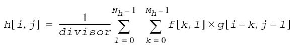

  其中，

  - Mh = Mf + Mg - 1

    - Mf 是第一个源图像矩阵 f 的行数
    - Mg 是第二个源图像矩阵 g 的行数

  - Nh = Nf + Ng - 1

    - Nf 是第一个源图像矩阵 f 的列数
    - Ng 是第二个源图像矩阵 g 的列数

  - 0 ≤ i < Mh, 0 ≤ j < Nh

  - 计算f、g所有可能的 i,j 位置，超出下标部分使用零填充计算：

    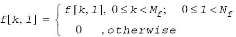
    
    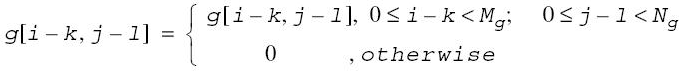

- 如果设置了 HMPP_ROI_VALID 标志，该函数执行由 pSrc1 和 pSrc2 参数指向的两个源图像之间的有效二维有限线性卷积。函数操作得到的目标图像 h[i, j] 通过以下公式计算：

  

  其中，
  
  - Mh = |Mf - Mg| + 1
    - Mf 是第一个源图像矩阵 f 的行数
    - Mg 是第二个源图像矩阵 g 的行数
  - Nh = |Nf - Ng| + 1
    - Nf 是第一个源图像矩阵 f 的列数
    - Ng 是第二个源图像矩阵 g 的列数
  - 0 ≤ i < Mh, 0 ≤ j < Nh
  
  这种情况假定 Mf ≥ Mg 且 Nf ≥ Ng。当 Mf < Mg 且 Nf < Ng 时，公式中的下标索引 g 必须替换为 f。对于源图像尺寸的任何其他组合，该函数不执行任何操作。

注意：接受 float 类型输入数据的函数风格使用相同的求和公式，但不对结果进行缩放（假定除数为 1）。

以下示例说明了函数的操作。对于大小为 3 x 5 的源图像 f、g，表示为：

```text
f = g = [1 1 1
   1 0 0
   1 1 1
   0 0 1
   1 1 1]
```

对于 HMPPI_ROI_FULL 情况，生成的卷积图像 h 大小为 5 x 9，包含以下数据：

```text
h = [1 2 3 2 1 
  2 2 2 0 0 
  3 4 6 4 2
  2 2 4 2 2
  3 6 11 6 3
  2 2 4 2 2
  2 4 6 4 2
  0 0 2 2 2
  1 2 3 2 1]
```

对于 HMPPI_ROI_VALID 情况，生成的卷积图像 h 大小为 1 x 1，包含以下数据：

```text
h = [11]
```

**参数**

| 参数名   | 描述                                               | 取值范围                                                     | 输入/输出 |
| -------- | -------------------------------------------------- | ------------------------------------------------------------ | --------- |
| pSrc1    | 指向源图像1感兴趣区域的指针。                      | 非空                                                         | 输入      |
| src1Step | 源图像1中连续行起点之间的距离（以字节为单位）。    | 非负整数                                                     | 输入      |
| src1Size | 源图像1的像素尺寸。                                | src1Size.width∈(0,INT_MAX]，src1Size.height∈(0,INT_MAX]      | 输入      |
| pSrc2    | 指向源图像2感兴趣区域的指针。                      | 非空                                                         | 输入      |
| src2Step | 源图像2中连续行起点之间的距离（以字节为单位）。    | 非负整数                                                     | 输入      |
| src2Size | 源图像2的像素尺寸。                                | src2Size.width∈(0,INT_MAX]，src2Size.height∈(0,INT_MAX]      | 输入      |
| pDst     | 指向目标图像感兴趣区域的指针。                     | 非空                                                         | 输出      |
| dstStep  | 目标图像中连续行起点之间的距离（以字节为单位）。   | 非负整数                                                     | 输入      |
| divisor  | 用于整除计算结果的整数值（仅整数数据操作时需要）。 | 非零                                                         | 输入      |
| algType  | 算法类型定义的位域掩码。                           | 由HmppAlgMode（HMPP_ALG_AUTO、HMPP_ALG_DEFAULT、HMPP_ALG_FFT）和HmppiROIShape（HMPPI_ROI_FULL、HMPPI_ROI_VALID）进行或运算组合的有效值 | 输入      |

**返回值**

- 成功：返回HMPP_STS_NO_ERR。
- 失败：返回错误码。

**错误码**

| 错误码                | 描述                                    |
| --------------------- | --------------------------------------- |
| HMPP_STS_NULL_PTR_ERR | 任何指定的指针为空。                    |
| HMPP_STS_SIZE_ERR     | src1Size或src2Size的字段为零或负值。    |
| HMPP_STS_STEP_ERR     | src1Step、src2Step或dstStep为零或负值。 |
| HMPP_STS_DIV_BY_ZERO  | divisor为零。                           |
| HMPP_STS_ALG_TYPE_ERR | algType值非法。                         |

**示例**

```c
#include <stdio.h>
#include "hmpp.h"

#define SRC1_WIDTH 5
#define SRC1_HEIGHT 5
#define SRC2_WIDTH 3
#define SRC2_HEIGHT 3

void ConvExample()
{
    HmppiSize src1Size = {5, 5};
    HmppiSize src2Size = {3, 3};
    uint8_t src1[5 * 5] = {
        1, 2, 3, 4, 5,
        6, 7, 8, 9, 10,
        11, 12, 13, 14, 15,
        16, 17, 18, 19, 20,
        21, 22, 23, 24, 25
    };
    uint8_t src2[3 * 3] = {
        1, 0, 1,
        0, 1, 0,
        1, 0, 1
    };
    uint8_t dst[7 * 7] = {0}; // 7 = 5 + 3 - 1;
    
 
    int divisor = 2;
    int algType = HMPP_ALG_DEFAULT | HMPPI_ROI_FULL;

    HmppResult res = HMPPI_Conv_8u_C1R(src1, 5 * sizeof(uint8_t), src1Size,
                                       src2, 3 * sizeof(uint8_t), src2Size,
                                       dst, 7 * sizeof(uint8_t), divisor, algType);
    printf("result = %d\n", res);
    printf("dst = \n");
    for (int i = 0; i < 7; i++) {
        for (int j = 0; j < 7; j++) {
            printf("%3d ", dst[7 * i + j]);
        }
        printf("\n");
    }
    
}

int main()
{
    ConvExample();
    return 0;
}
```

运行结果

```text
result = 0
dst = 
  0   1   2   3   4   2   2 
  3   4   8   9  11   7   5 
  6  10  17  20  22  14  10 
 11  17  30  32  35  21  15 
 16  25  42  45  47  29  20 
  8  19  28  29  31  22  10 
 10  11  22  23  24  12  12 
```

##### FilterLaplacianBorder

此函数将拉普拉斯滤波器应用于源图像src并将结果存储到目标图像dst。边框像素的值根据边框类型和边框值赋值参数获得。此过滤器的内核是参数指定的3x3或5x5大小的矩阵掩码。内核具有以下值，锚点位于中心单元格。

2    4     4     4    2

2    0    2                         4    0    -8     0    4

0   -8    0                         4   -8  -24   -8    4

2    0    2                         4    0    -8     0    4

2    4     4     4    2

此函数所需应用到的buffer空间，需要先使用FilterLaplacianInit来申请，并在主函数中使用该空间。

函数接口声明如下：

- **辅助空间buffer申请与释放函数：**

    HmppResult HMPPI\_FilterLaplacianInit\_8u16s\_C1R\(HmppiSize roiSize, HmppiMaskSize mask, uint8\_t \*\*buffer\);

    HmppResult HMPPI\_FilterLaplacianInit\_32f\_C1R\(HmppiSize roiSize, HmppiMaskSize mask, uint8\_t \*\*buffer\);

    HmppResult HMPPI\_FilterLaplacianRelease\(uint8\_t \*buffer\);

- **主函数：**

    HmppResult HMPPI\_FilterLaplacianBorder\_8u16s\_C1R\(const uint8\_t \*src, int32\_t srcStep, int16\_t \*dst, int32\_t dstStep, HmppiSize roiSize, HmppiMaskSize maskSize, HmppiBorderType borderType, uint8\_t borderValue, uint8\_t \*buffer\);

    HmppResult HMPPI\_FilterLaplacianBorder\_32f\_C1R\(const float \*src, int32\_t srcStep, float \*dst, int32\_t dstStep,HmppiSize roiSize, HmppiMaskSize maskSize, HmppiBorderType borderType, float borderValue, uint8\_t \*buffer\);

**参数**

|参数名|描述|取值范围|输入/输出|
|--|--|--|--|
|src|指向源向量的指针。|非空|输入|
|srcStep|源图像中连续行起点之间的距离（以字节为单位）。|(0,INT_MAX]|输入|
|dst|指向目的向量的指针。|非空|输出|
|dstStep|目标图像中连续行的起点之间的距离（以字节为单位）。|(0,INT_MAX]|输入|
|roiSize|源和目标图像感兴趣区域的大小（以像素为单位）。|roiSize.width∈(0,INT_MAX]，roiSize.height∈(0,INT_MAX]|输入|
|maskSize|预定义掩码。|HmppMskSize3x3或HmppMskSize5x5|输入|
|borderType|边界类型。|以下HmppiBorderType的枚举值之一：HMPPI_BORDER_CONST、HMPPI_BORDER_REPL、HMPPI_BORDER_MIRROR|输入|
|borderValue|指定常量边框像素的常量值，仅当borderType = HMPPI_BORDER_CONST时有意义。|数据类型范围内的值|输入|
|buffer|指向计算所需缓冲区的指针。在init中申请空间与初始化，在release中释放空间，在主函数中使用申请的空间。|非空|输入/输出|

**返回值**

- 成功：返回HMPP\_STS\_NO\_ERR。
- 失败：返回错误码。

**错误码**

|错误码|描述|
|--|--|
|HMPP_STS_NULL_PTR_ERR|src、dst这两个入参中存在空指针。|
|HMPP_STS_SIZE_ERR|roiSize.width、roiSize.height这两个入参中存在值小于等于0。|
|HMPP_STS_STEP_ERR|srcStep、dstStep小于等于0。|
|HMPP_STS_ROI_ERR|roiSize.width * 数据类型所占字节数 > 步长。|
|HMPP_STS_NOT_EVEN_STEP_ERR|srcStep、dstStep不能被src、dst所属数据类型的字节长度整除。|
|HMPP_STS_BAD_ARG_ERR|不支持的borderType类型值或者不支持的maskSize值。|

**示例**

```c
#define SRC_BUFFER_SIZE_T 28
#define DST_BUFFER_SIZE_T 16

int LaplacianBorderExample()
{
    HmppiSize roi = { 2, 4 };
    const float src[SRC_BUFFER_SIZE_T] = { 9.8375815e-16, 4.5484828e-16, 1.4972698e-14, -1.3397389e+25, 1.9061152e+27, -8.8007769e+17, -217025.86, -6.2768196e+14, 4.4335606e+33, 1.0258707e-13, -9.3150633e-11, -5192.7163, 2.536292e+25, 6.0832354e+15, 8.5712402e+29, -0.15451884, -0.2848247, -2.1714717e+10, 2.7212473e+17, -1.3591454e-22, 7.6473188e+21, -2.2729285e-30, 1129877.1, -1.0089557e-05, -1.1054221e+21, -3.8945858e-19, -6.8345717e-34, 60685416};
    float dst[DST_BUFFER_SIZE_T] = {0};

    int32_t srcStep = 4 * sizeof(float);
    int32_t dstStep = 4 * sizeof(float);
    uint8_t *buffer = NULL;
    HmppResult result = HMPPI_FilterLaplacianInit_32f_C1R(roi, HmppMskSize3x3, &buffer);

    if (result == HMPP_STS_NO_ERR) {
        result = HMPPI_FilterLaplacianBorder_32f_C1R(src, srcStep, dst, dstStep, roi, HmppMskSize3x3, HMPPI_BORDER_MIRROR, 0.0f, buffer);
    }
    if (result != HMPP_STS_NO_ERR) {
        printf("result error: %d\n", result);
    }
    printf("dst= ");
    for(int32_t i = 0; i < DST_BUFFER_SIZE_T; i++){
        printf("%f ",dst[i]);
    }
    printf("\n");
    HMPPI_FilterLaplacianRelease(buffer);
    buffer = NULL;
    return 0;
}
```

运行结果：

```text
result = 0
dst = -7.0406216e+18 1.5248922e+28 -3.9418209e+28 7.7666443e+28 -1.5248922e+28 1.7734242e+34 5.1225988e+27 -2.04904e+27 -3.5468485e+34 7.7259126e+27 -2.2689171e+31 2.2694294e+31 -2.0290336e+26 3.5468485e+34 0 0
```

##### FilterBorder

将均值滤波器应用于源图像并将结果存储到目标图像。这里处理的图像是三维图像。边框像素的值根据边框类型和边框值赋值参数获得。

本函数使用的滤波核是由HMPPI\_CreateKernel3D\_32f来进行初始化，同时，此函数所需应用到的pSpec空间大小计算需要先使用HMPPI\_FilterBorderGetSize来申请，并在HMPPI\_FilterBorderInit\_32f中进行初始化包括创建好的滤波核。

函数接口声明如下：

- **辅助函数：**

    HmppResult HMPPI\_CreateKernel3D\_32f\(float\* kernel, HmpprVolume kernelSize\);

    HmppResult HMPPI\_FilterBorderGetSize\(HmpprVolume kernelVolume, HmpprVolume dstRoiVolume, int numChannels, int\* pSpecSize\);

    HmppResult HMPPI\_FilterBorderInit\_32f\(const float\* pKernel, HmpprVolume kernelVolume, int numChannels, HmpprFilterBorderSpec\* pSpec\);

- **主函数：**

    HmppResult HMPPI\_FilterBorder\_32f\_C1V\(const float\* pSrc, int srcPlaneStep, int srcStep, float\* pDst, int dstPlaneStep, int dstStep, HmpprVolume dstRoiVolume, HmpprBorderType borderType, const float borderValue\[1\], const HmpprFilterBorderSpec\* pSpec\);

- **释放函数：**

    HmppResult HMPPI\_FilterBorderRelease\_32f\(HmpprFilterBorderSpec \*pSpec\);

**参数**

|参数名|描述|取值范围|输入/输出|
|--|--|--|--|
|pSrc|指向源体积起点的指针。|非空|输入|
|srcStep|源体积中每个平面连续行起始点之间的距离（以字节为单位）。|非负整数|输入|
|srcPlaneStep|源连续体积平面之间的距离（以字节为单位）。|非负整数|输入|
|pDst|指向目标体积原点的指针。|非空|输入/输出|
|dstStep|目标体积中每个平面连续行起始点之间的距离（以字节为单位）。|非负整数|输入|
|dstPlaneStep|目标连续体积平面之间的距离（以字节为单位）。|非负整数|输入|
|kernel|指向滤波核值的指针。|非空|输入/输出|
|kernelSize|滤波核大小。|正奇数|输入|
|kernelVolume|滤波核体积。|正奇数|输入|
|numChannels|图像通道数。|1|输入|
|pSpecSize|pSpec分配空间的大小。|非空|输入/输出|
|dstRoiVolume|目标体积的感兴趣体积。|正整数|输入|
|borderType|边界类型。|以下HmppiBorderType的枚举值之一：HMPPI_BORDER_CONST、HMPPI_BORDER_REPL、HMPPR_BORDER_IN_MEM|输入|
|borderValue|指定常量边框像素的常量值，仅当borderType = HMPPI_BORDER_CONST时有意义。|数据类型范围内的值|输入|
|pSpec|特殊结构体的指针。|非空|输入/输出|

**返回值**

- 成功：返回HMPP\_STS\_NO\_ERR。
- 失败：返回错误码。

**错误码**

|错误码|描述|
|--|--|
|HMPP_STS_NULL_PTR_ERR|入参中存在空指针。|
|HMPP_STS_SIZE_ERR|dstRoiVolume、kernelVolume入参中存在值小于等于0。|
|HMPP_STS_STEP_ERR|srcStep、srcPlaneStep、dstStep、dstPlaneStep小于0。|
|HMPP_STS_CHANNEL_ERR|通道数不为1。|
|HMPP_STS_OVERFLOW|kernelVolume的width、height、depth乘积的值溢出。|

**示例**

```c
void FilterBorderExample()
{
    HmpprVolume kernelVolume = {3, 3, 3};
    HmpprVolume dstRoiVolume = {4, 4, 4};
    int pSpecSize;
    HmppResult result;
    HmpprFilterBorderSpec* pSpec;
    float* pKernel;
    float pSrc[] = {38.014484, 82.609879, 82.758270, 81.367149, 89.961128, 86.196541, 2.654759, 8.122633, 20.915607, 39.117149, 48.680553, 74.702560, 89.141975, 0.049839, 96.961235, 40.884659, 0.073048, 82.266838, 43.245163, 39.711945, 92.387321, 63.789082, 39.633656, 33.714893, 68.096214, 25.101330, 62.661972, 17.430357, 60.464512, 33.217445, 37.544556, 51.155441, 67.719810, 20.685936, 32.905922, 57.153358, 6.772291, 86.404984, 17.585430, 27.213909, 25.116919, 17.515392, 53.564182, 66.432114, 18.855532, 49.816486, 59.853039, 70.812675, 32.314438, 2.026977, 9.393250, 76.235771, 65.080223, 0.228351, 62.949459, 85.970299, 26.796694, 24.186850, 55.365528, 86.225479, 58.701576, 92.171112, 37.857521, 25.761415};
    float* pDst;
    HmpprBorderType borderType = HMPPR_BORDER_REPL;
    int srcStep = dstRoiVolume.width * sizeof(float);
    int srcPlaneStep = dstRoiVolume.width * dstRoiVolume.height * sizeof(float);
    int dstStep = srcStep;
    int dstPlaneStep = srcPlaneStep;
    int kernelTotalSize = kernelVolume.width * kernelVolume.height * kernelVolume.depth;
    pKernel = HMPPS_Malloc_32f(kernelTotalSize);
    int dataTotalSize = dstRoiVolume.width * dstRoiVolume.height * dstRoiVolume.depth;
    pDst = HMPPS_Malloc_32f(dataTotalSize);
 
    result = HMPPI_FilterBorderGetSize(kernelVolume, dstRoiVolume, 1, &pSpecSize);
    printf("result = %d\n", result);
    if (result != HMPP_STS_NO_ERR) {
        return;
    }
    
    pSpec = (HmpprFilterBorderSpec*)malloc(pSpecSize);
    result = HMPPI_CreateKernel3D_32f(pKernel, kernelVolume);
    printf("result = %d\n", result);
    
    if (result != HMPP_STS_NO_ERR) {
        return;
    }
    result = HMPPI_FilterBorderInit_32f(pKernel, kernelVolume, 1, pSpec);
    printf("result = %d\n", result);
    
    if (result != HMPP_STS_NO_ERR) {
        return;
    }
    float borderValue = pSrc[0];
    result = HMPPI_FilterBorder_32f_C1V(pSrc, srcPlaneStep, srcStep,
                                       pDst, dstPlaneStep, dstStep,
                                       dstRoiVolume, borderType,
                                       &borderValue, pSpec);
    printf("result = %d\n", result);
    
    if (result != HMPP_STS_NO_ERR) {
        return;
    }
    for (int i = 0; i < dataTotalSize; i++){
        printf("%f ", pDst[i]);
    }
    HMPPI_FilterBorderRelease_32f(pSpec);
}
```

运行结果：

```text
result = 0
result = 0
result = 0
result = 0
58.525280 59.930946 61.054619 50.821186 55.691948 54.039684 52.591640 46.378212 59.807632 52.972359 42.925503 42.069408 49.808098 51.124119 45.393032 55.123226 52.184692 51.331261 52.249077 45.508347 48.955585 48.016075 47.897266 44.273628 49.801155 47.854038 44.845074 44.447330 42.592846 46.391796 47.622082 56.376503 40.344097 37.633095 42.397793 47.313328 40.404427 40.143230 44.059200 50.277069 45.813835 45.989544 47.561592 50.238838 44.789623 46.495136 49.068993 50.859116 34.800060 29.068176 37.096851 54.951031 32.350891 32.776085 43.875008 61.288776 40.396778 43.783665 51.504829 57.929409 45.802296 48.920952 53.821930 51.945923 
```

##### FilterMedianBorder

将中值滤波器应用于源图像src并将结果存储到目标图像dst。边框像素的值根据边框类型和边框值赋值参数获得。此过滤器的内核大小由参数指定。

函数声明如下：

HmppResult HMPPI\_FilterMedianBorder\_16s\_C1R\(const int16\_t\* pSrc, int srcStep, int16\_t\* pDst, int dstStep, HmppiSize dstRoiSize, HmppiSize maskSize, HmppiBorderType borderType, int16\_t borderValue\);

**参数**

|参数名|描述|取值范围|输入/输出|
|--|--|--|--|
|pSrc|指向源向量的指针。|非空|输入|
|srcStep|源图像中连续行起点之间的距离（以字节为单位）。|(0, INT_MAX]|输入|
|pDst|指向目的向量的指针。|非空|输出|
|dstStep|目标图像中连续行的起点之间的距离（以字节为单位）。|(0, INT_MAX]|输入|
|roiSize|源和目标图像感兴趣区域的大小（以像素为单位）。|roiSize.width∈(0, INT_MAX]，roiSize.height∈(0, INT_MAX]|输入|
|maskSize|掩码大小。|maskSize.width >=3 且为奇数, maskSize.height >= 3且为奇数|输入|
|borderType|边界类型。|以下HmppiBorderType的枚举值之一：HMPPI_BORDER_CONST、HMPPI_BORDER_REPL、HMPPI_BORDER_MIRROR|输入|
|borderValue|指定常量边框像素的常量值，仅当borderType = HMPPI_BORDER_CONST时有意义。|数据类型范围内的值|输入|

**返回值**

- 成功：返回HMPP\_STS\_NO\_ERR。
- 失败：返回错误码。

**错误码**

|错误码|描述|
|--|--|
|HMPP_STS_NULL_PTR_ERR|pSrc、pDst的入参中存在空指针。|
|HMPP_STS_SIZE_ERR|roiSize.width、roiSize.height这两个入参中存在值小于等于0。|
|HMPP_STS_STEP_ERR|srcStep、dstStep小于等于0。|
|HMPP_STS_ROI_ERR|roiSize.width * 数据类型所占字节数 > 步长。|
|HMPP_STS_NOT_EVEN_STEP_ERR|srcStep、dstStep不能被src、dst所属数据类型的字节长度整除。|
|HMPP_STS_BAD_ARG_ERR|不支持的borderType类型值或者不支持的maskSize值。|

**示例**

```c
#include <stdio.h>
#include "hmppi.h"
#include "hmpp_type.h"
#define SRC_BUFFER_SIZE_T 28
#define DST_BUFFER_SIZE_T 16
int MedianBorderExample()
{
    HmppiSize roi = { 4, 4 };
    const int16_t src[SRC_BUFFER_SIZE_T] = { 13, 17, 5, -1, 9, -8, 44, -23, -5, 1, 7, 54, 75, -32, -9, -10, 11, -5, 15, -33, 7, -45, 112, 99, -45, 28, 64, 60};
    int16_t dst[DST_BUFFER_SIZE_T] = {0};
    int32_t srcStep = 4 * sizeof(int16_t);
    int32_t dstStep = 4 * sizeof(int16_t);
    HmppiSize mskSize = {3, 3}; 
    HmppResult result = HMPPI_FilterMedianBorder_16s_C1R(src, srcStep, dst, dstStep, roi, mskSize, HMPPI_BORDER_CONST, -1);
    if (result != HMPP_STS_NO_ERR) {
        printf("result error: %d\n", result);
    } else {
        printf("result: %d\n", (int)result);
    }
    printf("dst= ");
    for(int32_t i = 0; i < DST_BUFFER_SIZE_T; i++){
        printf("%d ",dst[i]);
    }
    printf("\n");
    return 0;
}
int main() {
    MedianBorderExample();
    return 0;
}
```

运行结果：

```text
result: 0
dst= -1 5 -1 -1 -1 7 5 -1 -1 1 -8 -1 -1 -1 -1 -1
```

##### FilterMinBorder

对8位单通道图像应用最小值滤波，支持边界处理。

**函数接口声明如下：**

HmppResult HMPPI_FilterMinBorder_8u_C1R(const uint8_t *pSrc, int srcStep, uint8_t*pDst, int dstStep, HmppiSize dstRoiSize, HmppiSize maskSize, HmppiBorderType borderType, uint8_t borderValue);

滤波核中心位置定义如下：

    x = (markSize.width - 1) / 2

    y = (markSize.height - 1) / 2

**参数**

| 参数名      | 描述                                             | 取值范围                                                     | 输入/输出 |
| ----------- | ------------------------------------------------ | ------------------------------------------------------------ | --------- |
| pSrc        | 指向源图像感兴趣区域的指针。                     | 非空                                                         | 输入      |
| srcStep     | 源图像中连续行起点之间的距离（以字节为单位）。   | 非负整数                                                     | 输入      |
| pDst        | 指向目标图像感兴趣区域的指针。                   | 非空                                                         | 输出      |
| dstStep     | 目标图像中连续行起点之间的距离（以字节为单位）。 | 非负整数                                                     | 输入      |
| dstRoiSize  | 目标图像ROI的大小（以像素为单位）。              | dstRoiSize.width∈(0,INT_MAX]，dstRoiSize.height∈(0,INT_MAX]  | 输入      |
| maskSize    | 滤波核的大小。                                   | maskSize.width∈(0,INT_MAX],  maskSize.height∈(0,INT_MAX]，且为正奇数 | 输入      |
| borderType  | 边界填充类型。                                   | 单一边界类型：HMPPI_BORDER_CONST、HMPPI_BORDER_REPL、HMPPI_BORDER_IN_MEM；<br />混合边界类型：HMPPI_BORDER_REPL、HMPPI_BORDER_CONST、HMPPI_BORDER_MIRROR和HMPPI_BORDER_IN_MEM_TOP、HMPPI_BORDER_IN_MEM_BOTTOM、HMPPI_BORDER_IN_MEM_LEFT、HMPPI_BORDER_IN_MEM_RIGHT进行或运算后的结果。 | 输入      |
| borderValue | 当borderType为HMPPI_BORDER_CONST时使用的常量值。 | 0-255                                                        | 输入      |

**返回值**

- 成功：返回HMPP_STS_NO_ERR。
- 失败：返回错误码。

**错误码**

| 错误码                | 描述                                                         |
| --------------------- | ------------------------------------------------------------ |
| HMPP_STS_NULL_PTR_ERR | pSrc、pDst存在空指针。                                       |
| HMPP_STS_SIZE_ERR     | dstRoiSize.width、dstRoiSize.height、srcStep、dstStep小于等于0。 |
| HMPP_STS_BORDER_ERR   | maskSize.width、markSize.height小于等于0或不为正奇数；borderType非法。 |

**示例**

```c
#include "hmpp.h"
#include <stdio.h>

void FilterMinExample()
{
    uint8_t src[25] = {3,  12, 99, 108, 22,
                       6,  70,  32,  56, 77,
                       101, 23, 211, 85, 15,
                       1,  171, 18, 190, 165,
                       201, 12, 23, 42,  5};
    uint8_t dst[9] = {0};
    uint8_t* srcStart = &src[6];
    HmppiSize dstRoiSize = {3, 3};
    HmppiSize maskSize = {3, 3};
    HmppiBorderType borderType = HMPPI_BORDER_REPL | HMPPI_BORDER_IN_MEM_BOTTOM | HMPPI_BORDER_IN_MEM_RIGHT; 
    uint8_t borderValue = 0;

    HmppResult res = HMPPI_FilterMinBorder_8u_C1R(srcStart, 5, dst, 3, dstRoiSize, maskSize, borderType, borderValue);

    printf("result = %d\n", res);
    printf("dst = \n");

    for (int i = 0; i < 3; ++i) {
        for (int j = 0; j < 3; ++j) {
            printf("%3u ", dst[i * 3 + j]);
        }
        printf("\n");
    }
}

int main()
{
    FilterMinExample();
    return 0;
}
```

运行结果：

```text
result = 0
dst = 
 23  23  15 
 18  18  15 
 12  12   5
```

##### FilterSobelBorder

将Sobel滤波器应用于源图像src并将结果存储到目标图像dst。边框像素的值根据边框类型和边框值赋值参数获得。此过滤器的内核是参数指定的3x3或5x5大小的矩阵掩码。内核具有以下值，锚点位于中心单元格。

1 2 1

0 0 0

-1 -2 -1

1 4 6 4 1

2 8 12 8 2

0 0 0 0 0

-2 -8 -12 -8 -2

-1 -4 -6 -4 -1

函数声明如下：

HmppResult HMPPI\_FilterSobelHorizBorder\_32f\_C1R\(const float\* pSrc, int srcStep, float\* pDst, int dstStep, HmppiSize roi, HmppiMaskSize maskSize, HmppiBorderType borderType, float borderValue\);

HmppResult HMPPI\_FilterSobelNegVertBorder\_32f\_C1R\(const float\* pSrc, int srcStep, float\* pDst, int dstStep, HmppiSize roi, HmppiMaskSize maskSize, HmppiBorderType borderType, float borderValue\);

**参数**

|参数名|描述|取值范围|输入/输出|
|--|--|--|--|
|pSrc|指向源向量的指针。|非空|输入|
|srcStep|源图像中连续行起点之间的距离（以字节为单位）。|(0, INT_MAX]|输入|
|pDst|指向目的向量的指针。|非空|输出|
|dstStep|目标图像中连续行的起点之间的距离（以字节为单位）。|(0, INT_MAX]|输入|
|roiSize|源和目标图像感兴趣区域的大小（以像素为单位）。|roiSize.width∈(0, INT_MAX]，roiSize.height∈(0, INT_MAX]|输入|
|maskSize|预定义掩码。|HmppMskSize3x3或HmppMskSize5x5|输入|
|borderType|边界类型。|以下HmppiBorderType的枚举值之一：HMPPI_BORDER_CONST、HMPPI_BORDER_REPL、HMPPI_BORDER_MIRROR|输入|
|borderValue|指定常量边框像素的常量值，仅当borderType = HMPPI_BORDER_CONST时有意义。|数据类型范围内的值|输入|

**返回值**

- 成功：返回HMPP\_STS\_NO\_ERR。
- 失败：返回错误码。

**错误码**

|错误码|描述|
|--|--|
|HMPP_STS_NULL_PTR_ERR|pSrc、pDst的入参中存在空指针。|
|HMPP_STS_SIZE_ERR|roiSize.width、roiSize.height的入参中存在值小于等于0。|
|HMPP_STS_STEP_ERR|srcStep、dstStep小于等于0。|
|HMPP_STS_ROI_ERR|roiSize.width * 数据类型所占字节数 > 步长。|
|HMPP_STS_NOT_EVEN_STEP_ERR|srcStep、dstStep不能被src、dst所属数据类型的字节长度整除。|
|HMPP_STS_BAD_ARG_ERR|不支持的borderType类型值或者不支持的maskSize值。|

**示例**

```c
#include <stdio.h>
#include "hmppi.h"
#include "hmpp_type.h"
#define SRC_BUFFER_SIZE_T 28
#define DST_BUFFER_SIZE_T 16
int SobelBorderExample()
{
    HmppiSize roi = { 2, 4 };
    const float src[SRC_BUFFER_SIZE_T] = { 9.8375815e-16, 4.5484828e-16, 1.4972698e-14, -1.3397389e+25, 1.9061152e+27, -8.8007769e+17, -217025.86, -6.2768196e+14, 4.4335606e+33, 1.0258707e-13, -9.3150633e-11, -5192.7163, 2.536292e+25, 6.0832354e+15, 8.5712402e+29, -0.15451884, -0.2848247, -2.1714717e+10, 2.7212473e+17, -1.3591454e-22, 7.6473188e+21, -2.2729285e-30, 1129877.1, -1.0089557e-05, -1.1054221e+21, -3.8945858e-19, -6.8345717e-34, 60685416};
    float dst[DST_BUFFER_SIZE_T] = {0};
    int32_t srcStep = 4 * sizeof(int16_t);
    int32_t dstStep = 4 * sizeof(int16_t);
    HmppiMaskSize mskSize = HmppMskSize3x3; 
    HmppResult result = HMPPI_FilterSobelHorizBorder_32f_C1R(src, srcStep, dst, dstStep, roi, mskSize, HMPPI_BORDER_CONST, 0);
    if (result != HMPP_STS_NO_ERR) {
        printf("result error: %d\n", result);
    } else {
        printf("result: %d\n", (int)result);
    }
    printf("dst= ");
    for(int32_t i = 0; i < DST_BUFFER_SIZE_T; i++){
        printf("%e ",dst[i]);
    }
    printf("\n");
    return 0;
}
int main() {
    SobelBorderExample();
    return 0;
}
```

运行结果：

```text
result: 0
dst= -1.339739e+25 -2.679478e+25 3.812230e+27 1.906115e+27 1.339739e+25 2.679478e+25 -3.812230e+27 -1.906115e+27 0.000000e+00 0.000000e+00 0.000000e+00 0.000000e+00 0.000000e+00 0.000000e+00 0.000000e+00 0.000000e+00
```

#### 图像形态学功能

##### Dilate3x3

**函数说明：**

使用3x3蒙版进行图像膨胀，是DilateBorder的一个特例，其默认蒙版元素全为非0有效。

膨胀就是求局部最大值的操作，运算符是“”，其定义如下：


该公式表示用蒙版B来对图像A进行膨胀处理，其中B是一个3x3蒙版。通过蒙版B与图像A进行卷积计算，扫描图像中的每一个像素点，计算B覆盖区域的像素点最大值，并用这个最大值替换参考点指定的像素值实现膨胀。

以下为接口输入输出图示：


函数接口声明如下：

HmppResult HMPPI\_Dilate3x3\_64f\_C1R\(const double \*src, int32\_t srcStep, double \*dst, int32\_t dstStep, HmppiSize roiSize\);

**参数**

|参数名|描述|取值范围|输入/输出|
|--|--|--|--|
|src|指向源图像的指针。|非空|输入|
|srcStep|源图像中连续行的起点之间的距离（以字节为单位）。|非负整数，且为src数据类型的字节整倍数|输入|
|dst|指向目的向量的指针。|非空|输出|
|dstStep|目标图像中连续行的起点之间的距离（以字节为单位）。|非负整数，且为dst数据类型的字节整倍数|输入|
|roiSize|源和目标图像感兴趣区域的大小（以像素为单位）。|roiSize.width∈(0,INT_MAX]，roiSize.height∈(0,INT_MAX]|输入|

**返回值**

- 成功：返回HMPP\_STS\_NO\_ERR。
- 失败：返回错误码。

**错误码**

|错误码|描述|
|--|--|
|HMPP_STS_NULL_PTR_ERR|任何指定的指针为空。|
|HMPP_STS_SIZE_ERR|roiSize的字段为零或负值。|
|HMPP_STS_STEP_ERR|srcStep或者dstStep存在零或负值。|
|HMPP_STS_NOT_EVEN_STEP_ERR|srcStep或者dstStep不为其图像所属数据类型的字节长度的整倍数。|
|HMPP_STS_ROI_ERR|源或者目标图像的宽和高比roiSize的字段+2的结果小。|

> **说明：** 
>源或目标图像的宽和高需比roiSize的宽和高分别大2像素，否则将返回HMPP\_STS\_ROI\_ERR。

**示例**

```c
#define SRC_BUFFER_SIZE_T 96
#define DST_BUFFER_SIZE_T 64
void Dilate3x3Example()
{
    HmppiSize roi = { 4, 4 };
    const double src[SRC_BUFFER_SIZE_T] = {
        11, 22, 33, 44, 55, 66, 77, 88, 22, 88, 77, 66,
        11, 22, 33, 44, 55, 66, 77, 88, 22, 88, 77, 66,
        11, 22, 33, 44, 55, 66, 77, 88, 22, 88, 77, 66,
        11, 22, 33, 44, 55, 66, 77, 88, 22, 88, 77, 66,
        11, 22, 33, 44, 55, 66, 77, 88, 22, 88, 77, 66,
        11, 22, 33, 44, 55, 66, 77, 88, 22, 88, 77, 66,
        11, 22, 33, 44, 55, 66, 77, 88, 22, 88, 77, 66,
        11, 22, 33, 44, 55, 66, 77, 88, 22, 88, 77, 66
    };

    double dst[DST_BUFFER_SIZE_T] = { 0 };

    const int32_t srcWidth = 12;
    const int32_t dstWidth = 8;
    int32_t srcStep = srcWidth * sizeof(double);
    int32_t dstStep = dstWidth * sizeof(double);
    HmppResult result = HMPPI_Dilate3x3_64f_C1R(src, srcStep, dst, dstStep, roi);

    printf("result = %d \ndst = ", result);
    if (result != HMPP_STS_NO_ERR) {
        printf("result error: %d\n", result);
    }

    for (int32_t i = 0; i < DST_BUFFER_SIZE_T; ++i) {
        if (i % dstWidth == 0) {
            printf("\n");
        }
        printf("%.2lf ", dst[i]);
    }
    printf("\n");
}


int main(void)
{
    Dilate3x3Example();
    return 0;
}
```

运行结果：

```text
result = 0
dst =
66.00 33.00 44.00 55.00 0.00 0.00 0.00 0.00
66.00 33.00 44.00 55.00 0.00 0.00 0.00 0.00
66.00 33.00 44.00 55.00 0.00 0.00 0.00 0.00
66.00 33.00 44.00 55.00 0.00 0.00 0.00 0.00
0.00 0.00 0.00 0.00 0.00 0.00 0.00 0.00
0.00 0.00 0.00 0.00 0.00 0.00 0.00 0.00
0.00 0.00 0.00 0.00 0.00 0.00 0.00 0.00
0.00 0.00 0.00 0.00 0.00 0.00 0.00 0.00
```

##### DilateBorder

使用蒙版进行图像膨胀，原理同Dilate3x3。

其中最大值的有效计算仅针对蒙版图像中的非0元素。

以下为接口输入输出图示：

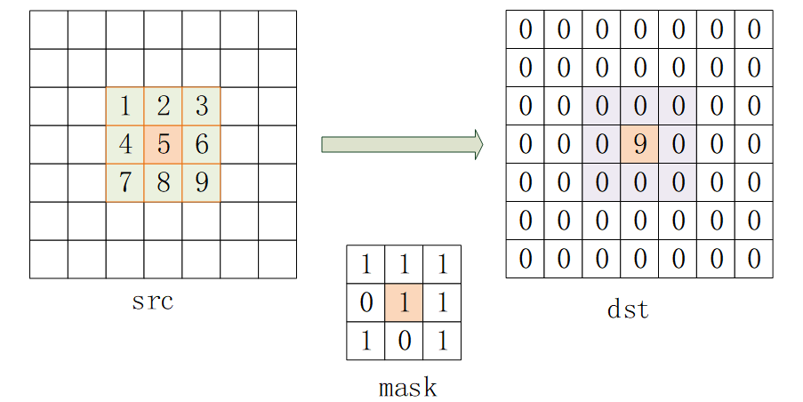

此类函数支持的边界方式说明可参照[枚举类型](#枚举类型)中HmppiBorderType的说明。

同时支持混合填充方式：如HMPP\_BORDERREPL**|**HMPP\_BORDERINMEM\_TOP，表示上边界以HMPP\_BORDERINMEM方式填充，其余边界以HMPP\_BORDERREPL方式填充。

该函数调用流程如下：

1. 调用对应类型Init初始化HmppiMorphPolicy结构体，否则主函数无法调用成功。
2. 调用主函数。
3. 主函数执行后，调用Release释放HmppiMorphPolicy函数所包含内存，否则将产生内存泄漏。

函数接口声明如下：

- **初始化操作：**

    HmppResult HMPPI\_MorphInit\(HmppiSize roiSize, const uint8\_t \*mask, HmppiSize maskSize, HmppDataType dataType, int32\_t numChannels, HmppiMorphPolicy \*\*policy\);

    HmppResult HMPPI\_DilateInit\(HmppiSize roiSize, const uint8\_t \*mask, HmppiSize maskSize, HmppDataType dataType, int32\_t numChannels, HmppiMorphPolicy \*\*policy\);

    HmppResult HMPPI\_MorphologyBorderInit\_1u\_C1R\(HmppiSize roiSize, const uint8\_t \*mask, HmppiSize maskSize, HmppiMorphPolicy \*\*policy\);

    HmppResult HMPPI\_MorphologyBorderInit\_8u\_C1R\(HmppiSize roiSize, const uint8\_t \*mask, HmppiSize maskSize, HmppiMorphPolicy \*\*policy\);

    HmppResult HMPPI\_MorphologyBorderInit\_16u\_C1R\(HmppiSize roiSize, const uint8\_t \*mask, HmppiSize maskSize, HmppiMorphPolicy \*\*policy\);

    HmppResult HMPPI\_MorphologyBorderInit\_16s\_C1R\(HmppiSize roiSize, const uint8\_t \*mask, HmppiSize maskSize, HmppiMorphPolicy \*\*policy\);

    HmppResult HMPPI\_MorphologyBorderInit\_32f\_C1R\(HmppiSize roiSize, const uint8\_t \*mask, HmppiSize maskSize, HmppiMorphPolicy \*\*policy\);

    HmppResult HMPPI\_MorphologyBorderInit\_8u\_C3R\(HmppiSize roiSize, const uint8\_t \*mask, HmppiSize maskSize, HmppiMorphPolicy \*\*policy\);

    HmppResult HMPPI\_MorphologyBorderInit\_32f\_C3R\(HmppiSize roiSize, const uint8\_t \*mask, HmppiSize maskSize, HmppiMorphPolicy \*\*policy\);

    HmppResult HMPPI\_MorphologyBorderInit\_8u\_C4R\(HmppiSize roiSize, const uint8\_t \*mask, HmppiSize maskSize, HmppiMorphPolicy \*\*policy\);

    HmppResult HMPPI\_MorphologyBorderInit\_32f\_C4R\(HmppiSize roiSize, const uint8\_t \*mask, HmppiSize maskSize, HmppiMorphPolicy \*\*policy\);

- **主函数操作：**

    HmppResult HMPPI\_DilateBorder\_1u\_C1R\(const uint8\_t \*src, int32\_t srcStep, int32\_t srcBitOffset, uint8\_t \*dst, int32\_t dstStep, int32\_t dstBitOffset, HmppiSize roiSize, HmppiBorderType borderType, uint8\_t borderValue, const HmppiMorphPolicy \*policy\);

    HmppResult HMPPI\_DilateBorder\_8u\_C1R\(const uint8\_t \*src, int32\_t srcStep, uint8\_t \*dst, int32\_t dstStep, HmppiSize roiSize, HmppiBorderType borderType, uint8\_t borderValue, const HmppiMorphPolicy \*policy\);

    HmppResult HMPPI\_DilateBorder\_16u\_C1R\(const uint16\_t \*src, int32\_t srcStep, uint16\_t \*dst, int32\_t dstStep, HmppiSize roiSize, HmppiBorderType borderType, uint16\_t borderValue, const HmppiMorphPolicy \*policy\);

    HmppResult HMPPI\_DilateBorder\_16s\_C1R\(const int16\_t \*src, int32\_t srcStep, int16\_t \*dst, int32\_t dstStep, HmppiSize roiSize, HmppiBorderType borderType, int16\_t borderValue, const HmppiMorphPolicy \*policy\);

    HmppResult HMPPI\_DilateBorder\_32f\_C1R\(const float \*src, int32\_t srcStep, float \*dst, int32\_t dstStep, HmppiSize roiSize, HmppiBorderType borderType, float borderValue, const HmppiMorphPolicy \*policy\);

    HmppResult HMPPI\_DilateBorder\_8u\_C3R\(const uint8\_t\* src, int32\_t srcStep, uint8\_t\* dst, int32\_t dstStep, HmppiSize roiSize, HmppiBorderType borderType, const uint8\_t borderValue\[3\], const HmppiMorphPolicy\* policy\);

    HmppResult HMPPI\_DilateBorder\_32f\_C3R\(const float \*src, int32\_t srcStep, float \*dst, int32\_t dstStep, HmppiSize roiSize, HmppiBorderType borderType, const float borderValue\[3\], const HmppiMorphPolicy \*policy\);

    HmppResult HMPPI\_DilateBorder\_8u\_C4R\(const uint8\_t\* src, int32\_t srcStep, uint8\_t\* dst, int32\_t dstStep, HmppiSize roiSize, HmppiBorderType borderType, const uint8\_t borderValue\[4\], const HmppiMorphPolicy\* policy\);

    HmppResult HMPPI\_DilateBorder\_32f\_C4R\(const float \*src, int32\_t srcStep, float \*dst, int32\_t dstStep, HmppiSize roiSize, HmppiBorderType borderType, const float borderValue\[4\], const HmppiMorphPolicy \*policy\);

- **释放内存操作**：

    HmppResult HMPPI\_MorphRelease\(HmppiMorphPolicy \*policy\);

    HmppResult HMPPI\_DilateRelease\(HmppiMorphPolicy \*policy\);

    HmppResult HMPPI\_MorphologyBorderRelease\_1u\_C1R\(HmppiMorphPolicy \*policy\);

    HmppResult HMPPI\_MorphologyBorderRelease\_8u\_C1R\(HmppiMorphPolicy \*policy\);

    HmppResult HMPPI\_MorphologyBorderRelease\_16u\_C1R\(HmppiMorphPolicy \*policy\);

    HmppResult HMPPI\_MorphologyBorderRelease\_16s\_C1R\(HmppiMorphPolicy \*policy\);

    HmppResult HMPPI\_MorphologyBorderRelease\_32f\_C1R\(HmppiMorphPolicy \*policy\);

    HmppResult HMPPI\_MorphologyBorderRelease\_8u\_C3R\(HmppiMorphPolicy \*policy\);

    HmppResult HMPPI\_MorphologyBorderRelease\_32f\_C3R\(HmppiMorphPolicy \*policy\);

    HmppResult HMPPI\_MorphologyBorderRelease\_8u\_C4R\(HmppiMorphPolicy \*policy\);

    HmppResult HMPPI\_MorphologyBorderRelease\_32f\_C4R\(HmppiMorphPolicy \*policy\);

**参数**

|参数名|描述|取值范围|输入/输出|
|--|--|--|--|
|mask|指向蒙版的指针。|非空|输入|
|maskSize|蒙版图像的大小（以像素为单位）。|maskSize.width∈(0,INT_MAX]，maskSize.height∈(0,INT_MAX]|输入|
|dataType|源图像的数据类型（目标图像同源图像）。|枚举，数据类型。支持HMPP8U、HMPP16U、HMPP16S和HMPP32F。|输入|
|numChannels|源图像的通道数（目标图像同源图像）。|仅支持1、3和4通道|输入|
|src|指向源图像的指针。|非空|输入|
|srcStep|源图像中连续行的起点之间的距离（以字节为单位）。|非负整数，且为src数据类型的字节整倍数|输入|
|srcBitOffset|从源图像的第一个字节开始的偏移量（以bit为单位）。|(0, INT_MAX]，且与roiSize.width的和需大于等于srcStep * 8|输入|
|dst|指向目的向量的指针。|非空|输出|
|dstStep|目标图像中连续行的起点之间的距离（以字节为单位）。|非负整数，且为dst数据类型的字节整倍数|输入|
|dstBitOffset|从目标图像的第一个字节开始的偏移量（以bit为单位）。|(0, INT_MAX]，且与roiSize.width的和需大于等于dstStep * 8|输入|
|roiSize|源和目标图像感兴趣区域的大小（以像素为单位）。|roiSize.width∈(0,INT_MAX]，roiSize.height∈(0,INT_MAX]|输入|
|borderType|边界填充类型。|枚举，边界填充类型。HMPP_BORDER_DEFAULT：边框设置为HMPP_BORDER_CONST，其borderValue= MIN_VALUE。HMPP_BORDER_REPL：边框从边缘像素复制而来。HMPP_BORDER_IN_MEM：边框是从内存中的源图像像素获得的。HMPP_BORDER_CONST：所有边框像素的值都设置为常数。HMPP_BORDER_MIRROR：边框像素从源图像边界像素镜像而来。还支持混合边框。|输入|
|borderValue|常量值，分配给常量边框HMPP_BORDER_CONST的像素。|数据类型范围内的值|输入|
|policy（init函数中）|指向内存存储HmppiMorphPolicy的指针的指针。|非空|输出|
|policy（主函数中和release函数中）|指向HmppiMorphPolicy结构体的指针。|非空|输入|

**返回值**

- 成功：返回HMPP\_STS\_NO\_ERR。
- 失败：返回错误码。

**错误码**

|错误码|描述|
|--|--|
|HMPP_STS_NULL_PTR_ERR|任何指定的指针为空。|
|HMPP_STS_SIZE_ERR|roiSize或者maskSize的字段为零或负值。|
|HMPP_STS_NOT_SUPPORTED_MODE_ERR|初始化不支持的数据类型。|
|HMPP_STS_NUMCHANNELS_ERR|初始化不支持的通道数。|
|HMPP_STS_STEP_ERR|srcStep、dstStep、srcBitOffset或者dstBitOffset中存在零或负值。或srcBitOffset、dstBitOffset不能满足roiSize字段的关系。|
|HMPP_STS_MALLOC_FAILED|Init函数中进行算法模型所需内存申请失败。|
|HMPP_STS_NOT_EVEN_STEP_ERR|srcStep或者dstStep不为其图像所属数据类型的字节长度的整倍数。|
|HMPP_STS_ROI_ERR|源或者目标图像的宽和高比roiSize的字段小。|
|HMPP_STS_BORDER_ERR|不支持的边界填充类型。|

> **说明：** 
>
>- src不能和dst是同一数组，或内存重叠，否则可能导致结果错误。
>- 当使用**HMPP\_BORDER\_IN\_MEM**边界填充模式时，需保证入参的源图像有足够的额外数据以供计算使用，调用主函数时将src偏移最少offset长度，否则甚至可能产生崩溃等情况。offset需满足：
> 
> 其中T为源图像数据类型。
>- **1u\_C1R**类型接口不支持HMPP\_BORDER\_MIRROR模式，否则将返回HMPP\_STS\_BORDER\_ERR错误。

**示例**

```c
#define SRC_BUFFER_SIZE_T 96
#define DST_BUFFER_SIZE_T 64
#define MASK_BUFFER_SIZE_T 12
void DilateBorderExample()
{
    HmppiSize roiSize = { 4, 4 };
    const int16_t src[SRC_BUFFER_SIZE_T] = {
        11, 12, 13, 14, 15, 16, 17, 18, 12, 19, 13, 15,
        21, 22, 23, 24, 25, 26, 27, 28, 22, 29, 23, 25,
        31, 32, 33, 34, 35, 36, 37, 38, 32, 39, 33, 35,
        41, 42, 43, 44, 45, 46, 47, 48, 42, 49, 43, 45,
        51, 52, 53, 54, 55, 56, 57, 58, 52, 59, 53, 55,
        61, 62, 63, 64, 65, 66, 67, 68, 62, 69, 63, 65,
        71, 72, 73, 74, 75, 76, 77, 78, 72, 79, 73, 75,
        81, 82, 83, 84, 85, 86, 87, 88, 82, 89, 83, 85
    };

    int16_t dst[DST_BUFFER_SIZE_T] = { 0 };
    HmppiSize maskSize = { 4, 3 };
    uint8_t mask[MASK_BUFFER_SIZE_T] = {
        1, 0, 2, 3,
        5, 1, 1, 0,
        0, 2, 0, 6,
    };

    const int32_t srcWidth = 12;
    const int32_t dstWidth = 8;
    int32_t srcStep = srcWidth * sizeof(int16_t);
    int32_t dstStep = dstWidth * sizeof(int16_t);
    HmppDataType dataType = HMPP16S;
    int32_t numChannels = 1;
    HmppiBorderType borderType = HMPPI_BORDER_REPL;
    int16_t borderValue = 100;
    HmppiMorphPolicy *policy = NULL;
    HmppResult result;

    result = HMPPI_DilateInit(roiSize, mask, maskSize, dataType, numChannels, &policy);
    printf("HMPPI_DilateInit result = %d\n", result);
    if (result != HMPP_STS_NO_ERR) {
        return;
    }
    result = HMPPI_DilateBorder_16s_C1R(src, srcStep, dst, dstStep, roiSize, borderType, borderValue, policy);
    printf("HMPPI_DilateBorder_16s_C1R result = %d\n", result);
    (void)HMPPI_MorphRelease(policy);
    policy = NULL;
    if (result != HMPP_STS_NO_ERR) {
        return;
    }

    printf("result = %d \ndst = ", result);
    if (result != HMPP_STS_NO_ERR) {
        printf("result error: %d\n", result);
    }

    for (int32_t i = 0; i < DST_BUFFER_SIZE_T; ++i) {
        if (i % dstWidth == 0) {
            printf("\n");
        }
        printf("%3d ", dst[i]);
    }
    printf("\n");
}

int main(void)
{
    DilateBorderExample();
    return 0;
}
```

运行结果：

```text
HMPPI_DilateInit result = 0
HMPPI_DilateBorder_16s_C1R result = 0
result = 0
dst =
 23  24  24  24   0   0   0   0
 33  34  34  34   0   0   0   0
 43  44  44  44   0   0   0   0
 43  44  44  44   0   0   0   0
  0   0   0   0   0   0   0   0
  0   0   0   0   0   0   0   0
  0   0   0   0   0   0   0   0
  0   0   0   0   0   0   0   0
```

##### Erode3x3

使用3x3蒙版进行图像腐蚀，是ErodeBorder的一个特例，其默认蒙版元素全为非0有效。

腐蚀就是求局部最小值的操作，运算符是“”，其定义如下：


该公式表示用蒙版B来对图像A进行腐蚀处理，其中B是一个3x3蒙版。通过蒙版B与图像A进行卷积计算，扫描图像中的每一个像素点，计算B覆盖区域的像素点最小值，并用这个最小值替换参考点指定的像素值实现腐蚀。

以下为接口输入输出图示：

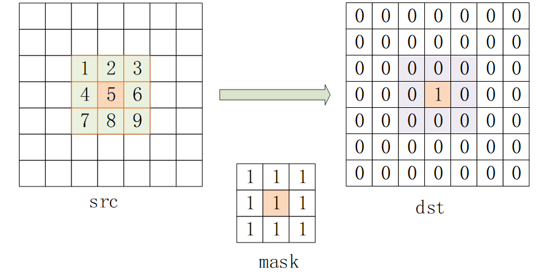

函数接口声明如下：

HmppResult HMPPI\_Erode3x3\_64f\_C1R\(const double \*src, int32\_t srcStep, double \*dst, int32\_t dstStep, HmppiSize roiSize\);

**参数**

|参数名|描述|取值范围|输入/输出|
|--|--|--|--|
|src|指向源图像的指针。|非空|输入|
|srcStep|源图像中连续行的起点之间的距离（以字节为单位）。|非负整数，且为src数据类型的字节整倍数|输入|
|dst|指向目的向量的指针。|非空|输出|
|dstStep|目标图像中连续行的起点之间的距离（以字节为单位）。|非负整数，且为dst数据类型的字节整倍数|输入|
|roiSize|源和目标图像感兴趣区域的大小（以像素为单位）。|roiSize.width∈(0,INT_MAX]，roiSize.height∈(0,INT_MAX]|输入|

**返回值**

- 成功：返回HMPP\_STS\_NO\_ERR。
- 失败：返回错误码。

**错误码**

|错误码|描述|
|--|--|
|HMPP_STS_NULL_PTR_ERR|任何指定的指针为空。|
|HMPP_STS_SIZE_ERR|roiSize的字段为零或负值。|
|HMPP_STS_STEP_ERR|源或者目标Step存在零或负值。|
|HMPP_STS_NOT_EVEN_STEP_ERR|srcStep或者dstStep不为其图像所属数据类型的字节长度的整倍数。|
|HMPP_STS_ROI_ERR|源或者目标图像的宽和高比roiSize的字段+2的结果小。|

> **说明：** 
>源或目标图像的宽和高需比roiSize的宽和高分别大2像素，否则将返回HMPP\_STS\_ROI\_ERR。

**示例**

```c
#define SRC_BUFFER_SIZE_T 96
#define DST_BUFFER_SIZE_T 64
void Erode3x3Example()
{
    HmppiSize roi = { 4, 4 };
    const double src[SRC_BUFFER_SIZE_T] = {
        11, 22, 33, 44, 55, 66, 77, 88, 22, 88, 77, 66,
        11, 22, 33, 44, 55, 66, 77, 88, 22, 88, 77, 66,
        11, 22, 33, 44, 55, 66, 77, 88, 22, 88, 77, 66,
        11, 22, 33, 44, 55, 66, 77, 88, 22, 88, 77, 66,
        11, 22, 33, 44, 55, 66, 77, 88, 22, 88, 77, 66,
        11, 22, 33, 44, 55, 66, 77, 88, 22, 88, 77, 66,
        11, 22, 33, 44, 55, 66, 77, 88, 22, 88, 77, 66,
        11, 22, 33, 44, 55, 66, 77, 88, 22, 88, 77, 66
    };

    double dst[DST_BUFFER_SIZE_T] = { 0 };

    const int32_t srcWidth = 12;
    const int32_t dstWidth = 8;
    int32_t srcStep = srcWidth * sizeof(double);
    int32_t dstStep = dstWidth * sizeof(double);
    HmppResult result = HMPPI_Erode3x3_64f_C1R(src, srcStep, dst, dstStep, roi);

    printf("result = %d \ndst = ", result);
    if (result != HMPP_STS_NO_ERR) {
        printf("result error: %d\n", result);
    }

    for (int32_t i = 0; i < DST_BUFFER_SIZE_T; ++i) {
        if (i % dstWidth == 0) {
            printf("\n");
        }
        printf("%.2lf ", dst[i]);
    }
    printf("\n");
}

int main(void)
{
    Erode3x3Example();
    return 0;
}
```

运行结果：

```text
result = 0
dst =
11.00 11.00 22.00 33.00 0.00 0.00 0.00 0.00
11.00 11.00 22.00 33.00 0.00 0.00 0.00 0.00
11.00 11.00 22.00 33.00 0.00 0.00 0.00 0.00
11.00 11.00 22.00 33.00 0.00 0.00 0.00 0.00
0.00 0.00 0.00 0.00 0.00 0.00 0.00 0.00
0.00 0.00 0.00 0.00 0.00 0.00 0.00 0.00
0.00 0.00 0.00 0.00 0.00 0.00 0.00 0.00
0.00 0.00 0.00 0.00 0.00 0.00 0.00 0.00
```

##### ErodeBorder

使用蒙版进行图像腐蚀，原理同Erode3x3。

其中最小值的有效计算仅针对蒙版图像中的非0元素。

以下为接口输入输出图示：


此类函数支持的边界方式说明可参照[枚举类型](#枚举类型)的HmppiBorderType的说明。

同时支持混合填充方式：如HMPP\_BORDERREPL**|**HMPP\_BORDERINMEM\_TOP，表示上边界以HMPP\_BORDERINMEM方式填充，其余边界以HMPP\_BORDERREPL方式填充。

该函数调用流程如下：

1. 调用对应类型Init初始化HmppiMorphPolicy结构体，否则主函数无法调用成功。
2. 调用主函数。
3. 最后调用Release释放HmppiMorphPolicy函数所包含内存，否则将产生内存泄漏。

函数接口声明如下：

- **初始化操作：**

    HmppResult HMPPI\_MorphInit\(HmppiSize roiSize, const uint8\_t \*mask, HmppiSize maskSize, HmppDataType dataType, int32\_t numChannels, HmppiMorphPolicy \*\*policy\);

    HmppResult HMPPI\_ErodeInit\(HmppiSize roiSize, const uint8\_t \*mask, HmppiSize maskSize, HmppDataType dataType, int32\_t numChannels, HmppiMorphPolicy \*\*policy\);

    HmppResult HMPPI\_MorphologyBorderInit\_1u\_C1R\(HmppiSize roiSize, const uint8\_t \*mask, HmppiSize maskSize, HmppiMorphPolicy \*\*policy\);

    HmppResult HMPPI\_MorphologyBorderInit\_8u\_C1R\(HmppiSize roiSize, const uint8\_t \*mask, HmppiSize maskSize, HmppiMorphPolicy \*\*policy\);

    HmppResult HMPPI\_MorphologyBorderInit\_16u\_C1R\(HmppiSize roiSize, const uint8\_t \*mask, HmppiSize maskSize, HmppiMorphPolicy \*\*policy\);

    HmppResult HMPPI\_MorphologyBorderInit\_16s\_C1R\(HmppiSize roiSize, const uint8\_t \*mask, HmppiSize maskSize, HmppiMorphPolicy \*\*policy\);

    HmppResult HMPPI\_MorphologyBorderInit\_32f\_C1R\(HmppiSize roiSize, const uint8\_t \*mask, HmppiSize maskSize, HmppiMorphPolicy \*\*policy\);

    HmppResult HMPPI\_MorphologyBorderInit\_8u\_C3R\(HmppiSize roiSize, const uint8\_t \*mask, HmppiSize maskSize, HmppiMorphPolicy \*\*policy\);

    HmppResult HMPPI\_MorphologyBorderInit\_32f\_C3R\(HmppiSize roiSize, const uint8\_t \*mask, HmppiSize maskSize, HmppiMorphPolicy \*\*policy\);

    HmppResult HMPPI\_MorphologyBorderInit\_8u\_C4R\(HmppiSize roiSize, const uint8\_t \*mask, HmppiSize maskSize, HmppiMorphPolicy \*\*policy\);

    HmppResult HMPPI\_MorphologyBorderInit\_32f\_C4R\(HmppiSize roiSize, const uint8\_t \*mask, HmppiSize maskSize, HmppiMorphPolicy \*\*policy\);

- **主函数操作：**

    HmppResult HMPPI\_ErodeBorder\_1u\_C1R\(const uint8\_t \*src, int32\_t srcStep, int32\_t srcBitOffset, uint8\_t \*dst, int32\_t dstStep, int32\_t dstBitOffset, HmppiSize roiSize, HmppiBorderType borderType, uint8\_t borderValue, const HmppiMorphPolicy \*policy\);

    HmppResult HMPPI\_ErodeBorder\_8u\_C1R\(const uint8\_t \*src, int32\_t srcStep, uint8\_t \*dst, int32\_t dstStep, HmppiSize roiSize, HmppiBorderType borderType, uint8\_t borderValue, const HmppiMorphPolicy \*policy\);

    HmppResult HMPPI\_ErodeBorder\_16u\_C1R\(const uint16\_t \*src, int32\_t srcStep, uint16\_t \*dst, int32\_t dstStep, HmppiSize roiSize, HmppiBorderType borderType, uint16\_t borderValue, const HmppiMorphPolicy \*policy\);

    HmppResult HMPPI\_ErodeBorder\_16s\_C1R\(const int16\_t \*src, int32\_t srcStep, int16\_t \*dst, int32\_t dstStep, HmppiSize roiSize, HmppiBorderType borderType, int16\_t borderValue, const HmppiMorphPolicy \*policy\);

    HmppResult HMPPI\_ErodeBorder\_32f\_C1R\(const float \*src, int32\_t srcStep, float \*dst, int32\_t dstStep, HmppiSize roiSize, HmppiBorderType borderType, float borderValue, const HmppiMorphPolicy \*policy\);

    HmppResult HMPPI\_ErodeBorder\_8u\_C3R\(const uint8\_t\* src, int32\_t srcStep, uint8\_t\* dst, int32\_t dstStep, HmppiSize roiSize, HmppiBorderType borderType, const uint8\_t borderValue\[3\], const HmppiMorphPolicy\* policy\);

    HmppResult HMPPI\_ErodeBorder\_32f\_C3R\(const float \*src, int32\_t srcStep, float \*dst, int32\_t dstStep, HmppiSize roiSize, HmppiBorderType borderType, const float borderValue\[3\], const HmppiMorphPolicy \*policy\);

    HmppResult HMPPI\_ErodeBorder\_8u\_C4R\(const uint8\_t\* src, int32\_t srcStep, uint8\_t\* dst, int32\_t dstStep, HmppiSize roiSize, HmppiBorderType borderType, const uint8\_t borderValue\[4\], const HmppiMorphPolicy\* policy\);

    HmppResult HMPPI\_ErodeBorder\_32f\_C4R\(const float \*src, int32\_t srcStep, float \*dst, int32\_t dstStep, HmppiSize roiSize, HmppiBorderType borderType, const float borderValue\[4\], const HmppiMorphPolicy \*policy\);

- **释放内存操作**：

    HmppResult HMPPI\_MorphRelease\(HmppiMorphPolicy \*policy\);

    HmppResult HMPPI\_ErodeRelease\(HmppiMorphPolicy \*policy\);

    HmppResult HMPPI\_MorphologyBorderRelease\_1u\_C1R\(HmppiMorphPolicy \*policy\);

    HmppResult HMPPI\_MorphologyBorderRelease\_8u\_C1R\(HmppiMorphPolicy \*policy\);

    HmppResult HMPPI\_MorphologyBorderRelease\_16u\_C1R\(HmppiMorphPolicy \*policy\);

    HmppResult HMPPI\_MorphologyBorderRelease\_16s\_C1R\(HmppiMorphPolicy \*policy\);

    HmppResult HMPPI\_MorphologyBorderRelease\_32f\_C1R\(HmppiMorphPolicy \*policy\);

    HmppResult HMPPI\_MorphologyBorderRelease\_8u\_C3R\(HmppiMorphPolicy \*policy\);

    HmppResult HMPPI\_MorphologyBorderRelease\_32f\_C3R\(HmppiMorphPolicy \*policy\);

    HmppResult HMPPI\_MorphologyBorderRelease\_8u\_C4R\(HmppiMorphPolicy \*policy\);

    HmppResult HMPPI\_MorphologyBorderRelease\_32f\_C4R\(HmppiMorphPolicy \*policy\);

**参数**

|参数名|描述|取值范围|输入/输出|
|--|--|--|--|
|mask|指向蒙版的指针。|非空|输入|
|maskSize|蒙版图像的大小（以像素为单位）。|maskSize.width∈(0,INT_MAX]，maskSize.height∈(0,INT_MAX]|输入|
|dataType|源图像的数据类型（目标图像同源图像）。|枚举，数据类型。支持HMPP8U、HMPP16U、HMPP16S和HMPP32F。|输入|
|numChannels|源图像的通道数（目标图像同源图像）。|仅支持1、3和4通道|输入|
|src|指向源图像的指针。|非空|输入|
|srcStep|源图像中连续行的起点之间的距离（以字节为单位）。|非负整数，且为src数据类型的字节整倍数|输入|
|srcBitOffset|从源图像的第一个字节开始的偏移量（以bit为单位）。|(0, INT_MAX]，且与roiSize.width的和需大于等于srcStep * 8|输入|
|dst|指向目的向量的指针。|非空|输出|
|dstStep|目标图像中连续行的起点之间的距离（以字节为单位）。|非负整数，且为dst数据类型的字节整倍数|输入|
|dstBitOffset|从目标图像的第一个字节开始的偏移量（以bit为单位）。|(0, INT_MAX]，且与roiSize.width的和需大于等于dstStep * 8|输入|
|roiSize|源和目标图像感兴趣区域的大小（以像素为单位）。|roiSize.width∈(0,INT_MAX]，roiSize.height∈(0,INT_MAX]|输入|
|borderType|边界填充类型。|表示边界填充类型，定义在枚举类型HmppiBorderType中。HMPP_BORDER_DEFAULT：边框设置为HMPP_BORDER_CONST，其borderValue= MAX_VALUE。HMPP_BORDER_REPL：边框从边缘像素复制而来。HMPP_BORDER_IN_MEM：边框是从内存中的源图像像素获得的。HMPP_BORDER_CONST：所有边框像素的值都设置为常数。HMPP_BORDER_MIRROR：边框像素从源图像边界像素镜像而来。还支持混合边框。|输入|
|borderValue|常量值，分配给常量边框HMPP_BORDER_CONST的像素。|数据类型范围内的值|输入|
|policy（init函数中）|指向内存存储HmppiMorphPolicy的指针的指针。|非空|输出|
|policy（主函数中和release函数中）|指向HmppiMorphPolicy结构体的指针。|非空|输入|

**返回值**

- 成功：返回HMPP\_STS\_NO\_ERR。
- 失败：返回错误码。

**错误码**

|错误码|描述|
|--|--|
|HMPP_STS_NULL_PTR_ERR|任何指定的指针为空。|
|HMPP_STS_SIZE_ERR|roiSize或者maskSize的字段为零或负值。|
|HMPP_STS_NOT_SUPPORTED_MODE_ERR|初始化不支持的数据类型的错误。|
|HMPP_STS_NUMCHANNELS_ERR|初始化不支持的通道数的错误。|
|HMPP_STS_STEP_ERR|srcStep、dstStep、srcBitOffset或者dstBitOffset中存在零或负值。或srcBitOffset、dstBitOffset不能满足roiSize字段的关系。|
|HMPP_STS_MALLOC_FAILED|Init函数中进行算法模型所需内存申请失败。|
|HMPP_STS_NOT_EVEN_STEP_ERR|srcStep或者dstStep不为其图像所属数据类型的字节长度的整倍数。|
|HMPP_STS_ROI_ERR|源或者目标图像的宽和高比roiSize的字段小。|
|HMPP_STS_BORDER_ERR|不支持的边界填充类型的错误。|

> **说明：** 
>
>- src不能和dst是同一数组，或内存重叠，否则可能导致结果错误。
>- 当使用**HMPP\_BORDER\_IN\_MEM**边界填充模式时，需保证入参的源图像有足够的额外数据以供计算使用，调用主函数时将src偏移最少offset长度，否则甚至可能产生崩溃等情况。offset需满足：
> 
> 其中T为源图像数据类型。
>- **1u\_C1R**类型接口不支持HMPP\_BORDER\_MIRROR模式，否则将返回HMPP\_STS\_BORDER\_ERR错误。

**示例**

```c
#define SRC_BUFFER_SIZE_T 96
#define DST_BUFFER_SIZE_T 64
#define MASK_BUFFER_SIZE_T 12
void ErodeBorderExample()
{
    HmppiSize roiSize = { 4, 4 };
    const int16_t src[SRC_BUFFER_SIZE_T] = {
        11, 12, 13, 14, 15, 16, 17, 18, 12, 19, 13, 15,
        21, 22, 23, 24, 25, 26, 27, 28, 22, 29, 23, 25,
        31, 32, 33, 34, 35, 36, 37, 38, 32, 39, 33, 35,
        41, 42, 43, 44, 45, 46, 47, 48, 42, 49, 43, 45,
        51, 52, 53, 54, 55, 56, 57, 58, 52, 59, 53, 55,
        61, 62, 63, 64, 65, 66, 67, 68, 62, 69, 63, 65,
        71, 72, 73, 74, 75, 76, 77, 78, 72, 79, 73, 75,
        81, 82, 83, 84, 85, 86, 87, 88, 82, 89, 83, 85
    };

    int16_t dst[DST_BUFFER_SIZE_T] = { 0 };
    HmppiSize maskSize = { 4, 3 };
    uint8_t mask[MASK_BUFFER_SIZE_T] = {
        1, 0, 2, 3,
        5, 1, 1, 0,
        0, 2, 0, 6,
    };

    const int32_t srcWidth = 12;
    const int32_t dstWidth = 8;
    int32_t srcStep = srcWidth * sizeof(int16_t);
    int32_t dstStep = dstWidth * sizeof(int16_t);
    HmppDataType dataType = HMPP16S;
    int32_t numChannels = 1;
    HmppiBorderType borderType = HMPPI_BORDER_REPL;
    int16_t borderValue = -100;
    HmppiMorphPolicy *policy = NULL;
    HmppResult result;

    result = HMPPI_MorphologyBorderInit_16s_C1R(roiSize, mask, maskSize, &policy);
    printf("HMPPI_MorphologyBorderInit_16s_C1R result = %d\n", result);
    if (result != HMPP_STS_NO_ERR) {
        return;
    }
    result = HMPPI_ErodeBorder_16s_C1R(src, srcStep, dst, dstStep, roiSize, borderType, borderValue, policy);
    printf("HMPPI_ErodeBorder_16s_C1R result = %d\n", result);
    (void)HMPPI_ErodeRelease(policy);
    policy = NULL;
    if (result != HMPP_STS_NO_ERR) {
        return;
    }

    printf("result = %d \ndst = ", result);
    if (result != HMPP_STS_NO_ERR) {
        printf("result error: %d\n", result);
    }

    for (int32_t i = 0; i < DST_BUFFER_SIZE_T; ++i) {
        if (i % dstWidth == 0) {
            printf("\n");
        }
        printf("%3d ", dst[i]);
    }
    printf("\n");
}

int main(void)
{
    ErodeBorderExample();
    return 0;
}
```

运行结果：

```text
HMPPI_MorphologyBorderInit_16s_C1R result = 0
HMPPI_ErodeBorder_16s_C1R result = 0
result = 0
dst =
 11  11  12  13   0   0   0   0
 11  11  12  13   0   0   0   0
 21  21  22  23   0   0   0   0
 31  31  32  33   0   0   0   0
  0   0   0   0   0   0   0   0
  0   0   0   0   0   0   0   0
  0   0   0   0   0   0   0   0
  0   0   0   0   0   0   0   0
```

##### GrayDilateBorder

使用蒙版进行图像灰度膨胀。灰度膨胀就是求局部源图像与蒙版元素和的最大值的操作，运算符是“”，其定义如下：


该公式表示用蒙版B来对图像A进行灰度膨胀处理，其中B是一个蒙版。通过蒙版B与图像A进行卷积计算，扫描图像中的每一个像素点，计算B覆盖区域的像素点与B蒙版元素值和的最大值，并用这个最大值替换参考点指定的像素值实现灰度膨胀。

以下为接口输入输出图示：


此类函数支持的边界方式说明可参照[枚举类型](#枚举类型)的HmppiBorderType说明，但只支持**HMPP\_BORDER\_REPL**。

该函数调用流程如下：

1. 调用对应类型Init初始化HmppiMorphGrayPolicy结构体，否则主函数无法调用成功。
2. 调用主函数。
3. 最后调用Release释放HmppiMorphGrayPolicy函数所包含内存，否则将产生内存泄漏。

函数接口声明如下：

- **初始化操作：**

    HmppResult HMPPI\_MorphGrayInit\_8u\_C1R\(HmppiMorphGrayPolicy\_8u \*\*policy, HmppiSize roiSize, const int32\_t \*mask, HmppiSize maskSize, HmppiPoint anchor\)；

    HmppResult HMPPI\_MorphGrayInit\_32f\_C1R\(HmppiMorphGrayPolicy\_32f \*\*policy, HmppiSize roiSize, const float \*mask, HmppiSize maskSize, HmppiPoint anchor\);

- **主函数操作：**

    HmppResult HMPPI\_GrayDilateBorder\_8u\_C1R\(const uint8\_t \*src, int32\_t srcStep, uint8\_t \*dst, int32\_t dstStep, HmppiSize roiSize, HmppiBorderType borderType, HmppiMorphGrayPolicy\_8u \*policy\);

    HmppResult HMPPI\_GrayDilateBorder\_32f\_C1R\(const float \*src, int32\_t srcStep, float \*dst, int32\_t dstStep, HmppiSize roiSize, HmppiBorderType borderType, HmppiMorphGrayPolicy\_32f \*policy\);

- **释放内存操作**：

    HmppResult HMPPI\_MorphGrayRelease\_8u\(HmppiMorphGrayPolicy\_8u \*policy\);

    HmppResult HMPPI\_MorphGrayRelease\_32f\(HmppiMorphGrayPolicy\_32f \*policy\);

**参数**

|参数名|描述|取值范围|输入/输出|
|--|--|--|--|
|mask|指向蒙版的指针。|非空|输入|
|maskSize|蒙版图像的大小（以像素为单位）。|maskSize.width∈(0,INT_MAX]，maskSize.height∈(0,INT_MAX]|输入|
|anchor|锚点坐标。|anchor.x∈(0, maskSize.width-1]，anchor.y∈(0, maskSize.height-1]|输入|
|src|指向源图像的指针。|非空|输入|
|srcStep|源图像中连续行的起点之间的距离（以字节为单位）。|非负整数，且为src数据类型的字节整倍数|输入|
|dst|指向目的向量的指针。|非空|输出|
|dstStep|目标图像中连续行的起点之间的距离（以字节为单位）。|非负整数，且为dst数据类型的字节整倍数|输入|
|roiSize|源和目标图像感兴趣区域的大小（以像素为单位）。|roiSize.width∈(0,INT_MAX]，roiSize.height∈(0,INT_MAX]|输入|
|borderType|边界填充类型。|枚举，边界填充类型。HMPP_BORDER_REPL：边框从边缘像素复制而来。|输入|
|policy（init函数中）|指向内存存储HmppiMorphGrayPolicy的指针的指针。|非空|输出|
|policy（主函数中和release函数中）|指向HmppiMorphGrayPolicy结构体的指针。|非空|输入|

**返回值**

- 成功：返回HMPP\_STS\_NO\_ERR。
- 失败：返回错误码。

**错误码**

|错误码|描述|
|--|--|
|HMPP_STS_NULL_PTR_ERR|任何指定的指针为空。|
|HMPP_STS_SIZE_ERR|roiSize或者maskSize的字段为零或负值。|
|HMPP_STS_ANCHOR_ERR|锚点anchor字段为负或大于等于maskSize的字段的错误。|
|HMPP_STS_STEP_ERR|源或者目标Step中存在零或负值。|
|HMPP_STS_MALLOC_FAILED|Init函数中进行算法模型所需内存申请失败。|
|HMPP_STS_NOT_EVEN_STEP_ERR|srcStep或者dstStep不为其图像所属数据类型的字节长度的整倍数。|
|HMPP_STS_ROI_ERR|源或者目标图像的宽和高比roiSize的字段小。|
|HMPP_STS_BORDER_ERR|不支持的边界填充类型。|
|HMPP_STS_NOT_SUPPORTED_INPLACE_MODE_ERR|src与dst内存地址相同。|

> **说明：** 
>src不能和dst是同一数组，或内存重叠，否则可能导致结果错误。

**示例**

```c
#define SRC_BUFFER_SIZE_T 96
#define DST_BUFFER_SIZE_T 64
#define MASK_BUFFER_SIZE_T 12
void GrayDilateBorderExample()
{
    HmppiSize roiSize = { 4, 4 };
    const uint8_t src[SRC_BUFFER_SIZE_T] = {
        11, 122, 13, 14, 15, 16, 17, 18, 12, 19, 13, 15,
        21, 22, 23, 24, 25, 26, 27, 28, 22, 29, 23, 25,
        31, 32, 33, 34, 35, 36, 37, 38, 32, 39, 33, 35,
        41, 42, 43, 44, 45, 46, 47, 48, 42, 49, 43, 45,
        51, 52, 53, 54, 55, 56, 57, 58, 52, 59, 53, 55,
        61, 62, 63, 64, 65, 66, 67, 68, 62, 69, 63, 65,
        71, 72, 73, 74, 75, 76, 77, 78, 72, 79, 73, 75,
        81, 82, 83, 84, 85, 86, 87, 88, 82, 89, 83, 85
    };

    uint8_t dst[DST_BUFFER_SIZE_T] = { 0 };
    HmppiSize maskSize = { 4, 3 };
    HmppiPoint anchor = { 0, 0 };
    int32_t mask[MASK_BUFFER_SIZE_T] = {
        1, 0, -2, 3,
        5, -1, 1, 0,
        0, 2, 0, -6,
    };

    const int32_t srcWidth = 12;
    const int32_t dstWidth = 8;
    int32_t srcStep = srcWidth * sizeof(uint8_t);
    int32_t dstStep = dstWidth * sizeof(uint8_t);
    HmppiBorderType borderType = HMPPI_BORDER_REPL;
    HmppiMorphGrayPolicy_8u *policy = NULL;
    HmppResult result;

    result = HMPPI_MorphGrayInit_8u_C1R(&policy, roiSize, mask, maskSize, anchor);
    printf("HMPPI_MorphGrayInit_8u_C1R result = %d\n", result);
    if (result != HMPP_STS_NO_ERR) {
        return;
    }
    result = HMPPI_GrayDilateBorder_8u_C1R(src, srcStep, dst, dstStep, roiSize, borderType, policy);
    printf("HMPPI_GrayDilateBorder_8u_C1R result = %d\n", result);
    (void)HMPPI_MorphGrayRelease_8u(policy);
    policy = NULL;
    if (result != HMPP_STS_NO_ERR) {
        return;
    }

    printf("result = %d \ndst = ", result);
    if (result != HMPP_STS_NO_ERR) {
        printf("result error: %d\n", result);
    }

    for (int32_t i = 0; i < DST_BUFFER_SIZE_T; ++i) {
        if (i % dstWidth == 0) {
            printf("\n");
        }
        printf("%3d ", dst[i]);
    }
    printf("\n");
}

int main(void)
{
    GrayDilateBorderExample();
    return 0;
}
```

运行结果：

```text
HMPPI_MorphGrayInit_8u_C1R result = 0
HMPPI_GrayDilateBorder_8u_C1R result = 0
result = 0
dst =
122 123  36  36   0   0   0   0
 44  45  46  46   0   0   0   0
 46  47  48  49   0   0   0   0
 47  47  48  49   0   0   0   0
  0   0   0   0   0   0   0   0
  0   0   0   0   0   0   0   0
  0   0   0   0   0   0   0   0
  0   0   0   0   0   0   0   0
```

##### GrayErodeBorder

使用蒙版进行图像灰度腐蚀。灰度腐蚀就是求局部源图像与蒙版元素和的最小值的操作，运算符是“”，其定义如下：


该公式表示用蒙版B来对图像A进行灰度腐蚀处理，其中B是一个蒙版。通过蒙版B与图像A进行卷积计算，扫描图像中的每一个像素点，计算B覆盖区域的像素点与B蒙版元素值和的最小值，并用这个最小值替换参考点指定的像素值实现灰度腐蚀。

以下为接口输入输出图示：


此类函数支持的边界方式说明可参照[枚举类型](#枚举类型)的HmppiBorderType说明，但只支持**HMPP\_BORDER\_REPL**。

该函数调用流程如下：

1. 调用对应类型Init初始化HmppiMorphGrayPolicy结构体，否则主函数无法调用成功。
2. 调用主函数。
3. 最后调用Release释放HmppiMorphGrayPolicy函数所包含内存，否则将产生内存泄漏。

函数接口声明如下：

- **初始化操作：**

    HmppResult HMPPI\_MorphGrayInit\_8u\_C1R\(HmppiMorphGrayPolicy\_8u \*\*policy, HmppiSize roiSize, const int32\_t \*mask, HmppiSize maskSize, HmppiPoint anchor\)；

    HmppResult HMPPI\_MorphGrayInit\_32f\_C1R\(HmppiMorphGrayPolicy\_32f \*\*policy, HmppiSize roiSize, const float \*mask, HmppiSize maskSize, HmppiPoint anchor\);

- **主函数操作：**

    HmppResult HMPPI\_GrayErodeBorder\_8u\_C1R\(const uint8\_t \*src, int32\_t srcStep, uint8\_t \*dst, int32\_t dstStep, HmppiSize roiSize, HmppiBorderType borderType, HmppiMorphGrayPolicy\_8u \*policy\);

    HmppResult HMPPI\_GrayErodeBorder\_32f\_C1R\(const float \*src, int32\_t srcStep, float \*dst, int32\_t dstStep, HmppiSize roiSize, HmppiBorderType borderType, HmppiMorphGrayPolicy\_32f \*policy\);

- **释放内存操作**：

    HmppResult HMPPI\_MorphGrayRelease\_8u\(HmppiMorphGrayPolicy\_8u \*policy\);

    HmppResult HMPPI\_MorphGrayRelease\_32f\(HmppiMorphGrayPolicy\_32f \*policy\);

**参数**

|参数名|描述|取值范围|输入/输出|
|--|--|--|--|
|mask|指向蒙版的指针。|非空|输入|
|maskSize|蒙版图像的大小（以像素为单位）。|maskSize.width∈(0,INT_MAX]，maskSize.height∈(0,INT_MAX]|输入|
|anchor|锚点坐标。|anchor.x∈(0, maskSize.width-1]，anchor.y∈(0, maskSize.height-1]|输入|
|src|指向源图像的指针。|非空|输入|
|srcStep|源图像中连续行的起点之间的距离（以字节为单位）。|非负整数，且为src数据类型的字节整倍数。|输入|
|dst|指向目的向量的指针。|非空|输出|
|dstStep|目标图像中连续行的起点之间的距离（以字节为单位）。|非负整数，且为dst数据类型的字节整倍数。|输入|
|roiSize|源和目标图像感兴趣区域的大小（以像素为单位）。|roiSize.width∈(0,INT_MAX]，roiSize.height∈(0,INT_MAX]|输入|
|borderType|边界填充类型。|枚举，边界填充类型。HMPP_BORDER_REPL：边框从边缘像素复制而来。|输入|
|policy（init函数中）|指向内存存储HmppiMorphGrayPolicy的指针的指针。|非空|输出|
|policy（主函数中和release函数中）|指向HmppiMorphGrayPolicy结构体的指针。|非空|输入|

**返回值**

- 成功：返回HMPP\_STS\_NO\_ERR。
- 失败：返回错误码。

**错误码**

|错误码|描述|
|--|--|
|HMPP_STS_NULL_PTR_ERR|任何指定的指针为空。|
|HMPP_STS_SIZE_ERR|roiSize或者maskSize的字段为零或负值。|
|HMPP_STS_ANCHOR_ERR|锚点anchor字段为负或大于等于maskSize的字段。|
|HMPP_STS_STEP_ERR|源或者目标Step中存在零或负值。|
|HMPP_STS_MALLOC_FAILED|Init函数中进行算法模型所需内存申请失败。|
|HMPP_STS_NOT_EVEN_STEP_ERR|srcStep或者dstStep不为其图像所属数据类型的字节长度的整倍数。|
|HMPP_STS_ROI_ERR|源或者目标图像的宽和高比roiSize的字段小。|
|HMPP_STS_BORDER_ERR|不支持的边界填充类型。|
|HMPP_STS_NOT_SUPPORTED_INPLACE_MODE_ERR|src与dst内存地址相同。|

> **说明：** 
>src不能和dst是同一数组，或内存重叠，否则可能导致结果错误。

**示例**

```c
#define SRC_BUFFER_SIZE_T 96
#define DST_BUFFER_SIZE_T 64
#define MASK_BUFFER_SIZE_T 12
void GrayErodeBorderExample()
{
    HmppiSize roiSize = { 4, 4 };
    const uint8_t src[SRC_BUFFER_SIZE_T] = {
        11, 122, 13, 14, 15, 16, 17, 18, 12, 19, 13, 15,
        21, 22, 23, 24, 25, 26, 27, 28, 22, 29, 23, 25,
        31, 32, 33, 34, 35, 36, 37, 38, 32, 39, 33, 35,
        41, 42, 43, 44, 45, 46, 47, 48, 42, 49, 43, 45,
        51, 52, 53, 54, 55, 56, 57, 58, 52, 59, 53, 55,
        61, 62, 63, 64, 65, 66, 67, 68, 62, 69, 63, 65,
        71, 72, 73, 74, 75, 76, 77, 78, 72, 79, 73, 75,
        81, 82, 83, 84, 85, 86, 87, 88, 82, 89, 83, 85
    };

    uint8_t dst[DST_BUFFER_SIZE_T] = { 0 };
    HmppiSize maskSize = { 4, 3 };
    HmppiPoint anchor = { 0, 0 };
    int32_t mask[MASK_BUFFER_SIZE_T] = {
        -7, 0, -2, 3,
        5, -1, 1, 0,
        0, 2, 0, -6,
    };

    const int32_t srcWidth = 12;
    const int32_t dstWidth = 8;
    int32_t srcStep = srcWidth * sizeof(uint8_t);
    int32_t dstStep = dstWidth * sizeof(uint8_t);
    HmppiBorderType borderType = HMPPI_BORDER_REPL;
    HmppiMorphGrayPolicy_8u *policy = NULL;
    HmppResult result;

    result = HMPPI_MorphGrayInit_8u_C1R(&policy, roiSize, mask, maskSize, anchor);
    printf("HMPPI_MorphGrayInit_8u_C1R result = %d\n", result);
    if (result != HMPP_STS_NO_ERR) {
        return;
    }
    result = HMPPI_GrayErodeBorder_8u_C1R(src, srcStep, dst, dstStep, roiSize, borderType, policy);
    printf("HMPPI_GrayErodeBorder_8u_C1R result = %d\n", result);
    (void)HMPPI_MorphGrayRelease_8u(policy);
    policy = NULL;
    if (result != HMPP_STS_NO_ERR) {
        return;
    }

    printf("result = %d \ndst = ", result);
    if (result != HMPP_STS_NO_ERR) {
        printf("result error: %d\n", result);
    }

    for (int32_t i = 0; i < DST_BUFFER_SIZE_T; ++i) {
        if (i % dstWidth == 0) {
            printf("\n");
        }
        printf("%3d ", dst[i]);
    }
    printf("\n");
}

int main(void)
{
    GrayErodeBorderExample();
    return 0;
}
```

运行结果：

```text
HMPPI_MorphGrayInit_8u_C1R result = 0
HMPPI_GrayErodeBorder_8u_C1R result = 0
result = 0
dst =
  4  12   6   7   0   0   0   0
 14  15  16  17   0   0   0   0
 24  25  26  27   0   0   0   0
 34  35  36  37   0   0   0   0
  0   0   0   0   0   0   0   0
  0   0   0   0   0   0   0   0
  0   0   0   0   0   0   0   0
  0   0   0   0   0   0   0   0
```

##### MorphBlackhatBorder

使用蒙版进行图像黑帽操作，其默认蒙版元素全为非0有效。其定义如下：


该公式表示用蒙版B来对图像A进行黑帽处理。形态学中的黑帽操作表示闭操作（通过蒙版B对图像A执行闭操作）与源图像A的差。

此类函数支持的边界方式说明可参照[枚举类型](#枚举类型)中HmppiBorderType的说明。

同时支持混合填充方式：如HMPP\_BORDERREPL**|**HMPP\_BORDERINMEM\_TOP，表示上边界以HMPP\_BORDERINMEM方式填充，其余边界以HMPP\_BORDERREPL方式填充。

该函数调用流程如下：

1. 调用对应类型Init初始化HmppiMorphAdvPolicy结构体，否则主函数无法调用成功。
2. 调用主函数。
3. 最后调用Release释放HmppiMorphAdvPolicy函数所包含内存，否则将产生内存泄漏。

函数接口声明如下：

- **初始化操作：**

    HmppResult HMPPI\_MorphAdvInit\_1u\_C1R\(HmppiSize roiSize, const uint8\_t \*mask, HmppiSize maskSize, HmppiMorphAdvPolicy \*\*policy\);

    HmppResult HMPPI\_MorphAdvInit\_8u\_C1R\(HmppiSize roiSize, const uint8\_t \*mask, HmppiSize maskSize, HmppiMorphAdvPolicy \*\*policy\);

    HmppResult HMPPI\_MorphAdvInit\_16u\_C1R\(HmppiSize roiSize, const uint8\_t \*mask, HmppiSize maskSize, HmppiMorphAdvPolicy \*\*policy\);

    HmppResult HMPPI\_MorphAdvInit\_16s\_C1R\(HmppiSize roiSize, const uint8\_t \*mask, HmppiSize maskSize, HmppiMorphAdvPolicy \*\*policy\);

    HmppResult HMPPI\_MorphAdvInit\_32f\_C1R\(HmppiSize roiSize, const uint8\_t \*mask, HmppiSize maskSize, HmppiMorphAdvPolicy \*\*policy\);

    HmppResult HMPPI\_MorphAdvInit\_8u\_C3R\(HmppiSize roiSize, const uint8\_t \*mask, HmppiSize maskSize, HmppiMorphAdvPolicy \*\*policy\);

    HmppResult HMPPI\_MorphAdvInit\_32f\_C3R\(HmppiSize roiSize, const uint8\_t \*mask, HmppiSize maskSize, HmppiMorphAdvPolicy \*\*policy\);

    HmppResult HMPPI\_MorphAdvInit\_8u\_C4R\(HmppiSize roiSize, const uint8\_t \*mask, HmppiSize maskSize, HmppiMorphAdvPolicy \*\*policy\);

    HmppResult HMPPI\_MorphAdvInit\_32f\_C4R\(HmppiSize roiSize, const uint8\_t \*mask, HmppiSize maskSize, HmppiMorphAdvPolicy \*\*policy\);

- **主函数操作：**

    HmppResult HMPPI\_MorphBlackhatBorder\_1u\_C1R\(const uint8\_t \*src, int32\_t srcStep, int32\_t srcBitOffset, uint8\_t \*dst, int32\_t dstStep, int32\_t dstBitOffset, HmppiSize roiSize, HmppiBorderType borderType, uint8\_t borderValue, const HmppiMorphAdvPolicy \*policy\);

    HmppResult HMPPI\_MorphBlackhatBorder\_8u\_C1R\(const uint8\_t \*src, int32\_t srcStep, uint8\_t \*dst, int32\_t dstStep, HmppiSize roiSize, HmppiBorderType borderType, uint8\_t borderValue, const HmppiMorphAdvPolicy \*policy\);

    HmppResult HMPPI\_MorphBlackhatBorder\_16u\_C1R\(const uint16\_t \*src, int32\_t srcStep, uint16\_t \*dst, int32\_t dstStep, HmppiSize roiSize, HmppiBorderType borderType, uint16\_t borderValue, const HmppiMorphAdvPolicy \*policy\);

    HmppResult HMPPI\_MorphBlackhatBorder\_16s\_C1R\(const int16\_t \*src, int32\_t srcStep, int16\_t \*dst, int32\_t dstStep, HmppiSize roiSize, HmppiBorderType borderType, int16\_t borderValue, const HmppiMorphAdvPolicy \*policy\);

    HmppResult HMPPI\_MorphBlackhatBorder\_32f\_C1R\(const float \*src, int32\_t srcStep, float \*dst, int32\_t dstStep, HmppiSize roiSize, HmppiBorderType borderType, float borderValue, const HmppiMorphAdvPolicy \*policy\);

    HmppResult HMPPI\_MorphBlackhatBorder\_8u\_C3R\(const uint8\_t \*src, int32\_t srcStep, uint8\_t \*dst, int32\_t dstStep, HmppiSize roiSize, HmppiBorderType borderType, const uint8\_t borderValue\[3\], const HmppiMorphAdvPolicy \*policy\);

    HmppResult HMPPI\_MorphBlackhatBorder\_32f\_C3R\(const float \*src, int32\_t srcStep, float \*dst, int32\_t dstStep, HmppiSize roiSize, HmppiBorderType borderType, const float borderValue\[3\], const HmppiMorphAdvPolicy \*policy\);

    HmppResult HMPPI\_MorphBlackhatBorder\_8u\_C4R\(const uint8\_t \*src, int32\_t srcStep, uint8\_t \*dst, int32\_t dstStep, HmppiSize roiSize, HmppiBorderType borderType, const uint8\_t borderValue\[4\], const HmppiMorphAdvPolicy \*policy\);

    HmppResult HMPPI\_MorphBlackhatBorder\_32f\_C4R\(const float \*src, int32\_t srcStep, float \*dst, int32\_t dstStep, HmppiSize roiSize, HmppiBorderType borderType, const float borderValue\[4\], const HmppiMorphAdvPolicy \*policy\);

- **释放内存操作**：

    HmppResult HMPPI\_MorphAdvRelease\_1u\_C1R\(HmppiMorphAdvPolicy \*policy\);

    HmppResult HMPPI\_MorphAdvRelease\_8u\_C1R\(HmppiMorphAdvPolicy \*policy\);

    HmppResult HMPPI\_MorphAdvRelease\_16u\_C1R\(HmppiMorphAdvPolicy \*policy\);

    HmppResult HMPPI\_MorphAdvRelease\_16s\_C1R\(HmppiMorphAdvPolicy \*policy\);

    HmppResult HMPPI\_MorphAdvRelease\_32f\_C1R\(HmppiMorphAdvPolicy \*policy\);

    HmppResult HMPPI\_MorphAdvRelease\_8u\_C3R\(HmppiMorphAdvPolicy \*policy\);

    HmppResult HMPPI\_MorphAdvRelease\_32f\_C3R\(HmppiMorphAdvPolicy \*policy\);

    HmppResult HMPPI\_MorphAdvRelease\_8u\_C4R\(HmppiMorphAdvPolicy \*policy\);

    HmppResult HMPPI\_MorphAdvRelease\_32f\_C4R\(HmppiMorphAdvPolicy \*policy\);

**参数**

|参数名|描述|取值范围|输入/输出|
|--|--|--|--|
|mask|指向蒙版的指针。|非空|输入|
|maskSize|蒙版图像的大小（以像素为单位）。|maskSize.width∈(0,INT_MAX]，maskSize.height∈(0,INT_MAX]|输入|
|src|指向源图像的指针。|非空|输入|
|srcStep|源图像中连续行的起点之间的距离（以字节为单位）。|非负整数，且为src数据类型的字节整倍数|输入|
|dst|指向目的向量的指针。|非空|输出|
|dstStep|目标图像中连续行的起点之间的距离（以字节为单位）。|非负整数，且为dst数据类型的字节整倍数|输入|
|roiSize|源和目标图像感兴趣区域的大小（以像素为单位）。|roiSize.width∈(0,INT_MAX]，roiSize.height∈(0,INT_MAX]|输入|
|borderType|边界填充类型。|枚举，边界填充类型。HMPP_BORDER_DEFAULT：边框设置为HMPP_BORDER_CONST，填充值依据基础操作选用填充的固定值。HMPP_BORDER_REPL：边框从边缘像素复制而来。HMPP_BORDER_IN_MEM：边框是从内存中的源图像像素获得的。HMPP_BORDER_CONST：所有边框像素的值都设置为常数。HMPP_BORDER_MIRROR：边框像素从源图像边界像素镜像而来。还支持混合边框。|输入|
|borderValue|常量值，分配给常量边框HMPP_BORDER_CONST的像素。|数据类型范围内的值|输入|
|policy（init函数中）|指向内存存储HmppiMorphAdvPolicy的指针的指针。|非空|输出|
|policy（主函数中和release函数中）|指向HmppiMorphAdvPolicy结构体的指针。|非空|输入|

**返回值**

- 成功：返回HMPP\_STS\_NO\_ERR。
- 失败：返回错误码。

**错误码**

|错误码|描述|
|--|--|
|HMPP_STS_NULL_PTR_ERR|任何指定的指针为空。|
|HMPP_STS_SIZE_ERR|roiSize或者maskSize的字段为零或负值。|
|HMPP_STS_STEP_ERR|源或者目标Step中存在零或负值。|
|HMPP_STS_MALLOC_FAILED|Init函数中进行算法模型所需内存申请失败。|
|HMPP_STS_NOT_EVEN_STEP_ERR|srcStep或者dstStep不为其图像所属数据类型的字节长度的整倍数。|
|HMPP_STS_ROI_ERR|源或者目标图像的宽和高比roiSize的字段小。|
|HMPP_STS_BORDER_ERR|不支持的边界填充类型。|

> **说明：** 
>
>- src不能和dst是同一数组，或内存重叠，否则可能导致结果错误。
>- 当使用**HMPP\_BORDER\_IN\_MEM**边界填充模式时，需保证入参的源图像有足够的额外数据以供计算使用，调用主函数时将src偏移最少offset长度，否则甚至可能产生崩溃等情况。offset需满足：
> 
> 其中T为源图像数据类型。
>- **1u\_C1R**类型接口不支持HMPP\_BORDER\_MIRROR模式，否则将返回HMPP\_STS\_BORDER\_ERR错误。

**示例**

```c
#define SRC_BUFFER_SIZE_T 96
#define DST_BUFFER_SIZE_T 64
#define MASK_BUFFER_SIZE_T 12
void MorphBlackhatBorderExample()
{
    HmppiSize roiSize = { 4, 4 };
    const int16_t src[SRC_BUFFER_SIZE_T] = {
        11, 12, 13, 14, 15, 16, 17, 18, 12, 19, 13, 15,
        21, 22, 23, 24, 25, 26, 27, 28, 22, 29, 23, 25,
        31, 32, 33, 34, 35, 36, 37, 38, 32, 39, 33, 35,
        41, 42, 43, 44, 45, 46, 47, 48, 42, 49, 43, 45,
        51, 52, 53, 54, 55, 56, 57, 58, 52, 59, 53, 55,
        61, 62, 63, 64, 65, 66, 67, 68, 62, 69, 63, 65,
        71, 72, 73, 74, 75, 76, 77, 78, 72, 79, 73, 75,
        81, 82, 83, 84, 85, 86, 87, 88, 82, 89, 83, 85
    };

    int16_t dst[DST_BUFFER_SIZE_T] = { 0 };
    HmppiSize maskSize = { 4, 3 };
    uint8_t mask[MASK_BUFFER_SIZE_T] = {
        1, 0, 2, 3,
        5, 1, 1, 0,
        0, 2, 0, 6,
    };

    const int32_t srcWidth = 12;
    const int32_t dstWidth = 8;
    int32_t srcStep = srcWidth * sizeof(int16_t);
    int32_t dstStep = dstWidth * sizeof(int16_t);
    HmppDataType dataType = HMPP16S;
    int32_t numChannels = 1;
    HmppiBorderType borderType = HMPPI_BORDER_REPL;
    int16_t borderValue = -100;
    HmppiMorphAdvPolicy *policy = NULL;
    HmppResult result;

    result = HMPPI_MorphAdvInit_16s_C1R(roiSize, mask, maskSize, &policy);
    printf("HMPPI_MorphAdvInit_16s_C1R result = %d\n", result);
    if (result != HMPP_STS_NO_ERR) {
        return;
    }
    result = HMPPI_MorphBlackhatBorder_16s_C1R(src, srcStep, dst, dstStep, roiSize, borderType, borderValue, policy);
    printf("HMPPI_MorphBlackhatBorder_16s_C1R result = %d\n", result);
    (void)HMPPI_MorphAdvRelease_16s_C1R(policy);
    policy = NULL;
    if (result != HMPP_STS_NO_ERR) {
        return;
    }

    printf("result = %d \ndst = ", result);
    if (result != HMPP_STS_NO_ERR) {
        printf("result error: %d\n", result);
    }

    for (int32_t i = 0; i < DST_BUFFER_SIZE_T; ++i) {
        if (i % dstWidth == 0) {
            printf("\n");
        }
        printf("%3d ", dst[i]);
    }
    printf("\n");
}

int main(void)
{
    MorphBlackhatBorderExample();
    return 0;
}
```

运行结果：

```text
HMPPI_MorphAdvInit_16s_C1R result = 0
HMPPI_MorphBlackhatBorder_16s_C1R result = 0
result = 0
dst =
 12  11  10  10   0   0   0   0
  2   1   0   0   0   0   0   0
  2   1   0   0   0   0   0   0
  2   1   0   0   0   0   0   0
  0   0   0   0   0   0   0   0
  0   0   0   0   0   0   0   0
  0   0   0   0   0   0   0   0
  0   0   0   0   0   0   0   0
```

##### MorphCloseBorder

使用蒙版进行图像闭操作，其默认蒙版元素全为非0有效。运算符是“”，其定义如下：


该公式表示用蒙版B来对图像A进行闭操作。形态学中的闭操作表示使用蒙版B对图像A进行膨胀操作后再对结果进行腐蚀操作。

此类函数支持的边界方式说明可参照[枚举类型](#枚举类型)中HmppiBorderType的说明。

同时支持混合填充方式：如HMPP\_BORDERREPL**|**HMPP\_BORDERINMEM\_TOP，表示上边界以HMPP\_BORDERINMEM方式填充，其余边界以HMPP\_BORDERREPL方式填充。

该函数调用流程如下：

1. 调用对应类型Init初始化HmppiMorphAdvPolicy结构体，否则主函数无法调用成功。
2. 调用主函数。
3. 最后调用Release释放HmppiMorphAdvPolicy函数所包含内存，否则将产生内存泄漏。

函数接口声明如下：

- **初始化操作：**

    HmppResult HMPPI\_MorphAdvInit\_1u\_C1R\(HmppiSize roiSize, const uint8\_t \*mask, HmppiSize maskSize, HmppiMorphAdvPolicy \*\*policy\);

    HmppResult HMPPI\_MorphAdvInit\_8u\_C1R\(HmppiSize roiSize, const uint8\_t \*mask, HmppiSize maskSize, HmppiMorphAdvPolicy \*\*policy\);

    HmppResult HMPPI\_MorphAdvInit\_16u\_C1R\(HmppiSize roiSize, const uint8\_t \*mask, HmppiSize maskSize, HmppiMorphAdvPolicy \*\*policy\);

    HmppResult HMPPI\_MorphAdvInit\_16s\_C1R\(HmppiSize roiSize, const uint8\_t \*mask, HmppiSize maskSize, HmppiMorphAdvPolicy \*\*policy\);

    HmppResult HMPPI\_MorphAdvInit\_32f\_C1R\(HmppiSize roiSize, const uint8\_t \*mask, HmppiSize maskSize, HmppiMorphAdvPolicy \*\*policy\);

    HmppResult HMPPI\_MorphAdvInit\_8u\_C3R\(HmppiSize roiSize, const uint8\_t \*mask, HmppiSize maskSize, HmppiMorphAdvPolicy \*\*policy\);

    HmppResult HMPPI\_MorphAdvInit\_32f\_C3R\(HmppiSize roiSize, const uint8\_t \*mask, HmppiSize maskSize, HmppiMorphAdvPolicy \*\*policy\);

    HmppResult HMPPI\_MorphAdvInit\_8u\_C4R\(HmppiSize roiSize, const uint8\_t \*mask, HmppiSize maskSize, HmppiMorphAdvPolicy \*\*policy\);

    HmppResult HMPPI\_MorphAdvInit\_32f\_C4R\(HmppiSize roiSize, const uint8\_t \*mask, HmppiSize maskSize, HmppiMorphAdvPolicy \*\*policy\);

- **主函数操作：**

    HmppResult HMPPI\_MorphCloseBorder\_1u\_C1R\(const uint8\_t \*src, int32\_t srcStep, int32\_t srcBitOffset, uint8\_t \*dst, int32\_t dstStep, int32\_t dstBitOffset, HmppiSize roiSize, HmppiBorderType borderType, uint8\_t borderValue, const HmppiMorphAdvPolicy \*policy\);

    HmppResult HMPPI\_MorphCloseBorder\_8u\_C1R\(const uint8\_t \*src, int32\_t srcStep, uint8\_t \*dst, int32\_t dstStep, HmppiSize roiSize, HmppiBorderType borderType, uint8\_t borderValue, const HmppiMorphAdvPolicy \*policy\);

    HmppResult HMPPI\_MorphCloseBorder\_16u\_C1R\(const uint16\_t \*src, int32\_t srcStep, uint16\_t \*dst, int32\_t dstStep, HmppiSize roiSize, HmppiBorderType borderType, uint16\_t borderValue, const HmppiMorphAdvPolicy \*policy\);

    HmppResult HMPPI\_MorphCloseBorder\_16s\_C1R\(const int16\_t \*src, int32\_t srcStep, int16\_t \*dst, int32\_t dstStep, HmppiSize roiSize, HmppiBorderType borderType, int16\_t borderValue, const HmppiMorphAdvPolicy \*policy\);

    HmppResult HMPPI\_MorphCloseBorder\_32f\_C1R\(const float \*src, int32\_t srcStep, float \*dst, int32\_t dstStep, HmppiSize roiSize, HmppiBorderType borderType, float borderValue, const HmppiMorphAdvPolicy \*policy\);

    HmppResult HMPPI\_MorphCloseBorder\_8u\_C3R\(const uint8\_t \*src, int32\_t srcStep, uint8\_t \*dst, int32\_t dstStep, HmppiSize roiSize, HmppiBorderType borderType, const uint8\_t borderValue\[3\], const HmppiMorphAdvPolicy \*policy\);

    HmppResult HMPPI\_MorphCloseBorder\_32f\_C3R\(const float \*src, int32\_t srcStep, float \*dst, int32\_t dstStep, HmppiSize roiSize, HmppiBorderType borderType, const float borderValue\[3\], const HmppiMorphAdvPolicy \*policy\);

    HmppResult HMPPI\_MorphCloseBorder\_8u\_C4R\(const uint8\_t \*src, int32\_t srcStep, uint8\_t \*dst, int32\_t dstStep, HmppiSize roiSize, HmppiBorderType borderType, const uint8\_t borderValue\[4\], const HmppiMorphAdvPolicy \*policy\);

    HmppResult HMPPI\_MorphCloseBorder\_32f\_C4R\(const float \*src, int32\_t srcStep, float \*dst, int32\_t dstStep, HmppiSize roiSize, HmppiBorderType borderType, const float borderValue\[4\], const HmppiMorphAdvPolicy \*policy\);

- **释放内存操作**：

    HmppResult HMPPI\_MorphAdvRelease\_1u\_C1R\(HmppiMorphAdvPolicy \*policy\);

    HmppResult HMPPI\_MorphAdvRelease\_8u\_C1R\(HmppiMorphAdvPolicy \*policy\);

    HmppResult HMPPI\_MorphAdvRelease\_16u\_C1R\(HmppiMorphAdvPolicy \*policy\);

    HmppResult HMPPI\_MorphAdvRelease\_16s\_C1R\(HmppiMorphAdvPolicy \*policy\);

    HmppResult HMPPI\_MorphAdvRelease\_32f\_C1R\(HmppiMorphAdvPolicy \*policy\);

    HmppResult HMPPI\_MorphAdvRelease\_8u\_C3R\(HmppiMorphAdvPolicy \*policy\);

    HmppResult HMPPI\_MorphAdvRelease\_32f\_C3R\(HmppiMorphAdvPolicy \*policy\);

    HmppResult HMPPI\_MorphAdvRelease\_8u\_C4R\(HmppiMorphAdvPolicy \*policy\);

    HmppResult HMPPI\_MorphAdvRelease\_32f\_C4R\(HmppiMorphAdvPolicy \*policy\);

**参数**

|参数名|描述|取值范围|输入/输出|
|--|--|--|--|
|mask|指向蒙版的指针。|非空|输入|
|maskSize|蒙版图像的大小（以像素为单位）。|maskSize.width∈(0,INT_MAX]，maskSize.height∈(0,INT_MAX]|输入|
|src|指向源图像的指针。|非空|输入|
|srcStep|源图像中连续行的起点之间的距离（以字节为单位）。|非负整数，且为src数据类型的字节整倍数|输入|
|dst|指向目的向量的指针。|非空|输出|
|dstStep|目标图像中连续行的起点之间的距离（以字节为单位）。|非负整数，且为dst数据类型的字节整倍数|输入|
|roiSize|源和目标图像感兴趣区域的大小（以像素为单位）。|roiSize.width∈(0,INT_MAX]，roiSize.height∈(0,INT_MAX]|输入|
|borderType|边界填充类型。|枚举，边界填充类型。HMPP_BORDER_DEFAULT：边框设置为HMPP_BORDER_CONST，填充值依据基础操作选用填充的固定值。HMPP_BORDER_REPL：边框从边缘像素复制而来。HMPP_BORDER_IN_MEM：边框是从内存中的源图像像素获得的。HMPP_BORDER_CONST：所有边框像素的值都设置为常数。HMPP_BORDER_MIRROR：边框像素从源图像边界像素镜像而来。还支持混合边框。|输入|
|borderValue|常量值，分配给常量边框HMPP_BORDER_CONST的像素。|数据类型范围内的值|输入|
|policy（init函数中）|指向内存存储HmppiMorphAdvPolicy的指针的指针。|非空|输出|
|policy（主函数中和release函数中）|指向HmppiMorphAdvPolicy结构体的指针。|非空|输入|

**返回值**

- 成功：返回HMPP\_STS\_NO\_ERR。
- 失败：返回错误码。

**错误码**

|错误码|描述|
|--|--|
|HMPP_STS_NULL_PTR_ERR|任何指定的指针为空。|
|HMPP_STS_SIZE_ERR|roiSize或者maskSize的字段为零或负值。|
|HMPP_STS_STEP_ERR|源或者目标Step中存在零或负值。|
|HMPP_STS_MALLOC_FAILED|Init函数中进行算法模型所需内存申请失败。|
|HMPP_STS_NOT_EVEN_STEP_ERR|srcStep或者dstStep不为其图像所属数据类型的字节长度的整倍数。|
|HMPP_STS_ROI_ERR|源或者目标图像的宽和高比roiSize的字段小。|
|HMPP_STS_BORDER_ERR|不支持的边界填充类型。|

> **说明：** 
>
>- src不能和dst是同一数组，或内存重叠，否则可能导致结果错误。
>- 当使用**HMPP\_BORDER\_IN\_MEM**边界填充模式时，需保证入参的源图像有足够的额外数据以供计算使用，调用主函数时将src偏移最少offset长度，否则甚至可能产生崩溃等情况。offset需满足：
> 
> 其中T为源图像数据类型。
>- **1u\_C1R**类型接口不支持HMPP\_BORDER\_MIRROR模式，否则将返回HMPP\_STS\_BORDER\_ERR错误。

**示例**

```c
#define SRC_BUFFER_SIZE_T 96
#define DST_BUFFER_SIZE_T 64
#define MASK_BUFFER_SIZE_T 12
void MorphCloseBorderExample()
{
    HmppiSize roiSize = { 4, 4 };
    const int16_t src[SRC_BUFFER_SIZE_T] = {
        11, 12, 13, 14, 15, 16, 17, 18, 12, 19, 13, 15,
        21, 22, 23, 24, 25, 26, 27, 28, 22, 29, 23, 25,
        31, 32, 33, 34, 35, 36, 37, 38, 32, 39, 33, 35,
        41, 42, 43, 44, 45, 46, 47, 48, 42, 49, 43, 45,
        51, 52, 53, 54, 55, 56, 57, 58, 52, 59, 53, 55,
        61, 62, 63, 64, 65, 66, 67, 68, 62, 69, 63, 65,
        71, 72, 73, 74, 75, 76, 77, 78, 72, 79, 73, 75,
        81, 82, 83, 84, 85, 86, 87, 88, 82, 89, 83, 85
    };

    int16_t dst[DST_BUFFER_SIZE_T] = { 0 };
    HmppiSize maskSize = { 4, 3 };
    uint8_t mask[MASK_BUFFER_SIZE_T] = {
        1, 0, 2, 3,
        5, 1, 1, 0,
        0, 2, 0, 6,
    };

    const int32_t srcWidth = 12;
    const int32_t dstWidth = 8;
    int32_t srcStep = srcWidth * sizeof(int16_t);
    int32_t dstStep = dstWidth * sizeof(int16_t);
    HmppDataType dataType = HMPP16S;
    int32_t numChannels = 1;
    HmppiBorderType borderType = HMPPI_BORDER_REPL;
    int16_t borderValue = -100;
    HmppiMorphAdvPolicy *policy = NULL;
    HmppResult result;

    result = HMPPI_MorphAdvInit_16s_C1R(roiSize, mask, maskSize, &policy);
    printf("HMPPI_MorphAdvInit_16s_C1R result = %d\n", result);
    if (result != HMPP_STS_NO_ERR) {
        return;
    }
    result = HMPPI_MorphCloseBorder_16s_C1R(src, srcStep, dst, dstStep, roiSize, borderType, borderValue, policy);
    printf("HMPPI_MorphCloseBorder_16s_C1R result = %d\n", result);
    (void)HMPPI_MorphAdvRelease_16s_C1R(policy);
    policy = NULL;
    if (result != HMPP_STS_NO_ERR) {
        return;
    }

    printf("result = %d \ndst = ", result);
    if (result != HMPP_STS_NO_ERR) {
        printf("result error: %d\n", result);
    }

    for (int32_t i = 0; i < DST_BUFFER_SIZE_T; ++i) {
        if (i % dstWidth == 0) {
            printf("\n");
        }
        printf("%3d ", dst[i]);
    }
    printf("\n");
}

int main(void)
{
    MorphCloseBorderExample();
    return 0;
}
```

运行结果：

```text
HMPPI_MorphAdvInit_16s_C1R result = 0
HMPPI_MorphCloseBorder_16s_C1R result = 0
result = 0
dst =
 23  23  23  24   0   0   0   0
 23  23  23  24   0   0   0   0
 33  33  33  34   0   0   0   0
 43  43  43  44   0   0   0   0
  0   0   0   0   0   0   0   0
  0   0   0   0   0   0   0   0
  0   0   0   0   0   0   0   0
  0   0   0   0   0   0   0   0
```

##### MorphGradientBorder

使用蒙版计算图像的梯度，其默认蒙版元素全为非0有效。其定义如下：


该公式表示用蒙版B来计算图像A的梯度。形态学中梯度的计算表示从源图像A的膨胀操作中减去源图像A的腐蚀操作的结果。

此类函数支持的边界方式说明可参照[枚举类型](#枚举类型)中HmppiBorderType的说明。

同时支持混合填充方式：如HMPP\_BORDERREPL**|**HMPP\_BORDERINMEM\_TOP，表示上边界以HMPP\_BORDERINMEM方式填充，其余边界以HMPP\_BORDERREPL方式填充。

该函数调用流程如下：

1. 调用对应类型Init初始化HmppiMorphAdvPolicy结构体，否则主函数无法调用成功。
2. 调用主函数。
3. 最后调用Release释放HmppiMorphAdvPolicy函数所包含内存，否则将产生内存泄漏。

函数接口声明如下：

- **初始化操作：**

    HmppResult HMPPI\_MorphAdvInit\_1u\_C1R\(HmppiSize roiSize, const uint8\_t \*mask, HmppiSize maskSize, HmppiMorphAdvPolicy \*\*policy\);

    HmppResult HMPPI\_MorphAdvInit\_8u\_C1R\(HmppiSize roiSize, const uint8\_t \*mask, HmppiSize maskSize, HmppiMorphAdvPolicy \*\*policy\);

    HmppResult HMPPI\_MorphAdvInit\_16u\_C1R\(HmppiSize roiSize, const uint8\_t \*mask, HmppiSize maskSize, HmppiMorphAdvPolicy \*\*policy\);

    HmppResult HMPPI\_MorphAdvInit\_16s\_C1R\(HmppiSize roiSize, const uint8\_t \*mask, HmppiSize maskSize, HmppiMorphAdvPolicy \*\*policy\);

    HmppResult HMPPI\_MorphAdvInit\_32f\_C1R\(HmppiSize roiSize, const uint8\_t \*mask, HmppiSize maskSize, HmppiMorphAdvPolicy \*\*policy\);

    HmppResult HMPPI\_MorphAdvInit\_8u\_C3R\(HmppiSize roiSize, const uint8\_t \*mask, HmppiSize maskSize, HmppiMorphAdvPolicy \*\*policy\);

    HmppResult HMPPI\_MorphAdvInit\_32f\_C3R\(HmppiSize roiSize, const uint8\_t \*mask, HmppiSize maskSize, HmppiMorphAdvPolicy \*\*policy\);

    HmppResult HMPPI\_MorphAdvInit\_8u\_C4R\(HmppiSize roiSize, const uint8\_t \*mask, HmppiSize maskSize, HmppiMorphAdvPolicy \*\*policy\);

    HmppResult HMPPI\_MorphAdvInit\_32f\_C4R\(HmppiSize roiSize, const uint8\_t \*mask, HmppiSize maskSize, HmppiMorphAdvPolicy \*\*policy\);

- **主函数操作：**

    HmppResult HMPPI\_MorphGradientBorder\_1u\_C1R\(const uint8\_t \*src, int32\_t srcStep, int32\_t srcBitOffset, uint8\_t \*dst, int32\_t dstStep, int32\_t dstBitOffset, HmppiSize roiSize, HmppiBorderType borderType, uint8\_t borderValue, const HmppiMorphAdvPolicy \*policy\);

    HmppResult HMPPI\_MorphGradientBorder\_8u\_C1R\(const uint8\_t \*src, int32\_t srcStep, uint8\_t \*dst, int32\_t dstStep, HmppiSize roiSize, HmppiBorderType borderType, uint8\_t borderValue, const HmppiMorphAdvPolicy \*policy\);

    HmppResult HMPPI\_MorphGradientBorder\_16u\_C1R\(const uint16\_t \*src, int32\_t srcStep, uint16\_t \*dst, int32\_t dstStep, HmppiSize roiSize, HmppiBorderType borderType, uint16\_t borderValue, const HmppiMorphAdvPolicy \*policy\);

    HmppResult HMPPI\_MorphGradientBorder\_16s\_C1R\(const int16\_t \*src, int32\_t srcStep, int16\_t \*dst, int32\_t dstStep, HmppiSize roiSize, HmppiBorderType borderType, int16\_t borderValue, const HmppiMorphAdvPolicy \*policy\);

    HmppResult HMPPI\_MorphGradientBorder\_32f\_C1R\(const float \*src, int32\_t srcStep, float \*dst, int32\_t dstStep, HmppiSize roiSize, HmppiBorderType borderType, float borderValue, const HmppiMorphAdvPolicy \*policy\);

    HmppResult HMPPI\_MorphGradientBorder\_8u\_C3R\(const uint8\_t \*src, int32\_t srcStep, uint8\_t \*dst, int32\_t dstStep, HmppiSize roiSize, HmppiBorderType borderType, const uint8\_t borderValue\[3\], const HmppiMorphAdvPolicy \*policy\);

    HmppResult HMPPI\_MorphGradientBorder\_32f\_C3R\(const float \*src, int32\_t srcStep, float \*dst, int32\_t dstStep, HmppiSize roiSize, HmppiBorderType borderType, const float borderValue\[3\], const HmppiMorphAdvPolicy \*policy\);

    HmppResult HMPPI\_MorphGradientBorder\_8u\_C4R\(const uint8\_t \*src, int32\_t srcStep, uint8\_t \*dst, int32\_t dstStep, HmppiSize roiSize, HmppiBorderType borderType, const uint8\_t borderValue\[4\], const HmppiMorphAdvPolicy \*policy\);

    HmppResult HMPPI\_MorphGradientBorder\_32f\_C4R\(const float \*src, int32\_t srcStep, float \*dst, int32\_t dstStep, HmppiSize roiSize, HmppiBorderType borderType, const float borderValue\[4\], const HmppiMorphAdvPolicy \*policy\);

- **释放内存操作**：

    HmppResult HMPPI\_MorphAdvRelease\_1u\_C1R\(HmppiMorphAdvPolicy \*policy\);

    HmppResult HMPPI\_MorphAdvRelease\_8u\_C1R\(HmppiMorphAdvPolicy \*policy\);

    HmppResult HMPPI\_MorphAdvRelease\_16u\_C1R\(HmppiMorphAdvPolicy \*policy\);

    HmppResult HMPPI\_MorphAdvRelease\_16s\_C1R\(HmppiMorphAdvPolicy \*policy\);

    HmppResult HMPPI\_MorphAdvRelease\_32f\_C1R\(HmppiMorphAdvPolicy \*policy\);

    HmppResult HMPPI\_MorphAdvRelease\_8u\_C3R\(HmppiMorphAdvPolicy \*policy\);

    HmppResult HMPPI\_MorphAdvRelease\_32f\_C3R\(HmppiMorphAdvPolicy \*policy\);

    HmppResult HMPPI\_MorphAdvRelease\_8u\_C4R\(HmppiMorphAdvPolicy \*policy\);

    HmppResult HMPPI\_MorphAdvRelease\_32f\_C4R\(HmppiMorphAdvPolicy \*policy\);

**参数**

|参数名|描述|取值范围|输入/输出|
|--|--|--|--|
|mask|指向蒙版的指针。|非空|输入|
|maskSize|蒙版图像的大小（以像素为单位）。|maskSize.width∈(0,INT_MAX]，maskSize.height∈(0,INT_MAX]|输入|
|src|指向源图像的指针。|非空|输入|
|srcStep|源图像中连续行的起点之间的距离（以字节为单位）。|非负整数，且为src数据类型的字节整倍数|输入|
|dst|指向目的向量的指针。|非空|输出|
|dstStep|目标图像中连续行的起点之间的距离（以字节为单位）。|非负整数，且为dst数据类型的字节整倍数|输入|
|roiSize|源和目标图像感兴趣区域的大小（以像素为单位）。|roiSize.width∈(0,INT_MAX]，roiSize.height∈(0,INT_MAX]|输入|
|borderType|边界填充类型。|枚举，边界填充类型。HMPP_BORDER_DEFAULT：边框设置为HMPP_BORDER_CONST，填充值依据基础操作选用填充的固定值。HMPP_BORDER_REPL：边框从边缘像素复制而来。HMPP_BORDER_IN_MEM：边框是从内存中的源图像像素获得的。HMPP_BORDER_CONST：所有边框像素的值都设置为常数。HMPP_BORDER_MIRROR：边框像素从源图像边界像素镜像而来。还支持混合边框。|输入|
|borderValue|常量值，分配给常量边框HMPP_BORDER_CONST的像素。|数据类型范围内的值|输入|
|policy（init函数中）|指向内存存储HmppiMorphAdvPolicy的指针的指针。|非空|输出|
|policy（主函数中和release函数中）|指向HmppiMorphAdvPolicy结构体的指针。|非空|输入|

**返回值**

- 成功：返回HMPP\_STS\_NO\_ERR。
- 失败：返回错误码。

**错误码**

|错误码|描述|
|--|--|
|HMPP_STS_NULL_PTR_ERR|任何指定的指针为空。|
|HMPP_STS_SIZE_ERR|roiSize或者maskSize的字段为零或负值。|
|HMPP_STS_STEP_ERR|srcStep或者dstStep中存在零或负值。|
|HMPP_STS_MALLOC_FAILED|Init函数中进行算法模型所需内存申请失败。|
|HMPP_STS_NOT_EVEN_STEP_ERR|srcStep或者dstStep不为其图像所属数据类型的字节长度的整倍数。|
|HMPP_STS_ROI_ERR|源或者目标图像的宽和高比roiSize的字段小。|
|HMPP_STS_BORDER_ERR|不支持的边界填充类型。|

> **说明：** 
>
>- src不能和dst是同一数组，或内存重叠，否则可能导致结果错误。
>- 当使用**HMPP\_BORDER\_IN\_MEM**边界填充模式时，需保证入参的源图像有足够的额外数据以供计算使用，调用主函数时将src偏移最少offset长度，否则甚至可能产生崩溃等情况。offset需满足：
> 
> 其中T为源图像数据类型。
>- **1u\_C1R**类型接口不支持HMPP\_BORDER\_MIRROR模式，否则将返回HMPP\_STS\_BORDER\_ERR错误。

**示例**

```c
#define SRC_BUFFER_SIZE_T 96
#define DST_BUFFER_SIZE_T 64
#define MASK_BUFFER_SIZE_T 12
void MorphGradientBorderExample()
{
    HmppiSize roiSize = { 4, 4 };
    const int16_t src[SRC_BUFFER_SIZE_T] = {
        11, 12, 13, 14, 15, 16, 17, 18, 12, 19, 13, 15,
        21, 22, 23, 24, 25, 26, 27, 28, 22, 29, 23, 25,
        31, 32, 33, 34, 35, 36, 37, 38, 32, 39, 33, 35,
        41, 42, 43, 44, 45, 46, 47, 48, 42, 49, 43, 45,
        51, 52, 53, 54, 55, 56, 57, 58, 52, 59, 53, 55,
        61, 62, 63, 64, 65, 66, 67, 68, 62, 69, 63, 65,
        71, 72, 73, 74, 75, 76, 77, 78, 72, 79, 73, 75,
        81, 82, 83, 84, 85, 86, 87, 88, 82, 89, 83, 85
    };

    int16_t dst[DST_BUFFER_SIZE_T] = { 0 };
    HmppiSize maskSize = { 4, 3 };
    uint8_t mask[MASK_BUFFER_SIZE_T] = {
        1, 0, 2, 3,
        5, 1, 1, 0,
        0, 2, 0, 6,
    };

    const int32_t srcWidth = 12;
    const int32_t dstWidth = 8;
    int32_t srcStep = srcWidth * sizeof(int16_t);
    int32_t dstStep = dstWidth * sizeof(int16_t);
    HmppDataType dataType = HMPP16S;
    int32_t numChannels = 1;
    HmppiBorderType borderType = HMPPI_BORDER_REPL;
    int16_t borderValue = -100;
    HmppiMorphAdvPolicy *policy = NULL;
    HmppResult result;

    result = HMPPI_MorphAdvInit_16s_C1R(roiSize, mask, maskSize, &policy);
    printf("HMPPI_MorphAdvInit_16s_C1R result = %d\n", result);
    if (result != HMPP_STS_NO_ERR) {
        return;
    }
    result = HMPPI_MorphGradientBorder_16s_C1R(src, srcStep, dst, dstStep, roiSize, borderType, borderValue, policy);
    printf("HMPPI_MorphGradientBorder_16s_C1R result = %d\n", result);
    (void)HMPPI_MorphAdvRelease_16s_C1R(policy);
    policy = NULL;
    if (result != HMPP_STS_NO_ERR) {
        return;
    }

    printf("result = %d \ndst = ", result);
    if (result != HMPP_STS_NO_ERR) {
        printf("result error: %d\n", result);
    }

    for (int32_t i = 0; i < DST_BUFFER_SIZE_T; ++i) {
        if (i % dstWidth == 0) {
            printf("\n");
        }
        printf("%3d ", dst[i]);
    }
    printf("\n");
}

int main(void)
{
    MorphGradientBorderExample();
    return 0;
}
```

运行结果：

```text
HMPPI_MorphAdvInit_16s_C1R result = 0
HMPPI_MorphGradientBorder_16s_C1R result = 0
result = 0
dst =
 12  13  12  11   0   0   0   0
 22  23  22  21   0   0   0   0
 22  23  22  21   0   0   0   0
 12  13  12  11   0   0   0   0
  0   0   0   0   0   0   0   0
  0   0   0   0   0   0   0   0
  0   0   0   0   0   0   0   0
  0   0   0   0   0   0   0   0
```

##### MorphOpenBorder

使用蒙版进行图像开操作，其默认蒙版元素全为非0有效。运算符是“”，其定义如下：


该公式表示用蒙版B来对图像A进行开处理。形态学中的开操作表示使用蒙版B对图像A进行腐蚀操作后再对结果进行膨胀操作。

此类函数支持的边界方式说明可参照[枚举类型](#枚举类型)中HmppiBorderType的说明。

同时支持混合填充方式：如HMPP\_BORDERREPL**|**HMPP\_BORDERINMEM\_TOP，表示上边界以HMPP\_BORDERINMEM方式填充，其余边界以HMPP\_BORDERREPL方式填充。

该函数调用流程如下：

1. 调用对应类型Init初始化HmppiMorphAdvPolicy结构体，否则主函数无法调用成功。
2. 调用主函数。
3. 最后调用Release释放HmppiMorphAdvPolicy函数所包含内存，否则将产生内存泄漏。

函数接口声明如下：

- **初始化操作：**

    HmppResult HMPPI\_MorphAdvInit\_1u\_C1R\(HmppiSize roiSize, const uint8\_t \*mask, HmppiSize maskSize, HmppiMorphAdvPolicy \*\*policy\);

    HmppResult HMPPI\_MorphAdvInit\_8u\_C1R\(HmppiSize roiSize, const uint8\_t \*mask, HmppiSize maskSize, HmppiMorphAdvPolicy \*\*policy\);

    HmppResult HMPPI\_MorphAdvInit\_16u\_C1R\(HmppiSize roiSize, const uint8\_t \*mask, HmppiSize maskSize, HmppiMorphAdvPolicy \*\*policy\);

    HmppResult HMPPI\_MorphAdvInit\_16s\_C1R\(HmppiSize roiSize, const uint8\_t \*mask, HmppiSize maskSize, HmppiMorphAdvPolicy \*\*policy\);

    HmppResult HMPPI\_MorphAdvInit\_32f\_C1R\(HmppiSize roiSize, const uint8\_t \*mask, HmppiSize maskSize, HmppiMorphAdvPolicy \*\*policy\);

    HmppResult HMPPI\_MorphAdvInit\_8u\_C3R\(HmppiSize roiSize, const uint8\_t \*mask, HmppiSize maskSize, HmppiMorphAdvPolicy \*\*policy\);

    HmppResult HMPPI\_MorphAdvInit\_32f\_C3R\(HmppiSize roiSize, const uint8\_t \*mask, HmppiSize maskSize, HmppiMorphAdvPolicy \*\*policy\);

    HmppResult HMPPI\_MorphAdvInit\_8u\_C4R\(HmppiSize roiSize, const uint8\_t \*mask, HmppiSize maskSize, HmppiMorphAdvPolicy \*\*policy\);

    HmppResult HMPPI\_MorphAdvInit\_32f\_C4R\(HmppiSize roiSize, const uint8\_t \*mask, HmppiSize maskSize, HmppiMorphAdvPolicy \*\*policy\);

- **主函数操作：**

    HmppResult HMPPI\_MorphOpenBorder\_1u\_C1R\(const uint8\_t \*src, int32\_t srcStep, int32\_t srcBitOffset, uint8\_t \*dst, int32\_t dstStep, int32\_t dstBitOffset, HmppiSize roiSize, HmppiBorderType borderType, uint8\_t borderValue,    const HmppiMorphAdvPolicy \*policy\);

    HmppResult HMPPI\_MorphOpenBorder\_8u\_C1R\(const uint8\_t \*src, int32\_t srcStep, uint8\_t \*dst, int32\_t dstStep, HmppiSize roiSize, HmppiBorderType borderType, uint8\_t borderValue, const HmppiMorphAdvPolicy \*policy\);

    HmppResult HMPPI\_MorphOpenBorder\_16u\_C1R\(const uint16\_t \*src, int32\_t srcStep, uint16\_t \*dst, int32\_t dstStep, HmppiSize roiSize, HmppiBorderType borderType, uint16\_t borderValue, const HmppiMorphAdvPolicy \*policy\);

    HmppResult HMPPI\_MorphOpenBorder\_16s\_C1R\(const int16\_t \*src, int32\_t srcStep, int16\_t \*dst, int32\_t dstStep, HmppiSize roiSize, HmppiBorderType borderType, int16\_t borderValue, const HmppiMorphAdvPolicy \*policy\);

    HmppResult HMPPI\_MorphOpenBorder\_32f\_C1R\(const float \*src, int32\_t srcStep, float \*dst, int32\_t dstStep, HmppiSize roiSize, HmppiBorderType borderType, float borderValue, const HmppiMorphAdvPolicy \*policy\);

    HmppResult HMPPI\_MorphOpenBorder\_8u\_C3R\(const uint8\_t \*src, int32\_t srcStep, uint8\_t \*dst, int32\_t dstStep, HmppiSize roiSize, HmppiBorderType borderType, const uint8\_t borderValue\[3\], const HmppiMorphAdvPolicy \*policy\);

    HmppResult HMPPI\_MorphOpenBorder\_32f\_C3R\(const float \*src, int32\_t srcStep, float \*dst, int32\_t dstStep, HmppiSize roiSize, HmppiBorderType borderType, const float borderValue\[3\], const HmppiMorphAdvPolicy \*policy\);

    HmppResult HMPPI\_MorphOpenBorder\_8u\_C4R\(const uint8\_t \*src, int32\_t srcStep, uint8\_t \*dst, int32\_t dstStep, HmppiSize roiSize, HmppiBorderType borderType, const uint8\_t borderValue\[4\], const HmppiMorphAdvPolicy \*policy\);

    HmppResult HMPPI\_MorphOpenBorder\_32f\_C4R\(const float \*src, int32\_t srcStep, float \*dst, int32\_t dstStep, HmppiSize roiSize, HmppiBorderType borderType, const float borderValue\[4\], const HmppiMorphAdvPolicy \*policy\);

- **释放内存操作：**

    HmppResult HMPPI\_MorphAdvRelease\_1u\_C1R\(HmppiMorphAdvPolicy \*policy\);

    HmppResult HMPPI\_MorphAdvRelease\_8u\_C1R\(HmppiMorphAdvPolicy \*policy\);

    HmppResult HMPPI\_MorphAdvRelease\_16u\_C1R\(HmppiMorphAdvPolicy \*policy\);

    HmppResult HMPPI\_MorphAdvRelease\_16s\_C1R\(HmppiMorphAdvPolicy \*policy\);

    HmppResult HMPPI\_MorphAdvRelease\_32f\_C1R\(HmppiMorphAdvPolicy \*policy\);

    HmppResult HMPPI\_MorphAdvRelease\_8u\_C3R\(HmppiMorphAdvPolicy \*policy\);

    HmppResult HMPPI\_MorphAdvRelease\_32f\_C3R\(HmppiMorphAdvPolicy \*policy\);

    HmppResult HMPPI\_MorphAdvRelease\_8u\_C4R\(HmppiMorphAdvPolicy \*policy\);

    HmppResult HMPPI\_MorphAdvRelease\_32f\_C4R\(HmppiMorphAdvPolicy \*policy\);

**参数**

|参数名|描述|取值范围|输入/输出|
|--|--|--|--|
|mask|指向蒙版的指针。|非空|输入|
|maskSize|蒙版图像的大小（以像素为单位）。|maskSize.width∈(0,INT_MAX]，maskSize.height∈(0,INT_MAX]|输入|
|src|指向源图像的指针。|非空|输入|
|srcStep|源图像中连续行的起点之间的距离（以字节为单位）。|非负整数，且为src数据类型的字节整倍数|输入|
|dst|指向目的向量的指针。|非空|输出|
|dstStep|目标图像中连续行的起点之间的距离（以字节为单位）。|非负整数，且为dst数据类型的字节整倍数|输入|
|roiSize|源和目标图像感兴趣区域的大小（以像素为单位）。|roiSize.width∈(0,INT_MAX]，roiSize.height∈(0,INT_MAX]|输入|
|borderType|边界填充类型。|枚举，边界填充类型。HMPP_BORDER_DEFAULT：边框设置为HMPP_BORDER_CONST，填充值依据基础操作选用填充的固定值。HMPP_BORDER_REPL：边框从边缘像素复制而来。HMPP_BORDER_IN_MEM：边框是从内存中的源图像像素获得的。HMPP_BORDER_CONST：所有边框像素的值都设置为常数。HMPP_BORDER_MIRROR：边框像素从源图像边界像素镜像而来。还支持混合边框。|输入|
|borderValue|常量值，分配给常量边框HMPP_BORDER_CONST的像素。|数据类型范围内的值|输入|
|policy（init函数中）|指向内存存储HmppiMorphAdvPolicy的指针的指针。|非空|输出|
|policy（主函数中和release函数中）|指向HmppiMorphAdvPolicy结构体的指针。|非空|输入|

**返回值**

- 成功：返回HMPP\_STS\_NO\_ERR。
- 失败：返回错误码。

**错误码**

|错误码|描述|
|--|--|
|HMPP_STS_NULL_PTR_ERR|任何指定的指针为空。|
|HMPP_STS_SIZE_ERR|roiSize或者maskSize的字段为零或负值。|
|HMPP_STS_STEP_ERR|源或者目标Step中存在零或负值。|
|HMPP_STS_MALLOC_FAILED|Init函数中进行算法模型所需内存申请失败。|
|HMPP_STS_NOT_EVEN_STEP_ERR|srcStep或者dstStep不为其图像所属数据类型的字节长度的整倍数。|
|HMPP_STS_ROI_ERR|源或者目标图像的宽和高比roiSize的字段小。|
|HMPP_STS_BORDER_ERR|不支持的边界填充类型。|

> **说明：** 
>
>- src不能和dst是同一数组，或内存重叠，否则可能导致结果错误。
>- 当使用**HMPP\_BORDER\_IN\_MEM**边界填充模式时，需保证入参的源图像有足够的额外数据以供计算使用，调用主函数时将src偏移最少offset长度，否则甚至可能产生崩溃等情况。offset需满足：
> 
> 其中T为源图像数据类型。
>- **1u\_C1R**类型接口不支持HMPP\_BORDER\_MIRROR模式，否则将返回HMPP\_STS\_BORDER\_ERR错误。

**示例**

```c
#define SRC_BUFFER_SIZE_T 96
#define DST_BUFFER_SIZE_T 64
#define MASK_BUFFER_SIZE_T 12
void MorphOpenBorderExample()
{
    HmppiSize roiSize = { 4, 4 };
    const int16_t src[SRC_BUFFER_SIZE_T] = {
        11, 12, 13, 14, 15, 16, 17, 18, 12, 19, 13, 15,
        21, 22, 23, 24, 25, 26, 27, 28, 22, 29, 23, 25,
        31, 32, 33, 34, 35, 36, 37, 38, 32, 39, 33, 35,
        41, 42, 43, 44, 45, 46, 47, 48, 42, 49, 43, 45,
        51, 52, 53, 54, 55, 56, 57, 58, 52, 59, 53, 55,
        61, 62, 63, 64, 65, 66, 67, 68, 62, 69, 63, 65,
        71, 72, 73, 74, 75, 76, 77, 78, 72, 79, 73, 75,
        81, 82, 83, 84, 85, 86, 87, 88, 82, 89, 83, 85
    };

    int16_t dst[DST_BUFFER_SIZE_T] = { 0 };
    HmppiSize maskSize = { 4, 3 };
    uint8_t mask[MASK_BUFFER_SIZE_T] = {
        1, 0, 2, 3,
        5, 1, 1, 0,
        0, 2, 0, 6,
    };

    const int32_t srcWidth = 12;
    const int32_t dstWidth = 8;
    int32_t srcStep = srcWidth * sizeof(int16_t);
    int32_t dstStep = dstWidth * sizeof(int16_t);
    HmppDataType dataType = HMPP16S;
    int32_t numChannels = 1;
    HmppiBorderType borderType = HMPPI_BORDER_REPL;
    int16_t borderValue = -100;
    HmppiMorphAdvPolicy *policy = NULL;
    HmppResult result;

    result = HMPPI_MorphAdvInit_16s_C1R(roiSize, mask, maskSize, &policy);
    printf("HMPPI_MorphAdvInit_16s_C1R result = %d\n", result);
    if (result != HMPP_STS_NO_ERR) {
        return;
    }
    result = HMPPI_MorphOpenBorder_16s_C1R(src, srcStep, dst, dstStep, roiSize, borderType, borderValue, policy);
    printf("HMPPI_MorphOpenBorder_16s_C1R result = %d\n", result);
    (void)HMPPI_MorphAdvRelease_16s_C1R(policy);
    policy = NULL;
    if (result != HMPP_STS_NO_ERR) {
        return;
    }

    printf("result = %d \ndst = ", result);
    if (result != HMPP_STS_NO_ERR) {
        printf("result error: %d\n", result);
    }

    for (int32_t i = 0; i < DST_BUFFER_SIZE_T; ++i) {
        if (i % dstWidth == 0) {
            printf("\n");
        }
        printf("%3d ", dst[i]);
    }
    printf("\n");
}

int main(void)
{
    MorphOpenBorderExample();
    return 0;
}
```

运行结果：

```text
HMPPI_MorphAdvInit_16s_C1R result = 0
HMPPI_MorphOpenBorder_16s_C1R result = 0
result = 0
dst =
 11  12  13  13   0   0   0   0
 21  22  23  23   0   0   0   0
 31  32  33  33   0   0   0   0
 31  32  33  33   0   0   0   0
  0   0   0   0   0   0   0   0
  0   0   0   0   0   0   0   0
  0   0   0   0   0   0   0   0
  0   0   0   0   0   0   0   0
```

##### MorphTophatBorder

使用蒙版进行图像顶帽操作，其默认蒙版元素全为非0有效。其定义如下：


该公式表示用蒙版B来对图像A进行顶帽处理。形态学中的顶帽操作表示开操作（通过蒙版B对图像A执行开操作）与源图像A的差。

此类函数支持的边界方式说明可参照[枚举类型](#枚举类型)中HmppiBorderType的说明。

同时支持混合填充方式：如HMPP\_BORDERREPL**|**HMPP\_BORDERINMEM\_TOP，表示上边界以HMPP\_BORDERINMEM方式填充，其余边界以HMPP\_BORDERREPL方式填充。

该函数调用流程如下：

1. 调用对应类型Init初始化HmppiMorphAdvPolicy结构体，否则主函数无法调用成功。
2. 调用主函数。
3. 最后调用Release释放HmppiMorphAdvPolicy函数所包含内存，否则将产生内存泄漏。

函数接口声明如下：

- **初始化操作：**

    HmppResult HMPPI\_MorphAdvInit\_1u\_C1R\(HmppiSize roiSize, const uint8\_t \*mask, HmppiSize maskSize, HmppiMorphAdvPolicy \*\*policy\);

    HmppResult HMPPI\_MorphAdvInit\_8u\_C1R\(HmppiSize roiSize, const uint8\_t \*mask, HmppiSize maskSize, HmppiMorphAdvPolicy \*\*policy\);

    HmppResult HMPPI\_MorphAdvInit\_16u\_C1R\(HmppiSize roiSize, const uint8\_t \*mask, HmppiSize maskSize, HmppiMorphAdvPolicy \*\*policy\);

    HmppResult HMPPI\_MorphAdvInit\_16s\_C1R\(HmppiSize roiSize, const uint8\_t \*mask, HmppiSize maskSize, HmppiMorphAdvPolicy \*\*policy\);

    HmppResult HMPPI\_MorphAdvInit\_32f\_C1R\(HmppiSize roiSize, const uint8\_t \*mask, HmppiSize maskSize, HmppiMorphAdvPolicy \*\*policy\);

    HmppResult HMPPI\_MorphAdvInit\_8u\_C3R\(HmppiSize roiSize, const uint8\_t \*mask, HmppiSize maskSize, HmppiMorphAdvPolicy \*\*policy\);

    HmppResult HMPPI\_MorphAdvInit\_32f\_C3R\(HmppiSize roiSize, const uint8\_t \*mask, HmppiSize maskSize, HmppiMorphAdvPolicy \*\*policy\);

    HmppResult HMPPI\_MorphAdvInit\_8u\_C4R\(HmppiSize roiSize, const uint8\_t \*mask, HmppiSize maskSize, HmppiMorphAdvPolicy \*\*policy\);

    HmppResult HMPPI\_MorphAdvInit\_32f\_C4R\(HmppiSize roiSize, const uint8\_t \*mask, HmppiSize maskSize, HmppiMorphAdvPolicy \*\*policy\);

- **主函数操作：**

    HmppResult HMPPI\_MorphTophatBorder\_1u\_C1R\(const uint8\_t \*src, int32\_t srcStep, int32\_t srcBitOffset, uint8\_t \*dst, int32\_t dstStep, int32\_t dstBitOffset, HmppiSize roiSize, HmppiBorderType borderType, uint8\_t borderValue, const HmppiMorphAdvPolicy \*policy\);

    HmppResult HMPPI\_MorphTophatBorder\_8u\_C1R\(const uint8\_t \*src, int32\_t srcStep, uint8\_t \*dst, int32\_t dstStep, HmppiSize roiSize, HmppiBorderType borderType, uint8\_t borderValue, const HmppiMorphAdvPolicy \*policy\);

    HmppResult HMPPI\_MorphTophatBorder\_16u\_C1R\(const uint16\_t \*src, int32\_t srcStep, uint16\_t \*dst, int32\_t dstStep, HmppiSize roiSize, HmppiBorderType borderType, uint16\_t borderValue, const HmppiMorphAdvPolicy \*policy\);

    HmppResult HMPPI\_MorphTophatBorder\_16s\_C1R\(const int16\_t \*src, int32\_t srcStep, int16\_t \*dst, int32\_t dstStep, HmppiSize roiSize, HmppiBorderType borderType, int16\_t borderValue, const HmppiMorphAdvPolicy \*policy\);

    HmppResult HMPPI\_MorphTophatBorder\_32f\_C1R\(const float \*src, int32\_t srcStep, float \*dst, int32\_t dstStep, HmppiSize roiSize, HmppiBorderType borderType, float borderValue, const HmppiMorphAdvPolicy \*policy\);

    HmppResult HMPPI\_MorphTophatBorder\_8u\_C3R\(const uint8\_t \*src, int32\_t srcStep, uint8\_t \*dst, int32\_t dstStep, HmppiSize roiSize, HmppiBorderType borderType, const uint8\_t borderValue\[3\], const HmppiMorphAdvPolicy \*policy\);

    HmppResult HMPPI\_MorphTophatBorder\_32f\_C3R\(const float \*src, int32\_t srcStep, float \*dst, int32\_t dstStep, HmppiSize roiSize, HmppiBorderType borderType, const float borderValue\[3\], const HmppiMorphAdvPolicy \*policy\);

    HmppResult HMPPI\_MorphTophatBorder\_8u\_C4R\(const uint8\_t \*src, int32\_t srcStep, uint8\_t \*dst, int32\_t dstStep, HmppiSize roiSize, HmppiBorderType borderType, const uint8\_t borderValue\[4\], const HmppiMorphAdvPolicy \*policy\);

    HmppResult HMPPI\_MorphTophatBorder\_32f\_C4R\(const float \*src, int32\_t srcStep, float \*dst, int32\_t dstStep, HmppiSize roiSize, HmppiBorderType borderType, const float borderValue\[4\], const HmppiMorphAdvPolicy \*policy\);

- **释放内存操作**：

    HmppResult HMPPI\_MorphAdvRelease\_1u\_C1R\(HmppiMorphAdvPolicy \*policy\);

    HmppResult HMPPI\_MorphAdvRelease\_8u\_C1R\(HmppiMorphAdvPolicy \*policy\);

    HmppResult HMPPI\_MorphAdvRelease\_16u\_C1R\(HmppiMorphAdvPolicy \*policy\);

    HmppResult HMPPI\_MorphAdvRelease\_16s\_C1R\(HmppiMorphAdvPolicy \*policy\);

    HmppResult HMPPI\_MorphAdvRelease\_32f\_C1R\(HmppiMorphAdvPolicy \*policy\);

    HmppResult HMPPI\_MorphAdvRelease\_8u\_C3R\(HmppiMorphAdvPolicy \*policy\);

    HmppResult HMPPI\_MorphAdvRelease\_32f\_C3R\(HmppiMorphAdvPolicy \*policy\);

    HmppResult HMPPI\_MorphAdvRelease\_8u\_C4R\(HmppiMorphAdvPolicy \*policy\);

    HmppResult HMPPI\_MorphAdvRelease\_32f\_C4R\(HmppiMorphAdvPolicy \*policy\);

**参数**

|参数名|描述|取值范围|输入/输出|
|--|--|--|--|
|mask|指向蒙版的指针。|非空|输入|
|maskSize|蒙版图像的大小（以像素为单位）。|maskSize.width∈(0,INT_MAX]，maskSize.height∈(0,INT_MAX]|输入|
|src|指向源图像的指针。|非空|输入|
|srcStep|源图像中连续行的起点之间的距离（以字节为单位）。|非负整数，且为src数据类型的字节整倍数|输入|
|dst|指向目的向量的指针。|非空|输出|
|dstStep|目标图像中连续行的起点之间的距离（以字节为单位）。|非负整数，且为dst数据类型的字节整倍数|输入|
|roiSize|源和目标图像感兴趣区域的大小（以像素为单位）。|roiSize.width∈(0,INT_MAX]，roiSize.height∈(0,INT_MAX]|输入|
|borderType|边界填充类型。|枚举，边界填充类型。HMPP_BORDER_DEFAULT：边框设置为HMPP_BORDER_CONST，填充值依据基础操作选用填充的固定值。HMPP_BORDER_REPL：边框从边缘像素复制而来。HMPP_BORDER_IN_MEM：边框是从内存中的源图像像素获得的。HMPP_BORDER_CONST：所有边框像素的值都设置为常数。HMPP_BORDER_MIRROR：边框像素从源图像边界像素镜像而来。还支持混合边框。|输入|
|borderValue|常量值，分配给常量边框HMPP_BORDER_CONST的像素。|数据类型范围内的值|输入|
|policy（init函数中）|指向内存存储HmppiMorphAdvPolicy的指针的指针。|非空|输出|
|policy（主函数中和release函数中）|指向HmppiMorphAdvPolicy结构体的指针。|非空|输入|

**返回值**

- 成功：返回HMPP\_STS\_NO\_ERR。
- 失败：返回错误码。

**错误码**

|错误码|描述|
|--|--|
|HMPP_STS_NULL_PTR_ERR|任何指定的指针为空。|
|HMPP_STS_SIZE_ERR|roiSize或者maskSize的字段为零或负值。|
|HMPP_STS_STEP_ERR|源或者目标Step中存在零或负值。|
|HMPP_STS_MALLOC_FAILED|Init函数中进行算法模型所需内存申请失败。|
|HMPP_STS_NOT_EVEN_STEP_ERR|srcStep或者dstStep不为其图像所属数据类型的字节长度的整倍数。|
|HMPP_STS_ROI_ERR|源或者目标图像的宽和高比roiSize的字段小。|
|HMPP_STS_BORDER_ERR|不支持的边界填充类型。|

> **说明：** 
>
>- src不能和dst是同一数组，或内存重叠，否则可能导致结果错误。
>- 当使用**HMPP\_BORDER\_IN\_MEM**边界填充模式时，需保证入参的源图像有足够的额外数据以供计算使用，调用主函数时将src偏移最少offset长度，否则甚至可能产生崩溃等情况。offset需满足：
> 
> 其中T为源图像数据类型。
>- **1u\_C1R**类型接口不支持HMPP\_BORDER\_MIRROR模式，否则将返回HMPP\_STS\_BORDER\_ERR错误。

**示例**

```c
#define SRC_BUFFER_SIZE_T 96
#define DST_BUFFER_SIZE_T 64
#define MASK_BUFFER_SIZE_T 12
void MorphTophatBorderExample()
{
    HmppiSize roiSize = { 4, 4 };
    const int16_t src[SRC_BUFFER_SIZE_T] = {
        11, 12, 13, 14, 15, 16, 17, 18, 12, 19, 13, 15,
        21, 22, 23, 24, 25, 26, 27, 28, 22, 29, 23, 25,
        31, 32, 33, 34, 35, 36, 37, 38, 32, 39, 33, 35,
        41, 42, 43, 44, 45, 46, 47, 48, 42, 49, 43, 45,
        51, 52, 53, 54, 55, 56, 57, 58, 52, 59, 53, 55,
        61, 62, 63, 64, 65, 66, 67, 68, 62, 69, 63, 65,
        71, 72, 73, 74, 75, 76, 77, 78, 72, 79, 73, 75,
        81, 82, 83, 84, 85, 86, 87, 88, 82, 89, 83, 85
    };

    int16_t dst[DST_BUFFER_SIZE_T] = { 0 };
    HmppiSize maskSize = { 4, 3 };
    uint8_t mask[MASK_BUFFER_SIZE_T] = {
        1, 0, 2, 3,
        5, 1, 1, 0,
        0, 2, 0, 6,
    };

    const int32_t srcWidth = 12;
    const int32_t dstWidth = 8;
    int32_t srcStep = srcWidth * sizeof(int16_t);
    int32_t dstStep = dstWidth * sizeof(int16_t);
    HmppDataType dataType = HMPP16S;
    int32_t numChannels = 1;
    HmppiBorderType borderType = HMPPI_BORDER_REPL;
    int16_t borderValue = -100;
    HmppiMorphAdvPolicy *policy = NULL;
    HmppResult result;

    result = HMPPI_MorphAdvInit_16s_C1R(roiSize, mask, maskSize, &policy);
    printf("HMPPI_MorphAdvInit_16s_C1R result = %d\n", result);
    if (result != HMPP_STS_NO_ERR) {
        return;
    }
    result = HMPPI_MorphTophatBorder_16s_C1R(src, srcStep, dst, dstStep, roiSize, borderType, borderValue, policy);
    printf("HMPPI_MorphTophatBorder_16s_C1R result = %d\n", result);
    (void)HMPPI_MorphAdvRelease_16s_C1R(policy);
    policy = NULL;
    if (result != HMPP_STS_NO_ERR) {
        return;
    }

    printf("result = %d \ndst = ", result);
    if (result != HMPP_STS_NO_ERR) {
        printf("result error: %d\n", result);
    }

    for (int32_t i = 0; i < DST_BUFFER_SIZE_T; ++i) {
        if (i % dstWidth == 0) {
            printf("\n");
        }
        printf("%3d ", dst[i]);
    }
    printf("\n");
}

int main(void)
{
    MorphTophatBorderExample();
    return 0;
}
```

运行结果：

```text
HMPPI_MorphAdvInit_16s_C1R result = 0
HMPPI_MorphTophatBorder_16s_C1R result = 0
result = 0
dst =
  0   0   0   1   0   0   0   0
  0   0   0   1   0   0   0   0
  0   0   0   1   0   0   0   0
 10  10  10  11   0   0   0   0
  0   0   0   0   0   0   0   0
  0   0   0   0   0   0   0   0
  0   0   0   0   0   0   0   0
  0   0   0   0   0   0   0   0
```

##### MorphReconstructDilate

通过膨胀重建图像。

该函数调用流程如下：

1. 调用对应类型Init初始化主函数执行所需内存buffer，否则主函数无法调用成功。
2. 调用主函数。
3. 最后调用Release释放buffer内存。

函数接口声明如下：

- **初始化操作：**

    HmppResult HMPPI\_MorphReconstructInit\_32f\(HmppiSize roiSize, HmppDataType dataType, int32\_t numChannels, float \*\*buffer\);

    HmppResult HMPPI\_MorphReconstructInit\_8u\(HmppiSize roiSize, HmppDataType dataType, int32\_t numChannels, uint8\_t \*\*buffer\);

- **主函数操作：**

    HmppResult HMPPI\_MorphReconstructDilate\_8u\_C1IR\(const uint8\_t \*src, int32\_t srcStep, uint8\_t \*dst, int32\_t dstStep, HmppiSize roiSize, uint8\_t \*buffer, HmppiNorm Norm\);

    HmppResult HMPPI\_MorphReconstructDilate\_16u\_C1IR\(const uint16\_t \*src, int32\_t srcStep, uint16\_t \*dst, int32\_t dstStep, HmppiSize roiSize, uint8\_t \*buffer, HmppiNorm Norm\);

    HmppResult HMPPI\_MorphReconstructDilate\_64f\_C1IR\(const double \*src, int32\_t srcStep, double \*dst, int32\_t dstStep, HmppiSize roiSize, uint8\_t \*buffer, HmppiNorm Norm\);

    HmppResult HMPPI\_MorphReconstructDilate\_32f\_C1IR\(const float \*src, int32\_t srcStep, float \*dst, int32\_t dstStep, HmppiSize roiSize, float \*buffer, HmppiNorm Norm\);

- **释放内存操作：**

    HmppResult HMPPI\_MorphReconstructRelease\_8u\(uint8\_t \*buffer\);

    HmppResult HMPPI\_MorphReconstructRelease\_32f\(float \*buffer\);

**参数**

|参数名|描述|取值范围|输入/输出|
|--|--|--|--|
|dataType|源图像的数据类型（目标图像同源图像）。|枚举，数据类型。支持HMPP8U、HMPP16U、HMPP32F和HMPP64F。|输入|
|numChannels|源图像的通道数（目标图像同源图像）。|仅支持1、3和4通道。|输入|
|src|指向源图像的指针。|非空|输入|
|srcStep|源图像中连续行的起点之间的距离（以字节为单位）。|非负整数，且为src数据类型的字节整倍数。|输入|
|dst|指向目的向量的指针。|非空|输出|
|dstStep|目标图像中连续行的起点之间的距离（以字节为单位）。|非负整数，且为dst数据类型的字节整倍数。|输入|
|roiSize|源和目标图像感兴趣区域的大小（以像素为单位）。|roiSize.width∈(0,INT_MAX]，roiSize.height∈(0,INT_MAX]|输入|
|Norm|蒙版标准类型。|HMPP_NORMINF：无穷范数，8连通，3x3矩形掩码。HMPP_NORML1：L1标准，4连通，3x3交叉蒙版。|输入|
|buffer（init函数中）|指向辅助内存buffer的指针的指针。|非空|输出|
|buffer（主函数中和release函数中）|指向辅助内存buffer的指针。|非空|输入|

**返回值**

- 成功：返回HMPP\_STS\_NO\_ERR。
- 失败：返回错误码。

**错误码**

|错误码|描述|
|--|--|
|HMPP_STS_NULL_PTR_ERR|任何指定的指针为空。|
|HMPP_STS_SIZE_ERR|roiSize或者maskSize的字段为零或负值。|
|HMPP_STS_NOT_SUPPORTED_MODE_ERR|初始化不支持的数据类型。|
|HMPP_STS_NUMCHANNELS_ERR|初始化不支持的通道数。|
|HMPP_STS_STEP_ERR|源或者目标Step中存在零或负值。|
|HMPP_STS_MALLOC_FAILED|Init函数中进行算法模型所需内存申请失败。|
|HMPP_STS_NOT_EVEN_STEP_ERR|srcStep或者dstStep不为其图像所属数据类型的字节长度的整倍数。|
|HMPP_STS_ROI_ERR|源或者目标图像的宽和高比roiSize的字段小。|
|HMPP_STS_NORM_ERR|蒙版的类型不支持。|

> **说明：** 
>8u、16u、64f类型主函数使用8u类型初始化接口，32f类型主函数使用32f类型初始化接口，否则调用主函数可能会产生崩溃等情况。

**示例**

```c
#define SRC_BUFFER_SIZE_T 96
#define DST_BUFFER_SIZE_T 64
#define MASK_BUFFER_SIZE_T 12
void MorphReconstructDilateExample()
{
    HmppiSize roiSize = { 4, 4 };
    const uint16_t src[SRC_BUFFER_SIZE_T] = {
        11, 12, 13, 14, 15, 16, 17, 18, 12, 19, 13, 15,
        21, 22, 23, 24, 25, 26, 27, 28, 22, 29, 23, 25,
        31, 32, 33, 34, 35, 36, 37, 38, 32, 39, 33, 35,
        41, 42, 43, 44, 45, 46, 47, 48, 42, 49, 43, 45,
        51, 52, 53, 54, 55, 56, 57, 58, 52, 59, 53, 55,
        61, 62, 63, 64, 65, 66, 67, 68, 62, 69, 63, 65,
        71, 72, 73, 74, 75, 76, 77, 78, 72, 79, 73, 75,
        81, 82, 83, 84, 85, 86, 87, 88, 82, 89, 83, 85
    };

    uint16_t dst[DST_BUFFER_SIZE_T] = { 0 };
    HmppiSize maskSize = { 4, 3 };
    uint8_t mask[MASK_BUFFER_SIZE_T] = {
        1, 0, 2, 3,
        5, 1, 1, 0,
        0, 2, 0, 6,
    };

    const int32_t srcWidth = 12;
    const int32_t dstWidth = 8;
    int32_t srcStep = srcWidth * sizeof(int16_t);
    int32_t dstStep = dstWidth * sizeof(int16_t);
    HmppDataType dataType = HMPP16U;
    int32_t numChannels = 1;
    uint8_t *buffer = NULL;
    HmppiNorm Norm = HMPP_NORMINF;
    HmppResult result;

    result = HMPPI_MorphReconstructInit_8u(roiSize, dataType, numChannels, &buffer);
    printf("HMPPI_MorphReconstructInit_8u result = %d\n", result);
    if (result != HMPP_STS_NO_ERR) {
        return;
    }
    result = HMPPI_MorphReconstructDilate_16u_C1IR(src, srcStep, dst, dstStep, roiSize, buffer, Norm);
    printf("HMPPI_MorphReconstructDilate_16u_C1IR result = %d\n", result);
    (void)HMPPI_MorphReconstructRelease_8u(buffer);
    buffer = NULL;
    if (result != HMPP_STS_NO_ERR) {
        return;
    }

    printf("result = %d \ndst = ", result);
    if (result != HMPP_STS_NO_ERR) {
        printf("result error: %d\n", result);
    }

    for (int32_t i = 0; i < DST_BUFFER_SIZE_T; ++i) {
        if (i % dstWidth == 0) {
            printf("\n");
        }
        printf("%3d ", dst[i]);
    }
    printf("\n");
}

int main(void)
{
    MorphReconstructDilateExample();
    return 0;
}
```

运行结果：

```text
HMPPI_MorphReconstructInit_8u result = 0
HMPPI_MorphReconstructDilate_16u_C1IR result = 0
result = 0
dst =
  0   0   0   0   0   0   0   0
  0   0   0   0   0   0   0   0
  0   0   0   0   0   0   0   0
  0   0   0   0   0   0   0   0
  0   0   0   0   0   0   0   0
  0   0   0   0   0   0   0   0
  0   0   0   0   0   0   0   0
  0   0   0   0   0   0   0   0
```

##### MorphReconstructErode

通过腐蚀重建图像。

该函数调用流程如下：

1. 调用对应类型Init初始化主函数执行所需内存buffer，否则主函数无法调用成功。
2. 调用主函数。
3. 最后调用Release释放buffer内存。

函数接口声明如下：

- **初始化操作：**

    HmppResult HMPPI\_MorphReconstructInit\_32f\(HmppiSize roiSize, HmppDataType dataType, int32\_t numChannels, float \*\*buffer\);

    HmppResult HMPPI\_MorphReconstructInit\_8u\(HmppiSize roiSize, HmppDataType dataType, int32\_t numChannels, uint8\_t \*\*buffer\);

- **主函数操作：**

    HmppResult HMPPI\_MorphReconstructErode\_8u\_C1IR\(const uint8\_t \*src, int32\_t srcStep, uint8\_t \*dst, int32\_t dstStep, HmppiSize roiSize, uint8\_t \*buffer, HmppiNorm Norm\);

    HmppResult HMPPI\_MorphReconstructErode\_16u\_C1IR\(const uint16\_t \*src, int32\_t srcStep, uint16\_t \*dst, int32\_t dstStep, HmppiSize roiSize, uint8\_t \*buffer, HmppiNorm Norm\);

    HmppResult HMPPI\_MorphReconstructErode\_64f\_C1IR\(const double \*src, int32\_t srcStep, double \*dst, int32\_t dstStep, HmppiSize roiSize, uint8\_t \*buffer, HmppiNorm Norm\);

    HmppResult HMPPI\_MorphReconstructErode\_32f\_C1IR\(const float \*src, int32\_t srcStep, float \*dst, int32\_t dstStep, HmppiSize roiSize, float \*buffer, HmppiNorm Norm\);

- **释放内存操作**：

    HmppResult HMPPI\_MorphReconstructRelease\_8u\(uint8\_t \*buffer\);

    HmppResult HMPPI\_MorphReconstructRelease\_32f\(float \*buffer\);

**参数**

|参数名|描述|取值范围|输入/输出|
|--|--|--|--|
|dataType|源图像的数据类型（目标图像同源图像）。|枚举，数据类型。支持HMPP8U、HMPP16U、HMPP32F和HMPP64F。|输入|
|numChannels|源图像的通道数（目标图像同源图像）。|仅支持1、3和4通道|输入|
|src|指向源图像的指针。|非空|输入|
|srcStep|源图像中连续行的起点之间的距离（以字节为单位）。|非负整数，且为src数据类型的字节整倍数。|输入|
|dst|指向目的向量的指针。|非空|输出|
|dstStep|目标图像中连续行的起点之间的距离（以字节为单位）。|非负整数，且为dst数据类型的字节整倍数。|输入|
|roiSize|源和目标图像感兴趣区域的大小（以像素为单位）。|roiSize.width∈(0,INT_MAX]，roiSize.height∈(0,INT_MAX]|输入|
|Norm|蒙版标准类型。|HMPP_NORMINF：无穷范数，8连通，3x3矩形掩码。HMPP_NORML1：L1标准，4连通，3x3交叉蒙版。|输入|
|buffer（init函数中）|指向辅助内存buffer的指针的指针。|非空|输出|
|buffer（主函数中和release函数中）|指向辅助内存buffer的指针。|非空|输入|

**返回值**

- 成功：返回HMPP\_STS\_NO\_ERR。
- 失败：返回错误码。

**错误码**

|错误码|描述|
|--|--|
|HMPP_STS_NULL_PTR_ERR|任何指定的指针为空。|
|HMPP_STS_SIZE_ERR|roiSize或者maskSize的字段为零或负值。|
|HMPP_STS_NOT_SUPPORTED_MODE_ERR|初始化不支持的数据类型。|
|HMPP_STS_NUMCHANNELS_ERR|初始化不支持的通道数。|
|HMPP_STS_STEP_ERR|源或者目标Step中存在零或负值。|
|HMPP_STS_MALLOC_FAILED|Init函数中进行算法模型所需内存申请失败。|
|HMPP_STS_NOT_EVEN_STEP_ERR|srcStep或者dstStep不为其图像所属数据类型的字节长度的整倍数。|
|HMPP_STS_ROI_ERR|源或者目标图像的宽和高比roiSize的字段小。|
|HMPP_STS_NORM_ERR|蒙版的类型不支持。|

> **说明：** 
>8u、16u、64f类型主函数使用8u类型初始化接口，32f类型主函数使用32f类型初始化接口，否则调用主函数时将产生甚至崩溃等情况。

**示例**

```c
#define SRC_BUFFER_SIZE_T 96
#define DST_BUFFER_SIZE_T 64
#define MASK_BUFFER_SIZE_T 12
void MorphReconstructErodeExample()
{
    HmppiSize roiSize = { 4, 4 };
    const uint16_t src[SRC_BUFFER_SIZE_T] = {
        11, 12, 13, 14, 15, 16, 17, 18, 12, 19, 13, 15,
        21, 22, 23, 24, 25, 26, 27, 28, 22, 29, 23, 25,
        31, 32, 33, 34, 35, 36, 37, 38, 32, 39, 33, 35,
        41, 42, 43, 44, 45, 46, 47, 48, 42, 49, 43, 45,
        51, 52, 53, 54, 55, 56, 57, 58, 52, 59, 53, 55,
        61, 62, 63, 64, 65, 66, 67, 68, 62, 69, 63, 65,
        71, 72, 73, 74, 75, 76, 77, 78, 72, 79, 73, 75,
        81, 82, 83, 84, 85, 86, 87, 88, 82, 89, 83, 85
    };

    uint16_t dst[DST_BUFFER_SIZE_T] = { 0 };
    const int32_t srcWidth = 12;
    const int32_t dstWidth = 8;
    int32_t srcStep = srcWidth * sizeof(uint16_t);
    int32_t dstStep = dstWidth * sizeof(uint16_t);
    HmppDataType dataType = HMPP16U;
    int32_t numChannels = 1;
    uint8_t *buffer = NULL;
    HmppiNorm Norm = HMPP_NORMINF;
    HmppResult result;

    result = HMPPI_MorphReconstructInit_8u(roiSize, dataType, numChannels, &buffer);
    printf("HMPPI_MorphReconstructInit_8u result = %d\n", result);
    if (result != HMPP_STS_NO_ERR) {
        return;
    }
    result = HMPPI_MorphReconstructErode_16u_C1IR(src, srcStep, dst, dstStep, roiSize, buffer, Norm);
    printf("HMPPI_MorphReconstructErode_16u_C1IR result = %d\n", result);
    (void)HMPPI_MorphReconstructRelease_8u(buffer);
    buffer = NULL;
    if (result != HMPP_STS_NO_ERR) {
        return;
    }

    printf("result = %d \ndst = ", result);
    if (result != HMPP_STS_NO_ERR) {
        printf("result error: %d\n", result);
    }

    for (int32_t i = 0; i < DST_BUFFER_SIZE_T; ++i) {
        if (i % dstWidth == 0) {
            printf("\n");
        }
        printf("%3d ", dst[i]);
    }
    printf("\n");
}

int main(void)
{
    MorphReconstructErodeExample();
    return 0;
}
```

运行结果：

```text
HMPPI_MorphReconstructInit_8u result = 0
HMPPI_MorphReconstructErode_16u_C1IR result = 0
result = 0
dst =
 11  12  13  14   0   0   0   0
 21  22  23  24   0   0   0   0
 31  32  33  34   0   0   0   0
 41  42  43  44   0   0   0   0
  0   0   0   0   0   0   0   0
  0   0   0   0   0   0   0   0
  0   0   0   0   0   0   0   0
  0   0   0   0   0   0   0   0
```

##### MorphSetMode

设置针对高级形态学操作的蒙版处理模式。

函数接口声明如下：

HmppResult HMPPI\_MorphSetMode\(int32\_t mode, HmppiMorphAdvPolicy\* policy\);

**参数**

|参数名|描述|取值范围|输入/输出|
|--|--|--|--|
|mode|蒙版处理模式。|支持的值：0，黑帽/顶帽在进行第二次操作前，使像素阈值大于零。1，不翻转蒙版。4，黑帽/顶帽不设置阈值。|输入|
|policy|指向HmppiMorphAdvPolicy结构体的指针。|非空|输入/输出|

**返回值**

- 成功：返回HMPP\_STS\_NO\_ERR。
- 失败：返回错误码。

**错误码**

|错误码|描述|
|--|--|
|HMPP_STS_NULL_PTR_ERR|任何指定的指针为空。|
|HMPP_STS_NOT_SUPPORTED_MODE_ERR|mode非0、1、4。|

#### 图像几何变换功能

##### 模块说明

该模块实现了图像的几何变换操作，包括调整图像大小、旋转、扭曲和重新映射图像等功能。

##### Mirror

此类函数实现了对图像的几何变换，可以将图像绕指定的轴进行镜像翻转。其中，翻转轴的角度由枚举参数flip决定。

函数的接口声明如下：

- **非原地操作：**

    HmppResult HMPPI\_Mirror\_8u\_C1R\(const uint8\_t \*src, int32\_t srcStep, uint8\_t \*dst, int32\_t dstStep, HmppiSize roiSize, HmppiAxis flip\);

    HmppResult HMPPI\_Mirror\_8u\_C3R\(const uint8\_t \*src, int32\_t srcStep, uint8\_t \*dst, int32\_t dstStep, HmppiSize roiSize, HmppiAxis flip\);

    HmppResult HMPPI\_Mirror\_8u\_C4R\(const uint8\_t \*src, int32\_t srcStep, uint8\_t \*dst, int32\_t dstStep, HmppiSize roiSize, HmppiAxis flip\);

    HmppResult HMPPI\_Mirror\_8u\_AC4R\(const uint8\_t \*src, int32\_t srcStep, uint8\_t \*dst, int32\_t dstStep, HmppiSize roiSize, HmppiAxis flip\);

    HmppResult HMPPI\_Mirror\_16u\_C1R\(const uint16\_t \*src, int32\_t srcStep, uint16\_t \*dst, int32\_t dstStep, HmppiSize roiSize, HmppiAxis flip\);

    HmppResult HMPPI\_Mirror\_16u\_C3R\(const uint16\_t \*src, int32\_t srcStep, uint16\_t \*dst, int32\_t dstStep, HmppiSize roiSize, HmppiAxis flip\);

    HmppResult HMPPI\_Mirror\_16u\_C4R\(const uint16\_t \*src, int32\_t srcStep, uint16\_t \*dst, int32\_t dstStep, HmppiSize roiSize, HmppiAxis flip\);

    HmppResult HMPPI\_Mirror\_16u\_AC4R\(const uint16\_t \*src, int32\_t srcStep, uint16\_t \*dst, int32\_t dstStep, HmppiSize roiSize, HmppiAxis flip\);

    HmppResult HMPPI\_Mirror\_16s\_C1R\(const int16\_t \*src, int32\_t srcStep, int16\_t \*dst, int32\_t dstStep, HmppiSize roiSize, HmppiAxis flip\);

    HmppResult HMPPI\_Mirror\_16s\_C3R\(const int16\_t \*src, int32\_t srcStep, int16\_t \*dst, int32\_t dstStep, HmppiSize roiSize, HmppiAxis flip\);

    HmppResult HMPPI\_Mirror\_16s\_C4R\(const int16\_t \*src, int32\_t srcStep, int16\_t \*dst, int32\_t dstStep, HmppiSize roiSize, HmppiAxis flip\);

    HmppResult HMPPI\_Mirror\_16s\_AC4R\(const int16\_t \*src, int32\_t srcStep, int16\_t \*dst, int32\_t dstStep, HmppiSize roiSize, HmppiAxis flip\);

    HmppResult HMPPI\_Mirror\_32s\_C1R\(const int32\_t \*src, int32\_t srcStep, int32\_t \*dst, int32\_t dstStep, HmppiSize roiSize, HmppiAxis flip\);

    HmppResult HMPPI\_Mirror\_32s\_C3R\(const int32\_t \*src, int32\_t srcStep, int32\_t \*dst, int32\_t dstStep, HmppiSize roiSize, HmppiAxis flip\);

    HmppResult HMPPI\_Mirror\_32s\_C4R\(const int32\_t \*src, int32\_t srcStep, int32\_t \*dst, int32\_t dstStep, HmppiSize roiSize, HmppiAxis flip\);

    HmppResult HMPPI\_Mirror\_32s\_AC4R\(const int32\_t \*src, int32\_t srcStep, int32\_t \*dst, int32\_t dstStep, HmppiSize roiSize, HmppiAxis flip\);

    HmppResult HMPPI\_Mirror\_32f\_C1R\(const float \*src, int32\_t srcStep, float \*dst, int32\_t dstStep, HmppiSize roiSize, HmppiAxis flip\);

    HmppResult HMPPI\_Mirror\_32f\_C3R\(const float \*src, int32\_t srcStep, float \*dst, int32\_t dstStep, HmppiSize roiSize, HmppiAxis flip\);

    HmppResult HMPPI\_Mirror\_32f\_C4R\(const float \*src, int32\_t srcStep, float \*dst, int32\_t dstStep, HmppiSize roiSize, HmppiAxis flip\);

    HmppResult HMPPI\_Mirror\_32f\_AC4R\(const float \*src, int32\_t srcStep, float \*dst, int32\_t dstStep, HmppiSize roiSize, HmppiAxis flip\);

- **原地操作：**

    HmppResult HMPPI\_Mirror\_8u\_C1IR\(uint8\_t\* srcDst, int32\_t srcDstStep, HmppiSize roiSize, HmppiAxis flip\);

    HmppResult HMPPI\_Mirror\_8u\_C3IR\(uint8\_t\* srcDst, int32\_t srcDstStep, HmppiSize roiSize, HmppiAxis flip\);

    HmppResult HMPPI\_Mirror\_8u\_C4IR\(uint8\_t\* srcDst, int32\_t srcDstStep, HmppiSize roiSize, HmppiAxis flip\);

    HmppResult HMPPI\_Mirror\_8u\_AC4IR\(uint8\_t\* srcDst, int32\_t srcDstStep, HmppiSize roiSize, HmppiAxis flip\);

    HmppResult HMPPI\_Mirror\_16u\_C1IR\(uint16\_t\* srcDst, int32\_t srcDstStep, HmppiSize roiSize, HmppiAxis flip\);

    HmppResult HMPPI\_Mirror\_16u\_C3IR\(uint16\_t\* srcDst, int32\_t srcDstStep, HmppiSize roiSize, HmppiAxis flip\);

    HmppResult HMPPI\_Mirror\_16u\_C4IR\(uint16\_t\* srcDst, int32\_t srcDstStep, HmppiSize roiSize, HmppiAxis flip\);

    HmppResult HMPPI\_Mirror\_16u\_AC4IR\(uint16\_t\* srcDst, int32\_t srcDstStep, HmppiSize roiSize, HmppiAxis flip\);

    HmppResult HMPPI\_Mirror\_16s\_C1IR\(int16\_t\* srcDst, int32\_t srcDstStep, HmppiSize roiSize, HmppiAxis flip\);

    HmppResult HMPPI\_Mirror\_16s\_C3IR\(int16\_t\* srcDst, int32\_t srcDstStep, HmppiSize roiSize, HmppiAxis flip\);

    HmppResult HMPPI\_Mirror\_16s\_C4IR\(int16\_t\* srcDst, int32\_t srcDstStep, HmppiSize roiSize, HmppiAxis flip\);

    HmppResult HMPPI\_Mirror\_16s\_AC4IR\(int16\_t\* srcDst, int32\_t srcDstStep, HmppiSize roiSize, HmppiAxis flip\);

    HmppResult HMPPI\_Mirror\_32s\_C1IR\(int32\_t\* srcDst, int32\_t srcDstStep, HmppiSize roiSize, HmppiAxis flip\);

    HmppResult HMPPI\_Mirror\_32s\_C3IR\(int32\_t\* srcDst, int32\_t srcDstStep, HmppiSize roiSize, HmppiAxis flip\);

    HmppResult HMPPI\_Mirror\_32s\_C4IR\(int32\_t\* srcDst, int32\_t srcDstStep, HmppiSize roiSize, HmppiAxis flip\);

    HmppResult HMPPI\_Mirror\_32s\_AC4IR\(int32\_t\* srcDst, int32\_t srcDstStep, HmppiSize roiSize, HmppiAxis flip\);

    HmppResult HMPPI\_Mirror\_32f\_C1IR\(float\* srcDst, int32\_t srcDstStep, HmppiSize roiSize, HmppiAxis flip\);

    HmppResult HMPPI\_Mirror\_32f\_C3IR\(float\* srcDst, int32\_t srcDstStep, HmppiSize roiSize, HmppiAxis flip\);

    HmppResult HMPPI\_Mirror\_32f\_C4IR\(float\* srcDst, int32\_t srcDstStep, HmppiSize roiSize, HmppiAxis flip\);

    HmppResult HMPPI\_Mirror\_32f\_AC4IR\(float\* srcDst, int32\_t srcDstStep, HmppiSize roiSize, HmppiAxis flip\);

**参数**

|参数名|描述|取值范围|输入/输出|
|--|--|--|--|
|src|指向源图像的指针。该数组存储源平面图像的颜色数据。|非空|输入|
|srcStep|源图像中连续行的起点之间的距离（以字节为单位）。|非负整数|输入|
|dst|指向目的图像感兴趣区域的指针。该数组存储目标平面图像的颜色数据。|非空|输出|
|dstStep|目标图像中连续行的起点之间的距离（以字节为单位）。|非负整数|输入|
|srcDst|指向源和目标缓冲区的指针。|非空|输入/输出|
|srcDstStep|源图像和目标图像中连续行的起点之间的距离（以字节为单位）。|非负整数|输入|
|flip|指定镜像图像翻转的轴。|HMPP_AXS_HORIZONTAL（水平轴翻转）HMPP_AXS_VERTICAL（垂直轴翻转）HMPP_AXS_BOTH（水平+垂直轴翻转）HMPP_AXS_45（45°轴翻转，仅适用非原地操作C1R类型）HMPP_AXS_135（135°轴翻转，仅适用非原地操作C1R类型）|输入|
|roiSize|源和目标图像感兴趣区域的大小（以像素为单位）。|非负整数|输入|

**返回值**

- 成功：返回HMPP\_STS\_NO\_ERR。
- 失败：返回错误码。

**错误码**

|错误码|描述|
|--|--|
|HMPP_STS_NULL_PTR_ERR|src或者dst中存在空指针。|
|HMPP_STS_SIZE_ERR|roiSize的字段为零或负值。|
|HMPP_STS_STEP_ERR|srcStep或者dstStep中存在零或负值。|
|HMPP_STS_ROI_ERR|roiSize.width *通道数* 数据类型所占字节数 > 步长。|
|HMPP_STS_NOT_EVEN_STEP_ERR|srcStep或dstStep不能被src或dst所属数据类型的字节长度整除的错误。|
|HMPP_STS_MIRROR_FLIP_ERR|flip为非法值。|
|HMPP_STS_NO_ERR|返回值正确，任何其他值表示错误或警告。|

**示例**

```c
#define SRC_BUFFER_SIZE_T 36
#define DST_BUFFER_SIZE_T 36

void PrintResult(HmppResult result, uint8_t *dst, int32_t dstStep)
{
    printf("result = %d \ndst = ", result);
    if (result != HMPP_STS_NO_ERR) {
        printf("result error: %d\n", result);
    }
    int32_t dstWidth = dstStep / sizeof(uint8_t);
    for (int32_t i = 0; i < DST_BUFFER_SIZE_T; i++) {
        if( i % dstWidth == 0 ){
            printf("\n");
        }
        printf("%3d ",dst[i]);
    }
    printf("\n\n");
}

void TestExample()
{
    HmppiSize roi = { 4, 4 };
    uint8_t data[SRC_BUFFER_SIZE_T] = {
        53, 111, 2, 61, 6, 12,
        77, 184, 5, 99, 3,  4,
        41, 233, 1, 27, 5,  6,
        62, 157, 6, 80, 7,  8
    };

    const uint8_t *src = data;
    int32_t srcStep = 6 * sizeof(uint8_t);
    uint8_t dst[DST_BUFFER_SIZE_T] = { 0 };
    int32_t dstStep = 8 * sizeof(uint8_t);
    HmppResult result1 = HMPPI_Mirror_8u_C1R(src, srcStep, dst, dstStep, roi, HMPP_AXS_45);
    PrintResult(result1, dst, dstStep);

    int32_t srcDstStep = 6 * sizeof(uint8_t);
    HmppResult result2 = HMPPI_Mirror_8u_C1IR(data, srcDstStep, roi, HMPP_AXS_BOTH);
    PrintResult(result2, data, dstStep);
}

int main(void)
{
    TestExample();
    return 0;
}
```

运行结果：

```text
result = 0 
dst = 
 53  77  41  62   0   0   0   0 
111 184 233 157   0   0   0   0 
  2   5   1   6   0   0   0   0 
 61  99  27  80   0   0   0   0 
  0   0   0   0 

result = 0 
dst = 
 80   6 157  62   6  12 
 27   1 233  41   3   4 
 99   5 184  77   5   6 
 61   2 111  53   7   8 
  0   0   0   0   0   0 
  0   0   0   0   0   0
```
