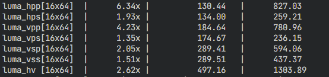
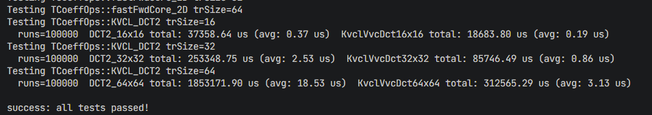

# 特性指南

## 环境部署

### 环境

硬件环境：

| 项目  | 说明    |
| ------------ | ------------ |
| CPU | 鲲鹏950处理器 |

软件环境：

| 软件  | 版本    |
| ------------ | ------------ |
| OS | openEuler 24.03 LTS SP4 |
| 编译器 | clang 19.0及以上版本 |
| make |  4.3及以上版本 |
| cmake | 3.10及以上版本 |

其他：

sve长度需设置为128，在服务器上可通过以下方式设置。

```bash
echo 16 > /proc/sys/abi/sve_default_vector_length
```

### 部署

获取KVCL二进制包，运行以下命令解压。

```bash
unzip BoostKit-boostmedia-kvcl_1.1.0.zip
```

解压后，包含以下两个目录即为部署成功。

```bash
├──include  #KVCL头文件目录
└──lib      #动态库和静态库路径
```

其中包含KVCL头文件、动态库和静态库。建议优先使用静态库。

### 软件包完整性校验

为了防止软件包在传递过程或存储期间被恶意篡改，获取软件包时需下载对应的SHA256文件用于完整性校验。

校验方法：

1. 下载软件包和对应的SHA256文件。

2. 校验软件包完整性。Linux执行命令如下：

    ```bash
    sha256sum <package>
    ```

    Windows执行命令如下：

    ```bash
    certutil -hashfile <package> SHA256
    ```

    命令执行完成后，输出校验值。

3. 对比计算的校验值和SHA256文件中的校验值是否一致。如果一致，则说明软件包未被篡改。如果不一致，则说明软件包完整性已被破坏，需要重新获取。

本文档以Aarch64机器和x265-4.1，vvenc-1.14作为环境举例，说明如何使能KVCL。

## x265使能kvcl优化

### 编译x265

1. 获取x265代码仓并解压。

    ```bash
    wget https://ftp.videolan.org/pub/videolan/x265/x265_4.1.tar.gz
    tar -zxf x265_4.1.tar.gz
    ```

2. 修改代码。

    由于需要修改编译配置、替换x265中的KVCL算子。
    本文档提供示例[patch](../../examples/x265_4.1-enable-kvcl.patch)，可直接合入x265_4.1。
    该patch通过setupKvclIntrinsicPrimitives和setupKvclAssemblyPrimitives覆盖x265_4.1算子。

    ```bash
    #KVCL_PATH表示KVCL代码仓的根目录，根据实际情况修改
    KVCL_PATH=/home/kvcl
    cd x265_4.1
    patch -p1 < $KVCL_PATH/examples/x265_4.1-enable-kvcl.patch
    ```

    KVCL在各环境中安装位置不同，所以合入patch后需要修正KVCL安装路径：
    在x265_4.1中打开source/CMakeLists.txt

    ```cmake
    #搜索kvcl lib path，找到下行
    link_directories(/home/kvcl/output/lib)   # kvcl lib path
    #将其中的/home/kvcl/output/lib修正为KVCL实际安装路径下的output/lib路径即可
    ```

3. 编译。

    用户需自行安装编译器，本文档以毕昇编译器BiShengCompiler-5.2.0.2-aarch64-linux.tar.gz为例，下载安装参考[《毕昇编译器安装指南》](https://www.hikunpeng.com/document/detail/zh/kunpengdevps/compilation/ug-bisheng/kunpengbisheng_06_0001.html)。

    1. 创建毕昇编译器安装目录（这里以/opt/compiler为例）。

        ```bash
        mkdir -p /opt/compiler
        ```

    2. 将毕昇编译器压缩包解压到安装目录下。

        ```bash
        tar -zxf BiShengCompiler-5.2.0.2-aarch64-linux.tar.gz -C /opt/compiler
        ```

    3. 配置毕昇编译器的环境变量。

        ```bash
        export PATH=/opt/compiler/BiShengCompiler-5.2.0.2-aarch64-linux/bin:$PATH
        export LD_LIBRARY_PATH=/opt/compiler/BiShengCompiler-5.2.0.2-aarch64-linux/lib:/opt/compiler/BiShengCompiler-5.2.0.2-aarch64-linux/lib/aarch64-unknown-linux-gnu:$LD_LIBRARY_PATH
        export CC=clang
        export CXX=clang++
        ```

    4. 验证安装是否成功。若返回结果已包含BiSheng compiler版本信息，说明安装成功。

        ```bash
        clang -v
        ```

    完成编译器安装后，编译x265，命令如下：

    ```bash
    # 创建build目录，由于build目录已存在，简单修改下目录名称
    mkdir mybuild
    cd mybuild

    # 按实际配置路径参数
    # X265_INSTALL_PATH：x265安装路径，根据实际情况修改
    # KVCL_INCLUDE_PATH：KVCL的编译结果目录下的include路径，根据实际情况修改
    X265_INSTALL_PATH=/home/x265_kvcl/install \
    KVCL_INCLUDE_PATH=/home/kvcl/output/include &&\
    cmake ../source \
    -DCMAKE_BUILD_TYPE=Release \
    -DENABLE_ASSEMBLY=ON \
    -DHIGH_BIT_DEPTH=OFF \
    -DCMAKE_VERBOSE_MAKEFILE=ON \
    -DENABLE_CLI=ON \
    -DENABLE_TESTS=ON \
    -DENABLE_SHARED=ON \
    -DCMAKE_C_FLAGS="-O3 -march=armv8.6-a+dotprod+i8mm+sve+sve2 -I$KVCL_INCLUDE_PATH" \
    -DCMAKE_CXX_FLAGS="-O3 -march=armv8.6-a+dotprod+i8mm+sve+sve2 -I$KVCL_INCLUDE_PATH" \
    -DCMAKE_INSTALL_PREFIX=$X265_INSTALL_PATH \
    -DENABLE_NEON=ON \
    -DCMAKE_C_COMPILER=$CC \
    -DCMAKE_CXX_COMPILER=$CXX \
    -DENABLE_NEON_DOTPROD=ON \
    -DENABLE_NEON_I8MM=ON \
    -DENABLE_SVE=ON \
    -DENABLE_SVE2=ON \
    -DENABLE_LIBNUMA=OFF \
    -DCMAKE_EXE_LINKER_FLAGS="-ldl"

    # 编译安装
    make -j8 && make install
    ```

编译通过后，x265中对应算子被替换为了KVCL实现。

### x265运行测试

运行算子测试程序TestBench。

```bash
# 在x265目录下
./mybuild/test/TestBench
```

本示例测试效果如下图所示。



## vvenc使能kvcl优化

### 编译vvenc

1. 获取vvenc-v1.14.0代码。

    ```bash
    git clone --branch v1.14.0 https://github.com/fraunhoferhhi/vvenc.git
    ```

2. 修改代码。

    由于需要修改编译配置、替换vvenc中的KVCL算子。
    本文档提供示例[patch](../../examples/vvenc_1.14.0-enable-kvcl.patch)，可直接合入vvenc。

    ```bash
    #KVCL_PATH表示KVCL代码仓的根目录，根据实际情况修改
    KVCL_PATH=/home/kvcl
    cd vvenc
    patch -p1 < $KVCL_PATH/examples/vvenc_1.14.0-enable-kvcl.patch
    ```

    KVCL在各环境中安装位置不同，所以合入patch后需要修正KVCL安装路径：

    1. 在vvenc中打开source/Lib/vvenc/CMakeLists.txt。

    2. 搜索/path/to/kvcl，找到下行。

        ```cmake
        set( KVCL_ROOT /path/to/kvcl )
        ```

    3. 将其中的/path/to/kvcl修正为包含include和lib子目录的KVCL实际安装路径，例如：

        ```cmake
        set( KVCL_ROOT /path/to/kvcl/output )
        ```

3. 编译。

    用户需自行安装编译器，本文档以毕昇编译器BiShengCompiler-5.2.0.2-aarch64-linux.tar.gz为例，下载安装参考[《毕昇编译器安装指南》](https://www.hikunpeng.com/document/detail/zh/kunpengdevps/compilation/ug-bisheng/kunpengbisheng_06_0001.html)。

    1. 创建毕昇编译器安装目录（这里以/opt/compiler为例）。

        ```bash
        mkdir -p /opt/compiler
        ```

    2. 将毕昇编译器压缩包解压到安装目录下。

        ```bash
        tar -zxf BiShengCompiler-5.2.0.2-aarch64-linux.tar.gz -C /opt/compiler
        ```

    3. 配置毕昇编译器的环境变量。

        ```bash
        export PATH=/opt/compiler/BiShengCompiler-5.2.0.2-aarch64-linux/bin:$PATH
        export LD_LIBRARY_PATH=/opt/compiler/BiShengCompiler-5.2.0.2-aarch64-linux/lib:/opt/compiler/BiShengCompiler-5.2.0.2-aarch64-linux/lib/aarch64-unknown-linux-gnu:$LD_LIBRARY_PATH
        export CC=clang
        export CXX=clang++
        ```

    4. 验证安装是否成功。若返回结果已包含BiSheng compiler版本信息，说明安装成功。

        ```bash
        clang -v
        ```

    完成编译器安装后，编译vvenc，命令如下：

    ```bash
    # 按实际配置路径参数
    cd vvenc
    cmake -S . -B build/release-static \
        -DCMAKE_BUILD_TYPE=Release \
        -DCMAKE_C_COMPILER=$CC \
        -DCMAKE_CXX_COMPILER=$CXX \
        -DVVENC_ENABLE_LINK_TIME_OPT=OFF \
        -DVVENC_ENABLE_KVCL=ON \
        -DVVENC_KVCL_PATH=/path/to/kvcl/output

    # 编译安装
    cmake --build build/release-static -j$(nproc)
    ```

编译通过后，vvenc中对应算子被替换为了KVCL实现。

### 运行测试

运行算子测试程序vvenc_unit_test。

```bash
cd vvenc
./bin/release-static/vvenc_unit_test --testcase TCoeffOps
```

本示例测试效果如下图所示。



## 修订记录

|文档版本|发布日期|修改说明|
|--|--|--|
|01|2026-09-30|第一次正式发布|
